# `diffusers\scripts\convert_hunyuan_video1_5_to_diffusers.py` 详细设计文档

这是一个将腾讯HunyuanVideo 1.5原始检查点转换为Diffusers格式的脚本，支持转换transformer、VAE、文本编码器（ByT5和Qwen2.5-VL）等组件，并可选择保存完整的推理pipeline。

## 整体流程

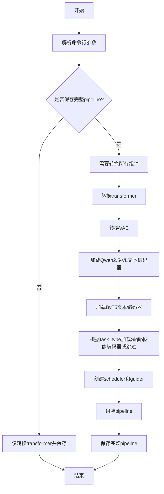

## 类结构

```
全局配置
├── TRANSFORMER_CONFIGS (transformer配置字典)
├── SCHEDULER_CONFIGS (调度器配置)
└── GUIDANCE_CONFIGS (引导配置)
转换函数
├── swap_scale_shift (辅助函数)
├── convert_hyvideo15_transformer_to_diffusers
├── convert_hunyuan_video_15_vae_checkpoint_to_diffusers
└── load_sharded_safetensors
加载函数
├── load_original_transformer_state_dict
├── load_original_vae_state_dict
├── convert_transformer
├── convert_vae
├── load_mllm
├── add_special_token
├── load_byt5
└── load_siglip
主程序
└── get_args + if __name__ == '__main__'
```

## 全局变量及字段


### `TRANSFORMER_CONFIGS`
    
存储HunyuanVideo 1.5不同transformer类型的配置字典，包含目标分辨率尺寸(target_size)和任务类型(task_type)等参数

类型：`dict[str, dict[str, int | str]]`
    


### `SCHEDULER_CONFIGS`
    
存储不同transformer类型对应的FlowMatchEulerDiscreteScheduler调度器配置，主要包含shift偏移参数用于控制噪声调度

类型：`dict[str, dict[str, float]]`
    


### `GUIDANCE_CONFIGS`
    
存储不同transformer类型对应的ClassifierFreeGuidance引导规模配置，用于控制无分类器引导的强度

类型：`dict[str, dict[str, float]]`
    


    

## 全局函数及方法


### `swap_scale_shift`

该函数用于在模型权重转换过程中交换张量的缩放(shift)和偏移(scale)维度顺序。原始 HunyuanVideo 1.5 模型的 `adaLN_modulation` 层将 scale 和 shift 存储在单个张量中，但 Diffusers 格式要求它们的顺序相反，因此该函数通过 chunk 和 cat 操作实现顺序交换。

参数：

- `weight`：`torch.Tensor`，原始 HunyuanVideo 1.5 模型的权重张量，通常是 `adaLN_modulation` 层的 scale 和 shift 拼接而成的张量，形状为 `[2 * hidden_size, ...]`

返回值：`torch.Tensor`，交换 scale 和 shift 顺序后的新权重张量，形状与输入相同，但维度 0 上的前一半和后一半内容互换

#### 流程图

```mermaid
flowchart TD
    A[开始: 输入 weight 张量] --> B[weight.chunk 2, dim=0]
    B --> C{按维度0均分}
    C --> D[shift = weight.chunk 0]
    C --> E[scale = weight.chunk 1]
    D --> F[torch.cat [scale, shift], dim=0]
    E --> F
    F --> G[返回 new_weight]
```

#### 带注释源码

```python
def swap_scale_shift(weight):
    """
    在权重转换时交换 scale 和 shift 的顺序。
    
    原始 HunyuanVideo 1.5 模型中，adaLN_modulation 层的权重存储顺序为 [shift, scale]，
    而 Diffusers 格式要求的顺序为 [scale, shift]，因此需要通过此函数进行交换。
    
    参数:
        weight: 包含 shift 和 scale 的权重张量，形状为 [2 * hidden_size, ...]
        
    返回:
        交换顺序后的权重张量，形状不变
    """
    # 将张量沿 dim=0 均分为两部分：前半部分为 shift，后半部分为 scale
    shift, scale = weight.chunk(2, dim=0)
    
    # 重新拼接：先放 scale，再放 shift，与原始顺序相反
    new_weight = torch.cat([scale, shift], dim=0)
    
    return new_weight
```

#### 使用场景

该函数在 `convert_hyvideo15_transformer_to_diffusers` 函数中被调用两次，用于转换 `final_layer.adaLN_modulation.1` 层的权重和偏置：

```python
converted_state_dict["norm_out.linear.weight"] = swap_scale_shift(
    original_state_dict.pop("final_layer.adaLN_modulation.1.weight")
)
converted_state_dict["norm_out.linear.bias"] = swap_scale_shift(
    original_state_dict.pop("final_layer.adaLN_modulation.1.bias")
)
```


### `convert_hyvideo15_transformer_to_diffusers`

该函数是HunyuanVideo 1.5模型转换流程中的核心组件，负责将腾讯HunyuanVideo 1.5原始检查点中的Transformer权重从其原生格式映射到Diffusers库支持的格式。函数通过逐层重命名状态字典键（state dict keys）并重新组织权重结构，实现包括时间嵌入、上下文嵌入器、图像嵌入器、Transformer块和输出层等全部30+个组件的权重转换，同时处理了QKV拆分、LayerNorm参数适配以及AdaLN调制参数的位置调整等关键转换逻辑。

参数：

- `original_state_dict`：`Dict[str, torch.Tensor]`，原始HunyuanVideo 1.5检查点的状态字典，包含以原生键名（如"time_in.mlp.0.weight"）存储的模型权重，函数将直接修改此字典（通过pop操作）
- `config`：可选的`HunyuanVideo15Transformer3DModel.config`或类似配置对象，用于获取模型配置参数（如`config.use_meanflow`），若为None则某些条件分支不会被执行

返回值：`Dict[str, torch.Tensor]`，转换后的Diffusers格式状态字典，键名已更改为Diffusers风格的命名规范（如"time_embed.timestep_embedder.linear_1.weight"），可直接用于加载到HunyuanVideo15Transformer3DModel

#### 流程图

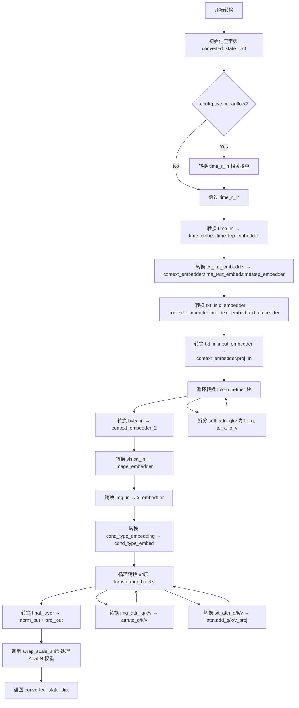

#### 带注释源码

```python
def convert_hyvideo15_transformer_to_diffusers(original_state_dict, config=None):
    """
    Convert HunyuanVideo 1.5 original checkpoint to Diffusers format.
    
    This function performs a comprehensive mapping of model weights from the 
    original HunyuanVideo 1.5 checkpoint format to the Diffusers library format.
    It handles the transformation of approximately 30+ different component types
    including embeddings, transformer blocks, attention layers, and MLPs.
    
    Args:
        original_state_dict (Dict[str, Tensor]): Original checkpoint state dict.
            Keys follow the original naming convention (e.g., "time_in.mlp.0.weight").
            This dict is modified in-place using pop() operations.
        config (optional): Configuration object containing model parameters.
            Currently used to check config.use_meanflow for conditional conversion.
    
    Returns:
        Dict[str, Tensor]: Converted state dict with Diffusers-style key names.
            Ready to be loaded into HunyuanVideo15Transformer3DModel.
    """
    # Initialize output dictionary to store converted weights
    converted_state_dict = {}

    # =========================================================================
    # Step 1: Time Embedding - Convert time_in to time_embed.timestep_embedder
    # =========================================================================
    # The original model uses "time_in.mlp.0.weight" (MLP with 2 layers: 0 and 2)
    # Diffusers expects "time_embed.timestep_embedder.linear_1.weight" (linear_1, linear_2)
    converted_state_dict["time_embed.timestep_embedder.linear_1.weight"] = original_state_dict.pop(
        "time_in.mlp.0.weight"
    )
    converted_state_dict["time_embed.timestep_embedder.linear_1.bias"] = original_state_dict.pop("time_in.mlp.0.bias")
    converted_state_dict["time_embed.timestep_embedder.linear_2.weight"] = original_state_dict.pop(
        "time_in.mlp.2.weight"
    )
    converted_state_dict["time_embed.timestep_embedder.linear_2.bias"] = original_state_dict.pop("time_in.mlp.2.bias")

    # Conditional conversion: Handle mean flow variant if present
    # This is used in specific model variants like "480p_i2v_step_distilled"
    if config and config.use_meanflow:
        # Additional time embedding for mean flow calculation
        converted_state_dict["time_embed.timestep_embedder_r.linear_1.weight"] = original_state_dict.pop(
            "time_r_in.mlp.0.weight"
        )
        converted_state_dict["time_embed.timestep_embedder_r.linear_1.bias"] = original_state_dict.pop(
            "time_r_in.mlp.0.bias"
        )
        converted_state_dict["time_embed.timestep_embedder_r.linear_2.weight"] = original_state_dict.pop(
            "time_r_in.mlp.2.weight"
        )
        converted_state_dict["time_embed.timestep_embedder_r.linear_2.bias"] = original_state_dict.pop(
            "time_r_in.mlp.2.bias"
        )

    # =========================================================================
    # Step 2: Context Embedder - Time Embedder (txt_in.t_embedder)
    # =========================================================================
    # Convert text encoder time embedding projection
    converted_state_dict["context_embedder.time_text_embed.timestep_embedder.linear_1.weight"] = (
        original_state_dict.pop("txt_in.t_embedder.mlp.0.weight")
    )
    converted_state_dict["context_embedder.time_text_embed.timestep_embedder.linear_1.bias"] = original_state_dict.pop(
        "txt_in.t_embedder.mlp.0.bias"
    )
    converted_state_dict["context_embedder.time_text_embed.timestep_embedder.linear_2.weight"] = (
        original_state_dict.pop("txt_in.t_embedder.mlp.2.weight")
    )
    converted_state_dict["context_embedder.time_text_embed.timestep_embedder.linear_2.bias"] = original_state_dict.pop(
        "txt_in.t_embedder.mlp.2.bias"
    )

    # =========================================================================
    # Step 3: Context Embedder - Text Embedder (txt_in.c_embedder)
    # =========================================================================
    # Convert text content embedding projection (2-layer MLP)
    converted_state_dict["context_embedder.time_text_embed.text_embedder.linear_1.weight"] = original_state_dict.pop(
        "txt_in.c_embedder.linear_1.weight"
    )
    converted_state_dict["context_embedder.time_text_embed.text_embedder.linear_1.bias"] = original_state_dict.pop(
        "txt_in.c_embedder.linear_1.bias"
    )
    converted_state_dict["context_embedder.time_text_embed.text_embedder.linear_2.weight"] = original_state_dict.pop(
        "txt_in.c_embedder.linear_2.weight"
    )
    converted_state_dict["context_embedder.time_text_embed.text_embedder.linear_2.bias"] = original_state_dict.pop(
        "txt_in.c_embedder.linear_2.bias"
    )

    # =========================================================================
    # Step 4: Input Projection Layer
    # =========================================================================
    # Project text embeddings to model's hidden dimension
    converted_state_dict["context_embedder.proj_in.weight"] = original_state_dict.pop("txt_in.input_embedder.weight")
    converted_state_dict["context_embedder.proj_in.bias"] = original_state_dict.pop("txt_in.input_embedder.bias")

    # =========================================================================
    # Step 5: Token Refiner Blocks (Individual Token Refiner)
    # =========================================================================
    # HunyuanVideo uses a token refinement module with 2 blocks for better 
    # text feature extraction. Each block contains self-attention and MLP.
    num_refiner_blocks = 2
    for i in range(num_refiner_blocks):
        block_prefix = f"context_embedder.token_refiner.refiner_blocks.{i}."
        orig_prefix = f"txt_in.individual_token_refiner.blocks.{i}."

        # Normalization layer 1
        converted_state_dict[f"{block_prefix}norm1.weight"] = original_state_dict.pop(f"{orig_prefix}norm1.weight")
        converted_state_dict[f"{block_prefix}norm1.bias"] = original_state_dict.pop(f"{orig_prefix}norm1.bias")

        # Split combined QKV weights into separate query, key, value projections
        # Original format: single "self_attn_qkv.weight" tensor [3*hidden, hidden]
        # Diffusers format: separate to_q, to_k, to_v weights
        qkv_weight = original_state_dict.pop(f"{orig_prefix}self_attn_qkv.weight")
        qkv_bias = original_state_dict.pop(f"{orig_prefix}self_attn_qkv.bias")
        # Split along first dimension into 3 equal parts: Q, K, V
        q, k, v = torch.chunk(qkv_weight, 3, dim=0)
        q_bias, k_bias, v_bias = torch.chunk(qkv_bias, 3, dim=0)

        # Assign split weights to separate attention projections
        converted_state_dict[f"{block_prefix}attn.to_q.weight"] = q
        converted_state_dict[f"{block_prefix}attn.to_q.bias"] = q_bias
        converted_state_dict[f"{block_prefix}attn.to_k.weight"] = k
        converted_state_dict[f"{block_prefix}attn.to_k.bias"] = k_bias
        converted_state_dict[f"{block_prefix}attn.to_v.weight"] = v
        converted_state_dict[f"{block_prefix}attn.to_v.bias"] = v_bias

        # Attention output projection: self_attn_proj -> to_out.0
        converted_state_dict[f"{block_prefix}attn.to_out.0.weight"] = original_state_dict.pop(
            f"{orig_prefix}self_attn_proj.weight"
        )
        converted_state_dict[f"{block_prefix}attn.to_out.0.bias"] = original_state_dict.pop(
            f"{orig_prefix}self_attn_proj.bias"
        )

        # Normalization layer 2
        converted_state_dict[f"{block_prefix}norm2.weight"] = original_state_dict.pop(f"{orig_prefix}norm2.weight")
        converted_state_dict[f"{block_prefix}norm2.bias"] = original_state_dict.pop(f"{orig_prefix}norm2.bias")

        # Feed-forward network: mlp.fc1 -> ff.net.0.proj, mlp.fc2 -> ff.net.2
        converted_state_dict[f"{block_prefix}ff.net.0.proj.weight"] = original_state_dict.pop(
            f"{orig_prefix}mlp.fc1.weight"
        )
        converted_state_dict[f"{block_prefix}ff.net.0.proj.bias"] = original_state_dict.pop(
            f"{orig_prefix}mlp.fc1.bias"
        )
        converted_state_dict[f"{block_prefix}ff.net.2.weight"] = original_state_dict.pop(
            f"{orig_prefix}mlp.fc2.weight"
        )
        converted_state_dict[f"{block_prefix}ff.net.2.bias"] = original_state_dict.pop(f"{orig_prefix}mlp.fc2.bias")

        # AdaLN modulation parameters: Move from index 1 (skip scale factor at index 0)
        converted_state_dict[f"{block_prefix}norm_out.linear.weight"] = original_state_dict.pop(
            f"{orig_prefix}adaLN_modulation.1.weight"
        )
        converted_state_dict[f"{block_prefix}norm_out.linear.bias"] = original_state_dict.pop(
            f"{orig_prefix}adaLN_modulation.1.bias"
        )

    # =========================================================================
    # Step 6: BYT5 Input Adapter (context_embedder_2)
    # =========================================================================
    # Additional context encoder for BYT5 text features (Glyph-SDXL-v2)
    converted_state_dict["context_embedder_2.norm.weight"] = original_state_dict.pop("byt5_in.layernorm.weight")
    converted_state_dict["context_embedder_2.norm.bias"] = original_state_dict.pop("byt5_in.layernorm.bias")
    converted_state_dict["context_embedder_2.linear_1.weight"] = original_state_dict.pop("byt5_in.fc1.weight")
    converted_state_dict["context_embedder_2.linear_1.bias"] = original_state_dict.pop("byt5_in.fc1.bias")
    converted_state_dict["context_embedder_2.linear_2.weight"] = original_state_dict.pop("byt5_in.fc2.weight")
    converted_state_dict["context_embedder_2.linear_2.bias"] = original_state_dict.pop("byt5_in.fc2.bias")
    converted_state_dict["context_embedder_2.linear_3.weight"] = original_state_dict.pop("byt5_in.fc3.weight")
    converted_state_dict["context_embedder_2.linear_3.bias"] = original_state_dict.pop("byt5_in.fc3.bias")

    # =========================================================================
    # Step 7: Vision/Image Embedder (from vision_in)
    # =========================================================================
    # Encode input images for image-to-video tasks using vision encoder
    converted_state_dict["image_embedder.norm_in.weight"] = original_state_dict.pop("vision_in.proj.0.weight")
    converted_state_dict["image_embedder.norm_in.bias"] = original_state_dict.pop("vision_in.proj.0.bias")
    converted_state_dict["image_embedder.linear_1.weight"] = original_state_dict.pop("vision_in.proj.1.weight")
    converted_state_dict["image_embedder.linear_1.bias"] = original_state_dict.pop("vision_in.proj.1.bias")
    converted_state_dict["image_embedder.linear_2.weight"] = original_state_dict.pop("vision_in.proj.3.weight")
    converted_state_dict["image_embedder.linear_2.bias"] = original_state_dict.pop("vision_in.proj.3.bias")
    converted_state_dict["image_embedder.norm_out.weight"] = original_state_dict.pop("vision_in.proj.4.weight")
    converted_state_dict["image_embedder.norm_out.bias"] = original_state_dict.pop("vision_in.proj.4.bias")

    # =========================================================================
    # Step 8: Latent Patch Embedder (img_in)
    # =========================================================================
    # Convert latent video patches to hidden representations
    converted_state_dict["x_embedder.proj.weight"] = original_state_dict.pop("img_in.proj.weight")
    converted_state_dict["x_embedder.proj.bias"] = original_state_dict.pop("img_in.proj.bias")

    # =========================================================================
    # Step 9: Condition Type Embedding
    # =========================================================================
    # Embedding for condition type (text vs image conditions)
    converted_state_dict["cond_type_embed.weight"] = original_state_dict.pop("cond_type_embedding.weight")

    # =========================================================================
    # Step 10: Main Transformer Blocks (double_blocks -> transformer_blocks)
    # =========================================================================
    # Core processing: 54 layers of transformer blocks with dual attention
    # Each block has: image attention, text attention, and separate MLPs
    num_layers = 54
    for i in range(num_layers):
        block_prefix = f"transformer_blocks.{i}."
        orig_prefix = f"double_blocks.{i}."

        # Image modulation: norm1 (img_mod in original)
        converted_state_dict[f"{block_prefix}norm1.linear.weight"] = original_state_dict.pop(
            f"{orig_prefix}img_mod.linear.weight"
        )
        converted_state_dict[f"{block_prefix}norm1.linear.bias"] = original_state_dict.pop(
            f"{orig_prefix}img_mod.linear.bias"
        )

        # Text modulation: norm1_context (txt_mod in original)
        converted_state_dict[f"{block_prefix}norm1_context.linear.weight"] = original_state_dict.pop(
            f"{orig_prefix}txt_mod.linear.weight"
        )
        converted_state_dict[f"{block_prefix}norm1_context.linear.bias"] = original_state_dict.pop(
            f"{orig_prefix}txt_mod.linear.bias"
        )

        # ----- Image Attention -----
        # Original uses separate q, k, v weights; Diffusers uses combined to_q/k/v
        converted_state_dict[f"{block_prefix}attn.to_q.weight"] = original_state_dict.pop(
            f"{orig_prefix}img_attn_q.weight"
        )
        converted_state_dict[f"{block_prefix}attn.to_q.bias"] = original_state_dict.pop(
            f"{orig_prefix}img_attn_q.bias"
        )
        converted_state_dict[f"{block_prefix}attn.to_k.weight"] = original_state_dict.pop(
            f"{orig_prefix}img_attn_k.weight"
        )
        converted_state_dict[f"{block_prefix}attn.to_k.bias"] = original_state_dict.pop(
            f"{orig_prefix}img_attn_k.bias"
        )
        converted_state_dict[f"{block_prefix}attn.to_v.weight"] = original_state_dict.pop(
            f"{orig_prefix}img_attn_v.weight"
        )
        converted_state_dict[f"{block_prefix}attn.to_v.bias"] = original_state_dict.pop(
            f"{orig_prefix}img_attn_v.bias"
        )

        # Image attention QK normalization
        converted_state_dict[f"{block_prefix}attn.norm_q.weight"] = original_state_dict.pop(
            f"{orig_prefix}img_attn_q_norm.weight"
        )
        converted_state_dict[f"{block_prefix}attn.norm_k.weight"] = original_state_dict.pop(
            f"{orig_prefix}img_attn_k_norm.weight"
        )

        # Image attention output projection
        converted_state_dict[f"{block_prefix}attn.to_out.0.weight"] = original_state_dict.pop(
            f"{orig_prefix}img_attn_proj.weight"
        )
        converted_state_dict[f"{block_prefix}attn.to_out.0.bias"] = original_state_dict.pop(
            f"{orig_prefix}img_attn_proj.bias"
        )

        # ----- Text Attention -----
        # Text attention uses additive (cross) attention pattern
        # add_q/k/v_proj: for cross-attending to text embeddings
        converted_state_dict[f"{block_prefix}attn.add_q_proj.weight"] = original_state_dict.pop(
            f"{orig_prefix}txt_attn_q.weight"
        )
        converted_state_dict[f"{block_prefix}attn.add_q_proj.bias"] = original_state_dict.pop(
            f"{orig_prefix}txt_attn_q.bias"
        )
        converted_state_dict[f"{block_prefix}attn.add_k_proj.weight"] = original_state_dict.pop(
            f"{orig_prefix}txt_attn_k.weight"
        )
        converted_state_dict[f"{block_prefix}attn.add_k_proj.bias"] = original_state_dict.pop(
            f"{orig_prefix}txt_attn_k.bias"
        )
        converted_state_dict[f"{block_prefix}attn.add_v_proj.weight"] = original_state_dict.pop(
            f"{orig_prefix}txt_attn_v.weight"
        )
        converted_state_dict[f"{block_prefix}attn.add_v_proj.bias"] = original_state_dict.pop(
            f"{orig_prefix}txt_attn_v.bias"
        )

        # Text attention QK normalization
        converted_state_dict[f"{block_prefix}attn.norm_added_q.weight"] = original_state_dict.pop(
            f"{orig_prefix}txt_attn_q_norm.weight"
        )
        converted_state_dict[f"{block_prefix}attn.norm_added_k.weight"] = original_state_dict.pop(
            f"{orig_prefix}txt_attn_k_norm.weight"
        )

        # Text attention output projection
        converted_state_dict[f"{block_prefix}attn.to_add_out.weight"] = original_state_dict.pop(
            f"{orig_prefix}txt_attn_proj.weight"
        )
        converted_state_dict[f"{block_prefix}attn.to_add_out.bias"] = original_state_dict.pop(
            f"{orig_prefix}txt_attn_proj.bias"
        )

        # Note: norm2 and norm1_context are skipped because they have no weights
        # in the original model (LayerNorm with elementwise_affine=False)

        # ----- Feed-Forward Networks -----
        # Image MLP: img_mlp.fc1 -> ff.net.0.proj, img_mlp.fc2 -> ff.net.2
        converted_state_dict[f"{block_prefix}ff.net.0.proj.weight"] = original_state_dict.pop(
            f"{orig_prefix}img_mlp.fc1.weight"
        )
        converted_state_dict[f"{block_prefix}ff.net.0.proj.bias"] = original_state_dict.pop(
            f"{orig_prefix}img_mlp.fc1.bias"
        )
        converted_state_dict[f"{block_prefix}ff.net.2.weight"] = original_state_dict.pop(
            f"{orig_prefix}img_mlp.fc2.weight"
        )
        converted_state_dict[f"{block_prefix}ff.net.2.bias"] = original_state_dict.pop(
            f"{orig_prefix}img_mlp.fc2.bias"
        )

        # Text MLP: txt_mlp -> ff_context
        converted_state_dict[f"{block_prefix}ff_context.net.0.proj.weight"] = original_state_dict.pop(
            f"{orig_prefix}txt_mlp.fc1.weight"
        )
        converted_state_dict[f"{block_prefix}ff_context.net.0.proj.bias"] = original_state_dict.pop(
            f"{orig_prefix}txt_mlp.fc1.bias"
        )
        converted_state_dict[f"{block_prefix}ff_context.net.2.weight"] = original_state_dict.pop(
            f"{orig_prefix}txt_mlp.fc2.weight"
        )
        converted_state_dict[f"{block_prefix}ff_context.net.2.bias"] = original_state_dict.pop(
            f"{orig_prefix}txt_mlp.fc2.bias"
        )

    # =========================================================================
    # Step 11: Output Layer (final_layer -> norm_out + proj_out)
    # =========================================================================
    # Final layer normalization and projection to output space
    # Note: swap_scale_shift is applied to swap the order of scale and shift
    # parameters in the AdaLN modulation layer
    converted_state_dict["norm_out.linear.weight"] = swap_scale_shift(
        original_state_dict.pop("final_layer.adaLN_modulation.1.weight")
    )
    converted_state_dict["norm_out.linear.bias"] = swap_scale_shift(
        original_state_dict.pop("final_layer.adaLN_modulation.1.bias")
    )
    converted_state_dict["proj_out.weight"] = original_state_dict.pop("final_layer.linear.weight")
    converted_state_dict["proj_out.bias"] = original_state_dict.pop("final_layer.linear.bias")

    return converted_state_dict
```


### `convert_hunyuan_video_15_vae_checkpoint_to_diffusers`

将腾讯HunyuanVideo 1.5模型的VAE检查点从原始格式转换为Diffusers格式。该函数通过重新映射原始模型的状态字典键名，将encoder和decoder的各个组件（卷积层、ResNet块、注意力块、归一化层等）适配到Diffusers库的标准结构中。

参数：

- `original_state_dict`：`Dict[str, torch.Tensor]`（实际为`dict`），原始HunyuanVideo 1.5 VAE模型的状态字典，包含以"encoder."和"decoder."为前缀的权重参数
- `block_out_channels`：`List[int]`，可选，默认为`[128, 256, 512, 1024, 1024]`，VAE各层的输出通道数列表
- `layers_per_block`：`int`，可选，默认为2，每个下采样/上采样块中的ResNet层数量

返回值：`Dict[str, torch.Tensor]`，转换后的Diffusers格式状态字典，键名已按照Diffusers的AutoencoderKL结构进行重新映射

#### 流程图

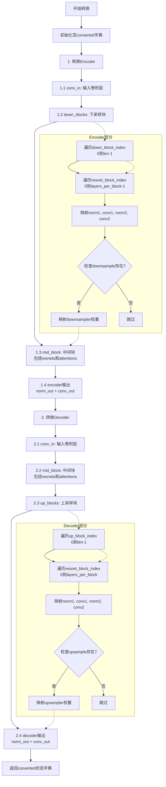

#### 带注释源码

```python
def convert_hunyuan_video_15_vae_checkpoint_to_diffusers(
    original_state_dict,  # 原始模型状态字典（dict类型）
    block_out_channels=[128, 256, 512, 1024, 1024],  # VAE各层通道数配置
    layers_per_block=2  # 每个块的ResNet层数
):
    """
    将HunyuanVideo 1.5的VAE检查点从原始格式转换为Diffusers格式
    
    该函数处理encoder和decoder两大部分:
    - Encoder: conv_in -> down_blocks -> mid_block -> norm_out/conv_out
    - Decoder: conv_in -> mid_block -> up_blocks -> norm_out/conv_out
    
    参数:
        original_state_dict: 原始模型状态字典
        block_out_channels: 各层输出通道数列表，默认为[128, 256, 512, 1024, 1024]
        layers_per_block: 每块的ResNet层数，默认为2
    
    返回:
        转换后的状态字典
    """
    converted = {}  # 初始化转换后的状态字典

    # =========================================================================
    # 1. Encoder部分转换
    # =========================================================================
    
    # 1.1 conv_in: Encoder的输入卷积层
    # 将原始的"encoder.conv_in.conv.weight"映射到Diffusers格式
    converted["encoder.conv_in.conv.weight"] = original_state_dict.pop("encoder.conv_in.conv.weight")
    converted["encoder.conv_in.conv.bias"] = original_state_dict.pop("encoder.conv_in.conv.bias")

    # 1.2 Down blocks: Encoder的下采样块
    # 遍历每个下采样层级 (0 to 4，共5个层级)
    for down_block_index in range(len(block_out_channels)):  # 0 to 4
        # 遍历每个ResNet块
        for resnet_block_index in range(layers_per_block):  # 0 to 1
            # 映射ResNet块的norm1参数 (GroupNorm的gamma参数)
            converted[f"encoder.down_blocks.{down_block_index}.resnets.{resnet_block_index}.norm1.gamma"] = (
                original_state_dict.pop(f"encoder.down.{down_block_index}.block.{resnet_block_index}.norm1.gamma")
            )
            # 映射conv1参数
            converted[f"encoder.down_blocks.{down_block_index}.resnets.{resnet_block_index}.conv1.conv.weight"] = (
                original_state_dict.pop(
                    f"encoder.down.{down_block_index}.block.{resnet_block_index}.conv1.conv.weight"
                )
            )
            converted[f"encoder.down_blocks.{down_block_index}.resnets.{resnet_block_index}.conv1.conv.bias"] = (
                original_state_dict.pop(f"encoder.down.{down_block_index}.block.{resnet_block_index}.conv1.conv.bias")
            )
            # 映射norm2参数
            converted[f"encoder.down_blocks.{down_block_index}.resnets.{resnet_block_index}.norm2.gamma"] = (
                original_state_dict.pop(f"encoder.down.{down_block_index}.block.{resnet_block_index}.norm2.gamma")
            )
            # 映射conv2参数
            converted[f"encoder.down_blocks.{down_block_index}.resnets.{resnet_block_index}.conv2.conv.weight"] = (
                original_state_dict.pop(
                    f"encoder.down.{down_block_index}.block.{resnet_block_index}.conv2.conv.weight"
                )
            )
            converted[f"encoder.down_blocks.{down_block_index}.resnets.{resnet_block_index}.conv2.conv.bias"] = (
                original_state_dict.pop(f"encoder.down.{down_block_index}.block.{resnet_block_index}.conv2.conv.bias")
            )

        # Downsample: 下采样层（如果存在）
        # 只有非最底层才有下采样层
        if f"encoder.down.{down_block_index}.downsample.conv.conv.weight" in original_state_dict:
            converted[f"encoder.down_blocks.{down_block_index}.downsamplers.0.conv.conv.weight"] = (
                original_state_dict.pop(f"encoder.down.{down_block_index}.downsample.conv.conv.weight")
            )
            converted[f"encoder.down_blocks.{down_block_index}.downsamplers.0.conv.conv.bias"] = (
                original_state_dict.pop(f"encoder.down.{down_block_index}.downsample.conv.conv.bias")
            )

    # 1.3 Mid block: Encoder的中间块（包含两个ResNet和一个Attention）
    # 处理block_1 (第一个ResNet块)
    converted["encoder.mid_block.resnets.0.norm1.gamma"] = original_state_dict.pop("encoder.mid.block_1.norm1.gamma")
    converted["encoder.mid_block.resnets.0.conv1.conv.weight"] = original_state_dict.pop(
        "encoder.mid.block_1.conv1.conv.weight"
    )
    converted["encoder.mid_block.resnets.0.conv1.conv.bias"] = original_state_dict.pop(
        "encoder.mid.block_1.conv1.conv.bias"
    )
    converted["encoder.mid_block.resnets.0.norm2.gamma"] = original_state_dict.pop("encoder.mid.block_1.norm2.gamma")
    converted["encoder.mid_block.resnets.0.conv2.conv.weight"] = original_state_dict.pop(
        "encoder.mid.block_1.conv2.conv.weight"
    )
    converted["encoder.mid_block.resnets.0.conv2.conv.bias"] = original_state_dict.pop(
        "encoder.mid.block_1.conv2.conv.bias"
    )

    # 处理block_2 (第二个ResNet块)
    converted["encoder.mid_block.resnets.1.norm1.gamma"] = original_state_dict.pop("encoder.mid.block_2.norm1.gamma")
    converted["encoder.mid_block.resnets.1.conv1.conv.weight"] = original_state_dict.pop(
        "encoder.mid.block_2.conv1.conv.weight"
    )
    converted["encoder.mid_block.resnets.1.conv1.conv.bias"] = original_state_dict.pop(
        "encoder.mid.block_2.conv1.conv.bias"
    )
    converted["encoder.mid_block.resnets.1.norm2.gamma"] = original_state_dict.pop("encoder.mid.block_2.norm2.gamma")
    converted["encoder.mid_block.resnets.1.conv2.conv.weight"] = original_state_dict.pop(
        "encoder.mid.block_2.conv2.conv.weight"
    )
    converted["encoder.mid_block.resnets.1.conv2.conv.bias"] = original_state_dict.pop(
        "encoder.mid.block_2.conv2.conv.bias"
    )

    # 处理Mid block的Attention层
    converted["encoder.mid_block.attentions.0.norm.gamma"] = original_state_dict.pop("encoder.mid.attn_1.norm.gamma")
    # 将原始的q,k,v投影分开映射
    converted["encoder.mid_block.attentions.0.to_q.weight"] = original_state_dict.pop("encoder.mid.attn_1.q.weight")
    converted["encoder.mid_block.attentions.0.to_q.bias"] = original_state_dict.pop("encoder.mid.attn_1.q.bias")
    converted["encoder.mid_block.attentions.0.to_k.weight"] = original_state_dict.pop("encoder.mid.attn_1.k.weight")
    converted["encoder.mid_block.attentions.0.to_k.bias"] = original_state_dict.pop("encoder.mid.attn_1.k.bias")
    converted["encoder.mid_block.attentions.0.to_v.weight"] = original_state_dict.pop("encoder.mid.attn_1.v.weight")
    converted["encoder.mid_block.attentions.0.to_v.bias"] = original_state_dict.pop("encoder.mid.attn_1.v.bias")
    converted["encoder.mid_block.attentions.0.proj_out.weight"] = original_state_dict.pop(
        "encoder.mid.attn_1.proj_out.weight"
    )
    converted["encoder.mid_block.attentions.0.proj_out.bias"] = original_state_dict.pop(
        "encoder.mid.attn_1.proj_out.bias"
    )

    # 1.4 Encoder输出层
    converted["encoder.norm_out.gamma"] = original_state_dict.pop("encoder.norm_out.gamma")
    converted["encoder.conv_out.conv.weight"] = original_state_dict.pop("encoder.conv_out.conv.weight")
    converted["encoder.conv_out.conv.bias"] = original_state_dict.pop("encoder.conv_out.conv.bias")

    # =========================================================================
    # 2. Decoder部分转换
    # =========================================================================
    
    # 2.1 conv_in: Decoder的输入卷积层
    converted["decoder.conv_in.conv.weight"] = original_state_dict.pop("decoder.conv_in.conv.weight")
    converted["decoder.conv_in.conv.bias"] = original_state_dict.pop("decoder.conv_in.conv.bias")

    # 2.2 Mid block: Decoder的中间块（与Encoder结构相同）
    # 处理block_1
    converted["decoder.mid_block.resnets.0.norm1.gamma"] = original_state_dict.pop("decoder.mid.block_1.norm1.gamma")
    converted["decoder.mid_block.resnets.0.conv1.conv.weight"] = original_state_dict.pop(
        "decoder.mid.block_1.conv1.conv.weight"
    )
    converted["decoder.mid_block.resnets.0.conv1.conv.bias"] = original_state_dict.pop(
        "decoder.mid.block_1.conv1.conv.bias"
    )
    converted["decoder.mid_block.resnets.0.norm2.gamma"] = original_state_dict.pop("decoder.mid.block_1.norm2.gamma")
    converted["decoder.mid_block.resnets.0.conv2.conv.weight"] = original_state_dict.pop(
        "decoder.mid.block_1.conv2.conv.weight"
    )
    converted["decoder.mid_block.resnets.0.conv2.conv.bias"] = original_state_dict.pop(
        "decoder.mid.block_1.conv2.conv.bias"
    )

    # 处理block_2
    converted["decoder.mid_block.resnets.1.norm1.gamma"] = original_state_dict.pop("decoder.mid.block_2.norm1.gamma")
    converted["decoder.mid_block.resnets.1.conv1.conv.weight"] = original_state_dict.pop(
        "decoder.mid.block_2.conv1.conv.weight"
    )
    converted["decoder.mid_block.resnets.1.conv1.conv.bias"] = original_state_dict.pop(
        "decoder.mid.block_2.conv1.conv.bias"
    )
    converted["decoder.mid_block.resnets.1.norm2.gamma"] = original_state_dict.pop("decoder.mid.block_2.norm2.gamma")
    converted["decoder.mid_block.resnets.1.conv2.conv.weight"] = original_state_dict.pop(
        "decoder.mid.block_2.conv2.conv.weight"
    )
    converted["decoder.mid_block.resnets.1.conv2.conv.bias"] = original_state_dict.pop(
        "decoder.mid.block_2.conv2.conv.bias"
    )

    # 处理Decoder的Attention层
    converted["decoder.mid_block.attentions.0.norm.gamma"] = original_state_dict.pop("decoder.mid.attn_1.norm.gamma")
    converted["decoder.mid_block.attentions.0.to_q.weight"] = original_state_dict.pop("decoder.mid.attn_1.q.weight")
    converted["decoder.mid_block.attentions.0.to_q.bias"] = original_state_dict.pop("decoder.mid.attn_1.q.bias")
    converted["decoder.mid_block.attentions.0.to_k.weight"] = original_state_dict.pop("decoder.mid.attn_1.k.weight")
    converted["decoder.mid_block.attentions.0.to_k.bias"] = original_state_dict.pop("decoder.mid.attn_1.k.bias")
    converted["decoder.mid_block.attentions.0.to_v.weight"] = original_state_dict.pop("decoder.mid.attn_1.v.weight")
    converted["decoder.mid_block.attentions.0.to_v.bias"] = original_state_dict.pop("decoder.mid.attn_1.v.bias")
    converted["decoder.mid_block.attentions.0.proj_out.weight"] = original_state_dict.pop(
        "decoder.mid.attn_1.proj_out.weight"
    )
    converted["decoder.mid_block.attentions.0.proj_out.bias"] = original_state_dict.pop(
        "decoder.mid.attn_1.proj_out.bias"
    )

    # 2.3 Up blocks: Decoder的上采样块
    # Decoder有5个上采样层级，每层有layers_per_block+1=3个ResNet块
    for up_block_index in range(len(block_out_channels)):  # 0 to 4
        # 遍历每个ResNet块（Decoder每层有3个ResNet块）
        for resnet_block_index in range(layers_per_block + 1):  # 0 to 2
            # 映射norm1参数
            converted[f"decoder.up_blocks.{up_block_index}.resnets.{resnet_block_index}.norm1.gamma"] = (
                original_state_dict.pop(f"decoder.up.{up_block_index}.block.{resnet_block_index}.norm1.gamma")
            )
            # 映射conv1参数
            converted[f"decoder.up_blocks.{up_block_index}.resnets.{resnet_block_index}.conv1.conv.weight"] = (
                original_state_dict.pop(f"decoder.up.{up_block_index}.block.{resnet_block_index}.conv1.conv.weight")
            )
            converted[f"decoder.up_blocks.{up_block_index}.resnets.{resnet_block_index}.conv1.conv.bias"] = (
                original_state_dict.pop(f"decoder.up.{up_block_index}.block.{resnet_block_index}.conv1.conv.bias")
            )
            # 映射norm2参数
            converted[f"decoder.up_blocks.{up_block_index}.resnets.{resnet_block_index}.norm2.gamma"] = (
                original_state_dict.pop(f"decoder.up.{up_block_index}.block.{resnet_block_index}.norm2.gamma")
            )
            # 映射conv2参数
            converted[f"decoder.up_blocks.{up_block_index}.resnets.{resnet_block_index}.conv2.conv.weight"] = (
                original_state_dict.pop(f"decoder.up.{up_block_index}.block.{resnet_block_index}.conv2.conv.weight")
            )
            converted[f"decoder.up_blocks.{up_block_index}.resnets.{resnet_block_index}.conv2.conv.bias"] = (
                original_state_dict.pop(f"decoder.up.{up_block_index}.block.{resnet_block_index}.conv2.conv.bias")
            )

        # Upsample: 上采样层（如果存在）
        if f"decoder.up.{up_block_index}.upsample.conv.conv.weight" in original_state_dict:
            converted[f"decoder.up_blocks.{up_block_index}.upsamplers.0.conv.conv.weight"] = original_state_dict.pop(
                f"decoder.up.{up_block_index}.upsample.conv.conv.weight"
            )
            converted[f"decoder.up_blocks.{up_block_index}.upsamplers.0.conv.conv.bias"] = original_state_dict.pop(
                f"decoder.up.{up_block_index}.upsample.conv.conv.bias"
            )

    # 2.4 Decoder输出层
    converted["decoder.norm_out.gamma"] = original_state_dict.pop("decoder.norm_out.gamma")
    converted["decoder.conv_out.conv.weight"] = original_state_dict.pop("decoder.conv_out.conv.weight")
    converted["decoder.conv_out.conv.bias"] = original_state_dict.pop("decoder.conv_out.conv.bias")

    # 返回转换后的状态字典
    return converted
```


### `load_sharded_safetensors`

该函数用于从指定目录中加载所有分片的 safetensors 模型权重文件，并将它们合并为一个统一的状态字典。

参数：

- `dir`：`pathlib.Path`，包含分片 safetensors 文件的目录路径

返回值：`dict`，返回合并后的模型状态字典（键为参数名称，值为张量）

#### 流程图

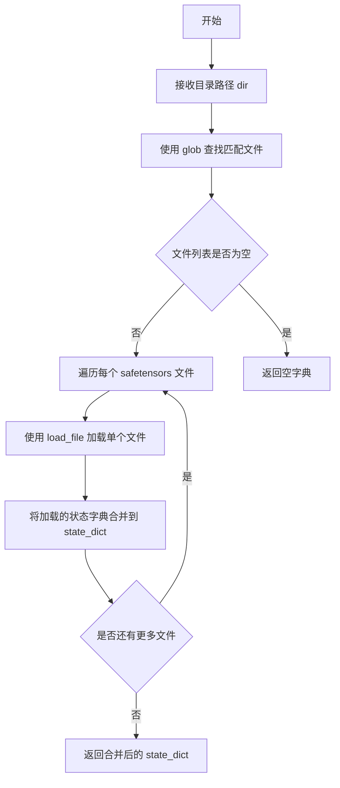

#### 带注释源码

```python
def load_sharded_safetensors(dir: pathlib.Path):
    """
    Load sharded safetensors files from a directory and merge them into a single state dict.
    
    Args:
        dir (pathlib.Path): Directory containing sharded safetensors files (e.g., diffusion_pytorch_model-00001-of-00005.safetensors)
    
    Returns:
        dict: Merged state dictionary with model weights
    """
    # 使用 glob 模式查找所有匹配的分片 safetensors 文件
    # 匹配格式如: diffusion_pytorch_model-00001-of-00002.safetensors
    file_paths = list(dir.glob("diffusion_pytorch_model*.safetensors"))
    
    # 初始化空的状态字典
    state_dict = {}
    
    # 遍历每个分片文件并加载
    for path in file_paths:
        # 使用 safetensors.torch.load_file 加载单个文件
        # 该函数返回一个字典，包含该分片的所有权重
        state_dict.update(load_file(path))
    
    # 返回合并后的完整状态字典
    return state_dict
```


### `load_original_transformer_state_dict`

该函数是 HunyuanVideo 1.5 模型转换流程中的关键数据加载模块。它的核心作用是根据传入的参数（远程仓库 ID 或本地文件夹路径），定位并加载原始 Transformer 模型的分片 SafeTensors 权重文件，并将其合并为一个完整的状态字典（State Dictionary）返回给后续的转换逻辑使用。

参数：

-  `args`：`argparse.Namespace`，包含模型来源和类型配置的参数对象。具体包含：
    -  `original_state_dict_repo_id` (`str | None`)：HuggingFace Hub 上的模型仓库 ID。
    -  `original_state_dict_folder` (`str | None`)：本地模型文件夹的路径。
    -  `transformer_type` (`str`)：具体的 Transformer 配置类型（如 "480p_t2v", "720p_i2v" 等）。

返回值：`Dict[str, torch.Tensor]`，返回一个字典，键为模型参数的名称，值为对应的 PyTorch 张量（Tensor）。

#### 流程图

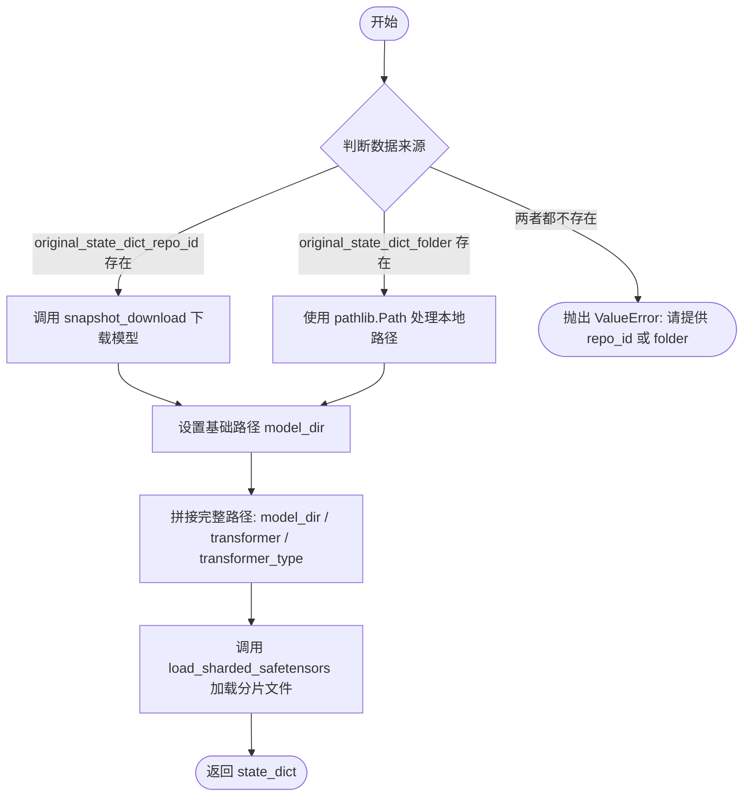

#### 带注释源码

```python
def load_original_transformer_state_dict(args):
    """
    加载原始 HunyuanVideo Transformer 的 state_dict。

    参数:
        args: 包含 original_state_dict_repo_id, original_state_dict_folder, 
             transformer_type 等属性的配置对象。

    返回:
        包含模型权重的字典 (Dict[str, torch.Tensor])。
    """
    # 1. 确定模型来源：优先使用远程仓库 ID，其次使用本地文件夹
    if args.original_state_dict_repo_id is not None:
        # 从 HuggingFace Hub 下载指定类型的 Transformer 模型
        # allow_patterns 限制只下载对应 transformer_type (如 480p_t2v) 的文件
        model_dir = snapshot_download(
            args.original_state_dict_repo_id,
            repo_type="model",
            allow_patterns="transformer/" + args.transformer_type + "/*",
        )
    elif args.original_state_dict_folder is not None:
        # 直接使用本地文件系统路径
        model_dir = pathlib.Path(args.original_state_dict_folder)
    else:
        # 参数校验：如果既没有远程仓库也没有本地路径，则报错
        raise ValueError("Please provide either `original_state_dict_repo_id` or `original_state_dict_folder`")
    
    # 2. 标准化路径对象，确保后续路径拼接一致
    model_dir = pathlib.Path(model_dir)
    
    # 3. 拼接最终的模型子目录路径
    # 原始权重通常存储在根目录下的 transformer/{type}/ 子目录中
    model_dir = model_dir / "transformer" / args.transformer_type
    
    # 4. 加载并合并分片的 safetensors 文件
    # 该函数会扫描目录下的所有 diffusion_pytorch_model*.safetensors 文件并合并
    return load_sharded_safetensors(model_dir)
```


### `load_original_vae_state_dict`

该函数负责加载原始的 VAE（变分自编码器）模型权重。它支持两种数据源：一是从 HuggingFace Hub 下载，二是从本地文件夹读取，并最终将其解析为 PyTorch 的状态字典格式返回。

参数：

-  `args`：`argparse.Namespace`，命令行参数对象。必须提供以下属性之一：
    - `original_state_dict_repo_id` (`str`): HuggingFace Hub 上的仓库 ID。
    - `original_state_dict_folder` (`str`): 本地模型文件夹的路径。

返回值：`Dict[str, torch.Tensor]`，返回包含原始 VAE 模型权重（键为字符串，值为张量）的字典。

#### 流程图

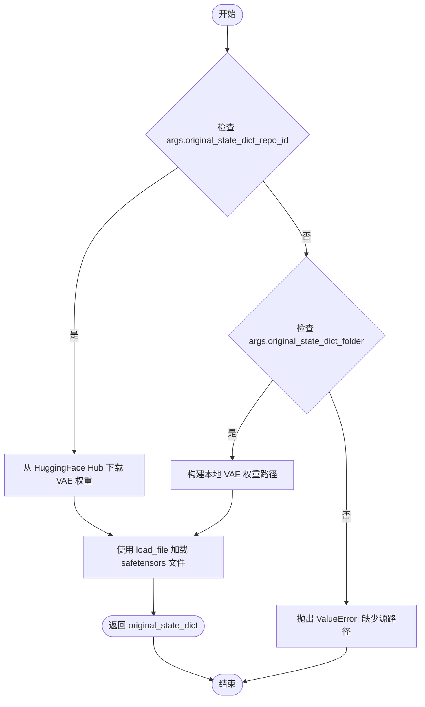

#### 带注释源码

```python
def load_original_vae_state_dict(args):
    """
    Load the original VAE state dictionary from HuggingFace Hub or local folder.

    Returns:
        Dict[str, torch.Tensor]: The state dictionary containing VAE weights.
    """
    # 1. 确定检查点路径 (Checkpoint Path)
    # 优先使用 HuggingFace Hub 仓库 ID 进行下载
    if args.original_state_dict_repo_id is not None:
        # 使用 hf_hub_download 从指定仓库下载 VAE 的 safetensors 文件
        # 文件名固定为 vae/diffusion_pytorch_model.safetensors
        ckpt_path = hf_hub_download(
            repo_id=args.original_state_dict_repo_id, 
            filename="vae/diffusion_pytorch_model.safetensors"
        )
    # 如果没有提供仓库 ID，则尝试从本地文件夹加载
    elif args.original_state_dict_folder is not None:
        # 将字符串路径转换为 pathlib.Path 对象
        model_dir = pathlib.Path(args.original_state_dict_folder)
        # 拼接本地 VAE 权重文件路径
        ckpt_path = model_dir / "vae/diffusion_pytorch_model.safetensors"
    else:
        # 如果两者都未提供，抛出错误
        raise ValueError("Please provide either `original_state_dict_repo_id` or `original_state_dict_folder`")

    # 2. 加载权重 (Load Weights)
    # 使用 safetensors 库将文件加载为字典
    original_state_dict = load_file(ckpt_path)
    
    return original_state_dict
```


### `convert_transformer`

该函数是脚本的核心转换逻辑之一，负责将原始的 HunyuanVideo 1.5 Transformer 检查点（Checkpoint）转换为 Diffusers 库支持的格式。它完成了从模型权重加载、架构实例化、键名映射到权重注入的完整流程。

参数：

-  `args`：`argparse.Namespace`，命令行参数对象。包含以下关键属性：
    -   `original_state_dict_repo_id`（可选）：原始模型在 Hugging Face Hub 上的仓库 ID。
    -   `original_state_dict_folder`（可选）：本地原始模型权重文件夹路径。
    -   `transformer_type`：字符串，指定转换的 Transformer 类型（如 "480p_t2v", "720p_i2v" 等），用于确定模型配置和目标尺寸。

返回值：`diffusers.HunyuanVideo15Transformer3DModel`，转换并加载了权重后的 Diffusers 格式 Transformer 模型实例。

#### 流程图

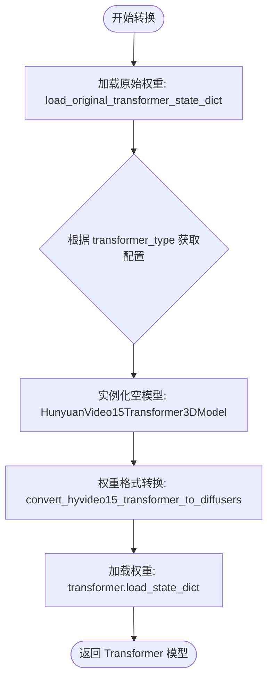

#### 带注释源码

```python
def convert_transformer(args):
    """
    将HunyuanVideo 1.5的Transformer模型从原始格式转换为Diffusers格式。
    
    参数:
        args: 包含模型路径和类型的命令行参数对象。
        
    返回:
        HunyuanVideo15Transformer3DModel: 转换权重后的模型实例。
    """
    
    # 1. 加载原始格式的模型权重（可能来自Hub或本地文件夹）
    # 权重通常以分片的safetensors格式存储
    original_state_dict = load_original_transformer_state_dict(args)

    # 2. 根据指定的transformer_type（如480p_t2v）获取对应的配置参数
    # 配置包含目标尺寸(target_size)和任务类型(task_type)
    config = TRANSFORMER_CONFIGS[args.transformer_type]
    
    # 3. 使用init_empty_weights上下文管理器初始化模型结构
    # 这样可以避免在仅为了获取配置而分配大量显存
    with init_empty_weights():
        transformer = HunyuanVideo15Transformer3DModel(**config)
        
    # 4. 将原始状态字典的键名和结构映射到Diffusers格式
    # 例如：time_in.mlp.0.weight -> time_embed.timestep_embedder.linear_1.weight
    state_dict = convert_hyvideo15_transformer_to_diffusers(original_state_dict, config=transformer.config)
    
    # 5. 将转换后的权重加载到模型中
    # strict=True 确保所有键都匹配，assign=True 确保权重被直接赋值而不是复制
    transformer.load_state_dict(state_dict, strict=True, assign=True)

    return transformer
```


### `convert_vae`

将 HunyuanVideo 1.5 原始 VAE 检查点转换为 Diffusers 格式的 AutoencoderKLHunyuanVideo15 模型。

参数：

- `args`：`argparse.Namespace`，包含原始状态字典仓库 ID 或本地文件夹路径等命令行参数

返回值：`AutoencoderKLHunyuanVideo15`，转换后的 Diffusers 格式 VAE 模型

#### 流程图

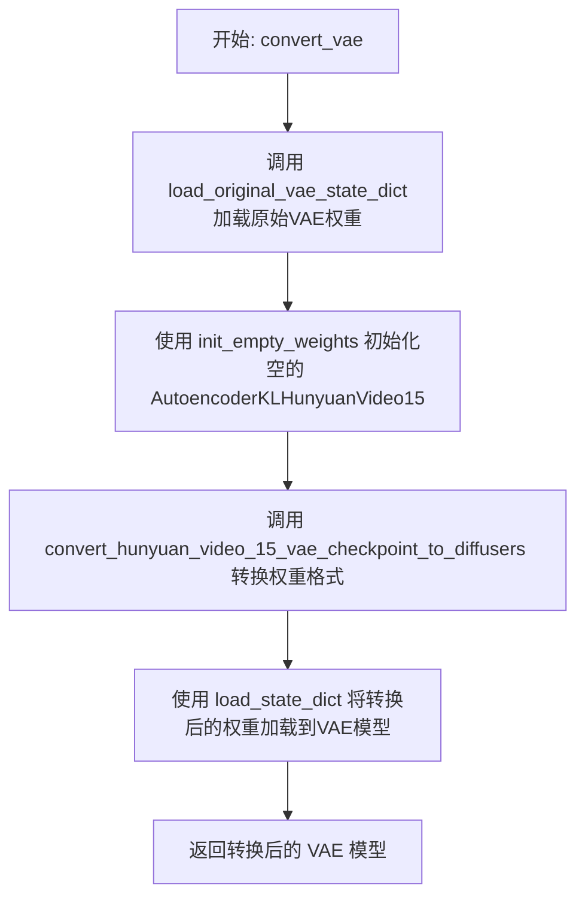

#### 带注释源码

```python
def convert_vae(args):
    """
    将 HunyuanVideo 1.5 原始 VAE 检查点转换为 Diffusers 格式的 AutoencoderKLHunyuanVideo15 模型。
    
    参数:
        args: 包含原始状态字典仓库 ID 或本地文件夹路径等命令行参数的 argparse.Namespace 对象
    
    返回值:
        AutoencoderKLHunyuanVideo15: 转换后的 Diffusers 格式 VAE 模型
    """
    # 步骤1: 加载原始 HunyuanVideo 1.5 VAE 检查点的状态字典
    # 该函数支持从 HuggingFace Hub 或本地文件夹加载 safetensors 格式的权重
    original_state_dict = load_original_vae_state_dict(args)
    
    # 步骤2: 使用 accelerate 库的 init_empty_weights 上下文管理器
    # 在不分配实际内存的情况下初始化一个空的 VAE 模型骨架
    # 这样可以避免在模型太大时耗尽内存
    with init_empty_weights():
        vae = AutoencoderKLHunyuanVideo15()
    
    # 步骤3: 将原始检查点的状态字典转换为 Diffusers 格式
    # 原始格式与 Diffusers 格式的权重键名不同，需要进行映射和重命名
    # 转换涵盖编码器和解码器的所有层，包括卷积、ResNet、注意力等组件
    state_dict = convert_hunyuan_video_15_vae_checkpoint_to_diffusers(original_state_dict)
    
    # 步骤4: 使用 load_state_dict 将转换后的权重加载到 VAE 模型中
    # strict=True 确保所有键都匹配，assign=True 直接赋值权重而不复制
    vae.load_state_dict(state_dict, strict=True, assign=True)
    
    # 返回转换完成的 VAE 模型，可用于后续的推理或保存
    return vae
```


### `load_mllm`

该函数用于加载 Qwen2.5-VL-7B-Instruct 多模态大语言模型作为文本编码器（text_encoder），并同时加载对应的分词器（tokenizer），为后续的 HunyuanVideo 视频生成 pipeline 提供文本编码能力。

参数： 无

返回值： `tuple[AutoModel, AutoTokenizer]`，返回文本编码器和分词器的元组。文本编码器在模型具有 `language_model` 属性时被提取为该属性。

#### 流程图

```mermaid
flowchart TD
    A[开始 load_mllm] --> B[打印加载信息: loading from Qwen/Qwen2.5-VL-7B-Instruct]
    --> C[使用 AutoModel.from_pretrained 加载模型<br/>参数: torch_dtype=torch.bfloat16, low_cpu_mem_usage=True]
    --> D{检查 text_encoder 是否有 language_model 属性}
    -->|是| E[提取 text_encoder = text_encoder.language_model]
    --> F[使用 AutoTokenizer.from_pretrained 加载分词器<br/>参数: padding_side=right]
    --> G[返回 (text_encoder, tokenizer) 元组]
    D -->|否| F
```

#### 带注释源码

```python
def load_mllm():
    """
    加载 Qwen2.5-VL-7B-Instruct 模型作为文本编码器，并返回对应的分词器。
    主要用于 HunyuanVideo15ImageToVideoPipeline 或 HunyuanVideo15Pipeline 的文本编码组件。
    """
    # 打印加载提示信息，方便追踪加载过程
    print(" loading from Qwen/Qwen2.5-VL-7B-Instruct")
    
    # 使用 Hugging Face Transformers 的 AutoModel 加载预训练模型
    # torch_dtype=torch.bfloat16: 使用 bfloat16 精度以减少显存占用
    # low_cpu_mem_usage=True: 优化 CPU 内存使用，采用延迟初始化策略
    text_encoder = AutoModel.from_pretrained(
        "Qwen/Qwen2.5-VL-7B-Instruct", 
        torch_dtype=torch.bfloat16, 
        low_cpu_mem_usage=True
    )
    
    # Qwen2.5-VL 是多模态模型，包含视觉编码器和语言模型
    # 如果加载的模型对象具有 language_model 属性，则提取其中的语言模型部分
    # 因为视频生成 pipeline 只需要文本编码能力，不需要视觉编码部分
    if hasattr(text_encoder, "language_model"):
        text_encoder = text_encoder.language_model
    
    # 加载对应的分词器
    # padding_side="right": 设置填充在右侧，这是 decoder 类模型的常见配置
    tokenizer = AutoTokenizer.from_pretrained("Qwen/Qwen2.5-VL-7B-Instruct", padding_side="right")
    
    # 返回文本编码器和分词器，供 pipeline 组装使用
    return text_encoder, tokenizer
```


### `add_special_token`

该函数用于向 tokenizer 和 text_encoder 添加颜色和字体相关的特殊标记，以便在 HunyuanVideo 模型的文本编码过程中支持颜色和字体属性的描述。

参数：

- `tokenizer`：`transformers.AutoTokenizer`，Huggingface tokenizer 实例
- `text_encoder`：`T5EncoderModel`，Huggingface T5 编码器，用于扩展 embedding 层
- `add_color`：`bool`，是否添加颜色 token，默认为 True
- `add_font`：`bool`，是否添加字体 token，默认为 True
- `multilingual`：`bool`，是否使用多语言字体 token，默认为 True
- `color_ann_path`：`str`，颜色标注 JSON 文件路径，默认为 "assets/color_idx.json"
- `font_ann_path`：`str`，字体标注 JSON 文件路径，默认为 "assets/multilingual_10-lang_idx.json"

返回值：`None`，该函数直接修改 tokenizer 和 text_encoder 对象，无返回值

#### 流程图

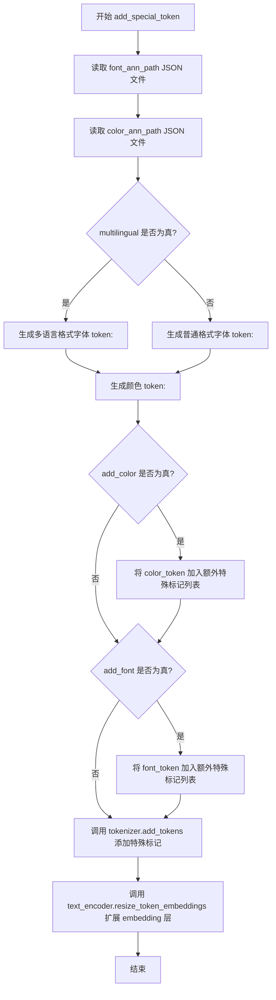

#### 带注释源码

```python
def add_special_token(
    tokenizer,
    text_encoder,
    add_color=True,
    add_font=True,
    multilingual=True,
    color_ann_path="assets/color_idx.json",
    font_ann_path="assets/multilingual_10-lang_idx.json",
):
    """
    Add special tokens for color and font to tokenizer and text encoder.

    Args:
        tokenizer: Huggingface tokenizer.
        text_encoder: Huggingface T5 encoder.
        add_color (bool): Whether to add color tokens.
        add_font (bool): Whether to add font tokens.
        color_ann_path (str): Path to color annotation JSON.
        font_ann_path (str): Path to font annotation JSON.
        multilingual (bool): Whether to use multilingual font tokens.
    """
    # 读取字体标注文件，包含语言代码到索引的映射
    # 格式示例: {"en-font-0": 0, "zh-font-1": 1, ...}
    with open(font_ann_path, "r") as f:
        idx_font_dict = json.load(f)
    
    # 读取颜色标注文件，包含颜色名称到索引的映射
    # 格式示例: {"color-0": 0, "color-1": 1, ...}
    with open(color_ann_path, "r") as f:
        idx_color_dict = json.load(f)

    # 根据 multilingual 参数决定字体 token 的格式
    if multilingual:
        # 多语言格式: 取语言代码前两位 + font + 索引
        # 例如: "en-font-0", "zh-font-1"
        font_token = [f"<{font_code[:2]}-font-{idx_font_dict[font_code]}>" for font_code in idx_font_dict]
    else:
        # 普通格式: <font-N>
        font_token = [f"<font-{i}>" for i in range(len(idx_font_dict))]
    
    # 生成颜色 token: <color-0>, <color-1>, ...
    color_token = [f"<color-{i}>" for i in range(len(idx_color_dict))]
    
    # 构建需要添加的特殊标记列表
    additional_special_tokens = []
    
    # 根据 add_color 参数决定是否添加颜色标记
    if add_color:
        additional_special_tokens += color_token
    
    # 根据 add_font 参数决定是否添加字体标记
    if add_font:
        additional_special_tokens += font_token

    # 将新的特殊标记添加到 tokenizer
    # special_tokens=True 表示这些是特殊标记而非普通词
    tokenizer.add_tokens(additional_special_tokens, special_tokens=True)
    
    # 调整 text_encoder 的 token embedding 层大小以匹配新的 tokenizer
    # mean_resizing=False 避免 PyTorch LAPACK 依赖问题
    text_encoder.resize_token_embeddings(len(tokenizer), mean_resizing=False)
```


### `load_byt5`

该函数用于加载 ByT5 文本编码器（基于 google/byt5-small），并加载 Glyph-SDXL-v2 权重，检查点路径、颜色注释和字体注释路径均从 `args` 参数中获取。函数首先加载基础 tokenizer 和 T5EncoderModel，然后添加特殊 token（颜色 token 和字体 token），最后加载并清洗权重状态字典，将其加载到编码器中，返回编码器实例和 tokenizer。

参数：

- `args`：命令行参数对象（`argparse.Namespace`），包含 `byt5_path` 属性，指向 Glyph-SDXL-v2 检查点文件夹路径

返回值：`(encoder, tokenizer)`，其中 `encoder` 为 `T5EncoderModel` 类型（加载了 Glyph-SDXL-v2 权重的 T5 编码器），`tokenizer` 为 `AutoTokenizer` 类型（添加了颜色和字体特殊 token 的 tokenizer）

#### 流程图

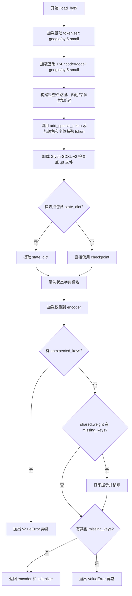

#### 带注释源码

```python
def load_byt5(args):
    """
    Load ByT5 encoder with Glyph-SDXL-v2 weights and save in HuggingFace format.
    """

    # 1. Load base tokenizer and encoder
    # 从预训练模型 google/byt5-small 加载 tokenizer
    tokenizer = AutoTokenizer.from_pretrained("google/byt5-small")

    # Load as T5EncoderModel
    # 从预训练模型 google/byt5-small 加载 T5 编码器模型
    encoder = T5EncoderModel.from_pretrained("google/byt5-small")

    # 构建 ByT5 检查点路径、颜色注释路径和字体注释路径
    # byt5_path 为 Glyph-SDXL-v2 文件夹根路径
    byt5_checkpoint_path = os.path.join(args.byt5_path, "checkpoints/byt5_model.pt")
    color_ann_path = os.path.join(args.byt5_path, "assets/color_idx.json")
    font_ann_path = os.path.join(args.byt5_path, "assets/multilingual_10-lang_idx.json")

    # 2. Add special tokens
    # 添加颜色和字体特殊 token 到 tokenizer 和 text_encoder
    add_special_token(
        tokenizer=tokenizer,
        text_encoder=encoder,
        add_color=True,      # 添加颜色 token
        add_font=True,       # 添加字体 token
        color_ann_path=color_ann_path,
        font_ann_path=font_ann_path,
        multilingual=True,   # 使用多语言字体 token
    )

    # 3. Load Glyph-SDXL-v2 checkpoint
    # 打印加载提示信息
    print(f"\n3. Loading Glyph-SDXL-v2 checkpoint: {byt5_checkpoint_path}")
    # 加载 PyTorch 检查点到 CPU
    checkpoint = torch.load(byt5_checkpoint_path, map_location="cpu")

    # Handle different checkpoint formats
    # 检查点可能有两种格式：包含 state_dict 的字典或直接是 state_dict
    if "state_dict" in checkpoint:
        state_dict = checkpoint["state_dict"]
    else:
        state_dict = checkpoint

    # add 'encoder.' prefix to the keys
    # 清洗状态字典的键名，统一添加 'encoder.' 前缀
    # 移除 'module.text_tower.encoder.' 前缀（如果存在）
    cleaned_state_dict = {}
    for key, value in state_dict.items():
        if key.startswith("module.text_tower.encoder."):
            # 去除 'module.text_tower.encoder.' 并添加 'encoder.'
            new_key = "encoder." + key[len("module.text_tower.encoder.") :]
            cleaned_state_dict[new_key] = value
        else:
            # 直接添加 'encoder.' 前缀
            new_key = "encoder." + key
            cleaned_state_dict[new_key] = value

    # 4. Load weights
    # 将清洗后的权重加载到 encoder 模型中
    # strict=False 允许部分匹配
    missing_keys, unexpected_keys = encoder.load_state_dict(cleaned_state_dict, strict=False)
    # 如果存在意外键，抛出错误
    if unexpected_keys:
        raise ValueError(f"Unexpected keys: {unexpected_keys}")
    # 如果 shared.weight 在缺失键中，这是预期行为，移除它
    if "shared.weight" in missing_keys:
        print("  Missing shared.weight as expected")
        missing_keys.remove("shared.weight")
    # 如果还有其他缺失键，抛出错误
    if missing_keys:
        raise ValueError(f"Missing keys: {missing_keys}")

    # 返回加载好的 encoder 和 tokenizer
    return encoder, tokenizer
```


### `load_siglip`

该函数用于加载 Siglip 图像编码器（VisionModel）和图像特征提取器（ImageProcessor），这两个组件是 HunyuanVideo-1.5 模型中用于图像到视频（I2V）任务的关键模块。

参数：

- 该函数无参数

返回值：`(SiglipVisionModel, SiglipImageProcessor)`，返回图像编码器和图像特征提取器组成的元组

#### 流程图

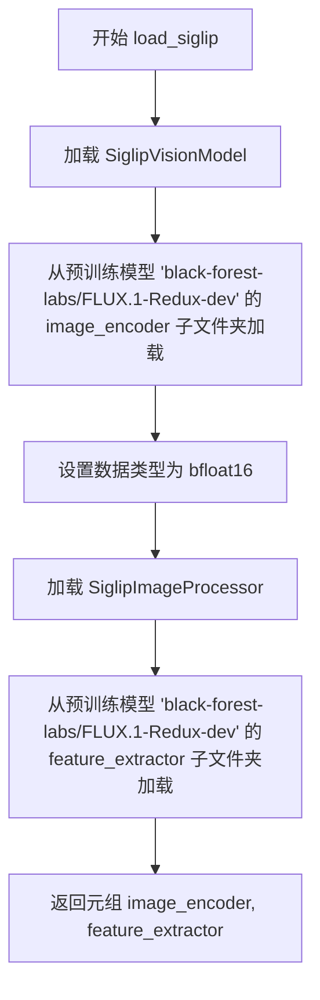

#### 带注释源码

```python
def load_siglip():
    """
    加载 Siglip 图像编码器和特征提取器。
    
    该函数用于加载用于图像到视频（I2V）任务的视觉编码组件。
    - image_encoder: 负责将图像编码为特征向量
    - feature_extractor: 负责对输入图像进行预处理和特征提取
    """
    # 加载 Siglip 视觉模型（图像编码器）
    # 使用 black-forest-labs 的 FLUX.1-Redux-dev 预训练权重
    # subfolder 指定从模型仓库的 image_encoder 子目录加载
    # torch_dtype 设置为 bfloat16 以节省显存并提高推理速度
    image_encoder = SiglipVisionModel.from_pretrained(
        "black-forest-labs/FLUX.1-Redux-dev", 
        subfolder="image_encoder", 
        torch_dtype=torch.bfloat16
    )
    
    # 加载 Siglip 图像处理器（特征提取器）
    # 负责对输入图像进行预处理：缩放、归一化等操作
    # 从同一模型仓库的 feature_extractor 子目录加载
    feature_extractor = SiglipImageProcessor.from_pretrained(
        "black-forest-labs/FLUX.1-Redux-dev", 
        subfolder="feature_extractor"
    )
    
    # 返回图像编码器和特征提取器，供后续管道使用
    return image_encoder, feature_extractor
```


### `get_args`

该函数是命令行参数解析器，用于获取模型转换脚本所需的配置参数，包括原始模型来源、输出路径、transformer类型、ByT5编码器路径以及是否保存完整管道等选项。

参数：

- 无（该函数不接受任何参数，它使用`argparse.ArgumentParser`从命令行获取参数）

返回值：`Namespace`（`argparse.Namespace`），一个包含所有解析后命令行参数的对象

#### 流程图

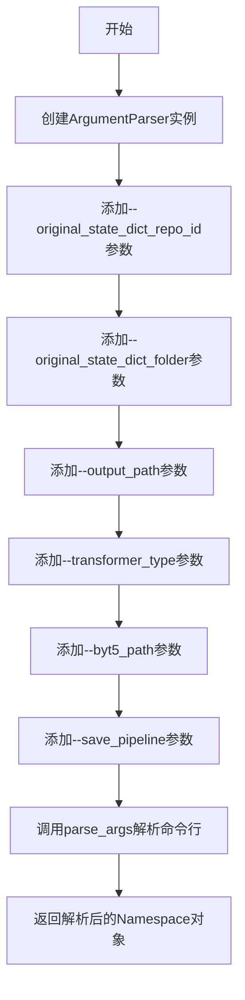

#### 带注释源码

```python
def get_args():
    """
    解析命令行参数，返回包含所有配置选项的Namespace对象。
    
    该函数使用argparse模块定义了一系列命令行参数，用于配置
    HunyuanVideo 1.5模型到Diffusers格式的转换过程。
    """
    # 创建ArgumentParser实例，用于解析命令行参数
    parser = argparse.ArgumentParser()
    
    # 添加原始模型仓库ID参数
    parser.add_argument(
        "--original_state_dict_repo_id", 
        type=str, 
        default=None, 
        help="Path to original hub_id for the model"
    )
    
    # 添加原始模型本地文件夹路径参数
    parser.add_argument(
        "--original_state_dict_folder", 
        type=str, 
        default=None, 
        help="Local folder name of the original state dict"
    )
    
    # 添加转换后模型的输出路径参数（必需）
    parser.add_argument(
        "--output_path", 
        type=str, 
        required=True, 
        help="Path where converted model(s) should be saved"
    )
    
    # 添加transformer类型参数，带有预定义的选择项
    parser.add_argument(
        "--transformer_type", 
        type=str, 
        default="480p_i2v", 
        choices=list(TRANSFORMER_CONFIGS.keys())
    )
    
    # 添加ByT5编码器路径参数，包含详细的使用说明
    parser.add_argument(
        "--byt5_path",
        type=str,
        default=None,
        help=(
            "path to the downloaded byt5 checkpoint & assets. "
            "Note: They use Glyph-SDXL-v2 as byt5 encoder. You can download from modelscope like: "
            "`modelscope download --model AI-ModelScope/Glyph-SDXL-v2 --local_dir ./ckpts/text_encoder/Glyph-SDXL-v2` "
            "or manually download following the instructions on "
            "https://github.com/Tencent-Hunyuan/HunyuanVideo-1.5/blob/910da2a829c484ea28982e8cff3bbc2cacdf1681/checkpoints-download.md. "
            "The path should point to the Glyph-SDXL-v2 folder which should contain an `assets` folder and a `checkpoints` folder, "
            "like: Glyph-SDXL-v2/assets/... and Glyph-SDXL-v2/checkpoints/byt5_model.pt"
        ),
    )
    
    # 添加是否保存完整管道的标志参数（布尔值）
    parser.add_argument(
        "--save_pipeline", 
        action="store_true"
    )
    
    # 解析命令行参数并返回Namespace对象
    return parser.parse_args()
```

## 关键组件


### 配置字典（TRANSFORMER_CONFIGS）

存储HunyuanVideo 1.5不同transformer类型的配置信息，包括目标分辨率和任务类型（i2v/t2v）。

### 配置字典（SCHEDULER_CONFIGS）

存储不同transformer类型对应的FlowMatchEulerDiscreteScheduler的shift参数配置。

### 配置字典（GUIDANCE_CONFIGS）

存储不同transformer类型对应的ClassifierFreeGuidance引导强度参数配置。

### 函数 swap_scale_shift

将权重张量的scale和shift维度进行交换，用于final_layer的adaLN参数转换。

### 函数 convert_hyvideo15_transformer_to_diffusers

将HunyuanVideo 1.5原始transformer检查点转换为Diffusers格式，包括time_embed、context_embedder、image_embedder、x_embedder、transformer_blocks和norm_out等模块的权重映射。

### 函数 convert_hunyuan_video_15_vae_checkpoint_to_diffusers

将HunyuanVideo 1.5原始VAE检查点转换为Diffusers格式，包括encoder和decoder的conv_in、down_blocks、mid_block、up_blocks和conv_out等模块的权重映射。

### 函数 load_sharded_safetensors

加载指定目录下的所有分片safetensors文件并合并为单一状态字典。

### 函数 load_original_transformer_state_dict

从HuggingFace Hub或本地文件夹加载原始transformer模型的状态字典，支持分片模型加载。

### 函数 load_original_vae_state_dict

从HuggingFace Hub或本地文件夹加载原始VAE模型的状态字典。

### 函数 convert_transformer

转换transformer的入口函数，加载原始状态字典并调用转换函数生成Diffusers格式的transformer模型。

### 函数 convert_vae

转换VAE的入口函数，加载原始VAE状态字典并转换为Diffusers格式。

### 函数 load_mllm

加载Qwen2.5-VL-7B-Instruct作为多模态语言模型，返回text_encoder和tokenizer。

### 函数 add_special_token

为ByT5 tokenizer和text_encoder添加颜色和字体相关的特殊token，支持多语言字体标记。

### 函数 load_byt5

加载ByT5编码器并加载Glyph-SDXL-v2检查点权重，处理检查点格式并添加特殊token。

### 函数 load_siglip

加载SiglipVisionModel和SiglipImageProcessor用于图像编码。

### 函数 get_args

解析命令行参数，包括原始模型仓库ID、输出路径、transformer类型和ByT5路径等。

### 主程序逻辑

根据参数选择只转换transformer或完整pipeline，包括加载VAE、多个文本编码器（Qwen和ByT5）、图像编码器（SigLIP）、调度器和引导器，最后保存为Diffusers pipeline格式。

## 问题及建议


### 已知问题

- **硬编码的模型架构参数**：代码中多处硬编码了模型架构相关参数，如 `num_refiner_blocks = 2`、`num_layers = 54`、`layers_per_block = 2` 等，这些参数应该从配置字典或模型配置中动态获取，以提高代码的适应性和可维护性。
- **硬编码的模型路径和文件名**：大量使用字符串硬编码原始模型的键名（如 `"time_in.mlp.0.weight"`、`"double_blocks.{i}."` 等），缺乏统一管理，增加新模型变体时维护成本高。
- **缺乏健壮的错误处理**：多处操作（如 `load_file`、`snapshot_download`、`hf_hub_download`）缺乏异常捕获和详细错误信息，一旦网络或文件出错会导致程序直接崩溃，缺乏用户体验。
- **状态字典验证不足**：加载状态字典后，仅进行基础的 `missing_keys` 和 `unexpected_keys` 检查，未对关键键的完整性、数据类型的合法性进行深度验证，可能导致隐藏的转换错误。
- **内存使用未优化**：在 `load_sharded_safetensors` 等函数中一次性将所有分片文件加载到内存，对于大规模模型可能导致内存峰值过高，缺乏流式处理或内存映射机制。
- **代码重复**：VAE 编码器和解码器的转换逻辑存在大量相似代码，未提取公共逻辑，且配置文件（TRANSFORMER_CONFIGS、SCHEDULER_CONFIGS、GUIDANCE_CONFIGS）结构相似但分散管理。
- **类型注解缺失**：多数函数缺少参数和返回值的类型注解，降低了代码的可读性和 IDE 的辅助能力，也增加了类型安全风险。
- **主流程缺乏模块化**：`if __name__ == "__main__"` 块中包含完整的转换和保存逻辑过长，未拆分为独立的子函数，不利于测试和复用。
- **配置与代码耦合**：命令行参数解析与业务逻辑耦合，且 `transformer_type` 的可选值虽然从 `TRANSFORMER_CONFIGS` 动态获取，但其他相关配置（如 SCHEDULER_CONFIGS、GUIDANCE_CONFIGS）缺乏一致性校验。
- **注释与代码不同步风险**：文件头部包含两个使用示例的注释块，若参数或行为变更可能遗忘同步更新注释，导致文档过时。

### 优化建议

- **配置驱动设计**：将所有硬编码的架构参数、文件名映射规则提取到独立的配置类或 JSON/YAML 文件中，实现配置与代码的彻底解耦。
- **封装转换逻辑**：创建转换映射表或模板，将原始键名到目标键名的映射规则配置化，使用循环和模板动态生成转换逻辑，减少重复代码。
- **增强错误处理**：为所有 I/O 操作添加 try-except 包装，提供有意义的错误信息和建议；实现重试机制处理临时网络故障。
- **添加状态字典验证**：在转换前后增加完整性校验，检查必要键的存在性、数据类型合法性和形状匹配性。
- **实现内存优化**：对大文件采用内存映射（mmap）或分块加载策略；使用 `torch.cuda.empty_cache()` 及时释放中间张量内存。
- **完善类型注解**：为所有函数添加完整的类型注解，使用 mypy 进行静态类型检查。
- **模块化重构**：将主流程拆分为独立函数（如 `convert_transformer_pipeline`、`convert_vae_pipeline`、`assemble_pipeline`），提高代码可测试性。
- **统一配置管理**：创建配置类封装 TRANSFORMER_CONFIGS、SCHEDULER_CONFIGS、GUIDANCE_CONFIGS，并提供一致性校验方法。
- **增加日志记录**：使用 Python logging 模块替代 print 语句，实现分级日志记录，便于调试和监控。

## 其它


### 设计目标与约束

**设计目标**：
1. 将腾讯HunyuanVideo 1.5原始检查点格式转换为Diffusers格式，支持HuggingFace生态的推理pipeline
2. 支持多种transformer类型（480p/720p、t2v/i2v、distilled版本）
3. 支持保存完整pipeline或仅保存transformer权重
4. 保持模型精度（使用bfloat16）

**约束条件**：
1. 依赖HuggingFace diffusers、transformers、accelerate等库
2. 需要从HuggingFace Hub或本地文件夹加载原始模型权重
3. ByT5编码器需要额外的Glyph-SDXL-v2权重
4. 转换过程需要足够内存（使用init_empty_weights减少内存占用）

### 错误处理与异常设计

**错误处理策略**：
1. 参数校验错误：在`get_args()`中使用argparse的required参数和choices限制，确保transformer_type在支持列表中
2. 路径错误：当`original_state_dict_repo_id`和`original_state_dict_folder`都未提供时，抛出ValueError提示用户必须提供其中一种
3. 模型加载错误：VAE转换时检查unexpected_keys和missing_keys，若存在未预期的key则抛出ValueError
4. Pipeline保存错误：保存完整pipeline时检查byt5_path参数，未提供则报错

**异常类型**：
- `ValueError`：参数校验失败、模型键不匹配
- `OSError/IOError`：文件路径不存在
- `RuntimeError`：PyTorch相关错误（如内存不足）
- `ImportError`：依赖库未安装

### 数据流与状态机

**主要数据流**：
```
原始模型权重（safetensors格式）
        ↓
[加载阶段] - load_original_transformer_state_dict / load_original_vae_state_dict
        ↓
[转换阶段] - convert_hyvideo15_transformer_to_diffusers / convert_hunyuan_video_15_vae_checkpoint_to_diffusers
        ↓
[权重合并] - state_dict合并与键名映射
        ↓
[模型初始化] - 使用init_empty_weights创建空模型骨架
        ↓
[权重加载] - load_state_dict with assign=True
        ↓
[保存阶段] - save_pretrained with safe_serialization
```

**状态机**：
- **IDLE**：等待命令行参数
- **LOAD_TRANSFORMER**：加载原始transformer权重
- **CONVERT_TRANSFORMER**：转换transformer权重格式
- **[可选] LOAD_VAE**：加载VAE权重
- **[可选] CONVERT_VAE**：转换VAE权重格式
- **[可选] LOAD_ENCODERS**：加载文本和图像编码器
- **[可选] BUILD_PIPELINE**：组装完整pipeline
- **SAVE**：保存转换后的模型

### 外部依赖与接口契约

**核心依赖**：
- `torch`：张量操作和模型加载
- `diffusers`：Diffusers pipeline和模型类
- `transformers`：AutoModel、AutoTokenizer、T5EncoderModel
- `huggingface_hub`：模型下载（hf_hub_download、snapshot_download）
- `safetensors`：安全张量文件加载
- `accelerate`：空模型初始化（init_empty_weights）

**外部模型依赖**：
| 模型 | 来源 | 用途 |
|------|------|------|
| HunyuanVideo-1.5 | HuggingFace Hub (tencent/) | 原始transformer权重 |
| Qwen/Qwen2.5-VL-7B-Instruct | HuggingFace Hub | 多模态文本编码器 |
| google/byt5-small | HuggingFace Hub | ByT5基础模型 |
| Glyph-SDXL-v2 | ModelScope/本地 | ByT5字体/颜色编码权重 |
| black-forest-labs/FLUX.1-Redux-dev | HuggingFace Hub | SigLIP图像编码器 |

**接口契约**：
- CLI接口：使用argparse，支持`--original_state_dict_repo_id`、`--original_state_dict_folder`、`--output_path`、`--transformer_type`、`--byt5_path`、`--save_pipeline`
- 输出：保存为Diffusers格式（config.json + 模型权重safetensors）

### 性能考虑

**内存优化**：
1. 使用`init_empty_weights()`创建空模型骨架，避免加载完整模型到内存
2. 使用`assign=True`直接分配权重到目标张量，减少复制开销
3. 文本编码器使用`low_cpu_mem_usage=True`减少CPU内存占用

**计算优化**：
1. 使用`safe_serialization=True`保存权重为safetensors格式，更安全且加载更快
2. 转换过程使用批量处理（批量转换transformer blocks）

**潜在瓶颈**：
1. 大模型权重下载（transformer可能数百MB）
2. 多编码器组合加载时间较长
3. VAE转换涉及大量键映射操作

### 安全考虑

1. **模型来源验证**：从HuggingFace Hub下载时使用repo_id验证来源
2. **安全序列化**：使用safetensors格式避免pickle安全风险
3. **路径安全**：不执行用户输入的任意代码，路径仅用于文件读写
4. **内存安全**：使用torch.load时指定map_location="cpu"避免内存溢出

### 测试策略

**单元测试**：
1. 测试`swap_scale_shift`函数正确性
2. 测试各转换函数的键映射完整性
3. 测试参数解析逻辑

**集成测试**：
1. 使用真实HuggingFace Hub模型测试完整转换流程（需网络）
2. 验证转换后的模型权重可被Diffusers正确加载
3. 测试不同transformer_type的配置兼容性

**回归测试**：
1. 对比转换前后模型的键数量和结构
2. 验证关键权重维度是否匹配

### 部署注意事项

1. **环境要求**：Python 3.8+，PyTorch 2.0+，CUDA可选（CPU也可运行）
2. **依赖安装**：需安装所有import的包，建议使用虚拟环境
3. **磁盘空间**：转换后模型大小约10-20GB（取决于transformer_type）
4. **网络要求**：首次运行需下载大量模型权重（可能超过50GB）
5. **权限要求**：输出路径需要写入权限

### 版本兼容性

**PyTorch版本**：2.0+（使用torch.bfloat16需2.0+）
**Python版本**：3.8+
**关键库版本**：
- diffusers：需支持HunyuanVideo15相关类
- transformers：需支持AutoModel、AutoTokenizer、T5EncoderModel
- safetensors：需支持load_file函数
- accelerate：需支持init_empty_weights

### 配置管理

**TRANSFORMER_CONFIGS**：定义不同transformer类型的配置（target_size、task_type、use_meanflow）
**SCHEDULER_CONFIGS**：定义不同类型的flow shift参数
**GUIDANCE_CONFIGS**：定义不同类型的guidance_scale参数

这些配置与原始腾讯仓库的检查点一一对应，确保转换后的模型使用正确的推理参数。

### 已知限制

1. 仅支持HunyuanVideo 1.5版本，不支持1.0版本
2. ByT5编码器必须使用Glyph-SDXL-v2权重，无法使用其他文本编码器替代
3. 转换后的pipeline仅支持Diffusers库推理，无法直接用于原始腾讯代码
4. 部分蒸馏模型（distilled版本）的转换配置可能需要额外验证

### 扩展性建议

1. 可添加更多transformer_type支持（需对应修改TRANSFORMER_CONFIGS）
2. 可添加自定义文本编码器支持（需修改load_byt5和add_special_token逻辑）
3. 可添加ONNX导出支持（需添加torch.onnx.export相关代码）
4. 可添加量化支持（需添加bitsandbytes相关代码）


    