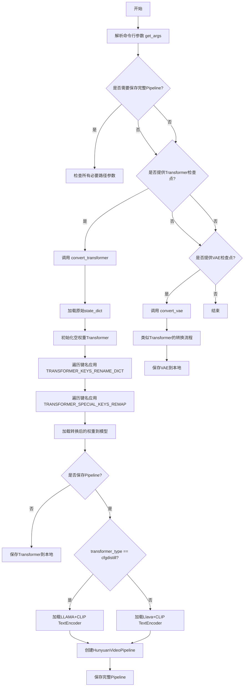
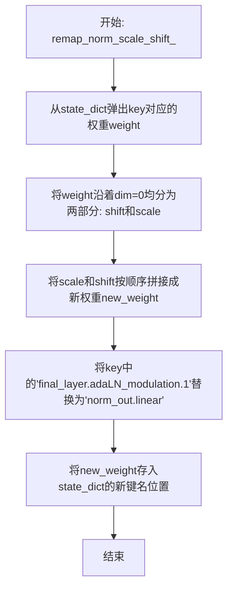
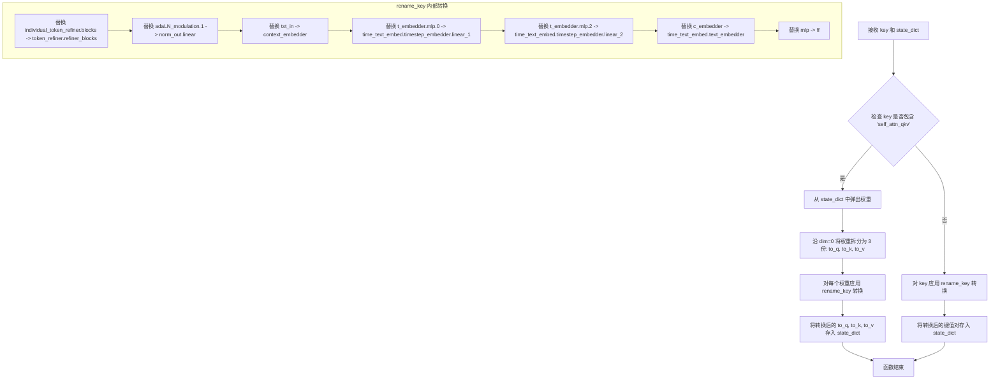
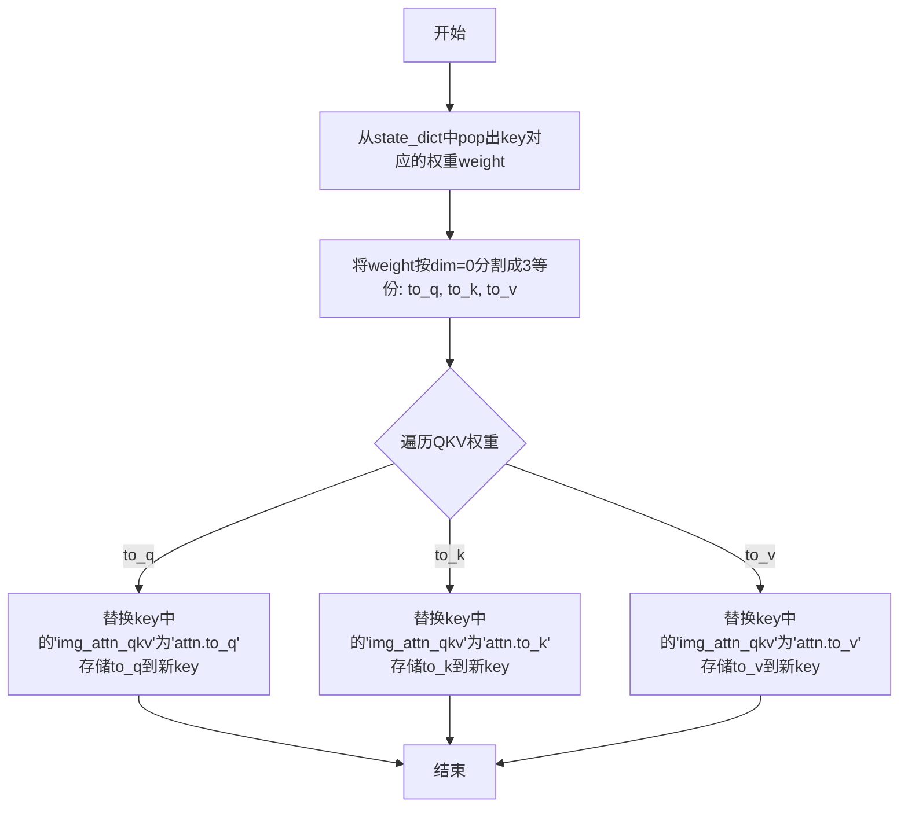
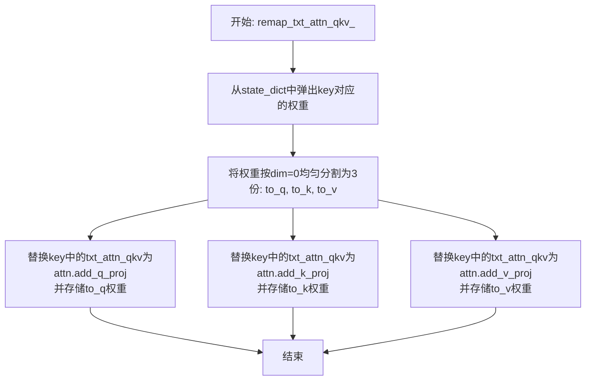
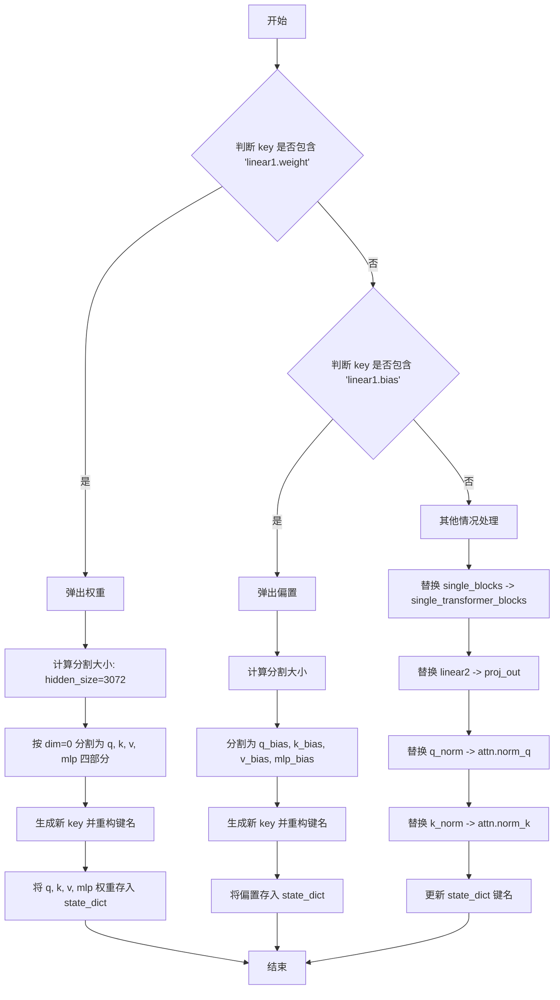
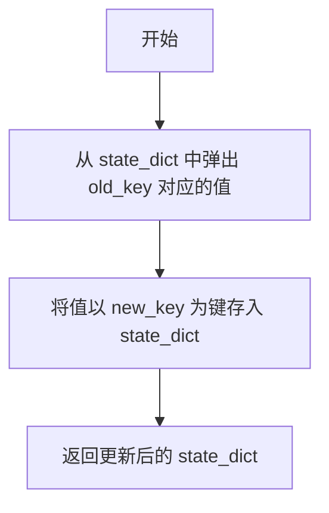
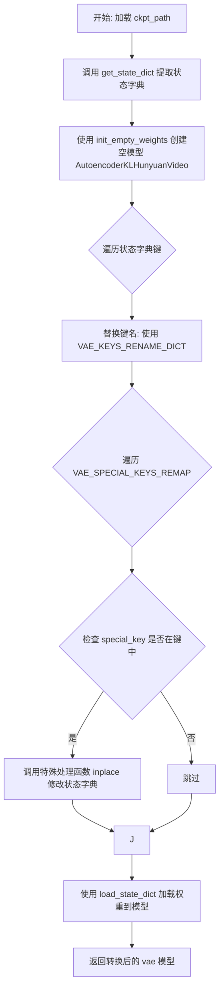
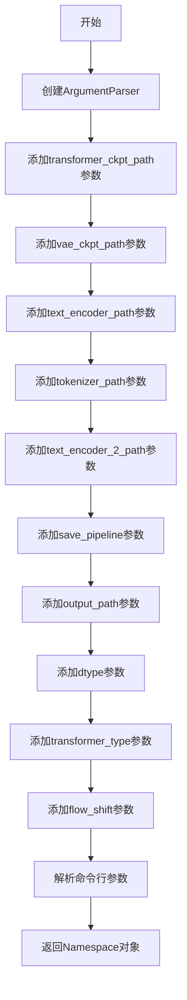

# `diffusers\scripts\convert_hunyuan_video_to_diffusers.py` 详细设计文档

这是一个模型权重转换工具，用于将腾讯混元（HunyuanVideo）原始模型的检查点（checkpoint）转换为Diffusers库兼容的格式，支持Transformer和VAE模型的权重重映射、键名规范化以及完整Pipeline的组装与保存。

## 整体流程



## 类结构

```
全局函数与配置
├── 转换函数 (convert_transformer, convert_vae)
├── 键名重映射函数群
│   ├── remap_norm_scale_shift_
│   ├── remap_txt_in_
│   ├── remap_img_attn_qkv_
│   ├── remap_txt_attn_qkv_
│   └── remap_single_transformer_blocks_
├── 配置字典
│   ├── TRANSFORMER_CONFIGS
│   ├── TRANSFORMER_KEYS_RENAME_DICT
│   ├── TRANSFORMER_SPECIAL_KEYS_REMAP
│   ├── VAE_KEYS_RENAME_DICT
│   └── DTYPE_MAPPING
└── 工具函数 (get_state_dict, update_state_dict_, get_args)
```

## 全局变量及字段


### `TRANSFORMER_KEYS_RENAME_DICT`
    
用于将原始transformer检查点中的键名映射到新键名的字典，包含常见的键替换规则

类型：`Dict[str, str]`
    


### `TRANSFORMER_SPECIAL_KEYS_REMAP`
    
包含特殊键的重映射处理函数的字典，用于处理需要复杂逻辑转换的键

类型：`Dict[str, Callable]`
    


### `VAE_KEYS_RENAME_DICT`
    
用于VAE模型检查点的键名重映射字典，目前为空字典

类型：`Dict[str, str]`
    


### `VAE_SPECIAL_KEYS_REMAP`
    
VAE模型的特殊键重映射处理函数字典，目前为空字典

类型：`Dict[str, Callable]`
    


### `TRANSFORMER_CONFIGS`
    
存储不同transformer模型架构配置参数的字典，包含模型层数、注意力头数等关键配置

类型：`Dict[str, Dict[str, Any]]`
    


### `DTYPE_MAPPING`
    
将字符串类型的dtype映射到PyTorch的dtype对象的字典，用于模型保存时的数据类型转换

类型：`Dict[str, torch.dtype]`
    


    

## 全局函数及方法


### `remap_norm_scale_shift_`

该函数是一个权重重映射（remapping）函数，用于将HunyuanVideo模型中旧的权重格式（包含shift和scale的混合权重）重新排列为新格式（先scale后shift），以适配新的模型结构。具体来说，它将包含在同一个张量中的shift和scale分割开后重新拼接，并更新state_dict中的键名。

参数：

- `key`：`str`，表示需要重映射的权重键名，指向state_dict中原始权重的位置
- `state_dict`：`Dict[str, Any]`，模型权重字典，函数会从中弹出指定key的权重，处理后以新键名存入

返回值：`None`（无返回值），该函数直接修改传入的`state_dict`字典，不返回任何值

#### 流程图



#### 带注释源码

```python
def remap_norm_scale_shift_(key, state_dict):
    """
    重映射归一化层的scale和shift权重顺序
    
    原始权重布局: [scale, shift] (在同一个张量的前后半部分)
    目标权重布局: [scale, shift] (重新拼接后的顺序)
    用于适配新模型中norm_out.linear层的参数顺序
    
    参数:
        key: state_dict中原始权重的键名
        state_dict: 模型权重字典，直接在原字典上修改
    """
    # 1. 弹出并获取原始权重，同时从state_dict中删除该键
    weight = state_dict.pop(key)
    
    # 2. 将权重沿着维度0（channel维度）分成两半
    # 前半部分为shift，后半部分为scale
    # chunk(2, dim=0)表示沿dim=0分成2份
    shift, scale = weight.chunk(2, dim=0)
    
    # 3. 重新拼接权重，顺序改为[scale, shift]
    # 这对应于新模型架构中norm_out.linear的权重布局
    new_weight = torch.cat([scale, shift], dim=0)
    
    # 4. 替换键名中的旧路径为新路径
    # final_layer.adaLN_modulation.1 -> norm_out.linear
    # 这是因为模型架构从adaLN调制改为直接的线性层归一化输出
    state_dict[key.replace("final_layer.adaLN_modulation.1", "norm_out.linear")] = new_weight
```


### `remap_txt_in_`

该函数是 HunyuanVideo 模型检查点转换中的关键重映射函数，用于将旧版检查点的键名转换为新版 HunyuanVideoTransformer3DModel 的键名约定。它特别处理文本嵌入层（txt_in）的权重重新映射，包括自注意力 QKV 权重的拆分以及多层名称的替换。

参数：

- `key`：`str`，旧版检查点中的键名
- `state_dict`：`Dict[str, Any]`，包含模型权重的字典，直接在原字典上进行修改

返回值：`None`，该函数直接修改 `state_dict` 字典，无返回值

#### 流程图



#### 带注释源码

```python
def remap_txt_in_(key, state_dict):
    """
    重映射文本输入层的键名和权重。
    
    此函数用于将旧版 HunyuanVideo 检查点中的文本嵌入层（txt_in）权重
    转换为新版模型架构的键名约定。包含两个主要操作：
    1. 名称映射：替换旧的关键字符串为新字符串
    2. 权重拆分：将 QKV 组合权重拆分为独立的 Q、K、V 权重
    
    参数:
        key: str - 旧版检查点中的权重键名
        state_dict: Dict[str, Any] - 模型状态字典，直接在原字典上修改
    
    返回:
        None - 直接修改 state_dict，无返回值
    """
    
    def rename_key(key):
        """
        内部函数：执行具体的键名替换规则。
        
        将旧版模型中的各种命名惯例转换为新版 HunyuanVideoTransformer3DModel 的命名：
        - "individual_token_refiner.blocks" -> "token_refiner.refiner_blocks"
        - "adaLN_modulation.1" -> "norm_out.linear"
        - "txt_in" -> "context_embedder"
        - "t_embedder.mlp.0" -> "time_text_embed.timestep_embedder.linear_1"
        - "t_embedder.mlp.2" -> "time_text_embed.timestep_embedder.linear_2"
        - "c_embedder" -> "time_text_embed.text_embedder"
        - "mlp" -> "ff"
        """
        new_key = key.replace("individual_token_refiner.blocks", "token_refiner.refiner_blocks")
        new_key = new_key.replace("adaLN_modulation.1", "norm_out.linear")
        new_key = new_key.replace("txt_in", "context_embedder")
        new_key = new_key.replace("t_embedder.mlp.0", "time_text_embed.timestep_embedder.linear_1")
        new_key = new_key.replace("t_embedder.mlp.2", "time_text_embed.timestep_embedder.linear_2")
        new_key = new_key.replace("c_embedder", "time_text_embed.text_embedder")
        new_key = new_key.replace("mlp", "ff")
        return new_key

    # 检查是否为自注意力 QKV 组合权重（旧版模型将 Q、K、V 合并为一个权重）
    if "self_attn_qkv" in key:
        # 从 state_dict 中弹出该权重（删除并返回）
        weight = state_dict.pop(key)
        
        # 沿 dim=0（输出维度）将组合权重均匀拆分为 3 份
        # 顺序为: to_q (query), to_k (key), to_v (value)
        to_q, to_k, to_v = weight.chunk(3, dim=0)
        
        # 将拆分后的权重存入 state_dict，使用转换后的键名
        # 将 "self_attn_qkv" 分别替换为 "attn.to_q", "attn.to_k", "attn.to_v"
        state_dict[rename_key(key.replace("self_attn_qkv", "attn.to_q"))] = to_q
        state_dict[rename_key(key.replace("self_attn_qkv", "attn.to_k"))] = to_k
        state_dict[rename_key(key.replace("self_attn_qkv", "attn.to_v"))] = to_v
    else:
        # 对于非 QKV 权重，直接进行键名转换并更新 state_dict
        # 使用 pop 移除旧键并用新键名重新添加
        state_dict[rename_key(key)] = state_dict.pop(key)
```


### `remap_img_attn_qkv_`

该函数用于在模型权重转换过程中，将原始的图像注意力QKV权重进行分割并重新映射键名。它从state_dict中取出包含QKV的联合权重张量，按维度0均匀分割成三份（query、key、value），然后将键名中的"img_attn_qkv"替换为"attn.to_q/k/v"，并将分割后的权重存回state_dict，实现权重键名的适配。

参数：

-  `key`：`str`，原始state_dict中图像注意力QKV权重的键名
-  `state_dict`：`Dict[str, Any]`，模型权重字典，包含待转换的权重

返回值：`None`（无返回值，函数直接修改传入的state_dict字典）

#### 流程图



#### 带注释源码

```python
def remap_img_attn_qkv_(key, state_dict):
    """
    重新映射图像注意力QKV权重键名
    
    参数:
        key: 原始state_dict中图像注意力QKV联合权重的键名
        state_dict: 模型权重字典
    """
    # 1. 从state_dict中弹出（删除并返回）该key对应的权重张量
    weight = state_dict.pop(key)
    
    # 2. 将联合权重张量按第0维均匀分割成3份
    # 分割顺序: [to_q, to_k, to_v]，每份的形状为 (hidden_size, ...)
    to_q, to_k, to_v = weight.chunk(3, dim=0)
    
    # 3. 重新构建键名并存储分割后的权重
    # 将 "img_attn_qkv" 替换为 "attn.to_q" 用于query权重
    state_dict[key.replace("img_attn_qkv", "attn.to_q")] = to_q
    
    # 将 "img_attn_qkv" 替换为 "attn.to_k" 用于key权重
    state_dict[key.replace("img_attn_qkv", "attn.to_k")] = to_k
    
    # 将 "img_attn_qkv" 替换为 "attn.to_v" 用于value权重
    state_dict[key.replace("img_attn_qkv", "attn.to_v")] = to_v
    
    # 函数无返回值，直接修改传入的state_dict
```


### `remap_txt_attn_qkv_`

该函数用于将文本注意力QKV（Query-Key-Value）权重重映射为新的键名，并将权重按通道维度均匀分割为三个独立的投影权重（to_q、to_k、to_v），适配目标模型架构中的文本注意力机制。

参数：

- `key`：`str`，原始权重在 state_dict 中的键名，标识需要重映射的文本注意力 QKV 权重
- `state_dict`：`Dict[str, Any]`，包含模型权重的字典，通过键名索引存储张量数据

返回值：`None`，该函数直接修改传入的 `state_dict` 字典，不返回任何值

#### 流程图



#### 带注释源码

```python
def remap_txt_attn_qkv_(key, state_dict):
    """
    重映射文本注意力QKV权重，将其拆分为独立的q、k、v投影权重
    
    参数:
        key: 原始权重在state_dict中的键名
        state_dict: 包含模型权重的字典
    
    注意:
        - 函数直接修改传入的state_dict，不返回新字典
        - 假设原始权重的形状为 [3*hidden_size, ...]，可按dim=0均分为三份
    """
    # 从state_dict中弹出（删除并返回）指定key对应的权重张量
    weight = state_dict.pop(key)
    
    # 将权重沿dim=0维度均匀分割为3份，分别对应query、key、value的投影矩阵
    # 分割后的每个张量形状为 [hidden_size, ...]
    to_q, to_k, to_v = weight.chunk(3, dim=0)
    
    # 替换键名中的 "txt_attn_qkv" 为目标架构中的新键名
    # "attn.add_q_proj" 对应文本注意力的query投影层
    state_dict[key.replace("txt_attn_qkv", "attn.add_q_proj")] = to_q
    
    # "attn.add_k_proj" 对应文本注意力的key投影层
    state_dict[key.replace("txt_attn_qkv", "attn.add_k_proj")] = to_k
    
    # "attn.add_v_proj" 对应文本注意力的value投影层
    state_dict[key.replace("txt_attn_qkv", "attn.add_v_proj")] = to_v
```


### `remap_single_transformer_blocks_`

该函数是一个状态字典（state_dict）键名重映射的处理器，用于将旧版 HunyuanVideo 模型中 `single_blocks` 的权重键名转换为新版 `single_transformer_blocks` 的格式，特别处理了 `linear1` 权重/偏置的 QKV 分离以及 `linear2`、`q_norm`、`k_norm` 的重命名，以适配新的模型结构。

参数：

- `key`：`str`，表示当前处理的权重键名
- `state_dict`：`Dict[str, Any]`，包含模型权重的状态字典，函数会直接修改该字典中的键名

返回值：`None`，函数直接修改传入的 `state_dict` 字典，无返回值

#### 流程图



#### 带注释源码

```python
def remap_single_transformer_blocks_(key, state_dict):
    """
    重映射 single_blocks 相关键名到 single_transformer_blocks 格式。
    主要处理 linear1 的 QKV 分离和 linear2/q_norm/k_norm 的重命名。
    """
    # 隐藏层大小，用于分割 QKV 和 MLP
    hidden_size = 3072

    # 处理 linear1.weight 的情况
    if "linear1.weight" in key:
        # 弹出旧权重
        linear1_weight = state_dict.pop(key)
        
        # 计算分割大小：3 * hidden_size 给 QKV，剩余给 MLP
        split_size = (hidden_size, hidden_size, hidden_size, linear1_weight.size(0) - 3 * hidden_size)
        
        # 沿 dim=0 分割权重为 q, k, v, mlp 四部分
        q, k, v, mlp = torch.split(linear1_weight, split_size, dim=0)
        
        # 生成新键名：替换 single_blocks -> single_transformer_blocks，并移除 .linear1.weight 后缀
        new_key = key.replace("single_blocks", "single_transformer_blocks").removesuffix(".linear1.weight")
        
        # 将分离后的权重存入 state_dict
        state_dict[f"{new_key}.attn.to_q.weight"] = q
        state_dict[f"{new_key}.attn.to_k.weight"] = k
        state_dict[f"{new_key}.attn.to_v.weight"] = v
        state_dict[f"{new_key}.proj_mlp.weight"] = mlp

    # 处理 linear1.bias 的情况
    elif "linear1.bias" in key:
        # 弹出旧偏置
        linear1_bias = state_dict.pop(key)
        
        # 计算分割大小
        split_size = (hidden_size, hidden_size, hidden_size, linear1_bias.size(0) - 3 * hidden_size)
        
        # 沿 dim=0 分割偏置
        q_bias, k_bias, v_bias, mlp_bias = torch.split(linear1_bias, split_size, dim=0)
        
        # 生成新键名
        new_key = key.replace("single_blocks", "single_transformer_blocks").removesuffix(".linear1.bias")
        
        # 将分离后的偏置存入 state_dict
        state_dict[f"{new_key}.attn.to_q.bias"] = q_bias
        state_dict[f"{new_key}.attn.to_k.bias"] = k_bias
        state_dict[f"{new_key}.attn.to_v.bias"] = v_bias
        state_dict[f"{new_key}.proj_mlp.bias"] = mlp_bias

    # 处理其他键名（linear2, q_norm, k_norm 等）
    else:
        # 逐个替换键名中的关键字
        new_key = key.replace("single_blocks", "single_transformer_blocks")
        new_key = new_key.replace("linear2", "proj_out")
        new_key = new_key.replace("q_norm", "attn.norm_q")
        new_key = new_key.replace("k_norm", "attn.norm_k")
        
        # 更新 state_dict 中的键名
        state_dict[new_key] = state_dict.pop(key)
```


### `update_state_dict_`

该函数用于在模型状态字典（state_dict）中更新键名，将指定旧键（old_key）的值重新绑定到新键（new_key），实现模型权重键名的映射转换。

参数：

- `state_dict`：`Dict[str, Any]`，需要更新的模型状态字典，字典的键为权重名称（字符串），值为对应的张量数据。
- `old_key`：`str`，原始状态字典中的键名（权重名称）。
- `new_key`：`str`，目标状态字典中的新键名（权重名称）。

返回值：`dict[str, Any]`，更新键名后的状态字典。

#### 流程图



#### 带注释源码

```python
def update_state_dict_(state_dict: Dict[str, Any], old_key: str, new_key: str) -> dict[str, Any]:
    """
    更新模型状态字典中的键名。
    
    参数:
        state_dict: 需要更新的模型状态字典
        old_key: 原始键名
        new_key: 目标键名
    
    返回:
        更新后的状态字典
    """
    # 从 state_dict 中移除 old_key 对应的条目并返回其值
    # 然后以 new_key 为键将值重新存入 state_dict
    state_dict[new_key] = state_dict.pop(old_key)
```


### `get_state_dict`

该函数用于从不同格式的检查点（checkpoint）中提取标准的模型状态字典（state_dict），支持从嵌套结构中查找并返回实际的权重字典。

参数：

- `saved_dict`：`Dict[str, Any]`，从检查点文件加载的原始字典，可能包含 `model`、`module` 或 `state_dict` 等嵌套键

返回值：`dict[str, Any]`，提取后的模型状态字典

#### 流程图

```mermaid
flowchart TD
    A[开始: 接收 saved_dict] --> B{检查 'model' 键是否存在}
    B -->|是| C[state_dict = saved_dict['model']]
    B -->|否| D{检查 'module' 键是否存在}
    C --> D
    D -->|是| E[state_dict = saved_dict['module']]
    D -->|否| F{检查 'state_dict' 键是否存在}
    E --> F
    F -->|是| G[state_dict = saved_dict['state_dict']]
    F -->|否| H[保持原 saved_dict 不变]
    G --> I[返回 state_dict]
    H --> I
```

#### 带注释源码

```python
def get_state_dict(saved_dict: Dict[str, Any]) -> dict[str, Any]:
    """
    从检查点字典中提取标准的状态字典。
    
    支持多种常见的checkpoint格式：
    - {"model": {...}}  # DeepSpeed 或其他框架常用格式
    - {"module": {...}}  # DataParallel/DistributedDataParallel 常用格式
    - {"state_dict": {...}}  # PyTorch 标准格式
    - {...}  # 直接包含权重的格式
    """
    # 初始化为输入字典
    state_dict = saved_dict
    
    # 优先检查 "model" 键（DeepSpeed 等框架使用）
    if "model" in saved_dict.keys():
        state_dict = state_dict["model"]
    
    # 检查 "module" 键（DataParallel/DistributedDataParallel 使用）
    if "module" in saved_dict.keys():
        state_dict = state_dict["module"]
    
    # 检查 "state_dict" 键（PyTorch 标准保存格式）
    if "state_dict" in saved_dict.keys():
        state_dict = state_dict["state_dict"]
    
    # 返回提取后的状态字典
    return state_dict
```


### `convert_transformer`

该函数是模型权重转换的核心逻辑，用于将预训练的非diffusers格式（如腾讯混元Video的原始权重）转换为Hugging Face `diffusers`库兼容的 `HunyuanVideoTransformer3DModel` 格式。它通过两阶段映射（简单重命名与复杂权重拆分/重组）来适配新的模型结构。

参数：

-  `ckpt_path`：`str`，待转换的原始模型检查点文件路径（PyTorch .pt/.safetensors）。
-  `transformer_type`：`str`，目标转换模型的配置类型标识符（如 "HYVideo-T/2-cfgdistill"），用于从配置字典中获取模型超参数。

返回值：`HunyuanVideoTransformer3DModel`，转换并加载权重后的Transformer模型实例。

#### 流程图

```mermaid
graph TD
    A([开始]) --> B[加载配置与原始State Dict]
    B --> C[使用 init_empty_weights 初始化空模型]
    C --> D{遍历所有Key (第一轮)}
    D -->|简单替换| E[应用 TRANSFORMER_KEYS_RENAME_DICT]
    E --> F[更新 State Dict Key]
    D --> G{遍历所有Key (第二轮)}
    G -->|复杂映射| H[检查 TRANSFORMER_SPECIAL_KEYS_REMAP]
    H -->|命中特殊规则| I[调用对应处理函数<br>如: remap_txt_in_, remap_single_transformer_blocks_]
    I --> J[原地修改 State Dict 结构]
    G --> K[将转换后的 State Dict 加载到模型]
    K --> L[strict=True, assign=True]
    L --> M([返回转换后的模型])
    
    style I fill:#f9f,stroke:#333,stroke-width:2px
    style C fill:#bbf,stroke:#333,stroke-width:2px
```

#### 带注释源码

```python
def convert_transformer(ckpt_path: str, transformer_type: str):
    """
    将原始检查点转换为 diffusers 格式的 HunyuanVideoTransformer3DModel。
    
    Args:
        ckpt_path (str): 原始权重文件路径。
        transformer_type (str): 配置名称，决定模型结构（如 in_channels, num_layers）。
    
    Returns:
        HunyuanVideoTransformer3DModel: 权重已加载的模型对象。
    """
    # 1. 加载原始状态字典，处理可能的包装结构（如 model.state_dict() 或 checkpoint['model']）
    original_state_dict = get_state_dict(torch.load(ckpt_path, map_location="cpu", weights_only=True))
    
    # 2. 获取目标模型的配置参数
    config = TRANSFORMER_CONFIGS[transformer_type]

    # 3. 初始化空模型（不分配显存，用于承接权重）
    with init_empty_weights():
        transformer = HunyuanVideoTransformer3DModel(**config)

    # 4. 第一阶段：简单的字符串替换映射
    # 遍历所有键，将旧命名（如 "img_in"）替换为新命名（如 "x_embedder"）
    for key in list(original_state_dict.keys()):
        new_key = key[:]
        for replace_key, rename_key in TRANSFORMER_KEYS_RENAME_DICT.items():
            new_key = new_key.replace(replace_key, rename_key)
        update_state_dict_(original_state_dict, key, new_key)

    # 5. 第二阶段：复杂的权重重组映射
    # 处理特殊的键（如 qkv 权重拆分、single_blocks 结构转换）
    for key in list(original_state_dict.keys()):
        # 遍历特殊键映射表，检查当前 key 是否包含特定字符串
        for special_key, handler_fn_inplace in TRANSFORMER_SPECIAL_KEYS_REMAP.items():
            if special_key not in key:
                continue
            # 如果命中，调用专门的函数进行原地处理（如切分tensor、改变维度）
            handler_fn_inplace(key, original_state_dict)

    # 6. 将处理好的权重加载到模型中
    # strict=True 确保键完全匹配，assign=True 允许将权重分配给参数
    transformer.load_state_dict(original_state_dict, strict=True, assign=True)
    return transformer
```

#### 关键组件信息

在执行 `convert_transformer` 过程中，以下全局字典和函数起到了至关重要的作用，它们定义了转换的“规则”：

-   **`TRANSFORMER_KEYS_RENAME_DICT`**：全局字典，定义了简单的字符串替换规则（例如将 `img_in` 映射到 `x_embedder`），用于处理大部分命名前缀的变更。
-   **`TRANSFORMER_SPECIAL_KEYS_REMAP`**：全局字典，存储了特殊的处理函数（Handler Functions）。当键名中包含特定关键字（如 `txt_in`, `single_blocks`）时，会触发这些函数。这些函数负责处理权重矩阵的维度变换（例如将 QKV 权重拆分为 Q, K, V 三个矩阵，或重构 MLP 的结构）。
-   **`get_state_dict`**：辅助函数，用于从可能的嵌套结构（如 `{"model": {...}}` 或 `{"state_dict": {...}}`）中提取出真正的 `state_dict`。
-   **`remap_single_transformer_blocks_`**：具体处理函数，负责将旧版 `single_blocks`（混合了 QKV 和 MLP 的权重）拆分为新版本 `single_transformer_blocks` 中独立的 `attn.to_q`, `proj_mlp` 等键。

#### 潜在的技术债务或优化空间

1.  **双重循环的效率**：代码对 `state_dict` 进行了两次全量键遍历（一次简单替换，一次特殊映射）。对于超大规模模型（如 20+ 层的 Transformer），这可能带来一定的 CPU 开销。理论上可以通过构建更复杂的正则匹配或单一遍历逻辑来优化，但在当前场景下（一次性转换），可读性优先于极致的性能优化。
2.  **硬编码的隐藏层维度**：在 `remap_single_transformer_blocks_` 函数中，`hidden_size` 被硬编码为 `3072`。如果模型配置（`config`）中包含此信息，应尽量从配置中读取，以提高函数对不同架构的适应性。
3.  **错误处理的缺失**：该函数假设检查点文件一定存在且格式正确。如果文件损坏或缺少必要的键，`transformer.load_state_dict` 会抛出错误，缺乏更友好的诊断信息。


### `convert_vae`

该函数用于将原始的 VAE 检查点模型转换为 Hugging Face Diffusers 格式的 `AutoencoderKLHunyuanVideo` 模型，通过键名重映射和特殊处理函数对权重状态字典进行转换后加载到模型中。

参数：

-  `ckpt_path`：`str`，原始 VAE 检查点文件的路径

返回值：`AutoencoderKLHunyuanVideo`，转换并加载权重后的 VAE 模型实例

#### 流程图



#### 带注释源码

```
def convert_vae(ckpt_path: str):
    """
    将原始 VAE 检查点转换为 Diffusers 格式的 AutoencoderKLHunyuanVideo 模型
    
    参数:
        ckpt_path: 原始 VAE 检查点文件路径
        
    返回:
        转换并加载权重后的 VAE 模型
    """
    # 1. 加载检查点文件并提取状态字典
    original_state_dict = get_state_dict(torch.load(ckpt_path, map_location="cpu", weights_only=True))

    # 2. 创建空的 VAE 模型框架（不分配实际内存）
    with init_empty_weights():
        vae = AutoencoderKLHunyuanVideo()

    # 3. 遍历状态字典，对普通键进行重命名映射
    for key in list(original_state_dict.keys()):
        new_key = key[:]  # 复制原始键名
        # 遍历 VAE_KEYS_RENAME_DICT 替换键名中的特定字符串
        for replace_key, rename_key in VAE_KEYS_RENAME_DICT.items():
            new_key = new_key.replace(replace_key, rename_key)
        # 更新状态字典中的键名
        update_state_dict_(original_state_dict, key, new_key)

    # 4. 遍历状态字典，对特殊键进行定制化处理
    for key in list(original_state_dict.keys()):
        # 检查每个特殊处理键是否在当前键中
        for special_key, handler_fn_inplace in VAE_SPECIAL_KEYS_REMAP.items():
            if special_key not in key:
                continue
            # 调用对应的处理函数进行原地修改
            handler_fn_inplace(key, original_state_dict)

    # 5. 将转换后的权重加载到模型中
    # strict=True: 必须完全匹配键名
    # assign=True: 将权重分配给模型参数
    vae.load_state_dict(original_state_dict, strict=True, assign=True)
    return vae
```


### `get_args`

该函数使用argparse模块解析命令行参数，定义了一系列用于模型转换的选项，包括Transformer和VAE检查点路径、文本编码器路径、分词器路径、输出路径、数据类型、转换类型等，并返回解析后的参数对象。

参数：该函数没有输入参数（使用命令行参数）

返回值：`argparse.Namespace`，包含以下属性：

- `transformer_ckpt_path`：`str`，原始Transformer检查点的路径
- `vae_ckpt_path`：`str`，原始VAE检查点的路径
- `text_encoder_path`：`str`，原始llama文本编码器的路径
- `tokenizer_path`：`str`，原始llama分词器的路径
- `text_encoder_2_path`：`str`，原始CLIP文本编码器的路径
- `save_pipeline`：`bool`，是否保存完整的pipeline
- `output_path`：`str`，转换后模型的保存路径（必需参数）
- `dtype`：`str`，保存transformer时使用的torch数据类型，默认为"bf16"
- `transformer_type`：`str`，转换的transformer类型，默认为"HYVideo-T/2-cfgdistill"
- `flow_shift`：`float`，流偏移量，默认为7.0

#### 流程图



#### 带注释源码

```python
def get_args():
    """解析命令行参数并返回包含所有配置选项的Namespace对象"""
    # 创建ArgumentParser实例，用于处理命令行参数
    parser = argparse.ArgumentParser()
    
    # 添加Transformer检查点路径参数
    parser.add_argument(
        "--transformer_ckpt_path", type=str, default=None, help="Path to original transformer checkpoint"
    )
    
    # 添加VAE检查点路径参数
    parser.add_argument("--vae_ckpt_path", type=str, default=None, help="Path to original VAE checkpoint")
    
    # 添加文本编码器（Llama）路径参数
    parser.add_argument("--text_encoder_path", type=str, default=None, help="Path to original llama checkpoint")
    
    # 添加分词器路径参数
    parser.add_argument("--tokenizer_path", type=str, default=None, help="Path to original llama tokenizer")
    
    # 添加第二个文本编码器（CLIP）路径参数
    parser.add_argument("--text_encoder_2_path", type=str, default=None, help="Path to original clip checkpoint")
    
    # 添加保存pipeline的标志参数（布尔类型）
    parser.add_argument("--save_pipeline", action="store_true")
    
    # 添加输出路径参数（必需）
    parser.add_argument("--output_path", type=str, required=True, help="Path where converted model should be saved")
    
    # 添加数据类型参数，默认为bf16
    parser.add_argument("--dtype", default="bf16", help="Torch dtype to save the transformer in.")
    
    # 添加transformer类型参数，带有可选值限制
    parser.add_argument(
        "--transformer_type", type=str, default="HYVideo-T/2-cfgdistill", choices=list(TRANSFORMER_CONFIGS.keys())
    )
    
    # 添加流偏移量参数
    parser.add_argument("--flow_shift", type=float, default=7.0)
    
    # 解析命令行参数并返回
    return parser.parse_args()
```

## 关键组件


### remap_norm_scale_shift_

该函数将原始模型中的final_layer层的adaLN调制参数进行重新映射，将scale和shift参数的位置调换并合并，以适配Diffusers的目标结构。

### remap_txt_in_

该函数是文本输入层键名重映射的核心处理函数，内部定义了rename_key子函数来执行复杂的键名替换规则，包括将individual_token_refiner、adaLN_modulation、txt_in、t_embedder、c_embedder等键名映射到新的命名空间，同时处理self_attn_qkv权重的拆分。

### remap_img_attn_qkv_

该函数将图像注意力层的QKV权重从合并状态拆分为独立的to_q、to_k、to_v三个投影矩阵，以适配Diffusers的注意力机制结构。

### remap_txt_attn_qkv_

该函数处理文本注意力的QKV权重拆分，将原始的txt_attn_qkv拆分为add_q_proj、add_k_proj、add_v_proj，适配新增的文本注意力机制。

### remap_single_transformer_blocks_

该函数处理单Transformer块的权重重映射，根据hidden_size=3072将linear1的权重和偏置拆分为q、k、v和mlp四个部分，同时处理linear2、q_norm、k_norm的键名转换。

### TRANSFORMER_KEYS_RENAME_DICT

全局字典，定义了Transformer模型键名的批量替换规则，包含img_in到x_embedder、double_blocks到transformer_blocks、img_attn_proj到attn.to_out.0等40余个键名映射关系。

### TRANSFORMER_SPECIAL_KEYS_REMAP

全局字典，存储需要特殊处理的键名及其对应的处理函数，包括txt_in、img_attn_qkv、txt_attn_qkv、single_blocks、final_layer.adaLN_modulation.1等五个特殊键名。

### TRANSFORMER_CONFIGS

全局字典，定义了三种HunyuanVideo Transformer的配置变体：HYVideo-T/2-cfgdistill（蒸馏版本）、HYVideo-T/2-I2V-33ch（33通道图生视频）、HYVideo-T/2-I2V-16ch（16通道图生视频），包含in_channels、out_channels、attention_head_dim、num_layers等核心参数。

### convert_transformer

该函数是转换Transformer模型的主函数，执行以下流程：加载原始检查点、使用init_empty_weights初始化空模型、遍历所有键应用TRANSFORMER_KEYS_RENAME_DICT、调用特殊键名处理函数、最后加载转换后的状态字典到模型。

### convert_vae

该函数负责VAE模型的转换，流程与convert_transformer类似，但目前VAE_KEYS_RENAME_DICT和VAE_SPECIAL_KEYS_REMAP均为空字典，表明VAE结构兼容性较好无需特殊处理。

### get_state_dict

该辅助函数从保存的检查点字典中提取实际的状态字典，处理model、module、state_dict等不同包装层次，兼容多种检查点保存格式。

### get_args

该函数使用argparse解析命令行参数，支持transformer_ckpt_path、vae_ckpt_path、text_encoder_path、tokenizer_path、text_encoder_2_path、save_pipeline、output_path、dtype、transformer_type、flow_shift等配置选项。

### 主程序入口

负责整体转换流程的编排，根据参数选择转换Transformer和/或VAE模型，支持保存为独立模型或完整Pipeline，根据transformer_type选择HunyuanVideoPipeline或HunyuanVideoImageToVideoPipeline，并处理Text Encoder和Tokenizer的加载与集成。


## 问题及建议


### 已知问题

-   **硬编码的隐藏层大小**: `remap_single_transformer_blocks_` 函数中 `hidden_size = 3072` 被硬编码，应该从配置中动态获取，导致与不同配置的模型转换时可能出现不兼容。
-   **空的 VAE 字典但仍被遍历**: `VAE_KEYS_RENAME_DICT` 和 `VAE_SPECIAL_KEYS_REMAP` 为空字典，但在 `convert_vae` 函数中仍然执行遍历逻辑，造成无效的计算开销。
-   **缺乏错误处理和文件验证**: 代码未检查 checkpoint 文件是否存在、路径是否正确、以及文件是否损坏，缺少 try-except 块来捕获文件加载异常。
-   **内存效率问题**: 使用 `torch.load` 将整个 checkpoint 加载到内存，对于大型模型文件可能导致内存溢出，应考虑使用 memory mapping 或分块加载。
-   **函数重复代码**: `convert_transformer` 和 `convert_vae` 函数包含大量重复的代码模式（获取 state_dict、遍历重命名字典、处理特殊键），可抽象为通用函数。
-   **不完整的类型注解**: `update_state_dict_` 函数的返回类型注解为 `dict[str, Any]`，但实际该函数无返回值（返回 None），且部分函数缺少返回类型注解。
-   **魔法数字和硬编码配置**: `flow_shift = 7.0` 作为魔法数字硬编码在参数解析中，缺乏配置化管理。
-   **strict 模式加载风险**: 使用 `strict=True` 进行模型权重加载，任何微小的 key 不匹配都会导致转换失败，缺乏容错机制。
-   **无日志记录**: 代码中没有任何日志输出，无法追踪转换进度和调试问题。

### 优化建议

-   **消除硬编码值**: 从 `TRANSFORMER_CONFIGS` 中读取 `hidden_size`（可从 `attention_head_dim * num_attention_heads` 计算），或将其添加到配置字典中。
-   **添加提前校验**: 在执行转换前检查文件存在性、文件格式有效性，并添加详细的错误提示信息。
-   **提取通用转换逻辑**: 将 `convert_transformer` 和 `convert_vae` 中的公共逻辑抽取为基函数，接受不同的配置和特殊处理函数作为参数。
-   **优化内存使用**: 对于超大 checkpoint，考虑使用 `mmap` 模式或分片加载机制，避免内存峰值过高。
-   **完善类型注解**: 修正 `update_state_dict_` 的返回类型为 `None`，为所有函数添加完整的类型注解。
-   **添加日志模块**: 引入 Python logging 模块，记录转换进度、关键步骤和异常信息。
-   **配置外部化**: 将 `flow_shift` 等超参数移至配置文件中，支持通过命令行或配置文件灵活调整。
-   **提供容错机制**: 考虑在关键位置添加宽松加载选项（如 `strict=False`），并在失败时提供更详细的错误诊断信息。
-   **优化空字典检查**: 在循环前检查字典是否为空，避免不必要的迭代操作。

## 其它


### 设计目标与约束

本代码旨在将腾讯HunyuanVideo的原始模型检查点（checkpoint）转换为HuggingFace Diffusers格式的Pipeline。核心约束包括：1）仅支持PyTorch模型转换，不支持其他框架；2）转换后的模型需要与diffusers库兼容；3）支持三种transformer类型（HYVideo-T/2-cfgdistill、HYVideo-T/2-I2V-33ch、HYVideo-T/2-I2V-16ch）；4）内存优化使用init_empty_weights()避免全量加载；5）输出格式支持SafeSerialization以确保安全性。

### 错误处理与异常设计

代码主要通过assert语句进行参数校验：检查transformer_ckpt_path和vae_ckpt_path必须同时提供才能保存完整pipeline；验证text_encoder_path、tokenizer_path、text_encoder_2_path的必要性。字典访问使用.get()方法避免KeyError。transformer.load_state_dict使用strict=True确保键名完全匹配，assign=True允许张量重新赋值。异常处理覆盖了模型加载失败、键名不匹配、配置缺失等场景，但缺少try-except包装以处理磁盘读取失败或内存不足的情况。

### 数据流与状态机

数据流分为三条主要路径：1）Transformer转换路径：加载原始checkpoint → 遍历键名应用TRANSFORMER_KEYS_RENAME_DICT替换 → 应用TRANSFORMER_SPECIAL_KEYS_REMAP中的特殊处理函数 → 加载到空模型；2）VAE转换路径：流程类似但使用空的VAE_KEYS_RENAME_DICT和VAE_SPECIAL_KEYS_REMAP（当前为空）；3）Pipeline组装路径：根据transformer_type选择HunyuanVideoPipeline或HunyyuanVideoImageToVideoPipeline，组合transformer、vae、text_encoder、tokenizer等组件后保存。

### 外部依赖与接口契约

本代码依赖以下外部库：torch（张量操作）、transformers（AutoModel、AutoTokenizer、CLIPTextModel、CLIPTokenizer、LlavaForConditionalGeneration、CLIPImageProcessor）、diffusers（HunyuanVideoPipeline相关类）、accelerate（init_empty_weights）、argparse（命令行解析）。接口契约要求：输入的checkpoint必须包含model/module/state_dict顶层键；transformer_type必须在TRANSFORMER_CONFIGS中存在；输出路径必须可写；dtype必须为fp32/fp16/bf16之一。

### 性能考虑与优化空间

性能优化点：1）使用init_empty_weights()避免在CPU上实例化完整模型；2）weights_only=True减少序列化开销；3）键名修改采用字符串replace而非正则表达式；4）分块处理使用chunk而非split减少内存复制。优化空间：当前VAE的键名重映射字典为空，可预填充以减少运行时判断；TRANSFORMER_SPECIAL_KEYS_REMAP中的函数每次都遍历所有键，可建立键的索引加速查找；支持批量转换多个checkpoint；可添加进度条显示转换进度。

### 安全性考虑

代码使用SafeSerialization（safe_serialization=True）保存模型，防止恶意pickle文件攻击。weights_only=True防止加载任意Python对象。命令行参数未经滤直接用于文件路径，理论上存在路径注入风险，但考虑到这是本地工具且通常由可信用户操作，风险可控。生成的模型分片大小限制为5GB（max_shard_size="5GB"）以兼容常见文件系统。

### 配置管理与扩展性

TRANSFORMER_CONFIGS字典集中管理所有transformer变体的配置参数，便于添加新类型。键名重映射规则通过TRANSFORMER_KEYS_RENAME_DICT和TRANSFORMER_SPECIAL_KEYS_REMAP分离，易于维护和扩展。VAE部分当前为空字典，为未来支持新VAE架构预留接口。DTYPE_MAPPING提供类型转换的集中管理。

### 版本兼容性

代码依赖的库版本要求：torch（现代版本支持bf16）、transformers（支持LlavaForConditionalGeneration）、differs（支持HunyuanVideo相关类）、accelerate（支持init_empty_weights）。未在代码中声明版本约束，建议在requirements.txt或setup.py中明确版本范围。测试时需注意transformers和diffusers版本更新可能导致API变化。

### 使用示例与CLI接口

命令行接口支持多种使用场景：1）仅转换transformer：python script.py --transformer_ckpt_path /path/to/transformer.pt --output_path /path/to/output；2）仅转换VAE：python script.py --vae_ckpt_path /path/to/vae.pt --output_path /path/to/output；3）转换完整pipeline：python script.py --save_pipeline --transformer_ckpt_path ... --vae_ckpt_path ... --text_encoder_path ... --tokenizer_path ... --text_encoder_2_path ... --output_path /path/to/output --transformer_type HYVideo-T/2-cfgdistill。

### 测试策略建议

建议添加单元测试覆盖：1）测试get_state_dict函数对不同顶层键（model/module/state_dict）的处理；2）测试TRANSFORMER_KEYS_RENAME_DICT中的所有键名替换规则；3）测试特殊键名处理函数（remap_txt_in_、remap_img_attn_qkv_等）的输出正确性；4）集成测试：使用小型虚拟checkpoint验证完整转换流程；5）对比测试：确保转换后的模型输出与原始模型数值一致（允许浮点误差）。

### 潜在问题与调试指南

常见问题：1）KeyError或MissingKeyError：检查原始checkpoint的键名是否在重映射规则覆盖范围内；2）模型输出NaN：检查dtype是否匹配，bf16需要硬件支持；3）内存溢出：确保有足够RAM，转换大模型时分批处理；4）pipeline加载失败：验证所有组件（transformer、vae、text_encoder）的版本一致性。调试时可启用torch.set_printoptions查看完整张量信息，或在转换过程中打印键名对照表。


    