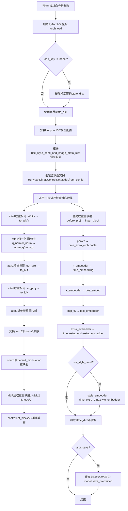
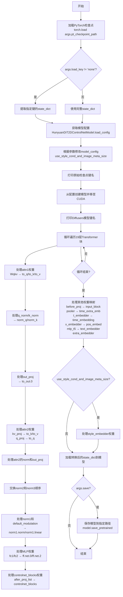
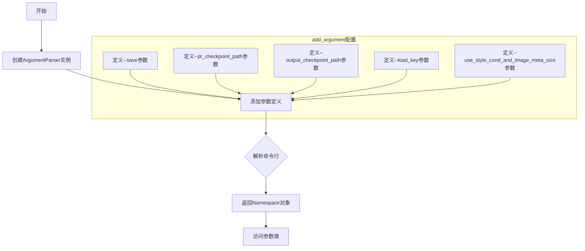
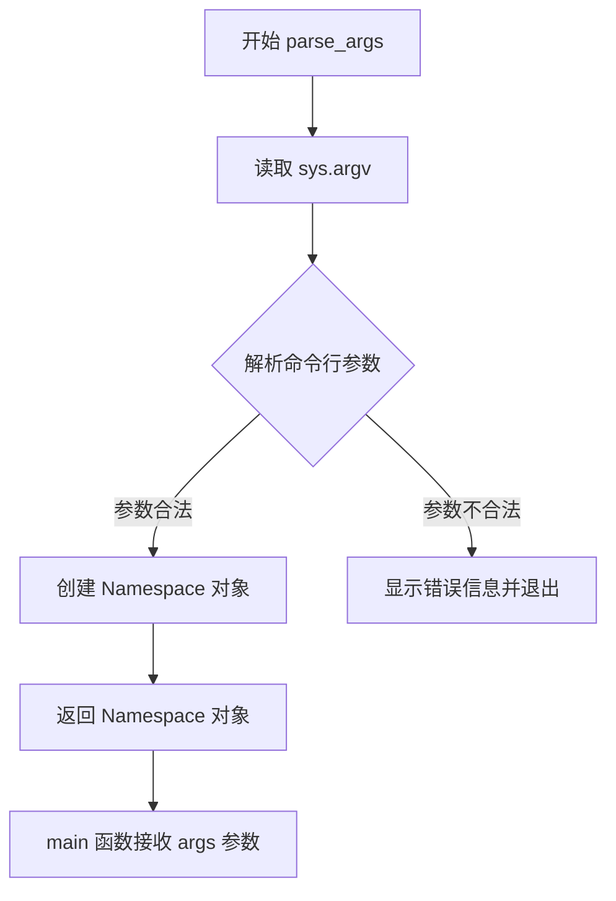
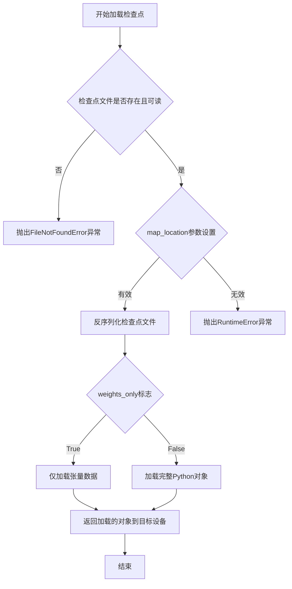
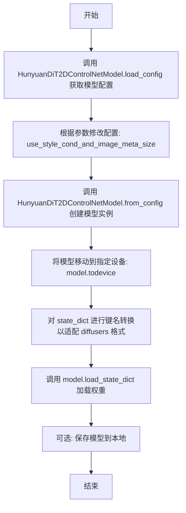
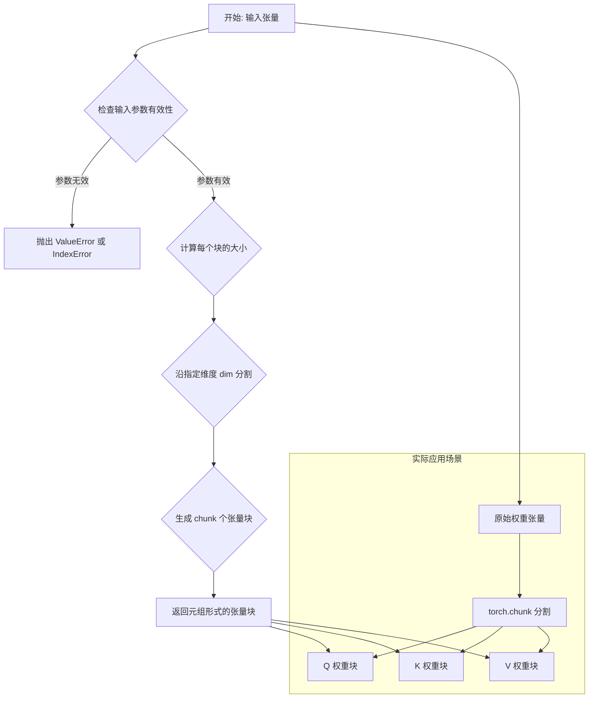
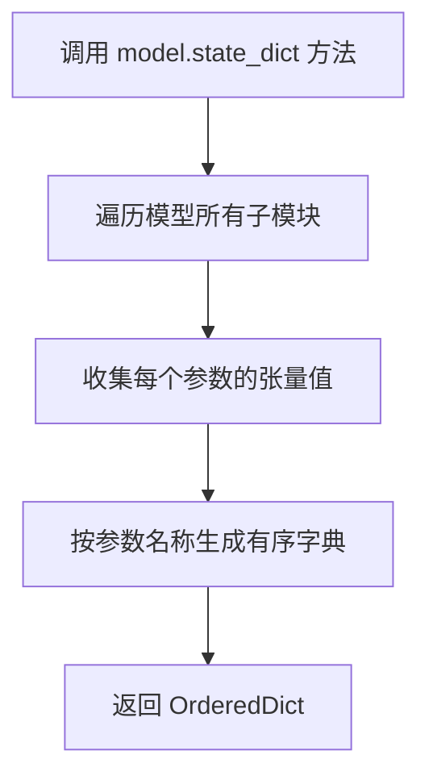
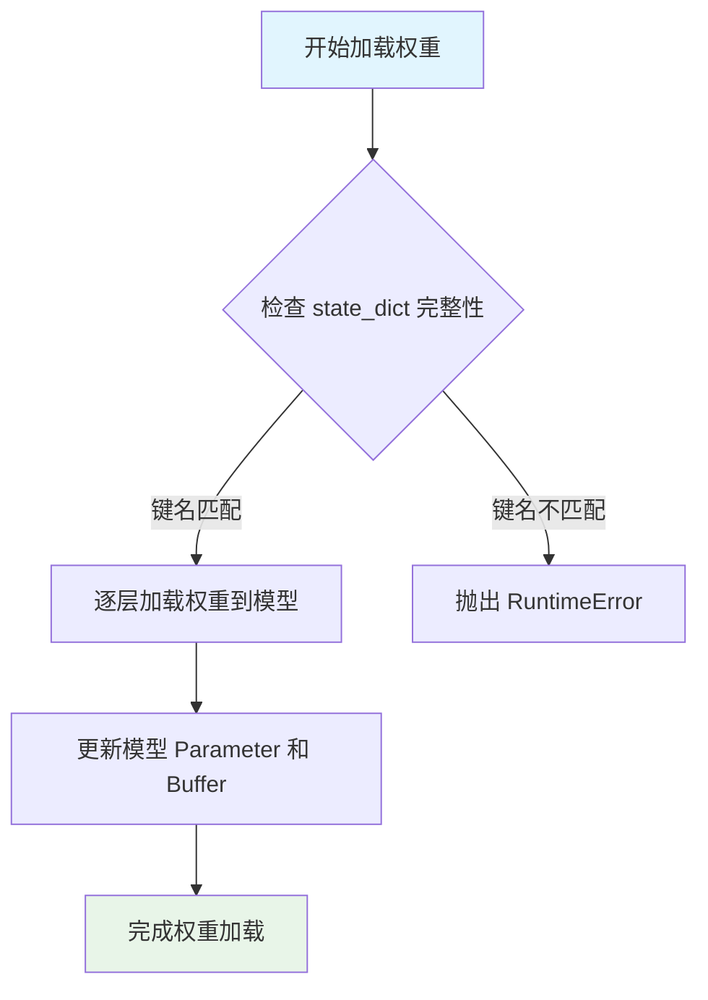
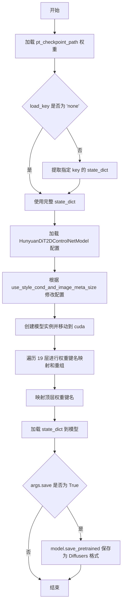

# `diffusers\scripts\convert_hunyuandit_controlnet_to_diffusers.py` 详细设计文档

这是一个模型权重转换脚本，用于将腾讯HunyuanDiT的原始PyTorch检查点(.pt格式)转换为HuggingFace Diffusers格式。脚本通过重新映射权重键名、调整模型结构以适配Diffusers库的要求，包括处理注意力层、MLP层、归一化层和各类嵌入器的权重转换，最终可选择保存为Diffusers兼容的模型格式。

## 整体流程



## 类结构

```
该脚本为单文件脚本，无类定义
主要组件为main函数和argparse参数解析器
依赖外部库: torch, diffusers(HunyuanDiT2DControlNetModel), argparse
```

## 全局变量及字段


### `args`
    
命令行参数对象，包含save、pt_checkpoint_path、output_checkpoint_path、load_key、use_style_cond_and_image_meta_size等配置

类型：`argparse.Namespace`
    


### `state_dict`
    
模型权重字典，存储从.pt文件加载的键值对，键为权重名称，值为torch.Tensor

类型：`dict`
    


### `model_config`
    
HunyuanDiT模型配置字典，包含模型架构参数和use_style_cond_and_image_meta_size标志

类型：`dict`
    


### `model`
    
实例化的Diffusers模型对象，用于加载转换后的权重

类型：`HunyuanDiT2DControlNetModel`
    


### `device`
    
计算设备，固定为'cuda'，模型将在GPU上运行

类型：`str`
    


### `num_layers`
    
模型层数，固定为19，表示HunyuanDiT的Transformer块数量

类型：`int`
    


### `i`
    
循环变量，用于遍历0到18的层索引

类型：`int`
    


### `q`
    
注意力机制中attn1的query权重矩阵

类型：`torch.Tensor`
    


### `k`
    
注意力机制中attn1的key权重矩阵

类型：`torch.Tensor`
    


### `v`
    
注意力机制中attn1的value权重矩阵

类型：`torch.Tensor`
    


### `q_bias`
    
query对应的偏置向量

类型：`torch.Tensor`
    


### `k_bias`
    
key对应的偏置向量

类型：`torch.Tensor`
    


### `v_bias`
    
value对应的偏置向量

类型：`torch.Tensor`
    


### `norm2_weight`
    
norm2层的权重，用于后续交换norm2和norm3

类型：`torch.Tensor`
    


### `norm2_bias`
    
norm2层的偏置，用于后续交换norm2和norm3

类型：`torch.Tensor`
    


    

## 全局函数及方法


### `main`

该函数是模型权重转换的主入口，负责将HunyuanDiT的原始PyTorch检查点（.pt格式）转换为Diffusers格式的模型权重。主要工作包括加载检查点、重映射权重键（适配Diffusers架构的命名规范）、处理注意力机制和MLP层的权重拆分与重组、以及最终保存转换后的模型。

参数：

- `args`：`argparse.Namespace`，包含以下属性：
  - `pt_checkpoint_path`：str，原始PyTorch检查点文件路径
  - `output_checkpoint_path`：str，转换后的Diffusers模型保存路径
  - `load_key`：str，需要从检查点中加载的特定键名（若为"none"则加载整个字典）
  - `use_style_cond_and_image_meta_size`：bool，控制是否使用style条件与图像元数据尺寸（版本v1.1及以前为True，v1.2及以后为False）
  - `save`：bool，是否保存转换后的模型

返回值：`None`，无返回值（仅执行模型转换和保存操作）

#### 流程图



#### 带注释源码

```python
def main(args):
    """
    主函数：执行模型权重从PyTorch格式到Diffusers格式的转换
    
    转换流程：
    1. 加载原始PyTorch检查点文件
    2. 根据配置创建Diffusers模型结构
    3. 将原始权重键名重映射为Diffusers格式
    4. 加载权重到模型并保存
    """
    
    # ---------- 步骤1：加载检查点 ----------
    # 使用torch.load加载原始.pth格式的权重文件，map_location="cpu"确保在CPU上加载
    state_dict = torch.load(args.pt_checkpoint_path, map_location="cpu")

    # ---------- 步骤2：处理嵌套的检查点结构 ----------
    # 某些检查点将权重嵌套在特定键下（如"state_dict"或"model"）
    if args.load_key != "none":
        try:
            # 尝试从指定键提取权重字典
            state_dict = state_dict[args.load_key]
        except KeyError:
            # 键不存在时抛出详细错误信息，显示可用键列表
            raise KeyError(
                f"{args.load_key} not found in the checkpoint."
                "Please load from the following keys:{state_dict.keys()}"
            )
    
    # 设置目标设备为CUDA（GPU）
    device = "cuda"

    # ---------- 步骤3：加载模型配置 ----------
    # 从HuggingFace Hub获取预定义的模型配置
    # 配置定义了模型架构、层数、隐藏维度等参数
    model_config = HunyuanDiT2DControlNetModel.load_config(
        "Tencent-Hunyuan/HunyuanDiT-v1.2-Diffusers", subfolder="transformer"
    )
    
    # 根据版本选择是否启用style条件
    # v1.1及以前版本：True（启用）
    # v1.2及以后版本：False（禁用）
    model_config["use_style_cond_and_image_meta_size"] = (
        args.use_style_cond_and_image_meta_size
    )
    print(model_config)

    # 打印原始检查点中的所有键名，便于调试和对比
    for key in state_dict:
        print("local:", key)

    # ---------- 步骤4：创建空模型 ----------
    # 使用配置初始化模型结构（权重未初始化，会随机初始化）
    # 然后将模型移至GPU设备
    model = HunyuanDiT2DControlNetModel.from_config(model_config).to(device)

    # 打印Diffusers模型的所有键名，用于映射对照
    for key in model.state_dict():
        print("diffusers:", key)

    # ---------- 步骤5：转换核心层权重 ----------
    # HunyuanDiT使用不同的权重命名和组织方式
    # 需要遍历19层Transformer块进行权重重映射
    
    num_layers = 19
    for i in range(num_layers):
        # === 处理自注意力块 (attn1) ===
        # 原始：Wqkv.weight (合并的Q/K/V投影) → 转换：to_q, to_k, to_v 权重
        # 使用torch.chunk将合并的权重按维度0（输出通道）拆分为3份
        q, k, v = torch.chunk(state_dict[f"blocks.{i}.attn1.Wqkv.weight"], 3, dim=0)
        q_bias, k_bias, v_bias = torch.chunk(state_dict[f"blocks.{i}.attn1.Wqkv.bias"], 3, dim=0)
        
        # 重新赋值到新的键名
        state_dict[f"blocks.{i}.attn1.to_q.weight"] = q
        state_dict[f"blocks.{i}.attn1.to_q.bias"] = q_bias
        state_dict[f"blocks.{i}.attn1.to_k.weight"] = k
        state_dict[f"blocks.{i}.attn1.to_k.bias"] = k_bias
        state_dict[f"blocks.{i}.attn1.to_v.weight"] = v
        state_dict[f"blocks.{i}.attn1.to_v.bias"] = v_bias
        
        # 删除旧的合并权重键
        state_dict.pop(f"blocks.{i}.attn1.Wqkv.weight")
        state_dict.pop(f"blocks.{i}.attn1.Wqkv.bias")

        # === 处理Q/K归一化层 ===
        # 原始：q_norm, k_norm → 转换：norm_q, norm_k
        state_dict[f"blocks.{i}.attn1.norm_q.weight"] = state_dict[f"blocks.{i}.attn1.q_norm.weight"]
        state_dict[f"blocks.{i}.attn1.norm_q.bias"] = state_dict[f"blocks.{i}.attn1.q_norm.bias"]
        state_dict[f"blocks.{i}.attn1.norm_k.weight"] = state_dict[f"blocks.{i}.attn1.k_norm.weight"]
        state_dict[f"blocks.{i}.attn1.norm_k.bias"] = state_dict[f"blocks.{i}.attn1.k_norm.bias"]

        # 删除旧键
        state_dict.pop(f"blocks.{i}.attn1.q_norm.weight")
        state_dict.pop(f"blocks.{i}.attn1.q_norm.bias")
        state_dict.pop(f"blocks.{i}.attn1.k_norm.weight")
        state_dict.pop(f"blocks.{i}.attn1.k_norm.bias")

        # === 处理输出投影层 ===
        # 原始：out_proj → 转换：to_out.0
        state_dict[f"blocks.{i}.attn1.to_out.0.weight"] = state_dict[f"blocks.{i}.attn1.out_proj.weight"]
        state_dict[f"blocks.{i}.attn1.to_out.0.bias"] = state_dict[f"blocks.{i}.attn1.out_proj.bias"]
        state_dict.pop(f"blocks.{i}.attn1.out_proj.weight")
        state_dict.pop(f"blocks.{i}.attn1.out_proj.bias")

        # === 处理交叉注意力块 (attn2) ===
        # 原始：kv_proj (合并的K/V) → 转换：to_k, to_v
        k, v = torch.chunk(state_dict[f"blocks.{i}.attn2.kv_proj.weight"], 2, dim=0)
        k_bias, v_bias = torch.chunk(state_dict[f"blocks.{i}.attn2.kv_proj.bias"], 2, dim=0)
        state_dict[f"blocks.{i}.attn2.to_k.weight"] = k
        state_dict[f"blocks.{i}.attn2.to_k.bias"] = k_bias
        state_dict[f"blocks.{i}.attn2.to_v.weight"] = v
        state_dict[f"blocks.{i}.attn2.to_v.bias"] = v_bias
        state_dict.pop(f"blocks.{i}.attn2.kv_proj.weight")
        state_dict.pop(f"blocks.{i}.attn2.kv_proj.bias")

        # 原始：q_proj → 转换：to_q
        state_dict[f"blocks.{i}.attn2.to_q.weight"] = state_dict[f"blocks.{i}.attn2.q_proj.weight"]
        state_dict[f"blocks.{i}.attn2.to_q.bias"] = state_dict[f"blocks.{i}.attn2.q_proj.bias"]
        state_dict.pop(f"blocks.{i}.attn2.q_proj.weight")
        state_dict.pop(f"blocks.{i}.attn2.q_proj.bias")

        # attn2的归一化层映射
        state_dict[f"blocks.{i}.attn2.norm_q.weight"] = state_dict[f"blocks.{i}.attn2.q_norm.weight"]
        state_dict[f"blocks.{i}.attn2.norm_q.bias"] = state_dict[f"blocks.{i}.attn2.q_norm.bias"]
        state_dict[f"blocks.{i}.attn2.norm_k.weight"] = state_dict[f"blocks.{i}.attn2.k_norm.weight"]
        state_dict[f"blocks.{i}.attn2.norm_k.bias"] = state_dict[f"blocks.{i}.attn2.k_norm.bias"]

        state_dict.pop(f"blocks.{i}.attn2.q_norm.weight")
        state_dict.pop(f"blocks.{i}.attn2.q_norm.bias")
        state_dict.pop(f"blocks.{i}.attn2.k_norm.weight")
        state_dict.pop(f"blocks.{i}.attn2.k_norm.bias")

        # attn2的输出投影
        state_dict[f"blocks.{i}.attn2.to_out.0.weight"] = state_dict[f"blocks.{i}.attn2.out_proj.weight"]
        state_dict[f"blocks.{i}.attn2.to_out.0.bias"] = state_dict[f"blocks.{i}.attn2.out_proj.bias"]
        state_dict.pop(f"blocks.{i}.attn2.out_proj.weight")
        state_dict.pop(f"blocks.{i}.attn2.out_proj.bias")

        # === 调整归一化层顺序 ===
        # 原始架构中norm2和norm3的位置需要交换
        norm2_weight = state_dict[f"blocks.{i}.norm2.weight"]
        norm2_bias = state_dict[f"blocks.{i}.norm2.bias"]
        state_dict[f"blocks.{i}.norm2.weight"] = state_dict[f"blocks.{i}.norm3.weight"]
        state_dict[f"blocks.{i}.norm2.bias"] = state_dict[f"blocks.{i}.norm3.bias"]
        state_dict[f"blocks.{i}.norm3.weight"] = norm2_weight
        state_dict[f"blocks.{i}.norm3.bias"] = norm2_bias

        # === 处理Norm1和调制模块 ===
        # 原始：norm1.weight/bias + default_modulation.1 → 转换：norm1.norm + norm1.linear
        state_dict[f"blocks.{i}.norm1.norm.weight"] = state_dict[f"blocks.{i}.norm1.weight"]
        state_dict[f"blocks.{i}.norm1.norm.bias"] = state_dict[f"blocks.{i}.norm1.bias"]
        state_dict[f"blocks.{i}.norm1.linear.weight"] = state_dict[f"blocks.{i}.default_modulation.1.weight"]
        state_dict[f"blocks.{i}.norm1.linear.bias"] = state_dict[f"blocks.{i}.default_modulation.1.bias"]
        state_dict.pop(f"blocks.{i}.norm1.weight")
        state_dict.pop(f"blocks.{i}.norm1.bias")
        state_dict.pop(f"blocks.{i}.default_modulation.1.weight")
        state_dict.pop(f"blocks.{i}.default_modulation.1.bias")

        # === 处理前馈网络 (MLP) ===
        # 原始：mlp.fc1/fc2 → 转换：ff.net.0.proj / ff.net.2
        state_dict[f"blocks.{i}.ff.net.0.proj.weight"] = state_dict[f"blocks.{i}.mlp.fc1.weight"]
        state_dict[f"blocks.{i}.ff.net.0.proj.bias"] = state_dict[f"blocks.{i}.mlp.fc1.bias"]
        state_dict[f"blocks.{i}.ff.net.2.weight"] = state_dict[f"blocks.{i}.mlp.fc2.weight"]
        state_dict[f"blocks.{i}.ff.net.2.bias"] = state_dict[f"blocks.{i}.mlp.fc2.bias"]
        state_dict.pop(f"blocks.{i}.mlp.fc1.weight")
        state_dict.pop(f"blocks.{i}.mlp.fc1.bias")
        state_dict.pop(f"blocks.{i}.mlp.fc2.weight")
        state_dict.pop(f"blocks.{i}.mlp.fc2.bias")

        # === 处理ControlNet块 ===
        # 原始：after_proj_list → 转换：controlnet_blocks
        state_dict[f"controlnet_blocks.{i}.weight"] = state_dict[f"after_proj_list.{i}.weight"]
        state_dict[f"controlnet_blocks.{i}.bias"] = state_dict[f"after_proj_list.{i}.bias"]
        state_dict.pop(f"after_proj_list.{i}.weight")
        state_dict.pop(f"after_proj_list.{i}.bias")

    # ---------- 步骤6：转换全局层权重 ----------
    
    # 输入投影层：before_proj → input_block
    state_dict["input_block.weight"] = state_dict["before_proj.weight"]
    state_dict["input_block.bias"] = state_dict["before_proj.bias"]
    state_dict.pop("before_proj.weight")
    state_dict.pop("before_proj.bias")

    # 时间池化嵌入器：pooler → time_extra_emb.pooler
    state_dict["time_extra_emb.pooler.positional_embedding"] = state_dict["pooler.positional_embedding"]
    state_dict["time_extra_emb.pooler.k_proj.weight"] = state_dict["pooler.k_proj.weight"]
    state_dict["time_extra_emb.pooler.k_proj.bias"] = state_dict["pooler.k_proj.bias"]
    state_dict["time_extra_emb.pooler.q_proj.weight"] = state_dict["pooler.q_proj.weight"]
    state_dict["time_extra_emb.pooler.q_proj.bias"] = state_dict["pooler.q_proj.bias"]
    state_dict["time_extra_emb.pooler.v_proj.weight"] = state_dict["pooler.v_proj.weight"]
    state_dict["time_extra_emb.pooler.v_proj.bias"] = state_dict["pooler.v_proj.bias"]
    state_dict["time_extra_emb.pooler.c_proj.weight"] = state_dict["pooler.c_proj.weight"]
    state_dict["time_extra_emb.pooler.c_proj.bias"] = state_dict["pooler.c_proj.bias"]
    state_dict.pop("pooler.k_proj.weight")
    state_dict.pop("pooler.k_proj.bias")
    state_dict.pop("pooler.q_proj.weight")
    state_dict.pop("pooler.q_proj.bias")
    state_dict.pop("pooler.v_proj.weight")
    state_dict.pop("pooler.v_proj.bias")
    state_dict.pop("pooler.c_proj.weight")
    state_dict.pop("pooler.c_proj.bias")
    state_dict.pop("pooler.positional_embedding")

    # 时间步嵌入器：t_embedder → time_embedding (TimestepEmbedding)
    state_dict["time_extra_emb.timestep_embedder.linear_1.bias"] = state_dict["t_embedder.mlp.0.bias"]
    state_dict["time_extra_emb.timestep_embedder.linear_1.weight"] = state_dict["t_embedder.mlp.0.weight"]
    state_dict["time_extra_emb.timestep_embedder.linear_2.bias"] = state_dict["t_embedder.mlp.2.bias"]
    state_dict["time_extra_emb.timestep_embedder.linear_2.weight"] = state_dict["t_embedder.mlp.2.weight"]

    state_dict.pop("t_embedder.mlp.0.bias")
    state_dict.pop("t_embedder.mlp.0.weight")
    state_dict.pop("t_embedder.mlp.2.bias")
    state_dict.pop("t_embedder.mlp.2.weight")

    # 位置嵌入：x_embedder → pos_embed (PatchEmbed)
    state_dict["pos_embed.proj.weight"] = state_dict["x_embedder.proj.weight"]
    state_dict["pos_embed.proj.bias"] = state_dict["x_embedder.proj.bias"]
    state_dict.pop("x_embedder.proj.weight")
    state_dict.pop("x_embedder.proj.bias")

    # 文本嵌入器：mlp_t5 → text_embedder
    state_dict["text_embedder.linear_1.bias"] = state_dict["mlp_t5.0.bias"]
    state_dict["text_embedder.linear_1.weight"] = state_dict["mlp_t5.0.weight"]
    state_dict["text_embedder.linear_2.bias"] = state_dict["mlp_t5.2.bias"]
    state_dict["text_embedder.linear_2.weight"] = state_dict["mlp_t5.2.weight"]
    state_dict.pop("mlp_t5.0.bias")
    state_dict.pop("mlp_t5.0.weight")
    state_dict.pop("mlp_t5.2.bias")
    state_dict.pop("mlp_t5.2.weight")

    # 额外嵌入器：extra_embedder → time_extra_emb.extra_embedder
    state_dict["time_extra_emb.extra_embedder.linear_1.bias"] = state_dict["extra_embedder.0.bias"]
    state_dict["time_extra_emb.extra_embedder.linear_1.weight"] = state_dict["extra_embedder.0.weight"]
    state_dict["time_extra_emb.extra_embedder.linear_2.bias"] = state_dict["extra_embedder.2.bias"]
    state_dict["time_extra_emb.extra_embedder.linear_2.weight"] = state_dict["extra_embedder.2.weight"]
    state_dict.pop("extra_embedder.0.bias")
    state_dict.pop("extra_embedder.0.weight")
    state_dict.pop("extra_embedder.2.bias")
    state_dict.pop("extra_embedder.2.weight")

    # ---------- 步骤7：处理Style嵌入器 ----------
    # 仅在旧版本(v1.1及以前)需要处理
    if model_config["use_style_cond_and_image_meta_size"]:
        print(state_dict["style_embedder.weight"])
        print(state_dict["style_embedder.weight"].shape)
        # 取第一个style嵌入向量
        state_dict["time_extra_emb.style_embedder.weight"] = state_dict["style_embedder.weight"][0:1]
        state_dict.pop("style_embedder.weight")

    # ---------- 步骤8：加载并保存模型 ----------
    # 将转换后的权重加载到模型结构中
    model.load_state_dict(state_dict)

    # 根据参数决定是否保存
    if args.save:
        # 保存为Diffusers格式的模型到指定路径
        model.save_pretrained(args.output_checkpoint_path)
```


### `argparse.ArgumentParser`

用于创建命令行参数解析器实例，允许程序定义各种命令行选项和参数，并自动生成帮助信息。

参数：

- `prog`：可选，程序名称，默认为`sys.argv[0]`
- `usage`：可选，描述程序用法的字符串，默认根据添加的参数自动生成
- `description`：可选，在参数帮助信息之前显示的文本，描述程序功能
- `epilog`：可选，在参数帮助信息之后显示的文本
- `parents`：可选，一个`ArgumentParser`对象的列表，这些对象的参数会被包含进来
- `formatter_class`：可选，用于自定义帮助格式的类
- `prefix_chars`：可选，选项前缀字符集合，默认是`-`
- `fromfile_prefix_chars`：可选，文件名作为额外参数读取时的前缀字符
- `add_help`：可选，是否添加`-h/--help`选项，默认为`True`
- `allow_abbrev`：可选，是否允许长选项的缩写匹配，默认为`True`
- `conflict_handler`：可选，处理冲突的策略，通常为`"error"`或`"resolve"`
- `add_subparsers`：可选，是否添加子解析器
- `debug`：可选，启用调试模式（已废弃）

返回值：`ArgumentParser`对象，返回一个命令行参数解析器实例，用于后续添加和管理命令行参数。

#### 流程图



#### 带注释源码

```python
# 创建命令行参数解析器实例
# description参数描述了此脚本的用途：用于将HunyuanDiT的.pt检查点转换为Diffusers格式
parser = argparse.ArgumentParser(
    description="Convert HunyuanDiT .pt checkpoint to Diffusers format."
)

# 添加 --save 参数：控制是否保存转换后的模型
# type=bool 的使用存在问题：bool("False") 会返回 True，因为非空字符串都为真
# 建议使用 action="store_true" 或 action="store_false" 代替
parser.add_argument(
    "--save", 
    default=True, 
    type=bool, 
    required=False, 
    help="Whether to save the converted pipeline or not."
)

# 添加 --pt_checkpoint_path 参数：输入的.pt预训练模型路径
# required=True 表示此参数为必填项
parser.add_argument(
    "--pt_checkpoint_path", 
    default=None, 
    type=str, 
    required=True, 
    help="Path to the .pt pretrained model."
)

# 添加 --output_checkpoint_path 参数：输出的Diffusers格式模型保存路径
# required=False 可选参数，不提供时使用默认值None
parser.add_argument(
    "--output_checkpoint_path",
    default=None,
    type=str,
    required=False,
    help="Path to the output converted diffusers pipeline.",
)

# 添加 --load_key 参数：从.pt文件中加载特定键的值
# default="none" 表示默认不从特定键加载
parser.add_argument(
    "--load_key", 
    default="none", 
    type=str, 
    required=False, 
    help="The key to load from the pretrained .pt file"
)

# 添加 --use_style_cond_and_image_meta_size 参数：控制是否使用风格条件
# version <= v1.1: True; version >= v1.2: False
parser.add_argument(
    "--use_style_cond_and_image_meta_size",
    type=bool,
    default=False,
    help="version <= v1.1: True; version >= v1.2: False",
)

# 解析命令行参数，将参数值存储到args对象中
args = parser.parse_args()

# 传递给main函数进行处理
main(args)
```


### `parser.parse_args()`

解析命令行参数，将用户输入的命令行参数转换为 Namespace 对象，供后续代码使用。

参数：
- （无显式参数，调用的是对象方法）

返回值：`Namespace`，包含所有命令行参数解析后的值

- `save`：布尔值，是否保存转换后的模型
- `pt_checkpoint_path`：字符串，输入的 PyTorch 检查点路径
- `output_checkpoint_path`：字符串，输出的 Diffusers 管道路径
- `load_key`：字符串，从检查点加载的键名
- `use_style_cond_and_image_meta_size`：布尔值，是否使用风格条件和图像元数据大小

#### 流程图



#### 带注释源码

```python
# 在脚本末尾创建 ArgumentParser 实例
parser = argparse.ArgumentParser()

# 添加 --save 参数：是否保存转换后的管道
parser.add_argument(
    "--save", 
    default=True, 
    type=bool, 
    required=False, 
    help="Whether to save the converted pipeline or not."
)

# 添加 --pt_checkpoint_path 参数：输入的 .pt 预训练模型路径
parser.add_argument(
    "--pt_checkpoint_path", 
    default=None, 
    type=str, 
    required=True, 
    help="Path to the .pt pretrained model."
)

# 添加 --output_checkpoint_path 参数：输出的 Diffusers 管道路径
parser.add_argument(
    "--output_checkpoint_path",
    default=None,
    type=str,
    required=False,
    help="Path to the output converted diffusers pipeline."
)

# 添加 --load_key 参数：从预训练 .pt 文件加载的键名
parser.add_argument(
    "--load_key", 
    default="none", 
    type=str, 
    required=False, 
    help="The key to load from the pretrained .pt file"
)

# 添加 --use_style_cond_and_image_meta_size 参数：版本控制标志
parser.add_argument(
    "--use_style_cond_and_image_meta_size",
    type=bool,
    default=False,
    help="version <= v1.1: True; version >= v1.2: False",
)

# 解析命令行参数，返回 Namespace 对象
args = parser.parse_args()
```


### `torch.load`

加载PyTorch检查点文件（.pt/.pth文件），将序列化对象从磁盘加载到内存中，支持设备映射和自定义加载行为。

参数：

- `f`：`str` 或 `file-like object`，检查点文件的路径或文件对象（代码中通过 `args.pt_checkpoint_path` 传入）
- `map_location`：`str`、`torch.device` 或 `dict`，指定如何将存储位置映射到目标设备（代码中设置为 `"cpu"`，表示将所有张量加载到CPU）
- `weights_only`：`bool`，如果为 `True`，则只加载张量而不加载Python对象（如CUDA容器等），默认为 `False`（代码中未显式设置）

返回值：`dict` 或 `object`，返回加载的检查点对象，通常是一个包含模型权重和其他数据的字典（代码中赋值给 `state_dict`）

#### 流程图



#### 带注释源码

```python
# 使用torch.load加载PyTorch检查点文件
# 参数说明：
#   args.pt_checkpoint_path: 检查点文件的路径（字符串）
#   map_location="cpu": 将所有张量映射到CPU设备，即使原始模型在GPU上
state_dict = torch.load(args.pt_checkpoint_path, map_location="cpu")
# 返回值state_dict是一个字典，包含了原始模型的所有权重参数
# 例如：{'model.weights': tensor([...]), 'model.bias': tensor([...]), ...}
```


### `HunyuanDiT2DControlNetModel.load_config`

该函数是 `diffusers` 库中 `HunyuanDiT2DControlNetModel` 类的类方法，用于从预训练的 Hugging Face Hub 模型或本地路径加载模型配置文件，并返回一个包含模型架构参数的字典。

参数：

- `pretrained_model_name_or_path`：`str`，预训练模型的名称（如 "Tencent-Hunyuan/HunyuanDiT-v1.2-Diffusers"）或本地路径
- `subfolder`：`str`，指定从模型目录中的哪个子文件夹加载配置文件（如 "transformer"）
- `cache_dir`（可选）：`str`，缓存目录（未在代码中显式使用）
- `force_download`（可选）：`bool`，是否强制重新下载（未在代码中显式使用）

返回值：`Dict`，返回一个包含模型配置信息的字典，例如层数、隐藏大小、注意力头数等架构参数，以及 `use_style_cond_and_image_meta_size` 等标志位。

#### 流程图

```mermaid
flowchart TD
    A[开始] --> B[接收 pretrained_model_name_or_path 和 subfolder 参数]
    B --> C[构建配置文件路径: {path}/{subfolder}/config.json]
    C --> D{检查本地是否存在配置文件}
    D -->|是| E[从本地加载 config.json]
    D -->|否| F[从 Hugging Face Hub 下载配置文件]
    E --> G[解析 JSON 配置为字典]
    F --> G
    G --> H[返回模型配置字典]
    H --> I{调用者是否需要修改配置}
    I -->|是| J[修改 model_config['use_style_cond_and_image_meta_size']]
    I -->|否| K[结束]
    J --> K
```

#### 带注释源码

```python
# HunyuanDiT2DControlNetModel.load_config() 调用示例（从提供代码中提取）
# 此函数为 diffusers 库内部实现，这里展示调用方式及上下文

# 第1步：调用类方法加载配置
# 参数1: 模型在 Hugging Face Hub 上的名称或本地路径
# 参数2: 指定从 'transformer' 子文件夹加载配置
model_config = HunyuanDiT2DControlNetModel.load_config(
    "Tencent-Hunyuan/HunyuanDiT-v1.2-Diffusers", 
    subfolder="transformer"
)

# 第2步：根据版本特性修改配置项
# v1.1 及之前版本: use_style_cond_and_image_meta_size = True
# v1.2 及之后版本: use_style_cond_and_image_meta_size = False
# 该配置项控制是否使用样式条件注入和图像元数据大小
model_config["use_style_cond_and_image_meta_size"] = (
    args.use_style_cond_and_image_meta_size
)

# 第3步：打印配置信息用于调试
print(model_config)

# 第4步：使用配置字典初始化模型
# from_config() 方法接收配置字典并实例化模型对象
model = HunyuanDiT2DControlNetModel.from_config(model_config).to(device)

# load_config() 函数内部逻辑推断（基于 diffusers 库通用模式）：
# 1. 接收 pretrained_model_name_or_path 和 subfolder 参数
# 2. 拼接完整配置文件路径: {base_path}/{subfolder}/config.json
# 3. 检查本地是否存在配置文件，如不存在则从 Hub 下载
# 4. 读取并解析 config.json 文件为 Python 字典
# 5. 返回包含以下关键信息的配置字典:
#    - hidden_size: 隐藏层维度
#    - num_hidden_layers: Transformer 层数 (如 19)
#    - num_attention_heads: 注意力头数
#    - use_style_cond_and_image_meta_size: 样式条件标志
#    - 其它架构相关参数
```


### `HunyuanDiT2DControlNetModel.from_config()`

从给定的配置字典创建 HunyuanDiT2DControlNetModel 模型实例。该方法是 diffusers 库提供的类方法，用于根据预定义的配置参数初始化模型结构，但不加载权重。

参数：

-  `config`：`Dict` 或 `str`，模型配置字典或配置路径。在代码中通过 `HunyuanDiT2DControlNetModel.load_config()` 返回的配置字典传入，包含模型的结构信息如 `use_style_cond_and_image_meta_size` 等参数。

返回值：`HunyuanDiT2DControlNetModel`，返回一个新创建的模型实例，该实例具有配置中指定的结构，但权重未初始化。

#### 流程图



#### 带注释源码

```python
# 从 diffusers 库导入 HunyuanDiT2DControlNetModel 类
from diffusers import HunyuanDiT2DControlNetModel

def main(args):
    # ... 前面的 checkpoint 加载代码省略 ...
    
    # 步骤1: 加载模型配置
    # 调用类的静态方法 load_config 从预训练模型目录获取配置
    model_config = HunyuanDiT2DControlNetModel.load_config(
        "Tencent-Hunyuan/HunyuanDiT-v1.2-Diffusers",  # HuggingFace 模型ID或本地路径
        subfolder="transformer"                        # 指定子文件夹
    )
    
    # 步骤2: 根据需求修改配置参数
    # use_style_cond_and_image_meta_size 控制是否使用风格条件
    # v1.1及之前版本: True; v1.2及之后版本: False
    model_config["use_style_cond_and_image_meta_size"] = (
        args.use_style_cond_and_image_meta_size
    )
    
    # 步骤3: 从配置创建模型实例
    # from_config 是类方法，根据配置字典初始化模型结构
    # 此时模型权重是随机初始化的
    model = HunyuanDiT2DControlNetModel.from_config(model_config).to(device)
    
    # 步骤4: 加载转换后的权重
    model.load_state_dict(state_dict)
    
    # 步骤5: 可选保存
    if args.save:
        model.save_pretrained(args.output_checkpoint_path)
```

---

**注意**：此方法来源于 `diffusers` 库的 `HunyuanDiT2DControlNetModel` 类，源代码不在本项目中。上面的信息是通过代码调用方式逆向推断得出的。该方法通常还会接受其他可选参数（如 `torch_dtype` 指定数据类型、`device_map` 指定设备映射等），具体请参考 diffusers 官方文档。


### `torch.chunk`

将张量沿指定维度分割成多个均匀的块，返回一个元组形式的张量列表。

参数：

- `input`：`torch.Tensor`，要分割的输入张量
- `chunks`：`int`，要分割的块数量
- `dim`：`int`，要沿其分割的维度索引

返回值：`Tuple[torch.Tensor, ...]`，由分割后的张量块组成的元组

#### 流程图



#### 带注释源码

```python
# torch.chunk() 函数使用示例 - 来自 HunyuanDiT 模型权重转换脚本

# 场景1: 将 attn1 的 Wqkv 权重分割成 Q, K, V 三个独立权重
# 参数说明:
#   - input: state_dict[f"blocks.{i}.attn1.Wqkv.weight"] - 原始合并的权重张量
#   - chunks: 3 - 分割成3块 (Q, K, V)
#   - dim: 0 - 沿第0维进行分割
q, k, v = torch.chunk(state_dict[f"blocks.{i}.attn1.Wqkv.weight"], 3, dim=0)

# 同样分割偏置项
q_bias, k_bias, v_bias = torch.chunk(state_dict[f"blocks.{i}.attn1.Wqkv.bias"], 3, dim=0)

# 场景2: 将 attn2 的 kv_proj 权重分割成 K, V 两个独立权重
# 参数说明:
#   - input: state_dict[f"blocks.{i}.attn2.kv_proj.weight"] - 原始KV投影权重
#   - chunks: 2 - 分割成2块 (K, V)
#   - dim: 0 - 沿第0维进行分割
k, v = torch.chunk(state_dict[f"blocks.{i}.attn2.kv_proj.weight"], 2, dim=0)

# 同样分割偏置项
k_bias, v_bias = torch.chunk(state_dict[f"blocks.{i}.attn2.kv_proj.bias"], 2, dim=0)

# 分割后的权重被重新分配到新的键名
state_dict[f"blocks.{i}.attn1.to_q.weight"] = q
state_dict[f"blocks.{i}.attn1.to_k.weight"] = k
state_dict[f"blocks.{i}.attn1.to_v.weight"] = v

# 原始合并的权重键被删除
state_dict.pop(f"blocks.{i}.attn1.Wqkv.weight")
state_dict.pop(f"blocks.{i}.attn1.Wqkv.bias")
```

#### 关键组件信息

| 组件名称 | 一句话描述 |
|---------|-----------|
| Wqkv 权重分割 | 将Transformer块中attn1的合并QKV权重拆分为独立的to_q、to_k、to_v权重 |
| kv_proj 权重分割 | 将attn2的键值投影权重拆分为独立的to_k和to_v权重 |
| 权重键重映射 | 通过分割和重映射实现从旧版HunyuanDiT权重格式到Diffusers格式的转换 |

#### 潜在的技术债务或优化空间

1. **硬编码的分割数量**：chunks 参数（3和2）是硬编码的，建议使用常量或配置方式管理
2. **缺乏错误处理**：没有检查分割后张量的形状是否符合预期
3. **重复代码模式**：多处使用相似的chunk模式，可以封装成辅助函数减少重复
4. **维度假设**：假设 dim=0 是正确的分割维度，缺乏动态验证

#### 其它项目

**设计目标**：将HunyuanDiT的旧版权重格式（.pt）转换为Diffusers兼容的格式，主要通过`torch.chunk`将合并的权重张量拆分为独立的注意力机制权重。

**错误处理**：
- 如果 `chunks` 不能被指定维度的大小整除，最后一个块会较小
- 如果 `dim` 超出张量维度范围，会抛出 `IndexError`

**数据流**：
```
旧权重(Wqkv/kv_proj) → torch.chunk() 分割 → 重新映射键名 → Diffusers模型权重
```

**外部依赖**：
- `torch`：PyTorch张量操作库
- `argparse`：命令行参数解析
- `diffusers.HunyyuanDiT2DControlNetModel`：目标模型配置和加载


### `model.state_dict()`

获取模型当前状态字典的键，返回模型中所有参数（包括权重和偏置）的有序字典，键为参数名称，值为对应的张量。

参数：

- （无，除隐含的 `self` 参数）

返回值：`OrderedDict[str, torch.Tensor]`，返回模型所有参数的字典，键是参数名称（如 `"blocks.0.attn1.to_q.weight"`），值是对应的张量对象。

#### 流程图



#### 带注释源码

```python
# model 是 HunyuanDiT2DControlNetModel 的实例
# 通过 from_config 创建并加载到 CUDA 设备
model = HunyuanDiT2DControlNetModel.from_config(model_config).to(device)

# 调用 state_dict() 方法获取模型当前所有参数的字典
# 用于获取 Diffusers 格式模型的参数键名称
for key in model.state_dict():
    print("diffusers:", key)

# state_dict() 方法返回 OrderedDict 类型
# 键示例: "blocks.0.attn1.to_q.weight", "blocks.0.attn1.to_q.bias" 等
# 值示例: torch.Tensor with shape [batch, seq_len, hidden_dim]

# 后续代码使用返回的字典进行键的映射和转换
# 例如将原始格式的 Wqkv.weight 转换为 to_q, to_k, to_v
```

#### 补充说明

| 项目 | 说明 |
|------|------|
| **所属类** | `torch.nn.Module` |
| **调用对象** | `model` (类型: `HunyuanDiT2DControlNetModel`) |
| **使用场景** | 在模型权重格式转换脚本中，用于获取目标 Diffusers 模型的参数键名称，以便与源 PyTorch 检查点的键进行映射和转换 |
| **依赖库** | `torch` |
| **调用位置** | 代码第 42-44 行 |


### `model.load_state_dict`

将转换后的模型权重加载到 HunyuanDiT2DControlNetModel 实例中，完成从原始 Checkpoint 格式到 Diffusers 格式的模型权重迁移。

参数：

- `state_dict`：`Dict[str, torch.Tensor]`，从 .pt 文件加载并经过复杂键名映射转换后的模型权重字典，包含了所有层的权重和偏置

返回值：`None`，该方法直接修改模型内部状态，不返回任何值

#### 流程图



#### 带注释源码

```python
# 在完成所有权重键名映射转换后调用
# state_dict 已经包含了所有转换后的权重，键名与 model 的结构完全对应
model.load_state_dict(state_dict)

# 内部执行流程：
# 1. 遍历 state_dict 中的每个键值对
# 2. 查找模型中对应的参数（通过键名匹配）
# 3. 将权重 tensor 加载到对应位置
# 4. 如果 strict=True（默认），所有键必须完全匹配，否则抛出错误
# 5. 如果存在 missing_keys 或 unexpected_keys，会记录但默认仍会抛出错误

# 转换后的键名示例：
# - "blocks.0.attn1.to_q.weight"
# - "blocks.0.attn1.to_k.weight" 
# - "blocks.0.attn1.to_v.weight"
# - "blocks.0.norm1.norm.weight"
# - "controlnet_blocks.0.weight"
# - "pos_embed.proj.weight"
# - "text_embedder.linear_1.weight"
# 等等...
```


### `model.save_pretrained`

将转换后的模型保存为 Diffusers 格式，用于后续的模型加载和推理。

参数：

- `save_directory`：`str`，保存模型的输出目录路径，代码中通过 `args.output_checkpoint_path` 传入

返回值：`None`，该方法直接将模型保存到磁盘，不返回任何值

#### 流程图



#### 带注释源码

```python
# 在 main 函数末尾调用 save_pretrained
if args.save:
    model.save_pretrained(args.output_checkpoint_path)

# 完整调用上下文：
# model: HunyuanDiT2DControlNetModel 实例，由 HuggingFace diffusers 库提供
# save_pretrained: 继承自 PreTrainedModel 基类的方法
# args.output_checkpoint_path: 命令行参数，指定输出目录路径
# 返回值: None (直接保存到磁盘)
```

## 关键组件


### 张量分割与重组 (Tensor Chunking and Restructuring)

使用 `torch.chunk` 将原始的联合权重矩阵（如 `Wqkv`、`kv_proj`）分割为独立的 Q、K、V 权重向量，并重新组织为 Diffusers 格式的键名。这是权重转换的核心操作。

### 键名映射与转换系统 (Key Mapping and Transformation System)

通过 `state_dict[f"..."] = state_dict[f"..."]` 和 `state_dict.pop()` 操作，将原始 Checkpoint 的键名（如 `blocks.{i}.attn1.Wqkv.weight`）转换为目标模型格式（如 `blocks.{i}.attn1.to_q.weight`）。包含对注意力层、MLP 层、归一化层、嵌入层等的全面映射。

### 注意力机制权重转换 (Attention Block Weight Conversion)

处理两种注意力块（attn1 和 attn2）的权重重命名：包括 Wqkv 拆分为 to_q/to_k/to_v、out_proj 转换为 to_out、q_norm/k_norm 转换为 norm_q/norm_k，以及 kv_proj 的拆分操作。

### 层归一化重排序 (Layer Norm Reordering)

处理 norm2 和 norm3 的交换操作，以及将 norm1 映射为 norm1.norm、default_modulation.1 映射为 norm1.linear 的转换逻辑。

### MLP 层权重重映射 (MLP Layer Weight Remapping)

将原始的 `mlp.fc1` 和 `mlp.fc2` 权重分别映射到 `ff.net.0.proj` 和 `ff.net.2`，实现前馈网络权重的格式转换。

### 嵌入器权重整合 (Embedding Weights Integration)

处理多种嵌入器的权重映射：pooler → time_extra_emb.pooler、t_embedder → time_embedding、x_embedder → pos_embed、mlp_t5 → text_embedder、extra_embedder → time_extra_emb.extra_embedder，以及可选的 style_embedder 权重处理。

### 控制网络块映射 (ControlNet Blocks Mapping)

将 `after_proj_list.{i}` 的权重重命名为 `controlnet_blocks.{i}`，实现 ControlNet 权重格式的转换。

### 配置管理与版本适配 (Configuration Management and Version Adaptation)

通过 `HunyuanDiT2DControlNetModel.load_config` 加载模型配置，并根据 `use_style_cond_and_image_meta_size` 参数处理 v1.1 和 v1.2 版本之间的差异。

### 模型加载与保存 (Model Loading and Saving)

使用 `HunyuanDiT2DControlNetModel.from_config` 初始化模型，通过 `model.load_state_dict` 加载转换后的权重，并可选地使用 `model.save_pretrained` 保存转换后的模型。

### 命令行参数解析系统 (Command-line Argument Parsing System)

使用 argparse 定义和管理多个转换参数：pt_checkpoint_path（输入路径）、output_checkpoint_path（输出路径）、load_key（检查点键名）、use_style_cond_and_image_meta_size（版本标志）和 save（是否保存）。


## 问题及建议


### 已知问题

1. **硬编码层数**: `num_layers = 19` 被硬编码，无法适配不同层数的模型变体，降低了脚本的可扩展性。
2. **缺少类型注解**: 整个脚本没有任何类型提示（Type Hints），降低了代码可读性和IDE辅助能力。
3. **大量重复代码**: 状态字典键的转换逻辑（attn1、attn2、mlp、norm等）存在大量重复的赋值和pop操作，可抽象为通用函数。
4. **设备硬编码**: `device = "cuda"` 硬编码，不支持CPU模式或其他设备。
5. **调试打印未清理**: 循环中大量的 `print("local:", key)` 和 `print("diffusers:", key)` 语句会影响性能，应该移除或替换为日志系统。
6. **魔法字符串**: 多次使用字符串形式的键名（如 `"blocks.{i}.attn1.Wqkv.weight"`），应提取为常量。
7. **缺少输入验证**: 未检查 `args.pt_checkpoint_path` 文件是否存在、`args.output_checkpoint_path` 是否有效。
8. **异常处理不完善**: `torch.chunk` 操作未处理可能的大小不匹配情况；模型加载后的 `load_state_dict` 可能因键不匹配失败但未给出友好提示。
9. **参数类型问题**: `argparse` 中 `type=bool` 的使用不规范（如 `default=True, type=bool`），字符串 "False" 会被解析为 True，应使用 `store_true` 或自定义 bool 解析。
10. **代码注释不足**: 关键转换逻辑缺乏注释说明，降低了后续维护者的理解成本。

### 优化建议

1. 从模型配置（`model_config`）中动态获取层数，移除硬编码的 `num_layers = 19`。
2. 提取状态字典键转换逻辑为通用函数，例如 `convert_attn_block()`、`convert_mlp_block()` 等，减少代码重复。
3. 为关键函数和变量添加类型注解，提升代码可维护性。
4. 通过 `args.device` 参数支持灵活的设备选择，默认为 cuda 或 cpu。
5. 删除或使用 `logging` 模块替代调试用的 print 语句。
6. 定义常量类或配置文件来管理状态字典的键名映射。
7. 在脚本开头添加文件路径有效性检查，使用 `os.path.exists()` 验证输入文件。
8. 对 `load_state_dict` 添加 `strict=False` 并检查缺失/多余键，提供更友好的错误信息。
9. 修正 bool 类型参数的解析方式，使用 `action="store_true"` 或自定义 `str2bool` 函数。
10. 在复杂转换逻辑处添加 docstring 和行内注释，说明源键名到目标键名的映射关系。
11. 考虑将转换脚本模块化，分离配置加载、权重转换、保存逻辑到独立函数，便于单元测试。


## 其它


### 设计目标与约束

本工具旨在将HunyuanDiT的PyTorch检查点（.pt格式）转换为Diffusers格式的模型权重，以支持在Diffusers库中加载和使用HunyuanDiT2DControlNetModel。转换过程涉及大量的键名映射（key mapping）和权重重组操作。主要约束包括：1) 硬编码了19层转换逻辑，不支持动态层数；2) 依赖特定版本的模型配置（v1.1或v1.2）；3) 仅支持CPU到CUDA的设备转换，未考虑其他设备；4) 输出路径和模型ID是硬编码的。

### 错误处理与异常设计

代码中包含以下错误处理机制：1) KeyError异常捕获：当指定的`load_key`不在检查点中时，抛出KeyError并提示可用键列表；2) 模型加载状态字典时的异常：若权重键不匹配，`load_state_dict`会抛出运行时错误；3) 文件路径检查缺失：未检查`pt_checkpoint_path`是否存在或路径权限。优化建议：增加文件存在性检查、参数合法性校验、详细的错误日志记录。

### 数据流与状态机

数据流如下：1) 加载阶段：读取.pt文件到CPU内存的state_dict；2) 提取阶段：根据load_key提取子字典；3) 配置加载阶段：从HuggingFace Hub加载模型配置；4) 模型初始化阶段：创建空模型框架；5) 转换阶段：遍历19层结构，进行权重键名映射和重组；6) 保存阶段：将转换后的权重保存为Diffusers格式。无复杂状态机，仅为线性流程。

### 外部依赖与接口契约

主要外部依赖包括：1) `argparse`：命令行参数解析；2) `torch`：PyTorch张量操作和模型权重加载；3) `diffusers`：HunyuanDiT2DControlNetModel类及配置加载；4) HuggingFace Hub：模型配置文件远程读取。接口契约：输入为.pt检查点文件路径，输出为Diffusers格式的模型目录（包含config.json和权重文件）。

### 配置与参数说明

核心参数包括：`pt_checkpoint_path`（输入的.pt文件路径，必填）、`output_checkpoint_path`（输出目录路径，可选）、`load_key`（从.pt文件中提取的键名，默认为"none"）、`save`（是否保存转换结果，默认为True）、`use_style_cond_and_image_meta_size`（模型版本标志，v1.1为True，v1.2为False）。模型配置从`Tencent-Hunyuan/HunyuanDiT-v1.2-Diffusers`远程加载。

### 权重键名映射规则

转换脚本执行以下关键映射：1) attention权重拆分：`Wqkv.weight`拆分为`to_q/k/v.weight`，`kv_proj`拆分为`to_k/v`，`q_proj`拆分为`to_q`；2) 归一化层重命名：`q_norm/k_norm`映射到`norm_q/norm_k`，`norm1`结构重组为`norm1.norm`和`norm1.linear`；3) MLP层重组：`mlp.fc1/fc2`映射到`ff.net.0.proj`和`ff.net.2`；4) 全局嵌入层：`before_proj`→`input_block`，`pooler`→`time_extra_emb.pooler`，`t_embedder`→`timestep_embedder`，`x_embedder`→`pos_embed.proj`，`mlp_t5`→`text_embedder`，`extra_embedder`→`time_extra_emb.extra_embedder`；5) ControlNet块：`after_proj_list`→`controlnet_blocks`；6) 归一化层交换：交换`norm2`和`norm3`的位置。

### 假设与前置条件

1) 输入的.pt文件必须是HunyuanDiT官方格式的预训练权重；2) 模型必须恰好包含19个transformer blocks；3) HuggingFace Hub连接正常，能够下载模型配置；4) 系统有足够的CPU内存加载原始权重和GPU内存加载转换后模型；5) CUDA设备可用。版本兼容性假设：代码默认处理v1.2版本模型，通过`use_style_cond_and_image_meta_size`参数区分v1.1和v1.2的结构差异。

    