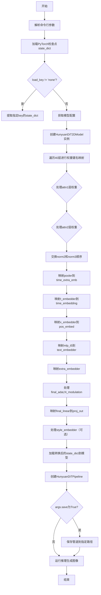
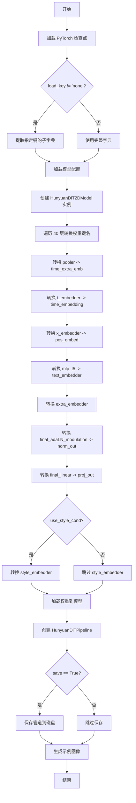

# `diffusers\scripts\convert_hunyuandit_to_diffusers.py` 详细设计文档

该脚本用于将HunyuanDiT模型的PyTorch检查点（.pt格式）转换为Diffusers格式，处理模型权重的键名映射、层结构重组和格式适配，并支持保存转换后的管道或直接运行推理生成图像。

## 整体流程



## 类结构

```
无类层次结构（脚本仅包含函数）
└── main (主函数)
    └── swap_scale_shift (辅助函数)
```

## 全局变量及字段


### `args`
    
命令行参数对象，包含所有用户输入的配置选项

类型：`argparse.Namespace`
    


### `state_dict`
    
从PyTorch检查点加载的模型权重字典

类型：`dict`
    


### `device`
    
模型运行设备，固定为'cuda'

类型：`str`
    


### `model_config`
    
HunyuanDiT模型的配置字典

类型：`dict`
    


### `model`
    
从配置创建的Diffusers格式模型实例

类型：`HunyuanDiT2DModel`
    


### `num_layers`
    
Transformer块的数量，固定为40

类型：`int`
    


### `i`
    
循环变量，表示当前处理的层索引

类型：`int`
    


### `q, k, v`
    
从Wqkv权重分割得到的查询、键、值张量

类型：`torch.Tensor`
    


### `q_bias, k_bias, v_bias`
    
从Wqkv偏置分割得到的查询、键、值偏置张量

类型：`torch.Tensor`
    


### `norm2_weight, norm2_bias`
    
用于交换norm2和norm3的临时变量

类型：`torch.Tensor`
    


### `pipe`
    
HuggingFace Diffusers格式的完整推理管道

类型：`HunyyuanDiTPipeline`
    


### `prompt`
    
生成图像的文本提示

类型：`str`
    


### `generator`
    
用于生成确定性随机数的PyTorch生成器

类型：`torch.Generator`
    


### `image`
    
管道生成的图像结果

类型：`PIL.Image`
    


### `模块级函数.main`
    
主函数，执行PyTorch检查点到Diffusers格式的完整转换流程

类型：`function`
    


### `模块级函数.swap_scale_shift`
    
辅助函数，将权重张量的shift和scale维度进行交换并拼接

类型：`function`
    
    

## 全局函数及方法


### `main`

该函数是模型检查点转换工具的核心入口，负责将自定义格式的 HunyuanDiT 模型权重转换为 HuggingFace Diffusers 格式，包括权重键名映射、模型加载、管道构建和示例图像生成。

参数：

- `args`：`argparse.Namespace`，命令行参数对象，包含以下属性：
  - `pt_checkpoint_path`：str，要转换的 PyTorch 检查点文件路径
  - `output_checkpoint_path`：str，转换后 Diffusers 管道的输出路径
  - `load_key`：str，要从检查点中加载的键名，若为 "none" 则加载整个字典
  - `use_style_cond_and_image_meta_size`：bool，是否使用风格条件（版本 <= v1.1 为 True，>= v1.2 为 False）
  - `save`：bool，是否保存转换后的管道

返回值：`None`，该函数无返回值，主要执行模型转换和图像生成的副作用操作

#### 流程图



#### 带注释源码

```python
def main(args):
    """
    主转换函数：将自定义 HunyuanDiT 检查点转换为 Diffusers 格式
    
    参数:
        args: 命令行参数对象，包含检查点路径、输出路径、版本配置等
    """
    
    # 1. 加载 PyTorch 检查点到 CPU
    state_dict = torch.load(args.pt_checkpoint_path, map_location="cpu")

    # 2. 如果指定了 load_key，尝试提取对应的子字典
    if args.load_key != "none":
        try:
            state_dict = state_dict[args.load_key]
        except KeyError:
            raise KeyError(
                f"{args.load_key} not found in the checkpoint."
                f"Please load from the following keys:{state_dict.keys()}"
            )

    # 3. 设置计算设备为 CUDA
    device = "cuda"
    
    # 4. 从 HuggingFace Hub 加载模型配置
    model_config = HunyuanDiT2DModel.load_config(
        "Tencent-Hunyuan/HunyuanDiT-Diffusers", 
        subfolder="transformer"
    )
    
    # 5. 根据版本配置设置风格条件开关
    # 版本 <= v1.1: True; 版本 >= v1.2: False
    model_config["use_style_cond_and_image_meta_size"] = (
        args.use_style_cond_and_image_meta_size
    )

    # 6. 打印本地检查点的键名（调试用）
    for key in state_dict:
        print("local:", key)

    # 7. 根据配置创建模型实例并移至 CUDA
    model = HunyuanDiT2DModel.from_config(model_config).to(device)

    # 8. 打印 Diffusers 模型的键名（调试用）
    for key in model.state_dict():
        print("diffusers:", key)

    # 9. 遍历 40 层转换权重键名格式
    num_layers = 40
    for i in range(num_layers):
        # === 注意力块 1 (attn1) ===
        # Wqkv (合并的 Q/K/V 权重) -> 分离的 to_q, to_k, to_v
        q, k, v = torch.chunk(state_dict[f"blocks.{i}.attn1.Wqkv.weight"], 3, dim=0)
        q_bias, k_bias, v_bias = torch.chunk(state_dict[f"blocks.{i}.attn1.Wqkv.bias"], 3, dim=0)
        
        state_dict[f"blocks.{i}.attn1.to_q.weight"] = q
        state_dict[f"blocks.{i}.attn1.to_q.bias"] = q_bias
        state_dict[f"blocks.{i}.attn1.to_k.weight"] = k
        state_dict[f"blocks.{i}.attn1.to_k.bias"] = k_bias
        state_dict[f"blocks.{i}.attn1.to_v.weight"] = v
        state_dict[f"blocks.{i}.attn1.to_v.bias"] = v_bias
        
        # 移除原始 Wqkv 键
        state_dict.pop(f"blocks.{i}.attn1.Wqkv.weight")
        state_dict.pop(f"blocks.{i}.attn1.Wqkv.bias")

        # q_norm, k_norm -> norm_q, norm_k (注意力归一化)
        state_dict[f"blocks.{i}.attn1.norm_q.weight"] = state_dict[f"blocks.{i}.attn1.q_norm.weight"]
        state_dict[f"blocks.{i}.attn1.norm_q.bias"] = state_dict[f"blocks.{i}.attn1.q_norm.bias"]
        state_dict[f"blocks.{i}.attn1.norm_k.weight"] = state_dict[f"blocks.{i}.attn1.k_norm.weight"]
        state_dict[f"blocks.{i}.attn1.norm_k.bias"] = state_dict[f"blocks.{i}.attn1.k_norm.bias"]

        state_dict.pop(f"blocks.{i}.attn1.q_norm.weight")
        state_dict.pop(f"blocks.{i}.attn1.q_norm.bias")
        state_dict.pop(f"blocks.{i}.attn1.k_norm.weight")
        state_dict.pop(f"blocks.{i}.attn1.k_norm.bias")

        # out_proj -> to_out (输出投影)
        state_dict[f"blocks.{i}.attn1.to_out.0.weight"] = state_dict[f"blocks.{i}.attn1.out_proj.weight"]
        state_dict[f"blocks.{i}.attn1.to_out.0.bias"] = state_dict[f"blocks.{i}.attn1.out_proj.bias"]
        state_dict.pop(f"blocks.{i}.attn1.out_proj.weight")
        state_dict.pop(f"blocks.{i}.attn1.out_proj.bias")

        # === 注意力块 2 (attn2 - 交叉注意力) ===
        # kv_proj -> 分离的 to_k, to_v
        k, v = torch.chunk(state_dict[f"blocks.{i}.attn2.kv_proj.weight"], 2, dim=0)
        k_bias, v_bias = torch.chunk(state_dict[f"blocks.{i}.attn2.kv_proj.bias"], 2, dim=0)
        state_dict[f"blocks.{i}.attn2.to_k.weight"] = k
        state_dict[f"blocks.{i}.attn2.to_k.bias"] = k_bias
        state_dict[f"blocks.{i}.attn2.to_v.weight"] = v
        state_dict[f"blocks.{i}.attn2.to_v.bias"] = v_bias
        state_dict.pop(f"blocks.{i}.attn2.kv_proj.weight")
        state_dict.pop(f"blocks.{i}.attn2.kv_proj.bias")

        # q_proj -> to_q
        state_dict[f"blocks.{i}.attn2.to_q.weight"] = state_dict[f"blocks.{i}.attn2.q_proj.weight"]
        state_dict[f"blocks.{i}.attn2.to_q.bias"] = state_dict[f"blocks.{i}.attn2.q_proj.bias"]
        state_dict.pop(f"blocks.{i}.attn2.q_proj.weight")
        state_dict.pop(f"blocks.{i}.attn2.q_proj.bias")

        # q_norm, k_norm -> norm_q, norm_k
        state_dict[f"blocks.{i}.attn2.norm_q.weight"] = state_dict[f"blocks.{i}.attn2.q_norm.weight"]
        state_dict[f"blocks.{i}.attn2.norm_q.bias"] = state_dict[f"blocks.{i}.attn2.q_norm.bias"]
        state_dict[f"blocks.{i}.attn2.norm_k.weight"] = state_dict[f"blocks.{i}.attn2.k_norm.weight"]
        state_dict[f"blocks.{i}.attn2.norm_k.bias"] = state_dict[f"blocks.{i}.attn2.k_norm.bias"]

        state_dict.pop(f"blocks.{i}.attn2.q_norm.weight")
        state_dict.pop(f"blocks.{i}.attn2.q_norm.bias")
        state_dict.pop(f"blocks.{i}.attn2.k_norm.weight")
        state_dict.pop(f"blocks.{i}.attn2.k_norm.bias")

        # out_proj -> to_out
        state_dict[f"blocks.{i}.attn2.to_out.0.weight"] = state_dict[f"blocks.{i}.attn2.out_proj.weight"]
        state_dict[f"blocks.{i}.attn2.to_out.0.bias"] = state_dict[f"blocks.{i}.attn2.out_proj.bias"]
        state_dict.pop(f"blocks.{i}.attn2.out_proj.weight")
        state_dict.pop(f"blocks.{i}.attn2.out_proj.bias")

        # === 归一化层交换 ===
        # 交换 norm2 和 norm3 的位置
        norm2_weight = state_dict[f"blocks.{i}.norm2.weight"]
        norm2_bias = state_dict[f"blocks.{i}.norm2.bias"]
        state_dict[f"blocks.{i}.norm2.weight"] = state_dict[f"blocks.{i}.norm3.weight"]
        state_dict[f"blocks.{i}.norm2.bias"] = state_dict[f"blocks.{i}.norm3.bias"]
        state_dict[f"blocks.{i}.norm3.weight"] = norm2_weight
        state_dict[f"blocks.{i}.norm3.bias"] = norm2_bias

        # === norm1 变换 ===
        # norm1 -> norm1.norm, default_modulation.1 -> norm1.linear
        state_dict[f"blocks.{i}.norm1.norm.weight"] = state_dict[f"blocks.{i}.norm1.weight"]
        state_dict[f"blocks.{i}.norm1.norm.bias"] = state_dict[f"blocks.{i}.norm1.bias"]
        state_dict[f"blocks.{i}.norm1.linear.weight"] = state_dict[f"blocks.{i}.default_modulation.1.weight"]
        state_dict[f"blocks.{i}.norm1.linear.bias"] = state_dict[f"blocks.{i}.default_modulation.1.bias"]
        state_dict.pop(f"blocks.{i}.norm1.weight")
        state_dict.pop(f"blocks.{i}.norm1.bias")
        state_dict.pop(f"blocks.{i}.default_modulation.1.weight")
        state_dict.pop(f"blocks.{i}.default_modulation.1.bias")

        # === 前馈网络 (MLP) 变换 ===
        # mlp.fc1 -> ff.net.0, mlp.fc2 -> ff.net.2
        state_dict[f"blocks.{i}.ff.net.0.proj.weight"] = state_dict[f"blocks.{i}.mlp.fc1.weight"]
        state_dict[f"blocks.{i}.ff.net.0.proj.bias"] = state_dict[f"blocks.{i}.mlp.fc1.bias"]
        state_dict[f"blocks.{i}.ff.net.2.weight"] = state_dict[f"blocks.{i}.mlp.fc2.weight"]
        state_dict[f"blocks.{i}.ff.net.2.bias"] = state_dict[f"blocks.{i}.mlp.fc2.bias"]
        state_dict.pop(f"blocks.{i}.mlp.fc1.weight")
        state_dict.pop(f"blocks.{i}.mlp.fc1.bias")
        state_dict.pop(f"blocks.{i}.mlp.fc2.weight")
        state_dict.pop(f"blocks.{i}.mlp.fc2.bias")

    # === 全局嵌入器变换 ===
    
    # pooler -> time_extra_emb (时间额外嵌入)
    state_dict["time_extra_emb.pooler.positional_embedding"] = state_dict["pooler.positional_embedding"]
    state_dict["time_extra_emb.pooler.k_proj.weight"] = state_dict["pooler.k_proj.weight"]
    state_dict["time_extra_emb.pooler.k_proj.bias"] = state_dict["pooler.k_proj.bias"]
    state_dict["time_extra_emb.pooler.q_proj.weight"] = state_dict["pooler.q_proj.weight"]
    state_dict["time_extra_emb.pooler.q_proj.bias"] = state_dict["pooler.q_proj.bias"]
    state_dict["time_extra_emb.pooler.v_proj.weight"] = state_dict["pooler.v_proj.weight"]
    state_dict["time_extra_emb.pooler.v_proj.bias"] = state_dict["pooler.v_proj.bias"]
    state_dict["time_extra_emb.pooler.c_proj.weight"] = state_dict["pooler.c_proj.weight"]
    state_dict["time_extra_emb.pooler.c_proj.bias"] = state_dict["pooler.c_proj.bias"]
    state_dict.pop("pooler.k_proj.weight")
    state_dict.pop("pooler.k_proj.bias")
    state_dict.pop("pooler.q_proj.weight")
    state_dict.pop("pooler.q_proj.bias")
    state_dict.pop("pooler.v_proj.weight")
    state_dict.pop("pooler.v_proj.bias")
    state_dict.pop("pooler.c_proj.weight")
    state_dict.pop("pooler.c_proj.bias")
    state_dict.pop("pooler.positional_embedding")

    # t_embedder -> time_embedding (时间步嵌入)
    state_dict["time_extra_emb.timestep_embedder.linear_1.bias"] = state_dict["t_embedder.mlp.0.bias"]
    state_dict["time_extra_emb.timestep_embedder.linear_1.weight"] = state_dict["t_embedder.mlp.0.weight"]
    state_dict["time_extra_emb.timestep_embedder.linear_2.bias"] = state_dict["t_embedder.mlp.2.bias"]
    state_dict["time_extra_emb.timestep_embedder.linear_2.weight"] = state_dict["t_embedder.mlp.2.weight"]

    state_dict.pop("t_embedder.mlp.0.bias")
    state_dict.pop("t_embedder.mlp.0.weight")
    state_dict.pop("t_embedder.mlp.2.bias")
    state_dict.pop("t_embedder.mlp.2.weight")

    # x_embedder -> pos_embed (位置嵌入/图像分块嵌入)
    state_dict["pos_embed.proj.weight"] = state_dict["x_embedder.proj.weight"]
    state_dict["pos_embed.proj.bias"] = state_dict["x_embedder.proj.bias"]
    state_dict.pop("x_embedder.proj.weight")
    state_dict.pop("x_embedder.proj.bias")

    # mlp_t5 -> text_embedder (文本嵌入)
    state_dict["text_embedder.linear_1.bias"] = state_dict["mlp_t5.0.bias"]
    state_dict["text_embedder.linear_1.weight"] = state_dict["mlp_t5.0.weight"]
    state_dict["text_embedder.linear_2.bias"] = state_dict["mlp_t5.2.bias"]
    state_dict["text_embedder.linear_2.weight"] = state_dict["mlp_t5.2.weight"]
    state_dict.pop("mlp_t5.0.bias")
    state_dict.pop("mlp_t5.0.weight")
    state_dict.pop("mlp_t5.2.bias")
    state_dict.pop("mlp_t5.2.weight")

    # extra_embedder -> time_extra_emb.extra_embedder (额外嵌入)
    state_dict["time_extra_emb.extra_embedder.linear_1.bias"] = state_dict["extra_embedder.0.bias"]
    state_dict["time_extra_emb.extra_embedder.linear_1.weight"] = state_dict["extra_embedder.0.weight"]
    state_dict["time_extra_emb.extra_embedder.linear_2.bias"] = state_dict["extra_embedder.2.bias"]
    state_dict["time_extra_emb.extra_embedder.linear_2.weight"] = state_dict["extra_embedder.2.weight"]
    state_dict.pop("extra_embedder.0.bias")
    state_dict.pop("extra_embedder.0.weight")
    state_dict.pop("extra_embedder.2.bias")
    state_dict.pop("extra_embedder.2.weight")

    # final_adaLN_modulation -> norm_out.linear (输出归一化)
    # 辅助函数：交换 scale 和 shift 的顺序
    def swap_scale_shift(weight):
        """
        交换归一化权重中 scale 和 shift 的位置
        原始格式: [shift, scale] -> 目标格式: [scale, shift]
        """
        shift, scale = weight.chunk(2, dim=0)
        new_weight = torch.cat([scale, shift], dim=0)
        return new_weight

    state_dict["norm_out.linear.weight"] = swap_scale_shift(state_dict["final_layer.adaLN_modulation.1.weight"])
    state_dict["norm_out.linear.bias"] = swap_scale_shift(state_dict["final_layer.adaLN_modulation.1.bias"])
    state_dict.pop("final_layer.adaLN_modulation.1.weight")
    state_dict.pop("final_layer.adaLN_modulation.1.bias")

    # final_linear -> proj_out (输出投影)
    state_dict["proj_out.weight"] = state_dict["final_layer.linear.weight"]
    state_dict["proj_out.bias"] = state_dict["final_layer.linear.bias"]
    state_dict.pop("final_layer.linear.weight")
    state_dict.pop("final_layer.linear.bias")

    # style_embedder (风格嵌入器，仅 v1.1 及之前版本需要)
    if model_config["use_style_cond_and_image_meta_size"]:
        print(state_dict["style_embedder.weight"])
        print(state_dict["style_embedder.weight"].shape)
        # 只取第一个风格嵌入
        state_dict["time_extra_emb.style_embedder.weight"] = state_dict["style_embedder.weight"][0:1]
        state_dict.pop("style_embedder.weight")

    # 10. 将转换后的权重加载到模型
    model.load_state_dict(state_dict)

    # 11. 创建 Diffusers 管道
    from diffusers import HunyuanDiTPipeline

    if args.use_style_cond_and_image_meta_size:
        pipe = HunyuanDiTPipeline.from_pretrained(
            "Tencent-Hunyuan/HunyuanDiT-Diffusers", 
            transformer=model, 
            torch_dtype=torch.float32
        )
    else:
        pipe = HunyuanDiTPipeline.from_pretrained(
            "Tencent-Hunyuan/HunyuanDiT-v1.2-Diffusers", 
            transformer=model, 
            torch_dtype=torch.float32
        )
    
    pipe.to("cuda")
    pipe.to(dtype=torch.float32)

    # 12. 可选：保存转换后的管道
    if args.save:
        pipe.save_pretrained(args.output_checkpoint_path)

    # 13. 生成示例图像
    prompt = "一个宇航员在骑马"  # 中文提示词
    # prompt = "An astronaut riding a horse"  # 也支持英文
    
    generator = torch.Generator(device="cuda").manual_seed(0)
    image = pipe(
        height=1024, 
        width=1024, 
        prompt=prompt, 
        generator=generator, 
        num_inference_steps=25, 
        guidance_scale=5.0
    ).images[0]

    # 保存生成的图像
    image.save("img.png")
```


### `swap_scale_shift`

该函数用于在模型权重转换过程中调整 Adaptive Layer Normalization (AdaLN) 调制权重的顺序。它将原始权重按照通道维度切分为 shift（偏移）和 scale（缩放）两部分，然后按照 `[scale, shift]` 的顺序重新拼接，以适配目标模型的结构需求。

参数：

- `weight`：`torch.Tensor`，原始的权重张量，通常是 AdaLN 调制的线性层权重，形状为 `[2*hidden_size, ...]`

返回值：`torch.Tensor`，重新排列后的权重张量，形状与输入相同，但通道顺序被调整为 `[scale, shift]`

#### 流程图

```mermaid
flowchart TD
    A[开始: 输入 weight 张量] --> B[使用 chunk 将 weight 按 dim=0 切分为 2 份]
    B --> C[得到 shift 和 scale 两个张量]
    C --> D[使用 torch.cat 按 dim=0 重新拼接: [scale, shift]]
    D --> E[返回新权重张量]
```

#### 带注释源码

```python
def swap_scale_shift(weight):
    """
    调整权重张量中 shift 和 scale 的顺序
    
    原始模型中 AdaLN 调制权重顺序为 [shift, scale]，
    目标模型需要 [scale, shift] 的顺序，因此需要进行转换。
    
    参数:
        weight: torch.Tensor, 形状为 [2*hidden_size, ...] 的权重张量
        
    返回:
        torch.Tensor: 顺序调整后的权重张量
    """
    # 将权重按通道维度切分为两部分：shift（前半部分）和 scale（后半部分）
    # chunk(2, dim=0) 表示在维度0上分成2份
    shift, scale = weight.chunk(2, dim=0)
    
    # 按照 [scale, shift] 的顺序重新拼接，替换原来的 [shift, scale] 顺序
    new_weight = torch.cat([scale, shift], dim=0)
    
    # 返回重新排列后的权重
    return new_weight
```

## 关键组件


### 张量键名转换与权重重组

将原始 HunyuanDiT PyTorch checkpoint 的权重键名转换为 Diffusers 格式，包括注意力层、MLP 层、归一化层等的键名映射和权重重新组织。

### 注意力权重分割

将原始的 `Wqkv.weight` 拆分为 `to_q`, `to_k`, `to_v` 三个独立的权重张量，并相应处理 bias 参数，用于适配 Diffusers 模型的注意力机制结构。

### 归一化层映射

将原始的 `q_norm` 和 `k_norm` 映射为 `norm_q` 和 `norm_k`，并对 `out_proj` 到 `to_out` 进行转换，同时处理 norm1、norm2、norm3 的顺序调整。

### MLP 层重构

将原始的 `mlp.fc1` 和 `mlp.fc2` 映射到 `ff.net.0.proj` 和 `ff.net.2`，完成前馈网络层权重的重新组织。

### 位置嵌入与池化层处理

将 `pooler` 的各个投影层 (`k_proj`, `q_proj`, `v_proj`, `c_proj`) 重组到 `time_extra_emb.pooler` 下，并处理 `x_embedder` 到 `pos_embed.proj` 的映射。

### 时间嵌入器与文本嵌入器转换

将 `t_embedder.mlp` 映射为 `timestep_embedder` 的 `linear_1` 和 `linear_2`，将 `mlp_t5` 转换为 `text_embedder` 的线性层，并处理 `extra_embedder` 的权重迁移。

### AdaLN 调制权重交换

通过 `swap_scale_shift` 函数将 `final_layer.adaLN_modulation.1` 的权重进行 scale 和 shift 维度交换，以适配 Diffusers 格式的 `norm_out.linear`。

### 模型配置与加载

根据版本选择使用 `use_style_cond_and_image_meta_size` 参数，通过 `HunyuanDiT2DModel.load_config` 加载模型配置，并实例化模型将权重加载到 CUDA 设备。

### 管道构建与推理

使用转换后的模型通过 `HunyyuanDiTPipeline.from_pretrained` 构建 Diffusers 管道，并执行文本到图像的生成推理。


## 问题及建议


### 已知问题

- **硬编码层数**：`num_layers = 40`被硬编码，应该从模型配置或state_dict中动态获取，否则不同版本的模型可能不兼容
- **缺少模型验证**：加载state_dict后没有验证键是否匹配，直接进行大量转换操作，可能导致静默失败或难以调试的问题
- **硬编码模型路径**：`"Tencent-Hunyuan/HunyuanDiT-Diffusers"`和`"Tencent-Hunyuan/HunyuanDiT-v1.2-Diffusers"`路径硬编码，缺乏灵活性
- **参数传递冗余**：`use_style_cond_and_image_meta_size`需要手动指定，应从模型配置或版本信息自动推断
- **代码重复**：attn1和attn2的权重转换逻辑高度相似，存在大量重复代码块，可抽象为通用函数
- **打印操作I/O开销**：大量`print`语句打印key会消耗不必要的I/O资源，且在生产环境中无实际价值
- **缺少类型注解**：函数参数和返回值缺乏类型注解，影响代码可读性和可维护性
- **异常处理不足**：KeyError捕获后直接抛出，缺乏转换过程中的其他异常处理（如权重形状不匹配等）
- **内存管理**：未显式管理GPU内存，转换大模型时可能导致OOM
- **输出路径未验证**：`output_checkpoint_path`为None时可能导致保存失败或覆盖问题

### 优化建议

- 从模型配置中读取`num_layers`或通过遍历state_dict动态计算层数
- 在转换前后添加键集合对比验证，确保所有必要键都存在且无遗漏
- 将模型路径提取为命令行参数或配置文件
- 实现版本自动检测逻辑，根据模型配置自动判断`use_style_cond_and_image_meta_size`
- 将attn权重转换逻辑提取为通用函数，如`convert_attention_weights(state_dict, layer_idx, attention_type)`
- 移除或使用日志框架替代大量print语句
- 添加函数类型注解和文档字符串
- 增加权重形状验证，在转换前检查维度兼容性
- 在转换完成后添加`torch.cuda.empty_cache()`释放内存
- 对`output_checkpoint_path`添加默认值或验证逻辑

## 其它


### 设计目标与约束

本代码的设计目标是将腾讯HunyuanDiT的原生预训练检查点（.pt格式）转换为HuggingFace Diffusers格式的pipeline。主要约束包括：1) 仅支持HunyuanDiT2DModel架构的权重转换；2) 依赖特定版本的diffusers库；3) 仅支持40层transformer结构的模型；4) 目标设备为CUDA。

### 错误处理与异常设计

代码中的错误处理主要包括：1) KeyError异常捕获，当指定load_key在检查点中不存在时抛出详细错误信息并列出可用键；2) 模型加载使用try-except保护；3) 文件路径验证依赖argparse必需参数保证。缺少对无效文件路径、磁盘空间不足、CUDA内存不足等情况的处理。

### 数据流与状态机

数据流如下：1) 解析命令行参数 → 2) 加载.pt检查点到CPU内存 → 3) 提取指定键（如需要） → 4) 创建目标模型配置 → 5) 初始化空模型 → 6) 遍历40层进行权重键名重映射（attn1、attn2、norm、mlp等） → 7) 全局权重键重映射（pooler、t_embedder、x_embedder等） → 8) 加载转换后的state_dict → 9) 构建pipeline → 10) 执行推理测试。无复杂状态机设计。

### 外部依赖与接口契约

主要外部依赖：1) torch>=1.0；2) diffusers库（含HunyuanDiT2DModel和HunyuanDiTPipeline）；3) transformers库（pipeline内部使用）；4) argparse（标准库）。接口契约：输入为.pt检查点文件路径，输出为HuggingFace Diffusers格式的pipeline目录，支持通过CLI参数配置load_key、output_checkpoint_path、use_style_cond_and_image_meta_size等。

### 性能考虑

当前实现性能瓶颈：1) 所有权重驻留CPU后批量加载到GPU；2) 循环内40次逐层权重重映射效率较低；3) 打印操作（print）影响执行速度；4) 默认使用float32精度。可优化点：使用torch.cuda.synchronize()、批量tensor操作、移除调试打印、使用混合精度等。

### 安全性考虑

代码安全性问题：1) 直接从命令行接受文件路径未做路径遍历检查；2) 模型来源为远程URL（"Tencent-Hunyuan/HunyuanDiT-Diffusers"）存在供应链风险；3) 未验证检查点文件的完整性和合法性；4) 生成的图像默认保存为固定文件名可能被覆盖。建议添加文件路径验证、完整性校验、模型签名验证等安全措施。

### 配置管理

配置通过argparse命令行参数管理，支持：1) save（是否保存转换后的pipeline）；2) pt_checkpoint_path（输入检查点路径）；3) output_checkpoint_path（输出路径）；4) load_key（检查点中的键名）；5) use_style_cond_and_image_meta_size（模型版本标志）。模型内部配置通过HunyuanDiT2DModel.load_config()从预训练配置加载。

### 版本兼容性

代码处理两个版本的模型：1) v1.1及以前版本：use_style_cond_and_image_meta_size=True；2) v1.2及以后版本：use_style_cond_and_image_meta_size=False。版本差异影响：style_embedder的处理、pipeline来源路径。代码硬编码num_layers=40，不支持其他层数的模型。

### 资源管理

资源使用：1) CPU内存：完整加载.pt检查点（约数GB）；2) GPU内存：模型权重+推理激活值（float32约数GB）；3) 磁盘空间：保存pipeline需要数GB。缺少显式资源释放代码（依赖Python垃圾回收和CUDA缓存清理）。

### 使用示例

命令行使用示例：1) 基本转换：python convert_hunyuan.py --pt_checkpoint_path model.pt --output_checkpoint_path ./output；2) 指定加载键：python convert_hunyuan.py --pt_checkpoint_path model.pt --load_key model --output_checkpoint_path ./output；3) v1.1版本：python convert_hunyuan.py --pt_checkpoint_path model.pt --use_style_cond_and_image_meta_size True --output_checkpoint_path ./output。

### 限制与假设

代码假设：1) 输入检查点包含完整的40层transformer权重；2) 权重键名格式与HunyuanDiT原生训练导出格式一致；3) CUDA设备可用；4) 网络连接正常（首次加载pipeline）。限制：1) 不支持分布式推理；2) 不支持自定义模型配置；3) 不支持量化模型；4) 不支持多GPU推理；5) 推理参数（steps=25, guidance=5.0）硬编码不可配置。


    