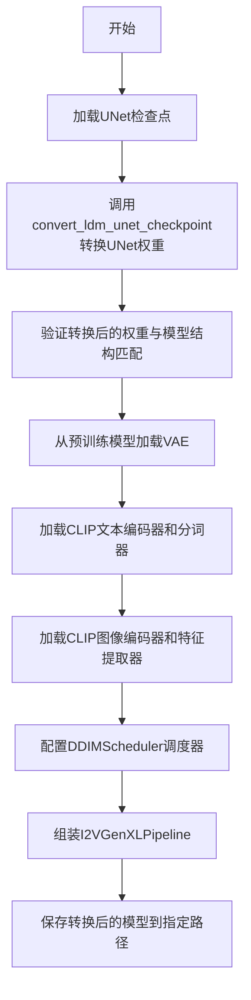
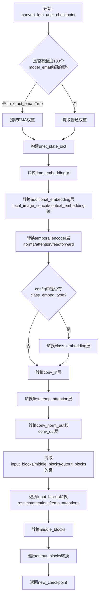

# `diffusers\scripts\convert_i2vgen_to_diffusers.py` 详细设计文档

这是一个用于将LDM（Latent Diffusion Models）检查点转换为HuggingFace diffusers格式的转换脚本，主要用于I2VGen-XL（图像到视频生成）模型的权重迁移，将原始模型的UNet、VAE、文本编码器和图像编码器的权重转换为diffusers库兼容的格式。

## 整体流程



## 类结构

```
全局函数
├── assign_to_checkpoint
├── renew_attention_paths
├── shave_segments
├── renew_temp_conv_paths
├── renew_resnet_paths
└── convert_ldm_unet_checkpoint
主程序入口
└── if __name__ == "__main__"
```

## 全局变量及字段


### `CLIP_ID`
    
HuggingFace Hub上的CLIP ViT-H-14模型标识符，用于文本和图像编码器

类型：`str`
    


    

## 全局函数及方法


### `assign_to_checkpoint`

该函数是LDM（Latent Diffusion Models）检查点转换的核心步骤，负责将本地转换的权重应用全局重命名操作，包括分割注意力层权重并处理额外的替换规则，最终将权重分配到新的检查点字典中。

参数：

- `paths`：`list`，包含字典的列表，每个字典有'old'和'new'键，表示旧权重名到新权重名的映射
- `checkpoint`：`dict`，目标检查点字典，转换后的权重将存储于此
- `dict`，旧检查点字典，包含待转换的原始权重
- `attention_paths_to_split`：`dict` 或 `None`，可选参数，需要分割的注意力层路径映射字典，将Q/K/V权重分开
- `additional_replacements`：`list` 或 `None`，可选参数，额外的替换规则列表，用于路径名的全局替换
- `config`：`dict` 或 `None`，可选参数，包含模型配置信息，如`num_head_channels`等，用于注意力层分割计算

返回值：`None`，函数直接修改`checkpoint`字典，无返回值

#### 流程图

```mermaid
flowchart TD
    A[开始 assign_to_checkpoint] --> B{验证 paths 是列表}
    B -->|否| C[抛出断言错误]
    B -->|是| D{attention_paths_to_split 是否存在}
    
    D -->|是| E[遍历 attention_paths_to_split]
    E --> F[从 old_checkpoint 获取旧张量]
    F --> G[计算通道数: channels = shape[0] // 3]
    G --> H[计算 num_heads]
    H --> I[reshape 张量并分割 Q K V]
    I --> J[将 Q K V 写入 checkpoint]
    
    D -->|否| K[遍历 paths 列表]
    
    J --> K
    K --> L{当前路径是否在 attention_paths_to_split 中}
    L -->|是| M[跳过该路径]
    L -->|否| N{additional_replacements 是否存在}
    
    N -->|是| O[应用所有替换规则]
    O --> P{新路径是否包含 proj_attn.weight}
    N -->|否| P
    
    P -->|是| Q[提取权重: weight[:, :, 0]]
    P -->|否| R{新路径包含 proj_out.weight 或 proj_in.weight 且不是 attention}
    R -->|是| Q
    R -->|否| S[直接使用原始权重]
    
    Q --> T[写入 checkpoint[new_path]]
    S --> T
    M --> U{还有更多路径}
    U -->|是| K
    U -->|否| V[结束]
    T --> V
```

#### 带注释源码

```python
def assign_to_checkpoint(
    paths, checkpoint, old_checkpoint, attention_paths_to_split=None, additional_replacements=None, config=None
):
    """
    This does the final conversion step: take locally converted weights and apply a global renaming to them. It splits
    attention layers, and takes into account additional replacements that may arise.

    Assigns the weights to the new checkpoint.
    """
    # 验证paths参数必须是列表类型，且每个元素是包含'old'和'new'键的字典
    assert isinstance(paths, list), "Paths should be a list of dicts containing 'old' and 'new' keys."

    # 如果存在attention_paths_to_split，则分割注意力层权重为query、key、value三个部分
    if attention_paths_to_split is not None:
        for path, path_map in attention_paths_to_split.items():
            # 从旧检查点获取需要分割的注意力权重张量
            old_tensor = old_checkpoint[path]
            # 注意力权重通常按 [3*channels, ...] 格式存储，需要除以3得到单份通道数
            channels = old_tensor.shape[0] // 3

            # 根据张量维度确定目标形状，3维张量保持批量维度，2维张量展平
            target_shape = (-1, channels) if len(old_tensor.shape) == 3 else (-1)

            # 计算注意力头数量，用于后续reshape和分割
            num_heads = old_tensor.shape[0] // config["num_head_channels"] // 3

            # Reshape张量以便分割：[num_heads, 3*channels//num_heads, ...]
            old_tensor = old_tensor.reshape((num_heads, 3 * channels // num_heads) + old_tensor.shape[1:])
            # 按通道维度分割为query、key、value三个张量
            query, key, value = old_tensor.split(channels // num_heads, dim=1)

            # 将分割后的Q、K、V权重写入新检查点，并reshape回目标形状
            checkpoint[path_map["query"]] = query.reshape(target_shape)
            checkpoint[path_map["key"]] = key.reshape(target_shape)
            checkpoint[path_map["value"]] = value.reshape(target_shape)

    # 遍历所有路径映射，应用重命名和权重转换
    for path in paths:
        new_path = path["new"]

        # 如果当前路径已经在attention_paths_to_split中处理过，则跳过
        if attention_paths_to_split is not None and new_path in attention_paths_to_split:
            continue

        # 如果存在额外的替换规则，依次应用这些替换
        if additional_replacements is not None:
            for replacement in additional_replacements:
                new_path = new_path.replace(replacement["old"], replacement["new"])

        # 获取旧检查点中的权重
        weight = old_checkpoint[path["old"]]
        # 定义需要特殊处理的权重名称
        names = ["proj_attn.weight"]
        names_2 = ["proj_out.weight", "proj_in.weight"]
        
        # proj_attn.weight 需要从1D卷积转换为线性层权重（取第一个切片）
        if any(k in new_path for k in names):
            checkpoint[new_path] = weight[:, :, 0]
        # proj_out.weight 和 proj_in.weight 在非attention层且维度>2时也需要转换
        elif any(k in new_path for k in names_2) and len(weight.shape) > 2 and ".attentions." not in new_path:
            checkpoint[new_path] = weight[:, :, 0]
        else:
            # 其他权重直接复制
            checkpoint[new_path] = weight
```


### `renew_attention_paths`

该函数用于更新注意力层（attention）的路径名称，实现局部重命名映射。它接受一个旧路径列表，并返回一个包含旧路径与新路径对应关系的字典列表，作为后续检查点分配的基础。

参数：

- `old_list`：`list`，需要转换的注意力层旧路径列表
- `n_shave_prefix_segments`：`int`，用于剪裁路径前缀段的数量（默认值为0）

返回值：`list[dict]`，返回包含 {"old": 旧路径, "new": 新路径} 格式的字典列表

#### 流程图

```mermaid
flowchart TD
    A[开始] --> B[初始化空列表 mapping]
    B --> C{遍历 old_list 中的每个元素}
    C -->|遍历| D[将 old_item 赋值给 new_item]
    D --> E[构建字典 {'old': old_item, 'new': new_item}]
    E --> F[将字典添加到 mapping 列表]
    F --> C
    C -->|遍历完成| G[返回 mapping 列表]
    G --> H[结束]
```

#### 带注释源码

```python
def renew_attention_paths(old_list, n_shave_prefix_segments=0):
    """
    Updates paths inside attentions to the new naming scheme (local renaming)
    
    参数:
        old_list: 需要转换的注意力层路径列表
        n_shave_prefix_segments: 剪裁路径前缀的段数（当前函数中未使用，保留用于接口一致性）
    
    返回:
        包含路径映射的字典列表，每个字典格式为 {'old': 旧路径, 'new': 新路径}
    """
    # 初始化用于存储路径映射结果的空列表
    mapping = []
    
    # 遍历输入的旧路径列表
    for old_item in old_list:
        # 在当前实现中，新路径等于旧路径（未进行实际转换）
        # 此函数为占位实现，实际转换逻辑在 assign_to_checkpoint 中完成
        new_item = old_item
        
        # 构建路径映射字典并添加到结果列表
        mapping.append({"old": old_item, "new": new_item})

    # 返回路径映射列表
    return mapping
```


### `shave_segments`

该函数用于处理点号分隔的路径字符串，根据 `n_shave_prefix_segments` 参数的值，去除路径字符串开头或末尾相应数量的段。正值去除开头的段，负值去除末尾的段。

参数：

- `path`：`str`，需要处理的路径字符串
- `n_shave_prefix_segments`：`int`，默认值为 `1`，正数表示去除开头的段数，负数表示去除末尾的段数

返回值：`str`，处理后的路径字符串

#### 流程图

```mermaid
flowchart TD
    A[开始] --> B{n_shave_prefix_segments >= 0?}
    B -->|是| C[使用 path.split('.')[n_shave_prefix_segments:]]
    B -->|否| D[使用 path.split('.')[:n_shave_prefix_segments]]
    C --> E[用 '.' join 剩余段]
    D --> E
    E --> F[返回处理后的路径]
```

#### 带注释源码

```python
def shave_segments(path, n_shave_prefix_segments=1):
    """
    Removes segments. Positive values shave the first segments, negative shave the last segments.
    
    参数:
        path: str，要处理的路径字符串，例如 "input_blocks.0.1.attn1.weight"
        n_shave_prefix_segments: int，正值去除开头的段，负值去除末尾的段
    
    返回:
        str，处理后的路径字符串
    """
    # 判断是正数还是负数
    if n_shave_prefix_segments >= 0:
        # 正数：去除路径开头的 n_shave_prefix_segments 个段
        # 例如 path = "input_blocks.0.1.attn1.weight", n_shave_prefix_segments = 1
        # split 后得到 ['input_blocks', '0', '1', 'attn1', 'weight']
        # [1:] 取从索引1开始的所有元素，得到 ['0', '1', 'attn1', 'weight']
        # join 后得到 "0.1.attn1.weight"
        return ".".join(path.split(".")[n_shave_prefix_segments:])
    else:
        # 负数：去除路径末尾的 |n_shave_prefix_segments| 个段
        # 例如 path = "output_blocks.0.1.weight", n_shave_prefix_segments = -1
        # split 后得到 ['output_blocks', '0', '1', 'weight']
        # [:-1] 取从开始到倒数第一个之前的元素，得到 ['output_blocks', '0', '1']
        # join 后得到 "output_blocks.0.1"
        return ".".join(path.split(".")[:n_shave_prefix_segments])
```


### `renew_temp_conv_paths`

该函数用于更新 ResNet 内部路径到新的命名方案（本地重命名），是 LDMs (Latent Diffusion Models) 检查点转换过程中的辅助函数，用于处理时间卷积层（temporal convolutions）的路径映射。

参数：

-  `old_list`：`list`，表示需要转换的旧路径列表，通常包含时间卷积层的键名
-  `n_shave_prefix_segments`：`int`，表示要切掉的前缀段数（默认值为 0），用于路径片段修整

返回值：`list`，返回包含字典的列表，每个字典包含 "old"（原始路径）和 "new"（新路径）键

#### 流程图

```mermaid
flowchart TD
    A[开始] --> B[初始化空映射列表 mapping]
    B --> C{遍历 old_list 中的每个 old_item}
    C -->|是| D[创建字典 {'old': old_item, 'new': old_item}]
    D --> E[将字典添加到 mapping 列表]
    E --> C
    C -->|否| F[返回 mapping 列表]
    F --> G[结束]
```

#### 带注释源码

```python
def renew_temp_conv_paths(old_list, n_shave_prefix_segments=0):
    """
    Updates paths inside resnets to the new naming scheme (local renaming)
    
    该函数是检查点转换工具的一部分，用于处理时间卷积层（temporal convolutions）
    的路径映射。虽然函数签名包含 n_shave_prefix_segments 参数，但当前实现中
    并未使用该参数进行实际处理，保留了接口一致性。
    
    Args:
        old_list: 包含旧路径的列表，通常是从 UNet 检查点中提取的时间卷积层键名
        n_shave_prefix_segments: 保留参数，用于将来扩展，目前未使用
    
    Returns:
        返回路径映射列表，每个元素为 {'old': 原路径, 'new': 新路径} 的字典
        当前实现中 new 与 old 相同，属于占位实现
    """
    # 初始化空列表用于存储映射关系
    mapping = []
    
    # 遍历输入的旧路径列表
    for old_item in old_list:
        # 为每个旧路径创建映射字典
        # 当前实现中，新路径等于旧路径（直接拷贝）
        mapping.append({"old": old_item, "new": old_item})

    # 返回构建完成的映射列表
    return mapping
```


### `renew_resnet_paths`

该函数用于将 ResNet 层的旧权重路径更新为新的命名规则，执行本地重命名操作，将 LDM (Latent Diffusion Models) 风格的权重路径转换为 Diffusers 风格的路径名称。

参数：

- `old_list`：`List[str]`，包含旧权重路径名称的列表
- `n_shave_prefix_segments`：`int`，要移除的前缀段数量，默认为 0

返回值：`List[Dict[str, str]]`，返回包含 "old" 和 "new" 键的字典列表，表示旧路径到新路径的映射关系

#### 流程图

```mermaid
flowchart TD
    A[开始] --> B[初始化空 mapping 列表]
    B --> C{遍历 old_list 中的每个 old_item}
    C -->|是| D[将 in_layers.0 替换为 norm1]
    D --> E[将 in_layers.2 替换为 conv1]
    E --> F[将 out_layers.0 替换为 norm2]
    F --> G[将 out_layers.3 替换为 conv2]
    G --> H[将 emb_layers.1 替换为 time_emb_proj]
    H --> I[将 skip_connection 替换为 conv_shortcut]
    I --> J[调用 shave_segments 移除前缀段]
    J --> K{检查 old_item 是否不包含 temopral_conv}
    K -->|是| L[将 {old: old_item, new: new_item} 添加到 mapping]
    K -->|否| M[跳过该项目]
    L --> C
    M --> C
    C -->|遍历完成| N[返回 mapping 列表]
    N --> O[结束]
```

#### 带注释源码

```python
def renew_resnet_paths(old_list, n_shave_prefix_segments=0):
    """
    Updates paths inside resnets to the new naming scheme (local renaming)
    
    将 ResNet 层的路径从 LDM 格式转换为 Diffusers 格式的本地重命名函数。
    处理卷积层、归一化层、时间嵌入投影和跳跃连接的重命名。
    """
    # 初始化结果映射列表
    mapping = []
    
    # 遍历每个旧的路径项
    for old_item in old_list:
        new_item = old_item
        
        # 将输入层的命名从旧格式转换为新格式
        # in_layers.0 对应新的 norm1 (第一个归一化层)
        new_item = new_item.replace("in_layers.0", "norm1")
        # in_layers.2 对应新的 conv1 (第一个卷积层)
        new_item = new_item.replace("in_layers.2", "conv1")
        
        # 将输出层的命名从旧格式转换为新格式
        # out_layers.0 对应新的 norm2 (第二个归一化层)
        new_item = new_item.replace("out_layers.0", "norm2")
        # out_layers.3 对应新的 conv2 (第二个卷积层)
        new_item = new_item.replace("out_layers.3", "conv2")
        
        # 将时间嵌入层的命名从旧格式转换为新格式
        # emb_layers.1 对应新的 time_emb_proj (时间嵌入投影层)
        new_item = new_item.replace("emb_layers.1", "time_emb_proj")
        
        # 将跳跃连接的命名从旧格式转换为新格式
        # skip_connection 对应新的 conv_shortcut (卷积快捷连接)
        new_item = new_item.replace("skip_connection", "conv_shortcut")
        
        # 根据 n_shave_prefix_segments 参数移除路径前缀段
        # 例如: "block.0.layer.1.weight" -> "layer.1.weight" (当 n_shave_prefix_segments=1)
        new_item = shave_segments(new_item, n_shave_prefix_segments=n_shave_prefix_segments)
        
        # 过滤掉包含 "temopral_conv" (时间卷积) 的路径
        # 这些路径由 renew_temp_conv_paths 函数单独处理
        if "temopral_conv" not in old_item:
            # 将映射关系添加到结果列表
            mapping.append({"old": old_item, "new": new_item})
    
    # 返回完整的路径映射列表
    return mapping
```


### `convert_ldm_unet_checkpoint`

将LDM（Latent Diffusion Models）格式的UNet checkpoint转换为Diffusers库兼容的格式。该函数处理权重键名的重命名、EMA权重提取、时间嵌入层转换、注意力层分割以及输入/输出块的重新映射等操作。

参数：

- `checkpoint`：`dict`，原始LDM格式的模型状态字典，包含以"model.diffusion_model."为前缀的权重键
- `config`：`dict`，模型配置文件，包含layers_per_block、class_embed_type等关键配置信息
- `path`：`str`（可选），checkpoint文件的路径，用于日志输出
- `extract_ema`：`bool`（可选，默认为False），是否提取EMA权重而非普通权重

返回值：`dict`，转换后的新checkpoint，键名已更改为Diffusers格式

#### 流程图



#### 带注释源码

```python
def convert_ldm_unet_checkpoint(checkpoint, config, path=None, extract_ema=False):
    """
    Takes a state dict and a config, and returns a converted checkpoint.
    """
    
    # ========== 第一步：提取UNet状态字典 ==========
    # 初始化空的UNet状态字典
    unet_state_dict = {}
    # 获取所有键名
    keys = list(checkpoint.keys())
    
    # UNet权重的前缀键名
    unet_key = "model.diffusion_model."
    
    # 判断是否提取EMA权重：至少有100个model_ema开头的键才算EMA checkpoint
    if sum(k.startswith("model_ema") for k in keys) > 100 and extract_ema:
        print(f"Checkpoint {path} has both EMA and non-EMA weights.")
        print(
            "In this conversion only the EMA weights are extracted. If you want to instead extract the non-EMA"
            " weights (useful to continue fine-tuning), please make sure to remove the `--extract_ema` flag."
        )
        # 遍历所有键，提取EMA权重
        for key in keys:
            if key.startswith("model.diffusion_model"):
                # 将键名从model.diffusion_model.xxx转换为model_ema.xxx的形式
                flat_ema_key = "model_ema." + "".join(key.split(".")[1:])
                unet_state_dict[key.replace(unet_key, "")] = checkpoint.pop(flat_ema_key)
    else:
        # 非EMA模式，提取普通权重
        if sum(k.startswith("model_ema") for k in keys) > 100:
            print(
                "In this conversion only the non-EMA weights are extracted. If you want to instead extract the EMA"
                " weights (usually better for inference), please make sure to add the `--extract_ema` flag."
            )
        
        for key in keys:
            # 移除unet_key前缀
            unet_state_dict[key.replace(unet_key, "")] = checkpoint.pop(key)
    
    # ========== 第二步：初始化新checkpoint ==========
    new_checkpoint = {}
    
    # ========== 第三步：转换time_embedding层 ==========
    # 将LDM格式的时间嵌入层转换为Diffusers格式
    # LDM: time_embed.0.weight -> Diffusers: time_embedding.linear_1.weight
    new_checkpoint["time_embedding.linear_1.weight"] = unet_state_dict["time_embed.0.weight"]
    new_checkpoint["time_embedding.linear_1.bias"] = unet_state_dict["time_embed.0.bias"]
    new_checkpoint["time_embedding.linear_2.weight"] = unet_state_dict["time_embed.2.weight"]
    new_checkpoint["time_embedding.linear_2.bias"] = unet_state_dict["time_embed.2.bias"]
    
    # ========== 第四步：转换额外的embedding层 ==========
    # 处理local_image_concat, context_embedding, local_image_embedding, fps_embedding等
    additional_embedding_substrings = [
        "local_image_concat",
        "context_embedding",
        "local_image_embedding",
        "fps_embedding",
    ]
    for k in unet_state_dict:
        # 检查是否包含指定的子字符串
        if any(substring in k for substring in additional_embedding_substrings):
            # 替换键名中的特定字符串为Diffusers格式
            diffusers_key = k.replace("local_image_concat", "image_latents_proj_in").replace(
                "local_image_embedding", "image_latents_context_embedding"
            )
            new_checkpoint[diffusers_key] = unet_state_dict[k]
    
    # ========== 第五步：转换temporal encoder（时间编码器）==========
    # 归一化层
    new_checkpoint["image_latents_temporal_encoder.norm1.weight"] = unet_state_dict[
        "local_temporal_encoder.layers.0.0.norm.weight"
    ]
    new_checkpoint["image_latents_temporal_encoder.norm1.bias"] = unet_state_dict[
        "local_temporal_encoder.layers.0.0.norm.bias"
    ]
    
    # 注意力层：将qkv权重拆分为query、key、value
    qkv = unet_state_dict["local_temporal_encoder.layers.0.0.fn.to_qkv.weight"]
    q, k, v = torch.chunk(qkv, 3, dim=0)
    new_checkpoint["image_latents_temporal_encoder.attn1.to_q.weight"] = q
    new_checkpoint["image_latents_temporal_encoder.attn1.to_k.weight"] = k
    new_checkpoint["image_latents_temporal_encoder.attn1.to_v.weight"] = v
    new_checkpoint["image_latents_temporal_encoder.attn1.to_out.0.weight"] = unet_state_dict[
        "local_temporal_encoder.layers.0.0.fn.to_out.0.weight"
    ]
    new_checkpoint["image_latents_temporal_encoder.attn1.to_out.0.bias"] = unet_state_dict[
        "local_temporal_encoder.layers.0.0.fn.to_out.0.bias"
    ]
    
    # 前馈网络层
    new_checkpoint["image_latents_temporal_encoder.ff.net.0.proj.weight"] = unet_state_dict[
        "local_temporal_encoder.layers.0.1.net.0.0.weight"
    ]
    new_checkpoint["image_latents_temporal_encoder.ff.net.0.proj.bias"] = unet_state_dict[
        "local_temporal_encoder.layers.0.1.net.0.0.bias"
    ]
    new_checkpoint["image_latents_temporal_encoder.ff.net.2.weight"] = unet_state_dict[
        "local_temporal_encoder.layers.0.1.net.2.weight"
    ]
    new_checkpoint["image_latents_temporal_encoder.ff.net.2.bias"] = unet_state_dict[
        "local_temporal_encoder.layers.0.1.net.2.bias"
    ]
    
    # ========== 第六步：转换class_embedding层 ==========
    if "class_embed_type" in config:
        if config["class_embed_type"] is None:
            # 无需转换的参数
            pass
        elif config["class_embed_type"] == "timestep" or config["class_embed_type"] == "projection":
            # 转换类别嵌入层：label_emb.0.0 -> class_embedding.linear_1
            new_checkpoint["class_embedding.linear_1.weight"] = unet_state_dict["label_emb.0.0.weight"]
            new_checkpoint["class_embedding.linear_1.bias"] = unet_state_dict["label_emb.0.0.bias"]
            new_checkpoint["class_embedding.linear_2.weight"] = unet_state_dict["label_emb.0.2.weight"]
            new_checkpoint["class_embedding.linear_2.bias"] = unet_state_dict["label_emb.0.2.bias"]
        else:
            raise NotImplementedError(f"Not implemented `class_embed_type`: {config['class_embed_type']}")
    
    # ========== 第七步：转换输入卷积层 ==========
    new_checkpoint["conv_in.weight"] = unet_state_dict["input_blocks.0.0.weight"]
    new_checkpoint["conv_in.bias"] = unet_state_dict["input_blocks.0.0.bias"]
    
    # ========== 第八步：转换第一个临时注意力层 ==========
    first_temp_attention = [v for v in unet_state_dict if v.startswith("input_blocks.0.1")]
    paths = renew_attention_paths(first_temp_attention)
    meta_path = {"old": "input_blocks.0.1", "new": "transformer_in"}
    assign_to_checkpoint(paths, new_checkpoint, unet_state_dict, additional_replacements=[meta_path], config=config)
    
    # ========== 第九步：转换输出卷积层 ==========
    new_checkpoint["conv_norm_out.weight"] = unet_state_dict["out.0.weight"]
    new_checkpoint["conv_norm_out.bias"] = unet_state_dict["out.0.bias"]
    new_checkpoint["conv_out.weight"] = unet_state_dict["out.2.weight"]
    new_checkpoint["conv_out.bias"] = unet_state_dict["out.2.bias"]
    
    # ========== 第十步：分组提取各模块的键 ==========
    # 提取input_blocks的键，按层分组
    num_input_blocks = len({".".join(layer.split(".")[:2]) for layer in unet_state_dict if "input_blocks" in layer})
    input_blocks = {
        layer_id: [key for key in unet_state_dict if f"input_blocks.{layer_id}" in key]
        for layer_id in range(num_input_blocks)
    }
    
    # 提取middle_blocks的键
    num_middle_blocks = len({".".join(layer.split(".")[:2]) for layer in unet_state_dict if "middle_block" in layer})
    middle_blocks = {
        layer_id: [key for key in unet_state_dict if f"middle_block.{layer_id}" in key]
        for layer_id in range(num_middle_blocks)
    }
    
    # 提取output_blocks的键
    num_output_blocks = len({".".join(layer.split(".")[:2]) for layer in unet_state_dict if "output_blocks" in layer})
    output_blocks = {
        layer_id: [key for key in unet_state_dict if f"output_blocks.{layer_id}" in key]
        for layer_id in range(num_output_blocks)
    }
    
    # ========== 第十一步：转换输入块（input_blocks）==========
    for i in range(1, num_input_blocks):
        # 计算block_id和layer_in_block_id
        block_id = (i - 1) // (config["layers_per_block"] + 1)
        layer_in_block_id = (i - 1) % (config["layers_per_block"] + 1)
        
        # 分离resnets、attentions和temp_attentions
        resnets = [
            key for key in input_blocks[i] if f"input_blocks.{i}.0" in key and f"input_blocks.{i}.0.op" not in key
        ]
        attentions = [key for key in input_blocks[i] if f"input_blocks.{i}.1" in key]
        temp_attentions = [key for key in input_blocks[i] if f"input_blocks.{i}.2" in key]
        
        # 转换下采样卷积层
        if f"input_blocks.{i}.op.weight" in unet_state_dict:
            new_checkpoint[f"down_blocks.{block_id}.downsamplers.0.conv.weight"] = unet_state_dict.pop(
                f"input_blocks.{i}.op.weight"
            )
            new_checkpoint[f"down_blocks.{block_id}.downsamplers.0.conv.bias"] = unet_state_dict.pop(
                f"input_blocks.{i}.op.bias"
            )
        
        # 转换resnet块
        paths = renew_resnet_paths(resnets)
        meta_path = {"old": f"input_blocks.{i}.0", "new": f"down_blocks.{block_id}.resnets.{layer_in_block_id}"}
        assign_to_checkpoint(
            paths, new_checkpoint, unet_state_dict, additional_replacements=[meta_path], config=config
        )
        
        # 转换temporal convolution
        temporal_convs = [key for key in resnets if "temopral_conv" in key]
        paths = renew_temp_conv_paths(temporal_convs)
        meta_path = {
            "old": f"input_blocks.{i}.0.temopral_conv",
            "new": f"down_blocks.{block_id}.temp_convs.{layer_in_block_id}",
        }
        assign_to_checkpoint(
            paths, new_checkpoint, unet_state_dict, additional_replacements=[meta_path], config=config
        )
        
        # 转换attention块
        if len(attentions):
            paths = renew_attention_paths(attentions)
            meta_path = {"old": f"input_blocks.{i}.1", "new": f"down_blocks.{block_id}.attentions.{layer_in_block_id}"}
            assign_to_checkpoint(
                paths, new_checkpoint, unet_state_dict, additional_replacements=[meta_path], config=config
            )
        
        # 转换temporal attention块
        if len(temp_attentions):
            paths = renew_attention_paths(temp_attentions)
            meta_path = {
                "old": f"input_blocks.{i}.2",
                "new": f"down_blocks.{block_id}.temp_attentions.{layer_in_block_id}",
            }
            assign_to_checkpoint(
                paths, new_checkpoint, unet_state_dict, additional_replacements=[meta_path], config=config
            )
    
    # ========== 第十二步：转换中间块（middle_blocks）==========
    resnet_0 = middle_blocks[0]
    temporal_convs_0 = [key for key in resnet_0 if "temopral_conv" in key]
    attentions = middle_blocks[1]
    temp_attentions = middle_blocks[2]
    resnet_1 = middle_blocks[3]
    temporal_convs_1 = [key for key in resnet_1 if "temopral_conv" in key]
    
    # 转换resnet_0
    resnet_0_paths = renew_resnet_paths(resnet_0)
    meta_path = {"old": "middle_block.0", "new": "mid_block.resnets.0"}
    assign_to_checkpoint(
        resnet_0_paths, new_checkpoint, unet_state_dict, config=config, additional_replacements=[meta_path]
    )
    
    # 转换temporal_conv_0
    temp_conv_0_paths = renew_temp_conv_paths(temporal_convs_0)
    meta_path = {"old": "middle_block.0.temopral_conv", "new": "mid_block.temp_convs.0"}
    assign_to_checkpoint(
        temp_conv_0_paths, new_checkpoint, unet_state_dict, config=config, additional_replacements=[meta_path]
    )
    
    # 转换resnet_1
    resnet_1_paths = renew_resnet_paths(resnet_1)
    meta_path = {"old": "middle_block.3", "new": "mid_block.resnets.1"}
    assign_to_checkpoint(
        resnet_1_paths, new_checkpoint, unet_state_dict, config=config, additional_replacements=[meta_path]
    )
    
    # 转换temporal_conv_1
    temp_conv_1_paths = renew_temp_conv_paths(temporal_convs_1)
    meta_path = {"old": "middle_block.3.temopral_conv", "new": "mid_block.temp_convs.1"}
    assign_to_checkpoint(
        temp_conv_1_paths, new_checkpoint, unet_state_dict, config=config, additional_replacements=[meta_path]
    )
    
    # 转换attentions
    attentions_paths = renew_attention_paths(attentions)
    meta_path = {"old": "middle_block.1", "new": "mid_block.attentions.0"}
    assign_to_checkpoint(
        attentions_paths, new_checkpoint, unet_state_dict, additional_replacements=[meta_path], config=config
    )
    
    # 转换temp_attentions
    temp_attentions_paths = renew_attention_paths(temp_attentions)
    meta_path = {"old": "middle_block.2", "new": "mid_block.temp_attentions.0"}
    assign_to_checkpoint(
        temp_attentions_paths, new_checkpoint, unet_state_dict, additional_replacements=[meta_path], config=config
    )
    
    # ========== 第十三步：转换输出块（output_blocks）==========
    for i in range(num_output_blocks):
        block_id = i // (config["layers_per_block"] + 1)
        layer_in_block_id = i % (config["layers_per_block"] + 1)
        
        # 提取输出块的层信息
        output_block_layers = [shave_segments(name, 2) for name in output_blocks[i]]
        output_block_list = {}
        
        for layer in output_block_layers:
            layer_id, layer_name = layer.split(".")[0], shave_segments(layer, 1)
            if layer_id in output_block_list:
                output_block_list[layer_id].append(layer_name)
            else:
                output_block_list[layer_id] = [layer_name]
        
        # 处理包含多个层的输出块
        if len(output_block_list) > 1:
            # 分离不同类型的层
            resnets = [key for key in output_blocks[i] if f"output_blocks.{i}.0" in key]
            attentions = [key for key in output_blocks[i] if f"output_blocks.{i}.1" in key]
            temp_attentions = [key for key in output_blocks[i] if f"output_blocks.{i}.2" in key]
            
            # 转换resnets
            resnet_0_paths = renew_resnet_paths(resnets)
            paths = renew_resnet_paths(resnets)
            meta_path = {"old": f"output_blocks.{i}.0", "new": f"up_blocks.{block_id}.resnets.{layer_in_block_id}"}
            assign_to_checkpoint(
                paths, new_checkpoint, unet_state_dict, additional_replacements=[meta_path], config=config
            )
            
            # 转换temporal_convs
            temporal_convs = [key for key in resnets if "temopral_conv" in key]
            paths = renew_temp_conv_paths(temporal_convs)
            meta_path = {
                "old": f"output_blocks.{i}.0.temopral_conv",
                "new": f"up_blocks.{block_id}.temp_convs.{layer_in_block_id}",
            }
            assign_to_checkpoint(
                paths, new_checkpoint, unet_state_dict, additional_replacements=[meta_path], config=config
            )
            
            # 处理上采样器
            output_block_list = {k: sorted(v) for k, v in output_block_list.items()}
            if ["conv.bias", "conv.weight"] in output_block_list.values():
                index = list(output_block_list.values()).index(["conv.bias", "conv.weight"])
                new_checkpoint[f"up_blocks.{block_id}.upsamplers.0.conv.weight"] = unet_state_dict[
                    f"output_blocks.{i}.{index}.conv.weight"
                ]
                new_checkpoint[f"up_blocks.{block_id}.upsamplers.0.conv.bias"] = unet_state_dict[
                    f"output_blocks.{i}.{index}.conv.bias"
                ]
                
                # 清除已处理的attentions
                if len(attentions) == 2:
                    attentions = []
            
            # 转换attentions
            if len(attentions):
                paths = renew_attention_paths(attentions)
                meta_path = {
                    "old": f"output_blocks.{i}.1",
                    "new": f"up_blocks.{block_id}.attentions.{layer_in_block_id}",
                }
                assign_to_checkpoint(
                    paths, new_checkpoint, unet_state_dict, additional_replacements=[meta_path], config=config
                )
            
            # 转换temp_attentions
            if len(temp_attentions):
                paths = renew_attention_paths(temp_attentions)
                meta_path = {
                    "old": f"output_blocks.{i}.2",
                    "new": f"up_blocks.{block_id}.temp_attentions.{layer_in_block_id}",
                }
                assign_to_checkpoint(
                    paths, new_checkpoint, unet_state_dict, additional_replacements=[meta_path], config=config
                )
        else:
            # 处理单层输出块
            resnet_0_paths = renew_resnet_paths(output_block_layers, n_shave_prefix_segments=1)
            for path in resnet_0_paths:
                old_path = ".".join(["output_blocks", str(i), path["old"]])
                new_path = ".".join(["up_blocks", str(block_id), "resnets", str(layer_in_block_id), path["new"]])
                new_checkpoint[new_path] = unet_state_dict[old_path]
            
            # 处理temporal_conv路径
            temopral_conv_paths = [l for l in output_block_layers if "temopral_conv" in l]
            for path in temopral_conv_paths:
                pruned_path = path.split("temopral_conv.")[-1]
                old_path = ".".join(["output_blocks", str(i), str(block_id), "temopral_conv", pruned_path])
                new_path = ".".join(["up_blocks", str(block_id), "temp_convs", str(layer_in_block_id), pruned_path])
                new_checkpoint[new_path] = unet_state_dict[old_path]
    
    # ========== 返回转换后的checkpoint ==========
    return new_checkpoint
```

## 关键组件


### 核心功能概述

该代码是一个模型检查点转换脚本，主要用于将LDM（Latent Diffusion Model）格式的I2VGen-XL模型权重转换为Diffusers库格式，包括UNet、VAE、文本编码器、图像编码器和调度器的完整转换流程，并支持EMA权重的提取。

### 文件整体运行流程

1. **参数解析**：通过argparse接收UNet检查点路径、输出路径和是否推送到Hub的选项
2. **加载检查点**：从指定路径加载PyTorch模型权重
3. **转换UNet权重**：调用convert_ldm_unet_checkpoint将LDM格式的UNet权重转换为Diffusers格式
4. **权重验证**：比较转换后的权重与目标模型的权重键是否完全匹配
5. **加载其他组件**：从预训练模型加载VAE、CLIP文本编码器、CLIP图像编码器和特征提取器
6. **配置调度器**：创建DDIMScheduler并设置特定的噪声调度参数
7. **构建管道**：创建I2VGenXLPipeline并保存到指定路径

### 全局变量和全局函数详细信息

#### 全局变量

| 名称 | 类型 | 描述 |
|------|------|------|
| CLIP_ID | str | HuggingFace上CLIP模型的标识符，指向laion/CLIP-ViT-H-14-laion2B-s32B-b79K |

#### 全局函数

**assign_to_checkpoint**
- 参数：
  - `paths`: list - 包含'old'和'new'键的字典列表，用于权重路径映射
  - `checkpoint`: dict - 目标检查点字典
  - `old_checkpoint`: dict - 源检查点字典
  - `attention_paths_to_split`: dict, 可选 - 需要拆分的注意力层路径映射
  - `additional_replacements`: list, 可选 - 额外的路径替换规则
  - `config`: dict, 可选 - 模型配置信息
- 返回值：None（直接修改checkpoint字典）
- 功能：执行最终的权重转换，包括注意力层拆分为QKV、卷积权重到线性权重的转换

**renew_attention_paths**
- 参数：
  - `old_list`: list - 旧的注意力层路径列表
  - `n_shave_prefix_segments`: int, 默认0 - 要去除的前缀段数
- 返回值：list - 路径映射列表
- 功能：更新注意力层内部路径到新的命名方案

**shave_segments**
- 参数：
  - `path`: str - 点分隔的路径字符串
  - `n_shave_prefix_segments`: int, 默认1 - 要去除的段数
- 返回值：str - 处理后的路径
- 功能：去除路径中的特定段，正值去除开头，负值去除结尾

**renew_temp_conv_paths**
- 参数：
  - `old_list`: list - 旧的临时卷积层路径列表
  - `n_shave_prefix_segments`: int, 默认0 - 要去除的前缀段数
- 返回值：list - 路径映射列表
- 功能：更新临时卷积层路径到新的命名方案

**renew_resnet_paths**
- 参数：
  - `old_list`: list - 旧的ResNet层路径列表
  - `n_shave_prefix_segments`: int, 默认0 - 要去除的前缀段数
- 返回值：list - 路径映射列表
- 功能：更新ResNet层路径，替换in_layers、out_layers、emb_layers和skip_connection的名称

**convert_ldm_unet_checkpoint**
- 参数：
  - `checkpoint`: dict - 完整的LDM检查点字典
  - `config`: dict - UNet配置字典
  - `path`: str, 可选 - 检查点路径（用于打印信息）
  - `extract_ema`: bool, 默认False - 是否提取EMA权重
- 返回值：dict - 转换后的新检查点
- 功能：将LDM格式的UNet权重完整转换为Diffusers格式，包括时间嵌入、输入块、中间块、输出块的处理

### 关键组件信息

### 张量索引与路径重命名

使用assign_to_checkpoint函数进行张量切片和路径映射，支持注意力层QKV拆分和卷积权重到线性权重的转换

### 反量化支持

代码处理1D卷积权重到线性权重的转换，通过weight[:, :, 0]提取第一层权重

### EMA权重提取

支持从包含EMA权重的检查点中提取EMA或非EMA权重，通过键名前缀"model_ema"识别

### 时间嵌入转换

将LDM的time_embed.0/2映射到Diffusers的time_embedding.linear_1/2

### 局部图像与上下文嵌入

处理local_image_concat、context_embedding、local_image_embedding等特殊嵌入层的路径转换

### 时间编码器处理

转换局部时间编码器的权重，包括归一化层、QKV注意力权重和前馈网络权重

### 块结构处理

分别处理input_blocks、middle_block、output_blocks，映射到down_blocks、mid_block、up_blocks结构

### 潜在技术债务与优化空间

1. **硬编码路径**：多处使用硬编码的路径字符串（如"input_blocks"、"middle_block"），缺乏配置灵活性
2. **typo问题**：代码中存在"temopral_conv"（应为"temporal_conv"）的拼写错误，可能导致维护困难
3. **缺失错误处理**：部分函数缺少对异常输入的验证，如None值检查
4. **重复代码逻辑**：renew_attention_paths和renew_temp_conv_paths功能重复，可合并
5. **魔法数字**：存在硬编码的数字如100（EMA权重阈值），缺乏配置
6. **内存效率**：加载完整检查点后再处理，可考虑流式处理大模型权重
7. **类型提示缺失**：函数缺乏完整的类型注解，影响代码可维护性

### 其他项目

**设计目标与约束**
- 目标：将LDM检查点转换为HuggingFace Diffusers格式
- 约束：必须保持权重形状和名称的完全对应

**错误处理与异常设计**
- 使用assert验证权重键匹配
- 对不支持的class_embed_type抛出NotImplementedError
- EMA权重提取时的用户提示信息

**数据流与状态机**
- 数据流：checkpoint dict → unet_state_dict → new_checkpoint → pipeline
- 状态转换通过路径映射规则驱动

**外部依赖与接口契约**
- 依赖torch、transformers、diffusers库
- 输入：LDM格式的.pth检查点文件
- 输出：Diffusers格式的模型目录，包含config.json和权重文件
</content]

## 问题及建议


### 已知问题

-   **硬编码字符串和路径**：多处使用硬编码字符串（如 `"model.diffusion_model."`、`"in_layers.0"`、`"temopral_conv"`），缺乏配置化管理，导致维护困难
-   **魔法数字和硬编码值**：代码中存在大量硬编码数值（如 `3`、`100`、`layers_per_block + 1`），缺乏常量定义，影响可读性和可维护性
-   **拼写错误未修复**：代码中多处使用 `"temopral_conv"`（应为 "temporal_conv"），这是历史遗留的拼写错误，可能导致语义不一致
-   **错误处理不足**：使用 `assert` 进行类型检查（如 `assert isinstance(paths, list)`），而非适当的异常处理；缺少对 `checkpoint`、`config` 等关键参数的空值检查
-   **代码重复**：`renew_attention_paths` 和 `renew_temp_conv_paths` 函数逻辑几乎完全相同，造成代码冗余
-   **函数职责过重**：`convert_ldm_unet_checkpoint` 函数超过400行，涵盖过多逻辑（状态字典提取、键转换、权重映射等），缺乏单一职责原则
-   **字符串操作效率低**：频繁使用 `split(".")`、`replace()`、`startswith()` 等字符串操作，且多次遍历 `unet_state_dict` 字典，效率较低
-   **缺乏类型注解**：函数参数和返回值缺少类型注解，影响代码可读性和静态分析
-   **边界条件处理**：部分条件判断如 `if len(attentions)` 和 `if f"input_blocks.{i}.op.weight" in unet_state_dict` 不够严谨，可能导致潜在的单分支遗漏

### 优化建议

-   **提取配置常量**：将硬编码的字符串和数值提取为模块级常量或配置文件，提高可维护性
-   **重构大型函数**：将 `convert_ldm_unet_checkpoint` 拆分为多个独立函数（如 `extract_unet_state_dict`、`convert_time_embedding`、`convert_resnet_paths` 等），提高可读性和可测试性
-   **统一路径转换逻辑**：合并 `renew_attention_paths` 和 `renew_temp_conv_paths`，或使用策略模式消除重复
-   **添加类型注解**：为所有函数添加参数和返回值的类型注解，提升代码可靠性
-   **改进错误处理**：用 `ValueError`/`TypeError` 替代 `assert`，并添加对输入参数的有效性验证
-   **修复拼写错误**：统一将 `"temopral_conv"` 修正为 `"temporal_conv"`
-   **优化遍历逻辑**：缓存中间结果（如 `num_input_blocks` 的计算），减少重复遍历字典的次数
-   **添加单元测试**：为路径转换、权重映射等核心逻辑添加单元测试，确保转换正确性

## 其它


### 设计目标与约束

本转换脚本的设计目标是将LDM（Latent Diffusion Model）格式的检查点转换为Hugging Face Diffusers格式，主要用于I2VGen-XL（图像到视频生成）模型的权重迁移。核心约束包括：1）必须保持转换后的权重键与目标模型结构完全匹配；2）支持EMA（指数移动平均）和非EMA权重的选择性提取；3）处理LDM独特的命名约定（如input_blocks、middle_block、output_blocks）到Diffusers格式（down_blocks、mid_block、up_blocks）的映射；4）兼容不同的class_embed_type配置。

### 错误处理与异常设计

代码采用多层错误处理机制。断言检查用于验证关键前提条件，如convert_ldm_unet_checkpoint函数中paths参数必须为列表类型，以及最终权重匹配验证（diff_0和diff_1必须为空）。对于未实现的配置类型，代码显式抛出NotImplementedError异常，例如当class_embed_type为未知类型时。输入验证方面，脚本要求unet_checkpoint_path和dump_path为必需参数。潜在改进空间：可增加更详细的错误信息、添加日志记录功能、处理损坏的检查点文件、以及增加对转换过程中可能出现的数值异常（如NaN、Inf）的检测。

### 数据流与状态机

转换过程的数据流如下：1）加载阶段：torch.load读取原始检查点，提取state_dict；2）UNet转换阶段：convert_ldm_unet_checkpoint函数将原始UNet权重键从"model.diffusion_model.xxx"格式映射到Diffusers格式，包含时间嵌入、卷积层、残差块、注意力模块的转换；3）辅助转换阶段：renew_resnet_paths、renew_attention_paths等函数处理命名映射，assign_to_checkpoint函数执行实际的权重分配和分割；4）验证阶段：比较转换后权重键与目标模型键的差异；5）组装阶段：加载VAE、文本编码器、图像编码器、tokenizer和scheduler；6）保存阶段：创建I2VGenXLPipeline并保存到指定路径。状态机表现为从原始检查点状态→中间转换状态→最终Diffusers格式状态的转换过程。

### 外部依赖与接口契约

主要外部依赖包括：1）torch库用于张量操作和模型加载；2）transformers库提供CLIPTextModel、CLIPTokenizer、CLIPVisionModelWithProjection和CLIPImageProcessor；3）diffusers库提供I2VGenXLPipeline、I2VGenXLUNet、DDIMScheduler和StableDiffusionPipeline。接口契约方面：convert_ldm_unet_checkpoint函数接受checkpoint字典、config字典、可选的path和extract_ema标志，返回转换后的new_checkpoint字典；config字典需包含num_head_channels、layers_per_block、class_embed_type等关键配置；CLI接口通过argparse接收--unet_checkpoint_path、--dump_path和--push_to_hub参数。CLIP_ID常量指定了预训练 CLIP 模型的标识符（"laion/CLIP-ViT-H-14-laion2B-s32B-b79K"）。

### 配置管理

代码使用config字典传递模型架构配置，关键配置项包括：num_head_channels（注意力头的通道数，用于权重分割计算）、layers_per_block（每个块中的层数，用于计算块ID和层ID）、class_embed_type（类别嵌入类型，支持None、timestep、projection）。配置通过I2VGenXLUNet的config属性获取。额外的embedding子串配置（additional_embedding_substrings）用于识别特殊的嵌入层（如local_image_concat、context_embedding等）。潜在改进：可将硬编码的字符串替换规则提取为配置文件，增加配置的可维护性和灵活性。

### 性能考虑与优化建议

当前实现的主要性能特征：1）多次遍历checkpoint.keys()进行状态字典提取，可优化为单次遍历；2）大量使用字符串操作（split、replace、join）进行路径转换，可考虑预编译正则表达式；3）torch.chunk操作在循环中可能影响性能。优化建议：使用字典推导式批量处理状态字典提取；缓存常用的路径匹配模式；考虑使用更高效的数据结构（如映射表）替代字符串替换逻辑；对于大规模转换任务，可考虑批处理和并行化。

### 兼容性考虑

代码处理多种兼容性场景：1）EMA权重处理：根据checkpoint中model_ema前缀的参数数量（阈值>100）决定提取EMA还是非EMA权重；2）class_embed_type兼容性：支持timestep和projection两种类型，其他类型抛出NotImplementedError；3）不同模型版本的路径映射：通过shave_segments函数处理不同深度的路径层级；4）输出块结构兼容性：处理单层和多层输出块的不同情况。潜在兼容性问题：代码假设特定的模型结构（如input_blocks.0.1为临时注意力），对结构差异较大的检查点可能需要额外适配。

### 安全性考虑

当前实现的安全措施有限，主要包括：1）map_location="cpu"参数防止模型加载到GPU；2）strict=True参数确保权重键严格匹配。安全改进建议：添加检查点文件的完整性验证（如校验和）；增加对可疑或恶意模型文件的检测机制；添加模型来源验证；考虑实现安全的反序列化机制以防止代码执行风险。

### 测试策略建议

虽然当前代码未包含测试，但建议的测试策略包括：1）单元测试：针对各个转换函数（renew_resnet_paths、renew_attention_paths、assign_to_checkpoint等）编写独立测试；2）集成测试：使用已知结构的模拟检查点进行完整转换流程测试；3）回归测试：验证转换后的权重能够成功加载到Diffusers模型中；4）边界测试：测试极端情况（如空checkpoint、缺失键、异常配置等）；5）性能测试：测量大规模检查点的转换时间。

### 版本历史与变更记录

当前代码为原始实现版本。代码中可识别的版本相关常量包括：StableDiffusionPipeline.from_single_file使用的URL指向v2-1_512-ema-pruned.ckpt版本。建议维护变更日志记录：检查点格式变更、支持的模型版本更新、API变更等信息。

    