# `diffusers\scripts\convert_if.py` 详细设计文档

此代码是一个模型转换工具脚本,用于将DeepFloyd(IF)的预训练检查点从原始的LDM(潜在扩散模型)格式转换为Hugging Face Diffusers格式。它支持转换Stage 1(像素空间生成)、Stage 2和Stage 3(超分辨率)的UNet模型,同时还包括文本编码器(T5)、图像特征提取器(CLIP)和安全检查器的转换与组装,最终生成可直接使用的Diffusers Pipeline。

## 整体流程

```mermaid
graph TD
    Start[开始: parse_args] --> LoadShared[加载共享组件]
    LoadShared --> Load1[加载 T5Tokenizer & T5Encoder]
    Load1 --> Load2[加载 CLIPImageProcessor]
    Load2 --> Load3[转换并加载 IFSafetyChecker]
    Load3 --> CheckStage1{是否指定Stage 1 UNet?}
    CheckStage1 -- 是 --> ConvertS1[convert_stage_1_pipeline]
    ConvertS1 --> Save1[保存 IFPipeline]
    CheckStage1 -- 否 --> CheckStage2{是否指定Stage 2 UNet?}
    CheckStage2 -- 是 --> ConvertS2[convert_super_res_pipeline (stage=2)]
    ConvertS2 --> Save2[保存 IFSuperResolutionPipeline]
    CheckStage2 -- 否 --> CheckStage3{是否指定Stage 3 UNet?}
    CheckStage3 -- 是 --> ConvertS3[convert_super_res_pipeline (stage=3)]
    ConvertS3 --> Save3[保存 IFSuperResolutionPipeline]
    Save1 --> End[结束]
    Save2 --> End
    Save3 --> End
    CheckStage3 -- 否 --> End
```

## 类结构

```
Script: convert_if.py (Functional Architecture)
├── 1. Entry Points
│   ├── parse_args
│   └── main
├── 2. Pipeline Assembly (High Level)
│   ├── convert_stage_1_pipeline
│   └── convert_super_res_pipeline
├── 3. Core Component Conversion
│   ├── get_stage_1_unet
│   ├── get_super_res_unet
│   └── convert_safety_checker
├── 4. Config Translation
│   ├── create_unet_diffusers_config
│   └── superres_create_unet_diffusers_config
├── 5. Checkpoint Transformation (The Heavy Lifting)
│   ├── convert_ldm_unet_checkpoint
│   ├── superres_convert_ldm_unet_checkpoint
│   ├── assign_to_checkpoint
│   ├── assign_attention_to_checkpoint
│   └── split_attentions
└── 6. Utility Helpers
    ├── parse_list
    ├── shave_segments
    ├── renew_resnet_paths
    ├── renew_attention_paths
    ├── verify_param_count
    └── assert_param_count
```

## 全局变量及字段


    

## 全局函数及方法


### `parse_args`

该函数是命令行参数解析器，用于定义并解析深度学习模型（特别是 IFPipeline 和 IFSuperResolutionPipeline）转换脚本所需的各种输入路径和配置参数，包括 UNet 模型检查点路径、分阶段输出路径以及安全检查器权重路径等。

参数： 无

返回值：`argparse.Namespace`，返回一个包含所有命令行参数解析结果的命名空间对象，其中存储了用户通过命令行传入的各项配置路径和参数值。

#### 流程图

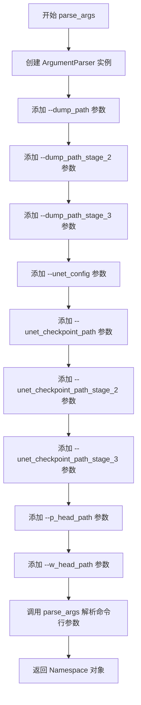

#### 带注释源码

```
def parse_args():
    """
    解析命令行参数，返回包含所有配置路径的命名空间对象。
    
    该函数使用 argparse 模块定义了一系列命令行参数，用于指定：
    - 各阶段 pipeline 的输出路径（dump_path）
    - UNet 模型的配置文件和检查点路径
    - 安全检查器的 p_head 和 w_head 权重文件路径
    """
    # 创建 ArgumentParser 实例，用于解析命令行参数
    parser = argparse.ArgumentParser()

    # 添加 --dump_path 参数：第一阶段 IFPipeline 的输出路径
    # required=False 表示该参数可选，default=None 表示未提供时的默认值，type=str 指定参数类型为字符串
    parser.add_argument("--dump_path", required=False, default=None, type=str)

    # 添加 --dump_path_stage_2 参数：第二阶段超分辨率 pipeline 的输出路径
    parser.add_argument("--dump_path_stage_2", required=False, default=None, type=str)

    # 添加 --dump_path_stage_3 参数：第三阶段超分辨率 pipeline 的输出路径
    parser.add_argument("--dump_path_stage_3", required=False, default=None, type=str)

    # 添加 --unet_config 参数：UNet 模型的配置文件路径（YAML 格式）
    parser.add_argument("--unet_config", required=False, default=None, type=str, help="Path to unet config file")

    # 添加 --unet_checkpoint_path 参数：第一阶段 UNet 模型的检查点文件路径
    parser.add_argument(
        "--unet_checkpoint_path", required=False, default=None, type=str, help="Path to unet checkpoint file"
    )

    # 添加 --unet_checkpoint_path_stage_2 参数：第二阶段 UNet 模型的检查点文件路径
    parser.add_argument(
        "--unet_checkpoint_path_stage_2",
        required=False,
        default=None,
        type=str,
        help="Path to stage 2 unet checkpoint file",
    )

    # 添加 --unet_checkpoint_path_stage_3 参数：第三阶段 UNet 模型的检查点文件路径
    parser.add_argument(
        "--unet_checkpoint_path_stage_3",
        required=False,
        default=None,
        type=str,
        help="Path to stage 3 unet checkpoint file",
    )

    # 添加 --p_head_path 参数：安全检查器 p_head 权重文件路径（必选参数）
    parser.add_argument("--p_head_path", type=str, required=True)

    # 添加 --w_head_path 参数：安全检查器 w_head 权重文件路径（必选参数）
    parser.add_argument("--w_head_path", type=str, required=True)

    # 解析命令行参数，将解析结果存储在 args 变量中
    args = parser.parse_args()

    # 返回包含所有解析参数的 Namespace 对象
    return args
```


### `main`

这是深度学习模型转换脚本的入口函数，负责将DeepFloyd IF（Image Factories）模型从原始的LDM格式转换为Diffusers格式，支持三个阶段的转换：Stage 1（主模型）、Stage 2和Stage 3（超分辨率模型）。

参数：

-  `args`：命令行参数对象（argparse.Namespace），包含以下属性：
  - `dump_path`：Stage 1模型输出路径（str，可选）
  - `dump_path_stage_2`：Stage 2模型输出路径（str，可选）
  - `dump_path_stage_3`：Stage 3模型输出路径（str，可选）
  - `unet_config`：UNet配置文件路径（str，可选）
  - `unet_checkpoint_path`：Stage 1 UNet检查点路径（str，可选）
  - `unet_checkpoint_path_stage_2`：Stage 2 UNet检查点路径（str，可选）
  - `unet_checkpoint_path_stage_3`：Stage 3 UNet检查点路径（str，可选）
  - `p_head_path`：安全检查器p_head权重路径（str，必需）
  - `w_head_path`：安全检查器w_head权重路径（str，必需）

返回值：`None`，该函数执行完成后不返回任何值，仅将转换后的模型保存到指定路径。

#### 流程图

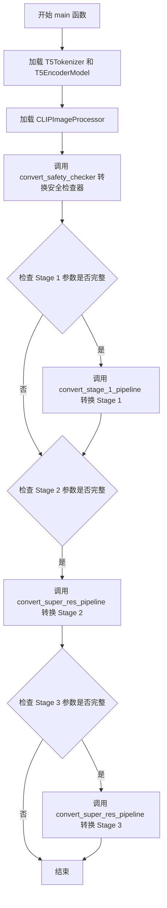

#### 带注释源码

```python
def main(args):
    """
    主函数：执行DeepFloyd IF模型从LDM格式到Diffusers格式的转换
    
    该函数根据提供的命令行参数，决定转换哪个阶段的模型：
    - Stage 1: 主扩散模型
    - Stage 2: 超分辨率模型（第一级）
    - Stage 3: 超分辨率模型（第二级）
    """
    
    # 步骤1: 加载T5文本编码器模型
    # 用于将文本提示转换为文本嵌入向量，供UNet在去噪过程中使用
    tokenizer = T5Tokenizer.from_pretrained("google/t5-v1_1-xxl")
    text_encoder = T5EncoderModel.from_pretrained("google/t5-v1_1-xxl")

    # 步骤2: 加载CLIP图像处理器
    # 用于处理输入图像和安全检查的特征提取
    feature_extractor = CLIPImageProcessor.from_pretrained("openai/clip-vit-large-patch14")
    
    # 步骤3: 转换并加载安全检查器
    # 安全检查器用于过滤不当内容，由p_head和w_head两个头部组成
    safety_checker = convert_safety_checker(
        p_head_path=args.p_head_path, 
        w_head_path=args.w_head_path
    )

    # 步骤4: 检查并转换Stage 1主模型
    # 需要同时提供unet_config、unet_checkpoint_path和dump_path
    if args.unet_config is not None and args.unet_checkpoint_path is not None and args.dump_path is not None:
        convert_stage_1_pipeline(
            tokenizer, 
            text_encoder, 
            feature_extractor, 
            safety_checker, 
            args
        )

    # 步骤5: 检查并转换Stage 2超分辨率模型
    # Stage 2将低分辨率图像提升到中等分辨率
    if args.unet_checkpoint_path_stage_2 is not None and args.dump_path_stage_2 is not None:
        convert_super_res_pipeline(
            tokenizer, 
            text_encoder, 
            feature_extractor, 
            safety_checker, 
            args, 
            stage=2
        )

    # 步骤6: 检查并转换Stage 3超分辨率模型
    # Stage 3将中等分辨率图像提升到最终的高分辨率（1024x1024）
    if args.unet_checkpoint_path_stage_3 is not None and args.dump_path_stage_3 is not None:
        convert_super_res_pipeline(
            tokenizer, 
            text_encoder, 
            feature_extractor, 
            safety_checker, 
            args, 
            stage=3
        )
```


### `convert_stage_1_pipeline`

该函数用于将 DeepFloyd IF Stage 1 的 UNet 检查点转换为 Hugging Face Diffusers 格式，并组装成完整的 IFPipeline 后保存到指定路径。

参数：

- `tokenizer`：`T5Tokenizer`，Google T5 文本分词器，用于对输入文本进行编码
- `text_encoder`：`T5EncoderModel`，Google T5 文本编码模型，将文本转换为嵌入向量
- `feature_extractor`：`CLIPImageProcessor`，CLIP 图像预处理模块，用于处理输入图像
- `safety_checker`：`IFSafetyChecker`，DeepFloyd IF 安全检查器，用于过滤不适当内容
- `args`：命令行参数对象，包含 `unet_config`、`unet_checkpoint_path` 和 `dump_path` 等配置

返回值：`None`，该函数执行后无返回值，主要作用是生成并保存模型文件

#### 流程图

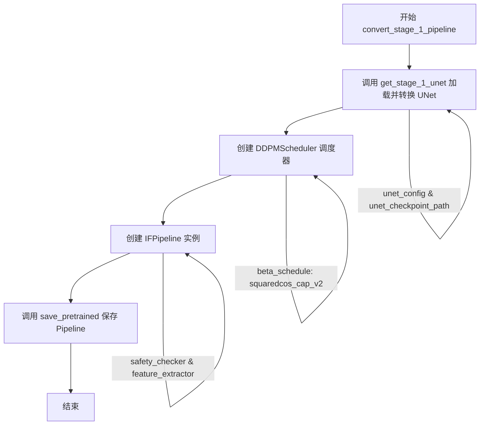

#### 带注释源码

```python
def convert_stage_1_pipeline(tokenizer, text_encoder, feature_extractor, safety_checker, args):
    """
    将 Stage 1 UNet 检查点转换为 Diffusers 格式并组装为 IFPipeline
    
    参数:
        tokenizer: T5Tokenizer 实例，用于文本编码
        text_encoder: T5EncoderModel 实例，文本编码模型
        feature_extractor: CLIPImageProcessor 实例，图像特征提取器
        safety_checker: IFSafetyChecker 实例，安全检查器
        args: 包含模型路径和配置的命令行参数
    """
    
    # 步骤1: 加载并转换 Stage 1 的 UNet 模型
    # 调用 get_stage_1_unet 函数，传入 UNet 配置文件路径和检查点路径
    # 该函数会读取原始 LDM 格式的 UNet 检查点，并转换为 Diffusers 格式
    unet = get_stage_1_unet(args.unet_config, args.unet_checkpoint_path)
    
    # 步骤2: 创建 DDPMScheduler 调度器
    # DDPMScheduler 是用于扩散模型的噪声调度器
    # 参数说明:
    #   - variance_type="learned_range": 学习到的方差范围
    #   - beta_schedule="squaredcos_cap_v2": 余弦调度策略
    #   - prediction_type="epsilon": 预测噪声而非直接预测图像
    #   - thresholding=True: 启用阈值化处理
    #   - dynamic_thresholding_ratio=0.95: 动态阈值化比例
    #   - sample_max_value=1.5: 采样最大值限制
    scheduler = DDPMScheduler(
        variance_type="learned_range",
        beta_schedule="squaredcos_cap_v2",
        prediction_type="epsilon",
        thresholding=True,
        dynamic_thresholding_ratio=0.95,
        sample_max_value=1.5,
    )
    
    # 步骤3: 创建 IFPipeline 实例
    # IFPipeline 是 DeepFloyd IF 的核心推理 Pipeline
    # 整合了所有组件: tokenizer、text_encoder、unet、scheduler、safety_checker 等
    pipe = IFPipeline(
        tokenizer=tokenizer,
        text_encoder=text_encoder,
        unet=unet,
        scheduler=scheduler,
        safety_checker=safety_checker,
        feature_extractor=feature_extractor,
        requires_safety_checker=True,  # 启用安全检查
    )
    
    # 步骤4: 保存 Pipeline 到指定路径
    # 使用 save_pretrained 方法将整个 Pipeline 保存为 Diffusers 格式
    # 保存内容包括: 模型权重、配置文件、tokenizer、scheduler 等
    pipe.save_pretrained(args.dump_path)
```


### `convert_super_res_pipeline`

该函数用于将 DeepFloyd IF 模型的超分辨率阶段（Stage 2 或 Stage 3）的 UNet 检查点转换为 Diffusers 格式，并保存为可加载的 IFSuperResolutionPipeline。

参数：

- `tokenizer`：`T5Tokenizer`，用于文本编码的 T5 分词器实例
- `text_encoder`：`T5EncoderModel`，用于文本编码的 T5 编码器模型
- `feature_extractor`：`CLIPImageProcessor`，用于图像特征提取的 CLIP 图像处理器
- `safety_checker`：`IFSafetyChecker`，用于内容安全检查的安全检查器
- `args`：命令行参数对象，包含检查点路径和输出路径等配置
- `stage`：整数，表示超分辨率阶段（2 或 3）

返回值：`None`，该函数直接保存转换后的管道到指定路径，不返回任何值

#### 流程图

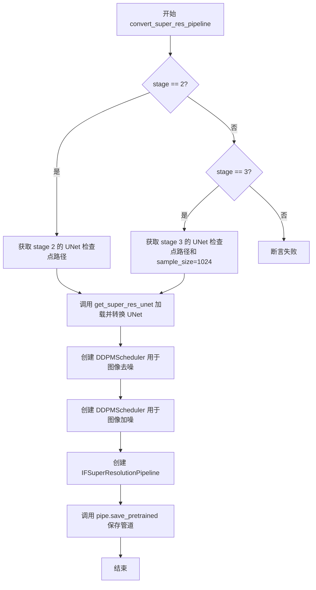

#### 带注释源码

```python
def convert_super_res_pipeline(tokenizer, text_encoder, feature_extractor, safety_checker, args, stage):
    """
    将超分辨率阶段的 UNet 检查点转换为 Diffusers 格式并保存为 IFSuperResolutionPipeline
    
    参数:
        tokenizer: T5Tokenizer 实例，用于文本编码
        text_encoder: T5EncoderModel 实例，用于生成文本嵌入
        feature_extractor: CLIPImageProcessor 实例，用于图像预处理
        safety_checker: IFSafetyChecker 实例，用于过滤不安全内容
        args: 包含所有命令行参数的命名空间对象
        stage: 整数，表示超分辨率阶段（2 或 3）
    """
    
    # 根据阶段选择对应的检查点路径和参数
    if stage == 2:
        # Stage 2: 获取第二阶段的 UNet 检查点路径
        unet_checkpoint_path = args.unet_checkpoint_path_stage_2
        # Stage 2 使用配置中的原始 sample_size
        sample_size = None
        # 获取第二阶段的输出路径
        dump_path = args.dump_path_stage_2
    elif stage == 3:
        # Stage 3: 获取第三阶段的 UNet 检查点路径
        unet_checkpoint_path = args.unet_checkpoint_path_stage_3
        # Stage 3 硬编码 sample_size 为 1024（配置中此值可能有误）
        sample_size = 1024
        # 获取第三阶段的输出路径
        dump_path = args.dump_path_stage_3
    else:
        # 不支持的阶段，抛出断言错误
        assert False

    # 加载并转换超分辨率 UNet 模型
    # verify_param_count=False 跳过参数数量验证以提高速度
    unet = get_super_res_unet(unet_checkpoint_path, verify_param_count=False, sample_size=sample_size)

    # 创建图像加噪调度器（用于扩散过程）
    image_noising_scheduler = DDPMScheduler(
        beta_schedule="squaredcos_cap_v2",
    )

    # 创建主要的去噪调度器
    scheduler = DDPMScheduler(
        variance_type="learned_range",      # 学习到的方差范围
        beta_schedule="squaredcos_cap_v2", # 余弦平方 beta 调度
        prediction_type="epsilon",          # 预测噪声而非原始数据
        thresholding=True,                  # 启用阈值化
        dynamic_thresholding_ratio=0.95,    # 动态阈值化比例
        sample_max_value=1.0,               # 样本最大值
    )

    # 构建超分辨率管道
    pipe = IFSuperResolutionPipeline(
        tokenizer=tokenizer,                  # 文本分词器
        text_encoder=text_encoder,            # 文本编码器
        unet=unet,                             # 超分辨率 UNet 模型
        scheduler=scheduler,                  # 主调度器
        image_noising_scheduler=image_noising_scheduler,  # 图像加噪调度器
        safety_checker=safety_checker,        # 安全检查器
        feature_extractor=feature_extractor,  # 特征提取器
        requires_safety_checker=True,          # 需要安全检查
    )

    # 将转换后的管道保存到指定路径
    pipe.save_pretrained(dump_path)
```


### `get_stage_1_unet`

该函数用于将原始的 LDM (Latent Diffusion Models) 格式的 Stage 1 UNet 配置和检查点转换为 Diffusers 库格式的 `UNet2DConditionModel`，主要完成配置解析、模型创建、权重转换和加载的完整流程。

参数：

- `unet_config`：`str`，UNet 配置文件路径，指向包含原始 LDM UNet 配置的 YAML 文件
- `unet_checkpoint_path`：`str`，UNet 检查点文件路径，指向原始 LDM UNet 的权重文件

返回值：`UNet2DConditionModel`，转换并加载权重后的 Diffusers 格式 UNet 模型

#### 流程图

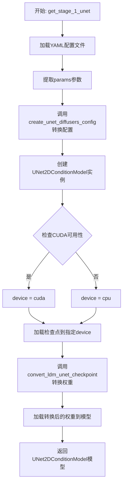

#### 带注释源码

```python
def get_stage_1_unet(unet_config, unet_checkpoint_path):
    """
    将原始 LDM Stage 1 UNet 配置和检查点转换为 Diffusers 格式的 UNet2DConditionModel
    
    参数:
        unet_config: UNet 配置文件路径 (YAML 格式)
        unet_checkpoint_path: UNet 检查点文件路径
    
    返回:
        UNet2DConditionModel: 转换并加载权重后的模型
    """
    # 步骤1: 使用 YAML 解析原始配置文件
    original_unet_config = yaml.safe_load(unet_config)
    # 提取配置中的 params 参数部分
    original_unet_config = original_unet_config["params"]

    # 步骤2: 将原始 LDM 配置转换为 Diffusers 格式的配置
    unet_diffusers_config = create_unet_diffusers_config(original_unet_config)

    # 步骤3: 使用转换后的配置创建 UNet2DConditionModel 模型实例
    unet = UNet2DConditionModel(**unet_diffusers_config)

    # 步骤4: 确定设备 (优先使用 CUDA)
    device = "cuda" if torch.cuda.is_available() else "cpu"
    # 加载原始检查点到指定设备
    unet_checkpoint = torch.load(unet_checkpoint_path, map_location=device)

    # 步骤5: 将原始 LDM 权重格式转换为 Diffusers 权重格式
    converted_unet_checkpoint = convert_ldm_unet_checkpoint(
        unet_checkpoint, unet_diffusers_config, path=unet_checkpoint_path
    )

    # 步骤6: 加载转换后的权重到模型中
    unet.load_state_dict(converted_unet_checkpoint)

    # 返回转换完成的模型
    return unet
```


### `convert_safety_checker`

该函数用于将深层图像生成模型的安全检查器（Safety Checker）的权重从 NumPy 格式转换为 HuggingFace Diffusers 库中的 `IFSafetyChecker` 模型。它加载 p_head 和 w_head 参数以及预训练的 CLIP 视觉模型，构建完整的安全检查器并返回。

参数：

- `p_head_path`：`str`，指向包含 p_head 权重和偏置的 NumPy 文件路径（.npz 格式）
- `w_head_path`：`str`，指向包含 w_head 权重和偏置的 NumPy 文件路径（.npz 格式）

返回值：`IFSafetyChecker`，返回配置并加载权重后的安全检查器模型实例

#### 流程图

```mermaid
flowchart TD
    A[开始 convert_safety_checker] --> B[创建空 state_dict]
    B --> C[加载 p_head.npz 文件]
    C --> D[提取 weights 和 biases 并转换为 torch.Tensor]
    D --> E[添加批次维度 unsqueeze(0)]
    E --> F[存储到 state_dict p_head.weight 和 p_head.bias]
    F --> G[加载 w_head.npz 文件]
    G --> H[提取 weights 和 biases 并转换为 torch.Tensor]
    H --> I[添加批次维度 unsqueeze(0)]
    I --> J[存储到 state_dict w_head.weight 和 w_head.bias]
    J --> K[加载预训练 CLIPVisionModelWithProjection]
    K --> L[遍历模型状态字典并添加 vision_model. 前缀]
    L --> M[从预训练创建 CLIPConfig]
    M --> N[创建 IFSafetyChecker 实例]
    N --> O[加载 state_dict 到安全检查器]
    O --> P[返回 safety_checker]
```

#### 带注释源码

```python
def convert_safety_checker(p_head_path, w_head_path):
    """
    将安全检查器的权重从 NumPy 格式转换为 IFSafetyChecker 模型
    
    参数:
        p_head_path: str, p_head 权重文件路径 (.npz)
        w_head_path: str, w_head 权重文件路径 (.npz)
    
    返回:
        IFSafetyChecker: 配置好的安全检查器模型
    """
    
    # 步骤1: 初始化空的状态字典，用于存储所有转换后的权重
    state_dict = {}

    # ===== 处理 p_head (概率头) =====
    # p_head 负责预测输入图像是否包含不安全内容
    
    # 从 NumPy 文件加载 p_head 参数
    p_head = np.load(p_head_path)
    
    # 提取权重并转换为 PyTorch 张量
    p_head_weights = p_head["weights"]
    p_head_weights = torch.from_numpy(p_head_weights)
    # 添加批次维度以匹配模型输入格式 [batch, ...]
    p_head_weights = p_head_weights.unsqueeze(0)
    
    # 提取偏置并转换为 PyTorch 张量
    p_head_biases = p_head["biases"]
    p_head_biases = torch.from_numpy(p_head_biases)
    p_head_biases = p_head_biases.unsqueeze(0)
    
    # 将 p_head 参数存入状态字典，使用新模型需要的键名
    state_dict["p_head.weight"] = p_head_weights
    state_dict["p_head.bias"] = p_head_biases

    # ===== 处理 w_head (权重头) =====
    # w_head 类似于 p_head，可能用于加权融合或其他判断逻辑
    
    # 从 NumPy 文件加载 w_head 参数
    w_head = np.load(w_head_path)
    
    # 提取权重并转换
    w_head_weights = w_head["weights"]
    w_head_weights = torch.from_numpy(w_head_weights)
    w_head_weights = w_head_weights.unsqueeze(0)
    
    # 提取偏置并转换
    w_head_biases = w_head["biases"]
    w_head_biases = torch.from_numpy(w_head_biases)
    w_head_biases = w_head_biases.unsqueeze(0)
    
    # 将 w_head 参数存入状态字典
    state_dict["w_head.weight"] = w_head_weights
    state_dict["w_head.bias"] = w_head_biases

    # ===== 处理 CLIP 视觉模型 =====
    # 安全检查器使用 CLIP 视觉模型来提取图像特征
    
    # 加载预训练的 CLIP 视觉模型 (ViT-L/14)
    vision_model = CLIPVisionModelWithProjection.from_pretrained("openai/clip-vit-large-patch14")
    
    # 获取模型的状态字典
    vision_model_state_dict = vision_model.state_dict()
    
    # 为所有键添加 "vision_model." 前缀以匹配 IFSafetyChecker 的命名约定
    for key, value in vision_model_state_dict.items():
        key = f"vision_model.{key}"
        state_dict[key] = value

    # ===== 创建并配置 IFSafetyChecker =====
    
    # 从预训练模型创建 CLIP 配置
    config = CLIPConfig.from_pretrained("openai/clip-vit-large-patch14")
    
    # 使用配置初始化安全检查器
    safety_checker = IFSafetyChecker(config)
    
    # 加载之前准备的所有权重
    safety_checker.load_state_dict(state_dict)

    # 返回配置好的安全检查器模型
    return safety_checker
```


### `create_unet_diffusers_config`

将原始 LDM/DeepFloyd IF UNet 配置转换为 Diffusers 格式的 UNet2DConditionModel 配置字典，用于后续模型权重转换和实例化。

参数：

- `original_unet_config`：`dict`，原始 LDM 模型的 UNet 配置文件（包含 image_size、model_channels、channel_mult、attention_resolutions 等参数）
- `class_embed_type`：`str` 或 `None`，可选参数，指定类别嵌入类型（如 "projection" 用于条件生成）

返回值：`dict`，返回符合 Diffusers 库 `UNet2DConditionModel` 构造函数要求的配置字典，包含 sample_size、in_channels、down_block_types、block_out_channels、layers_per_block、cross_attention_dim、attention_head_dim、use_linear_projection、class_embed_type、projection_class_embeddings_input_dim、out_channels、up_block_types、upcast_attention、cross_attention_norm、mid_block_type、addition_embed_type、act_fn 等键。

#### 流程图

```mermaid
flowchart TD
    A[开始] --> B[解析 attention_resolutions 列表]
    B --> C[计算 block_out_channels]
    C --> D[遍历 block_out_channels 构建 down_block_types]
    D --> E[遍历 block_out_channels 构建 up_block_types]
    E --> F[获取 num_head_channels]
    F --> G{判断 use_linear_in_transformer}
    G -->|是| H[检查 head_dim 是否为 None]
    G -->|否| I[use_linear_projection = False]
    H -->|head_dim 为 None| J[设置 head_dim = [5, 10, 20, 20]]
    H -->|head_dim 不为 None| K[保持原 head_dim]
    J --> L
    K --> L
    I --> L
    L{判断 class_embed_type}
    L -->|None| M{检查 num_classes}
    L -->|不为 None| N[使用传入的 class_embed_type]
    M -->|有 num_classes| O{检查是否为 sequential}
    M -->|无 num_classes| P[projection_class_embeddings_input_dim = None]
    O -->|是| Q[设置 class_embed_type = projection]
    O -->|否| R[抛出 NotImplementedError]
    Q --> S[获取 adm_in_channels]
    N --> T
    P --> T
    S --> T
    T --> U[构建配置字典 config]
    U --> V{检查 use_scale_shift_norm}
    V -->|是| W[添加 resnet_time_scale_shift]
    V -->|否| X
    W --> X
    X --> Y{检查 encoder_dim}
    Y -->|是| Z[添加 encoder_hid_dim]
    Y -->|否| AA
    Z --> AA
    AA --> BB[返回 config]
```

#### 带注释源码

```python
def create_unet_diffusers_config(original_unet_config, class_embed_type=None):
    """
    将原始 LDM/DeepFloyd IF UNet 配置转换为 Diffusers 格式的 UNet2DConditionModel 配置。
    
    参数:
        original_unet_config: 原始 LDM 模型的 UNet 配置字典
        class_embed_type: 可选的类别嵌入类型，默认为 None
    """
    # 解析注意力分辨率配置，将相对分辨率转换为绝对分辨率
    # 例如: attention_resolutions="32,16,8" + image_size=256 -> [8, 16, 32]
    attention_resolutions = parse_list(original_unet_config["attention_resolutions"])
    attention_resolutions = [original_unet_config["image_size"] // int(res) for res in attention_resolutions]

    # 计算每个阶段的输出通道数
    # 例如: model_channels=320, channel_mult=[1,2,4,4] -> [320, 640, 1280, 1280]
    channel_mult = parse_list(original_unet_config["channel_mult"])
    block_out_channels = [original_unet_config["model_channels"] * mult for mult in channel_mult]

    # 根据注意力分辨率和 resblock 配置确定下采样块类型
    down_block_types = []
    resolution = 1

    for i in range(len(block_out_channels)):
        if resolution in attention_resolutions:
            # 需要交叉注意力
            block_type = "SimpleCrossAttnDownBlock2D"
        elif original_unet_config["resblock_updown"]:
            # 带下采样的 ResNet 块
            block_type = "ResnetDownsampleBlock2D"
        else:
            # 标准的下采样块
            block_type = "DownBlock2D"

        down_block_types.append(block_type)

        if i != len(block_out_channels) - 1:
            resolution *= 2

    # 根据注意力分辨率和 resblock 配置确定上采样块类型
    up_block_types = []
    for i in range(len(block_out_channels)):
        if resolution in attention_resolutions:
            # 需要交叉注意力的上采样块
            block_type = "SimpleCrossAttnUpBlock2D"
        elif original_unet_config["resblock_updown"]:
            # 带上采样的 ResNet 块
            block_type = "ResnetUpsampleBlock2D"
        else:
            # 标准的上采样块
            block_type = "UpBlock2D"
        up_block_types.append(block_type)
        resolution //= 2

    # 获取注意力头维度
    head_dim = original_unet_config["num_head_channels"]

    # 判断是否使用线性投影
    use_linear_projection = (
        original_unet_config["use_linear_in_transformer"]
        if "use_linear_in_transformer" in original_unet_config
        else False
    )
    if use_linear_projection:
        # stable diffusion 2-base-512 和 2-768 版本的头维度处理
        if head_dim is None:
            head_dim = [5, 10, 20, 20]

    projection_class_embeddings_input_dim = None

    # 处理类别嵌入配置
    if class_embed_type is None:
        if "num_classes" in original_unet_config:
            if original_unet_config["num_classes"] == "sequential":
                # 顺序类别嵌入，需要投影层
                class_embed_type = "projection"
                assert "adm_in_channels" in original_unet_config
                projection_class_embeddings_input_dim = original_unet_config["adm_in_channels"]
            else:
                raise NotImplementedError(
                    f"Unknown conditional unet num_classes config: {original_unet_config['num_classes']}"
                )

    # 构建 Diffusers 格式的 UNet 配置字典
    config = {
        "sample_size": original_unet_config["image_size"],
        "in_channels": original_unet_config["in_channels"],
        "down_block_types": tuple(down_block_types),
        "block_out_channels": tuple(block_out_channels),
        "layers_per_block": original_unet_config["num_res_blocks"],
        "cross_attention_dim": original_unet_config["encoder_channels"],
        "attention_head_dim": head_dim,
        "use_linear_projection": use_linear_projection,
        "class_embed_type": class_embed_type,
        "projection_class_embeddings_input_dim": projection_class_embeddings_input_dim,
        "out_channels": original_unet_config["out_channels"],
        "up_block_types": tuple(up_block_types),
        "upcast_attention": False,  # TODO: guessing
        "cross_attention_norm": "group_norm",
        "mid_block_type": "UNetMidBlock2DSimpleCrossAttn",
        "addition_embed_type": "text",
        "act_fn": "gelu",
    }

    # 处理残差块的归一化方式
    if original_unet_config["use_scale_shift_norm"]:
        config["resnet_time_scale_shift"] = "scale_shift"

    # 处理编码器隐藏层维度
    if "encoder_dim" in original_unet_config:
        config["encoder_hid_dim"] = original_unet_config["encoder_dim"]

    return config
```


### `convert_ldm_unet_checkpoint`

该函数用于将原始 LDM（Latent Diffusion Models）UNet 的检查点状态字典转换为 Diffusers 库中 `UNet2DConditionModel` 所需的格式，处理两个不同架构之间的键名映射和权重重组。

参数：

- `unet_state_dict`：`Dict`，原始 LDM UNet 的状态字典，包含旧键名的权重
- `config`：`Dict`，Diffusers UNet 配置字典，包含层数、注意力维度等信息
- `path`：`Optional[str]`，检查点文件路径（当前函数体中未使用）

返回值：`Dict`，转换后的新检查点字典，键名已更改为 Diffusers 格式

#### 流程图

```mermaid
flowchart TD
    A[开始] --> B[初始化 new_checkpoint]
    B --> C[转换 time_embedding<br/>time_embed.0 → linear_1<br/>time_embed.2 → linear_2]
    C --> D{class_embed_type<br/>是否为 None/identity}
    D -->|是| E[跳过 class_embedding]
    D -->|否| F{class_embed_type<br/>== timestep 或 projection}
    F -->|是| G[转换 class_embedding<br/>label_emb.0.0 → class_embedding]
    F -->|否| H[抛出 NotImplementedError]
    G --> I[转换 conv_in/input_blocks.0.0]
    I --> J[转换 conv_norm_out & conv_out<br/>out.0 & out.2]
    J --> K[提取 input_blocks 键]
    K --> L[提取 middle_block 键]
    L --> M[提取 output_blocks 键]
    M --> N[遍历 input_blocks 1~N-1]
    N --> O[计算 block_id & layer_in_block_id]
    O --> P[获取 resnets & attentions]
    P --> Q{存在 downsampler}
    Q -->|是| R[转换 downsampler 权重]
    Q -->|否| S[使用 renew_resnet_paths]
    R --> T[assign_to_checkpoint]
    S --> T
    T --> U{存在 attentions}
    U -->|是| V[assign_attention_to_checkpoint<br/>拆分 qkv 权重]
    U -->|否| W[继续下一个 block]
    V --> W
    W --> X{还有更多 input_blocks}
    X -->|是| N
    X -->|否| Y[处理 middle_block<br/>resnet_0, attention, resnet_1]
    Y --> Z[遍历 output_blocks]
    Z --> AA[计算 block_id & layer_in_block_id]
    AA --> AB{output_block_list 长度}
    AB -->|大于1| AC[处理 resnet + attention + upsampler]
    AB -->|等于1| AD[仅处理 resnet]
    AC --> AE[assign_to_checkpoint]
    AD --> AF[直接赋值权重]
    AE --> AG{还有更多 output_blocks}
    AF --> AG
    AG -->|是| Z
    AG -->|否| AH{存在 encoder_proj}
    AH -->|是| AI[转换 encoder_hid_proj]
    AH -->|否| AJ{存在 encoder_pooling}
    AJ -->|是| AK[转换 add_embedding]
    AJ -->|否| AL[返回 new_checkpoint]
    AI --> AJ
    AK --> AL
```

#### 带注释源码

```python
def convert_ldm_unet_checkpoint(unet_state_dict, config, path=None):
    """
    Takes a state dict and a config, and returns a converted checkpoint.
    """
    new_checkpoint = {}  # 初始化新的检查点字典

    # ===== 1. 转换时间嵌入层 =====
    # 将原始 LDM 的 time_embed.0 转换为 Diffusers 的 time_embedding.linear_1
    new_checkpoint["time_embedding.linear_1.weight"] = unet_state_dict["time_embed.0.weight"]
    new_checkpoint["time_embedding.linear_1.bias"] = unet_state_dict["time_embed.0.bias"]
    # 将原始 LDM 的 time_embed.2 转换为 Diffusers 的 time_embedding.linear_2
    new_checkpoint["time_embedding.linear_2.weight"] = unet_state_dict["time_embed.2.weight"]
    new_checkpoint["time_embedding.linear_2.bias"] = unet_state_dict["time_embed.2.bias"]

    # ===== 2. 转换类别嵌入层 =====
    # 根据 class_embed_type 类型决定如何转换
    if config["class_embed_type"] in [None, "identity"]:
        # 无类别嵌入参数需要迁移
        ...
    elif config["class_embed_type"] == "timestep" or config["class_embed_type"] == "projection":
        # 转换类别嵌入层：label_emb.0.0 → class_embedding.linear_1/linear_2
        new_checkpoint["class_embedding.linear_1.weight"] = unet_state_dict["label_emb.0.0.weight"]
        new_checkpoint["class_embedding.linear_1.bias"] = unet_state_dict["label_emb.0.0.bias"]
        new_checkpoint["class_embedding.linear_2.weight"] = unet_state_dict["label_emb.0.2.weight"]
        new_checkpoint["class_embedding.linear_2.bias"] = unet_state_dict["label_emb.0.2.bias"]
    else:
        raise NotImplementedError(f"Not implemented `class_embed_type`: {config['class_embed_type']}")

    # ===== 3. 转换输入卷积层 =====
    # input_blocks.0.0 是第一个卷积层，转换为 conv_in
    new_checkpoint["conv_in.weight"] = unet_state_dict["input_blocks.0.0.weight"]
    new_checkpoint["conv_in.bias"] = unet_state_dict["input_blocks.0.0.bias"]

    # ===== 4. 转换输出卷积层 =====
    # out.0 是输出归一化层，out.2 是输出卷积层
    new_checkpoint["conv_norm_out.weight"] = unet_state_dict["out.0.weight"]
    new_checkpoint["conv_norm_out.bias"] = unet_state_dict["out.0.bias"]
    new_checkpoint["conv_out.weight"] = unet_state_dict["out.2.weight"]
    new_checkpoint["conv_out.bias"] = unet_state_dict["out.2.bias"]

    # ===== 5. 提取输入块（down blocks）的键 =====
    # 获取 input_blocks 中不同层级 ID 的数量
    num_input_blocks = len({".".join(layer.split(".")[:2]) for layer in unet_state_dict if "input_blocks" in layer})
    # 为每个层级 ID 收集相关的键
    input_blocks = {
        layer_id: [key for key in unet_state_dict if f"input_blocks.{layer_id}." in key]
        for layer_id in range(num_input_blocks)
    }

    # ===== 6. 提取中间块（middle block）的键 =====
    num_middle_blocks = len({".".join(layer.split(".")[:2]) for layer in unet_state_dict if "middle_block" in layer})
    middle_blocks = {
        layer_id: [key for key in unet_state_dict if f"middle_block.{layer_id}" in key]
        for layer_id in range(num_middle_blocks)
    }

    # ===== 7. 提取输出块（up blocks）的键 =====
    num_output_blocks = len({".".join(layer.split(".")[:2]) for layer in unet_state_dict if "output_blocks" in layer})
    output_blocks = {
        layer_id: [key for key in unet_state_dict if f"output_blocks.{layer_id}." in key]
        for layer_id in range(num_output_blocks)
    }

    # ===== 8. 处理输入块（Down Blocks）=====
    for i in range(1, num_input_blocks):
        # 计算在哪个 down_block 中以及在 block 内的层索引
        block_id = (i - 1) // (config["layers_per_block"] + 1)
        layer_in_block_id = (i - 1) % (config["layers_per_block"] + 1)

        # 提取 resnet 层和注意力层的键
        resnets = [
            key for key in input_blocks[i] if f"input_blocks.{i}.0" in key and f"input_blocks.{i}.0.op" not in key
        ]
        attentions = [key for key in input_blocks[i] if f"input_blocks.{i}.1" in key]

        # 处理下采样器（downsampler）层
        if f"input_blocks.{i}.0.op.weight" in unet_state_dict:
            new_checkpoint[f"down_blocks.{block_id}.downsamplers.0.conv.weight"] = unet_state_dict.pop(
                f"input_blocks.{i}.0.op.weight"
            )
            new_checkpoint[f"down_blocks.{block_id}.downsamplers.0.conv.bias"] = unet_state_dict.pop(
                f"input_blocks.{i}.0.op.bias"
            )

        # 使用路径重命名函数转换 resnet 路径
        paths = renew_resnet_paths(resnets)

        # 确定元路径：决定是 downsampler 还是普通 resnet
        block_type = config["down_block_types"][block_id]
        if (block_type == "ResnetDownsampleBlock2D" or block_type == "SimpleCrossAttnDownBlock2D") and i in [
            4,
            8,
            12,
            16,
        ]:
            meta_path = {"old": f"input_blocks.{i}.0", "new": f"down_blocks.{block_id}.downsamplers.0"}
        else:
            meta_path = {"old": f"input_blocks.{i}.0", "new": f"down_blocks.{block_id}.resnets.{layer_in_block_id}"}

        # 将权重分配到新检查点
        assign_to_checkpoint(
            paths, new_checkpoint, unet_state_dict, additional_replacements=[meta_path], config=config
        )

        # 处理注意力层
        if len(attentions):
            old_path = f"input_blocks.{i}.1"
            new_path = f"down_blocks.{block_id}.attentions.{layer_in_block_id}"

            # 专门处理注意力层的 QKV 权重拆分
            assign_attention_to_checkpoint(
                new_checkpoint=new_checkpoint,
                unet_state_dict=unet_state_dict,
                old_path=old_path,
                new_path=new_path,
                config=config,
            )

            paths = renew_attention_paths(attentions)
            meta_path = {"old": old_path, "new": new_path}
            assign_to_checkpoint(
                paths,
                new_checkpoint,
                unet_state_dict,
                additional_replacements=[meta_path],
                config=config,
            )

    # ===== 9. 处理中间块（Middle Block）=====
    resnet_0 = middle_blocks[0]      # 第一个 resnet
    attentions = middle_blocks[1]    # 注意力层
    resnet_1 = middle_blocks[2]      # 第二个 resnet

    # 转换两个 resnet 层
    resnet_0_paths = renew_resnet_paths(resnet_0)
    assign_to_checkpoint(resnet_0_paths, new_checkpoint, unet_state_dict, config=config)

    resnet_1_paths = renew_resnet_paths(resnet_1)
    assign_to_checkpoint(resnet_1_paths, new_checkpoint, unet_state_dict, config=config)

    # 转换中间注意力层
    old_path = "middle_block.1"
    new_path = "mid_block.attentions.0"

    assign_attention_to_checkpoint(
        new_checkpoint=new_checkpoint,
        unet_state_dict=unet_state_dict,
        old_path=old_path,
        new_path=new_path,
        config=config,
    )

    attentions_paths = renew_attention_paths(attentions)
    meta_path = {"old": "middle_block.1", "new": "mid_block.attentions.0"}
    assign_to_checkpoint(
        attentions_paths, new_checkpoint, unet_state_dict, additional_replacements=[meta_path], config=config
    )

    # ===== 10. 处理输出块（Up Blocks）=====
    for i in range(num_output_blocks):
        block_id = i // (config["layers_per_block"] + 1)
        layer_in_block_id = i % (config["layers_per_block"] + 1)
        
        # 修整层名称
        output_block_layers = [shave_segments(name, 2) for name in output_blocks[i]]
        output_block_list = {}

        for layer in output_block_layers:
            layer_id, layer_name = layer.split(".")[0], shave_segments(layer, 1)
            if layer_id in output_block_list:
                output_block_list[layer_id].append(layer_name)
            else:
                output_block_list[layer_id] = [layer_name]

        # 根据 output_block_list 的长度决定处理方式
        # 长度 1: 只有 resnet
        # 长度 2: resnet + attention 或 resnet + 上采样 resnet
        # 长度 3: resnet + attention + 上采样 resnet

        if len(output_block_list) > 1:
            resnets = [key for key in output_blocks[i] if f"output_blocks.{i}.0" in key]
            attentions = [key for key in output_blocks[i] if f"output_blocks.{i}.1" in key]

            paths = renew_resnet_paths(resnets)

            meta_path = {"old": f"output_blocks.{i}.0", "new": f"up_blocks.{block_id}.resnets.{layer_in_block_id}"}

            assign_to_checkpoint(
                paths, new_checkpoint, unet_state_dict, additional_replacements=[meta_path], config=config
            )

            # 处理上采样器
            output_block_list = {k: sorted(v) for k, v in output_block_list.items()}
            if ["conv.bias", "conv.weight"] in output_block_list.values():
                index = list(output_block_list.values()).index(["conv.bias", "conv.weight"])
                new_checkpoint[f"up_blocks.{block_id}.upsamplers.0.conv.weight"] = unet_state_dict[
                    f"output_blocks.{i}.{index}.conv.weight"
                ]
                new_checkpoint[f"up_blocks.{block_id}.upsamplers.0.conv.bias"] = unet_state_dict[
                    f"output_blocks.{i}.{index}.conv.bias"
                ]

                # 上采样后无注意力层
                if len(attentions) == 2:
                    attentions = []

            # 处理注意力层
            if len(attentions):
                old_path = f"output_blocks.{i}.1"
                new_path = f"up_blocks.{block_id}.attentions.{layer_in_block_id}"

                assign_attention_to_checkpoint(
                    new_checkpoint=new_checkpoint,
                    unet_state_dict=unet_state_dict,
                    old_path=old_path,
                    new_path=new_path,
                    config=config,
                )

                paths = renew_attention_paths(attentions)
                meta_path = {
                    "old": old_path,
                    "new": new_path,
                }
                assign_to_checkpoint(
                    paths, new_checkpoint, unet_state_dict, additional_replacements=[meta_path], config=config
                )

            # 处理第三个 resnet（上采样 resnet）
            if len(output_block_list) == 3:
                resnets = [key for key in output_blocks[i] if f"output_blocks.{i}.2" in key]
                paths = renew_resnet_paths(resnets)
                meta_path = {"old": f"output_blocks.{i}.2", "new": f"up_blocks.{block_id}.upsamplers.0"}
                assign_to_checkpoint(
                    paths, new_checkpoint, unet_state_dict, additional_replacements=[meta_path], config=config
                )
        else:
            # 只有一个 resnet 的情况
            resnet_0_paths = renew_resnet_paths(output_block_layers, n_shave_prefix_segments=1)
            for path in resnet_0_paths:
                old_path = ".".join(["output_blocks", str(i), path["old"]])
                new_path = ".".join(["up_blocks", str(block_id), "resnets", str(layer_in_block_id), path["new"]])

                new_checkpoint[new_path] = unet_state_dict[old_path]

    # ===== 11. 处理编码器投影层 =====
    if "encoder_proj.weight" in unet_state_dict:
        new_checkpoint["encoder_hid_proj.weight"] = unet_state_dict.pop("encoder_proj.weight")
        new_checkpoint["encoder_hid_proj.bias"] = unet_state_dict.pop("encoder_proj.bias")

    # ===== 12. 处理编码器池化层 =====
    if "encoder_pooling.0.weight" in unet_state_dict:
        # 转换 add_embedding 的各个子组件
        new_checkpoint["add_embedding.norm1.weight"] = unet_state_dict.pop("encoder_pooling.0.weight")
        new_checkpoint["add_embedding.norm1.bias"] = unet_state_dict.pop("encoder_pooling.0.bias")

        new_checkpoint["add_embedding.pool.positional_embedding"] = unet_state_dict.pop(
            "encoder_pooling.1.positional_embedding"
        )
        new_checkpoint["add_embedding.pool.k_proj.weight"] = unet_state_dict.pop("encoder_pooling.1.k_proj.weight")
        new_checkpoint["add_embedding.pool.k_proj.bias"] = unet_state_dict.pop("encoder_pooling.1.k_proj.bias")
        new_checkpoint["add_embedding.pool.q_proj.weight"] = unet_state_dict.pop("encoder_pooling.1.q_proj.weight")
        new_checkpoint["add_embedding.pool.q_proj.bias"] = unet_state_dict.pop("encoder_pooling.1.q_proj.bias")
        new_checkpoint["add_embedding.pool.v_proj.weight"] = unet_state_dict.pop("encoder_pooling.1.v_proj.weight")
        new_checkpoint["add_embedding.pool.v_proj.bias"] = unet_state_dict.pop("encoder_pooling.1.v_proj.bias")

        new_checkpoint["add_embedding.proj.weight"] = unet_state_dict.pop("encoder_pooling.2.weight")
        new_checkpoint["add_embedding.proj.bias"] = unet_state_dict.pop("encoder_pooling.2.bias")

        new_checkpoint["add_embedding.norm2.weight"] = unet_state_dict.pop("encoder_pooling.3.weight")
        new_checkpoint["add_embedding.norm2.bias"] = unet_state_dict.pop("encoder_pooling.3.bias")

    return new_checkpoint
```


### `shave_segments`

该函数用于处理点号分隔的路径字符串，根据 `n_shave_prefix_segments` 参数的值，去除路径字符串中指定数量的前缀或后缀段。正值去除前面的段，负值去除后面的段。

参数：

- `path`：`str`，需要处理的路径字符串，通常为点号分隔的模型权重名称（如 "input_blocks.0.0.weight"）
- `n_shave_prefix_segments`：`int`，要切除的段数量，正值表示切除前缀段，负值表示切除后缀段，默认为 1

返回值：`str`，切除指定段数后的新路径字符串

#### 流程图

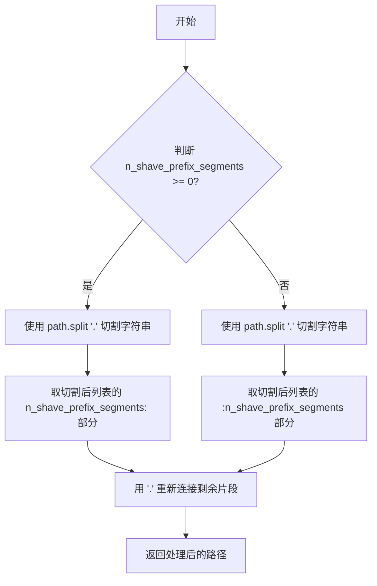

#### 带注释源码

```python
def shave_segments(path, n_shave_prefix_segments=1):
    """
    Removes segments. Positive values shave the first segments, negative shave the last segments.
    
    Args:
        path: 点号分隔的路径字符串（如 "input_blocks.0.0.weight"）
        n_shave_prefix_segments: 要切除的段数，正值切除前缀，负值切除后缀
    
    Returns:
        切除指定段数后的新路径字符串
    """
    # 当 n_shave_prefix_segments >= 0 时，去除前面的段
    if n_shave_prefix_segments >= 0:
        # 例如：path = "input_blocks.0.0.weight", n_shave_prefix_segments = 2
        # path.split(".") = ["input_blocks", "0", "0", "weight"]
        # [2:] = ["0", "weight"]
        # ".".join(...) = "0.weight"
        return ".".join(path.split(".")[n_shave_prefix_segments:])
    else:
        # 当 n_shave_prefix_segments < 0 时，去除最后的段
        # 例如：path = "input_blocks.0.0.weight", n_shave_prefix_segments = -1
        # path.split(".") = ["input_blocks", "0", "0", "weight"]
        # [:-1] = ["input_blocks", "0", "0"]
        # ".".join(...) = "input_blocks.0.0"
        return ".".join(path.split(".")[:n_shave_prefix_segments])
```


### `renew_resnet_paths`

该函数用于将旧版 ResNet 权重路径转换为新版 Diffusers 命名方案，执行本地重命名操作，将原始模型中的层名称（如 `in_layers.0`、`out_layers.3` 等）映射到新的命名规范（如 `norm1`、`conv1`、`norm2`、`conv2` 等），以便正确加载权重到新的 UNet2DConditionModel 模型中。

参数：

- `old_list`：`List[str]` ，旧版 ResNet 权重路径的列表
- `n_shave_prefix_segments`：`int` = 0，要切除的路径前缀段数（默认不切除）

返回值：`List[Dict[str, str]]`，返回新旧路径映射的列表，每个元素为 `{"old": 旧路径, "new": 新路径}` 格式的字典

#### 流程图

```mermaid
flowchart TD
    A[开始 renew_resnet_paths] --> B[初始化空映射列表 mapping]
    B --> C{遍历 old_list 中的每个旧项}
    C -->|对每个 old_item| D[替换 in_layers.0 → norm1]
    D --> E[替换 in_layers.2 → conv1]
    E --> F[替换 out_layers.0 → norm2]
    F --> G[替换 out_layers.3 → conv2]
    G --> H[替换 emb_layers.1 → time_emb_proj]
    H --> I[替换 skip_connection → conv_shortcut]
    I --> J[调用 shave_segments 切除前缀段]
    J --> K[添加 {old, new} 映射到 mapping]
    K --> C
    C -->|遍历完成| L[返回 mapping 列表]
    L --> M[结束]
```

#### 带注释源码

```python
def renew_resnet_paths(old_list, n_shave_prefix_segments=0):
    """
    Updates paths inside resnets to the new naming scheme (local renaming)
    
    将旧版 LDM (Latent Diffusion Models) 的 ResNet 层命名转换为
    Diffusers 库的新命名规范，用于模型权重迁移。
    
    参数:
        old_list: 旧版模型中的权重路径列表
        n_shave_prefix_segments: 可选参数，指定要切除的路径前缀段数
    
    返回:
        包含新旧路径映射的列表，每个元素为 {'old': 旧路径, 'new': 新路径}
    """
    # 初始化映射结果列表
    mapping = []
    
    # 遍历每个旧的权重路径
    for old_item in old_list:
        new_item = old_item
        
        # 将输入层的第一个卷积替换为 norm1 (归一化层)
        new_item = new_item.replace("in_layers.0", "norm1")
        # 将输入层的第二个卷积替换为 conv1
        new_item = new_item.replace("in_layers.2", "conv1")
        
        # 将输出层的归一化替换为 norm2
        new_item = new_item.replace("out_layers.0", "norm2")
        # 将输出层的卷积替换为 conv2
        new_item = new_item.replace("out_layers.3", "conv2")
        
        # 将时间嵌入层替换为 time_emb_proj
        new_item = new_item.replace("emb_layers.1", "time_emb_proj")
        # 将跳跃连接替换为 conv_shortcut
        new_item = new_item.replace("skip_connection", "conv_shortcut")
        
        # 可选：切除路径前缀段
        new_item = shave_segments(new_item, n_shave_prefix_segments=n_shave_prefix_segments)
        
        # 将映射关系添加到结果列表
        mapping.append({"old": old_item, "new": new_item})
    
    return mapping
```


### `renew_attention_paths`

该函数用于将注意力层（attention）的旧路径名称转换为 Diffusers 格式的新路径名称，实现 LDM（Latent Diffusion Models）检查点中注意力层参数的重命名映射。

参数：

- `old_list`：`List[str]`，包含需要转换的注意力层旧路径名称列表
- `n_shave_prefix_segments`：`int`，可选参数，默认值为 0，表示需要移除的路径前缀段数

返回值：`List[Dict[str, str]]`，返回包含旧路径（old）和新路径（new）映射关系的字典列表

#### 流程图

```mermaid
flowchart TD
    A[开始 renew_attention_paths] --> B[初始化空 mapping 列表]
    B --> C{遍历 old_list 中的每个 old_item}
    C -->|是| D[复制 old_item 到 new_item]
    D --> E{检查 'qkv' 是否在 new_item 中}
    E -->|是| F[continue 跳过本次循环]
    E -->|否| G{检查 'encoder_kv' 是否在 new_item 中}
    G -->|是| F
    G -->|否| H[替换 norm.weight → group_norm.weight]
    H --> I[替换 norm.bias → group_norm.bias]
    I --> J[替换 proj_out.weight → to_out.0.weight]
    J --> K[替换 proj_out.bias → to_out.0.bias]
    K --> L[替换 norm_encoder.weight → norm_cross.weight]
    L --> M[替换 norm_encoder.bias → norm_cross.bias]
    M --> N[调用 shave_segments 修剪路径前缀]
    N --> O[将 {old: old_item, new: new_item} 添加到 mapping]
    O --> C
    C -->|否| P[返回 mapping 列表]
    F --> C
```

#### 带注释源码

```python
def renew_attention_paths(old_list, n_shave_prefix_segments=0):
    """
    Updates paths inside attentions to the new naming scheme (local renaming)
    
    此函数用于将 LDM (Latent Diffusion Models) 格式的注意力层参数路径
    转换为 Diffusers 库所需的新命名规范。
    
    参数:
        old_list: 包含旧注意力层路径的列表
        n_shave_prefix_segments: 可选参数，用于指定需要移除的路径前缀段数
            (例如: 1 会移除路径的第一个部分)
    
    返回:
        mapping: 路径映射列表，每个元素为 {'old': 旧路径, 'new': 新路径} 的字典
    """
    mapping = []
    for old_item in old_list:
        new_item = old_item

        # 跳过包含 'qkv' 的路径，这些权重由 assign_attention_to_checkpoint 函数单独处理
        if "qkv" in new_item:
            continue

        # 跳过包含 'encoder_kv' 的路径，这些也由 assign_attention_to_checkpoint 函数单独处理
        if "encoder_kv" in new_item:
            continue

        # 将 LayerNorm 相关参数重命名
        # LDM: norm.weight → Diffusers: group_norm.weight
        new_item = new_item.replace("norm.weight", "group_norm.weight")
        new_item = new_item.replace("norm.bias", "group_norm.bias")

        # 将输出投影层重命名
        # LDM: proj_out.weight → Diffusers: to_out.0.weight
        new_item = new_item.replace("proj_out.weight", "to_out.0.weight")
        new_item = new_item.replace("proj_out.bias", "to_out.0.bias")

        # 将编码器归一化层重命名
        # LDM: norm_encoder.weight → Diffusers: norm_cross.weight
        new_item = new_item.replace("norm_encoder.weight", "norm_cross.weight")
        new_item = new_item.replace("norm_encoder.bias", "norm_cross.bias")

        # 根据 n_shave_prefix_segments 参数修剪路径前缀
        # 例如: 将 "input_blocks.1.1.norm.weight" 修剪为 "1.1.norm.weight"
        new_item = shave_segments(new_item, n_shave_prefix_segments=n_shave_prefix_segments)

        # 将旧路径到新路径的映射添加到结果列表
        mapping.append({"old": old_item, "new": new_item})

    return mapping
```


### `assign_attention_to_checkpoint`

该函数用于将原始UNet检查点中的注意力层参数转换并分配到新的Diffusers模型检查点中，处理QKV权重分离和编码器键值对的转换。

参数：

- `new_checkpoint`：`dict`，目标检查点字典，用于存储转换后的权重
- `unet_state_dict`：`dict`，原始UNet状态字典，包含待转换的权重
- `old_path`：`str`，原始模型中注意力层的路径前缀
- `new_path`：`str`，新模型中注意力层的路径前缀
- `config`：`dict`，模型配置，包含注意力头维度等信息

返回值：`None`，该函数直接修改`new_checkpoint`字典

#### 流程图

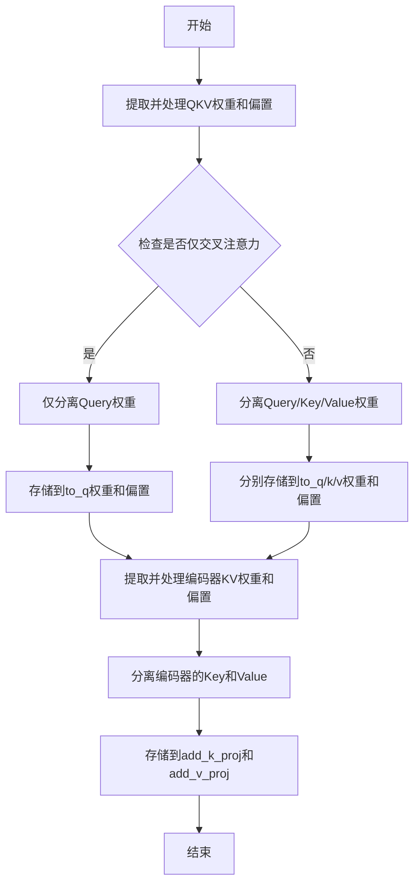

#### 带注释源码

```python
def assign_attention_to_checkpoint(new_checkpoint, unet_state_dict, old_path, new_path, config):
    # 从原始状态字典中提取QKV权重并移除该键
    # qkv_weight 形状为 [in_channels, out_channels, 1] -> 去除最后一个维度
    qkv_weight = unet_state_dict.pop(f"{old_path}.qkv.weight")
    qkv_weight = qkv_weight[:, :, 0]

    # 提取QKV偏置
    qkv_bias = unet_state_dict.pop(f"{old_path}.qkv.bias")

    # 判断是否仅使用交叉注意力（无自注意力）
    is_cross_attn_only = "only_cross_attention" in config and config["only_cross_attention"]

    # 根据是否仅交叉注意力决定分割数量：1表示仅Query，3表示Query+Key+Value
    split = 1 if is_cross_attn_only else 3

    # 调用split_attentions函数将合并的QKV权重分割成独立的权重
    weights, bias = split_attentions(
        weight=qkv_weight,
        bias=qkv_bias,
        split=split,
        chunk_size=config["attention_head_dim"],
    )

    # 根据是否仅交叉注意力处理权重分配
    if is_cross_attn_only:
        # 仅需要Query权重
        query_weight, q_bias = weights, bias
        new_checkpoint[f"{new_path}.to_q.weight"] = query_weight[0]
        new_checkpoint[f"{new_path}.to_q.bias"] = q_bias[0]
    else:
        # 需要分离Query、Key、Value权重
        [query_weight, key_weight, value_weight], [q_bias, k_bias, v_bias] = weights, bias
        new_checkpoint[f"{new_path}.to_q.weight"] = query_weight
        new_checkpoint[f"{new_path}.to_q.bias"] = q_bias
        new_checkpoint[f"{new_path}.to_k.weight"] = key_weight
        new_checkpoint[f"{new_path}.to_k.bias"] = k_bias
        new_checkpoint[f"{new_path}.to_v.weight"] = value_weight
        new_checkpoint[f"{new_path}.to_v.bias"] = v_bias

    # 提取编码器键值对权重（用于跨注意力机制）
    encoder_kv_weight = unet_state_dict.pop(f"{old_path}.encoder_kv.weight")
    encoder_kv_weight = encoder_kv_weight[:, :, 0]

    encoder_kv_bias = unet_state_dict.pop(f"{old_path}.encoder_kv.bias")

    # 分离编码器的Key和Value权重（split=2）
    [encoder_k_weight, encoder_v_weight], [encoder_k_bias, encoder_v_bias] = split_attentions(
        weight=encoder_kv_weight,
        bias=encoder_kv_bias,
        split=2,
        chunk_size=config["attention_head_dim"],
    )

    # 将编码器的Key和Value权重存储到目标检查点
    new_checkpoint[f"{new_path}.add_k_proj.weight"] = encoder_k_weight
    new_checkpoint[f"{new_path}.add_k_proj.bias"] = encoder_k_bias
    new_checkpoint[f"{new_path}.add_v_proj.weight"] = encoder_v_weight
    new_checkpoint[f"{new_path}.add_v_bias"] = encoder_v_bias
```


### `assign_to_checkpoint`

该函数执行模型检查点转换的最后一步：接收本地转换后的权重映射路径，应用全局重命名规则（包括中间块的路径转换和额外的替换映射），并将权重从旧检查点分配到新检查点。对于投影注意力权重（`proj_attn.weight` 或 `to_out.0.weight`），需要进行从 1D 卷积到线性层的维度转换。

参数：

- `paths`：`List[Dict[str, str]]`，包含 'old' 和 'new' 键的字典列表，表示从旧命名到新命名的局部映射关系
- `checkpoint`：`Dict`，目标检查点字典，用于存储转换后的权重
- `old_checkpoint`：`Dict`，源检查点字典，包含待转换的原始权重
- `additional_replacements`：`Optional[List[Dict[str, str]]]`，可选的额外替换规则列表，每个元素包含 'old' 和 'new' 键，用于处理局部路径替换
- `config`：`Optional[Dict]`，可选的配置字典，目前在函数签名中保留但未使用

返回值：`None`，函数直接修改 `checkpoint` 字典，不返回任何值

#### 流程图

```mermaid
flowchart TD
    A[开始 assign_to_checkpoint] --> B{验证 paths 是否为列表}
    B -->|否| C[抛出 AssertionError]
    B -->|是| D[遍历 paths 中的每个 path]
    D --> E[获取 path['new'] 作为 new_path]
    E --> F[全局重命名: middle_block.0 → mid_block.resnets.0]
    F --> G[全局重命名: middle_block.1 → mid_block.attentions.0]
    G --> H[全局重命名: middle_block.2 → mid_block.resnets.1]
    H --> I{additional_replacements 存在?}
    I -->|是| J[遍历 additional_replacements]
    J --> K[执行 replace 替换]
    K --> I
    I -->|否| L{new_path 包含 proj_attn.weight 或 to_out.0.weight?}
    L -->|是| M[提取权重[:, :, 0] 转换 1D 卷积到线性]
    L -->|否| N[直接复制权重]
    M --> O[checkpoint[new_path] = 转换后的权重]
    N --> O
    O --> D
    D --> P[结束]
```

#### 带注释源码

```python
def assign_to_checkpoint(paths, checkpoint, old_checkpoint, additional_replacements=None, config=None):
    """
    This does the final conversion step: take locally converted weights and apply a global renaming to them. It splits
    attention layers, and takes into account additional replacements that may arise.

    Assigns the weights to the new checkpoint.
    """
    # 验证 paths 参数类型，确保是包含 'old' 和 'new' 键的字典列表
    assert isinstance(paths, list), "Paths should be a list of dicts containing 'old' and 'new' keys."

    # 遍历每个路径映射，进行权重转换
    for path in paths:
        new_path = path["new"]

        # === 全局重命名规则 ===
        # 将中间块的旧命名转换为 Diffusers 格式的新命名
        # middle_block.0 对应新命名中的 mid_block.resnets.0
        new_path = new_path.replace("middle_block.0", "mid_block.resnets.0")
        # middle_block.1 对应新命名中的 mid_block.attentions.0
        new_path = new_path.replace("middle_block.1", "mid_block.attentions.0")
        # middle_block.2 对应新命名中的 mid_block.resnets.1
        new_path = new_path.replace("middle_block.2", "mid_block.resnets.1")

        # === 处理额外的替换规则 ===
        # 这些规则来自调用者传入的 additional_replacements 参数
        # 用于处理局部路径的转换（如 input_blocks → down_blocks）
        if additional_replacements is not None:
            for replacement in additional_replacements:
                new_path = new_path.replace(replacement["old"], replacement["new"])

        # === 特殊权重转换逻辑 ===
        # proj_attn.weight 和 to_out.0.weight 需要从 1D 卷积权重转换为线性层权重
        # 原始 LDM checkpoint 中这些权重是卷积形式 [out_channels, in_channels, 1]
        # 需要提取 [:, :, 0] 转换为线性层权重 [out_channels, in_channels]
        if "proj_attn.weight" in new_path or "to_out.0.weight" in new_path:
            checkpoint[new_path] = old_checkpoint[path["old"]][:, :, 0]
        else:
            # 其他权重直接复制
            checkpoint[new_path] = old_checkpoint[path["old"]]
```


### `split_attentions`

该函数用于将 LDM（Latent Diffusion Models）checkpoint 中的合并注意力权重（QKV）按chunk大小分割成多个独立的权重块（如 query、key、value），以适配 Diffusers 库的标准 UNet 注意力结构。

参数：

- `weight`：`torch.Tensor`，原始合并的注意力权重矩阵（通常是 QKV 合并后的权重）
- `bias`：`torch.Tensor`，原始合并的注意力偏置向量
- `split`：`int`，分割的数量（通常为 3 表示 QKV，或 1 表示仅 query）
- `chunk_size`：`int`，每个分割块的大小（通常对应 attention_head_dim）

返回值：`Tuple[List[torch.Tensor], List[torch.Tensor]]`，返回两个列表，分别是分割后的权重列表和偏置列表

#### 流程图

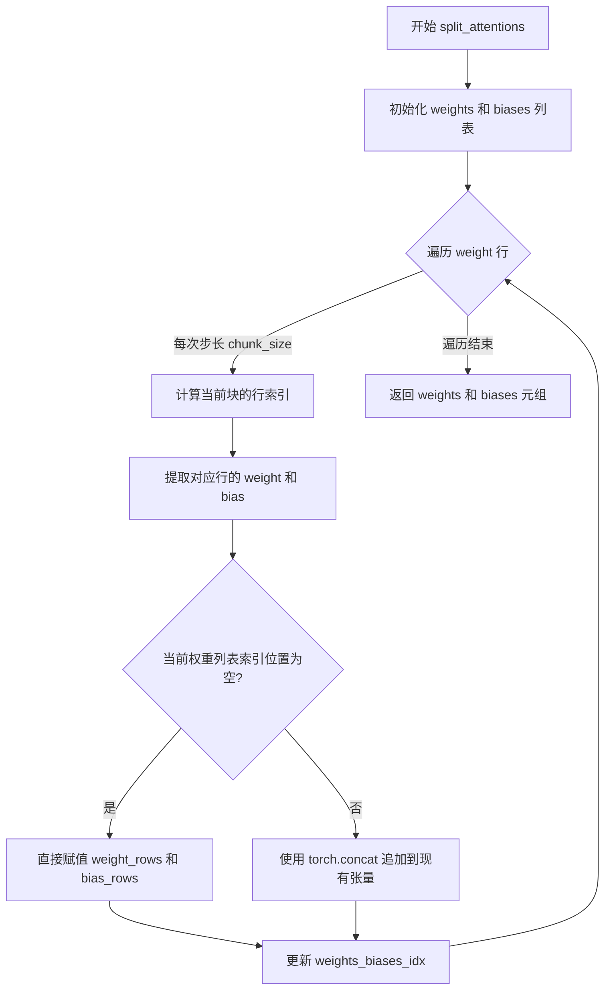

#### 带注释源码

```python
def split_attentions(*, weight, bias, split, chunk_size):
    """
    将合并的注意力权重（QKV）按 chunk_size 分割成 split 个部分。
    
    在 LDM checkpoint 中，query、key、value 的权重是合并在一起的（shape 为 [3*head_dim, hidden_dim]）。
    Diffusers 库需要将它们分离成独立的权重（每个 shape 为 [head_dim, hidden_dim]）。
    此函数通过按行交替分配的方式实现分割。
    
    参数:
        weight: 原始 QKV 合并权重，shape 通常为 [split * chunk_size, hidden_dim]
        bias: 原始 QKV 合并偏置，shape 通常为 [split * chunk_size]
        split: 分割数量，通常为 3 (Q, K, V) 或 1 (仅 Q)
        chunk_size: 每个注意力头的维度
    
    返回:
        (weights, biases): 两个列表，每个列表长度为 split
    """
    # 初始化输出列表
    weights = [None] * split
    biases = [None] * split

    # 当前应分配到的权重/偏置列表索引
    weights_biases_idx = 0

    # 按 chunk_size 步长遍历权重矩阵的行
    for starting_row_index in range(0, weight.shape[0], chunk_size):
        # 计算当前块的行索引范围 [starting_row_index, starting_row_index + chunk_size)
        row_indices = torch.arange(starting_row_index, starting_row_index + chunk_size)

        # 提取当前块的权重和偏置行
        weight_rows = weight[row_indices, :]
        bias_rows = bias[row_indices]

        # 根据当前索引位置，决定是直接赋值还是追加
        if weights[weights_biases_idx] is None:
            # 首次分配，直接赋值
            weights[weights_biases_idx] = weight_rows
            biases[weights_biases_idx] = bias_rows
        else:
            # 已有数据，使用 concat 追加
            assert weights[weights_biases_idx] is not None
            weights[weights_biases_idx] = torch.concat([weights[weights_biases_idx], weight_rows])
            biases[weights_biases_idx] = torch.concat([biases[weights_biases_idx], bias_rows])

        # 更新索引，实现轮询分配（0->1->2->0->...）
        weights_biases_idx = (weights_biases_idx + 1) % split

    return weights, biases
```


### `parse_list`

该函数是一个工具函数，用于将输入值解析为整数列表。它接受字符串或列表类型的输入，如果是字符串则按逗号分隔并转换为整数列表，如果是列表则直接返回，否则抛出 ValueError 异常。

参数：

- `value`：`Union[str, list]`，要解析为整数列表的值，可以是逗号分隔的字符串或已存在的列表

返回值：`list[int]`，返回解析后的整数列表

#### 流程图

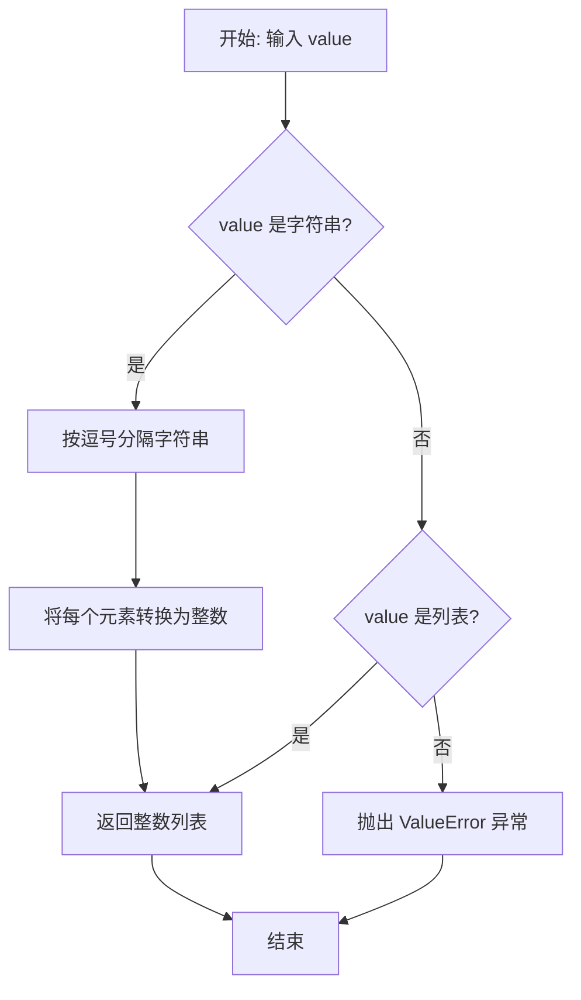

#### 带注释源码

```python
def parse_list(value):
    """
    将输入值解析为整数列表的辅助函数。
    
    参数:
        value: 可以是逗号分隔的字符串(如 "1,2,3")或已存在的列表
        
    返回:
        整数列表
        
    异常:
        ValueError: 当输入类型既不是字符串也不是列表时抛出
    """
    # 检查输入是否为字符串类型
    if isinstance(value, str):
        # 使用逗号分隔字符串
        value = value.split(",")
        # 将每个字符串元素转换为整数
        value = [int(v) for v in value]
    # 检查输入是否为列表类型
    elif isinstance(value, list):
        # 列表类型直接传递，不做任何处理
        pass
    else:
        # 其他类型抛出 ValueError 异常
        raise ValueError(f"Can't parse list for type: {type(value)}")

    # 返回解析后的整数列表
    return value
```


### `get_super_res_unet`

该函数用于加载并转换超级分辨率UNet模型，将原始的LDM（Latent Diffusion Models）格式的检查点转换为Diffusers库兼容的UNet2DConditionModel格式，支持参数验证和自定义样本大小。

参数：

- `unet_checkpoint_path`：`str`，原始UNet检查点的目录路径，包含config.yml和pytorch_model.bin文件
- `verify_param_count`：`bool`，是否验证转换后的模型参数数量与原始模型一致，默认为True
- `sample_size`：`int | None`，输出模型的样本大小，若为None则从原始配置中读取，默认为None

返回值：`UNet2DConditionModel`，转换后的Diffusers格式UNet模型实例

#### 流程图

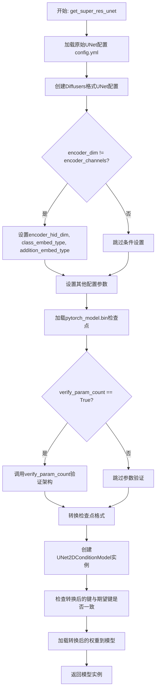

#### 带注释源码

```python
def get_super_res_unet(unet_checkpoint_path, verify_param_count=True, sample_size=None):
    """
    加载并转换超级分辨率UNet模型为Diffusers格式
    
    参数:
        unet_checkpoint_path: 原始UNet检查点目录路径
        verify_param_count: 是否验证参数数量
        sample_size: 输出模型的样本大小
    """
    orig_path = unet_checkpoint_path

    # 1. 从config.yml加载原始UNet配置
    original_unet_config = yaml.safe_load(os.path.join(orig_path, "config.yml"))
    original_unet_config = original_unet_config["params"]

    # 2. 创建Diffusers格式的UNet配置
    unet_diffusers_config = superres_create_unet_diffusers_config(original_unet_config)
    
    # 3. 设置时间嵌入维度，基于模型通道数和通道倍增数
    unet_diffusers_config["time_embedding_dim"] = original_unet_config["model_channels"] * int(
        original_unet_config["channel_mult"].split(",")[-1]
    )
    
    # 4. 如果编码器维度与编码器通道数不同，设置编码器隐藏相关配置
    if original_unet_config["encoder_dim"] != original_unet_config["encoder_channels"]:
        unet_diffusers_config["encoder_hid_dim"] = original_unet_config["encoder_dim"]
        unet_diffusers_config["class_embed_type"] = "timestep"
        unet_diffusers_config["addition_embed_type"] = "text"

    # 5. 设置其他配置参数
    unet_diffusers_config["time_embedding_act_fn"] = "gelu"
    unet_diffusers_config["resnet_skip_time_act"] = True
    unet_diffusers_config["resnet_out_scale_factor"] = 1 / 0.7071
    unet_diffusers_config["mid_block_scale_factor"] = 1 / 0.7071
    
    # 6. 处理自注意力禁用配置
    unet_diffusers_config["only_cross_attention"] = (
        bool(original_unet_config["disable_self_attentions"])
        if (
            "disable_self_attentions" in original_unet_config
            and isinstance(original_unet_config["disable_self_attentions"], int)
        )
        else True
    )

    # 7. 设置样本大小
    if sample_size is None:
        unet_diffusers_config["sample_size"] = original_unet_config["image_size"]
    else:
        # 第二阶段上采样器的样本大小在配置中指定错误，使用硬编码值
        unet_diffusers_config["sample_size"] = sample_size

    # 8. 加载原始模型检查点
    unet_checkpoint = torch.load(os.path.join(unet_checkpoint_path, "pytorch_model.bin"), map_location="cpu")

    # 9. 可选：验证参数数量
    if verify_param_count:
        # 检查架构是否匹配 - 这一步比较慢
        verify_param_count(orig_path, unet_diffusers_config)

    # 10. 转换检查点为Diffusers格式
    converted_unet_checkpoint = superres_convert_ldm_unet_checkpoint(
        unet_checkpoint, unet_diffusers_config, path=unet_checkpoint_path
    )
    converted_keys = converted_unet_checkpoint.keys()

    # 11. 创建UNet模型实例
    model = UNet2DConditionModel(**unet_diffusers_config)
    expected_weights = model.state_dict().keys()

    # 12. 验证转换后的键与期望键是否匹配
    diff_c_e = set(converted_keys) - set(expected_weights)
    diff_e_c = set(expected_weights) - set(converted_keys)

    assert len(diff_e_c) == 0, f"Expected, but not converted: {diff_e_c}"
    assert len(diff_c_e) == 0, f"Converted, but not expected: {diff_c_e}"

    # 13. 加载权重并返回模型
    model.load_state_dict(converted_unet_checkpoint)

    return model
```


### `superres_create_unet_diffusers_config`

该函数用于将原始超分辨率 UNet 模型的配置文件转换为 Diffusers 库所需的 UNet2DConditionModel 配置格式，解析注意力分辨率、通道倍数、块类型等参数，并生成包含模型架构信息的字典。

参数：

- `original_unet_config`：`dict`，原始超分辨率 UNet 模型的配置字典，包含模型通道数、注意力分辨率、通道倍数等参数

返回值：`dict`，转换后的 Diffusers UNet2DConditionModel 配置字典

#### 流程图

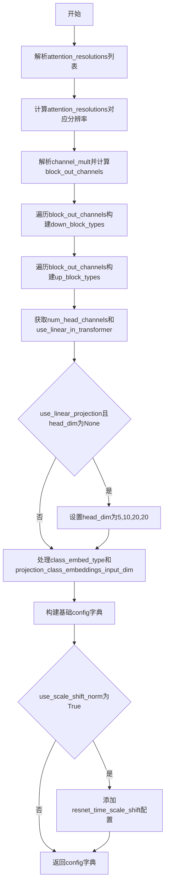

#### 带注释源码

```python
def superres_create_unet_diffusers_config(original_unet_config):
    """
    将原始超分辨率UNet配置转换为Diffusers库UNet2DConditionModel配置格式
    
    参数:
        original_unet_config: 包含原始UNet模型配置的字典
        
    返回:
        符合Diffusers库UNet2DConditionModel的config字典
    """
    # 解析注意力分辨率配置，将字符串转换为列表并计算实际分辨率值
    # 例如: "2,4" -> [image_size//2, image_size//4]
    attention_resolutions = parse_list(original_unet_config["attention_resolutions"])
    attention_resolutions = [original_unet_config["image_size"] // int(res) for res in attention_resolutions]

    # 解析通道倍数并计算每个块的输出通道数
    channel_mult = parse_list(original_unet_config["channel_mult"])
    block_out_channels = [original_unet_config["model_channels"] * mult for mult in channel_mult]

    # 构建下采样块类型列表
    down_block_types = []
    resolution = 1

    for i in range(len(block_out_channels)):
        # 根据是否在attention_resolutions中决定块类型
        if resolution in attention_resolutions:
            block_type = "SimpleCrossAttnDownBlock2D"  # 带交叉注意力的下采样块
        elif original_unet_config["resblock_updown"]:
            block_type = "ResnetDownsampleBlock2D"     # 带残差的下采样块
        else:
            block_type = "DownBlock2D"                 # 基础下采样块

        down_block_types.append(block_type)

        # 更新分辨率用于下一层
        if i != len(block_out_channels) - 1:
            resolution *= 2

    # 构建上采样块类型列表
    up_block_types = []
    for i in range(len(block_out_channels)):
        if resolution in attention_resolutions:
            block_type = "SimpleCrossAttnUpBlock2D"   # 带交叉注意力的上采样块
        elif original_unet_config["resblock_updown"]:
            block_type = "ResnetUpsampleBlock2D"      # 带残差的上采样块
        else:
            block_type = "UpBlock2D"                  # 基础上采样块
        up_block_types.append(block_type)
        resolution //= 2

    # 获取注意力头维度
    head_dim = original_unet_config["num_head_channels"]
    
    # 判断是否使用线性投影（Stable Diffusion 2-base-512和2-768使用）
    use_linear_projection = (
        original_unet_config["use_linear_in_transformer"]
        if "use_linear_in_transformer" in original_unet_config
        else False
    )
    if use_linear_projection:
        # stable diffusion 2-base-512和2-768
        if head_dim is None:
            head_dim = [5, 10, 20, 20]

    # 处理类别嵌入配置
    class_embed_type = None
    projection_class_embeddings_input_dim = None

    if "num_classes" in original_unet_config:
        if original_unet_config["num_classes"] == "sequential":
            class_embed_type = "projection"
            assert "adm_in_channels" in original_unet_config
            projection_class_embeddings_input_dim = original_unet_config["adm_in_channels"]
        else:
            raise NotImplementedError(
                f"Unknown conditional unet num_classes config: {original_unet_config['num_classes']}"
            )

    # 构建基础配置字典
    config = {
        "in_channels": original_unet_config["in_channels"],
        "down_block_types": tuple(down_block_types),
        "block_out_channels": tuple(block_out_channels),
        "layers_per_block": tuple(original_unet_config["num_res_blocks"]),
        "cross_attention_dim": original_unet_config["encoder_channels"],
        "attention_head_dim": head_dim,
        "use_linear_projection": use_linear_projection,
        "class_embed_type": class_embed_type,
        "projection_class_embeddings_input_dim": projection_class_embeddings_input_dim,
        "out_channels": original_unet_config["out_channels"],
        "up_block_types": tuple(up_block_types),
        "upcast_attention": False,  # TODO: guessing
        "cross_attention_norm": "group_norm",
        "mid_block_type": "UNetMidBlock2DSimpleCrossAttn",
        "act_fn": "gelu",
    }

    # 如果使用scale_shift_norm，添加对应配置
    if original_unet_config["use_scale_shift_norm"]:
        config["resnet_time_scale_shift"] = "scale_shift"

    return config
```


### `superres_convert_ldm_unet_checkpoint`

将原始LDM（Latent Diffusion Model）的UNet检查点状态字典转换为Diffusers格式的检查点，用于超分辨率模型。

参数：

- `unet_state_dict`：`dict`，原始LDM UNet模型的状态字典，包含权重和偏置
- `config`：`dict`，UNet模型的配置字典，包含模型结构参数（如layers_per_block、down_block_types等）
- `path`：`str` 或 `None`，原始检查点文件的路径（可选，当前函数未使用）
- `extract_ema`：`bool`，是否提取EMA权重（可选，当前函数未使用）

返回值：`dict`，转换后的Diffusers格式UNet检查点状态字典

#### 流程图

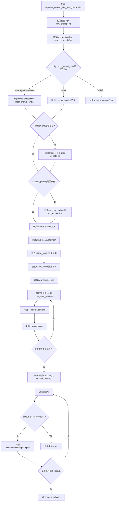

#### 带注释源码

```python
def superres_convert_ldm_unet_checkpoint(unet_state_dict, config, path=None, extract_ema=False):
    """
    Takes a state dict and a config, and returns a converted checkpoint.
    此函数将原始LDM UNet检查点转换为Diffusers格式的UNet2DConditionModel检查点
    
    参数:
        unet_state_dict: 原始LDM UNet模型的状态字典
        config: UNet模型配置字典
        path: 检查点文件路径（可选）
        extract_ema: 是否提取EMA权重（可选，默认False）
    
    返回:
        new_checkpoint: 转换后的Diffusers格式检查点字典
    """
    # 步骤1: 初始化新的检查点字典，用于存储转换后的权重
    new_checkpoint = {}

    # 步骤2: 转换时间嵌入层 (time embedding)
    # 将原始的time_embed.0和time_embed.2转换为Diffusers的time_embedding.linear_1和linear_2
    new_checkpoint["time_embedding.linear_1.weight"] = unet_state_dict["time_embed.0.weight"]
    new_checkpoint["time_embedding.linear_1.bias"] = unet_state_dict["time_embed.0.bias"]
    new_checkpoint["time_embedding.linear_2.weight"] = unet_state_dict["time_embed.2.weight"]
    new_checkpoint["time_embedding.linear_2.bias"] = unet_state_dict["time_embed.2.bias"]

    # 步骤3: 转换类别嵌入层 (class embedding)
    # 根据config中的class_embed_type决定转换方式
    if config["class_embed_type"] is None:
        # 如果没有class_embed_type，则不需要转换类别嵌入
        ...
    elif config["class_embed_type"] == "timestep" or config["class_embed_type"] == "projection":
        # 对于timestep或projection类型，从aug_proj转换class_embedding
        new_checkpoint["class_embedding.linear_1.weight"] = unet_state_dict["aug_proj.0.weight"]
        new_checkpoint["class_embedding.linear_1.bias"] = unet_state_dict["aug_proj.0.bias"]
        new_checkpoint["class_embedding.linear_2.weight"] = unet_state_dict["aug_proj.2.weight"]
        new_checkpoint["class_embedding.linear_2.bias"] = unet_state_dict["aug_proj.2.bias"]
    else:
        raise NotImplementedError(f"Not implemented `class_embed_type`: {config['class_embed_type']}")

    # 步骤4: 转换编码器投影层 (encoder projection)
    # 如果存在encoder_proj.weight，则转换为encoder_hid_proj
    if "encoder_proj.weight" in unet_state_dict:
        new_checkpoint["encoder_hid_proj.weight"] = unet_state_dict["encoder_proj.weight"]
        new_checkpoint["encoder_hid_proj.bias"] = unet_state_dict["encoder_proj.bias"]

    # 步骤5: 转换编码器池化层 (encoder pooling)
    # 将encoder_pooling的各部分映射到add_embedding的不同组件
    if "encoder_pooling.0.weight" in unet_state_dict:
        # 定义映射关系：原始键前缀 -> 新键前缀
        mapping = {
            "encoder_pooling.0": "add_embedding.norm1",
            "encoder_pooling.1": "add_embedding.pool",
            "encoder_pooling.2": "add_embedding.proj",
            "encoder_pooling.3": "add_embedding.norm2",
        }
        # 遍历所有encoder_pooling相关的键并进行替换
        for key in unet_state_dict.keys():
            if key.startswith("encoder_pooling"):
                prefix = key[: len("encoder_pooling.0")]
                new_key = key.replace(prefix, mapping[prefix])
                new_checkpoint[new_key] = unet_state_dict[key]

    # 步骤6: 转换输入卷积层 (conv_in)
    # 将input_blocks.0.0转换为conv_in
    new_checkpoint["conv_in.weight"] = unet_state_dict["input_blocks.0.0.weight"]
    new_checkpoint["conv_in.bias"] = unet_state_dict["input_blocks.0.0.bias"]

    # 步骤7: 转换输出卷积层 (conv_norm_out和conv_out)
    # 将out.0转换为conv_norm_out，out.2转换为conv_out
    new_checkpoint["conv_norm_out.weight"] = unet_state_dict["out.0.weight"]
    new_checkpoint["conv_norm_out.bias"] = unet_state_dict["out.0.bias"]
    new_checkpoint["conv_out.weight"] = unet_state_dict["out.2.weight"]
    new_checkpoint["conv_out.bias"] = unet_state_dict["out.2.bias"]

    # 步骤8: 获取输入块 (input blocks) 的键
    # 通过提取layer ID来统计input_blocks的数量
    num_input_blocks = len({".".join(layer.split(".")[:2]) for layer in unet_state_dict if "input_blocks" in layer})
    # 为每个输入块创建键列表
    input_blocks = {
        layer_id: [key for key in unet_state_dict if f"input_blocks.{layer_id}." in key]
        for layer_id in range(num_input_blocks)
    }

    # 步骤9: 获取中间块 (middle blocks) 的键
    num_middle_blocks = len({".".join(layer.split(".")[:2]) for layer in unet_state_dict if "middle_block" in layer})
    middle_blocks = {
        layer_id: [key for key in unet_state_dict if f"middle_block.{layer_id}" in key]
        for layer_id in range(num_middle_blocks)
    }

    # 步骤10: 获取输出块 (output blocks) 的键
    num_output_blocks = len({".".join(layer.split(".")[:2]) for layer in unet_state_dict if "output_blocks" in layer})
    output_blocks = {
        layer_id: [key for key in unet_state_dict if f"output_blocks.{layer_id}." in key]
        for layer_id in range(num_output_blocks)
    }

    # 步骤11: 计算下采样器ID
    # 如果layers_per_block是列表，使用累加和计算；否则使用固定值
    if not isinstance(config["layers_per_block"], int):
        layers_per_block_list = [e + 1 for e in config["layers_per_block"]]
        layers_per_block_cumsum = list(np.cumsum(layers_per_block_list))
        downsampler_ids = layers_per_block_cumsum
    else:
        # 固定的下采样器位置：[4, 8, 12, 16]
        downsampler_ids = [4, 8, 12, 16]

    # 步骤12: 处理输入块
    # 遍历除第一个以外的所有输入块（索引从1开始）
    for i in range(1, num_input_blocks):
        # 计算当前块在哪个down block中以及在块内的层索引
        if isinstance(config["layers_per_block"], int):
            layers_per_block = config["layers_per_block"]
            block_id = (i - 1) // (layers_per_block + 1)
            layer_in_block_id = (i - 1) % (layers_per_block + 1)
        else:
            # 处理layers_per_block为列表的情况
            block_id = next(k for k, n in enumerate(layers_per_block_cumsum) if (i - 1) < n)
            passed_blocks = layers_per_block_cumsum[block_id - 1] if block_id > 0 else 0
            layer_in_block_id = (i - 1) - passed_blocks

        # 获取当前输入块中的resnets和attentions
        resnets = [
            key for key in input_blocks[i] if f"input_blocks.{i}.0" in key and f"input_blocks.{i}.0.op" not in key
        ]
        attentions = [key for key in input_blocks[i] if f"input_blocks.{i}.1" in key]

        # 如果存在下采样操作（op），则处理下采样器
        if f"input_blocks.{i}.0.op.weight" in unet_state_dict:
            new_checkpoint[f"down_blocks.{block_id}.downsamplers.0.conv.weight"] = unet_state_dict.pop(
                f"input_blocks.{i}.0.op.weight"
            )
            new_checkpoint[f"down_blocks.{block_id}.downsamplers.0.conv.bias"] = unet_state_dict.pop(
                f"input_blocks.{i}.0.op.bias"
            )

        # 更新resnet路径并分配到检查点
        paths = renew_resnet_paths(resnets)

        block_type = config["down_block_types"][block_id]
        # 判断是否需要下采样器
        if (
            block_type == "ResnetDownsampleBlock2D" or block_type == "SimpleCrossAttnDownBlock2D"
        ) and i in downsampler_ids:
            meta_path = {"old": f"input_blocks.{i}.0", "new": f"down_blocks.{block_id}.downsamplers.0"}
        else:
            meta_path = {"old": f"input_blocks.{i}.0", "new": f"down_blocks.{block_id}.resnets.{layer_in_block_id}"}

        assign_to_checkpoint(
            paths, new_checkpoint, unet_state_dict, additional_replacements=[meta_path], config=config
        )

        # 处理注意力层
        if len(attentions):
            old_path = f"input_blocks.{i}.1"
            new_path = f"down_blocks.{block_id}.attentions.{layer_in_block_id}"

            assign_attention_to_checkpoint(
                new_checkpoint=new_checkpoint,
                unet_state_dict=unet_state_dict,
                old_path=old_path,
                new_path=new_path,
                config=config,
            )

            paths = renew_attention_paths(attentions)
            meta_path = {"old": old_path, "new": new_path}
            assign_to_checkpoint(
                paths,
                new_checkpoint,
                unet_state_dict,
                additional_replacements=[meta_path],
                config=config,
            )

    # 步骤13: 处理中间块
    # 中间块包含：resnet_0, attention, resnet_1
    resnet_0 = middle_blocks[0]
    attentions = middle_blocks[1]
    resnet_1 = middle_blocks[2]

    # 处理第一个resnet
    resnet_0_paths = renew_resnet_paths(resnet_0)
    assign_to_checkpoint(resnet_0_paths, new_checkpoint, unet_state_dict, config=config)

    # 处理第二个resnet
    resnet_1_paths = renew_resnet_paths(resnet_1)
    assign_to_checkpoint(resnet_1_paths, new_checkpoint, unet_state_dict, config=config)

    # 处理注意力层
    old_path = "middle_block.1"
    new_path = "mid_block.attentions.0"

    assign_attention_to_checkpoint(
        new_checkpoint=new_checkpoint,
        unet_state_dict=unet_state_dict,
        old_path=old_path,
        new_path=new_path,
        config=config,
    )

    attentions_paths = renew_attention_paths(attentions)
    meta_path = {"old": "middle_block.1", "new": "mid_block.attentions.0"}
    assign_to_checkpoint(
        attentions_paths, new_checkpoint, unet_state_dict, additional_replacements=[meta_path], config=config
    )

    # 步骤14: 准备输出块处理
    # 如果layers_per_block是列表，计算反向累加和
    if not isinstance(config["layers_per_block"], int):
        layers_per_block_list = list(reversed([e + 1 for e in config["layers_per_block"]]))
        layers_per_block_cumsum = list(np.cumsum(layers_per_block_list))

    # 步骤15: 处理输出块
    for i in range(num_output_blocks):
        # 计算当前块在哪个up block中以及在块内的层索引
        if isinstance(config["layers_per_block"], int):
            layers_per_block = config["layers_per_block"]
            block_id = i // (layers_per_block + 1)
            layer_in_block_id = i % (layers_per_block + 1)
        else:
            block_id = next(k for k, n in enumerate(layers_per_block_cumsum) if i < n)
            passed_blocks = layers_per_block_cumsum[block_id - 1] if block_id > 0 else 0
            layer_in_block_id = i - passed_blocks

        # 处理输出块层
        output_block_layers = [shave_segments(name, 2) for name in output_blocks[i]]
        output_block_list = {}

        for layer in output_block_layers:
            layer_id, layer_name = layer.split(".")[0], shave_segments(layer, 1)
            if layer_id in output_block_list:
                output_block_list[layer_id].append(layer_name)
            else:
                output_block_list[layer_id] = [layer_name]

        # output_block_list的长度含义：
        # 1 -> 只有resnet
        # 2 -> resnet + attention 或 resnet + 上采样resnet
        # 3 -> resnet + attention + 上采样resnet

        if len(output_block_list) > 1:
            # 处理多个层的情况
            resnets = [key for key in output_blocks[i] if f"output_blocks.{i}.0" in key]

            has_attention = True
            # 检查是否没有attention（只有resnet和upsampler）
            if len(output_block_list) == 2 and any("in_layers" in k for k in output_block_list["1"]):
                has_attention = False

            maybe_attentions = [key for key in output_blocks[i] if f"output_blocks.{i}.1" in key]

            # 更新resnet路径
            paths = renew_resnet_paths(resnets)

            meta_path = {"old": f"output_blocks.{i}.0", "new": f"up_blocks.{block_id}.resnets.{layer_in_block_id}"}

            assign_to_checkpoint(
                paths, new_checkpoint, unet_state_dict, additional_replacements=[meta_path], config=config
            )

            # 处理上采样器（upsampler）
            output_block_list = {k: sorted(v) for k, v in output_block_list.items()}
            if ["conv.bias", "conv.weight"] in output_block_list.values():
                index = list(output_block_list.values()).index(["conv.bias", "conv.weight"])
                new_checkpoint[f"up_blocks.{block_id}.upsamplers.0.conv.weight"] = unet_state_dict[
                    f"output_blocks.{i}.{index}.conv.weight"
                ]
                new_checkpoint[f"up_blocks.{block_id}.upsamplers.0.conv.bias"] = unet_state_dict[
                    f"output_blocks.{i}.{index}.conv.bias"
                ]

                # 这个层不是attention
                has_attention = False
                maybe_attentions = []

            # 处理attention
            if has_attention:
                old_path = f"output_blocks.{i}.1"
                new_path = f"up_blocks.{block_id}.attentions.{layer_in_block_id}"

                assign_attention_to_checkpoint(
                    new_checkpoint=new_checkpoint,
                    unet_state_dict=unet_state_dict,
                    old_path=old_path,
                    new_path=new_path,
                    config=config,
                )

                paths = renew_attention_paths(maybe_attentions)
                meta_path = {
                    "old": old_path,
                    "new": new_path,
                }
                assign_to_checkpoint(
                    paths, new_checkpoint, unet_state_dict, additional_replacements=[meta_path], config=config
                )

            # 处理第三个层（上采样resnet）
            if len(output_block_list) == 3 or (not has_attention and len(maybe_attentions) > 0):
                layer_id = len(output_block_list) - 1
                resnets = [key for key in output_blocks[i] if f"output_blocks.{i}.{layer_id}" in key]
                paths = renew_resnet_paths(resnets)
                meta_path = {"old": f"output_blocks.{i}.{layer_id}", "new": f"up_blocks.{block_id}.upsamplers.0"}
                assign_to_checkpoint(
                    paths, new_checkpoint, unet_state_dict, additional_replacements=[meta_path], config=config
                )
        else:
            # 处理单个resnet的情况
            resnet_0_paths = renew_resnet_paths(output_block_layers, n_shave_prefix_segments=1)
            for path in resnet_0_paths:
                old_path = ".".join(["output_blocks", str(i), path["old"]])
                new_path = ".".join(["up_blocks", str(block_id), "resnets", str(layer_in_block_id), path["new"]])

                new_checkpoint[new_path] = unet_state_dict[old_path]

    # 步骤16: 返回转换后的检查点
    return new_checkpoint
```


### `verify_param_count`

验证从原始 LDM（Latent Diffusion Models）检查点转换而来的 UNet 模型的参数数量是否与原始模型一致，以确保模型架构转换的正确性。

参数：

- `orig_path`：`str`，原始 UNet 检查点路径，用于确定是 Stage-II 还是 Stage-III 模型
- `unet_diffusers_config`：`dict`，转换后的 UNet 配置字典，包含模型结构信息

返回值：`None`，该函数直接进行参数数量验证，无返回值

#### 流程图

```mermaid
flowchart TD
    A[开始验证参数数量] --> B{orig_path 包含 -II-?}
    B -->|是| C[加载 IFStageII 模型]
    B -->|否| D{orig_path 包含 -III-?}
    D -->|是| E[加载 IFStageIII 模型]
    D -->|否| F[抛出断言错误: 路径命名异常]
    C --> G[创建 UNet2DConditionModel 实例]
    E --> G
    F --> H[结束]
    G --> I[验证 time_embedding 和 conv_in 参数]
    I --> J[遍历验证 down_blocks 参数]
    J --> K[验证 mid_block 参数]
    K --> L{orig_path 包含 -II-?}
    L -->|是| M[验证 down_blocks[3], down_blocks[4]]
    L -->|否| N{orig_path 包含 -III-?}
    N -->|是| O[验证 down_blocks[3], down_blocks[4], down_blocks[5]]
    N -->|否| P[验证 up_blocks 参数]
    M --> P
    O --> P
    P --> Q[验证 conv_norm_out 和 conv_out]
    Q --> R[验证整体模型参数]
    R --> S[参数验证通过]
```

#### 带注释源码

```python
def verify_param_count(orig_path, unet_diffusers_config):
    """
    验证转换后的 UNet 模型参数数量与原始模型一致
    
    Args:
        orig_path: 原始 UNet 检查点路径，用于识别模型类型（Stage-II 或 Stage-III）
        unet_diffusers_config: 转换后的 UNet 配置字典
    """
    # 根据路径判断是 Stage-II 还是 Stage-III 模型
    if "-II-" in orig_path:
        # 导入 DeepFloyd IF 的 Stage II 模型
        from deepfloyd_if.modules import IFStageII

        # 创建原始模型的 CPU 实例
        if_II = IFStageII(device="cpu", dir_or_name=orig_path)
    elif "-III-" in orig_path:
        # 导入 DeepFloyd IF 的 Stage III 模型
        from deepfloyd_if.modules import IFStageIII

        # 创建原始模型的 CPU 实例
        if_II = IFStageIII(device="cpu", dir_or_name=orig_path)
    else:
        # 路径命名不符合预期，抛出错误
        assert f"Weird name. Should have -II- or -III- in path: {orig_path}"

    # 根据配置创建转换后的 UNet2DConditionModel（未加载权重）
    unet = UNet2DConditionModel(**unet_diffusers_config)

    # ===== 验证输入层参数 =====
    # 验证时间嵌入层参数数量
    assert_param_count(unet.time_embedding, if_II.model.time_embed)
    # 验证输入卷积层参数数量
    assert_param_count(unet.conv_in, if_II.model.input_blocks[:1])

    # ===== 验证下采样块参数 =====
    # 验证第0个下采样块
    assert_param_count(unet.down_blocks[0], if_II.model.input_blocks[1:4])
    # 验证第1个下采样块
    assert_param_count(unet.down_blocks[1], if_II.model.input_blocks[4:7])
    # 验证第2个下采样块
    assert_param_count(unet.down_blocks[2], if_II.model.input_blocks[7:11])

    # ===== 根据模型类型验证剩余下采样块 =====
    if "-II-" in orig_path:
        # Stage-II: 验证第3和第4个下采样块
        assert_param_count(unet.down_blocks[3], if_II.model.input_blocks[11:17])
        assert_param_count(unet.down_blocks[4], if_II.model.input_blocks[17:])
    if "-III-" in orig_path:
        # Stage-III: 验证第3、第4和第5个下采样块
        assert_param_count(unet.down_blocks[3], if_II.model.input_blocks[11:15])
        assert_param_count(unet.down_blocks[4], if_II.model.input_blocks[15:20])
        assert_param_count(unet.down_blocks[5], if_II.model.input_blocks[20:])

    # ===== 验证中间块参数 =====
    assert_param_count(unet.mid_block, if_II.model.middle_block)

    # ===== 验证上采样块参数 =====
    if "-II-" in orig_path:
        # Stage-II: 验证所有上采样块
        assert_param_count(unet.up_blocks[0], if_II.model.output_blocks[:6])
        assert_param_count(unet.up_blocks[1], if_II.model.output_blocks[6:12])
        assert_param_count(unet.up_blocks[2], if_II.model.output_blocks[12:16])
        assert_param_count(unet.up_blocks[3], if_II.model.output_blocks[16:19])
        assert_param_count(unet.up_blocks[4], if_II.model.output_blocks[19:])
    if "-III-" in orig_path:
        # Stage-III: 验证所有上采样块
        assert_param_count(unet.up_blocks[0], if_II.model.output_blocks[:5])
        assert_param_count(unet.up_blocks[1], if_II.model.output_blocks[5:10])
        assert_param_count(unet.up_blocks[2], if_II.model.output_blocks[10:14])
        assert_param_count(unet.up_blocks[3], if_II.model.output_blocks[14:18])
        assert_param_count(unet.up_blocks[4], if_II.model.output_blocks[18:21])
        assert_param_count(unet.up_blocks[5], if_II.model.output_blocks[21:24])

    # ===== 验证输出层参数 =====
    # 验证输出归一化层参数数量
    assert_param_count(unet.conv_norm_out, if_II.model.out[0])
    # 验证输出卷积层参数数量
    assert_param_count(unet.conv_out, if_II.model.out[2])

    # ===== 验证整体模型参数总数 =====
    assert_param_count(unet, if_II.model)
```


### `assert_param_count`

验证两个 PyTorch 模型的参数数量是否相等，如果不相等则抛出断言错误。

参数：

- `model_1`：`torch.nn.Module`，第一个要比较的模型对象
- `model_2`：`torch.nn.Module`，第二个要比较的模型对象

返回值：`None`，无返回值（通过 assert 语句进行验证，不匹配时抛出 AssertionError）

#### 流程图

```mermaid
flowchart TD
    A[开始 assert_param_count] --> B[计算 model_1 的参数总数 count_1]
    B --> C[计算 model_2 的参数总数 count_2]
    C --> D{count_1 == count_2?}
    D -->|是| E[验证通过，函数结束]
    D -->|否| F[抛出 AssertionError]
    F --> G[显示两个模型的类名和参数数量差异]
```

#### 带注释源码

```python
def assert_param_count(model_1, model_2):
    """
    验证两个模型的参数数量是否相等。

    参数:
        model_1: 第一个 PyTorch 模型对象
        model_2: 第二个 PyTorch 模型对象

    异常:
        AssertionError: 当两个模型的参数数量不相等时抛出
    """
    # 计算第一个模型的所有参数总数
    count_1 = sum(p.numel() for p in model_1.parameters())
    
    # 计算第二个模型的所有参数总数
    count_2 = sum(p.numel() for p in model_2.parameters())
    
    # 断言两个参数总数相等，不相等则抛出错误并显示详细信息
    assert count_1 == count_2, f"{model_1.__class__}: {count_1} != {model_2.__class__}: {count_2}"
```


### `superres_check_against_original`

该函数用于验证从原始 DeepFloyd IF 模型转换而来的 UNet2DConditionModel 的输出是否与原始模型一致，通过对比两者的预测结果来确认转换的正确性。

参数：

- `dump_path`：`str`，转换后的 Diffusers 格式模型的保存路径
- `unet_checkpoint_path`：`str`，原始 DeepFloyd IF 模型的检查点路径

返回值：`None`，该函数无返回值，主要通过打印差异值来验证模型转换的正确性

#### 流程图

```mermaid
flowchart TD
    A[开始] --> B[从 dump_path 加载转换后的 UNet2DConditionModel]
    B --> C[根据路径判断模型类型 -II- 或 -III-]
    C --> D[加载对应版本的原始 IF 模型 IFStageII 或 IFStageIII]
    D --> E[设置批次大小、通道数、高度、宽度等参数]
    E --> F[设置随机种子并生成随机输入: latents 和 image_small]
    F --> G[对 image_small 进行 bicubic 上采样]
    G --> H[拼接 latents 和上采样图像形成 latent_model_input]
    H --> I[生成随机 timestep 和 encoder_hidden_states]
    I --> J[使用原始模型 if_II_model 进行前向传播]
    J --> K[释放原始模型资源]
    K --> L[使用转换后的模型进行前向传播]
    L --> M[计算两者输出的差异并打印]
    M --> N[结束]
```

#### 带注释源码

```python
def superres_check_against_original(dump_path, unet_checkpoint_path):
    """
    验证转换后的 UNet2DConditionModel 与原始 DeepFloyd IF 模型输出是否一致
    
    参数:
        dump_path: 转换后的 Diffusers 格式模型保存路径
        unet_checkpoint_path: 原始 DeepFloyd IF 模型检查点路径
    """
    # 加载转换后的 Diffusers 格式 UNet2DConditionModel
    model_path = dump_path
    model = UNet2DConditionModel.from_pretrained(model_path)
    # 将模型移至 CUDA 设备
    model.to("cuda")
    orig_path = unet_checkpoint_path

    # 根据路径判断是 Stage-II 还是 Stage-III 模型
    if "-II-" in orig_path:
        # 导入 Stage-II 模型类
        from deepfloyd_if.modules import IFStageII
        # 加载原始 Stage-II 模型，precision="fp32" 确保高精度对比
        if_II_model = IFStageII(device="cuda", dir_or_name=orig_path, model_kwargs={"precision": "fp32"}).model
    elif "-III-" in orig_path:
        # 导入 Stage-III 模型类
        from deepfloyd_if.modules import IFStageIII
        # 加载原始 Stage-III 模型
        if_II_model = IFStageIII(device="cuda", dir_or_name=orig_path, model_kwargs={"precision": "fp32"}).model

    # 设置推理参数
    batch_size = 1
    # 通道数为输入通道数的一半（因为会与上采样图像拼接）
    channels = model.config.in_channels // 2
    # 获取模型的样本尺寸配置
    height = model.config.sample_size
    width = model.config.sample_size
    # 强制设置为 1024（针对超分辨率模型）
    height = 1024
    width = 1024

    # 设置随机种子以保证可重复性
    torch.manual_seed(0)

    # 生成随机潜在变量 latents
    latents = torch.randn((batch_size, channels, height, width), device=model.device)
    # 生成随机小尺寸图像（用于超分辨率上采样）
    image_small = torch.randn((batch_size, channels, height // 4, width // 4), device=model.device)

    # 检查 F.interpolate 是否支持 antialias 参数
    interpolate_antialias = {}
    if "antialias" in inspect.signature(F.interpolate).parameters:
        interpolate_antialias["antialias"] = True
        # 使用 bicubic 模式对上采样图像进行抗锯齿插值
        image_upscaled = F.interpolate(
            image_small, size=[height, width], mode="bicubic", align_corners=False, **interpolate_antialias
        )

    # 将潜在变量与上采样图像沿通道维度拼接
    latent_model_input = torch.cat([latents, image_upscaled], dim=1).to(model.dtype)
    # 创建 timestep 张量（值为 5）
    t = torch.tensor([5], device=model.device).to(model.dtype)

    # 设置序列长度和编码器隐藏状态维度
    seq_len = 64
    # 生成随机编码器隐藏状态
    encoder_hidden_states = torch.randn((batch_size, seq_len, model.config.encoder_hid_dim), device=model.device).to(
        model.dtype
    )

    # 创建虚假的类别标签（用于条件生成）
    fake_class_labels = torch.tensor([t], device=model.device).to(model.dtype)

    # 禁用梯度计算，使用原始 IF 模型进行推理
    with torch.no_grad():
        # 原始模型的 forward 签名: latent_model_input, t, aug_steps, text_emb
        out = if_II_model(latent_model_input, t, aug_steps=fake_class_labels, text_emb=encoder_hidden_states)

    # 将原始模型移回 CPU 并删除，释放 CUDA 显存
    if_II_model.to("cpu")
    del if_II_model
    import gc

    torch.cuda.empty_cache()
    gc.collect()
    # 打印分隔线
    print(50 * "=")

    # 使用转换后的 Diffusers 模型进行推理
    with torch.no_grad():
        # 转换后模型的 forward 签名: sample, encoder_hidden_states, class_labels, timestep
        noise_pred = model(
            sample=latent_model_input,
            encoder_hidden_states=encoder_hidden_states,
            class_labels=fake_class_labels,
            timestep=t,
        ).sample

    # 打印输出形状
    print("Out shape", noise_pred.shape)
    # 打印两个模型输出的差异（绝对值之和）
    print("Diff", (out - noise_pred).abs().sum())
```

## 关键组件


### 张量索引与权重加载

使用`torch.load`配合`map_location`参数实现CPU/GPU惰性加载，通过键路径提取实现张量切片和重映射

### 状态字典键路径解析

通过字符串分割和集合操作提取`input_blocks`、`middle_block`、`output_blocks`的层级索引，支持动态路径映射

### 注意力权重分割

`split_attentions`函数将融合的QKV权重按`chunk_size`和`split`参数进行行列切片，实现多头注意力权重的解耦

### ResNet路径重命名

`renew_resnet_paths`通过字符串替换将`in_layers.0`映射为`norm1`，`in_layers.2`映射为`conv1`，实现残差块结构的规范化

### 注意力路径重命名

`renew_attention_paths`将`proj_out.weight`转换为`to_out.0.weight`，`norm.weight`转换为`group_norm.weight`，统一注意力层命名规范

### 检查点分配机制

`assign_to_checkpoint`函数通过全局和局部替换规则将原始键映射到新键，并处理1D卷积到线性层的权重维度变换

### 超分辨率UNet配置转换

`superres_convert_ldm_unet_checkpoint`针对Stage II/III的特殊结构处理动态`layers_per_block`列表，支持非均匀网络层级

### 设备兼容性处理

通过`torch.cuda.is_available()`动态判断CUDA可用性，模型权重默认加载至CPU避免显存溢出

## 问题及建议


### 已知问题

- **硬编码模型路径**：多处硬编码 `"google/t5-v1_1-xxl"`、`"openai/clip-vit-large-patch14"` 等模型路径，降低了代码的灵活性和可配置性
- **重复代码**：`convert_ldm_unet_checkpoint` 和 `superres_convert_ldm_unet_checkpoint` 函数存在大量重复逻辑（约300行），违反 DRY 原则
- **缺失安全验证**：`torch.load` 未使用 `weights_only=True` 参数，可能存在潜在安全风险（虽然此场景风险较低）
- **参数验证不足**：`parse_args` 仅验证参数是否存在，未验证参数间的逻辑一致性（如 `--dump_path` 与 `--unet_config` 必须同时提供）
- **设备管理不一致**：部分使用 `"cuda" if torch.cuda.is_available() else "cpu"`，部分硬编码 `"cpu"`，可能导致意外行为
- **未使用的导入**：`inspect` 模块被导入但未使用
- **TODO 未完成**：代码中存在 `# TODO: guessing`、`# TODO need better check than i in [4, 8, 12, 16]` 等待完成的工作
- **魔法数字**：多处使用硬编码索引如 `i in [4, 8, 12, 16]`，缺乏文档说明其含义
- **assert 用于生产**：`assert False` 和 `assert` 语句用于业务流程控制，而非调试用途

### 优化建议

- 将硬编码模型路径提取为命令行参数或配置文件
- 提取 `convert_ldm_unet_checkpoint` 和 `superres_convert_ldm_unet_checkpoint` 的公共逻辑为共享函数
- 使用 `weights_only=True` 加载 PyTorch 检查点，并添加异常处理
- 在 `parse_args` 后增加参数间逻辑验证，返回有意义的错误信息
- 统一设备管理逻辑，优先使用参数传入或配置文件指定
- 清理未使用的导入
- 将 TODO 转换为具体的 GitHub Issue 或代码注释说明原因
- 将魔法数字提取为具名常量并添加文档
- 将 assert 替换为明确的条件判断和异常抛出

## 其它


### 设计目标与约束

本代码的设计目标是将DeepFloyd IF（一个多阶段的文本到图像扩散模型）从原始的LDM（Latent Diffusion Model）检查点格式转换为HuggingFace diffusers库兼容的格式。主要约束包括：1）支持三个阶段的模型转换（Stage-1、Stage-2、Stage-3）；2）必须保持模型权重的一致性，确保转换后的模型能够产生与原始模型相同的输出；3）需要处理不同的UNet架构变体，包括带有交叉注意力机制的模型；4）支持自定义的噪声调度器配置。

### 错误处理与异常设计

代码在多个关键位置包含错误处理机制。首先，在`parse_args()`函数中使用了`argparse`的必需参数验证，确保关键路径参数被正确提供。其次，在`convert_ldm_unet_checkpoint()`和`superres_convert_ldm_unet_checkpoint()`函数中，对于不支持的`class_embed_type`会抛出`NotImplementedError`异常。在参数验证方面，`verify_param_count()`函数使用断言来确保转换前后的模型参数数量一致。此外，在加载模型权重时使用`torch.load()`并指定`map_location`以确保跨设备兼容性。潜在改进：可以添加更详细的错误日志记录、文件存在性检查、以及对损坏的检查点文件的验证。

### 数据流与状态机

整体数据流如下：1）命令行参数解析 → 2）加载预训练的分词器和文本编码器（T5）→ 3）加载或转换安全检查器 → 4）根据参数条件性地转换Stage-1/Stage-2/Stage-3管道 → 5）保存转换后的模型到指定路径。状态机主要体现在：对于Stage-1，直接转换UNet并创建`IFPipeline`；对于Stage-2/Stage-3，使用超分辨率UNet配置创建`IFSuperResolutionPipeline`，并需要额外的`image_noising_scheduler`来处理噪声图像输入。模型转换过程中的状态转换通过`create_unet_diffusers_config()`和`convert_ldm_unet_checkpoint()`等函数完成，这些函数将原始的LDM层名称映射到diffusers格式。

### 外部依赖与接口契约

本代码依赖以下外部库：1）`transformers`库用于加载CLIP模型（视觉编码器和配置）和T5文本编码器/分词器；2）`diffusers`库提供管道、UNet模型和噪声调度器；3）`numpy`用于处理numpy数组格式的检查点；4）`torch`用于张量操作和模型加载；5）`yaml`用于解析配置文件；6）`deepfloyd_if`库（仅在验证函数中使用）用于参数验证。接口契约方面：`convert_stage_1_pipeline()`接收tokenizer、text_encoder、feature_extractor、safety_checker和args对象，返回保存到`dump_path`的管道；`convert_super_res_pipeline()`类似但额外接收stage参数用于区分Stage-2和Stage-3；`get_stage_1_unet()`和`get_super_res_unet()`负责加载和转换UNet模型。

### 配置文件格式

代码需要处理多种配置文件格式：1）YAML格式的UNet配置文件（包含模型参数如`image_size`、`model_channels`、`attention_resolutions`等）；2）NumPy格式的头部权重文件（`.npz`格式，包含`weights`和`biases`数组）；3）PyTorch模型检查点（`.bin`或`.pt`文件）。输出的diffusers配置文件为JSON格式，包含`sample_size`、`in_channels`、`down_block_types`、`block_out_channels`、`layers_per_block`、`cross_attention_dim`、`attention_head_dim`、`use_linear_projection`等关键参数。

### 模型架构细节

转换支持的UNet架构变体包括：1）标准ResNet下采样/上采样块（`DownBlock2D`/`UpBlock2D`）；2）带交叉注意力的下采样/上采样块（`SimpleCrossAttnDownBlock2D`/`SimpleCrossAttnUpBlock2D`）；3）带ResNet的下采样/上采样块（`ResnetDownsampleBlock2D`/`ResnetUpsampleBlock2D`）。中间块统一使用`UNetMidBlock2DSimpleCrossAttn`。支持的条件嵌入类型包括：`None`（无条件）、`timestep`（时间步嵌入）和`projection`（类别投影嵌入）。注意力机制支持`use_linear_projection`和`only_cross_attention`选项。时间嵌入支持`use_scale_shift_norm`和`resnet_time_scale_shift`配置。

### 性能考虑与优化空间

当前实现中的一些性能考量：1）在`split_attentions()`函数中使用循环而非向量化操作，可考虑优化；2）`verify_param_count()`函数对每个参数块进行验证是耗时的，可通过配置跳过；3）模型权重在CPU和GPU之间的传输使用`map_location`参数管理。优化空间：1）可以添加批处理转换多个检查点；2）可以为大型模型添加内存映射支持；3）可以添加多进程加速检查点转换；4）`assign_to_checkpoint()`函数中的字符串操作可以优化；5）可以考虑使用`torch.jit`优化推理性能。

### 安全性考虑

代码涉及加载和处理预训练模型权重，存在以下安全考虑：1）安全检查器（Safety Checker）用于过滤不当内容，转换时需要正确加载；2）从远程URL加载预训练模型时，应验证模型完整性和来源；3）当前实现直接使用`torch.load()`加载检查点，建议添加检查点完整性验证；4）命令行参数未做严格验证，可能导致路径遍历等安全问题。改进建议：添加模型签名验证、输入路径清理、详细的权限控制日志。

### 测试考虑

当前代码的测试覆盖考虑：1）单元测试应覆盖每个转换函数（`convert_ldm_unet_checkpoint`、`renew_resnet_paths`等）；2）集成测试应验证转换后的管道能够正常加载和运行；3）参数计数验证（`verify_param_count`）可作为回归测试；4）可以使用`superres_check_against_original()`进行输出一致性验证。测试用例应包括：不同配置的UNet模型、不同的class_embed_type组合、各种注意力机制配置、以及边界情况（如空检查点、损坏文件）。

### 资源要求与限制

运行本代码的资源要求：1）内存：加载完整的T5-xxl模型需要约40GB RAM，加上UNet模型可能需要更多；2）存储：需要足够的磁盘空间保存转换后的模型（每个阶段数GB）；3）GPU：虽然代码可以在CPU上运行，但使用GPU可显著加速检查点加载和转换过程；4）网络：首次运行需要下载预训练的CLIP和T5模型（约20GB）。限制：1）当前只支持特定的UNet架构，对于自定义架构可能需要额外适配；2）不支持模型的增量更新或部分加载；3）转换后的模型与特定版本的diffusers库绑定。

### 版本兼容性

代码与以下版本兼容：1）Python 3.8+；2）PyTorch 1.12+；3）transformers 4.20+；4）diffusers 0.14.0+；5）numpy 1.21+；6）PyYAML 5.4+。版本兼容性注意事项：1）不同版本的diffusers可能存在API变化，管道参数可能需要调整；2）CLIP模型配置在更新版本中可能有变化；3）T5模型的加载方式在不同版本的transformers中可能不同。升级建议：在升级依赖库版本后，应运行验证函数确保模型输出的一致性。

    