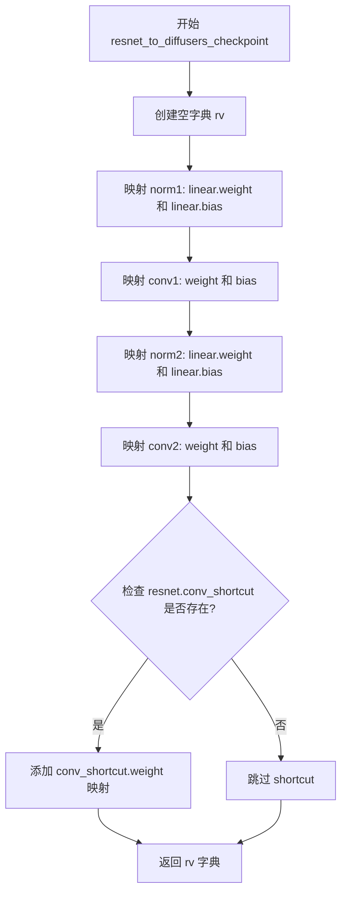
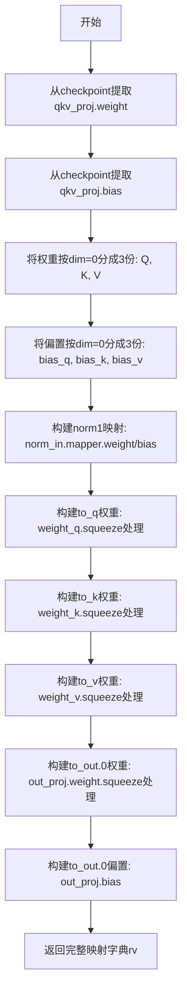
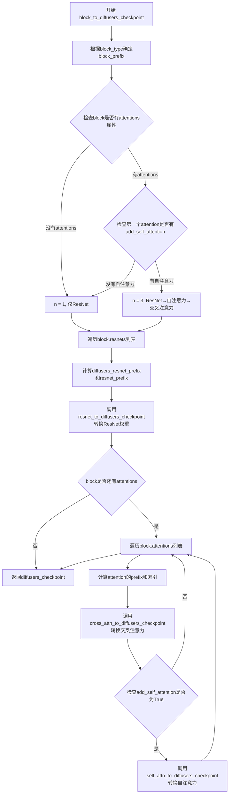
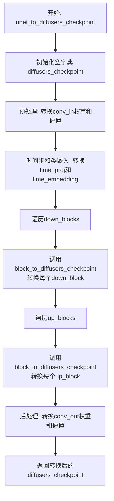
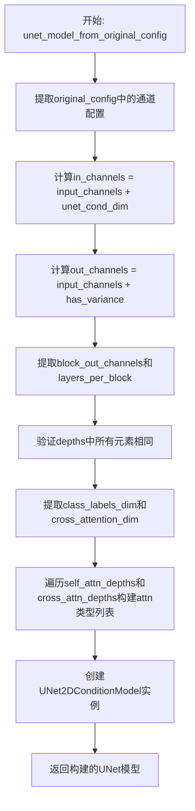
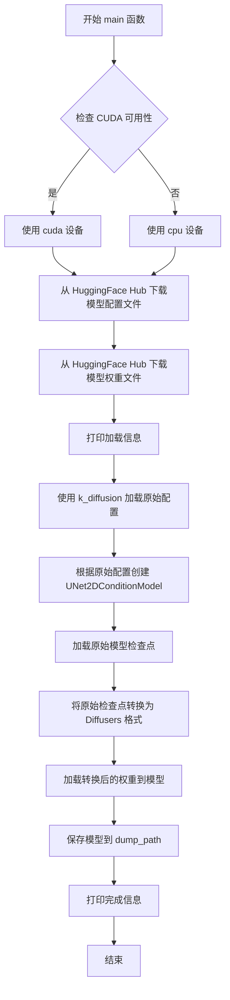

# `diffusers\scripts\convert_k_upscaler_to_diffusers.py` 详细设计文档

这是一个模型转换脚本，用于将自定义的 k-diffusion 格式的 Latent Upscaler（潜在升频器）模型权重和配置转换为 Hugging Face Diffusers 库兼容的 UNet2DConditionModel 格式。脚本从 Hugging Face Hub 下载原始模型，根据原始配置实例化 Diffusers 模型结构，并执行权重键的映射与迁移，最后将转换后的模型保存到本地。

## 整体流程

```mermaid
graph TD
    A[Start: 解析命令行参数] --> B[下载模型资源]
    B --> C[加载原始配置 (k-diffusion JSON)]
    C --> D[实例化 Diffusers UNet 模型]
    D --> E[加载原始检查点 (k-diffusion .pth)]
    E --> F{遍历 Down/Up Blocks}
    F ---> G[调用 block_to_diffusers_checkpoint]
    G --> H{遍历 ResNets & Attentions}
    H ---> I[resnet_to_diffusers_checkpoint]
    H ---> J[self_attn_to_diffusers_checkpoint]
    H ---> K[cross_attn_to_diffusers_checkpoint]
    I --> L[合并转换后的权重字典]
    J --> L
    K --> L
    L --> M[加载权重到 Diffusers 模型]
    M --> N[保存模型到本地路径]
    N --> O[End]
```

## 类结构

```

```

## 全局变量及字段


### `UPSCALER_REPO`
    
Hugging Face Hub上的Upscaler模型仓库标识符，用于指定要下载的upscaler模型。

类型：`str`
    


    

## 全局函数及方法


### `resnet_to_diffusers_checkpoint`

该函数负责将原始ResNet块的权重参数从K-diffusion检查点格式转换为Diffusers UNet2DConditionModel的检查点格式，通过映射原始模型的层级结构（如main.0、main.2等）到Diffusers的标准命名约定（norm1、conv1、norm2、conv2等），实现模型权重的跨框架迁移。

参数：

- `resnet`：ResNet对象，用于检查是否存在conv_shortcut（残差连接）
- `checkpoint`：字典，原始K-diffusion模型的权重检查点
- `diffusers_resnet_prefix`：字符串，转换后的Diffusers模型中ResNet块的前缀路径
- `resnet_prefix`：字符串，原始K-diffusion模型中ResNet块的前缀路径

返回值：`字典`，键为Diffusers格式的权重名称，值为对应的原始检查点权重数据

#### 流程图



#### 带注释源码

```python
def resnet_to_diffusers_checkpoint(resnet, checkpoint, *, diffusers_resnet_prefix, resnet_prefix):
    """
    将K-diffusion格式的ResNet块权重转换为Diffusers格式
    
    参数:
        resnet: ResNet层对象，用于检查是否存在shortcut连接
        checkpoint: 原始模型权重字典
        diffusers_resnet_prefix: 目标Diffusers模型中的前缀路径
        resnet_prefix: 源K-diffusion模型中的前缀路径
    
    返回:
        包含转换后权重映射的字典
    """
    # 初始化结果字典，存储权重映射关系
    rv = {
        # norm1: 第一个归一化层（对应原始的main.0.mapper）
        f"{diffusers_resnet_prefix}.norm1.linear.weight": checkpoint[f"{resnet_prefix}.main.0.mapper.weight"],
        f"{diffusers_resnet_prefix}.norm1.linear.bias": checkpoint[f"{resnet_prefix}.main.0.mapper.bias"],
        
        # conv1: 第一个卷积层（对应原始的main.2）
        f"{diffusers_resnet_prefix}.conv1.weight": checkpoint[f"{resnet_prefix}.main.2.weight"],
        f"{diffusers_resnet_prefix}.conv1.bias": checkpoint[f"{resnet_prefix}.main.2.bias"],
        
        # norm2: 第二个归一化层（对应原始的main.4.mapper）
        f"{diffusers_resnet_prefix}.norm2.linear.weight": checkpoint[f"{resnet_prefix}.main.4.mapper.weight"],
        f"{diffusers_resnet_prefix}.norm2.linear.bias": checkpoint[f"{resnet_prefix}.main.4.mapper.bias"],
        
        # conv2: 第二个卷积层（对应原始的main.6）
        f"{diffusers_resnet_prefix}.conv2.weight": checkpoint[f"{resnet_prefix}.main.6.weight"],
        f"{diffusers_resnet_prefix}.conv2.bias": checkpoint[f"{resnet_prefix}.main.6.bias"],
    }

    # 如果存在残差连接（shortcut），则添加conv_shortcut权重映射
    if resnet.conv_shortcut is not None:
        rv.update(
            {
                f"{diffusers_resnet_prefix}.conv_shortcut.weight": checkpoint[f"{resnet_prefix}.skip.weight"],
            }
        )

    return rv
```


### `self_attn_to_diffusers_checkpoint`

该函数用于将自注意力（Self-Attention）层的模型权重从原始检查点格式转换为 Diffusers 格式，主要处理 QKV 投影权重分割、形状调整以及键值映射。

参数：

- `checkpoint`：`Dict`，原始模型的检查点字典，包含所有层权重
- `diffusers_attention_prefix`：`str`，Diffusers 格式中注意力层的前缀路径
- `attention_prefix`：`str`，原始检查点中注意力层的前缀路径

返回值：`Dict`，转换后的 Diffusers 格式参数字典

#### 流程图



#### 带注释源码

```python
def self_attn_to_diffusers_checkpoint(checkpoint, *, diffusers_attention_prefix, attention_prefix):
    """
    将自注意力层参数从原始格式转换为Diffusers格式
    
    参数:
        checkpoint: 原始模型检查点字典
        diffusers_attention_prefix: Diffusers中注意力层的前缀路径
        attention_prefix: 原始检查点中注意力层的前缀路径
    
    返回:
        转换后的Diffusers格式参数字典
    """
    # 从原始检查点中提取QKV投影权重，并按维度0分割成3份（Q, K, V）
    weight_q, weight_k, weight_v = checkpoint[f"{attention_prefix}.qkv_proj.weight"].chunk(3, dim=0)
    # 从原始检查点中提取QKV投影偏置，并按维度0分割成3份
    bias_q, bias_k, bias_v = checkpoint[f"{attention_prefix}.qkv_proj.bias"].chunk(3, dim=0)
    
    # 构建返回字典，映射原始参数到Diffusers格式
    rv = {
        # norm1: 归一化层，从norm_in.mapper映射
        f"{diffusers_attention_prefix}.norm1.linear.weight": checkpoint[f"{attention_prefix}.norm_in.mapper.weight"],
        f"{diffusers_attention_prefix}.norm1.linear.bias": checkpoint[f"{attention_prefix}.norm_in.mapper.bias"],
        
        # to_q: 查询投影权重
        f"{diffusers_attention_prefix}.attn1.to_q.weight": weight_q.squeeze(-1).squeeze(-1),
        f"{diffusers_attention_prefix}.attn1.to_q.bias": bias_q,
        
        # to_k: 键投影权重
        f"{diffusers_attention_prefix}.attn1.to_k.weight": weight_k.squeeze(-1).squeeze(-1),
        f"{diffusers_attention_prefix}.attn1.to_k.bias": bias_k,
        
        # to_v: 值投影权重
        f"{diffusers_attention_prefix}.attn1.to_v.weight": weight_v.squeeze(-1).squeeze(-1),
        f"{diffusers_attention_prefix}.attn1.to_v.bias": bias_v,
        
        # to_out: 输出投影权重
        f"{diffusers_attention_prefix}.attn1.to_out.0.weight": checkpoint[f"{attention_prefix}.out_proj.weight"]
        .squeeze(-1)
        .squeeze(-1),
        f"{diffusers_attention_prefix}.attn1.to_out.0.bias": checkpoint[f"{attention_prefix}.out_proj.bias"],
    }

    return rv
```


### `cross_attn_to_diffusers_checkpoint`

该函数负责将原始模型检查点中的跨注意力（Cross Attention）模块参数转换为 Diffusers 格式的检查点，处理 KV 投影权重、规范化层权重以及注意力输出投影权重的映射和维度调整。

**参数：**

- `checkpoint`：`Dict[str, torch.Tensor]`，原始模型的检查点字典，包含所有权重
- `diffusers_attention_prefix`：`str`，Diffusers 格式中注意力模块的键前缀，用于构建目标键名
- `diffusers_attention_index`：`int`，注意力模块的索引编号，用于生成目标键名中的norm和attn编号
- `attention_prefix`：`str`，原始模型中注意力模块的键前缀，用于从检查点中提取源权重

**返回值：** `Dict[str, torch.Tensor]`，转换后的 Diffusers 格式检查点字典，包含映射后的权重张量

#### 流程图

```mermaid
flowchart TD
    A[开始: cross_attn_to_diffusers_checkpoint] --> B[从checkpoint提取kv_proj权重并按dim=0分块]
    B --> C[从checkpoint提取kv_proj偏置并按dim=0分块]
    C --> D[构建Diffusers格式的键值映射字典rv]
    D --> E[添加ada_groupnorm的norm权重和偏置]
    F[添加encoder_hidden_states的layernorm权重和偏置] --> E
    E --> G[添加to_q投影的权重和偏置]
    G --> H[添加to_k投影的权重和偏置, 使用squeeze(-1).squeeze(-1)调整维度]
    H --> I[添加to_v投影的权重和偏置, 使用squeeze(-1).squeeze(-1)调整维度]
    I --> J[添加to_out投影的权重和偏置, 使用squeeze(-1).squeeze(-1)调整维度]
    J --> K[返回转换后的检查点字典rv]
```

#### 带注释源码

```python
def cross_attn_to_diffusers_checkpoint(
    checkpoint, *, diffusers_attention_prefix, diffusers_attention_index, attention_prefix
):
    """
    将原始模型检查点中的跨注意力（Cross Attention）模块参数转换为 Diffusers 格式。
    
    参数:
        checkpoint: 原始模型的检查点字典
        diffusers_attention_prefix: Diffusers注意力模块的键前缀
        diffusers_attention_index: 注意力模块的索引
        attention_prefix: 原始注意力模块的键前缀
    
    返回:
        转换后的Diffusers格式检查点字典
    """
    
    # 从原始检查点中提取KV投影权重，并按dim=0分成两半（分别对应k和v）
    # 这是因为原始模型将k和v的权重拼接在一起
    weight_k, weight_v = checkpoint[f"{attention_prefix}.kv_proj.weight"].chunk(2, dim=0)
    
    # 同样地，提取KV投影的偏置并分块
    bias_k, bias_v = checkpoint[f"{attention_prefix}.kv_proj.bias"].chunk(2, dim=0)

    # 构建转换后的检查点字典，键为Diffusers格式，值为从原始检查点提取的权重
    rv = {
        # norm2 (ada groupnorm): 自适应组归一化层
        # 将原始的norm_dec映射权重转换到Diffusers格式
        f"{diffusers_attention_prefix}.norm{diffusers_attention_index}.linear.weight": checkpoint[
            f"{attention_prefix}.norm_dec.mapper.weight"
        ],
        f"{diffusers_attention_prefix}.norm{diffusers_attention_index}.linear.bias": checkpoint[
            f"{attention_prefix}.norm_dec.mapper.bias"
        ],
        
        # layernorm on encoder_hidden_state: 编码器隐藏状态的层归一化
        # 将原始的norm_enc权重和偏置映射到Diffusers格式
        f"{diffusers_attention_prefix}.attn{diffusers_attention_index}.norm_cross.weight": checkpoint[
            f"{attention_prefix}.norm_enc.weight"
        ],
        f"{diffusers_attention_prefix}.attn{diffusers_attention_index}.norm_cross.bias": checkpoint[
            f"{attention_prefix}.norm_enc.bias"
        ],
        
        # to_q: 查询投影层
        # 提取q_proj权重并移除最后两个维度（squeeze操作）
        f"{diffusers_attention_prefix}.attn{diffusers_attention_index}.to_q.weight": checkpoint[
            f"{attention_prefix}.q_proj.weight"
        ]
        .squeeze(-1)
        .squeeze(-1),
        f"{diffusers_attention_prefix}.attn{diffusers_attention_index}.to_q.bias": checkpoint[
            f"{attention_prefix}.q_proj.bias"
        ],
        
        # to_k: 键投影层
        # 使用之前分块得到的weight_k，同样移除多余维度
        f"{diffusers_attention_prefix}.attn{diffusers_attention_index}.to_k.weight": weight_k.squeeze(-1).squeeze(-1),
        f"{diffusers_attention_prefix}.attn{diffusers_attention_index}.to_k.bias": bias_k,
        
        # to_v: 值投影层
        # 使用之前分块得到的weight_v，同样移除多余维度
        f"{diffusers_attention_prefix}.attn{diffusers_attention_index}.to_v.weight": weight_v.squeeze(-1).squeeze(-1),
        f"{diffusers_attention_prefix}.attn{diffusers_attention_index}.to_v.bias": bias_v,
        
        # to_out: 输出投影层
        # 将原始的out_proj权重和偏置映射到Diffusers格式
        f"{diffusers_attention_prefix}.attn{diffusers_attention_index}.to_out.0.weight": checkpoint[
            f"{attention_prefix}.out_proj.weight"
        ]
        .squeeze(-1)
        .squeeze(-1),
        f"{diffusers_attention_prefix}.attn{diffusers_attention_index}.to_out.0.bias": checkpoint[
            f"{attention_prefix}.out_proj.bias"
        ],
    }

    return rv
```


### `block_to_diffusers_checkpoint`

该函数负责将原始K-diffusion模型的UNet块（包含ResNet层和注意力层）转换为HuggingFace Diffusers格式的检查点。它根据块的类型（up/down）和结构，遍历其中的ResNet层和注意力层，调用相应的转换函数生成符合Diffusers模型结构权重的键值映射。

参数：

- `block`：对象，表示K-diffusion模型中的UNet块（`KCrossAttnUpBlock2D`或`KCrossAttnDownBlock2D`等），包含`resnets`和可选的`attentions`属性
- `checkpoint`：字典，原始模型的完整权重字典，键为原始模型参数名，值为对应的张量数据
- `block_idx`：整数，表示当前块在UNet中的索引位置，用于构建参数名前缀
- `block_type`：字符串，取值为"up"或"down"，表示当前处理的块是上采样块还是下采样块，决定原始模型参数的前缀路径

返回值：`字典`，返回转换后的Diffusers格式权重字典，键为符合Diffusers UNet2DConditionModel结构的参数名，值为对应的张量数据

#### 流程图



#### 带注释源码

```python
def block_to_diffusers_checkpoint(block, checkpoint, block_idx, block_type):
    """
    将K-diffusion模型的UNet块转换为Diffusers格式的检查点
    
    参数:
        block: K-diffusion模型中的UNet块对象
        checkpoint: 原始模型权重字典
        block_idx: 块在UNet中的索引
        block_type: 'up' 或 'down'，表示上采样或下采样块
    
    返回:
        转换后的Diffusers格式权重字典
    """
    # 根据块类型确定原始模型中该块的参数前缀路径
    # up块对应inner_model.u_net.u_blocks，down块对应inner_model.u_net.d_blocks
    block_prefix = "inner_model.u_net.u_blocks" if block_type == "up" else "inner_model.u_net.d_blocks"
    # 加上块索引，构建完整的前缀路径，如 inner_model.u_net.u_blocks.0
    block_prefix = f"{block_prefix}.{block_idx}"

    # 初始化转换后的检查点字典
    diffusers_checkpoint = {}

    # 根据块中注意力层的配置决定每个基本单元包含的层数
    # n用于计算原始模型中各层在块内的索引
    if not hasattr(block, "attentions"):
        # 没有attentions属性，说明只有ResNet层
        n = 1  # resnet only
    elif not block.attentions[0].add_self_attention:
        # 第一个attention没有自注意力，只有ResNet和交叉注意力
        n = 2  # resnet -> cross-attention
    else:
        # 完整的结构：ResNet -> 自注意力 -> 交叉注意力
        n = 3  # resnet -> self-attention -> cross-attention

    # 遍历块中的所有ResNet层进行转换
    for resnet_idx, resnet in enumerate(block.resnets):
        # 构建Diffusers格式的ResNet参数前缀
        diffusers_resnet_prefix = f"{block_type}_blocks.{block_idx}.resnets.{resnet_idx}"
        
        # 计算原始模型中对应ResNet层的索引
        # up块从0开始编号，down块从1开始编号（预留空间给下采样的残差连接）
        idx = n * resnet_idx if block_type == "up" else n * resnet_idx + 1
        # 构建原始模型中该ResNet层的前缀路径
        resnet_prefix = f"{block_prefix}.{idx}" if block_type == "up" else f"{block_prefix}.{idx}"

        # 调用专门的ResNet转换函数，更新到目标检查点字典
        diffusers_checkpoint.update(
            resnet_to_diffusers_checkpoint(
                resnet, checkpoint, diffusers_resnet_prefix=diffusers_resnet_prefix, resnet_prefix=resnet_prefix
            )
        )

    # 如果块包含注意力层，进一步处理注意力层的转换
    if hasattr(block, "attentions"):
        # 遍历所有注意力层
        for attention_idx, attention in enumerate(block.attentions):
            # 构建Diffusers格式的注意力参数前缀
            diffusers_attention_prefix = f"{block_type}_blocks.{block_idx}.attentions.{attention_idx}"
            
            # 计算自注意力和交叉注意力在原始模型中的索引
            idx = n * attention_idx + 1 if block_type == "up" else n * attention_idx + 2
            self_attention_prefix = f"{block_prefix}.{idx}"
            cross_attention_prefix = f"{block_prefix}.{idx}"
            
            # 确定交叉注意力在Diffusers块结构中的索引位置
            # 如果没有自注意力，则交叉注意力是第1个；有自注意力时是第2个
            cross_attention_index = 1 if not attention.add_self_attention else 2
            
            # 重新计算交叉注意力的原始模型索引
            idx = (
                n * attention_idx + cross_attention_index
                if block_type == "up"
                else n * attention_idx + cross_attention_index + 1
            )
            cross_attention_prefix = f"{block_prefix}.{idx}"

            # 调用交叉注意力转换函数（注意：此处固定使用index=2，可能存在逻辑问题）
            diffusers_checkpoint.update(
                cross_attn_to_diffusers_checkpoint(
                    checkpoint,
                    diffusers_attention_prefix=diffusers_attention_prefix,
                    diffusers_attention_index=2,  # 硬编码为2，可能应使用cross_attention_index变量
                    attention_prefix=cross_attention_prefix,
                )
            )

            # 如果存在自注意力，调用自注意力转换函数
            if attention.add_self_attention is True:
                diffusers_checkpoint.update(
                    self_attn_to_diffusers_checkpoint(
                        checkpoint,
                        diffusers_attention_prefix=diffusers_attention_prefix,
                        attention_prefix=self_attention_prefix,
                    )
                )

    # 返回转换完成的Diffusers格式检查点
    return diffusers_checkpoint
```


### `unet_to_diffusers_checkpoint`

该函数是模型权重转换工具的核心，负责将K-diffusion框架训练的传统UNet模型检查点转换为Hugging Face Diffusers库兼容的格式，实现跨深度学习框架的模型迁移。

参数：

- `model`：`UNet2DConditionModel`，由`unet_model_from_original_config`函数创建的Diffusers格式UNet模型实例，用于提供目标模型的结构信息
- `checkpoint`：字典，原始K-diffusion模型的权重字典，键名为原始模型各层名称，值为对应的张量参数

返回值：`字典`，转换后的Diffusers格式模型权重字典，键名遵循Diffusers库的命名规范，可直接用于`model.load_state_dict()`

#### 流程图



#### 带注释源码

```python
def unet_to_diffusers_checkpoint(model, checkpoint):
    """
    将K-diffusion框架的UNet模型检查点转换为Diffusers库格式
    
    参数:
        model: Diffusers的UNet2DConditionModel实例，提供目标模型结构信息
        checkpoint: 原始K-diffusion模型的完整权重字典
    
    返回:
        转换后的Diffusers格式权重字典，可直接用于模型加载
    """
    # 初始化空的转换后权重字典
    diffusers_checkpoint = {}

    # ===== 1. 预处理阶段 =====
    # 转换输入投影层: 将inner_model.proj_in映射到conv_in
    diffusers_checkpoint.update(
        {
            "conv_in.weight": checkpoint["inner_model.proj_in.weight"],
            "conv_in.bias": checkpoint["inner_model.proj_in.bias"],
        }
    )

    # ===== 2. 时间步和条件嵌入转换 =====
    # 将时间步投影和时间嵌入层从原始格式映射到Diffusers格式
    # 包括: time_proj, time_embedding (linear_1, linear_2), cond_proj
    diffusers_checkpoint.update(
        {
            "time_proj.weight": checkpoint["inner_model.timestep_embed.weight"].squeeze(-1),
            "time_embedding.linear_1.weight": checkpoint["inner_model.mapping.0.weight"],
            "time_embedding.linear_1.bias": checkpoint["inner_model.mapping.0.bias"],
            "time_embedding.linear_2.weight": checkpoint["inner_model.mapping.2.weight"],
            "time_embedding.linear_2.bias": checkpoint["inner_model.mapping.2.bias"],
            "time_embedding.cond_proj.weight": checkpoint["inner_model.mapping_cond.weight"],
        }
    )

    # ===== 3. 下采样块转换 =====
    # 遍历所有down_blocks，调用block_to_diffusers_checkpoint进行转换
    for down_block_idx, down_block in enumerate(model.down_blocks):
        diffusers_checkpoint.update(
            block_to_diffusers_checkpoint(down_block, checkpoint, down_block_idx, "down")
        )

    # ===== 4. 上采样块转换 =====
    # 遍历所有up_blocks，调用block_to_diffusers_checkpoint进行转换
    for up_block_idx, up_block in enumerate(model.up_blocks):
        diffusers_checkpoint.update(
            block_to_diffusers_checkpoint(up_block, checkpoint, up_block_idx, "up")
        )

    # ===== 5. 后处理阶段 =====
    # 转换输出投影层: 将inner_model.proj_out映射到conv_out
    diffusers_checkpoint.update(
        {
            "conv_out.weight": checkpoint["inner_model.proj_out.weight"],
            "conv_out.bias": checkpoint["inner_model.proj_out.bias"],
        }
    )

    # 返回完整的转换后权重字典
    return diffusers_checkpoint
```

#### 关键组件信息

| 组件名称 | 一句话描述 |
|---------|-----------|
| `resnet_to_diffusers_checkpoint` | 负责将ResNet块的权重从原始格式映射到Diffusers格式 |
| `self_attn_to_diffusers_checkpoint` | 处理自注意力机制的权重转换，包括QKV投影和输出投影 |
| `cross_attn_to_diffusers_checkpoint` | 处理交叉注意力机制的权重转换，支持条件嵌入 |
| `block_to_diffusers_checkpoint` | 协调单个UNet块（包含ResNet和注意力层）的完整转换逻辑 |
| `unet_model_from_original_config` | 根据原始模型配置创建Diffusers格式的UNet模型结构 |

#### 潜在的技术债务或优化空间

1. **硬编码的块类型**: 函数中使用了硬编码的`KDownBlock2D`、`KCrossAttnDownBlock2D`等块类型，缺乏灵活性
2. **缺少错误处理**: 未对缺失的权重键进行异常捕获，可能导致转换过程中途失败
3. **重复的映射逻辑**: `block_to_diffusers_checkpoint`中存在重复的索引计算逻辑，可提取为独立函数
4. **不支持的条件嵌入**: 当前仅支持`cond_proj`条件嵌入，对其他条件机制支持有限

#### 其它项目

**设计目标与约束**：
- 目标：实现K-diffusion到Diffusers的模型格式无缝迁移
- 约束：要求传入的`model`结构必须与原始checkpoint的层级对应

**错误处理与异常设计**：
- 使用`strict=True`进行模型权重加载，任何键不匹配都会抛出异常
- 缺乏对原始checkpoint完整性的预检验

**数据流与状态机**：
- 数据流：原始checkpoint（字典）→ 逐层转换 → Diffusers格式checkpoint（字典）
- 状态：纯函数式设计，无内部状态，保持幂等性

**外部依赖与接口契约**：
- 依赖`model.down_blocks`和`model.up_blocks`提供UNet结构信息
- 依赖`block_to_diffusers_checkpoint`及其子函数完成层级转换
- 输出字典遵循Diffusers的`UNet2DConditionModel.load_state_dict()`接口规范


### `unet_model_from_original_config`

该函数根据原始模型配置文件创建并返回一个适配 Diffusers 库的 UNet2DConditionModel 模型实例，主要用于将原始upscaler模型的配置转换为Diffusers框架兼容的UNet结构。

参数：

- `original_config`：`Dict`，包含原始模型的配置字典，需要包含以下键：`input_channels`（输入通道数）、`unet_cond_dim`（UNet条件维度）、`has_variance`（是否有方差）、`channels`（块输出通道列表）、`depths`（每层深度）、`mapping_cond_dim`（映射条件维度）、`cross_cond_dim`（交叉注意力条件维度）、`self_attn_depths`（自注意力深度列表）、`cross_attn_depths`（交叉注意力深度列表）

返回值：`UNet2DConditionModel`，返回基于Diffusers库构建的UNet2DConditionModel模型实例

#### 流程图



#### 带注释源码

```python
def unet_model_from_original_config(original_config):
    """
    根据原始模型配置创建Diffusers兼容的UNet2DConditionModel
    
    参数:
        original_config: 包含原始模型配置的字典
            - input_channels: 输入图像通道数
            - unet_cond_dim: UNet条件嵌入维度
            - has_variance: 是否预测方差
            - channels: 各阶段通道数列表
            - depths: 各阶段层数列表
            - mapping_cond_dim: 条件映射维度
            - cross_cond_dim: 交叉注意力条件维度
            - self_attn_depths: 自注意力深度列表
            - cross_attn_depths: 交叉注意力深度列表
    
    返回:
        UNet2DConditionModel: 配置好的UNet模型实例
    """
    # 计算输入通道数：基础通道数 + 条件通道数
    in_channels = original_config["input_channels"] + original_config["unet_cond_dim"]
    
    # 计算输出通道数：基础通道数 + 方差通道数（如果有方差预测）
    out_channels = original_config["input_channels"] + (1 if original_config["has_variance"] else 0)

    # 提取块输出通道配置
    block_out_channels = original_config["channels"]

    # 验证所有层的深度是否一致（当前UNet2DConditionModel不支持不同层数的块）
    assert len(set(original_config["depths"])) == 1, (
        "UNet2DConditionModel currently do not support blocks with different number of layers"
    )
    # 提取每块的层数
    layers_per_block = original_config["depths"][0]

    # 提取类别标签维度（用于时间步条件嵌入）
    class_labels_dim = original_config["mapping_cond_dim"]
    # 提取交叉注意力条件维度
    cross_attention_dim = original_config["cross_cond_dim"]

    # 遍历注意力深度配置，构建注意力类型列表
    # 用于后续构建注意力层（虽然本函数未直接使用，但为完整性而计算）
    attn1_types = []
    attn2_types = []
    for s, c in zip(original_config["self_attn_depths"], original_config["cross_attn_depths"]):
        if s:  # 如果有自注意力
            a1 = "self"
            a2 = "cross" if c else None
        elif c:  # 如果有交叉注意力
            a1 = "cross"
            a2 = None
        else:
            a1 = None
            a2 = None
        attn1_types.append(a1)
        attn2_types.append(a2)

    # 创建UNet2DConditionModel模型实例
    # 使用K-Diffusion相关的块类型（KDownBlock2D, KCrossAttnDownBlock2D等）
    unet = UNet2DConditionModel(
        in_channels=in_channels,
        out_channels=out_channels,
        # 下采样块类型：标准下采样 + 3个交叉注意力下采样块
        down_block_types=("KDownBlock2D", "KCrossAttnDownBlock2D", "KCrossAttnDownBlock2D", "KCrossAttnDownBlock2D"),
        mid_block_type=None,  # 不使用中间块
        # 上采样块类型：3个交叉注意力上采样块 + 标准上采样块
        up_block_types=("KCrossAttnUpBlock2D", "KCrossAttnUpBlock2D", "KCrossAttnUpBlock2D", "KUpBlock2D"),
        block_out_channels=block_out_channels,
        layers_per_block=layers_per_block,
        act_fn="gelu",  # 激活函数
        norm_num_groups=None,  # 不使用分组归一化
        cross_attention_dim=cross_attention_dim,
        attention_head_dim=64,  # 注意力头维度
        time_cond_proj_dim=class_labels_dim,  # 时间步条件投影维度
        resnet_time_scale_shift="scale_shift",  # ResNet时间尺度偏移方式
        time_embedding_type="fourier",  # 时间嵌入类型
        timestep_post_act="gelu",  # 时间步后激活函数
        conv_in_kernel=1,  # 输入卷积核大小
        conv_out_kernel=1,  # 输出卷积核大小
    )

    return unet
```


### `main`

该函数是脚本的入口点，负责将原始的k-diffusion模型检查点转换为Diffusers格式的UNet2DConditionModel。它首先从HuggingFace Hub下载原始模型的配置文件和权重，然后使用原始配置创建UNet模型，加载权重并转换为Diffusers格式，最后将转换后的模型保存到指定路径。

参数：

- `args`：`argparse.Namespace`，包含命令行参数，目前使用`args.dump_path`指定输出模型的保存路径

返回值：`None`，该函数无返回值，仅执行模型转换和保存操作

#### 流程图



#### 带注释源码

```python
def main(args):
    """
    主函数：执行模型格式转换的入口点
    
    参数:
        args: 命令行参数对象，包含 dump_path 属性指定输出路径
    返回:
        无返回值
    """
    # 根据CUDA可用性选择计算设备
    device = torch.device("cuda" if torch.cuda.is_available() else "cpu")

    # 从HuggingFace Hub下载原始模型的配置文件和权重文件
    # 使用预定义的UPSCALER_REPO仓库
    orig_config_path = huggingface_hub.hf_hub_download(
        UPSCALER_REPO,  # "pcuenq/k-upscaler"
        "config_laion_text_cond_latent_upscaler_2.json"
    )
    orig_weights_path = huggingface_hub.hf_hub_download(
        UPSCALER_REPO, 
        "laion_text_cond_latent_upscaler_2_1_00470000_slim.pth"
    )
    
    # 打印加载日志信息
    print(f"loading original model configuration from {orig_config_path}")
    print(f"loading original model checkpoint from {orig_weights_path}")

    print("converting to diffusers unet")
    
    # 使用k_diffusion的config模块加载原始配置文件
    # 并从中提取模型配置字典
    orig_config = K.config.load_config(open(orig_config_path))["model"]
    
    # 根据原始配置创建Diffusers格式的UNet模型
    model = unet_model_from_original_config(orig_config)

    # 加载原始权重文件，从model_ema键提取权重
    # map_location确保权重被加载到指定设备
    orig_checkpoint = torch.load(orig_weights_path, map_location=device)["model_ema"]
    
    # 执行权重格式转换：将k-diffusion格式转为Diffusers格式
    converted_checkpoint = unet_to_diffusers_checkpoint(model, orig_checkpoint)

    # 将转换后的权重加载到模型中
    # strict=True确保所有键都能精确匹配
    model.load_state_dict(converted_checkpoint, strict=True)
    
    # 保存转换后的模型到指定路径
    model.save_pretrained(args.dump_path)
    print(f"saving converted unet model in {args.dump_path}")
```

## 关键组件


### UPSCALER_REPO

Hugging Face 模型仓库标识符，指向 `pcuenq/k-upscaler`，用于下载原始模型的配置和权重文件。

### resnet_to_diffusers_checkpoint

将原始 ResNet 块（残差网络块）的权重从自定义格式转换并映射到 Diffusers UNet 模型的对应结构，处理归一化层和卷积层的权重迁移。

### self_attn_to_diffusers_checkpoint

将原始自注意力机制（self-attention）的权重从合并的 QKV 投影矩阵拆分并转换到 Diffusers 格式，包含查询、键、值的权重以及输出投影的重新格式化。

### cross_attn_to_diffusers_checkpoint

将原始交叉注意力机制（cross-attention）的权重转换到 Diffusers 格式，处理条件归一化层、编码器状态归一化以及键值投影的拆分与映射。

### block_to_diffusers_checkpoint

将完整的 UNet 块（包含 ResNet 和注意力层）从原始格式转换到 Diffusers 格式，根据块类型（up/down）和注意力配置动态计算索引并协调调用各转换函数。

### unet_to_diffusers_checkpoint

顶层转换函数，负责将整个 UNet 模型的权重从原始格式迁移到 Diffusers 格式，包括预处理、时间嵌入、下采样块、上采样块和后处理的所有层。

### unet_model_from_original_config

根据原始模型配置文件创建 Diffusers 的 UNet2DConditionModel 实例，解析输入输出通道、块结构、注意力类型和嵌入维度等参数。

### main

主函数， orchestrates 整个模型转换流程：下载原始配置和权重、创建 UNet 模型、执行权重转换、加载转换后的权重并保存为 Diffusers 格式。


## 问题及建议


### 已知问题

- **硬编码的模型仓库和文件名**：UPSCALER_REPO、config_laion_text_cond_latent_upscaler_2.json和模型权重文件名在代码中硬编码，缺乏灵活性。
- **缺失的错误处理**：网络下载文件（huggingface_hub）、模型加载（torch.load）和配置文件解析缺乏try-except异常捕获，可能导致程序直接崩溃。
- **类型注解缺失**：整个代码没有任何Python类型注解，不利于代码可读性和静态分析。
- **cross_attention_index参数未使用**：在`cross_attn_to_diffusers_checkpoint`函数中，`diffusers_attention_index`参数被传入但实际使用中硬编码为2，导致参数无效。
- **变量重复赋值逻辑错误**：在`block_to_diffusers_checkpoint`中，`cross_attention_prefix`被赋值两次（先赋值为`f"{block_prefix}.{idx}"`，后又被重新赋值），第二次赋值覆盖第一次但第一次的逻辑未被使用。
- **torch.load安全风险**：使用`torch.load`时未指定`weights_only`参数，加载未知来源的checkpoint存在潜在安全风险。
- **魔法数字和硬编码索引**：多处使用硬编码的索引值（如`n * resnet_idx + 1`）和层类型判断逻辑，缺乏常量定义。
- **资源未正确释放**：使用`open(orig_config_path)`打开配置文件但未使用with语句或显式close。
- **UNet模型配置硬编码**：在`unet_model_from_original_config`中，down_block_types、up_block_types、attention_head_dim等参数被硬编码，无法适配不同配置的模型。
- **日志记录不规范**：仅使用print语句进行输出，缺乏标准的日志级别控制，不便于生产环境调试。

### 优化建议

- 将模型仓库地址、配置文件名、权重文件名等提取为命令行参数或配置文件。
- 为所有函数添加类型注解，使用Optional、Dict等类型提示。
- 在文件下载、加载、转换的关键步骤添加try-except异常处理，并提供有意义的错误信息。
- 修复`cross_attention_prefix`的重复赋值逻辑错误，确保`diffusers_attention_index`参数被正确使用。
- 使用`torch.load(..., weights_only=True)`明确指定只加载权重数据。
- 将硬编码的索引值和层类型判断逻辑提取为常量或配置字典。
- 使用with语句管理文件资源。
- 将UNet的block_types等配置参数化，从original_config中动态读取或通过参数传入。
- 使用Python标准库logging模块替代print语句，设置不同的日志级别。
- 考虑将复杂的checkpoint转换逻辑拆分为更小的、单一职责的函数或类。


## 其它


### 设计目标与约束

本代码的设计目标是将K-diffusion格式的upscaler模型检查点转换为HuggingFace Diffusers的UNet2DConditionModel格式，以便在Diffusers框架中使用。主要约束包括：1) 仅支持特定的UNet结构（KDownBlock2D、KCrossAttnDownBlock2D、KCrossAttnUpBlock2D、KUpBlock2D）；2) 要求原始配置的depths所有元素相同；3) 转换过程需要严格匹配权重键名。

### 错误处理与异常设计

代码中的错误处理主要包括：1) 使用assert语句验证原始配置depths一致性，当不一致时抛出AssertionError并提示"UNet2DConditionModel currently do not support blocks with different number of layers"；2) 使用strict=True进行权重加载，任何键不匹配都会抛出RuntimeError；3) 外部依赖（huggingface_hub、torch等）的异常会直接向上传播。

### 数据流与状态机

数据流主要分为三个阶段：1) 加载阶段：从HuggingFace Hub下载原始模型配置和权重文件；2) 转换阶段：通过unet_model_from_original_config创建目标UNet结构，然后调用unet_to_diffusers_checkpoint将原始权重键映射为Diffusers格式；3) 保存阶段：使用save_pretrained将转换后的模型保存到指定路径。无复杂状态机，仅为线性流程。

### 外部依赖与接口契约

主要外部依赖包括：1) huggingface_hub：用于从Hub下载模型配置和权重；2) k_diffusion：提供K.config.load_config函数解析原始配置；3) torch：模型加载和张量操作；4) diffusers：提供UNet2DConditionModel类创建目标模型。接口契约方面，main函数接收--dump_path参数指定输出路径，其他函数均为内部转换逻辑。

### 性能考虑

代码本身为一次性转换工具，性能关键点在于：1) 大型模型权重加载（使用torch.load）；2) 权重键映射过程中的多次字典更新操作；3) .squeeze(-1).squeeze(-1)操作可能产生不必要的张量拷贝。可优化方向包括使用dict.update批量更新、考虑内存映射加载大型权重文件。

### 安全性考虑

代码安全性主要涉及：1) 从远程Hub下载文件，无验证机制，依赖HuggingFace Hub的信任模型；2) 使用torch.load加载权重文件，应考虑添加weights_only参数防止恶意权重文件；3) 命令行参数--dump_path未做路径安全检查。

### 配置管理

配置管理体现在：1) 硬编码的模型仓库地址UPSCALER_REPO = "pcuenq/k-upscaler"；2) 固定的下游/上游块类型配置；3) 使用原始config.json中的参数（input_channels、unet_cond_dim、channels、depths等）动态构建UNet。配置与代码耦合度较高，不易扩展支持其他模型格式。

### 测试策略

测试应覆盖：1) 各种depths配置下的转换正确性；2) 包含/不包含shortcut连接的处理；3) self-attention和cross-attention的不同组合；4) 有variance与无variance的输出通道处理；5) 转换后模型在Diffusers框架中的实际推理验证。建议使用已知正确性的模型进行端到端测试对比。

    