# `diffusers\scripts\convert_kakao_brain_unclip_to_diffusers.py` 详细设计文档

这是一个模型权重转换工具，用于将Kakao Brain的unCLIP模型检查点转换为Hugging Face Diffusers库兼容的格式，支持prior模型、decoder模型、文本投影模型和超分辨率UNet的权重转换与组装。

## 整体流程

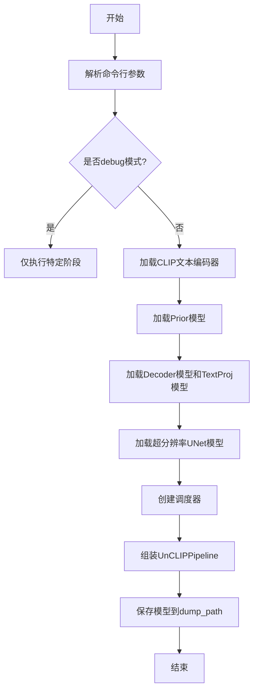

## 类结构

```
无类定义 - 纯函数式编程脚本
主要模块分组:
├── Prior转换模块 (prior_*)
├── Decoder转换模块 (decoder_*)
├── TextProj转换模块 (text_proj_*)
├── SuperRes转换模块 (super_res_unet_*_steps)
├── UNet工具模块 (unet_*, resnet_*, attention_*, split_*)
└── Driver函数模块 (text_encoder, prior, decoder, super_res_unet, load_checkpoint_to_model)
```

## 全局变量及字段


### `PRIOR_ORIGINAL_PREFIX`
    
Prior模型在原始检查点中的权重前缀

类型：`str`
    


### `PRIOR_CONFIG`
    
PriorTransformer模型的配置字典

类型：`dict`
    


### `DECODER_ORIGINAL_PREFIX`
    
Decoder模型在原始检查点中的权重前缀

类型：`str`
    


### `DECODER_CONFIG`
    
UNet2DConditionModel解码器模型的配置字典

类型：`dict`
    


### `SUPER_RES_UNET_FIRST_STEPS_PREFIX`
    
超分辨率UNet第一阶段模型在原始检查点中的权重前缀

类型：`str`
    


### `SUPER_RES_UNET_FIRST_STEPS_CONFIG`
    
超分辨率UNet第一阶段模型的配置字典

类型：`dict`
    


### `SUPER_RES_UNET_LAST_STEP_PREFIX`
    
超分辨率UNet最后阶段模型在原始检查点中的权重前缀

类型：`str`
    


### `SUPER_RES_UNET_LAST_STEP_CONFIG`
    
超分辨率UNet最后阶段模型的配置字典

类型：`dict`
    


### `args`
    
命令行参数解析后的命名空间对象

类型：`argparse.Namespace`
    


    

## 全局函数及方法


### `prior_model_from_original_config`

该函数负责实例化先验（Prior）模型。它使用预定义的全局配置字典 `PRIOR_CONFIG`（当前为空字典 `{}`，即使用模型的默认参数）来初始化 `diffusers` 库中的 `PriorTransformer` 类，并返回该模型对象。

参数：

- 无（该函数不使用任何传入参数，直接引用全局配置 `PRIOR_CONFIG`）

返回值：`PriorTransformer`，返回成功实例化的先验模型对象。

#### 流程图

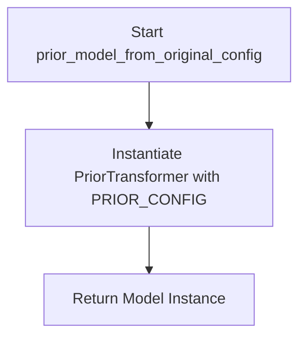

#### 带注释源码

```python
def prior_model_from_original_config():
    """
    从原始配置创建先验模型。
    目前使用默认配置 (PRIOR_CONFIG = {})。
    """
    # 使用全局变量 PRIOR_CONFIG (解包字典) 实例化 PriorTransformer
    # 由于 PRIOR_CONFIG 为空，相当于调用 PriorTransformer()
    model = PriorTransformer(**PRIOR_CONFIG)

    return model
```


### `prior_original_checkpoint_to_diffusers_checkpoint`

该函数负责将 Kakao Brain 原始 Prior 模型的检查点转换为 Hugging Face Diffusers 的 PriorTransformer 兼容格式，涵盖时间嵌入、图像/文本投影层、位置编码、Transformer 块和输出投影的权重映射。

参数：

- `model`：`PriorTransformer`，用于获取模型配置信息（如 `attention_head_dim`）
- `checkpoint`：字典，原始 Prior 模型的检查点数据
- `clip_stats_checkpoint`：元组 `(clip_mean, clip_std)`，CLIP 统计信息

返回值：`dict`，转换后的 Diffusers 格式检查点

#### 流程图

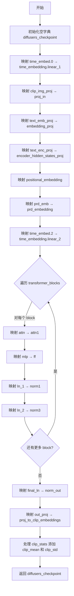

#### 带注释源码

```python
def prior_original_checkpoint_to_diffusers_checkpoint(model, checkpoint, clip_stats_checkpoint):
    """
    将原始 Kakao Brain Prior 模型的检查点转换为 Diffusers PriorTransformer 格式
    
    参数:
        model: PriorTransformer 模型实例，用于获取配置信息
        checkpoint: 原始模型的权重字典
        clip_stats_checkpoint: 包含 (clip_mean, clip_std) 的元组
    
    返回:
        转换后的 Diffusers 格式检查点字典
    """
    diffusers_checkpoint = {}

    # 映射: <original>.time_embed.0 -> <diffusers>.time_embedding.linear_1
    # 时间嵌入层的第一部分（SiLU 激活前的线性层）
    diffusers_checkpoint.update(
        {
            "time_embedding.linear_1.weight": checkpoint[f"{PRIOR_ORIGINAL_PREFIX}.time_embed.0.weight"],
            "time_embedding.linear_1.bias": checkpoint[f"{PRIOR_ORIGINAL_PREFIX}.time_embed.0.bias"],
        }
    )

    # 映射: <original>.clip_img_proj -> <diffusers>.proj_in
    # 图像嵌入投影层
    diffusers_checkpoint.update(
        {
            "proj_in.weight": checkpoint[f"{PRIOR_ORIGINAL_PREFIX}.clip_img_proj.weight"],
            "proj_in.bias": checkpoint[f"{PRIOR_ORIGINAL_PREFIX}.clip_img_proj.bias"],
        }
    )

    # 映射: <original>.text_emb_proj -> <diffusers>.embedding_proj
    # 文本嵌入投影层
    diffusers_checkpoint.update(
        {
            "embedding_proj.weight": checkpoint[f"{PRIOR_ORIGINAL_PREFIX}.text_emb_proj.weight"],
            "embedding_proj.bias": checkpoint[f"{PRIOR_ORIGINAL_PREFIX}.text_emb_proj.bias"],
        }
    )

    # 映射: <original>.text_enc_proj -> <diffusers>.encoder_hidden_states_proj
    # 文本编码器隐藏状态投影层
    diffusers_checkpoint.update(
        {
            "encoder_hidden_states_proj.weight": checkpoint[f"{PRIOR_ORIGINAL_PREFIX}.text_enc_proj.weight"],
            "encoder_hidden_states_proj.bias": checkpoint[f"{PRIOR_ORIGINAL_PREFIX}.text_enc_proj.bias"],
        }
    )

    # 映射: <original>.positional_embedding -> <diffusers>.positional_embedding
    # 位置编码
    diffusers_checkpoint.update({"positional_embedding": checkpoint[f"{PRIOR_ORIGINAL_PREFIX}.positional_embedding"]})

    # 映射: <original>.prd_emb -> <diffusers>.prd_embedding
    # PRD（可能是 prompt-related deviation）嵌入
    diffusers_checkpoint.update({"prd_embedding": checkpoint[f"{PRIOR_ORIGINAL_PREFIX}.prd_emb"]})

    # 映射: <original>.time_embed.2 -> <diffusers>.time_embedding.linear_2
    # 时间嵌入层的第二部分（SiLU 激活后的线性层）
    diffusers_checkpoint.update(
        {
            "time_embedding.linear_2.weight": checkpoint[f"{PRIOR_ORIGINAL_PREFIX}.time_embed.2.weight"],
            "time_embedding.linear_2.bias": checkpoint[f"{PRIOR_ORIGINAL_PREFIX}.time_embed.2.bias"],
        }
    )

    # 遍历所有 Transformer 块进行映射
    # 映射: <original>.resblocks.<x> -> <diffusers>.transformer_blocks.<x>
    for idx in range(len(model.transformer_blocks)):
        diffusers_transformer_prefix = f"transformer_blocks.{idx}"
        original_transformer_prefix = f"{PRIOR_ORIGINAL_PREFIX}.transformer.resblocks.{idx}"

        # 映射注意力层: <original>.attn -> <diffusers>.attn1
        # 调用专门的注意力转换函数，分离 QKV 权重
        diffusers_attention_prefix = f"{diffusers_transformer_prefix}.attn1"
        original_attention_prefix = f"{original_transformer_prefix}.attn"
        diffusers_checkpoint.update(
            prior_attention_to_diffusers(
                checkpoint,
                diffusers_attention_prefix=diffusers_attention_prefix,
                original_attention_prefix=original_attention_prefix,
                attention_head_dim=model.attention_head_dim,
            )
        )

        # 映射前馈网络: <original>.mlp -> <diffusers>.ff
        diffusers_ff_prefix = f"{diffusers_transformer_prefix}.ff"
        original_ff_prefix = f"{original_transformer_prefix}.mlp"
        diffusers_checkpoint.update(
            prior_ff_to_diffusers(
                checkpoint, diffusers_ff_prefix=diffusers_ff_prefix, original_ff_prefix=original_ff_prefix
            )
        )

        # 映射层归一化: <original>.ln_1 -> <diffusers>.norm1
        diffusers_checkpoint.update(
            {
                f"{diffusers_transformer_prefix}.norm1.weight": checkpoint[
                    f"{original_transformer_prefix}.ln_1.weight"
                ],
                f"{diffusers_transformer_prefix}.norm1.bias": checkpoint[f"{original_transformer_prefix}.ln_1.bias"],
            }
        )

        # 映射层归一化: <original>.ln_2 -> <diffusers>.norm3
        diffusers_checkpoint.update(
            {
                f"{diffusers_transformer_prefix}.norm3.weight": checkpoint[
                    f"{original_transformer_prefix}.ln_2.weight"
                ],
                f"{diffusers_transformer_prefix}.norm3.bias": checkpoint[f"{original_transformer_prefix}.ln_2.bias"],
            }
        )

    # 映射最终层归一化: <original>.final_ln -> <diffusers>.norm_out
    diffusers_checkpoint.update(
        {
            "norm_out.weight": checkpoint[f"{PRIOR_ORIGINAL_PREFIX}.final_ln.weight"],
            "norm_out.bias": checkpoint[f"{PRIOR_ORIGINAL_PREFIX}.final_ln.bias"],
        }
    )

    # 映射输出投影: <original>.out_proj -> <diffusers>.proj_to_clip_embeddings
    # 将隐藏状态投影到 CLIP 嵌入空间
    diffusers_checkpoint.update(
        {
            "proj_to_clip_embeddings.weight": checkpoint[f"{PRIOR_ORIGINAL_PREFIX}.out_proj.weight"],
            "proj_to_clip_embeddings.bias": checkpoint[f"{PRIOR_ORIGINAL_PREFIX}.out_proj.bias"],
        }
    )

    # 处理 CLIP 统计信息
    # 扩展维度以匹配模型期望的形状 [1, dim]
    clip_mean, clip_std = clip_stats_checkpoint
    clip_mean = clip_mean[None, :]
    clip_std = clip_std[None, :]

    diffusers_checkpoint.update({"clip_mean": clip_mean, "clip_std": clip_std})

    return diffusers_checkpoint
```


### `prior_attention_to_diffusers`

该函数用于将Kakao Brain原始UNet模型的注意力层（Attention）权重检查点转换为Diffusers格式。具体来说，它处理原始模型中的`c_qkv`权重（包含query、key、value的投影）转换为Diffusers模型中的`to_q`、`to_k`、`to_v`权重，同时处理输出投影层`c_proj`到`to_out.0`的转换。

参数：

- `checkpoint`：`dict`，原始模型的权重字典，键为原始模型的参数名称，值为对应的权重张量
- `diffusers_attention_prefix`：`str`，转换后Diffusers模型中注意力层的键前缀，用于构建新的参数名称
- `original_attention_prefix`：`str`，原始模型中注意力层的键前缀，用于从原始检查点中提取权重
- `attention_head_dim`：`int`，注意力头的维度，用于分割`c_qkv`权重为query、key、value三部分

返回值：`dict`，转换后的Diffusers格式权重字典，包含`to_q`、`to_k`、`to_v`和`to_out.0`的权重和偏置

#### 流程图

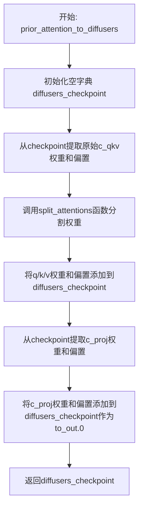

#### 带注释源码

```python
def prior_attention_to_diffusers(
    checkpoint, *, diffusers_attention_prefix, original_attention_prefix, attention_head_dim
):
    """
    将原始Kakao Brain模型的注意力层权重转换为Diffusers格式
    
    参数:
        checkpoint: 原始模型权重字典
        diffusers_attention_prefix: 转换后Diffusers模型的注意力层键前缀
        original_attention_prefix: 原始模型注意力层的键前缀
        attention_head_dim: 注意力头维度，用于分割权重
    
    返回:
        转换后的Diffusers格式权重字典
    """
    # 初始化空的转换后权重字典
    diffusers_checkpoint = {}

    # <original>.c_qkv -> <diffusers>.{to_q, to_k, to_v}
    # 原始模型中，query、key、value的权重是合并在一起的（c_qkv）
    # 需要根据attention_head_dim分割成三部分
    [q_weight, k_weight, v_weight], [q_bias, k_bias, v_bias] = split_attentions(
        weight=checkpoint[f"{original_attention_prefix}.c_qkv.weight"],
        bias=checkpoint[f"{original_attention_prefix}.c_qkv.bias"],
        split=3,  # 分割为query、key、value三部分
        chunk_size=attention_head_dim,
    )

    # 将分割后的query权重和偏置添加到转换字典
    diffusers_checkpoint.update(
        {
            f"{diffusers_attention_prefix}.to_q.weight": q_weight,
            f"{diffusers_attention_prefix}.to_q.bias": q_bias,
            # 将分割后的key权重和偏置添加到转换字典
            f"{diffusers_attention_prefix}.to_k.weight": k_weight,
            f"{diffusers_attention_prefix}.to_k.bias": k_bias,
            # 将分割后的value权重和偏置添加到转换字典
            f"{diffusers_attention_prefix}.to_v.weight": v_weight,
            f"{diffusers_attention_prefix}.to_v.bias": v_bias,
        }
    )

    # <original>.c_proj -> <diffusers>.to_out.0
    # 原始模型的输出投影层（c_proj）对应Diffusers模型的to_out.0
    diffusers_checkpoint.update(
        {
            f"{diffusers_attention_prefix}.to_out.0.weight": checkpoint[f"{original_attention_prefix}.c_proj.weight"],
            f"{diffusers_attention_prefix}.to_out.0.bias": checkpoint[f"{original_attention_prefix}.c_proj.bias"],
        }
    )

    # 返回转换后的权重字典
    return diffusers_checkpoint
```


### `prior_ff_to_diffusers`

该函数用于将 Kakao Brain 原始 UNCLIP 模型中 Transformer 模块的前馈神经网络（Feed-Forward Network）权重参数从原始格式转换到 Diffusers 格式。主要处理 `c_fc`（全连接层）和 `c_proj`（投影层）到 `net.0.proj` 和 `net.2` 的映射转换。

参数：

- `checkpoint`：`Dict`，原始模型的完整权重字典（键为参数名称，值为权重张量）
- `diffusers_ff_prefix`：`str`，Diffusers 格式中前馈网络在转换后字典中的键前缀（例如 `"transformer_blocks.0.ff"`）
- `original_ff_prefix`：`str`，原始模型中前馈网络在权重字典中的键前缀（例如 `"model.transformer.resblocks.0.mlp"`）

返回值：`Dict`，包含转换后的前馈网络权重键值对，可直接用于更新 Diffusers 模型检查点。

#### 流程图

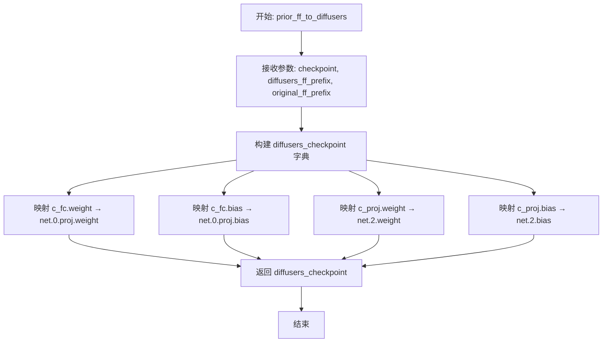

#### 带注释源码

```python
def prior_ff_to_diffusers(checkpoint, *, diffusers_ff_prefix, original_ff_prefix):
    """
    将原始模型的前馈神经网络(FF)权重转换为Diffusers格式
    
    参数:
        checkpoint: 原始模型权重字典
        diffusers_ff_prefix: Diffusers中FF层的前缀路径
        original_ff_prefix: 原始模型中FF层的前缀路径
    返回:
        转换后的FF层权重字典
    """
    diffusers_checkpoint = {
        # 原始模型的 c_fc 全连接层对应 Diffusers 的 net.0.proj
        # 这是前馈网络的第一层: 线性变换 + GELU 激活
        f"{diffusers_ff_prefix}.net.{0}.proj.weight": checkpoint[f"{original_ff_prefix}.c_fc.weight"],
        f"{diffusers_ff_prefix}.net.{0}.proj.bias": checkpoint[f"{original_ff_prefix}.c_fc.bias"],
        
        # 原始模型的 c_proj 投影层对应 Diffusers 的 net.2
        # 这是前馈网络的第二层: 线性变换 (无激活函数)
        # net.1 通常是激活函数层 (如 GELU)，所以索引为 2
        f"{diffusers_ff_prefix}.net.{2}.weight": checkpoint[f"{original_ff_prefix}.c_proj.weight"],
        f"{diffusers_ff_prefix}.net.{2}.bias": checkpoint[f"{original_ff_prefix}.c_proj.bias"],
    }

    return diffusers_checkpoint
```


### `decoder_model_from_original_config`

该函数是Kakao Brain unCLIP模型转换为Hugging Face diffusers格式脚本的一部分，用于根据预定义的解码器配置创建UNet2DConditionModel模型实例。该模型是unCLIPPipeline中的解码器组件，负责根据先验模型生成的图像嵌入来生成最终图像。

参数：
- 该函数没有显式参数，但使用了全局变量`DECODER_CONFIG`来构建模型

返回值：`UNet2DConditionModel`，返回根据DECODER_CONFIG配置实例化的UNet2DConditionModel模型对象

#### 流程图

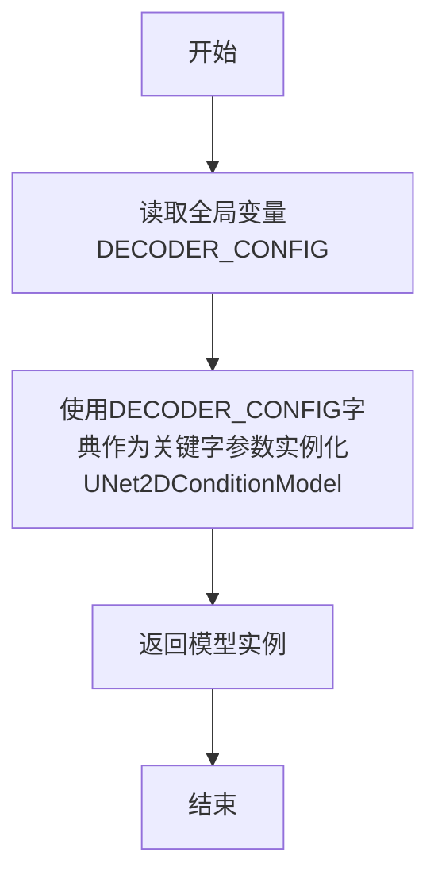

#### 带注释源码

```python
def decoder_model_from_original_config():
    """
    根据预定义的DECODER_CONFIG配置创建UNet2DConditionModel解码器模型
    
    DECODER_CONFIG包含以下关键配置:
    - sample_size: 64 - 输入样本的空间维度
    - layers_per_block: 3 - 每个块中的层数
    - down_block_types: 下采样块类型列表
    - up_block_types: 上采样块类型列表
    - mid_block_type: 中间块类型
    - block_out_channels: (320, 640, 960, 1280) - 各块的输出通道数
    - in_channels: 3 - 输入通道数（RGB图像）
    - out_channels: 6 - 输出通道数
    - cross_attention_dim: 1536 - 跨注意力维度
    - class_embed_type: 'identity' - 类别嵌入类型
    - attention_head_dim: 64 - 注意力头维度
    - resnet_time_scale_shift: 'scale_shift' - 时间嵌入缩放偏移方式
    """
    # 使用DECODER_CONFIG配置字典实例化UNet2DConditionModel
    # UNet2DConditionModel是diffusers库中的条件UNet模型，支持交叉注意力机制
    model = UNet2DConditionModel(**DECODER_CONFIG)

    # 返回构建好的解码器模型实例
    return model
```


### `decoder_original_checkpoint_to_diffusers_checkpoint`

该函数负责将 Kakao Brain UnCLIP 模型中原始的 decoder 检查点转换为 Diffusers 格式的检查点。它通过处理 UNet 模型的各个组件（时间嵌入、输入块、下采样块、中间块、上采样块、输出归一化和卷积层）来完成映射，并将所有转换后的权重存储在字典中返回。

参数：

- `model`：`UNet2DConditionModel`，目标 Diffusers UNet 模型实例，用于获取模型结构信息（如块数量、注意力头维度等）
- `checkpoint`：字典，原始 Kakao Brain decoder 检查点的状态字典，包含以 `"model."` 为前缀的权重

返回值：`字典`，转换后的 Diffusers 格式检查点，键名为 Diffusers 风格的路径，值为对应的张量权重

#### 流程图

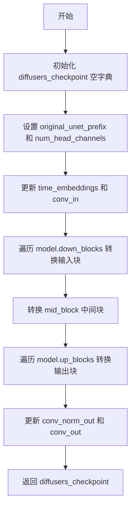

#### 带注释源码

```python
def decoder_original_checkpoint_to_diffusers_checkpoint(model, checkpoint):
    """将原始 decoder 检查点转换为 Diffusers 格式
    
    参数:
        model: UNet2DConditionModel, 目标 Diffusers UNet 模型实例
        checkpoint: dict, 原始 Kakao Brain decoder 检查点
    
    返回:
        dict: 转换后的 Diffusers 格式检查点
    """
    diffusers_checkpoint = {}

    # 获取原始前缀和注意力头维度配置
    original_unet_prefix = DECODER_ORIGINAL_PREFIX  # "model"
    num_head_channels = DECODER_CONFIG["attention_head_dim"]  # 64

    # 转换时间嵌入层: <original>.time_embed -> <diffusers>.time_embedding
    diffusers_checkpoint.update(unet_time_embeddings(checkpoint, original_unet_prefix))
    
    # 转换输入卷积层: <original>.input_blocks.0 -> <diffusers>.conv_in
    diffusers_checkpoint.update(unet_conv_in(checkpoint, original_unet_prefix))

    # === 处理输入块 (input_blocks) 到下采样块 (down_blocks) 的转换 ===
    original_down_block_idx = 1  # 原始模型中输入块的起始索引

    for diffusers_down_block_idx in range(len(model.down_blocks)):
        # 逐个转换每个下采样块
        checkpoint_update, num_original_down_blocks = unet_downblock_to_diffusers_checkpoint(
            model,
            checkpoint,
            diffusers_down_block_idx=diffusers_down_block_idx,
            original_down_block_idx=original_down_block_idx,
            original_unet_prefix=original_unet_prefix,
            num_head_channels=num_head_channels,
        )

        # 更新原始块的索引位置
        original_down_block_idx += num_original_down_blocks

        # 合并转换后的权重
        diffusers_checkpoint.update(checkpoint_update)

    # 完成 input_blocks -> down_blocks 转换

    # 转换中间块: <original>.middle_block -> <diffusers>.mid_block
    diffusers_checkpoint.update(
        unet_midblock_to_diffusers_checkpoint(
            model,
            checkpoint,
            original_unet_prefix=original_unet_prefix,
            num_head_channels=num_head_channels,
        )
    )

    # === 处理输出块 (output_blocks) 到上采样块 (up_blocks) 的转换 ===
    original_up_block_idx = 0  # 原始模型中输出块的起始索引

    for diffusers_up_block_idx in range(len(model.up_blocks)):
        # 逐个转换每个上采样块
        checkpoint_update, num_original_up_blocks = unet_upblock_to_diffusers_checkpoint(
            model,
            checkpoint,
            diffusers_up_block_idx=diffusers_up_block_idx,
            original_up_block_idx=original_up_block_idx,
            original_unet_prefix=original_unet_prefix,
            num_head_channels=num_head_channels,
        )

        # 更新原始块的索引位置
        original_up_block_idx += num_original_up_blocks

        # 合并转换后的权重
        diffusers_checkpoint.update(checkpoint_update)

    # 完成 output_blocks -> up_blocks 转换

    # 转换输出归一化层: <original>.out.0 -> <diffusers>.conv_norm_out
    diffusers_checkpoint.update(unet_conv_norm_out(checkpoint, original_unet_prefix))
    
    # 转换输出卷积层: <original>.out.2 -> <diffusers>.conv_out
    diffusers_checkpoint.update(unet_conv_out(checkpoint, original_unet_prefix))

    return diffusers_checkpoint
```


### `text_proj_from_original_config`

该函数用于根据预定义的解码器配置（DECODER_CONFIG）创建并返回一个 `UnCLIPTextProjModel` 文本投影模型实例。该模型负责将文本编码器的输出投影到与条件 UNet 兼容的空间，是 Kakao Brain unCLIP 模型转换流程中的关键组件，用于处理文本条件信息的嵌入和投影。

参数：

- 该函数无参数

返回值：`UnCLIPTextProjModel`，返回一个配置好的文本投影模型对象，用于后续的权重加载和推理流程

#### 流程图

```mermaid
flowchart TD
    A[开始] --> B[获取 DECODER_CONFIG 配置]
    B --> C[计算 time_embed_dim: block_out_channels[0] × 4]
    C --> D[从配置获取 cross_attention_dim]
    D --> E[创建 UnCLIPTextProjModel]
    E --> F[返回模型实例]
    
    style A fill:#f9f,stroke:#333
    style F fill:#9f9,stroke:#333
```

#### 带注释源码

```python
def text_proj_from_original_config():
    """
    根据原始解码器配置创建文本投影模型 (UnCLIPTextProjModel)。
    
    该函数从 DECODER_CONFIG 中提取必要的维度参数，初始化用于文本条件投影的模型。
    在 Kakao Brain unCLIP 到 Diffusers 的模型转换流程中，此模型负责处理文本嵌入的投影，
    使其能够被条件 UNet 正确使用。
    
    返回:
        UnCLIPTextProjModel: 配置好的文本投影模型实例
    """
    # 从条件 UNet 构造函数中获取时间嵌入维度的计算方式
    # time_embed_dim 是通过第一个块输出通道数的 4 倍计算得出
    # 这与 UNet 的时间嵌入层维度保持一致
    time_embed_dim = DECODER_CONFIG["block_out_channels"][0] * 4

    # 获取交叉注意力维度，用于文本条件的处理
    # 该值定义了文本嵌入向量的维度
    cross_attention_dim = DECODER_CONFIG["cross_attention_dim"]

    # 创建 UnCLIPTextProjModel 实例
    # 该模型包含以下关键组件：
    # - encoder_hidden_states_proj: 文本序列投影层
    # - text_encoder_hidden_states_norm: 文本隐藏状态归一化
    # - clip_extra_context_tokens_proj: CLIP 额外上下文 tokens 投影
    # - embedding_proj: 文本特征投影
    # - learned_classifier_free_guidance_embeddings: 学习到的无分类器引导嵌入
    # - clip_image_embeddings_project_to_time_embeddings: 图像嵌入到时间嵌入的投影
    model = UnCLIPTextProjModel(time_embed_dim=time_embed_dim, cross_attention_dim=cross_attention_dim)

    return model
```

---

#### 关联配置信息

| 配置项 | 类型 | 描述 |
|--------|------|------|
| `DECODER_CONFIG` | `dict` | 解码器模型的配置字典，包含 `block_out_channels` 和 `cross_attention_dim` 等关键参数 |

| 配置键 | 值 | 描述 |
|--------|-----|------|
| `block_out_channels` | `(320, 640, 960, 1280)` | UNet 各层的输出通道数列表 |
| `cross_attention_dim` | `1536` | 交叉注意力机制的维度 |
| `time_embed_dim` | `320 * 4 = 1280` | 时间嵌入维度（通过计算得出）|


### `text_proj_original_checkpoint_to_diffusers_checkpoint`

该函数负责将Kakao Brain原始UnCLIP模型的文本投影（Text Projection）部分检查点转换为Diffusers格式的检查点。它从原始解码器检查点中提取多个文本相关的投影层权重（包括文本序列投影、CLIP令牌投影、文本特征投影、CLIP嵌入等），并将这些权重映射到Diffusers的`UnCLIPTextProjModel`模型结构中。

参数：

- `checkpoint`：`Dict`，原始解码器检查点字典，包含以`model.`为前缀的原始权重

返回值：`Dict`，转换后的Diffusers格式检查点字典，键为Diffusers模型层名称，值为对应的张量

#### 流程图

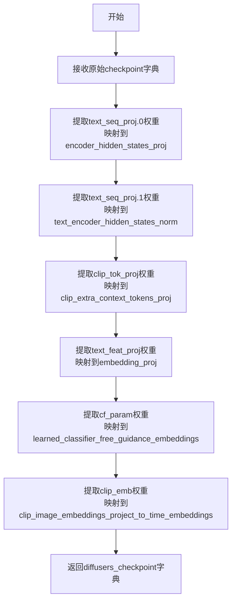

#### 带注释源码

```python
# Note that the input checkpoint is the original decoder checkpoint
def text_proj_original_checkpoint_to_diffusers_checkpoint(checkpoint):
    """
    将原始文本投影检查点转换为Diffusers格式
    
    参数:
        checkpoint: 原始解码器检查点字典
        
    返回:
        diffusers_checkpoint: 转换后的Diffusers格式检查点
    """
    # 初始化目标检查点字典
    diffusers_checkpoint = {
        # <original>.text_seq_proj.0 -> <diffusers>.encoder_hidden_states_proj
        # 文本序列投影层：用于将文本编码器输出投影到隐藏状态
        "encoder_hidden_states_proj.weight": checkpoint[f"{DECODER_ORIGINAL_PREFIX}.text_seq_proj.0.weight"],
        "encoder_hidden_states_proj.bias": checkpoint[f"{DECODER_ORIGINAL_PREFIX}.text_seq_proj.0.bias"],
        
        # <original>.text_seq_proj.1 -> <diffusers>.text_encoder_hidden_states_norm
        # 文本编码器隐藏状态归一化层
        "text_encoder_hidden_states_norm.weight": checkpoint[f"{DECODER_ORIGINAL_PREFIX}.text_seq_proj.1.weight"],
        "text_encoder_hidden_states_norm.bias": checkpoint[f"{DECODER_ORIGINAL_PREFIX}.text_seq_proj.1.bias"],
        
        # <original>.clip_tok_proj -> <diffusers>.clip_extra_context_tokens_proj
        # CLIP令牌投影层：用于处理额外的CLIP上下文令牌
        "clip_extra_context_tokens_proj.weight": checkpoint[f"{DECODER_ORIGINAL_PREFIX}.clip_tok_proj.weight"],
        "clip_extra_context_tokens_proj.bias": checkpoint[f"{DECODER_ORIGINAL_PREFIX}.clip_tok_proj.bias"],
        
        # <original>.text_feat_proj -> <diffusers>.embedding_proj
        # 文本特征投影层：将文本特征投影到嵌入空间
        "embedding_proj.weight": checkpoint[f"{DECODER_ORIGINAL_PREFIX}.text_feat_proj.weight"],
        "embedding_proj.bias": checkpoint[f"{DECODER_ORIGINAL_PREFIX}.text_feat_proj.bias"],
        
        # <original>.cf_param -> <diffusers>.learned_classifier_free_guidance_embeddings
        # 学习到的无分类器自由引导嵌入，用于无分类器引导生成
        "learned_classifier_free_guidance_embeddings": checkpoint[f"{DECODER_ORIGINAL_PREFIX}.cf_param"],
        
        # <original>.clip_emb -> <diffusers>.clip_image_embeddings_project_to_time_embeddings
        # CLIP图像嵌入到时间嵌入的投影层
        "clip_image_embeddings_project_to_time_embeddings.weight": checkpoint[
            f"{DECODER_ORIGINAL_PREFIX}.clip_emb.weight"
        ],
        "clip_image_embeddings_project_to_time_embeddings.bias": checkpoint[
            f"{DECODER_ORIGINAL_PREFIX}.clip_emb.bias"
        ],
    }

    # 返回转换后的Diffusers格式检查点
    return diffusers_checkpoint
```


### `super_res_unet_first_steps_model_from_original_config`

该函数用于根据预定义的超级分辨率UNet（第一步）模型配置创建UNet2DModel实例，作为Kakao Brain unCLIP模型转换流程的一部分，用于处理超分辨率生成任务的第一阶段。

参数：
- 无参数

返回值：`UNet2DModel`，返回根据 `SUPER_RES_UNET_FIRST_STEPS_CONFIG` 配置实例化的UNet2DModel模型对象，用于后续的权重加载和模型转换。

#### 流程图

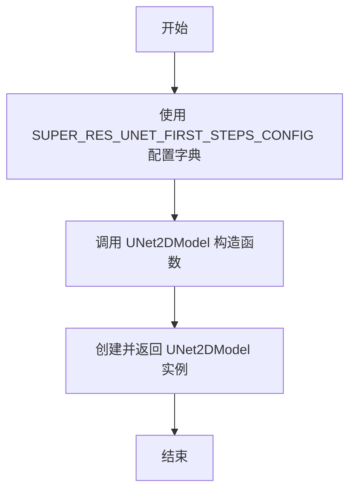

#### 带注释源码

```python
# 超级分辨率UNet第一步的模型配置字典
# 定义了模型的结构参数：样本大小、每块层数、下采样/上采样块类型、块输出通道数、输入输出通道数等
SUPER_RES_UNET_FIRST_STEPS_CONFIG = {
    "sample_size": 256,                      # 输入图像的样本大小
    "layers_per_block": 3,                   # 每个块中的层数
    "down_block_types": (                    # 下采样块的类型元组
        "ResnetDownsampleBlock2D",
        "ResnetDownsampleBlock2D",
        "ResnetDownsampleBlock2D",
        "ResnetDownsampleBlock2D",
    ),
    "up_block_types": (                      # 上采样块的类型元组
        "ResnetUpsampleBlock2D",
        "ResnetUpsampleBlock2D",
        "ResnetUpsampleBlock2D",
        "ResnetUpsampleBlock2D",
    ),
    "block_out_channels": (320, 640, 960, 1280),  # 各块的输出通道数
    "in_channels": 6,                        # 输入通道数（4通道潜变量 + 2通道图像）
    "out_channels": 3,                       # 输出通道数（RGB图像）
    "add_attention": False,                  # 是否添加注意力机制
}

def super_res_unet_first_steps_model_from_original_config():
    """
    根据预定义的配置创建超级分辨率UNet模型（第一步）
    
    该函数是Kakao Brain unCLIP模型转换脚本的一部分，
    用于创建超分辨率pipeline的第一个UNet模型实例。
    
    Returns:
        UNet2DModel: 配置好的UNet2DModel模型对象
    """
    # 使用配置字典实例化UNet2DModel
    model = UNet2DModel(**SUPER_RES_UNET_FIRST_STEPS_CONFIG)

    # 返回创建的模型实例
    return model
```


### `super_res_unet_first_steps_original_checkpoint_to_diffusers_checkpoint`

该函数是超分辨率U-Net（第一阶段模型）权重转换的核心逻辑，负责将卡卡奥大脑（Kakao Brain）原始检checkpoint中的权重键名和结构映射到Hugging Face Diffusers库所要求的 `UNet2DModel` 格式。

参数：

- `model`：`UNet2DModel`，Diffusers侧预初始化的模型实例，提供了模型结构信息（如层数、通道数）用于指导转换。
- `checkpoint`：`Dict[str, Tensor]`，原始Kakao Brain模型的完整状态字典（state_dict），键名通常带有 `model_first_steps` 前缀。

返回值：`Dict[str, Tensor]`，转换后的Diffusers兼容权重字典，键名对应 `UNet2DModel` 的结构（如 `time_embedding.linear_1.weight` 等）。

#### 流程图

```mermaid
flowchart TD
    A[开始转换] --> B[定义前缀: 'model_first_steps']
    B --> C[调用 unet_time_embeddings 转换时间嵌入]
    C --> D[调用 unet_conv_in 转换输入卷积]
    D --> E{遍历 model.down_blocks"}
    E -->|每次迭代| F[调用 unet_downblock_to_diffusers_checkpoint]
    F --> G[更新 diffusers_checkpoint]
    E --> H{遍历结束}
    H --> I[调用 unet_midblock_to_diffusers_checkpoint 转换中间块]
    I --> J{遍历 model.up_blocks"}
    J -->|每次迭代| K[调用 unet_upblock_to_diffusers_checkpoint]
    K --> L[更新 diffusers_checkpoint]
    J --> M{遍历结束}
    M --> N[调用 unet_conv_norm_out 转换输出归一化]
    N --> O[调用 unet_conv_out 转换输出卷积]
    O --> P[返回 diffusers_checkpoint]
```

#### 带注释源码

```python
def super_res_unet_first_steps_original_checkpoint_to_diffusers_checkpoint(model, checkpoint):
    """
    将原始的超分辨率U-Net（第一阶段）检查点转换为Diffusers格式。

    参数:
        model (UNet2DModel): 目标Diffusers模型对象。
        checkpoint (dict): 原始检查点字典。

    返回:
        dict: 转换后的Diffusers检查点字典。
    """
    diffusers_checkpoint = {}

    # 定义原始模型中使用的特定前缀
    original_unet_prefix = SUPER_RES_UNET_FIRST_STEPS_PREFIX

    # 1. 转换时间嵌入层 (time_embed -> time_embedding)
    diffusers_checkpoint.update(unet_time_embeddings(checkpoint, original_unet_prefix))
    
    # 2. 转换输入卷积层 (input_blocks.0 -> conv_in)
    diffusers_checkpoint.update(unet_conv_in(checkpoint, original_unet_prefix))

    # 3. 转换下采样块 (input_blocks -> down_blocks)
    original_down_block_idx = 1

    for diffusers_down_block_idx in range(len(model.down_blocks)):
        # 逐个处理下采样块及其内部的ResNet和注意力机制
        checkpoint_update, num_original_down_blocks = unet_downblock_to_diffusers_checkpoint(
            model,
            checkpoint,
            diffusers_down_block_idx=diffusers_down_block_idx,
            original_down_block_idx=original_down_block_idx,
            original_unet_prefix=original_unet_prefix,
            num_head_channels=None, # 该模型通常不使用多头注意力维度
        )

        original_down_block_idx += num_original_down_blocks
        diffusers_checkpoint.update(checkpoint_update)

    # 4. 转换中间块 (middle_block -> mid_block)
    diffusers_checkpoint.update(
        unet_midblock_to_diffusers_checkpoint(
            model,
            checkpoint,
            original_unet_prefix=original_unet_prefix,
            num_head_channels=None,
        )
    )

    # 5. 转换上采样块 (output_blocks -> up_blocks)
    original_up_block_idx = 0

    for diffusers_up_block_idx in range(len(model.up_blocks)):
        checkpoint_update, num_original_up_blocks = unet_upblock_to_diffusers_checkpoint(
            model,
            checkpoint,
            diffusers_up_block_idx=diffusers_up_block_idx,
            original_up_block_idx=original_up_block_idx,
            original_unet_prefix=original_unet_prefix,
            num_head_channels=None,
        )

        original_up_block_idx += num_original_up_blocks
        diffusers_checkpoint.update(checkpoint_update)

    # 6. 转换输出归一化卷积 (out.0 -> conv_norm_out)
    diffusers_checkpoint.update(unet_conv_norm_out(checkpoint, original_unet_prefix))
    
    # 7. 转换输出卷积 (out.2 -> conv_out)
    diffusers_checkpoint.update(unet_conv_out(checkpoint, original_unet_prefix))

    return diffusers_checkpoint
```


### `super_res_unet_last_step_model_from_original_config`

该函数用于根据预定义的 `SUPER_RES_UNET_LAST_STEP_CONFIG` 配置创建一个 `UNet2DModel` 超分辨率模型实例，主要用于 Kakao Brain unCLIP 模型转换过程中的最后一步超分辨率网络。

#### 参数

无

#### 返回值

- `model`：`UNet2DModel`，返回根据配置创建的 UNet2D 超分辨率模型实例

#### 流程图

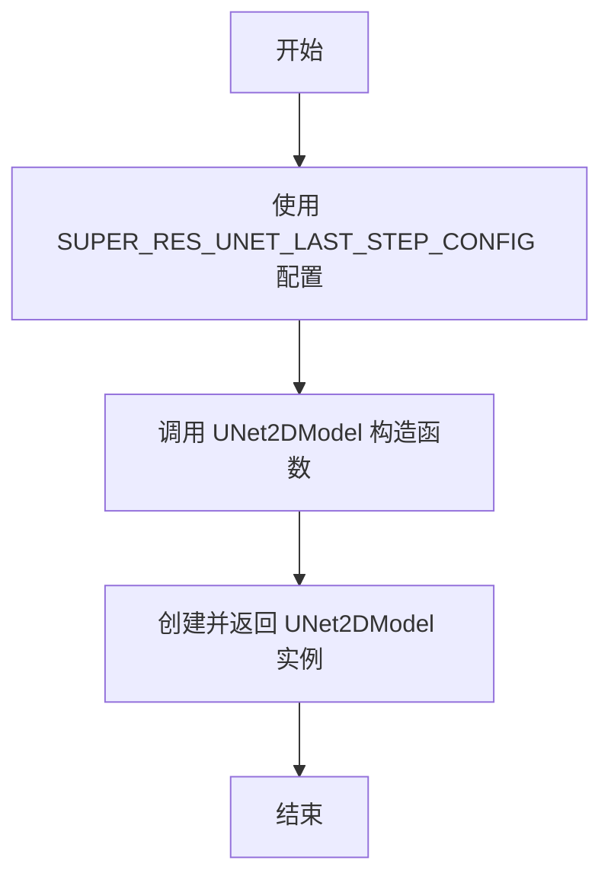

#### 带注释源码

```python
def super_res_unet_last_step_model_from_original_config():
    """
    根据预定义配置创建超分辨率UNet2D模型（最后一步）
    
    使用 SUPER_RES_UNET_LAST_STEP_CONFIG 字典中的参数来实例化模型：
    - sample_size: 256
    - layers_per_block: 3
    - down_block_types: 4个ResnetDownsampleBlock2D
    - up_block_types: 4个ResnetUpsampleBlock2D
    - block_out_channels: (320, 640, 960, 1280)
    - in_channels: 6
    - out_channels: 3
    - add_attention: False
    """
    model = UNet2DModel(**SUPER_RES_UNET_LAST_STEP_CONFIG)

    return model
```

#### 相关配置信息

| 配置名称 | 类型 | 描述 |
|---------|------|------|
| `SUPER_RES_UNET_LAST_STEP_PREFIX` | str | 模型前缀标识："model_last_step" |
| `SUPER_RES_UNET_LAST_STEP_CONFIG` | dict | 超分辨率UNet模型配置字典 |

#### 技术债务与优化空间

1. **硬编码配置**：配置参数直接硬编码在代码中，缺乏灵活性
2. **重复代码**：该函数与 `super_res_unet_first_steps_model_from_original_config` 几乎完全相同，仅配置名称不同，可考虑抽象为通用工厂函数
3. **缺乏验证**：未对配置参数进行有效性检查

#### 其它说明

- **设计目标**：将 Kakao Brain unCLIP 模型的超分辨率部分转换为 diffusers 格式
- **调用关系**：该函数被 `super_res_unet` 函数调用，用于创建最后的超分辨率模型
- **配置差异**：与 first_steps 模型使用相同的配置结构，反映了 unCLIP 架构中两步超分辨率的相似性


### `super_res_unet_last_step_original_checkpoint_to_diffusers_checkpoint`

该函数用于将 Kakao Brain 原始的超分辨率 UNet 最后一步模型的检查点转换为 Diffusers 格式。通过映射原始模型的时间嵌入、输入块、下采样块、中间块、上采样块、输出归一化和卷积层等组件的参数，实现从原始检查点格式到 Diffusers 检查点格式的转换。

参数：

- `model`：`UNet2DModel`，用于获取模型结构信息（如 down_blocks、up_blocks 的数量和结构）
- `checkpoint`：字典，原始 Kakao Brain 超分辨率 UNet 最后一步模型的检查点数据，键为参数名称，值为参数张量

返回值：`dict`，转换后的 Diffusers 格式检查点字典，键为 Diffusers 风格的参数名称，值为转换后的参数张量

#### 流程图

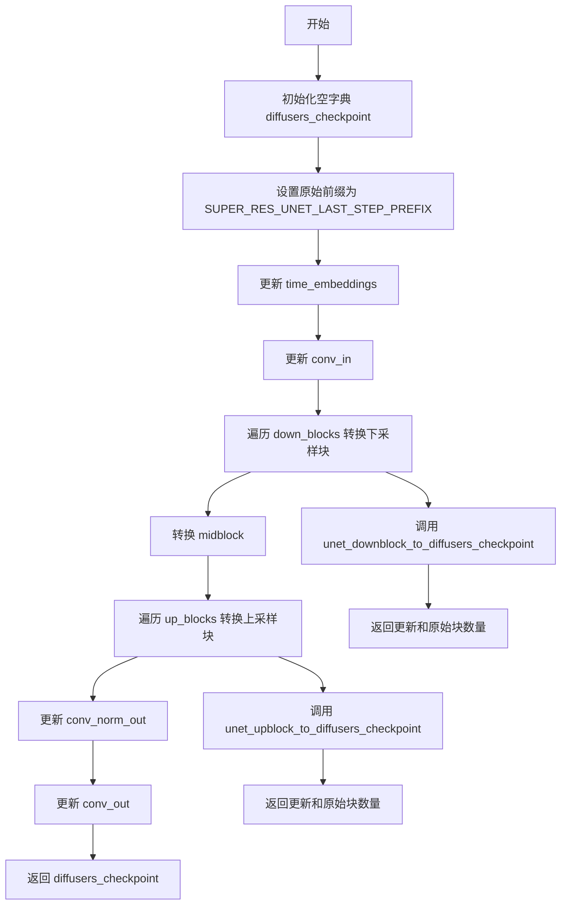

#### 带注释源码

```python
def super_res_unet_last_step_original_checkpoint_to_diffusers_checkpoint(model, checkpoint):
    """
    将 Kakao Brain 原始超分辨率 UNet 最后一步模型的检查点转换为 Diffusers 格式
    
    参数:
        model: UNet2DModel 实例，用于获取模型结构信息
        checkpoint: 原始模型检查点字典
    
    返回:
        转换后的 Diffusers 格式检查点字典
    """
    # 初始化空字典用于存储转换后的检查点
    diffusers_checkpoint = {}

    # 使用预定义的前缀标识原始模型结构
    original_unet_prefix = SUPER_RES_UNET_LAST_STEP_PREFIX

    # 转换时间嵌入层: <original>.time_embed -> <diffusers>.time_embedding
    diffusers_checkpoint.update(unet_time_embeddings(checkpoint, original_unet_prefix))
    
    # 转换输入卷积层: <original>.input_blocks.0 -> <diffusers>.conv_in
    diffusers_checkpoint.update(unet_conv_in(checkpoint, original_unet_prefix))

    # ============ 处理下采样块 (down_blocks) ============
    # 原始模型的 input_blocks 索引从 1 开始
    original_down_block_idx = 1

    # 遍历 Diffusers 模型的所有下采样块
    for diffusers_down_block_idx in range(len(model.down_blocks)):
        # 调用工具函数转换单个下采样块
        checkpoint_update, num_original_down_blocks = unet_downblock_to_diffusers_checkpoint(
            model,
            checkpoint,
            diffusers_down_block_idx=diffusers_down_block_idx,
            original_down_block_idx=original_down_block_idx,
            original_unet_prefix=original_unet_prefix,
            num_head_channels=None,  # 超分辨率模型不使用多头注意力
        )

        # 更新原始索引位置
        original_down_block_idx += num_original_down_blocks

        # 合并转换后的检查点
        diffusers_checkpoint.update(checkpoint_update)

    # ============ 处理中间块 (mid_block) ============
    diffusers_checkpoint.update(
        unet_midblock_to_diffusers_checkpoint(
            model,
            checkpoint,
            original_unet_prefix=original_unet_prefix,
            num_head_channels=None,
        )
    )

    # ============ 处理上采样块 (up_blocks) ============
    # 原始模型的 output_blocks 索引从 0 开始
    original_up_block_idx = 0

    # 遍历 Diffusers 模型的所有上采样块
    for diffusers_up_block_idx in range(len(model.up_blocks)):
        # 调用工具函数转换单个上采样块
        checkpoint_update, num_original_up_blocks = unet_upblock_to_diffusers_checkpoint(
            model,
            checkpoint,
            diffusers_up_block_idx=diffusers_up_block_idx,
            original_up_block_idx=original_up_block_idx,
            original_unet_prefix=original_unet_prefix,
            num_head_channels=None,
        )

        # 更新原始索引位置
        original_up_block_idx += num_original_up_blocks

        # 合并转换后的检查点
        diffusers_checkpoint.update(checkpoint_update)

    # ============ 处理输出层 ============
    # 转换输出归一化: <original>.out.0 -> <diffusers>.conv_norm_out
    diffusers_checkpoint.update(unet_conv_norm_out(checkpoint, original_unet_prefix))
    
    # 转换输出卷积: <original>.out.2 -> <diffusers>.conv_out
    diffusers_checkpoint.update(unet_conv_out(checkpoint, original_unet_prefix))

    # 返回转换完成的检查点
    return diffusers_checkpoint
```


### `unet_time_embeddings`

该函数用于将原始 Kakao Brain UNet 模型的时间嵌入（time_embed）层参数转换为 Diffusers 格式的时间嵌入（time_embedding）层参数。它提取原始检查点中 `time_embed.0` 和 `time_embed.2` 对应的权重和偏置，并映射到 Diffusers 模型的 `time_embedding.linear_1` 和 `time_embedding.linear_2` 中。

参数：

- `checkpoint`：`dict`，原始模型的检查点字典，包含以键（如 `{prefix}.time_embed.0.weight`）存储的模型权重
- `original_unet_prefix`：`str`，原始 UNet 模型在检查点中的前缀（如 `"model"` 或 `"model_first_steps"`）

返回值：`dict`，转换后的 Diffusers 格式检查点，包含 `time_embedding.linear_1.weight`、`time_embedding.linear_1.bias`、`time_embedding.linear_2.weight`、`time_embedding.linear_2.bias` 四个键值对

#### 流程图

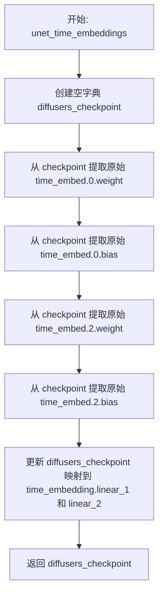

#### 带注释源码

```python
# <original>.time_embed -> <diffusers>.time_embedding
def unet_time_embeddings(checkpoint, original_unet_prefix):
    """
    将原始 UNet 模型的时间嵌入层参数转换为 Diffusers 格式
    
    参数:
        checkpoint: 原始模型的检查点字典
        original_unet_prefix: 原始 UNet 在检查点中的前缀
    返回:
        包含转换后时间嵌入参数的字典
    """
    # 初始化空字典用于存储转换后的参数
    diffusers_checkpoint = {}

    # 将原始模型的 time_embed.0 映射到 Diffusers 的 time_embedding.linear_1
    # 将原始模型的 time_embed.2 映射到 Diffusers 的 time_embedding.linear_2
    # 原始模型使用两层全连接网络作为时间嵌入: time_embed.0 (linear) -> SiLU -> time_embed.2 (linear)
    # Diffusers 同样采用类似的结构: time_embedding.linear_1 -> SiLU -> time_embedding.linear_2
    diffusers_checkpoint.update(
        {
            # 原始 time_embed.0 的权重和偏置对应 Diffusers 的 linear_1
            "time_embedding.linear_1.weight": checkpoint[f"{original_unet_prefix}.time_embed.0.weight"],
            "time_embedding.linear_1.bias": checkpoint[f"{original_unet_prefix}.time_embed.0.bias"],
            # 原始 time_embed.2 的权重和偏置对应 Diffusers 的 linear_2
            "time_embedding.linear_2.weight": checkpoint[f"{original_unet_prefix}.time_embed.2.weight"],
            "time_embedding.linear_2.bias": checkpoint[f"{original_unet_prefix}.time_embed.2.bias"],
        }
    )

    return diffusers_checkpoint
```


### `unet_conv_in`

将原始UNet模型的输入块（input_blocks.0）中的卷积层参数转换为Diffusers格式的conv_in层参数。

参数：

- `checkpoint`：`dict`，原始模型检查点的字典，包含键如 `{original_unet_prefix}.input_blocks.0.0.weight` 和 `{original_unet_prefix}.input_blocks.0.0.bias`
- `original_unet_prefix`：`str`，原始UNet模型在检查点中的前缀，用于构建完整的键名

返回值：`dict`，包含转换后的Diffusers格式检查点，键为 `"conv_in.weight"` 和 `"conv_in.bias"`，值为从原始检查点中提取的张量

#### 流程图

```mermaid
flowchart TD
    A[开始] --> B[初始化空字典 diffusers_checkpoint]
    B --> C[构建权重键名: {original_unet_prefix}.input_builds.0.0.weight]
    C --> D[构建偏置键名: {original_unet_prefix}.input_builds.0.0.bias]
    D --> E[从checkpoint提取conv_in.weight]
    E --> F[从checkpoint提取conv_in.bias]
    F --> G[更新diffusers_checkpoint字典]
    G --> H[返回diffusers_checkpoint]
```

#### 带注释源码

```
# <original>.input_blocks.0 -> <diffusers>.conv_in
def unet_conv_in(checkpoint, original_unet_prefix):
    """
    将原始UNet模型的输入卷积层参数转换为Diffusers格式。
    
    原始模型结构: input_blocks.0 (对应Diffusers的conv_in)
    转换后: conv_in (UNet的输入卷积层)
    
    参数:
        checkpoint: 原始模型检查点字典
        original_unet_prefix: 原始UNet在检查点中的前缀
    """
    # 初始化用于存储转换后参数的字典
    diffusers_checkpoint = {}

    # 从原始检查点中提取输入卷积层的权重和偏置
    # 原始格式: {prefix}.input_blocks.0.0.weight / bias
    # 目标格式: conv_in.weight / bias
    diffusers_checkpoint.update(
        {
            "conv_in.weight": checkpoint[f"{original_unet_prefix}.input_blocks.0.0.weight"],
            "conv_in.bias": checkpoint[f"{original_unet_prefix}.input_blocks.0.0.bias"],
        }
    )

    # 返回转换后的检查点字典，可用于加载到Diffusers的UNet模型
    return diffusers_checkpoint
```


### `unet_conv_norm_out`

该函数是模型权重转换工具链中的核心组件之一，专门负责将原始 UNet（常见于 Kakao Brain 等框架）输出层的归一化（Norm）操作对应的权重和偏置从原始检查点格式映射到 Diffusers 框架的标准格式。它通过动态构建键名（Key），从原始状态字典中提取 `out.0` 层的参数，并将其重命名为 `conv_norm_out`，以适配 Diffusers 的 UNet 架构。

#### 参数

- `checkpoint`：`Dict[str, torch.Tensor]`，包含原始模型权重和偏置的状态字典（State Dictionary）。
- `original_unet_prefix`：`str`，用于在原始检查点中定位层级的前缀字符串（例如 "model" 或 "model_first_steps"）。

#### 返回值

`Dict[str, torch.Tensor]`，返回一个新构建的字典，其中包含了被重新命名后的归一化层权重（`conv_norm_out.weight` 和 `conv_norm_out.bias`），可以直接用于加载到 Diffusers 的 UNet 模型中。

#### 流程图

```mermaid
flowchart TD
    A([开始: unet_conv_norm_out]) --> B[输入: checkpoint, original_unet_prefix]
    B --> C[初始化空字典 diffusers_checkpoint]
    C --> D[构建原始权重键名: {original_unet_prefix}.out.0.weight]
    D --> E[构建原始偏置键名: {original_unet_prefix}.out.0.bias]
    E --> F[提取原始权重: checkpoint[key_weight]]
    E --> G[提取原始偏置: checkpoint[key_bias]]
    F --> H[构建Diffusers键名: conv_norm_out.weight]
    G --> I[构建Diffusers键名: conv_norm_out.bias]
    H --> J[更新字典: diffusers_checkpoint[key] = value]
    I --> J
    J --> K([返回: diffusers_checkpoint])
```

#### 带注释源码

```python
def unet_conv_norm_out(checkpoint, original_unet_prefix):
    """
    将原始 UNet 输出块的第一个子模块（归一化层）的权重转换为 Diffusers 格式。

    参数:
        checkpoint: 原始模型的状态字典。
        original_unet_prefix: 原始模型键的前缀。

    返回:
        包含转换后权重的字典。
    """
    diffusers_checkpoint = {}

    # 从原始检查点中提取输出层（out.0）的权重
    # 原始格式通常为: model.out.0.weight -> Diffusers格式: conv_norm_out.weight
    diffusers_checkpoint.update(
        {
            "conv_norm_out.weight": checkpoint[f"{original_unet_prefix}.out.0.weight"],
            "conv_norm_out.bias": checkpoint[f"{original_unet_prefix}.out.0.bias"],
        }
    )

    return diffusers_checkpoint
```


### `unet_conv_out`

该函数用于将原始UNet检查点中的输出卷积层（`out.2`）的参数映射并转换为Diffusers格式的检查点，提取权重和偏置并更新到目标检查点字典中。

参数：

- `checkpoint`：`Dict`，原始检查点数据的字典，包含以`{original_unet_prefix}.out.2.weight`和`{original_unet_prefix}.out.2.bias`为键的参数
- `original_unet_prefix`：`str`，原始UNet模型在检查点中的前缀标识，用于构建参数键名

返回值：`Dict`，包含转换后的Diffusers格式检查点，键为`conv_out.weight`和`conv_out.bias`，分别对应原始的`{original_unet_prefix}.out.2.weight`和`{original_unet_prefix}.out.2.bias`

#### 流程图

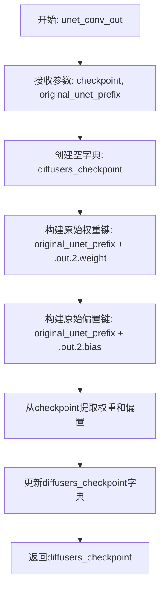

#### 带注释源码

```
# 将原始UNet模型的输出卷积层参数转换为Diffusers格式
# <original>.out.2 -> <diffusers>.conv_out
def unet_conv_out(checkpoint, original_unet_prefix):
    # 初始化目标检查点字典
    diffusers_checkpoint = {}

    # 从原始检查点中提取输出卷积层的权重和偏置
    # 原始键格式: {prefix}.out.2.weight / {prefix}.out.2.bias
    # 目标键格式: conv_out.weight / conv_out.bias
    diffusers_checkpoint.update(
        {
            "conv_out.weight": checkpoint[f"{original_unet_prefix}.out.2.weight"],
            "conv_out.bias": checkpoint[f"{original_unet_prefix}.out.2.bias"],
        }
    )

    # 返回转换后的检查点字典
    return diffusers_checkpoint
```


### `unet_downblock_to_diffusers_checkpoint`

将原始UNet模型的down block参数转换为diffusers格式的检查点，处理resnet块、下采样块和注意力块的参数映射。

参数：

- `model`：`UNet2DConditionModel` 或 `UNet2DModel`，Diffusers格式的UNet模型对象
- `checkpoint`：Dict[str, Tensor]，原始模型的检查点字典，包含原始格式的参数
- `diffusers_down_block_idx`：`int`，Diffusers格式的down block索引，用于构建目标参数前缀
- `original_down_block_idx`：`int`，原始格式的down block起始索引，用于遍历原始参数
- `original_unet_prefix`：`str`，原始UNet模型的前缀（如"model"），用于构建原始参数键
- `num_head_channels`：`int` 或 `None`，注意力头的通道数，用于分割QKV权重

返回值：`(Dict[str, Tensor], int)`，元组包含转换后的diffusers格式检查点字典和处理的原始down block数量

#### 流程图

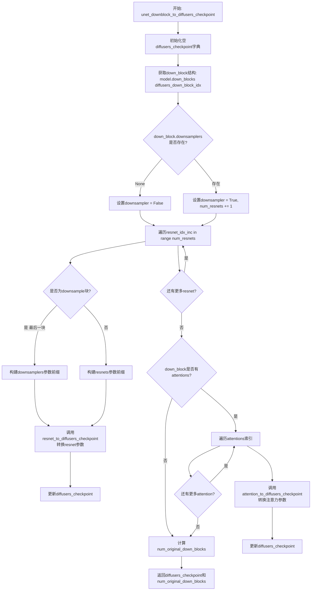

#### 带注释源码

```python
# <original>.input_blocks -> <diffusers>.down_blocks
def unet_downblock_to_diffusers_checkpoint(
    model, checkpoint, *, diffusers_down_block_idx, original_down_block_idx, original_unet_prefix, num_head_channels
):
    """
    将原始UNet模型的down block参数转换为diffusers格式
    
    参数:
        model: Diffusers UNet模型对象
        checkpoint: 原始模型检查点字典
        diffusers_down_block_idx: 目标down block索引
        original_down_block_idx: 原始down block起始索引
        original_unet_prefix: 原始模型前缀
        num_head_channels: 注意力头通道数
    """
    diffusers_checkpoint = {}

    # 构建diffusers和原始格式的参数前缀
    diffusers_resnet_prefix = f"down_blocks.{diffusers_down_block_idx}.resnets"
    original_down_block_prefix = f"{original_unet_prefix}.input_blocks"

    # 获取当前down block结构
    down_block = model.down_blocks[diffusers_down_block_idx]

    # 获取resnet数量
    num_resnets = len(down_block.resnets)

    # 检查是否存在downsample层
    if down_block.downsamplers is None:
        downsampler = False
    else:
        # 断言只有一个downsampler
        assert len(down_block.downsamplers) == 1
        downsampler = True
        # downsampler也算一个resnet，所以数量+1
        num_resnets += 1

    # 遍历每个resnet块进行转换
    for resnet_idx_inc in range(num_resnets):
        # 构建原始resnet的完整前缀
        full_resnet_prefix = f"{original_down_block_prefix}.{original_down_block_idx + resnet_idx_inc}.0"

        if downsampler and resnet_idx_inc == num_resnets - 1:
            # 如果是downsampler块，构建对应的diffusers前缀
            full_diffusers_resnet_prefix = f"down_blocks.{diffusers_down_block_idx}.downsamplers.0"
        else:
            # 普通resnet块的前缀
            full_diffusers_resnet_prefix = f"{diffusers_resnet_prefix}.{resnet_idx_inc}"

        # 调用resnet转换函数更新检查点
        diffusers_checkpoint.update(
            resnet_to_diffusers_checkpoint(
                checkpoint, resnet_prefix=full_resnet_prefix, diffusers_resnet_prefix=full_diffusers_resnet_prefix
            )
        )

    # 处理注意力机制（如果存在）
    if hasattr(down_block, "attentions"):
        num_attentions = len(down_block.attentions)
        diffusers_attention_prefix = f"down_blocks.{diffusers_down_block_idx}.attentions"

        for attention_idx_inc in range(num_attentions):
            # 构建注意力层的原始和目标前缀
            full_attention_prefix = f"{original_down_block_prefix}.{original_down_block_idx + attention_idx_inc}.1"
            full_diffusers_attention_prefix = f"{diffusers_attention_prefix}.{attention_idx_inc}"

            # 调用注意力转换函数
            diffusers_checkpoint.update(
                attention_to_diffusers_checkpoint(
                    checkpoint,
                    attention_prefix=full_attention_prefix,
                    diffusers_attention_prefix=full_diffusers_attention_prefix,
                    num_head_channels=num_head_channels,
                )
            )

    # 计算处理的原始down block数量
    num_original_down_blocks = num_resnets

    # 返回转换后的检查点和处理的数量
    return diffusers_checkpoint, num_original_down_blocks
```


### `unet_midblock_to_diffusers_checkpoint`

该函数负责将原始UNet中间块（middle block）的检查点参数映射并转换为Diffusers格式的检查点，主要处理中间块的ResNet块和可选的注意力块。

参数：

- `model`：`UNet2DConditionModel`或`UNet2DModel`，目标Diffusers模型实例
- `checkpoint`：字典，原始格式的模型检查点，键为参数名称，值为参数张量
- `original_unet_prefix`：字符串，原始检查点中UNet的前缀（如"model"）
- `num_head_channels`：整数或None，注意力头的通道数，用于分割QKV权重

返回值：`dict`，转换后的Diffusers格式检查点字典，包含中间块的参数映射

#### 流程图

```mermaid
flowchart TD
    A[开始: unet_midblock_to_diffusers_checkpoint] --> B[初始化空diffusers_checkpoint]
    B --> C[设置original_block_idx = 0]
    C --> D[调用resnet_to_diffusers_checkpoint<br/>转换mid_block.resnets.0]
    D --> E[original_block_idx += 1]
    E --> F{检查mid_block.attentions是否存在<br/>且attentions[0]不为None}
    F -->|是| G[调用attention_to_diffusers_checkpoint<br/>转换mid_block.attentions.0]
    G --> H[original_block_idx += 1]
    H --> I[调用resnet_to_diffusers_checkpoint<br/>转换mid_block.resnets.1]
    F -->|否| I
    I --> J[返回diffusers_checkpoint]
```

#### 带注释源码

```python
# <original>.middle_block -> <diffusers>.mid_block
def unet_midblock_to_diffusers_checkpoint(model, checkpoint, *, original_unet_prefix, num_head_channels):
    """
    将原始UNet中间块的检查点转换为Diffusers格式
    
    参数:
        model: Diffusers的UNet模型实例
        checkpoint: 原始格式的模型检查点字典
        original_unet_prefix: 原始检查点中UNet的前缀
        num_head_channels: 注意力头的通道数
    
    返回:
        转换后的Diffusers格式检查点字典
    """
    diffusers_checkpoint = {}

    # 块0：转换第一个ResNet块
    # 对应原始结构: <prefix>.middle_block.0 -> <diffusers>.mid_block.resnets.0
    
    original_block_idx = 0

    diffusers_checkpoint.update(
        resnet_to_diffusers_checkpoint(
            checkpoint,
            diffusers_resnet_prefix="mid_block.resnets.0",
            resnet_prefix=f"{original_unet_prefix}.middle_block.{original_block_idx}",
        )
    )

    original_block_idx += 1

    # 可选块1：如果存在注意力层，转换注意力块
    # 对应原始结构: <prefix>.middle_block.1 -> <diffusers>.mid_block.attentions.0
    
    if hasattr(model.mid_block, "attentions") and model.mid_block.attentions[0] is not None:
        diffusers_checkpoint.update(
            attention_to_diffusers_checkpoint(
                checkpoint,
                diffusers_attention_prefix="mid_block.attentions.0",
                attention_prefix=f"{original_unet_prefix}.middle_block.{original_block_idx}",
                num_head_channels=num_head_channels,
            )
        )
        original_block_idx += 1

    # 块1或块2：转换最后一个ResNet块
    # 对应原始结构: <prefix>.middle_block.{1或2} -> <diffusers>.mid_block.resnets.1
    
    diffusers_checkpoint.update(
        resnet_to_diffusers_checkpoint(
            checkpoint,
            diffusers_resnet_prefix="mid_block.resnets.1",
            resnet_prefix=f"{original_unet_prefix}.middle_block.{original_block_idx}",
        )
    )

    return diffusers_checkpoint
```


### `unet_upblock_to_diffusers_checkpoint`

该函数用于将原始 UNet 模型的输出块（output_blocks）检查点转换为 Diffusers 格式的检查点。它处理上采样块中的 ResNet 块和注意力机制，并将转换后的权重映射添加到 diffusers 检查点字典中。

参数：

- `model`：`UNet2DConditionModel` 或 `UNet2DModel`，Diffusers 模型实例
- `checkpoint`：`Dict`，原始模型的检查点字典
- `diffusers_up_block_idx`：`int`，Diffusers 模型中上块（up block）的索引
- `original_up_block_idx`：`int`，原始模型中输出块的起始索引
- `original_unet_prefix`：`str`，原始 UNet 在检查点中的前缀
- `num_head_channels`：`int` 或 `None`，注意力机制的头通道数

返回值：`Tuple[Dict, int]`，返回包含转换后检查点更新的字典以及处理过的原始块数量

#### 流程图

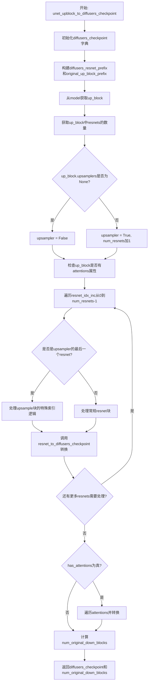

#### 带注释源码

```python
# <original>.output_blocks -> <diffusers>.up_blocks
def unet_upblock_to_diffusers_checkpoint(
    model, checkpoint, *, diffusers_up_block_idx, original_up_block_idx, original_unet_prefix, num_head_channels
):
    """
    将原始UNet模型的输出块检查点转换为Diffusers格式的上块检查点
    
    参数:
        model: Diffusers的UNet2DConditionModel或UNet2DModel实例
        checkpoint: 原始模型的检查点字典
        diffusers_up_block_idx: Diffusers模型中上块的索引
        original_up_block_idx: 原始模型中输出块的起始索引
        original_unet_prefix: 原始UNet在检查点中的前缀
        num_head_channels: 注意力机制的头通道数
    
    返回:
        (dict, int): 转换后的检查点字典和处理的原始块数量
    """
    diffusers_checkpoint = {}

    # 构建Diffusers格式的resnet前缀，如 "up_blocks.0.resnets"
    diffusers_resnet_prefix = f"up_blocks.{diffusers_up_block_idx}.resnets"
    # 构建原始模型的前缀，如 "model.output_blocks"
    original_up_block_prefix = f"{original_unet_prefix}.output_blocks"

    # 从模型中获取对应索引的上块
    up_block = model.up_blocks[diffusers_up_block_idx]

    # 获取该上块中resnet块的数量
    num_resnets = len(up_block.resnets)

    # 检查是否存在上采样器
    if up_block.upsamplers is None:
        upsampler = False
    else:
        assert len(up_block.upsamplers) == 1
        upsampler = True
        # 上采样块也算一个resnet，所以数量加1
        num_resnets += 1

    # 检查上块是否有注意力机制
    has_attentions = hasattr(up_block, "attentions")

    # 遍历每个resnet块进行转换
    for resnet_idx_inc in range(num_resnets):
        if upsampler and resnet_idx_inc == num_resnets - 1:
            # 这是上采样块的情况
            if has_attentions:
                # 存在中间注意力块需要跳过
                original_resnet_block_idx = 2
            else:
                original_resnet_block_idx = 1

            # 减1是因为最后两个resnet绑定在同一个输出块中
            full_resnet_prefix = (
                f"{original_up_block_prefix}.{original_up_block_idx + resnet_idx_inc - 1}.{original_resnet_block_idx}"
            )

            # Diffusers格式的上采样器前缀
            full_diffusers_resnet_prefix = f"up_blocks.{diffusers_up_block_idx}.upsamplers.0"
        else:
            # 常规resnet块
            full_resnet_prefix = f"{original_up_block_prefix}.{original_up_block_idx + resnet_idx_inc}.0"
            full_diffusers_resnet_prefix = f"{diffusers_resnet_prefix}.{resnet_idx_inc}"

        # 调用resnet转换函数更新检查点
        diffusers_checkpoint.update(
            resnet_to_diffusers_checkpoint(
                checkpoint, resnet_prefix=full_resnet_prefix, diffusers_resnet_prefix=full_diffusers_resnet_prefix
            )
        )

    # 如果有注意力机制，处理注意力块
    if has_attentions:
        num_attentions = len(up_block.attentions)
        diffusers_attention_prefix = f"up_blocks.{diffusers_up_block_idx}.attentions"

        for attention_idx_inc in range(num_attentions):
            full_attention_prefix = f"{original_up_block_prefix}.{original_up_block_idx + attention_idx_inc}.1"
            full_diffusers_attention_prefix = f"{diffusers_attention_prefix}.{attention_idx_inc}"

            diffusers_checkpoint.update(
                attention_to_diffusers_checkpoint(
                    checkpoint,
                    attention_prefix=full_attention_prefix,
                    diffusers_attention_prefix=full_diffusers_attention_prefix,
                    num_head_channels=num_head_channels,
                )
            )

    # 计算处理过的原始下块数量
    num_original_down_blocks = num_resnets - 1 if upsampler else num_resnets

    return diffusers_checkpoint, num_original_down_blocks
```


### `resnet_to_diffusers_checkpoint`

该函数负责将原始 ResNet 检查点中的参数映射并转换为 Diffusers 格式的检查点参数，处理包括归一化层、卷积层、时间嵌入投影和跳跃连接等组件的参数名称转换。

参数：

- `checkpoint`：`Dict`，原始模型的检查点数据字典，包含以原始前缀命名的参数
- `diffusers_resnet_prefix`：`str`，Diffusers 格式中 ResNet 模块的前缀路径（如 `down_blocks.0.resnets.0`）
- `resnet_prefix`：`str`，原始检查点中 ResNet 模块的前缀路径（如 `model.input_blocks.1.0`）

返回值：`Dict`，转换后的 Diffusers 格式检查点字典，键名为转换后的参数路径，值为对应的张量数据

#### 流程图

```mermaid
flowchart TD
    A[开始] --> B[创建空字典 diffusers_checkpoint]
    B --> C[映射 norm1 参数]
    C --> D[映射 conv1 参数]
    D --> E[映射 time_emb_proj 参数]
    E --> F[映射 norm2 参数]
    F --> G[映射 conv2 参数]
    G --> H{检查 skip_connection 是否存在}
    H -->|是| I[映射 conv_shortcut 参数]
    H -->|否| J[跳过]
    I --> K[返回 diffusers_checkpoint]
    J --> K
```

#### 带注释源码

```python
def resnet_to_diffusers_checkpoint(checkpoint, *, diffusers_resnet_prefix, resnet_prefix):
    """
    将原始 ResNet 检查点转换为 Diffusers 格式的检查点
    
    参数:
        checkpoint: 原始模型的检查点字典
        diffusers_resnet_prefix: Diffusers 格式中 ResNet 模块的前缀
        resnet_prefix: 原始检查点中 ResNet 模块的前缀
    
    返回:
        转换后的 Diffusers 格式检查点字典
    """
    # 初始化转换后的检查点字典
    diffusers_checkpoint = {
        # 原始的 in_layers.0 对应 Diffusers 的 norm1（输入层归一化）
        f"{diffusers_resnet_prefix}.norm1.weight": checkpoint[f"{resnet_prefix}.in_layers.0.weight"],
        f"{diffusers_resnet_prefix}.norm1.bias": checkpoint[f"{resnet_prefix}.in_layers.0.bias"],
        
        # 原始的 in_layers.2 对应 Diffusers 的 conv1（输入卷积层）
        f"{diffusers_resnet_prefix}.conv1.weight": checkpoint[f"{resnet_prefix}.in_layers.2.weight"],
        f"{diffusers_resnet_prefix}.conv1.bias": checkpoint[f"{resnet_prefix}.in_layers.2.bias"],
        
        # 原始的 emb_layers.1 对应 Diffusers 的 time_emb_proj（时间嵌入投影）
        f"{diffusers_resnet_prefix}.time_emb_proj.weight": checkpoint[f"{resnet_prefix}.emb_layers.1.weight"],
        f"{diffusers_resnet_prefix}.time_emb_proj.bias": checkpoint[f"{resnet_prefix}.emb_layers.1.bias"],
        
        # 原始的 out_layers.0 对应 Diffusers 的 norm2（输出层归一化）
        f"{diffusers_resnet_prefix}.norm2.weight": checkpoint[f"{resnet_prefix}.out_layers.0.weight"],
        f"{diffusers_resnet_prefix}.norm2.bias": checkpoint[f"{resnet_prefix}.out_layers.0.bias"],
        
        # 原始的 out_layers.3 对应 Diffusers 的 conv2（输出卷积层）
        f"{diffusers_resnet_prefix}.conv2.weight": checkpoint[f"{resnet_prefix}.out_layers.3.weight"],
        f"{diffusers_resnet_prefix}.conv2.bias": checkpoint[f"{resnet_prefix}.out_layers.3.bias"],
    }

    # 检查是否存在跳跃连接（skip connection）参数
    skip_connection_prefix = f"{resnet_prefix}.skip_connection"

    if f"{skip_connection_prefix}.weight" in checkpoint:
        # 如果存在跳跃连接，映射到 conv_shortcut
        diffusers_checkpoint.update(
            {
                f"{diffusers_resnet_prefix}.conv_shortcut.weight": checkpoint[f"{skip_connection_prefix}.weight"],
                f"{diffusers_resnet_prefix}.conv_shortcut.bias": checkpoint[f"{skip_connection_prefix}.bias"],
            }
        )

    return diffusers_checkpoint
```


### `attention_to_diffusers_checkpoint`

该函数负责将原始 UNet 模型中的注意力机制（Attention）检查点参数转换为 Diffusers 格式。它通过重映射权重名称，将原始的 `norm`、`qkv`、`encoder_kv` 和 `proj_out` 层转换为 Diffusers 模型的 `group_norm`、`to_q/to_k/to_v`、`add_k_proj/add_v_proj` 和 `to_out.0` 层。

参数：

- `checkpoint`：`dict`，原始检查点字典，包含键如 `{attention_prefix}.norm.weight` 等
- `diffusers_attention_prefix`：`str`，Diffusers 模型中注意力模块的前缀路径（如 `"down_blocks.0.attentions.0"`）
- `attention_prefix`：`str`，原始模型中注意力模块的前缀路径（如 `"input_blocks.1.1"`）
- `num_head_channels`：`int` 或 `None`，每个注意力头的通道数，用于分割 QKV 张量

返回值：`dict`，转换后的 Diffusers 格式检查点字典，包含重新映射的权重和偏置

#### 流程图

```mermaid
flowchart TD
    A[开始 attention_to_diffusers_checkpoint] --> B[获取 group_norm 权重和偏置]
    B --> C[调用 split_attentions 分割 qkv 权重和偏置]
    C --> D[更新 to_q, to_k, to_v 的权重和偏置]
    D --> E[调用 split_attentions 分割 encoder_kv 权重和偏置]
    E --> F[更新 add_k_proj, add_v_proj 的权重和偏置]
    F --> G[获取 proj_out 权重和偏置转换为 to_out.0]
    G --> H[返回转换后的 diffusers_checkpoint]
```

#### 带注释源码

```python
def attention_to_diffusers_checkpoint(checkpoint, *, diffusers_attention_prefix, attention_prefix, num_head_channels):
    """
    将原始 UNet 模型的注意力机制检查点转换为 Diffusers 格式。
    
    参数:
        checkpoint: 原始检查点字典
        diffusers_attention_prefix: Diffusers 模型中注意力模块的前缀
        attention_prefix: 原始模型中注意力模块的前缀
        num_head_channels: 每个注意力头的通道数
    
    返回:
        转换后的 Diffusers 格式检查点字典
    """
    diffusers_checkpoint = {}

    # 步骤1: 将原始的 norm 层转换为 Diffusers 的 group_norm 层
    # <original>.norm -> <diffusers>.group_norm
    diffusers_checkpoint.update(
        {
            f"{diffusers_attention_prefix}.group_norm.weight": checkpoint[f"{attention_prefix}.norm.weight"],
            f"{diffusers_attention_prefix}.group_norm.bias": checkpoint[f"{attention_prefix}.norm.bias"],
        }
    )

    # 步骤2: 将原始的 qkv 权重分割为 query、key、value 三个部分
    # <original>.qkv -> <diffusers>.{query, key, value}
    # 使用 split_attentions 函数将联合的 qkv 张量按 attention_head_dim 分割
    [q_weight, k_weight, v_weight], [q_bias, k_bias, v_bias] = split_attentions(
        weight=checkpoint[f"{attention_prefix}.qkv.weight"][:, :, 0],  # 取出第一个维度
        bias=checkpoint[f"{attention_prefix}.qkv.bias"],
        split=3,  # 分割为 Q、K、V 三个部分
        chunk_size=num_head_channels,
    )

    # 步骤3: 更新 to_q、to_k、to_v 的权重和偏置
    diffusers_checkpoint.update(
        {
            f"{diffusers_attention_prefix}.to_q.weight": q_weight,
            f"{diffusers_attention_prefix}.to_q.bias": q_bias,
            f"{diffusers_attention_prefix}.to_k.weight": k_weight,
            f"{diffusers_attention_prefix}.to_k.bias": k_bias,
            f"{diffusers_attention_prefix}.to_v.weight": v_weight,
            f"{diffusers_attention_prefix}.to_v.bias": v_bias,
        }
    )

    # 步骤4: 将原始的 encoder_kv 权重分割为 context_key 和 context_value
    # <original>.encoder_kv -> <diffusers>.{context_key, context_value}
    # 这用于处理交叉注意力中的 encoder 隐藏状态
    [encoder_k_weight, encoder_v_weight], [encoder_k_bias, encoder_v_bias] = split_attentions(
        weight=checkpoint[f"{attention_prefix}.encoder_kv.weight"][:, :, 0],
        bias=checkpoint[f"{attention_prefix}.encoder_kv.bias"],
        split=2,  # 分割为 Key、Value 两个部分
        chunk_size=num_head_channels,
    )

    # 步骤5: 更新 add_k_proj 和 add_v_proj 的权重和偏置
    diffusers_checkpoint.update(
        {
            f"{diffusers_attention_prefix}.add_k_proj.weight": encoder_k_weight,
            f"{diffusers_attention_prefix}.add_k_proj.bias": encoder_k_bias,
            f"{diffusers_attention_prefix}.add_v_proj.weight": encoder_v_weight,
            f"{diffusers_attention_prefix}.add_v_proj.bias": encoder_v_bias,
        }
    )

    # 步骤6: 将原始的 proj_out（1D 卷积）转换为 Diffusers 的 proj_attn（线性层）
    # <original>.proj_out (1d conv) -> <diffusers>.proj_attn (linear)
    diffusers_checkpoint.update(
        {
            f"{diffusers_attention_prefix}.to_out.0.weight": checkpoint[f"{attention_prefix}.proj_out.weight"][
                :, :, 0
            ],
            f"{diffusers_attention_prefix}.to_out.0.bias": checkpoint[f"{attention_prefix}.proj_out.bias"],
        }
    )

    return diffusers_checkpoint
```


### `split_attentions`

该函数用于将权重（weight）和偏置（bias）矩阵按照指定的 `chunk_size` 大小循环分割成 `split` 个部分。主要用于将原始 Kakao Brain unCLIP 模型的 QKV（Query, Key, Value）注意力权重矩阵分割成三个独立的权重矩阵，以便转换为 diffusers 格式。

参数：

- `weight`：`torch.Tensor`，原始的组合权重矩阵（例如 QKV 权重），形状为 `[total_dim, hidden_dim]`
- `bias`：`torch.Tensor`，原始的组合偏置向量（例如 QKV 偏置），形状为 `[total_dim]`
- `split`：`int`，要分割成的部分数量（例如 3 表示 Q、K、V 三个部分）
- `chunk_size`：`int`，每个部分对应的行数（即 attention_head_dim）

返回值：`Tuple[List[torch.Tensor], List[torch.Tensor]]`，返回一个元组，包含两个列表：
  - 第一个是分割后的权重列表
  - 第二个是分割后的偏置列表

#### 流程图

```mermaid
flowchart TD
    A[开始: split_attentions] --> B[初始化空列表 weights 和 biases]
    B --> C[设置 weights_biases_idx = 0]
    C --> D{遍历行索引 i < weight.shape[0]?<br>步长为 chunk_size}
    
    D -->|是| E[计算当前块行索引 row_indices]
    E --> F[提取权重行 weight_rows 和偏置行 bias_rows]
    F --> G{检查 weights[weights_biases_idx] 是否为 None?}
    
    G -->|是| H[直接赋值 weights[weights_biases_idx] = weight_rows]
    G -->|否| I[使用 torch.concat 拼接已有行]
    
    H --> J[更新 biases[weights_biases_idx] = bias_rows]
    I --> K[更新 weights 和 biases 的拼接结果]
    
    J --> L[weights_biases_idx = (weights_biases_idx + 1) % split]
    K --> L
    
    L --> D
    
    D -->|否| M[返回 weights, biases 元组]
```

#### 带注释源码

```
def split_attentions(*, weight, weight, split, chunk_size):
    """
    将权重和偏置矩阵按 chunk_size 大小循环分割成 split 个部分。
    
    参数:
        weight: 原始组合权重矩阵，形状为 [total_dim, hidden_dim]
        bias: 原始组合偏置向量，形状为 [total_dim]
        split: 要分割成的部分数量（如 3 表示 QKV）
        chunk_size: 每个部分的行数（通常是 attention_head_dim）
    
    返回:
        (weights, biases): 分割后的权重和偏置列表
    """
    
    # 初始化用于存储分割结果的列表
    # 创建 split 个空元素，用于存放分割后的权重和偏置
    weights = [None] * split
    biases = [None] * split

    # 当前处理到的权重/偏置索引，循环递增
    weights_biases_idx = 0

    # 按 chunk_size 大小遍历权重矩阵的行
    # 每次处理 chunk_size 行，直到处理完所有行
    for starting_row_index in range(0, weight.shape[0], chunk_size):
        # 计算当前块的行索引范围 [starting_row_index, starting_row_index + chunk_size)
        row_indices = torch.arange(starting_row_index, starting_row_index + chunk_size)

        # 提取当前块对应的权重行和偏置行
        weight_rows = weight[row_indices, :]
        bias_rows = bias[row_indices]

        # 判断当前索引位置的权重是否已存在
        if weights[weights_biases_idx] is None:
            # 首次赋值，直接存入
            assert weights[weights_biases_idx] is None
            weights[weights_biases_idx] = weight_rows
            biases[weights_biases_idx] = bias_rows
        else:
            # 已有数据，需要拼接
            assert weights[weights_biases_idx] is not None
            # 使用 torch.concat 将新行拼接到已有权重/偏置后面
            weights[weights_biases_idx] = torch.concat([weights[weights_biases_idx], weight_rows])
            biases[weights_biases_idx] = torch.concat([biases[weights_biases_idx], bias_rows])

        # 循环递增索引，实现轮询分配到 split 个不同的组
        # 这样可以实现将连续的 chunk_size 行轮流分配到 Q、K、V
        weights_biases_idx = (weights_biases_idx + 1) % split

    # 返回分割后的权重和偏置列表
    return weights, biases
```


### `text_encoder`

该函数负责加载CLIP文本编码器（Text Encoder）和对应的分词器（Tokenizer），用于将文本输入转换为模型可处理的嵌入表示。它从HuggingFace Hub加载预训练的`openai/clip-vit-large-patch14`模型，并配置特殊的填充 token 以确保与原始模型的兼容性。

参数：无

返回值：`Tuple[CLIPTextModelWithProjection, CLIPTokenizer]`，返回CLIP文本编码器模型和分词器模型

#### 流程图

```mermaid
flowchart TD
    A[开始 text_encoder] --> B[打印 'loading CLIP text encoder']
    B --> C[设置 clip_name = 'openai/clip-vit-large-patch14']
    C --> D[设置 pad_token = '!']
    D --> E[加载 CLIPTokenizer: from_pretrained]
    E --> F[验证 pad_token ID = 0]
    F --> G[加载 CLIPTextModelWithProjection: from_pretrained]
    G --> H[打印 'done loading CLIP text encoder']
    H --> I[返回 text_encoder_model, tokenizer_model]
```

#### 带注释源码

```python
def text_encoder():
    """加载CLIP文本编码器和分词器
    
    该函数从HuggingFace Hub加载openai/clip-vit-large-patch14预训练模型，
    返回用于文本编码的CLIPTextModelWithProjection模型和对应的CLIPTokenizer。
    这两个组件是UnCLIPPipeline中处理文本输入的核心模块。
    
    Returns:
        Tuple[CLIPTextModelWithProjection, CLIPTokenizer]: 
            - text_encoder_model: CLIP文本编码器模型，用于将文本转换为嵌入向量
            - tokenizer_model: CLIP分词器，用于将文本token转换为模型输入
    """
    print("loading CLIP text encoder")

    # 定义要加载的CLIP模型名称，使用OpenAI的clip-vit-large-patch14变体
    clip_name = "openai/clip-vit-large-patch14"

    # 设置填充 token 为 "!"，这是为了与原始Kakao Brain模型兼容
    # 原始模型使用 "!" 作为填充 token
    pad_token = "!"

    # 加载CLIP分词器，设置pad_token和device_map
    # device_map="auto" 允许模型自动分配到可用设备
    tokenizer_model = CLIPTokenizer.from_pretrained(clip_name, pad_token=pad_token, device_map="auto")

    # 断言验证：确保 "!" token 的ID确实为0
    # 这是因为原始模型的填充 token ID 需要为0
    assert tokenizer_model.convert_tokens_to_ids(pad_token) == 0

    # 加载CLIP文本编码器模型（带投影层）
    # 注意：CLIPTextModel 不支持 device_map="auto"，因此注释掉了该参数
    text_encoder_model = CLIPTextModelWithProjection.from_pretrained(
        clip_name,
        # `CLIPTextModel` does not support device_map="auto"
        # device_map="auto"
    )

    print("done loading CLIP text encoder")

    # 返回文本编码器和分词器，供后续pipeline使用
    return text_encoder_model, tokenizer_model
```


### `prior_original_checkpoint_to_diffusers_checkpoint`

该函数是Kakao Brain UnCLIP模型转换脚本中负责将原始Prior模型检查点转换为Diffusers格式的核心函数。它通过重新映射层名称和权重矩阵，将原始模型的检查点转换为Diffusers库兼容的格式，包括时间嵌入、投影层、Transformer块、注意力机制和前馈网络等组件的权重转换。

参数：

- `model`：`PriorTransformer`，目标PriorTransformer模型实例，用于获取模型结构信息（如transformer_blocks数量、attention_head_dim等）
- `checkpoint`：字典，原始Kakao Brain模型的检查点字典，键为原始层名称，值为对应的权重张量
- `clip_stats_checkpoint`：元组或类似结构，包含CLIP模型的均值和标准差统计信息，用于图像嵌入的归一化

返回值：`字典`，转换后的Diffusers格式检查点，键为Diffusers层名称，值为对应的权重张量

#### 流程图

```mermaid
flowchart TD
    A[开始: prior_original_checkpoint_to_diffusers_checkpoint] --> B[初始化空字典 diffusers_checkpoint]
    B --> C[转换time_embedding层: time_embed.0 → time_embedding.linear_1]
    C --> D[转换proj_in层: clip_img_proj → proj_in]
    D --> E[转换embedding_proj层: text_emb_proj → embedding_proj]
    E --> F[转换encoder_hidden_states_proj层: text_enc_proj → encoder_hidden_states_proj]
    F --> G[转换positional_embedding和prd_embedding]
    G --> H[转换time_embedding层: time_embed.2 → time_embedding.linear_2]
    H --> I{遍历transformer_blocks数量}
    I -->|对于每个block| J[转换attn → attn1: 调用prior_attention_to_diffusers]
    J --> K[转换mlp → ff: 调用prior_ff_to_diffusers]
    K --> L[转换ln_1 → norm1, ln_2 → norm3]
    I --> |完成| M[转换final_ln → norm_out]
    M --> N[转换out_proj → proj_to_clip_embeddings]
    N --> O[处理clip_stats: 扩展维度并添加clip_mean和clip_std]
    O --> P[返回diffusers_checkpoint]
```

#### 带注释源码

```python
def prior_original_checkpoint_to_diffusers_checkpoint(model, checkpoint, clip_stats_checkpoint):
    """
    将原始Kakao Brain Prior模型的检查点转换为Diffusers格式
    
    参数:
        model: PriorTransformer模型实例，提供模型结构信息
        checkpoint: 原始检查点字典
        clip_stats_checkpoint: CLIP统计信息（均值和标准差）
    
    返回:
        转换后的Diffusers格式检查点字典
    """
    diffusers_checkpoint = {}

    # <original>.time_embed.0 -> <diffusers>.time_embedding.linear_1
    # 转换时间嵌入层的第一部分（全连接层）
    diffusers_checkpoint.update(
        {
            "time_embedding.linear_1.weight": checkpoint[f"{PRIOR_ORIGINAL_PREFIX}.time_embed.0.weight"],
            "time_embedding.linear_1.bias": checkpoint[f"{PRIOR_ORIGINAL_PREFIX}.time_embed.0.bias"],
        }
    )

    # <original>.clip_img_proj -> <diffusers>.proj_in
    # 转换图像投影层，用于将CLIP图像嵌入投影到模型空间
    diffusers_checkpoint.update(
        {
            "proj_in.weight": checkpoint[f"{PRIOR_ORIGINAL_PREFIX}.clip_img_proj.weight"],
            "proj_in.bias": checkpoint[f"{PRIOR_ORIGINAL_PREFIX}.clip_img_proj.bias"],
        }
    )

    # <original>.text_emb_proj -> <diffusers>.embedding_proj
    # 转换文本嵌入投影层
    diffusers_checkpoint.update(
        {
            "embedding_proj.weight": checkpoint[f"{PRIOR_ORIGINAL_PREFIX}.text_emb_proj.weight"],
            "embedding_proj.bias": checkpoint[f"{PRIOR_ORIGINAL_PREFIX}.text_emb_proj.bias"],
        }
    )

    # <original>.text_enc_proj -> <diffusers>.encoder_hidden_states_proj
    # 转换文本编码投影层，用于处理编码器隐藏状态
    diffusers_checkpoint.update(
        {
            "encoder_hidden_states_proj.weight": checkpoint[f"{PRIOR_ORIGINAL_PREFIX}.text_enc_proj.weight"],
            "encoder_hidden_states_proj.bias": checkpoint[f"{PRIOR_ORIGINAL_PREFIX}.text_enc_proj.bias"],
        }
    )

    # <original>.positional_embedding -> <diffusers>.positional_embedding
    # 复制位置嵌入
    diffusers_checkpoint.update({"positional_embedding": checkpoint[f"{PRIOR_ORIGINAL_PREFIX}.positional_embedding"]})

    # <original>.prd_emb -> <diffusers>.prd_embedding
    # 转换PRD（可能是prompt-related display）嵌入
    diffusers_checkpoint.update({"prd_embedding": checkpoint[f"{PRIOR_ORIGINAL_PREFIX}.prd_emb"]})

    # <original>.time_embed.2 -> <diffusers>.time_embedding.linear_2
    # 转换时间嵌入层的第二部分
    diffusers_checkpoint.update(
        {
            "time_embedding.linear_2.weight": checkpoint[f"{PRIOR_ORIGINAL_PREFIX}.time_embed.2.weight"],
            "time_embedding.linear_2.bias": checkpoint[f"{PRIOR_ORIGINAL_PREFIX}.time_embed.2.bias"],
        }
    )

    # 遍历所有Transformer块，逐一转换
    # <original>.resblocks.<x> -> <diffusers>.transformer_blocks.<x>
    for idx in range(len(model.transformer_blocks)):
        diffusers_transformer_prefix = f"transformer_blocks.{idx}"
        original_transformer_prefix = f"{PRIOR_ORIGINAL_PREFIX}.transformer.resblocks.{idx}"

        # 转换注意力机制: <original>.attn -> <diffusers>.attn1
        diffusers_attention_prefix = f"{diffusers_transformer_prefix}.attn1"
        original_attention_prefix = f"{original_transformer_prefix}.attn"
        diffusers_checkpoint.update(
            prior_attention_to_diffusers(
                checkpoint,
                diffusers_attention_prefix=diffusers_attention_prefix,
                original_attention_prefix=original_attention_prefix,
                attention_head_dim=model.attention_head_dim,
            )
        )

        # 转换前馈网络: <original>.mlp -> <diffusers>.ff
        diffusers_ff_prefix = f"{diffusers_transformer_prefix}.ff"
        original_ff_prefix = f"{original_transformer_prefix}.mlp"
        diffusers_checkpoint.update(
            prior_ff_to_diffusers(
                checkpoint, diffusers_ff_prefix=diffusers_ff_prefix, original_ff_prefix=original_ff_prefix
            )
        )

        # 转换层归一化: <original>.ln_1 -> <diffusers>.norm1
        diffusers_checkpoint.update(
            {
                f"{diffusers_transformer_prefix}.norm1.weight": checkpoint[
                    f"{original_transformer_prefix}.ln_1.weight"
                ],
                f"{diffusers_transformer_prefix}.norm1.bias": checkpoint[f"{original_transformer_prefix}.ln_1.bias"],
            }
        )

        # 转换层归一化: <original>.ln_2 -> <diffusers>.norm3
        diffusers_checkpoint.update(
            {
                f"{diffusers_transformer_prefix}.norm3.weight": checkpoint[
                    f"{original_transformer_prefix}.ln_2.weight"
                ],
                f"{diffusers_transformer_prefix}.norm3.bias": checkpoint[f"{original_transformer_prefix}.ln_2.bias"],
            }
        )

    # 转换输出层: <original>.final_ln -> <diffusers>.norm_out
    diffusers_checkpoint.update(
        {
            "norm_out.weight": checkpoint[f"{PRIOR_ORIGINAL_PREFIX}.final_ln.weight"],
            "norm_out.bias": checkpoint[f"{PRIOR_ORIGINAL_PREFIX}.final_ln.bias"],
        }
    )

    # 转换输出投影: <original>.out_proj -> <diffusers>.proj_to_clip_embeddings
    diffusers_checkpoint.update(
        {
            "proj_to_clip_embeddings.weight": checkpoint[f"{PRIOR_ORIGINAL_PREFIX}.out_proj.weight"],
            "proj_to_clip_embeddings.bias": checkpoint[f"{PRIOR_ORIGINAL_PREFIX}.out_proj.bias"],
        }
    )

    # 处理CLIP统计信息：扩展维度以匹配批处理格式
    # clip_stats_checkpoint 包含 (mean, std)，需要添加批次维度
    clip_mean, clip_std = clip_stats_checkpoint
    clip_mean = clip_mean[None, :]  # 添加批次维度: [dim] -> [1, dim]
    clip_std = clip_std[None, :]

    diffusers_checkpoint.update({"clip_mean": clip_mean, "clip_std": clip_std})

    return diffusers_checkpoint
```


### `decoder`

该函数负责加载Kakao Brain的UnCLIP解码器模型及其相关的文本投影模型，将原始检查点转换为Diffusers格式，并使用转换后的权重加载模型。

参数：

- `args`：命令行参数对象，包含解码器检查点路径等配置信息
- `checkpoint_map_location`：torch设备对象，指定检查点加载的设备（如CPU或CUDA）

返回值：`(tuple)`，返回包含`decoder_model`（UNet2DConditionModel）和`text_proj_model`（UnCLIPTextProjModel）的元组

#### 流程图

```mermaid
flowchart TD
    A[开始] --> B[打印loading decoder]
    C[加载解码器检查点<br/>torch.load args.decoder_checkpoint_path]
    C --> D[提取state_dict]
    E[创建解码器模型<br/>decoder_model_from_original_config]
    F[转换检查点格式<br/>decoder_original_checkpoint_to_diffusers_checkpoint]
    G[创建文本投影模型<br/>text_proj_from_original_config]
    H[转换文本投影检查点<br/>text_proj_original_checkpoint_to_diffusers_checkpoint]
    I[加载文本投影模型权重<br/>load_checkpoint_to_model]
    J[删除原始检查点释放内存]
    K[加载解码器模型权重<br/>load_checkpoint_to_model]
    L[打印done loading decoder]
    K --> L
    L --> M[返回decoder_model和text_proj_model]
```

#### 带注释源码

```python
def decoder(*, args, checkpoint_map_location):
    """
    加载并转换Kakao Brain UnCLIP解码器模型。
    
    该函数执行以下操作:
    1. 从原始检查点路径加载解码器权重
    2. 创建Diffusers格式的UNet2DConditionModel
    3. 将原始检查点权重转换为Diffusers格式
    4. 创建并加载UnCLIPTextProjModel（用于生成条件嵌入）
    5. 返回转换后的模型
    """
    print("loading decoder")

    # 步骤1: 加载原始解码器检查点
    decoder_checkpoint = torch.load(args.decoder_checkpoint_path, map_location=checkpoint_map_location)
    # 提取state_dict（包含模型权重）
    decoder_checkpoint = decoder_checkpoint["state_dict"]

    # 步骤2: 使用预定义配置创建UNet2DConditionModel
    decoder_model = decoder_model_from_original_config()

    # 步骤3: 将原始检查点格式转换为Diffusers格式
    # 涉及权重重命名、层映射等操作
    decoder_diffusers_checkpoint = decoder_original_checkpoint_to_diffusers_checkpoint(
        decoder_model, decoder_checkpoint
    )

    # === text proj interlude ===
    # 原始解码器实现包含一组用于创建encoder_hidden_states的参数
    # Diffusers的条件UNet直接使用encoder_hidden_states
    # 我们将这些参数提取到UnCLIPTextProjModel类中

    # 步骤4: 创建文本投影模型
    text_proj_model = text_proj_from_original_config()

    # 步骤5: 转换文本投影检查点
    text_proj_checkpoint = text_proj_original_checkpoint_to_diffusers_checkpoint(decoder_checkpoint)

    # 步骤6: 将转换后的权重加载到文本投影模型
    load_checkpoint_to_model(text_proj_checkpoint, text_proj_model, strict=True)

    # === done text proj interlude ===

    # 步骤7: 删除原始检查点以释放内存
    del decoder_checkpoint

    # 步骤8: 将转换后的权重加载到解码器模型
    load_checkpoint_to_model(decoder_diffusers_checkpoint, decoder_model, strict=True)

    print("done loading decoder")

    # 返回解码器模型和文本投影模型
    return decoder_model, text_proj_model
```


### `super_res_unet`

该函数负责加载超分辨率 UNet（Super Resolution UNet）的预训练检查点，将原始 Kakao Brain 模型的检查点格式转换为 Diffusers 格式，并返回两个 UNet2DModel 模型实例：一个用于初始步骤（first_steps），一个用于最后步骤（last_step）。

参数：

- `args`：`argparse.Namespace`，包含命令行参数，其中 `args.super_res_unet_checkpoint_path` 指定超分辨率检查点的路径
- `checkpoint_map_location`：`torch.device`，加载检查点时传递给 `map_location` 的设备

返回值：`(UNet2DModel, UNet2DModel)`，返回两个 UNet2DModel 实例，分别是超分辨率初始步骤模型和最后步骤模型

#### 流程图

```mermaid
flowchart TD
    A[开始: super_res_unet] --> B[加载超分辨率检查点]
    B --> C[提取 state_dict]
    D[创建 first_steps 模型] --> E[转换 first_steps 检查点]
    F[创建 last_step 模型] --> G[转换 last_step 检查点]
    C --> D
    C --> F
    E --> H[加载 first_steps 权重]
    G --> I[加载 last_step 权重]
    H --> J[返回两个模型]
    I --> J
```

#### 带注释源码

```python
def super_res_unet(*, args, checkpoint_map_location):
    """
    加载并转换超分辨率 UNet 检查点。
    
    该函数执行以下步骤:
    1. 从指定路径加载原始超分辨率检查点
    2. 创建两个 UNet2DModel 模型实例(first_steps 和 last_step)
    3. 将原始检查点格式转换为 Diffusers 格式
    4. 将转换后的权重加载到模型中
    5. 返回两个模型实例
    """
    print("loading super resolution unet")

    # 加载原始格式的检查点文件
    super_res_checkpoint = torch.load(args.super_res_unet_checkpoint_path, map_location=checkpoint_map_location)
    # 提取 state_dict (原始检查点包含额外的元数据)
    super_res_checkpoint = super_res_checkpoint["state_dict"]

    # --- 处理 first_steps 模型 ---
    
    # 根据配置创建 first_steps 模型的实例
    super_res_first_model = super_res_unet_first_steps_model_from_original_config()

    # 将原始检查点转换为 Diffusers 格式
    super_res_first_steps_checkpoint = super_res_unet_first_steps_original_checkpoint_to_diffusers_checkpoint(
        super_res_first_model, super_res_checkpoint
    )

    # --- 处理 last_step 模型 ---
    
    # 根据配置创建 last_step 模型的实例
    super_res_last_model = super_res_unet_last_step_model_from_original_config()

    # 将原始检查点转换为 Diffusers 格式
    super_res_last_step_checkpoint = super_res_unet_last_step_original_checkpoint_to_diffusers_checkpoint(
        super_res_last_model, super_res_checkpoint
    )

    # 释放原始检查点内存
    del super_res_checkpoint

    # 将转换后的权重加载到模型中
    # 使用 strict=True 确保所有键都匹配
    load_checkpoint_to_model(super_res_first_steps_checkpoint, super_res_first_model, strict=True)

    # 同样加载 last_step 模型的权重
    load_checkpoint_to_model(super_res_last_step_checkpoint, super_res_last_model, strict=True)

    print("done loading super resolution unet")

    # 返回两个模型供后续在 UnCLIPPipeline 中使用
    return super_res_first_model, super_res_last_model
```


### `load_checkpoint_to_model`

该函数用于将转换后的检查点（checkpoint）加载到指定的模型中，支持两种加载模式：严格模式（使用 PyTorch 原生的 `load_state_dict`）和非严格模式（使用 Accelerate 库的 `load_checkpoint_and_dispatch` 进行分布式加载）。函数通过临时文件中转检查点数据，以避免内存占用过高。

参数：

- `checkpoint`：`dict`，原始检查点字典，包含模型权重和其他参数
- `model`：`torch.nn.Module`，目标 PyTorch 模型对象，用于加载检查点
- `strict`：`bool`，可选参数，默认为 `False`。当设为 `True` 时，使用 `model.load_state_dict()` 进行严格匹配加载；设为 `False` 时，使用 Accelerate 的 `load_checkpoint_and_dispatch()` 进行自动设备映射加载

返回值：`None`，该函数无返回值，直接修改传入的模型对象

#### 流程图

```mermaid
flowchart TD
    A[开始: load_checkpoint_to_model] --> B[创建临时文件]
    B --> C[将checkpoint保存到临时文件]
    C --> D["del checkpoint 释放内存"]
    D --> E{strict == True?}
    E -->|Yes| F[使用model.load_state_dict加载]
    E -->|No| G[使用load_checkpoint_and_dispatch加载]
    F --> H[结束]
    G --> H
```

#### 带注释源码

```python
def load_checkpoint_to_model(checkpoint, model, strict=False):
    # 使用上下文管理器创建临时文件，自动管理文件生命周期
    with tempfile.NamedTemporaryFile() as file:
        # 将字典格式的checkpoint保存为PyTorch文件格式到临时文件
        torch.save(checkpoint, file.name)
        
        # 显式删除checkpoint字典以释放内存，避免在加载后占用额外空间
        del checkpoint
        
        # 根据strict参数选择不同的加载策略
        if strict:
            # strict=True时使用PyTorch原生方法，严格匹配键名
            model.load_state_dict(torch.load(file.name), strict=True)
        else:
            # strict=False时使用Accelerate库，支持设备自动映射和分布式加载
            load_checkpoint_and_dispatch(model, file.name, device_map="auto")
```

## 关键组件


### Prior模型与转换器

负责将原始PriorTransformer模型的检查点转换为diffusers格式，包含时间嵌入、注意力层和前馈层的权重映射

### Decoder UNet条件模型

将原始UNet2DConditionModel的检查点转换为diffusers格式，处理下采样块、中间块和上采样块的权重映射

### Text Projection模型

将原始文本投影模型的检查点转换为diffusers格式，包含encoder_hidden_states_proj和text_encoder_hidden_states_norm等组件

### 超分辨率UNet（双阶段）

将两个超分辨率UNet2DModel的检查点转换为diffusers格式，分别对应first_steps和last_step两个阶段

### UNet时间嵌入转换

将原始模型的时间嵌入层（time_embed）映射到diffusers的time_embedding层

### UNet输入/输出卷积转换

处理UNet的输入卷积层（conv_in）和输出卷积层（conv_norm_out, conv_out）的权重映射

### UNet下采样块转换

将原始模型的下采样块（input_blocks）转换为diffusers的down_blocks，处理ResNet块、注意力块和下采样器

### UNet中间块转换

将原始模型的中间块（middle_block）转换为diffusers的mid_block

### UNet上采样块转换

将原始模型的上采样块（output_blocks）转换为diffusers的up_blocks，处理ResNet块、注意力块和上采样器

### ResNet块转换

将原始ResNet块的权重（in_layers, emb_layers, out_layers, skip_connection）映射到diffusers格式

### 注意力块转换

将原始注意力块的权重（norm, qkv, encoder_kv, proj_out）分割并映射到diffusers的query、key、value和输出投影层

### 张量分割工具

使用torch.arange按chunk_size分割权重和偏置向量，将原始的qkv权重分离为query、key、value三个独立的权重矩阵

### 检查点加载工具

使用临时文件将检查点加载到模型，支持strict模式以确保键完全匹配

### 主驱动程序

协调各组件的转换流程，加载文本编码器、Prior、Decoder、超分辨率模型及其对应的调度器，最终保存为UnCLIPPipeline


## 问题及建议


### 已知问题

-   **硬编码配置缺乏灵活性**：`PRIOR_CONFIG`、`DECODER_CONFIG`、`SUPER_RES_UNET_FIRST_STEPS_CONFIG`、`SUPER_RES_UNET_LAST_STEP_CONFIG` 等配置字典均被硬编码，无法适配不同模型架构变体。
-   **大量重复代码**：`super_res_unet_first_steps_original_checkpoint_to_diffusers_checkpoint` 和 `super_res_unet_last_step_original_checkpoint_to_diffusers_checkpoint` 函数逻辑几乎完全相同，仅变量名不同；`decoder_original_checkpoint_to_diffusers_checkpoint` 与超分辨率UNet转换函数也存在显著重复。
-   **缺乏健壮的错误处理**：文件加载（`torch.load`）、模型保存（`torch.save`）、检查点映射等关键操作均未进行异常捕获与错误处理，可能导致程序直接崩溃。
-   **不优雅的资源管理**：`load_checkpoint_to_model` 函数先将整个检查点写入临时文件再重新加载，这种做法效率低下且浪费内存资源。
-   **`split_attentions` 函数逻辑复杂且低效**：循环中使用模运算 `(weights_biases_idx + 1) % split` 导致逻辑不直观，且每次迭代都进行 `torch.concat` 操作，效率不高。
-   **生产代码中使用断言**：`assert` 语句被用于关键逻辑（如 `assert len(down_block.downsamplers) == 1`），在 Python 中断言可被全局禁用（`-O` 标志），存在运行时风险。
-   **部分函数参数冗余**：许多转换函数接收 `model` 参数但实际未充分利用模型配置信息（如 `prior_original_checkpoint_to_diffusers_checkpoint`），容易造成代码理解上的混淆。
-   **TODO 注释未被解决**：代码中存在 `TODO maybe document and/or can do more efficiently (build indices in for loop and extract once for each split?)` 标记，表明已知性能优化点未被实施。

### 优化建议

-   **消除重复代码**：将 `super_res_unet_first_steps` 和 `super_res_unet_last_step` 的转换逻辑合并为通用函数，通过参数区分；抽取 UNet 转换公共逻辑为独立工具函数。
-   **配置外部化**：将硬编码配置迁移至独立的 JSON/YAML 配置文件或命令行参数，提升脚本对不同模型版本的适应性。
-   **增强错误处理**：为所有文件 I/O 操作、模型加载过程添加 try-except 异常捕获，提供有意义的错误信息与回退机制。
-   **优化内存使用**：直接在内存中进行检查点重映射与加载，避免临时文件写入；采用 `state_dict` 流式处理或分片加载大型检查点。
-   **重构 `split_attentions` 函数**：预先计算分割索引，使用切片操作一次性提取各部分权重，避免循环中的张量拼接。
-   **移除生产环境断言**：将关键条件检查替换为显式的条件判断与异常抛出，确保在任意运行模式下行为一致。
-   **清理冗余参数**：审查并移除未被使用的 `model` 参数，或充分利用模型结构信息进行动态配置验证。
-   **完善文档与类型标注**：为关键函数添加文档字符串，标注参数与返回值类型，提升代码可维护性与可读性。

## 其它


### 设计目标与约束

本代码的设计目标是将Kakao Brain的unCLIP模型权重转换为HuggingFace diffusers格式。约束条件包括：
- 需要支持多种模型组件的转换：prior、decoder、super_res_unet、text_encoder、text_proj
- 转换过程中需要保持权重的对应关系正确
- 需要支持CPU和GPU的checkpoint加载
- 需要支持debug模式以便分阶段调试

### 错误处理与异常设计

代码中的错误处理机制主要包括：
- 使用assert进行关键条件的断言检查，如检查pad_token转换是否正确、downsampler数量是否为1等
- 使用if hasattr检查模型是否具有某些属性（如attentions）
- 捕获并处理缺失的权重键（如skip_connection）
- ValueError异常用于处理未知的debug参数值

### 数据流与状态机

整体数据流如下：
1. 加载原始checkpoint文件（prior、decoder、super_res_unet）
2. 对每个模型组件进行权重映射和转换
3. 创建目标模型架构
4. 将转换后的权重加载到新模型
5. 组装所有组件为UnCLIPPipeline
6. 保存到指定路径

状态机转换：debug模式可设置为text_encoder、prior、decoder、super_res_unet，分别对应不同的处理阶段

### 外部依赖与接口契约

主要依赖：
- torch: 深度学习框架
- transformers: CLIPTextModelWithProjection, CLIPTokenizer
- diffusers: UnCLIPPipeline, UNet2DConditionModel, UNet2DModel, PriorTransformer, UnCLIPTextProjModel, UnCLIPScheduler
- accelerate: load_checkpoint_and_dispatch
- argparse: 命令行参数解析
- tempfile: 临时文件处理

接口契约：
- 输入：原始模型checkpoint文件路径、clip统计文件路径
- 输出：转换后的diffusers格式模型保存路径

### 配置与参数说明

命令行参数：
- --dump_path: 输出模型保存路径（必需）
- --prior_checkpoint_path: prior模型checkpoint路径（必需）
- --decoder_checkpoint_path: decoder模型checkpoint路径（必需）
- --super_res_unet_checkpoint_path: 超分辨率UNet checkpoint路径（必需）
- --clip_stat_path: CLIP统计文件路径（必需）
- --checkpoint_load_device: checkpoint加载设备，默认为"cpu"
- --debug: 调试模式，可选text_encoder/prior/decoder/super_res_unet

### 转换规则与映射关系

核心映射规则：
- prior模型：time_embed层、clip_img_proj、text_emb_proj、transformer_blocks、final_ln等对应转换
- decoder模型：input_blocks→down_blocks，output_blocks→up_blocks，middle_block→mid_block
- super_res_unet：分为first_steps和last_step两个独立模型
- text_proj：text_seq_proj、clip_tok_proj、text_feat_proj等对应转换

### 模型架构差异

原始Kakao Brain模型与diffusers模型的主要架构差异：
- 原始模型使用较深的resblock结构，diffusers使用更模块化的block结构
- 注意力机制的参数组织方式不同（原始的c_qkv拆分为to_q/to_k/to_v）
- 时间嵌入层的位置和命名不同
- skip connection的处理方式不同

### 性能考虑与优化空间

- 当前实现使用临时文件进行权重保存和加载，可优化为直接内存操作
- split_attentions函数中的循环可以通过向量化操作优化
- 可以添加批处理支持以提高大规模转换效率
- 可以添加进度条显示转换进度

### 使用示例与注意事项

使用示例：
```bash
python scripts/convert_kakao_brain_unclip_to_diffusers.py \
    --decoder_checkpoint_path ./decoder-ckpt-step\=01000000-of-01000000.ckpt \
    --super_res_unet_checkpoint_path ./improved-sr-ckpt-step\=1.2M.ckpt \
    --prior_checkpoint_path ./prior-ckpt-step\=01000000-of-01000000.ckpt \
    --clip_stat_path ./ViT-L-14_stats.th \
    --dump_path <path where to save model>
```

注意事项：
- 确保所有checkpoint文件路径正确
- 转换需要足够的内存空间
- GPU转换时注意显存需求
- 建议先使用debug模式验证单个组件的转换

### 版本与兼容性信息

代码针对特定版本的diffusers库设计，依赖于：
- diffusers.models.transformers.prior_transformer.PriorTransformer
- diffusers.pipelines.unclip.text_proj.UnCLIPTextProjModel
- diffusers.schedulers.scheduling_unclip.UnCLIPScheduler

与最新版本diffusers可能存在API兼容性问题

### 测试与验证建议

- 验证转换后模型能够正常加载和推理
- 对比转换前后模型的输出差异
- 测试各个debug模式的正确性
- 验证权重键的完整性和正确性


    