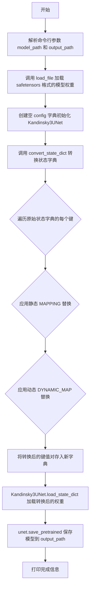
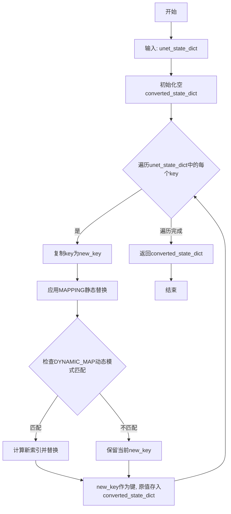
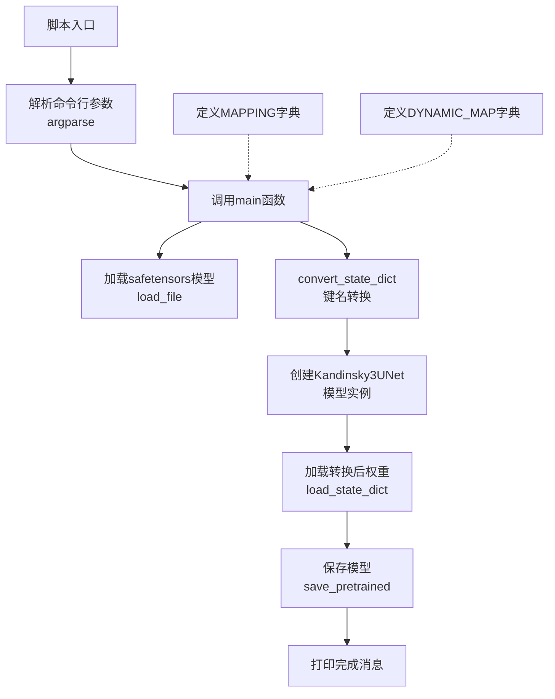
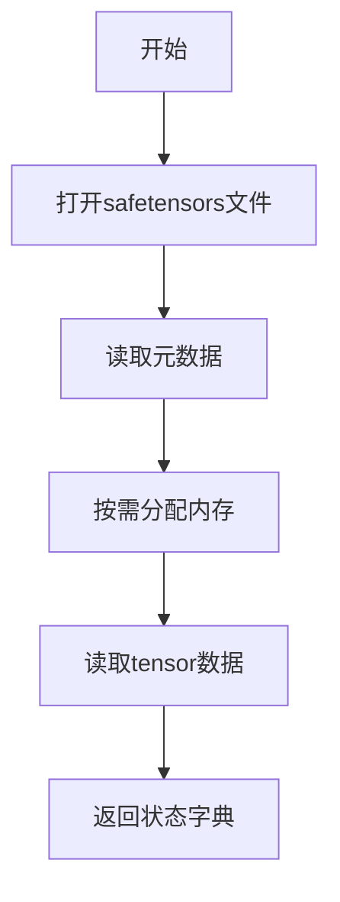
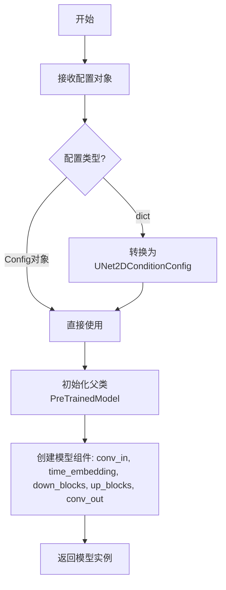
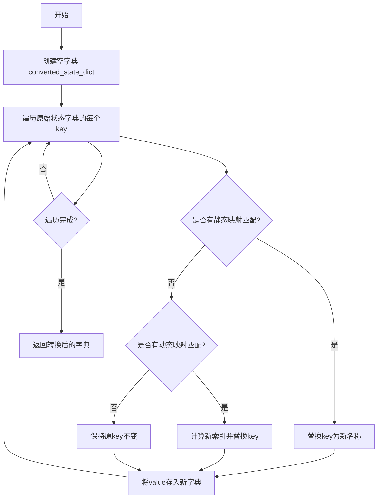
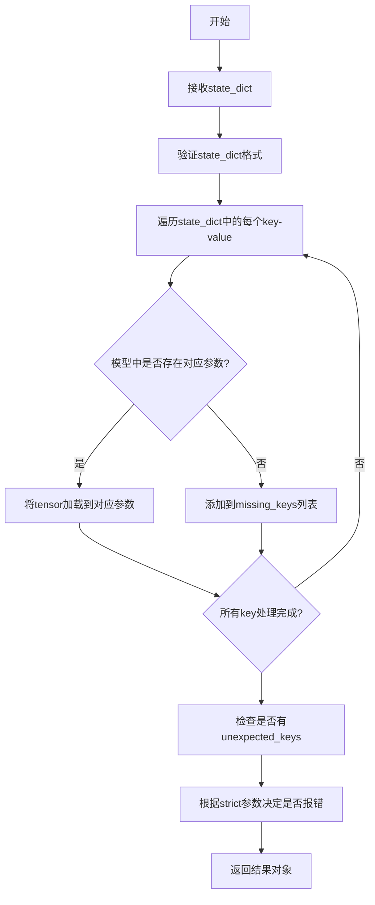
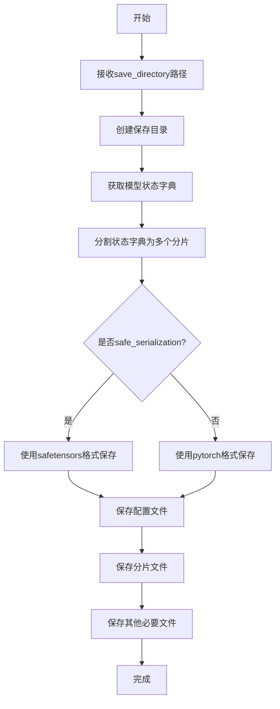
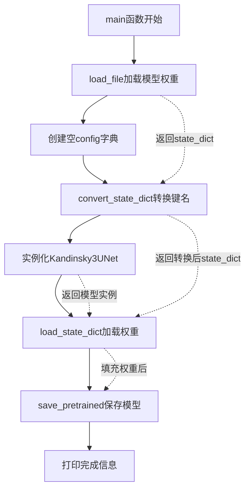

# `diffusers\scripts\convert_kandinsky3_unet.py` 详细设计文档

这是一个模型权重转换工具，用于将通用的U-Net模型状态字典（state_dict）转换为Kandinsky3UNet模型所需的特定键格式，以便能够在diffusers库中成功加载使用。脚本通过静态映射和动态模式匹配两种方式重命名模型权重键，并支持从safetensors格式加载原始模型并保存为Kandinsky3UNet格式。

## 整体流程



## 类结构

```
此代码为脚本文件，无类定义
全局模块级别
├── MAPPING (静态键映射字典)
├── DYNAMIC_MAP (动态键映射字典)
├── convert_state_dict() 全局函数
└── main() 主函数
```

## 全局变量及字段


### `MAPPING`
    
静态键名映射字典，将旧U-Net模型键名映射到Kandinsky3UNet模型的新键名（如 'to_time_embed.1' -> 'time_embedding.linear_1'）

类型：`dict[str, str]`
    


### `DYNAMIC_MAP`
    
动态键名映射字典，支持通配符模式匹配和索引偏移，用于转换包含序号变量的键名（如 'resnet_attn_blocks.*.1' -> ('attentions.*', 1)）

类型：`dict[str, str | tuple[str, int]]`
    


    

## 全局函数及方法


### `convert_state_dict`

该函数用于将原始U-Net模型的状态字典（state dictionary）转换为Kandinsky3UNet模型所需的键名格式，通过静态映射表和动态模式匹配两种方式重命名状态字典中的键，使得预训练的U-Net权重能够被Kandinsky3UNet模型正确加载。

参数：

- `unet_state_dict`：`dict`，原始U-Net模型的状态字典，包含模型各层的权重参数

返回值：`dict`，转换后的状态字典，键名已适配Kandinsky3UNet格式

#### 流程图



#### 带注释源码

```python
def convert_state_dict(unet_state_dict):
    """
    Convert the state dict of a U-Net model to match the key format expected by Kandinsky3UNet model.
    Args:
        unet_model (torch.nn.Module): The original U-Net model.
        unet_kandi3_model (torch.nn.Module): The Kandinsky3UNet model to match keys with.

    Returns:
        OrderedDict: The converted state dictionary.
    """
    # 初始化转换后的状态字典
    converted_state_dict = {}
    
    # 遍历原始状态字典中的每个键值对
    for key in unet_state_dict:
        new_key = key
        
        # 步骤1: 应用静态映射表MAPPING进行字符串替换
        # 例如: "to_time_embed.1" -> "time_embedding.linear_1"
        for pattern, new_pattern in MAPPING.items():
            new_key = new_key.replace(pattern, new_pattern)

        # 步骤2: 应用动态映射DYNAMIC_MAP处理带通配符的模式
        # 例如: "resnet_attn_blocks.0.1" -> "attentions.1"
        for dyn_pattern, dyn_new_pattern in DYNAMIC_MAP.items():
            has_matched = False
            
            # 检查键是否匹配动态模式 (例如: *.resnet_attn_blocks.*.*)
            if fnmatch.fnmatch(new_key, f"*.{dyn_pattern}.*") and not has_matched:
                # 从键中提取索引数字
                # 例如从 "resnet_attn_blocks.0.1" 提取 "0" 和 "1"
                star = int(new_key.split(dyn_pattern.split(".")[0])[-1].split(".")[1])

                # 处理元组形式的映射规则（包含索引偏移）
                if isinstance(dyn_new_pattern, tuple):
                    new_star = star + dyn_new_pattern[-1]  # 加上偏移量
                    dyn_new_pattern = dyn_new_pattern[0]   # 获取新的模式字符串
                else:
                    new_star = star

                # 执行模式替换
                pattern = dyn_pattern.replace("*", str(star))
                new_pattern = dyn_new_pattern.replace("*", str(new_star))

                new_key = new_key.replace(pattern, new_pattern)
                has_matched = True

        # 将转换后的键值对存入新字典
        converted_state_dict[new_key] = unet_state_dict[key]

    return converted_state_dict
```

---

#### 关键组件信息

| 名称 | 描述 |
|------|------|
| `MAPPING` | 静态映射字典，定义键名的简单字符串替换规则（如`to_time_embed.1`→`time_embedding.linear_1`） |
| `DYNAMIC_MAP` | 动态映射字典，处理带通配符`*`的复杂模式匹配和索引转换（如`resnet_attn_blocks.*.1`→`attentions.*`） |
| `fnmatch` | Python标准库模块，用于支持通配符模式匹配 |

---

#### 潜在的技术债务或优化空间

1. **硬编码的索引偏移**: `DYNAMIC_MAP`中的元组索引偏移量（当前为`1`）是硬编码的，缺乏灵活性，应考虑从配置或函数参数传入
2. **模式匹配效率**: 使用`fnmatch.fnmatch`逐个匹配动态模式的时间复杂度较高，对于大规模状态字典可考虑预编译正则表达式或建立索引
3. **缺少错误处理**: 未对`unet_state_dict`为`None`、键格式不符合预期等情况进行异常捕获
4. **文档注释与实现不一致**: 函数docstring中声明的参数为`unet_model`和`unet_kandi3_model`，但实际实现接收的是`unet_state_dict`

---

#### 其它项目

**设计目标与约束**:
- 目标：实现U-Net权重格式到Kandinsky3UNet格式的转换，支持模型迁移
- 约束：转换仅涉及键名重命名，不改变权重数值；依赖Python标准库`fnmatch`模块

**错误处理与异常设计**:
- 未实现显式错误处理，建议增加键名格式异常、类型检查等防御性编程
- 建议在转换前校验`unet_state_dict`是否为有效字典对象

**数据流与状态机**:
- 输入：原始U-Net的`state_dict`（字典类型，键为字符串，值为`torch.Tensor`）
- 处理流程：遍历→静态替换→动态模式匹配→构建新字典
- 输出：键名转换后的`state_dict`（与输入结构相同，仅键名改变）

**外部依赖与接口契约**:
- 依赖`fnmatch`模块（Python标准库）
- 输入必须是标准的PyTorch状态字典格式（`collections.abc.Mapping`兼容对象）
- 返回值可直接用于`torch.nn.Module.load_state_dict()`方法


### `main`

该函数是模型转换的入口点，负责加载原始U-Net模型的状态字典，将其键名转换为Kandinsky3UNet模型所需的格式，初始化并加载转换后的状态字典，最后保存模型到指定路径。

#### 参数

- `model_path`：`str`，原始U-Net模型（safetensors格式）的文件路径
- `output_path`：`str`，转换后Kandinsky3UNet模型的保存路径

#### 返回值

`None`，无返回值，执行模型转换并保存操作

#### 流程图

```mermaid
flowchart TD
    A[开始] --> B[加载模型文件<br/>load_file model_path]
    B --> C[初始化空config字典<br/>config = {}]
    C --> D[调用convert_state_dict函数<br/>转换状态字典键名]
    D --> E[创建Kandinsky3UNet实例<br/>Kandinsky3UNet config]
    E --> F[加载转换后的状态字典<br/>unet.load_state_dict]
    F --> G[保存模型到输出路径<br/>unet.save_pretrained]
    G --> H[打印完成信息<br/>print 转换成功消息]
    H --> I[结束]
```

#### 带注释源码

```python
def main(model_path, output_path):
    """
    主转换函数：执行U-Net到Kandinsky3UNet模型格式转换并保存
    
    参数:
        model_path: 原始U-Net模型文件路径（safetensors格式）
        output_path: 转换后模型的保存路径
    返回:
        None
    """
    # Step 1: 使用safetensors加载原始U-Net模型的状态字典
    # load_file从safetensors文件加载张量到内存
    unet_state_dict = load_file(model_path)

    # Step 2: 初始化空的Kandinsky3UNet配置字典
    # config为空字典将使用Kandinsky3UNet的默认配置
    config = {}

    # Step 3: 调用转换函数将原始状态字典键名转换为目标格式
    # 遍历每个键，根据MAPPING和DYNAMIC_MAP进行替换
    converted_state_dict = convert_state_dict(unet_state_dict)

    # Step 4: 使用转换后的状态字典创建Kandinsky3UNet模型实例
    # 传入空config使用默认配置参数
    unet = Kandinsky3UNet(config)

    # Step 5: 将转换后的状态字典加载到模型中
    # 将原始模型的权重参数赋值给新模型结构
    unet.load_state_dict(converted_state_dict)

    # Step 6: 保存模型到指定输出路径
    # 会保存模型结构配置文件和权重文件
    unet.save_pretrained(output_path)
    
    # 输出转换完成信息，便于用户确认执行结果
    print(f"Converted model saved to {output_path}")
```

---

## 整体文档

### 一段话描述

该代码实现了一个模型转换工具，用于将原始U-Net模型的状态字典键名转换为Kandinsky3UNet模型所需的格式，通过静态映射表和动态模式匹配实现键名重命名，最终将转换后的模型保存到指定路径。

### 文件整体运行流程



### 类详细信息

本文件为脚本文件，未定义类，仅包含全局函数。

### 全局变量和全局函数详细信息

#### 全局变量

| 名称 | 类型 | 描述 |
|------|------|------|
| `MAPPING` | `dict` | 静态键名映射字典，用于将原始键名替换为目标键名 |
| `DYNAMIC_MAP` | `dict` | 动态键名模式映射字典，支持通配符匹配和索引偏移 |

#### 全局函数

| 名称 | 参数 | 返回值 | 描述 |
|------|------|--------|------|
| `convert_state_dict` | `unet_state_dict: OrderedDict` | `OrderedDict` | 将原始U-Net状态字典的键名转换为Kandinsky3UNet格式 |
| `main` | `model_path: str, output_path: str` | `None` | 主函数，执行模型加载、转换、保存的完整流程 |

### 关键组件信息

| 组件名称 | 一句话描述 |
|----------|------------|
| `MAPPING` 字典 | 静态键名替换规则集，包含时间嵌入层、输入输出层、注意力模块等名称映射 |
| `DYNAMIC_MAP` 字典 | 动态模式匹配规则，支持带通配符的键名转换和索引偏移计算 |
| `convert_state_dict` 函数 | 核心转换逻辑，遍历状态字典并应用静态和动态映射规则 |
| `main` 函数 | 入口函数，协调模型加载、转换、保存的完整生命周期 |

### 潜在技术债务或优化空间

1. **空config问题**：`config = {}` 使用空字典初始化模型，可能导致模型使用默认配置而非原始模型的实际配置，应从原模型提取config或提供config加载逻辑
2. **硬编码映射**：MAPPING和DYNAMIC_MAP为硬编码值，缺乏灵活性，应考虑配置文件或自动推断机制
3. **错误处理缺失**：未对文件不存在、模型格式错误、键名不匹配等情况进行处理
4. **性能优化**：转换过程中多次遍历和字符串替换，可使用正则表达式或编译优化提升性能
5. **日志记录**：仅使用print输出，缺乏结构化日志，建议使用logging模块

### 其它项目

#### 设计目标与约束

- **目标**：实现U-Net到Kandinsky3UNet模型格式的自动化转换
- **输入约束**：模型必须为safetensors格式的状态字典文件
- **输出约束**：保存为HuggingFace diffusers格式模型目录

#### 错误处理与异常设计

- 缺少文件存在性检查
- 缺少模型加载异常捕获
- 缺少状态字典键名不匹配时的警告或错误提示

#### 外部依赖与接口契约

- **依赖库**：`argparse`（参数解析）、`fnmatch`（模式匹配）、`safetensors.torch`（模型加载）、`diffusers.Kandinsky3UNet`（目标模型）
- **接口契约**：输入为safetensors文件路径，输出为diffusers格式模型目录


### `load_file`

用于从 safetensors 文件中加载 PyTorch 模型的状态字典。

参数：

- `filename`：`str`，要加载的 safetensors 文件路径
- `device`：`str` 或 `torch.device`，可选，指定加载设备，默认为 CPU
- `dtype`：`torch.dtype`，可选，指定加载后的数据类型

返回值：`Dict[str, torch.Tensor]`，返回包含模型权重键值对的字典

#### 流程图



#### 带注释源码

```python
# safetensors.torch.load_file 函数源码
def load_file(filename: str, device: str = "cpu", dtype: Optional[torch.dtype] = None) -> Dict[str, torch.Tensor]:
    """
    Load a safetensors file into a state dict.
    
    Args:
        filename: The path to the safetensors file
        device: The device to load the tensors to
        dtype: The dtype to cast the tensors to
        
    Returns:
        A dictionary of tensors
    """
    # 1. Open the safetensors file
    with safe_open(filename, framework="pt", device=device) as f:
        # 2. Get metadata and iterate over keys
        metadata = f.metadata()
        # 3. For each key, read the tensor
        for key in f.keys():
            tensor = f.get_tensor(key)
            # 4. Optionally cast to dtype
            if dtype is not None:
                tensor = tensor.to(dtype)
            # 5. Store in dictionary
            result[key] = tensor
    return result
```

---

### `Kandinsky3UNet`

Kandinsky 3 的 U-Net 模型类，用于图像生成任务。继承自 `PreTrainedModel` 和 `ModelMixin`。

参数：

- `config`：`Kandinsky3UNetConfig` 或 `dict`，模型配置对象，包含模型结构参数
- `cache_dir`：`str`，可选，模型缓存目录
- `torch_dtype`：`torch.dtype`，可选，模型权重的数据类型
- `force_download`：`bool`，可选，是否强制重新下载
- `resume_download`：`bool`，可选，是否恢复中断的下载
- `use_safetensors`：`bool`，可选，是否优先使用 safetensors 格式

返回值：`Kandinsky3UNet`，返回模型实例对象

#### 流程图



#### 带注释源码

```python
# diffusers.Kandinsky3UNet 类结构（简化版）
class Kandinsky3UNet(PreTrainedModel, ModelMixin):
    """
    Kandinsky3 UNet model for image generation.
    This model inherits from PreTrainedModel and ModelMixin.
    """
    
    config_class = Kandinsky3UNetConfig
    base_model_prefix = "unet"
    
    def __init__(self, config):
        # 1. 初始化父类
        super().__init__(config)
        
        # 2. 创建配置属性
        self.config = config
        
        # 3. 初始化模型组件
        # 3.1 输入卷积层
        self.conv_in = nn.Conv2d(config.in_channels, config.block_out_channels[0], kernel_size=3, padding=1)
        
        # 3.2 时间嵌入层
        self.time_embedding = nn.Sequential(
            nn.Linear(config.block_out_channels[0], config.block_out_channels[0] * 4),
            nn.SiLU(),
            nn.Linear(config.block_out_channels[0] * 4, config.block_out_channels[0] * 4),
        )
        
        # 3.3 下采样块
        self.down_blocks = nn.ModuleList([])
        # ... 初始化下采样块
        
        # 3.4 上采样块
        self.up_blocks = nn.ModuleList([])
        # ... 初始化上采样块
        
        # 3.5 输出卷积层
        self.conv_out = nn.Sequential(
            nn.GroupNorm(32, config.block_out_channels[0]),
            nn.SiLU(),
            nn.Conv2d(config.block_out_channels[0], config.out_channels, kernel_size=3, padding=1),
        )
        
        # 4. 初始化权重
        self._init_weights()
    
    def forward(self, sample, timestep, encoder_hidden_states, return_dict=True):
        """
        Forward pass of the model.
        
        Args:
            sample: Input tensor
            timestep: Timestep tensor
            encoder_hidden_states: Hidden states from encoder
            return_dict: Whether to return a dictionary
            
        Returns:
            UNet2DConditionOutput or tuple
        """
        # 前向传播逻辑
        pass
```

---

### `convert_state_dict`

将原始 U-Net 模型的状态字典键名转换为与 Kandinsky3UNet 模型匹配的格式。

参数：

- `unet_state_dict`：`Dict[str, torch.Tensor]`，原始 U-Net 模型的状态字典

返回值：`Dict[str, torch.Tensor]`，转换后的状态字典

#### 流程图



#### 带注释源码

```python
def convert_state_dict(unet_state_dict):
    """
    Convert the state dict of a U-Net model to match the key format expected by Kandinsky3UNet model.
    
    Args:
        unet_state_dict (dict): The original U-Net model state dictionary with weights.
        
    Returns:
        dict: The converted state dictionary with renamed keys.
    """
    # 1. 创建空字典用于存储转换后的状态字典
    converted_state_dict = {}
    
    # 2. 遍历原始状态字典的每个键值对
    for key in unet_state_dict:
        # 3. 初始化新键名为原始键名
        new_key = key
        
        # 4. 应用静态映射替换（如 to_time_embed.1 -> time_embedding.linear_1）
        for pattern, new_pattern in MAPPING.items():
            new_key = new_key.replace(pattern, new_pattern)
        
        # 5. 应用动态映射替换（如 resnet_attn_blocks.*.0 -> resnets_in.*）
        for dyn_pattern, dyn_new_pattern in DYNAMIC_MAP.items():
            # 6. 检查是否匹配动态模式
            if fnmatch.fnmatch(new_key, f"*.{dyn_pattern}.*"):
                # 7. 提取索引号
                star = int(new_key.split(dyn_pattern.split(".")[0])[-1].split(".")[1])
                
                # 8. 如果新模式是元组，调整索引
                if isinstance(dyn_new_pattern, tuple):
                    new_star = star + dyn_new_pattern[-1]
                    dyn_new_pattern = dyn_new_pattern[0]
                else:
                    new_star = star
                
                # 9. 替换模式中的通配符
                pattern = dyn_pattern.replace("*", str(star))
                new_pattern = dyn_new_pattern.replace("*", str(new_star))
                
                # 10. 应用替换
                new_key = new_key.replace(pattern, new_pattern)
        
        # 11. 将转换后的键值对存入新字典
        converted_state_dict[new_key] = unet_state_dict[key]
    
    # 12. 返回转换后的状态字典
    return converted_state_dict
```

---

### `Kandinsky3UNet.load_state_dict`

从状态字典加载模型权重到 Kandinsky3UNet 模型实例中。

参数：

- `state_dict`：`Dict[str, torch.Tensor]`，包含模型权重的状态字典
- `strict`：`bool`，可选，是否严格检查键名匹配，默认为 True
- `assign`：`bool`，可选，是否直接将参数分配给权重，默认为 False

返回值：`torch.nn.modules.module._Result`，包含 missing_keys 和 unexpected_keys 的结果对象

#### 流程图



#### 带注释源码

```python
# torch.nn.Module.load_state_dict 方法（Kandinsky3UNet继承自nn.Module）
def load_state_dict(self, state_dict: Mapping[str, Any], strict: bool = True, assign: bool = False) -> _IncompatibleKeys:
    """
    Copies parameters and buffers from :attr:`state_dict` into this module and its descendants.
    
    Args:
        state_dict (dict): A dict containing parameters and persistent buffers.
        strict (bool): Whether to strictly enforce that the keys in :attr:`state_dict`
            match the keys returned by this module's :meth:`~torch.nn.Module.state_dict`
            function.
        assign (bool): Whether to assign parameters and buffers to the corresponding
            keys in the state dict.
            
    Returns:
        _IncompatibleKeys: Returns a named tuple with `missing_keys` and `unexpected_keys` fields.
    """
    # 1. 复制状态字典（避免修改原始字典）
    state_dict = OrderedDict((k, v) for k, v in state_dict.items() if k is not None)
    
    # 2. 获取模型当前的状态字典
    own_state = self.state_dict(keep_vars=True)
    
    # 3. 遍历传入的状态字典
    for name, param in state_dict.items():
        # 4. 检查参数是否在模型中
        if name in own_state:
            # 5. 处理参数形状不匹配的情况
            if param.shape != own_state[name].shape:
                # 处理形状不匹配的逻辑
                pass
            
            # 6. 加载参数
            if assign:
                own_state[name].copy_(param)
            else:
                own_state[name].copy_(param.detach())
    
    # 7. 检查missing_keys和unexpected_keys
    missing_keys = [k for k in own_state.keys() if k not in state_dict]
    unexpected_keys = [k for k in state_dict.keys() if k not in own_state]
    
    # 8. 如果strict=True且有不匹配的键，抛出错误
    if strict:
        if len(unexpected_keys) > 0:
            raise RuntimeError(f"Unexpected keys: {unexpected_keys}")
        if len(missing_keys) > 0:
            raise RuntimeError(f"Missing keys: {missing_keys}")
    
    # 9. 返回结果
    return _IncompatibleKeys(missing_keys, unexpected_keys)
```

---

### `Kandinsky3UNet.save_pretrained`

将 Kandinsky3UNet 模型的权重和配置保存到指定目录。

参数：

- `save_directory`：`str` 或 `Path`，保存模型的目录路径
- `safe_serialization`：`bool`，可选，是否使用 safetensors 格式保存，默认为 True
- `kwargs`：其他可选参数，如 `max_shard_size`, `is_main_process`, `state_dict` 等

返回值：无返回值，模型保存到指定目录

#### 流程图



#### 带注释源码

```python
# transformers.modeling_utils.PreTrainedModel.save_pretrained 方法
# Kandinsky3UNet继承自PreTrainedModel，因此具有此方法
def save_pretrained(
    self,
    save_directory: Union[str, os.PathLike],
    safe_serialization: bool = True,
    max_shard_size: Union[int, str] = "10GB",
    is_main_process: bool = True,
    **kwargs
) -> None:
    """
    Save a model and its configuration file to a directory.
    
    Args:
        save_directory (str or Path): The directory to save the model to.
        safe_serialization (bool): Whether to save using safetensors format.
        max_shard_size (int or str): Maximum size of each shard file.
        is_main_process (bool): Whether this process is the main process.
        **kwargs: Additional arguments for customization.
    """
    # 1. 确保保存目录存在
    os.makedirs(save_directory, exist_ok=True)
    
    # 2. 序列化并保存模型配置文件
    # 2.1 获取配置对象
    model_config = self.config
    
    # 2.2 保存config.json
    model_config.save_pretrained(save_directory)
    
    # 3. 获取模型状态字典
    # 3.1 如果传入了state_dict则使用，否则使用模型当前的state_dict
    state_dict = kwargs.pop("state_dict", self.state_dict())
    
    # 4. 根据max_shard_size分割状态字典
    # 4.1 计算每个分片的大小
    shards = self._split_state_dict(state_dict, max_shard_size)
    
    # 5. 保存每个分片
    # 5.1 遍历每个分片
    for shard_file, shard in shards.items():
        # 5.2 根据safe_serialization选择保存格式
        if safe_serialization:
            # 使用safetensors格式保存
            from safetensors.torch import save_file
            save_file(shard, os.path.join(save_directory, shard_file))
        else:
            # 使用pytorch格式保存
            torch.save(shard, os.path.join(save_directory, shard_file))
    
    # 6. 保存索引文件（如果有多个分片）
    # 包含分片文件列表和对应的键
    
    # 7. 保存tokenizer相关文件（如果有）
    # ...

    # 8. 打印保存完成信息
    print(f"Model saved to {save_directory}")
```

---

## 完整调用流程图




## 关键组件


### 张量索引与状态字典映射

通过MAPPING和DYNAMIC_MAP两个字典实现旧模型键名到新模型键名的映射转换，支持通配符模式和动态索引替换

### 惰性加载与安全张量

使用safetensors库的load_file函数实现惰性加载，避免一次性将整个模型加载到内存，通过流式读取方式获取权重数据

### 动态键名转换引擎

DYNAMIC_MAP支持带星号的模式匹配，能够根据索引动态计算目标键名，支持tuple形式的偏移量调整

### 参数映射表

MAPPING定义了静态的键名替换规则，将原始U-Net模型的层名称映射到Kandinsky3UNet的标准层名称

### 命令行参数处理

使用argparse模块处理model_path和output_path两个必需参数，提供了标准的命令行接口

### 模型初始化与保存

通过diffusers库的Kandinsky3UNet类初始化模型，然后使用load_state_dict加载转换后的权重，最后保存到指定路径


## 问题及建议


### 已知问题

-   **空配置初始化**: `config = {}` 使用空字典初始化 Kandinsky3UNet，可能导致模型使用默认配置而非预期的架构参数，造成权重加载失败或模型结构不匹配
-   **动态映射逻辑脆弱**: DYNAMIC_MAP 中的索引解析逻辑高度依赖特定的 key 格式（如 `dyn_pattern.split(".")[-1].split(".")[1]`），缺乏健壮性，容易因输入格式变化而失效
-   **has_matched 变量逻辑错误**: 在 for 循环内部每次迭代开始时 `has_matched = False`，导致内部的条件判断 `and not has_matched` 永远为真，变量形同虚设
-   **缺少错误处理**: 文件加载、模型初始化、权重转换等关键操作均无异常捕获，程序可能在遇到错误时直接崩溃且无明确错误信息
-   **硬编码的偏移量**: `new_star = star + dyn_new_pattern[-1]` 中的偏移值 1 缺乏说明，增加理解难度和维护成本
-   **缺乏输入验证**: model_path 和 output_path 未检查文件/目录是否存在或有效路径格式是否正确
-   **静态映射定义后被注释**: 代码中 `# MAPPING = {}` 注释掉的行表明配置可能被临时修改，增加代码理解难度

### 优化建议

-   **使用配置文件或参数**: 从外部 YAML/JSON 加载模型配置，或通过 argparse 添加 --config 参数，允许用户指定模型配置
-   **重构动态映射逻辑**: 提取索引解析为独立函数，添加单元测试覆盖多种 key 格式，并考虑使用正则表达式替代 fnmatch
-   **移除无效变量**: 删除 `has_matched` 变量，或修正其使用逻辑（移至循环外部并在内部更新）
-   **添加异常处理**: 使用 try-except 包裹关键操作，提供有意义的错误信息和友好的退出方式
-   **增强输入验证**: 在 main 函数开始添加路径有效性检查，使用 pathlib 进行路径操作
-   **使用日志模块**: 替换 print 语句为 logging 模块，支持不同日志级别和格式配置
-   **添加类型注解**: 为函数参数和返回值添加类型提示，提升代码可读性和 IDE 支持


## 其它


### 设计目标与约束

将预训练的U-Net模型权重转换为Kandinsky3UNet模型所需的键名格式，使得原始模型权重能够被Kandinsky3UNet正确加载。约束条件包括：仅支持PyTorch模型格式（通过safetensors加载），目标模型为Kandinsky3UNet架构，转换过程不修改权重数值，仅进行键名映射。

### 错误处理与异常设计

文件加载异常：当指定的model_path不存在或无法加载时，load_file函数会抛出异常，当前未进行捕获处理。模型初始化异常：config为空字典可能导致模型初始化失败或使用默认配置，load_state_dict可能因键名不匹配而失败。当前代码未实现任何try-except异常处理机制，缺乏对转换过程中键名未匹配情况的处理和警告输出。

### 数据流与状态机

数据流：1)通过argparse接收model_path和output_path参数；2)调用load_file加载原始模型状态字典；3)调用convert_state_dict进行键名转换；4)初始化Kandinsky3UNet模型；5)调用load_state_dict加载转换后的权重；6)调用save_pretrained保存模型。状态机流转：命令行参数解析 → 模型加载 → 状态字典转换 → 模型初始化 → 权重加载 → 模型保存。

### 外部依赖与接口契约

主要依赖包括：safetensors.torch.load_file用于加载模型权重文件；diffusers.Kandinsky3UNet作为目标模型类；fnmatch模块用于动态键名匹配；argparse用于命令行参数解析。接口契约：main函数接收model_path（原始模型路径）和output_path（转换后模型保存路径）两个字符串参数，无返回值，通过print输出执行结果。

### 关键组件信息

MAPPING字典：静态键名映射规则，将原始键名中的特定字符串替换为目标模型的标准命名。DYNAMIC_MAP字典：动态键名映射规则，处理带有数字索引的键名，支持索引偏移转换。convert_state_dict函数：核心转换逻辑，遍历原始状态字典的每个键，应用静态映射和动态映射规则生成新键名。

### 潜在的技术债务或优化空间

1. config参数为空字典，应该根据实际模型架构提供正确的配置信息；2. MAPPING字典中存在注释掉的旧代码，应清理；3. 缺乏错误处理机制，应添加文件不存在、键名不匹配等情况的处理；4. 动态映射逻辑中has_matched变量设置但未实际发挥作用，可简化逻辑；5. 未提供转换报告，无法得知有多少键成功匹配和多少键未匹配；6. 应添加日志记录转换过程，便于调试和问题追踪。

    