# `diffusers\scripts\convert_kandinsky_to_diffusers.py` 详细设计文档

该脚本用于将Kandinsky 2.1模型的原始检查点权重转换为HuggingFace diffusers格式，支持PriorTransformer、UNet2DConditionModel（文本到图像）和VQModel（解码器）三种模型组件的转换。

## 整体流程

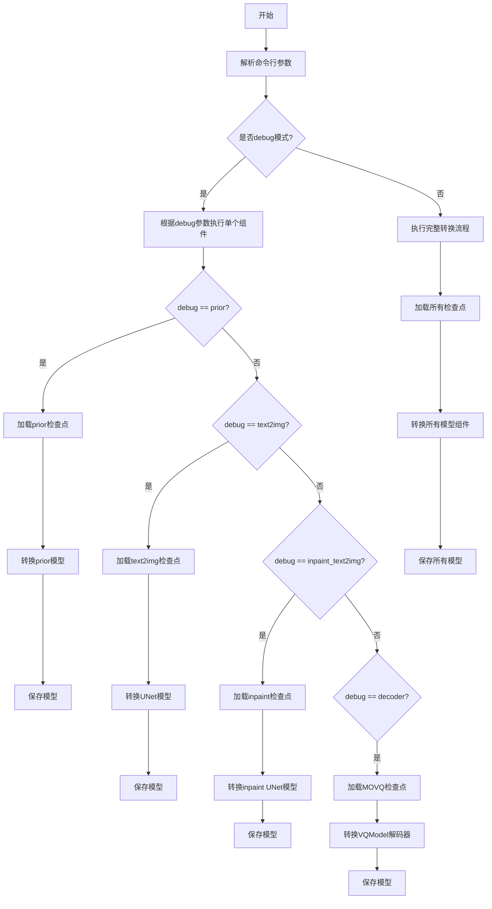

## 类结构

```
全局配置
├── PRIOR_ORIGINAL_PREFIX (常量)
├── PRIOR_CONFIG (字典)
├── UNET_CONFIG (字典)
├── INPAINT_UNET_CONFIG (字典)
└── MOVQ_CONFIG (字典)

Prior模型转换模块
├── prior_model_from_original_config()
├── prior_original_checkpoint_to_diffusers_checkpoint()
├── prior_attention_to_diffusers()
└── prior_ff_to_diffusers()

UNet模型转换模块
├── unet_model_from_original_config()
├── unet_original_checkpoint_to_diffusers_checkpoint()
├── unet_time_embeddings()
├── unet_conv_in()
├── unet_add_embedding()
├── unet_encoder_hid_proj()
├── unet_conv_norm_out()
├── unet_conv_out()
├── unet_downblock_to_diffusers_checkpoint()
├── unet_midblock_to_diffusers_checkpoint()
├── unet_upblock_to_diffusers_checkpoint()
├── resnet_to_diffusers_checkpoint()
├── attention_to_diffusers_checkpoint()
└── split_attentions()

Inpaint UNet模型转换模块
├── inpaint_unet_model_from_original_config()
└── inpaint_unet_original_checkpoint_to_diffusers_checkpoint()

MOVQ (VQModel) 解码器转换模块
├── movq_model_from_original_config()
├── movq_encoder_to_diffusers_checkpoint()
├── movq_decoder_to_diffusers_checkpoint()
├── movq_resnet_to_diffusers_checkpoint()
├── movq_resnet_to_diffusers_checkpoint_spatial_norm()
├── movq_attention_to_diffusers_checkpoint()
├── movq_attention_to_diffusers_checkpoint_spatial_norm()
└── movq_original_checkpoint_to_diffusers_checkpoint()

主入口函数
├── prior()
├── text2img()
├── inpaint_text2img()
├── movq()
└── load_checkpoint_to_model()
```

## 全局变量及字段


### `PRIOR_ORIGINAL_PREFIX`
    
The prefix string used for mapping original checkpoint keys to diffusers format in the prior model.

类型：`str`
    


### `PRIOR_CONFIG`
    
Configuration dictionary for the PriorTransformer model, currently empty and using default arguments.

类型：`dict`
    


### `UNET_CONFIG`
    
Configuration dictionary for the UNet2DConditionModel used in text2img conversion, containing model architecture parameters.

类型：`dict`
    


### `INPAINT_UNET_CONFIG`
    
Configuration dictionary for the UNet2DConditionModel used in inpainting, with in_channels set to 9.

类型：`dict`
    


### `MOVQ_CONFIG`
    
Configuration dictionary for the VQModel (MOVQ) decoder, specifying encoder and decoder architecture.

类型：`dict`
    


### `args`
    
Parsed command-line arguments containing paths to checkpoint files and conversion options.

类型：`argparse.Namespace`
    


### `checkpoint_map_location`
    
The PyTorch device where checkpoints will be loaded, specified via command-line argument.

类型：`torch.device`
    


    

## 全局函数及方法


### `prior_model_from_original_config`

该函数用于根据原始配置创建一个 PriorTransformer 模型实例，使用空的默认配置字典来实例化模型。

参数：

- 该函数没有参数（使用全局变量 `PRIOR_CONFIG`）

返回值：`PriorTransformer`，返回一个使用默认配置创建的 PriorTransformer 模型实例

#### 流程图

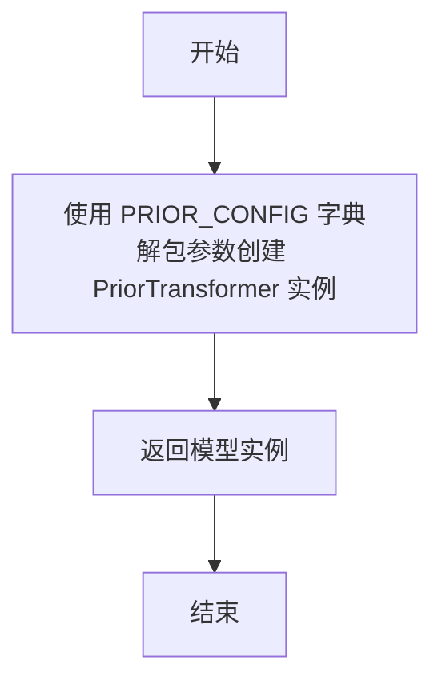

#### 带注释源码

```python
def prior_model_from_original_config():
    """
    根据原始配置创建 PriorTransformer 模型实例。
    
    该函数使用全局变量 PRIOR_CONFIG（一个空字典）作为配置参数，
    实例化 diffusers 库中的 PriorTransformer 模型。
    
    Returns:
        PriorTransformer: 使用默认配置创建的模型实例
    """
    # 使用 PRIOR_CONFIG（当前为空字典）作为配置参数创建 PriorTransformer 模型
    model = PriorTransformer(**PRIOR_CONFIG)

    # 返回创建好的模型实例
    return model
```


### `prior_original_checkpoint_to_diffusers_checkpoint`

该函数负责将原始 Kandinsky 2.1 prior 模型的检查点（包含时间嵌入、投影层、位置编码、transformer 块和输出层等权重）转换为 Diffusers 格式的 `PriorTransformer` 模型结构，通过键名映射实现权重从原始格式到目标格式的转换。

**参数：**

- `model`：`PriorTransformer`，Diffusers 库中的 PriorTransformer 模型实例，用于获取模型结构信息（如 `attention_head_dim`、transformer 块数量等）
- `checkpoint`：`Dict[str, torch.Tensor]`，原始 Kandinsky 2.1 prior 模型的检查点字典，键名为原始格式（如 `model.time_embed.0.weight`）
- `clip_stats_checkpoint`：`Tuple[torch.Tensor, torch.Tensor]`，CLIP 统计信息的元组，包含 `clip_mean` 和 `clip_std`

**返回值：**`Dict[str, torch.Tensor]`，转换后的 Diffusers 格式检查点字典，键名为 Diffusers 模型格式（如 `time_embedding.linear_1.weight`）

#### 流程图

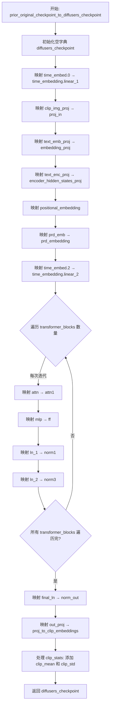

#### 带注释源码

```python
def prior_original_checkpoint_to_diffusers_checkpoint(model, checkpoint, clip_stats_checkpoint):
    """
    将原始 Kandinsky 2.1 prior 模型的检查点转换为 Diffusers 格式
    
    参数:
        model: PriorTransformer 模型实例，用于获取模型结构信息
        checkpoint: 原始格式的检查点字典
        clip_stats_checkpoint: CLIP 统计信息元组 (clip_mean, clip_std)
    
    返回:
        转换后的 Diffusers 格式检查点字典
    """
    diffusers_checkpoint = {}

    # <original>.time_embed.0 -> <diffusers>.time_embedding.linear_1
    # 映射时间嵌入层的第一层全连接层
    diffusers_checkpoint.update(
        {
            "time_embedding.linear_1.weight": checkpoint[f"{PRIOR_ORIGINAL_PREFIX}.time_embed.0.weight"],
            "time_embedding.linear_1.bias": checkpoint[f"{PRIOR_ORIGINAL_PREFIX}.time_embed.0.bias"],
        }
    )

    # <original>.clip_img_proj -> <diffusers>.proj_in
    # 映射图像投影层
    diffusers_checkpoint.update(
        {
            "proj_in.weight": checkpoint[f"{PRIOR_ORIGINAL_PREFIX}.clip_img_proj.weight"],
            "proj_in.bias": checkpoint[f"{PRIOR_ORIGINAL_PREFIX}.clip_img_proj.bias"],
        }
    )

    # <original>.text_emb_proj -> <diffusers>.embedding_proj
    # 映射文本嵌入投影层
    diffusers_checkpoint.update(
        {
            "embedding_proj.weight": checkpoint[f"{PRIOR_ORIGINAL_PREFIX}.text_emb_proj.weight"],
            "embedding_proj.bias": checkpoint[f"{PRIOR_ORIGINAL_PREFIX}.text_emb_proj.bias"],
        }
    )

    # <original>.text_enc_proj -> <diffusers>.encoder_hidden_states_proj
    # 映射文本编码投影层
    diffusers_checkpoint.update(
        {
            "encoder_hidden_states_proj.weight": checkpoint[f"{PRIOR_ORIGINAL_PREFIX}.text_enc_proj.weight"],
            "encoder_hidden_states_proj.bias": checkpoint[f"{PRIOR_ORIGINAL_PREFIX}.text_enc_proj.bias"],
        }
    )

    # <original>.positional_embedding -> <diffusers>.positional_embedding
    # 映射位置编码
    diffusers_checkpoint.update({"positional_embedding": checkpoint[f"{PRIOR_ORIGINAL_PREFIX}.positional_embedding"]})

    # <original>.prd_emb -> <diffusers>.prd_embedding
    # 映射 PRD (可能是 Prompt-relevant Decomposition) 嵌入
    diffusers_checkpoint.update({"prd_embedding": checkpoint[f"{PRIOR_ORIGINAL_PREFIX}.prd_emb"]})

    # <original>.time_embed.2 -> <diffusers>.time_embedding.linear_2
    # 映射时间嵌入层的第二层全连接层
    diffusers_checkpoint.update(
        {
            "time_embedding.linear_2.weight": checkpoint[f"{PRIOR_ORIGINAL_PREFIX}.time_embed.2.weight"],
            "time_embedding.linear_2.bias": checkpoint[f"{PRIOR_ORIGINAL_PREFIX}.time_embed.2.bias"],
        }
    )

    # <original>.resblocks.<x> -> <diffusers>.transformer_blocks.<x>
    # 遍历所有 transformer 块进行映射
    for idx in range(len(model.transformer_blocks)):
        diffusers_transformer_prefix = f"transformer_blocks.{idx}"
        original_transformer_prefix = f"{PRIOR_ORIGINAL_PREFIX}.transformer.resblocks.{idx}"

        # <original>.attn -> <diffusers>.attn1
        # 调用专门的注意力层转换函数
        diffusers_attention_prefix = f"{diffusers_transformer_prefix}.attn1"
        original_attention_prefix = f"{original_transformer_prefix}.attn"
        diffusers_checkpoint.update(
            prior_attention_to_diffusers(
                checkpoint,
                diffusers_attention_prefix=diffusers_attention_prefix,
                original_attention_prefix=original_attention_prefix,
                attention_head_dim=model.attention_head_dim,
            )
        )

        # <original>.mlp -> <diffusers>.ff
        # 调用专门的前馈网络转换函数
        diffusers_ff_prefix = f"{diffusers_transformer_prefix}.ff"
        original_ff_prefix = f"{original_transformer_prefix}.mlp"
        diffusers_checkpoint.update(
            prior_ff_to_diffusers(
                checkpoint, diffusers_ff_prefix=diffusers_ff_prefix, original_ff_prefix=original_ff_prefix
            )
        )

        # <original>.ln_1 -> <diffusers>.norm1
        # 映射层归一化 1
        diffusers_checkpoint.update(
            {
                f"{diffusers_transformer_prefix}.norm1.weight": checkpoint[
                    f"{original_transformer_prefix}.ln_1.weight"
                ],
                f"{diffusers_transformer_prefix}.norm1.bias": checkpoint[f"{original_transformer_prefix}.ln_1.bias"],
            }
        )

        # <original>.ln_2 -> <diffusers>.norm3
        # 映射层归一化 2 (在 Diffusers 中是 norm3)
        diffusers_checkpoint.update(
            {
                f"{diffusers_transformer_prefix}.norm3.weight": checkpoint[
                    f"{original_transformer_prefix}.ln_2.weight"
                ],
                f"{diffusers_transformer_prefix}.norm3.bias": checkpoint[f"{original_transformer_prefix}.ln_2.bias"],
            }
        )

    # <original>.final_ln -> <diffusers>.norm_out
    # 映射最终的层归一化
    diffusers_checkpoint.update(
        {
            "norm_out.weight": checkpoint[f"{PRIOR_ORIGINAL_PREFIX}.final_ln.weight"],
            "norm_out.bias": checkpoint[f"{PRIOR_ORIGINAL_PREFIX}.final_ln.bias"],
        }
    )

    # <original>.out_proj -> <diffusers>.proj_to_clip_embeddings
    # 映射输出投影层到 CLIP 嵌入
    diffusers_checkpoint.update(
        {
            "proj_to_clip_embeddings.weight": checkpoint[f"{PRIOR_ORIGINAL_PREFIX}.out_proj.weight"],
            "proj_to_clip_embeddings.bias": checkpoint[f"{PRIOR_ORIGINAL_PREFIX}.out_proj.bias"],
        }
    )

    # clip stats
    # 处理 CLIP 统计信息，添加批次维度并转换为正确格式
    clip_mean, clip_std = clip_stats_checkpoint
    clip_mean = clip_mean[None, :]
    clip_std = clip_std[None, :]

    diffusers_checkpoint.update({"clip_mean": clip_mean, "clip_std": clip_std})

    return diffusers_checkpoint
```


### `prior_attention_to_diffusers`

该函数用于将 Kandinsky 2.1 原始模型中的注意力机制（Attention）权重转换为 Diffusers 格式。具体来说，它处理原始模型中的 `c_qkv`（查询、键、值的组合权重）和 `c_proj`（输出投影权重），并将其映射到 Diffusers 格式的 `to_q`、`to_k`、`to_v` 和 `to_out.0` 权重。

参数：

- `checkpoint`：`dict`，原始模型的检查点字典，包含以原始键名存储的权重
- `diffusers_attention_prefix`：`str`，Diffusers 格式中注意力层的前缀名称（例如 `transformer_blocks.0.attn1`）
- `original_attention_prefix`：`str`，原始模型中注意力层的前缀名称（例如 `model.transformer.resblocks.0.attn`）
- `attention_head_dim`：`int`，注意力头的维度，用于分割 QKV 权重

返回值：`dict`，返回转换后的 Diffusers 格式检查点字典，包含映射后的权重键值对

#### 流程图

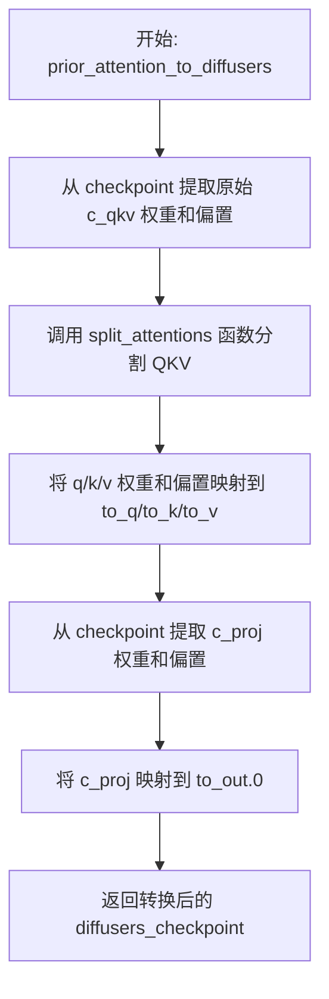

#### 带注释源码

```python
def prior_attention_to_diffusers(
    checkpoint, *, diffusers_attention_prefix, original_attention_prefix, attention_head_dim
):
    """
    将 Kandinsky 原始模型中的注意力机制权重转换为 Diffusers 格式
    
    参数:
        checkpoint: 原始模型的检查点字典
        diffusers_attention_prefix: Diffusers 格式中注意力层的前缀
        original_attention_prefix: 原始模型中注意力层的前缀
        attention_head_dim: 注意力头的维度
    返回:
        转换后的 Diffusers 格式检查点字典
    """
    # 初始化返回的检查点字典
    diffusers_checkpoint = {}

    # 处理原始模型中的 c_qkv 权重
    # <original>.c_qkv -> <diffusers>.{to_q, to_k, to_v}
    # 调用 split_attentions 函数将组合的 QKV 权重分割为独立的 q, k, v
    [q_weight, k_weight, v_weight], [q_bias, k_bias, v_bias] = split_attentions(
        weight=checkpoint[f"{original_attention_prefix}.c_qkv.weight"],
        bias=checkpoint[f"{original_attention_prefix}.c_qkv.bias"],
        split=3,  # 分割为 3 部分：query, key, value
        chunk_size=attention_head_dim,  # 按注意力头维度进行分块
    )

    # 更新检查点字典，将分割后的 QKV 权重映射到 Diffusers 格式的 to_q, to_k, to_v
    diffusers_checkpoint.update(
        {
            f"{diffusers_attention_prefix}.to_q.weight": q_weight,
            f"{diffusers_attention_prefix}.to_q.bias": q_bias,
            f"{diffusers_attention_prefix}.to_k.weight": k_weight,
            f"{diffusers_attention_prefix}.to_k.bias": k_bias,
            f"{diffusers_attention_prefix}.to_v.weight": v_weight,
            f"{diffusers_attention_prefix}.to_v.bias": v_bias,
        }
    )

    # 处理原始模型中的 c_proj 输出投影权重
    # <original>.c_proj -> <diffusers>.to_out.0
    diffusers_checkpoint.update(
        {
            f"{diffusers_attention_prefix}.to_out.0.weight": checkpoint[f"{original_attention_prefix}.c_proj.weight"],
            f"{diffusers_attention_prefix}.to_out.0.bias": checkpoint[f"{original_attention_prefix}.c_proj.bias"],
        }
    )

    # 返回转换后的检查点字典
    return diffusers_checkpoint
```


### `prior_ff_to_diffusers`

该函数是 Kandinsky 2.1 模型权重转换脚本中的核心组件，专门负责将原始 PriorTransformer（先验Transformer）中的前馈神经网络（Feed-Forward Network, FFN）层的权重键（keys）和值（values）从旧格式映射到 Diffusers 库指定的新格式。它主要处理 `c_fc`（全连接层）和 `c_proj`（投影层）的权重重命名，以适配 Diffusers 模型中 `net.{0}.proj` 和 `net.{2}` 的层级结构。

参数：

- `checkpoint`：`Dict[str, torch.Tensor]`，原始模型的完整状态字典（state dictionary），包含了旧版权重。
- `diffusers_ff_prefix`：`str`（Keyword-only），转换后在 Diffusers 模型中的层级前缀（例如 `transformer_blocks.0.ff`）。
- `original_ff_prefix`：`str`（Keyword-only），原始模型中的层级前缀（例如 `model.transformer.resblocks.0.mlp`）。

返回值：`Dict[str, torch.Tensor]`，返回一个包含转换后前馈层权重的字典，可直接用于更新 Diffusers 模型的检查点。

#### 流程图

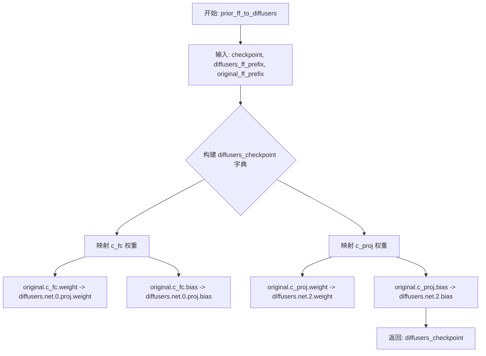

#### 带注释源码

```python
def prior_ff_to_diffusers(checkpoint, *, diffusers_ff_prefix, original_ff_prefix):
    """
    将原始 PriorTransformer 的前馈层 (FF) 权重转换为 Diffusers 格式。

    参数:
        checkpoint: 原始检查点字典。
        diffusers_ff_prefix: Diffusers 模型中 FF 层的前缀 (如 'transformer_blocks.0.ff')。
        original_ff_prefix: 原始模型中 FF 层的前缀 (如 'model.transformer.resblocks.0.mlp')。

    返回:
        包含转换后权重的字典。
    """
    diffusers_checkpoint = {
        # <original>.c_fc -> <diffusers>.net.0.proj
        # 原始模型中的全连接层 c_fc 对应 Diffusers 模型中的 net.0.proj (通常为第一个 Linear 层)
        f"{diffusers_ff_prefix}.net.{0}.proj.weight": checkpoint[f"{original_ff_prefix}.c_fc.weight"],
        f"{diffusers_ff_prefix}.net.{0}.proj.bias": checkpoint[f"{original_ff_prefix}.c_fc.bias"],
        
        # <original>.c_proj -> <diffusers>.net.2
        # 原始模型中的投影层 c_proj 对应 Diffusers 模型中的 net.2 (通常为第二个 Linear 层)
        f"{diffusers_ff_prefix}.net.{2}.weight": checkpoint[f"{original_ff_prefix}.c_proj.weight"],
        f"{diffusers_ff_prefix}.net.{2}.bias": checkpoint[f"{original_ff_prefix}.c_proj.bias"],
    }

    return diffusers_checkpoint
```


### `unet_model_from_original_config`

该函数用于根据预定义的 `UNET_CONFIG` 配置创建并返回一个 `UNet2DConditionModel` 实例，用于图像生成任务中的条件 UNet 模型。

参数：无（该函数不接受任何参数）

返回值：`UNet2DConditionModel`，返回一个配置好的 Diffusers UNet2DConditionModel 模型实例

#### 流程图

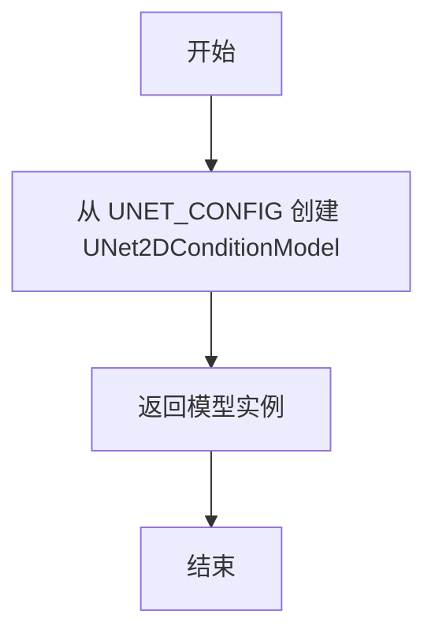

#### 带注释源码

```python
def unet_model_from_original_config():
    """
    根据预定义的 UNET_CONFIG 配置创建 UNet2DConditionModel 模型。
    
    UNET_CONFIG 包含以下关键配置:
    - act_fn: 激活函数 (silu)
    - addition_embed_type: 附加嵌入类型 (text_image)
    - attention_head_dim: 注意力头维度 (64)
    - block_out_channels: 块输出通道数 ([384, 768, 1152, 1536])
    - cross_attention_dim: 交叉注意力维度 (768)
    - in_channels: 输入通道数 (4)
    - out_channels: 输出通道数 (8)
    - layers_per_block: 每个块的层数 (3)
    - mid_block_type: 中间块类型 (UNetMidBlock2DSimpleCrossAttn)
    - down_block_types: 下采样块类型列表
    - up_block_types: 上采样块类型列表
    - 等等其他配置...
    """
    # 使用 UNET_CONFIG 字典中的参数实例化 UNet2DConditionModel
    model = UNet2DConditionModel(**UNET_CONFIG)

    # 返回配置好的模型实例
    return model
```


### `unet_original_checkpoint_to_diffusers_checkpoint`

该函数负责将原始 Kandinsky 2.1 模型的 UNet 检查点格式转换为 Diffusers 库兼容的格式，通过逐层映射原始模型的时间嵌入、输入块、下采样块、中间块、上采样块和输出层等组件的权重到目标格式。

参数：

- `model`：`UNet2DConditionModel`，Diffusers 库中的 UNet2DConditionModel 模型实例，用于获取模型结构信息（如 block 数量、attention 维度等）
- `checkpoint`：字典，原始 Kandinsky 2.1 模型的检查点文件，键为权重名称，值为权重张量

返回值：`字典`，转换后的 Diffusers 兼容检查点，键为新的权重名称，值为对应的权重张量

#### 流程图

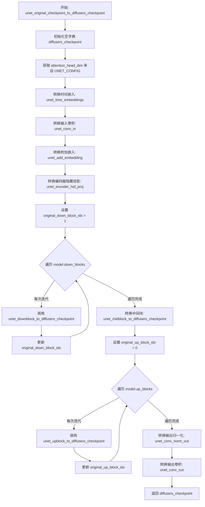

#### 带注释源码

```python
def unet_original_checkpoint_to_diffusers_checkpoint(model, checkpoint):
    """
    将原始 Kandinsky 2.1 UNet 检查点转换为 Diffusers 格式
    
    参数:
        model: Diffusers UNet2DConditionModel 实例，用于获取模型结构信息
        checkpoint: 原始模型检查点字典
    
    返回:
        转换后的 Diffusers 兼容检查点字典
    """
    # 初始化目标检查点字典
    diffusers_checkpoint = {}

    # 从配置中获取注意力头维度，用于后续注意力层的转换
    num_head_channels = UNET_CONFIG["attention_head_dim"]

    # 转换时间嵌入层：原始模型使用 time_embed.0/2，Diffusers 使用 time_embedding.linear_1/2
    diffusers_checkpoint.update(unet_time_embeddings(checkpoint))
    
    # 转换输入卷积层：原始模型 input_blocks.0.0 -> Diffusers conv_in
    diffusers_checkpoint.update(unet_conv_in(checkpoint))
    
    # 转换附加嵌入层（文本和图像嵌入）
    diffusers_checkpoint.update(unet_add_embedding(checkpoint))
    
    # 转换编码器隐藏投影层
    diffusers_checkpoint.update(unet_encoder_hid_proj(checkpoint))

    # =====================================================
    # 处理下采样块 (Down Blocks)
    # 原始模型: input_blocks -> Diffusers: down_blocks
    # =====================================================
    
    # 原始模型下采样块的起始索引为1（索引0已被conv_in占用）
    original_down_block_idx = 1

    # 遍历每个下采样块
    for diffusers_down_block_idx in range(len(model.down_blocks)):
        # 调用专门的转换函数处理单个下采样块
        checkpoint_update, num_original_down_blocks = unet_downblock_to_diffusers_checkpoint(
            model,
            checkpoint,
            diffusers_down_block_idx=diffusers_down_block_idx,
            original_down_block_idx=original_down_block_idx,
            num_head_channels=num_head_channels,
        )

        # 更新原始模型块的索引位置
        original_down_block_idx += num_original_down_blocks

        # 合并转换后的权重到目标检查点
        diffusers_checkpoint.update(checkpoint_update)

    # 完成下采样块转换

    # =====================================================
    # 处理中间块 (Mid Block)
    # 原始模型: middle_block -> Diffusers: mid_block
    # =====================================================
    diffusers_checkpoint.update(
        unet_midblock_to_diffusers_checkpoint(
            model,
            checkpoint,
            num_head_channels=num_head_channels,
        )
    )

    # =====================================================
    # 处理上采样块 (Up Blocks)
    # 原始模型: output_blocks -> Diffusers: up_blocks
    # =====================================================
    
    # 原始模型上采样块的起始索引为0
    original_up_block_idx = 0

    # 遍历每个上采样块
    for diffusers_up_block_idx in range(len(model.up_blocks)):
        # 调用专门的转换函数处理单个上采样块
        checkpoint_update, num_original_up_blocks = unet_upblock_to_diffusers_checkpoint(
            model,
            checkpoint,
            diffusers_up_block_idx=diffusers_up_block_idx,
            original_up_block_idx=original_up_block_idx,
            num_head_channels=num_head_channels,
        )

        # 更新原始模型块的索引位置
        original_up_block_idx += num_original_up_blocks

        # 合并转换后的权重到目标检查点
        diffusers_checkpoint.update(checkpoint_update)

    # 完成上采样块转换

    # 转换输出归一化层：原始模型 out.0 -> Diffusers conv_norm_out
    diffusers_checkpoint.update(unet_conv_norm_out(checkpoint))
    
    # 转换输出卷积层：原始模型 out.2 -> Diffusers conv_out
    diffusers_checkpoint.update(unet_conv_out(checkpoint))

    # 返回转换后的完整检查点
    return diffusers_checkpoint
```


### inpaint_unet_model_from_original_config

该函数用于从原始配置创建用于图像修复的UNet2DConditionModel模型实例。它基于预定义的INPAINT_UNET_CONFIG配置字典初始化模型，该配置定义了修复任务所需的特定架构参数（如输入通道数为9，输出通道数为8等）。

参数： 无

返回值：`UNet2DConditionModel`，返回创建的图像修复UNet模型实例

#### 流程图

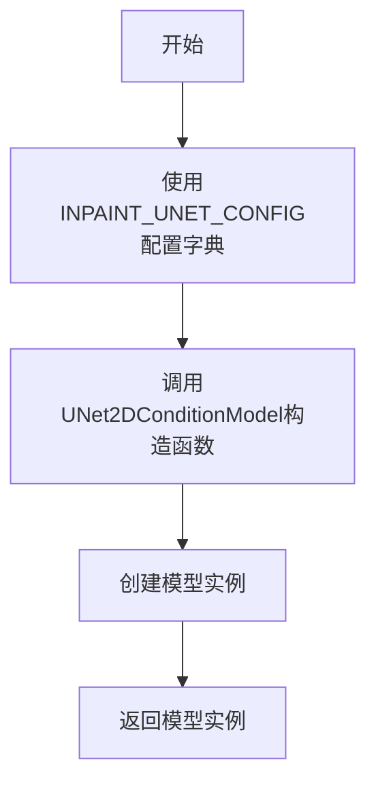

#### 带注释源码

```python
def inpaint_unet_model_from_original_config():
    """
    从原始配置创建用于图像修复的UNet2DConditionModel模型。
    
    该函数使用预定义的INPAINT_UNET_CONFIG配置字典来初始化模型。
    INPAINT_UNET_CONFIG与标准的UNET_CONFIG主要区别在于:
    - in_channels: 9 (包含RGB图像、mask和masked图像)
    - out_channels: 8 (包含RGB输出和alpha通道)
    - class_embeddings_concat: None (不同于标准UNet的False)
    
    Returns:
        UNet2DConditionModel: 配置好的图像修复UNet模型
    """
    # 使用INPAINT_UNET_CONFIG字典中的参数创建UNet2DConditionModel实例
    # 这些参数定义了模型的架构，如注意力头数、块通道数、块类型等
    model = UNet2DConditionModel(**INPAINT_UNET_CONFIG)

    return model
```

---

**相关配置信息：**

**INPAINT_UNET_CONFIG**：`dict`，定义图像修复UNet模型的配置字典，包含以下关键参数：
- `in_channels`: 9 (标准UNet为4)
- `out_channels`: 8 (标准UNet为4)
- `block_out_channels`: [384, 768, 1152, 1536]
- `down_block_types`: ["ResnetDownsampleBlock2D", "SimpleCrossAttnDownBlock2D", ...]
- `up_block_types`: ["SimpleCrossAttnUpBlock2D", "SimpleCrossAttnUpBlock2D", ..., "ResnetUpsampleBlock2D"]
- `cross_attention_dim`: 768
- `encoder_hid_dim`: 1024
- `encoder_hid_dim_type`: "text_image_proj"


### `inpaint_unet_original_checkpoint_to_diffusers_checkpoint`

该函数用于将 Kandinsky 2.1 模型的 inpaint UNet 检查点（原始格式）转换为 Diffusers 格式。它通过映射原始检查点中的各层（如 time_embed、input_blocks、output_blocks 等）到 Diffusers 模型的对应结构，生成新的权重字典。

参数：

- `model`：`UNet2DConditionModel`，已使用 `INPAINT_UNET_CONFIG` 初始化的 Diffusers UNet 模型，用于提供模型结构信息（如层数、块数等）
- `checkpoint`：字典，原始格式的模型检查点，包含以特定前缀（如 `time_embed.0.weight`、`input_blocks.0.0.weight` 等）命名的权重张量

返回值：`字典`，转换后的 Diffusers 格式检查点，键名为 Diffusers 模型对应的层名称（如 `time_embedding.linear_1.weight`、`down_blocks.0.resnets.0.norm1.weight` 等）

#### 流程图

```mermaid
flowchart TD
    A[开始: inpaint_unet_original_checkpoint_to_diffusers_checkpoint] --> B[初始化空字典 diffusers_checkpoint]
    B --> C[获取 num_head_channels = INPAINT_UNET_CONFIG['attention_head_dim']]
    C --> D[更新: unet_time_embeddings]
    D --> E[更新: unet_conv_in]
    E --> F[更新: unet_add_embedding]
    F --> G[更新: unet_encoder_hid_proj]
    G --> H[初始化 original_down_block_idx = 1]
    H --> I{遍历 down_blocks}
    I -->|每次迭代| J[调用 unet_downblock_to_diffusers_checkpoint]
    J --> K[更新 original_down_block_idx]
    K --> I
    I -->|遍历完成| L[更新: unet_midblock_to_diffusers_checkpoint]
    L --> M[初始化 original_up_block_idx = 0]
    M --> N{遍历 up_blocks}
    N -->|每次迭代| O[调用 unet_upblock_to_diffusers_checkpoint]
    O --> P[更新 original_up_block_idx]
    P --> N
    N -->|遍历完成| Q[更新: unet_conv_norm_out]
    Q --> R[更新: unet_conv_out]
    R --> S[返回 diffusers_checkpoint]
```

#### 带注释源码

```python
def inpaint_unet_original_checkpoint_to_diffusers_checkpoint(model, checkpoint):
    """
    将原始格式的 inpaint UNet 检查点转换为 Diffusers 格式。

    参数:
        model: UNet2DConditionModel 实例，提供模型结构信息
        checkpoint: 原始格式的检查点字典

    返回:
        转换后的 Diffusers 格式检查点字典
    """
    # 初始化空的 Diffusers 检查点字典
    diffusers_checkpoint = {}

    # 从配置中获取注意力头维度，用于后续层转换
    num_head_channels = INPAINT_UNET_CONFIG["attention_head_dim"]

    # 1. 转换时间嵌入层: <original>.time_embed -> <diffusers>.time_embedding
    diffusers_checkpoint.update(unet_time_embeddings(checkpoint))

    # 2. 转换输入卷积层: <original>.input_blocks.0 -> <diffusers>.conv_in
    diffusers_checkpoint.update(unet_conv_in(checkpoint))

    # 3. 转换附加嵌入层: 对应文本和图像嵌入投影
    diffusers_checkpoint.update(unet_add_embedding(checkpoint))

    # 4. 转换编码器隐藏层投影
    diffusers_checkpoint.update(unet_encoder_hid_proj(checkpoint))

    # 5. 转换下采样块: <original>.input_blocks -> <diffusers>.down_blocks
    # 原始检查点中下块索引从 1 开始（0 是 conv_in）
    original_down_block_idx = 1

    # 遍历模型的所有下采样块
    for diffusers_down_block_idx in range(len(model.down_blocks)):
        # 调用辅助函数转换单个下采样块
        checkpoint_update, num_original_down_blocks = unet_downblock_to_diffusers_checkpoint(
            model,
            checkpoint,
            diffusers_down_block_idx=diffusers_down_block_idx,
            original_down_block_idx=original_down_block_idx,
            num_head_channels=num_head_channels,
        )

        # 更新原始块索引，为下一个块做准备
        original_down_block_idx += num_original_down_blocks

        # 合并转换后的权重到主检查点字典
        diffusers_checkpoint.update(checkpoint_update)

    # 6. 转换中间块: <original>.middle_block -> <diffusers>.mid_block
    diffusers_checkpoint.update(
        unet_midblock_to_diffusers_checkpoint(
            model,
            checkpoint,
            num_head_channels=num_head_channels,
        )
    )

    # 7. 转换上采样块: <original>.output_blocks -> <diffusers>.up_blocks
    # 原始检查点中上块索引从 0 开始
    original_up_block_idx = 0

    # 遍历模型的所有上采样块
    for diffusers_up_block_idx in range(len(model.up_blocks)):
        # 调用辅助函数转换单个上采样块
        checkpoint_update, num_original_up_blocks = unet_upblock_to_diffusers_checkpoint(
            model,
            checkpoint,
            diffusers_up_block_idx=diffusers_up_block_idx,
            original_up_block_idx=original_up_block_idx,
            num_head_channels=num_head_channels,
        )

        # 更新原始块索引
        original_up_block_idx += num_original_up_blocks

        # 合并转换后的权重
        diffusers_checkpoint.update(checkpoint_update)

    # 8. 转换输出归一化和卷积层
    # <original>.out.0 -> <diffusers>.conv_norm_out
    diffusers_checkpoint.update(unet_conv_norm_out(checkpoint))

    # <original>.out.2 -> <diffusers>.conv_out
    diffusers_checkpoint.update(unet_conv_out(checkpoint))

    # 返回转换完成的 Diffusers 格式检查点
    return diffusers_checkpoint
```


### `unet_time_embeddings`

将原始 Kandinsky 模型的 `time_embed` 层权重转换为 Diffusers UNet 模型的 `time_embedding` 层权重。

参数：

- `checkpoint`：`Dict[str, Tensor]`，包含原始 Kandinsky 模型权重的字典，通过键（如 `"time_embed.0.weight"`）访问具体权重

返回值：`Dict[str, Tensor]`，包含转换后 Diffusers 格式时间嵌入层权重的字典，键为 `"time_embedding.linear_1.weight"`、`"time_embedding.linear_1.bias"`、`"time_embedding.linear_2.weight"`、`"time_embedding.linear_2.bias"`

#### 流程图

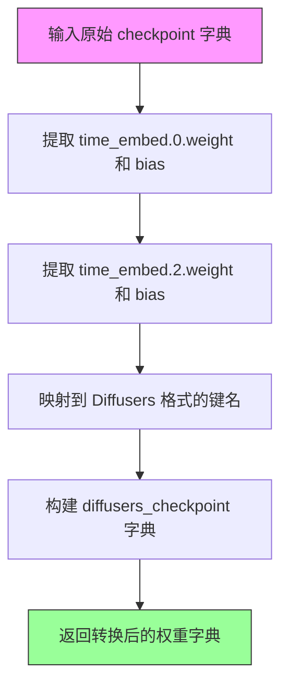

#### 带注释源码

```python
# <original>.time_embed -> <diffusers>.time_embedding
def unet_time_embeddings(checkpoint):
    """
    将原始 Kandinsky 模型的 time_embed 层转换为 Diffusers UNet 的 time_embedding 层
    
    参数:
        checkpoint: 包含原始模型权重的字典
        
    返回:
        包含转换后权重的字典，用于更新 Diffusers 模型
    """
    # 初始化空字典用于存储转换后的权重
    diffusers_checkpoint = {}

    # 从原始 checkpoint 中提取时间嵌入层的权重和偏置
    # 原始模型结构: time_embed.0 (第一层线性层) -> time_embed.2 (第二层线性层)
    # Diffusers 结构: time_embedding.linear_1 -> time_embedding.linear_2
    diffusers_checkpoint.update(
        {
            "time_embedding.linear_1.weight": checkpoint["time_embed.0.weight"],
            "time_embedding.linear_1.bias": checkpoint["time_embed.0.bias"],
            "time_embedding.linear_2.weight": checkpoint["time_embed.2.weight"],
            "time_embedding.linear_2.bias": checkpoint["time_embed.2.bias"],
        }
    )

    # 返回转换后的权重字典，供后续模型加载使用
    return diffusers_checkpoint
```


### `unet_conv_in`

该函数负责将原始 UNet 模型的输入卷积层（input_blocks.0.0）权重转换为 Diffusers 格式的 checkpoint，主要处理卷积层的 weight 和 bias 参数映射。

参数：

- `checkpoint`：`Dict`，原始模型的检查点字典，包含以字符串为键的模型权重

返回值：`Dict`，返回转换后的 Diffusers 格式检查点字典，包含 `conv_in.weight` 和 `conv_in.bias`

#### 流程图

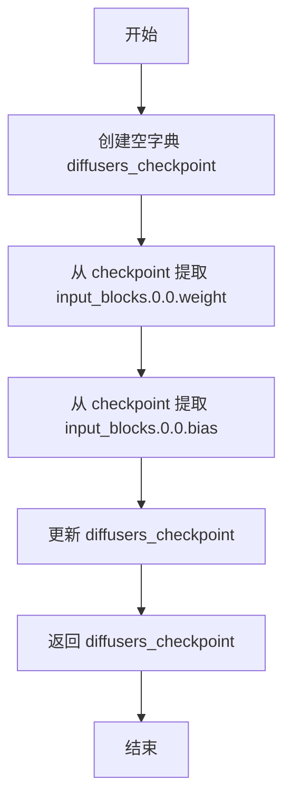

#### 带注释源码

```python
# <original>.input_blocks.0 -> <diffusers>.conv_in
def unet_conv_in(checkpoint):
    """
    将原始 UNet 模型的输入卷积层转换为 Diffusers 格式
    
    参数:
        checkpoint: 原始模型检查点字典
        
    返回:
        包含转换后卷积层权重的字典
    """
    # 初始化空字典用于存储转换后的检查点
    diffusers_checkpoint = {}

    # 从原始检查点提取 input_blocks.0.0 的权重和偏置
    # 并映射到 Diffusers 格式的 conv_in 层
    diffusers_checkpoint.update(
        {
            "conv_in.weight": checkpoint["input_blocks.0.0.weight"],
            "conv_in.bias": checkpoint["input_blocks.0.0.bias"],
        }
    )

    return diffusers_checkpoint
```


### `unet_add_embedding`

该函数负责将原始 Kandinsky 2.1 UNet 模型检查点中的文本和图像嵌入层参数转换为 Diffusers 格式的检查点。它通过重新映射原始检查点中的特定键（如 `ln_model_n`、`proj_n`、`img_layer` 等）到 Diffusers 模型期望的键名结构（`add_embedding.text_norm`、`add_embedding.text_proj`、`add_embedding.image_proj`），实现模型权重的格式转换。

参数：

- `checkpoint`：`Dict[str, torch.Tensor]`，原始 Kandinsky 2.1 UNet 模型的检查点字典，包含键如 `ln_model_n.weight`、`ln_model_n.bias`、`proj_n.weight`、`proj_n.bias`、`img_layer.weight`、`img_layer.bias` 等

返回值：`Dict[str, torch.Tensor]`，转换后的 Diffusers 格式检查点字典，包含键如 `add_embedding.text_norm.weight`、`add_embedding.text_norm.bias`、`add_embedding.text_proj.weight`、`add_embedding.text_proj.bias`、`add_embedding.image_proj.weight`、`add_embedding.image_proj.bias`

#### 流程图

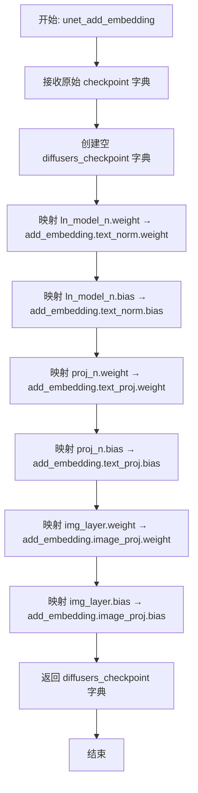

#### 带注释源码

```python
def unet_add_embedding(checkpoint):
    """
    将原始 Kandinsky 2.1 UNet 模型的嵌入层参数转换为 Diffusers 格式。
    
    原始模型使用 'ln_model_n'、'proj_n' 和 'img_layer' 来存储文本归一化、
    文本投影和图像投影层的权重，而 Diffusers 模型期望使用
    'add_embedding.text_norm'、'add_embedding.text_proj' 和 'add_embedding.image_proj' 结构。
    
    参数:
        checkpoint: 原始模型的检查点字典
        
    返回:
        转换后的 Diffusers 格式检查点字典
    """
    # 初始化空的输出字典
    diffusers_checkpoint = {}

    # 更新字典，映射原始检查点键名到 Diffusers 格式键名
    diffusers_checkpoint.update(
        {
            # 文本嵌入层的归一化层权重和偏置
            "add_embedding.text_norm.weight": checkpoint["ln_model_n.weight"],
            "add_embedding.text_norm.bias": checkpoint["ln_model_n.bias"],
            
            # 文本嵌入层的投影层权重和偏置
            "add_embedding.text_proj.weight": checkpoint["proj_n.weight"],
            "add_embedding.text_proj.bias": checkpoint["proj_n.bias"],
            
            # 图像嵌入层的投影层权重和偏置
            "add_embedding.image_proj.weight": checkpoint["img_layer.weight"],
            "add_embedding.image_proj.bias": checkpoint["img_layer.bias"],
        }
    )

    # 返回转换后的检查点字典
    return diffusers_checkpoint
```


### `unet_encoder_hid_proj`

将原始UNet模型中的encoder_hid_proj层（包含image_embeds和text_proj）的权重和偏置从原始检查点格式转换到diffusers检查点格式。

参数：

- `checkpoint`：`dict`，包含原始检查点数据的字典，键为原始模型层的参数名称

返回值：`dict`，转换后的diffusers格式检查点数据，包含encoder_hid_proj.image_embeds和encoder_hid_proj.text_proj的权重和偏置

#### 流程图

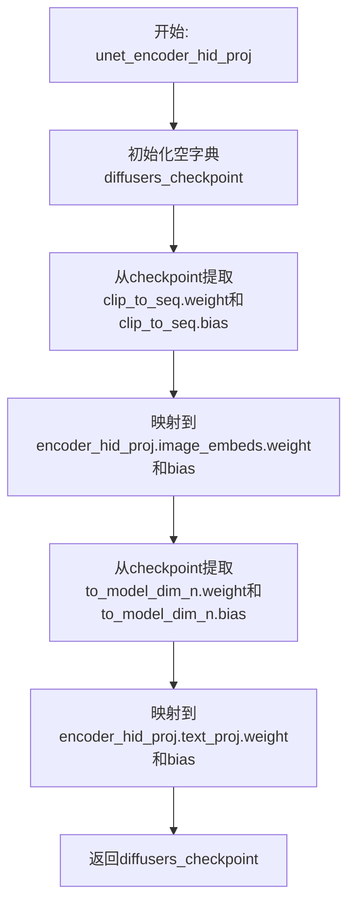

#### 带注释源码

```python
def unet_encoder_hid_proj(checkpoint):
    """
    将原始UNet模型的encoder_hid_proj层参数转换为diffusers格式
    
    参数:
        checkpoint: 包含原始模型权重的字典
        
    返回:
        转换后的diffusers格式检查点字典
    """
    # 初始化空字典用于存储转换后的检查点
    diffusers_checkpoint = {}

    # 更新检查点字典，将原始检查点中的clip_to_seq参数映射到
    # diffusers格式的encoder_hid_proj.image_embeds
    diffusers_checkpoint.update(
        {
            "encoder_hid_proj.image_embeds.weight": checkpoint["clip_to_seq.weight"],
            "encoder_hid_proj.image_embeds.bias": checkpoint["clip_to_seq.bias"],
            "encoder_hid_proj.text_proj.weight": checkpoint["to_model_dim_n.weight"],
            "encoder_hid_proj.text_proj.bias": checkpoint["to_model_dim_n.bias"],
        }
    )

    # 返回转换后的检查点字典
    return diffusers_checkpoint
```


### `unet_conv_norm_out`

该函数负责将原始 Kandinsky 2.1 UNet 模型输出块中的第一个子层（通常为归一化层，`out.0`）的权重和偏置映射到 Diffusers 格式的 UNet2DConditionModel 检查点中（`conv_norm_out`）。

参数：

-  `checkpoint`：`Dict[str, torch.Tensor]`，原始 Kandinsky 2.1 UNet 模型的完整状态字典（state dictionary）。

返回值：`Dict[str, torch.Tensor]`，包含映射后的 `conv_norm_out.weight` 和 `conv_norm_out.bias` 的子字典。

#### 流程图

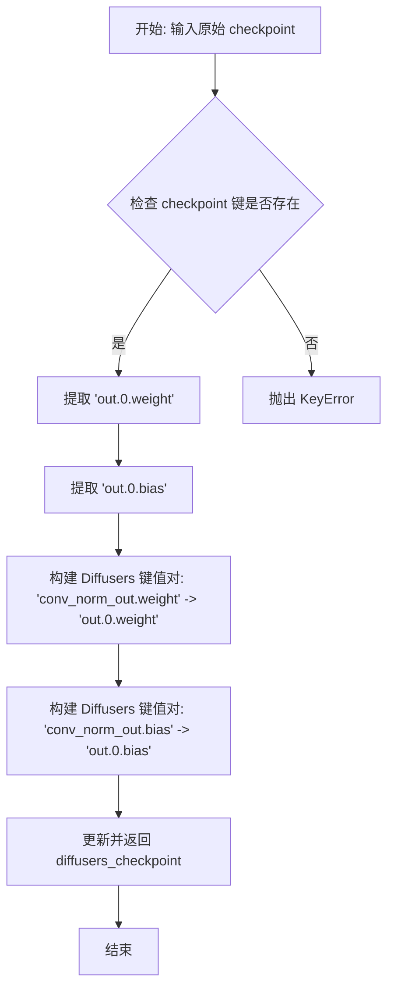

#### 带注释源码

```python
# <original>.out.0 -> <diffusers>.conv_norm_out
def unet_conv_norm_out(checkpoint):
    """
    将原始 UNet 输出块的归一化层转换为 Diffusers 格式。

    参数:
        checkpoint (dict): 原始模型的权重字典。

    返回:
        dict: 包含转换后归一化层权重的字典。
    """
    diffusers_checkpoint = {}

    # 从原始检查点中提取 'out.0' 层的权重和偏置
    # 在原始模型中，这通常对应输出部分的第一个卷积/归一化操作
    diffusers_checkpoint.update(
        {
            "conv_norm_out.weight": checkpoint["out.0.weight"],
            "conv_norm_out.bias": checkpoint["out.0.bias"],
        }
    )

    return diffusers_checkpoint
```


### `unet_conv_out`

该函数用于将原始 Kandinsky 2.1 模型的输出卷积层（`out.2`）的参数映射并转换为 Diffusers 格式的 UNet 输出卷积层（`conv_out`）。它从原始检查点字典中提取权重和偏置，并使用新的键名更新目标检查点字典，以适配 Diffusers 库的网络结构。

参数：

- `checkpoint`：`Dict`，原始 Kandinsky 2.1 模型的检查点字典，包含键 `"out.2.weight"` 和 `"out.2.bias"`

返回值：`Dict`，转换后的 Diffusers 格式检查点字典，包含键 `"conv_out.weight"` 和 `"conv_out.bias"`

#### 流程图

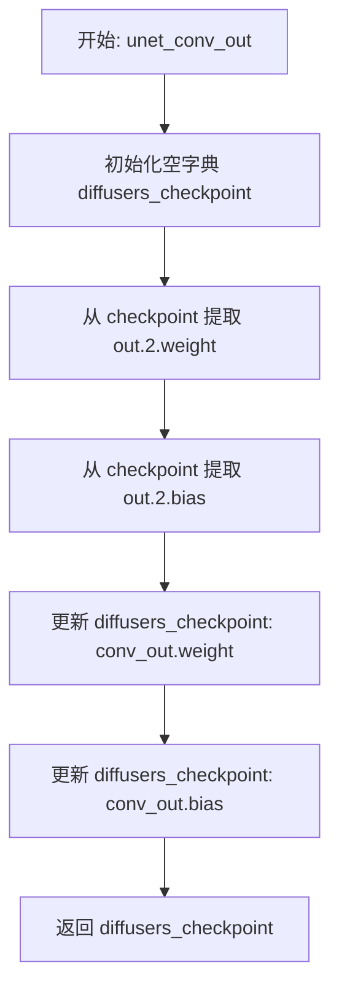

#### 带注释源码

```python
# <original>.out.2 -> <diffusers>.conv_out
def unet_conv_out(checkpoint):
    # 初始化一个空字典用于存储转换后的 Diffusers 格式参数
    diffusers_checkpoint = {}

    # 将原始检查点中的输出卷积层参数映射到 Diffusers 格式的键名
    # 原始键名: out.2.weight -> 目标键名: conv_out.weight
    # 原始键名: out.2.bias   -> 目标键名: conv_out.bias
    diffusers_checkpoint.update(
        {
            "conv_out.weight": checkpoint["out.2.weight"],
            "conv_out.bias": checkpoint["out.2.bias"],
        }
    )

    # 返回转换后的检查点字典
    return diffusers_checkpoint
```


### `unet_downblock_to_diffusers_checkpoint`

该函数负责将原始Kandinsky 2.1模型的UNet下采样块（input_blocks）转换为Diffusers格式的checkpoint（down_blocks）。它遍历下采样块中的resnet层和注意力层，调用相应的转换函数完成参数映射，并返回转换后的checkpoint和处理的原始块数量。

参数：

- `model`：`UNet2DConditionModel`，Diffusers UNet模型实例，用于获取模型结构信息（如resnets、attentions的数量）
- `checkpoint`：字典，原始Kandinsky模型的checkpoint，键为参数名称，值为参数张量
- `diffusers_down_block_idx`：整数，Diffusers格式中down_blocks的索引
- `original_down_block_idx`：整数，原始格式中input_blocks的索引
- `num_head_channels`：整数，注意力头的维度，用于分割QKV权重

返回值：元组 `(dict, int)`，第一个元素是转换后的Diffusers格式checkpoint字典，第二个元素是处理的原始下采样块数量

#### 流程图

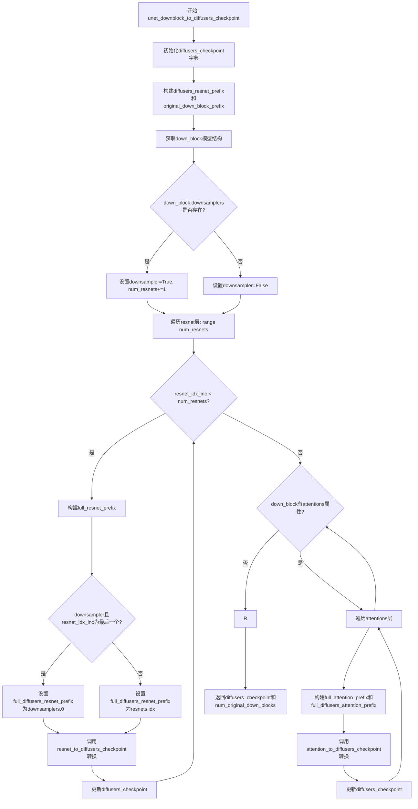

#### 带注释源码

```python
# <original>.input_blocks -> <diffusers>.down_blocks
def unet_downblock_to_diffusers_checkpoint(
    model, checkpoint, *, diffusers_down_block_idx, original_down_block_idx, num_head_channels
):
    """
    将原始UNet的下采样块(input_blocks)转换为Diffusers格式的down_blocks
    
    参数:
        model: Diffusers的UNet2DConditionModel实例
        checkpoint: 原始模型的checkpoint字典
        diffusers_down_block_idx: Diffusers中down_blocks的索引
        original_down_block_idx: 原始模型中input_blocks的起始索引
        num_head_channels: 注意力头的维度
    """
    diffusers_checkpoint = {}

    # 构建Diffusers格式的resnet前缀: down_blocks.{idx}.resnets
    diffusers_resnet_prefix = f"down_blocks.{diffusers_down_block_idx}.resnets"
    # 原始格式的下采样块前缀
    original_down_block_prefix = "input_blocks"

    # 获取当前下采样块模型
    down_block = model.down_blocks[diffusers_down_block_idx]

    # 获取resnet层数量
    num_resnets = len(down_block.resnets)

    # 检查是否存在下采样器
    if down_block.downsamplers is None:
        downsampler = False
    else:
        # 确认只有一个下采样器
        assert len(down_block.downsamplers) == 1
        downsampler = True
        # 下采样块也算一个resnet
        num_resnets += 1

    # 遍历所有resnet层进行转换
    for resnet_idx_inc in range(num_resnets):
        # 构建原始模型的resnet完整路径: input_blocks.{idx}.0
        full_resnet_prefix = f"{original_down_block_prefix}.{original_down_block_idx + resnet_idx_inc}.0"

        if downsampler and resnet_idx_inc == num_resnets - 1:
            # 这是下采样块
            full_diffusers_resnet_prefix = f"down_blocks.{diffusers_down_block_idx}.downsamplers.0"
        else:
            # 这是常规resnet块
            full_diffusers_resnet_prefix = f"{diffusers_resnet_prefix}.{resnet_idx_inc}"

        # 调用resnet转换函数并更新checkpoint
        diffusers_checkpoint.update(
            resnet_to_diffusers_checkpoint(
                checkpoint, resnet_prefix=full_resnet_prefix, diffusers_resnet_prefix=full_diffusers_resnet_prefix
            )
        )

    # 如果存在注意力层，则转换注意力层
    if hasattr(down_block, "attentions"):
        num_attentions = len(down_block.attentions)
        diffusers_attention_prefix = f"down_blocks.{diffusers_down_block_idx}.attentions"

        for attention_idx_inc in range(num_attentions):
            # 构建原始注意力层路径: input_blocks.{idx}.1
            full_attention_prefix = f"{original_down_block_prefix}.{original_down_block_idx + attention_idx_inc}.1"
            full_diffusers_attention_prefix = f"{diffusers_attention_prefix}.{attention_idx_inc}"

            # 调用注意力层转换函数并更新checkpoint
            diffusers_checkpoint.update(
                attention_to_diffusers_checkpoint(
                    checkpoint,
                    attention_prefix=full_attention_prefix,
                    diffusers_attention_prefix=full_diffusers_attention_prefix,
                    num_head_channels=num_head_channels,
                )
            )

    # 计算处理的下采样块数量
    num_original_down_blocks = num_resnets

    # 返回转换后的checkpoint和处理的块数量
    return diffusers_checkpoint, num_original_down_blocks
```


### `unet_midblock_to_diffusers_checkpoint`

该函数负责将UNet模型中间块（middle block）的原始检查点参数转换为diffusers格式。它处理middle_block中的ResNet块和可选的注意力块，将原始模型中的参数键名映射到diffusers模型对应的键名。

参数：

- `model`：`UNet2DConditionModel`，diffusers UNet模型实例，用于获取模型结构信息（如是否有注意力层）
- `checkpoint`：字典，原始格式的模型检查点，包含键如`middle_block.0.in_layers.0.weight`等
- `num_head_channels`：整数，注意力头的维度，用于分割QKV权重

返回值：`字典`，转换后的diffusers格式检查点，包含键如`mid_block.resnets.0.norm1.weight`等

#### 流程图

```mermaid
flowchart TD
    A[开始: unet_midblock_to_diffusers_checkpoint] --> B[初始化空字典 diffusers_checkpoint]
    B --> C[设置 original_block_idx = 0]
    C --> D[调用 resnet_to_diffusers_checkpoint<br/>转换 middle_block.0 到 mid_block.resnets.0]
    D --> E[original_block_idx += 1]
    E --> F{检查 model.mid_block.attentions 是否存在<br/>且注意力层不为 None}
    F -->|是| G[调用 attention_to_diffusers_checkpoint<br/>转换注意力层]
    G --> H[original_block_idx += 1]
    F -->|否| I[跳过注意力层转换]
    H --> J
    I --> J[调用 resnet_to_diffusers_checkpoint<br/>转换 middle_block.{original_block_idx} 到 mid_block.resnets.1]
    J --> K[返回 diffusers_checkpoint]
```

#### 带注释源码

```python
# <original>.middle_block -> <diffusers>.mid_block
def unet_midblock_to_diffusers_checkpoint(model, checkpoint, *, num_head_channels):
    """
    将UNet中间块的原始检查点转换为diffusers格式
    
    参数:
        model: UNet2DConditionModel模型实例
        checkpoint: 原始格式的检查点字典
        num_head_channels: 注意力头维度，用于QKV分割
    """
    diffusers_checkpoint = {}

    # block 0 - 处理第一个ResNet块
    original_block_idx = 0

    # 将原始的 middle_block.0 转换为 diffusers 的 mid_block.resnets.0
    diffusers_checkpoint.update(
        resnet_to_diffusers_checkpoint(
            checkpoint,
            diffusers_resnet_prefix="mid_block.resnets.0",
            resnet_prefix=f"middle_block.{original_block_idx}",
        )
    )

    original_block_idx += 1

    # optional block 1 - 处理可选的注意力块
    # 检查模型中间块是否包含注意力层
    if hasattr(model.mid_block, "attentions") and model.mid_block.attentions[0] is not None:
        # 将原始的注意力层参数转换为diffusers格式
        diffusers_checkpoint.update(
            attention_to_diffusers_checkpoint(
                checkpoint,
                diffusers_attention_prefix="mid_block.attentions.0",
                attention_prefix=f"middle_block.{original_block_idx}",
                num_head_channels=num_head_channels,
            )
        )
        original_block_idx += 1

    # block 1 or block 2 - 处理最后一个ResNet块
    # 根据前面是否处理了注意力块，决定使用 middle_block.1 或 middle_block.2
    diffusers_checkpoint.update(
        resnet_to_diffusers_checkpoint(
            checkpoint,
            diffusers_resnet_prefix="mid_block.resnets.1",
            resnet_prefix=f"middle_block.{original_block_idx}",
        )
    )

    return diffusers_checkpoint
```


### `unet_upblock_to_diffusers_checkpoint`

该函数负责将原始 Kandinsky 模型的 UNet 上采样块（output_blocks）检查点转换为 Diffusers 格式的检查点，处理 ResNet 块、上采样器和注意力机制的权重映射。

参数：

- `model`：`UNet2DConditionModel`，Diffusers 格式的 UNet 模型实例，用于获取模型结构信息（如块数量、层数等）
- `checkpoint`：字典，原始 Kandinsky 模型的检查点权重字典
- `diffusers_up_block_idx`：整数，Diffusers 格式中当前上采样块的索引
- `original_up_block_idx`：整数，原始检查点中当前上采样块的起始索引
- `num_head_channels`：整数，注意力头的维度，用于分割 QKV 权重

返回值：元组 `(dict, int)`，第一个元素是转换后的 Diffusers 格式检查点字典，第二个元素是原始检查点中消耗的上采样块数量

#### 流程图

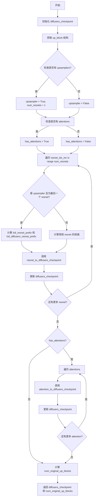

#### 带注释源码

```python
def unet_upblock_to_diffusers_checkpoint(
    model, checkpoint, *, diffusers_up_block_idx, original_up_block_idx, num_head_channels
):
    """
    将原始 Kandinsky 模型的 UNet 上采样块检查点转换为 Diffusers 格式
    
    参数:
        model: Diffusers 格式的 UNet2DConditionModel 实例
        checkpoint: 原始模型检查点字典
        diffusers_up_block_idx: Diffusers 格式的上块索引
        original_up_block_idx: 原始检查点的上块起始索引
        num_head_channels: 注意力头维度
    
    返回:
        (转换后的检查点字典, 消耗的原始块数量)
    """
    diffusers_checkpoint = {}

    # 构建 Diffusers 和原始检查点的前缀路径
    diffusers_resnet_prefix = f"up_blocks.{diffusers_up_block_idx}.resnets"
    original_up_block_prefix = "output_blocks"

    # 获取当前上块
    up_block = model.up_blocks[diffusers_up_block_idx]

    # 计算该块包含的 resnet 数量
    num_resnets = len(up_block.resnets)

    # 检查是否有上采样器，如果有则 resnet 数量加 1
    if up_block.upsamplers is None:
        upsampler = False
    else:
        assert len(up_block.upsamplers) == 1
        upsampler = True
        # The upsample block is also a resnet
        num_resnets += 1

    # 检查该块是否包含注意力机制
    has_attentions = hasattr(up_block, "attentions")

    # 遍历处理每个 resnet 块
    for resnet_idx_inc in range(num_resnets):
        if upsampler and resnet_idx_inc == num_resnets - 1:
            # 这是上采样块，需要特殊处理索引
            if has_attentions:
                # 存在中间注意力块，需要跳过
                original_resnet_block_idx = 2
            else:
                original_resnet_block_idx = 1

            # 因为最后两个 resnet 在同一个输出块中，所以需要减 1
            full_resnet_prefix = (
                f"{original_up_block_prefix}.{original_up_block_idx + resnet_idx_inc - 1}.{original_resnet_block_idx}"
            )

            full_diffusers_resnet_prefix = f"up_blocks.{diffusers_up_block_idx}.upsamplers.0"
        else:
            # 这是常规的 resnet 块
            full_resnet_prefix = f"{original_up_block_prefix}.{original_up_block_idx + resnet_idx_inc}.0"
            full_diffusers_resnet_prefix = f"{diffusers_resnet_prefix}.{resnet_idx_inc}"

        # 调用 resnet 转换函数更新检查点
        diffusers_checkpoint.update(
            resnet_to_diffusers_checkpoint(
                checkpoint, resnet_prefix=full_resnet_prefix, diffusers_resnet_prefix=full_diffusers_resnet_prefix
            )
        )

    # 处理注意力层（如果存在）
    if has_attentions:
        num_attentions = len(up_block.attentions)
        diffusers_attention_prefix = f"up_blocks.{diffusers_up_block_idx}.attentions"

        for attention_idx_inc in range(num_attentions):
            full_attention_prefix = f"{original_up_block_prefix}.{original_up_block_idx + attention_idx_inc}.1"
            full_diffusers_attention_prefix = f"{diffusers_attention_prefix}.{attention_idx_inc}"

            diffusers_checkpoint.update(
                attention_to_diffusers_checkpoint(
                    checkpoint,
                    attention_prefix=full_attention_prefix,
                    diffusers_attention_prefix=full_diffusers_attention_prefix,
                    num_head_channels=num_head_channels,
                )
            )

    # 计算消耗的原始上块数量
    num_original_down_blocks = num_resnets - 1 if upsampler else num_resnets

    return diffusers_checkpoint, num_original_down_blocks
```


### `resnet_to_diffusers_checkpoint`

该函数负责将原始Kandinsky模型的ResNet块参数转换为Diffusers格式的对应参数，包括归一化层、卷积层、时间嵌入投影以及可选的跳跃连接权重。

参数：

- `checkpoint`：`dict`，原始Kandinsky模型的检查点字典，包含各种层权重
- `diffusers_resnet_prefix`：`str`，Diffusers模型中ResNet块的前缀路径，用于构建目标键名
- `resnet_prefix`：`str`，原始模型中ResNet块的前缀路径，用于从检查点中提取源键名

返回值：`dict`，转换后的Diffusers格式检查点字典，包含映射后的权重键值对

#### 流程图

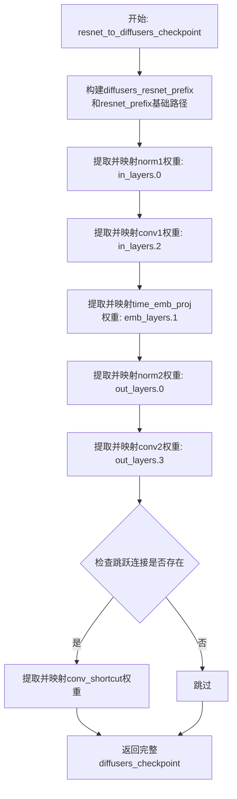

#### 带注释源码

```python
def resnet_to_diffusers_checkpoint(checkpoint, *, diffusers_resnet_prefix, resnet_prefix):
    """
    将原始Kandinsky模型的ResNet块参数转换为Diffusers格式
    
    参数:
        checkpoint: 原始模型检查点字典
        diffusers_resnet_prefix: Diffusers模型中ResNet块的前缀
        resnet_prefix: 原始模型中ResNet块的前缀
    """
    # 初始化目标检查点字典，映射原始键名到Diffusers格式键名
    diffusers_checkpoint = {
        # 第一个归一化层: <original>.in_layers.0 -> <diffusers>.norm1
        f"{diffusers_resnet_prefix}.norm1.weight": checkpoint[f"{resnet_prefix}.in_layers.0.weight"],
        f"{diffusers_resnet_prefix}.norm1.bias": checkpoint[f"{resnet_prefix}.in_layers.0.bias"],
        
        # 第一个卷积层: <original>.in_layers.2 -> <diffusers>.conv1
        f"{diffusers_resnet_prefix}.conv1.weight": checkpoint[f"{resnet_prefix}.in_layers.2.weight"],
        f"{diffusers_resnet_prefix}.conv1.bias": checkpoint[f"{resnet_prefix}.in_layers.2.bias"],
        
        # 时间嵌入投影层: <original>.emb_layers.1 -> <diffusers>.time_emb_proj
        f"{diffusers_resnet_prefix}.time_emb_proj.weight": checkpoint[f"{resnet_prefix}.emb_layers.1.weight"],
        f"{diffusers_resnet_prefix}.time_emb_proj.bias": checkpoint[f"{resnet_prefix}.emb_layers.1.bias"],
        
        # 第二个归一化层: <original>.out_layers.0 -> <diffusers>.norm2
        f"{diffusers_resnet_prefix}.norm2.weight": checkpoint[f"{resnet_prefix}.out_layers.0.weight"],
        f"{diffusers_resnet_prefix}.norm2.bias": checkpoint[f"{resnet_prefix}.out_layers.0.bias"],
        
        # 第二个卷积层: <original>.out_layers.3 -> <diffusers>.conv2
        f"{diffusers_resnet_prefix}.conv2.weight": checkpoint[f"{resnet_prefix}.out_layers.3.weight"],
        f"{diffusers_resnet_prefix}.conv2.bias": checkpoint[f"{resnet_prefix}.out_layers.3.bias"],
    }

    # 构建跳跃连接的前缀路径
    skip_connection_prefix = f"{resnet_prefix}.skip_connection"

    # 检查是否存在跳跃连接权重（如残差连接）
    if f"{skip_connection_prefix}.weight" in checkpoint:
        diffusers_checkpoint.update(
            {
                # 跳跃连接卷积: <original>.skip_connection -> <diffusers>.conv_shortcut
                f"{diffusers_resnet_prefix}.conv_shortcut.weight": checkpoint[f"{skip_connection_prefix}.weight"],
                f"{diffusers_resnet_prefix}.conv_shortcut.bias": checkpoint[f"{skip_connection_prefix}.bias"],
            }
        )

    # 返回转换后的Diffusers格式检查点
    return diffusers_checkpoint
```


### `attention_to_diffusers_checkpoint`

该函数用于将原始UNet模型中的注意力层（Attention Layer）检查点参数转换为Diffusers格式的检查点。它处理注意力层的归一化权重、QKV（Query-Key-Value）投影权重、以及编码器键值对的投影权重，将它们从原始格式重新映射到Diffusers模型期望的键名结构中。

参数：

- `checkpoint`：`dict`，原始模型的完整检查点字典，用于从中提取注意力层的参数
- `diffusers_attention_prefix`：`str`，Diffusers格式中注意力层的前缀路径，用于构建目标键名
- `attention_prefix`：`str`，原始格式中注意力层的前缀路径，用于从检查点中定位源键名
- `num_head_channels`：`int`，每个注意力头的通道数，用于在分割QKV权重时确定分块大小

返回值：`dict`，转换后的Diffusers格式检查点字典，包含注意力层的所有参数

#### 流程图

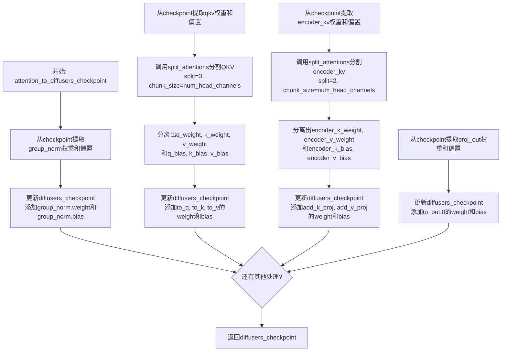

#### 带注释源码

```python
def attention_to_diffusers_checkpoint(checkpoint, *, diffusers_attention_prefix, attention_prefix, num_head_channels):
    """
    将原始UNet模型的注意力层检查点转换为Diffusers格式
    
    参数:
        checkpoint: 原始模型的完整检查点字典
        diffusers_attention_prefix: Diffusers格式中注意力层的前缀路径
        attention_prefix: 原始格式中注意力层的前缀路径
        num_head_channels: 每个注意力头的通道数
    
    返回:
        转换后的Diffusers格式检查点字典
    """
    diffusers_checkpoint = {}

    # <original>.norm -> <diffusers>.group_norm
    # 处理归一化层：将原始的norm层转换为Diffusers的group_norm
    diffusers_checkpoint.update(
        {
            f"{diffusers_attention_prefix}.group_norm.weight": checkpoint[f"{attention_prefix}.norm.weight"],
            f"{diffusers_attention_prefix}.group_norm.bias": checkpoint[f"{attention_prefix}.norm.bias"],
        }
    )

    # <original>.qkv -> <diffusers>.{query, key, value}
    # 处理QKV投影：将原始的qkv权重分割为query、key、value三个独立的投影
    # 原始格式中qkv.weight的shape为[3*num_head_channels, hidden_dim, 1, 1]
    # 需要按chunk_size=num_head_channels分割成三份
    [q_weight, k_weight, v_weight], [q_bias, k_bias, v_bias] = split_attentions(
        weight=checkpoint[f"{attention_prefix}.qkv.weight"][:, :, 0],  # 去除最后两个维度 [3*num_head_channels, hidden_dim]
        bias=checkpoint[f"{attention_prefix}.qkv.bias"],
        split=3,  # 分割成3份：query, key, value
        chunk_size=num_head_channels,
    )

    # 更新检查点：添加to_q, to_k, to_v的权重和偏置
    diffusers_checkpoint.update(
        {
            f"{diffusers_attention_prefix}.to_q.weight": q_weight,
            f"{diffusers_attention_prefix}.to_q.bias": q_bias,
            f"{diffusers_attention_prefix}.to_k.weight": k_weight,
            f"{diffusers_attention_prefix}.to_k.bias": k_bias,
            f"{diffusers_attention_prefix}.to_v.weight": v_weight,
            f"{diffusers_attention_prefix}.to_v.bias": v_bias,
        }
    )

    # <original>.encoder_kv -> <diffusers>.{context_key, context_value}
    # 处理编码器键值对：这是Cross Attention中用于处理上下文（encoder hidden states）的部分
    # 原始格式中encoder_kv.weight的shape为[2*num_head_channels, hidden_dim, 1, 1]
    # 需要按chunk_size=num_head_channels分割成2份：encoder_key和encoder_value
    [encoder_k_weight, encoder_v_weight], [encoder_k_bias, encoder_v_bias] = split_attentions(
        weight=checkpoint[f"{attention_prefix}.encoder_kv.weight"][:, :, 0],
        bias=checkpoint[f"{attention_prefix}.encoder_kv.bias"],
        split=2,  # 分割成2份：encoder_key, encoder_value
        chunk_size=num_head_channels,
    )

    # 更新检查点：添加add_k_proj, add_v_proj的权重和偏置
    # 这些是用于处理encoder hidden states的键值投影
    diffusers_checkpoint.update(
        {
            f"{diffusers_attention_prefix}.add_k_proj.weight": encoder_k_weight,
            f"{diffusers_attention_prefix}.add_k_proj.bias": encoder_k_bias,
            f"{diffusers_attention_prefix}.add_v_proj.weight": encoder_v_weight,
            f"{diffusers_attention_prefix}.add_v_proj.bias": encoder_v_bias,
        }
    )

    # <original>.proj_out (1d conv) -> <diffusers>.proj_attn (linear)
    # 处理输出投影：将原始的1D卷积 proj_out 转换为线性层 proj_attn
    # 原始格式中proj_out.weight的shape为[hidden_dim, num_head_channels, 1, 1]
    diffusers_checkpoint.update(
        {
            f"{diffusers_attention_prefix}.to_out.0.weight": checkpoint[f"{attention_prefix}.proj_out.weight"][
                :, :, 0
            ],
            f"{diffusers_attention_prefix}.to_out.0.bias": checkpoint[f"{attention_prefix}.proj_out.bias"],
        }
    )

    return diffusers_checkpoint
```


### `split_attentions`

该函数用于将原始检查点中的合并权重矩阵（如 QKV 权重）按行分割成多个独立的权重块（例如 Q、K、V）。它按照 `chunk_size` 大小将权重和偏置张量按顺序划分，并循环分配到 `split` 数量的输出中，常用于将原始 Kandinsky 模型的注意力权重转换为 Diffusers 格式。

参数：

- `weight`：`torch.Tensor`，原始检查点中的合并权重矩阵，需要按行分割
- `bias`：`torch.Tensor`，原始检查点中的合并偏置向量，需要按行分割
- `split`：`int`，分割的数量（例如 3 表示 QKV，2 表示 KV）
- `chunk_size`：`int`，每个分割块的高度（行数）

返回值：`(list[torch.Tensor], list[torch.Tensor])`，返回一个元组，包含两个列表——第一个是分割后的权重列表，第二个是分割后的偏置列表，每个列表的长度等于 `split`

#### 流程图

```mermaid
flowchart TD
    A[开始: split_attentions] --> B[初始化空列表: weights = [None] * split, biases = [None] * split]
    B --> C[初始化索引: weights_biases_idx = 0]
    C --> D[for loop: starting_row_index 从 0 到 weight.shape[0], 步长为 chunk_size]
    D --> E[计算当前块行索引: row_indices = torch.arange starting_row_index 到 starting_row_index + chunk_size]
    E --> F[提取权重块: weight_rows = weight[row_indices, :]]
    F --> G[提取偏置块: bias_rows = bias[row_indices]]
    G --> H{判断: weights[weights_biases_idx] is None?}
    H -->|是| I[直接赋值: weights[weights_biases_idx] = weight_rows, biases[weights_biases_idx] = bias_rows]
    H -->|否| J[拼接: weights[weights_biases_idx] = torch.concat [...], biases[weights_biases_idx] = torch.concat [...]]
    I --> K[更新索引: weights_biases_idx = (weights_biases_idx + 1) % split]
    J --> K
    K --> L{loop 是否继续?}
    L -->|是| D
    L -->|否| M[返回: (weights, biases)]
```

#### 带注释源码

```python
def split_attentions(*, weight, bias, split, chunk_size):
    """
    将原始检查点中的合并权重矩阵（如 QKV）按行分割成多个独立的权重块。
    
    参数:
        weight: torch.Tensor，原始合并权重矩阵 (shape: [total_rows, hidden_dim])
        bias: torch.Tensor，原始合并偏置向量 (shape: [total_rows])
        split: int，分割的数量（3 表示 QKV，2 表示 KV）
        chunk_size: int，每个块的高度（行数）
    
    返回:
        (weights, biases): 元组，包含两个列表，分别存储分割后的权重和偏置
    """
    # 初始化存储分割结果的列表
    weights = [None] * split  # 例如 split=3 时: [None, None, None]
    biases = [None] * split   # 例如 split=3 时: [None, None, None]

    # 当前处理的分割块索引（循环使用）
    weights_biases_idx = 0

    # 按 chunk_size 步长遍历权重矩阵的所有行
    for starting_row_index in range(0, weight.shape[0], chunk_size):
        # 计算当前块的行索引范围 [starting_row_index, starting_row_index + chunk_size)
        row_indices = torch.arange(starting_row_index, starting_row_index + chunk_size)

        # 提取当前块的权重行
        weight_rows = weight[row_indices, :]
        # 提取当前块的偏置行
        bias_rows = bias[row_indices]

        if weights[weights_biases_idx] is None:
            # 第一次遇到该索引，直接赋值
            assert weights[weights_biases_idx] is None
            weights[weights_biases_idx] = weight_rows
            biases[weights_biases_idx] = bias_rows
        else:
            # 已有数据，使用 concat 拼接
            assert weights[weights_biases_idx] is not None
            weights[weights_biases_idx] = torch.concat([weights[weights_biases_idx], weight_rows])
            biases[weights_biases_idx] = torch.concat([biases[weights_biases_idx], bias_rows])

        # 循环更新索引: 0 -> 1 -> 2 -> 0 -> ...
        weights_biases_idx = (weights_biases_idx + 1) % split

    return weights, biases
```


### `movq_model_from_original_config`

该函数用于根据预定义的 MOVQ_CONFIG 配置创建并返回一个 VQModel（Vector Quantized Model）实例，用于处理图像的编解码操作。

参数：

- 该函数没有显式参数。

返回值：`VQModel`，返回一个配置好的 VQModel 实例，用于后续的模型权重转换流程。

#### 流程图

```mermaid
flowchart TD
    A[开始] --> B[根据MOVQ_CONFIG配置创建VQModel实例]
    B --> C[返回VQModel实例]
    C --> D[结束]
```

#### 带注释源码

```python
def movq_model_from_original_config():
    """
    从原始配置创建 MOVQ 模型实例。
    
    该函数使用预定义的 MOVQ_CONFIG 字典参数化 VQModel，
    VQModel 是 Kandinsky 2.1 中的变分自编码器组件，
    负责图像的编码和解码操作，以及向量量化处理。
    
    MOVQ_CONFIG 包含以下关键配置：
    - in_channels/out_channels: 输入/输出通道数（3，对应RGB图像）
    - latent_channels: 潜在空间通道数（4）
    - down_block_types/up_block_types: 编码器/解码器的块类型
    - num_vq_embeddings: 向量量化嵌入数量（16384）
    - block_out_channels: 各层的通道数
    - vq_embed_dim: 量化嵌入维度（4）
    - layers_per_block: 每个块的层数（2）
    - norm_type: 归一化类型（spatial）
    
    返回:
        VQModel: 配置好的 VQModel 实例
    """
    # 使用 MOVQ_CONFIG 配置实例化 VQModel
    movq = VQModel(**MOVQ_CONFIG)
    
    # 返回模型实例，供后续的权重转换使用
    return movq
```


### `movq_encoder_to_diffusers_checkpoint`

该函数负责将 MOVQ（Motion Quantizer）模型的编码器部分从原始检查点格式转换为 Diffusers 格式，包括处理卷积层、下采样块、ResNet 块、注意力块和中间块等组件的权重映射。

参数：

- `model`：`VQModel`，MOVQ 模型实例，用于获取模型结构信息（如 down_blocks、mid_block 等）
- `checkpoint`：`Dict[str, Tensor]`（或 `OrderedDict`），原始 MOVQ 模型的检查点字典，包含以特定前缀（如 `encoder.conv_in.weight`）为键的张量

返回值：`Dict[str, Tensor]`（或 `OrderedDict`），转换后的 Diffusers 格式检查点字典，键名符合 Diffusers 的 VQModel 结构

#### 流程图

```mermaid
flowchart TD
    A[开始: movq_encoder_to_diffusers_checkpoint] --> B[初始化空diffusers_checkpoint字典]
    B --> C[映射encoder.conv_in权重和偏置]
    C --> D[遍历model.encoder.down_blocks]
    D --> E[对每个down_block遍历resnets]
    E --> F[调用movq_resnet_to_diffusers_checkpoint转换ResNet权重]
    F --> G{检查是否为最后一个down_block?}
    G -->|否| H[映射downsample权重]
    G -->|是| I[跳过downsample]
    H --> I
    I --> J{down_block有attentions属性?}
    J -->|是| K[遍历attentions并调用movq_attention_to_diffusers_checkpoint]
    J -->|否| L[继续下一个down_block]
    K --> L
    L --> D
    D --> M{所有down_blocks遍历完成?}
    M -->|否| D
    M -->|是| N[处理mid_block的attentions]
    N --> O[遍历mid_block的resnets]
    O --> P[调用movq_resnet_to_diffusers_checkpoint]
    P --> Q[映射conv_norm_out和conv_out权重]
    Q --> R[返回diffusers_checkpoint]
```

#### 带注释源码

```python
def movq_encoder_to_diffusers_checkpoint(model, checkpoint):
    """
    将 MOVQ 编码器的原始检查点转换为 Diffusers 格式。

    参数:
        model: VQModel 实例，包含 encoder 结构定义
        checkpoint: 原始 MOVQ 检查点字典

    返回:
        转换后的 Diffusers 格式检查点字典
    """
    diffusers_checkpoint = {}

    # conv_in: 编码器的输入卷积层
    # 原始格式: encoder.conv_in.weight/bias
    # 目标格式: encoder.conv_in.weight/bias
    diffusers_checkpoint.update(
        {
            "encoder.conv_in.weight": checkpoint["encoder.conv_in.weight"],
            "encoder.conv_in.bias": checkpoint["encoder.conv_in.bias"],
        }
    )

    # down_blocks: 遍历编码器的所有下采样块
    for down_block_idx, down_block in enumerate(model.encoder.down_blocks):
        # 构造不同格式的块前缀
        diffusers_down_block_prefix = f"encoder.down_blocks.{down_block_idx}"
        down_block_prefix = f"encoder.down.{down_block_idx}"

        # resnets: 遍历每个下采样块中的 ResNet 层
        for resnet_idx, resnet in enumerate(down_block.resnets):
            diffusers_resnet_prefix = f"{diffusers_down_block_prefix}.resnets.{resnet_idx}"
            resnet_prefix = f"{down_block_prefix}.block.{resnet_idx}"

            # 调用专用函数转换 ResNet 权重
            diffusers_checkpoint.update(
                movq_resnet_to_diffusers_checkpoint(
                    resnet, checkpoint, diffusers_resnet_prefix=diffusers_resnet_prefix, resnet_prefix=resnet_prefix
                )
            )

        # downsample: 处理下采样层
        # 注意：最后一个 down_block 没有下采样层
        if down_block_idx != len(model.encoder.down_blocks) - 1:
            # 原始格式使用单个 downsample，Diffusers 使用 downsamplers 列表
            diffusers_downsample_prefix = f"{diffusers_down_block_prefix}.downsamplers.0.conv"
            downsample_prefix = f"{down_block_prefix}.downsample.conv"
            diffusers_checkpoint.update(
                {
                    f"{diffusers_downsample_prefix}.weight": checkpoint[f"{downsample_prefix}.weight"],
                    f"{diffusers_downsample_prefix}.bias": checkpoint[f"{downsample_prefix}.bias"],
                }
            )

        # attentions: 处理注意力层（如果存在）
        if hasattr(down_block, "attentions"):
            for attention_idx, _ in enumerate(down_block.attentions):
                diffusers_attention_prefix = f"{diffusers_down_block_prefix}.attentions.{attention_idx}"
                attention_prefix = f"{down_block_prefix}.attn.{attention_idx}"
                diffusers_checkpoint.update(
                    movq_attention_to_diffusers_checkpoint(
                        checkpoint,
                        diffusers_attention_prefix=diffusers_attention_prefix,
                        attention_prefix=attention_prefix,
                    )
                )

    # mid block: 处理中间块

    # mid block attentions: 中间块的注意力层
    # 原始格式中中间注意力层使用硬编码的 attn_1 名称
    diffusers_attention_prefix = "encoder.mid_block.attentions.0"
    attention_prefix = "encoder.mid.attn_1"
    diffusers_checkpoint.update(
        movq_attention_to_diffusers_checkpoint(
            checkpoint, diffusers_attention_prefix=diffusers_attention_prefix, attention_prefix=attention_prefix
        )
    )

    # mid block resnets: 中间块的 ResNet 层
    # 原始格式使用硬编码的 block_1 和 block_2 前缀
    for diffusers_resnet_idx, resnet in enumerate(model.encoder.mid_block.resnets):
        diffusers_resnet_prefix = f"encoder.mid_block.resnets.{diffusers_resnet_idx}"

        # the hardcoded prefixes to `block_` are 1 and 2
        orig_resnet_idx = diffusers_resnet_idx + 1
        # There are two hardcoded resnets in the middle of the VQ-diffusion encoder
        resnet_prefix = f"encoder.mid.block_{orig_resnet_idx}"

        diffusers_checkpoint.update(
            movq_resnet_to_diffusers_checkpoint(
                resnet, checkpoint, diffusers_resnet_prefix=diffusers_resnet_prefix, resnet_prefix=resnet_prefix
            )
        )

    # conv_norm_out 和 conv_out: 编码器输出层
    diffusers_checkpoint.update(
        {
            # conv_norm_out: 归一化层
            "encoder.conv_norm_out.weight": checkpoint["encoder.norm_out.weight"],
            "encoder.conv_norm_out.bias": checkpoint["encoder.norm_out.bias"],
            # conv_out: 输出卷积层
            "encoder.conv_out.weight": checkpoint["encoder.conv_out.weight"],
            "encoder.conv_out.bias": checkpoint["encoder.conv_out.bias"],
        }
    )

    return diffusers_checkpoint
```


### `movq_decoder_to_diffusers_checkpoint`

将 Movq（Masked Oxford Vision-and-Language Query）模型的解码器（Decoder）原始检查点转换为 Diffusers 格式的检查点，处理卷积层、上采样块、残差块和注意力块等组件的参数映射。

参数：

-  `model`：`VQModel`，Movq 模型的实例，用于获取模型结构信息（如上块、ResNet、注意力层等）
-  `checkpoint`：字典，原始 Movq 格式的模型检查点，键为参数名称，值为对应的张量数据

返回值：`字典`，转换后的 Diffusers 格式检查点，键为 Diffusers 格式的参数名称，值为转换后的张量数据

#### 流程图

```mermaid
flowchart TD
    A[开始: movq_decoder_to_diffusers_checkpoint] --> B[初始化空字典 diffusers_checkpoint]
    B --> C[转换 conv_in: decoder.conv_in.weight/bias]
    C --> D[遍历 model.decoder.up_blocks]
    D --> E{遍历每个 up_block}
    E -->|每个 up_block| F[计算原始索引: orig_up_block_idx = len - 1 - diffusers_up_block_idx]
    F --> G[遍历 up_block.resnets]
    G --> H[调用 movq_resnet_to_diffusers_checkpoint_spatial_norm 转换 ResNet 参数]
    H --> I[检查是否需要上采样]
    I -->|非最后一个 block| J[转换 upsample 参数]
    I -->|最后一个 block| K[跳过 upsample]
    J --> K
    K --> L{检查是否有 attentions}
    L -->|有 attentions| M[遍历 attentions]
    M --> N[调用 movq_attention_to_diffusers_checkpoint_spatial_norm 转换注意力参数]
    L -->|无 attentions| O[继续]
    N --> O
    O --> P{是否还有更多 up_block}
    P -->|是| E
    P -->|否| Q[转换 mid_block attentions]
    Q --> R[转换 mid_block resnets]
    R --> S[转换 conv_norm_out 和 conv_out]
    S --> T[返回 diffusers_checkpoint]
```

#### 带注释源码

```python
def movq_decoder_to_diffusers_checkpoint(model, checkpoint):
    """
    将 Movq 解码器的原始检查点转换为 Diffusers 格式的检查点
    
    参数:
        model: VQModel - Movq 模型的实例
        checkpoint: dict - 原始 Movq 格式的模型检查点
    
    返回:
        dict: 转换后的 Diffusers 格式检查点
    """
    diffusers_checkpoint = {}

    # ========== 1. 转换 conv_in (输入卷积层) ==========
    diffusers_checkpoint.update(
        {
            "decoder.conv_in.weight": checkpoint["decoder.conv_in.weight"],
            "decoder.conv_in.bias": checkpoint["decoder.conv_in.bias"],
        }
    )

    # ========== 2. 遍历上采样块 (up_blocks) ==========
    # 注意: VQ-diffusion 检查点中的 up_blocks 顺序与 Diffusers 相反
    for diffusers_up_block_idx, up_block in enumerate(model.decoder.up_blocks):
        # 计算原始检查点中的上块索引（反向）
        orig_up_block_idx = len(model.decoder.up_blocks) - 1 - diffusers_up_block_idx

        # 构建参数名称前缀
        diffusers_up_block_prefix = f"decoder.up_blocks.{diffusers_up_block_idx}"
        up_block_prefix = f"decoder.up.{orig_up_block_idx}"

        # 2.1 转换 ResNet 块
        for resnet_idx, resnet in enumerate(up_block.resnets):
            diffusers_resnet_prefix = f"{diffusers_up_block_prefix}.resnets.{resnet_idx}"
            resnet_prefix = f"{up_block_prefix}.block.{resnet_idx}"

            diffusers_checkpoint.update(
                movq_resnet_to_diffusers_checkpoint_spatial_norm(
                    resnet, checkpoint, 
                    diffusers_resnet_prefix=diffusers_resnet_prefix, 
                    resnet_prefix=resnet_prefix
                )
            )

        # 2.2 转换上采样层 (upsample)
        # 最后一个 up_block 不需要上采样
        if diffusers_up_block_idx != len(model.decoder.up_blocks) - 1:
            diffusers_downsample_prefix = f"{diffusers_up_block_prefix}.upsamplers.0.conv"
            downsample_prefix = f"{up_block_prefix}.upsample.conv"
            diffusers_checkpoint.update(
                {
                    f"{diffusers_downsample_prefix}.weight": checkpoint[f"{downsample_prefix}.weight"],
                    f"{diffusers_downsample_prefix}.bias": checkpoint[f"{downsample_prefix}.bias"],
                }
            )

        # 2.3 转换注意力层 (attentions)
        if hasattr(up_block, "attentions"):
            for attention_idx, _ in enumerate(up_block.attentions):
                diffusers_attention_prefix = f"{diffusers_up_block_prefix}.attentions.{attention_idx}"
                attention_prefix = f"{up_block_prefix}.attn.{attention_idx}"
                diffusers_checkpoint.update(
                    movq_attention_to_diffusers_checkpoint_spatial_norm(
                        checkpoint,
                        diffusers_attention_prefix=diffusers_attention_prefix,
                        attention_prefix=attention_prefix,
                    )
                )

    # ========== 3. 转换中间块 (mid_block) ==========
    # 3.1 中间块注意力层
    diffusers_attention_prefix = "decoder.mid_block.attentions.0"
    attention_prefix = "decoder.mid.attn_1"
    diffusers_checkpoint.update(
        movq_attention_to_diffusers_checkpoint_spatial_norm(
            checkpoint, diffusers_attention_prefix=diffusers_attention_prefix, 
            attention_prefix=attention_prefix
        )
    )

    # 3.2 中间块 ResNet 层
    for diffusers_resnet_idx, resnet in enumerate(model.encoder.mid_block.resnets):
        diffusers_resnet_prefix = f"decoder.mid_block.resnets.{diffusers_resnet_idx}"
        
        # 原始索引: 硬编码为 1 和 2
        orig_resnet_idx = diffusers_resnet_idx + 1
        resnet_prefix = f"decoder.mid.block_{orig_resnet_idx}"

        diffusers_checkpoint.update(
            movq_resnet_to_diffusers_checkpoint_spatial_norm(
                resnet, checkpoint, 
                diffusers_resnet_prefix=diffusers_resnet_prefix, 
                resnet_prefix=resnet_prefix
            )
        )

    # ========== 4. 转换输出层 (conv_norm_out 和 conv_out) ==========
    diffusers_checkpoint.update(
        {
            # 归一化层: 包含 norm_layer, conv_y, conv_b
            "decoder.conv_norm_out.norm_layer.weight": checkpoint["decoder.norm_out.norm_layer.weight"],
            "decoder.conv_norm_out.norm_layer.bias": checkpoint["decoder.norm_out.norm_layer.bias"],
            "decoder.conv_norm_out.conv_y.weight": checkpoint["decoder.norm_out.conv_y.weight"],
            "decoder.conv_norm_out.conv_y.bias": checkpoint["decoder.norm_out.conv_y.bias"],
            "decoder.conv_norm_out.conv_b.weight": checkpoint["decoder.norm_out.conv_b.weight"],
            "decoder.conv_norm_out.conv_b.bias": checkpoint["decoder.norm_out.conv_b.bias"],
            # 输出卷积层
            "decoder.conv_out.weight": checkpoint["decoder.conv_out.weight"],
            "decoder.conv_out.bias": checkpoint["decoder.conv_out.bias"],
        }
    )

    return diffusers_checkpoint
```


### `movq_resnet_to_diffusers_checkpoint`

该函数负责将 MOVQ（Motion-Optimized Vector Quantization）模型中编码器 ResNet 块的权重从原始检查点格式转换为 Diffusers 检查点格式，处理归一化层、卷积层和可选的跳跃连接权重的映射。

参数：

- `resnet`：目标 Diffusers 模型的 ResNet 模块对象，用于检查是否存在 `conv_shortcut` 属性
- `checkpoint`：字典类型，包含原始检查点的所有权重和偏置
- `diffusers_resnet_prefix`：字符串类型，转换后的 Diffusers 模型中该 ResNet 的键前缀
- `resnet_prefix`：字符串类型，原始检查点中该 ResNet 的键前缀

返回值：字典类型，包含转换后的权重和偏置映射

#### 流程图

```mermaid
flowchart TD
    A[开始] --> B[初始化空字典 rv]
    B --> C[映射 norm1 权重和偏置]
    C --> D[映射 conv1 权重和偏置]
    D --> E[映射 norm2 权重和偏置]
    E --> F[映射 conv2 权重和偏置]
    F --> G{resnet.conv_shortcut<br>是否不为 None?}
    G -->|是| H[映射 conv_shortcut 权重和偏置]
    G -->|否| I[返回字典 rv]
    H --> I
```

#### 带注释源码

```python
def movq_resnet_to_diffusers_checkpoint(resnet, checkpoint, *, diffusers_resnet_prefix, resnet_prefix):
    """
    将 MOVQ 编码器 ResNet 块的原始检查点权重转换为 Diffusers 格式
    
    参数:
        resnet: Diffusers 模型中的 ResNet 模块
        checkpoint: 原始检查点字典
        diffusers_resnet_prefix: Diffusers 格式的键前缀
        resnet_prefix: 原始格式的键前缀
    """
    rv = {
        # 第一个归一化层 (norm1) 的权重和偏置
        f"{diffusers_resnet_prefix}.norm1.weight": checkpoint[f"{resnet_prefix}.norm1.weight"],
        f"{diffusers_resnet_prefix}.norm1.bias": checkpoint[f"{resnet_prefix}.norm1.bias"],
        
        # 第一个卷积层 (conv1) 的权重和偏置
        f"{diffusers_resnet_prefix}.conv1.weight": checkpoint[f"{resnet_prefix}.conv1.weight"],
        f"{diffusers_resnet_prefix}.conv1.bias": checkpoint[f"{resnet_prefix}.conv1.bias"],
        
        # 第二个归一化层 (norm2) 的权重和偏置
        f"{diffusers_resnet_prefix}.norm2.weight": checkpoint[f"{resnet_prefix}.norm2.weight"],
        f"{diffusers_resnet_prefix}.norm2.bias": checkpoint[f"{resnet_prefix}.norm2.bias"],
        
        # 第二个卷积层 (conv2) 的权重和偏置
        f"{diffusers_resnet_prefix}.conv2.weight": checkpoint[f"{resnet_prefix}.conv2.weight"],
        f"{diffusers_resnet_prefix}.conv2.bias": checkpoint[f"{resnet_prefix}.conv2.bias"],
    }

    # 如果存在跳跃连接卷积 (用于下采样块)，则映射其权重和偏置
    if resnet.conv_shortcut is not None:
        rv.update(
            {
                f"{diffusers_resnet_prefix}.conv_shortcut.weight": checkpoint[f"{resnet_prefix}.nin_shortcut.weight"],
                f"{diffusers_resnet_prefix}.conv_shortcut.bias": checkpoint[f"{resnet_prefix}.nin_shortcut.bias"],
            }
        )

    return rv
```


### `movq_resnet_to_diffusers_checkpoint_spatial_norm`

该函数用于将MOVQ（Masked Orbit Vector Quantization）模型中带有空间归一化（spatial norm）的ResNet块参数从原始检查点格式转换到Diffusers格式。它专门处理解码器中ResNet块的空间归一化层、卷积层和快捷连接（shortcut）的参数映射。

参数：

- `resnet`：`torch.nn.Module`，Diffusers模型中的ResNet块对象，用于检查是否存在conv_shortcut属性
- `checkpoint`：`Dict[str, torch.Tensor]` ，原始MOVQ模型的检查点字典，包含原始格式的权重参数
- `diffusers_resnet_prefix`：`str`，Diffusers模型中ResNet块的前缀路径（如"decoder.up_blocks.0.resnets.0"）
- `resnet_prefix`：`str`，原始检查点中ResNet块的前缀路径（如"decoder.up.0.block.0"）

返回值：`Dict[str, torch.Tensor]`，返回转换后的Diffusers格式检查点字典，键为Diffusers风格的参数路径，值为对应的张量

#### 流程图

```mermaid
flowchart TD
    A[开始: movq_resnet_to_diffusers_checkpoint_spatial_norm] --> B[初始化空字典rv]
    B --> C[映射norm1参数]
    C --> D[norm1.norm_layer.weight]
    C --> E[norm1.norm_layer.bias]
    C --> F[norm1.conv_y.weight]
    C --> G[norm1.conv_y.bias]
    C --> H[norm1.conv_b.weight]
    C --> I[norm1.conv_b.bias]
    C --> J[映射conv1参数]
    J --> K[conv1.weight]
    J --> L[conv1.bias]
    K --> M[映射norm2参数]
    M --> N[norm2.norm_layer.weight]
    M --> O[norm2.norm_layer.bias]
    M --> P[norm2.conv_y.weight]
    M --> Q[norm2.conv_y.bias]
    M --> R[norm2.conv_b.weight]
    M --> S[norm2.conv_b.bias]
    M --> T[映射conv2参数]
    T --> U[conv2.weight]
    T --> V[conv2.bias]
    V --> W{resnet.conv_shortcut是否存在?}
    W -->|是| X[添加conv_shortcut映射]
    W -->|否| Y[跳过快捷连接映射]
    X --> Z[返回转换后的字典rv]
    Y --> Z
```

#### 带注释源码

```python
def movq_resnet_to_diffusers_checkpoint_spatial_norm(resnet, checkpoint, *, diffusers_resnet_prefix, resnet_prefix):
    """
    将带有空间归一化的ResNet块参数从原始MOVQ检查点转换到Diffusers格式
    
    参数:
        resnet: Diffusers模型中的ResNet块对象
        checkpoint: 原始检查点字典
        diffusers_resnet_prefix: Diffusers中ResNet块的前缀路径
        resnet_prefix: 原始检查点中ResNet块的前缀路径
    """
    rv = {
        # === 第一个归一化层 (norm1) - 包含空间归一化的所有子层 ===
        # norm_layer: 归一化层
        f"{diffusers_resnet_prefix}.norm1.norm_layer.weight": checkpoint[f"{resnet_prefix}.norm1.norm_layer.weight"],
        f"{diffusers_resnet_prefix}.norm1.norm_layer.bias": checkpoint[f"{resnet_prefix}.norm1.norm_layer.bias"],
        # conv_y: 空间归一化的Y方向卷积
        f"{diffusers_resnet_prefix}.norm1.conv_y.weight": checkpoint[f"{resnet_prefix}.norm1.conv_y.weight"],
        f"{diffusers_resnet_prefix}.norm1.conv_y.bias": checkpoint[f"{resnet_prefix}.norm1.conv_y.bias"],
        # conv_b: 空间归一化的B方向卷积
        f"{diffusers_resnet_prefix}.norm1.conv_b.weight": checkpoint[f"{resnet_prefix}.norm1.conv_b.weight"],
        f"{diffusers_resnet_prefix}.norm1.conv_b.bias": checkpoint[f"{resnet_prefix}.norm1.conv_b.bias"],
        
        # === 第一个卷积层 (conv1) ===
        f"{diffusers_resnet_prefix}.conv1.weight": checkpoint[f"{resnet_prefix}.conv1.weight"],
        f"{diffusers_resnet_prefix}.conv1.bias": checkpoint[f"{resnet_prefix}.conv1.bias"],
        
        # === 第二个归一化层 (norm2) - 同样包含空间归一化 ===
        f"{diffusers_resnet_prefix}.norm2.norm_layer.weight": checkpoint[f"{resnet_prefix}.norm2.norm_layer.weight"],
        f"{diffusers_resnet_prefix}.norm2.norm_layer.bias": checkpoint[f"{resnet_prefix}.norm2.norm_layer.bias"],
        f"{diffusers_resnet_prefix}.norm2.conv_y.weight": checkpoint[f"{resnet_prefix}.norm2.conv_y.weight"],
        f"{diffusers_resnet_prefix}.norm2.conv_y.bias": checkpoint[f"{resnet_prefix}.norm2.conv_y.bias"],
        f"{diffusers_resnet_prefix}.norm2.conv_b.weight": checkpoint[f"{resnet_prefix}.norm2.conv_b.weight"],
        f"{diffusers_resnet_prefix}.norm2.conv_b.bias": checkpoint[f"{resnet_prefix}.norm2.conv_b.bias"],
        
        # === 第二个卷积层 (conv2) ===
        f"{diffusers_resnet_prefix}.conv2.weight": checkpoint[f"{resnet_prefix}.conv2.weight"],
        f"{diffusers_resnet_prefix}.conv2.bias": checkpoint[f"{resnet_prefix}.conv2.bias"],
    }

    # === 处理快捷连接 (残差连接) ===
    # 如果ResNet块存在快捷连接卷积，则添加其参数映射
    # 原始模型中使用'nin_shortcut'（1x1卷积），Diffusers中使用'conv_shortcut'
    if resnet.conv_shortcut is not None:
        rv.update(
            {
                f"{diffusers_resnet_prefix}.conv_shortcut.weight": checkpoint[f"{resnet_prefix}.nin_shortcut.weight"],
                f"{diffusers_resnet_prefix}.conv_shortcut.bias": checkpoint[f"{resnet_prefix}.nin_shortcut.bias"],
            }
        )

    # 返回转换后的检查点字典
    return rv
```


### `movq_attention_to_diffusers_checkpoint`

该函数负责将 MOVQ（Mask-Objective Variational Quantization）模型中编码器注意力层的检查点参数从原始格式转换为 Diffusers 格式，主要处理权重矩阵的维度变换和键值映射。

参数：

- `checkpoint`：`dict`，原始 MOVQ 检查点字典，包含以原始键名存储的模型权重
- `diffusers_attention_prefix`：`str`，Diffusers 格式中注意力层的前缀路径，用于构建目标键名
- `attention_prefix`：`str`，原始检查点中注意力层的前缀路径，用于从原始检查点中提取权重

返回值：`dict`，转换后的 Diffusers 格式检查点字典，包含映射后的注意力层权重（group_norm、to_q、to_k、to_v、to_out.0）

#### 流程图

```mermaid
flowchart TD
    A[开始: movq_attention_to_diffusers_checkpoint] --> B[提取 group_norm 权重]
    B --> C[提取并转换 query 权重: [:, :, 0, 0] 切片]
    C --> D[提取 query bias]
    D --> E[提取并转换 key 权重: [:, :, 0, 0] 切片]
    E --> F[提取 key bias]
    F --> G[提取并转换 value 权重: [:, :, 0, 0] 切片]
    G --> H[提取 value bias]
    H --> I[提取并转换 proj_out 权重: [:, :, 0, 0] 切片]
    I --> J[提取 proj_out bias]
    J --> K[构建 Diffusers 格式字典并返回]
```

#### 带注释源码

```python
def movq_attention_to_diffusers_checkpoint(checkpoint, *, diffusers_attention_prefix, attention_prefix):
    """
    将 MOVQ 模型注意力层检查点从原始格式转换为 Diffusers 格式
    
    参数:
        checkpoint: 原始检查点字典
        diffusers_attention_prefix: Diffusers 注意力层目标前缀
        attention_prefix: 原始检查点中注意力层的前缀
    
    返回:
        转换后的检查点字典
    """
    return {
        # 归一化层权重转换
        # 原始: {prefix}.norm.weight -> Diffusers: {prefix}.group_norm.weight
        f"{diffusers_attention_prefix}.group_norm.weight": checkpoint[f"{attention_prefix}.norm.weight"],
        f"{diffusers_attention_prefix}.group_norm.bias": checkpoint[f"{attention_prefix}.norm.bias"],
        
        # Query 权重转换
        # 原始权重为 4D 张量 [:, :, 0, 0] 提取对角线元素转为 2D
        f"{diffusers_attention_prefix}.to_q.weight": checkpoint[f"{attention_prefix}.q.weight"][:, :, 0, 0],
        f"{diffusers_attention_prefix}.to_q.bias": checkpoint[f"{attention_prefix}.q.bias"],
        
        # Key 权重转换
        f"{diffusers_attention_prefix}.to_k.weight": checkpoint[f"{attention_prefix}.k.weight"][:, :, 0, 0],
        f"{diffusers_attention_prefix}.to_k.bias": checkpoint[f"{attention_prefix}.k.bias"],
        
        # Value 权重转换
        f"{diffusers_attention_prefix}.to_v.weight": checkpoint[f"{attention_prefix}.v.weight"][:, :, 0, 0],
        f"{diffusers_attention_prefix}.to_v.bias": checkpoint[f"{attention_prefix}.v.bias"],
        
        # 输出投影权重转换
        f"{diffusers_attention_prefix}.to_out.0.weight": checkpoint[f"{attention_prefix}.proj_out.weight"][:, :, 0, 0],
        f"{diffusers_attention_prefix}.to_out.0.bias": checkpoint[f"{attention_prefix}.proj_out.bias"],
    }
```


### `movq_attention_to_diffusers_checkpoint_spatial_norm`

该函数用于将原始MOVQ（Masked Oriented Vector Quantization）模型中带空间归一化（Spatial Normalization）的注意力层权重检查点转换为Diffusers格式。它处理空间归一化层、Q/K/V投影权重以及输出投影权重的映射。

参数：

- `checkpoint`：`dict`，原始模型的权重字典，包含键如 `{attention_prefix}.norm.norm_layer.weight` 等
- `diffusers_attention_prefix`：`str`，Diffusers模型中注意力层的前缀路径，如 `decoder.up_blocks.0.attentions.0`
- `attention_prefix`：`str`，原始模型中注意力层的前缀路径，如 `decoder.up.0.attn.0`

返回值：`dict`，转换后的Diffusers格式权重字典，键为Diffusers模型路径，值为对应的张量

#### 流程图

```mermaid
flowchart TD
    A[开始] --> B[提取原始权重: spatial_norm.norm_layer.weight/bias]
    B --> C[提取原始权重: spatial_norm.conv_y.weight/bias]
    C --> D[提取原始权重: spatial_norm.conv_b.weight/bias]
    D --> E[提取原始权重: q.weight/bias 并使用 [:, :, 0, 0] 切片]
    E --> F[提取原始权重: k.weight/bias 并使用 [:, :, 0, 0] 切片]
    F --> G[提取原始权重: v.weight/bias 并使用 [:, :, 0, 0] 切片]
    G --> H[提取原始权重: proj_out.weight/bias 并使用 [:, :, 0, 0] 切片]
    H --> I[构建Diffusers格式权重字典]
    I --> J[返回转换后的权重字典]
```

#### 带注释源码

```python
def movq_attention_to_diffusers_checkpoint_spatial_norm(checkpoint, *, diffusers_attention_prefix, attention_prefix):
    """
    将带空间归一化的MOVQ注意力层权重转换为Diffusers格式
    
    参数:
        checkpoint: 原始模型的完整权重字典
        diffusers_attention_prefix: Diffusers模型中注意力层的目标路径前缀
        attention_prefix: 原始模型中注意力层的源路径前缀
    
    返回:
        包含转换后权重的字典，键为Diffusers模型路径
    """
    return {
        # 空间归一化层 - norm_layer部分
        f"{diffusers_attention_prefix}.spatial_norm.norm_layer.weight": checkpoint[
            f"{attention_prefix}.norm.norm_layer.weight"
        ],
        f"{diffusers_attention_prefix}.spatial_norm.norm_layer.bias": checkpoint[
            f"{attention_prefix}.norm.norm_layer.bias"
        ],
        
        # 空间归一化层 - conv_y部分（用于自适应偏置）
        f"{diffusers_attention_prefix}.spatial_norm.conv_y.weight": checkpoint[
            f"{attention_prefix}.norm.conv_y.weight"
        ],
        f"{diffusers_attention_prefix}.spatial_norm.conv_y.bias": checkpoint[f"{attention_prefix}.norm.conv_y.bias"],
        
        # 空间归一化层 - conv_b部分（用于自适应偏置）
        f"{diffusers_attention_prefix}.spatial_norm.conv_b.weight": checkpoint[
            f"{attention_prefix}.norm.conv_b.weight"
        ],
        f"{diffusers_attention_prefix}.spatial_norm.conv_b.bias": checkpoint[f"{attention_prefix}.norm.conv_b.bias"],
        
        # Query投影: 从原始4D权重 [:, :, 0, 0] 切片提取
        f"{diffusers_attention_prefix}.to_q.weight": checkpoint[f"{attention_prefix}.q.weight"][:, :, 0, 0],
        f"{diffusers_attention_prefix}.to_q.bias": checkpoint[f"{attention_prefix}.q.bias"],
        
        # Key投影: 从原始4D权重 [:, :, 0, 0] 切片提取
        f"{diffusers_attention_prefix}.to_k.weight": checkpoint[f"{attention_prefix}.k.weight"][:, :, 0, 0],
        f"{diffusers_attention_prefix}.to_k.bias": checkpoint[f"{attention_prefix}.k.bias"],
        
        # Value投影: 从原始4D权重 [:, :, 0, 0] 切片提取
        f"{diffusers_attention_prefix}.to_v.weight": checkpoint[f"{attention_prefix}.v.weight"][:, :, 0, 0],
        f"{diffusers_attention_prefix}.to_v.bias": checkpoint[f"{attention_prefix}.v.bias"],
        
        # 输出投影: 从原始4D权重 [:, :, 0, 0] 切片提取
        f"{diffusers_attention_prefix}.to_out.0.weight": checkpoint[f"{attention_prefix}.proj_out.weight"][:, :, 0, 0],
        f"{diffusers_attention_prefix}.to_out.0.bias": checkpoint[f"{attention_prefix}.proj_out.bias"],
    }
```


### `movq_original_checkpoint_to_diffusers_checkpoint`

将 MOVQ（Motion Object Quantization）模型的原始检查点转换为 Diffusers 格式的检查点。该函数通过调用编码器转换函数、处理量化卷积、量化嵌入和后量化卷积，再调用解码器转换函数，最终返回一个完整的 Diffusers 格式检查点字典。

参数：

- `model`：`VQModel`，MOVQ 模型的实例，用于提供模型结构信息以指导检查点转换
- `checkpoint`：`dict`，原始 MOVQ 检查点的字典，包含了 encoder、decoder、quant_conv、quantize 和 post_quant_conv 等权重

返回值：`dict`，转换后的 Diffusers 格式检查点字典，包含编码器、量化器和解码器的所有权重

#### 流程图

```mermaid
flowchart TD
    A[开始: movq_original_checkpoint_to_diffusers_checkpoint] --> B[初始化空字典 diffusers_checkpoint]
    B --> C[调用 movq_encoder_to_diffusers_checkpoint 转换编码器权重]
    C --> D[添加 quant_conv 权重和偏置到 diffusers_checkpoint]
    D --> E[添加 quantize.embedding 权重到 diffusers_checkpoint]
    E --> F[添加 post_quant_conv 权重和偏置到 diffusers_checkpoint]
    F --> G[调用 movq_decoder_to_diffusers_checkpoint 转换解码器权重]
    G --> H[返回 diffusers_checkpoint 字典]
    
    C -.-> C1[conv_in 权重转换]
    C -.-> C2[down_blocks 权重转换]
    C -.-> C3[mid_block 权重转换]
    C -.-> C4[conv_norm_out 和 conv_out 权重转换]
    
    G -.-> G1[conv_in 权重转换]
    G -.-> G2[up_blocks 权重转换]
    G -.-> G3[mid_block 权重转换]
    G -.-> G4[conv_norm_out 和 conv_out 权重转换]
```

#### 带注释源码

```python
def movq_original_checkpoint_to_diffusers_checkpoint(model, checkpoint):
    """
    将 MOVQ 模型的原始检查点转换为 Diffusers 格式的检查点。
    
    参数:
        model (VQModel): MOVQ 模型的实例
        checkpoint (dict): 原始 MOVQ 检查点的字典
    
    返回:
        dict: 转换后的 Diffusers 格式检查点字典
    """
    # 初始化空的 Diffusers 检查点字典
    diffusers_checkpoint = {}
    
    # 步骤1: 转换编码器 (encoder) 权重
    # 调用编码器专用转换函数，将原始编码器权重映射到 Diffusers 格式
    diffusers_checkpoint.update(movq_encoder_to_diffusers_checkpoint(model, checkpoint))

    # 步骤2: 添加量化卷积层 (quant_conv) 的权重
    # quant_conv 负责将编码器输出的 latent 进行量化前的投影
    diffusers_checkpoint.update(
        {
            "quant_conv.weight": checkpoint["quant_conv.weight"],
            "quant_conv.bias": checkpoint["quant_conv.bias"],
        }
    )

    # 步骤3: 添加量化器 (quantize) 的嵌入权重
    # quantize 包含码本 (codebook)，用于将 latent 映射到最近的码本索引
    diffusers_checkpoint.update({"quantize.embedding.weight": checkpoint["quantize.embedding.weight"]})

    # 步骤4: 添加后量化卷积层 (post_quant_conv) 的权重
    # post_quant_conv 负责将量化后的 latent 进行后处理
    diffusers_checkpoint.update(
        {
            "post_quant_conv.weight": checkpoint["post_quant_conv.weight"],
            "post_quant_conv.bias": checkpoint["post_quant_conv.bias"],
        }
    )

    # 步骤5: 转换解码器 (decoder) 权重
    # 调用解码器专用转换函数，将原始解码器权重映射到 Diffusers 格式
    diffusers_checkpoint.update(movq_decoder_to_diffusers_checkpoint(model, checkpoint))

    # 返回完整的 Diffusers 格式检查点
    return diffusers_checkpoint
```


### `prior`

该函数是 Kandinsky 2.1 模型权重转换脚本的核心组件之一，负责加载原始的 Prior（先验）模型检查点，进行格式转换（从原始权重结构转换为 Diffusers 的 `PriorTransformer` 结构），并将转换后的权重加载到模型实例中。

参数：
- `args`：`argparse.Namespace`，包含转换所需的路径参数，具体为 `prior_checkpoint_path`（原始 Prior 模型权重文件路径）和 `clip_stat_path`（CLIP 统计信息文件路径）。
- `checkpoint_map_location`：`torch.device`，指定加载检查点时的目标设备（如 'cpu' 或 'cuda'）。

返回值：`PriorTransformer`，返回已完成权重加载和转换的 Diffusers Prior 模型对象。

#### 流程图

```mermaid
graph TD
    A([开始]) --> B[加载原始 Prior 检查点<br>torch.load]
    B --> C[加载 CLIP 统计信息<br>torch.load]
    C --> D[初始化 Diffusers PriorTransformer 模型<br>prior_model_from_original_config]
    D --> E[转换权重格式<br>prior_original_checkpoint_to_diffusers_checkpoint]
    E --> F[删除原始检查点对象<br>del]
    F --> G[加载转换后的权重到模型<br>load_checkpoint_to_model]
    G --> H([返回模型实例])
```

#### 带注释源码

```python
def prior(*, args, checkpoint_map_location):
    """
    加载并转换 Prior 模型。

    参数:
        args: 包含 prior_checkpoint_path 和 clip_stat_path 的命名空间对象。
        checkpoint_map_location: 加载检查点使用的设备。
    """
    print("loading prior")

    # 1. 从指定路径加载原始的 Prior 模型权重
    prior_checkpoint = torch.load(args.prior_checkpoint_path, map_location=checkpoint_map_location)

    # 2. 从指定路径加载 CLIP 统计信息（用于归一化）
    clip_stats_checkpoint = torch.load(args.clip_stat_path, map_location=checkpoint_map_location)

    # 3. 实例化一个空的 Diffusers PriorTransformer 模型
    prior_model = prior_model_from_original_config()

    # 4. 将原始权重键映射并转换为 Diffusers 格式
    prior_diffusers_checkpoint = prior_original_checkpoint_to_diffusers_checkpoint(
        prior_model, prior_checkpoint, clip_stats_checkpoint
    )

    # 5. 清理原始检查点以释放内存
    del prior_checkpoint
    del clip_stats_checkpoint

    # 6. 将转换后的权重加载到模型中，strict=True 确保键完全匹配
    load_checkpoint_to_model(prior_diffusers_checkpoint, prior_model, strict=True)

    print("done loading prior")

    # 7. 返回加载好的模型
    return prior_model
```


### `text2img`

该函数负责将Kandinsky 2.1的text2img检查点（原始UNet格式）转换为Diffusers格式，并加载到UNet2DConditionModel模型中。

参数：

- `args`：命令行参数对象，包含`text2img_checkpoint_path`等配置
- `checkpoint_map_location`：torch.device类型，检查点加载的设备映射位置

返回值：`UNet2DConditionModel`，转换并加载完成的Diffusers格式UNet模型

#### 流程图

```mermaid
flowchart TD
    A[开始 text2img] --> B[打印 loading text2img]
    B --> C[使用 torch.load 加载 text2img_checkpoint]
    C --> D[调用 unet_model_from_original_config 创建 UNet 模型]
    D --> E[调用 unet_original_checkpoint_to_diffusers_checkpoint 转换检查点]
    E --> F[删除原始 text2img_checkpoint 释放内存]
    F --> G[调用 load_checkpoint_to_model 加载转换后的检查点到模型]
    G --> H[打印 done loading text2img]
    H --> I[返回 unet_model]
```

#### 带注释源码

```python
def text2img(*, args, checkpoint_map_location):
    """
    加载并转换 text2img (UNet) 检查点
    
    参数:
        args: 命令行参数对象，包含模型路径等配置
        checkpoint_map_location: 检查点加载的设备映射位置
    
    返回:
        unet_model: 转换并加载完成的 UNet2DConditionModel 模型
    """
    print("loading text2img")

    # 从指定路径加载原始格式的 text2img 检查点
    text2img_checkpoint = torch.load(args.text2img_checkpoint_path, map_location=checkpoint_map_location)

    # 使用预定义的 UNET_CONFIG 创建 Diffusers 格式的 UNet 模型
    unet_model = unet_model_from_original_config()

    # 将原始检查点参数映射并转换 Diffusers 格式
    unet_diffusers_checkpoint = unet_original_checkpoint_to_diffusers_checkpoint(unet_model, text2img_checkpoint)

    # 删除原始检查点以释放内存
    del text2img_checkpoint

    # 将转换后的检查点加载到模型中
    load_checkpoint_to_model(unet_diffusers_checkpoint, unet_model, strict=True)

    print("done loading text2img")

    # 返回转换完成的模型
    return unet_model
```


### `inpaint_text2img`

该函数负责加载和转换 Kandinsky 2.1 模型的 inpainting text2img (UNet) 检查点，从原始格式转换为 diffusers 格式，并返回转换后的 UNet2DConditionModel 模型实例。

参数：

- `args`：命令行参数对象（argparse.Namespace），包含 `inpaint_text2img_checkpoint_path` 属性，指定 inpainting UNet 原始检查点的文件路径
- `checkpoint_map_location`：torch.device，指定加载检查点时使用的设备（如 "cpu" 或 "cuda"）

返回值：`UNet2DConditionModel`，转换后的 diffusers 格式 inpainting UNet 模型实例

#### 流程图

```mermaid
flowchart TD
    A[开始: inpaint_text2img] --> B[打印日志: loading inpaint text2img]
    B --> C[调用 torch.load 加载原始检查点]
    C --> D[调用 inpaint_unet_model_from_original_config 创建 UNet 模型]
    D --> E[调用 inpaint_unet_original_checkpoint_to_diffusers_checkpoint 转换检查点格式]
    E --> F[删除原始检查点对象释放内存]
    F --> G[调用 load_checkpoint_to_model 将转换后的权重加载到模型]
    G --> H[打印日志: done loading inpaint text2img]
    H --> I[返回转换后的 inpaint_unet_model]
```

#### 带注释源码

```
def inpaint_text2img(*, args, checkpoint_map_location):
    """
    加载并转换 inpainting text2img (UNet) 模型的检查点。
    
    参数:
        args: 命令行参数对象，需包含 inpaint_text2img_checkpoint_path 属性
        checkpoint_map_location: torch.device，检查点加载设备
    
    返回:
        UNet2DConditionModel: 转换后的 diffusers 格式 inpainting UNet 模型
    """
    # 打印加载开始的日志信息
    print("loading inpaint text2img")

    # 从指定路径加载原始格式的 inpainting UNet 检查点
    # 使用 checkpoint_map_location 指定的设备进行映射
    inpaint_text2img_checkpoint = torch.load(
        args.inpaint_text2img_checkpoint_path, map_location=checkpoint_map_location
    )

    # 根据预定义的 INPAINT_UNET_CONFIG 配置创建新的 UNet2DConditionModel 实例
    # 该配置定义了 UNet 的结构参数（如注意力头数、通道数等）
    inpaint_unet_model = inpaint_unet_model_from_original_config()

    # 将原始检查点格式转换为 diffusers 格式的检查点
    # 内部处理权重名称映射、层结构转换等
    inpaint_unet_diffusers_checkpoint = inpaint_unet_original_checkpoint_to_diffusers_checkpoint(
        inpaint_unet_model, inpaint_text2img_checkpoint
    )

    # 删除原始检查点对象，释放内存空间
    del inpaint_text2img_checkpoint

    # 将转换后的检查点权重加载到模型中
    # strict=True 表示严格匹配权重键值，不允许缺失或多余的键
    load_checkpoint_to_model(inpaint_unet_diffusers_checkpoint, inpaint_unet_model, strict=True)

    # 打印加载完成的日志信息
    print("done loading inpaint text2img")

    # 返回转换后的 diffusers 格式 UNet 模型
    return inpaint_unet_model
```


### `movq`

该函数负责加载MOVQ（Mixture of Vector Quantization）模型的检查点，将其从原始格式转换为Diffusers格式，并返回转换后的模型实例。函数首先加载原始检查点，然后使用预先定义的转换函数将其映射到Diffusers模型架构。

参数：

- `args`：命名空间对象，包含命令行参数，其中 `args.movq_checkpoint_path` 指定MOVQ检查点的文件路径
- `checkpoint_map_location`：torch.device，指定加载检查点时使用的设备

返回值：`VQModel`，转换后的Diffusers格式MOVQ模型实例

#### 流程图

```mermaid
flowchart TD
    A[开始] --> B[打印 'loading movq']
    B --> C[使用torch.load加载MOVQ检查点]
    C --> D[调用movq_model_from_original_config创建模型实例]
    D --> E[调用movq_original_checkpoint_to_diffusers_checkpoint转换检查点格式]
    E --> F[删除原始检查点释放内存]
    F --> G[调用load_checkpoint_to_model将转换后的权重加载到模型]
    G --> H[打印 'done loading movq']
    H --> I[返回MOVQ模型]
```

#### 带注释源码

```python
def movq(*, args, checkpoint_map_location):
    """
    加载MOVQ模型检查点并转换为Diffusers格式
    
    参数:
        args: 包含模型路径等配置的命令行参数对象
        checkpoint_map_location: torch设备，用于指定加载检查点的设备
    
    返回:
        VQModel: 转换后的Diffusers格式MOVQ模型
    """
    
    # 打印加载提示信息
    print("loading movq")

    # 从指定路径加载原始MOVQ检查点到指定设备
    # args.movq_checkpoint_path 是命令行传入的检查点文件路径
    # map_location参数确保检查点被加载到正确的设备上
    movq_checkpoint = torch.load(args.movq_checkpoint_path, map_location=checkpoint_map_location)

    # 使用预定义的MOVQ_CONFIG创建初始模型结构
    # 该配置定义了编码器、解码器、VQ嵌入层等组件
    movq_model = movq_model_from_original_config()

    # 将原始检查点格式转换为Diffusers模型格式
    # 涉及权重键名的映射和重组织
    # 转换包括：编码器、解码器、quant_conv、quantize、post_quant_conv
    movq_diffusers_checkpoint = movq_original_checkpoint_to_diffusers_checkpoint(movq_model, movq_checkpoint)

    # 删除原始检查点对象以释放内存
    del movq_checkpoint

    # 将转换后的权重加载到模型中
    # strict=True确保所有权重键都完全匹配
    load_checkpoint_to_model(movq_diffusers_checkpoint, movq_model, strict=True)

    # 打印完成提示信息
    print("done loading movq")

    # 返回转换完成的MOVQ模型，可用于后续的推理或保存
    return movq_model
```


### `load_checkpoint_to_model`

该函数用于将预训练的检查点（checkpoint）加载到指定的模型中。它首先将检查点保存到临时文件，然后根据 `strict` 参数选择不同的加载方式（严格加载或自动设备分配），最后清理临时文件。

参数：

- `checkpoint`：`dict` 或 `torch.Tensor`，需要加载的模型检查点数据
- `model`：`torch.nn.Module`，目标模型对象
- `strict`：`bool`，是否严格匹配检查点中的键与模型的参数名称，默认为 `False`

返回值：`None`，该函数没有返回值

#### 流程图

```mermaid
graph TD
    A[开始] --> B[创建临时文件]
    B --> C[将checkpoint保存到临时文件]
    C --> D[删除checkpoint引用<br/>释放内存]
    D --> E{strict参数?}
    E -->|True| F[使用model.load_state_dict<br/>严格加载]
    E -->|False| G[使用load_checkpoint_and_dispatch<br/>自动设备分配]
    F --> H[删除临时文件]
    G --> H
    H --> I[结束]
```

#### 带注释源码

```python
def load_checkpoint_to_model(checkpoint, model, strict=False):
    """
    将检查点加载到模型中
    
    参数:
        checkpoint: 模型检查点数据
        model: 目标模型
        strict: 是否严格匹配键名
    """
    # 创建临时文件用于保存检查点
    with tempfile.NamedTemporaryFile(delete=False) as file:
        # 将检查点保存到临时文件
        torch.save(checkpoint, file.name)
        # 删除检查点引用以释放内存
        del checkpoint
        # 根据strict参数选择加载方式
        if strict:
            # 严格模式：直接使用load_state_dict加载
            model.load_state_dict(torch.load(file.name), strict=True)
        else:
            # 非严格模式：使用accelerate库的自动设备分配功能
            load_checkpoint_and_dispatch(model, file.name, device_map="auto")
    # 清理临时文件
    os.remove(file.name)
```

## 关键组件


### PriorTransformer模型

Kandinsky 2.1的Prior模型，负责将文本和图像嵌入转换为CLIP图像嵌入，包含时间嵌入、位置嵌入、Transformer块和输出投影层的转换逻辑。

### UNet2DConditionModel (text2img)

文本到图像生成的UNet模型，包含时间嵌入、卷积输入、附加嵌入、编码器隐藏投影、下采样块、中间块、上采样块和卷积输出的完整转换。

### UNet2DConditionModel (inpaint)

用于图像修复的UNet模型，输入通道为9（包含mask和masked图像），其余结构与text2img UNet类似。

### VQModel (MOVQ)

VQ-VAE解码器模型，负责从潜在空间重建图像，包含编码器、量化器、解码器、quant_conv和post_quant_conv的转换。

### split_attentions函数

张量索引与分割核心函数，将融合的QKV权重和偏置按chunk_size分割为独立的query、key、value分量，支持多头注意力的张量重排。

### load_checkpoint_to_model函数

惰性加载函数，使用临时文件存储转换后的检查点，通过`load_checkpoint_and_dispatch`实现模型权重的自动设备映射（device_map="auto"），避免内存溢出。

### UNet配置 (UNET_CONFIG)

包含64维attention head、4个输出通道[384, 768, 1152, 1536]、SimpleCrossAttn下/上块、text_image投影等关键参数。

### 关键映射函数

包括resnet_to_diffusers_checkpoint（残差网络权重映射）、attention_to_diffusers_checkpoint（注意力权重映射）、unet_time_embeddings、unet_conv_in等模型各组件的转换函数。

### 命令行参数解析

支持分别转换prior、text2img、inpaint_text2img、decoder各组件，支持fp16权重和cpu设备加载。


## 问题及建议


### 已知问题

-   **代码重复**：unet_original_checkpoint_to_diffusers_checkpoint 和 inpaint_unet_original_checkpoint_to_diffusers_checkpoint 函数几乎完全相同，仅配置不同，未进行抽象复用
-   **硬编码配置**：PRIOR_CONFIG、UNET_CONFIG、INPAINT_UNET_CONFIG、MOVQ_CONFIG 均硬编码在代码中，缺乏灵活性，难以适配其他模型变体
-   **内存效率低下**：load_checkpoint_to_model 函数先将 checkpoint 保存到临时文件再加载，对于大模型会产生不必要的 I/O 和磁盘空间开销
-   **缺失的错误处理**：未对 checkpoint 文件路径有效性、文件完整性、缺失键等进行验证，checkpoint 加载失败时缺乏有意义的错误信息
-   **潜在 Bug**：movq_decoder_to_diffusers_checkpoint 函数中使用了 model.encoder.mid_block.resnets 而非 model.decoder.mid_block.resnets，这可能导致转换结果错误
-   **不完整的 debug 模式**：当 args.debug 为 None 时会打印 "to-do" 后继续执行，而非抛出异常或退出
-   **split_attentions 函数复杂度**：TODO 注释表明该函数可进一步优化，当前的循环和索引逻辑可读性较差

### 优化建议

-   将 UNET_CONFIG 和 INPAINT_UNET_CONFIG 的共有部分提取为基类配置，通过参数差异进行覆盖，减少重复代码
-   优化 load_checkpoint_to_model 函数，直接使用 BytesIO 或直接调用 load_checkpoint_and_dispatch 加载内存中的 state dict，避免临时文件操作
-   为所有函数添加输入参数和返回值的类型注解，提升代码可维护性
-   在 checkpoint 加载前增加文件存在性检查和初步完整性验证（如检查顶层键的数量或特定必需键）
-   修复 movq_decoder_to_diffusers_checkpoint 中的 model.encoder.mid_block.resnets 引用错误
-   为缺少的 debug 参数提供明确的错误处理而非静默执行
-   考虑使用 Pydantic 或 dataclass 定义配置结构，替代字典配置，提高类型安全性和 IDE 支持

## 其它


### 设计目标与约束

本脚本的设计目标是将Kandinsky 2.1的原始检查点（prior_fp16.ckpt、decoder_fp16.ckpt、inpainting_fp16.ckpt、movq_final.ckpt）转换为HuggingFace diffusers格式，以便在diffusers库中使用。约束条件包括硬编码的模型配置、仅支持特定版本的Kandinsky模型、以及通过--debug参数实现分阶段转换。

### 错误处理与异常设计

代码中的错误处理主要体现在以下几个方面：1) 使用assert语句进行条件检查（如`assert len(down_block.downsamplers) == 1`）；2) 使用if hasattr()进行属性存在性检查；3) 使用try-except捕获潜在的KeyError（通过checkpoint字典访问）；4) ValueError用于未知debug值的处理。潜在改进：可添加更详细的错误日志、更友好的用户提示信息。

### 数据流与状态机

数据流遵循以下状态机：解析命令行参数 -> 根据debug参数选择转换路径 -> 加载原始检查点到CPU/GPU -> 创建目标模型结构 -> 执行权重映射转换 -> 加载转换后的权重到模型 -> 保存模型到指定目录。状态转换由args.debug控制，可选状态包括：None（全部转换）、"prior"、"text2img"、"inpaint_text2img"、"decoder"。

### 外部依赖与接口契约

主要外部依赖包括：1) torch - 张量操作和模型加载；2) accelerate.load_checkpoint_and_dispatch - 分布式模型加载；3) diffusers库 - UNet2DConditionModel、PriorTransformer、VQModel；4) argparse - 命令行参数解析。接口契约通过命令行参数定义：--dump_path（必需）、--prior_checkpoint_path、--clip_stat_path、--text2img_checkpoint_path、--movq_checkpoint_path、--inpaint_text2img_checkpoint_path、--checkpoint_load_device、--debug。

### 性能考虑与优化空间

当前实现存在以下性能瓶颈：1) 中间检查点存储在临时文件（tempfile.NamedTemporaryFile），导致额外的I/O开销；2) 权重分割使用Python循环而非向量化操作；3) 每个转换函数独立更新字典，可使用字典合并优化；4) 删除原始检查点后立即进行转换，未实现内存池重用。优化建议：使用torch.load的mmap选项、实现内存映射缓存、合并小字典更新操作。

### 安全性考量

代码中的安全性问题包括：1) 临时文件使用后通过os.remove删除，但异常情况下可能残留；2) checkpoint_map_location直接使用用户输入的设备参数；3) 模型权重加载使用strict=True可能导致版本不兼容错误。安全建议：使用finally块确保临时文件清理、验证设备参数合法性、添加模型版本兼容性检查。

### 配置管理

当前配置采用硬编码方式（PRIOR_CONFIG、UNET_CONFIG、INPAINT_UNET_CONFIG、MOVQ_CONFIG），缺乏灵活性。改进方向：1) 将配置外部化到YAML/JSON文件；2) 添加配置版本管理；3) 支持自定义配置覆盖；4) 增加配置验证逻辑确保参数有效性。

### 测试策略建议

当前代码缺乏单元测试。建议添加：1) 单元测试验证每个转换函数的输出形状和键名；2) 集成测试验证完整转换流程；3) 回归测试确保新版本不破坏现有功能；4) 性能基准测试监控转换速度；5) 边界条件测试（如空checkpoint、缺失键等）。

### 可扩展性设计

代码的可扩展性受限：1) 硬编码的模型配置难以适配新版本Kandinsky；2) 转换逻辑与特定模型结构强耦合；3) 缺乏插件机制支持新模型类型。改进建议：引入抽象基类定义转换接口、实现配置驱动模型构建、添加模型注册机制支持自定义模型。

### 版本兼容性

代码依赖特定版本的diffusers库，模型结构可能随库版本更新而变化。当前未实现版本检测和兼容性适配。建议添加：1) diffusers版本检查；2) 动态配置调整；3) 降级到兼容版本的提示。

### 部署与运维

部署方面需要考虑：1) 依赖版本锁定；2) GPU内存需求（不同模型组件需要不同显存）；3) 转换过程中的进度显示；4) 转换结果的可验证性。建议添加：1) requirements.txt文件；2) 内存使用监控；3) 转换进度条；4. 输出文件的校验和验证。


    