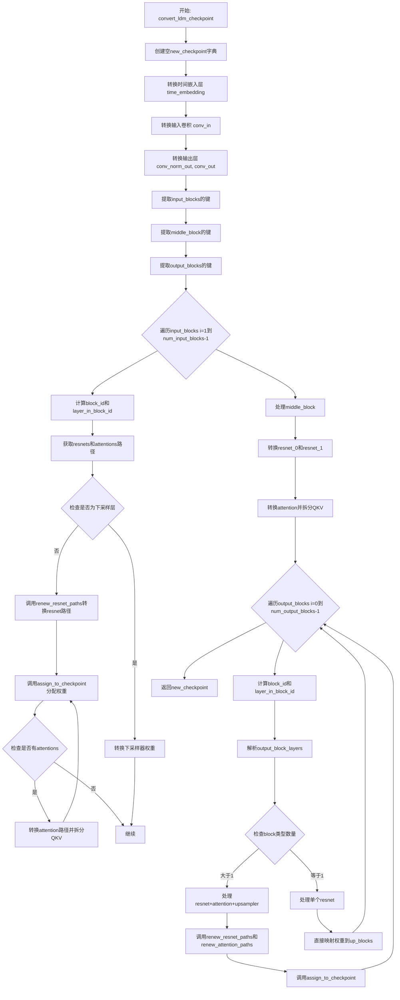

# `diffusers\scripts\convert_ldm_original_checkpoint_to_diffusers.py` 详细设计文档

该脚本是一个权重转换工具，用于将旧版 Latent Diffusion Model (LDM) 的检查点文件转换为 Hugging Face Diffusers 框架所支持的 UNet2DModel 格式，主要实现了权重键的重命名、层级结构的重组以及注意力机制中 QKV 张量的拆分。

## 整体流程

```mermaid
graph TD
    Start([开始]) --> ParseArgs[解析命令行参数]
    ParseArgs --> LoadCkpt[加载原始检查点 (torch.load)]
    LoadCkpt --> LoadConfig[加载模型配置文件 (JSON)]
    LoadConfig --> ConvertFunc[调用 convert_ldm_checkpoint]
    ConvertFunc -- 权重映射 --> NewCkpt[生成新检查点字典]
    NewCkpt --> InitModel[实例化 UNet2DModel]
    InitModel --> LoadState[加载转换后的权重]
    LoadState --> CheckExtra[检查额外依赖 (VQVAE/Scheduler)]
    CheckExtra -- 存在 --> BuildPipe[构建 LDMPipeline]
    CheckExtra -- 不存在 --> SaveOnly[仅保存模型]
    BuildPipe --> SavePipe[保存完整 Pipeline]
    SaveOnly --> End([结束]),
        
SavePipe --> End
```

## 类结构

```
Root: convert_ldm_checkpoint.py (脚本入口)
└── Functions (功能函数集合)
    ├── shave_segments (路径修整)
    ├── renew_resnet_paths (ResNet路径更新)
    ├── renew_attention_paths (Attention路径更新)
    ├── assign_to_checkpoint (核心分配与拆分逻辑)
    └── convert_ldm_checkpoint (主转换流程)
└── Dependencies (外部依赖类)
    ├── UNet2DModel
    ├── DDPMScheduler
    ├── VQModel
    └── LDMPipeline
```

## 全局变量及字段


### `argparse`
    
Python标准库模块，用于命令行参数解析

类型：`module`
    


### `json`
    
Python标准库模块，用于JSON数据的编码和解码

类型：`module`
    


### `torch`
    
PyTorch深度学习框架核心模块，提供张量运算和神经网络功能

类型：`module`
    


### `diffusers`
    
Hugging Face Diffusers库模块，提供扩散模型和管道实现

类型：`module`
    


### `args`
    
命令行参数对象，包含checkpoint_path、config_file和dump_path三个属性

类型：`Namespace`
    


### `checkpoint`
    
原始LDM模型的权重字典，键为字符串参数名，值为PyTorch张量

类型：`Dict[str, Tensor]`
    


### `config`
    
模型架构配置文件，包含模型结构参数如num_res_blocks、num_head_channels等

类型：`Dict`
    


### `new_checkpoint`
    
转换后的模型权重字典，键为新架构的参数名，值为PyTorch张量

类型：`Dict[str, Tensor]`
    


### `model`
    
UNet2DModel实例，基于配置构建的目标架构模型对象

类型：`UNet2DModel`
    


### `scheduler`
    
DDPMScheduler调度器实例，用于扩散模型的采样调度

类型：`DDPMScheduler`
    


### `vqvae`
    
VQModel变分自编码器实例，用于潜在空间的量化处理

类型：`VQModel`
    


### `pipe`
    
LDMPipeline完整管道实例，整合unet、scheduler和vae的推理管道

类型：`LDMPipeline`
    


    

## 全局函数及方法


### `shave_segments`

移除路径字符串中的特定段。正值（n_shave_prefix_segments >= 0）表示移除开头的段，负值表示移除结尾的段。

参数：

- `path`：`str`，需要处理的路径字符串
- `n_shave_prefix_segments`：`int`，默认为1，表示要移除的段数

返回值：`str`，返回处理后的路径字符串

#### 流程图

```mermaid
flowchart TD
    A[开始] --> B{判断 n_shave_prefix_segments >= 0?}
    B -->|是| C[使用 split'.') 切分路径]
    B -->|否| D[使用 split'.') 切分路径]
    C --> E[取索引 n_shave_prefix_segments 之后的元素]
    D --> F[取索引 0 到 n_shave_prefix_segments 的元素]
    E --> G[用 '.' join 重新组合]
    F --> G
    G --> H[返回结果]
```

#### 带注释源码

```
def shave_segments(path, n_shave_prefix_segments=1):
    """
    移除路径中的段。正值 shave 开头的 segments，负值 shave 结尾的 segments。
    
    参数:
        path: str，需要处理的路径字符串
        n_shave_prefix_segments: int，默认值为1，要移除的段数
            - 正值: 移除开头的 n 个段
            - 负值: 移除结尾的 -n 个段
    
    返回:
        str: 处理后的路径字符串
    """
    # 如果 n_shave_prefix_segments >= 0，表示从开头移除指定数量的段
    if n_shave_prefix_segments >= 0:
        # 1. 使用 "." 分割路径为列表
        # 2. 从索引 n_shave_prefix_segments 开始取后面的所有元素
        # 3. 使用 "." 重新连接为字符串
        # 例如: path="a.b.c.d", n_shave_prefix_segments=1 -> "b.c.d"
        return ".".join(path.split(".")[n_shave_prefix_segments:])
    else:
        # 如果 n_shave_prefix_segments < 0，表示从结尾移除指定数量的段
        # 1. 使用 "." 分割路径为列表
        # 2. 取前 n_shave_prefix_segments 个元素（即索引 0 到 -n-1）
        # 3. 使用 "." 重新连接为字符串
        # 例如: path="a.b.c.d", n_shave_prefix_segments=-1 -> "a.b.c"
        return ".".join(path.split(".")[:n_shave_prefix_segments])
```


### `renew_resnet_paths`

该函数用于将 ResNet 权重路径从旧的命名方案（如 `in_layers.0`、`out_layers.3` 等）转换为 Diffusers 库支持的新命名方案（如 `norm1`、`conv1`、`norm2`、`conv2`、`time_emb_proj`、`conv_shortcut`），实现模型权重的本地重命名映射。

参数：

- `old_list`：`list`，需要转换的旧路径列表，每个元素为字符串形式的权重路径
- `n_shave_prefix_segments`：`int`（默认值：0），可选参数，用于去除路径前缀段的数量，正值去除开头，负值去除结尾

返回值：`list[dict]`，返回路径映射列表，每个元素为包含 `"old"`（旧路径）和 `"new"`（新路径）的字典

#### 流程图

```mermaid
flowchart TD
    A[开始 renew_resnet_paths] --> B[初始化空映射列表 mapping]
    --> C{遍历 old_list 中的每个 old_item}
    C -->|是| D[将 old_item 复制到 new_item]
    --> E["替换 'in_layers.0' → 'norm1'"]
    --> F["替换 'in_layers.2' → 'conv1'"]
    --> G["替换 'out_layers.0' → 'norm2'"]
    --> H["替换 'out_layers.3' → 'conv2'"]
    --> I["替换 'emb_layers.1' → 'time_emb_proj'"]
    --> J["替换 'skip_connection' → 'conv_shortcut'"]
    --> K[调用 shave_segments 去除前缀段]
    --> L[将映射 {old: old_item, new: new_item} 添加到 mapping]
    --> C
    C -->|否| M[返回 mapping 列表]
    --> N[结束]
```

#### 带注释源码

```python
def renew_resnet_paths(old_list, n_shave_prefix_segments=0):
    """
    Updates paths inside resnets to the new naming scheme (local renaming)
    将 ResNet 内部的路径更新为新的命名方案（本地重命名）
    
    参数:
        old_list: 包含旧权重路径的列表
        n_shave_prefix_segments: 要去除的路径前缀段数
    
    返回:
        包含 old → new 映射的字典列表
    """
    # 初始化空的映射列表，用于存储转换后的路径对
    mapping = []
    
    # 遍历输入的旧路径列表
    for old_item in old_list:
        # 将当前旧路径复制到 new_item 作为转换起点
        new_item = old_item.replace("in_layers.0", "norm1")
        # 将输入层的第二个子层从 'in_layers.2' 重命名为 'conv1'
        new_item = new_item.replace("in_layers.2", "conv1")

        # 将输出层的第一个子层从 'out_layers.0' 重命名为 'norm2'
        new_item = new_item.replace("out_layers.0", "norm2")
        # 将输出层的第四个子层从 'out_layers.3' 重命名为 'conv2'
        new_item = new_item.replace("out_layers.3", "conv2")

        # 将时间嵌入层从 'emb_layers.1' 重命名为 'time_emb_proj'
        new_item = new_item.replace("emb_layers.1", "time_emb_proj")
        # 将跳跃连接从 'skip_connection' 重命名为 'conv_shortcut'
        new_item = new_item.replace("skip_connection", "conv_shortcut")

        # 调用 shave_segments 函数去除路径前缀段
        new_item = shave_segments(new_item, n_shave_prefix_segments=n_shave_prefix_segments)

        # 将旧路径和新路径作为字典添加到映射列表
        mapping.append({"old": old_item, "new": new_item})

    # 返回完整的路径映射列表
    return mapping
```


### `renew_attention_paths`

该函数用于将LDM（Latent Diffusion Models）检查点中注意力层（attention）的旧键名映射到新的命名规则，实现本地（局部）权重路径的重命名转换。

参数：

- `old_list`：`List[str]`，旧的状态字典键名列表，包含需要转换的注意力层路径
- `n_shave_prefix_segments`：`int`，可选参数，默认值为0，用于控制路径前缀的截断段数（正值截取开头，负值截取结尾）

返回值：`List[Dict[str, str]]`，返回由字典组成的列表，每个字典包含 `"old"`（原始键名）和 `"new"`（新键名）的映射关系

#### 流程图

```mermaid
flowchart TD
    A[开始 renew_attention_paths] --> B[初始化空映射列表 mapping]
    B --> C{遍历 old_list 中的每个 old_item}
    C -->|每次迭代| D[复制 old_item 到 new_item]
    D --> E[替换 norm.weight → group_norm.weight]
    E --> F[替换 norm.bias → group_norm.bias]
    F --> G[替换 proj_out.weight → proj_attn.weight]
    G --> H[替换 proj_out.bias → proj_attn.bias]
    H --> I[调用 shave_segments 处理路径前缀]
    I --> J[将 {old, new} 添加到 mapping]
    J --> C
    C -->|遍历完成| K[返回 mapping 列表]
    K --> L[结束]
```

#### 带注释源码

```python
def renew_attention_paths(old_list, n_shave_prefix_segments=0):
    """
    Updates paths inside attentions to the new naming scheme (local renaming)
    
    该函数执行注意力层权重的本地重命名操作，将LDM检查点中使用的旧命名
    转换为Diffusers库对应的新命名规范。主要处理归一化层和输出投影层的命名。
    
    参数:
        old_list: 包含旧键名的列表，通常来自原始检查点的键
        n_shave_prefix_segments: 控制路径前缀的截取段数，用于适配不同层级的路径
    
    返回:
        包含旧新键名映射关系的字典列表
    """
    # 初始化用于存储映射关系的列表
    mapping = []
    
    # 遍历每一个需要转换的旧键名
    for old_item in old_list:
        # 复制原始键名作为转换起点
        new_item = old_item

        # 将归一化层的权重名从旧命名转换为新命名
        # 旧: norm.weight → 新: group_norm.weight
        new_item = new_item.replace("norm.weight", "group_norm.weight")
        
        # 将归一化层的偏置名从旧命名转换为新命名
        # 旧: norm.bias → 新: group_norm.bias
        new_item = new_item.replace("norm.bias", "group_norm.bias")

        # 将输出投影的权重名从旧命名转换为新命名
        # 旧: proj_out.weight → 新: proj_attn.weight
        new_item = new_item.replace("proj_out.weight", "proj_attn.weight")
        
        # 将输出投影的偏置名从旧命名转换为新命名
        # 旧: proj_out.bias → 新: proj_attn.bias
        new_item = new_item.replace("proj_out.bias", "proj_attn.bias")

        # 调用 shave_segments 函数处理路径前缀
        # 根据 n_shave_prefix_segments 的值，可能截取路径的开头或结尾段
        new_item = shave_segments(new_item, n_shave_prefix_segments=n_shave_prefix_segments)

        # 将旧键名和新键名的映射添加到结果列表
        mapping.append({"old": old_item, "new": new_item})

    # 返回完整的映射列表
    return mapping
```


### `assign_to_checkpoint`

该函数执行LDM检查点转换的最后一步：获取本地转换的权重并应用全局重命名。它拆分注意力层的QKV权重，应用额外的替换规则，并将转换后的权重分配到新的checkpoint字典中。

参数：

- `paths`：`list`，包含 'old' 和 'new' 键的字典列表，表示本地权重路径映射
- `checkpoint`：`dict`，新的checkpoint字典，用于存储转换后的权重
- `old_checkpoint`：`dict`，旧的checkpoint字典，包含原始权重
- `attention_paths_to_split`：`dict`，可选，需要拆分的注意力层路径映射（将QKV拆分为query、key、value）
- `additional_replacements`：`list`，可选，额外的路径替换规则列表
- `config`：`dict`，可选，模型配置字典，包含 num_head_channels 等信息

返回值：`None`，函数直接修改 `checkpoint` 字典，无返回值

#### 流程图

```mermaid
flowchart TD
    A[开始 assign_to_checkpoint] --> B{验证 paths 是否为列表}
    B -->|否| C[抛出断言错误]
    B -->|是| D{attention_paths_to_split 是否存在}
    
    D -->|是| E[遍历 attention_paths_to_split]
    E --> F[从 old_checkpoint 获取旧权重张量]
    F --> G[计算通道数: channels = shape[0] // 3]
    G --> H[计算 num_heads]
    H --> I[重塑张量并拆分 Q K V]
    I --> J[将 Q K V 写入 checkpoint]
    
    D -->|否| K[跳过注意力层拆分]
    
    J --> L[遍历 paths 列表]
    K --> L
    
    L --> M{检查路径是否已分配}
    M -->|是| N[跳过该路径]
    M -->|否| O[获取新路径]
    
    O --> P[全局重命名: middle_block.0 → mid_block.resnets.0]
    P --> Q[全局重命名: middle_block.1 → mid_block.attentions.0]
    Q --> R[全局重命名: middle_block.2 → mid_block.resnets.1]
    
    R --> S{additional_replacements 是否存在}
    S -->|是| T[应用额外替换规则]
    S -->|否| U{新路径包含 proj_attn.weight}
    
    T --> U
    U -->|是| V[转换权重: 1D卷积转线性]
    U -->|否| W[直接赋值权重]
    
    V --> X[写入 checkpoint]
    W --> X
    X --> Y[继续下一个路径]
    
    N --> Y
    Y --> Z{paths 是否遍历完成}
    Z -->|否| L
    Z -->|是| AA[结束]
    
    C --> AA
```

#### 带注释源码

```python
def assign_to_checkpoint(
    paths, checkpoint, old_checkpoint, attention_paths_to_split=None, additional_replacements=None, config=None
):
    """
    This does the final conversion step: take locally converted weights and apply a global renaming
    to them. It splits attention layers, and takes into account additional replacements
    that may arise.

    Assigns the weights to the new checkpoint.
    """
    # 断言验证：paths 必须是一个列表，每个元素是包含 'old' 和 'new' 键的字典
    assert isinstance(paths, list), "Paths should be a list of dicts containing 'old' and 'new' keys."

    # 如果提供了注意力层路径需要拆分，则处理 QKV 权重的拆分
    if attention_paths_to_split is not None:
        for path, path_map in attention_paths_to_split.items():
            # 从旧 checkpoint 中获取原始 QKV 权重张量
            old_tensor = old_checkpoint[path]
            # 计算通道数：原始通道数除以3（因为QKV各占一份）
            channels = old_tensor.shape[0] // 3

            # 确定目标形状：3D张量为(-1, channels)，其他为(-1)
            target_shape = (-1, channels) if len(old_tensor.shape) == 3 else (-1)

            # 计算注意力头数量：用于后续拆分红query、key、value
            num_heads = old_tensor.shape[0] // config["num_head_channels"] // 3

            # 重塑张量以分离不同的头：(num_heads, 3*channels//num_heads, ...)
            old_tensor = old_tensor.reshape((num_heads, 3 * channels // num_heads) + old_tensor.shape[1:])
            # 沿dim=1拆分得到query、key、value
            query, key, value = old_tensor.split(channels // num_heads, dim=1)

            # 将拆分后的query、key、value写入新checkpoint，使用目标形状重塑
            checkpoint[path_map["query"]] = query.reshape(target_shape)
            checkpoint[path_map["key"]] = key.reshape(target_shape)
            checkpoint[path_map["value"]] = value.reshape(target_shape)

    # 遍历所有需要转换的路径
    for path in paths:
        new_path = path["new"]  # 获取新路径名称

        # 这些路径已经在注意力层拆分时处理过，跳过
        if attention_paths_to_split is not None and new_path in attention_paths_to_split:
            continue

        # 全局重命名：将旧的中级块命名转换为新的diffusers格式
        # middle_block.0 -> mid_block.resnets.0 (第一个残差块)
        new_path = new_path.replace("middle_block.0", "mid_block.resnets.0")
        # middle_block.1 -> mid_block.attentions.0 (注意力层)
        new_path = new_path.replace("middle_block.1", "mid_block.attentions.0")
        # middle_block.2 -> mid_block.resnets.1 (第二个残差块)
        new_path = new_path.replace("middle_block.2", "mid_block.resnets.1")

        # 应用额外的替换规则（如输入块、输出块的路径映射）
        if additional_replacements is not None:
            for replacement in additional_replacements:
                new_path = new_path.replace(replacement["old"], replacement["new"])

        # 特殊处理：proj_attn.weight 需要从1D卷积转换为线性层权重
        # 旧格式中proj_attn.weight是卷积权重，shape=[out_channels, in_channels, 1]
        # 转换后取[:,:,0]得到线性层权重shape=[out_channels, in_channels]
        if "proj_attn.weight" in new_path:
            checkpoint[new_path] = old_checkpoint[path["old"]][:, :, 0]
        else:
            # 其他权重直接赋值
            checkpoint[new_path] = old_checkpoint[path["old"]]
```


### `convert_ldm_checkpoint`

该函数用于将旧版 LD（Latent Diffusion）模型的检查点转换为 HuggingFace Diffusers 库的新格式。它接收原始模型状态字典和配置文件，通过重新映射层名称、拆分注意力机制的 QKV 权重以及重新组织网络结构（input→down, middle→mid, output→up），生成符合 UNet2DModel 格式的转换后检查点。

参数：

- `checkpoint`：`Dict`，原始 LDM 模型的检查点（状态字典），包含旧版层名称对应的权重
- `config`：`Dict`，模型配置文件，包含 `num_res_blocks`、`num_head_channels` 等架构参数

返回值：`Dict`，转换后的新检查点，键名已更新为 Diffusers 库的标准格式

#### 流程图



#### 带注释源码

```python
def convert_ldm_checkpoint(checkpoint, config):
    """
    Takes a state dict and a config, and returns a converted checkpoint.
    将旧版LDM检查点转换为Diffusers格式的新检查点
    """
    # 1. 初始化空的新检查点字典
    new_checkpoint = {}

    # 2. 转换时间嵌入层 (time embedding)
    # 旧版: time_embed.0.weight -> 新版: time_embedding.linear_1.weight
    new_checkpoint["time_embedding.linear_1.weight"] = checkpoint["time_embed.0.weight"]
    new_checkpoint["time_embedding.linear_1.bias"] = checkpoint["time_embed.0.bias"]
    new_checkpoint["time_embedding.linear_2.weight"] = checkpoint["time_embed.2.weight"]
    new_checkpoint["time_embedding.linear_2.bias"] = checkpoint["time_embed.2.bias"]

    # 3. 转换输入卷积层 (conv_in)
    # 旧版: input_blocks.0.0.weight -> 新版: conv_in.weight
    new_checkpoint["conv_in.weight"] = checkpoint["input_blocks.0.0.weight"]
    new_checkpoint["conv_in.bias"] = checkpoint["input_blocks.0.0.bias"]

    # 4. 转换输出层 (conv_norm_out, conv_out)
    # 旧版: out.0.weight -> 新版: conv_norm_out.weight
    new_checkpoint["conv_norm_out.weight"] = checkpoint["out.0.weight"]
    new_checkpoint["conv_norm_out.bias"] = checkpoint["out.0.bias"]
    new_checkpoint["conv_out.weight"] = checkpoint["out.2.weight"]
    new_checkpoint["conv_out.bias"] = checkpoint["out.2.bias"]

    # 5. 提取input_blocks的键 (用于构建down_blocks)
    # 统计input_blocks中不同层ID的数量
    num_input_blocks = len({".".join(layer.split(".")[:2]) for layer in checkpoint if "input_blocks" in layer})
    # 按layer_id分组存储键
    input_blocks = {
        layer_id: [key for key in checkpoint if f"input_blocks.{layer_id}" in key]
        for layer_id in range(num_input_blocks)
    }

    # 6. 提取middle_block的键 (用于构建mid_block)
    num_middle_blocks = len({".".join(layer.split(".")[:2]) for layer in checkpoint if "middle_block" in layer})
    middle_blocks = {
        layer_id: [key for key in checkpoint if f"middle_block.{layer_id}" in key]
        for layer_id in range(num_middle_blocks)
    }

    # 7. 提取output_blocks的键 (用于构建up_blocks)
    num_output_blocks = len({".".join(layer.split(".")[:2]) for layer in checkpoint if "output_blocks" in layer})
    output_blocks = {
        layer_id: [key for key in checkpoint if f"output_blocks.{layer_id}" in key]
        for layer_id in range(num_output_blocks)
    }

    # 8. 处理输入块 (Input Blocks -> Down Blocks)
    for i in range(1, num_input_blocks):
        # 计算在哪个down_blocks层级以及在block内的层索引
        block_id = (i - 1) // (config["num_res_blocks"] + 1)
        layer_in_block_id = (i - 1) % (config["num_res_blocks"] + 1)

        # 获取当前i的resnet和attention路径
        resnets = [key for key in input_blocks[i] if f"input_blocks.{i}.0" in key]
        attentions = [key for key in input_blocks[i] if f"input_blocks.{i}.1" in key]

        # 检查是否为下采样层 (downsampler)
        if f"input_blocks.{i}.0.op.weight" in checkpoint:
            # 直接复制下采样器权重到新的down_blocks
            new_checkpoint[f"down_blocks.{block_id}.downsamplers.0.conv.weight"] = checkpoint[
                f"input_blocks.{i}.0.op.weight"
            ]
            new_checkpoint[f"down_blocks.{block_id}.downsamplers.0.conv.bias"] = checkpoint[
                f"input_blocks.{i}.0.op.bias"
            ]
            continue  # 跳过当前层的其他处理

        # 转换resnet路径并分配权重
        paths = renew_resnet_paths(resnets)
        meta_path = {"old": f"input_blocks.{i}.0", "new": f"down_blocks.{block_id}.resnets.{layer_in_block_id}"}
        resnet_op = {"old": "resnets.2.op", "new": "downsamplers.0.op"}
        assign_to_checkpoint(
            paths, new_checkpoint, checkpoint, additional_replacements=[meta_path, resnet_op], config=config
        )

        # 转换attention路径 (如果存在)
        if len(attentions):
            paths = renew_attention_paths(attentions)
            meta_path = {
                "old": f"input_blocks.{i}.1",
                "new": f"down_blocks.{block_id}.attentions.{layer_in_block_id}",
            }
            # 定义需要拆分的QKV路径
            to_split = {
                f"input_blocks.{i}.1.qkv.bias": {
                    "key": f"down_blocks.{block_id}.attentions.{layer_in_block_id}.key.bias",
                    "query": f"down_blocks.{block_id}.attentions.{layer_in_block_id}.query.bias",
                    "value": f"down_blocks.{block_id}.attentions.{layer_in_block_id}.value.bias",
                },
                f"input_blocks.{i}.1.qkv.weight": {
                    "key": f"down_blocks.{block_id}.attentions.{layer_in_block_id}.key.weight",
                    "query": f"down_blocks.{block_id}.attentions.{layer_in_block_id}.query.weight",
                    "value": f"down_blocks.{block_id}.attentions.{layer_in_block_id}.value.weight",
                },
            }
            assign_to_checkpoint(
                paths,
                new_checkpoint,
                checkpoint,
                additional_replacements=[meta_path],
                attention_paths_to_split=to_split,
                config=config,
            )

    # 9. 处理中间块 (Middle Block -> Mid Block)
    # middle_block: [resnet, attention, resnet]
    resnet_0 = middle_blocks[0]
    attentions = middle_blocks[1]
    resnet_1 = middle_blocks[2]

    # 转换两个resnet
    resnet_0_paths = renew_resnet_paths(resnet_0)
    assign_to_checkpoint(resnet_0_paths, new_checkpoint, checkpoint, config=config)

    resnet_1_paths = renew_resnet_paths(resnet_1)
    assign_to_checkpoint(resnet_1_paths, new_checkpoint, checkpoint, config=config)

    # 转换attention并拆分QKV
    attentions_paths = renew_attention_paths(attentions)
    to_split = {
        "middle_block.1.qkv.bias": {
            "key": "mid_block.attentions.0.key.bias",
            "query": "mid_block.attentions.0.query.bias",
            "value": "mid_block.attentions.0.value.bias",
        },
        "middle_block.1.qkv.weight": {
            "key": "mid_block.attentions.0.key.weight",
            "query": "mid_block.attentions.0.query.weight",
            "value": "mid_block.attentions.0.value.weight",
        },
    }
    assign_to_checkpoint(
        attentions_paths, new_checkpoint, checkpoint, attention_paths_to_split=to_split, config=config
    )

    # 10. 处理输出块 (Output Blocks -> Up Blocks)
    for i in range(num_output_blocks):
        block_id = i // (config["num_res_blocks"] + 1)
        layer_in_block_id = i % (config["num_res_blocks"] + 1)
        # 移除前两个段: output_blocks.i.xxx -> xxx
        output_block_layers = [shave_segments(name, 2) for name in output_blocks[i]]
        output_block_list = {}

        # 解析层ID和层名称
        for layer in output_block_layers:
            layer_id, layer_name = layer.split(".")[0], shave_segments(layer, 1)
            if layer_id in output_block_list:
                output_block_list[layer_id].append(layer_name)
            else:
                output_block_list[layer_id] = [layer_name]

        # 根据block类型数量决定处理方式
        if len(output_block_list) > 1:
            # 包含resnet和attention的情况
            resnets = [key for key in output_blocks[i] if f"output_blocks.{i}.0" in key]
            attentions = [key for key in output_blocks[i] if f"output_blocks.{i}.1" in key]

            resnet_0_paths = renew_resnet_paths(resnets)
            paths = renew_resnet_paths(resnets)

            meta_path = {"old": f"output_blocks.{i}.0", "new": f"up_blocks.{block_id}.resnets.{layer_in_block_id}"}
            assign_to_checkpoint(paths, new_checkpoint, checkpoint, additional_replacements=[meta_path], config=config)

            # 检查是否有upsampler (上采样器)
            if ["conv.weight", "conv.bias"] in output_block_list.values():
                index = list(output_block_list.values()).index(["conv.weight", "conv.bias"])
                new_checkpoint[f"up_blocks.{block_id}.upsamplers.0.conv.weight"] = checkpoint[
                    f"output_blocks.{i}.{index}.conv.weight"
                ]
                new_checkpoint[f"up_blocks.{block_id}.upsamplers.0.conv.bias"] = checkpoint[
                    f"output_blocks.{i}.{index}.conv.bias"
                ]

                # 清除已处理的attentions
                if len(attentions) == 2:
                    attentions = []

            # 处理attention
            if len(attentions):
                paths = renew_attention_paths(attentions)
                meta_path = {
                    "old": f"output_blocks.{i}.1",
                    "new": f"up_blocks.{block_id}.attentions.{layer_in_block_id}",
                }
                to_split = {
                    f"output_blocks.{i}.1.qkv.bias": {
                        "key": f"up_blocks.{block_id}.attentions.{layer_in_block_id}.key.bias",
                        "query": f"up_blocks.{block_id}.attentions.{layer_in_block_id}.query.bias",
                        "value": f"up_blocks.{block_id}.attentions.{layer_in_block_id}.value.bias",
                    },
                    f"output_blocks.{i}.1.qkv.weight": {
                        "key": f"up_blocks.{block_id}.attentions.{layer_in_block_id}.key.weight",
                        "query": f"up_blocks.{block_id}.attentions.{layer_in_block_id}.query.weight",
                        "value": f"up_blocks.{block_id}.attentions.{layer_in_block_id}.value.weight",
                    },
                }
                assign_to_checkpoint(
                    paths,
                    new_checkpoint,
                    checkpoint,
                    additional_replacements=[meta_path],
                    attention_paths_to_split=to_split if any("qkv" in key for key in attentions) else None,
                    config=config,
                )
        else:
            # 只有一个resnet的简单情况
            resnet_0_paths = renew_resnet_paths(output_block_layers, n_shave_prefix_segments=1)
            for path in resnet_0_paths:
                old_path = ".".join(["output_blocks", str(i), path["old"]])
                new_path = ".".join(["up_blocks", str(block_id), "resnets", str(layer_in_block_id), path["new"]])

                new_checkpoint[new_path] = checkpoint[old_path]

    # 11. 返回转换后的新检查点
    return new_checkpoint
```

## 关键组件


### 张量路径处理与重命名

负责处理LDM检查点中权重路径的转换，将旧的命名约定（如"in_layers.0", "out_layers.3"等）映射到新的diffusers命名方案（如"norm1", "conv1", "norm2", "conv2", "time_emb_proj", "conv_shortcut"等），支持前缀和后缀段的修整。

### QKV 权重分割

将LDM中联合存储的Query、Key、Value权重（qkv.weight/qkv.bias）分割为独立的query、key、value张量，处理attention层中权重形状从(3*channels, ...)到(channels, ...)的转换，涉及注意力权重的reshape和split操作。

### ResNet 块路径更新

针对ResNet块进行局部路径重命名，将"in_layers.0"替换为"norm1"、"in_layers.2"替换为"conv1"、"out_layers.0"替换为"norm2"、"out_layers.3"替换为"conv2"、"emb_layers.1"替换为"time_emb_proj"、"skip_connection"替换为"conv_shortcut"。

### Attention 块路径更新

针对Attention块进行局部路径重命名，将"norm.weight/bias"替换为"group_norm.weight/bias"、"proj_out.weight/bias"替换为"proj_attn.weight/bias"。

### 全局路径映射

执行最终的全局路径转换，包括将"middle_block.0/1/2"映射到"mid_block.resnets.0/attentions.0/resnets.1"，以及input_blocks/output_blocks到down_blocks/up_blocks的层级映射，同时处理proj_attn.weight从1D卷积到线性层的转换。

### 检查点转换主流程

协调整个检查点转换过程，提取input_blocks、middle_block、output_block的键，根据config中的num_res_blocks和num_head_channels参数遍历各层，构建权重映射关系并调用assign_to_checkpoint完成权重分配。

### 命令行参数解析

通过argparse解析三个必需参数：checkpoint_path（待转换的检查点路径）、config_file（对应架构的配置文件路径）、dump_path（输出模型的保存路径）。

### 模型加载与保存

使用torch.load加载检查点，解析JSON配置文件，根据config构建UNet2DModel并加载转换后的权重，尝试加载DDPMScheduler和VQModel创建LDMPipeline后保存，或在失败时仅保存模型。


## 问题及建议


### 已知问题

- **裸异常捕获**：`except: # noqa: E722` 捕获所有异常并静默处理，导致错误难以追踪和调试
- **硬编码路径拼接**：使用 `"/".join(args.checkpoint_path.split("/")[:-1])` 拼接路径，存在跨平台兼容性问题，且代码重复多次
- **类型提示完全缺失**：所有函数均无类型注解，降低了代码可维护性和 IDE 支持
- **缺少输入验证**：未对 `checkpoint` 和 `config` 的结构和必需字段进行校验，可能导致运行时错误
- **`torch.load` 缺少安全参数**：未指定 `map_location`，在 GPU/CPU 环境切换时可能失败；也未使用 `weights_only` 参数
- **魔法数字和字符串**：代码中多处使用硬编码的数字和字符串（如 `"input_blocks"`, `"output_blocks"`），缺乏常量定义
- **重复代码模式**：`renew_resnet_paths` 和 `renew_attention_paths` 的逻辑在多处几乎相同，但未被复用
- **字符串格式化过时**：仍使用 `.format()` 方法而非现代 f-string
- **文档字符串不完整**：部分函数文档缺少参数和返回值说明
- **配置污染**：`if "ldm" in config: del config["ldm"]` 直接修改传入的配置字典，可能影响调用方

### 优化建议

- 替换裸异常捕获为具体异常类型（如 `Exception`），并添加日志记录或错误信息输出
- 使用 `pathlib.Path` 处理路径，增强跨平台兼容性；将路径拼接抽取为独立函数
- 为所有函数添加类型注解（参数和返回值），提升代码可读性和静态检查能力
- 在函数入口添加参数校验，验证 `config` 包含必需字段（如 `num_res_blocks`, `num_head_channels`）
- 为 `torch.load` 添加 `map_location=torch.device('cpu')` 和 `weights_only=False`（如需要加载完整权重）
- 抽取魔法字符串为模块级常量，定义如 `INPUT_BLOCKS = "input_blocks"` 等
- 考虑将 `renew_resnet_paths` 和 `renew_attention_paths` 合并为更通用的路径重命名函数
- 更新为 f-string 格式化，如 `f"input_blocks.{i}.0.weight"`
- 完善文档字符串，包含完整的参数说明、返回值描述和示例
- 使用 `config.copy()` 创建副本再修改，避免副作用

## 其它


### 设计目标与约束

将LDM（Latent Diffusion Models）旧版本的检查点权重转换为新版本兼容格式，主要处理UNet2DModel的权重命名变化，包括ResNet层和Attention层的重新映射，以及QKV权重的分离。约束包括：输入检查点必须来自旧版LDM架构，需要对应的配置文件，且输出仅支持PyTorch格式。

### 错误处理与异常设计

代码使用try-except块处理模型加载和管道保存失败的情况，当LDM特定组件（scheduler、vqvae）加载失败时，仅保存UNet2DModel。主要断言包括验证paths参数类型，检查点加载使用torch.load，配置文件使用json.loads解析。缺失的权重键或配置字段可能导致KeyError或KeyError。

### 数据流与状态机

数据流为：输入旧版checkpoint → 按input_blocks/middle_block/output_blocks分组 → 分别处理time_embedding、conv_in、conv_out → 遍历各block进行resnet和attention路径转换 → 处理QKV分离 → 应用全局命名转换 → 输出新的checkpoint字典。状态转换涉及旧命名空间（input_blocks.X.Y）到新命名空间（down_blocks.X.resnets.Y）的映射。

### 外部依赖与接口契约

依赖包括：torch、json、argparse、diffusers库（DDPMScheduler、LDMPipeline、UNet2DModel、VQModel）。接口契约要求：checkpoint_path指向旧版权重文件，config_file指向JSON配置文件，dump_path指定输出目录。配置文件需包含num_res_blocks、num_head_channels等架构参数。

### 性能考虑

代码使用字典推导式和列表推导式进行批量处理，QKV张量reshape操作可能占用较多内存。对于大型模型，检查点转换可能消耗较多CPU和内存资源，目前未实现批处理或内存优化策略。

### 配置文件格式

配置文件应为JSON格式，必需字段包括：num_res_blocks（每层ResNet块数量）、num_head_channels（注意力头通道数）。可选字段包括：ldm标志（用于判断是否为LDM变体）。典型配置包含model_channels、in_channels、out_channels等UNet2DModel参数。

### 使用示例

命令行用法：python convert_ldm_checkpoint.py --checkpoint_path /path/to/old_checkpoint.ckpt --config_file /path/to/config.json --dump_path /path/to/output_model

### 版本兼容性

该脚本主要兼容Stable Diffusion 1.x系列的LDM检查点。与Diffusers 0.x版本兼容性最佳，新版本Diffusers可能有API变更。脚本不处理VAE或text_encoder权重的转换。

### 限制和已知问题

1. 仅支持UNet2DModel结构转换，不支持其他组件
2. 配置文件路径推断方式较脆弱，假设checkpoint和model文件在同一目录
3. 异常处理使用空except块，隐藏了真实错误信息
4. 未验证转换后权重的shape兼容性
5. 不支持分布式检查点或分片检查点
6. 硬编码的路径替换逻辑可能不适用于所有LDM变体

### 关键算法说明

QKV分离算法：将合并的qkv张量按num_heads维度reshape，然后沿通道维度split为query、key、value三个张量。ResNet重命名使用字符串替换将in_layers.0→norm1、in_layers.2→conv1、out_layers.0→norm2等映射。Attention重命名将norm.weight→group_norm.weight、proj_out.weight→proj_attn.weight。

    