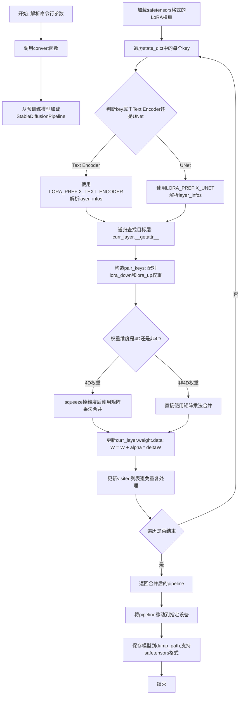
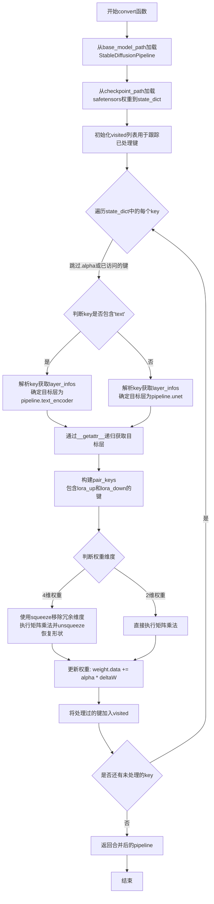

# `diffusers\scripts\convert_lora_safetensor_to_diffusers.py` 详细设计文档

这是一个LoRA权重转换脚本，用于将safetensors格式的LoRA检查点合并到Diffusers格式的Stable Diffusion基础模型中，通过解析LoRA权重的键名映射到UNet和Text Encoder的对应层，使用矩阵乘法将LoRA的down和up权重合并到原始权重上，最终输出支持safetensors格式的完整模型。

## 整体流程



## 类结构

```
该文件为脚本文件，无类定义
仅包含一个全局函数 convert()
以及if __name__ == '__main__'入口逻辑
```

## 全局变量及字段


### `visited`
    
用于记录已处理的LoRA权重键，避免重复处理

类型：`list`
    


### `state_dict`
    
从safetensors文件加载的LoRA权重字典

类型：`dict`
    


### `layer_infos`
    
解析后的层信息列表

类型：`list`
    


### `curr_layer`
    
当前正在处理的模型层

类型：`torch.nn.Module`
    


### `temp_name`
    
临时层名称

类型：`str`
    


### `pair_keys`
    
成对的lora_down和lora_up键

类型：`list`
    


### `weight_up`
    
LoRA up权重

类型：`torch.Tensor`
    


### `weight_down`
    
LoRA down权重

类型：`torch.Tensor`
    


### `base_model_path`
    
基础Diffusers模型的路径

类型：`str`
    


### `checkpoint_path`
    
LoRA检查点文件路径

类型：`str`
    


### `dump_path`
    
输出模型的保存路径

类型：`str`
    


### `lora_prefix_unet`
    
UNet权重在safetensors中的前缀

类型：`str`
    


### `lora_prefix_text_encoder`
    
Text Encoder权重在safetensors中的前缀

类型：`str`
    


### `alpha`
    
LoRA权重合并比例因子

类型：`float`
    


### `to_safetensors`
    
是否使用safetensors格式保存模型

类型：`bool`
    


### `device`
    
设备标识符（如cpu, cuda:0等）

类型：`str`
    


    

## 全局函数及方法


### `convert`

该函数用于将LoRA权重合并到Diffusers格式的Stable Diffusion模型中，通过加载基础模型和LoRA权重文件，解析权重键值以定位UNet和Text Encoder的目标层，并将LoRA的down和up权重矩阵相乘后按alpha比例叠加到原始权重上，最终返回合并了LoRA适配器的完整pipeline。

**参数：**

- `base_model_path`：`str`，基础Diffusers模型的路径，用于加载StableDiffusionPipeline
- `checkpoint_path`：`str`，LoRA权重文件（.safetensors格式）的路径
- `LORA_PREFIX_UNET`：`str`，UNet权重在safetensors中的前缀标识（如"lora_unet"）
- `LORA_PREFIX_TEXT_ENCODER`：`str`，Text Encoder权重在safetensors中的前缀标识（如"lora_te"）
- `alpha`：`float`，LoRA权重合并比例，公式为 W = W0 + alpha * deltaW

**返回值：**`StableDiffusionPipeline`，合并了LoRA权重后的Stable Diffusion pipeline对象

#### 流程图



#### 带注释源码

```python
def convert(base_model_path, checkpoint_path, LORA_PREFIX_UNET, LORA_PREFIX_TEXT_ENCODER, alpha):
    """
    将LoRA权重合并到Diffusers模型中
    
    参数:
        base_model_path: 基础Diffusers模型路径
        checkpoint_path: LoRA权重safetensors文件路径
        LORA_PREFIX_UNET: UNet权重前缀
        LORA_PREFIX_TEXT_ENCODER: Text Encoder权重前缀
        alpha: 合并比例系数
    返回:
        合并了LoRA权重的StableDiffusionPipeline
    """
    
    # 第1步: 从预训练路径加载基础Stable Diffusion模型
    # 使用float32精度确保权重计算的准确性
    pipeline = StableDiffusionPipeline.from_pretrained(base_model_path, torch_dtype=torch.float32)

    # 第2步: 从safetensors文件加载LoRA权重到状态字典
    state_dict = load_file(checkpoint_path)

    # 第3步: 初始化访问列表，用于追踪已处理的权重键
    # 避免重复处理同一个权重（如同时处理lora_up和lora_down）
    visited = []

    # 第4步: 遍历LoRA权重字典中的每个键
    for key in state_dict:
        # 跳过包含.alpha的键（缩放因子）和已访问的键
        if ".alpha" in key or key in visited:
            continue

        # 第5步: 根据键名前缀判断目标层是Text Encoder还是UNet
        if "text" in key:
            # 解析键名提取层信息，定位到Text Encoder
            layer_infos = key.split(".")[0].split(LORA_PREFIX_TEXT_ENCODER + "_")[-1].split("_")
            curr_layer = pipeline.text_encoder
        else:
            # 解析键名提取层信息，定位到UNet
            layer_infos = key.split(".")[0].split(LORA_PREFIX_UNET + "_")[-1].split("_")
            curr_layer = pipeline.unet

        # 第6步: 通过递归属性访问定位到具体的神经网络层
        # 处理类似"lora_unet_conv_in_weight"这样嵌套的层名
        temp_name = layer_infos.pop(0)  # 取出第一个层名组件
        while len(layer_infos) > -1:
            try:
                curr_layer = curr_layer.__getattr__(temp_name)
                if len(layer_infos) > 0:
                    temp_name = layer_infos.pop(0)
                elif len(layer_infos) == 0:
                    break
            except Exception:
                # 处理名称中包含下划线的层（如 conv_in）
                if len(temp_name) > 0:
                    temp_name += "_" + layer_infos.pop(0)
                else:
                    temp_name = layer_infos.pop(0)

        # 第7步: 构建成对的键名（lora_up和lora_down）
        # LoRA权重存储为down和up两个矩阵，推理时需要相乘
        pair_keys = []
        if "lora_down" in key:
            pair_keys.append(key.replace("lora_down", "lora_up"))
            pair_keys.append(key)
        else:
            pair_keys.append(key)
            pair_keys.append(key.replace("lora_up", "lora_down"))

        # 第8步: 根据权重维度执行不同的合并策略
        # 4维权重用于卷积层，2维权重用于线性层
        if len(state_dict[pair_keys[0]].shape) == 4:
            # 卷积层权重: (out_channels, in_channels, kernel_h, kernel_w)
            # 需要squeeze移除1维条目，然后矩阵乘后再unsqueeze恢复形状
            weight_up = state_dict[pair_keys[0]].squeeze(3).squeeze(2).to(torch.float32)
            weight_down = state_dict[pair_keys[1]].squeeze(3).squeeze(2).to(torch.float32)
            # 矩阵乘法后恢复卷积权重形状
            curr_layer.weight.data += alpha * torch.mm(weight_up, weight_down).unsqueeze(2).unsqueeze(3)
        else:
            # 线性层权重: (out_features, in_features)
            # 直接矩阵相乘
            weight_up = state_dict[pair_keys[0]].to(torch.float32)
            weight_down = state_dict[pair_keys[1]].to(torch.float32)
            curr_layer.weight.data += alpha * torch.mm(weight_up, weight_down)

        # 第9步: 更新已访问列表，防止重复处理
        for item in pair_keys:
            visited.append(item)

    # 第10步: 返回合并了LoRA权重后的pipeline
    return pipeline
```

## 关键组件


### 张量索引与惰性加载

代码使用`safetensors.torch.load_file(checkpoint_path)`从safetensors文件加载完整的LoRA权重状态字典到内存。虽然safetensors支持惰性加载，但此处一次性加载全部权重，用于后续的键解析和权重合并操作。

### 反量化支持

代码在权重合并过程中使用`.to(torch.float32)`方法将LoRA权重从原始精度（如float16）显式转换为float32后再进行矩阵运算，确保合并计算的数值精度一致性。

### 量化策略

代码通过`alpha`参数（默认0.75）实现LoRA权重合并的比例控制，采用公式`W = W0 + alpha * deltaW`进行线性插值合并，允许用户通过调整alpha值来控制原始模型与LoRA适配器权重的融合程度。

### LoRA权重解析

代码通过键名解析识别目标层：检查键中是否包含"text"来判断目标模块（text encoder或unet），然后通过前缀匹配（`LORA_PREFIX_TEXT_ENCODER`和`LORA_PREFIX_UNET`）提取层信息，并使用`__getattr__`递归遍历模型结构定位目标层。

### 权重合并机制

代码处理两种权重形状：(1) 四维权重使用`squeeze(3).squeeze(2)`降维后进行矩阵乘法并通过`unsqueeze(2).unsqueeze(3)`恢复形状；(2. 二维权重直接进行矩阵乘法。最终通过`curr_layer.weight.data += alpha * torch.mm(weight_up, weight_down)`将结果累加到原始权重上。

### 参数解析与配置

代码使用argparse模块接收命令行参数，包括base_model_path、checkpoint_path、dump_path、lora_prefix_unet、lora_prefix_text_encoder、alpha、to_safetensors和device等，用于配置模型路径、权重前缀、合并比例和输出格式。

### 模型保存

代码在权重合并完成后，通过`pipe.save_pretrained(args.dump_path, safe_serialization=args.to_safetensors)`将合并后的完整Pipeline保存到指定路径，支持可选的safetensors安全序列化格式。


## 问题及建议


### 已知问题

- **异常处理不足**：使用宽泛的`except Exception`捕获所有异常，可能隐藏真实错误；关键操作（如模型加载、权重转换）缺乏try-except保护。
- **设备参数未使用**：通过argparse解析了`--device`参数，但在`convert`函数中未使用，导致只能在CPU上执行转换。
- **缺少输入验证**：未检查`base_model_path`、`checkpoint_path`等路径是否存在，文件格式是否正确。
- **遍历逻辑复杂且脆弱**：通过字符串split和pop操作遍历层级，依赖特定的命名约定，健壮性差。
- **visited列表效率低**：使用list存储visited项，查找时间复杂度为O(n)，应使用set替代。
- **权重形状假设硬编码**：使用`squeeze(3).squeeze(2)`假设权重是4D tensor，缺乏对不同模型结构的兼容性检查。
- **内存效率问题**：未使用半精度(float16)进行转换，大模型会占用大量内存。
- **缺少日志和进度提示**：用户无法了解转换进度，对于大模型不友好。
- **LoRA权重处理不完整**：未处理`.alpha`参数的实际合并（虽然跳过了但未保存），且未处理text encoder的所有层类型。
- **魔法字符串和数字**：代码中多处硬编码字符串如"lora_down"、"lora_up"，缺乏常量定义。

### 优化建议

- **添加输入验证**：在开始处理前验证路径存在性、文件可读性、checkpoint格式。
- **修复设备使用**：在`convert`函数中添加`device`参数，支持GPU转换。
- **改进异常处理**：为关键操作添加具体异常捕获，提供有意义的错误信息。
- **使用集合替代列表**：将`visited`改为set，提高查找效率。
- **添加类型注解和文档**：为函数参数、返回值添加类型提示，补充文档说明。
- **添加日志和进度条**：使用`logging`模块记录关键步骤，配合`tqdm`显示进度。
- **提取魔法字符串**：将prefix、layer名称等定义为常量或配置。
- **支持半精度转换**：添加float16选项，减少显存占用。
- **添加单元测试**：至少覆盖核心转换逻辑，验证权重合并正确性。
- **解耦转换逻辑**：将模型加载、权重转换、保存分离，便于独立调用和测试。


## 其它


### 设计目标与约束

本脚本的核心设计目标是将存储在safetensors格式中的LoRA权重安全、高效地合并到HuggingFace Diffusers格式的Stable Diffusion基础模型中。主要约束包括：1) 基础模型必须为Diffusers格式；2) LoRA权重文件必须为safetensors格式；3) 仅支持Stable Diffusion的UNet和Text Encoder部分的LoRA权重合并；4) 合并采用线性融合公式 W = W0 + alpha * deltaW，其中alpha为合并比率。

### 错误处理与异常设计

脚本在以下关键位置进行了异常处理：1) 模型层属性获取使用try-except块捕获AttributeError，当层名称包含下划线时会进行拼接重试；2) Alpha参数检查隐含在torch.mm运算中，若类型不匹配会抛出RuntimeError；3) 缺少显式的参数校验，如checkpoint_path指向的文件不存在时，load_file会抛出FileNotFoundError；4) 设备参数未指定时的默认行为依赖Diffusers库的实现。当前错误处理粒度较粗，建议增加更细粒度的异常捕获和用户友好的错误提示。

### 数据流与状态机

脚本的数据流如下：1) 解析命令行参数获取base_model_path、checkpoint_path等；2) 使用StableDiffusionPipeline.from_pretrained加载基础模型；3) 使用load_file加载safetensors格式的LoRA权重到state_dict；4) 遍历state_dict的每个key，解析层信息并定位目标层；5) 查找对应的lora_up和lora_down权重对；6) 根据权重维度执行不同的矩阵运算（4D张量需要squeeze操作）；7) 将融合后的权重更新到模型的state_dict中；8) 返回合并后的pipeline对象；9) 将结果保存到dump_path。状态机相对简单，主要为加载->处理->保存的单向流程。

### 外部依赖与接口契约

本脚本依赖以下外部库：1) torch (PyTorch) - 张量运算和模型操作；2) safetensors.torch - safetensors格式文件的加载；3) diffusers - Stable Diffusion模型的加载和保存。主要接口契约包括：convert函数接受6个参数并返回合并后的StableDiffusionPipeline对象；命令行参数通过argparse解析，关键参数base_model_path、checkpoint_path、dump_path为必需参数；LoRA前缀参数lora_prefix_unet和lora_prefix_text_encoder用于匹配权重key，默认为"lora_unet"和"lora_te"。

### 性能考虑与优化空间

当前实现存在以下性能瓶颈：1) 每处理一个key都进行字符串解析和层属性查找，效率较低；2) 权重更新使用in-place操作，但循环遍历所有key的总体复杂度为O(n)；3) 所有权重一次性加载到内存，当LoRA文件较大时可能内存压力大；4) 缺少批处理机制。优化建议：1) 预先构建层名称到层对象的映射缓存；2) 对权重进行类型检查时使用 isinstance 而非 try-except；3) 考虑使用torch.no_grad()减少内存占用；4) 对于大规模权重，可考虑分批处理。

### 安全性考虑

代码包含以下安全考量：1) 使用safetensors格式相比pickle更安全，避免了反序列化攻击；2) 权重转换为torch.float32确保了数值精度一致性；3) 未包含任何网络请求或代码执行功能。然而存在以下安全风险：1) 未验证checkpoint_path文件的合法性；2) 未检查base_model_path是否为合法目录；3) 设备参数直接传递给.to()方法，未进行白名单校验。建议增加路径存在性检查和路径遍历攻击防护。

### 兼容性考虑

当前实现兼容性如下：1) 支持Diffusers格式的Stable Diffusion模型；2) LoRA权重命名约定依赖特定前缀（lora_unet、lora_te）；3) 仅支持Stable Diffusion 1.x系列（通过UNet和Text Encoder结构判断）；4) Python版本兼容性依赖各依赖库的要求。潜在兼容性问题：不同版本的Stable Diffusion可能使用不同的层命名规则，导致解析失败；LoRA权重可能仅包含部分层而非完整权重集，当前代码未处理这种情况。

### 使用示例与最佳实践

命令行使用示例：python convert_lora_safetensors.py --base_model_path /path/to/sd-model --checkpoint_path /path/to/lora.safetensors --dump_path /path/to/output --alpha 0.75 --to_safetensors --device cuda:0。最佳实践：1) 始终指定alpha参数控制融合比例；2) 使用--to_safetensors将输出转换为安全格式；3) 在CPU上完成转换后再移动到GPU以节省显存；4) 转换前确认LoRA权重与基础模型版本匹配。

### 配置与参数设计

核心配置参数包括：1) base_model_path - 基础模型路径，必需；2) checkpoint_path - LoRA权重路径，必需；3) dump_path - 输出路径，必需；4) lora_prefix_unet - UNet权重前缀，默认"lora_unet"；5) lora_prefix_text_encoder - Text Encoder权重前缀，默认"lora_te"；6) alpha - 融合比率，默认0.75；7) to_safetensors - 输出格式标志；8) device - 目标设备。参数设计遵循命令行工具惯例，具有合理的默认值但关键路径参数设为必需。

    