# `diffusers\scripts\convert_ltx2_to_diffusers.py` 详细设计文档

A utility script to convert official LTX 2.0 model checkpoints (Video VAE, Audio VAE, DiT, Connectors, Vocoder) into the Diffusers pipeline format, supporting both individual model conversion and full pipeline assembly.

## 整体流程

```mermaid
graph TD
    Start[Start] --> ParseArgs[Parse Arguments]
    ParseArgs --> Main[Run main(args)]
    Main --> LoadModels{Load Checkpoint Data?}
    LoadModels -- Combined File --> LoadCombined[load_original_checkpoint]
    LoadModels -- Separate Files --> LoadSep[load_hub_or_local_checkpoint]
    LoadCombined --> CheckVAE
    LoadSep --> CheckVAE
    CheckVAE{args.vae?} -->|Yes| ConvVAE[convert_ltx2_video_vae]
    CheckVAE -->|No| CheckAudioVAE
    ConvVAE --> SaveVAE[vae.save_pretrained]
    SaveVAE --> CheckAudioVAE
    CheckAudioVAE{args.audio_vae?} -->|Yes| ConvAudioVAE[convert_ltx2_audio_vae]
    CheckAudioVAE -->|No| CheckDiT
    ConvAudioVAE --> SaveAudioVAE[audio_vae.save_pretrained]
    SaveAudioVAE --> CheckDiT
    CheckDiT{args.dit?} -->|Yes| ConvDiT[convert_ltx2_transformer]
    CheckDiT -->|No| CheckConn
    ConvDiT --> SaveDiT[transformer.save_pretrained]
    SaveDiT --> CheckConn
    CheckConn{args.connectors?} -->|Yes| ConvConn[convert_ltx2_connectors]
    CheckConn -->|No| CheckVocoder
    ConvConn --> SaveConn[connectors.save_pretrained]
    SaveConn --> CheckVocoder
    CheckVocoder{args.vocoder?} -->|Yes| ConvVoc[convert_ltx2_vocoder]
    CheckVocoder -->|No| CheckTE
    ConvVoc --> SaveVoc[vocoder.save_pretrained]
    SaveVoc --> CheckTE
    CheckTE{args.text_encoder?} -->|Yes| LoadTE[Load Gemma3ForConditionalGeneration]
    CheckTE -->|No| CheckFull
    LoadTE --> SaveTE[text_encoder.save_pretrained]
    SaveTE --> CheckFull
    CheckFull{args.full_pipeline?} -->|Yes| AssembleFull[Assemble LTX2Pipeline]
    CheckFull -->|No| CheckUp
    AssembleFull --> SaveFull[pipe.save_pretrained]
    SaveFull --> End
    CheckUp{args.upsample_pipeline?} -->|Yes| AssembleUp[Assemble LTX2LatentUpsamplePipeline]
    CheckUp --> End
    AssembleUp --> SaveUp[pipe.save_pretrained]
    SaveUp --> End
```

## 类结构

```
Script Root (convert_ltx2.py)
├── 1. Configuration & Constants
│   ├── LTX_2_0_*_RENAME_DICT (Global Key Mapping Dicts)
│   ├── DTYPE_MAPPING / VARIANT_MAPPING
│   └── CTX (Context Manager)
├── 2. State Dict Helpers
│   ├── update_state_dict_inplace
│   ├── remove_keys_inplace
│   ├── convert_ltx2_transformer_adaln_single
│   ├── convert_ltx2_audio_vae_per_channel_statistics
│   └── split_transformer_and_connector_state_dict
├── 3. Component Config Getters
│   ├── get_ltx2_transformer_config
│   ├── get_ltx2_connectors_config
│   ├── get_ltx2_video_vae_config
│   ├── get_ltx2_audio_vae_config
│   ├── get_ltx2_vocoder_config
│   └── get_ltx2_spatial_latent_upsampler_config
├── 4. Conversion Logic
│   ├── convert_ltx2_transformer
│   ├── convert_ltx2_connectors
│   ├── convert_ltx2_video_vae
│   ├── convert_ltx2_audio_vae
│   ├── convert_ltx2_vocoder
│   └── convert_ltx2_spatial_latent_upsampler
├── 5. I/O Utilities
│   ├── load_original_checkpoint
│   ├── load_hub_or_local_checkpoint
│   └── get_model_state_dict_from_combined_ckpt
└── 6. Entry Point
    ├── get_args
    └── main
```

## 全局变量及字段


### `CTX`
    
上下文管理器，根据accelerate库是否可用选择使用init_empty_weights或nullcontext用于初始化空权重

类型：`contextmanager`
    


### `LTX_2_0_TRANSFORMER_KEYS_RENAME_DICT`
    
LTX 2.0 Transformer模型的状态字典键重命名映射表

类型：`dict[str, str]`
    


### `LTX_2_0_VIDEO_VAE_RENAME_DICT`
    
LTX 2.0视频VAE模型的状态字典键重命名映射表

类型：`dict[str, str]`
    


### `LTX_2_0_AUDIO_VAE_RENAME_DICT`
    
LTX 2.0音频VAE模型的状态字典键重命名映射表

类型：`dict[str, str]`
    


### `LTX_2_0_VOCODER_RENAME_DICT`
    
LTX 2.0声码器模型的状态字典键重命名映射表

类型：`dict[str, str]`
    


### `LTX_2_0_TEXT_ENCODER_RENAME_DICT`
    
LTX 2.0文本编码器模型的状态字典键重命名映射表

类型：`dict[str, str]`
    


### `LTX_2_0_TRANSFORMER_SPECIAL_KEYS_REMAP`
    
LTX 2.0 Transformer模型的特殊键重映射处理函数字典

类型：`dict[str, Callable]`
    


### `LTX_2_0_CONNECTORS_KEYS_RENAME_DICT`
    
LTX 2.0文本连接器模型的状态字典键重命名映射表

类型：`dict[str, str]`
    


### `LTX_2_0_VAE_SPECIAL_KEYS_REMAP`
    
LTX 2.0 VAE模型的特殊键重映射处理函数字典

类型：`dict[str, Callable]`
    


### `LTX_2_0_AUDIO_VAE_SPECIAL_KEYS_REMAP`
    
LTX 2.0音频VAE模型的特殊键重映射处理函数字典

类型：`dict[str, Callable]`
    


### `LTX_2_0_VOCODER_SPECIAL_KEYS_REMAP`
    
LTX 2.0声码器模型的特殊键重映射处理函数字典

类型：`dict[str, Callable]`
    


### `DTYPE_MAPPING`
    
字符串到PyTorch数据类型的映射字典，用于将命令行参数转换为实际dtype

类型：`dict[str, torch.dtype]`
    


### `VARIANT_MAPPING`
    
字符串到模型variant的映射字典，用于指定模型保存的精度变体

类型：`dict[str, str | None]`
    


    

## 全局函数及方法


### `update_state_dict_inplace`

该函数用于在模型状态字典（state_dict）中原地（inplace）重命名指定的键，将旧键对应的值重新绑定到新键。

参数：

-  `state_dict`：`dict[str, Any]`，模型的状态字典，包含模型权重等参数
-  `old_key`：`str`，需要被替换的旧键名
-  `new_key`：`str`，新的键名

返回值：`None`，该函数直接在原字典上进行修改，不返回任何值

#### 流程图

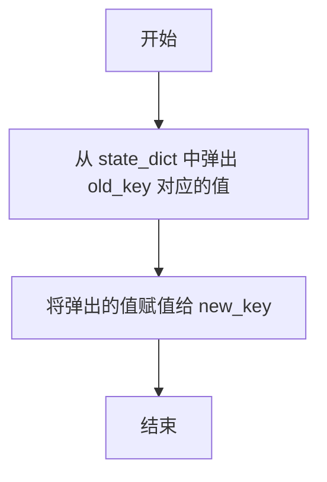

#### 带注释源码

```python
def update_state_dict_inplace(state_dict: dict[str, Any], old_key: str, new_key: str) -> None:
    """
    在模型状态字典中原地重命名键。
    
    参数:
        state_dict: 模型的状态字典，包含权重等参数
        old_key: 需要被替换的旧键名
        new_key: 新的键名
    
    返回:
        无返回值，直接修改传入的字典
    """
    # 弹出旧键对应的值，并将该值以新键名存入字典
    # pop 操作会移除 old_key 并返回其对应的值
    state_dict[new_key] = state_dict.pop(old_key)
```


### `remove_keys_inplace`

该函数是一个工具函数，用于从模型状态字典（state_dict）中移除指定的键值对。它通常被用作特殊键重映射处理器（special keys remap handler），当某些旧版模型的权重键在转换过程中需要被完全丢弃时使用。

参数：

- `key`：`str`，要移除的键名称
- `state_dict`：`dict[str, Any]`，模型的状态字典，会被原地修改

返回值：`None`，无返回值，该函数直接修改传入的 `state_dict` 字典

#### 流程图

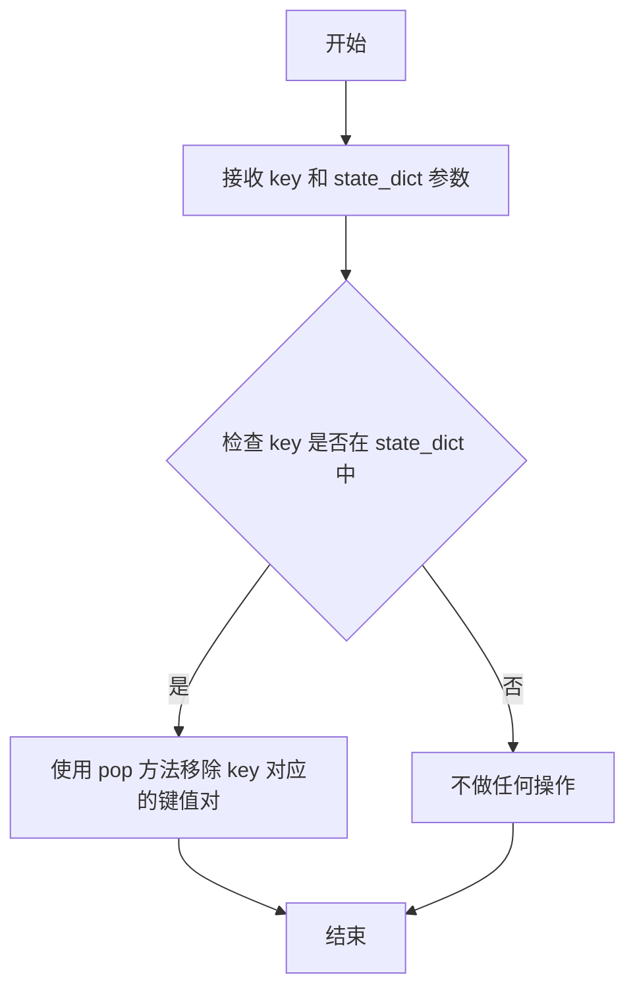

#### 带注释源码

```python
def remove_keys_inplace(key: str, state_dict: dict[str, Any]) -> None:
    """
    从状态字典中移除指定的键值对。
    
    这是一个原地操作函数，直接修改传入的 state_dict，不返回任何值。
    通常用作特殊键重映射处理器，用于删除不需要的权重键。
    
    参数:
        key: str - 要从 state_dict 中移除的键名称
        state_dict: dict[str, Any] - 模型的状态字典，会被原地修改
    
    返回:
        None - 无返回值，原地修改 state_dict
    """
    state_dict.pop(key)
```


### `convert_ltx2_transformer_adaln_single`

该函数用于将 LTX2 Transformer 模型状态字典中的 `adaln_single` 和 `audio_adaln_single` 键名分别重映射为 `time_embed` 和 `audio_time_embed`，以适配 Diffusers 版本的模型结构。

参数：

- `key`：`str`，当前处理的键名
- `state_dict`：`dict[str, Any]`，模型权重状态字典，通过键值对修改实现重命名

返回值：`None`，该函数直接修改传入的 `state_dict` 字典，不返回新字典

#### 流程图

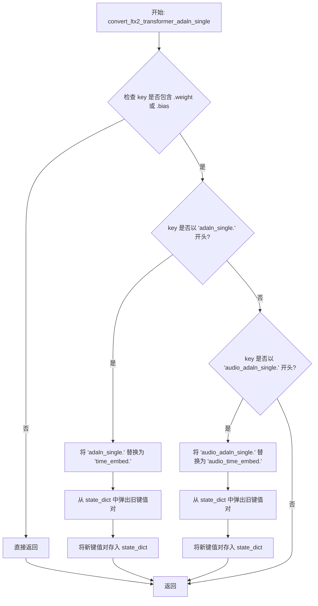

#### 带注释源码

```python
def convert_ltx2_transformer_adaln_single(key: str, state_dict: dict[str, Any]) -> None:
    # 如果键名不包含权重或偏置参数，则跳过处理
    # 这是为了只处理实际的模型参数，避免处理其他元数据键
    if ".weight" not in key and ".bias" not in key:
        return

    # 处理视频/图像adaln_single参数的转换
    # 原始checkpoint中使用 adaln_single 前缀，Diffsers版本使用 time_embed 前缀
    if key.startswith("adaln_single."):
        # 构造新键名：将 adaln_single. 替换为 time_embed.
        new_key = key.replace("adaln_single.", "time_embed.")
        # 弹出旧键值对并以新键名存入，实现键名重命名
        param = state_dict.pop(key)
        state_dict[new_key] = param

    # 处理音频adaln_single参数的转换
    # 原始checkpoint中使用 audio_adaln_single 前缀，Diffusers版本使用 audio_time_embed 前缀
    if key.startswith("audio_adaln_single."):
        # 构造新键名：将 audio_adaln_single. 替换为 audio_time_embed.
        new_key = key.replace("audio_adaln_single.", "audio_time_embed.")
        # 弹出旧键值对并以新键名存入，实现键名重命名
        param = state_dict.pop(key)
        state_dict[new_key] = param

    return
```


### `convert_ltx2_audio_vae_per_channel_statistics`

该函数用于将音频 VAE（Variational Autoencoder）模型权重字典中的 `per_channel_statistics` 相关键名重命名，在键名前添加 `decoder.` 前缀，以适配目标模型的键结构。

参数：

- `key`：`str`，当前遍历的模型权重键名，用于判断是否需要进行键名转换
- `state_dict`：`dict[str, Any]`，模型权重状态字典，函数会直接修改该字典中的键名

返回值：`None`，该函数直接修改传入的 `state_dict` 字典，不返回任何值

#### 流程图

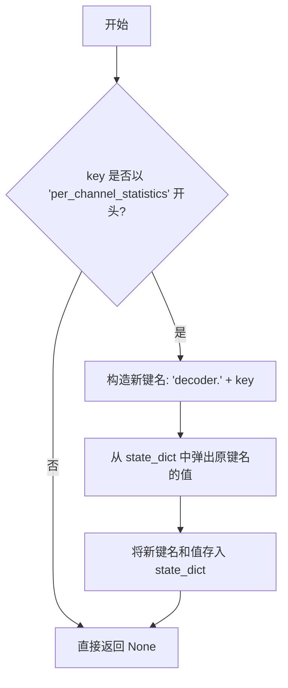

#### 带注释源码

```python
def convert_ltx2_audio_vae_per_channel_statistics(key: str, state_dict: dict[str, Any]) -> None:
    """
    处理音频 VAE 的 per_channel_statistics 键名转换。
    
    该函数是 LTX2 音频 VAE 模型权重转换的辅助函数，负责将原始检查点中的
    per_channel_statistics 键名重命名，以符合 Diffusers 格式的模型结构。
    
    Args:
        key: 当前遍历的模型权重键名
        state_dict: 模型权重状态字典，会被直接原地修改
    
    Returns:
        None: 函数直接修改 state_dict，不返回新字典
    """
    # 检查键名是否以 'per_channel_statistics' 开头
    if key.startswith("per_channel_statistics"):
        # 构造新键名：在原键名前加上 'decoder.' 前缀
        # 例如: 'per_channel_statistics.mean-of-means' -> 'decoder.per_channel_statistics.mean-of-means'
        new_key = ".".join(["decoder", key])
        
        # 从字典中弹出原键名对应的值（同时删除原键）
        param = state_dict.pop(key)
        
        # 将新键名和对应的值存入字典
        state_dict[new_key] = param

    # 函数结束，返回 None
    return
```


### `split_transformer_and_connector_state_dict`

该函数用于将包含Transformer和Connector组件的混合状态字典拆分为两个独立的状态字典。函数根据预定义的连接器前缀列表，识别并分离出连接器相关的权重，同时将剩余的Transformer权重保留在另一个字典中。

参数：

- `state_dict`：`dict[str, Any]`，原始的模型状态字典，包含Transformer和Connector的权重

返回值：`tuple[dict[str, Any], dict[str, Any]]`，返回一个元组，包含两个状态字典
- 第一个元素：`dict[str, Any]`，Transformer部分的状态字典
- 第二个元素：`dict[str, Any]`，Connector部分的状态字典

#### 流程图

```mermaid
flowchart TD
    A[开始: 输入 state_dict] --> B[定义 connector_prefixes 元组]
    B --> C[初始化空字典: transformer_state_dict 和 connector_state_dict]
    C --> D{遍历 state_dict 中的每个 key-value}
    D --> E{key.startswith(connector_prefixes)?}
    E -->|Yes| F[将 key-value 放入 connector_state_dict]
    E -->|No| G[将 key-value 放入 transformer_state_dict]
    F --> H{还有更多 key?}
    G --> H
    H -->|Yes| D
    H -->|No| I[返回 tuple(transformer_state_dict, connector_state_dict)]
    I --> J[结束]
```

#### 带注释源码

```python
def split_transformer_and_connector_state_dict(state_dict: dict[str, Any]) -> tuple[dict[str, Any], dict[str, Any]]:
    """
    将混合的状态字典拆分为Transformer和Connector两部分
    
    参数:
        state_dict: 包含Transformer和Connector权重的混合状态字典
        
    返回:
        包含两个状态字典的元组: (transformer_state_dict, connector_state_dict)
    """
    
    # 定义连接器相关的前缀列表，用于识别需要分离的键
    connector_prefixes = (
        "video_embeddings_connector",       # 视频嵌入连接器
        "audio_embeddings_connector",        # 音频嵌入连接器
        "transformer_1d_blocks",             # 一维Transformer块
        "text_embedding_projection.aggregate_embed",  # 文本嵌入投影聚合
        "connectors.",                       # 连接器前缀（带点号）
        "video_connector",                   # 视频连接器
        "audio_connector",                    # 音频连接器
        "text_proj_in",                      # 文本投影输入
    )

    # 初始化两个空字典用于存放分离后的状态字典
    transformer_state_dict, connector_state_dict = {}, {}
    
    # 遍历原始状态字典中的每个键值对
    for key, value in state_dict.items():
        # 检查键是否以任何连接器前缀开头
        if key.startswith(connector_prefixes):
            # 如果是连接器相关的键，添加到connector_state_dict
            connector_state_dict[key] = value
        else:
            # 否则添加到transformer_state_dict
            transformer_state_dict[key] = value

    # 返回分离后的两个状态字典
    return transformer_state_dict, connector_state_dict
```


### `get_ltx2_transformer_config`

该函数根据指定的版本号（"test" 或 "2.0"）返回 LTX2 视频Transformer模型的配置字典、键名重命名映射字典以及特殊键处理函数映射。主要用于在模型权重转换过程中获取正确的模型结构配置和键名映射规则。

参数：

- `version`：`str`，版本标识符，用于选择不同的模型配置。当前支持 "test"（测试配置）和 "2.0"（正式发布版本）。

返回值：`tuple[dict[str, Any], dict[str, Any], dict[str, Any]]`，返回一个包含三个字典的元组，分别是模型配置（包含model_id和diffusers_config）、键名重命名映射字典、以及特殊键处理函数映射字典。

#### 流程图

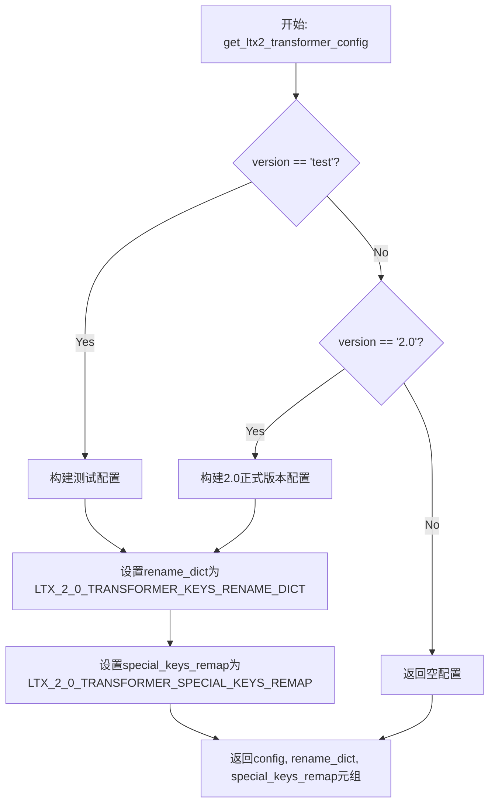

#### 带注释源码

```python
def get_ltx2_transformer_config(version: str) -> tuple[dict[str, Any], dict[str, Any], dict[str, Any]]:
    """
    根据版本号获取LTX2 Transformer模型的配置信息。
    
    Args:
        version: 模型版本标识符，支持 "test" 和 "2.0"
        
    Returns:
        包含模型配置、重命名映射和特殊键处理函数的元组
    """
    # 判断版本类型
    if version == "test":
        # 测试配置：使用较小的模型规模，用于单元测试
        config = {
            "model_id": "diffusers-internal-dev/dummy-ltx2",  # 模型标识符
            "diffusers_config": {
                # 视频通道配置
                "in_channels": 4,              # 输入通道数
                "out_channels": 4,              # 输出通道数
                "patch_size": 1,                # 空间分块大小
                "patch_size_t": 1,              # 时间分块大小
                "num_attention_heads": 2,       # 注意力头数量
                "attention_head_dim": 8,        # 注意力头维度
                "cross_attention_dim": 16,      # 跨注意力维度
                "vae_scale_factors": (8, 32, 32),  # VAE缩放因子
                "pos_embed_max_pos": 20,        # 位置嵌入最大位置数
                "base_height": 2048,            # 基础高度
                "base_width": 2048,             # 基础宽度
                
                # 音频通道配置
                "audio_in_channels": 4,         # 音频输入通道
                "audio_out_channels": 4,        # 音频输出通道
                "audio_patch_size": 1,          # 音频分块大小
                "audio_patch_size_t": 1,        # 音频时间分块大小
                "audio_num_attention_heads": 2, # 音频注意力头数
                "audio_attention_head_dim": 4,  # 音频注意力头维度
                "audio_cross_attention_dim": 8, # 音频跨注意力维度
                "audio_scale_factor": 4,        # 音频缩放因子
                "audio_pos_embed_max_pos": 20,  # 音频位置嵌入最大位置数
                "audio_sampling_rate": 16000,   # 音频采样率
                "audio_hop_length": 160,         # 音频跳步长度
                
                # 模型层与激活配置
                "num_layers": 2,                # Transformer层数
                "activation_fn": "gelu-approximate",  # 激活函数
                "qk_norm": "rms_norm_across_heads",   # QK归一化类型
                "norm_elementwise_affine": False,     # 是否使用逐元素仿射归一化
                "norm_eps": 1e-6,             # 归一化epsilon值
                "caption_channels": 16,        # 标题/文本嵌入通道数
                "attention_bias": True,        # 注意力偏置
                "attention_out_bias": True,    # 注意力输出偏置
                
                # 旋转位置编码配置
                "rope_theta": 10000.0,         # RoPE基础频率
                "rope_double_precision": False,  # RoPE双精度
                
                # 时间步与注意力配置
                "causal_offset": 1,            # 因果偏移量
                "timestep_scale_multiplier": 1000,    # 时间步缩放乘数
                "cross_attn_timestep_scale_multiplier": 1,  # 跨注意力时间步缩放
            },
        }
        # 设置转换用的键名重命名映射
        rename_dict = LTX_2_0_TRANSFORMER_KEYS_RENAME_DICT
        # 设置特殊键处理函数
        special_keys_remap = LTX_2_0_TRANSFORMER_SPECIAL_KEYS_REMAP
        
    elif version == "2.0":
        # 2.0正式版本配置：使用完整规模的模型参数
        config = {
            "model_id": "diffusers-internal-dev/new-ltx-model",
            "diffusers_config": {
                # 视频通道配置 - 更大规模
                "in_channels": 128,            # 输入通道数（扩大32倍）
                "out_channels": 128,           # 输出通道数
                "patch_size": 1,
                "patch_size_t": 1,
                "num_attention_heads": 32,      # 注意力头数（增加16倍）
                "attention_head_dim": 128,      # 注意力头维度（增加16倍）
                "cross_attention_dim": 4096,    # 跨注意力维度（扩大256倍）
                "vae_scale_factors": (8, 32, 32),
                "pos_embed_max_pos": 20,
                "base_height": 2048,
                "base_width": 2048,
                
                # 音频通道配置 - 更大规模
                "audio_in_channels": 128,
                "audio_out_channels": 128,
                "audio_patch_size": 1,
                "audio_patch_size_t": 1,
                "audio_num_attention_heads": 32,
                "audio_attention_head_dim": 64,
                "audio_cross_attention_dim": 2048,
                "audio_scale_factor": 4,
                "audio_pos_embed_max_pos": 20,
                "audio_sampling_rate": 16000,
                "audio_hop_length": 160,
                
                # 模型层与激活配置 - 完整规模
                "num_layers": 48,               # Transformer层数（增加24倍）
                "activation_fn": "gelu-approximate",
                "qk_norm": "rms_norm_across_heads",
                "norm_elementwise_affine": False,
                "norm_eps": 1e-6,
                "caption_channels": 3840,        # 标题通道数（扩大240倍）
                "attention_bias": True,
                "attention_out_bias": True,
                
                # 旋转位置编码配置 - 启用双精度
                "rope_theta": 10000.0,
                "rope_double_precision": True,   # 启用双精度
                
                # 时间步与注意力配置 - 完整规模
                "causal_offset": 1,
                "timestep_scale_multiplier": 1000,
                "cross_attn_timestep_scale_multiplier": 1000,  # 扩大1000倍
                "rope_type": "split",            # 新增：RoPE类型
            },
        }
        rename_dict = LTX_2_0_TRANSFORMER_KEYS_RENAME_DICT
        special_keys_remap = LTX_2_0_TRANSFORMER_SPECIAL_KEYS_REMAP
        
    # 返回配置元组：包含模型配置、键名重命名映射、特殊键处理函数
    return config, rename_dict, special_keys_remap
```


### `get_ltx2_connectors_config`

该函数用于获取 LTX2 连接器（Connectors）的配置信息，包括模型 ID、Diffusers 配置参数、键名重命名映射字典以及特殊键的重映射处理函数。根据传入的版本号（"test" 或 "2.0"）返回对应的配置元组。

参数：

-  `version`：`str`，指定要获取配置的模型版本，可选值为 "test" 或 "2.0"。

返回值：`tuple[dict[str, Any], dict[str, Any], dict[str, Any]]`，返回一个包含三个字典的元组，分别是模型配置（包含 model_id 和 diffusers_config）、键名重命名映射字典、以及特殊键的重映射处理函数字典。

#### 流程图

```mermaid
flowchart TD
    A[开始: get_ltx2_connecters_config] --> B{version == 'test'?}
    B -- 是 --> C[构建 test 版本配置 config]
    B -- 否 --> D{version == '2.0'?}
    D -- 是 --> E[构建 2.0 版本配置 config]
    D -- 否 --> F[使用默认空配置]
    C --> G[获取 rename_dict: LTX_2_0_CONNECTORS_KEYS_RENAME_DICT]
    E --> G
    F --> G
    G --> H[设置 special_keys_remap: 空字典]
    H --> I[返回 (config, rename_dict, special_keys_remap)]
```

#### 带注释源码

```python
def get_ltx2_connectors_config(version: str) -> tuple[dict[str, Any], dict[str, Any], dict[str, Any]]:
    """
    获取 LTX2 连接器的配置信息。
    
    参数:
        version: 模型版本，可选 "test" 或 "2.0"
        
    返回:
        包含配置字典、重命名映射字典和特殊键重映射函数的元组
    """
    # 根据版本号选择对应的配置
    if version == "test":
        # 测试版本的配置，使用较小的模型参数
        config = {
            "model_id": "diffusers-internal-dev/dummy-ltx2",
            "diffusers_config": {
                "caption_channels": 16,                              # 标题通道数
                "text_proj_in_factor": 3,                             # 文本投影输入因子
                "video_connector_num_attention_heads": 4,             # 视频连接器注意力头数
                "video_connector_attention_head_dim": 8,              # 视频连接器注意力头维度
                "video_connector_num_layers": 1,                      # 视频连接器层数
                "video_connector_num_learnable_registers": None,      # 视频连接器可学习寄存器数
                "audio_connector_num_attention_heads": 4,             # 音频连接器注意力头数
                "audio_connector_attention_head_dim": 8,              # 音频连接器注意力头维度
                "audio_connector_num_layers": 1,                      # 音频连接器层数
                "audio_connector_num_learnable_registers": None,      # 音频连接器可学习寄存器数
                "connector_rope_base_seq_len": 32,                    # 连接器 RoPE 基础序列长度
                "rope_theta": 10000.0,                                # RoPE  theta 参数
                "rope_double_precision": False,                       # RoPE 是否使用双精度
                "causal_temporal_positioning": False,                 # 因果时间定位
            },
        }
    elif version == "2.0":
        # 2.0 版本的配置，使用完整的大型模型参数
        config = {
            "model_id": "diffusers-internal-dev/new-ltx-model",
            "diffusers_config": {
                "caption_channels": 3840,                             # 标题通道数（较大）
                "text_proj_in_factor": 49,                            # 文本投影输入因子（较大）
                "video_connector_num_attention_heads": 30,           # 视频连接器注意力头数
                "video_connector_attention_head_dim": 128,           # 视频连接器注意力头维度
                "video_connector_num_layers": 2,                      # 视频连接器层数
                "video_connector_num_learnable_registers": 128,      # 视频连接器可学习寄存器数
                "audio_connector_num_attention_heads": 30,            # 音频连接器注意力头数
                "audio_connector_attention_head_dim": 128,           # 音频连接器注意力头维度
                "audio_connector_num_layers": 2,                      # 音频连接器层数
                "audio_connector_num_learnable_registers": 128,      # 音频连接器可学习寄存器数
                "connector_rope_base_seq_len": 4096,                  # 连接器 RoPE 基础序列长度
                "rope_theta": 10000.0,                                # RoPE theta 参数
                "rope_double_precision": True,                        # RoPE 是否使用双精度
                "causal_temporal_positioning": False,                 # 因果时间定位
                "rope_type": "split",                                 # RoPE 类型
            },
        }

    # 获取连接器键名重命名映射字典
    rename_dict = LTX_2_0_CONNECTORS_KEYS_RENAME_DICT
    
    # 设置特殊键重映射函数（此处为空字典，表示无特殊处理）
    special_keys_remap = {}

    # 返回配置字典、重命名映射字典和特殊键重映射函数
    return config, rename_dict, special_keys_remap
```


### `convert_ltx2_transformer`

该函数用于将原始 LTX2 模型的 Transformer 权重状态字典转换为 Diffusers 库兼容的格式，通过键名重映射和特殊处理来适配 LTX2VideoTransformer3DModel 的结构。

参数：

- `original_state_dict`：`dict[str, Any]`，原始模型的权重字典，包含从检查点加载的模型参数
- `version`：`str`，指定要转换的模型版本（如 "test" 或 "2.0"），用于获取对应的配置和重命名规则

返回值：`dict[str, Any]`，返回转换后的 LTX2VideoTransformer3DModel 实例，其权重已加载为 Diffusers 兼容格式

#### 流程图

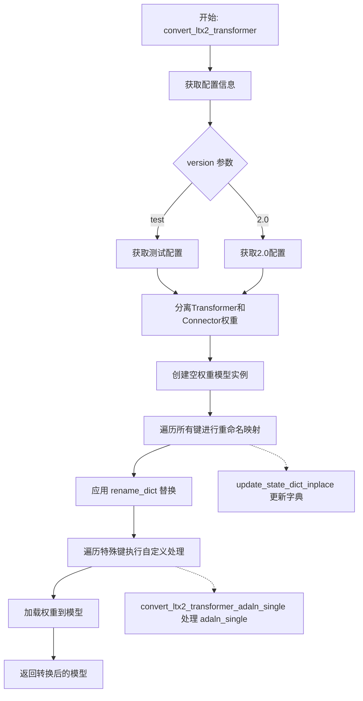

#### 带注释源码

```python
def convert_ltx2_transformer(original_state_dict: dict[str, Any], version: str) -> dict[str, Any]:
    """
    将原始 LTX2 Transformer 的权重状态字典转换为 Diffusers 兼容格式。
    
    参数:
        original_state_dict: 原始模型检查点的权重字典
        version: 模型版本标识 (如 "test" 或 "2.0")
    
    返回:
        转换后的 LTX2VideoTransformer3DModel 实例
    """
    
    # Step 1: 根据版本获取对应的配置、重命名字典和特殊键处理函数
    config, rename_dict, special_keys_remap = get_ltx2_transformer_config(version)
    diffusers_config = config["diffusers_config"]

    # Step 2: 将原始状态字典拆分为 Transformer 和 Connector 两部分
    # 这里只保留 Transformer 部分用于转换
    transformer_state_dict, _ = split_transformer_and_connector_state_dict(original_state_dict)

    # Step 3: 使用空权重初始化 Transformer 模型结构
    # init_empty_weights 是条件导入，如果 accelerate 可用则使用，否则使用 nullcontext
    with init_empty_weights():
        transformer = LTX2VideoTransformer3DModel.from_config(diffusers_config)

    # Step 4: 处理官方代码到 Diffusers 的键名重映射
    # 遍历所有键，应用 rename_dict 中的替换规则
    for key in list(transformer_state_dict.keys()):
        new_key = key[:]  # 复制原始键
        # 依次替换所有匹配的键
        for replace_key, rename_key in rename_dict.items():
            new_key = new_key.replace(replace_key, rename_key)
        # 原地更新状态字典中的键名
        update_state_dict_inplace(transformer_state_dict, key, new_key)

    # Step 5: 处理需要特殊逻辑的键（如 adaln_single 等）
    # 这些无法通过简单的 1:1 映射处理，需要自定义函数
    for key in list(transformer_state_dict.keys()):
        for special_key, handler_fn_inplace in special_keys_remap.items():
            # 只有当特殊键存在于当前键中时才处理
            if special_key not in key:
                continue
            # 调用对应的处理函数进行原地修改
            handler_fn_inplace(key, transformer_state_dict)

    # Step 6: 将转换后的权重加载到模型中
    # strict=True 确保所有键都能匹配，assign=True 确保权重被分配到对应参数
    transformer.load_state_dict(transformer_state_dict, strict=True, assign=True)
    return transformer
```


### `convert_ltx2_connectors`

该函数负责将原始 LTX2 检查点中的 Text Connectors（文本连接器）权重转换为 Diffusers 兼容的格式。它从原始状态字典中分离连接器权重，应用键名重映射和特殊处理，最终返回一个配置好的 `LTX2TextConnectors` 模型实例。

参数：

- `original_state_dict`：`dict[str, Any]`，原始检查点的完整状态字典，包含 Transformer 和 Connector 的权重
- `version`：`str`，指定 LTX2 模型的版本（如 "test" 或 "2.0"），用于获取对应的配置和重命名规则

返回值：`LTX2TextConnectors`，转换后的 Diffusers 兼容的文本连接器模型实例

#### 流程图

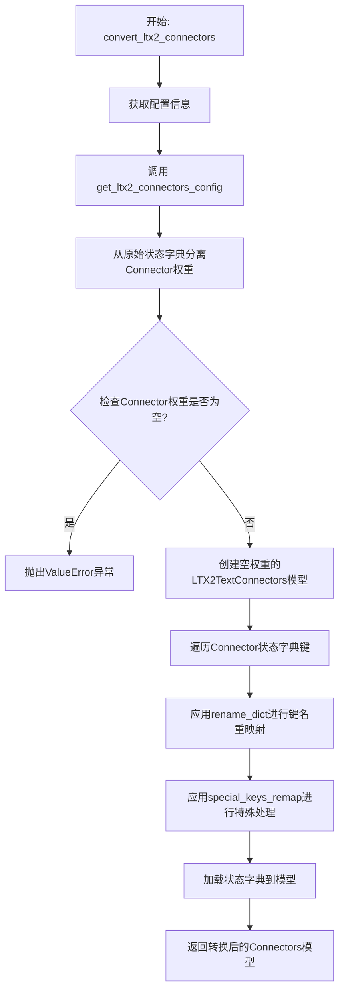

#### 带注释源码

```python
def convert_ltx2_connectors(original_state_dict: dict[str, Any], version: str) -> LTX2TextConnectors:
    """
    将原始LTX2检查点中的Text Connectors权重转换为Diffusers兼容格式。
    
    参数:
        original_state_dict: 原始检查点的完整状态字典
        version: 模型版本 ("test" 或 "2.0")
    
    返回:
        LTX2TextConnectors: 转换后的连接器模型实例
    """
    # 步骤1: 根据版本获取配置、重命名字典和特殊键处理函数
    config, rename_dict, special_keys_remap = get_ltx2_connectors_config(version)
    diffusers_config = config["diffusers_config"]

    # 步骤2: 从原始状态字典中分离出Connector相关的权重
    # split_transformer_and_connector_state_dict 会将状态字典分为transformer和connector两部分
    _, connector_state_dict = split_transformer_and_connector_state_dict(original_state_dict)
    
    # 步骤3: 验证是否成功提取到Connector权重
    if len(connector_state_dict) == 0:
        raise ValueError("No connector weights found in the provided state dict.")

    # 步骤4: 使用init_empty_weights创建模型框架（不分配实际权重）
    # 这是为了获取正确的模型结构以便后续加载权重
    with init_empty_weights():
        connectors = LTX2TextConnectors.from_config(diffusers_config)

    # 步骤5: 应用键名重映射 - 将原始检查点的键名转换为Diffusers格式
    # 例如: "connectors." -> "", "video_embeddings_connector" -> "video_connector"
    for key in list(connector_state_dict.keys()):
        new_key = key[:]  # 复制原始键
        for replace_key, rename_key in rename_dict.items():
            new_key = new_key.replace(replace_key, rename_key)
        # 原地更新状态字典的键名
        update_state_dict_inplace(connector_state_dict, key, new_key)

    # 步骤6: 应用特殊键处理函数 - 处理无法用简单字符串替换表示的转换逻辑
    for key in list(connector_state_dict.keys()):
        for special_key, handler_fn_inplace in special_keys_remap.items():
            if special_key not in key:
                continue
            # 调用特殊的处理函数（例如remove_keys_inplace）
            handler_fn_inplace(key, connector_state_dict)

    # 步骤7: 将转换后的权重加载到模型中
    # strict=True确保所有键都匹配，assign=True直接赋值权重而非复制
    connectors.load_state_dict(connector_state_dict, strict=True, assign=True)
    
    # 步骤8: 返回转换后的Connectors模型
    return connectors
```


### `get_ltx2_video_vae_config`

该函数用于获取 LTX2 视频 VAE（变分自编码器）的配置信息，根据指定的版本返回模型配置字典、状态字典键重命名映射以及特殊键处理函数，用于将原始检查点转换为 Diffusers 格式。

参数：

- `version`：`str`，版本标识符，指定要获取的配置版本（如 "test" 或 "2.0"）
- `timestep_conditioning`：`bool`，可选参数，表示是否对视频 VAE 模型添加时间步条件，默认为 False

返回值：`tuple[dict[str, Any], dict[str, Any], dict[str, Any]]`，返回一个包含三个元素的元组：
- 第一个元素是包含 "model_id" 和 "diffusers_config" 的配置字典
- 第二个元素是状态字典键的重命名映射字典（`LTX_2_0_VIDEO_VAE_RENAME_DICT`）
- 第三个元素是特殊键的处理函数字典（`LTX_2_0_VAE_SPECIAL_KEYS_REMAP`）

#### 流程图

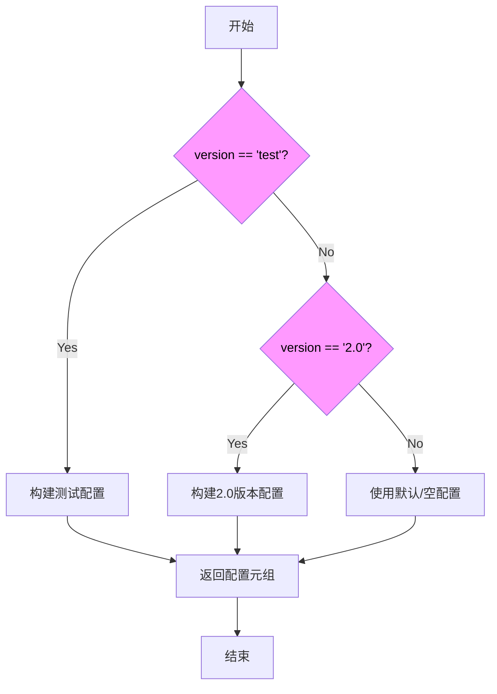

#### 带注释源码

```python
def get_ltx2_video_vae_config(
    version: str, timestep_conditioning: bool = False
) -> tuple[dict[str, Any], dict[str, Any], dict[str, Any]]:
    """
    获取 LTX2 视频 VAE 的配置信息。
    
    Args:
        version: 配置版本标识符，支持 "test" 和 "2.0"
        timestep_conditioning: 是否启用时间步条件机制
    
    Returns:
        包含配置字典、重命名字典和特殊键处理函数的元组
    """
    # 根据版本选择对应的配置
    if version == "test":
        # 测试配置：使用虚拟模型 ID，用于测试目的
        config = {
            "model_id": "diffusers-internal-dev/dummy-ltx2",
            "diffusers_config": {
                "in_channels": 3,  # 输入通道数（RGB图像）
                "out_channels": 3,  # 输出通道数
                "latent_channels": 128,  # 潜在空间通道数
                "block_out_channels": (256, 512, 1024, 2048),  # 各阶段输出通道
                "down_block_types": (  # 下采样块类型
                    "LTX2VideoDownBlock3D",
                    "LTX2VideoDownBlock3D",
                    "LTX2VideoDownBlock3D",
                    "LTX2VideoDownBlock3D",
                ),
                "decoder_block_out_channels": (256, 512, 1024),  # 解码器块输出通道
                "layers_per_block": (4, 6, 6, 2, 2),  # 每个块的层数
                "decoder_layers_per_block": (5, 5, 5, 5),  # 解码器每块层数
                "spatio_temporal_scaling": (True, True, True, True),  # 时空缩放配置
                "decoder_spatio_temporal_scaling": (True, True, True),  # 解码器时空缩放
                "decoder_inject_noise": (False, False, False, False),  # 解码器噪声注入
                "downsample_type": ("spatial", "temporal", "spatiotemporal", "spatiotemporal"),  # 下采样类型
                "upsample_residual": (True, True, True),  # 上采样残差连接
                "upsample_factor": (2, 2, 2),  # 上采样因子
                "timestep_conditioning": timestep_conditioning,  # 时间步条件开关
                "patch_size": 4,  # 空间patch大小
                "patch_size_t": 1,  # 时间patch大小
                "resnet_norm_eps": 1e-6,  # ResNet归一化epsilon
                "encoder_causal": True,  # 编码器因果模式
                "decoder_causal": False,  # 解码器非因果模式
                "encoder_spatial_padding_mode": "zeros",  # 编码器空间填充模式
                "decoder_spatial_padding_mode": "reflect",  # 解码器空间填充模式
                "spatial_compression_ratio": 32,  # 空间压缩比
                "temporal_compression_ratio": 8,  # 时间压缩比
            },
        }
        # 使用预定义的重命名映射字典，将原始键映射到Diffusers格式
        rename_dict = LTX_2_0_VIDEO_VAE_RENAME_DICT
        # 特殊键处理函数集合，用于处理无法通过简单重命名表达的转换逻辑
        special_keys_remap = LTX_2_0_VAE_SPECIAL_KEYS_REMAP
    
    # 2.0版本配置
    elif version == "2.0":
        config = {
            "model_id": "diffusers-internal-dev/dummy-ltx2",  # 实际应使用真实模型ID
            "diffusers_config": {
                "in_channels": 3,
                "out_channels": 3,
                "latent_channels": 128,
                "block_out_channels": (256, 512, 1024, 2048),
                "down_block_types": (
                    "LTX2VideoDownBlock3D",
                    "LTX2VideoDownBlock3D",
                    "LTX2VideoDownBlock3D",
                    "LTX2VideoDownBlock3D",
                ),
                "decoder_block_out_channels": (256, 512, 1024),
                "layers_per_block": (4, 6, 6, 2, 2),
                "decoder_layers_per_block": (5, 5, 5, 5),
                "spatio_temporal_scaling": (True, True, True, True),
                "decoder_spatio_temporal_scaling": (True, True, True),
                "decoder_inject_noise": (False, False, False, False),
                "downsample_type": ("spatial", "temporal", "spatiotemporal", "spatiotemporal"),
                "upsample_residual": (True, True, True),
                "upsample_factor": (2, 2, 2),
                "timestep_conditioning": timestep_conditioning,
                "patch_size": 4,
                "patch_size_t": 1,
                "resnet_norm_eps": 1e-6,
                "encoder_causal": True,
                "decoder_causal": False,
                "encoder_spatial_padding_mode": "zeros",
                "decoder_spatial_padding_mode": "reflect",
                "spatial_compression_ratio": 32,
                "temporal_compression_ratio": 8,
            },
        }
        rename_dict = LTX_2_0_VIDEO_VAE_RENAME_DICT
        special_keys_remap = LTX_2_0_VAE_SPECIAL_KEYS_REMAP
    
    # 返回配置元组供调用者使用
    return config, rename_dict, special_keys_remap
```


### `convert_ltx2_video_vae`

该函数用于将原始 LTX2 视频 VAE 的模型权重 state dict 转换为 Diffusers 库兼容的格式，通过键名重映射和特殊处理逻辑，将原始检查点加载到 `AutoencoderKLLTX2Video` 模型中。

参数：

- `original_state_dict`：`dict[str, Any]`，原始 LTX2 视频 VAE 的模型权重字典
- `version`：`str`，模型版本（如 "test" 或 "2.0"）
- `timestep_conditioning`：`bool`，是否启用时间步条件

返回值：`dict[str, Any]`，转换后的 `AutoencoderKLLTX2Video` 模型实例

#### 流程图

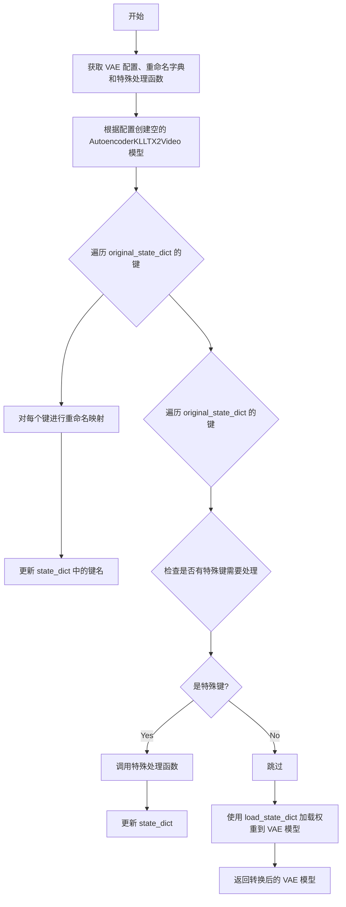

#### 带注释源码

```python
def convert_ltx2_video_vae(
    original_state_dict: dict[str, Any], version: str, timestep_conditioning: bool
) -> dict[str, Any]:
    """
    将原始 LTX2 视频 VAE 的 state dict 转换为 Diffusers 兼容格式
    
    Args:
        original_state_dict: 原始模型的权重字典
        version: 模型版本 ("test" 或 "2.0")
        timestep_conditioning: 是否启用时间步条件
    
    Returns:
        转换后的 AutoencoderKLLTX2Video 模型实例
    """
    # 1. 获取该版本 VAE 的配置信息、重命名映射字典和特殊处理函数
    config, rename_dict, special_keys_remap = get_ltx2_video_vae_config(version, timestep_conditioning)
    diffusers_config = config["diffusers_config"]

    # 2. 使用 init_empty_weights 上下文管理器初始化空权重模型
    #    这样可以避免在创建模型时分配实际内存
    with init_empty_weights():
        vae = AutoencoderKLLTX2Video.from_config(diffusers_config)

    # 3. 处理官方代码到 Diffusers 的键名重映射
    #    通过 remap 字典进行简单的字符串替换
    for key in list(original_state_dict.keys()):
        new_key = key[:]
        for replace_key, rename_key in rename_dict.items():
            new_key = new_key.replace(replace_key, rename_key)
        # 原地更新 state_dict 的键名
        update_state_dict_inplace(original_state_dict, key, new_key)

    # 4. 处理需要特殊逻辑的键，这些无法通过简单的一对一映射完成
    #    例如处理 per_channel_statistics 等特殊结构
    for key in list(original_state_dict.keys()):
        for special_key, handler_fn_inplace in special_keys_remap.items():
            if special_key not in key:
                continue
            handler_fn_inplace(key, original_state_dict)

    # 5. 使用 strict=True 确保所有键都能匹配，assign=True 直接赋值参数
    vae.load_state_dict(original_state_dict, strict=True, assign=True)
    return vae
```


### `get_ltx2_audio_vae_config`

该函数用于获取 LTX2 音频 VAE（变分自编码器）的配置信息，包括模型 ID、diffusers 配置参数、键名重命名映射字典以及特殊键的处理函数。根据传入的版本号返回对应的配置元组。

参数：

-  `version`：`str`，指定要获取配置的 LTX2 模型版本（如 "2.0"）

返回值：`tuple[dict[str, Any], dict[str, Any], dict[str, Any]]`，返回包含三个元素的元组：
  - `config`：包含模型 ID 和 diffusers 配置的字典
  - `rename_dict`：用于键名重命名的字典（将原始检查点键映射到 diffusers 兼容键）
  - `special_keys_remap`：特殊键的处理函数映射字典

#### 流程图

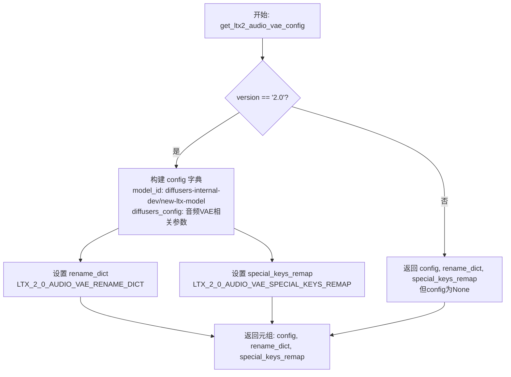

#### 带注释源码

```python
def get_ltx2_audio_vae_config(version: str) -> tuple[dict[str, Any], dict[str, Any], dict[str, Any]]:
    """
    获取 LTX2 音频 VAE 的配置信息。

    参数:
        version: 模型版本号，目前仅支持 "2.0"

    返回:
        包含 (config, rename_dict, special_keys_remap) 的元组
    """
    if version == "2.0":
        # 定义 2.0 版本音频 VAE 的完整配置
        config = {
            # HuggingFace Hub 上的模型 ID
            "model_id": "diffusers-internal-dev/new-ltx-model",
            # Diffusers 库使用的配置参数
            "diffusers_config": {
                "base_channels": 128,        # 基础通道数
                "output_channels": 2,         # 输出通道数（立体声）
                "ch_mult": (1, 2, 4),         # 通道乘数
                "num_res_blocks": 2,         # 每块残差块数量
                "attn_resolutions": None,    # 注意力分辨率
                "in_channels": 2,            # 输入通道数
                "resolution": 256,            # 输入分辨率
                "latent_channels": 8,        # 潜在空间通道数
                "norm_type": "pixel",         # 归一化类型
                "causality_axis": "height",   # 因果性轴
                "dropout": 0.0,               # Dropout 率
                "mid_block_add_attention": False,  # 中间块是否添加注意力
                "sample_rate": 16000,        # 音频采样率
                "mel_hop_length": 160,       # Mel 频谱 hop 长度
                "is_causal": True,           # 是否因果
                "mel_bins": 64,              # Mel 频谱 bins 数量
                "double_z": True,            # 是否使用双潜在空间
            },
        }
        # 键名重命名字典，用于将原始检查点键映射到 diffusers 兼容键
        rename_dict = LTX_2_0_AUDIO_VAE_RENAME_DICT
        # 特殊键的处理函数映射
        special_keys_remap = LTX_2_0_AUDIO_VAE_SPECIAL_KEYS_REMAP
    
    # 返回配置元组
    return config, rename_dict, special_keys_remap
```


### `convert_ltx2_audio_vae`

将原始 LTX-2 音频 VAE (Variational Autoencoder) 检查点状态字典转换为 Diffusers 库兼容的模型格式，通过键名重映射和特殊处理逻辑，最终返回一个配置好的 `AutoencoderKLLTX2Audio` 模型实例。

参数：

- `original_state_dict`：`dict[str, Any]`，原始检查点的状态字典，包含模型权重
- `version`：`str`，指定 LTX-2 模型的版本（如 "2.0" 或 "test"）

返回值：`dict[str, Any]`，返回转换后的 Diffusers `AutoencoderKLLTX2Audio` 模型实例

#### 流程图

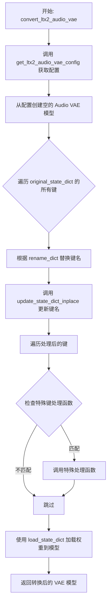

#### 带注释源码

```python
def convert_ltx2_audio_vae(original_state_dict: dict[str, Any], version: str) -> dict[str, Any]:
    """
    将原始 LTX-2 音频 VAE 检查点转换为 Diffusers 兼容的模型格式。
    
    参数:
        original_state_dict: 原始检查点的状态字典（键为权重名称，值为张量）
        version: 模型版本号，用于获取对应的配置
    
    返回:
        转换后的 Diffusers AutoencoderKLLTX2Audio 模型实例
    """
    # 步骤 1: 获取音频 VAE 的配置信息
    # 包括模型 ID、diffusers 配置参数、键名重映射字典和特殊键处理函数
    config, rename_dict, special_keys_remap = get_ltx2_audio_vae_config(version)
    diffusers_config = config["diffusers_config"]

    # 步骤 2: 使用 init_empty_weights 上下文管理器创建空模型
    # init_empty_weights 是可选的 accelerate 库的函数，如果可用则使用它来初始化空模型
    # 否则使用 nullcontext。这里使用它是为了在不分配实际内存的情况下创建模型结构
    with init_empty_weights():
        # 从配置创建 AutoencoderKLLTX2Audio 模型实例
        # 这是一个用于 LTX-2 视频的音频 VAE 模型
        vae = AutoencoderKLLTX2Audio.from_config(diffusers_config)

    # 步骤 3: 处理官方代码到 Diffusers 的键名重映射
    # 通过 rename_dict 将原始检查点的键名映射到 Diffusers 兼容的键名
    # 例如: "per_channel_statistics.mean-of-means" -> "latents_mean"
    for key in list(original_state_dict.keys()):
        new_key = key[:]  # 复制原始键名
        # 遍历重映射字典，替换键名中的子字符串
        for replace_key, rename_key in rename_dict.items():
            new_key = new_key.replace(replace_key, rename_key)
        # 调用 in-place 函数更新状态字典中的键名
        update_state_dict_inplace(original_state_dict, key, new_key)

    # 步骤 4: 处理无法通过简单 1:1 映射表达的复杂逻辑
    # special_keys_remap 包含特殊键的处理函数，例如需要删除或移动的键
    for key in list(original_state_dict.keys()):
        # 遍历特殊键和处理函数
        for special_key, handler_fn_inplace in special_keys_remap.items():
            if special_key not in key:
                continue
            # 调用处理函数对状态字典进行修改
            # 例如: remove_keys_inplace 用于删除某些键
            handler_fn_inplace(key, original_state_dict)

    # 步骤 5: 将转换后的状态字典加载到模型中
    # strict=True 要求所有键都必须匹配
    # assign=True 将张量直接分配给模型参数（而非复制）
    vae.load_state_dict(original_state_dict, strict=True, assign=True)
    
    # 返回转换后的 VAE 模型
    return vae
```


### `get_ltx2_vocoder_config`

该函数用于获取 LTX2 音频合成模型的声码器（Vocoder）配置信息，包括模型 ID、Diffusers 配置参数、以及状态字典的键名重命名映射规则。该函数支持不同的模型版本，并返回配置字典、键名重命名字典和特殊键重映射函数。

参数：

- `version`：`str`，模型版本标识符，用于确定返回哪一组配置（如 "2.0" 或 "test" 等版本）

返回值：`tuple[dict[str, Any], dict[str, Any], dict[str, Any]]`，返回一个包含三个元素的元组，分别是：
- 第一个元素为 `config` 字典，包含模型 ID 和 Diffusers 格式的配置参数
- 第二个元素为 `rename_dict` 字典，用于将原始状态字典的键名映射到 Diffusers 格式的键名
- 第三个元素为 `special_keys_remap` 字典，包含需要特殊处理的键名重映射函数

#### 流程图

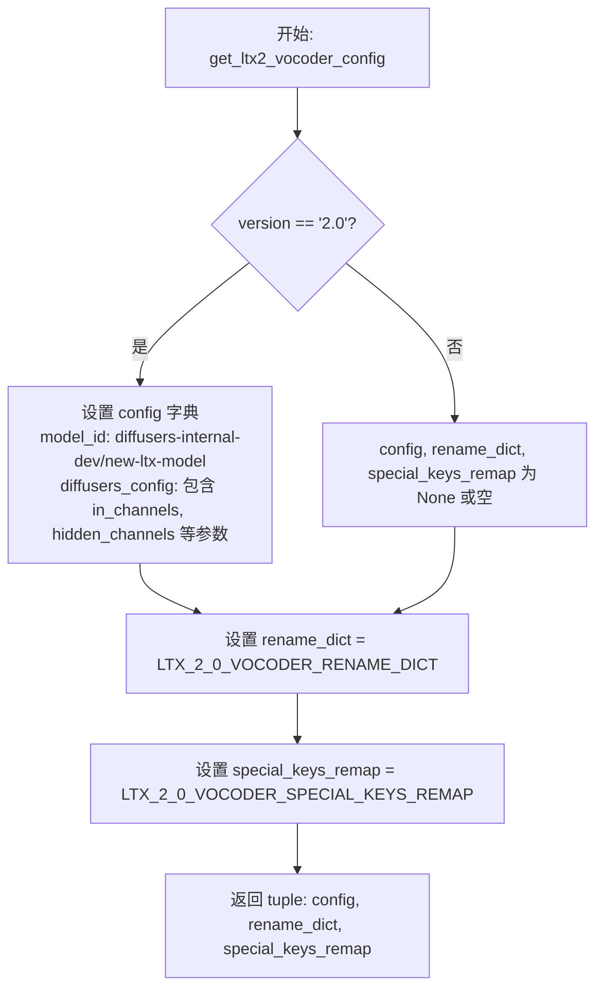

#### 带注释源码

```python
def get_ltx2_vocoder_config(version: str) -> tuple[dict[str, Any], dict[str, Any], dict[str, Any]]:
    """
    获取 LTX2 声码器的配置信息。
    
    Args:
        version: 模型版本标识符，如 "2.0" 或 "test"
    
    Returns:
        包含以下三个元素的元组:
        - config: 包含 model_id 和 diffusers_config 的字典
        - rename_dict: 原始状态字典键名到 Diffusers 格式键名的映射字典
        - special_keys_remap: 需要特殊处理的键名重映射函数字典
    """
    # 仅支持 "2.0" 版本，其他版本会返回未定义的变量（潜在问题）
    if version == "2.0":
        # 定义 LTX2 声码器的配置参数
        config = {
            "model_id": "diffusers-internal-dev/new-ltx-model",
            "diffusers_config": {
                "in_channels": 128,                    # 输入通道数
                "hidden_channels": 1024,               # 隐藏层通道数
                "out_channels": 2,                     # 输出通道数（立体声）
                "upsample_kernel_sizes": [16, 15, 8, 4, 4],  # 上采样核大小
                "upsample_factors": [6, 5, 2, 2, 2],   # 上采样因子
                "resnet_kernel_sizes": [3, 7, 11],     # ResNet 核大小
                "resnet_dilations": [[1, 3, 5], [1, 3, 5], [1, 3, 5]],  # ResNet 膨胀系数
                "leaky_relu_negative_slope": 0.1,      # Leaky ReLU 负斜率
                "output_sampling_rate": 24000,         # 输出采样率 24kHz
            },
        }
        # 从全局变量获取键名重命名映射字典
        rename_dict = LTX_2_0_VOCODER_RENAME_DICT
        # 从全局变量获取特殊键重映射函数（当前为空字典）
        special_keys_remap = LTX_2_0_VOCODER_SPECIAL_KEYS_REMAP
    
    # 返回配置元组
    return config, rename_dict, special_keys_remap
```


### `convert_ltx2_vocoder`

该函数负责将 LTX2 音频生成模型的原始 Vocoder（声码器）权重从官方代码格式转换为 Diffusers 库格式。它首先获取特定版本的 Vocoder 配置和键重命名映射，然后创建一个空的 Diffusers Vocoder 模型实例，接着遍历原始状态字典进行键的重命名和特殊处理，最后将转换后的权重加载到模型中并返回。

参数：

- `original_state_dict`：`dict[str, Any]`，包含 LTX2 Vocoder 的原始模型权重，键名为官方代码格式
- `version`：`str`，指定要转换的 LTX2 模型版本（如 "2.0" 或 "test"）

返回值：`dict[str, Any]`，完成权重转换和加载后的 LTX2Vocoder 模型实例

#### 流程图

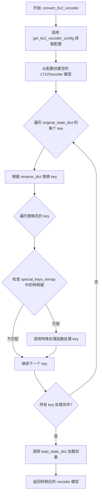

#### 带注释源码

```python
def convert_ltx2_vocoder(original_state_dict: dict[str, Any], version: str) -> dict[str, Any]:
    """
    将 LTX2 Vocoder 的原始权重转换为 Diffusers 格式。
    
    参数:
        original_state_dict: 原始模型权重字典
        version: 模型版本
    
    返回:
        转换并加载权重后的 Vocoder 模型
    """
    # 1. 获取 Vocoder 配置、重命名字典和特殊键处理函数
    config, rename_dict, special_keys_remap = get_ltx2_vocoder_config(version)
    diffusers_config = config["diffusers_config"]

    # 2. 使用空权重初始化 Diffusers 版本的 Vocoder 模型
    #    这样可以避免在加载权重前分配实际内存
    with init_empty_weights():
        vocoder = LTX2Vocoder.from_config(diffusers_config)

    # 3. 处理官方代码到 Diffusers 的键名重映射
    #    例如: "ups" -> "upsamplers", "resblocks" -> "resnets"
    for key in list(original_state_dict.keys()):
        new_key = key[:]  # 复制原始键
        # 遍历重命名字典，进行键名的批量替换
        for replace_key, rename_key in rename_dict.items():
            new_key = new_key.replace(replace_key, rename_key)
        # 原地更新状态字典中的键名
        update_state_dict_inplace(original_state_dict, key, new_key)

    # 4. 处理无法通过简单一对一映射表达的特殊逻辑
    #    例如: 某些键需要根据上下文进行合并或拆分
    for key in list(original_state_dict.keys()):
        # 遍历特殊键处理函数映射
        for special_key, handler_fn_inplace in special_keys_remap.items():
            if special_key not in key:
                continue
            # 调用对应的处理函数进行原地修改
            handler_fn_inplace(key, original_state_dict)

    # 5. 将转换后的权重加载到模型中
    #    strict=True 确保所有键都能匹配
    #    assign=True 确保张量被直接赋值而非拷贝
    vocoder.load_state_dict(original_state_dict, strict=True, assign=True)
    return vocoder
```


### `get_ltx2_spatial_latent_upsampler_config`

该函数用于获取 LTX2 模型中空间潜在上采样器（spatial latent upsampler）的配置参数。根据传入的版本号，返回对应的模型配置字典，包含输入通道数、中间通道数、块数量、维度信息、上采样方式以及空间缩放比例等关键参数。

参数：

- `version`：`str`，版本标识符，用于选择对应的配置。目前仅支持 "2.0" 版本。

返回值：`dict[str, Any]`，包含空间潜在上采样器配置的字典，包括 in_channels、mid_channels、num_blocks_per_stage、dims、spatial_upsample、temporal_upsample 和 rational_spatial_scale 等键值对。

#### 流程图

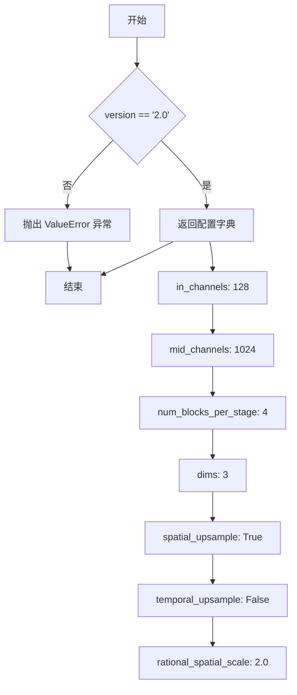

#### 带注释源码

```python
def get_ltx2_spatial_latent_upsampler_config(version: str):
    """
    获取 LTX2 空间潜在上采样器的配置参数。
    
    Args:
        version (str): 模型版本号，目前仅支持 "2.0"
        
    Returns:
        dict[str, Any]: 包含空间潜在上采样器配置的字典
        
    Raises:
        ValueError: 当传入不支持的版本号时抛出
    """
    # 判断版本号是否为 "2.0"
    if version == "2.0":
        # 定义 LTX2 2.0 版本的空间潜在上采样器配置
        config = {
            "in_channels": 128,           # 输入通道数，表示潜在表示的通道维度
            "mid_channels": 1024,         # 中间层通道数，用于隐藏层特征处理
            "num_blocks_per_stage": 4,    # 每个阶段的块数量，决定模型深度
            "dims": 3,                     # 维度数，3D 模型（空间+时间）
            "spatial_upsample": True,     # 是否启用空间上采样
            "temporal_upsample": False,    # 是否启用时间上采样
            "rational_spatial_scale": 2.0,# 空间缩放比例（2倍上采样）
        }
    else:
        # 对于不支持的版本，抛出明确的错误信息
        raise ValueError(f"Unsupported version: {version}")
    
    # 返回配置字典，供后续模型初始化使用
    return config
```


### `convert_ltx2_spatial_latent_upsampler`

将原始LTX2空间潜在升采样器模型的状态字典转换为diffusers格式的模型实例。

参数：

- `original_state_dict`：`dict[str, Any]`，原始模型检查点的状态字典
- `config`：`dict[str, Any]`，LTX2LatentUpsamplerModel的配置字典，包含模型结构参数
- `dtype`：`torch.dtype`，模型权重转换的目标数据类型（如bf16、fp16等）

返回值：`LTX2LatentUpsamplerModel`，转换并加载权重后的模型实例

#### 流程图

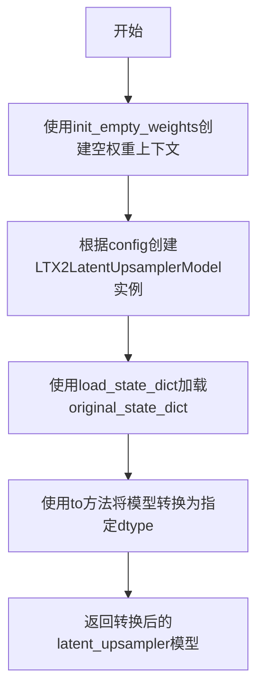

#### 带注释源码

```python
def convert_ltx2_spatial_latent_upsampler(
    original_state_dict: dict[str, Any], config: dict[str, Any], dtype: torch.dtype
):
    """
    将原始LTX2空间潜在升采样器模型的状态字典转换为diffusers格式的模型实例。
    
    参数:
        original_state_dict: 原始模型检查点的状态字典（键为参数名，值为参数张量）
        config: 包含模型结构配置信息的字典（如in_channels, mid_channels等）
        dtype: 目标数据类型，用于模型权重的类型转换（如torch.bfloat16）
    
    返回:
        转换并加载权重后的LTX2LatentUpsamplerModel模型实例
    """
    # 使用init_empty_weights上下文管理器创建空权重模型，避免加载权重时的内存分配
    with init_empty_weights():
        # 根据config配置创建LTX2LatentUpsamplerModel模型实例
        latent_upsampler = LTX2LatentUpsamplerModel(**config)

    # 从原始状态字典加载权重到模型，strict=True确保所有键都能匹配，assign=True确保参数被正确赋值
    latent_upsampler.load_state_dict(original_state_dict, strict=True, assign=True)
    
    # 将模型的所有参数转换为指定的数据类型（dtype）
    latent_upsampler.to(dtype)
    
    # 返回转换完成的模型实例
    return latent_upsampler
```


### `load_original_checkpoint`

该函数用于从 HuggingFace Hub 或本地路径加载 LTX-2 原始检查点文件，并返回包含模型权重的状态字典。

参数：

- `args`：`argparse.Namespace` 命令行参数对象，必须包含 `original_state_dict_repo_id`（HuggingFace Hub 仓库 ID）或 `checkpoint_path`（本地检查点路径）之一
- `filename`：`str | None`，可选参数，指定要下载或加载的文件名

返回值：`dict[str, Any]`，返回加载后的原始模型状态字典

#### 流程图

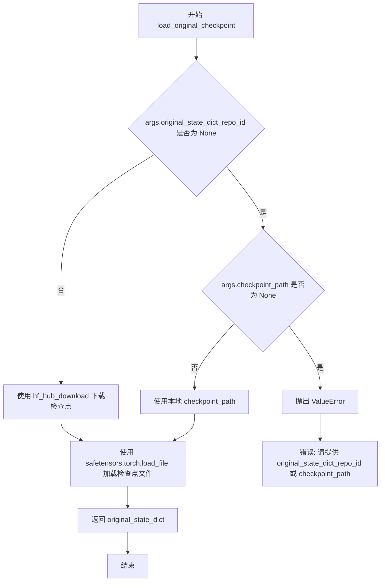

#### 带注释源码

```python
def load_original_checkpoint(args, filename: str | None) -> dict[str, Any]:
    """
    从 HuggingFace Hub 或本地路径加载 LTX-2 原始检查点文件。

    参数:
        args: 命令行参数对象，包含 original_state_dict_repo_id 或 checkpoint_path
        filename: 可选的文件名，用于从 Hub 下载或加载本地文件

    返回:
        包含原始模型权重的状态字典

    异常:
        ValueError: 当既没有提供 original_state_dict_repo_id 也没有提供 checkpoint_path 时
    """
    # 判断是否提供了 HuggingFace Hub 仓库 ID
    if args.original_state_dict_repo_id is not None:
        # 从 HuggingFace Hub 下载检查点文件
        ckpt_path = hf_hub_download(repo_id=args.original_state_dict_repo_id, filename=filename)
    # 判断是否提供了本地检查点路径
    elif args.checkpoint_path is not None:
        # 使用本地检查点路径
        ckpt_path = args.checkpoint_path
    else:
        # 两者都未提供，抛出错误
        raise ValueError("Please provide either `original_state_dict_repo_id` or a local `checkpoint_path`")

    # 使用 safetensors 库加载检查点文件为状态字典
    original_state_dict = safetensors.torch.load_file(ckpt_path)
    return original_state_dict
```


### `load_hub_or_local_checkpoint`

该函数用于从HuggingFace Hub或本地文件系统加载模型检查点（checkpoint），支持`.safetensors`、`.sft`和`.pt`/`.pth`等格式，并根据文件扩展名选择合适的加载方式。

参数：

- `repo_id`：`str | None`，HuggingFace Hub上的模型仓库ID，当从远程仓库下载时必须指定
- `filename`：`str | None`，要加载的检查点文件名，若指定`repo_id`则此参数也必须提供

返回值：`dict[str, Any]`，加载后的模型状态字典（state dict）

#### 流程图

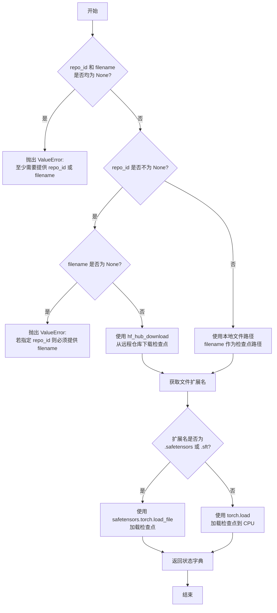

#### 带注释源码

```python
def load_hub_or_local_checkpoint(repo_id: str | None = None, filename: str | None = None) -> dict[str, Any]:
    """
    从 HuggingFace Hub 或本地文件系统加载模型检查点。
    
    参数:
        repo_id: HuggingFace Hub 上的模型仓库 ID，若从远程下载则必填
        filename: 检查点的文件名，若提供 repo_id 则此参数也必填
    
    返回:
        包含模型权重的状态字典
    """
    # 参数校验：至少需要提供 repo_id 或 filename 其中之一
    if repo_id is None and filename is None:
        raise ValueError("Please supply at least one of `repo_id` or `filename`")

    # 根据来源确定检查点路径
    if repo_id is not None:
        # 若指定了 repo_id，则必须同时指定 filename
        if filename is None:
            raise ValueError("If repo_id is specified, filename must also be specified.")
        # 从 HuggingFace Hub 下载检查点
        ckpt_path = hf_hub_download(repo_id=repo_id, filename=filename)
    else:
        # 使用本地文件路径
        ckpt_path = filename

    # 根据文件扩展名选择合适的加载方式
    _, ext = os.path.splitext(ckpt_path)
    if ext in [".safetensors", ".sft"]:
        # 使用 safetensors 格式加载（推荐，更安全）
        state_dict = safetensors.torch.load_file(ckpt_path)
    else:
        # 使用 PyTorch 格式加载（兼容 .pt, .pth 等格式）
        state_dict = torch.load(ckpt_path, map_location="cpu")

    return state_dict
```


### `get_model_state_dict_from_combined_ckpt`

该函数用于从包含多个模型权重（如 VAE、Transformer、Connectors 等）的组合检查点（combined checkpoint）中，根据指定的前缀（prefix）提取特定模型的 `state_dict`。它负责过滤无关权重，并处理 LTX-2.0 模型中 DiT（Diffusion Transformer）权重的一个特殊存储边缘情况（将文本连接器的投影层权重手动添加到 DiT 的权重中）。

参数：

-  `combined_ckpt`：`dict[str, Any]`，包含所有模型权重的字典（键为参数名称，值为张量）。
-  `prefix`：`str`，用于标识目标模型的前缀字符串（例如 `"model.diffusion_model."`、`"vae."` 等）。

返回值：`dict[str, Any]`，提取出的目标模型的参数字典（键已去除前缀）。

#### 流程图

```mermaid
flowchart TD
    A([Start get_model_state_dict_from_combined_ckpt]) --> B{prefix ends with '.'?}
    B -- No --> C[prefix = prefix + '.']
    B -- Yes --> D[Initialize model_state_dict = {}]
    C --> D
    
    D --> E[Loop over combined_ckpt items]
    E --> F{key starts with prefix?}
    F -- Yes --> G[Strip prefix from key<br>Add to model_state_dict]
    F -- No --> H[Skip]
    G --> H
    H --> E
    
    E --> I{Loop finished?}
    I -- Yes --> J{prefix == 'model.diffusion_model.'?}
    J -- Yes --> K{connector_key in combined_ckpt<br>AND not in model_state_dict?}
    J -- No --> L([Return model_state_dict])
    
    K -- Yes --> M[Add connector_key<br>to model_state_dict]
    K -- No --> L
    M --> L
```

#### 带注释源码

```python
def get_model_state_dict_from_combined_ckpt(combined_ckpt: dict[str, Any], prefix: str) -> dict[str, Any]:
    # 确保前缀以点(.)结尾，以便准确匹配参数名
    if not prefix.endswith("."):
        prefix = prefix + "."

    # 初始化用于存储目标模型权重的字典
    model_state_dict = {}
    
    # 遍历组合检查点中的所有参数
    for param_name, param in combined_ckpt.items():
        # 如果参数名以指定前缀开头，则提取该参数
        if param_name.startswith(prefix):
            # 去除前缀作为新字典的键
            model_state_dict[param_name.replace(prefix, "")] = param

    # 特殊处理：对于 Diffusion Model (DiT)，检查是否需要手动添加文本连接器投影层权重
    # 某些检查点中该权重存储在 diffusion model 前缀之外
    if prefix == "model.diffusion_model.":
        connector_key = "text_embedding_projection.aggregate_embed.weight"
        # 仅当该权重存在于原始组合检查点中，但不在当前提取的 model_state_dict 中时添加
        if connector_key in combined_ckpt and connector_key not in model_state_dict:
            model_state_dict[connector_key] = combined_ckpt[connector_key]

    return model_state_dict
```


### `get_args`

该函数是LTX-2模型转换脚本的命令行参数解析器，通过argparse定义并收集所有用于控制模型转换过程的参数，包括模型来源、版本、文件名、数据类型、输出路径等配置。

参数：
- 该函数没有显式的输入参数，参数来源于系统环境或命令行输入

返回值：`Namespace`（argparse.Namespace），包含所有解析后的命令行参数对象，每个属性对应一个通过`parser.add_argument()`添加的参数

#### 流程图

```mermaid
flowchart TD
    A[开始] --> B[创建ArgumentParser实例]
    B --> C[定义none_or_str辅助函数]
    C --> D[添加原始状态字典仓库ID参数]
    D --> E[添加检查点路径参数]
    E --> F[添加版本参数]
    F --> G[添加组合文件名和前缀参数]
    G --> H[添加独立文件名参数]
    H --> I[添加文本编码器和分词器ID参数]
    I --> J[添加潜在上采样器文件名参数]
    J --> K[添加条件标志参数]
    K --> L[添加数据类型参数]
    L --> M[添加输出路径参数]
    M --> N[调用parse_args解析参数]
    N --> O[返回Namespace对象]
```

#### 带注释源码

```python
def get_args():
    """
    解析命令行参数并返回包含所有配置选项的Namespace对象。
    该函数使用argparse模块定义了一系列参数，用于控制LTX-2模型的转换过程。
    """
    # 创建ArgumentParser实例，用于解析命令行参数
    parser = argparse.ArgumentParser()

    def none_or_str(value: str):
        """
        辅助函数：将字符串'none'（不区分大小写）转换为None，其他值原样返回。
        用于处理命令行参数中的None值。
        """
        if isinstance(value, str) and value.lower() == "none":
            return None
        return value

    # 添加原始状态字典仓库ID参数
    parser.add_argument(
        "--original_state_dict_repo_id",
        default="Lightricks/LTX-2",
        type=none_or_str,
        help="HF Hub repo id with LTX 2.0 checkpoint",
    )
    # 添加本地检查点路径参数
    parser.add_argument(
        "--checkpoint_path",
        default=None,
        type=str,
        help="Local checkpoint path for LTX 2.0. Will be used if `original_state_dict_repo_id` is not specified.",
    )
    # 添加模型版本参数
    parser.add_argument(
        "--version",
        type=str,
        default="2.0",
        choices=["test", "2.0"],
        help="Version of the LTX 2.0 model",
    )

    # 添加组合检查点文件名参数
    parser.add_argument(
        "--combined_filename",
        default="ltx-2-19b-dev.safetensors",
        type=none_or_str,
        help="Filename for combined checkpoint with all LTX 2.0 models (VAE, DiT, etc.)",
    )
    # 添加各组件前缀参数
    parser.add_argument("--vae_prefix", default="vae.", type=str)
    parser.add_argument("--audio_vae_prefix", default="audio_vae.", type=str)
    parser.add_argument("--dit_prefix", default="model.diffusion_model.", type=str)
    parser.add_argument("--vocoder_prefix", default="vocoder.", type=str)

    # 添加各组件独立文件名参数（可覆盖组合检查点）
    parser.add_argument("--vae_filename", default=None, type=str, help="VAE filename; overrides combined ckpt if set")
    parser.add_argument(
        "--audio_vae_filename", default=None, type=str, help="Audio VAE filename; overrides combined ckpt if set"
    )
    parser.add_argument("--dit_filename", default=None, type=str, help="DiT filename; overrides combined ckpt if set")
    parser.add_argument(
        "--vocoder_filename", default=None, type=str, help="Vocoder filename; overrides combined ckpt if set"
    )
    # 添加文本编码器和分词器模型ID参数
    parser.add_argument(
        "--text_encoder_model_id",
        default="google/gemma-3-12b-it-qat-q4_0-unquantized",
        type=none_or_str,
        help="HF Hub id for the LTX 2.0 base text encoder model",
    )
    parser.add_argument(
        "--tokenizer_id",
        default="google/gemma-3-12b-it-qat-q4_0-unquantized",
        type=none_or_str,
        help="HF Hub id for the LTX 2.0 text tokenizer",
    )
    # 添加潜在上采样器文件名参数
    parser.add_argument(
        "--latent_upsampler_filename",
        default="ltx-2-spatial-upscaler-x2-1.0.safetensors",
        type=none_or_str,
        help="Latent upsampler filename",
    )

    # 添加条件标志参数（布尔开关）
    parser.add_argument(
        "--timestep_conditioning", action="store_true", help="Whether to add timestep condition to the video VAE model"
    )
    parser.add_argument("--vae", action="store_true", help="Whether to convert the video VAE model")
    parser.add_argument("--audio_vae", action="store_true", help="Whether to convert the audio VAE model")
    parser.add_argument("--dit", action="store_true", help="Whether to convert the DiT model")
    parser.add_argument("--connectors", action="store_true", help="Whether to convert the connector model")
    parser.add_argument("--vocoder", action="store_true", help="Whether to convert the vocoder model")
    parser.add_argument("--text_encoder", action="store_true", help="Whether to conver the text encoder")
    parser.add_argument("--latent_upsampler", action="store_true", help="Whether to convert the latent upsampler")
    # 添加完整管道和上采样管道标志
    parser.add_argument(
        "--full_pipeline",
        action="store_true",
        help="Whether to save the pipeline. This will attempt to convert all models (e.g. vae, dit, etc.)",
    )
    parser.add_argument(
        "--upsample_pipeline",
        action="store_true",
        help="Whether to save a latent upsampling pipeline",
    )

    # 添加各组件数据类型参数
    parser.add_argument("--vae_dtype", type=str, default="bf16", choices=["fp32", "fp16", "bf16"])
    parser.add_argument("--audio_vae_dtype", type=str, default="bf16", choices=["fp32", "fp16", "bf16"])
    parser.add_argument("--dit_dtype", type=str, default="bf16", choices=["fp32", "fp16", "bf16"])
    parser.add_argument("--vocoder_dtype", type=str, default="bf16", choices=["fp32", "fp16", "bf16"])
    parser.add_argument("--text_encoder_dtype", type=str, default="bf16", choices=["fp32", "fp16", "bf16"])

    # 添加输出路径参数（必需）
    parser.add_argument("--output_path", type=str, required=True, help="Path where converted model should be saved")

    # 解析命令行参数并返回Namespace对象
    return parser.parse_args()
```


### main

该函数是 LTX-2 模型权重转换脚本的核心入口点。它负责解析命令行参数，根据参数决定需要转换的模型组件（如 VAE、Transformer、Text Encoder 等），加载原始检查点，调用相应的转换函数将权重转换为 Diffusers 格式，并根据配置选择保存为独立模型或完整的推理 Pipeline。

参数：
- `args`：`argparse.Namespace`，包含所有配置选项的对象。具体参数包括：
  - `original_state_dict_repo_id` / `checkpoint_path`：原始权重来源。
  - `version`：模型版本（如 "2.0"）。
  - `vae` / `audio_vae` / `dit` / `connectors` / `vocoder` / `text_encoder` / `latent_upsampler`：各组件的转换开关。
  - `full_pipeline` / `upsample_pipeline`：完整管道保存开关。
  - `output_path`：输出路径。
  - `vae_dtype` 等：各模型的数据类型。

返回值：`None`，该函数执行直接的 I/O 操作（保存模型文件），不返回任何值。

#### 流程图

```mermaid
flowchart TD
    A([Start main]) --> B[解析参数 & 映射数据类型]
    B --> C{是否需要加载合并检查点?}
    C -- Yes --> D[load_original_checkpoint]
    C -- No --> E{转换 Video VAE?}
    D --> E
    E -- Yes --> F[convert_ltx2_video_vae]
    F --> G{转换 Audio VAE?}
    E -- No --> G
    G -- Yes --> H[convert_ltx2_audio_vae]
    G -- No --> I{转换 DiT?}
    H --> I
    I -- Yes --> J[convert_ltx2_transformer]
    I -- No --> K{转换 Connectors?}
    J --> K
    K -- Yes --> L[convert_ltx2_connectors]
    K -- No --> M{转换 Vocoder?}
    L --> M
    M -- Yes --> N[convert_ltx2_vocoder]
    M -- No --> O{转换 Text Encoder?}
    N --> O
    O -- Yes --> P[加载 Text Encoder & Tokenizer]
    O -- No --> Q{转换 Latent Upsampler?}
    P --> Q
    Q -- Yes --> R[convert_ltx2_spatial_latent_upsampler]
    Q -- No --> S{保存 Full Pipeline?}
    R --> S
    S -- Yes --> T[组装 LTX2Pipeline 并保存]
    S -- No --> U{保存 Upsample Pipeline?}
    T --> U
    U -- Yes --> V[组装 LTX2LatentUpsamplePipeline 并保存]
    U --> W([End])
```

#### 带注释源码

```python
def main(args):
    # 1. 将命令行传入的字符串类型 dtype (如 "bf16") 转换为 PyTorch 的 dtype 对象
    vae_dtype = DTYPE_MAPPING[args.vae_dtype]
    audio_vae_dtype = DTYPE_MAPPING[args.audio_vae_dtype]
    dit_dtype = DTYPE_MAPPING[args.dit_dtype]
    vocoder_dtype = DTYPE_MAPPING[args.vocoder_dtype]
    text_encoder_dtype = DTYPE_MAPPING[args.text_encoder_dtype]

    combined_ckpt = None
    # 判断是否需要加载合并的检查点文件 (通常用于一次性加载所有权重)
    load_combined_models = any(
        [
            args.vae,
            args.audio_vae,
            args.dit,
            args.vocoder,
            args.text_encoder,
            args.full_pipeline,
            args.upsample_pipeline,
        ]
    )
    # 如果需要且提供了 combined_filename，则加载合并权重
    if args.combined_filename is not None and load_combined_models:
        combined_ckpt = load_original_checkpoint(args, filename=args.combined_filename)

    # 2. 视频 VAE 转换逻辑
    if args.vae or args.full_pipeline or args.upsample_pipeline:
        # 优先使用独立 VAE 文件，否则从合并检查中提取
        if args.vae_filename is not None:
            original_vae_ckpt = load_hub_or_local_checkpoint(filename=args.vae_filename)
        elif combined_ckpt is not None:
            original_vae_ckpt = get_model_state_dict_from_combined_ckpt(combined_ckpt, args.vae_prefix)
        
        # 执行转换
        vae = convert_ltx2_video_vae(
            original_vae_ckpt, version=args.version, timestep_conditioning=args.timestep_conditioning
        )
        # 如果不是完整管道模式，则单独保存 VAE
        if not args.full_pipeline and not args.upsample_pipeline:
            vae.to(vae_dtype).save_pretrained(os.path.join(args.output_path, "vae"))

    # 3. 音频 VAE 转换逻辑
    if args.audio_vae or args.full_pipeline:
        if args.audio_vae_filename is not None:
            original_audio_vae_ckpt = load_hub_or_local_checkpoint(filename=args.audio_vae_filename)
        elif combined_ckpt is not None:
            original_audio_vae_ckpt = get_model_state_dict_from_combined_ckpt(combined_ckpt, args.audio_vae_prefix)
        audio_vae = convert_ltx2_audio_vae(original_audio_vae_ckpt, version=args.version)
        if not args.full_pipeline:
            audio_vae.to(audio_vae_dtype).save_pretrained(os.path.join(args.output_path, "audio_vae"))

    # 4. DiT (Transformer) 转换逻辑
    if args.dit or args.full_pipeline:
        if args.dit_filename is not None:
            original_dit_ckpt = load_hub_or_local_checkpoint(filename=args.dit_filename)
        elif combined_ckpt is not None:
            original_dit_ckpt = get_model_state_dict_from_combined_ckpt(combined_ckpt, args.dit_prefix)
        transformer = convert_ltx2_transformer(original_dit_ckpt, version=args.version)
        if not args.full_pipeline:
            transformer.to(dit_dtype).save_pretrained(os.path.join(args.output_path, "transformer"))

    # 5. Connectors (文本连接器) 转换逻辑
    if args.connectors or args.full_pipeline:
        # Connectors 通常与 DiT 在同一个文件中
        if args.dit_filename is not None:
            original_connectors_ckpt = load_hub_or_local_checkpoint(filename=args.dit_filename)
        elif combined_ckpt is not None:
            original_connectors_ckpt = get_model_state_dict_from_combined_ckpt(combined_ckpt, args.dit_prefix)
        connectors = convert_ltx2_connectors(original_connectors_ckpt, version=args.version)
        if not args.full_pipeline:
            connectors.to(dit_dtype).save_pretrained(os.path.join(args.output_path, "connectors"))

    # 6. Vocoder (声码器) 转换逻辑
    if args.vocoder or args.full_pipeline:
        if args.vocoder_filename is not None:
            original_vocoder_ckpt = load_hub_or_local_checkpoint(filename=args.vocoder_filename)
        elif combined_ckpt is not None:
            original_vocoder_ckpt = get_model_state_dict_from_combined_ckpt(combined_ckpt, args.vocoder_prefix)
        vocoder = convert_ltx2_vocoder(original_vocoder_ckpt, version=args.version)
        if not args.full_pipeline:
            vocoder.to(vocoder_dtype).save_pretrained(os.path.join(args.output_path, "vocoder"))

    # 7. Text Encoder (文本编码器) 转换逻辑
    if args.text_encoder or args.full_pipeline:
        # 加载 HuggingFace 格式的文本编码器模型
        text_encoder = Gemma3ForConditionalGeneration.from_pretrained(args.text_encoder_model_id)
        if not args.full_pipeline:
            text_encoder.to(text_encoder_dtype).save_pretrained(os.path.join(args.output_path, "text_encoder"))

        # 加载并保存分词器
        tokenizer = AutoTokenizer.from_pretrained(args.tokenizer_id)
        if not args.full_pipeline:
            tokenizer.save_pretrained(os.path.join(args.output_path, "tokenizer"))

    # 8. Latent Upsampler (潜在上采样器) 转换逻辑
    if args.latent_upsampler or args.full_pipeline or args.upsample_pipeline:
        original_latent_upsampler_ckpt = load_hub_or_local_checkpoint(
            repo_id=args.original_state_dict_repo_id, filename=args.latent_upsampler_filename
        )
        latent_upsampler_config = get_ltx2_spatial_latent_upsampler_config(args.version)
        latent_upsampler = convert_ltx2_spatial_latent_upsampler(
            original_latent_upsampler_ckpt,
            latent_upsampler_config,
            dtype=vae_dtype,
        )
        if not args.full_pipeline and not args.upsample_pipeline:
            latent_upsampler.save_pretrained(os.path.join(args.output_path, "latent_upsampler"))

    # 9. 保存完整 Pipeline
    if args.full_pipeline:
        # 初始化调度器
        scheduler = FlowMatchEulerDiscreteScheduler(
            use_dynamic_shifting=True,
            base_shift=0.95,
            max_shift=2.05,
            base_image_seq_len=1024,
            max_image_seq_len=4096,
            shift_terminal=0.1,
        )

        # 组装所有组件
        pipe = LTX2Pipeline(
            scheduler=scheduler,
            vae=vae,
            audio_vae=audio_vae,
            text_encoder=text_encoder,
            tokenizer=tokenizer,
            connectors=connectors,
            transformer=transformer,
            vocoder=vocoder,
        )

        # 保存为 Diffusers Pipeline
        pipe.save_pretrained(args.output_path, safe_serialization=True, max_shard_size="5GB")

    # 10. 保存 Upsample Pipeline
    if args.upsample_pipeline:
        pipe = LTX2LatentUpsamplePipeline(vae=vae, latent_upsampler=latent_upsampler)

        # 保存到子目录以避免与完整管道冲突
        pipe.save_pretrained(
            os.path.join(args.output_path, "upsample_pipeline"), safe_serialization=True, max_shard_size="5GB"
        )
```

## 关键组件


### 状态字典键名重命名映射 (Key Rename Dictionaries)

这些字典定义了从原始LTX-2模型格式到Diffusers格式的权重键名转换规则，包括Transformer、Video VAE、Audio VAE、Vocoder、Text Encoder和Connectors的键名映射。

### 状态字典原地更新函数 (State Dict Manipulation Functions)

包含`update_state_dict_inplace`用于替换键名、`remove_keys_inplace`用于删除键、`convert_ltx2_transformer_adaln_single`和`convert_ltx2_audio_vae_per_channel_statistics`用于执行特殊的键转换逻辑。

### Transformer状态字典分离器 (Transformer-Connector State Dict Splitter)

`split_transformer_and_connector_state_dict`函数将原始状态字典拆分为Transformer部分和Connector部分，以便分别转换。

### 转换配置获取函数 (Conversion Config Getters)

包括`get_ltx2_transformer_config`、`get_ltx2_connectors_config`、`get_ltx2_video_vae_config`、`get_ltx2_audio_vae_config`、`get_ltx2_vocoder_config`和`get_ltx2_spatial_latent_upsampler_config`，分别获取不同组件的模型配置、重命名字典和特殊键处理函数。

### 核心模型转换器 (Core Model Converters)

将原始检查点权重转换为Diffusers模型格式的函数：`convert_ltx2_transformer`转换DiT Transformer模型、`convert_ltx2_connectors`转换文本连接器、`convert_ltx2_video_vae`转换视频VAE编码器-解码器、`convert_ltx2_audio_vae`转换音频VAE、`convert_ltx2_vocoder`转换声码器、`convert_ltx2_spatial_latent_upsampler`转换空间潜在上采样器。

### 检查点加载器 (Checkpoint Loaders)

`load_original_checkpoint`从HuggingFace Hub或本地路径加载原始检查点，`load_hub_or_local_checkpoint`通用加载函数支持safetensors和torch格式，`get_model_state_dict_from_combined_ckpt`从组合检查点中提取特定模型的状态字典。

### 命令行参数解析器 (CLI Argument Parser)

`get_args`函数定义所有转换选项，包括原始检查点路径、版本选择、各组件转换开关、输出路径和数据类型参数。

### 主转换流程 (Main Conversion Pipeline)

`main`函数协调整个转换过程：加载组合检查点、按需转换各个组件（VAE、Audio VAE、DiT、Connectors、Vocoder、Text Encoder、Latent Upsampler）、保存转换后的模型或完整管道。

### 类型映射与变体映射 (DTYPE and Variant Mappings)

`DTYPE_MAPPING`将字符串 dtype（fp32/fp16/bf16）映射到torch数据类型，`VARIANT_MAPPING`将dtype映射到模型变体标识符，用于控制模型精度和保存格式。


## 问题及建议


### 已知问题

- **重复代码模式严重**：多个转换函数（`convert_ltx2_transformer`、`convert_ltx2_connectors`、`convert_ltx2_video_vae`、`convert_ltx2_audio_vae`、`convert_ltx2_vocoder`）结构高度相似，存在大量重复的键遍历、重命名和处理逻辑，应抽取公共基类或工具函数
- **配置冗余**：视频VAE的"test"和"2.0"版本配置几乎完全相同但未复用，`get_ltx2_video_vae_config`函数中两版本配置重复定义
- **状态字典被直接修改**：多个转换函数直接修改传入的`original_state_dict`参数（通过`update_state_dict_inplace`和`pop`操作），可能导致调用者持有的状态字典意外变更，应先进行深拷贝
- **缺少必要的类型注解**：`get_args()`返回`Namespace`缺少具体类型注解，`get_ltx2_spatial_latent_upsampler_config`返回值类型缺失
- **API兼容性风险**：`get_ltx2_audio_vae_config`和`get_ltx2_vocoder_config`仅处理"2.0"版本，其他版本会隐式返回`None`导致后续调用失败
- **配置错误**：视频VAE两版本（test和2.0）的`model_id`均为"diffusers-internal-dev/dummy-ltx2"，未正确区分不同版本
- **注释与实现不符**：`convert_ltx2_transformer`中注释提到使用`init_empty_weights()`上下文管理器但实际未使用
- **魔法字符串和数字未提取**：模型ID、文件名、路径前缀等大量硬编码在函数中，应提取为模块级常量

### 优化建议

- 重构转换函数为通用的`Converter`类，抽象公共的键重映射、特殊处理和状态加载逻辑
- 将所有配置常量和版本映射提取到独立的配置模块
- 为所有函数添加完整的类型注解，使用`dataclass`或`TypedDict`定义配置结构
- 对输入的状态字典进行深拷贝后再修改，避免副作用
- 添加日志记录功能，使用`logging`模块跟踪转换进度和调试信息
- 统一错误处理策略，为文件加载、模型转换等关键操作添加异常捕获和重试机制
- 将API调用参数验证提前，在函数入口处检查版本参数合法性

## 其它


### 一段话描述
用于将LTX-2.0模型从原始检查点格式转换到Diffusers格式的工具，支持视频VAE、音频VAE、Transformer(DIT)、连接器、声音编码器(Vocoder)和潜在空间上采样器(Latent Upsampler)等多种组件的转换。

### 文件的整体运行流程
1. 解析命令行参数，获取模型配置和转换选项
2. 根据参数加载原始检查点（可以是HuggingFace Hub或本地文件）
3. 根据选择的模型类型（VAE、音频VAE、DiT、连接器、Vocoder、文本编码器、潜在上采样器），调用相应的转换函数
4. 每个转换函数内部：获取配置 -> 初始化空权重模型 -> 重命名状态字典键 -> 应用特殊键重映射 -> 加载权重
5. 根据是否需要完整管道或上采样管道，组装并保存最终模型

### 全局变量和全局函数信息

#### 全局变量

| 名称 | 类型 | 描述 |
|------|------|------|
| CTX | contextlib.nullcontext 或 init_empty_weights | 加速库可用时使用init_empty_weights，否则使用nullcontext |
| LTX_2_0_TRANSFORMER_KEYS_RENAME_DICT | dict | Transformer模型的键重命名映射字典 |
| LTX_2_0_VIDEO_VAE_RENAME_DICT | dict | 视频VAE模型的键重命名映射字典 |
| LTX_2_0_AUDIO_VAE_RENAME_DICT | dict | 音频VAE模型的键重命名映射字典 |
| LTX_2_0_VOCODER_RENAME_DICT | dict | Vocoder模型的键重命名映射字典 |
| LTX_2_0_TEXT_ENCODER_RENAME_DICT | dict | 文本编码器模型的键重命名映射字典 |
| LTX_2_0_CONNECTORS_KEYS_RENAME_DICT | dict | 连接器模型的键重命名映射字典 |
| LTX_2_0_TRANSFORMER_SPECIAL_KEYS_REMAP | dict | Transformer模型特殊键重映射处理函数 |
| LTX_2_0_VAE_SPECIAL_KEYS_REMAP | dict | VAE模型特殊键重映射处理函数 |
| LTX_2_0_AUDIO_VAE_SPECIAL_KEYS_REMAP | dict | 音频VAE模型特殊键重映射处理函数 |
| LTX_2_0_VOCODER_SPECIAL_KEYS_REMAP | dict | Vocoder模型特殊键重映射处理函数 |
| DTYPE_MAPPING | dict | 字符串到PyTorch数据类型的映射 |
| VARIANT_MAPPING | dict | 字符串到模型变体的映射 |

#### 全局函数

| 函数名称 | 参数 | 返回类型 | 功能描述 |
|----------|------|----------|----------|
| update_state_dict_inplace | state_dict: dict, old_key: str, new_key: str | None | 原地更新状态字典的键名 |
| remove_keys_inplace | key: str, state_dict: dict | None | 从状态字典中移除指定键 |
| convert_ltx2_transformer_adaln_single | key: str, state_dict: dict | None | 处理Transformer的adaln_single键重映射 |
| convert_ltx2_audio_vae_per_channel_statistics | key: str, state_dict: dict | None | 处理音频VAE的per_channel_statistics键重映射 |
| split_transformer_and_connector_state_dict | state_dict: dict | tuple[dict, dict] | 分离Transformer和Connector的状态字典 |
| get_ltx2_transformer_config | version: str | tuple[dict, dict, dict] | 获取Transformer模型配置 |
| get_ltx2_connectors_config | version: str | tuple[dict, dict, dict] | 获取连接器模型配置 |
| convert_ltx2_transformer | original_state_dict: dict, version: str | LTX2VideoTransformer3DModel | 转换Transformer模型 |
| convert_ltx2_connectors | original_state_dict: dict, version: str | LTX2TextConnectors | 转换连接器模型 |
| get_ltx2_video_vae_config | version: str, timestep_conditioning: bool | tuple[dict, dict, dict] | 获取视频VAE模型配置 |
| convert_ltx2_video_vae | original_state_dict: dict, version: str, timestep_conditioning: bool | AutoencoderKLLTX2Video | 转换视频VAE模型 |
| get_ltx2_audio_vae_config | version: str | tuple[dict, dict, dict] | 获取音频VAE模型配置 |
| convert_ltx2_audio_vae | original_state_dict: dict, version: str | AutoencoderKLLTX2Audio | 转换音频VAE模型 |
| get_ltx2_vocoder_config | version: str | tuple[dict, dict, dict] | 获取Vocoder模型配置 |
| convert_ltx2_vocoder | original_state_dict: dict, version: str | LTX2Vocoder | 转换Vocoder模型 |
| get_ltx2_spatial_latent_upsampler_config | version: str | dict | 获取潜在上采样器配置 |
| convert_ltx2_spatial_latent_upsampler | original_state_dict: dict, config: dict, dtype: torch.dtype | LTX2LatentUpsamplerModel | 转换潜在上采样器模型 |
| load_original_checkpoint | args, filename: str \| None | dict | 从Hub或本地加载原始检查点 |
| load_hub_or_local_checkpoint | repo_id: str \| None, filename: str \| None | dict | 加载Hub或本地检查点 |
| get_model_state_dict_from_combined_ckpt | combined_ckpt: dict, prefix: str | dict | 从组合检查点中提取特定前缀的模型状态字典 |
| get_args | 无 | argparse.Namespace | 解析命令行参数 |
| main | args: argparse.Namespace | None | 主函数，执行模型转换流程 |

### 关键组件信息

| 组件名称 | 一句话描述 |
|----------|------------|
| LTX2VideoTransformer3DModel | 用于视频生成的Diffusion Transformer模型 |
| LTX2TextConnectors | 连接文本嵌入和Transformer的文本连接器模块 |
| AutoencoderKLLTX2Video | 视频变分自编码器，用于视频压缩和重建 |
| AutoencoderKLLTX2Audio | 音频变分自编码器，用于音频压缩和重建 |
| LTX2Vocoder | 将潜在表示转换为原始音频波形的声码器 |
| LTX2LatentUpsamplerModel | 潜在空间上采样模型，用于提高视频分辨率 |
| FlowMatchEulerDiscreteScheduler | 基于Flow Matching的Euler离散调度器 |
| LTX2Pipeline | 完整的LTX-2.0生成管道 |
| LTX2LatentUpsamplePipeline | 潜在空间上采样管道 |

### 潜在的技术债务或优化空间

1. **硬编码的模型ID和配置**：多个地方使用硬编码的模型ID（如"diffusers-internal-dev/dummy-ltx2"），应该通过配置文件或参数外部化
2. **重复的键重映射逻辑**：convert_ltx2_transformer、convert_ltx2_video_vae等函数中存在大量重复的状态字典处理逻辑，可以提取为通用函数
3. **缺乏完整的错误处理**：很多函数缺少对输入状态字典为空、键不匹配等情况的处理
4. **类型注解不完整**：部分函数参数和返回值缺少详细的类型注解
5. **测试覆盖不足**：缺少单元测试和集成测试
6. **配置冗余**：test版本和2.0版本的配置有大量重复代码，可以提取公共部分
7. **命名不一致**：一些函数命名不够直观，如get_ltx2_spatial_latent_upsampler_config返回的是config而不是配置对象

### 设计目标与约束

- **设计目标**：实现LTX-2.0原始检查点到Diffusers格式的自动化转换，支持多种模型组件
- **支持版本**：test（测试版本）和2.0（正式版本）
- **数据精度支持**：fp32、fp16、bf16三种精度
- **模型来源**：支持从HuggingFace Hub或本地文件系统加载原始检查点
- **输出格式**：支持safetensors格式的安全序列化

### 错误处理与异常设计

1. **参数验证**：get_args()中使用none_or_str验证可选字符串参数
2. **加载验证**：load_original_checkpoint和load_hub_or_local_checkpoint检查必要参数是否提供
3. **状态字典验证**：convert_ltx2_connectors检查connector_state_dict是否为空
4. **版本验证**：get_ltx2_spatial_latent_upsampler_config验证版本是否支持
5. **异常传递**：使用raise抛出ValueError等异常，调用方需处理

### 数据流与状态机

1. **主数据流**：原始检查点 -> 状态字典提取 -> 键重映射 -> 模型加载 -> 保存为Diffusers格式
2. **条件分支**：根据命令行参数决定转换哪些模型组件
3. **组合检查点处理**：支持从合并的检查点文件中分离不同模型的权重
4. **状态管理**：使用init_empty_weights()上下文管理器创建模型结构，然后加载权重

### 外部依赖与接口契约

1. **核心依赖库**：
   - torch：张量操作和模型权重管理
   - safetensors：安全加载和保存模型权重
   - transformers：AutoTokenizer和Gemma3ForConditionalModel
   - diffusers：各种模型类和管道
   - huggingface_hub：模型下载
   - accelerate：内存高效模型加载

2. **关键接口契约**：
   - convert_*函数接受原始状态字典和版本号，返回转换后的模型对象
   - get_*_config函数返回配置字典、键重命名映射和特殊键处理函数
   - 模型使用load_state_dict的strict=True和assign=True参数
   - 管道使用save_pretrained保存，支持safe_serialization和max_shard_size参数

### 其它项目

**命令行参数说明**：
- --original_state_dict_repo_id：HuggingFace Hub上的原始检查点仓库ID
- --checkpoint_path：本地检查点路径
- --version：模型版本（test或2.0）
- --combined_filename：包含所有模型组件的组合检查点文件名
- --vae/audio_vae/dit/vocoder/text_encoder/latent_upsampler：各模型组件的转换开关
- --full_pipeline：转换完整管道
- --upsample_pipeline：转换潜在上采样管道
- --*_filename：各模型组件的独立文件名
- --*_dtype：各模型组件的数据精度
- --output_path：转换后模型的保存路径

    