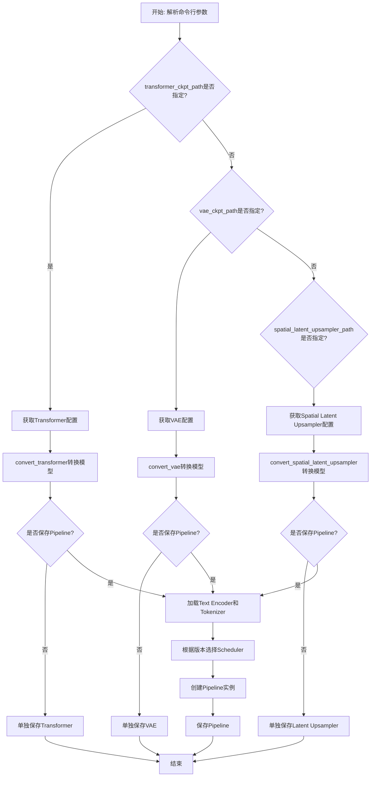
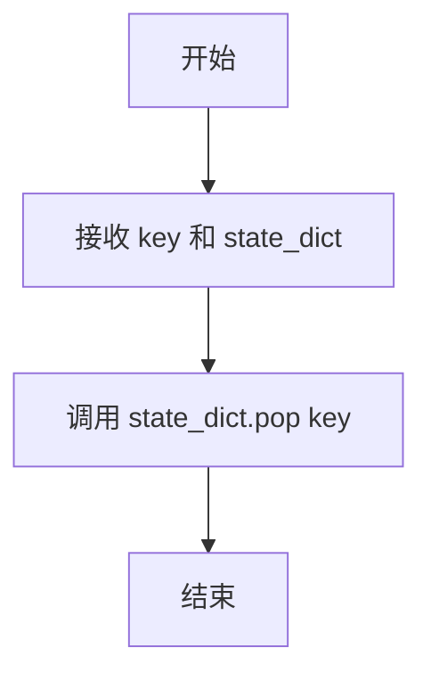
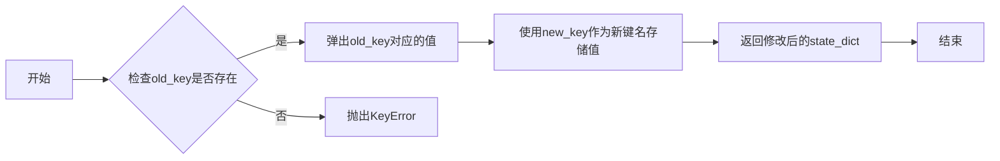
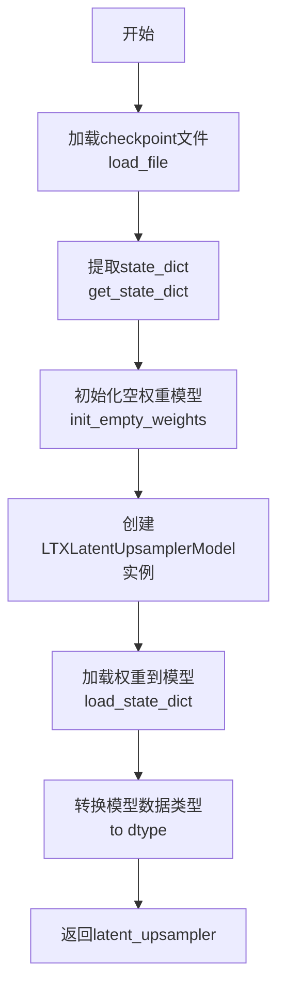
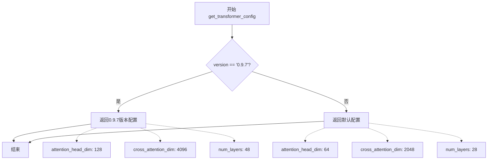
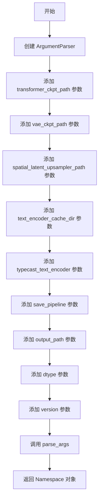

# `diffusers\scripts\convert_ltx_to_diffusers.py` 详细设计文档

这是一个LTXVideo模型检查点转换工具，用于将原始格式的LTXVideo预训练模型（包括Transformer、VAE和Spatial Latent Upsampler）转换为Hugging Face Diffusers库兼容的格式，支持从0.9.0到0.9.8的多个版本，并可选择保存为单独模型或完整Pipeline。

## 整体流程



## 类结构

```
模块级别 (无类定义)
├── 全局常量
│   ├── TOKENIZER_MAX_LENGTH
│   ├── TRANSFORMER_KEYS_RENAME_DICT
│   ├── TRANSFORMER_SPECIAL_KEYS_REMAP
│   ├── VAE_KEYS_RENAME_DICT
│   ├── VAE_091_RENAME_DICT
│   ├── VAE_095_RENAME_DICT
│   ├── VAE_SPECIAL_KEYS_REMAP
│   ├── DTYPE_MAPPING
│   └── VARIANT_MAPPING
├── 工具函数
│   ├── remove_keys_
│   ├── get_state_dict
│   ├── update_state_dict_inplace
│   └── get_args
├── 转换函数
convert_transformer
convert_vae
convert_spatial_latent_upsampler
├── 配置获取函数
get_transformer_config
get_vae_config
get_spatial_latent_upsampler_config
└── 主程序入口
```

## 全局变量及字段


### `TOKENIZER_MAX_LENGTH`
    
分词器最大长度常量，设置为128

类型：`int`
    


### `TRANSFORMER_KEYS_RENAME_DICT`
    
Transformer模型键的重命名映射字典，用于转换检查点键名

类型：`Dict[str, str]`
    


### `TRANSFORMER_SPECIAL_KEYS_REMAP`
    
Transformer模型特殊键的处理函数映射，用于删除或特殊处理某些键

类型：`Dict[str, Callable]`
    


### `VAE_KEYS_RENAME_DICT`
    
VAE模型键的重命名映射字典，用于转换检查点键名

类型：`Dict[str, str]`
    


### `VAE_091_RENAME_DICT`
    
VAE 0.9.1版本特有的键重命名映射字典

类型：`Dict[str, str]`
    


### `VAE_095_RENAME_DICT`
    
VAE 0.9.5和0.9.7版本特有的键重命名映射字典

类型：`Dict[str, str]`
    


### `VAE_SPECIAL_KEYS_REMAP`
    
VAE模型特殊键的处理函数映射，用于删除或特殊处理某些键

类型：`Dict[str, Callable]`
    


### `DTYPE_MAPPING`
    
字符串到PyTorch数据类型的映射，用于将命令行参数转换为torch数据类型

类型：`Dict[str, torch.dtype]`
    


### `VARIANT_MAPPING`
    
字符串到模型变体的映射，用于确定保存模型时的variant参数

类型：`Dict[str, Optional[str]]`
    


### `transformer`
    
转换后的Transformer模型实例

类型：`Optional[LTXVideoTransformer3DModel]`
    


### `vae`
    
转换后的VAE模型实例

类型：`Optional[AutoencoderKLLTXVideo]`
    


### `dtype`
    
PyTorch数据类型，用于模型精度控制

类型：`torch.dtype`
    


### `variant`
    
模型保存变体类型（fp16/bf16或None）

类型：`Optional[str]`
    


### `output_path`
    
转换后模型的输出保存路径

类型：`Path`
    


### `latent_upsampler`
    
空间潜在upsampler模型实例

类型：`Optional[LTXLatentUpsamplerModel]`
    


### `text_encoder_id`
    
文本编码器的模型标识符

类型：`str`
    


### `tokenizer`
    
T5分词器实例，用于文本预处理

类型：`T5Tokenizer`
    


### `text_encoder`
    
T5文本编码器模型实例

类型：`T5EncoderModel`
    


### `scheduler`
    
流匹配Euler离散调度器实例

类型：`FlowMatchEulerDiscreteScheduler`
    


### `pipe`
    
主LTX视频生成管道实例

类型：`Optional[Union[LTXPipeline, LTXConditionPipeline]]`
    


### `pipe_upsample`
    
LTX潜在上采样管道实例

类型：`Optional[LTXLatentUpsamplePipeline]`
    


    

## 全局函数及方法


### `remove_keys_`

这是一个辅助函数，用于从状态字典（state_dict）中移除指定的键值对。该函数被用作特殊键重映射的处理函数，当遇到需要删除的键时调用此函数将其从状态字典中移除。

参数：

-  `key`：`str`，要移除的键名
-  `state_dict`：`Dict[str, Any]`，状态字典，从中移除指定的键

返回值：`None`，无返回值，该函数直接修改传入的字典对象

#### 流程图



#### 带注释源码

```python
def remove_keys_(key: str, state_dict: Dict[str, Any]):
    """
    从状态字典中移除指定的键值对。
    
    这是一个辅助函数，用于处理需要删除的键。
    当 TRANSFORMER_SPECIAL_KEYS_REMAP 或 VAE_SPECIAL_KEYS_REMAP 中的
    特殊键匹配时，会调用此函数将对应的键从状态字典中移除。
    
    参数:
        key: str, 要移除的键名
        state_dict: Dict[str, Any], 状态字典，从中移除指定的键
    
    返回值:
        None, 无返回值，直接修改传入的字典对象
    """
    state_dict.pop(key)
```


### `get_state_dict`

#### 描述
该函数是一个全局工具函数，用于标准化从不同训练框架（如标准 PyTorch、DeepSpeed 或 HuggingFace Accelerate）导出的模型检查点字典结构。它通过尝试查找并提取嵌套在 `model`、`module` 或 `state_dict` 键下的实际模型权重字典，解决模型权重被包装在不同层级中的兼容性问题，从而为后续的键值重命名和模型加载提供统一的数据格式。

#### 文件整体运行流程简述
在 `convert_ltx.py`（模型转换脚本）中，首先通过 `safetensors` 或 `torch` 加载原始检查点文件（`ckpt_path`）。加载后得到的原始字典（通常包含顶层键如 `model`, `module` 或 `state_dict`）会被直接传递给 `get_state_dict` 函数。该函数负责“解包”操作，返回纯净的键值对集合。此后，转换流程会根据版本号对键名进行重映射（`convert_transformer` 或 `convert_vae`），并最终将权重加载到初始化好的空模型中。

#### 全局函数详细信息

**函数名称**: `get_state_dict`

参数：
-  `saved_dict`：`Dict[str, Any]`，从检查点文件加载的原始字典，可能包含 "model"、"module" 或 "state_dict" 等顶层键。

返回值：`dict[str, Any]`，即提取出的包含模型权重键值对的标准状态字典。

#### 流程图

```mermaid
graph TD
    A[输入: saved_dict] --> B[初始化: state_dict = saved_dict]
    B --> C{检查 key 'model'}
    C -- 存在 --> D[更新: state_dict = state_dict['model']]
    C -- 不存在 --> E{检查 key 'module'}
    D --> E
    E -- 存在 --> F[更新: state_dict = state_dict['module']]
    E -- 不存在 --> G{检查 key 'state_dict'}
    F --> G
    G -- 存在 --> H[更新: state_dict = state_dict['state_dict']]
    G -- 不存在 --> I[返回: 原始 state_dict]
    H --> I
```

#### 带注释源码

```python
def get_state_dict(saved_dict: Dict[str, Any]) -> dict[str, Any]:
    """
    从包含模型权重的各种字典格式中提取出标准的 state_dict。

    此函数旨在处理来自不同来源的检查点：
    1. 直接保存的 state_dict。
    2. 包含在 'model' 键下的权重 (常见于 HuggingFace)。
    3. 包含在 'module' 键下的权重 (常见于 DeepSpeed 或 DistributedDataParallel)。
    """
    state_dict = saved_dict
    
    # 处理 HuggingFace 风格的 'model' 键包装
    if "model" in saved_dict.keys():
        state_dict = state_dict["model"]
    
    # 处理 DeepSpeed/DDP 风格的 'module' 键包装
    if "module" in saved_dict.keys():
        state_dict = state_dict["module"]
    
    # 处理标准的 PyTorch 'state_dict' 键包装
    if "state_dict" in saved_dict.keys():
        state_dict = state_dict["state_dict"]
        
    return state_dict
```

#### 关键组件信息
- **`saved_dict`**: 原始输入字典，承载了可能存在的数据结构包装。
- **状态字典提取逻辑**: 核心逻辑是顺序检查并解包三个常见的顶层键。

#### 潜在的技术债务或优化空间
1.  **硬编码键名**: 目前仅支持 "model", "module", "state_dict" 三种键。如果未来引入新的包装格式（如 "pretrained_model" 或 "权重" 等中文键），代码需要手动修改。**建议**: 可以考虑接收一个配置列表或使用更通用的模式匹配。
2.  **浅拷贝风险**: 代码直接修改引用 (`state_dict = ...`)。虽然它提取了内层引用，但如果原始 `saved_dict` 在其他地方被复用，开发者需注意这一点（当前使用场景主要是一次性转换，影响较小）。
3.  **键的优先级**: 当前逻辑是顺序执行。如果一个字典中同时包含 "model" 和 "module"（理论上不应该，但可能因错误产生），代码会优先取 "model"。这种行为缺乏显式的错误处理或警告。

#### 其它项目
- **设计目标与约束**: 该函数的约束是必须在不破坏原有数据的情况下，提供一个统一的、扁平的字典结构供下游转换函数使用。
- **错误处理**: 目前没有显式的错误处理。如果传入的字典为空或不包含上述任何键，函数会原样返回顶层字典，这可能导致后续 `load_state_dict` 失败，但不会在此函数中报错。**建议**: 增加日志警告，当未识别到任何标准键时，提示用户检查格式。
- **外部依赖**: 仅依赖 Python 标准库 `typing`，无外部heavy依赖，保持了极高的兼容性。
- **数据流**: `Load File` -> `get_state_dict` -> `Convert Keys` -> `Load Model`。


### `update_state_dict_inplace`

该函数是一个原地（in-place）操作的状态字典键名更新工具函数，用于在模型状态字典中将旧的键名替换为新的键名，实现键名的重命名映射。

参数：

- `state_dict`：`Dict[str, Any]`，需要修改的状态字典（模型权重参数字典）
- `old_key`：`str`，原始的键名（需要被替换的旧键）
- `new_key`：`str`，目标键名（替换后的新键）

返回值：`dict[str, Any]`，原地修改后的状态字典对象

#### 流程图



#### 带注释源码

```python
def update_state_dict_inplace(state_dict: Dict[str, Any], old_key: str, new_key: str) -> dict[str, Any]:
    """
    在状态字典中用新键名替换旧键名（原地修改）
    
    该函数用于模型权重键名的重命名映射，将checkpoint中保存的旧键名
    替换为模型结构所需的新键名，实现不同版本/格式模型权重的兼容加载。
    
    参数：
        state_dict: Dict[str, Any]，包含模型权重参数的状态字典
        old_key: str，需要被替换的原始键名
        new_key: str，替换后的目标键名
    
    返回：
        dict[str, Any]，原地修改后的状态字典
    """
    # 使用dict.pop()方法弹出旧键对应的值，同时用新键名存储该值
    # 实现键名的原地替换，避免创建新的字典对象
    state_dict[new_key] = state_dict.pop(old_key)
    
    # 返回修改后的字典（虽然调用方通常不使用此返回值）
    return state_dict
```


### `convert_transformer`

该函数负责将存储在指定路径的预训练检查点（通常是 safetensors 格式）中的权重加载到 `LTXVideoTransformer3DModel` 模型中。由于不同版本或来源的检查点键名（key）可能与当前 `diffusers` 库期望的格式不一致，该函数在加载前会执行两轮处理：首先去除特定前缀（如 `model.diffusion_model.`）并根据 `TRANSFORMER_KEYS_RENAME_DICT` 映射表替换键名；然后根据 `TRANSFORMER_SPECIAL_KEYS_REMAP` 移除不需要的键（如混合在其中的 VAE 权重键）。最终使用 `load_state_dict` 将处理后的权重分配给模型。

参数：

- `ckpt_path`：`str`，待转换的 transformer 检查点文件路径（支持 safetensors 格式）。
- `config`：`dict`，用于实例化 `LTXVideoTransformer3DModel` 的配置字典，包含模型结构参数（如 `num_layers`, `hidden_size` 等）。
- `dtype`：`torch.dtype`，目标数据类型，用于指定模型权重的精度（如 `torch.float16`, `torch.bfloat16`）。

返回值：`LTXVideoTransformer3DModel`，完成权重加载和键名适配后的模型实例。

#### 流程图

```mermaid
graph TD
    A[Start convert_transformer] --> B[Load ckpt_path via load_file]
    B --> C[Extract state_dict via get_state_dict]
    C --> D[Init empty LTXVideoTransformer3DModel with config]
    D --> E[Loop: Iterate keys in original_state_dict]
    E --> F{Strip Prefix & Rename?}
    F -->|Yes| G[Remove "model.diffusion_model." prefix]
    G --> H[Replace keys using TRANSFORMER_KEYS_RENAME_DICT]
    H --> I[Update state_dict key via update_state_dict_inplace]
    I --> E
    E --> J{End of keys?}
    J -->|Yes| K[Loop: Check Special Keys]
    K --> L{Check TRANSFORMER_SPECIAL_KEYS_REMAP}
    L -->|Match (e.g., 'vae')| M[Execute handler (remove key)]
    L -->|No Match| K
    M --> K
    K --> N[transformer.load_state_dict with strict=True, assign=True]
    N --> O[Return transformer]
```

#### 带注释源码

```python
def convert_transformer(ckpt_path: str, config, dtype: torch.dtype):
    # 定义需要去除的模型前缀键
    PREFIX_KEY = "model.diffusion_model."

    # 1. 加载原始检查点权重
    original_state_dict = get_state_dict(load_file(ckpt_path))
    
    # 2. 使用 init_empty_weights 上下文初始化空模型（节省内存）
    with init_empty_weights():
        transformer = LTXVideoTransformer3DModel(**config)

    # 3. 第一轮循环：遍历所有键，进行前缀去除和键名重命名
    for key in list(original_state_dict.keys()):
        new_key = key[:]
        # 去除前缀，例如 "model.diffusion_model.blocks.0..." -> "blocks.0..."
        if new_key.startswith(PREFIX_KEY):
            new_key = key[len(PREFIX_KEY) :]
        
        # 根据字典替换特定的旧键名为新库要求的键名
        # 例如 "patchify_proj" -> "proj_in", "adaln_single" -> "time_embed"
        for replace_key, rename_key in TRANSFORMER_KEYS_RENAME_DICT.items():
            new_key = new_key.replace(replace_key, rename_key)
        
        # 更新 state_dict 中的键名
        update_state_dict_inplace(original_state_dict, key, new_key)

    # 4. 第二轮循环：处理特殊键（如移除混杂的 VAE 权重）
    for key in list(original_state_dict.keys()):
        for special_key, handler_fn_inplace in TRANSFORMER_SPECIAL_KEYS_REMAP.items():
            # 如果键中包含特殊标记（如 "vae"），则执行处理函数（通常是删除该键）
            if special_key not in key:
                continue
            handler_fn_inplace(key, original_state_dict)

    # 5. 加载权重到模型
    # strict=True 确保严格匹配键名，assign=True 直接赋值张量（适配空权重初始化）
    transformer.load_state_dict(original_state_dict, strict=True, assign=True)
    return transformer
```


### `convert_vae`

该函数负责将预训练的 VAE 检查点文件转换为 Diffusers 库中的 `AutoencoderKLLTXVideo` 模型格式，处理键名映射、特殊键移除以及状态字典的加载。

参数：

- `ckpt_path`：`str`，原始 VAE 检查点文件的路径
- `config`：`dict`，用于初始化 `AutoencoderKLLTXVideo` 模型的配置字典
- `dtype`：`torch.dtype`，模型权重的数据类型（如 `fp32`、`fp16`、`bf16`）

返回值：`AutoencoderKLLTXVideo`，转换完成并加载了权重后的 VAE 模型实例

#### 流程图

```mermaid
flowchart TD
    A[开始] --> B[定义前缀键 'vae.']
    B --> C[加载检查点文件获取原始状态字典]
    C --> D[使用空权重初始化 VAE 模型]
    E{遍历原始状态字典的每个键} --> F[复制当前键]
    F --> G{检查键是否以 'vae.' 开头}
    G -->|是| H[移除前缀 'vae.']
    G -->|否| I[保持键名不变]
    H --> J{遍历 VAE 键重命名字典]
    I --> J
    J --> K{进行键名替换}
    K --> L[原地更新状态字典的键名]
    L --> M{遍历完所有重命名规则?}
    M -->|否| J
    M -->|是| E
    E --> N{所有键处理完毕?}
    N -->|否| E
    N --> O{遍历特殊键重映射字典}
    O --> P{检查键是否包含特殊键}
    P -->|是| Q[调用处理函数移除键]
    P -->|否| R[跳过]
    Q --> S{处理完所有特殊键?}
    R --> S
    S -->|否| O
    S -->|是| T[使用转换后的状态字典加载模型权重]
    T --> U[返回转换后的 VAE 模型]
    U --> V[结束]
```

#### 带注释源码

```python
def convert_vae(ckpt_path: str, config, dtype: torch.dtype):
    """
    将原始 VAE 检查点转换为 Diffusers 格式的 AutoencoderKLLTXVideo 模型
    
    参数:
        ckpt_path: 原始 VAE 检查点文件的路径
        config: AutoencoderKLLTXVideo 模型的配置字典
        dtype: 模型权重的数据类型
    
    返回:
        转换并加载了权重的 AutoencoderKLLTXVideo 模型实例
    """
    
    # 定义 VAE 键的前缀，用于后续移除
    PREFIX_KEY = "vae."
    
    # 1. 从检查点文件加载原始状态字典
    # get_state_dict 函数会处理嵌套的 'model', 'module', 'state_dict' 键
    original_state_dict = get_state_dict(load_file(ckpt_path))
    
    # 2. 使用空权重初始化 VAE 模型
    # init_empty_weights 上下文管理器用于创建模型结构而不分配实际内存
    with init_empty_weights():
        vae = AutoencoderKLLTXVideo(**config)
    
    # 3. 第一轮键名转换：处理常规键名映射
    # 遍历原始状态字典的所有键
    for key in list(original_state_dict.keys()):
        new_key = key[:]  # 复制当前键名
        
        # 如果键以 'vae.' 开头，移除该前缀
        if new_key.startswith(PREFIX_KEY):
            new_key = key[len(PREFIX_KEY) :]  # 移除 'vae.' 前缀
        
        # 应用 VAE 键重命名字典进行替换
        # 例如: 'up_blocks.0' -> 'mid_block'
        for replace_key, rename_key in VAE_KEYS_RENAME_DICT.items():
            new_key = new_key.replace(replace_key, rename_key)
        
        # 原地更新状态字典中的键名
        update_state_dict_inplace(original_state_dict, key, new_key)
    
    # 4. 第二轮键名转换：处理特殊键（需要移除的键）
    # 遍历原始状态字典的所有键
    for key in list(original_state_dict.keys()):
        # 检查每个特殊键处理函数
        for special_key, handler_fn_inplace in VAE_SPECIAL_KEYS_REMAP.items():
            # 如果当前键包含特殊键，则调用处理函数
            if special_key not in key:
                continue
            # 处理函数（如 remove_keys_）会从状态字典中移除该键
            handler_fn_inplace(key, original_state_dict)
    
    # 5. 加载转换后的状态字典到模型
    # strict=True: 确保所有键都匹配
    # assign=True: 将加载的张量直接赋值给模型参数
    vae.load_state_dict(original_state_dict, strict=True, assign=True)
    
    # 6. 返回转换后的 VAE 模型
    return vae
```


### `convert_spatial_latent_upsampler`

该函数用于将预训练的空间潜空间上采样器（spatial latent upsampler）的检查点文件转换为LTXVideo框架所需的模型格式。它负责加载权重、初始化模型结构、加载权重并转换数据类型。

参数：

- `ckpt_path`：`str`，checkpoint文件的路径，指向原始的空间潜空间上采样器权重文件
- `config`：`dict[str, Any]`，模型配置字典，包含in_channels、mid_channels、num_blocks_per_stage等参数，用于初始化LTXLatentUpsamplerModel
- `dtype`：`torch.dtype`，目标数据类型（如fp32、fp16、bf16），用于转换模型参数

返回值：`LTXLatentUpsamplerModel`，转换并加载权重后的空间潜空间上采样器模型实例

#### 流程图



#### 带注释源码

```python
def convert_spatial_latent_upsampler(ckpt_path: str, config, dtype: torch.dtype):
    # 1. 从checkpoint文件加载原始权重（safetensors格式）
    original_state_dict = get_state_dict(load_file(ckpt_path))

    # 2. 使用init_empty_weights上下文管理器创建空模型结构
    #    这样可以避免在加载权重前分配大量内存
    with init_empty_weights():
        # 3. 根据config配置实例化LTXLatentUpsamplerModel模型
        latent_upsampler = LTXLatentUpsamplerModel(**config)

    # 4. 将原始权重加载到模型中
    #    strict=True: 确保权重键完全匹配
    #    assign=True: 将加载的tensor赋值给模型参数
    latent_upsampler.load_state_dict(original_state_dict, strict=True, assign=True)
    
    # 5. 将模型的所有参数转换为指定的数据类型（dtype）
    latent_upsampler.to(dtype)
    
    # 6. 返回转换完成的空间潜空间上采样器模型
    return latent_upsampler
```


### `get_transformer_config`

根据传入的模型版本号，返回对应的LTXVideoTransformer3DModel配置字典。该函数主要用于支持不同版本的Transformer模型配置，当前区分"0.9.7"版本和其他版本，两者在注意力头维度、交叉注意力维度和层数等核心参数上存在差异。

参数：

-  `version`：`str`，模型版本号，用于区分不同的配置参数。目前支持"0.9.7"版本和其他版本（默认配置）。

返回值：`dict[str, Any]`，包含LTXVideoTransformer3DModel模型初始化所需的所有配置参数字典，如输入输出通道数、注意力头数量、层数、归一化参数等。

#### 流程图



#### 带注释源码

```python
def get_transformer_config(version: str) -> dict[str, Any]:
    """
    根据模型版本获取Transformer配置参数。
    
    该函数为LTXVideoTransformer3DModel返回特定的配置字典。
    目前区分"0.9.7"版本和默认版本，两者在注意力机制参数上有显著差异。
    
    Args:
        version: 模型版本号字符串，用于匹配对应的配置参数
        
    Returns:
        包含模型初始化所需参数的字典，包括：
        - in_channels/out_channels: 输入输出通道数
        - patch_size/patch_size_t: 时空_patch_大小
        - num_attention_heads: 注意力头数量
        - attention_head_dim: 每个注意力头的维度
        - cross_attention_dim: 交叉注意力维度
        - num_layers: Transformer层数
        - activation_fn: 激活函数类型
        - qk_norm: QK归一化方式
        - norm_elementwise_affine: 归一化是否使用仿射参数
        - norm_eps: 归一化epsilon值
        - caption_channels: 文本描述通道数
        - attention_bias: 注意力偏置
        - attention_out_bias: 注意力输出偏置
    """
    # 针对0.9.7版本的特殊配置：更深的模型（48层）和更大的注意力维度
    if version == "0.9.7":
        config = {
            "in_channels": 128,              # 输入通道数
            "out_channels": 128,             # 输出通道数
            "patch_size": 1,                  # 空间_patch_大小
            "patch_size_t": 1,                # 时间_patch_大小
            "num_attention_heads": 32,        # 注意力头数量
            "attention_head_dim": 128,        # 注意力头维度（0.9.7较大）
            "cross_attention_dim": 4096,      # 交叉注意力维度（0.9.7较大）
            "num_layers": 48,                 # Transformer层数（0.9.7较深）
            "activation_fn": "gelu-approximate",  # 激活函数
            "qk_norm": "rms_norm_across_heads",     # QK归一化方式
            "norm_elementwise_affine": False,      # 归一化不使用仿射
            "norm_eps": 1e-6,                      # 归一化 epsilon
            "caption_channels": 4096,              # 文本编码通道数
            "attention_bias": True,                # 注意力使用偏置
            "attention_out_bias": True,            # 注意力输出使用偏置
        }
    else:
        # 默认配置：适用于0.9.0、0.9.1、0.9.5等早期版本
        config = {
            "in_channels": 128,
            "out_channels": 128,
            "patch_size": 1,
            "patch_size_t": 1,
            "num_attention_heads": 32,
            "attention_head_dim": 64,         # 默认维度较小
            "cross_attention_dim": 2048,      # 默认维度较小
            "num_layers": 28,                 # 默认层数较少
            "activation_fn": "gelu-approximate",
            "qk_norm": "rms_norm_across_heads",
            "norm_elementwise_affine": False,
            "norm_eps": 1e-6,
            "caption_channels": 4096,
            "attention_bias": True,
            "attention_out_bias": True,
        }
    return config
```


### `get_vae_config`

该函数是 LTX Video 模型转换工具中的配置工厂方法。它根据传入的模型版本号（如 "0.9.0", "0.9.1"）返回对应的 VAE（变分自编码器）初始化参数字典。值得注意的是，该函数在处理特定版本（如 0.9.1, 0.9.5, 0.9.7）时，会修改全局变量 `VAE_KEYS_RENAME_DICT`，这是一种副作用操作，用于对齐不同版本模型的权重键名称。

**参数：**

-  `version`：`str`，表示 LTX 模型的版本号（例如 "0.9.0", "0.9.1", "0.9.5", "0.9.7"）。

**返回值：**

-  `dict[str, Any]`，包含用于实例化 `AutoencoderKLLTXVideo` 的配置参数字典（例如 `in_channels`, `latent_channels`, `block_out_channels` 等）。

#### 流程图

```mermaid
graph TD
    A([开始: 输入 version]) --> B{version == '0.9.0'?}
    B -- 是 --> C[设置 0.9.0 配置字典]
    C --> J([返回 config])
    B -- 否 --> D{version in ['0.9.1']?}
    D -- 是 --> E[设置 0.9.1 配置字典]
    E --> F[更新全局 VAE_KEYS_RENAME_DICT]
    F --> J
    D -- 否 --> G{version in ['0.9.5', '0.9.7']?}
    G -- 是 --> H[设置 0.9.5/0.9.7 配置字典]
    H --> I[更新全局 VAE_KEYS_RENAME_DICT]
    I --> J
    G -- 否 --> K[返回未定义的 config 或报错]
    
    style F fill:#f9f,stroke:#333,stroke-width:2px
    style I fill:#f9f,stroke:#333,stroke-width:2px
```

#### 带注释源码

```python
def get_vae_config(version: str) -> dict[str, Any]:
    """
    根据模型版本获取 VAE (Variational Autoencoder) 的配置参数。
    
    注意：该函数在处理特定版本时具有副作用，会修改全局字典 VAE_KEYS_RENAME_DICT。
    """
    
    # 配置版本 0.9.0
    if version in ["0.9.0"]:
        config = {
            "in_channels": 3,
            "out_channels": 3,
            "latent_channels": 128,
            "block_out_channels": (128, 256, 512, 512),
            "down_block_types": (
                "LTXVideoDownBlock3D",
                "LTXVideoDownBlock3D",
                "LTXVideoDownBlock3D",
                "LTXVideoDownBlock3D",
            ),
            "decoder_block_out_channels": (128, 256, 512, 512),
            "layers_per_block": (4, 3, 3, 3, 4),
            "decoder_layers_per_block": (4, 3, 3, 3, 4),
            "spatio_temporal_scaling": (True, True, True, False),
            "decoder_spatio_temporal_scaling": (True, True, True, False),
            "decoder_inject_noise": (False, False, False, False, False),
            "downsample_type": ("conv", "conv", "conv", "conv"),
            "upsample_residual": (False, False, False, False),
            "upsample_factor": (1, 1, 1, 1),
            "patch_size": 4,
            "patch_size_t": 1,
            "resnet_norm_eps": 1e-6,
            "scaling_factor": 1.0,
            "encoder_causal": True,
            "decoder_causal": False,
            "timestep_conditioning": False,
        }
        
    # 配置版本 0.9.1
    elif version in ["0.9.1"]:
        config = {
            "in_channels": 3,
            "out_channels": 3,
            "latent_channels": 128,
            "block_out_channels": (128, 256, 512, 512),
            "down_block_types": (
                "LTXVideoDownBlock3D",
                "LTXVideoDownBlock3D",
                "LTXVideoDownBlock3D",
                "LTXVideoDownBlock3D",
            ),
            "decoder_block_out_channels": (256, 512, 1024),
            "layers_per_block": (4, 3, 3, 3, 4),
            "decoder_layers_per_block": (5, 6, 7, 8),
            "spatio_temporal_scaling": (True, True, True, False),
            "decoder_spatio_temporal_scaling": (True, True, True),
            "decoder_inject_noise": (True, True, True, False),
            "downsample_type": ("conv", "conv", "conv", "conv"),
            "upsample_residual": (True, True, True),
            "upsample_factor": (2, 2, 2),
            "timestep_conditioning": True,
            "patch_size": 4,
            "patch_size_t": 1,
            "resnet_norm_eps": 1e-6,
            "scaling_factor": 1.0,
            "encoder_causal": True,
            "decoder_causal": False,
        }
        # 副作用：更新全局的键重命名映射字典，以适配 0.9.1 版本的权重结构
        VAE_KEYS_RENAME_DICT.update(VAE_091_RENAME_DICT)
        
    # 配置版本 0.9.5
    elif version in ["0.9.5"]:
        config = {
            "in_channels": 3,
            "out_channels": 3,
            "latent_channels": 128,
            "block_out_channels": (128, 256, 512, 1024, 2048),
            "down_block_types": (
                "LTXVideo095DownBlock3D",
                "LTXVideo095DownBlock3D",
                "LTXVideo095DownBlock3D",
                "LTXVideo095DownBlock3D",
            ),
            "decoder_block_out_channels": (256, 512, 1024),
            "layers_per_block": (4, 6, 6, 2, 2),
            "decoder_layers_per_block": (5, 5, 5, 5),
            "spatio_temporal_scaling": (True, True, True, True),
            "decoder_spatio_temporal_scaling": (True, True, True),
            "decoder_inject_noise": (False, False, False, False),
            "downsample_type": ("spatial", "temporal", "spatiotemporal", "spatiotemporal"),
            "upsample_residual": (True, True, True),
            "upsample_factor": (2, 2, 2),
            "timestep_conditioning": True,
            "patch_size": 4,
            "patch_size_t": 1,
            "resnet_norm_eps": 1e-6,
            "scaling_factor": 1.0,
            "encoder_causal": True,
            "decoder_causal": False,
            "spatial_compression_ratio": 32,
            "temporal_compression_ratio": 8,
        }
        # 副作用：更新全局的键重命名映射字典
        VAE_KEYS_RENAME_DICT.update(VAE_095_RENAME_DICT)
        
    # 配置版本 0.9.7
    elif version in ["0.9.7"]:
        config = {
            "in_channels": 3,
            "out_channels": 3,
            "latent_channels": 128,
            "block_out_channels": (128, 256, 512, 1024, 2048),
            "down_block_types": (
                "LTXVideo095DownBlock3D",
                "LTXVideo095DownBlock3D",
                "LTXVideo095DownBlock3D",
                "LTXVideo095DownBlock3D",
            ),
            "decoder_block_out_channels": (256, 512, 1024),
            "layers_per_block": (4, 6, 6, 2, 2),
            "decoder_layers_per_block": (5, 5, 5, 5),
            "spatio_temporal_scaling": (True, True, True, True),
            "decoder_spatio_temporal_scaling": (True, True, True),
            "decoder_inject_noise": (False, False, False, False),
            "downsample_type": ("spatial", "temporal", "spatiotemporal", "spatiotemporal"),
            "upsample_residual": (True, True, True),
            "upsample_factor": (2, 2, 2),
            "timestep_conditioning": True,
            "patch_size": 4,
            "patch_size_t": 1,
            "resnet_norm_eps": 1e-6,
            "scaling_factor": 1.0,
            "encoder_causal": True,
            "decoder_causal": False,
            "spatial_compression_ratio": 32,
            "temporal_compression_ratio": 8,
        }
        # 0.9.7 版本复用 0.9.5 的键重命名规则
        VAE_KEYS_RENAME_DICT.update(VAE_095_RENAME_DICT)
        
    return config
```


### `get_spatial_latent_upsampler_config`

该函数根据给定的模型版本号返回对应的空间潜在上采样器（spatial latent upsampler）的配置参数字典，用于初始化LTXLatentUpsamplerModel模型。

参数：

-  `version`：`str`，模型版本号，用于确定返回的配置参数，目前支持"0.9.7"和"0.9.8"版本

返回值：`dict[str, Any]`，包含空间潜在上采样器模型配置参数的字典，包括输入通道数、中间通道数、每阶段块数、维度数、空间上采样标志和时间上采样标志

#### 流程图

```mermaid
flowchart TD
    A[开始] --> B{version == "0.9.7"?}
    B -->|是| C[返回配置1: in_channels=128, mid_channels=512, num_blocks_per_stage=4, dims=3, spatial_upsample=True, temporal_upsample=False]
    B -->|否| D{version == "0.9.8"?}
    D -->|是| E[返回配置2: in_channels=128, mid_channels=512, num_blocks_per_stage=4, dims=3, spatial_upsample=True, temporal_upsample=False]
    D -->|否| F[抛出ValueError: Unsupported version]
    C --> G[结束]
    E --> G
    F --> G
```

#### 带注释源码

```python
def get_spatial_latent_upsampler_config(version: str) -> dict[str, Any]:
    """
    根据模型版本获取空间潜在上采样器的配置参数。
    
    参数:
        version: str - 模型版本号，支持 "0.9.7" 和 "0.9.8"
    
    返回:
        dict[str, Any] - 包含模型配置参数的字典
    
    异常:
        ValueError: 当版本号不支持时抛出
    """
    # 检查版本是否为 0.9.7
    if version == "0.9.7":
        config = {
            "in_channels": 128,           # 输入通道数
            "mid_channels": 512,          # 中间层通道数
            "num_blocks_per_stage": 4,    # 每个阶段的块数量
            "dims": 3,                    # 维度（3D模型）
            "spatial_upsample": True,     # 是否进行空间上采样
            "temporal_upsample": False,   # 是否进行时间上采样
        }
    # 检查版本是否为 0.9.8
    elif version == "0.9.8":
        config = {
            "in_channels": 128,
            "mid_channels": 512,
            "num_blocks_per_stage": 4,
            "dims": 3,
            "spatial_upsample": True,
            "temporal_upsample": False,
        }
    else:
        # 版本不支持时抛出异常
        raise ValueError(f"Unsupported version: {version}")
    return config
```


### `get_args`

该函数用于解析命令行参数，配置 LTX 模型转换工具的各种选项，包括模型检查点路径、输出路径、数据类型和版本等。

参数：

- 无参数

返回值：`Namespace`，返回解析后的命令行参数对象，包含以下属性：
  - `transformer_ckpt_path`：原始 transformer 检查点路径
  - `vae_ckpt_path`：原始 VAE 检查点路径
  - `spatial_latent_upsampler_path`：原始空间潜在上采样器检查点路径
  - `text_encoder_cache_dir`：文本编码器缓存目录
  - `typecast_text_encoder`：是否对文本编码器应用 fp16/bf16 精度
  - `save_pipeline`：是否保存完整管道
  - `output_path`：转换后模型的保存路径
  - `dtype`：保存模型的 Torch 数据类型
  - `version`：LTX 模型版本

#### 流程图



#### 带注释源码

```python
def get_args():
    """
    解析命令行参数并返回包含所有配置选项的 Namespace 对象。
    
    该函数使用 argparse 定义了模型转换工具所需的所有命令行参数，
    包括各种模型检查点路径、输出选项、精度设置和版本选择等。
    """
    # 创建 ArgumentParser 实例，用于解析命令行参数
    parser = argparse.ArgumentParser()
    
    # 添加 transformer 检查点路径参数（可选）
    parser.add_argument(
        "--transformer_ckpt_path", 
        type=str, 
        default=None, 
        help="Path to original transformer checkpoint"
    )
    
    # 添加 VAE 检查点路径参数（可选）
    parser.add_argument(
        "--vae_ckpt_path", 
        type=str, 
        default=None, 
        help="Path to original vae checkpoint"
    )
    
    # 添加空间潜在上采样器检查点路径参数（可选）
    parser.add_argument(
        "--spatial_latent_upsampler_path",
        type=str,
        default=None,
        help="Path to original spatial latent upsampler checkpoint",
    )
    
    # 添加文本编码器缓存目录参数（可选）
    parser.add_argument(
        "--text_encoder_cache_dir", 
        type=str, 
        default=None, 
        help="Path to text encoder cache directory"
    )
    
    # 添加是否对文本编码器进行精度转换的标志参数
    parser.add_argument(
        "--typecast_text_encoder",
        action="store_true",
        default=False,
        help="Whether or not to apply fp16/bf16 precision to text_encoder",
    )
    
    # 添加是否保存完整管道的标志参数
    parser.add_argument("--save_pipeline", action="store_true")
    
    # 添加输出路径参数（必填）
    parser.add_argument(
        "--output_path", 
        type=str, 
        required=True, 
        help="Path where converted model should be saved"
    )
    
    # 添加数据类型参数，默认为 fp32
    parser.add_argument(
        "--dtype", 
        default="fp32", 
        help="Torch dtype to save the model in."
    )
    
    # 添加模型版本参数，包含版本选择和帮助信息
    parser.add_argument(
        "--version",
        type=str,
        default="0.9.0",
        choices=["0.9.0", "0.9.1", "0.9.5", "0.9.7", "0.9.8"],
        help="Version of the LTX model",
    )
    
    # 解析命令行参数并返回 Namespace 对象
    return parser.parse_args()
```

## 关键组件


### 键名转换映射 (Key Rename Dictionaries)

通过预定义的字典（TRANSFORMER_KEYS_RENAME_DICT、VAE_KEYS_RENAME_DICT、VAE_091_RENAME_DICT、VAE_095_RENAME_DICT）将原始检查点的键名转换为diffusers格式的键名，处理Transformer和VAE模型的层命名差异。

### 状态字典提取 (get_state_dict)

统一从不同格式的检查点文件中提取state_dict，支持包含"model"、"module"、"state_dict"外层包装的检查点格式。

### Transformer模型转换 (convert_transformer)

将原始Transformer检查点转换为LTXVideoTransformer3DModel格式，包含键名前缀移除、键名替换、特殊键处理，最后使用init_empty_weights和load_state_dict进行模型加载。

### VAE模型转换 (convert_vae)

将原始VAE检查点转换为AutoencoderKLLTXVideo格式，根据版本号应用不同的键名重命名映射，处理encoder和decoder的层结构差异。

### 配置工厂函数 (get_transformer_config, get_vae_config, get_spatial_latent_upsampler_config)

根据版本号返回对应模型配置，包括通道数、注意力头维度、层数、patch_size等参数，支持0.9.0、0.9.1、0.9.5、0.9.7、0.9.8等版本。

### 命令行参数解析 (get_args)

定义并解析转换工具的命令行参数，包括各组件检查点路径、输出路径、数据类型、版本选择等选项。

### 主转换流程 (Main Execution)

根据传入的检查点路径依次转换Transformer、VAE和空间潜在上采样器，最后组装完整Pipeline并保存，支持单独保存组件或完整Pipeline。

### 数据类型映射 (DTYPE_MAPPING/VARIANT_MAPPING)

将命令行传入的dtype字符串映射为PyTorch数据类型和HuggingFace variant标识，支持fp32、fp16、bf16三种精度。

### Pipeline组装与版本适配

根据版本号选择合适的Pipeline类（LTXPipeline或LTXConditionPipeline配合LTXLatentUpsamplePipeline），配置不同的调度器参数以适配各版本模型特性。


## 问题及建议


### 已知问题

- **全局状态意外修改**：`VAE_KEYS_RENAME_DICT` 在 `get_vae_config()` 函数中通过 `.update()` 直接修改全局字典，多次调用不同版本配置时会导致状态累积和不可预期的行为
- **变量未初始化引用**：`vae` 变量在 `if args.save_pipeline:` 分支中被直接使用，但在 `args.vae_ckpt_path` 为 None 时可能未被定义，会导致运行时错误
- **不一致的转换逻辑**：`convert_spatial_latent_upsampler()` 缺少 key 重命名和特殊键处理逻辑，与 `convert_transformer()` 和 `convert_vae()` 的实现风格不一致，且没有 `PREFIX_KEY` 处理
- **魔法数字与硬编码**：版本号（"0.9.0"、"0.9.1"等）在多处重复硬编码，缺乏统一的版本管理机制；配置参数中大量硬编码数值降低了可维护性
- **错误处理缺失**：`load_file()` 调用缺少异常处理，文件不存在或损坏时会导致程序直接崩溃；版本检查覆盖不全，"0.9.8" 版本在保存 pipeline 时未处理
- **类型标注不完整**：部分变量标注使用了泛型 `dict[str, Any]` 而非具体类型；`convert_transformer()` 和 `convert_vae()` 的 `config` 参数类型标注过于宽泛

### 优化建议

- 将全局的 `VAE_KEYS_RENAME_DICT` 改为在函数内部基于版本返回独立的字典副本，避免修改共享状态
- 在 `if args.save_pipeline:` 分支开始处添加 `vae is None` 的检查并抛出明确的错误信息
- 统一三个转换函数的接口和实现逻辑，将公共逻辑抽取为装饰器或基类方法
- 引入版本枚举或配置类集中管理版本信息，使用数据驱动方式减少硬编码
- 为 `load_file()` 添加 try-except 异常处理，并为文件路径验证提供更友好的错误提示
- 完善类型标注，使用 `TypedDict` 或 dataclass 定义配置结构体，提高代码可读性和静态检查能力

## 其它


### 设计目标与约束

本代码的设计目标是将不同版本的LTXVideo模型原始检查点（checkpoint）转换为HuggingFace diffusers格式，以便与diffusers库无缝集成。主要约束包括：1）仅支持特定的版本（0.9.0、0.9.1、0.9.5、0.9.7、0.9.8）；2）转换过程中需要处理键名映射和特殊键移除；3）模型参数需要根据指定dtype进行转换；4）需要兼容T5文本编码器。

### 错误处理与异常设计

代码中的错误处理主要包括：1）VersionError：当传入不支持的版本时抛出ValueError，如`get_spatial_latent_upsampler_config`中对版本0.9.8以外版本的检查，以及主函数中对0.9.7和0.9.8以外版本的检查；2）参数校验：使用argparse的required参数确保`output_path`必填；3）文件加载错误：load_file可能抛出文件不存在或格式错误的异常，由调用方处理；4）状态字典获取：通过get_state_dict函数处理不同保存格式（model、module、state_dict包装），但未处理空字典或格式不匹配的情况。

### 数据流与状态机

整体数据流为：命令行参数解析 → 根据version获取对应config → 调用convert_*函数加载checkpoint → 键名重映射处理 → 状态字典更新 → 模型加载权重 → 保存为diffusers格式。状态机体现为：1）version分支决定使用哪套config和rename dict；2）VAE转换时根据version动态更新VAE_KEYS_RENAME_DICT；3）pipeline组装时根据version选择LTXPipeline或LTXConditionPipeline+LTXLatentUpsamplePipeline。

### 外部依赖与接口契约

主要外部依赖包括：1）torch：用于张量操作和dtype处理；2）safetensors.torch：用于安全加载检查点文件；3）transformers：提供T5EncoderModel和T5Tokenizer；4）diffusers：提供各类pipeline和模型类；5）accelerate：提供init_empty_weights上下文管理器。接口契约方面：1）convert_*函数接受ckpt_path、config、dtype三个参数，返回对应的模型实例；2）get_*_config函数接受version字符串，返回配置字典；3）状态字典处理函数update_state_dict_inplace为原地操作，直接修改传入的字典。

### 配置管理策略

代码采用硬编码配置与动态版本映射相结合的策略：1）Transformer配置根据version分为两个分支（0.9.7为高配置版本，默认为低配置）；2）VAE配置根据version分为四个分支，每个版本有不同的block_out_channels、layers_per_block等参数；3）版本特定的rename字典（VAE_091_RENAME_DICT、VAE_095_RENAME_DICT）在对应版本的get_vae_config中动态更新到全局VAE_KEYS_RENAME_DICT。

### 命名约定与键映射规则

键名映射遵循以下规则：1）PREFIX_KEY剥离：去除"model.diffusion_model."和"vae."前缀；2）字典替换：遍历TRANSFORMER_KEYS_RENAME_DICT和VAE_KEYS_RENAME_DICT进行字符串替换；3）特殊键处理：通过TRANSFORMER_SPECIAL_KEYS_REMAP和VAE_SPECIAL_KEYS_REMAP字典定义需要完全移除的键。映射关系复杂且版本相关，这是潜在的技术债务。

### 性能优化考量

代码中包含以下性能优化：1）使用init_empty_weights()上下文管理器避免在构建模型时分配实际内存；2）使用assign=True参数直接赋值张量而非复制；3）使用safe_serialization=True安全序列化；4）分片保存max_shard_size="5GB"避免单文件过大。潜在优化空间：1）键名遍历多次（先替换前缀，再遍历rename dict，再处理special keys），可以合并减少遍历次数；2）load_file可能一次性加载大文件到内存，对于超大模型可以考虑流式处理。

### 版本兼容性矩阵

| 特性 | 0.9.0 | 0.9.1 | 0.9.5 | 0.9.7 | 0.9.8 |
|------|-------|-------|-------|-------|-------|
| Transformer层数 | 28 | 28 | 28 | 48 | 28 |
| Attention head dim | 64 | 64 | 64 | 128 | 64 |
| Cross attention dim | 2048 | 2048 | 2048 | 4096 | 2048 |
| VAE block数量 | 4 | 4 | 5 | 5 | 5 |
| Pipeline类型 | LTXPipeline | LTXPipeline | LTXPipeline | ConditionPipeline | - |
| Scheduler动态shift | True | True | False | False | - |

### 安全性与局限性

安全性方面：1）使用safetensors格式避免pickle潜在的安全风险；2）text_encoder使用cache_dir支持安全缓存。局限性：1）不支持0.9.8版本的完整pipeline保存；2）版本判断逻辑分散在多处，难以维护；3）全局状态修改（VAE_KEYS_RENAME_DICT.update）在并发场景下可能有问题；4）错误信息不够详细，未包含具体的无效值信息。

    