# `diffusers\scripts\convert_lumina_to_diffusers.py` 详细设计文档

这是一个模型权重转换工具，用于将Lumina-Next模型的原始检查点转换为Hugging Face diffusers格式的LuminaPipeline，支持完整的pipeline保存或仅转换transformer权重。

## 整体流程

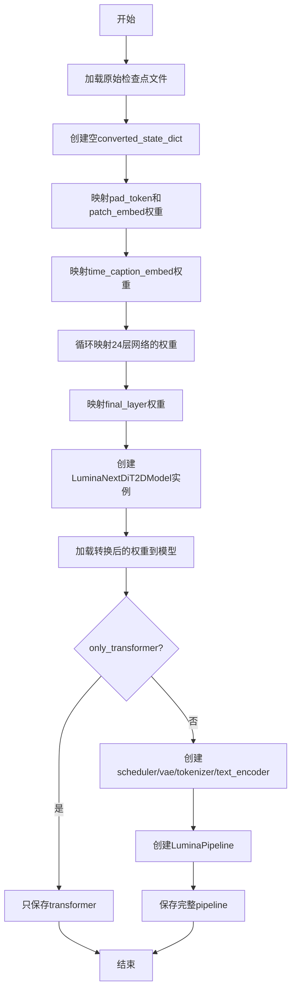

## 类结构

```
Script (顶层脚本)
└── main(args) - 主转换函数
```

## 全局变量及字段


### `all_sd`
    
原始检查点字典，包含从safetensors文件加载的所有权重张量

类型：`Dict[str, torch.Tensor]`
    


### `converted_state_dict`
    
转换后的权重字典，将原始检查点键名映射到LuminaNextDiT2DModel所需的格式

类型：`Dict[str, torch.Tensor]`
    


### `transformer`
    
LuminaNextDiT2DModel实例，核心的DiT变换器模型，用于图像生成

类型：`LuminaNextDiT2DModel`
    


### `scheduler`
    
FlowMatchEulerDiscreteScheduler实例，用于扩散模型的调度采样

类型：`FlowMatchEulerDiscreteScheduler`
    


### `vae`
    
AutoencoderKL实例，SDXL的变分自编码器，用于潜在空间编码和解码

类型：`AutoencoderKL`
    


### `tokenizer`
    
AutoTokenizer实例，用于将文本提示编码为token序列

类型：`AutoTokenizer`
    


### `text_encoder`
    
AutoModel实例（gemma-2b），将token序列编码为文本嵌入向量

类型：`AutoModel`
    


### `pipeline`
    
LuminaPipeline实例，整合tokenizer、text_encoder、transformer、vae和scheduler的完整推理管道

类型：`LuminaPipeline`
    


### `num_model_params`
    
transformer模型的可训练参数总数

类型：`int`
    


    

## 全局函数及方法


### `main(args)`

该函数是权重转换的主入口，负责将 Lumina-Next 原始检查点（来自 Alpha-VLLM/Lumina-Next-SFT 或 Alpha-VLLM/Lumina-Next-T2I）的权重键名映射并转换为 LuminaPipeline 可用的格式，支持仅保存 transformer 或完整 pipeline。

#### 参数

- `args`：`argparse.Namespace`，命令行参数对象
  - `origin_ckpt_path`：`str`，原始检查点文件路径
  - `image_size`：`int`，预训练模型图像尺寸（256/512/1024），当前代码中未使用
  - `dump_path`：`str`，输出 pipeline 的保存路径
  - `only_transformer`：`bool`，是否仅保存 transformer 模型

#### 返回值

`None`，该函数无返回值，仅执行权重转换和模型保存操作

#### 流程图

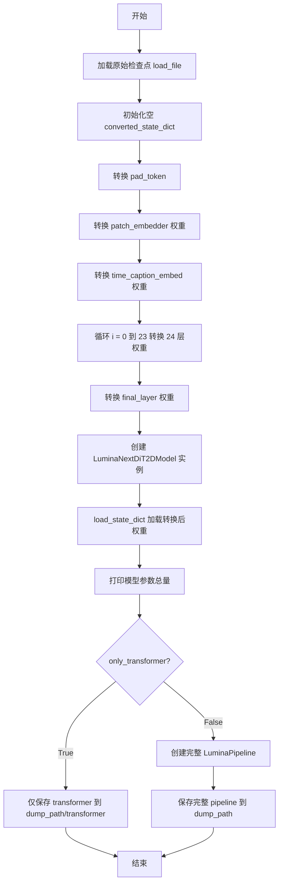

#### 带注释源码

```python
def main(args):
    # 从指定路径加载原始检查点（safetensors 格式），加载到 CPU
    all_sd = load_file(args.origin_ckpt_path, device="cpu")
    # 创建转换后的状态字典，用于存放键名映射后的权重
    converted_state_dict = {}
    
    # ====== 1. 转换 pad token ======
    converted_state_dict["pad_token"] = all_sd["pad_token"]

    # ====== 2. 转换 patch embedder（图像分块嵌入层）======
    # 将原始 x_embedder 映射为 patch_embedder
    converted_state_dict["patch_embedder.weight"] = all_sd["x_embedder.weight"]
    converted_state_dict["patch_embedder.bias"] = all_sd["x_embedder.bias"]

    # ====== 3. 转换 time and caption embed（时间步与文本嵌入）======
    # 时间步嵌入器：两层 MLP (linear_1 -> silu -> linear_2)
    converted_state_dict["time_caption_embed.timestep_embedder.linear_1.weight"] = all_sd["t_embedder.mlp.0.weight"]
    converted_state_dict["time_caption_embed.timestep_embedder.linear_1.bias"] = all_sd["t_embedder.mlp.0.bias"]
    converted_state_dict["time_caption_embed.timestep_embedder.linear_2.weight"] = all_sd["t_embedder.mlp.2.weight"]
    converted_state_dict["time_caption_embed.timestep_embedder.linear_2.bias"] = all_sd["t_embedder.mlp.2.bias"]
    
    # 文本_caption 嵌入器：两层线性层 (Linear + Linear)
    converted_state_dict["time_caption_embed.caption_embedder.0.weight"] = all_sd["cap_embedder.0.weight"]
    converted_state_dict["time_caption_embed.caption_embedder.0.bias"] = all_sd["cap_embedder.0.bias"]
    converted_state_dict["time_caption_embed.caption_embedder.1.weight"] = all_sd["cap_embedder.1.weight"]
    converted_state_dict["time_caption_embed.caption_embedder.1.bias"] = all_sd["cap_embedder.1.bias"]

    # ====== 4. 循环转换 24 层 DiT 模块权重 ======
    for i in range(24):
        # adaln 调制参数：用于 AdaLN 条件注入
        converted_state_dict[f"layers.{i}.gate"] = all_sd[f"layers.{i}.attention.gate"]
        converted_state_dict[f"layers.{i}.adaLN_modulation.1.weight"] = all_sd[f"layers.{i}.adaLN_modulation.1.weight"]
        converted_state_dict[f"layers.{i}.adaLN_modulation.1.bias"] = all_sd[f"layers.{i}.adaLN_modulation.1.bias"]

        # 自注意力 (attn1) 的 QKV 权重：来自 wq/wk/wv
        converted_state_dict[f"layers.{i}.attn1.to_q.weight"] = all_sd[f"layers.{i}.attention.wq.weight"]
        converted_state_dict[f"layers.{i}.attn1.to_k.weight"] = all_sd[f"layers.{i}.attention.wk.weight"]
        converted_state_dict[f"layers.{i}.attn1.to_v.weight"] = all_sd[f"layers.{i}.attention.wv.weight"]

        # 交叉注意力 (attn2) 的 QKV 权重：Q 复用 wq，K/V 来自文本分支 wk_y/wv_y
        converted_state_dict[f"layers.{i}.attn2.to_q.weight"] = all_sd[f"layers.{i}.attention.wq.weight"]
        converted_state_dict[f"layers.{i}.attn2.to_k.weight"] = all_sd[f"layers.{i}.attention.wk_y.weight"]
        converted_state_dict[f"layers.{i}.attn2.to_v.weight"] = all_sd[f"layers.{i}.attention.wv_y.weight"]

        # 注意力输出投影
        converted_state_dict[f"layers.{i}.attn2.to_out.0.weight"] = all_sd[f"layers.{i}.attention.wo.weight"]

        # ====== QK Norm（查询/键归一化）======
        # 自注意力 Q/K 归一化
        converted_state_dict[f"layers.{i}.attn1.norm_q.weight"] = all_sd[f"layers.{i}.attention.q_norm.weight"]
        converted_state_dict[f"layers.{i}.attn1.norm_q.bias"] = all_sd[f"layers.{i}.attention.q_norm.bias"]
        converted_state_dict[f"layers.{i}.attn1.norm_k.weight"] = all_sd[f"layers.{i}.attention.k_norm.weight"]
        converted_state_dict[f"layers.{i}.attn1.norm_k.bias"] = all_sd[f"layers.{i}.attention.k_norm.bias"]

        # 交叉注意力 Q/K 归一化
        converted_state_dict[f"layers.{i}.attn2.norm_q.weight"] = all_sd[f"layers.{i}.attention.q_norm.weight"]
        converted_state_dict[f"layers.{i}.attn2.norm_q.bias"] = all_sd[f"layers.{i}.attention.q_norm.bias"]
        converted_state_dict[f"layers.{i}.attn2.norm_k.weight"] = all_sd[f"layers.{i}.attention.ky_norm.weight"]
        converted_state_dict[f"layers.{i}.attn2.norm_k.bias"] = all_sd[f"layers.{i}.attention.ky_norm.bias"]

        # 注意力前置归一化层
        converted_state_dict[f"layers.{i}.attn_norm1.weight"] = all_sd[f"layers.{i}.attention_norm1.weight"]
        converted_state_dict[f"layers.{i}.attn_norm2.weight"] = all_sd[f"layers.{i}.attention_norm2.weight"]
        converted_state_dict[f"layers.{i}.norm1_context.weight"] = all_sd[f"layers.{i}.attention_y_norm.weight"]

        # ====== 前馈网络 (Feed Forward) ======
        # 三层 MLP：w1 (gate) -> w3 (up) -> w2 (down)
        converted_state_dict[f"layers.{i}.feed_forward.linear_1.weight"] = all_sd[f"layers.{i}.feed_forward.w1.weight"]
        converted_state_dict[f"layers.{i}.feed_forward.linear_2.weight"] = all_sd[f"layers.{i}.feed_forward.w2.weight"]
        converted_state_dict[f"layers.{i}.feed_forward.linear_3.weight"] = all_sd[f"layers.{i}.feed_forward.w3.weight"]

        # 前馈网络归一化层
        converted_state_dict[f"layers.{i}.ffn_norm1.weight"] = all_sd[f"layers.{i}.ffn_norm1.weight"]
        converted_state_dict[f"layers.{i}.ffn_norm2.weight"] = all_sd[f"layers.{i}.ffn_norm2.weight"]

    # ====== 5. 转换最终输出层 (final layer) ======
    converted_state_dict["final_layer.linear.weight"] = all_sd["final_layer.linear.weight"]
    converted_state_dict["final_layer.linear.bias"] = all_sd["final_layer.linear.bias"]
    converted_state_dict["final_layer.adaLN_modulation.1.weight"] = all_sd["final_layer.adaLN_modulation.1.weight"]
    converted_state_dict["final_layer.adaLN_modulation.1.bias"] = all_sd["final_layer.adaLN_modulation.1.bias"]

    # ====== 6. 创建 LuminaNextDiT2DModel 并加载权重 ======
    # 配置参数：24层，隐藏维度2304，32头注意力，8头KV，patch_size=2
    transformer = LuminaNextDiT2DModel(
        sample_size=128,
        patch_size=2,
        in_channels=4,
        hidden_size=2304,
        num_layers=24,
        num_attention_heads=32,
        num_kv_heads=8,
        multiple_of=256,
        ffn_dim_multiplier=None,
        norm_eps=1e-5,
        learn_sigma=True,
        qk_norm=True,
        cross_attention_dim=2048,
        scaling_factor=1.0,
    )
    # 严格模式加载权重（键名必须完全匹配）
    transformer.load_state_dict(converted_state_dict, strict=True)

    # 打印模型参数量统计
    num_model_params = sum(p.numel() for p in transformer.parameters())
    print(f"Total number of transformer parameters: {num_model_params}")

    # ====== 7. 根据需求保存模型 ======
    if args.only_transformer:
        # 仅保存 transformer 部分到子目录
        transformer.save_pretrained(os.path.join(args.dump_path, "transformer"))
    else:
        # 构建完整 pipeline：加载 VAE、tokenizer、text_encoder、scheduler
        scheduler = FlowMatchEulerDiscreteScheduler()
        vae = AutoencoderKL.from_pretrained("stabilityai/sdxl-vae", torch_dtype=torch.float32)
        tokenizer = AutoTokenizer.from_pretrained("google/gemma-2b")
        text_encoder = AutoModel.from_pretrained("google/gemma-2b")

        # 组装完整 LuminaPipeline
        pipeline = LuminaPipeline(
            tokenizer=tokenizer, 
            text_encoder=text_encoder, 
            transformer=transformer, 
            vae=vae, 
            scheduler=scheduler
        )
        # 保存完整 pipeline
        pipeline.save_pretrained(args.dump_path)
```


### `load_file` (safetensors.torch.load_file)

从 safetensors 格式的检查点文件中加载模型权重张量到内存，并返回包含所有参数的状态字典。

参数：

-  `args.origin_ckpt_path`：`str`，待转换的检查点文件路径（来自命令行参数 `--origin_ckpt_path`）
-  `device`： `str`，指定加载设备，此处传入 `"cpu"` 表示将所有张量加载到 CPU 内存

返回值：`Dict[str, Tensor]`，返回一个字典，键为参数名称（如 `x_embedder.weight`、`pad_token` 等），值为对应的 PyTorch 张量对象

#### 流程图

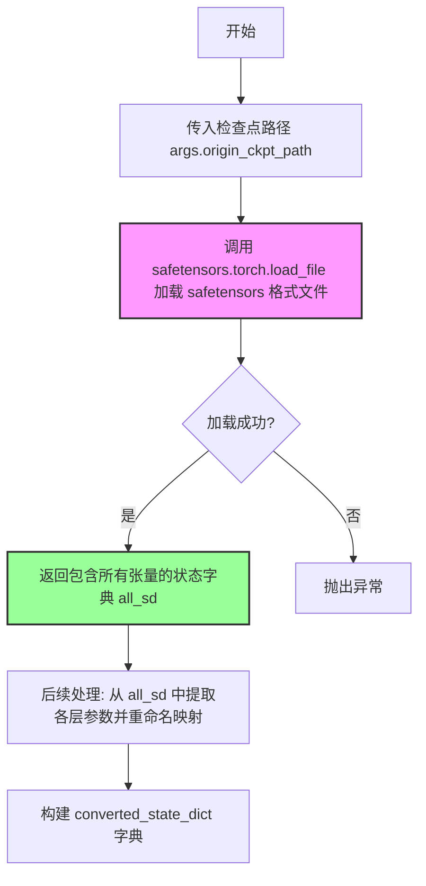

#### 带注释源码

```python
# 使用 safetensors.torch.load_file 加载检查点
# 参数1: args.origin_ckpt_path - 检查点文件路径，类型为 str
# 参数2: device="cpu" - 指定加载设备为 CPU，类型为 str
# 返回值: all_sd - 字典类型，键为参数名称，值为 PyTorch 张量
all_sd = load_file(args.origin_ckpt_path, device="cpu")

# 加载返回的 all_sd 结构示例：
# {
#     "pad_token": <tensor>,
#     "x_embedder.weight": <tensor>,
#     "x_embedder.bias": <tensor>,
#     "t_embedder.mlp.0.weight": <tensor>,
#     "layers.0.attention.gate": <tensor>,
#     ... (共包含原始 Lumina-Next 模型的所有参数)
# }

# 后续代码会将 all_sd 中的原始键名映射到新的目标键名
# 例如: "x_embedder.weight" -> "patch_embedder.weight"
converted_state_dict = {}
converted_state_dict["pad_token"] = all_sd["pad_token"]
converted_state_dict["patch_embedder.weight"] = all_sd["x_embedder.weight"]
# ... 更多映射关系
```


### `LuminaNextDiT2DModel`

该函数是 diffusers 库中的核心类构造函数，用于创建 Lumina-Next  Diffusion Transformer (DiT) 模型。该模型是一个基于 Transformer 架构的扩散模型，用于图像生成任务。函数通过指定模型的各种架构参数（如隐藏层大小、层数、注意力头数等）来实例化一个完整的 DiT 模型对象，随后可加载预训练权重并用于推理或微调。

参数：

- `sample_size`：`int`，输入图像的空间分辨率（高度和宽度），指定模型处理的图像大小
- `patch_size`：`int`，将图像划分为非重叠补丁的块大小，用于 Transformer 的补丁嵌入
- `in_channels`：`int`，输入图像的通道数，对于 RGB 图像通常为 3，对于带 alpha 通道为 4
- `hidden_size`：`int`，隐藏层维度大小，决定模型的宽度和容量
- `num_layers`：`int`，Transformer 层的数量，决定模型的深度
- `num_attention_heads`：`int`，注意力机制中查询头的数量，用于多头注意力计算
- `num_kv_heads`：`int`，键值头的数量，用于优化注意力计算（Grouped Query Attention）
- `multiple_of`：`int`，FFN 层隐藏维度的倍数，用于确保计算效率
- `ffn_dim_multiplier`：`Optional[float]`，FFN 维度的乘数，可为 None 表示使用默认值
- `norm_eps`：`float`，层归一化的 epsilon 值，用于数值稳定性
- `learn_sigma`：`bool`，是否学习扩散过程中的 sigma 参数，指示是否为条件生成
- `qk_norm`：`bool`，是否对查询和键进行归一化，有助于训练稳定性
- `cross_attention_dim`：`int`，交叉注意力的维度，用于文本条件嵌入
- `scaling_factor`：`float`，注意力缩放因子，用于调整注意力分数

返回值：`LuminaNextDiT2DModel`，返回创建的 DiT Transformer 模型实例，包含完整的模型结构和可训练参数

#### 流程图

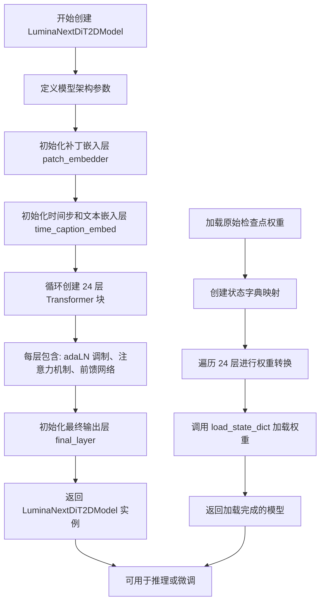

#### 带注释源码

```python
# 创建 LuminaNextDiT2DModel 实例 - 配置 Diffusion Transformer 模型架构
transformer = LuminaNextDiT2DModel(
    sample_size=128,              # 输入图像尺寸为 128x128 像素
    patch_size=2,                 # 每个补丁大小为 2x2 像素
    in_channels=4,                # VAE 潜在空间的通道数 (latent channels)
    hidden_size=2304,             # 隐藏层维度 2304 (模型宽度)
    num_layers=24,                # 24 层 Transformer 块
    num_attention_heads=32,       # 32 个注意力头
    num_kv_heads=8,               # 8 个键值头 (Grouped Query Attention)
    multiple_of=256,              # FFN 维度必须是 256 的倍数
    ffn_dim_multiplier=None,      # FFN 维度乘数使用默认值
    norm_eps=1e-5,                # LayerNorm 的 epsilon 参数
    learn_sigma=True,             # 学习 sigma 参数用于条件生成
    qk_norm=True,                 # 对 Q、K 进行归一化
    cross_attention_dim=2048,     # 文本嵌入的交叉注意力维度
    scaling_factor=1.0,           # 注意力缩放因子
)

# 加载转换后的权重到模型中，strict=True 表示严格匹配键名
transformer.load_state_dict(converted_state_dict, strict=True)

# 计算并打印模型参数总数
num_model_params = sum(p.numel() for p in transformer.parameters())
print(f"Total number of transformer parameters: {num_model_params}")

# 可选：仅保存 transformer 部分或完整 pipeline
if args.only_transformer:
    # 仅保存 transformer 模型
    transformer.save_pretrained(os.path.join(args.dump_path, "transformer"))
else:
    # 构建完整的 LuminaPipeline (tokenizer + text_encoder + transformer + vae + scheduler)
    scheduler = FlowMatchEulerDiscreteScheduler()  # 离散欧拉调度器
    vae = AutoencoderKL.from_pretrained("stabilityai/sdxl-vae", torch_dtype=torch.float32)
    tokenizer = AutoTokenizer.from_pretrained("google/gemma-2b")
    text_encoder = AutoModel.from_pretrained("google/gemma-2b")
    
    # 创建完整的生成 pipeline
    pipeline = LuminaPipeline(
        tokenizer=tokenizer,
        text_encoder=text_encoder,
        transformer=transformer,
        vae=vae,
        scheduler=scheduler
    )
    # 保存完整 pipeline 到指定路径
    pipeline.save_pretrained(args.dump_path)
```


### `transformer.load_state_dict`

将预训练的权重字典加载到 Transformer 模型中，支持权重映射和严格匹配模式。

参数：

- `state_dict`：`Dict[str, torch.Tensor]`，包含模型权重的字典，键为参数名称，值为对应的张量
- `strict`：`bool`，是否严格匹配 state_dict 中的键与模型参数名称，设为 `True` 时要求完全匹配，设为 `False` 时允许部分匹配
- `assign`：`bool`（可选），是否直接将 state_dict 中的张量赋值给模型的参数，而不是复制

返回值：`Optional[MissingKeysError, UnexpectedKeysError]`，在 `strict=False` 时可能返回缺失键或意外键的错误信息，否则返回 `None`

#### 流程图

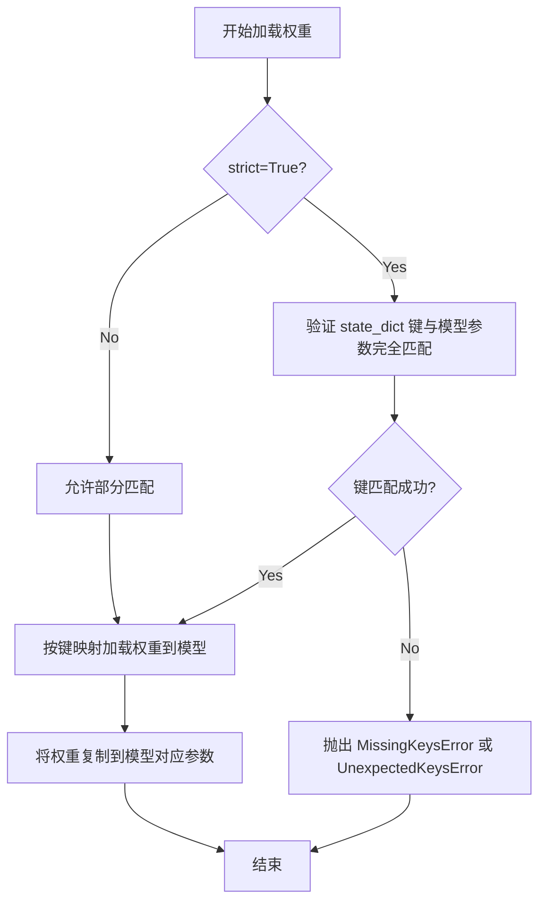

#### 带注释源码

```python
# 在 Lumina-Next-DiT 模型转换脚本中的调用示例
transformer = LuminaNextDiT2DModel(
    sample_size=128,
    patch_size=2,
    in_channels=4,
    hidden_size=2304,
    num_layers=24,
    num_attention_heads=32,
    num_kv_heads=8,
    multiple_of=256,
    ffn_dim_multiplier=None,
    norm_eps=1e-5,
    learn_sigma=True,
    qk_norm=True,
    cross_attention_dim=2048,
    scaling_factor=1.0,
)

# 加载转换后的权重字典到模型
# converted_state_dict: 包含从原始 checkpoint 映射而来的权重
# strict=True: 要求权重键与模型参数名称完全匹配
transformer.load_state_dict(converted_state_dict, strict=True)
```


### `LuminaNextDiT2DModel.save_pretrained`

该方法是 `diffusers` 库中 `ModelMixin` 类提供的实例方法，用于将 Transformer 模型（包括权重、配置等）保存到指定目录，以便后续通过 `from_pretrained` 重新加载。在代码中用于将转换后的 LuminaNextDiT2DModel 模型保存到磁盘。

参数：

- `save_directory`：`str`，要保存模型的目录路径。代码中传入 `os.path.join(args.dump_path, "transformer")`，即在 `dump_path` 下创建名为 "transformer" 的子目录。

返回值：`None`，该方法直接保存模型到磁盘，不返回任何值。

#### 流程图

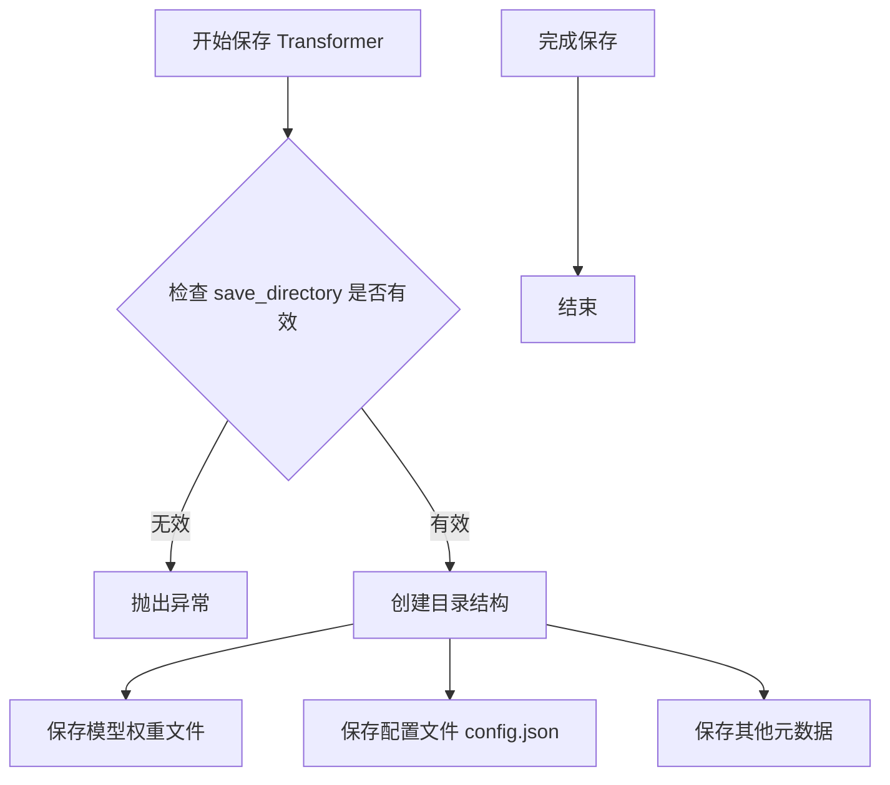

#### 带注释源码

```python
# 判断是否仅保存 transformer
if args.only_transformer:
    # 调用 save_pretrained 方法保存 transformer 模型
    # save_directory 参数为 os.path.join(args.dump_path, "transformer")
    # 即在 dump_path 下创建 'transformer' 目录并保存模型文件
    transformer.save_pretrained(os.path.join(args.dump_path, "transformer"))
else:
    # 如果不是仅保存 transformer，则构建完整 pipeline 并保存整个 pipeline
    # ... (pipeline 构建代码)
    pipeline.save_pretrained(args.dump_path)
```


### `FlowMatchEulerDiscreteScheduler`

创建 Flow Match Euler 离散调度器实例，用于扩散模型的采样过程，通过欧拉方法实现离散的流匹配噪声调度。

参数：

- 该函数调用不传递任何参数，使用类默认配置

返回值：`FlowMatchEulerDiscreteScheduler`，返回 Flow Match Euler 离散调度器实例，用于后续管线创建和图像生成推理

#### 流程图

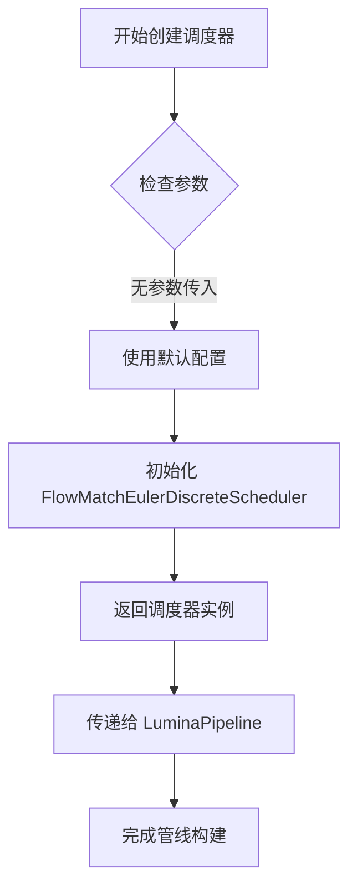

#### 带注释源码

```python
# 在 main 函数中创建 Flow Match Euler 离散调度器
# 用于扩散模型的采样过程，通过欧拉方法实现离散的流匹配
scheduler = FlowMatchEulerDiscreteScheduler()

# 调度器作为参数传递给 LuminaPipeline，用于文本到图像的生成流程
pipeline = LuminaPipeline(
    tokenizer=tokenizer, 
    text_encoder=text_encoder, 
    transformer=transformer, 
    vae=vae, 
    scheduler=scheduler  # 传入调度器实例
)
```


### `AutoencoderKL.from_pretrained()`

该方法是一个类方法，用于从 Hugging Face Hub 或本地路径加载预训练的 AutoencoderKL（变分自编码器）模型。该方法会自动下载模型权重、配置文件和其他必要文件，并将其加载到指定的内存数据类型中。在给定代码中用于加载 SDXL VAE 模型，以便在 LuminaPipeline 中进行图像的编码和解码操作。

参数：

- `pretrained_model_name_or_path`：`str`，模型在 Hugging Face Hub 上的标识符或本地路径。在代码中传入 `"stabilityai/sdxl-vae"` 表示从 stabilityai 组织加载 SDXL VAE 模型。
- `torch_dtype`：`torch.dtype`，可选参数，指定模型权重的张量数据类型。在代码中指定为 `torch.float32` 以确保使用单精度浮点数加载模型。

返回值：`AutoencoderKL`，返回加载完成的变分自编码器模型实例，可用于图像的潜在空间编码和解码。

#### 流程图

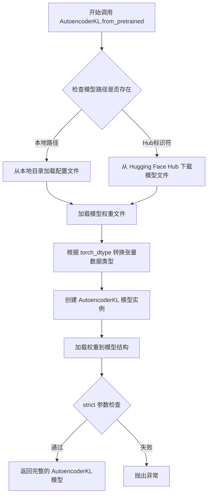

#### 带注释源码

```python
# 在 diffusers 库中调用 AutoencoderKL.from_pretrained 方法
# 该方法继承自 PreTrainedModel 基类，提供了模型加载的完整功能

vae = AutoencoderKL.from_pretrained(
    "stabilityai/sdxl-vae",  # pretrained_model_name_or_path: 模型标识符
    # 指向 Hugging Face Hub 上的 stabilityai/sdxl-vae 仓库
    # 包含 VAE 的 config.json 和扩散模型权重文件
    
    torch_dtype=torch.float32  # torch_dtype: 指定模型参数的数值精度
    # torch.float32 表示 32 位单精度浮点数
    # 其他可选值: torch.float16, torch.bfloat16, torch.float8_e4m3fn 等
    # 根据硬件支持和性能需求选择合适的精度
)

# 返回的 vae 对象是一个完整的 AutoencoderKL 模型实例
# 包含编码器 (encoder) 和解码器 (decoder) 两个主要组件
# 可用于:
#   - encode(): 将图像转换为潜在空间表示
#   - decode(): 将潜在向量重建为图像
# 在 LuminaPipeline 中用于图像生成流程的潜在空间处理
```


### `AutoTokenizer.from_pretrained`

加载预训练的tokenizer，用于将文本转换为模型可处理的token序列。该方法是Hugging Face Transformers库的核心功能之一，支持从Hugging Face Hub或本地目录加载tokenizer。

参数：

- `pretrained_model_name_or_path`：`str`，预训练模型名称或本地路径。在代码中传入的是 `"google/gemma-2b"`，表示从Hugging Face Hub加载Gemma-2b模型的tokenizer。
- `*args`：可变位置参数，可选的额外位置参数。
- `**kwargs`：可变关键字参数，可选的额外关键字参数，如 `cache_dir`、`force_download`、`resume_download` 等。

返回值：`PreTrainedTokenizer`（具体类型如 `GemmaTokenizer`），返回加载后的tokenizer实例，可用于对文本进行编码和解码。

#### 流程图

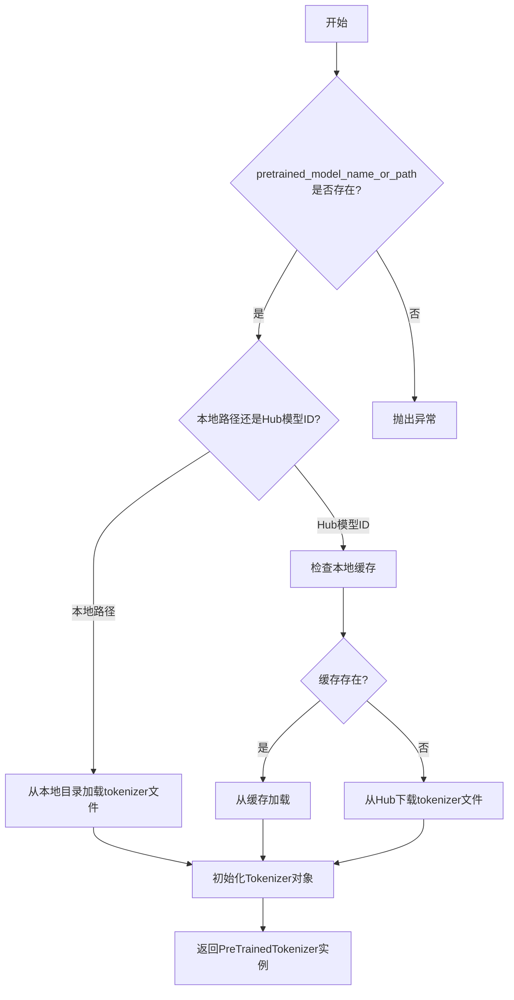

#### 带注释源码

```python
# 从Hugging Face Transformers库导入AutoTokenizer类
from transformers import AutoTokenizer

# 调用AutoTokenizer的类方法from_pretrained
# 该方法负责加载预训练的tokenizer
tokenizer = AutoTokenizer.from_pretrained("google/gemma-2b")

# 参数说明：
# - "google/gemma-2b": 预训练模型的名称
#   这是一个Hugging Face Hub上的模型ID
#   包含预训练的tokenizer配置文件和词汇表
#
# 返回值：
# - tokenizer: PreTrainedTokenizer类型的实例
#   可以使用 tokenizer.encode() 将文本转为token IDs
#   可以使用 tokenizer.decode() 将token IDs转为文本
#
# 内部流程：
# 1. 检查模型名称是否存在于Hub或本地
# 2. 下载或读取tokenizer配置文件(vocab.json, tokenizer.json等)
# 3. 加载词汇表和 tokenizer 配置
# 4. 创建并返回相应的 tokenizer 实例 (GemmaTokenizer)
```

#### 关键信息补充

| 项目 | 说明 |
|------|------|
| **来源** | `transformers` 库 (Hugging Face) |
| **类** | `AutoTokenizer` |
| **方法类型** | 类方法 (@classmethod) |
| **调用场景** | 在代码中用于加载Gemma-2b模型的tokenizer，为后续文本编码做准备 |
| **配置依赖** | 需要 `tokenizer_config.json`, `vocab.json` 或 `tokenizer.json` 等文件 |


### `AutoModel.from_pretrained`

该函数用于从预训练模型加载 text encoder（文本编码器），在代码中加载的是 "google/gemma-2b" 模型，作为 LuminaPipeline 的文本编码组件使用。

参数：

- `pretrained_model_name_or_path`：`str`，预训练模型的名称或路径，在代码中为 `"google/gemma-2b"`
- `*args`：可变位置参数，传递给 transformers 库的其他参数
- `**kwargs`：关键字参数，如 `torch_dtype` 等

返回值：`AutoModel`，返回预训练的模型对象（text_encoder）

#### 流程图

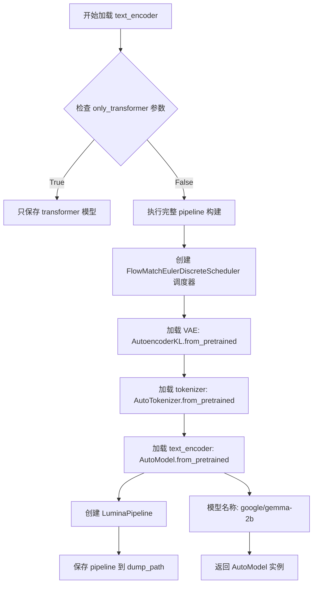

#### 带注释源码

```python
# 加载 text encoder (文本编码器)
# 使用 transformers 库的 AutoModel.from_pretrained 方法
# 从预训练模型 "google/gemma-2b" 加载模型权重
# 该模型将作为 LuminaPipeline 的 text_encoder 组件
text_encoder = AutoModel.from_pretrained("google/gemma-2b")

# 相关上下文代码:
# 1. 加载 VAE (变分自编码器)
vae = AutoencoderKL.from_pretrained("stabilityai/sdxl-vae", torch_dtype=torch.float32)

# 2. 加载 tokenizer (分词器)
tokenizer = AutoTokenizer.from_pretrained("google/gemma-2b")

# 3. 构建完整的 LuminaPipeline
pipeline = LuminaPipeline(
    tokenizer=tokenizer,           # 分词器
    text_encoder=text_encoder,    # 文本编码器 (当前方法加载的对象)
    transformer=transformer,       # DiT Transformer 模型
    vae=vae,                       # VAE 模型
    scheduler=scheduler            # 调度器
)

# 4. 保存整个 pipeline 到指定路径
pipeline.save_pretrained(args.dump_path)
```


### `main` 函数中创建 `LuminaPipeline` 的完整流程

本代码段的核心功能是将 Lumina-Next 模型的检查点转换为 Diffusers 格式的 Pipeline，并可选地保存完整的 text-to-image 生成Pipeline。

参数：

- `tokenizer`：分词器（`AutoTokenizer`），用于将文本输入转换为token序列
- `text_encoder`：文本编码器（`AutoModel`），将token序列编码为文本embedding
- `transformer`：`LuminaNextDiT2DModel`，Diffusion变换器模型，处理潜在空间的去噪过程
- `vae`：`AutoencoderKL`，变分自编码器，用于图像的编码和解码
- `scheduler`：`FlowMatchEulerDiscreteScheduler`，离散欧拉调度器，控制Diffusion采样过程

返回值：`LuminaPipeline` 对象，完整的text-to-image生成管道，可用于根据文本提示生成图像

#### 流程图

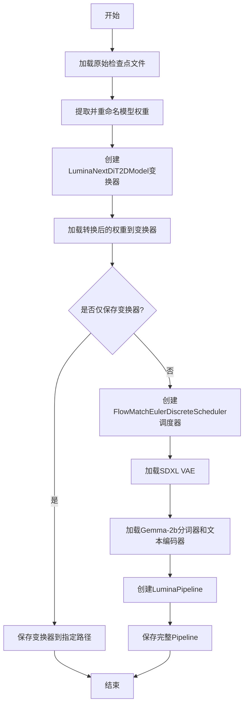

#### 带注释源码

```python
def main(args):
    """
    主函数：将Lumina-Next检查点转换为Diffusers格式的Pipeline
    
    参数:
        args: 命令行参数对象，包含以下属性:
            - origin_ckpt_path: 原始检查点路径
            - dump_path: 输出路径
            - only_transformer: 是否仅保存变换器
    """
    # 1. 从safetensors格式加载原始检查点（CPU内存）
    all_sd = load_file(args.origin_ckpt_path, device="cpu")
    
    # 2. 初始化转换后的状态字典
    converted_state_dict = {}
    
    # 3. 复制pad_token
    converted_state_dict["pad_token"] = all_sd["pad_token"]

    # 4. 转换patch embed层权重（x_embedder -> patch_embedder）
    converted_state_dict["patch_embedder.weight"] = all_sd["x_embedder.weight"]
    converted_state_dict["patch_embedder.bias"] = all_sd["x_embedder.bias"]

    # 5. 转换time embedding和caption embedding层
    # 时间嵌入器的MLP层 (t_embedder.mlp.0 -> timestep_embedder.linear_1)
    converted_state_dict["time_caption_embed.timestep_embedder.linear_1.weight"] = all_sd["t_embedder.mlp.0.weight"]
    converted_state_dict["time_caption_embed.timestep_embedder.linear_1.bias"] = all_sd["t_embedder.mlp.0.bias"]
    # 时间嵌入器的MLP层 (t_embedder.mlp.2 -> timestep_embedder.linear_2)
    converted_state_dict["time_caption_embed.timestep_embedder.linear_2.weight"] = all_sd["t_embedder.mlp.2.weight"]
    converted_state_dict["time_caption_embed.timestep_embedder.linear_2.bias"] = all_sd["t_embedder.mlp.2.bias"]
    # Caption嵌入器 (cap_embedder -> caption_embedder)
    converted_state_dict["time_caption_embed.caption_embedder.0.weight"] = all_sd["cap_embedder.0.weight"]
    converted_state_dict["time_caption_embed.caption_embedder.0.bias"] = all_sd["cap_embedder.0.bias"]
    converted_state_dict["time_caption_embed.caption_embedder.1.weight"] = all_sd["cap_embedder.1.weight"]
    converted_state_dict["time_caption_embed.caption_embedder.1.bias"] = all_sd["cap_embedder.1.bias"]

    # 6. 遍历24层变换器块，进行权重重命名映射
    for i in range(24):
        # 6.1 AdaLN调制参数 (gate + modulation layers)
        converted_state_dict[f"layers.{i}.gate"] = all_sd[f"layers.{i}.attention.gate"]
        converted_state_dict[f"layers.{i}.adaLN_modulation.1.weight"] = all_sd[f"layers.{i}.adaLN_modulation.1.weight"]
        converted_state_dict[f"layers.{i}.adaLN_modulation.1.bias"] = all_sd[f"layers.{i}.adaLN_modulation.1.bias"]

        # 6.2 自注意力QKV权重 (self-attention)
        converted_state_dict[f"layers.{i}.attn1.to_q.weight"] = all_sd[f"layers.{i}.attention.wq.weight"]
        converted_state_dict[f"layers.{i}.attn1.to_k.weight"] = all_sd[f"layers.{i}.attention.wk.weight"]
        converted_state_dict[f"layers.{i}.attn1.to_v.weight"] = all_sd[f"layers.{i}.attention.wv.weight"]

        # 6.3 交叉注意力QKV权重 (caption/conditioning attention)
        converted_state_dict[f"layers.{i}.attn2.to_q.weight"] = all_sd[f"layers.{i}.attention.wq.weight"]
        converted_state_dict[f"layers.{i}.attn2.to_k.weight"] = all_sd[f"layers.{i}.attention.wk_y.weight"]
        converted_state_dict[f"layers.{i}.attn2.to_v.weight"] = all_sd[f"layers.{i}.attention.wv_y.weight"]

        # 6.4 注意力输出层
        converted_state_dict[f"layers.{i}.attn2.to_out.0.weight"] = all_sd[f"layers.{i}.attention.wo.weight"]

        # 6.5 QK归一化层
        converted_state_dict[f"layers.{i}.attn1.norm_q.weight"] = all_sd[f"layers.{i}.attention.q_norm.weight"]
        converted_state_dict[f"layers.{i}.attn1.norm_q.bias"] = all_sd[f"layers.{i}.attention.q_norm.bias"]
        converted_state_dict[f"layers.{i}.attn1.norm_k.weight"] = all_sd[f"layers.{i}.attention.k_norm.weight"]
        converted_state_dict[f"layers.{i}.attn1.norm_k.bias"] = all_sd[f"layers.{i}.attention.k_norm.bias"]
        converted_state_dict[f"layers.{i}.attn2.norm_q.weight"] = all_sd[f"layers.{i}.attention.q_norm.weight"]
        converted_state_dict[f"layers.{i}.attn2.norm_q.bias"] = all_sd[f"layers.{i}.attention.q_norm.bias"]
        converted_state_dict[f"layers.{i}.attn2.norm_k.weight"] = all_sd[f"layers.{i}.attention.ky_norm.weight"]
        converted_state_dict[f"layers.{i}.attn2.norm_k.bias"] = all_sd[f"layers.{i}.attention.ky_norm.bias"]

        # 6.6 注意力归一化层
        converted_state_dict[f"layers.{i}.attn_norm1.weight"] = all_sd[f"layers.{i}.attention_norm1.weight"]
        converted_state_dict[f"layers.{i}.attn_norm2.weight"] = all_sd[f"layers.{i}.attention_norm2.weight"]
        converted_state_dict[f"layers.{i}.norm1_context.weight"] = all_sd[f"layers.{i}.attention_y_norm.weight"]

        # 6.7 前馈神经网络层 (feed-forward network)
        converted_state_dict[f"layers.{i}.feed_forward.linear_1.weight"] = all_sd[f"layers.{i}.feed_forward.w1.weight"]
        converted_state_dict[f"layers.{i}.feed_forward.linear_2.weight"] = all_sd[f"layers.{i}.feed_forward.w2.weight"]
        converted_state_dict[f"layers.{i}.feed_forward.linear_3.weight"] = all_sd[f"layers.{i}.feed_forward.w3.weight"]

        # 6.8 FFN归一化层
        converted_state_dict[f"layers.{i}.ffn_norm1.weight"] = all_sd[f"layers.{i}.ffn_norm1.weight"]
        converted_state_dict[f"layers.{i}.ffn_norm2.weight"] = all_sd[f"layers.{i}.ffn_norm2.weight"]

    # 7. 转换最终输出层
    converted_state_dict["final_layer.linear.weight"] = all_sd["final_layer.linear.weight"]
    converted_state_dict["final_layer.linear.bias"] = all_sd["final_layer.linear.bias"]
    converted_state_dict["final_layer.adaLN_modulation.1.weight"] = all_sd["final_layer.adaLN_modulation.1.weight"]
    converted_state_dict["final_layer.adaLN_modulation.1.bias"] = all_sd["final_layer.adaLN_modulation.1.bias"]

    # 8. 创建LuminaNextDiT2DModel变换器（2B参数配置）
    transformer = LuminaNextDiT2DModel(
        sample_size=128,          # 输入样本尺寸
        patch_size=2,             # 图像分块大小
        in_channels=4,            # VAE潜在空间通道数
        hidden_size=2304,         # 隐藏层维度
        num_layers=24,            # 变换器层数
        num_attention_heads=32,   # 注意力头数
        num_kv_heads=8,           # KV头数（组查询注意力）
        multiple_of=256,         # FFN维度倍数
        ffn_dim_multiplier=None,  # FFN维度乘数
        norm_eps=1e-5,            # LayerNorm epsilon
        learn_sigma=True,         # 学习sigma参数（用于学习噪声）
        qk_norm=True,             # QK归一化
        cross_attention_dim=2048, # 交叉注意力维度
        scaling_factor=1.0,       # 缩放因子
    )
    
    # 9. 加载转换后的权重到变换器模型
    transformer.load_state_dict(converted_state_dict, strict=True)

    # 10. 打印模型参数量
    num_model_params = sum(p.numel() for p in transformer.parameters())
    print(f"Total number of transformer parameters: {num_model_params}")

    # 11. 根据参数决定保存内容
    if args.only_transformer:
        # 仅保存变换器模型
        transformer.save_pretrained(os.path.join(args.dump_path, "transformer"))
    else:
        # === 创建完整的LuminaPipeline ===
        
        # 11.1 创建FlowMatch欧拉离散调度器
        scheduler = FlowMatchEulerDiscreteScheduler()

        # 11.2 加载预训练的SDXL VAE
        vae = AutoencoderKL.from_pretrained("stabilityai/sdxl-vae", torch_dtype=torch.float32)

        # 11.3 加载Gemma-2b作为文本编码器
        tokenizer = AutoTokenizer.from_pretrained("google/gemma-2b")
        text_encoder = AutoModel.from_pretrained("google/gemma-2b")

        # 11.4 创建完整的LuminaPipeline
        # 这是核心：将所有组件组合成完整的text-to-image pipeline
        pipeline = LuminaPipeline(
            tokenizer=tokenizer,           # 分词器
            text_encoder=text_encoder,     # 文本编码器
            transformer=transformer,      # DiT变换器
            vae=vae,                       # VAE解码器
            scheduler=scheduler            # 采样调度器
        )
        
        # 11.5 保存完整pipeline到指定路径
        pipeline.save_pretrained(args.dump_path)
```


### `LuminaPipeline.save_pretrained`

保存 LuminaPipeline 实例中的所有组件（tokenizer、text_encoder、transformer、vae、scheduler）到指定目录，以便后续加载使用。

参数：

- `save_directory`：`str`，指定保存模型和 tokenizer 的目标目录路径。
- `safe_serialization`：`bool`，可选，默认为 `True`，是否使用安全序列化（safetensors 格式）保存模型权重。
- `variant`：`str`，可选，指定要保存的模型变体（如 "fp16"、"bf16" 等）。
- `push_to_hub`：`bool`，可选，默认为 `False`，是否将模型推送到 Hugging Face Hub。
- `kwargs`：其他可选参数，如 `commit_message`、`private_repo` 等。

返回值：`None`，该方法无返回值，直接将模型组件写入磁盘。

#### 流程图

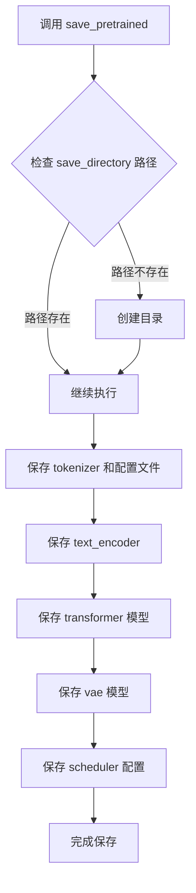

#### 带注释源码

```python
# 定义 pipeline
pipeline = LuminaPipeline(
    tokenizer=tokenizer,               # 文本分词器
    text_encoder=text_encoder,         # 文本编码器模型
    transformer=transformer,          # DiT transformer 模型
    vae=vae,                           # VAE 变分自编码器
    scheduler=scheduler                # 调度器
)

# 保存整个 pipeline 到指定路径
# 这会保存以下内容：
# 1. tokenizer 的词表和配置文件 (tokenizer.json, tokenizer_config.json)
# 2. text_encoder 模型权重和配置
# 3. transformer (DiT) 模型权重和配置
# 4. vae 模型权重和配置
# 5. scheduler 调度器配置
# 6. pipeline 主配置文件 (pipeline_config.json)
pipeline.save_pretrained(args.dump_path)
```

## 关键组件


### 张量索引与键名映射

代码通过字符串键名直接从 `all_sd` 字典中提取原始模型的权重，并按照目标格式重命名键名，映射关系包含 patch_embedder、time_caption_embed、24层 Transformer 结构（adaln、qkv、attention、feed_forward 等）、final_layer 等完整权重转换。

### 循环处理 24 层结构

使用 `for i in range(24)` 循环遍历模型的所有 24 层，为每一层构建完整的权重映射，涵盖 attn1（自注意力）、attn2（交叉注意力）、feed_forward、norm 等子组件的权重转换。

### 调度器配置

使用 `FlowMatchEulerDiscreteScheduler` 作为扩散模型的调度器，实现离散时间步的欧拉积分采样。

### VAE 变分自编码器

通过 `AutoencoderKL.from_pretrained("stabilityai/sdxl-vae")` 加载预训练的 SDXL VAE 模型，用于图像的编码和解码。

### 文本编码器与分词器

使用 Google 的 Gemma-2b 作为文本编码器 (`AutoModel.from_pretrained`) 和分词器 (`AutoTokenizer.from_pretrained`)，将文本提示转换为嵌入向量。

### LuminaPipeline 管道整合

将 tokenizer、text_encoder、transformer、vae、scheduler 组装为完整的 `LuminaPipeline` 推理管道，支持文本到图像生成。

### 命令行参数解析

通过 `argparse` 定义 `--origin_ckpt_path`（原始检查点路径）、`--dump_path`（输出路径）、`--only_transformer`（仅导出 transformer）等参数。

### 严格模式权重加载

使用 `transformer.load_state_dict(converted_state_dict, strict=True)` 进行严格匹配的状态字典加载，确保所有键名完全对应。


## 问题及建议


### 已知问题

- **硬编码的模型架构参数**：`LuminaNextDiT2DModel` 的所有参数（`sample_size`、`patch_size`、`hidden_size`、`num_layers`、`num_attention_heads`、`num_kv_heads` 等）都是硬编码在代码中，无法适配不同版本的模型，应从原始检查点动态读取或通过命令行参数传入。
- **硬编码的预训练模型路径**：`vae`、`tokenizer`、`text_encoder` 的模型路径硬编码为 `"stabilityai/sdxl-vae"` 和 `"google/gemma-2b"`，缺乏灵活性，应作为命令行参数允许用户自定义。
- **未使用的命令行参数**：`--image_size` 参数定义了 choices 但在代码中从未使用，造成混淆。
- **参数定义冲突**：`--only_transformer` 同时设置了 `default=True` 和 `required=True`，这在逻辑上是矛盾的（required 表示必须提供，default 表示有默认值）。
- **缺少必要的错误处理**：未检查 `args.origin_ckpt_path` 文件是否存在、未验证 `all_sd` 字典中是否包含必需的键（如 `pad_token`）、未处理可能的键不匹配情况。
- **设备加载策略不合理**：使用 `device="cpu"` 加载检查点，对于大型模型可能导致内存问题，应支持通过参数指定设备或使用内存映射。
- **权重映射可能存在错误**：`attn2.to_q.weight` 使用了与 `attn1.to_q.weight` 相同的源权重 `wq.weight`，这在 DiT 架构中可能是错误的（通常应该有自己的权重），需确认架构设计是否正确。
- **重复代码模式**：循环中存在大量重复的字典键赋值语句，可通过提取映射关系表或使用循环遍历来简化。
- **缺乏类型注解**：函数参数和返回值缺少类型注解，降低了代码的可读性和可维护性。
- **魔法数字和字符串**：层数 24、hidden_size 2304 等数值以及大量权重键名字符串散布在代码中，应提取为常量或配置文件。

### 优化建议

- 将模型架构参数提取为配置文件或从原始检查点中动态推断（如从权重形状推断 `hidden_size`、`num_layers` 等）。
- 为 `vae`、`tokenizer`、`text_encoder` 添加命令行参数 `--vae_path`、`--tokenizer_path`、`--text_encoder_path`，允许用户指定自定义路径。
- 移除未使用的 `--image_size` 参数或将其与模型重建逻辑关联。
- 修正 `--only_transformer` 的参数定义，移除 `required=True`（因为已有默认值）。
- 添加参数验证和异常处理：检查文件是否存在、验证检查点键的完整性、使用 try-except 包裹可能失败的操作。
- 支持通过 `--device` 参数指定加载设备，并添加内存高效的加载选项。
- 使用数据结构（如字典列表）存储权重映射关系，减少循环中的重复代码。
- 添加完整的类型注解，提升代码清晰度。
- 提取魔法数字为模块级常量，并考虑将权重键映射表外置为配置。
- 添加日志记录（使用 `logging` 模块）替代 `print`，提供更详细的转换进度和状态信息。

## 其它


### 设计目标与约束

本工具旨在将Alpha-VLLM/Lumina-Next系列模型（支持SFT和T2I变体）的原始检查点转换为HuggingFace diffusers格式的LuminaPipeline。核心约束包括：1) 目标模型固定为24层Transformer架构，hidden_size=2304，num_attention_heads=32，num_kv_heads=8；2) 仅支持SDXL VAE（stabilityai/sdxl-vae）和Gemma-2B文本编码器（google/gemma-2b）；3) 图像尺寸仅支持256/512/1024三种分辨率；4) 参数严格匹配，使用strict=True进行状态字典加载，任何不匹配都会触发错误。

### 错误处理与异常设计

当前代码缺乏显式的错误处理机制，存在以下风险点：1) 文件路径不存在时load_file会抛出异常；2) 检查点键名不匹配时load_state_dict会因strict=True而失败；3) 磁盘空间不足时save_pretrained可能失败；4) 网络连接问题时from_pretrained可能超时。建议增加：try-except捕获FileNotFoundError、KeyError、RuntimeError等异常；参数合法性校验（如检查origin_ckpt_path是否存在）；对load_state_dict的strict参数提供可选关闭选项以支持向前兼容性；添加日志记录而非仅使用print。

### 数据流与状态机

数据流分为三个主要阶段：加载阶段调用load_file从safetensors文件读取原始权重到CPU内存；转换阶段通过键名映射将原始模型权重转换为diffusers格式的state dict，涉及24层循环处理和约80个键的映射；保存阶段根据only_transformer标志决定输出完整pipeline或仅保存transformer权重。状态转换逻辑简单线性，无分支状态机。

### 外部依赖与接口契约

核心依赖包括：torch（张量计算）、safetensors.torch（安全张量加载）、transformers（预训练模型和分词器加载）、diffusers（ diffusion pipeline组件）。外部模型依赖：stabilityai/sdxl-vae（图像编码器/解码器）、google/gemma-2b（文本编码器）。接口契约：通过命令行参数传递origin_ckpt_path（输入检查点路径）、dump_path（输出目录）、only_transformer（仅保存transformer标志），返回值仅通过打印输出和文件保存，无函数返回值。

### 性能考量与资源消耗

内存峰值出现在两个时刻：加载原始检查点时（约数GB取决于模型大小）和构建转换后的state dict时（需要存储两份权重数据）。时间消耗主要在循环处理24层的80个键映射（约1920次键赋值操作）和模型保存阶段。对于2B参数模型，转换过程预计需要10-20分钟（CPU模式）。建议优化方向：使用torch.no_grad()减少梯度内存占用；分批处理键映射；考虑使用mmap加载大文件。

### 兼容性分析

该转换器针对特定版本的Lumina-Next模型设计，不兼容其他DiT架构。键名映射硬编码了原始模型的结构，一旦原始模型架构更新（如增加层数或修改注意力机制），转换器需要相应更新。当前仅支持fp32精度（torch.float32），不支持fp16/bf16的量化模型。Cross-attention dimension固定为2048，与Gemma-2b的隐藏层维度匹配。

### 配置参数说明

主要配置参数分为三类：模型架构参数（在代码中硬编码，包括sample_size=128、patch_size=2、in_channels=4、hidden_size=2304、num_layers=24等）；转换控制参数（通过命令行传入，包括origin_ckpt_path、dump_path、only_transformer）；可选参数（image_size虽然定义但实际未使用）。所有架构参数与Lumina-Next-SFT 2B模型规格严格对应。


    