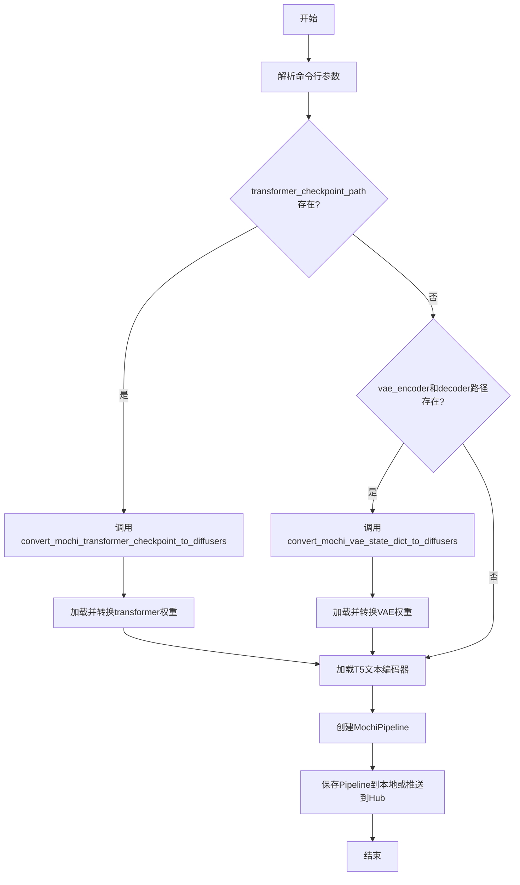
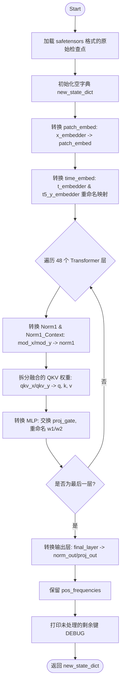
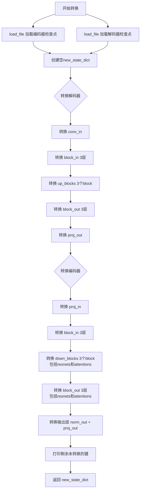
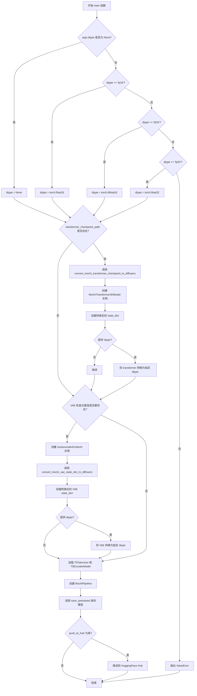

# `diffusers\scripts\convert_mochi_to_diffusers.py` 详细设计文档

该脚本用于将Mochi模型的预训练检查点（Transformer和VAE）转换为Diffusers库兼容的格式，支持从原始Mochi权重到Diffusers框架所需的状态字典映射，并可选择将转换后的模型推送到Hugging Face Hub。

## 整体流程



## 类结构

```
该脚本为无类定义的模块化脚本
主要包含全局函数和辅助函数
依赖库: torch, safetensors, transformers, diffusers, accelerate
```

## 全局变量及字段


### `CTX`
    
条件上下文管理器，当accelerate可用时使用init_empty_weights，否则使用nullcontext

类型：`contextmanager`
    


### `TOKENIZER_MAX_LENGTH`
    
分词器最大长度

类型：`int`
    


### `args`
    
解析后的命令行参数对象

类型：`Namespace`
    


    

## 全局函数及方法


### `swap_scale_shift`

该函数用于交换权重张量的 scale 和 shift 维度顺序，解决 Mochi 原始权重与 Diffusers 的 `AdaLayerNormContinuous` 实现之间的维度顺序不匹配问题（Mochi 为 [shift, scale]，Diffusers 为 [scale, shift]）。

参数：

- `weight`：`torch.Tensor`，原始权重张量，通常包含按顺序连接的 shift 和 scale 参数
- `dim`：`int`，沿着该维度进行分割操作

返回值：`torch.Tensor`，重新排列后的权重张量，顺序从 [shift, scale] 变为 [scale, shift]

#### 流程图

```mermaid
graph TD
    A[开始 swap_scale_shift] --> B[接收 weight, dim 参数]
    B --> C[weight.chunk2, dim=dim 分割成 shift, scale 两部分]
    C --> D[torch.cat[scale, shift], dim=0 重新组合]
    D --> E[返回 new_weight]
    E --> F[结束]
```

#### 带注释源码

```python
# This is specific to `AdaLayerNormContinuous`:
# Diffusers implementation split the linear projection into the scale, shift while Mochi split it into shift, scale
def swap_scale_shift(weight, dim):
    """
    交换权重张量的 scale 和 shift 维度顺序
    
    参数:
        weight: 原始权重张量，包含 shift 和 scale 参数
        dim: 分割维度
    
    返回:
        重新排列后的权重张量，顺序从 [shift, scale] 变为 [scale, shift]
    """
    # 将权重沿指定维度分成两半：前半部分为 shift，后半部分为 scale
    shift, scale = weight.chunk(2, dim=0)
    # 调换顺序：现在变成 [scale, shift]
    new_weight = torch.cat([scale, shift], dim=0)
    return new_weight
```


### `swap_proj_gate(weight)`

该函数用于交换MoE（Mixture of Experts）MLP权重张量中的投影（proj）和门控（gate）部分顺序，以适配Diffusers框架对MoChi模型权重的格式要求。由于Mochi原始权重采用`[proj, gate]`的顺序排列，而Diffusers期望`[gate, proj]`顺序，因此该函数通过chunk分割和cat拼接实现权重顺序的交换。

参数：

- `weight`：`torch.Tensor`，原始Mochi模型的MLP权重张量，通常为2D张量（[2*hidden_dim, hidden_dim]），包含投影和门控权重沿dim=0拼接

返回值：`torch.Tensor`，交换后的权重张量，顺序从`[proj, gate]`变为`[gate, proj]`

#### 流程图

```mermaid
flowchart TD
    A[输入: weight张量] --> B[chunk操作: 按dim=0分成2份]
    B --> C[解包: proj, gate = chunk结果]
    C --> D[cat操作: [gate, proj]沿dim=0拼接]
    D --> E[返回: 交换顺序后的新张量]
    
    B -->|权重形状| F[必须能被2整除]
    E -->|用于适配| G[Diffusers MoE MLP结构]
```

#### 带注释源码

```python
def swap_proj_gate(weight):
    """
    交换投影和门控权重，用于适配MoE MLP结构。
    
    MoChi模型原始权重顺序: [proj, gate] (投影在前，门控在后)
    Diffusers期望权重顺序: [gate, proj] (门控在前，投影在后)
    该函数通过chunk分割和cat拼接实现顺序交换。
    
    参数:
        weight: torch.Tensor，原始Mochi模型MLP权重，形状通常为 [2*hidden_dim, hidden_dim]
    
    返回:
        torch.Tensor，交换顺序后的权重，形状不变
    """
    # 将权重沿dim=0分成两部分：前一半为proj，后一半为gate
    proj, gate = weight.chunk(2, dim=0)
    
    # 按[gate, proj]顺序重新拼接，实现权重顺序交换
    new_weight = torch.cat([gate, proj], dim=0)
    
    return new_weight
```

#### 关键组件信息

| 名称 | 描述 |
|------|------|
| `weight.chunk(2, dim=0)` | PyTorch张量分割操作，将张量沿行维度均匀分成n份 |
| `torch.cat([gate, proj], dim=0)` | PyTorch张量拼接操作，沿行维度合并多个张量 |
| MoE MLP | Mixture of Experts混合专家模块，包含门控网络和多个专家网络 |

#### 潜在技术债务与优化空间

1. **缺乏输入验证**：未检查weight是否可被2整除、是否为None或空张量，可能在异常输入时产生难以追踪的错误
2. **硬编码的chunk数量**：直接使用`2`作为分割数量，缺乏灵活性，若权重结构变化需手动修改
3. **文档注释缺失完整上下文**：未说明该函数是针对特定模型（Mochi→Diffusers）转换的临时解决方案
4. **未使用类型注解**：Python 3.5+支持类型注解，可添加`-> torch.Tensor`等提升代码可维护性

#### 其它项目

**设计目标与约束**：
- 目标：实现Mochi模型权重格式到Diffusers框架的兼容转换
- 约束：权重形状必须沿dim=0可均匀分割为两部分

**错误处理与异常设计**：
- 当前实现无显式错误处理，若weight维度不符合预期，PyTorch的chunk操作会抛出`RuntimeError`
- 建议添加：权重形状验证、维度检查、类型检查

**数据流与状态机**：
- 该函数为纯函数，无状态依赖，输入张量形状不变，仅元素顺序改变
- 数据流：原始state_dict → swap_proj_gate() → 转换后state_dict → Diffusers模型加载

**外部依赖与接口契约**：
- 依赖：`torch`（PyTorch张量操作）
- 上游调用：`convert_mochi_transformer_checkpoint_to_diffusers()`中用于转换MLP的w1权重
- 下游消费者：Diffusers的`MochiTransformer3DModel.load_state_dict()`


### `convert_mochi_transformer_checkpoint_to_diffusers`

该函数是模型格式转换的核心组件，负责将 Mochi/Genie 训练框架导出的 Transformer 检查点（原生格式）转换为 Diffusers 库所要求的 `MochiTransformer3DModel` 格式。它不仅进行简单的键（Key）映射，还处理权重的分割（如融合的 QKV 权重拆分）和重排（如 MLP 中 Gate/Proj 的交换、Norm 层中 Scale/Shift 的交换），以适配 Diffusers 的模块化架构。

参数：
- `ckpt_path`：`str`，输入的 Mochi Transformer 检查点文件路径（通常为 `.safetensors` 格式）。

返回值：`Dict[str, torch.Tensor]`，转换后的模型状态字典，键名对应 Diffusers 的 `MochiTransformer3DModel` 结构。

#### 流程图



#### 带注释源码

```python
def convert_mochi_transformer_checkpoint_to_diffusers(ckpt_path):
    # 1. 加载原始检查点 (Mochi 格式)
    original_state_dict = load_file(ckpt_path, device="cpu")
    new_state_dict = {}

    # 2. 转换 Patch Embedding (图像/视频分块嵌入层)
    # Mochi 使用 x_embedder, Diffusers 使用 patch_embed
    new_state_dict["patch_embed.proj.weight"] = original_state_dict.pop("x_embedder.proj.weight")
    new_state_dict["patch_embed.proj.bias"] = original_state_dict.pop("x_embedder.proj.bias")

    # 3. 转换时间嵌入层 (Time Embedding)
    # 映射 t_embedder 到 timestep_embedder
    new_state_dict["time_embed.timestep_embedder.linear_1.weight"] = original_state_dict.pop("t_embedder.mlp.0.weight")
    new_state_dict["time_embed.timestep_embedder.linear_1.bias"] = original_state_dict.pop("t_embedder.mlp.0.bias")
    new_state_dict["time_embed.timestep_embedder.linear_2.weight"] = original_state_dict.pop("t_embedder.mlp.2.weight")
    new_state_dict["time_embed.timestep_embedder.linear_2.bias"] = original_state_dict.pop("t_embedder.mlp.2.bias")
    
    # 映射 T5 上下文嵌入器 (t5_y_embedder) 到 pooler
    new_state_dict["time_embed.pooler.to_kv.weight"] = original_state_dict.pop("t5_y_embedder.to_kv.weight")
    new_state_dict["time_embed.pooler.to_kv.bias"] = original_state_dict.pop("t5_y_embedder.to_kv.bias")
    new_state_dict["time_embed.pooler.to_q.weight"] = original_state_dict.pop("t5_y_embedder.to_q.weight")
    new_state_dict["time_embed.pooler.to_q.bias"] = original_state_dict.pop("t5_y_embedder.to_q.bias")
    new_state_dict["time_embed.pooler.to_out.weight"] = original_state_dict.pop("t5_y_embedder.to_out.weight")
    new_state_dict["time_embed.pooler.to_out.bias"] = original_state_dict.pop("t5_y_embedder.to_out.bias")
    
    # 映射 T5 投影层
    new_state_dict["time_embed.caption_proj.weight"] = original_state_dict.pop("t5_yproj.weight")
    new_state_dict["time_embed.caption_proj.bias"] = original_state_dict.pop("t5_yproj.bias")

    # 4. 遍历转换 Transformer _blocks
    # Mochi 使用 blocks.0 ~ blocks.47, Diffusers 使用 transformer_blocks.0 ~ 47
    num_layers = 48
    for i in range(num_layers):
        block_prefix = f"transformer_blocks.{i}."
        old_prefix = f"blocks.{i}."

        # 4.1 转换归一化层 (Norm1 / Norm1_context)
        # Mochi: mod_x -> Diffusers: norm1.linear
        new_state_dict[block_prefix + "norm1.linear.weight"] = original_state_dict.pop(old_prefix + "mod_x.weight")
        new_state_dict[block_prefix + "norm1.linear.bias"] = original_state_dict.pop(old_prefix + "mod_x.bias")
        
        # 上下文归一化层处理 (mod_y)
        if i < num_layers - 1:
            new_state_dict[block_prefix + "norm1_context.linear.weight"] = original_state_dict.pop(old_prefix + "mod_y.weight")
            new_state_dict[block_prefix + "norm1_context.linear.bias"] = original_state_dict.pop(old_prefix + "mod_y.bias")
        else:
            # 最后一层结构略有不同，使用 linear_1
            new_state_dict[block_prefix + "norm1_context.linear_1.weight"] = original_state_dict.pop(old_prefix + "mod_y.weight")
            new_state_dict[block_prefix + "norm1_context.linear_1.bias"] = original_state_dict.pop(old_prefix + "mod_y.bias")

        # 4.2 转换视觉注意力 (Visual Attention)
        # Mochi 融合了 qkv，需要拆分
        qkv_weight = original_state_dict.pop(old_prefix + "attn.qkv_x.weight")
        q, k, v = qkv_weight.chunk(3, dim=0)

        new_state_dict[block_prefix + "attn1.to_q.weight"] = q
        new_state_dict[block_prefix + "attn1.to_k.weight"] = k
        new_state_dict[block_prefix + "attn1.to_v.weight"] = v
        
        # 归一化参数映射
        new_state_dict[block_prefix + "attn1.norm_q.weight"] = original_state_dict.pop(old_prefix + "attn.q_norm_x.weight")
        new_state_dict[block_prefix + "attn1.norm_k.weight"] = original_state_dict.pop(old_prefix + "attn.k_norm_x.weight")
        new_state_dict[block_prefix + "attn1.to_out.0.weight"] = original_state_dict.pop(old_prefix + "attn.proj_x.weight")
        new_state_dict[block_prefix + "attn1.to_out.0.bias"] = original_state_dict.pop(old_prefix + "attn.proj_x.bias")

        # 4.3 转换上下文注意力 (Context Attention / Cross Attention)
        # 处理 qkv_y
        qkv_weight = original_state_dict.pop(old_prefix + "attn.qkv_y.weight")
        q, k, v = qkv_weight.chunk(3, dim=0)

        new_state_dict[block_prefix + "attn1.add_q_proj.weight"] = q
        new_state_dict[block_prefix + "attn1.add_k_proj.weight"] = k
        new_state_dict[block_prefix + "attn1.add_v_proj.weight"] = v
        new_state_dict[block_prefix + "attn1.norm_added_q.weight"] = original_state_dict.pop(old_prefix + "attn.q_norm_y.weight")
        new_state_dict[block_prefix + "attn1.norm_added_k.weight"] = original_state_dict.pop(old_prefix + "attn.k_norm_y.weight")
        
        if i < num_layers - 1:
            new_state_dict[block_prefix + "attn1.to_add_out.weight"] = original_state_dict.pop(old_prefix + "attn.proj_y.weight")
            new_state_dict[block_prefix + "attn1.to_add_out.bias"] = original_state_dict.pop(old_prefix + "attn.proj_y.bias")

        # 4.4 转换 MLP
        # Mochi: w1 (gate/proj), w2 (linear)
        # Diffusers: ff.net.0.proj (需要 swap_proj_gate), ff.net.2
        new_state_dict[block_prefix + "ff.net.0.proj.weight"] = swap_proj_gate(
            original_state_dict.pop(old_prefix + "mlp_x.w1.weight")
        )
        new_state_dict[block_prefix + "ff.net.2.weight"] = original_state_dict.pop(old_prefix + "mlp_x.w2.weight")
        
        if i < num_layers - 1:
            new_state_dict[block_prefix + "ff_context.net.0.proj.weight"] = swap_proj_gate(
                original_state_dict.pop(old_prefix + "mlp_y.w1.weight")
            )
            new_state_dict[block_prefix + "ff_context.net.2.weight"] = original_state_dict.pop(old_prefix + "mlp_y.w2.weight")

    # 5. 转换输出层
    # Diffusers 的 AdaLayerNormContinuous 需要 Scale, Shift 顺序与 Mochi 相反
    new_state_dict["norm_out.linear.weight"] = swap_scale_shift(
        original_state_dict.pop("final_layer.mod.weight"), dim=0
    )
    new_state_dict["norm_out.linear.bias"] = swap_scale_shift(original_state_dict.pop("final_layer.mod.bias"), dim=0)
    new_state_dict["proj_out.weight"] = original_state_dict.pop("final_layer.linear.weight")
    new_state_dict["proj_out.bias"] = original_state_dict.pop("final_layer.linear.bias")

    # 6. 复制位置编码
    new_state_dict["pos_frequencies"] = original_state_dict.pop("pos_frequencies")

    # 调试：检查是否有遗漏的键
    print("Remaining Keys:", original_state_dict.keys())

    return new_state_dict
```

#### 关键组件信息

- **`swap_scale_shift`**：全局辅助函数。Diffusers 的 `AdaLayerNormContinuous` 实现将线性投影分离为 Scale 和 Shift，而 Mochi 原生顺序为 Shift, Scale。此函数通过 `torch.cat` 交换维度 0 上的分块顺序。
- **`swap_proj_gate`**：全局辅助函数。Mochi 的 MLP 权重 `w1` 存储顺序为 `[Proj, Gate]`，而 Diffusers 期望 `[Gate, Proj]`。此函数用于重排权重。

#### 潜在的技术债务与优化空间

1.  **硬编码层数**：代码中硬编码了 `num_layers = 48`。如果 Mochi 模型结构更新导致层数变化，此代码将报错。最佳做法是从原始状态字典中推断或传入配置。
2.  **缺乏健壮性**：如果原始检查点中缺少某些键（例如拼写错误），`pop` 操作会直接抛出 `KeyError` 导致转换失败。应该增加键存在性检查或更友好的错误提示。
3.  **调试信息残留**：代码末尾的 `print("Remaining Keys:...")` 适合开发调试，但在生产环境或自动化流水线中可能造成日志混乱。
4.  **假设最后一代结构**：在处理 `transformer_blocks` 循环时，代码对最后一层 (`i == num_layers - 1`) 做了特殊处理（使用 `linear_1` 而非 `linear`），这种魔法逻辑依赖对模型结构的深入理解，增加了维护难度。


### `convert_mochi_vae_state_dict_to_diffusers`

将Mochi VAE（编码器和解码器）的检查点文件从原始格式转换为Diffusers库兼容的格式，处理权重键名的映射、层次结构的重组以及注意力机制的拆分。

参数：

- `encoder_ckpt_path`：`str`，Mochi VAE编码器检查点文件路径（.safetensors格式）
- `decoder_ckpt_path`：`str`，Mochi VAE解码器检查点文件路径（.safetensors格式）

返回值：`dict`，包含转换后的Diffusers格式VAE状态字典，键名遵循Diffusers的`AutoencoderKLMochi`架构命名规范

#### 流程图



#### 带注释源码

```python
def convert_mochi_vae_state_dict_to_diffusers(encoder_ckpt_path, decoder_ckpt_path):
    """
    将Mochi VAE编码器和解码器检查点转换为Diffusers格式
    
    参数:
        encoder_ckpt_path: str, Mochi编码器检查点文件路径
        decoder_ckpt_path: str, Mochi解码器检查点文件路径
    
    返回:
        dict: 转换后的Diffusers格式状态字典
    """
    # 使用safetensors加载编码器和解码器的原始检查点
    encoder_state_dict = load_file(encoder_ckpt_path, device="cpu")
    decoder_state_dict = load_file(decoder_ckpt_path, device="cpu")
    
    # 创建新的状态字典用于存储转换后的权重
    new_state_dict = {}

    # ==================== 解码器转换 ====================
    prefix = "decoder."

    # 转换初始卷积层 (conv_in)
    new_state_dict[f"{prefix}conv_in.weight"] = decoder_state_dict.pop("blocks.0.0.weight")
    new_state_dict[f"{prefix}conv_in.bias"] = decoder_state_dict.pop("blocks.0.0.bias")

    # 转换block_in (MochiMidBlock3D) - 包含3个resnet层
    # 每个resnet层有: norm1 -> conv1 -> norm2 -> conv2
    for i in range(3):  # layers_per_block[-1] = 3
        new_state_dict[f"{prefix}block_in.resnets.{i}.norm1.norm_layer.weight"] = decoder_state_dict.pop(
            f"blocks.0.{i + 1}.stack.0.weight"
        )
        new_state_dict[f"{prefix}block_in.resnets.{i}.norm1.norm_layer.bias"] = decoder_state_dict.pop(
            f"blocks.0.{i + 1}.stack.0.bias"
        )
        new_state_dict[f"{prefix}block_in.resnets.{i}.conv1.conv.weight"] = decoder_state_dict.pop(
            f"blocks.0.{i + 1}.stack.2.weight"
        )
        new_state_dict[f"{prefix}block_in.resnets.{i}.conv1.conv.bias"] = decoder_state_dict.pop(
            f"blocks.0.{i + 1}.stack.2.bias"
        )
        new_state_dict[f"{prefix}block_in.resnets.{i}.norm2.norm_layer.weight"] = decoder_state_dict.pop(
            f"blocks.0.{i + 1}.stack.3.weight"
        )
        new_state_dict[f"{prefix}block_in.resnets.{i}.norm2.norm_layer.bias"] = decoder_state_dict.pop(
            f"blocks.0.{i + 1}.stack.3.bias"
        )
        new_state_dict[f"{prefix}block_in.resnets.{i}.conv2.conv.weight"] = decoder_state_dict.pop(
            f"blocks.0.{i + 1}.stack.5.weight"
        )
        new_state_dict[f"{prefix}block_in.resnets.{i}.conv2.conv.bias"] = decoder_state_dict.pop(
            f"blocks.0.{i + 1}.stack.5.bias"
        )

    # 转换up_blocks (MochiUpBlock3D) - 上采样模块
    # 包含3个block，分别有6, 4, 3层
    down_block_layers = [6, 4, 3]  # layers_per_block[-2], layers_per_block[-3], layers_per_block[-4]
    for block in range(3):
        # 转换每个block内的resnet层
        for i in range(down_block_layers[block]):
            new_state_dict[f"{prefix}up_blocks.{block}.resnets.{i}.norm1.norm_layer.weight"] = decoder_state_dict.pop(
                f"blocks.{block + 1}.blocks.{i}.stack.0.weight"
            )
            new_state_dict[f"{prefix}up_blocks.{block}.resnets.{i}.norm1.norm_layer.bias"] = decoder_state_dict.pop(
                f"blocks.{block + 1}.blocks.{i}.stack.0.bias"
            )
            new_state_dict[f"{prefix}up_blocks.{block}.resnets.{i}.conv1.conv.weight"] = decoder_state_dict.pop(
                f"blocks.{block + 1}.blocks.{i}.stack.2.weight"
            )
            new_state_dict[f"{prefix}up_blocks.{block}.resnets.{i}.conv1.conv.bias"] = decoder_state_dict.pop(
                f"blocks.{block + 1}.blocks.{i}.stack.2.bias"
            )
            new_state_dict[f"{prefix}up_blocks.{block}.resnets.{i}.norm2.norm_layer.weight"] = decoder_state_dict.pop(
                f"blocks.{block + 1}.blocks.{i}.stack.3.weight"
            )
            new_state_dict[f"{prefix}up_blocks.{block}.resnets.{i}.norm2.norm_layer.bias"] = decoder_state_dict.pop(
                f"blocks.{block + 1}.blocks.{i}.stack.3.bias"
            )
            new_state_dict[f"{prefix}up_blocks.{block}.resnets.{i}.conv2.conv.weight"] = decoder_state_dict.pop(
                f"blocks.{block + 1}.blocks.{i}.stack.5.weight"
            )
            new_state_dict[f"{prefix}up_blocks.{block}.resnets.{i}.conv2.conv.bias"] = decoder_state_dict.pop(
                f"blocks.{block + 1}.blocks.{i}.stack.5.bias"
            )
        # 转换block的proj层（残差连接投影）
        new_state_dict[f"{prefix}up_blocks.{block}.proj.weight"] = decoder_state_dict.pop(
            f"blocks.{block + 1}.proj.weight"
        )
        new_state_dict[f"{prefix}up_blocks.{block}.proj.bias"] = decoder_state_dict.pop(
            f"blocks.{block + 1}.proj.bias"
        )

    # 转换block_out (MochiMidBlock3D) - 输出模块
    for i in range(3):  # layers_per_block[0] = 3
        new_state_dict[f"{prefix}block_out.resnets.{i}.norm1.norm_layer.weight"] = decoder_state_dict.pop(
            f"blocks.4.{i}.stack.0.weight"
        )
        new_state_dict[f"{prefix}block_out.resnets.{i}.norm1.norm_layer.bias"] = decoder_state_dict.pop(
            f"blocks.4.{i}.stack.0.bias"
        )
        new_state_dict[f"{prefix}block_out.resnets.{i}.conv1.conv.weight"] = decoder_state_dict.pop(
            f"blocks.4.{i}.stack.2.weight"
        )
        new_state_dict[f"{prefix}block_out.resnets.{i}.conv1.conv.bias"] = decoder_state_dict.pop(
            f"blocks.4.{i}.stack.2.bias"
        )
        new_state_dict[f"{prefix}block_out.resnets.{i}.norm2.norm_layer.weight"] = decoder_state_dict.pop(
            f"blocks.4.{i}.stack.3.weight"
        )
        new_state_dict[f"{prefix}block_out.resnets.{i}.norm2.norm_layer.bias"] = decoder_state_dict.pop(
            f"blocks.4.{i}.stack.3.bias"
        )
        new_state_dict[f"{prefix}block_out.resnets.{i}.conv2.conv.weight"] = decoder_state_dict.pop(
            f"blocks.4.{i}.stack.5.weight"
        )
        new_state_dict[f"{prefix}block_out.resnets.{i}.conv2.conv.bias"] = decoder_state_dict.pop(
            f"blocks.4.{i}.stack.5.bias"
        )

    # 转换proj_out (Conv1x1 相当于 nn.Linear)
    new_state_dict[f"{prefix}proj_out.weight"] = decoder_state_dict.pop("output_proj.weight")
    new_state_dict[f"{prefix}proj_out.bias"] = decoder_state_dict.pop("output_proj.bias")

    # 打印未转换的解码器键（用于调试）
    print("Remaining Decoder Keys:", decoder_state_dict.keys())

    # ==================== 编码器转换 ====================
    prefix = "encoder."

    # 转换proj_in (输入投影层)
    new_state_dict[f"{prefix}proj_in.weight"] = encoder_state_dict.pop("layers.0.weight")
    new_state_dict[f"{prefix}proj_in.bias"] = encoder_state_dict.pop("layers.0.bias")

    # 转换block_in (MochiMidBlock3D)
    for i in range(3):  # layers_per_block[0] = 3
        new_state_dict[f"{prefix}block_in.resnets.{i}.norm1.norm_layer.weight"] = encoder_state_dict.pop(
            f"layers.{i + 1}.stack.0.weight"
        )
        new_state_dict[f"{prefix}block_in.resnets.{i}.norm1.norm_layer.bias"] = encoder_state_dict.pop(
            f"layers.{i + 1}.stack.0.bias"
        )
        new_state_dict[f"{prefix}block_in.resnets.{i}.conv1.conv.weight"] = encoder_state_dict.pop(
            f"layers.{i + 1}.stack.2.weight"
        )
        new_state_dict[f"{prefix}block_in.resnets.{i}.conv1.conv.bias"] = encoder_state_dict.pop(
            f"layers.{i + 1}.stack.2.bias"
        )
        new_state_dict[f"{prefix}block_in.resnets.{i}.norm2.norm_layer.weight"] = encoder_state_dict.pop(
            f"layers.{i + 1}.stack.3.weight"
        )
        new_state_dict[f"{prefix}block_in.resnets.{i}.norm2.norm_layer.bias"] = encoder_state_dict.pop(
            f"layers.{i + 1}.stack.3.bias"
        )
        new_state_dict[f"{prefix}block_in.resnets.{i}.conv2.conv.weight"] = encoder_state_dict.pop(
            f"layers.{i + 1}.stack.5.weight"
        )
        new_state_dict[f"{prefix}block_in.resnets.{i}.conv2.conv.bias"] = encoder_state_dict.pop(
            f"layers.{i + 1}.stack.5.bias"
        )

    # 转换down_blocks (MochiDownBlock3D) - 下采样模块
    down_block_layers = [3, 4, 6]  # layers_per_block[1], layers_per_block[2], layers_per_block[3]
    for block in range(3):
        # 转换conv_in
        new_state_dict[f"{prefix}down_blocks.{block}.conv_in.conv.weight"] = encoder_state_dict.pop(
            f"layers.{block + 4}.layers.0.weight"
        )
        new_state_dict[f"{prefix}down_blocks.{block}.conv_in.conv.bias"] = encoder_state_dict.pop(
            f"layers.{block + 4}.layers.0.bias"
        )

        # 转换resnet层
        for i in range(down_block_layers[block]):
            # 转换resnets
            new_state_dict[f"{prefix}down_blocks.{block}.resnets.{i}.norm1.norm_layer.weight"] = (
                encoder_state_dict.pop(f"layers.{block + 4}.layers.{i + 1}.stack.0.weight")
            )
            new_state_dict[f"{prefix}down_blocks.{block}.resnets.{i}.norm1.norm_layer.bias"] = encoder_state_dict.pop(
                f"layers.{block + 4}.layers.{i + 1}.stack.0.bias"
            )
            new_state_dict[f"{prefix}down_blocks.{block}.resnets.{i}.conv1.conv.weight"] = encoder_state_dict.pop(
                f"layers.{block + 4}.layers.{i + 1}.stack.2.weight"
            )
            new_state_dict[f"{prefix}down_blocks.{block}.resnets.{i}.conv1.conv.bias"] = encoder_state_dict.pop(
                f"layers.{block + 4}.layers.{i + 1}.stack.2.bias"
            )
            new_state_dict[f"{prefix}down_blocks.{block}.resnets.{i}.norm2.norm_layer.weight"] = (
                encoder_state_dict.pop(f"layers.{block + 4}.layers.{i + 1}.stack.3.weight")
            )
            new_state_dict[f"{prefix}down_blocks.{block}.resnets.{i}.norm2.norm_layer.bias"] = encoder_state_dict.pop(
                f"layers.{block + 4}.layers.{i + 1}.stack.3.bias"
            )
            new_state_dict[f"{prefix}down_blocks.{block}.resnets.{i}.conv2.conv.weight"] = encoder_state_dict.pop(
                f"layers.{block + 4}.layers.{i + 1}.stack.5.weight"
            )
            new_state_dict[f"{prefix}down_blocks.{block}.resnets.{i}.conv2.conv.bias"] = encoder_state_dict.pop(
                f"layers.{block + 4}.layers.{i + 1}.stack.5.bias"
            )

            # 转换注意力模块 - 需要拆分QKV权重
            qkv_weight = encoder_state_dict.pop(f"layers.{block + 4}.layers.{i + 1}.attn_block.attn.qkv.weight")
            q, k, v = qkv_weight.chunk(3, dim=0)

            new_state_dict[f"{prefix}down_blocks.{block}.attentions.{i}.to_q.weight"] = q
            new_state_dict[f"{prefix}down_blocks.{block}.attentions.{i}.to_k.weight"] = k
            new_state_dict[f"{prefix}down_blocks.{block}.attentions.{i}.to_v.weight"] = v
            new_state_dict[f"{prefix}down_blocks.{block}.attentions.{i}.to_out.0.weight"] = encoder_state_dict.pop(
                f"layers.{block + 4}.layers.{i + 1}.attn_block.attn.out.weight"
            )
            new_state_dict[f"{prefix}down_blocks.{block}.attentions.{i}.to_out.0.bias"] = encoder_state_dict.pop(
                f"layers.{block + 4}.layers.{i + 1}.attn_block.attn.out.bias"
            )
            new_state_dict[f"{prefix}down_blocks.{block}.norms.{i}.norm_layer.weight"] = encoder_state_dict.pop(
                f"layers.{block + 4}.layers.{i + 1}.attn_block.norm.weight"
            )
            new_state_dict[f"{prefix}down_blocks.{block}.norms.{i}.norm_layer.bias"] = encoder_state_dict.pop(
                f"layers.{block + 4}.layers.{i + 1}.attn_block.norm.bias"
            )

    # 转换block_out (MochiMidBlock3D)
    for i in range(3):  # layers_per_block[-1] = 3
        # 转换resnets
        new_state_dict[f"{prefix}block_out.resnets.{i}.norm1.norm_layer.weight"] = encoder_state_dict.pop(
            f"layers.{i + 7}.stack.0.weight"
        )
        new_state_dict[f"{prefix}block_out.resnets.{i}.norm1.norm_layer.bias"] = encoder_state_dict.pop(
            f"layers.{i + 7}.stack.0.bias"
        )
        new_state_dict[f"{prefix}block_out.resnets.{i}.conv1.conv.weight"] = encoder_state_dict.pop(
            f"layers.{i + 7}.stack.2.weight"
        )
        new_state_dict[f"{prefix}block_out.resnets.{i}.conv1.conv.bias"] = encoder_state_dict.pop(
            f"layers.{i + 7}.stack.2.bias"
        )
        new_state_dict[f"{prefix}block_out.resnets.{i}.norm2.norm_layer.weight"] = encoder_state_dict.pop(
            f"layers.{i + 7}.stack.3.weight"
        )
        new_state_dict[f"{prefix}block_out.resnets.{i}.norm2.norm_layer.bias"] = encoder_state_dict.pop(
            f"layers.{i + 7}.stack.3.bias"
        )
        new_state_dict[f"{prefix}block_out.resnets.{i}.conv2.conv.weight"] = encoder_state_dict.pop(
            f"layers.{i + 7}.stack.5.weight"
        )
        new_state_dict[f"{prefix}block_out.resnets.{i}.conv2.conv.bias"] = encoder_state_dict.pop(
            f"layers.{i + 7}.stack.5.bias"
        )

        # 转换注意力模块 - 拆分QKV权重
        qkv_weight = encoder_state_dict.pop(f"layers.{i + 7}.attn_block.attn.qkv.weight")
        q, k, v = qkv_weight.chunk(3, dim=0)

        new_state_dict[f"{prefix}block_out.attentions.{i}.to_q.weight"] = q
        new_state_dict[f"{prefix}block_out.attentions.{i}.to_k.weight"] = k
        new_state_dict[f"{prefix}block_out.attentions.{i}.to_v.weight"] = v
        new_state_dict[f"{prefix}block_out.attentions.{i}.to_out.0.weight"] = encoder_state_dict.pop(
            f"layers.{i + 7}.attn_block.attn.out.weight"
        )
        new_state_dict[f"{prefix}block_out.attentions.{i}.to_out.0.bias"] = encoder_state_dict.pop(
            f"layers.{i + 7}.attn_block.attn.out.bias"
        )
        new_state_dict[f"{prefix}block_out.norms.{i}.norm_layer.weight"] = encoder_state_dict.pop(
            f"layers.{i + 7}.attn_block.norm.weight"
        )
        new_state_dict[f"{prefix}block_out.norms.{i}.norm_layer.bias"] = encoder_state_dict.pop(
            f"layers.{i + 7}.attn_block.norm.bias"
        )

    # 转换输出层
    new_state_dict[f"{prefix}norm_out.norm_layer.weight"] = encoder_state_dict.pop("output_norm.weight")
    new_state_dict[f"{prefix}norm_out.norm_layer.bias"] = encoder_state_dict.pop("output_norm.bias")
    new_state_dict[f"{prefix}proj_out.weight"] = encoder_state_dict.pop("output_proj.weight")

    # 打印未转换的编码器键（用于调试）
    print("Remaining Encoder Keys:", encoder_state_dict.keys())

    return new_state_dict
```


### `main(args)`

该函数是整个转换流程的入口点和协调中心，负责解析命令行参数、加载并转换Mochi模型的检查点（transformer和VAE），构建MochiPipeline，并将其保存到指定路径或推送至HuggingFace Hub。

参数：

-  `args`：`argparse.Namespace`，包含以下属性：
    -  `transformer_checkpoint_path`：可选的字符串，指定Transformer检查点文件路径
    -  `vae_encoder_checkpoint_path`：可选的字符串，指定VAE编码器检查点文件路径
    -  `vae_decoder_checkpoint_path`：可选的字符串，指定VAE解码器检查点文件路径
    -  `output_path`：必需的字符串，指定输出目录路径
    -  `push_to_hub`：布尔值，是否在保存后推送到HuggingFace Hub
    -  `text_encoder_cache_dir`：可选的字符串，文本编码器的缓存目录
    -  `dtype`：可选的字符串，指定模型数据类型（fp16/bf16/fp32）

返回值：`None`，该函数不返回值，仅执行副作用（文件IO和模型保存）

#### 流程图



#### 带注释源码

```python
def main(args):
    # 根据命令行参数解析数据类型
    # 如果未指定dtype，则使用None（默认数据类型）
    if args.dtype is None:
        dtype = None
    # 根据字符串参数转换为对应的PyTorch数据类型
    if args.dtype == "fp16":
        dtype = torch.float16
    elif args.dtype == "bf16":
        dtype = torch.bfloat16
    elif args.dtype == "fp32":
        dtype = torch.float32
    # 如果指定了不支持的数据类型，抛出异常
    else:
        raise ValueError(f"Unsupported dtype: {args.dtype}")

    # 初始化模型变量为None
    transformer = None
    vae = None

    # 处理Transformer检查点转换（如果提供了路径）
    if args.transformer_checkpoint_path is not None:
        # 调用转换函数将Mochi格式的检查点转换为Diffusers格式
        converted_transformer_state_dict = convert_mochi_transformer_checkpoint_to_diffusers(
            args.transformer_checkpoint_path
        )
        # 创建Diffusers库的Transformer模型实例
        transformer = MochiTransformer3DModel()
        # 使用严格模式加载转换后的state_dict
        transformer.load_state_dict(converted_transformer_state_dict, strict=True)
        # 如果指定了数据类型，则转换模型参数的数据类型
        if dtype is not None:
            transformer = transformer.to(dtype=dtype)

    # 处理VAE检查点转换（如果同时提供了编码器和解码器路径）
    if args.vae_encoder_checkpoint_path is not None and args.vae_decoder_checkpoint_path is not None:
        # 创建VAE模型实例，指定latent通道数为12，输出通道数为3
        vae = AutoencoderKLMochi(latent_channels=12, out_channels=3)
        # 调用转换函数将Mochi格式的VAE检查点转换为Diffusers格式
        converted_vae_state_dict = convert_mochi_vae_state_dict_to_diffusers(
            args.vae_encoder_checkpoint_path, args.vae_decoder_checkpoint_path
        )
        # 加载转换后的state_dict
        vae.load_state_dict(converted_vae_state_dict, strict=True)
        # 如果指定了数据类型，则转换VAE模型参数的数据类型
        if dtype is not None:
            vae = vae.to(dtype=dtype)

    # 设置文本编码器的模型ID（使用Google的T5-v1_1-xxl）
    text_encoder_id = "google/t5-v1_1-xxl"
    # 从预训练模型加载T5Tokenizer，设置最大长度为TOKENIZER_MAX_LENGTH(256)
    tokenizer = T5Tokenizer.from_pretrained(text_encoder_id, model_max_length=TOKENIZER_MAX_LENGTH)
    # 加载T5EncoderModel，可选指定缓存目录
    text_encoder = T5EncoderModel.from_pretrained(text_encoder_id, cache_dir=args.text_encoder_cache_dir)

    # 确保文本编码器的参数数据是连续的（某些操作需要连续的内存布局）
    # 这是一个兼容性处理，据报导不这样做转换会失败
    for param in text_encoder.parameters():
        param.data = param.data.contiguous()

    # 创建MochiPipeline实例
    # 使用FlowMatchEulerDiscreteScheduler作为调度器，并反转sigmas
    pipe = MochiPipeline(
        scheduler=FlowMatchEulerDiscreteScheduler(invert_sigmas=True),
        vae=vae,
        text_encoder=text_encoder,
        tokenizer=tokenizer,
        transformer=transformer,
    )
    # 保存Pipeline到指定路径
    # 使用安全序列化，每个分片最大5GB，可选推送到Hub
    pipe.save_pretrained(args.output_path, safe_serialization=True, max_shard_size="5GB", push_to_hub=args.push_to_hub)
```

## 关键组件


### 张量索引与权重加载

使用`safetensors.torch.load_file`从磁盘加载模型权重到CPU内存，通过`original_state_dict.pop()`方法逐个提取并转换权重键，实现精确的张量索引和状态字典管理。

### 惰性加载支持

通过`init_empty_weights`（当accelerate可用时）或`nullcontext`创建上下文管理器CTX，支持模型权重的惰性加载，避免一次性加载大模型到内存。

### 多精度转换支持

代码支持fp16、bf16、fp32三种精度的模型权重转换，通过`args.dtype`参数动态选择，在加载模型后使用`.to(dtype=dtype)`进行精度转换。

### 安全的模型序列化

使用`safe_serialization=True`和`max_shard_size="5GB"`参数保存模型到磁盘，支持可选的`push_to_hub`功能将模型推送到Hugging Face Hub。

### Mochi Transformer状态字典转换

`convert_mochi_transformer_checkpoint_to_diffusers`函数将Mochi原生Transformer检查点转换为Diffusers格式，包括patch_embed、time_embed、48层transformer blocks的权重键映射和重排。

### Mochi VAE状态字典转换

`convert_mochi_vae_state_dict_to_diffusers`函数将Mochi原生VAE的encoder和decoder检查点转换为Diffusers格式，处理卷积层、归一化层、注意力块的权重键映射。

### 权重维度重排操作

`swap_scale_shift`和`swap_proj_gate`函数对特定权重进行维度重排，将原始的shift-scale顺序转换为scale-shift顺序，将proj-gate顺序转换为gate-proj顺序，以适配Diffusers的实现。


## 问题及建议


### 已知问题

- **全局变量使用问题**：`args` 在 `if __name__ == "__main__"` 之前被引用，但实际解析发生在 `main(args)` 调用之后，存在潜在的 NameError 风险（如果在模块级别直接调用 `main(args)`）
- **硬编码配置**：多处硬编码配置值，包括 `num_layers = 48`、`text_encoder_id = "google/t5-v1_1-xxl"`、`TOKENIZER_MAX_LENGTH = 256` 以及 `down_block_layers` 列表，降低了脚本的灵活性和可维护性
- **缺乏文件存在性检查**：未检查指定的检查点路径是否存在或有效，可能导致运行时错误且难以调试
- **缺少异常处理**：没有 try-except 块来捕获文件加载、模型转换等过程中的异常，错误信息不够友好
- **设备固定为 CPU**：张量加载固定使用 `device="cpu"`，对于大模型可能导致内存问题，且不支持 GPU 加速转换
- **状态字典验证缺失**：转换后未验证 `original_state_dict` 是否为空，打印剩余键只是警告但不会阻止继续执行，可能导致隐藏的数据丢失
- **text_encoder 参数处理**：虽然接受 `text_encoder_cache_dir` 参数，但没有提供 `dtype` 控制，可能导致精度不匹配

### 优化建议

- **命令行参数解析位置**：将 `args = parser.parse_args()` 移至 `if __name__ == "__main__"` 块顶部，确保解析在使用前完成
- **配置外部化**：将硬编码值提取为命令行参数或配置文件，便于适配不同版本的 Mochi 模型
- **添加验证逻辑**：在加载检查点前验证文件存在性，转换后验证状态字典完全被处理，必要时抛出明确错误
- **添加异常处理**：为文件加载、模型转换等关键操作添加 try-except 块，提供有意义的错误信息
- **设备灵活配置**：添加 `--device` 参数或自动检测可用设备，允许在 GPU 上进行转换加速
- **日志系统**：使用 `logging` 模块替代 print，提供不同级别的日志控制
- **模块化重构**：将重复的状态字典转换逻辑提取为通用函数，减少代码冗余
- **类型提示**：为函数参数和返回值添加类型提示，提高代码可读性和可维护性

## 其它


### 设计目标与约束

将Mochi原生检查点转换为Diffusers兼容格式，支持transformer、VAE encoder和VAE decoder三个组件的转换，并最终生成可被diffusers库加载的MochiPipeline。设计约束包括：1) 硬编码48层transformer block；2) 假设T5文本编码器为google/t5-v1_1-xxl；3) VAE转换依赖特定的layer顺序和命名约定；4) 仅支持fp16/bf16/fp32三种dtype。

### 错误处理与异常设计

使用argparse的必填参数验证确保output_path必须提供。dtype参数仅接受fp16/bf16/fp32，否则抛出ValueError。load_file加载检查点失败时由safetensors库抛出异常。load_state_dict使用strict=True确保键完全匹配，键不匹配时抛出RuntimeError。remaining keys打印用于调试未转换的键。

### 数据流与状态机

脚本为线性执行流程无状态机：1) 解析命令行参数；2) 如果提供transformer路径，调用convert_mochi_transformer_checkpoint_to_diffusers进行键映射和swizzle操作，返回new_state_dict；3) 如果提供VAE路径，调用convert_mochi_vae_state_dict_to_diffusers分别转换encoder和decoder；4) 加载T5文本编码器；5) 组装MochiPipeline并保存至output_path。

### 外部依赖与接口契约

依赖包括：1) argparse-命令行解析；2) torch-张量操作；3) accelerate的init_empty_weights-内存高效加载；4) safetensors-检查点加载；5) transformers-T5EncoderModel和T5Tokenizer；6) diffusers-MochiPipeline、AutoencoderKLMochi等。接口契约：convert_mochi_transformer_checkpoint_to_diffusers输入ckpt_path(str)返回new_state_dict(dict)；convert_mochi_vae_state_dict_to_diffusers输入encoder_ckpt_path和decoder_ckpt_path返回合并的new_state_dict。

### 性能考虑

使用init_empty_weights上下文管理器减少内存占用。load_file使用device="cpu"避免GPU内存溢出。T5EncoderModel加载后可考虑转换为半精度以减少内存。safe_serialization=True使用safetensors格式可能比pytorch格式更紧凑。

### 兼容性考虑

代码假设Diffusers版本包含Mochi相关类。T5Tokenizer的model_max_length固定为256。transformer block数量硬编码为48，与Mochi原生模型强耦合。swap_scale_shift和swap_proj_gate处理Diffusers与Mochi的权重顺序差异。

### 安全性考虑

push_to_hub选项允许直接推送到Hugging Face Hub，需确保认证凭据安全。safe_serialization=True使用safetensors格式避免pickle潜在风险。参数未做 sanitization，直接用于文件路径。

### 测试策略建议

应测试：1) 完整转换流程并验证输出pipeline可加载；2) 仅转换transformer/VAE的边界情况；3) 三种dtype的转换；4) push_to_hub为True时的行为；5) 错误的dtype参数处理；6) 缺失检查点文件时的异常抛出。

### 部署注意事项

该脚本为一次性转换工具，非在线服务。转换后的pipeline可通过MochiPipeline.from_pretrained加载。建议在有足够内存的机器上运行，VAE转换涉及大量张量操作。转换后的模型文件大小可达数GB。

    