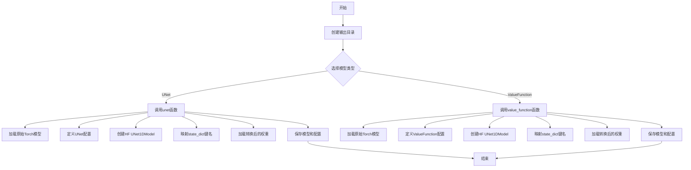
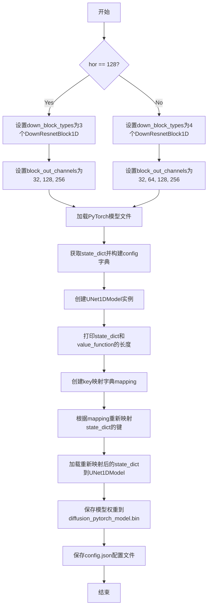
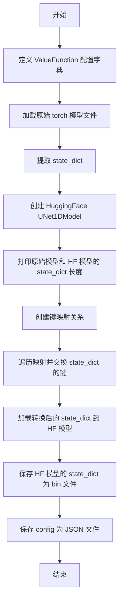

# `diffusers\scripts\convert_models_diffuser_to_diffusers.py` 详细设计文档

该代码是一个模型格式转换工具，用于将Torch格式的UNet1DModel和ValueFunction模型转换为HuggingFace Diffusers格式，支持horizon为32和128两种配置的模型转换，并保存转换后的模型权重和配置文件。

## 整体流程



## 类结构

```
该代码无类层次结构，仅包含模块级函数
```

## 全局变量及字段


### `down_block_types`
    
UNet配置元组，定义下采样阶段的ResNet块类型

类型：`tuple`
    


### `block_out_channels`
    
通道数元组，定义各层的输出通道数

类型：`tuple`
    


### `up_block_types`
    
UNet配置元组，定义上采样阶段的ResNet块类型

类型：`tuple`
    


### `config`
    
模型配置字典，包含UNet1DModel的所有构建参数

类型：`dict`
    


### `model`
    
从磁盘加载的PyTorch模型对象

类型：`torch.nn.Module`
    


### `state_dict`
    
模型状态字典，存储模型的所有权重参数

类型：`dict`
    


### `hf_value_function`
    
HuggingFace格式的UNet1DModel模型实例

类型：`UNet1DModel`
    


### `mapping`
    
键名映射字典，用于对齐原始模型与HF模型的权重键名

类型：`dict`
    


    

## 全局函数及方法


### `unet`

该函数用于将自定义的UNet模型（基于PyTorch）转换为HuggingFace Diffusers格式的UNet1DModel，支持根据不同的horizon参数（32或128）构建对应的模型配置，并保存转换后的模型权重和配置文件。

参数：

- `hor`：`int`，horizon参数，决定模型的配置类型（32或128）

返回值：`None`，无返回值（通过副作用保存模型文件）

#### 流程图



#### 带注释源码

```python
def unet(hor):
    # 根据horizon值配置下采样块类型
    if hor == 128:
        down_block_types = ("DownResnetBlock1D", "DownResnetBlock1D", "DownResnetBlock1D")
        block_out_channels = (32, 128, 256)
        up_block_types = ("UpResnetBlock1D", "UpResnetBlock1D")
    # horizon为32时的配置
    elif hor == 32:
        down_block_types = ("DownResnetBlock1D", "DownResnetBlock1D", "DownResnetBlock1D", "DownResnetBlock1D")
        block_out_channels = (32, 64, 128, 256)
        up_block_types = ("UpResnetBlock1D", "UpResnetBlock1D", "UpResnetBlock1D")
    
    # 从本地路径加载原始PyTorch模型文件
    model = torch.load(f"/Users/bglickenhaus/Documents/diffuser/temporal_unet-hopper-mediumv2-hor{hor}.torch")
    # 获取模型的状态字典（包含所有权重参数）
    state_dict = model.state_dict()
    
    # 构建HuggingFace Diffusers格式的模型配置
    config = {
        "down_block_types": down_block_types,
        "block_out_channels": block_out_channels,
        "up_block_types": up_block_types,
        "layers_per_block": 1,
        "use_timestep_embedding": True,
        "out_block_type": "OutConv1DBlock",
        "norm_num_groups": 8,
        "downsample_each_block": False,
        "in_channels": 14,
        "out_channels": 14,
        "extra_in_channels": 0,
        "time_embedding_type": "positional",
        "flip_sin_to_cos": False,
        "freq_shift": 1,
        "sample_size": 65536,
        "mid_block_type": "MidResTemporalBlock1D",
        "act_fn": "mish",
    }
    
    # 使用配置创建UNet1DModel实例
    hf_value_function = UNet1DModel(**config)
    
    # 打印状态字典长度用于调试
    print(f"length of state dict: {len(state_dict.keys())}")
    print(f"length of value function dict: {len(hf_value_function.state_dict().keys())}")
    
    # 创建原始模型键到HuggingFace模型键的映射关系
    mapping = dict(zip(model.state_dict().keys(), hf_value_function.state_dict().keys()))
    
    # 根据映射重新命名state_dict的键
    for k, v in mapping.items():
        state_dict[v] = state_dict.pop(k)
    
    # 将重新映射后的权重加载到HuggingFace模型中
    hf_value_function.load_state_dict(state_dict)

    # 保存转换后的模型权重为PyTorch二进制文件
    torch.save(hf_value_function.state_dict(), f"hub/hopper-medium-v2/unet/hor{hor}/diffusion_pytorch_model.bin")
    
    # 保存模型配置为JSON文件
    with open(f"hub/hopper-medium-v2/unet/hor{hor}/config.json", "w") as f:
        json.dump(config, f)
```

#### 关键组件信息

| 组件名称 | 描述 |
|---------|------|
| `UNet1DModel` | HuggingFace Diffusers库中的1D UNet模型类 |
| `config` | 包含UNet模型架构配置的字典 |
| `state_dict` | PyTorch模型的参数字典 |
| `mapping` | 用于键名映射的字典，协调原始模型与目标模型的参数名称 |

#### 潜在的技术债务或优化空间

1. **硬编码路径**：模型加载路径硬编码为本地文件系统路径，应考虑使用参数或环境变量
2. **缺少错误处理**：文件加载失败、键映射不匹配等场景缺乏异常捕获
3. **魔法数字**：配置中的数值（如`norm_num_groups=8`、`sample_size=65536`）缺乏说明
4. **重复代码**：与`value_function`函数存在大量重复逻辑，可考虑提取公共函数
5. **无返回值**：函数执行结果不明确，成功/失败状态不可知
6. **键映射假设**：假设原始模型键与目标模型键一一对应，可能存在潜在匹配失败风险

#### 其它项目

**设计目标与约束**：
- 目标：将本地自定义UNet模型转换为HuggingFace Diffusers兼容格式
- 约束：仅支持horizon为32或128两种配置

**错误处理与异常设计**：
- 缺乏文件不存在、权限问题、模型结构不兼容等异常处理
- 键映射过程中假设两个模型的键数量一致，未做校验

**数据流与状态机**：
- 输入：原始PyTorch模型文件 → 转换为state_dict
- 处理：键名映射、权重重新赋值
- 输出：Diffusers格式的模型权重文件和配置文件

**外部依赖与接口契约**：
- 依赖：`torch`、`diffusers`、`json`、`os`
- 输入接口：`hor`参数（int类型）
- 输出接口：生成`diffusion_pytorch_model.bin`和`config.json`到指定目录


### `value_function`

将预训练的 ValueFunction 模型（来自 hopper-medium-v2-hor32）转换为 HuggingFace Diffusers 的 UNet1DModel 格式，并保存为标准的 diffusion_pytorch_model.bin 和 config.json 文件。

参数：

- 该函数无参数

返回值：`None`，该函数不返回值，直接将转换后的模型保存到磁盘

#### 流程图



#### 带注释源码

```python
def value_function():
    """
    将 ValueFunction 模型转换为 HuggingFace Diffusers 格式
    """
    # 定义 ValueFunction 模型配置，匹配原始模型结构
    config = {
        "in_channels": 14,                          # 输入通道数
        "down_block_types": ("DownResnetBlock1D", "DownResnetBlock1D", "DownResnetBlock1D", "DownResnetBlock1D"),  # 下采样块类型
        "up_block_types": (),                        # 上采样块类型（空，因为是 ValueFunction）
        "out_block_type": "ValueFunction",           # 输出块类型
        "mid_block_type": "ValueFunctionMidBlock1D", # 中间块类型
        "block_out_channels": (32, 64, 128, 256),   # 块输出通道数
        "layers_per_block": 1,                      # 每个块的层数
        "downsample_each_block": True,              # 每个块是否下采样
        "sample_size": 65536,                       # 样本大小
        "out_channels": 14,                         # 输出通道数
        "extra_in_channels": 0,                     # 额外输入通道
        "time_embedding_type": "positional",        # 时间嵌入类型
        "use_timestep_embedding": True,             # 是否使用时间步嵌入
        "flip_sin_to_cos": False,                   # 是否翻转 sin 到 cos
        "freq_shift": 1,                            # 频率偏移
        "norm_num_groups": 8,                       # 归一化组数
        "act_fn": "mish",                           # 激活函数
    }

    # 从磁盘加载原始 ValueFunction 模型（.torch 格式）
    model = torch.load("/Users/bglickenhaus/Documents/diffuser/value_function-hopper-mediumv2-hor32.torch")
    # 直接获取 state_dict（该模型加载后就是 state_dict）
    state_dict = model
    
    # 使用配置创建 HuggingFace Diffusers 格式的 UNet1DModel
    hf_value_function = UNet1DModel(**config)
    
    # 打印两个 state_dict 的键数量，用于调试和验证
    print(f"length of state dict: {len(state_dict.keys())}")
    print(f"length of value function dict: {len(hf_value_function.state_dict().keys())}")

    # 创建键映射关系：将原始模型键映射到 HF 模型键
    mapping = dict(zip(state_dict.keys(), hf_value_function.state_dict().keys()))
    
    # 遍历映射，用新键替换旧键（即交换 state_dict 的键名）
    for k, v in mapping.items():
        state_dict[v] = state_dict.pop(k)

    # 将转换后的 state_dict 加载到 HF 模型中
    hf_value_function.load_state_dict(state_dict)

    # 保存转换后的模型权重为 diffusion_pytorch_model.bin
    torch.save(hf_value_function.state_dict(), "hub/hopper-medium-v2/value_function/diffusion_pytorch_model.bin")
    
    # 保存模型配置为 config.json
    with open("hub/hopper-medium-v2/value_function/config.json", "w") as f:
        json.dump(config, f)
```

## 关键组件


### 1. UNet模型转换模块（unet函数）

负责将预训练的UNet1D模型从原始格式转换为Hugging Face Diffusers格式，支持horizon为32和128两种配置，根据不同的horizon参数动态调整网络结构（如下采样块类型、输出通道数、上采样块类型等），通过状态字典键映射实现权重迁移。

### 2. 价值函数转换模块（value_function函数）

负责将预训练的价值函数（Value Function）模型转换为Hugging Face Diffusers格式，使用与UNet不同的特定配置（如ValueFunction输出块、ValueFunctionMidBlock1D中间块等），同样通过状态字典键映射实现权重迁移。

### 3. 模型配置定义

定义UNet1DModel的完整配置参数，包括下采样块类型、上采样块类型、每层块数、时间嵌入方式、归一化组数、激活函数、输入输出通道数等关键超参数，用于初始化Hugging Face格式的模型。

### 4. 状态字典映射与键交换

通过dict(zip(...))创建原始模型与Hugging Face模型之间的状态字典键映射关系，使用循环遍历将原始键的值重新赋值给目标键，实现权重参数的一对一对应转换。

### 5. 文件输出与持久化

负责将转换后的模型权重保存为.bin文件，以及将模型配置以JSON格式保存到指定目录（hub/hopper-medium-v2/unet/或hub/hopper-medium-v2/value_function/），确保模型可被后续加载使用。

### 6. 目录创建与路径管理

使用os.makedirs创建目标目录结构，设置exist_ok=True避免目录已存在时报错，确保模型文件能够正确保存到指定路径。


## 问题及建议


### 已知问题

- **硬编码路径问题**：代码中存在硬编码的绝对路径（如 `/Users/bglickenhaus/Documents/diffuser/temporal_unet-hopper-mediumv2-hor{hor}.torch`），导致代码无法在除开发者以外的环境中使用，缺乏可移植性
- **魔法数字与硬编码配置**：hor 参数（32、128）、block_out_channels、down_block_types 等配置以硬编码形式存在，扩展性差，若需支持新的模型配置需要修改源码
- **重复代码**：unet() 和 value_function() 函数中存在大量重复的模型加载、状态字典映射、加载和保存逻辑，违反 DRY 原则
- **缺少错误处理机制**：torch.load()、json.dump()、torch.save() 等 I/O 操作均未进行异常捕获，若文件不存在或损坏会导致程序直接崩溃
- **状态字典修改风险**：在 for 循环中直接使用 `state_dict[v] = state_dict.pop(k)` 修改字典，可能导致键值对顺序变化或意外覆盖，且 mapping 依赖键的顺序对应，健壮性不足
- **输出目录路径重复**：多个 `os.makedirs()` 调用使用重复的路径前缀，可提取为常量或配置
- **无日志记录**：仅使用 print() 输出少量信息，缺少统一的日志框架，难以支持生产环境的调试与监控
- **函数参数设计不足**：unet() 和 value_function() 函数的参数过少，无法通过参数化方式指定输入输出路径、模型配置等，测试友好性差
- **缺少类型注解**：Python 代码中未使用类型提示（Type Hints），降低代码可读性和静态分析工具的效力
- **未使用的导入**：导入了 torch 但未充分利用其功能，部分操作可简化
- **配置文件重复定义**：unet(32) 和 unet(128) 的配置有差异但结构相似，config 字典的构建逻辑可抽象

### 优化建议

- **配置外部化**：将模型路径、输出目录、模型配置等抽取为配置文件（如 YAML 或 JSON），或使用 dataclass/typeddict 管理配置，提升可维护性
- **抽象通用转换逻辑**：将 state_dict 加载、映射、保存的公共逻辑提取为独立函数（如 convert_model_state()），减少代码重复
- **添加错误处理**：使用 try-except 包裹 I/O 操作，提供有意义的错误信息并支持程序优雅退出
- **使用日志框架**：替换 print() 为 logging 模块，设置合理的日志级别，便于生产环境调试
- **路径动态化**：使用相对路径或环境变量/命令行参数指定路径，避免硬编码
- **增加类型注解**：为函数参数、返回值、变量添加类型提示，提升代码可读性
- **参数化函数设计**：unet() 函数可增加可选参数支持自定义配置，value_function() 类似处理
- **状态字典映射优化**：显式定义键映射关系而非依赖 dict 顺序，或使用专门的模型转换库（如 safetensors 或 transformers 的转换工具）
- **单元测试友好设计**：将核心逻辑与 I/O 分离，便于编写单元测试验证转换逻辑正确性

## 其它


### 设计目标与约束

本代码的核心目标是将基于PyTorch的原始UNet模型（用于Hopper-Media v2强化学习任务的时序扩散模型）转换为HuggingFace Diffusers库兼容的UNet1DModel格式。设计约束包括：1）仅支持特定horizon配置（32和128）；2）模型架构必须匹配Diffusers库定义的UNet1DModel结构；3）权重映射基于顺序对应关系，不进行语义匹配；4）输出目录结构需符合HuggingFace Hub模型格式规范。

### 错误处理与异常设计

代码缺乏显式的错误处理机制。主要风险点包括：1）torch.load()可能抛出FileNotFoundError（文件路径硬编码）；2）模型权重键不匹配时load_state_dict()会抛出RuntimeError；3）目录创建失败时os.makedirs()会抛出OSError；4）JSON序列化可能抛出TypeError。建议添加try-except块、文件存在性检查、权重键匹配验证等错误处理逻辑。

### 数据流与状态机

数据流如下：1）加载原始.torch模型文件 → 2）解析模型state_dict → 3）根据horizon参数构建config配置 → 4）实例化目标HF UNet1DModel → 5）创建权重映射关系（源模型键→目标模型键） → 6）重新键命名state_dict → 7）加载权重到新模型 → 8）保存权重bin文件和config.json文件。状态机较为简单，属于线性流程，无分支状态。

### 外部依赖与接口契约

外部依赖包括：1）torch（模型加载/保存）；2）json（配置序列化）；3）os（文件系统操作）；4）diffusers.UNet1DModel（目标模型类）。接口契约：unet(hor: int)函数接收horizon参数（32或128），无返回值；value_function()无参数，无返回值。输入模型文件路径硬编码为本地文件系统路径。

### 配置管理

配置通过硬编码字典传递，包含模型结构参数（down_block_types、block_out_channels、up_block_types等）和超参数（in_channels、out_channels、layers_per_block等）。配置在每个函数内部定义，缺乏集中管理。配置序列化后保存为config.json，符合HuggingFace模型卡规范。

### 文件系统操作

代码创建三个输出目录：hub/hopper-medium-v2/unet/hor32、hub/hopper-medium-v2/unet/hor128、hub/hopper-medium-v2/value_function。每个目录包含diffusion_pytorch_model.bin（权重文件）和config.json（配置文件）。使用exist_ok=True避免目录已存在时抛出异常。

### 路径硬编码问题

存在多处硬编码路径：1）模型输入路径：`/Users/bglickenhaus/Documents/diffuser/temporal_unet-hopper-mediumv2-hor{hor}.torch`；2）value_function模型路径：`/Users/bglickenhaus/Documents/diffuser/value_function-hopper-mediumv2-hor32.torch`；3）输出目录前缀：`hub/hopper-medium-v2/`。建议改为命令行参数或配置文件。

### 性能考虑

代码性能瓶颈主要包括：1）torch.load()加载大型模型文件；2）state_dict键的遍历替换操作O(n)复杂度；3）load_state_dict()的权重拷贝操作。内存占用主要来自同时保存原始state_dict和重新键映射后的副本。建议在权重映射后删除原始字典以释放内存。

### 兼容性考虑

代码依赖特定版本的diffusers库（UNet1DModel类）。不同版本的diffusers可能导致config参数不兼容或模型结构变化。torch版本也需兼容。代码仅在if __name__ == "__main__"块中调用，属于一次性脚本，无长期运行兼容性保障。

### 权重映射策略

当前映射策略为简单的顺序对应（dict(zip(...))），假设源模型和目标模型的参数顺序一致。这是一种脆弱的映射方式，可能导致权重错位。理想方案应基于参数名称语义进行匹配，或使用Diffusers提供的迁移工具。建议在映射后添加键集合差异检查，验证映射完整性。


    