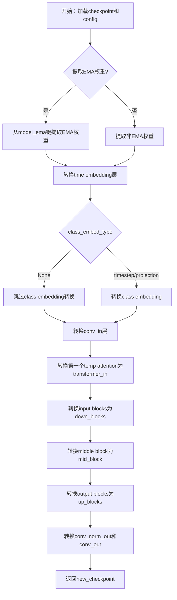
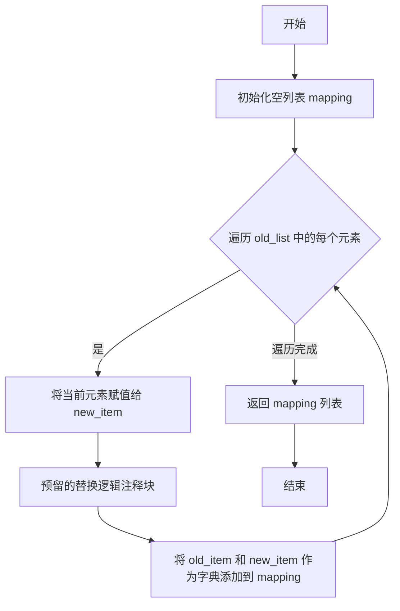
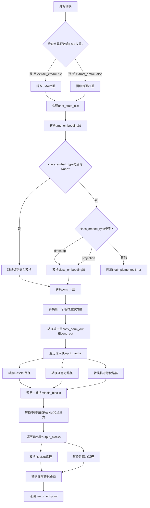
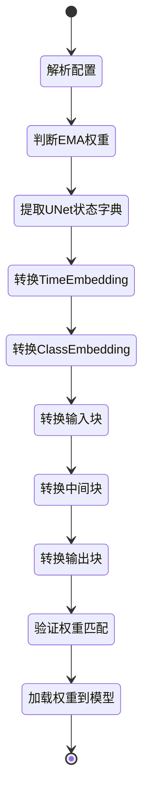

# `diffusers\scripts\convert_ms_text_to_video_to_diffusers.py` 详细设计文档

该脚本用于将LDM（Latent Diffusion Models）检查点转换为diffusers格式，专门处理UNet3DConditionModel的权重迁移。它负责权重重命名、注意力层分割、EMA权重提取以及从旧LDM架构到新diffusers架构的路径映射。

## 整体流程



## 类结构

```
该文件为纯脚本，无类层次结构
所有函数均为模块级全局函数
└── convert_ldm_unet_checkpoint.py (脚本文件)
    ├── assign_to_checkpoint (核心转换函数)
    ├── renew_attention_paths (注意力路径更新)
    ├── renew_resnet_paths (ResNet路径更新)
    ├── renew_temp_conv_paths (时序卷积路径更新)
    ├── shave_segments (路径修整)
    └── convert_ldm_unet_checkpoint (主转换函数)
```

## 全局变量及字段


### `unet_state_dict`
    
从原始LDM检查点提取的UNet状态字典，存储各层的权重张量

类型：`Dict[str, torch.Tensor]`
    


### `new_checkpoint`
    
转换后的新检查点字典，键为新的模型结构路径，值为对应的权重张量

类型：`Dict[str, torch.Tensor]`
    


### `unet_key`
    
原始检查点中UNet模块的前缀键，值为'model.diffusion_model.'

类型：`str`
    


### `keys`
    
原始检查点的所有键的列表，用于遍历和筛选特定的权重

类型：`List[str]`
    


### `num_input_blocks`
    
输入块的数量，通过对包含'input_blocks'的键进行去重计算得到

类型：`int`
    


### `num_middle_blocks`
    
中间块的数量，通过对包含'middle_block'的键进行去重计算得到

类型：`int`
    


### `num_output_blocks`
    
输出块的数量，通过对包含'output_blocks'的键进行去重计算得到

类型：`int`
    


### `input_blocks`
    
输入块的键集合字典，键为块ID，值为该块对应的所有权重键列表

类型：`Dict[int, List[str]]`
    


### `middle_blocks`
    
中间块的键集合字典，键为块ID，值为该块对应的所有权重键列表

类型：`Dict[int, List[str]]`
    


### `output_blocks`
    
输出块的键集合字典，键为块ID，值为该块对应的所有权重键列表

类型：`Dict[int, List[str]]`
    


    

## 全局函数及方法


### `assign_to_checkpoint`

该函数执行 LDM（Latent Diffusion Models）检查点转换的最后步骤：接收本地转换的权重映射路径、旧检查点状态字典以及配置参数，将旧检查点中的权重根据路径映射重新组织并分配到新的检查点字典中，同时处理注意力层权重的分割（将 q/k/v 分离）以及 1D 卷积到线性权重的转换。

参数：

- `paths`：`list[dict]`，包含 "old" 和 "new" 键的路径映射列表，定义权重从旧检查点到新检查点的映射关系
- `checkpoint`：`dict`，目标新检查点字典，转换后的权重将被写入此字典
- `old_checkpoint`：`dict`，源旧检查点字典，包含待转换的原始权重张量
- `attention_paths_to_split`：`dict` 或 `None`，可选参数，需要分割的注意力层路径映射，键为旧路径，值为包含 "query"、"key"、"value" 新路径的字典
- `additional_replacements`：`list[dict]` 或 `None`，可选参数，额外的路径替换规则列表，每个元素包含 "old" 和 "new" 键值对
- `config`：`dict` 或 `None`，可选参数，包含模型配置信息的字典，如 "num_head_channels" 等参数，用于注意力层分割计算

返回值：`None`，该函数直接修改 `checkpoint` 字典，不返回任何值

#### 流程图

```mermaid
flowchart TD
    A[开始 assign_to_checkpoint] --> B{paths 是否为列表?}
    B -->|否| C[抛出 AssertionError]
    B -->|是| D{attention_paths_to_split 是否为 None?}
    D -->|否| E[遍历 attention_paths_to_split]
    E --> E1[从 old_checkpoint 获取张量]
    E1 --> E2[计算通道数和头数]
    E2 --> E3[重塑张量并分割为 query/key/value]
    E3 --> E4[将分割结果写入 checkpoint]
    E4 --> D
    D -->|是| F[遍历 paths 列表]
    F --> G{新路径是否已在 attention_paths_to_split 中?}
    G -->|是| H[跳过当前路径]
    G -->|否| I{additional_replacements 是否为 None?}
    I -->|否| J[应用额外的路径替换]
    I -->|是| K{路径包含 proj_attn.weight?}
    J --> K
    K -->|是| L[提取权重[:, :, 0]]
    K -->|否| M{路径包含 proj_out.weight 或 proj_in.weight 且不是注意力层?}
    M -->|是| L
    M -->|否| N[直接使用原始权重]
    L --> O[将权重写入 checkpoint]
    N --> O
    O --> F
    H --> F
    P{遍历完成?} --> |是| Q[结束]
```

#### 带注释源码

```python
def assign_to_checkpoint(
    paths, checkpoint, old_checkpoint, attention_paths_to_split=None, additional_replacements=None, config=None
):
    """
    This does the final conversion step: take locally converted weights and apply a global renaming to them. It splits
    attention layers, and takes into account additional replacements that may arise.

    Assigns the weights to the new checkpoint.
    """
    # 验证 paths 参数必须为列表类型，每个元素应包含 'old' 和 'new' 键
    assert isinstance(paths, list), "Paths should be a list of dicts containing 'old' and 'new' keys."

    # 第一步：处理需要分割的注意力层权重
    # 如果提供了 attention_paths_to_split，则将旧格式的注意力权重分割为 query、key、value 三个独立的权重
    if attention_paths_to_split is not None:
        for path, path_map in attention_paths_to_split.items():
            # 从旧检查点获取原始注意力权重张量
            old_tensor = old_checkpoint[path]
            # 原始张量形状为 [3*channels, ...]，需要除以 3 得到每个头的通道数
            channels = old_tensor.shape[0] // 3

            # 确定目标形状：3D 张量使用 (-1, channels)，2D 张量使用 (-1,)
            target_shape = (-1, channels) if len(old_tensor.shape) == 3 else (-1)

            # 计算注意力头数：总通道数除以每头的通道数再除以 3（q/k/v 各一份）
            num_heads = old_tensor.shape[0] // config["num_head_channels"] // 3

            # 重塑张量以分离不同的注意力头：[num_heads, 3*channels//num_heads, ...]
            old_tensor = old_tensor.reshape((num_heads, 3 * channels // num_heads) + old_tensor.shape[1:])
            #沿着维度 1 分割为 query、key、value 三个张量，每个形状为 [num_heads, channels//num_heads, ...]
            query, key, value = old_tensor.split(channels // num_heads, dim=1)

            # 将分割后的 query、key、value 重新调整为目标形状并写入新检查点
            checkpoint[path_map["query"]] = query.reshape(target_shape)
            checkpoint[path_map["key"]] = key.reshape(target_shape)
            checkpoint[path_map["value"]] = value.reshape(target_shape)

    # 第二步：遍历所有路径映射，将权重从旧检查点转移到新检查点
    for path in paths:
        new_path = path["new"]

        # 跳过已经通过 attention_paths_to_split 处理过的路径（避免重复处理）
        if attention_paths_to_split is not None and new_path in attention_paths_to_split:
            continue

        # 应用额外的路径替换规则（如元路径替换）
        if additional_replacements is not None:
            for replacement in additional_replacements:
                # 将新路径中的旧前缀替换为新前缀
                new_path = new_path.replace(replacement["old"], replacement["new"])

        # 处理特定的权重转换：proj_attn.weight 需要从 1D 卷积转换为线性层权重
        weight = old_checkpoint[path["old"]]
        # 定义需要特殊处理的权重名称
        names = ["proj_attn.weight"]
        names_2 = ["proj_out.weight", "proj_in.weight"]
        
        # 如果新路径包含 proj_attn.weight，提取权重张量的第一个切片（卷积核）
        if any(k in new_path for k in names):
            checkpoint[new_path] = weight[:, :, 0]
        # 如果包含 proj_out.weight 或 proj_in.weight，且权重维度大于 2，且不是注意力层
        elif any(k in new_path for k in names_2) and len(weight.shape) > 2 and ".attentions." not in new_path:
            checkpoint[new_path] = weight[:, :, 0]
        # 其他情况直接使用原始权重
        else:
            checkpoint[new_path] = weight
```


### `renew_attention_paths`

该函数用于将注意力层（attention）的路径更新为新的命名方案（本地重命名），将旧的路径列表转换为包含旧路径和新路径对应关系的映射列表。

参数：

- `old_list`：`List[str]`，需要转换的旧路径列表
- `n_shave_prefix_segments`：`int`，用于控制是否删除路径前缀段落的参数（当前版本中未实际使用，保留以备将来扩展）

返回值：`List[Dict[str, str]]`，返回映射列表，每个元素为包含 `old` 和 `new` 键的字典，分别对应旧的路径名称和新的路径名称

#### 流程图



#### 带注释源码

```python
def renew_attention_paths(old_list, n_shave_prefix_segments=0):
    """
    Updates paths inside attentions to the new naming scheme (local renaming)
    
    该函数用于将注意力层的路径更新为新的命名方案。
    当前实现为直接映射（未进行实际的重命名），保留接口以供后续扩展。
    
    参数:
        old_list: 旧路径列表，需要转换的注意力层路径
        n_shave_prefix_segments: 用于控制是否删除路径前缀段落的参数（当前未使用）
    
    返回:
        映射列表，每个元素为 {'old': 旧路径, 'new': 新路径} 的字典
    """
    # 初始化映射结果列表
    mapping = []
    
    # 遍历所有旧路径项
    for old_item in old_list:
        # 当前新路径等于旧路径（此处为占位实现）
        new_item = old_item

        # 以下为预留的替换逻辑（目前被注释），可用于未来的路径转换：
        # 1. 将 norm.weight 替换为 group_norm.weight
        # new_item = new_item.replace('norm.weight', 'group_norm.weight')
        # new_item = new_item.replace('norm.bias', 'group_norm.bias')

        # 2. 将 proj_out.weight 替换为 proj_attn.weight
        # new_item = new_item.replace('proj_out.weight', 'proj_attn.weight')
        # new_item = new_item.replace('proj_out.bias', 'proj_attn.bias')

        # 3. 调用 shave_segments 进行路径段落的修剪
        # new_item = shave_segments(new_item, n_shave_prefix_segments=n_shave_prefix_segments)

        # 将旧路径和新路径的对应关系添加到映射列表中
        mapping.append({"old": old_item, "new": new_item})

    # 返回映射列表
    return mapping
```


### `shave_segments`

该函数用于处理路径字符串，根据 `n_shave_prefix_segments` 参数的值移除路径中的前缀或后缀段，正值移除前面的段，负值移除后面的段。

参数：

- `path`：`str`，要处理的路径字符串
- `n_shave_prefix_segments`：`int`，要切掉的段数，正值切前缀，负值切后缀，默认值为 `1`

返回值：`str`，处理后的路径字符串

#### 流程图

```mermaid
flowchart TD
    A[开始] --> B{n_shave_prefix_segments >= 0?}
    B -- 是 --> C[按"."分割path]
    C --> D[取从n_shave_prefix_segments开始的片段]
    D --> E[用"."重新连接片段]
    E --> F[返回处理后的路径]
    B -- 否 --> G[按"."分割path]
    G --> H[取从开头到n_shave_prefix_segments的片段]
    H --> E
    F --> Z[结束]
```

#### 带注释源码

```python
def shave_segments(path, n_shave_prefix_segments=1):
    """
    Removes segments. Positive values shave the first segments, negative shave the last segments.
    
    参数:
        path: str，要处理的路径字符串
        n_shave_prefix_segments: int，要切掉的段数
            - 正值: 移除路径开头的段
            - 负值: 移除路径末尾的段
            - 默认值为 1
    
    返回:
        str，处理后的路径字符串
    """
    # 判断是否处理前缀（n_shave_prefix_segments >= 0 表示移除前缀）
    if n_shave_prefix_segments >= 0:
        # 将路径按"."分割成列表，取从n_shave_prefix_segments开始的剩余部分，再用"."连接
        # 例如: path="a.b.c.d", n_shave_prefix_segments=1 -> ["b","c","d"] -> "b.c.d"
        return ".".join(path.split(".")[n_shave_prefix_segments:])
    else:
        # n_shave_prefix_segments < 0 时，移除路径末尾的段
        # 取列表从开头到n_shave_prefix_segments的部分（负索引）
        # 例如: path="a.b.c.d", n_shave_prefix_segments=-1 -> ["a","b","c"] -> "a.b.c"
        return ".".join(path.split(".")[:n_shave_prefix_segments])
```


### `renew_temp_conv_paths`

该函数用于更新 resnets 内部路径到新的命名方案（本地重命名），特别针对时序卷积层（temporal convolutions）的路径进行处理。

参数：

- `old_list`：`List[str]`，包含旧路径字符串的列表，这些路径需要进行命名方案更新
- `n_shave_prefix_segments`：`int`，默认值 `0`，用于 shaved segments 的段数（在此函数中未使用，保留接口一致性）

返回值：`List[Dict[str, str]]`，返回包含 'old' 和 'new' 键的字典列表，用于映射旧路径到新路径

#### 流程图

```mermaid
flowchart TD
    A[Start renew_temp_conv_paths] --> B[Initialize empty list: mapping]
    B --> C{Iteration: for each old_item in old_list}
    C -->|Yes| D[Create dict: {old: old_item, new: old_item}]
    D --> E[Append dict to mapping list]
    E --> C
    C -->|No| F[Return mapping list]
    F --> G[End]
```

#### 带注释源码

```python
def renew_temp_conv_paths(old_list, n_shave_prefix_segments=0):
    """
    Updates paths inside resnets to the new naming scheme (local renaming)
    
    Note: 当前实现为简单映射，未进行实际路径转换
    """
    # 初始化用于存储路径映射的列表
    mapping = []
    
    # 遍历旧路径列表中的每个元素
    for old_item in old_list:
        # 由于当前函数未实现实际转换逻辑，old和new保持相同
        # 这是为了保持与assign_to_checkpoint接口的兼容性
        mapping.append({"old": old_item, "new": old_item})

    # 返回路径映射列表，供后续assign_to_checkpoint使用
    return mapping
```


### `renew_resnet_paths`

该函数用于将 ResNet 相关的旧权重路径映射到新的命名方案，通过一系列字符串替换操作（如将 `in_layers.0` 替换为 `norm1`，`out_layers.0` 替换为 `norm2` 等），并根据需要去除路径前缀段，最终返回包含新旧路径映射的列表。

#### 参数

- `old_list`：`list`，旧的状态字典键列表，包含需要转换的 ResNet 层的原始路径
- `n_shave_prefix_segments`：`int`，默认值=0，控制要从路径开头去除的段数（用于调整路径层级）

#### 返回值

`list`，返回字典列表，每个字典包含 `"old"` 和 `"new"` 两个键，分别对应转换前后的路径

#### 流程图

```mermaid
flowchart TD
    A[开始] --> B[初始化空列表 mapping]
    B --> C{遍历 old_list 中的每个 old_item}
    C --> D[将 'in_layers.0' 替换为 'norm1']
    D --> E[将 'in_layers.2' 替换为 'conv1']
    E --> F[将 'out_layers.0' 替换为 'norm2']
    F --> G[将 'out_layers.3' 替换为 'conv2']
    G --> H[将 'emb_layers.1' 替换为 'time_emb_proj']
    H --> I[将 'skip_connection' 替换为 'conv_shortcut']
    I --> J[调用 shave_segments 去除前缀段]
    J --> K{检查 'temopral_conv' 是否在 old_item 中}
    K -->|不在| L[将 {old: old_item, new: new_item} 添加到 mapping]
    K -->|在| C
    L --> C
    C -->|遍历完成| M[返回 mapping]
    M --> N[结束]
```

#### 带注释源码

```python
def renew_resnet_paths(old_list, n_shave_prefix_segments=0):
    """
    Updates paths inside resnets to the new naming scheme (local renaming)
    """
    mapping = []  # 初始化用于存储路径映射的列表
    for old_item in old_list:  # 遍历旧的路径列表
        new_item = old_item  # 从旧路径开始
        
        # 将输入层命名转换为新架构的命名规范
        new_item = new_item.replace("in_layers.0", "norm1")
        new_item = new_item.replace("in_layers.2", "conv1")

        # 将输出层命名转换为新架构的命名规范
        new_item = new_item.replace("out_layers.0", "norm2")
        new_item = new_item.replace("out_layers.3", "conv2")

        # 转换时间嵌入层和跳跃连接命名
        new_item = new_item.replace("emb_layers.1", "time_emb_proj")
        new_item = new_item.replace("skip_connection", "conv_shortcut")

        # 根据 n_shave_prefix_segments 参数去除路径前缀段
        new_item = shave_segments(new_item, n_shave_prefix_segments=n_shave_prefix_segments)

        # 过滤掉包含 "temopral_conv" 的项（这些由 renew_temp_conv_paths 处理）
        if "temopral_conv" not in old_item:
            # 将旧路径和新路径作为字典添加到映射列表
            mapping.append({"old": old_item, "new": new_item})

    return mapping  # 返回路径映射列表
```


### `convert_ldm_unet_checkpoint`

该函数用于将 LDM（Latent Diffusion Models）格式的 UNet 检查点转换为 Diffusers 库所需的格式，处理权重键名的重映射、EMA 权重提取、注意力层分割等关键转换逻辑，是实现旧版扩散模型权重兼容性的核心转换工具。

参数：

- `checkpoint`：`Dict[str, torch.Tensor]`，原始 LDM 格式的检查点状态字典，包含模型权重
- `config`：`Dict`，UNet 模型配置字典，包含 `class_embed_type`、`layers_per_block`、`num_head_channels` 等配置项
- `path`：`Optional[str]`，检查点文件路径，用于输出信息提示（默认 `None`）
- `extract_ema`：`bool`，是否提取 EMA（指数移动平均）权重，若为 `True` 则提取 EMA 权重否则提取非 EMA 权重（默认 `False`）

返回值：`Dict[str, torch.Tensor]`，转换后的新检查点字典，键名已映射到 Diffusers 格式

#### 流程图



#### 带注释源码

```python
def convert_ldm_unet_checkpoint(checkpoint, config, path=None, extract_ema=False):
    """
    Takes a state dict and a config, and returns a converted checkpoint.
    将 LDM 格式的检查点转换为 Diffusers 格式
    """
    # ---------------------------------------------------------
    # 步骤1: 提取 UNet 状态字典
    # ---------------------------------------------------------
    unet_state_dict = {}
    keys = list(checkpoint.keys())
    
    # LDM 模型中 UNet 权重的前缀
    unet_key = "model.diffusion_model."

    # ---------------------------------------------------------
    # 步骤2: 判断是否提取 EMA 权重
    # EMA 权重通常有超过100个以 model_ema 开头的键
    # ---------------------------------------------------------
    # at least a 100 parameters have to start with `model_ema` in order for the checkpoint to be EMA
    if sum(k.startswith("model_ema") for k in keys) > 100 and extract_ema:
        print(f"Checkpoint {path} has both EMA and non-EMA weights.")
        print(
            "In this conversion only the EMA weights are extracted. If you want to instead extract the non-EMA"
            " weights (useful to continue fine-tuning), please make sure to remove the `--extract_ema` flag."
        )
        # 提取 EMA 权重：将 model_ema.xxx 转换为 xxx
        for key in keys:
            if key.startswith("model.diffusion_model"):
                flat_ema_key = "model_ema." + "".join(key.split(".")[1:])
                unet_state_dict[key.replace(unet_key, "")] = checkpoint.pop(flat_ema_key)
    else:
        # 提取普通权重
        if sum(k.startswith("model_ema") for k in keys) > 100:
            print(
                "In this conversion only the non-EMA weights are extracted. If you want to instead extract the EMA"
                " weights (usually better for inference), please make sure to add the `--extract_ema` flag."
            )

        for key in keys:
            # 移除 model.diffusion_model. 前缀
            unet_state_dict[key.replace(unet_key, "")] = checkpoint.pop(key)

    # ---------------------------------------------------------
    # 步骤3: 创建新的检查点字典
    # ---------------------------------------------------------
    new_checkpoint = {}

    # ---------------------------------------------------------
    # 步骤4: 转换时间嵌入层 (time embedding)
    # LDM: time_embed.0 -> Diffusers: time_embedding.linear_1
    # LDM: time_embed.2 -> Diffusers: time_embedding.linear_2
    # ---------------------------------------------------------
    new_checkpoint["time_embedding.linear_1.weight"] = unet_state_dict["time_embed.0.weight"]
    new_checkpoint["time_embedding.linear_1.bias"] = unet_state_dict["time_embed.0.bias"]
    new_checkpoint["time_embedding.linear_2.weight"] = unet_state_dict["time_embed.2.weight"]
    new_checkpoint["time_embedding.linear_2.bias"] = unet_state_dict["time_embed.2.bias"]

    # ---------------------------------------------------------
    # 步骤5: 转换类别嵌入层 (class embedding)
    # 根据 class_embed_type 配置决定转换方式
    # ---------------------------------------------------------
    if config["class_embed_type"] is None:
        # No parameters to port
        ...  # 无需转换
    elif config["class_embed_type"] == "timestep" or config["class_embed_type"] == "projection":
        # LDM: label_emb.0.0 -> Diffusers: class_embedding.linear_1
        new_checkpoint["class_embedding.linear_1.weight"] = unet_state_dict["label_emb.0.0.weight"]
        new_checkpoint["class_embedding.linear_1.bias"] = unet_state_dict["label_emb.0.0.bias"]
        new_checkpoint["class_embedding.linear_2.weight"] = unet_state_dict["label_emb.0.2.weight"]
        new_checkpoint["class_embedding.linear_2.bias"] = unet_state_dict["label_emb.0.2.bias"]
    else:
        raise NotImplementedError(f"Not implemented `class_embed_type`: {config['class_embed_type']}")

    # ---------------------------------------------------------
    # 步骤6: 转换输入卷积层 (conv_in)
    # LDM: input_blocks.0.0 -> Diffusers: conv_in
    # ---------------------------------------------------------
    new_checkpoint["conv_in.weight"] = unet_state_dict["input_blocks.0.0.weight"]
    new_checkpoint["conv_in.bias"] = unet_state_dict["input_blocks.0.0.bias"]

    # ---------------------------------------------------------
    # 步骤7: 转换第一个临时注意力层
    # LDM: input_blocks.0.1 -> Diffusers: transformer_in
    # ---------------------------------------------------------
    first_temp_attention = [v for v in unet_state_dict if v.startswith("input_blocks.0.1")]
    paths = renew_attention_paths(first_temp_attention)
    meta_path = {"old": "input_blocks.0.1", "new": "transformer_in"}
    assign_to_checkpoint(paths, new_checkpoint, unet_state_dict, additional_replacements=[meta_path], config=config)

    # ---------------------------------------------------------
    # 步骤8: 转换输出卷积层 (conv_out)
    # LDM: out.0 -> Diffusers: conv_norm_out
    # LDM: out.2 -> Diffusers: conv_out
    # ---------------------------------------------------------
    new_checkpoint["conv_norm_out.weight"] = unet_state_dict["out.0.weight"]
    new_checkpoint["conv_norm_out.bias"] = unet_state_dict["out.0.bias"]
    new_checkpoint["conv_out.weight"] = unet_state_dict["out.2.weight"]
    new_checkpoint["conv_out.bias"] = unet_state_dict["out.2.bias"]

    # ---------------------------------------------------------
    # 步骤9: 提取并分组各类型块的键
    # - input_blocks: 输入块
    # - middle_blocks: 中间块
    # - output_blocks: 输出块
    # ---------------------------------------------------------
    # Retrieves the keys for the input blocks only
    num_input_blocks = len({".".join(layer.split(".")[:2]) for layer in unet_state_dict if "input_blocks" in layer})
    input_blocks = {
        layer_id: [key for key in unet_state_dict if f"input_blocks.{layer_id}" in key]
        for layer_id in range(num_input_blocks)
    }

    # Retrieves the keys for the middle blocks only
    num_middle_blocks = len({".".join(layer.split(".")[:2]) for layer in unet_state_dict if "middle_block" in layer})
    middle_blocks = {
        layer_id: [key for key in unet_state_dict if f"middle_block.{layer_id}" in key]
        for layer_id in range(num_middle_blocks)
    }

    # Retrieves the keys for the output blocks only
    num_output_blocks = len({".".join(layer.split(".")[:2]) for layer in unet_state_dict if "output_blocks" in layer})
    output_blocks = {
        layer_id: [key for key in unet_state_dict if f"output_blocks.{layer_id}" in key]
        for layer_id in range(num_output_blocks)
    }

    # ---------------------------------------------------------
    # 步骤10: 转换输入块 (Input Blocks)
    # 遍历每个输入块，转换 ResNet、注意力层和临时卷积层
    # ---------------------------------------------------------
    for i in range(1, num_input_blocks):
        # 计算块 ID 和层 ID
        block_id = (i - 1) // (config["layers_per_block"] + 1)
        layer_in_block_id = (i - 1) % (config["layers_per_block"] + 1)

        # 提取当前输入块中的 ResNet、注意力层和临时注意力层
        resnets = [
            key for key in input_blocks[i] if f"input_blocks.{i}.0" in key and f"input_blocks.{i}.0.op" not in key
        ]
        attentions = [key for key in input_blocks[i] if f"input_blocks.{i}.1" in key]
        temp_attentions = [key for key in input_blocks[i] if f"input_blocks.{i}.2" in key]

        # 转换下采样卷积层 (downsamplers)
        if f"input_blocks.{i}.op.weight" in unet_state_dict:
            new_checkpoint[f"down_blocks.{block_id}.downsamplers.0.conv.weight"] = unet_state_dict.pop(
                f"input_blocks.{i}.op.weight"
            )
            new_checkpoint[f"down_blocks.{block_id}.downsamplers.0.conv.bias"] = unet_state_dict.pop(
                f"input_blocks.{i}.op.bias"
            )

        # 转换 ResNet 路径
        paths = renew_resnet_paths(resnets)
        meta_path = {"old": f"input_blocks.{i}.0", "new": f"down_blocks.{block_id}.resnets.{layer_in_block_id}"}
        assign_to_checkpoint(
            paths, new_checkpoint, unet_state_dict, additional_replacements=[meta_path], config=config
        )

        # 转换临时卷积路径
        temporal_convs = [key for key in resnets if "temopral_conv" in key]
        paths = renew_temp_conv_paths(temporal_convs)
        meta_path = {
            "old": f"input_blocks.{i}.0.temopral_conv",
            "new": f"down_blocks.{block_id}.temp_convs.{layer_in_block_id}",
        }
        assign_to_checkpoint(
            paths, new_checkpoint, unet_state_dict, additional_replacements=[meta_path], config=config
        )

        # 转换注意力路径
        if len(attentions):
            paths = renew_attention_paths(attentions)
            meta_path = {"old": f"input_blocks.{i}.1", "new": f"down_blocks.{block_id}.attentions.{layer_in_block_id}"}
            assign_to_checkpoint(
                paths, new_checkpoint, unet_state_dict, additional_replacements=[meta_path], config=config
            )

        # 转换临时注意力路径
        if len(temp_attentions):
            paths = renew_attention_paths(temp_attentions)
            meta_path = {
                "old": f"input_blocks.{i}.2",
                "new": f"down_blocks.{block_id}.temp_attentions.{layer_in_block_id}",
            }
            assign_to_checkpoint(
                paths, new_checkpoint, unet_state_dict, additional_replacements=[meta_path], config=config
            )

    # ---------------------------------------------------------
    # 步骤11: 转换中间块 (Middle Blocks)
    # LDM 中间块包含: resnet0, attention, temp_attention, resnet1
    # ---------------------------------------------------------
    resnet_0 = middle_blocks[0]
    temporal_convs_0 = [key for key in resnet_0 if "temopral_conv" in key]
    attentions = middle_blocks[1]
    temp_attentions = middle_blocks[2]
    resnet_1 = middle_blocks[3]
    temporal_convs_1 = [key for key in resnet_1 if "temopral_conv" in key]

    # 转换 resnet_0
    resnet_0_paths = renew_resnet_paths(resnet_0)
    meta_path = {"old": "middle_block.0", "new": "mid_block.resnets.0"}
    assign_to_checkpoint(
        resnet_0_paths, new_checkpoint, unet_state_dict, config=config, additional_replacements=[meta_path]
    )

    # 转换临时卷积 0
    temp_conv_0_paths = renew_temp_conv_paths(temporal_convs_0)
    meta_path = {"old": "middle_block.0.temopral_conv", "new": "mid_block.temp_convs.0"}
    assign_to_checkpoint(
        temp_conv_0_paths, new_checkpoint, unet_state_dict, config=config, additional_replacements=[meta_path]
    )

    # 转换 resnet_1
    resnet_1_paths = renew_resnet_paths(resnet_1)
    meta_path = {"old": "middle_block.3", "new": "mid_block.resnets.1"}
    assign_to_checkpoint(
        resnet_1_paths, new_checkpoint, unet_state_dict, config=config, additional_replacements=[meta_path]
    )

    # 转换临时卷积 1
    temp_conv_1_paths = renew_temp_conv_paths(temporal_convs_1)
    meta_path = {"old": "middle_block.3.temopral_conv", "new": "mid_block.temp_convs.1"}
    assign_to_checkpoint(
        temp_conv_1_paths, new_checkpoint, unet_state_dict, config=config, additional_replacements=[meta_path]
    )

    # 转换注意力
    attentions_paths = renew_attention_paths(attentions)
    meta_path = {"old": "middle_block.1", "new": "mid_block.attentions.0"}
    assign_to_checkpoint(
        attentions_paths, new_checkpoint, unet_state_dict, additional_replacements=[meta_path], config=config
    )

    # 转换临时注意力
    temp_attentions_paths = renew_attention_paths(temp_attentions)
    meta_path = {"old": "middle_block.2", "new": "mid_block.temp_attentions.0"}
    assign_to_checkpoint(
        temp_attentions_paths, new_checkpoint, unet_state_dict, additional_replacements=[meta_path], config=config
    )

    # ---------------------------------------------------------
    # 步骤12: 转换输出块 (Output Blocks)
    # 遍历每个输出块，转换 ResNet、注意力层、上采样层等
    # ---------------------------------------------------------
    for i in range(num_output_blocks):
        block_id = i // (config["layers_per_block"] + 1)
        layer_in_block_id = i % (config["layers_per_block"] + 1)
        output_block_layers = [shave_segments(name, 2) for name in output_blocks[i]]
        output_block_list = {}

        # 整理输出块中的层信息
        for layer in output_block_layers:
            layer_id, layer_name = layer.split(".")[0], shave_segments(layer, 1)
            if layer_id in output_block_list:
                output_block_list[layer_id].append(layer_name)
            else:
                output_block_list[layer_id] = [layer_name]

        # 处理包含多个组件的输出块
        if len(output_block_list) > 1:
            # 提取 ResNet、注意力层和临时注意力层
            resnets = [key for key in output_blocks[i] if f"output_blocks.{i}.0" in key]
            attentions = [key for key in output_blocks[i] if f"output_blocks.{i}.1" in key]
            temp_attentions = [key for key in output_blocks[i] if f"output_blocks.{i}.2" in key]

            # 转换 ResNet 路径
            resnet_0_paths = renew_resnet_paths(resnets)
            paths = renew_resnet_paths(resnets)

            meta_path = {"old": f"output_blocks.{i}.0", "new": f"up_blocks.{block_id}.resnets.{layer_in_block_id}"}
            assign_to_checkpoint(
                paths, new_checkpoint, unet_state_dict, additional_replacements=[meta_path], config=config
            )

            # 转换临时卷积路径
            temporal_convs = [key for key in resnets if "temopral_conv" in key]
            paths = renew_temp_conv_paths(temporal_convs)
            meta_path = {
                "old": f"output_blocks.{i}.0.temopral_conv",
                "new": f"up_blocks.{block_id}.temp_convs.{layer_in_block_id}",
            }
            assign_to_checkpoint(
                paths, new_checkpoint, unet_state_dict, additional_replacements=[meta_path], config=config
            )

            # 转换上采样层 (upsamplers)
            output_block_list = {k: sorted(v) for k, v in output_block_list.items()}
            if ["conv.bias", "conv.weight"] in output_block_list.values():
                index = list(output_block_list.values()).index(["conv.bias", "conv.weight"])
                new_checkpoint[f"up_blocks.{block_id}.upsamplers.0.conv.weight"] = unet_state_dict[
                    f"output_blocks.{i}.{index}.conv.weight"
                ]
                new_checkpoint[f"up_blocks.{block_id}.upsamplers.0.conv.bias"] = unet_state_dict[
                    f"output_blocks.{i}.{index}.conv.bias"
                ]

                # Clear attentions as they have been attributed above.
                if len(attentions) == 2:
                    attentions = []

            # 转换注意力路径
            if len(attentions):
                paths = renew_attention_paths(attentions)
                meta_path = {
                    "old": f"output_blocks.{i}.1",
                    "new": f"up_blocks.{block_id}.attentions.{layer_in_block_id}",
                }
                assign_to_checkpoint(
                    paths, new_checkpoint, unet_state_dict, additional_replacements=[meta_path], config=config
                )

            # 转换临时注意力路径
            if len(temp_attentions):
                paths = renew_attention_paths(temp_attentions)
                meta_path = {
                    "old": f"output_blocks.{i}.2",
                    "new": f"up_blocks.{block_id}.temp_attentions.{layer_in_block_id}",
                }
                assign_to_checkpoint(
                    paths, new_checkpoint, unet_state_dict, additional_replacements=[meta_path], config=config
                )
        else:
            # 处理单个组件的输出块
            resnet_0_paths = renew_resnet_paths(output_block_layers, n_shave_prefix_segments=1)
            for path in resnet_0_paths:
                old_path = ".".join(["output_blocks", str(i), path["old"]])
                new_path = ".".join(["up_blocks", str(block_id), "resnets", str(layer_in_block_id), path["new"]])
                new_checkpoint[new_path] = unet_state_dict[old_path]

            # 处理临时卷积路径
            temopral_conv_paths = [l for l in output_block_layers if "temopral_conv" in l]
            for path in temopral_conv_paths:
                pruned_path = path.split("temopral_conv.")[-1]
                old_path = ".".join(["output_blocks", str(i), str(block_id), "temopral_conv", pruned_path])
                new_path = ".".join(["up_blocks", str(block_id), "temp_convs", str(layer_in_block_id), pruned_path])
                new_checkpoint[new_path] = unet_state_dict[old_path]

    # ---------------------------------------------------------
    # 返回转换后的检查点
    # ---------------------------------------------------------
    return new_checkpoint
```

## 关键组件


### 张量索引与路径映射

代码通过 `shave_segments` 函数实现路径段的修剪和索引调整，支持正数修剪前缀段、负数修剪后缀段，用于将旧版LDM的嵌套路径转换为Diffusers的扁平化路径结构。

### 注意力层分割与重命名

`assign_to_checkpoint` 函数中的注意力层分割逻辑将原始的张量按 `num_heads` 维度分割为 query、key、value 三个部分，并使用 `target_shape` 进行reshape重塑，实现3D张量到2D的投影变换。

### EMA权重提取机制

`convert_ldm_unet_checkpoint` 函数通过检测 `model_ema` 前缀的键数量（阈值>100）来判断检查点是否包含EMA权重，支持通过 `extract_ema` 参数选择提取EMA权重或非EMA权重，用于推理或微调场景。

### ResNet路径转换

`renew_resnet_paths` 函数将旧版LDM的ResNet模块路径进行映射转换，包括 `in_layers.0` → `norm1`、`in_layers.2` → `conv1`、`out_layers.0` → `norm2`、`out_layers.3` → `conv2`、`emb_layers.1` → `time_emb_proj`、`skip_connection` → `conv_shortcut` 等关键映射。

### 时间嵌入层转换

代码手动将 `time_embed.0` 和 `time_embed.2` 的权重映射到新架构的 `time_embedding.linear_1` 和 `time_embedding.linear_2`，实现时间条件嵌入的转换。

### 类别嵌入转换

`convert_ldm_unet_checkpoint` 支持多种 `class_embed_type`（`None`、`timestep`、`projection`），并将旧版的 `label_emb.0.0` 和 `labelEmb.0.2` 映射到新的 `class_embedding.linear_1` 和 `class_embedding.linear_2`。

### 临时卷积与注意力处理

代码通过 `renew_temp_conv_paths` 和对 `temopral_conv`（注意这是拼写错误，应为temporal）的特殊处理，识别并转换3D卷积模块，用于视频扩散模型的时序建模。

### 检查点验证机制

在 `__main__` 块中，代码通过集合差集比较转换后的权重键与目标模型的结构键，验证 `diff_0` 和 `diff_1` 均为空，确保权重完整映射无遗漏。


## 问题及建议


### 已知问题

-   **拼写错误**：代码中多处使用 `"temopral_conv"`（应为 `"temporal_conv"`），贯穿 `renew_resnet_paths`、`renew_temp_conv_paths` 和 `convert_ldm_unet_checkpoint` 函数，可能导致转换失败或遗漏权重
-   **无效函数**：`renew_temp_conv_paths` 函数实际上没有进行任何实际转换，只是简单包装了输入列表，与函数名和文档描述不符
-   **废弃代码未清理**：`renew_attention_paths` 函数中包含大量注释掉的代码（如 norm.weight、proj_out.weight 替换），既不执行又影响代码可读性
-   **使用 assert 进行参数验证**：`assign_to_checkpoint` 使用 `assert` 而非适当的异常处理，生产环境中可能被优化忽略
-   **缺乏错误处理**：多处直接访问字典键（如 `config["class_embed_type"]`），若 config 缺少必要键会产生难以追踪的 KeyError
-   **魔法字符串和硬编码**：大量硬编码的路径字符串（如 `"model.diffusion_model."`、`"time_embed.0.weight"`），缺乏配置化
-   **变量覆盖风险**：在 `convert_ldm_unet_checkpoint` 主循环中，`attentions`、`temp_attentions` 等变量在不同作用域被重复赋值和修改
-   **隐式依赖**：函数依赖外部导入的 `UNet3DConditionModel`，且通过 `unet.config` 获取配置，隐藏了依赖关系
-   **数据一致性风险**：使用 `checkpoint.pop()` 修改原始字典，若转换失败会导致原始数据丢失

### 优化建议

-   **统一拼写**：将所有 `"temopral_conv"` 修正为 `"temporal_conv"`，或提取为常量避免重复
-   **删除无效代码**：移除 `renew_temp_conv_paths` 中的空转换逻辑，或实现真正的 temporal conv 路径转换
-   **清理废弃代码**：删除 `renew_attention_paths` 中注释掉的代码块，或添加 TODO 说明保留原因
-   **改进参数验证**：将 assert 替换为显式的参数检查和 ValueError/TypeError 异常
-   **添加 config 验证**：在函数入口检查 config 是否包含必要键，提供清晰的错误信息
-   **提取配置常量**：将模型路径前缀、层名称映射等提取为配置字典或独立配置文件
-   **避免状态修改**：对原始 checkpoint 使用深拷贝或在工作前备份，避免使用 pop 直接修改
-   **重构循环逻辑**：将重复的路径转换逻辑抽取为独立函数，减少代码冗余
-   **添加日志记录**：使用 logging 模块替代 print 语句，便于生产环境调试

## 其它


### 设计目标与约束

**设计目标**：实现将LDM（Latent Diffusion Model）格式的UNet检查点转换为HuggingFace diffusers库中UNet3DConditionModel可加载格式的自动化工具，支持EMA和非EMA权重的提取，以及3D卷积到线性层的转换。

**核心约束**：
1. **模型架构约束**：仅支持具有特定结构的UNet3DConditionModel，目标模型必须包含time_embedding、conv_in、conv_out、conv_norm_out等层
2. **权重维度约束**：要求checkpoint中的权重维度与目标模型维度完全匹配，转换后需通过`assert len(diff_0) == len(diff_1) == 0`验证
3. **配置依赖约束**：依赖config字典中的`class_embed_type`、`layers_per_block`、`num_head_channels`等参数进行正确转换
4. **兼容性约束**：仅支持PyTorch格式的checkpoint文件

### 错误处理与异常设计

**异常类型与处理**：

1. **`NotImplementedError`**：当遇到未实现的`class_embed_type`时抛出，提示当前不支持该类型
   ```python
   else:
       raise NotImplementedError(f"Not implemented `class_embed_type`: {config['class_embed_type']}")
   ```

2. **`AssertionError`**：转换后验证权重键集合完全匹配时，若不匹配则抛出断言错误
   ```python
   assert len(diff_0) == len(diff_1) == 0, "Converted weights don't match"
   ```

3. **权重缺失处理**：使用`checkpoint.pop(key)`方法移除已处理的键，确保每个权重只被处理一次，避免重复映射

4. **EMA权重检测**：通过统计`model_ema`前缀的键数量（阈值>100）判断是否为EMA检查点，并给出相应的用户提示

### 数据流与状态机

**主转换流程状态机**：



**数据变换关键路径**：
1. 输入：LDM格式checkpoint (dict) → 提取unet_state_dict
2. 转换：unet_state_dict → 遍历input_blocks/middle_block/output_blocks进行路径映射
3. 输出：new_checkpoint (dict) → 验证后加载到UNet3DConditionModel

### 外部依赖与接口契约

**外部依赖**：
- `torch`：用于加载checkpoint和张量操作
- `diffusers.UNet3DConditionModel`：目标模型类，用于获取配置和模型结构
- `argparse`：命令行参数解析

**接口契约**：

| 接口名称 | 输入类型 | 输出类型 | 说明 |
|---------|---------|---------|------|
| `convert_ldm_unet_checkpoint` | checkpoint(dict), config(dict) | dict | 主转换函数，返回转换后的checkpoint |
| `assign_to_checkpoint` | paths(list), checkpoint(dict), old_checkpoint(dict) | None | 原地修改checkpoint，完成权重分配 |
| `renew_attention_paths` | old_list(list) | list | 返回新旧路径映射列表 |
| `renew_resnet_paths` | old_list(list) | list | 返回ResNet层路径映射 |
| `renew_temp_conv_paths` | old_list(list) | list | 返回时序卷积路径映射 |
| `shave_segments` | path(str) | str | 移除路径前缀或后缀段 |

**命令行接口**：
- `--checkpoint_path`：输入的LDM检查点路径（必需）
- `--dump_path`：输出的diffusers模型保存路径（必需）
- `--extract_ema`：可选标志，用于提取EMA权重

### 边界条件与特殊场景

**边界条件处理**：

1. **无class_embed_type**：当`config["class_embed_type"]`为None时，跳过class_embedding相关权重的转换
   ```python
   if config["class_embed_type"] is None:
       # No parameters to port
       ...
   ```

2. **timestep/projection类型**：特殊处理label_emb.0.0和label_emb.0.2的映射

3. **时序卷积过滤**：在resnet路径转换时过滤掉包含"temopral_conv"的条目（注意代码中的拼写错误"temopral"）
   ```python
   if "temopral_conv" not in old_item:
       mapping.append({"old": old_item, "new": new_item})
   ```

4. **输出块单层处理**：当output_block_list长度为1时，使用特殊的路径剪裁逻辑处理

### 配置要求与参数说明

**必需的config字段**：

| 字段名 | 类型 | 说明 |
|-------|------|------|
| `class_embed_type` | str/None | 类嵌入类型：None/"timestep"/"projection" |
| `layers_per_block` | int | 每个块的层数 |
| `num_head_channels` | int | 注意力头通道数，用于分割QKV |

**可选的config字段**：
- `in_channels`：输入通道数（用于验证）
- `out_channels`：输出通道数（用于验证）
- `block_out_channels`：块输出通道列表（用于验证结构）

### 版本兼容性与历史遗留

**已知历史遗留问题**：
1. **拼写错误**："temopral_conv"应为"temporal_conv"，这是LDM原始代码中的遗留拼写，转换脚本需保持一致
2. **被注释的代码**：renew_attention_paths中存在被注释的norm.weight、proj_out.weight等替换规则，可能是早期版本的映射规则
3. **EMA判断阈值**：使用硬编码阈值100判断是否为EMA权重，可能对极小模型不适用


    