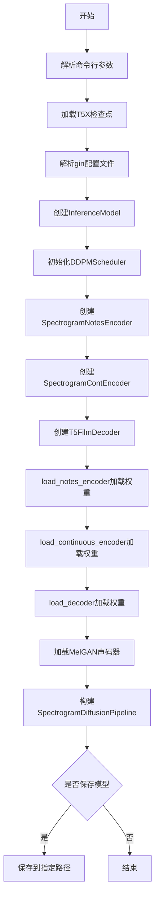
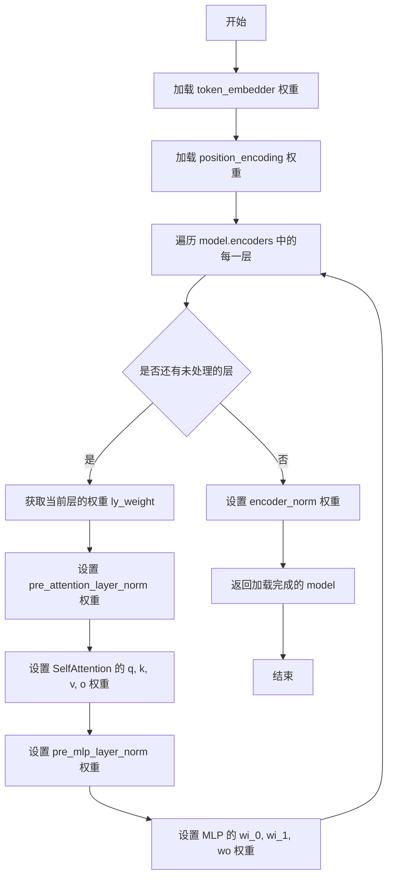
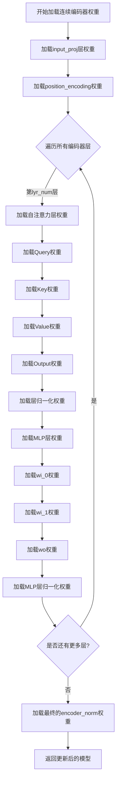
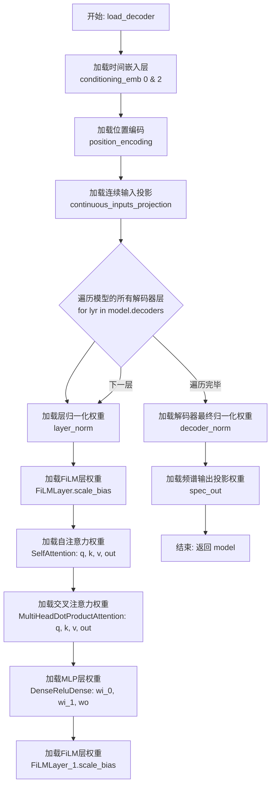
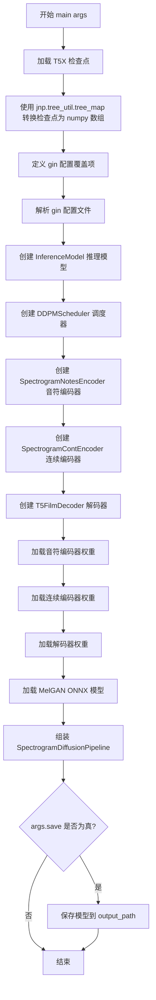

# `diffusers\scripts\convert_music_spectrogram_to_diffusers.py` 详细设计文档

该脚本用于将基于JAX/T5X的Music Spectrogram Diffusion模型转换为Hugging Face Diffusers格式，包括音符编码器、连续编码器和解码器的权重迁移与pipeline构建。

## 整体流程



## 类结构

```
无类层次结构（该脚本为过程式代码）
主要模块:
├── inference (music_spectrogram_diffusion)
├── t5x.checkpoints
├── diffusers (SpectrogramDiffusionPipeline等)
└── torch.nn (权重加载)
```

## 全局变量及字段


### `MODEL`
    
默认模型路径，指定要加载的预训练 JAX 检查点模型的名称为 'base_with_context'

类型：`str`
    


    

## 全局函数及方法


### `load_notes_encoder`

将 JAX/Flax 格式的音符编码器权重加载到 PyTorch 的 `SpectrogramNotesEncoder` 模型中，完成从 T5X 检查点权重到 PyTorch 模型的权重迁移和映射。

参数：

- `weights`：`dict`，从 T5X 检查点加载的 JAX 模型权重字典，包含 token_embedder、Embed_0、各层权重等键值对
- `model`：`SpectrogramNotesEncoder`，diffusers 库中的 PyTorch 音符编码器模型实例

返回值：`SpectrogramNotesEncoder`，完成权重加载后的 PyTorch 模型实例

#### 流程图



#### 带注释源码

```python
def load_notes_encoder(weights, model):
    """
    将 JAX/Flax 格式的音符编码器权重加载到 PyTorch 模型中
    
    参数:
        weights: 从 T5X checkpoint 加载的 JAX 模型权重字典
        model: PyTorch 的 SpectrogramNotesEncoder 模型实例
    
    返回:
        加载权重后的 PyTorch 模型
    """
    # 1. 加载 token_embedder 的 embedding 权重
    # 从 weights 字典中提取 token_embedder 的 embedding 矩阵
    # 使用 torch.Tensor 转换为 PyTorch 张量，并用 nn.Parameter 包装为可训练参数
    model.token_embedder.weight = nn.Parameter(torch.Tensor(weights["token_embedder"]["embedding"]))
    
    # 2. 加载位置编码权重
    # Embed_0 对应位置编码层，requires_grad=False 表示不参与梯度更新
    model.position_encoding.weight = nn.Parameter(torch.Tensor(weights["Embed_0"]["embedding"]), requires_grad=False)
    
    # 3. 遍历所有 encoder 层，逐层加载权重
    for lyr_num, lyr in enumerate(model.encoders):
        # 获取当前层的权重字典，键名格式为 "layers_{layer_number}"
        ly_weight = weights[f"layers_{lyr_num}"]
        
        # 3.1 加载自注意力层前的 LayerNorm 权重
        # pre_attention_layer_norm 是自注意力之前的归一化层
        lyr.layer[0].layer_norm.weight = nn.Parameter(torch.Tensor(ly_weight["pre_attention_layer_norm"]["scale"]))
        
        # 3.2 加载自注意力机制的 q, k, v, o 权重
        # 注意：JAX 模型中使用 kernel.T，这里需要转置回来
        attention_weights = ly_weight["attention"]
        
        # Query 权重
        lyr.layer[0].SelfAttention.q.weight = nn.Parameter(torch.Tensor(attention_weights["query"]["kernel"].T))
        # Key 权重
        lyr.layer[0].SelfAttention.k.weight = nn.Parameter(torch.Tensor(attention_weights["key"]["kernel"].T))
        # Value 权重
        lyr.layer[0].SelfAttention.v.weight = nn.Parameter(torch.Tensor(attention_weights["value"]["kernel"].T))
        # Output 投影权重
        lyr.layer[0].SelfAttention.o.weight = nn.Parameter(torch.Tensor(attention_weights["out"]["kernel"].T))
        
        # 3.3 加载 MLP 层前的 LayerNorm 权重
        lyr.layer[1].layer_norm.weight = nn.Parameter(torch.Tensor(ly_weight["pre_mlp_layer_norm"]["scale"]))
        
        # 3.4 加载 MLP (DenseReluDense) 层的权重
        # T5 模型使用门控 GELU 激活函数，有两个输入权重 wi_0 和 wi_1
        lyr.layer[1].DenseReluDense.wi_0.weight = nn.Parameter(torch.Tensor(ly_weight["mlp"]["wi_0"]["kernel"].T))
        lyr.layer[1].DenseReluDense.wi_1.weight = nn.Parameter(torch.Tensor(ly_weight["mlp"]["wi_1"]["kernel"].T))
        # 输出权重
        lyr.layer[1].DenseReluDense.wo.weight = nn.Parameter(torch.Tensor(ly_weight["mlp"]["wo"]["kernel"].T))
    
    # 4. 加载最后的 encoder 归一化层权重
    model.layer_norm.weight = nn.Parameter(torch.Tensor(weights["encoder_norm"]["scale"]))
    
    # 5. 返回加载完权重的模型
    return model
```


### `load_continuous_encoder`

该函数用于将JAX/T5X模型中连续编码器的权重迁移到对应的PyTorch模型中，通过逐层映射注意力机制、MLP和归一化层的权重参数，实现跨框架的模型权重加载。

参数：

- `weights`：`dict`，来自T5X检查点的连续编码器权重字典，包含input_proj、Embed_0、各层layer参数以及encoder_norm等键
- `model`：`torch.nn.Module`，PyTorch版的`SpectrogramContEncoder`模型实例

返回值：`torch.nn.Module`，加载权重后的PyTorch模型（与输入model为同一对象）

#### 流程图



#### 带注释源码

```python
def load_continuous_encoder(weights, model):
    """
    将JAX/T5X连续编码器权重加载到PyTorch模型中
    
    参数:
        weights: 来自T5X检查点的连续编码器权重字典
        model: PyTorch版本的SpectrogramContEncoder模型
    返回:
        加载权重后的PyTorch模型
    """
    
    # 加载输入投影层的权重，将JAX权重转置后赋值给PyTorch模型
    # input_proj层负责将输入投影到模型维度空间
    model.input_proj.weight = nn.Parameter(torch.Tensor(weights["input_proj"]["kernel"].T))

    # 加载位置编码权重，requires_grad=False表示冻结该参数，不参与训练
    # 位置编码为序列中的每个位置提供位置信息
    model.position_encoding.weight = nn.Parameter(torch.Tensor(weights["Embed_0"]["embedding"]), requires_grad=False)

    # 遍历模型中的所有编码器层，逐层加载权重
    for lyr_num, lyr in enumerate(model.encoders):
        # 获取当前层的权重字典
        ly_weight = weights[f"layers_{lyr_num}"]
        
        # 提取注意力机制的权重
        attention_weights = ly_weight["attention"]

        # 加载自注意力层(SA)的Query、Key、Value和Output权重
        # 这里的.T表示对权重矩阵进行转置，因为JAX和PyTorch的矩阵乘法维度可能不同
        lyr.layer[0].SelfAttention.q.weight = nn.Parameter(torch.Tensor(attention_weights["query"]["kernel"].T))
        lyr.layer[0].SelfAttention.k.weight = nn.Parameter(torch.Tensor(attention_weights["key"]["kernel"].T))
        lyr.layer[0].SelfAttention.v.weight = nn.Parameter(torch.Tensor(attention_weights["value"]["kernel"].T))
        lyr.layer[0].SelfAttention.o.weight = nn.Parameter(torch.Tensor(attention_weights["out"]["kernel"].T))
        
        # 加载注意力层之前的层归一化权重
        lyr.layer[0].layer_norm.weight = nn.Parameter(torch.Tensor(ly_weight["pre_attention_layer_norm"]["scale"]))

        # 加载MLP(DenseReluDense)层的权重
        # 包含两个输入投影(wi_0, wi_1)和一个输出投影(wo)
        # gated-gelu激活函数使用两个输入投影
        lyr.layer[1].DenseReluDense.wi_0.weight = nn.Parameter(torch.Tensor(ly_weight["mlp"]["wi_0"]["kernel"].T))
        lyr.layer[1].DenseReluDense.wi_1.weight = nn.Parameter(torch.Tensor(ly_weight["mlp"]["wi_1"]["kernel"].T))
        lyr.layer[1].DenseReluDense.wo.weight = nn.Parameter(torch.Tensor(ly_weight["mlp"]["wo"]["kernel"].T))
        
        # 加载MLP层之前的层归一化权重
        lyr.layer[1].layer_norm.weight = nn.Parameter(torch.Tensor(ly_weight["pre_mlp_layer_norm"]["scale"]))

    # 加载编码器最后的层归一化权重(encoder_norm)
    model.layer_norm.weight = nn.Parameter(torch.Tensor(weights["encoder_norm"]["scale"]))

    # 返回更新后的模型(虽然修改是in-place的，但按函数约定返回)
    return model
```


### `load_decoder`

该函数负责将预训练的T5X模型中解码器（Decoder）的权重参数迁移并加载到PyTorch的 `T5FilmDecoder` 模型中，处理了JAX与PyTorch权重存储格式的差异（如转置），并递归更新了注意力机制、FiLM层和MLP的权重。

参数：
- `weights`：`dict`， 来自T5X检查点的解码器权重字典，键值对应模型各层的参数名称。
- `model`：`torch.nn.Module`， 目标PyTorch模型实例，通常为 `T5FilmDecoder`。

返回值：`torch.nn.Module`， 填充了权重后的输入模型对象。

#### 流程图



#### 带注释源码

```python
def load_decoder(weights, model):
    # 1. 加载时间嵌入层 (Conditioning Embeddings)
    # 这些层通常用于将扩散过程的时间步长信息注入模型
    model.conditioning_emb[0].weight = nn.Parameter(torch.Tensor(weights["time_emb_dense0"]["kernel"].T))
    model.conditioning_emb[2].weight = nn.Parameter(torch.Tensor(weights["time_emb_dense1"]["kernel"].T))

    # 2. 加载位置编码 (Position Encoding)
    # 为序列中的每个位置提供位置信息，requires_grad=False 保持固定
    model.position_encoding.weight = nn.Parameter(torch.Tensor(weights["Embed_0"]["embedding"]), requires_grad=False)

    # 3. 加载连续输入投影层
    # 将连续的音频特征投影到模型隐藏维度
    model.continuous_inputs_projection.weight = nn.Parameter(
        torch.Tensor(weights["continuous_inputs_projection"]["kernel"].T)
    )

    # 4. 遍历并加载每一个解码器层的权重
    for lyr_num, lyr in enumerate(model.decoders):
        # 获取当前层在检查点中的权重字典
        ly_weight = weights[f"layers_{lyr_num}"]

        # --- 第一个子层：自注意力 (Self-Attention) 与 FiLM ---
        # 加载自注意力前的层归一化
        lyr.layer[0].layer_norm.weight = nn.Parameter(
            torch.Tensor(ly_weight["pre_self_attention_layer_norm"]["scale"])
        )

        # 加载 FiLM 层的 scale 和 bias 权重 (用于条件生成)
        lyr.layer[0].FiLMLayer.scale_bias.weight = nn.Parameter(
            torch.Tensor(ly_weight["FiLMLayer_0"]["DenseGeneral_0"]["kernel"].T)
        )

        # 加载自注意力机制权重 (Query, Key, Value, Output)
        attention_weights = ly_weight["self_attention"]
        lyr.layer[0].attention.to_q.weight = nn.Parameter(torch.Tensor(attention_weights["query"]["kernel"].T))
        lyr.layer[0].attention.to_k.weight = nn.Parameter(torch.Tensor(attention_weights["key"]["kernel"].T))
        lyr.layer[0].attention.to_v.weight = nn.Parameter(torch.Tensor(attention_weights["value"]["kernel"].T))
        lyr.layer[0].attention.to_out[0].weight = nn.Parameter(torch.Tensor(attention_weights["out"]["kernel"].T))

        # --- 第二个子层：交叉注意力 (Cross-Attention) ---
        # 加载交叉注意力权重
        attention_weights = ly_weight["MultiHeadDotProductAttention_0"]
        lyr.layer[1].attention.to_q.weight = nn.Parameter(torch.Tensor(attention_weights["query"]["kernel"].T))
        lyr.layer[1].attention.to_k.weight = nn.Parameter(torch.Tensor(attention_weights["key"]["kernel"].T))
        lyr.layer[1].attention.to_v.weight = nn.Parameter(torch.Tensor(attention_weights["value"]["kernel"].T))
        lyr.layer[1].attention.to_out[0].weight = nn.Parameter(torch.Tensor(attention_weights["out"]["kernel"].T))
        
        # 加载交叉注意力前的层归一化
        lyr.layer[1].layer_norm.weight = nn.Parameter(
            torch.Tensor(ly_weight["pre_cross_attention_layer_norm"]["scale"])
        )

        # --- 第三个子层：MLP (前馈网络) ---
        # 加载MLP前的层归一化
        lyr.layer[2].layer_norm.weight = nn.Parameter(torch.Tensor(ly_weight["pre_mlp_layer_norm"]["scale"]))
        
        # 加载第二个 FiLM 层权重
        lyr.layer[2].film.scale_bias.weight = nn.Parameter(
            torch.Tensor(ly_weight["FiLMLayer_1"]["DenseGeneral_0"]["kernel"].T)
        )
        
        # 加载 MLP 全连接层权重 (Gated-GELU 激活函数对应的两部分权重)
        lyr.layer[2].DenseReluDense.wi_0.weight = nn.Parameter(torch.Tensor(ly_weight["mlp"]["wi_0"]["kernel"].T))
        lyr.layer[2].DenseReluDense.wi_1.weight = nn.Parameter(torch.Tensor(ly_weight["mlp"]["wi_1"]["kernel"].T))
        lyr.layer[2].DenseReluDense.wo.weight = nn.Parameter(torch.Tensor(ly_weight["mlp"]["wo"]["kernel"].T))

    # 5. 加载解码器最后的归一化层
    model.decoder_norm.weight = nn.Parameter(torch.Tensor(weights["decoder_norm"]["scale"]))

    # 6. 加载频谱图输出层
    # 将隐藏维度映射回频谱维度
    model.spec_out.weight = nn.Parameter(torch.Tensor(weights["spec_out_dense"]["kernel"].T))

    return model
```

#### 潜在的技术债务或优化空间

1.  **硬编码的索引与结构**：代码中大量使用了硬编码的索引（如 `model.conditioning_emb[0]`, `lyr.layer[1]`）和字符串键（如 `"time_emb_dense0"`）。这意味着如果模型结构或权重键名发生变化，代码将失效，且不易调试。
2.  **缺乏错误处理**：如果 `weights` 字典中缺少必要的键（如 `"layers_0"`），代码会抛出 `KeyError`。建议添加检查机制，确保必要的键存在。
3.  **重复的权重加载逻辑**：加载注意力层（Query, Key, Value）和 MLP 层的逻辑在 `load_notes_encoder`, `load_continuous_encoder` 和 `load_decoder` 中高度重复。可以抽象出一个通用的 `load_attention_weights` 或 `load_layer_weights` 函数来减少代码冗余。
4.  **权重格式假设**：代码假设权重已经经过 `.T` (转置) 处理，这在 JAX (Row-major) 和 PyTorch (Column-major) 之间迁移时很常见，但如果不熟悉底层细节，容易引入微妙的 Bug。


### `main(args)`

该函数是模型转换流程的入口点，负责将 JAX/T5X 格式的音乐频谱图扩散模型检查点转换为 Hugging Face Diffusers 格式的管道，包含加载检查点、解析配置、创建组件、加载权重并组装管道的完整流程。

参数：

- `args`：`argparse.Namespace`，命令行参数对象，包含以下属性：
  - `output_path`：str，转换后模型的保存路径
  - `save`：bool，是否保存转换后的模型
  - `checkpoint_path`：str，原始 JAX 模型检查点的路径

返回值：`None`，该函数执行模型转换并可选地保存模型，不返回任何值

#### 流程图



#### 带注释源码

```python
def main(args):
    """
    主函数，协调整个模型转换流程。
    将 JAX/T5X 格式的音乐频谱图扩散模型转换为 Hugging Face Diffusers 格式。
    
    参数:
        args: 命令行参数，包含 output_path, save, checkpoint_path
    """
    # 1. 加载 T5X 检查点 - 从指定路径读取 JAX 模型权重
    t5_checkpoint = checkpoints.load_t5x_checkpoint(args.checkpoint_path)
    # 2. 将 JAX 数组转换为 NumPy 数组，以便后续用于 PyTorch 模型
    t5_checkpoint = jnp.tree_util.tree_map(onp.array, t5_checkpoint)

    # 3. 定义 gin 配置覆盖项，用于配置推理模型的参数
    gin_overrides = [
        "from __gin__ import dynamic_registration",
        "from music_spectrogram_diffusion.models.diffusion import diffusion_utils",
        "diffusion_utils.ClassifierFreeGuidanceConfig.eval_condition_weight = 2.0",
        "diffusion_utils.DiffusionConfig.classifier_free_guidance = @diffusion_utils.ClassifierFreeGuidanceConfig()",
    ]

    # 4. 解析训练时的 gin 配置文件，结合覆盖项创建推理配置
    gin_file = os.path.join(args.checkpoint_path, "..", "config.gin")
    gin_config = inference.parse_training_gin_file(gin_file, gin_overrides)
    # 5. 创建推理模型，用于获取模型配置信息（维度、层数等）
    synth_model = inference.InferenceModel(args.checkpoint_path, gin_config)

    # 6. 创建 DDPMScheduler 调度器，用于扩散模型的采样过程
    scheduler = DDPMScheduler(beta_schedule="squaredcos_cap_v2", variance_type="fixed_large")

    # 7. 创建音符编码器 (SpectrogramNotesEncoder)
    # 用于编码音符/乐谱输入
    notes_encoder = SpectrogramNotesEncoder(
        max_length=synth_model.sequence_length["inputs"],  # 输入序列长度
        vocab_size=synth_model.model.module.config.vocab_size,  # 词汇表大小
        d_model=synth_model.model.module.config.emb_dim,  # 模型维度
        dropout_rate=synth_model.model.module.config.dropout_rate,  # Dropout 率
        num_layers=synth_model.model.module.config.num_encoder_layers,  # 编码器层数
        num_heads=synth_model.model.module.config.num_heads,  # 注意力头数
        d_kv=synth_model.model.module.config.head_dim,  # 键值维度
        d_ff=synth_model.model.module.config.mlp_dim,  # 前馈网络维度
        feed_forward_proj="gated-gelu",  # 前馈网络类型
    )

    # 8. 创建连续信号编码器 (SpectrogramContEncoder)
    # 用于编码连续音频特征输入
    continuous_encoder = SpectrogramContEncoder(
        input_dims=synth_model.audio_codec.n_dims,  # 输入特征维度
        targets_context_length=synth_model.sequence_length["targets_context"],  # 目标上下文长度
        d_model=synth_model.model.module.config.emb_dim,
        dropout_rate=synth_model.model.module.config.dropout_rate,
        num_layers=synth_model.model.module.config.num_encoder_layers,
        num_heads=synth_model.model.module.config.num_heads,
        d_kv=synth_model.model.module.config.head_dim,
        d_ff=synth_model.model.module.config.mlp_dim,
        feed_forward_proj="gated-gelu",
    )

    # 9. 创建 T5FilmDecoder 解码器
    # 用于将编码信息解码为频谱图
    decoder = T5FilmDecoder(
        input_dims=synth_model.audio_codec.n_dims,
        targets_length=synth_model.sequence_length["targets_context"],
        max_decoder_noise_time=synth_model.model.module.config.max_decoder_noise_time,
        d_model=synth_model.model.module.config.emb_dim,
        num_layers=synth_model.model.module.config.num_decoder_layers,
        num_heads=synth_model.model.module.config.num_heads,
        d_kv=synth_model.model.module.config.head_dim,
        d_ff=synth_model.model.module.config.mlp_dim,
        dropout_rate=synth_model.model.module.config.dropout_rate,
    )

    # 10. 从 T5X 检查点加载权重到各个组件
    # 将 JAX 权重转置并加载到 PyTorch 模型的对应参数中
    notes_encoder = load_notes_encoder(t5_checkpoint["target"]["token_encoder"], notes_encoder)
    continuous_encoder = load_continuous_encoder(t5_checkpoint["target"]["continuous_encoder"], continuous_encoder)
    decoder = load_decoder(t5_checkpoint["target"]["decoder"], decoder)

    # 11. 加载 MelGAN 模型用于音频合成
    # 从预训练模型库加载 ONNX 格式的 SoundStream Mel 解码器
    melgan = OnnxRuntimeModel.from_pretrained("kashif/soundstream_mel_decoder")

    # 12. 组装完整的 SpectrogramDiffusionPipeline
    pipe = SpectrogramDiffusionPipeline(
        notes_encoder=notes_encoder,
        continuous_encoder=continuous_encoder,
        decoder=decoder,
        scheduler=scheduler,
        melgan=melgan,
    )
    
    # 13. 根据 save 参数决定是否保存模型
    if args.save:
        pipe.save_pretrained(args.output_path)
```

## 关键组件


### T5X Checkpoint加载与解析

使用t5x.checkpoints.load_t5x_checkpoint加载JAX模型检查点，并通过jnp.tree_util.tree_map配合onp.array转换为NumPy数组，实现从JAX到Python原生类型的张量索引与惰性加载。

### Gin配置解析与动态注册

通过inference.parse_training_gin_file解析训练配置文件，动态注册gin模块，并使用gin_overrides覆盖默认的ClassifierFreeGuidanceConfig参数，实现无分类器引导的推理配置。

### SpectrogramNotesEncoder权重迁移

将T5X检查点中的token_embedder、position_encoding、Transformer编码器层（注意力权重、MLP权重、层归一化参数）按张量索引提取并转置后加载到PyTorch的nn.Parameter中，支持基于token的音符编码器。

### SpectrogramContEncoder权重迁移

将连续编码器的input_proj、position_encoding及Transformer层权重从JAX检查点提取并转置映射到PyTorch模型，实现连续信号编码器的权重迁移，支持基于上下文的连续特征表示。

### T5FilmDecoder权重迁移

加载Decoder的time_emb_dense、position_encoding、continuous_inputs_projection，以及包含FiLM层、自注意力、交叉注意力和MLP的完整解码器层权重，支持基于Film条件的时序生成与扩散过程。

### DDPMScheduler扩散调度器

使用squaredcos_cap_v2噪声调度计划和fixed_large方差类型配置DDPMScheduler，实现扩散模型的前向加噪与反向去噪过程，支持高分辨率频谱图生成。

### MelGAN声码器加载

通过OnnxRuntimeModel.from_pretrained加载预训练的kashif/soundstream_mel_decoder模型，将mel频谱图转换为音频波形，实现频谱域到时域的声学转换。

### SpectrogramDiffusionPipeline组装

整合notes_encoder、continuous_encoder、decoder、scheduler和melgan组件为完整的频谱图扩散推理管道，支持从文本/音符条件生成音乐频谱图并转换为音频的端到端流程。


## 问题及建议


### 已知问题

-   **命令行参数解析缺陷**: `--save` 参数使用 `type=bool`，但Python中 `bool("False")` 会返回 `True`（非空字符串），应改用 `action="store_true"` 方式定义布尔参数
-   **缺少必要的错误处理**: 代码未对 checkpoint_path、gin文件路径、output_path 等关键路径进行存在性检查，也未捕获可能发生的异常（如文件读取失败、模型加载失败等）
-   **大量重复代码**: `load_notes_encoder`、`load_continuous_encoder` 和 `load_decoder` 三个函数包含高度相似的权重加载逻辑，可以抽象为通用的权重映射函数
-   **硬编码配置**: 模型名称 `"base_with_context"`、melgan模型路径 `"kashif/soundstream_mel_decoder"`、调度器参数等被硬编码，缺乏配置灵活性
-   **未使用的导入**: 导入了 `jax as jnp`，但实际只使用了 `numpy` (onp)，jax 导入是多余的
-   **缺少类型注解**: 所有函数参数和返回值都缺少类型提示，降低了代码可读性和可维护性
-   **权重转置内存效率**: 使用 `.T` 进行矩阵转置会产生临时数组，对于大型权重矩阵可能导致内存峰值，应使用 `np.ascontiguousarray()` 或适当的视图操作
-   **路径处理问题**: checkpoint默认路径使用 f-string 拼接，但 MODEL 变量改变时需要同步更新，否则会导致路径错误
-   **缺少文档注释**: 关键函数如权重加载函数缺乏文档字符串说明参数和返回值含义
-   **checkpoint验证缺失**: 加载 t5_checkpoint 后未验证其结构和必要键是否存在，可能导致后续加载失败时难以定位问题

### 优化建议

-   将布尔参数 `--save` 改为 `parser.add_argument("--save", action="store_true")`，并调整逻辑
-   在关键路径操作处添加文件存在性检查和异常捕获（try-except）
-   重构权重加载逻辑，提取公共的注意力层、MLP层、LayerNorm的加载模式为通用函数
-   将硬编码的配置值提取为命令行参数或配置文件（如 gin_overrides 中的参数）
-   移除未使用的 `jax` 导入，保留 `numpy` 即可
-   为所有函数添加类型注解（typing）提高代码质量
-   考虑使用 `numpy.transpose(..., axes=...).copy()` 显式控制内存布局
-   添加函数文档字符串说明每个参数的作用和返回值含义
-   在加载 checkpoint 后进行基本的结构验证，确保必要的键存在

## 其它


### 设计目标与约束

将JAX/T5X训练的音乐频谱图扩散模型（基于Music Spectrogram Diffusion）转换为PyTorch/diffusers格式，以便在PyTorch生态系统中进行推理。约束条件包括：必须保留原始模型的所有权重参数（包括转置操作）、支持classifier-free guidance（引导权重为2.0）、使用DDPMScheduler进行去噪调度。

### 错误处理与异常设计

代码缺少显式的错误处理机制。需要添加的错误处理包括：1) checkpoint_path路径有效性验证；2) gin配置文件存在性检查；3) t5_checkpoint加载失败时的异常捕获；4) OnnxRuntimeModel.from_pretrained网络请求失败处理；5) 参数维度不匹配时的警告或错误提示。

### 数据流与状态机

数据流分为四个阶段：阶段一，从T5X checkpoint加载JAX权重并转换为numpy数组；阶段二，解析gin配置创建InferenceModel；阶段三，初始化三个编码器/解码器组件（NotesEncoder、ContinuousEncoder、T5FilmDecoder）；阶段四，将权重逐层映射到PyTorch模型并保存。整个过程是单向流动，无状态回退。

### 外部依赖与接口契约

主要依赖包括：1) t5x.checkpoints.load_t5x_checkpoint用于加载JAX检查点；2) music_spectrogram_diffusion.inference模块用于gin配置解析和模型推理；3) diffusers库的SpectrogramDiffusionPipeline、DDPMScheduler、OnnxRuntimeModel；4) 预训练模型kashif/soundstream_mel_decoder。接口契约要求checkpoint目录必须包含config.gin文件和checkpoint文件，输出路径必须可写。

### 配置管理

使用gin配置框架管理模型超参数，通过parse_training_training_gin_file函数解析。配置覆盖项包括：ClassifierFreeGuidanceConfig.eval_condition_weight设为2.0，启用classifier-free guidance机制。配置通过gin_overrides列表动态注入，无需修改原始gin文件。

### 性能考虑与优化空间

当前实现的主要性能问题：1) jnp.tree_util.tree_map与onp.array的逐元素转换效率较低；2) 权重加载采用逐层复制，O(n)次Tensor拷贝；3) 缺少批处理能力，仅支持单模型转换。建议优化：使用jax2torch直接批量转换；添加权重验证步骤确保维度匹配；支持增量转换避免重复加载大文件。

### 安全性

存在以下安全隐患：1) argparse未验证output_path的路径遍历攻击；2) checkpoint_path使用相对路径".."可能造成路径穿越；3) 缺少用户输入的路径白名单验证。建议添加：os.path.abspath规范化路径；检查输出目录权限；验证checkpoint目录结构完整性。

    