# `diffusers\scripts\convert_ncsnpp_original_checkpoint_to_diffusers.py` 详细设计文档

这是一个检查点转换脚本，用于将NCSNPP（Noise Conditional Score Network with Projection and Padding）模型的预训练检查点转换为HuggingFace diffusers库中UNet2DModel可用的格式，支持ScoreSdeVePipeline的完整保存与加载。

## 整体流程

```mermaid
graph TD
    A[开始] --> B[解析命令行参数]
    B --> C[使用torch.load加载checkpoint文件]
    C --> D[读取并解析config.json配置文件]
    D --> E[调用convert_ncsnpp_checkpoint转换模型权重]
    E --> F[创建新的UNet2DModel实例]
    F --> G[使用load_state_dict加载转换后的权重]
    G --> H{config中是否包含'sde'字段?}
    H -- 是 --> I[删除config['sde']]
    H -- 否 --> J[跳过删除]
    I --> K[尝试加载ScoreSdeVeScheduler并创建Pipeline]
    J --> L[直接保存model到dump_path]
    K --> M[保存完整Pipeline到dump_path]
    M --> N[结束]
    L --> N
```

## 类结构

```
模块层级结构（非面向对象设计）
└── convert_ncsnpp_checkpoint.py（脚本文件）
    ├── convert_ncsnpp_checkpoint（主转换函数）
    │   ├── set_attention_weights（内部函数：设置注意力层权重）
    │   └── set_resnet_weights（内部函数：设置ResNet层权重）
    └── 主程序块（命令行入口）
```

## 全局变量及字段


### `argparse`
    
Python标准库模块，用于命令行参数解析

类型：`module`
    


### `json`
    
Python标准库模块，用于JSON数据处理

类型：`module`
    


### `torch`
    
PyTorch深度学习框架核心模块

类型：`module`
    


### `ScoreSdeVePipeline`
    
HuggingFace Diffusers库中的Score SDE VE pipeline类

类型：`class`
    


### `ScoreSdeVeScheduler`
    
HuggingFace Diffusers库中的Score SDE VE调度器类

类型：`class`
    


### `UNet2DModel`
    
HuggingFace Diffusers库中的2D UNet模型类

类型：`class`
    


### `checkpoint`
    
从文件加载的原始模型检查点

类型：`torch.Tensor`
    


### `config`
    
从JSON文件读取的模型配置

类型：`dict`
    


### `converted_checkpoint`
    
转换后的模型权重字典

类型：`dict`
    


### `model`
    
新的UNet2DModel实例

类型：`UNet2DModel`
    


### `scheduler`
    
调度器实例（可选）

类型：`ScoreSdeVeScheduler`
    


### `pipe`
    
完整的Pipeline实例（可选）

类型：`ScoreSdeVePipeline`
    


### `args`
    
命令行参数命名空间对象

类型：`argparse.Namespace`
    


### `new_model_architecture`
    
使用配置参数实例化后的新UNet2D模型架构

类型：`UNet2DModel`
    


### `module_index`
    
用于追踪当前处理的模块索引计数器

类型：`int`
    


### `has_attentions`
    
标志位，指示当前块是否包含注意力机制

类型：`bool`
    


### `block`
    
遍历过程中的当前块对象（downsample_blocks或up_blocks）

类型：`object`
    


### `i`
    
外层循环索引变量

类型：`int`
    


### `j`
    
内层循环索引变量

类型：`int`
    


### `convert_ncsnpp_checkpoint.checkpoint`
    
原始NCSNPP模型的检查点状态字典

类型：`dict`
    


### `convert_ncsnpp_checkpoint.config`
    
新模型架构的配置参数字典

类型：`dict`
    


### `convert_ncsnpp_checkpoint.new_model_architecture`
    
根据配置创建的新UNet2DModel模型实例

类型：`UNet2DModel`
    


### `convert_ncsnpp_checkpoint.module_index`
    
追踪all_modules中当前模块的索引位置

类型：`int`
    


### `set_attention_weights.new_layer`
    
新模型中待设置权重的注意力层对象

类型：`object`
    


### `set_attention_weights.old_checkpoint`
    
原始检查点字典

类型：`dict`
    


### `set_attention_weights.index`
    
当前注意力层在all_modules中的索引

类型：`int`
    


### `set_resnet_weights.new_layer`
    
新模型中待设置权重的ResNet层对象

类型：`object`
    


### `set_resnet_weights.old_checkpoint`
    
原始检查点字典

类型：`dict`
    


### `set_resnet_weights.index`
    
当前ResNet层在all_modules中的索引

类型：`int`
    
    

## 全局函数及方法


### `convert_ncsnpp_checkpoint`

该函数是NCSNPP检查点转换为UNet2DModel格式的核心转换函数，负责将NCSNPP（NCSN++）模型的权重状态字典映射到HuggingFace Diffusers库中UNet2DModel的结构，支持时间嵌入、卷积层、ResNet块和注意力机制的权重迁移。

**参数：**

- `checkpoint`：`Dict[str, torch.Tensor]`，NCSNPP模型的原始状态字典，包含以"all_modules.{index}.{layer_name}"格式命名的权重
- `config`：`Dict[str, Any]`，UNet2DModel的配置文件，定义模型结构参数（如in_channels、out_channels、block_out_channels等）

**返回值：**`Dict[str, torch.Tensor]`，转换后的UNet2DModel状态字典，可直接用于加载到UNet2DModel中

#### 流程图

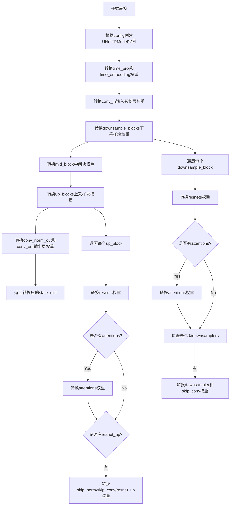

#### 带注释源码

```python
def convert_ncsnpp_checkpoint(checkpoint, config):
    """
    将NCSNPP格式的检查点转换为UNet2DModel格式
    
    参数:
        checkpoint: NCSNPP原始权重字典，键格式为"all_modules.{index}.{layer_name}"
        config: UNet2DModel的配置字典，包含模型架构参数
    
    返回:
        转换后的UNet2DModel状态字典
    """
    # 步骤1: 根据配置创建新的UNet2DModel实例
    new_model_architecture = UNet2DModel(**config)
    
    # 步骤2: 转换时间投影层(time_proj)和时间嵌入层(time_embedding)的权重
    # 这些层用于将噪声时间步转换为模型可处理的时间嵌入表示
    new_model_architecture.time_proj.W.data = checkpoint["all_modules.0.W"].data
    new_model_architecture.time_proj.weight.data = checkpoint["all_modules.0.W"].data
    new_model_architecture.time_embedding.linear_1.weight.data = checkpoint["all_modules.1.weight"].data
    new_model_architecture.time_embedding.linear_1.bias.data = checkpoint["all_modules.1.bias"].data
    new_model_architecture.time_embedding.linear_2.weight.data = checkpoint["all_modules.2.weight"].data
    new_model_architecture.time_embedding.linear_2.bias.data = checkpoint["all_modules.2.bias"].data
    
    # 步骤3: 转换输入卷积层(conv_in)的权重
    new_model_architecture.conv_in.weight.data = checkpoint["all_modules.3.weight"].data
    new_model_architecture.conv_in.bias.data = checkpoint["all_modules.3.bias"].data
    
    # 步骤4: 转换输出归一化层和输出卷积层的权重
    # 注意: 这里通过动态获取keys末尾的元素来定位权重位置
    new_model_architecture.conv_norm_out.weight.data = checkpoint[list(checkpoint.keys())[-4]].data
    new_model_architecture.conv_norm_out.bias.data = checkpoint[list(checkpoint.keys())[-3]].data
    new_model_architecture.conv_out.weight.data = checkpoint[list(checkpoint.keys())[-2]].data
    new_model_architecture.conv_out.bias.data = checkpoint[list(checkpoint.keys())[-1]].data
    
    # 初始化模块索引，从4开始（因为0-3已经被前述层占用）
    module_index = 4
    
    # 定义内部函数: 设置注意力层权重
    def set_attention_weights(new_layer, old_checkpoint, index):
        """
        设置注意力机制(Attention)的权重
        包含query、key、value三个投影层和一个输出投影层
        注意: NCSNPP中使用NIN(Network in Network)结构，需要转置权重
        """
        new_layer.query.weight.data = old_checkpoint[f"all_modules.{index}.NIN_0.W"].data.T
        new_layer.key.weight.data = old_checkpoint[f"all_modules.{index}.NIN_1.W"].data.T
        new_layer.value.weight.data = old_checkpoint[f"all_modules.{index}.NIN_2.W"].data.T
        
        new_layer.query.bias.data = old_checkpoint[f"all_modules.{index}.NIN_0.b"].data
        new_layer.key.bias.data = old_checkpoint[f"all_modules.{index}.NIN_1.b"].data
        new_layer.value.bias.data = old_checkpoint[f"all_modules.{index}.NIN_2.b"].data
        
        new_layer.proj_attn.weight.data = old_checkpoint[f"all_modules.{index}.NIN_3.W"].data.T
        new_layer.proj_attn.bias.data = old_checkpoint[f"all_modules.{index}.NIN_3.b"].data
        
        new_layer.group_norm.weight.data = old_checkpoint[f"all_modules.{index}.GroupNorm_0.weight"].data
        new_layer.group_norm.bias.data = old_checkpoint[f"all_modules.{index}.GroupNorm_0.bias"].data
    
    # 定义内部函数: 设置ResNet块权重
    def set_resnet_weights(new_layer, old_checkpoint, index):
        """
        设置ResNet残差块的权重
        包含两个卷积层、两个归一化层和一个时间嵌入投影层
        可能包含shortcut连接卷积（当输入输出通道不同时）
        """
        new_layer.conv1.weight.data = old_checkpoint[f"all_modules.{index}.Conv_0.weight"].data
        new_layer.conv1.bias.data = old_checkpoint[f"all_modules.{index}.Conv_0.bias"].data
        new_layer.norm1.weight.data = old_checkpoint[f"all_modules.{index}.GroupNorm_0.weight"].data
        new_layer.norm1.bias.data = old_checkpoint[f"all_modules.{index}.GroupNorm_0.bias"].data
        
        new_layer.conv2.weight.data = old_checkpoint[f"all_modules.{index}.Conv_1.weight"].data
        new_layer.conv2.bias.data = old_checkpoint[f"all_modules.{index}.Conv_1.bias"].data
        new_layer.norm2.weight.data = old_checkpoint[f"all_modules.{index}.GroupNorm_1.weight"].data
        new_layer.norm2.bias.data = old_checkpoint[f"all_modules.{index}.GroupNorm_1.bias"].data
        
        new_layer.time_emb_proj.weight.data = old_checkpoint[f"all_modules.{index}.Dense_0.weight"].data
        new_layer.time_emb_proj.bias.data = old_checkpoint[f"all_modules.{index}.Dense_0.bias"].data
        
        # 处理输入输出通道不一致或存在上/下采样的情况，需要shortcut卷积
        if new_layer.in_channels != new_layer.out_channels or new_layer.up or new_layer.down:
            new_layer.conv_shortcut.weight.data = old_checkpoint[f"all_modules.{index}.Conv_2.weight"].data
            new_layer.conv_shortcut.bias.data = old_checkpoint[f"all_modules.{index}.Conv_2.bias"].data
    
    # 步骤5: 转换下采样块(downsample_blocks)的权重
    for i, block in enumerate(new_model_architecture.downsample_blocks):
        has_attentions = hasattr(block, "attentions")
        for j in range(len(block.resnets)):
            set_resnet_weights(block.resnets[j], checkpoint, module_index)
            module_index += 1
            # 如果存在注意力层，则转换注意力权重
            if has_attentions:
                set_attention_weights(block.attentions[j], checkpoint, module_index)
                module_index += 1
        
        # 处理下采样器
        if hasattr(block, "downsamplers") and block.downsamplers is not None:
            set_resnet_weights(block.resnet_down, checkpoint, module_index)
            module_index += 1
            block.skip_conv.weight.data = checkpoint[f"all_modules.{module_index}.Conv_0.weight"].data
            block.skip_conv.bias.data = checkpoint[f"all_modules.{module_index}.Conv_0.bias"].data
            module_index += 1
    
    # 步骤6: 转换中间块(mid_block)的权重
    set_resnet_weights(new_model_architecture.mid_block.resnets[0], checkpoint, module_index)
    module_index += 1
    set_attention_weights(new_model_architecture.mid_block.attentions[0], checkpoint, module_index)
    module_index += 1
    set_resnet_weights(new_model_architecture.mid_block.resnets[1], checkpoint, module_index)
    module_index += 1
    
    # 步骤7: 转换上采样块(up_blocks)的权重
    for i, block in enumerate(new_model_architecture.up_blocks):
        has_attentions = hasattr(block, "attentions")
        for j in range(len(block.resnets)):
            set_resnet_weights(block.resnets[j], checkpoint, module_index)
            module_index += 1
        # 上采样块中的注意力层处理方式与下采样不同（只取第一个注意力层）
        if has_attentions:
            set_attention_weights(
                block.attentions[0], checkpoint, module_index
            )  # why can there only be a single attention layer for up?
            module_index += 1
        
        # 处理上采样残差块
        if hasattr(block, "resnet_up") and block.resnet_up is not None:
            block.skip_norm.weight.data = checkpoint[f"all_modules.{module_index}.weight"].data
            block.skip_norm.bias.data = checkpoint[f"all_modules.{module_index}.bias"].data
            module_index += 1
            block.skip_conv.weight.data = checkpoint[f"all_modules.{module_index}.weight"].data
            block.skip_conv.bias.data = checkpoint[f"all_modules.{module_index}.bias"].data
            module_index += 1
            set_resnet_weights(block.resnet_up, checkpoint, module_index)
            module_index += 1
    
    # 步骤8: 重新转换输出层（确保权重正确覆盖）
    new_model_architecture.conv_norm_out.weight.data = checkpoint[f"all_modules.{module_index}.weight"].data
    new_model_architecture.conv_norm_out.bias.data = checkpoint[f"all_modules.{module_index}.bias"].data
    module_index += 1
    new_model_architecture.conv_out.weight.data = checkpoint[f"all_modules.{module_index}.weight"].data
    new_model_architecture.conv_out.bias.data = checkpoint[f"all_modules.{module_index}.bias"].data
    
    # 返回转换后的状态字典
    return new_model_architecture.state_dict()
```


### `set_attention_weights`

该内部函数用于将旧版NCSNPP检查点中的注意力机制权重（包括query、key、value、proj_attn和group_norm）迁移到新的UNet2DModel架构的对应层中，通过键名索引并转置权重矩阵完成参数映射。

参数：

- `new_layer`：`torch.nn.Module`，新的注意力层对象，包含query、key、value、proj_attn和group_norm子模块
- `old_checkpoint`：`Dict[str, torch.Tensor]` ，旧版NCSNPP检查点的状态字典，键名格式为"all_modules.{index}.{component_name}"
- `index`：`int`，模块索引，用于从检查点中定位对应的权重键

返回值：`None`，该函数直接修改`new_layer`的参数，不返回任何值

#### 流程图

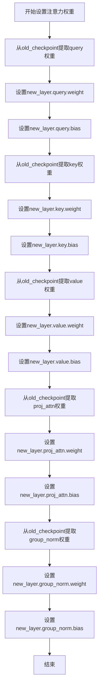

#### 带注释源码

```python
def set_attention_weights(new_layer, old_checkpoint, index):
    """
    设置注意力机制的权重参数
    
    参数:
        new_layer: 新的注意力层对象
        old_checkpoint: 旧版检查点字典
        index: 模块索引用于构建键名
    """
    # 设置Query权重：提取NIN_0.W并转置后赋值
    new_layer.query.weight.data = old_checkpoint[f"all_modules.{index}.NIN_0.W"].data.T
    
    # 设置Key权重：提取NIN_1.W并转置后赋值
    new_layer.key.weight.data = old_checkpoint[f"all_modules.{index}.NIN_1.W"].data.T
    
    # 设置Value权重：提取NIN_2.W并转置后赋值
    new_layer.value.weight.data = old_checkpoint[f"all_modules.{index}.NIN_2.W"].data.T
    
    # 设置Query偏置
    new_layer.query.bias.data = old_checkpoint[f"all_modules.{index}.NIN_0.b"].data
    
    # 设置Key偏置
    new_layer.key.bias.data = old_checkpoint[f"all_modules.{index}.NIN_1.b"].data
    
    # 设置Value偏置
    new_layer.value.bias.data = old_checkpoint[f"all_modules.{index}.NIN_2.b"].data
    
    # 设置注意力投影层权重（NIN_3）
    new_layer.proj_attn.weight.data = old_checkpoint[f"all_modules.{index}.NIN_3.W"].data.T
    
    # 设置注意力投影层偏置
    new_layer.proj_attn.bias.data = old_checkpoint[f"all_modules.{index}.NIN_3.b"].data
    
    # 设置GroupNorm权重
    new_layer.group_norm.weight.data = old_checkpoint[f"all_modules.{index}.GroupNorm_0.weight"].data
    
    # 设置GroupNorm偏置
    new_layer.group_norm.bias.data = old_checkpoint[f"all_modules.{index}.GroupNorm_0.bias"].data
```


### `set_resnet_weights`

该函数是一个内部辅助函数，用于将预训练的 NCSNPP (Noise Conditional Score Network with Pointwise Noise) 检查点中的 ResNet 块权重迁移到新的 `UNet2DModel` 架构中。它负责设置 ResNet 块的卷积层、归一化层和时间嵌入投影层的权重数据。

参数：

- `new_layer`：对象，目标模型的 ResNet 层（通常为 `ResNetBlock2D` 类型），包含 `conv1`、`conv2`、`norm1`、`norm2`、`time_emb_proj` 等属性，用于接收从旧检查点迁移过来的权重。
- `old_checkpoint`：字典，键为字符串，值为 `torch.Tensor`，存储旧模型的所有权重参数。
- `index`：整数，表示当前正在处理的模块在旧检查点中的索引位置，用于构造访问旧权重的键名（如 `"all_modules.{index}.Conv_0.weight"`）。

返回值：`None`，该函数直接修改 `new_layer` 对象的属性，不返回任何值。

#### 流程图

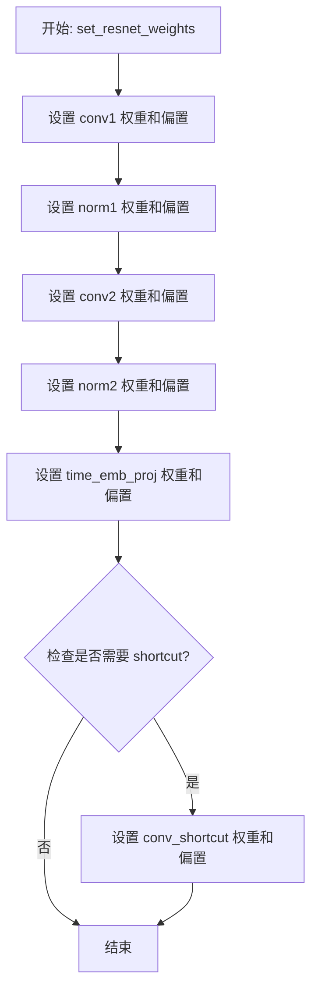

#### 带注释源码

```python
def set_resnet_weights(new_layer, old_checkpoint, index):
    """
    将旧检查点中的 ResNet 块权重迁移到新模型层
    
    参数:
        new_layer: 新模型中的 ResNet 层对象
        old_checkpoint: 旧模型的完整检查点字典
        index: 当前模块在检查点中的索引
    """
    
    # ===== 设置第一个卷积层 (conv1) =====
    # 对应旧检查点中的 Conv_0 层
    new_layer.conv1.weight.data = old_checkpoint[f"all_modules.{index}.Conv_0.weight"].data
    new_layer.conv1.bias.data = old_checkpoint[f"all_modules.{index}.Conv_0.bias"].data
    
    # ===== 设置第一个归一化层 (norm1) =====
    # 对应旧检查点中的 GroupNorm_0 层
    new_layer.norm1.weight.data = old_checkpoint[f"all_modules.{index}.GroupNorm_0.weight"].data
    new_layer.norm1.bias.data = old_checkpoint[f"all_modules.{index}.GroupNorm_0.bias"].data
    
    # ===== 设置第二个卷积层 (conv2) =====
    # 对应旧检查点中的 Conv_1 层
    new_layer.conv2.weight.data = old_checkpoint[f"all_modules.{index}.Conv_1.weight"].data
    new_layer.conv2.bias.data = old_checkpoint[f"all_modules.{index}.Conv_1.bias"].data
    
    # ===== 设置第二个归一化层 (norm2) =====
    # 对应旧检查点中的 GroupNorm_1 层
    new_layer.norm2.weight.data = old_checkpoint[f"all_modules.{index}.GroupNorm_1.weight"].data
    new_layer.norm2.bias.data = old_checkpoint[f"all_modules.{index}.GroupNorm_1.bias"].data
    
    # ===== 设置时间嵌入投影层 (time_emb_proj) =====
    # 对应旧检查点中的 Dense_0 层（线性层）
    new_layer.time_emb_proj.weight.data = old_checkpoint[f"all_modules.{index}.Dense_0.weight"].data
    new_layer.time_emb_proj.bias.data = old_checkpoint[f"all_modules.{index}.Dense_0.bias"].data
    
    # ===== 处理 Shortcut 连接 =====
    # 仅当输入输出通道不一致或存在上/下采样时需要
    if new_layer.in_channels != new_layer.out_channels or new_layer.up or new_layer.down:
        new_layer.conv_shortcut.weight.data = old_checkpoint[f"all_modules.{index}.Conv_2.weight"].data
        new_layer.conv_shortcut.bias.data = old_checkpoint[f"all_modules.{index}.Conv_2.bias"].data
```


### `argparse.ArgumentParser`

创建命令行参数解析器，用于定义和管理脚本的命令行接口。

参数：

- `prog`：`str`，（可选）程序名称，默认从 `sys.argv[0]` 推断
- `description`：`str`，（可选）帮助文档前显示的程序描述
- `epilog`：`str`，（可选）帮助文档后显示的文本
- `parents`：`list[argparse.ArgumentParser]`，（可选）继承其参数的父解析器列表
- `formatter_class`：`type`，（可选）用于自定义帮助格式的类
- `prefix_chars`：`str`，（可选）可选参数的前缀字符集，默认是 '-'
- `fromfile_prefix_chars`：`str`，（可选）标识文件参数的字符，用于从文件读取参数
- `argument_default`：`any`，（可选）参数的全局默认值
- `conflict_handler`：`str`，（可选）解决冲突策略，通常为 "error" 或 "resolve"
- `add_help`：`bool`，（可选）是否为解析器添加 -h/--help 选项，默认 True

返回值：`argparse.ArgumentParser`，返回配置好的参数解析器对象

#### 流程图

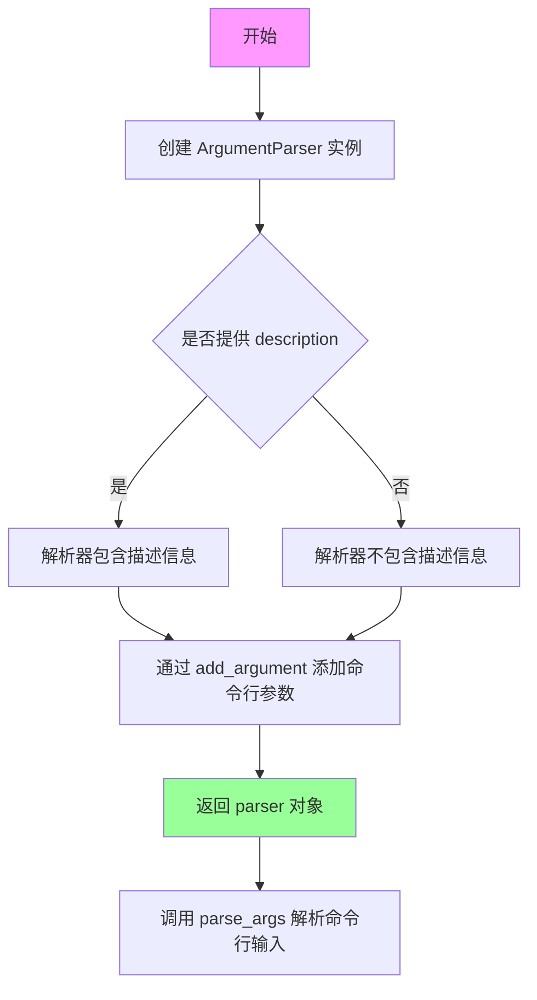

#### 带注释源码

```python
# coding=utf-8
# 创建命令行参数解析器实例
# 这里使用了默认参数，未显式传入任何参数
parser = argparse.ArgumentParser()

# 添加第一个命令行参数：checkpoint_path
# 用于指定要转换的检查点文件的路径
parser.add_argument(
    "--checkpoint_path",                              # 命令行参数名
    default="/Users/arthurzucker/Work/diffusers/ArthurZ/diffusion_pytorch_model.bin",  # 默认值
    type=str,                                         # 参数类型为字符串
    required=False,                                   # 参数是可选的
    help="Path to the checkpoint to convert.",        # 帮助文档描述
)

# 添加第二个命令行参数：config_file
# 用于指定模型架构的配置文件路径
parser.add_argument(
    "--config_file",
    default="/Users/arthurzucker/Work/diffusers/ArthurZ/config.json",
    type=str,
    required=False,
    help="The config json file corresponding to the architecture.",
)

# 添加第三个命令行参数：dump_path
# 用于指定转换后模型的输出路径
parser.add_argument(
    "--dump_path",
    default="/Users/arthurzucker/Work/diffusers/ArthurZ/diffusion_model_new.pt",
    type=str,
    required=False,
    help="Path to the output model.",
)

# 解析命令行参数
# 将命令行传入的参数解析为 Namespace 对象
args = parser.parse_args()

# 访问解析后的参数
# 例如：args.checkpoint_path, args.config_file, args.dump_path
```


### `parser.parse_args()`

解析从命令行传入的参数，将用户提供的 `--checkpoint_path`、`--config_file` 和 `--dump_path` 参数转换为一个命名空间对象，供后续代码使用。

参数：

- （无额外参数，使用 `sys.argv` 默认值）

返回值：`Namespace`，一个包含所有命令行参数值的命名空间对象，其中属性名称对应于 `add_argument()` 中定义的参数名称（如 `checkpoint_path`、`config_file`、`dump_path`）。

#### 流程图

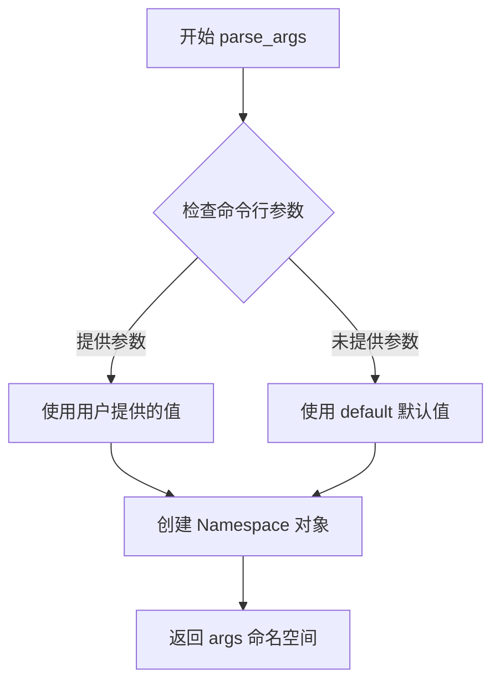

#### 带注释源码

```python
# 创建 ArgumentParser 实例
parser = argparse.ArgumentParser()

# 添加 --checkpoint_path 参数
parser.add_argument(
    "--checkpoint_path",
    default="/Users/arthurzucker/Work/diffusers/ArthurZ/diffusion_pytorch_model.bin",
    type=str,
    required=False,
    help="Path to the checkpoint to convert.",
)

# 添加 --config_file 参数
parser.add_argument(
    "--config_file",
    default="/Users/arthurzucker/Work/diffusers/ArthurZ/config.json",
    type=str,
    required=False,
    help="The config json file corresponding to the architecture.",
)

# 添加 --dump_path 参数
parser.add_argument(
    "--dump_path",
    default="/Users/arthurzucker/Work/diffusers/ArthurZ/diffusion_model_new.pt",
    type=str,
    required=False,
    help="Path to the output model.",
)

# 解析命令行参数，返回包含所有参数值的 Namespace 对象
args = parser.parse_args()

# 解析后的 args 对象结构示例：
# args.checkpoint_path  -> "/Users/arthurzucker/Work/diffusers/ArthurZ/diffusion_pytorch_model.bin"
# args.config_file      -> "/Users/arthurzucker/Work/diffusers/ArthurZ/config.json"
# args.dump_path        -> "/Users/arthurzucker/Work/diffusers/ArthurZ/diffusion_model_new.pt"
```


### `torch.load`

加载检查点文件，将其从存储设备加载到指定的设备（CPU）中，返回一个包含模型权重和参数的Python对象。

#### 参数

- `args.checkpoint_path`：`str`，检查点文件的路径，指向需要加载的模型权重文件（如`.bin`、`.pt`或`.pth`文件）
- `map_location`：`str`，指定如何重新映射存储位置，这里设置为`'cpu'`表示将所有张量加载到CPU内存中

#### 返回值

- `checkpoint`：`dict` 或 `Object`，从检查点文件中反序列化得到的对象，通常是一个包含模型权重、优化器状态或其他训练元数据的字典

#### 流程图

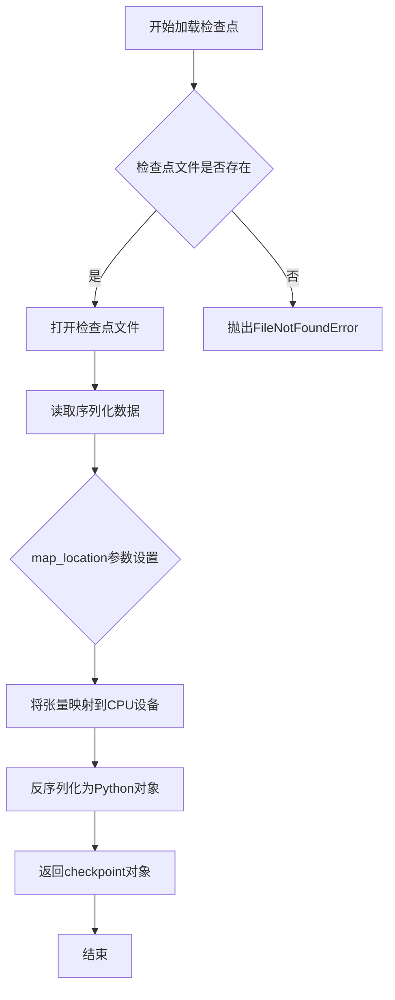

#### 带注释源码

```python
# 从命令行参数中获取检查点文件的路径
# args.checkpoint_path 来自 argparse，默认为 "/Users/arthurzucker/Work/diffusers/ArthurZ/diffusion_pytorch_model.bin"
checkpoint = torch.load(args.checkpoint_path, map_location="cpu")
# 说明：
# 1. torch.load 是 PyTorch 提供的用于加载序列化对象的函数
# 2. args.checkpoint_path 指定要加载的检查点文件路径
# 3. map_location="cpu" 确保所有存储的张量都被映射到 CPU 上，无论它们原始保存在什么设备上
# 4. 返回的 checkpoint 通常是一个字典，包含模型权重（如 "state_dict"）或其他训练状态信息
# 5. 加载后的 checkpoint 可用于模型权重初始化、状态恢复或转换为其他格式
```


### `json.loads(f.read())` - 解析 JSON 配置文件

该代码片段位于主程序块中，用于读取并解析 JSON 格式的模型配置文件，将其转换为 Python 字典对象供后续模型初始化使用。

参数：

- `f.read()`：`str`，从打开的配置文件中读取的原始 JSON 字符串内容

返回值：`dict`，解析后的 JSON 配置对象，包含模型的架构参数（如 `in_channels`、`out_channels`、`down_block_types` 等）

#### 流程图

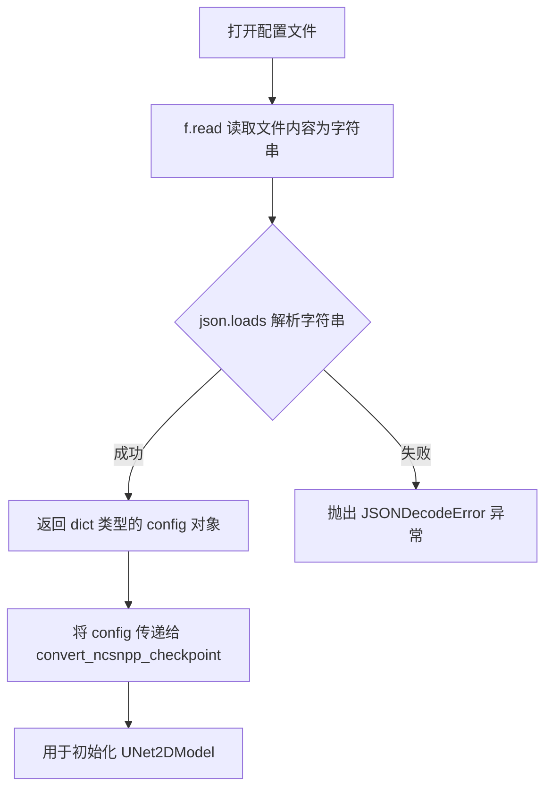

#### 带注释源码

```python
# 打开配置文件，config_file 来自命令行参数 --config_file
with open(args.config_file) as f:
    # f.read() 读取文件全部内容，返回 str 类型的原始 JSON 字符串
    # json.loads() 将 JSON 字符串解析为 Python dict 对象
    config = json.loads(f.read())

# 解析后的 config 是一个字典，包含了 UNet2DModel 的配置参数
# 例如: {"in_channels": 3, "out_channels": 3, "down_block_types": [...], ...}
# 该 config 后续用于:
#   1. 创建新的 UNet2DModel 实例: UNet2DModel(**config)
#   2. 传递给 convert_ncsnpp_checkpoint 函数进行权重转换
```


### `UNet2DModel(**config)`

该函数用于根据配置文件创建一个新的 UNet2DModel 实例，这是将 NCSNPP（Noise Conditional Score Network with Positional Encoding）检查点转换为 Diffusers 格式模型的关键步骤，通过接收包含模型架构参数的字典来实例化 UNet2DModel 对象。

参数：

- `config`：`dict`，来自 JSON 配置文件的参数字典，包含模型的架构配置（如层数、通道数、注意力机制等）

返回值：`UNet2DModel`，新创建的 UNet2DModel 模型实例

#### 流程图

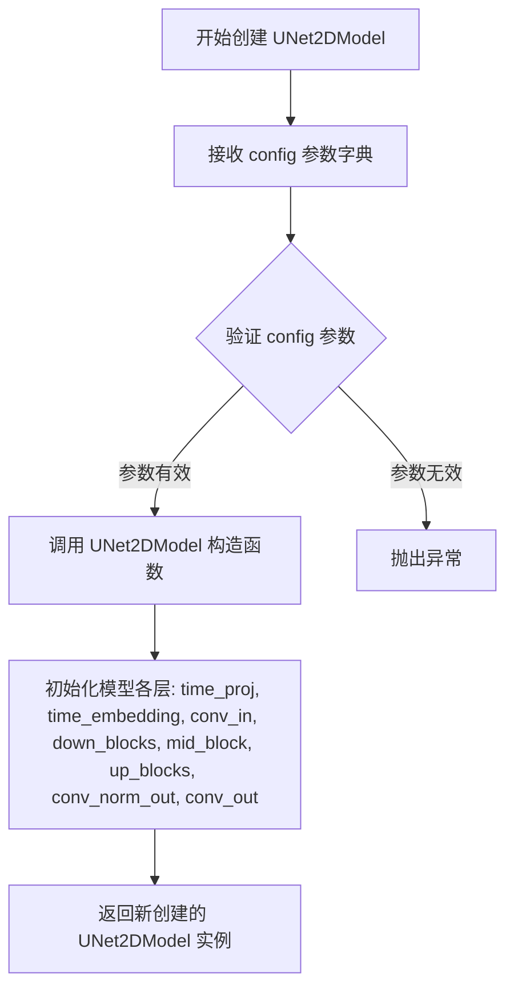

#### 带注释源码

```python
# 在 convert_ncsnpp_checkpoint 函数中
# 第32行：使用配置文件创建 UNet2DModel 实例
new_model_architecture = UNet2DModel(**config)  # **config 将字典解包为关键字参数

# 在主函数中
# 第157行：基于配置创建模型，用于加载转换后的权重
model = UNet2DModel(**config)  # 创建模型结构
model.load_state_dict(converted_checkpoint)  # 加载转换后的权重
```

#### 详细说明

**调用位置上下文：**

1. **转换函数内部**（第32行）：
   ```python
   new_model_architecture = UNet2DModel(**config)
   ```
   创建一个新的模型架构对象，用于从旧的检查点复制权重。

2. **主程序**（第157行）：
   ```python
   model = UNet2DModel(**config)
   model.load_state_dict(converted_checkpoint)
   ```
   创建模型并加载转换后的权重，然后保存为 Diffusers 格式。

**config 参数典型结构（来自 JSON 配置文件）：**
- `in_channels`：输入通道数
- `out_channels`：输出通道数  
- `down_block_types`：下采样块类型
- `up_block_types`：上采样块类型
- `layers_per_block`：每块层数
- `block_out_channels`：块输出通道数
- `attention_head_dim`：注意力头维度
- 其它架构相关参数

**技术债务与优化空间：**

1. **硬编码路径**：检查点路径和配置文件路径在代码中硬编码，应通过命令行参数或配置文件管理
2. **异常处理过于宽泛**：`except: # noqa: E722` 捕获所有异常，不利于调试
3. **权重复制顺序依赖**：代码假设检查点中的模块顺序，如果顺序变化会失败
4. **缺乏验证**：创建模型前未验证 config 字典的完整性和有效性


### `UNet2DModel.load_state_dict`

将转换后的检查点权重加载到 UNet2DModel 模型中。该方法是 PyTorch 模型的标准的权重加载接口，用于将保存的权重字典映射到模型的参数中，实现模型状态的恢复或迁移。

参数：

- `state_dict`：`Dict[str, torch.Tensor]`，包含模型参数的键值对字典，键为参数名称（如 `conv_in.weight`），值为对应的权重张量
- `strict`：`bool`（可选），是否严格匹配键值，默认为 `True`，若为 `False` 则允许忽略某些不匹配的键
- `assign`：`bool`（可选），是否将加载的值直接分配给模型参数，默认为 `False`

返回值：`None`，无返回值。该方法直接修改模型对象的内部状态，不返回任何值。

#### 流程图

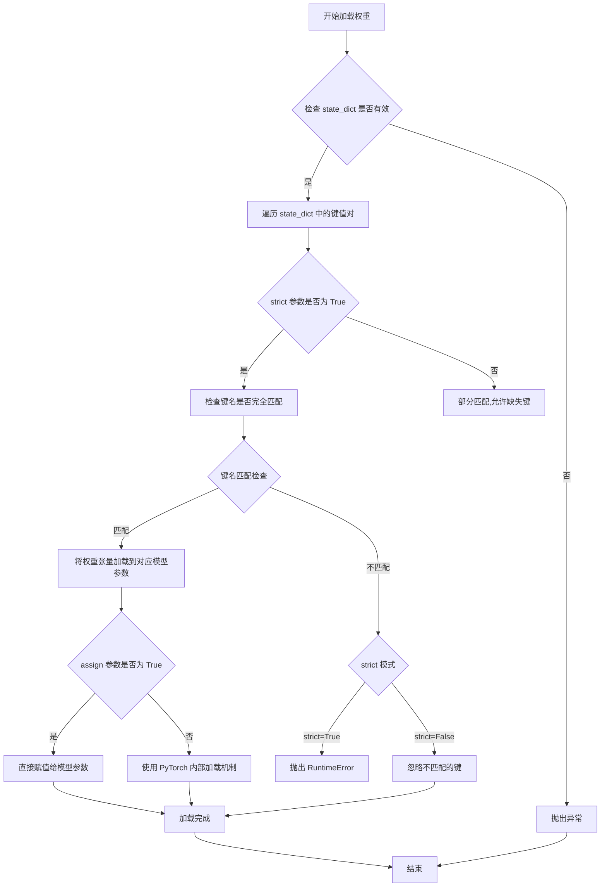

#### 带注释源码

```python
# 加载转换后的检查点到模型
# model: UNet2DModel 实例，已通过 config 初始化
# converted_checkpoint: Dict[str, Tensor]，包含转换后的模型权重

# 示例代码上下文：
# model = UNet2DModel(**config)
# converted_checkpoint = convert_ncsnpp_checkpoint(checkpoint, config)
# model.load_state_dict(converted_checkpoint)

# PyTorch nn.Module.load_state_dict 方法的标准实现逻辑：
def load_state_dict(self, state_dict, strict=True, assign=False):
    """
    将 state_dict 中的参数加载到模型中。
    
    参数:
        state_dict (dict): 包含模型参数的字典，键为参数名称，值为参数张量
        strict (bool): 是否严格匹配键名，默认为 True
        assign (bool): 是否将加载的值分配给模型参数，默认为 False
    
    返回:
        None: 直接修改模型实例的内部状态
    """
    
    # 1. 检查 state_dict 是否为字典类型
    if not isinstance(state_dict, dict):
        raise TypeError(f"state_dict 必须是 dict 类型，而不是 {type(state_dict)}")
    
    # 2. 如果 strict=True，则检查键名是否完全匹配
    if strict:
        # 检查模型期望的键和提供的键是否一致
        model_keys = set(self.state_dict().keys())
        checkpoint_keys = set(state_dict.keys())
        
        # 找出不匹配的键
        missing_keys = model_keys - checkpoint_keys
        unexpected_keys = checkpoint_keys - model_keys
        
        if missing_keys:
            raise RuntimeError(f"缺少以下键: {missing_keys}")
        if unexpected_keys:
            raise RuntimeError(f"出现意外键: {unexpected_keys}")
    
    # 3. 遍历 state_dict 并加载每个参数
    for key, value in state_dict.items():
        # 获取模型中对应的参数对象
        param = self.get_parameter(key) if hasattr(self, key) else None
        if param is None:
            param = self.get_buffer(key) if hasattr(self, key) else None
        
        if param is not None:
            # 4. 根据 assign 参数决定加载方式
            if assign:
                # 直接赋值，使用新的张量对象
                if hasattr(param, 'data'):
                    param.data = value
                else:
                    param = value
            else:
                # 复制张量数据，保留原参数对象
                param.copy_(value)
    
    # 5. 加载完成，模型状态已更新
    # 注意：此方法无返回值
```

> **注**：上述源码为 `load_state_dict` 方法的逻辑示意，实际实现位于 PyTorch 库的 `torch.nn.Module` 类中。该方法是 PyTorch 模型的基类方法，此处调用实现了从 `converted_checkpoint` 字典到 `model` 对象的权重迁移，使转换后的权重能够被模型正确使用。


### `ScoreSdeVeScheduler.from_config()`

从指定路径加载调度器配置文件，并创建并返回 `ScoreSdeVeScheduler` 实例。

参数：

- `config`：`str` 或 `dict`，配置文件的路径或配置字典，用于初始化调度器参数
- `scheduler_config_path`：`str`，指向包含 `scheduler_config.json` 文件的目录路径

返回值：`ScoreSdeVeScheduler`，返回新创建的调度器实例，包含从配置加载的噪声调度参数

#### 流程图

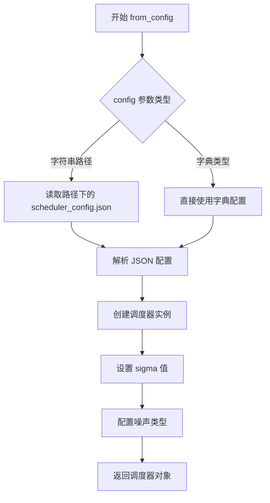

#### 带注释源码

```python
# 注意：此源码基于 diffusers 库中的实现，from_config 是类方法
# 在当前转换脚本中的调用方式：
scheduler = ScoreSdeVeScheduler.from_config("/".join(args.checkpoint_path.split("/")[:-1]))

# from_config 方法的典型实现逻辑：
@classmethod
def from_config(cls, config_path_or_dict):
    """
    从配置文件创建调度器实例
    
    参数:
        config_path_or_dict: 配置文件路径或配置字典
    返回:
        调度器实例
    """
    # 如果是路径，则加载 JSON 文件
    if isinstance(config_path_or_dict, str):
        with open(os.path.join(config_path_or_path, "scheduler_config.json")) as f:
            config = json.load(f)
    else:
        config = config_path_or_dict
    
    # 创建调度器实例
    return cls(**config)
```


### `ScoreSdeVePipeline`

ScoreSdeVePipeline 是 Hugging Face Diffusers 库中的一个管道类，用于实现基于随机微分方程（SDE）的分数生成建模（Score-Based Generative Modeling through SDE）。该构造函数接收训练好的 UNet2DModel 和 ScoreSdeVeScheduler，创建一个完整的推理管道，用于从噪声图像逐步去噪生成目标图像。

参数：

-  `unet`：`UNet2DModel`，预训练的 UNet2DModel 模型实例，负责预测给定噪声输入的分数（score）
-  `scheduler`：`ScoreSdeVeScheduler`，Score SDE VE 调度器实例，管理扩散过程的噪声调度和采样步骤

返回值：`ScoreSdeVePipeline`，返回创建的完整扩散管道对象，包含模型和调度器，可直接用于图像生成

#### 流程图

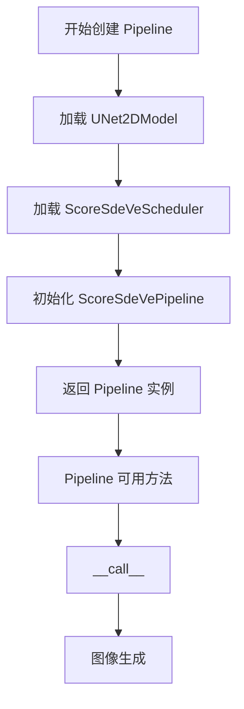

#### 带注释源码

```python
# 这是从原始代码中提取的 Pipeline 创建部分
# 位于 if __name__ == "__main__": 代码块的末尾

# 尝试从检查点目录加载 ScoreSdeVeScheduler 配置
try:
    # 根据检查点路径构建配置目录并加载调度器
    scheduler = ScoreSdeVeScheduler.from_config("/".join(args.checkpoint_path.split("/")[:-1]))

    # 创建完整的 ScoreSdeVePipeline
    # 参数说明：
    #   - unet: 已加载权重并转换的 UNet2DModel 模型
    #   - scheduler: 从配置目录加载的 ScoreSdeVeScheduler 调度器
    pipe = ScoreSdeVePipeline(unet=model, scheduler=scheduler)
    
    # 将完整 Pipeline 保存到指定目录
    pipe.save_pretrained(args.dump_path)
    
# 如果加载调度器失败（可能是非 SDE-VE 类型的模型）
except:  # noqa: E722
    # 仅保存模型权重到指定目录
    model.save_pretrained(args.dump_path)
```

#### 补充说明

该函数/类的典型使用流程：

1. **模型加载**：首先通过 `convert_ncsnpp_checkpoint` 将旧版 NCSNPP 检查点转换为兼容格式
2. **模型初始化**：使用配置创建新的 UNet2DModel 并加载转换后的权重
3. **调度器创建**：从预训练目录加载 ScoreSdeVeScheduler 配置
4. **管道组装**：将模型和调度器组合成完整的 ScoreSdeVePipeline
5. **保存/推理**：保存管道以供后续使用，或直接调用进行图像生成


### `ScoreSdeVePipeline.save_pretrained`

描述：保存 ScoreSdeVePipeline 模型及其组件（UNet 模型和 ScoreSdeVeScheduler）到指定路径，以便后续加载和使用。

参数：
- `save_directory`：`str`，即代码中的 `args.dump_path`，指定保存模型的目录路径。

返回值：`None`，该方法直接保存模型到磁盘，不返回任何值。

#### 流程图

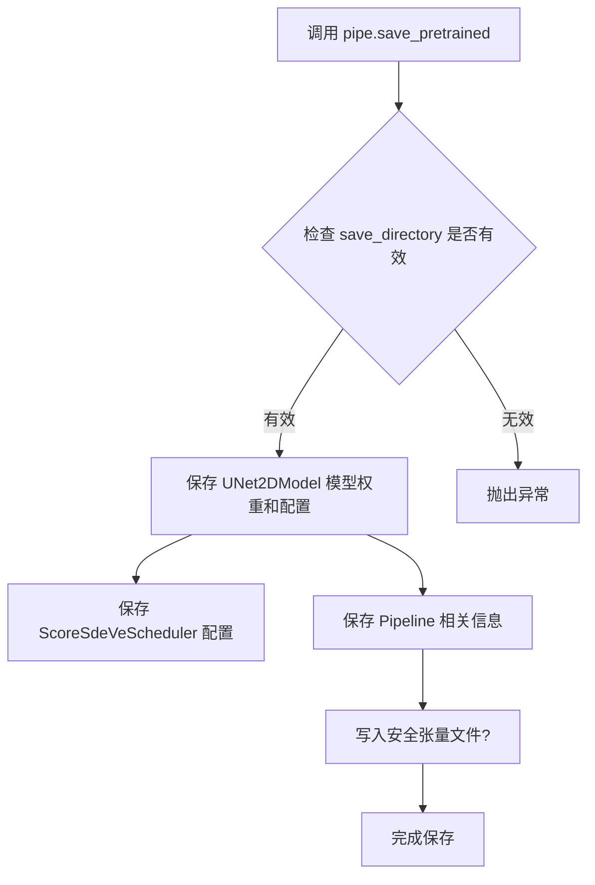

#### 带注释源码

```python
# 尝试加载 ScoreSdeVeScheduler 配置，路径基于 checkpoint_path 的目录
try:
    scheduler = ScoreSdeVeScheduler.from_config("/".join(args.checkpoint_path.split("/")[:-1]))

    # 创建 ScoreSdeVePipeline 管道，包含模型和调度器
    pipe = ScoreSdeVePipeline(unet=model, scheduler=scheduler)
    
    # 调用 save_pretrained 方法，将管道所有组件保存到指定目录
    # 这会保存 unet、scheduler 以及其他配置信息到 args.dump_path
    pipe.save_pretrained(args.dump_path)
except:  # noqa: E722
    # 如果失败（例如找不到调度器配置），则只保存 UNet2DModel
    model.save_pretrained(args.dump_path)
```


### `UNet2DModel.save_pretrained`

将 UNet2DModel 模型权重和配置保存到指定目录的函数。该方法继承自 PyTorch Transformer 库的 PreTrainedModel 基类，用于模型的持久化存储。

参数：

- `save_directory`：`str`，保存模型的目录路径，代码中传入 `args.dump_path`（值为 `/Users/arthurzucker/Work/diffusers/ArthurZ/diffusion_model_new.pt`）
- `max_shard_size`：可选，`int` 或 `str`，单个分片的最大大小，默认为 "10GB"
- `safe_serialization`：可选，`bool`，是否安全序列化（使用 safetensors），默认为 True
- `kwargs`：其他可选参数，如 `push_to_hub`、`config` 等

返回值：`None`，无返回值（直接写入文件系统）

#### 流程图

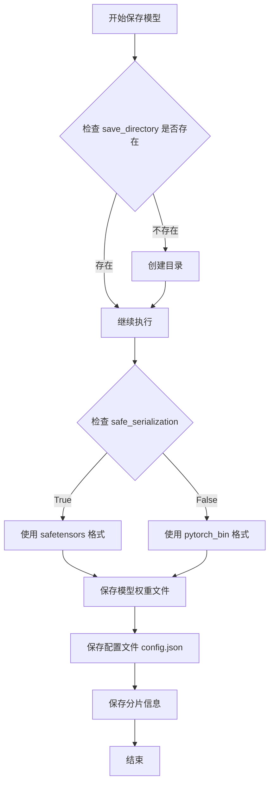

#### 带注释源码

```python
# 在代码中的调用位置（位于 if __name__ == "__main__" 块中）
# 这是一个异常处理流程：
# 1. 尝试加载 ScoreSdeVeScheduler 并创建完整的 ScoreSdeVePipeline
# 2. 如果成功，则使用 pipe.save_pretrained() 保存完整管道
# 3. 如果失败（抛出异常），则退而求其次，只保存 model 本身

try:
    # 尝试从检查点目录加载 SDE-VE 调度器配置
    scheduler = ScoreSdeVeScheduler.from_config("/".join(args.checkpoint_path.split("/")[:-1]))
    
    # 创建完整的扩散管道（包含 UNet 和 Scheduler）
    pipe = ScoreSdeVePipeline(unet=model, scheduler=scheduler)
    
    # 保存完整管道到指定路径（包含模型、调度器、配置等）
    pipe.save_pretrained(args.dump_path)
except:  # noqa: E722
    # 异常处理：如果上述失败（例如缺少调度器配置），则只保存 UNet2DModel
    # 此时调用的是 model 对象的 save_pretrained 方法
    model.save_pretrained(args.dump_path)
```

#### 补充说明

| 项目 | 说明 |
|------|------|
| **调用对象类型** | `UNet2DModel`（继承自 `PreTrainedModel`） |
| **所属类** | `diffusers.models.unets.unet_2d.UNet2DModel` |
| **调用场景** | 在转换脚本中将转换后的模型权重持久化到磁盘 |
| **输出文件** | 通常包含 `model.safetensors`（或 `pytorch_model.bin`）和 `config.json` |
| **设计目标** | 确保模型权重能够被后续代码正确加载（`model.from_pretrained`） |
| **潜在优化** | 当前使用裸 `except` 捕获所有异常，建议捕获具体异常类型以区分不同错误场景 |


## 关键组件


### 核心转换引擎 (convert_ncsnpp_checkpoint)

负责将NCSNPP旧版检查点的权重映射并转换到HuggingFace Diffusers的UNet2DModel架构，是整个脚本的核心功能模块，处理模型的时间嵌入、卷积层、归一化层等权重迁移。

### 注意力权重映射器 (set_attention_weights)

专门处理NCSNPP中自定义NIN（像素归一化）注意力层的权重转换，包括query、key、value三个投影矩阵的转置映射，以及proj_attn投影层和group_norm归一化层的权重迁移。

### 残差网络权重映射器 (set_resnet_weights)

处理ResNet块的权重转换，涵盖conv1/conv2卷积层、norm1/norm2归一化层、time_emb_proj时间嵌入投影层，以及可选的conv_shortcut快捷连接层的权重迁移。

### 下采样块处理器

遍历UNet2DModel的downsample_blocks，对每个block中的resnets和attentions层按顺序调用权重设置函数，处理可选的downsamplers和skip_conv层。

### 中间块处理器

专门处理UNet2DModel的mid_block，按顺序迁移resnets和attentions的权重，确保中间层的权重正确映射到新的模型架构。

### 上采样块处理器

遍历UNet2DModel的up_blocks，处理resnets、attentions以及可选的resnet_up、skip_norm、skip_conv层，支持上采样路径的权重迁移。

### 命令行参数解析器

通过argparse模块定义三个关键路径参数：checkpoint_path（原模型路径）、config_file（架构配置文件）、dump_path（转换后模型输出路径）。

### 管道组装器

在主程序中尝试加载ScoreSdeVeScheduler并组装ScoreSdeVePipeline，若失败则降级为仅保存UNet2DModel，具备优雅的错误处理机制。


## 问题及建议


### 已知问题

-   **硬编码的索引访问**：使用 `list(checkpoint.keys())[-4]`、`list(checkpoint.keys())[-3]` 等方式访问权重键，这种方式极度脆弱，如果键的顺序改变，代码会直接失败
-   **裸异常捕获**：`try...except: # noqa: E722` 捕获所有异常但不处理，会隐藏真实错误，导致难以调试
-   **缺失输入验证**：未对 `checkpoint_path`、`config_file` 的存在性进行检查，也未验证 checkpoint 是否包含所需的键
-   **魔法数字**：硬编码的起始索引 `module_index = 4` 依赖于特定的检查点结构，缺乏文档说明
-   **重复数据赋值**：`new_model_architecture.time_proj.W.data` 和 `new_model_architecture.time_proj.weight.data` 被赋值为相同的 checkpoint 数据，存在冗余
-   **缺失类型注解**：整个代码没有任何类型提示，降低了可维护性和可读性
-   **文档字符串不完整**：`convert_ncsnpp_checkpoint` 函数的文档字符串仅写了开头，没有描述参数和返回值
-   **硬编码路径**：默认路径是开发者个人路径，无实际意义且可能导致误用

### 优化建议

-   **重构索引访问方式**：使用明确的键名（如 `conv_norm_out.weight`、`conv_norm_out.bias`）或通过配置映射表来访问权重，避免依赖键的顺序
-   **添加输入验证**：在函数开始时检查必需键是否存在，提供有意义的错误信息
-   **替换裸异常捕获**：根据具体可能发生的异常类型（如 `FileNotFoundError`、`KeyError`）进行针对性捕获并处理
-   **提取配置映射**：将 checkpoint 键到模型层的映射关系提取为配置或字典，避免大量的 `if/else` 和硬编码
-   **添加类型注解**：为函数参数、返回值添加类型提示，提升代码可读性和 IDE 支持
-   **完善文档字符串**：为 `convert_ncsnpp_checkpoint` 添加完整的参数和返回值说明
-   **移除冗余赋值**：删除重复的权重赋值操作
-   **支持 GPU**：使用 `torch.load` 时可通过参数支持 CUDA 设备

## 其它


### 设计目标与约束

本转换脚本的核心目标是将 NCSNPP（Noise Conditional Score Network with Probabilistic Priors）预训练检查点从原始格式转换为 Hugging Face diffusers 库兼容的 UNet2DModel 格式。设计约束包括：1) 保持权重数据的原始数值精度；2) 确保转换后的模型结构与 diffusers 库的 UNet2DModel 架构完全兼容；3) 支持配置文件驱动的模型参数指定；4) 转换过程在 CPU 上执行以确保通用性。

### 错误处理与异常设计

脚本在以下关键点进行错误处理：1) 配置文件读取使用 try-except 块捕获 JSON 解析错误；2) 检查点加载使用 map_location="cpu" 确保跨设备兼容性；3) 最终的 Pipeline 保存逻辑使用空异常捕获（bare except），在 SDE 调度器初始化失败时降级为仅保存模型权重。主要问题：bare except 会隐藏所有真实错误信息，不利于调试；应使用具体的异常类型（如 ValueError、FileNotFoundError）进行针对性处理。

### 数据流与状态机

转换数据流如下：1) 加载原始检查点文件（torch.load）→ 2) 解析配置文件（json.loads）→ 3) 创建空模型实例（UNet2DModel）→ 4) 执行权重映射（convert_ncsnpp_checkpoint 函数）→ 5) 加载转换后的权重（load_state_dict）→ 6) 创建 Pipeline 并保存（save_pretrained）。状态机转换：初始状态（未加载）→ 配置加载状态 → 模型初始化状态 → 权重转换状态 → 最终保存状态。模块索引（module_index）作为状态追踪器，确保按顺序正确映射各层权重。

### 外部依赖与接口契约

本脚本依赖以下外部组件：1) torch（PyTorch）用于张量操作和模型加载；2) diffusers 库提供 UNet2DModel、ScoreSdeVePipeline、ScoreSdeVeScheduler 类；3) argparse 用于命令行参数解析；4) json 用于配置文件解析。接口契约：convert_ncsnpp_checkpoint(checkpoint, config) 接收检查点字典和配置字典，返回转换后的状态字典；命令行接口接受 --checkpoint_path、--config_file、--dump_path 三个参数。

### 性能考虑与优化空间

当前实现的主要性能问题：1) 多次使用 list(checkpoint.keys())[-4] 等动态键查找，增加计算开销；2) set_resnet_weights 和 set_attention_weights 函数存在大量重复的键名字符串拼接；3) 模块索引递增逻辑分散在不同位置，缺乏集中管理。优化建议：预先构建键名到权重的映射字典；使用枚举或常量定义模块类型；将动态键查找改为索引列表预计算。

### 兼容性说明

本脚本设计用于兼容 NCSNPP 系列的 Score-Based Generative Modeling 模型的旧检查点格式。与当前 diffusers 库版本的兼容性：通过 from_config 方法加载调度器时使用检查点路径的父目录作为配置源。潜在兼容性问题：1) 不同版本的 NCSNPP 模型可能有不同的权重命名约定；2) 配置文件格式变化可能导致转换失败；3) 新版 diffusers 库可能对 UNet2DModel 结构有细微调整。

### 使用示例与命令行接口

基本使用方式：python convert_ncsnpp_checkpoint.py --checkpoint_path /path/to/model.bin --config_file /path/to/config.json --dump_path /path/to/output。默认参数指向开发者本地路径，实际使用时请替换为实际文件路径。转换成功后输出为 Hugging Face Pipeline 格式目录，包含模型权重、配置文件和调度器配置。

### 测试策略建议

应添加以下测试用例：1) 使用标准 NCSNPP 检查点验证转换前后模型输出的数值一致性；2) 测试配置文件缺失或格式错误时的错误处理；3) 测试检查点文件损坏时的异常捕获；4) 验证转换后的模型在 diffusers 库中正常加载和推理；5) 测试不同配置的模型（如不同通道数、层数）的转换兼容性。

### 安全性考虑

当前代码未包含输入验证，存在以下潜在安全问题：1) checkpoint_path 和 config_file 未验证文件是否存在即进行读取；2) 未检查配置文件内容的合法性，可能导致注入攻击；3) dump_path 未验证目录写入权限。建议添加文件存在性检查、路径安全验证和输出目录自动创建逻辑。

    