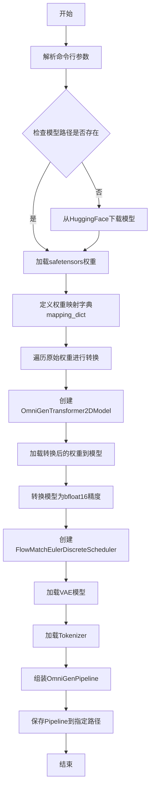
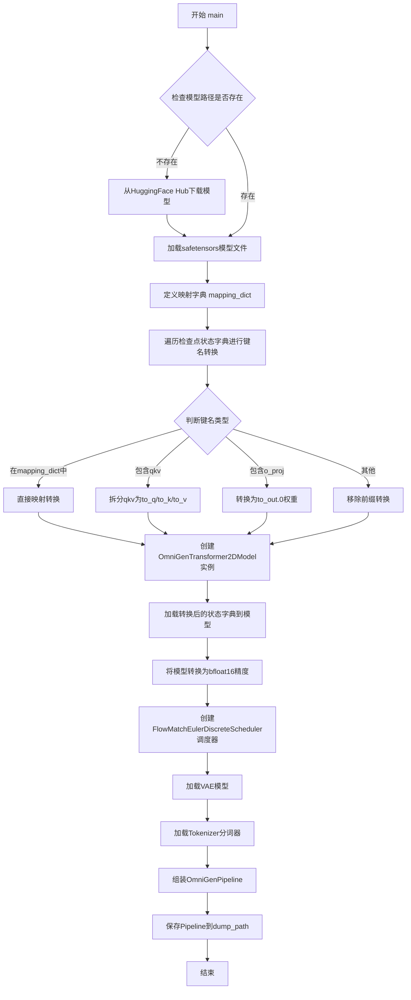
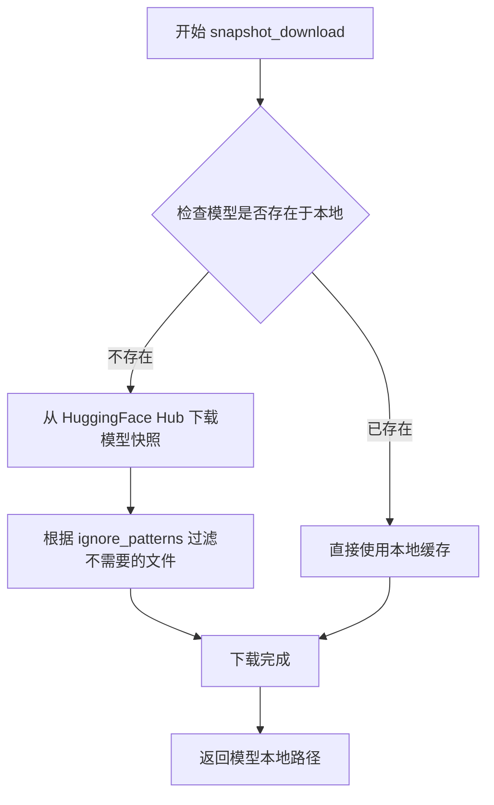
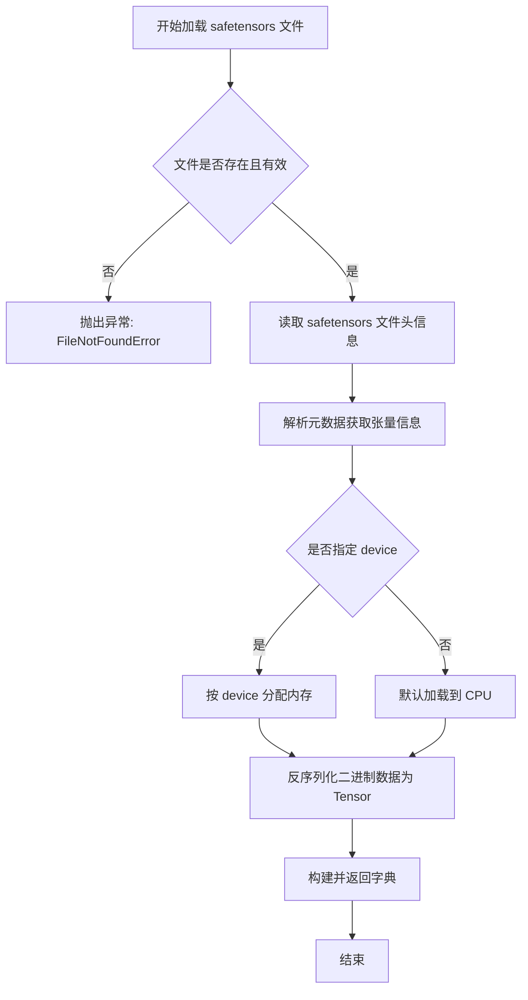
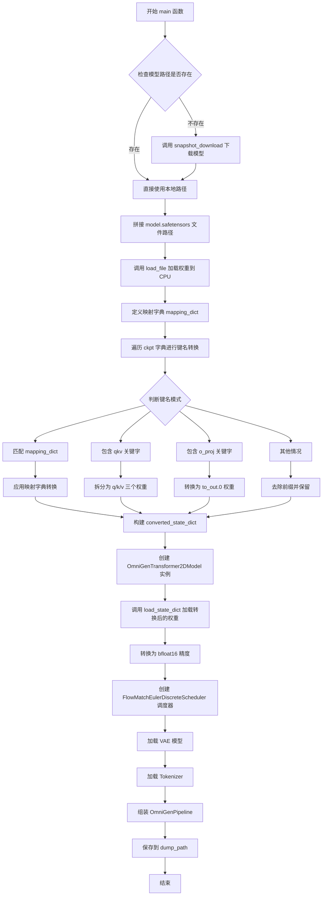
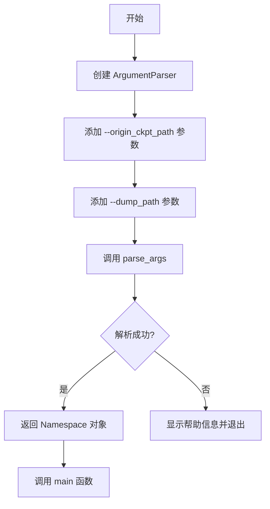

# `diffusers\scripts\convert_omnigen_to_diffusers.py` 详细设计文档

这是一个模型权重转换脚本，用于将OmniGen-v1模型从原始safetensors格式转换为HuggingFace Diffusers格式的pipeline，包括模型权重映射、转换和pipeline组装保存。

## 整体流程



## 类结构

```
脚本文件 (无类定义)
└── main(args) - 主转换函数
    ├── 参数解析 (argparse)
    ├── 模型下载/加载
    ├── 权重转换逻辑
    ├── 模型创建与组装
    └── Pipeline保存
```

## 全局变量及字段


### `mapping_dict`
    
权重名称映射字典，用于将原始模型检查点中的权重名称转换为Diffusers格式的名称

类型：`dict`
    


### `converted_state_dict`
    
转换后的权重字典，存储已映射到Diffusers格式的模型权重

类型：`dict`
    


### `ckpt`
    
从safetensors文件加载的原始模型权重字典

类型：`dict`
    


### `transformer`
    
OmniGenTransformer2DModel实例，转换后的Diffusers格式Transformer模型

类型：`OmniGenTransformer2DModel`
    


### `scheduler`
    
FlowMatchEulerDiscreteScheduler实例，用于Diffusers pipeline的调度器

类型：`FlowMatchEulerDiscreteScheduler`
    


### `vae`
    
AutoencoderKL实例，用于Diffusers pipeline的变分自编码器

类型：`AutoencoderKL`
    


### `tokenizer`
    
AutoTokenizer实例，用于文本tokenization

类型：`AutoTokenizer`
    


### `pipeline`
    
OmniGenPipeline实例，完整的Diffusers格式pipeline

类型：`OmniGenPipeline`
    


### `num_model_params`
    
Transformer模型的参数总量

类型：`int`
    


### `args`
    
命令行参数对象，包含origin_ckpt_path和dump_path参数

类型：`argparse.Namespace`
    


    

## 全局函数及方法


### `main(args)`

主转换函数，执行模型格式转换流程，将OmniGen模型从原始safetensors检查点格式转换为Diffusers Pipeline格式，并保存到指定路径。

参数：

- `args`：`argparse.Namespace`，命令行参数对象，包含以下属性：
  - `origin_ckpt_path`：原始模型检查点路径或HuggingFace Hub仓库ID
  - `dump_path`：转换后Pipeline的输出保存路径

返回值：`None`，该函数执行模型下载、格式转换和保存操作，无返回值。

#### 流程图



#### 带注释源码

```
def main(args):
    # checkpoint from https://huggingface.co/Shitao/OmniGen-v1

    # 步骤1: 检查模型路径是否存在，如不存在则从HuggingFace Hub下载
    if not os.path.exists(args.origin_ckpt_path):
        print("Model not found, downloading...")
        cache_folder = os.getenv("HF_HUB_CACHE")
        args.origin_ckpt_path = snapshot_download(
            repo_id=args.origin_ckpt_path,
            cache_dir=cache_folder,
            ignore_patterns=["flax_model.msgpack", "rust_model.ot", "tf_model.h5", "model.pt"],
        )
        print(f"Downloaded model to {args.origin_ckpt_path}")

    # 步骤2: 加载safetensors格式的模型权重文件到CPU
    ckpt = os.path.join(args.origin_ckpt_path, "model.safetensors")
    ckpt = load_file(ckpt, device="cpu")

    # 步骤3: 定义模型键名映射字典（原始键名 -> 目标键名）
    # 用于将OmniGen原始格式的键名转换为Diffusers格式的键名
    mapping_dict = {
        "pos_embed": "patch_embedding.pos_embed",
        "x_embedder.proj.weight": "patch_embedding.output_image_proj.weight",
        "x_embedder.proj.bias": "patch_embedding.output_image_proj.bias",
        "input_x_embedder.proj.weight": "patch_embedding.input_image_proj.weight",
        "input_x_embedder.proj.bias": "patch_embedding.input_image_proj.bias",
        "final_layer.adaLN_modulation.1.weight": "norm_out.linear.weight",
        "final_layer.adaLN_modulation.1.bias": "norm_out.linear.bias",
        "final_layer.linear.weight": "proj_out.weight",
        "final_layer.linear.bias": "proj_out.bias",
        "time_token.mlp.0.weight": "time_token.linear_1.weight",
        "time_token.mlp.0.bias": "time_token.linear_1.bias",
        "time_token.mlp.2.weight": "time_token.linear_2.weight",
        "time_token.mlp.2.bias": "time_token.linear_2.bias",
        "t_embedder.mlp.0.weight": "t_embedder.linear_1.weight",
        "t_embedder.mlp.0.bias": "t_embedder.linear_1.bias",
        "t_embedder.mlp.2.weight": "t_embedder.linear_2.weight",
        "t_embedder.mlp.2.bias": "t_embedder.linear_2.bias",
        "llm.embed_tokens.weight": "embed_tokens.weight",
    }

    # 步骤4: 遍历检查点中的所有键值对，进行键名转换
    converted_state_dict = {}
    for k, v in ckpt.items():
        if k in mapping_dict:
            # 直接使用映射字典进行键名转换
            converted_state_dict[mapping_dict[k]] = v
        elif "qkv" in k:
            # 处理QKV权重：将其拆分为query、key、value三个独立的权重
            to_q, to_k, to_v = v.chunk(3)
            layer_idx = k.split('.')[2]  # 提取层索引
            converted_state_dict[f"layers.{layer_idx}.self_attn.to_q.weight"] = to_q
            converted_state_dict[f"layers.{layer_idx}.self_attn.to_k.weight"] = to_k
            converted_state_dict[f"layers.{layer_idx}.self_attn.to_v.weight"] = to_v
        elif "o_proj" in k:
            # 处理输出投影权重：重命名为to_out.0
            layer_idx = k.split('.')[2]
            converted_state_dict[f"layers.{layer_idx}.self_attn.to_out.0.weight"] = v
        else:
            # 其他键名：移除前4个字符的前缀
            converted_state_dict[k[4:]] = v

    # 步骤5: 创建OmniGenTransformer2DModel模型实例，配置RoPE缩放参数
    transformer = OmniGenTransformer2DModel(
        rope_scaling={
            "long_factor": [
                1.0299999713897705,
                1.0499999523162842,
                1.0499999523162842,
                1.0799999237060547,
                1.2299998998641968,
                1.2299998998641968,
                1.2999999523162842,
                1.4499999284744263,
                1.5999999046325684,
                1.6499998569488525,
                1.8999998569488525,
                2.859999895095825,
                3.68999981880188,
                5.419999599456787,
                5.489999771118164,
                5.489999771118164,
                9.09000015258789,
                11.579999923706055,
                15.65999984741211,
                15.769999504089355,
                15.789999961853027,
                18.360000610351562,
                21.989999771118164,
                23.079999923706055,
                30.009998321533203,
                32.35000228881836,
                32.590003967285156,
                35.56000518798828,
                39.95000457763672,
                53.840003967285156,
                56.20000457763672,
                57.95000457763672,
                59.29000473022461,
                59.77000427246094,
                59.920005798339844,
                61.190006256103516,
                61.96000671386719,
                62.50000762939453,
                63.3700065612793,
                63.48000717163086,
                63.48000717163086,
                63.66000747680664,
                63.850006103515625,
                64.08000946044922,
                64.760009765625,
                64.80001068115234,
                64.81001281738281,
                64.81001281738281,
            ],
            "short_factor": [
                1.05,
                1.05,
                1.05,
                1.1,
                1.1,
                1.1,
                1.2500000000000002,
                1.2500000000000002,
                1.4000000000000004,
                1.4500000000000004,
                1.5500000000000005,
                1.8500000000000008,
                1.9000000000000008,
                2.000000000000001,
                2.000000000000001,
                2.000000000000001,
                2.000000000000001,
                2.000000000000001,
                2.000000000000001,
                2.000000000000001,
                2.000000000000001,
                2.000000000000001,
                2.000000000000001,
                2.000000000000001,
                2.000000000000001,
                2.000000000000001,
                2.000000000000001,
                2.000000000000001,
                2.000000000000001,
                2.000000000000001,
                2.000000000000001,
                2.000000000000001,
                2.1000000000000005,
                2.1000000000000005,
                2.2,
                2.3499999999999996,
                2.3499999999999996,
                2.3499999999999996,
                2.3499999999999996,
                2.3999999999999995,
                2.3999999999999995,
                2.6499999999999986,
                2.6999999999999984,
                2.8999999999999977,
                2.9499999999999975,
                3.049999999999997,
                3.049999999999997,
                3.049999999999997,
            ],
            "type": "su",
        },
        patch_size=2,
        in_channels=4,
        pos_embed_max_size=192,
    )
    
    # 步骤6: 加载转换后的状态字典到模型，严格匹配键名
    transformer.load_state_dict(converted_state_dict, strict=True)
    
    # 步骤7: 将模型转换为bfloat16精度以节省显存
    transformer.to(torch.bfloat16)

    # 步骤8: 打印模型参数数量
    num_model_params = sum(p.numel() for p in transformer.parameters())
    print(f"Total number of transformer parameters: {num_model_params}")

    # 步骤9: 创建FlowMatchEulerDiscreteScheduler调度器
    scheduler = FlowMatchEulerDiscreteScheduler(invert_sigmas=True, num_train_timesteps=1)

    # 步骤10: 从预训练路径加载VAE模型
    vae = AutoencoderKL.from_pretrained(os.path.join(args.origin_ckpt_path, "vae"), torch_dtype=torch.float32)

    # 步骤11: 从预训练路径加载Tokenizer分词器
    tokenizer = AutoTokenizer.from_pretrained(args.origin_ckpt_path)

    # 步骤12: 组装完整的OmniGenPipeline
    pipeline = OmniGenPipeline(tokenizer=tokenizer, transformer=transformer, vae=vae, scheduler=scheduler)
    
    # 步骤13: 保存Pipeline到指定路径
    pipeline.save_pretrained(args.dump_path)
```


### `snapshot_download`

从 HuggingFace Hub 下载模型仓库的完整快照，并将本地缓存路径返回。主要用于在本地不存在模型时自动下载 OmniGen-v1 检查点。

参数：

- `repo_id`：`str`，HuggingFace Hub 上的仓库标识符，格式为 "用户名/仓库名"（如 "Shitao/OmniGen-v1"）
- `cache_dir`：`str`，用于缓存下载模型的目录路径，通常从环境变量 `HF_HUB_CACHE` 获取
- `ignore_patterns`：`list[str]`，下载时忽略的文件模式列表，此处忽略 flax、rust、tensorflow 和旧版 pytorch 格式的模型文件

返回值：`str`，返回下载模型的实际本地路径，后续可通过该路径加载模型权重

#### 流程图



#### 带注释源码

```python
# 从 huggingface_hub 库导入 snapshot_download 函数
from huggingface_hub import snapshot_download

# 在 main 函数中调用 snapshot_download
args.origin_ckpt_path = snapshot_download(
    repo_id=args.origin_ckpt_path,  # 传入的仓库ID，如 "Shitao/OmniGen-v1"
    cache_dir=cache_folder,         # 从环境变量获取的缓存目录
    # 忽略以下格式的模型文件，减少下载量
    ignore_patterns=[
        "flax_model.msgpack",   # Flax 格式模型
        "rust_model.ot",        # Rust 格式模型
        "tf_model.h5",          # TensorFlow 格式模型
        "model.pt"              # 旧版 PyTorch 格式模型
    ],
)
# 返回值是模型下载后的本地路径，赋值给 args.origin_ckpt_path
```


### `load_file`

加载 safetensors 格式的模型权重文件，将权重从磁盘读取到内存（CPU 或 GPU设备）中。

参数：

- `filename`：`str`，safetensors 权重文件的路径
- `device`：`str`，指定加载到目标设备，值为 `"cpu"`（代码中传入）

返回值：`Dict[str, torch.Tensor]`，返回包含权重键值对的字典，键为张量名称，值为 PyTorch 张量对象

#### 流程图



#### 带注释源码

```python
# 导入 safetensors 的 torch 绑定库
from safetensors.torch import load_file

# 定义模型检查点路径
ckpt = os.path.join(args.origin_ckpt_path, "model.safetensors")

# 调用 load_file 函数加载 safetensors 格式的权重
# 参数说明:
#   - ckpt: str类型, safetensors 文件的完整路径
#   - device: str类型, 指定目标设备, "cpu" 表示加载到内存
# 返回值:
#   - ckpt: dict类型, 键为权重名称, 值为 torch.Tensor 对象
ckpt = load_file(ckpt, device="cpu")
```

---

### `main`

将 OmniGen 模型从原始 safetensors 格式转换为 diffusers pipeline 格式的主函数。

参数：

- `args`：`Namespace`，命令行参数对象，包含 `origin_ckpt_path`（原始模型路径）和 `dump_path`（输出路径）

返回值：`None`，无返回值

#### 流程图



#### 带注释源码

```python
def main(args):
    """
    主函数: 将 OmniGen 模型转换为 diffusers pipeline 格式
    
    Args:
        args: 包含 origin_ckpt_path 和 dump_path 的命名空间对象
    
    Returns:
        None
    """
    
    # Step 1: 检查模型是否存在，如不存在则下载
    if not os.path.exists(args.origin_ckpt_path):
        print("Model not found, downloading...")
        cache_folder = os.getenv("HF_HUB_CACHE")
        args.origin_ckpt_path = snapshot_download(
            repo_id=args.origin_ckpt_path,
            cache_dir=cache_folder,
            ignore_patterns=["flax_model.msgpack", "rust_model.ot", "tf_model.h5", "model.pt"],
        )
        print(f"Downloaded model to {args.origin_ckpt_path}")

    # Step 2: 构建 safetensors 文件完整路径
    ckpt = os.path.join(args.origin_ckpt_path, "model.safetensors")
    
    # Step 3: 使用 load_file 加载 safetensors 格式的权重
    # 返回 dict: {tensor_name: torch.Tensor}
    ckpt = load_file(ckpt, device="cpu")

    # Step 4: 定义原始键名到目标键名的映射字典
    mapping_dict = {
        "pos_embed": "patch_embedding.pos_embed",
        "x_embedder.proj.weight": "patch_embedding.output_image_proj.weight",
        # ... 更多映射关系
    }

    # Step 5: 遍历权重并进行键名转换
    converted_state_dict = {}
    for k, v in ckpt.items():
        if k in mapping_dict:
            # 直接映射
            converted_state_dict[mapping_dict[k]] = v
        elif "qkv" in k:
            # QKV 分离处理 (用于 Attention 机制)
            to_q, to_k, to_v = v.chunk(3)
            converted_state_dict[f"layers.{k.split('.')[2]}.self_attn.to_q.weight"] = to_q
            converted_state_dict[f"layers.{k.split('.')[2]}.self_attn.to_k.weight"] = to_k
            converted_state_dict[f"layers.{k.split('.')[2]}.self_attn.to_v.weight"] = to_v
        elif "o_proj" in k:
            # 输出投影层
            converted_state_dict[f"layers.{k.split('.')[2]}.self_attn.to_out.0.weight"] = v
        else:
            # 其他情况: 去除前4个字符的前缀
            converted_state_dict[k[4:]] = v

    # Step 6: 创建转换后的 Transformer 模型
    transformer = OmniGenTransformer2DModel(
        rope_scaling={...},
        patch_size=2,
        in_channels=4,
        pos_embed_max_size=192,
    )
    
    # Step 7: 加载转换后的权重
    transformer.load_state_dict(converted_state_dict, strict=True)
    transformer.to(torch.bfloat16)

    # Step 8: 打印模型参数量
    num_model_params = sum(p.numel() for p in transformer.parameters())
    print(f"Total number of transformer parameters: {num_model_params}")

    # Step 9: 创建调度器
    scheduler = FlowMatchEulerDiscreteScheduler(invert_sigmas=True, num_train_timesteps=1)

    # Step 10: 加载 VAE 和 Tokenizer
    vae = AutoencoderKL.from_pretrained(os.path.join(args.origin_ckpt_path, "vae"), torch_dtype=torch.float32)
    tokenizer = AutoTokenizer.from_pretrained(args.origin_ckpt_path)

    # Step 11: 组装并保存 pipeline
    pipeline = OmniGenPipeline(tokenizer=tokenizer, transformer=transformer, vae=vae, scheduler=scheduler)
    pipeline.save_pretrained(args.dump_path)
```


### `parse_args` (内联于 `__main__` 块)

该函数并非独立定义，而是嵌入在 `if __name__ == "__main__":` 块中的参数解析逻辑，用于解析命令行参数 `--origin_ckpt_path` 和 `--dump_path`，以获取原始模型路径和输出路径。

参数：

-  无独立函数参数（参数通过 argparse 自动添加到 parser 对象）

返回值：`Namespace`，包含以下属性：
-  `origin_ckpt_path`：`str`，原始检查点路径或HuggingFace模型ID
-  `dump_path`：`str`，转换后的Diffusers模型输出路径

#### 流程图



#### 带注释源码

```python
if __name__ == "__main__":
    # 步骤1: 创建参数解析器
    parser = argparse.ArgumentParser()

    # 步骤2: 添加 origin_ckpt_path 参数
    # 用于指定原始模型检查点的路径或HuggingFace模型ID
    parser.add_argument(
        "--origin_ckpt_path",
        default="Shitao/OmniGen-v1",  # 默认值指向HuggingFace Hub上的OmniGen-v1模型
        type=str,
        required=False,
        help="Path to the checkpoint to convert.",
    )

    # 步骤3: 添加 dump_path 参数
    # 用于指定转换后的Diffusers格式模型的输出目录
    parser.add_argument(
        "--dump_path", 
        default="OmniGen-v1-diffusers",  # 默认输出目录名称
        type=str, 
        required=False, 
        help="Path to the output pipeline."
    )

    # 步骤4: 解析命令行参数
    # 将命令行输入转换为 Namespace 对象
    args = parser.parse_args()

    # 步骤5: 调用主函数，传入解析后的参数
    main(args)
```


## 关键组件


### 张量索引与惰性加载

该代码使用 `load_file(ckpt, device="cpu")` 从 safetensors 文件中加载模型权重到 CPU 内存，实现惰性加载避免 GPU 内存溢出，同时通过状态字典映射机制对特定张量进行索引提取。

### 反量化支持

代码通过 `transformer.to(torch.bfloat16)` 将加载的模型权重从默认精度转换为 bfloat16 低精度格式，实现模型反量化以减少内存占用并提升推理效率。

### 量化策略

该脚本定义了从原始格式到 Diffusers 格式的模型结构转换映射，支持将量化状态字典中的权重（包含 qkv 分割和 o_proj 投影）重新组织为标准 Transformer 结构。

### 状态字典映射机制

通过 `mapping_dict` 手动映射特定层名称，并利用字符串解析处理 qkv 分割和层索引重建，实现复杂的状态字典键名转换逻辑。

### 调度器配置

使用 `FlowMatchEulerDiscreteScheduler` 并设置 `invert_sigmas=True` 和 `num_train_timesteps=1` 参数，配置基于欧拉离散化的流匹配调度策略。

### 模型组件构建

代码整合了 `OmniGenTransformer2DModel`、`AutoencoderKL`、`AutoTokenizer` 和 `FlowMatchEulerDiscreteScheduler` 四个核心组件构建完整的 OmniGenPipeline。

## 问题及建议


### 已知问题

- **硬编码的模型参数**：patch_size=2、in_channels=4、pos_embed_max_size=192 等关键参数被硬编码，若模型架构变化需手动修改代码
- **硬编码的 RoPE 缩放因子**：rope_scaling 中的 long_factor 和 short_factor 数组包含大量魔法数字，既难以维护也不便于配置
- **映射字典维护性差**：mapping_dict 硬编码了权重名称映射关系，缺乏灵活性且不易扩展
- **缺乏错误处理**：代码未对文件加载、模型下载、状态字典加载等关键操作进行异常捕获和处理
- **资源管理不当**：加载的 ckpt 字典使用后未显式释放，大模型场景下可能导致内存峰值过高
- **设备管理不灵活**：权重先加载到 CPU 再转至 bfloat16，未考虑直接从 GPU 加载的优化路径
- **日志记录不规范**：使用 print 而非 logging 模块，不利于生产环境下的日志管理和调试
- **严格加载模式**：load_state_dict 使用 strict=True，任何键名不匹配都会导致转换失败
- **缓存目录处理**：HF_HUB_CACHE 环境变量可能返回 None，导致缓存路径处理不一致

### 优化建议

- 将模型参数提取为命令行参数或配置文件，提高代码通用性
- 将 RoPE 缩放因子配置外部化，可从模型配置文件中读取而非硬编码
- 使用 logging 模块替代 print 并设置合理的日志级别
- 添加 try-except 块处理网络异常、文件不存在、模型加载失败等场景
- 在权重转换完成后显式 del ckpt 并调用 torch.cuda.empty_cache()（如适用）释放内存
- 考虑支持从配置文件自动读取或推断模型架构参数，减少硬编码
- 提供 dry-run 模式用于验证映射完整性和键名覆盖情况
- 添加进度条和更友好的用户提示信息，特别是长时间运行的下载和转换操作

## 其它


### 设计目标与约束

本代码的设计目标是将OmniGen-v1原始checkpoint转换为HuggingFace Diffusers格式的pipeline，以便能够使用diffusers库进行推理。核心约束包括：1) 需要保持模型权重的精度和结构完整性；2) 必须正确处理键名映射以适配Diffusers架构；3) 支持从HuggingFace Hub自动下载模型；4) 输出必须是可加载的Diffusers Pipeline格式。

### 错误处理与异常设计

代码主要处理以下异常情况：1) 当指定路径的checkpoint不存在时，触发下载流程；2) 使用os.path.exists()检查路径有效性；3) 加载权重时使用strict=True确保键名完全匹配；4) 依赖HuggingFace Hub的snapshot_download处理网络异常；5) 使用try-except捕获可能的模型加载错误。潜在改进：可添加更详细的错误日志、checkpoint完整性校验、以及断点续传机制。

### 数据流与状态机

数据流主要分为三个阶段： 第一阶段（下载/加载）: 检查origin_ckpt_path是否存在，如不存在则从HuggingFace下载； 第二阶段（权重转换）: 加载safetensors格式的模型权重，通过mapping_dict和键名匹配规则进行转换； 第三阶段（Pipeline构建）: 依次创建transformer、scheduler、vae、tokenizer组件，最后组装成OmniGenPipeline并保存。整个过程是线性执行的无状态流程。

### 外部依赖与接口契约

主要外部依赖包括：1) huggingface_hub: 用于模型下载和快照管理；2) safetensors: 用于安全加载模型权重；3) transformers: 提供AutoTokenizer；4) diffusers: 提供AutoencoderKL、FlowMatchEulerDiscreteScheduler和OmniGenPipeline；5) torch: 基础张量计算框架。接口契约方面：输入为origin_ckpt_path（HuggingFace repo_id或本地路径）和dump_path（输出目录），输出为保存的Diffusers Pipeline目录，包含model.safetensors、scheduler_config.json、vae_config.json等文件。

### 配置参数说明

关键配置参数包括：origin_ckpt_path指定原始模型路径或HuggingFace仓库ID（默认"Shitao/OmniGen-v1"），dump_path指定输出Pipeline路径（默认"OmniGen-v1-diffusers"）。Transformer配置包括patch_size=2、in_channels=4、pos_embed_max_size=192，RoPE缩放使用su类型的long_factor和short_factor数组。Scheduler配置为FlowMatchEulerDiscreteScheduler且invert_sigmas=True、num_train_timesteps=1。VAE使用float32精度，Transformer使用bfloat16精度。

### 关键转换逻辑说明

权重转换逻辑分为四类：1) 直接映射：通过mapping_dict进行键名替换（如pos_embed→patch_embedding.pos_embed）；2) QKV分离：包含"qkv"的键需要拆分为to_q、to_k、to_v三个权重；3) O投影：包含"o_proj"的键转换为self_attn.to_out.0.weight；4) 其他情况：去除键名前4个字符（如"model."前缀）。这种设计是为了适配OmniGenTransformer2DModel的内部架构。
</think>
    