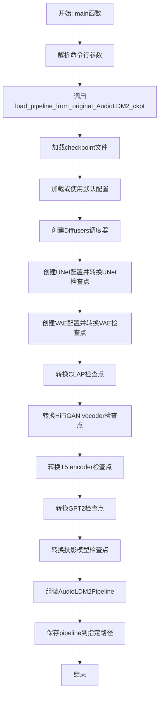
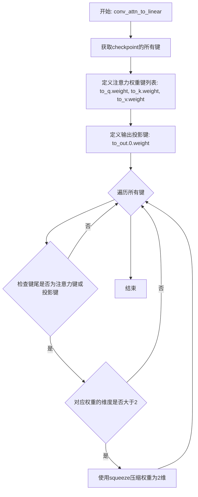
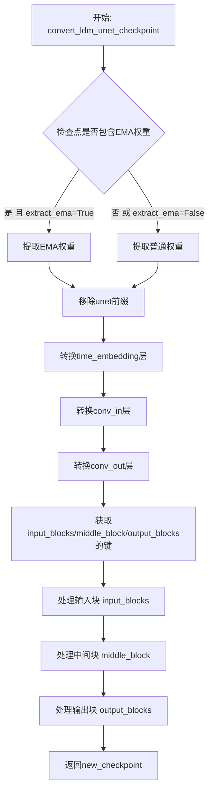
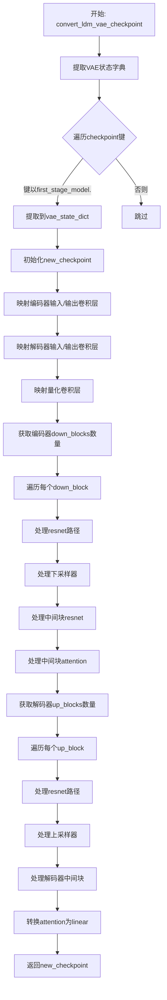
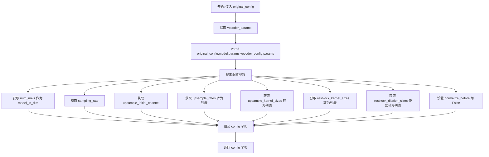
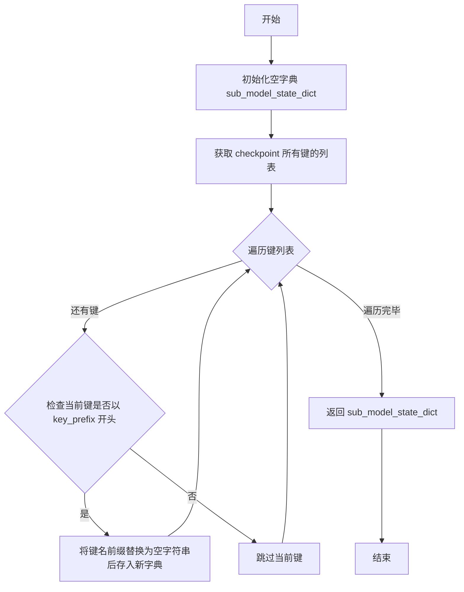
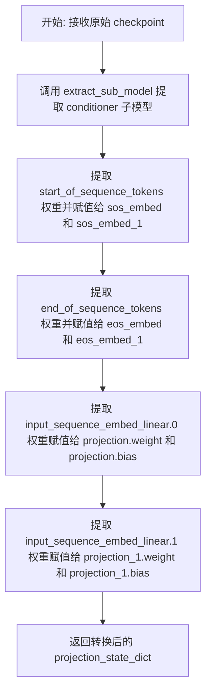
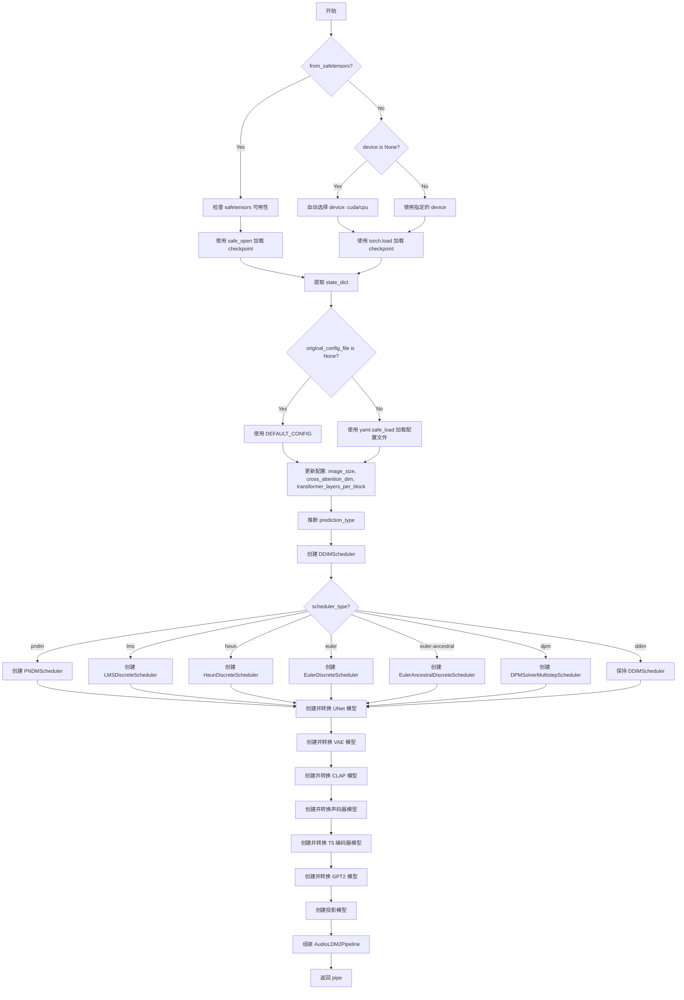

# `diffusers\scripts\convert_original_audioldm2_to_diffusers.py` 详细设计文档

这是一个用于将AudioLDM2模型的原始检查点(.ckpt或.safetensors格式)转换为HuggingFace Diffusers库可用格式的转换脚本。脚本负责转换UNet、VAE、CLAP文本编码器、T5编码器、GPT2语言模型、投影模型和HiFiGAN vocoder等多个组件，并最终组装成可用的AudioLDM2Pipeline。

## 整体流程



## 类结构

```
无类层次结构 (纯函数模块)
└── 转换函数集合:
    ├── 路径重命名函数 (shave_segments, renew_*_paths)
    ├── 检查点分配函数 (assign_to_checkpoint)
    ├── 配置创建函数 (create_*_config)
    ├── 检查点转换函数 (convert_ldm_*_checkpoint, convert_*_checkpoint)
    └── 主管道加载函数 (load_pipeline_from_original_AudioLDM2_ckpt)
```

## 全局变量及字段


### `CLAP_KEYS_TO_MODIFY_MAPPING`
    
CLAP模型键名映射规则，用于将原始CLAP模型的键名转换为transformers兼容的键名

类型：`dict`
    


### `CLAP_KEYS_TO_IGNORE`
    
需要忽略的CLAP模型键名列表，这些键在转换过程中会被跳过

类型：`list`
    


### `CLAP_EXPECTED_MISSING_KEYS`
    
预期缺失的键名列表，允许这些键在加载时缺失而不会引发错误

类型：`list`
    


### `DEFAULT_CONFIG`
    
AudioLDM2默认配置参数，包含模型的各种超参数和结构配置

类型：`dict`
    


    

## 全局函数及方法


### `shave_segments`

移除路径字符串中的指定段。当参数为正数时，移除路径前缀的指定数量段；当参数为负数时，移除路径后缀的指定数量段。

参数：

- `path`：`str`，要处理的路径字符串，使用点号（.）作为分隔符
- `n_shave_prefix_segments`：`int`，默认为1，要移除的段数。正值移除前导段，负值移除末尾段

返回值：`str`，处理后的路径字符串

#### 流程图

```mermaid
flowchart TD
    A[开始 shave_segments] --> B{判断 n_shave_prefix_segments >= 0?}
    B -- 是 --> C[使用 path.split('.')[n_shave_prefix_segments:] 切片]
    C --> D[使用 '.'.join() 重新连接]
    D --> E[返回处理后的路径]
    B -- 否 --> F[使用 path.split('.')[:n_shave_prefix_segments] 切片]
    F --> D
```

#### 带注释源码

```python
# Copied from diffusers.pipelines.stable_diffusion.convert_from_ckpt.shave_segments
def shave_segments(path, n_shave_prefix_segments=1):
    """
    Removes segments. Positive values shave the first segments, negative shave the last segments.
    
    参数:
        path (str): 要处理的路径字符串，例如 "model.layer.weight"
        n_shave_prefix_segments (int): 要移除的段数。正值表示从开头移除指定数量的段，
                                      负值表示从末尾移除指定数量的段。默认为1
    
    返回值:
        str: 处理后的路径字符串
    
    示例:
        >>> shave_segments("input_blocks.0.weight", 1)
        '0.weight'
        >>> shave_segments("input_blocks.0.weight", 2)
        'weight'
        >>> shave_segments("input_blocks.0.weight", -1)
        'input_blocks.0'
    """
    # 判断是否为正向移除（前缀段）
    if n_shave_prefix_segments >= 0:
        # 分割路径字符串，取从第n_shave_prefix_segments个元素开始的切片
        # 例如 path="a.b.c.d", n=1 -> ["b","c","d"] -> "b.c.d"
        return ".".join(path.split(".")[n_shave_prefix_segments:])
    else:
        # 分割路径字符串，取从头到第n_shave_prefix_segments个元素的切片（负数索引）
        # 例如 path="a.b.c.d", n=-1 -> ["a","b","c"] -> "a.b.c"
        return ".".join(path.split(".")[:n_shave_prefix_segments])
```


### `renew_resnet_paths`

该函数用于更新 ResNet 内部参数路径的命名方式，将旧的 LDM（Latent Diffusion Models）命名约定转换为 Diffusers 库的新命名约定。它通过字符串替换实现局部重命名，将原始模型检查点中的层名称（如 `in_layers.0`、`out_layers.0`、`emb_layers.1`、`skip_connection` 等）映射到新的命名规范（如 `norm1`、`conv1`、`norm2`、`conv2`、`time_emb_proj`、`conv_shortcut`）。

参数：

- `old_list`：`List[str]`，包含需要转换的旧路径名称列表
- `n_shave_prefix_segments`：`int`，可选参数，默认值为 `0`，指定要切除的前缀段数，用于调整路径层级

返回值：`List[Dict[str, str]]`，返回一个包含多个字典的列表，每个字典有两个键：`old` 表示原始路径，`new` 表示转换后的新路径

#### 流程图

```mermaid
flowchart TD
    A[开始] --> B[初始化空 mapping 列表]
    B --> C{遍历 old_list 中的每个 old_item}
    C -->|是| D[创建 new_item 副本]
    D --> E[替换 'in_layers.0' -> 'norm1']
    E --> F[替换 'in_layers.2' -> 'conv1']
    F --> G[替换 'out_layers.0' -> 'norm2']
    G --> H[替换 'out_layers.3' -> 'conv2']
    H --> I[替换 'emb_layers.1' -> 'time_emb_proj']
    I --> J[替换 'skip_connection' -> 'conv_shortcut']
    J --> K[调用 shave_segments 切除前缀段]
    K --> L[将 {'old': old_item, 'new': new_item} 添加到 mapping]
    L --> C
    C -->|否| M[返回 mapping 列表]
    M --> N[结束]
```

#### 带注释源码

```python
# Copied from diffusers.pipelines.stable_diffusion.convert_from_ckpt.renew_resnet_paths
def renew_resnet_paths(old_list, n_shave_prefix_segments=0):
    """
    Updates paths inside resnets to the new naming scheme (local renaming)
    
    该函数执行 ResNet 层的局部重命名操作，将原始 AudioLDM2/LDM 模型中的
    参数路径名称转换为 Diffusers 库兼容的命名规范。主要转换规则如下：
    - in_layers.0 -> norm1 (输入层的第一层：归一化层)
    - in_layers.2 -> conv1 (输入层的第二层：卷积层)
    - out_layers.0 -> norm2 (输出层的第一层：归一化层)
    - out_layers.3 -> conv2 (输出层的第二层：卷积层)
    - emb_layers.1 -> time_emb_proj (时间嵌入投影层)
    - skip_connection -> conv_shortcut (跳跃连接/残差连接)
    """
    mapping = []
    # 遍历所有旧的路径名称
    for old_item in old_list:
        new_item = old_item
        
        # 替换输入层命名：in_layers.0 表示第一个输入层（归一化）
        new_item = new_item.replace("in_layers.0", "norm1")
        # 替换输入层命名：in_layers.2 表示第二个输入层（卷积）
        new_item = new_item.replace("in_layers.2", "conv1")

        # 替换输出层命名：out_layers.0 表示第一个输出层（归一化）
        new_item = new_item.replace("out_layers.0", "norm2")
        # 替换输出层命名：out_layers.3 表示第二个输出层（卷积）
        new_item = new_item.replace("out_layers.3", "conv2")

        # 替换时间嵌入层命名：emb_layers.1 表示时间嵌入投影层
        new_item = new_item.replace("emb_layers.1", "time_emb_proj")
        # 替换跳跃连接命名：skip_connection 表示残差连接卷积
        new_item = new_item.replace("skip_connection", "conv_shortcut")

        # 调用 shave_segments 函数，根据 n_shave_prefix_segments 参数
        # 切除路径中的前缀段数（用于调整路径层级匹配）
        new_item = shave_segments(new_item, n_shave_prefix_segments=n_shave_prefix_segments)

        # 将旧路径和新路径的映射关系添加到列表中
        mapping.append({"old": old_item, "new": new_item})

    # 返回完整的路径映射列表
    return mapping
```


### `renew_vae_resnet_paths`

更新VAE ResNet路径命名，将旧的路径名称转换为新的Diffusers命名约定，主要处理`nin_shortcut`到`conv_shortcut`的替换，并通过`shave_segments`函数修整路径前缀段。

参数：

- `old_list`：`List[str]`，包含需要更新的旧权重路径名称列表
- `n_shave_prefix_segments`：`int`，可选参数，默认值为0，表示要切除的前缀段数量

返回值：`List[Dict[str, str]]`，返回由字典组成的列表，每个字典包含`old`（原始路径）和`new`（新路径）键值对

#### 流程图

```mermaid
flowchart TD
    A[开始: renew_vae_resnet_paths] --> B[初始化空mapping列表]
    B --> C{遍历 old_list 中的每个 old_item}
    C -->|是| D[复制 old_item 到 new_item]
    D --> E{检查 'nin_shortcut' 是否在 new_item 中}
    E -->|是| F[将 'nin_shortcut' 替换为 'conv_shortcut']
    E -->|否| G[跳过替换]
    F --> H[调用 shave_segments 修整路径前缀]
    G --> H
    H --> I[创建 {'old': old_item, 'new': new_item} 字典]
    I --> J[将字典添加到 mapping 列表]
    J --> C
    C -->|否| K[返回 mapping 列表]
    K --> L[结束]
```

#### 带注释源码

```python
# Copied from diffusers.pipelines.stable_diffusion.convert_from_ckpt.renew_vae_resnet_paths
def renew_vae_resnet_paths(old_list, n_shave_prefix_segments=0):
    """
    Updates paths inside resnets to the new naming scheme (local renaming)
    
    此函数用于将旧版AudioLDM2 checkpoint中的VAE ResNet路径名称
    转换为Diffusers库对应的新命名规范。主要完成以下转换:
    1. 'nin_shortcut' -> 'conv_shortcut' (下采样快捷连接重命名)
    2. 可选地切除路径的前缀段
    
    参数:
        old_list: 包含旧权重路径名称的列表
        n_shave_prefix_segments: 要切除的路径前缀段数量,默认为0
    
    返回:
        包含旧路径到新路径映射的字典列表
    """
    # 初始化用于存储映射关系的空列表
    mapping = []
    
    # 遍历输入列表中的每个旧路径项
    for old_item in old_list:
        # 将当前项复制到新变量进行修改
        new_item = old_item

        # 将 'nin_shortcut' 替换为 'conv_shortcut'
        # 这是VAE ResNet中跳跃连接的标准重命名
        # nin_shortcut 是原始LDM中的命名,conv_shortcut是Diffusers的新命名
        new_item = new_item.replace("nin_shortcut", "conv_shortcut")
        
        # 调用 shave_segments 函数修整路径前缀
        # n_shave_prefix_segments 参数控制要切除的段数:
        # 正值切除开头段,负值切除末尾段
        new_item = shave_segments(new_item, n_shave_prefix_segments=n_shave_prefix_segments)

        # 构建映射字典并添加到结果列表
        mapping.append({"old": old_item, "new": new_item})

    # 返回完整的路径映射列表
    return mapping
```


### `renew_attention_paths`

该函数用于更新注意力机制（attention）层内部路径的命名约定，将旧的路径名称转换为新的命名方案。它是模型检查点转换流程中的一个关键步骤，专门处理注意力层权重的路径重命名。

参数：

- `old_list`：`List[str]`，包含需要转换的旧权重路径列表

返回值：`List[dict]`，返回一个新的列表，其中每个元素都是一个包含 `"old"` 和 `"new"` 键的字典，分别对应原始路径和转换后的新路径

#### 流程图

```mermaid
flowchart TD
    A[开始] --> B[初始化空映射列表 mapping]
    --> C{遍历 old_list 中的每个元素}
    C -->|是| D[将当前 old_item 赋值给 new_item]
    --> E[预留的替换注释区域<br/>norm.weight → group_norm.weight<br/>norm.bias → group_norm.bias<br/>proj_out.weight → proj_attn.weight<br/>proj_out.bias → proj_attn.bias]
    --> F[将映射添加到 mapping 列表<br/>{old: old_item, new: new_item}]
    --> C
    C -->|否| G[返回 mapping 列表]
    G --> H[结束]
```

#### 带注释源码

```python
# Copied from diffusers.pipelines.stable_diffusion.convert_from_ckpt.renew_attention_paths
def renew_attention_paths(old_list):
    """
    Updates paths inside attentions to the new naming scheme (local renaming)
    """
    mapping = []
    # 遍历所有需要转换的旧路径
    for old_item in old_list:
        new_item = old_item

        # 预留的替换规则（当前版本中被注释掉，实际未执行）
        # 以下是可能的路径转换规则：
        # new_item = new_item.replace('norm.weight', 'group_norm.weight')
        # new_item = new_item.replace('norm.bias', 'group_norm.bias')

        # new_item = new_item.replace('proj_out.weight', 'proj_attn.weight')
        # new_item = new_item.replace('proj_out.bias', 'proj_attn.bias')

        # 可选：使用 shave_segments 函数去除前缀段
        # new_item = shave_segments(new_item, n_shave_prefix_segments=n_shave_prefix_segments)

        # 将旧路径和新路径的映射添加到结果列表中
        mapping.append({"old": old_item, "new": new_item})

    return mapping
```


### `renew_vae_attention_paths`

更新VAE（变分自编码器）内部注意力机制（Attention）的权重路径命名，将旧的AudioLDM2模型路径映射到新的Diffusers框架命名规范。

参数：

- `old_list`：`List[str]`，需要转换的旧权重路径列表
- `n_shave_prefix_segments`：`int`，可选参数，默认为0，表示需要移除的前缀段数（用于路径层级调整）

返回值：`List[Dict[str, str]]`，返回包含"old"和"new"键的字典列表，表示旧路径到新路径的映射关系

#### 流程图

```mermaid
flowchart TD
    A[开始: 输入old_list和n_shave_prefix_segments] --> B[初始化空mapping列表]
    B --> C{遍历old_list中的每个old_item}
    C -->|对每个old_item| D[复制old_item到new_item]
    D --> E["替换 'norm.weight' -> 'group_norm.weight'"]
    E --> F["替换 'norm.bias' -> 'group_norm.bias'"]
    F --> G["替换 'q.weight' -> 'to_q.weight'"]
    G --> H["替换 'q.bias' -> 'to_q.bias'"]
    H --> I["替换 'k.weight' -> 'to_k.weight'"]
    I --> J["替换 'k.bias' -> 'to_k.bias'"]
    J --> K["替换 'v.weight' -> 'to_v.weight'"]
    K --> L["替换 'v.bias' -> 'to_v.bias'"]
    L --> M["替换 'proj_out.weight' -> 'to_out.0.weight'"]
    M --> N["替换 'proj_out.bias' -> 'to_out.0.bias'"]
    N --> O[调用shave_segments处理前缀]
    O --> P[将 {'old': old_item, 'new': new_item} 添加到mapping]
    P --> C
    C -->|遍历完成| Q[返回mapping列表]
    Q --> Z[结束]
```

#### 带注释源码

```python
def renew_vae_attention_paths(old_list, n_shave_prefix_segments=0):
    """
    Updates paths inside attentions to the new naming scheme (local renaming)
    
    该函数用于将AudioLDM2原始检查点中VAE注意力层的权重路径
    转换为Diffusers框架所需的命名规范。主要实现从旧命名到新命名的
    本地映射转换。
    
    Args:
        old_list: 包含旧权重路径的列表
        n_shave_prefix_segments: 可选参数，指定要移除的前缀段数，
                                默认为0，表示不移除任何前缀段
    
    Returns:
        返回一个字典列表，每个字典包含 'old' 和 'new' 两个键，
        分别对应原始路径和转换后的新路径
    """
    mapping = []
    
    # 遍历所有需要转换的旧路径
    for old_item in old_list:
        new_item = old_item
        
        # 归一化层命名转换：norm -> group_norm
        new_item = new_item.replace("norm.weight", "group_norm.weight")
        new_item = new_item.replace("norm.bias", "group_norm.bias")
        
        # QKV投影层命名转换：q/k/v -> to_q/to_k/to_v
        new_item = new_item.replace("q.weight", "to_q.weight")
        new_item = new_item.replace("q.bias", "to_q.bias")
        
        new_item = new_item.replace("k.weight", "to_k.weight")
        new_item = new_item.replace("k.bias", "to_k.bias")
        
        new_item = new_item.replace("v.weight", "to_v.weight")
        new_item = new_item.replace("v.bias", "to_v.bias")
        
        # 输出投影层命名转换：proj_out -> to_out.0
        new_item = new_item.replace("proj_out.weight", "to_out.0.weight")
        new_item = new_item.replace("proj_out.bias", "to_out.0.bias")
        
        # 调用shave_segments函数处理路径前缀
        # 这是一个从diffusers项目复用的工具函数，用于根据n_shave_prefix_segments
        # 参数添加或移除路径前缀段
        new_item = shave_segments(new_item, n_shave_prefix_segments=n_shave_prefix_segments)
        
        # 构建映射字典并添加到结果列表
        mapping.append({"old": old_item, "new": new_item})
    
    return mapping
```


### `assign_to_checkpoint`

执行最终权重分配和attention分割，将本地转换的权重应用全局重命名，并处理额外的替换操作。

参数：

- `paths`：`List[Dict[str, str]]`，包含"old"和"new"键的字典列表，指定权重路径的映射关系
- `checkpoint`：`Dict`，目标checkpoint字典，用于存储转换后的权重
- `old_checkpoint`：`Dict`，原始checkpoint字典，包含待转换的权重
- `attention_paths_to_split`：`Optional[Dict]`，可选参数，需要分割的attention层路径映射，用于将QKV权重分离
- `additional_replacements`：`Optional[List[Dict]]`，可选参数，额外的路径替换规则列表
- `config`：`Optional[Dict]`，可选参数，包含模型配置信息（如num_head_channels等）

返回值：`None`，该函数直接修改`checkpoint`字典，无返回值

#### 流程图

```mermaid
flowchart TD
    A[开始 assign_to_checkpoint] --> B{验证 paths 是否为列表}
    B -->|否| C[抛出 AssertionError]
    B -->|是| D{attention_paths_to_split 是否存在}
    
    D -->|是| E[遍历 attention_paths_to_split]
    E --> F[从 old_checkpoint 获取原始 tensor]
    G[计算 channels = shape[0] // 3]
    H[计算 num_heads]
    I[reshape tensor 并分离 query/key/value]
    J[将分离后的权重写入 checkpoint]
    
    D -->|否| K[遍历 paths 列表]
    
    K --> L{新路径是否已在 attention_paths_to_split 中}
    L -->|是| M[跳过当前路径]
    L -->|否| N{是否有 additional_replacements}
    
    N -->|是| O[应用额外的路径替换]
    N -->|否| P{路径是否包含 proj_attn.weight}
    
    O --> P
    P -->|是| Q[从 conv1D 转换为 linear: [:, :, 0]]
    P -->|否| R[直接复制权重]
    
    Q --> S[checkpoint[new_path] = 转换后的权重]
    R --> S
    M --> T{是否还有更多路径}
    T -->|是| K
    T -->|否| U[结束]
    J --> U
```

#### 带注释源码

```python
def assign_to_checkpoint(
    paths, checkpoint, old_checkpoint, attention_paths_to_split=None, additional_replacements=None, config=None
):
    """
    This does the final conversion step: take locally converted weights and apply a global renaming to them. It splits
    attention layers, and takes into account additional replacements that may arise.

    Assigns the weights to the new checkpoint.
    """
    # 验证 paths 参数是否为列表类型
    assert isinstance(paths, list), "Paths should be a list of dicts containing 'old' and 'new' keys."

    # 如果提供了 attention_paths_to_split，则分割 attention 层的权重
    # 将原始的 QKV 混合权重分离为 query、key、value 三个独立的权重
    if attention_paths_to_split is not None:
        for path, path_map in attention_paths_to_split.items():
            # 从原始 checkpoint 中获取需要分割的 tensor
            old_tensor = old_checkpoint[path]
            # 计算通道数（原始 tensor 的第一维是 3 倍通道数）
            channels = old_tensor.shape[0] // 3

            # 确定目标形状：对于 3D tensor 保持批量维度，对于其他情况展平
            target_shape = (-1, channels) if len(old_tensor.shape) == 3 else (-1)

            # 计算注意力头数量
            num_heads = old_tensor.shape[0] // config["num_head_channels"] // 3

            # 重塑 tensor 以分离不同头
            old_tensor = old_tensor.reshape((num_heads, 3 * channels // num_heads) + old_tensor.shape[1:])
            # 沿维度 1 分割为 query、key、value 三个部分
            query, key, value = old_tensor.split(channels // num_heads, dim=1)

            # 将分割后的权重写入目标 checkpoint
            checkpoint[path_map["query"]] = query.reshape(target_shape)
            checkpoint[path_map["key"]] = key.reshape(target_shape)
            checkpoint[path_map["value"]] = value.reshape(target_shape)

    # 遍历所有路径，进行权重分配
    for path in paths:
        new_path = path["new"]

        # 如果该路径已经在 attention_paths_to_split 中处理过，则跳过
        if attention_paths_to_split is not None and new_path in attention_paths_to_split:
            continue

        # 应用额外的替换规则（如需要）
        if additional_replacements is not None:
            for replacement in additional_replacements:
                new_path = new_path.replace(replacement["old"], replacement["new"])

        # proj_attn.weight 需要从 1D 卷积权重转换为线性层权重
        # 原始权重形状为 (out_channels, in_channels, 1)，取 [:, :, 0] 转为 (out_channels, in_channels)
        if "proj_attn.weight" in new_path:
            checkpoint[new_path] = old_checkpoint[path["old"]][:, :, 0]
        else:
            # 其他权重直接复制
            checkpoint[new_path] = old_checkpoint[path["old"]]
```


### `conv_attn_to_linear`

将卷积注意力权重转换为线性层权重，用于适配从原始AudioLDM2模型到Diffusers格式的权重转换。该函数通过压缩（squeeze）操作将3维卷积权重转换为2维线性权重。

参数：

- `checkpoint`：`dict`，模型检查点（state dict），包含模型权重键值对，直接在原字典上修改

返回值：`None`，无返回值（直接修改传入的checkpoint字典）

#### 流程图



#### 带注释源码

```python
def conv_attn_to_linear(checkpoint):
    """
    将卷积注意力权重转换为线性层权重。
    在原始AudioLDM2模型中，注意力权重存储为卷积格式(3D)，
    需要转换为线性层格式(2D)以适配Diffusers实现。
    """
    # 获取检查点中所有的键
    keys = list(checkpoint.keys())
    
    # 定义注意力机制的权重键名称
    # to_q: query投影权重
    # to_k: key投影权重  
    # to_v: value投影权重
    attn_keys = ["to_q.weight", "to_k.weight", "to_v.weight"]
    
    # 定义输出投影层的权重键名称
    proj_key = "to_out.0.weight"
    
    # 遍历检查点中的所有键
    for key in keys:
        # 获取键名的最后两个或三个部分，用于匹配
        # 例如: "encoder.mid.attn_1.to_q.weight" -> "to_q.weight"
        # 例如: "decoder.mid.attn_1.to_out.0.weight" -> "to_out.0.weight"
        if ".".join(key.split(".")[-2:]) in attn_keys or ".".join(key.split(".")[-3:]) == proj_key:
            # 检查权重张量的维度
            # 原始卷积权重为3D (out_channels, in_channels, kernel_size)
            # 线性权重为2D (out_channels, in_channels)
            if checkpoint[key].ndim > 2:
                # 使用squeeze移除所有维度为1的轴
                # 将3D卷积权重转换为2D线性权重
                checkpoint[key] = checkpoint[key].squeeze()
```


### `create_unet_diffusers_config`

该函数用于将原始 AudioLDM2 模型的 UNet 配置转换为 Diffusers 库所需的格式。它从原始配置中提取 UNet 和 VAE 的参数，计算下采样/上采样块的类型、通道数、交叉注意力维度等，生成一个包含 Diffusers UNet 模型所需完整配置的字典。

参数：

- `original_config`：`dict`，原始 AudioLDM2 模型的完整配置文件，包含模型参数字典
- `image_size`：`int`，模型训练时使用的图像/音频分辨率尺寸

返回值：`dict`，返回包含以下键的 Diffusers UNet 配置字典：
  - `sample_size`：VAE 缩放后的样本尺寸
  - `in_channels`：输入通道数
  - `out_channels`：输出通道数
  - `down_block_types`：下采样块类型元组
  - `up_block_types`：上采样块类型元组
  - `block_out_channels`：每个块的输出通道数元组
  - `layers_per_block`：每个块的残差层数
  - `transformer_layers_per_block`：每个 transformer 块的层数
  - `cross_attention_dim`：交叉注意力维度

#### 流程图

```mermaid
flowchart TD
    A[开始] --> B[提取unet_params和vae_params]
    B --> C[计算block_out_channels<br/>model_channels × channel_mult]
    C --> D[初始化down_block_types和resolution]
    D --> E{遍历block_out_channels}
    E -->|resolution in attention_resolutions| F[选择CrossAttnDownBlock2D]
    E -->|否则| G[选择DownBlock2D]
    F --> H[记录block_type]
    G --> H
    H --> I{不是最后一个块?}
    I -->|是| J[resolution ×= 2]
    I -->|否| K
    J --> E
    K --> L[遍历block_out_channels构建up_block_types<br/>逻辑类似下采样但resolution递减]
    L --> M[计算vae_scale_factor<br/>2^(len(ch_mult)-1)]
    M --> N[确定cross_attention_dim<br/>从context_dim或使用block_out_channels]
    N --> O{cross_attention_dim长度>1?}
    O -->|是| P[为每个块复制cross_attention_dim]
    O -->|否| Q[构建最终config字典]
    P --> Q
    Q --> R[返回config字典]
```

#### 带注释源码

```python
def create_unet_diffusers_config(original_config, image_size: int):
    """
    Creates a UNet config for diffusers based on the config of the original AudioLDM2 model.
    """
    # 从原始配置中提取 UNet 参数
    # original_config["model"]["params"]["unet_config"]["params"] 包含 UNet 的核心配置
    unet_params = original_config["model"]["params"]["unet_config"]["params"]
    
    # 从原始配置中提取 VAE 的 ddconfig 参数，用于计算缩放因子
    # original_config["model"]["params"]["first_stage_config"]["params"]["ddconfig"]
    vae_params = original_config["model"]["params"]["first_stage_config"]["params"]["ddconfig"]

    # 计算每个块的输出通道数：基础通道数乘以通道乘数
    # 例如: model_channels=128, channel_mult=[1,2,3,5] => [128, 256, 384, 640]
    block_out_channels = [unet_params["model_channels"] * mult for mult in unet_params["channel_mult"]]

    # 构建下采样块类型列表
    down_block_types = []
    resolution = 1
    # 遍历每个分辨率层级，决定使用普通下块还是带交叉注意力的下块
    for i in range(len(block_out_channels)):
        # 如果当前分辨率在注意力分辨率列表中，使用CrossAttnDownBlock2D
        # attention_resolutions 如 [8, 4, 2] 表示在1/8, 1/4, 1/2分辨率处添加注意力
        block_type = "CrossAttnDownBlock2D" if resolution in unet_params["attention_resolutions"] else "DownBlock2D"
        down_block_types.append(block_type)
        # 更新分辨率（下一级分辨率翻倍），但最后一个块不需要
        if i != len(block_out_channels) - 1:
            resolution *= 2

    # 构建上采样块类型列表，逻辑类似下采样但分辨率递减
    up_block_types = []
    for i in range(len(block_out_channels)):
        block_type = "CrossAttnUpBlock2D" if resolution in unet_params["attention_resolutions"] else "UpBlock2D"
        up_block_types.append(block_type)
        resolution //= 2

    # 计算 VAE 缩放因子，用于将输入图像尺寸映射到潜在空间尺寸
    # 例如 ch_mult=[1,2,4] => 2^(3-1) = 4
    vae_scale_factor = 2 ** (len(vae_params["ch_mult"]) - 1)

    # 确定交叉注意力维度
    # 如果原始配置中有 context_dim，使用它；否则使用 block_out_channels
    cross_attention_dim = list(unet_params["context_dim"]) if "context_dim" in unet_params else block_out_channels
    
    # 如果有多个交叉注意力维度（不同层级不同维度）
    # 需要为每个块复制一份维度配置
    if len(cross_attention_dim) > 1:
        # require two or more cross-attention layers per-block, each of different dimension
        # 为每个块创建相同数量的交叉注意力维度列表
        cross_attention_dim = [cross_attention_dim for _ in range(len(block_out_channels))]

    # 组装最终的 Diffusers UNet 配置字典
    config = {
        # 样本尺寸 = 图像尺寸 / VAE 缩放因子
        "sample_size": image_size // vae_scale_factor,
        # 输入通道数
        "in_channels": unet_params["in_channels"],
        # 输出通道数
        "out_channels": unet_params["out_channels"],
        # 下采样块类型（转换为元组）
        "down_block_types": tuple(down_block_types),
        # 上采样块类型（转换为元组）
        "up_block_types": tuple(up_block_types),
        # 每个块的输出通道数（转换为元组）
        "block_out_channels": tuple(block_out_channels),
        # 每个块中的残差层数
        "layers_per_block": unet_params["num_res_blocks"],
        # 每个 transformer 块中的层数
        "transformer_layers_per_block": unet_params["transformer_depth"],
        # 交叉注意力维度（转换为元组）
        "cross_attention_dim": tuple(cross_attention_dim),
    }

    return config
```


### `create_vae_diffusers_config`

该函数用于将原始 AudioLDM2 模型的 VAE 配置转换为 Diffusers 格式的 VAE 配置，特别之处在于它会传递一个学习到的 VAE 缩放因子（scaling factor）给 Diffusers VAE。

参数：

- `original_config`：`dict`，原始 AudioLDM2 模型的配置文件（包含模型参数、VAE 配置等）
- `checkpoint`：`dict`，原始模型的检查点文件（用于获取 scale_factor）
- `image_size`：`int`，模型训练的图像尺寸

返回值：`dict`，返回转换后的 Diffusers VAE 配置字典，包含 sample_size、in_channels、out_channels、down_block_types、up_block_types、block_out_channels、latent_channels、layers_per_block、scaling_factor 等关键配置项。

#### 流程图

```mermaid
flowchart TD
    A[开始: create_vae_diffusers_config] --> B[提取VAE参数<br/>original_config['model']['params']['first_stage_config']['params']['ddconfig']]
    B --> C[计算block_out_channels<br/>vae_params['ch'] * vae_params['ch_mult']]
    C --> D[构建down_block_types<br/>DownEncoderBlock2D列表]
    D --> E[构建up_block_types<br/>UpDecoderBlock2D列表]
    E --> F{检查scale_by_std是否存在<br/>original_config['model']['params']}
    F -->|是| G[从checkpoint获取scaling_factor]
    F -->|否| H[使用默认值0.18215]
    G --> I[构建完整config字典]
    H --> I
    I --> J[返回Diffusers VAE配置]
```

#### 带注释源码

```python
# Adapted from diffusers.pipelines.stable_diffusion.convert_from_ckpt.create_vae_diffusers_config
def create_vae_diffusers_config(original_config, checkpoint, image_size: int):
    """
    Creates a VAE config for diffusers based on the config of the original AudioLDM2 model. Compared to the original
    Stable Diffusion conversion, this function passes a *learnt* VAE scaling factor to the diffusers VAE.
    
    该函数将原始AudioLDM2模型的VAE配置转换为Diffusers格式。
    与原始Stable Diffusion转换相比，此函数传递了一个学习到的VAE缩放因子。
    """
    
    # 从原始配置中提取VAE参数字典
    # 结构: original_config -> model -> params -> first_stage_config -> params -> ddconfig
    vae_params = original_config["model"]["params"]["first_stage_config"]["params"]["ddconfig"]
    
    # 提取embed_dim（虽然在此函数中未使用，但保留以备将来参考）
    _ = original_config["model"]["params"]["first_stage_config"]["params"]["embed_dim"]

    # 计算输出通道数：通过基础通道数(ch)乘以通道倍数(ch_mult)得到每个block的输出通道
    # 例如：ch=128, ch_mult=[1,2,4] -> block_out_channels=[128, 256, 512]
    block_out_channels = [vae_params["ch"] * mult for mult in vae_params["ch_mult"]]
    
    # 设置下采样编码器块类型：每个block_out_channels对应一个DownEncoderBlock2D
    down_block_types = ["DownEncoderBlock2D"] * len(block_out_channels)
    
    # 设置上采样解码器块类型：每个block_out_channels对应一个UpDecoderBlock2D
    up_block_types = ["UpDecoderBlock2D"] * len(block_out_channels)

    # 确定VAE缩放因子(scaling_factor)
    # 如果原始配置中包含'scale_by_std'，则从checkpoint中读取scale_factor
    # 否则使用Stable Diffusion的默认缩放因子0.18215
    scaling_factor = checkpoint["scale_factor"] if "scale_by_std" in original_config["model"]["params"] else 0.18215

    # 构建完整的Diffusers VAE配置字典
    config = {
        "sample_size": image_size,              # 输入样本的尺寸
        "in_channels": vae_params["in_channels"],  # VAE输入通道数
        "out_channels": vae_params["out_ch"],      # VAE输出通道数
        "down_block_types": tuple(down_block_types),  # 下采样编码器块类型元组
        "up_block_types": tuple(up_block_types),      # 上采样解码器块类型元组
        "block_out_channels": tuple(block_out_channels),  # 每个块的输出通道数元组
        "latent_channels": vae_params["z_channels"],  # 潜在空间的通道数
        "layers_per_block": vae_params["num_res_blocks"],  # 每个块中的残差层数
        "scaling_factor": float(scaling_factor),  # VAE缩放因子（转换为float类型）
    }
    
    # 返回转换后的Diffusers VAE配置
    return config
```


### `create_diffusers_schedular`

该函数用于将原始 AudioLDM2 模型的调度器配置转换为 Diffusers 库中的 DDIMScheduler 对象，以便在转换后的管道中使用。

参数：

- `original_config`：`Dict`，包含原始 AudioLDM2 模型的配置字典，从中提取调度器所需的参数

返回值：`DDIMScheduler`，返回配置好的 Diffusers DDIMScheduler 对象

#### 流程图

```mermaid
flowchart TD
    A[开始] --> B[从 original_config 提取调度器参数]
    B --> C[提取 timesteps: original_config['model']['params']['timesteps']]
    B --> D[提取 beta_start: original_config['model']['params']['linear_start']]
    B --> E[提取 beta_end: original_config['model']['params']['linear_end']]
    C --> F[创建 DDIMScheduler 对象]
    D --> F
    E --> F
    F --> G[返回 schedular 对象]
    G --> H[结束]
```

#### 带注释源码

```python
# Copied from diffusers.pipelines.stable_diffusion.convert_from_ckpt.create_diffusers_schedular
def create_diffusers_schedular(original_config):
    """
    Creates a Diffusers scheduler from the original AudioLDM2 scheduler configuration.
    
    该函数从原始 AudioLDM2 模型的配置中提取调度器参数，
    并创建对应的 Diffusers DDIMScheduler 对象。
    
    参数:
        original_config (Dict): 包含原始 AudioLDM2 模型配置的字典，
                               必须包含 ['model']['params']['timesteps'],
                               ['model']['params']['linear_start'],
                               ['model']['params']['linear_end'] 等键
    
    返回值:
        DDIMScheduler: 配置好的 Diffusers 调度器对象
    """
    # 创建 DDIMScheduler 调度器，使用原始配置中的参数
    # num_train_timesteps: 训练时的总时间步数
    # beta_start: beta schedule 的起始值
    # beta_end: beta schedule 的结束值
    # beta_schedule: beta 调度策略，使用 "scaled_linear" 策略
    schedular = DDIMScheduler(
        num_train_timesteps=original_config["model"]["params"]["timesteps"],
        beta_start=original_config["model"]["params"]["linear_start"],
        beta_end=original_config["model"]["params"]["linear_end"],
        beta_schedule="scaled_linear",
    )
    # 返回配置好的调度器对象
    return schedular
```


### `convert_ldm_unet_checkpoint`

该函数负责将 AudioLDM2 模型中原始格式的 UNet 检查点（state dict）转换为 diffusers 库所需的格式，处理权重键名的映射、EMA 权重的提取以及网络层结构的重新组织。

参数：

- `checkpoint`：`dict`，原始的 LDM 检查点状态字典，包含所有模型权重
- `config`：`dict`，UNet 的配置信息，包含层数、注意力维度等架构参数
- `path`：`str`（可选），检查点文件路径，用于打印信息
- `extract_ema`：`bool`，是否从检查点中提取 EMA（指数移动平均）权重，默认为 False

返回值：`dict`，转换后的 UNet 检查点，键名已更改为 diffusers 格式

#### 流程图



#### 带注释源码

```python
def convert_ldm_unet_checkpoint(checkpoint, config, path=None, extract_ema=False):
    """
    Takes a state dict and a config, and returns a converted UNet checkpoint.
    """
    # 提取 UNet 的 state_dict
    unet_state_dict = {}
    keys = list(checkpoint.keys())

    unet_key = "model.diffusion_model."
    # 如果有超过100个参数以model_ema开头，则认为检查点包含EMA权重
    if sum(k.startswith("model_ema") for k in keys) > 100 and extract_ema:
        print(f"Checkpoint {path} has both EMA and non-EMA weights.")
        print(
            "In this conversion only the EMA weights are extracted. If you want to instead extract the non-EMA"
            " weights (useful to continue fine-tuning), please make sure to remove the `--extract_ema` flag."
        )
        # 提取 EMA 权重
        for key in keys:
            if key.startswith(unet_key):
                flat_ema_key = "model_ema." + "".join(key.split(".")[1:])
                unet_state_dict[key.replace(unet_key, "")] = checkpoint.pop(flat_ema_key)
    else:
        if sum(k.startswith("model_ema") for k in keys) > 100:
            print(
                "In this conversion only the non-EMA weights are extracted. If you want to instead extract the EMA"
                " weights (usually better for inference), please make sure to add the `--extract_ema` flag."
            )

        # 移除 unet 前缀
        for key in keys:
            if key.startswith(unet_key):
                unet_state_dict[key.replace(unet_key, "")] = checkpoint.pop(key)

    # 初始化新的检查点字典
    new_checkpoint = {}

    # 转换时间嵌入层 (time embedding)
    new_checkpoint["time_embedding.linear_1.weight"] = unet_state_dict["time_embed.0.weight"]
    new_checkpoint["time_embedding.linear_1.bias"] = unet_state_dict["time_embed.0.bias"]
    new_checkpoint["time_embedding.linear_2.weight"] = unet_state_dict["time_embed.2.weight"]
    new_checkpoint["time_embedding.linear_2.bias"] = unet_state_dict["time_embed.2.bias"]

    # 转换输入卷积层 (conv_in)
    new_checkpoint["conv_in.weight"] = unet_state_dict["input_blocks.0.0.weight"]
    new_checkpoint["conv_in.bias"] = unet_state_dict["input_blocks.0.0.bias"]

    # 转换输出卷积层 (conv_out)
    new_checkpoint["conv_norm_out.weight"] = unet_state_dict["out.0.weight"]
    new_checkpoint["conv_norm_out.bias"] = unet_state_dict["out.0.bias"]
    new_checkpoint["conv_out.weight"] = unet_state_dict["out.2.weight"]
    new_checkpoint["conv_out.bias"] = unet_state_dict["out.2.bias"]

    # 获取输入块的键
    num_input_blocks = len({".".join(layer.split(".")[:2]) for layer in unet_state_dict if "input_blocks" in layer})
    input_blocks = {
        layer_id: [key for key in unet_state_dict if f"input_blocks.{layer_id}." in key]
        for layer_id in range(num_input_blocks)
    }

    # 获取中间块的键
    num_middle_blocks = len({".".join(layer.split(".")[:2]) for layer in unet_state_dict if "middle_block" in layer})
    middle_blocks = {
        layer_id: [key for key in unet_state_dict if f"middle_block.{layer_id}." in key]
        for layer_id in range(num_middle_blocks)
    }

    # 获取输出块的键
    num_output_blocks = len({".".join(layer.split(".")[:2]) for layer in unet_state_dict if "output_blocks" in layer})
    output_blocks = {
        layer_id: [key for key in unet_state_dict if f"output_blocks.{layer_id}." in key]
        for layer_id in range(num_output_blocks)
    }

    # 检查每个层有多少 Transformer 块
    if isinstance(config.get("cross_attention_dim"), (list, tuple)):
        if isinstance(config["cross_attention_dim"][0], (list, tuple)):
            # 这种情况是每个块有多个交叉注意力层
            num_attention_layers = len(config.get("cross_attention_dim")[0])
    else:
        num_attention_layers = 1

    if config.get("extra_self_attn_layer"):
        num_attention_layers += 1

    # 处理输入块 (down blocks)
    for i in range(1, num_input_blocks):
        block_id = (i - 1) // (config["layers_per_block"] + 1)
        layer_in_block_id = (i - 1) % (config["layers_per_block"] + 1)

        # 获取当前输入块中的 resnets 和 attentions
        resnets = [
            key for key in input_blocks[i] if f"input_blocks.{i}.0" in key and f"input_blocks.{i}.0.op" not in key
        ]
        attentions = [key for key in input_blocks[i] if f"input_blocks.{i}.0" not in key]

        # 处理下采样层
        if f"input_blocks.{i}.0.op.weight" in unet_state_dict:
            new_checkpoint[f"down_blocks.{block_id}.downsamplers.0.conv.weight"] = unet_state_dict.pop(
                f"input_blocks.{i}.0.op.weight"
            )
            new_checkpoint[f"down_blocks.{block_id}.downsamplers.0.conv.bias"] = unet_state_dict.pop(
                f"input_blocks.{i}.0.op.bias"
            )

        # 转换 resnet 路径
        paths = renew_resnet_paths(resnets)
        meta_path = {"old": f"input_blocks.{i}.0", "new": f"down_blocks.{block_id}.resnets.{layer_in_block_id}"}
        assign_to_checkpoint(
            paths, new_checkpoint, unet_state_dict, additional_replacements=[meta_path], config=config
        )

        # 转换 attention 路径
        if len(attentions):
            paths = renew_attention_paths(attentions)
            meta_path = [
                {
                    "old": f"input_blocks.{i}.{1 + layer_id}",
                    "new": f"down_blocks.{block_id}.attentions.{layer_in_block_id * num_attention_layers + layer_id}",
                }
                for layer_id in range(num_attention_layers)
            ]
            assign_to_checkpoint(
                paths, new_checkpoint, unet_state_dict, additional_replacements=meta_path, config=config
            )

    # 处理中间块 (middle block)
    resnet_0 = middle_blocks[0]
    resnet_1 = middle_blocks[num_middle_blocks - 1]

    # 第一个 resnet
    resnet_0_paths = renew_resnet_paths(resnet_0)
    meta_path = {"old": "middle_block.0", "new": "mid_block.resnets.0"}
    assign_to_checkpoint(
        resnet_0_paths, new_checkpoint, unet_state_dict, additional_replacements=[meta_path], config=config
    )

    # 最后一个 resnet
    resnet_1_paths = renew_resnet_paths(resnet_1)
    meta_path = {"old": f"middle_block.{len(middle_blocks) - 1}", "new": "mid_block.resnets.1"}
    assign_to_checkpoint(
        resnet_1_paths, new_checkpoint, unet_state_dict, additional_replacements=[meta_path], config=config
    )

    # 中间注意力层
    for i in range(1, num_middle_blocks - 1):
        attentions = middle_blocks[i]
        attentions_paths = renew_attention_paths(attentions)
        meta_path = {"old": f"middle_block.{i}", "new": f"mid_block.attentions.{i - 1}"}
        assign_to_checkpoint(
            attentions_paths, new_checkpoint, unet_state_dict, additional_replacements=[meta_path], config=config
        )

    # 处理输出块 (up blocks)
    for i in range(num_output_blocks):
        block_id = i // (config["layers_per_block"] + 1)
        layer_in_block_id = i % (config["layers_per_block"] + 1)
        output_block_layers = [shave_segments(name, 2) for name in output_blocks[i]]
        output_block_list = {}

        # 整理层信息
        for layer in output_block_layers:
            layer_id, layer_name = layer.split(".")[0], shave_segments(layer, 1)
            if layer_id in output_block_list:
                output_block_list[layer_id].append(layer_name)
            else:
                output_block_list[layer_id] = [layer_name]

        # 根据输出块结构进行处理
        if len(output_block_list) > 1:
            resnets = [key for key in output_blocks[i] if f"output_blocks.{i}.0" in key]
            attentions = [key for key in output_blocks[i] if f"output_blocks.{i}.0" not in key]

            paths = renew_resnet_paths(resnets)

            meta_path = {"old": f"output_blocks.{i}.0", "new": f"up_blocks.{block_id}.resnets.{layer_in_block_id}"}
            assign_to_checkpoint(
                paths, new_checkpoint, unet_state_dict, additional_replacements=[meta_path], config=config
            )

            # 处理上采样层
            output_block_list = {k: sorted(v) for k, v in output_block_list.items()}
            if ["conv.bias", "conv.weight"] in output_block_list.values():
                index = list(output_block_list.values()).index(["conv.bias", "conv.weight"])
                new_checkpoint[f"up_blocks.{block_id}.upsamplers.0.conv.weight"] = unet_state_dict[
                    f"output_blocks.{i}.{index}.conv.weight"
                ]
                new_checkpoint[f"up_blocks.{block_id}.upsamplers.0.conv.bias"] = unet_state_dict[
                    f"output_blocks.{i}.{index}.conv.bias"
                ]

                attentions.remove(f"output_blocks.{i}.{index}.conv.bias")
                attentions.remove(f"output_blocks.{i}.{index}.conv.weight")

                if len(attentions) == 2:
                    attentions = []

            # 处理注意力层
            if len(attentions):
                paths = renew_attention_paths(attentions)
                meta_path = [
                    {
                        "old": f"output_blocks.{i}.{1 + layer_id}",
                        "new": f"up_blocks.{block_id}.attentions.{layer_in_block_id * num_attention_layers + layer_id}",
                    }
                    for layer_id in range(num_attention_layers)
                ]
                assign_to_checkpoint(
                    paths, new_checkpoint, unet_state_dict, additional_replacements=meta_path, config=config
                )
        else:
            # 处理单个 resnet 的情况
            resnet_0_paths = renew_resnet_paths(output_block_layers, n_shave_prefix_segments=1)
            for path in resnet_0_paths:
                old_path = ".".join(["output_blocks", str(i), path["old"]])
                new_path = ".".join(["up_blocks", str(block_id), "resnets", str(layer_in_block_id), path["new"]])

                new_checkpoint[new_path] = unet_state_dict[old_path]

    return new_checkpoint
```


### `convert_ldm_vae_checkpoint`

该函数用于将原始 AudioLDM2 模型中的 VAE（变分自编码器）检查点从 LDM 格式转换为 Diffusers 格式。它提取 VAE 状态字典，并根据新的键名约定重新映射编码器和解码器的权重，包括卷积层、归一化层、下采样器和上采样器等组件。

参数：

- `checkpoint`：`dict`，原始 LDM 格式的完整检查点状态字典
- `config`：`dict`，Diffusers 格式的 VAE 配置，包含通道数、块类型等参数

返回值：`dict`，转换后的 VAE 检查点，键名符合 Diffusers 的 AutoencoderKL 模型结构

#### 流程图



#### 带注释源码

```python
def convert_ldm_vae_checkpoint(checkpoint, config):
    """
    将 LDM 格式的 VAE 检查点转换为 Diffusers 格式
    
    参数:
        checkpoint: 原始模型检查点字典
        config: VAE 配置字典
    返回:
        转换后的检查点字典
    """
    
    # ===== 第1步: 提取 VAE 状态字典 =====
    # 从完整检查点中提取以 "first_stage_model." 开头的键
    # 这些键对应原始 LDM 模型的 VAE 部分
    vae_state_dict = {}
    vae_key = "first_stage_model."  # LDM VAE 的键前缀
    keys = list(checkpoint.keys())
    for key in keys:
        if key.startswith(vae_key):
            # 移除前缀，保留后续路径
            vae_state_dict[key.replace(vae_key, "")] = checkpoint.get(key)

    # ===== 第2步: 初始化新检查点 =====
    new_checkpoint = {}

    # ===== 第3步: 映射编码器卷积层 =====
    # 将 LDM 的卷积层名称映射到 Diffusers 格式
    # encoder.conv_in: 编码器输入卷积
    new_checkpoint["encoder.conv_in.weight"] = vae_state_dict["encoder.conv_in.weight"]
    new_checkpoint["encoder.conv_in.bias"] = vae_state_dict["encoder.conv_in.bias"]
    
    # encoder.conv_out: 编码器输出卷积
    new_checkpoint["encoder.conv_out.weight"] = vae_state_dict["encoder.conv_out.weight"]
    new_checkpoint["encoder.conv_out.bias"] = vae_state_dict["encoder.conv_out.bias"]
    
    # encoder.conv_norm_out: 编码器输出归一化
    new_checkpoint["encoder.conv_norm_out.weight"] = vae_state_dict["encoder.norm_out.weight"]
    new_checkpoint["encoder.conv_norm_out.bias"] = vae_state_dict["encoder.norm_out.bias"]

    # ===== 第4步: 映射解码器卷积层 =====
    # decoder.conv_in: 解码器输入卷积
    new_checkpoint["decoder.conv_in.weight"] = vae_state_dict["decoder.conv_in.weight"]
    new_checkpoint["decoder.conv_in.bias"] = vae_state_dict["decoder.conv_in.bias"]
    
    # decoder.conv_out: 解码器输出卷积
    new_checkpoint["decoder.conv_out.weight"] = vae_state_dict["decoder.conv_out.weight"]
    new_checkpoint["decoder.conv_out.bias"] = vae_state_dict["decoder.conv_out.bias"]
    
    # decoder.conv_norm_out: 解码器输出归一化
    new_checkpoint["decoder.conv_norm_out.weight"] = vae_state_dict["decoder.norm_out.weight"]
    new_checkpoint["decoder.conv_norm_out.bias"] = vae_state_dict["decoder.norm_out.bias"]

    # ===== 第5步: 映射量化卷积层 =====
    # quant_conv 和 post_quant_conv 用于 VAE 的潜在空间量化
    new_checkpoint["quant_conv.weight"] = vae_state_dict["quant_conv.weight"]
    new_checkpoint["quant_conv.bias"] = vae_state_dict["quant_conv.bias"]
    new_checkpoint["post_quant_conv.weight"] = vae_state_dict["post_quant_conv.weight"]
    new_checkpoint["post_quant_conv.bias"] = vae_state_dict["post_quant_conv.bias"]

    # ===== 第6步: 处理编码器下采样块 =====
    # 计算编码器中 down blocks 的数量（按前三层分组）
    num_down_blocks = len({
        ".".join(layer.split(".")[:3]) 
        for layer in vae_state_dict if "encoder.down" in layer
    })
    # 构建 down blocks 的键映射
    down_blocks = {
        layer_id: [key for key in vae_state_dict if f"down.{layer_id}" in key] 
        for layer_id in range(num_down_blocks)
    }

    # 遍历每个下采样块
    for i in range(num_down_blocks):
        # 提取当前块的 resnet 层（排除下采样层）
        resnets = [
            key for key in down_blocks[i] 
            if f"down.{i}" in key and f"down.{i}.downsample" not in key
        ]

        # 处理下采样器（如果存在）
        if f"encoder.down.{i}.downsample.conv.weight" in vae_state_dict:
            new_checkpoint[f"encoder.down_blocks.{i}.downsamplers.0.conv.weight"] = \
                vae_state_dict.pop(f"encoder.down.{i}.downsample.conv.weight")
            new_checkpoint[f"encoder.down_blocks.{i}.downsamplers.0.conv.bias"] = \
                vae_state_dict.pop(f"encoder.down.{i}.downsample.conv.bias")

        # 转换 resnet 路径并分配权重
        paths = renew_vae_resnet_paths(resnets)
        meta_path = {"old": f"down.{i}.block", "new": f"down_blocks.{i}.resnets"}
        assign_to_checkpoint(
            paths, new_checkpoint, vae_state_dict, 
            additional_replacements=[meta_path], config=config
        )

    # ===== 第7步: 处理编码器中间块 =====
    # 处理中间块的 resnet 层（通常有2个）
    mid_resnets = [key for key in vae_state_dict if "encoder.mid.block" in key]
    num_mid_res_blocks = 2
    for i in range(1, num_mid_res_blocks + 1):
        resnets = [key for key in mid_resnets if f"encoder.mid.block_{i}" in key]
        
        paths = renew_vae_resnet_paths(resnets)
        meta_path = {"old": f"mid.block_{i}", "new": f"mid_block.resnets.{i - 1}"}
        assign_to_checkpoint(
            paths, new_checkpoint, vae_state_dict, 
            additional_replacements=[meta_path], config=config
        )

    # ===== 第8步: 处理编码器中间注意力层 =====
    # 处理中间块的 attention 层
    mid_attentions = [key for key in vae_state_dict if "encoder.mid.attn" in key]
    paths = renew_vae_attention_paths(mid_attentions)
    meta_path = {"old": "mid.attn_1", "new": "mid_block.attentions.0"}
    assign_to_checkpoint(
        paths, new_checkpoint, vae_state_dict, 
        additional_replacements=[meta_path], config=config
    )
    # 将 attention 的卷积权重转换为线性权重
    conv_attn_to_linear(new_checkpoint)

    # ===== 第9步: 处理解码器上采样块 =====
    # 计算解码器中 up blocks 的数量
    num_up_blocks = len({
        ".".join(layer.split(".")[:3]) 
        for layer in vae_state_dict if "decoder.up" in layer
    })
    up_blocks = {
        layer_id: [key for key in vae_state_dict if f"up.{layer_id}" in key] 
        for layer_id in range(num_up_blocks)
    }

    # 遍历每个上采样块（逆序处理）
    for i in range(num_up_blocks):
        block_id = num_up_blocks - 1 - i  # 反转索引
        resnets = [
            key for key in up_blocks[block_id] 
            if f"up.{block_id}" in key and f"up.{block_id}.upsample" not in key
        ]

        # 处理上采样器（如果存在）
        if f"decoder.up.{block_id}.upsample.conv.weight" in vae_state_dict:
            new_checkpoint[f"decoder.up_blocks.{i}.upsamplers.0.conv.weight"] = \
                vae_state_dict[f"decoder.up.{block_id}.upsample.conv.weight"]
            new_checkpoint[f"decoder.up_blocks.{i}.upsamplers.0.conv.bias"] = \
                vae_state_dict[f"decoder.up.{block_id}.upsample.conv.bias"]

        # 转换 resnet 路径并分配权重
        paths = renew_vae_resnet_paths(resnets)
        meta_path = {"old": f"up.{block_id}.block", "new": f"up_blocks.{i}.resnets"}
        assign_to_checkpoint(
            paths, new_checkpoint, vae_state_dict, 
            additional_replacements=[meta_path], config=config
        )

    # ===== 第10步: 处理解码器中间块 =====
    # 处理解码器中间块的 resnet 层
    mid_resnets = [key for key in vae_state_dict if "decoder.mid.block" in key]
    for i in range(1, num_mid_res_blocks + 1):
        resnets = [key for key in mid_resnets if f"decoder.mid.block_{i}" in key]
        
        paths = renew_vae_resnet_paths(resnets)
        meta_path = {"old": f"mid.block_{i}", "new": f"mid_block.resnets.{i - 1}"}
        assign_to_checkpoint(
            paths, new_checkpoint, vae_state_dict, 
            additional_replacements=[meta_path], config=config
        )

    # ===== 第11步: 处理解码器中间注意力层 =====
    mid_attentions = [key for key in vae_state_dict if "decoder.mid.attn" in key]
    paths = renew_vae_attention_paths(mid_attentions)
    meta_path = {"old": "mid.attn_1", "new": "mid_block.attentions.0"}
    assign_to_checkpoint(
        paths, new_checkpoint, vae_state_dict, 
        additional_replacements=[meta_path], config=config
    )
    # 转换 attention 为 linear
    conv_attn_to_linear(new_checkpoint)
    
    # ===== 返回转换后的检查点 =====
    return new_checkpoint
```


### `convert_open_clap_checkpoint`

将CLAP（Contrastive Language-Audio Pretraining）检查点从原始格式转换为Transformers库兼容的格式，主要处理键名映射、层索引转换和QKV权重分离。

参数：

- `checkpoint`：`Dict`，原始CLAP检查点的状态字典（state dict），包含预训练模型的权重

返回值：`Dict`，转换后的新检查点状态字典，键名符合Transformers库中ClapModel的命名规范

#### 流程图

```mermaid
flowchart TD
    A[开始: 传入原始checkpoint] --> B[提取CLAP模型状态字典]
    B --> C[遍历model_state_dict中的每个键值对]
    C --> D{检查是否应忽略该键?}
    D -->|是| E[将键映射为"spectrogram"]
    D -->|否| F{应用键名修改映射}
    F --> G{匹配sequential_layers_pattern?}
    G -->|是| H[替换sequential为layers.index.linear]
    G -->|否| I{匹配text_projection_pattern?}
    I -->|是| J[转换projection层索引]
    I -->|否| K{键包含qkv?}
    K -->|是| L[分割QKV为query/key/value]
    K -->|否| M{键不等于spectrogram?}
    M -->|是| N[直接复制值到新检查点]
    M -->|否| O[跳过该键]
    L --> P[分别存储query/key/value]
    H --> Q[返回转换后的new_checkpoint]
    J --> Q
    N --> Q
    E --> Q
    O --> Q
```

#### 带注释源码

```python
def convert_open_clap_checkpoint(checkpoint):
    """
    Takes a state dict and returns a converted CLAP checkpoint.
    """
    # 从原始检查点中提取CLAP文本嵌入模型的状态字典，丢弃音频组件
    # 原始检查点中CLAP模型的前缀为"clap.model."
    model_state_dict = {}
    model_key = "clap.model."
    keys = list(checkpoint.keys())
    for key in keys:
        if key.startswith(model_key):
            # 移除前缀"clap.model."得到内部键名
            model_state_dict[key.replace(model_key, "")] = checkpoint.get(key)

    # 创建新的检查点字典用于存储转换后的权重
    new_checkpoint = {}

    # 定义正则表达式模式用于匹配特定的层名称
    sequential_layers_pattern = r".*sequential.(\d+).*"
    text_projection_pattern = r".*_projection.(\d+).*"

    # 遍历模型状态字典中的每个键值对
    for key, value in model_state_dict.items():
        # 检查键是否应该被忽略，如果是则将其映射到稍后会被过滤掉的键名
        for key_to_ignore in CLAP_KEYS_TO_IGNORE:
            if key_to_ignore in key:
                key = "spectrogram"

        # 检查是否有任何键需要进行修改
        for key_to_modify, new_key in CLAP_KEYS_TO_MODIFY_MAPPING.items():
            if key_to_modify in key:
                # 将旧键名替换为新键名（如text_branch→text_model）
                key = key.replace(key_to_modify, new_key)

        # 处理sequential层的命名（将nn.Sequential转换为列表索引）
        if re.match(sequential_layers_pattern, key):
            # 提取sequential层的索引号
            sequential_layer = re.match(sequential_layers_pattern, key).group(1)
            # 将sequential.N.替换为layers.N//3.linear.
            key = key.replace(f"sequential.{sequential_layer}.", f"layers.{int(sequential_layer) // 3}.")
        # 处理文本投影层的命名转换
        elif re.match(text_projection_pattern, key):
            projecton_layer = int(re.match(text_projection_pattern, key).group(1))
            # 因为CLAP使用nn.Sequential，需要映射到Transformers的命名
            # 投影层0→linear1, 投影层1→linear2
            transformers_projection_layer = 1 if projecton_layer == 0 else 2
            key = key.replace(f"_projection.{projecton_layer}.", f"_projection.linear{transformers_projection_layer}.")

        # 检查是否为音频分支的QKV权重（需要分离为query、key、value）
        if "audio" in key and "qkv" in key:
            # 将混合的QKV张量分割为query、key和value三个独立张量
            mixed_qkv = value
            qkv_dim = mixed_qkv.size(0) // 3

            query_layer = mixed_qkv[:qkv_dim]
            key_layer = mixed_qkv[qkv_dim : qkv_dim * 2]
            value_layer = mixed_qkv[qkv_dim * 2 :]

            # 分别存储分离后的权重
            new_checkpoint[key.replace("qkv", "query")] = query_layer
            new_checkpoint[key.replace("qkv", "key")] = key_layer
            new_checkpoint[key.replace("qkv", "value")] = value_layer
        # 如果键不是"spectrogram"（即不是被忽略的键），则直接复制到新检查点
        elif key != "spectrogram":
            new_checkpoint[key] = value

    # 返回转换后的检查点
    return new_checkpoint
```


### `create_transformers_vocoder_config`

该函数用于将原始 AudioLDM2 模型的 vocoder 配置转换为 Transformers 库中 SpeechT5HifiGan 模型所需的配置格式，提取并重组上采样率、核大小、残差块参数等关键配置信息。

参数：

- `original_config`：`Dict`，原始 AudioLDM2 模型的完整配置文件，包含 `model.params.vocoder_config.params` 结构

返回值：`Dict`，包含 SpeechT5HifiGan 模型配置的字典，包括模型输入维度、采样率、上采样参数、残差块参数等

#### 流程图



#### 带注释源码

```python
def create_transformers_vocoder_config(original_config):
    """
    Creates a config for transformers SpeechT5HifiGan based on the config of the vocoder model.
    
    该函数从原始 AudioLDM2 模型的配置中提取 vocoder 相关的参数，
    并将其转换为 Transformers 库中 SpeechT5HifiGan 模型所需的配置格式。
    """
    # 从原始配置中提取 vocoder 模型的参数字典
    # original_config 结构: {"model": {"params": {"vocoder_config": {"params": {...}}}}}
    vocoder_params = original_config["model"]["params"]["vocoder_config"]["params"]

    # 构建转换后的配置字典
    config = {
        # 模型的输入维度，对应 mel 频谱的通道数
        "model_in_dim": vocoder_params["num_mels"],
        
        # 音频采样率（Hz）
        "sampling_rate": vocoder_params["sampling_rate"],
        
        # 上采样层初始通道数
        "upsample_initial_channel": vocoder_params["upsample_initial_channel"],
        
        # 上采样倍率列表，将输入逐步上采样
        "upsample_rates": list(vocoder_params["upsample_rates"]),
        
        # 上采样卷积核大小列表
        "upsample_kernel_sizes": list(vocoder_params["upsample_kernel_sizes"]),
        
        # 残差块卷积核大小列表，用于上采样后的残差连接
        "resblock_kernel_sizes": list(vocoder_params["resblock_kernel_sizes"]),
        
        # 残差块膨胀系数嵌套列表，用于扩大感受野
        "resblock_dilation_sizes": [
            list(resblock_dilation) for resblock_dilation in vocoder_params["resblock_dilation_sizes"]
        ],
        
        # 是否在卷积前进行归一化，AudioLDM2 使用的 vocoder 不需要
        "normalize_before": False,
    }

    # 返回符合 SpeechT5HifiGanConfig 要求的配置字典
    return config
```


### `extract_sub_model`

该函数用于从完整的模型检查点（checkpoint）中提取特定子模型的状态字典（state dict）。它通过指定的前缀（key_prefix）筛选出匹配的键，并将键名前缀移除后返回子模型的权重字典。

参数：

- `checkpoint`：`dict`，完整的模型检查点字典，包含所有子模型的权重
- `key_prefix`：`str`，用于匹配需要提取的子模型键名前缀

返回值：`dict`，提取出的子模型状态字典，键名已移除前缀

#### 流程图



#### 带注释源码

```python
def extract_sub_model(checkpoint, key_prefix):
    """
    Takes a state dict and returns the state dict for a particular sub-model.
    """
    # 初始化一个空字典用于存储提取出的子模型权重
    sub_model_state_dict = {}
    # 获取完整检查点的所有键名
    keys = list(checkpoint.keys())
    # 遍历检查点中的每一个键
    for key in keys:
        # 判断键是否以指定的前缀开头
        if key.startswith(key_prefix):
            # 将键名前缀移除后，存入子模型字典
            # 例如：key_prefix="model."，key="model.layer1.weight"
            # 则新键名为 "layer1.weight"
            sub_model_state_dict[key.replace(key_prefix, "")] = checkpoint.get(key)

    # 返回提取出的子模型状态字典
    return sub_model_state_dict
```


### `convert_hifigan_checkpoint`

该函数用于将原始 AudioLDM2 检查点中的 HiFiGAN vocoder 权重转换为 Diffusers 兼容的格式，处理键名映射并根据配置初始化必要的归一化参数。

参数：

- `checkpoint`：`dict`，原始 AudioLDM2 检查点的完整状态字典
- `config`：`SpeechT5HifiGanConfig`，Vocoder 模型的配置对象，包含 upsample_rates、normalize_before、model_in_dim 等属性

返回值：`dict`，转换后的 HiFiGAN vocoder 状态字典

#### 流程图

```mermaid
flowchart TD
    A[开始: convert_hifigan_checkpoint] --> B[提取vocoder子模型状态字典]
    B --> C{遍历upsample_rates}
    C -->|每次迭代| D[修复upsampler键名: ups.{i}.* -> upsampler.{i}.*]
    D --> C
    C --> E{config.normalize_before == False?}
    E -->|Yes| F[初始化mean和scale张量]
    F --> G[返回转换后的vocoder_state_dict]
    E -->|No| G
```

#### 带注释源码

```python
def convert_hifigan_checkpoint(checkpoint, config):
    """
    Takes a state dict and config, and returns a converted HiFiGAN vocoder checkpoint.
    """
    # 从原始检查点中提取vocoder子模型的状态字典
    # 键前缀为 "first_stage_model.vocoder."
    vocoder_state_dict = extract_sub_model(checkpoint, key_prefix="first_stage_model.vocoder.")

    # 修复upsampler键名：原始键名为 "ups.{i}.weight/bias"
    # 需要转换为 "upsampler.{i}.weight/bias" 以匹配Diffusers格式
    for i in range(len(config.upsample_rates)):
        vocoder_state_dict[f"upsampler.{i}.weight"] = vocoder_state_dict.pop(f"ups.{i}.weight")
        vocoder_state_dict[f"upsampler.{i}.bias"] = vocoder_state_dict.pop(f"ups.{i}.bias")

    # 如果配置中不进行归一化前的处理，则需要手动初始化mean和scale
    # 这些变量在normalize_before=False时未被使用，需要设置为初始值
    if not config.normalize_before:
        # 使用零初始化的mean张量
        vocoder_state_dict["mean"] = torch.zeros(config.model_in_dim)
        # 使用全1初始化的scale张量
        vocoder_state_dict["scale"] = torch.ones(config.model_in_dim)

    # 返回转换后的vocoder状态字典，可用于加载到SpeechT5HifiGan模型
    return vocoder_state_dict
```


### `convert_projection_checkpoint`

将原始 AudioLDM2 检查点中的投影层权重转换为 Diffusers 格式的投影模型状态字典。该函数从检查点中提取条件阶段模型（cond_stage_models）的权重，并重新映射为 AudioLDM2ProjectionModel 所需的权重格式，包括序列开始/结束标记嵌入和线性投影层权重。

参数：

- `checkpoint`：`dict`，原始 AudioLDM2 检查点字典，包含完整的模型权重

返回值：`dict`，转换后的投影模型状态字典，包含以下键：
- `sos_embed`：第一个序列开始标记嵌入
- `sos_embed_1`：第二个序列开始标记嵌入
- `eos_embed`：第一个序列结束标记嵌入
- `eos_embed_1`：第二个序列结束标记嵌入
- `projection.weight`：第一个投影层的权重
- `projection.bias`：第一个投影层的偏置
- `projection_1.weight`：第二个投影层的权重
- `projection_1.bias`：第二个投影层的偏置

#### 流程图



#### 带注释源码

```python
def convert_projection_checkpoint(checkpoint):
    """
    将原始 AudioLDM2 检查点中的投影层权重转换为 Diffusers 格式。
    
    该函数执行以下转换：
    1. 从原始检查点中提取条件阶段模型（cond_stage_models.0）的权重
    2. 将 start_of_sequence_tokens 转换为 sos_embed 和 sos_embed_1
    3. 将 end_of_sequence_tokens 转换为 eos_embed 和 eos_embed_1
    4. 将 input_sequence_embed_linear 转换为 projection 和 projection_1
    """
    # 初始化投影状态字典
    projection_state_dict = {}
    
    # 从原始检查点中提取条件阶段模型的子模型权重
    # key_prefix="cond_stage_models.0." 用于提取投影层相关的权重
    conditioner_state_dict = extract_sub_model(checkpoint, key_prefix="cond_stage_models.0.")

    # 提取序列开始标记（Start of Sequence）嵌入
    # 从原始的 start_of_sequence_tokens.weight 中提取第一个和第二个标记嵌入
    projection_state_dict["sos_embed"] = conditioner_state_dict["start_of_sequence_tokens.weight"][0]
    projection_state_dict["sos_embed_1"] = conditioner_state_dict["start_of_sequence_tokens.weight"][1]

    # 提取序列结束标记（End of Sequence）嵌入
    # 从原始的 end_of_sequence_tokens.weight 中提取第一个和第二个标记嵌入
    projection_state_dict["eos_embed"] = conditioner_state_dict["end_of_sequence_tokens.weight"][0]
    projection_state_dict["eos_embed_1"] = conditioner_state_dict["end_of_sequence_tokens.weight"][1]

    # 提取第一个投影层的权重和偏置
    # 原始键名: input_sequence_embed_linear.0.weight -> 新键名: projection.weight
    projection_state_dict["projection.weight"] = conditioner_state_dict["input_sequence_embed_linear.0.weight"]
    projection_state_dict["projection.bias"] = conditioner_state_dict["input_sequence_embed_linear.0.bias"]

    # 提取第二个投影层的权重和偏置
    # 原始键名: input_sequence_embed_linear.1.weight -> 新键名: projection_1.weight
    projection_state_dict["projection_1.weight"] = conditioner_state_dict["input_sequence_embed_linear.1.weight"]
    projection_state_dict["projection_1.bias"] = conditioner_state_dict["input_sequence_embed_linear.1.bias"]

    # 返回转换后的投影模型状态字典
    return projection_state_dict
```


### `load_pipeline_from_original_AudioLDM2_ckpt`

该函数是 AudioLDM2 模型从原始 `.ckpt`/`.safetensors` 检查点文件转换为 Diffusers 格式 `AudioLDM2Pipeline` 对象的主管道加载函数。它负责加载并转换 UNet、VAE、CLAP 文本编码器、T5 编码器、GPT2 语言模型、声码器以及投影模型等多个组件。

参数：

- `checkpoint_path`：`str`，原始检查点文件的路径（.ckpt 或 .safetensors 格式）
- `original_config_file`：`str`，原始模型架构对应的 YAML 配置文件路径，若为 None 则使用默认配置
- `image_size`：`int`，模型训练时的图像大小，默认为 1024
- `prediction_type`：`str`，模型训练时的预测类型（epsilon 或 v_prediction），若为 None 则自动推断
- `extract_ema`：`bool`，是否提取 EMA 权重，仅对同时包含 EMA 和非 EMA 权重的检查点有效，默认为 False
- `scheduler_type`：`str`，要使用的调度器类型，可选值包括 "pndm"、"lms"、"heun"、"euler"、"euler-ancestral"、"dpm"、"ddim"，默认为 "ddim"
- `cross_attention_dim`：`Union[List, List[List]]`，交叉注意力层的维度，若为 None 则自动推断，基础模型设为 [768, 1024]
- `transformer_layers_per_block`：`int`，每个 Transformer 块中的 Transformer 层数，若为 None 则自动推断，基础模型设为 1
- `device`：`str`，使用的设备（cpu/cuda），若为 None 则自动选择
- `from_safetensors`：`bool`，是否从 safetensors 格式加载检查点，默认为 False

返回值：`AudioLDM2Pipeline`，表示转换后的 Diffusers 格式 AudioLDM2Pipeline 对象

#### 流程图



#### 带注释源码

```python
def load_pipeline_from_original_AudioLDM2_ckpt(
    checkpoint_path: str,  # 原始检查点文件路径
    original_config_file: str = None,  # 原始 YAML 配置文件路径
    image_size: int = 1024,  # 模型训练时的图像大小
    prediction_type: str = None,  # 预测类型：epsilon 或 v_prediction
    extract_ema: bool = False,  # 是否提取 EMA 权重
    scheduler_type: str = "ddim",  # 调度器类型
    cross_attention_dim: Union[List, List[List]] = None,  # 交叉注意力维度
    transformer_layers_per_block: int = None,  # 每个块的 Transformer 层数
    device: str = None,  # 设备：cpu 或 cuda
    from_safetensors: bool = False,  # 是否从 safetensors 格式加载
) -> AudioLDM2Pipeline:
    """
    Load an AudioLDM2 pipeline object from a `.ckpt`/`.safetensors` file and (ideally) a `.yaml` config file.

    Although many of the arguments can be automatically inferred, some of these rely on brittle checks against the
    global step count, which will likely fail for models that have undergone further fine-tuning. Therefore, it is
    recommended that you override the default values and/or supply an `original_config_file` wherever possible.
    """
    # ============ 步骤1: 加载检查点文件 ============
    # 根据 from_safetensors 标志选择不同的加载方式
    if from_safetensors:
        # 检查 safetensors 后端是否可用
        if not is_safetensors_available():
            raise ValueError(BACKENDS_MAPPING["safetensors"][1])

        # 使用 safe_open 从 safetensors 文件加载
        from safetensors import safe_open
        checkpoint = {}
        with safe_open(checkpoint_path, framework="pt", device="cpu") as f:
            for key in f.keys():
                checkpoint[key] = f.get_tensor(key)
    else:
        # 自动选择设备：优先使用 CUDA
        if device is None:
            device = "cuda" if torch.cuda.is_available() else "cpu"
            checkpoint = torch.load(checkpoint_path, map_location=device)
        else:
            checkpoint = torch.load(checkpoint_path, map_location=device)

    # ============ 步骤2: 提取 state_dict ============
    # 检查点可能包含 "state_dict" 键，需要提取实际的模型权重
    if "state_dict" in checkpoint:
        checkpoint = checkpoint["state_dict"]

    # ============ 步骤3: 加载原始配置文件 ============
    # 如果没有提供配置文件，使用默认配置
    if original_config_file is None:
        original_config = DEFAULT_CONFIG
    else:
        # 使用 YAML 解析配置文件
        original_config = yaml.safe_load(original_config_file)

    # ============ 步骤4: 更新配置参数 ============
    # 根据输入参数更新配置
    if image_size is not None:
        original_config["model"]["params"]["unet_config"]["params"]["image_size"] = image_size

    if cross_attention_dim is not None:
        original_config["model"]["params"]["unet_config"]["params"]["context_dim"] = cross_attention_dim

    if transformer_layers_per_block is not None:
        original_config["model"]["params"]["unet_config"]["params"]["transformer_depth"] = transformer_layers_per_block

    # ============ 步骤5: 确定预测类型 ============
    # 根据配置中的 parameterization 字段确定预测类型
    if (
        "parameterization" in original_config["model"]["params"]
        and original_config["model"]["params"]["parameterization"] == "v"
    ):
        if prediction_type is None:
            prediction_type = "v_prediction"
    else:
        if prediction_type is None:
            prediction_type = "epsilon"

    # ============ 步骤6: 创建调度器 ============
    # 从配置中提取调度器参数
    num_train_timesteps = original_config["model"]["params"]["timesteps"]
    beta_start = original_config["model"]["params"]["linear_start"]
    beta_end = original_config["model"]["params"]["linear_end"]

    # 创建默认的 DDIMScheduler
    scheduler = DDIMScheduler(
        beta_end=beta_end,
        beta_schedule="scaled_linear",
        beta_start=beta_start,
        num_train_timesteps=num_train_timesteps,
        steps_offset=1,
        clip_sample=False,
        set_alpha_to_one=False,
        prediction_type=prediction_type,
    )
    # 确保调度器配置正确
    scheduler.register_to_config(clip_sample=False)

    # 根据 scheduler_type 创建对应的调度器
    if scheduler_type == "pndm":
        config = dict(scheduler.config)
        config["skip_prk_steps"] = True
        scheduler = PNDMScheduler.from_config(config)
    elif scheduler_type == "lms":
        scheduler = LMSDiscreteScheduler.from_config(scheduler.config)
    elif scheduler_type == "heun":
        scheduler = HeunDiscreteScheduler.from_config(scheduler.config)
    elif scheduler_type == "euler":
        scheduler = EulerDiscreteScheduler.from_config(scheduler.config)
    elif scheduler_type == "euler-ancestral":
        scheduler = EulerAncestralDiscreteScheduler.from_config(scheduler.config)
    elif scheduler_type == "dpm":
        scheduler = DPMSolverMultistepScheduler.from_config(scheduler.config)
    elif scheduler_type == "ddim":
        scheduler = scheduler  # 保持原有的 DDIMScheduler
    else:
        raise ValueError(f"Scheduler of type {scheduler_type} doesn't exist!")

    # ============ 步骤7: 创建并转换 UNet 模型 ============
    # 根据原始配置创建 UNet 的 Diffusers 配置
    unet_config = create_unet_diffusers_config(original_config, image_size=image_size)
    # 实例化 UNet 模型
    unet = AudioLDM2UNet2DConditionModel(**unet_config)

    # 转换 UNet 检查点权重
    converted_unet_checkpoint = convert_ldm_unet_checkpoint(
        checkpoint, unet_config, path=checkpoint_path, extract_ema=extract_ema
    )

    # 加载转换后的权重
    unet.load_state_dict(converted_unet_checkpoint)

    # ============ 步骤8: 创建并转换 VAE 模型 ============
    # 创建 VAE 的 Diffusers 配置
    vae_config = create_vae_diffusers_config(original_config, checkpoint=checkpoint, image_size=image_size)
    # 转换 VAE 检查点权重
    converted_vae_checkpoint = convert_ldm_vae_checkpoint(checkpoint, vae_config)

    # 实例化 VAE 模型并加载权重
    vae = AutoencoderKL(**vae_config)
    vae.load_state_dict(converted_vae_checkpoint)

    # ============ 步骤9: 创建并转换 CLAP 文本编码模型 ============
    # 加载预训练的 CLAP 配置
    clap_config = ClapConfig.from_pretrained("laion/clap-htsat-unfused")
    clap_config.audio_config.update(
        {
            "patch_embeds_hidden_size": 128,
            "hidden_size": 1024,
            "depths": [2, 2, 12, 2],
        }
    )
    # 加载 CLAP 的分词器和特征提取器
    clap_tokenizer = AutoTokenizer.from_pretrained("laion/clap-htsat-unfused")
    clap_feature_extractor = AutoFeatureExtractor.from_pretrained("laion/clap-htsat-unfused")

    # 转换 CLAP 模型检查点
    converted_clap_model = convert_open_clap_checkpoint(checkpoint)
    # 实例化 CLAP 模型
    clap_model = ClapModel(clap_config)

    # 加载转换后的权重，允许缺少某些键（如 token_type_ids）
    missing_keys, unexpected_keys = clap_model.load_state_dict(converted_clap_model, strict=False)
    # 过滤掉预期缺失的键
    missing_keys = list(set(missing_keys) - set(CLAP_EXPECTED_MISSING_KEYS))

    # 检查是否有意外键或缺失键
    if len(unexpected_keys) > 0:
        raise ValueError(f"Unexpected keys when loading CLAP model: {unexpected_keys}")

    if len(missing_keys) > 0:
        raise ValueError(f"Missing keys when loading CLAP model: {missing_keys}")

    # ============ 步骤10: 创建并转换声码器模型 ============
    # 创建声码器的配置
    vocoder_config = create_transformers_vocoder_config(original_config)
    vocoder_config = SpeechT5HifiGanConfig(**vocoder_config)
    # 转换声码器检查点
    converted_vocoder_checkpoint = convert_hifigan_checkpoint(checkpoint, vocoder_config)

    # 实例化声码器并加载权重
    vocoder = SpeechT5HifiGan(vocoder_config)
    vocoder.load_state_dict(converted_vocoder_checkpoint)

    # ============ 步骤11: 创建并转换 T5 编码器模型 ============
    # 加载预训练的 Flan-T5-large 配置
    t5_config = T5Config.from_pretrained("google/flan-t5-large")
    # 从检查点中提取 T5 模型
    converted_t5_checkpoint = extract_sub_model(checkpoint, key_prefix="cond_stage_models.1.model.")

    # 加载 T5 分词器
    t5_tokenizer = AutoTokenizer.from_pretrained("google/flan-t5-large")
    # 硬编码最大序列长度
    t5_tokenizer.model_max_length = 128
    
    # 实例化 T5 编码器并加载权重
    t5_model = T5EncoderModel(t5_config)
    t5_model.load_state_dict(converted_t5_checkpoint)

    # ============ 步骤12: 创建并转换 GPT2 语言模型 ============
    # 加载预训练的 GPT2 配置
    gpt2_config = GPT2Config.from_pretrained("gpt2")
    gpt2_model = GPT2Model(gpt2_config)
    # 从原始配置中设置最大新令牌数
    gpt2_model.config.max_new_tokens = original_config["model"]["params"]["cond_stage_config"][
        "crossattn_audiomae_generated"
    ]["params"]["sequence_gen_length"]

    # 提取并加载 GPT2 检查点
    converted_gpt2_checkpoint = extract_sub_model(checkpoint, key_prefix="cond_stage_models.0.model.")
    gpt2_model.load_state_dict(converted_gpt2_checkpoint)

    # ============ 步骤13: 创建投影模型 ============
    # 投影模型用于连接 CLAP、T5 和 GPT2 的输出
    projection_model = AudioLDM2ProjectionModel(clap_config.projection_dim, t5_config.d_model, gpt2_config.n_embd)

    # 转换并加载投影模型权重
    converted_projection_checkpoint = convert_projection_checkpoint(checkpoint)
    projection_model.load_state_dict(converted_projection_checkpoint)

    # ============ 步骤14: 组装完整的 AudioLDM2Pipeline ============
    # 将所有组件组合成最终的 pipeline
    pipe = AudioLDM2Pipeline(
        vae=vae,
        text_encoder=clap_model,
        text_encoder_2=t5_model,
        projection_model=projection_model,
        language_model=gpt2_model,
        tokenizer=clap_tokenizer,
        tokenizer_2=t5_tokenizer,
        feature_extractor=clap_feature_extractor,
        unet=unet,
        scheduler=scheduler,
        vocoder=vocoder,
    )

    return pipe
```

## 关键组件


### 张量索引与子模型提取 (extract_sub_model)

从完整检查点中提取特定子模型的权重状态字典，通过键前缀匹配实现惰性加载，避免加载整个检查点。

### 调度器配置工厂 (create_diffusers_schedular)

根据原始AudioLDM2配置创建diffusers调度器，支持DDIMScheduler的beta参数转换，实现噪声调度策略的迁移。

### UNet检查点转换器 (convert_ldm_unet_checkpoint)

将AudioLDM2的UNet权重转换为diffusers格式，处理输入块、中间块和输出块的路径映射，支持EMA权重提取和注意力层拆分。

### VAE检查点转换器 (convert_ldm_vae_checkpoint)

将AudioLDM2的变分自编码器权重转换为diffusers格式，处理编码器和解码器的下采样、上采样块路径映射，包含卷积注意力转线性层的后处理。

### CLAP检查点转换器 (convert_open_clap_checkpoint)

将Open CLAP音频文本联合模型的权重转换为HuggingFace CLAP格式，处理QKV分离、顺序层转换和文本投影层映射。

### 声码器配置工厂 (create_transformers_vocoder_config)

根据原始声码器配置创建SpeechT5HifiGan模型配置，提取上采样率、核大小、残差块参数等关键超参数。

### HiFiGAN声码器转换器 (convert_hifigan_checkpoint)

将AudioLDM2的HiFiGAN声码器权重转换为transformers格式，处理上采样器键名修复和归一化参数初始化。

### 投影层检查点转换器 (convert_projection_checkpoint)

提取并转换条件阶段模型的投影层权重，包括起始序列令牌、结束序列令牌和输入序列嵌入线性层的映射。

### 管道加载主函数 (load_pipeline_from_original_AudioLDM2_ckpt)

整合所有模型转换逻辑，构建完整的AudioLDM2Pipeline，包含UNet、VAE、CLAP文本编码器、T5编码器、GPT2语言模型、投影模型和声码器的加载与转换。

### 全局配置字典 (DEFAULT_CONFIG)

包含AudioLDM2原始模型结构的默认配置，定义UNet、VAE、条件阶段和声码器的默认超参数，作为配置缺失时的回退方案。

### 路径重命名工具函数组

包含shave_segments、renew_resnet_paths、renew_vae_resnet_paths、renew_attention_paths、renew_vae_attention_paths等函数集合，负责模型权重键名的局部和全局转换映射。


## 问题及建议


### 已知问题

- **硬编码模型路径**：大量硬编码的 Hugging Face 模型路径（如 `"laion/clap-htsat-unfused"`, `"google/flan-t5-large"`, `"gpt2"`），缺乏灵活的配置机制
- **硬编码阈值和魔法数字**：VAE scaling factor `0.18215`、默认值 `1048`（应为 `1024`）等魔法数字缺乏注释和配置化
- **使用 assert 进行运行时检查**：`assign_to_checkpoint` 函数中使用 `assert` 而非适当的异常处理，不符合生产代码规范
- **代码重复**：`renew_resnet_paths` 与 `renew_vae_resnet_paths`、`renew_attention_paths` 与 `renew_vae_attention_paths` 存在明显重复逻辑
- **缺乏输入验证**：`load_pipeline_from_original_AudioLDM2_ckpt` 等关键函数缺少对输入参数（如文件路径、配置完整性）的有效验证
- **未清理的注释代码**：多处注释掉的代码（如 `renew_attention_paths` 中的替换逻辑）长期未清理，增加理解成本
- **类型注解不完整**：部分函数参数和返回值缺少类型注解，影响代码可维护性和 IDE 支持
- **变量命名不一致**：混合使用 camelCase（如 `unet_key`）和 snake_case（如 `vae_state_dict`）命名风格
- **checkpoint 字典的破坏性操作**：大量使用 `pop()` 修改原始 checkpoint，可能导致调试困难和状态丢失
- **缺乏日志记录**：仅使用 `print()` 输出信息，缺少结构化日志，不利于生产环境监控

### 优化建议

- 将模型路径、魔法数字等提取为配置文件或函数参数，提高可维护性
- 用 `ValueError` 或 `TypeError` 替代 assert 语句进行参数验证
- 重构重复的路径映射函数为通用函数，接受配置参数以减少代码重复
- 增加输入参数验证逻辑，确保文件存在、配置完整、参数类型正确
- 清理所有注释掉的代码块，或使用版本控制管理历史代码
- 补充完整的类型注解，采用统一的命名规范（建议使用 snake_case）
- 考虑使用 Python `logging` 模块替代 print 进行日志记录
- 在关键转换步骤添加错误处理和回滚机制，提高脚本健壮性

## 其它


### 设计目标与约束

该脚本的核心设计目标是将原始AudioLDM2模型的检查点（.ckpt或.safetensors格式）转换为Hugging Face Diffusers库兼容的格式。主要约束包括：1）支持多种调度器类型（ddim、pndm、lms、euler等）；2）支持EMA和非EMA权重的选择性提取；3）支持safetensors格式加载；4）处理多种交叉注意力维度配置。

### 错误处理与异常设计

脚本在多个关键点进行了错误处理：1）使用`is_safetensors_available()`检查safetensors后端是否可用，不可用时抛出`ValueError`；2）对CLAP模型加载的missing_keys和unexpected_keys进行验证，任何意外键都会抛出`ValueError`；3）调度器类型不支持时抛出`ValueError`；4）使用`assert`确保`paths`参数为字典列表格式。

### 数据流与状态机

转换流程遵循以下状态机：1）加载检查点文件（支持torch和safetensors格式）；2）解析或使用默认配置文件；3）依次转换UNet、VAE、CLAP文本编码器、T5编码器、GPT2编码器、投影层和声码器；4）构建完整的AudioLDM2Pipeline对象。每个转换步骤都维护独立的状态字典，避免相互污染。

### 外部依赖与接口契约

主要依赖包括：transformers库（ClapModel、T5EncoderModel、GPT2Model等）、diffusers库（各种Pipeline组件）、torch、yaml、argparse、re。核心接口函数为`load_pipeline_from_original_AudioLDM2_ckpt()`，接收检查点路径、配置文件路径、图像大小、预测类型、调度器类型等参数，返回AudioLDM2Pipeline对象。

### 配置文件与参数设计

脚本使用YAML格式的原始配置文件，通过`DEFAULT_CONFIG`提供内置默认值。关键配置参数包括：unet_config（通道数、注意力分辨率等）、first_stage_config（VAE配置）、vocoder_config（声码器参数）、cond_stage_config（条件阶段配置）。命令行参数通过argparse解析，支持可选参数覆盖默认配置。

### 版本兼容性考虑

代码需要兼容PyTorch、Transformers、Diffusers库的多个版本。使用`from_pretrained()`加载预训练模型时使用标准模型标识符（laion/clap-htsat-unfused、google/flan-t5-large、gpt2）。对safetensors的支持通过条件检查动态启用。

### 性能考虑与优化

转换过程在CPU上执行（通过`map_location=device`）。对于大模型，检查点以字典形式完整加载到内存。声码器配置在转换后通过`SpeechT5HifiGanConfig`对象化以确保类型安全。使用`strict=False`加载CLAP模型以容忍某些键不匹配。

### 安全性考虑

代码遵循Apache 2.0许可证。加载检查点时使用安全的反序列化方式（torch.load支持map_location参数）。命令行参数经过argparse验证，防止非法输入。

### 测试考虑

脚本依赖Hugging Face Hub的预训练模型进行完整转换测试。单元测试应覆盖：各转换函数（convert_ldm_unet_checkpoint、convert_ldm_vae_checkpoint等）、配置文件解析、参数验证逻辑、错误条件处理。

### 维护性与可扩展性

代码采用模块化设计，每个组件（UNet、VAE、CLAP、声码器等）有独立的转换函数。映射字典（CLAP_KEYS_TO_MODIFY_MAPPING等）便于扩展支持新模型变体。注释清晰地标注了函数来源（Copied from、Adapted from等）。

### 性能基准与验证

建议的性能基准测试应包括：不同大小检查点的加载时间、转换后模型的推理质量对比、内存占用峰值测量。验证点包括：转换前后权重范数对比、生成的音频质量主观评估。


    