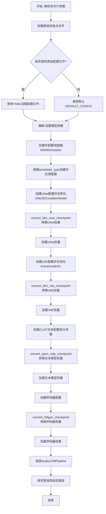
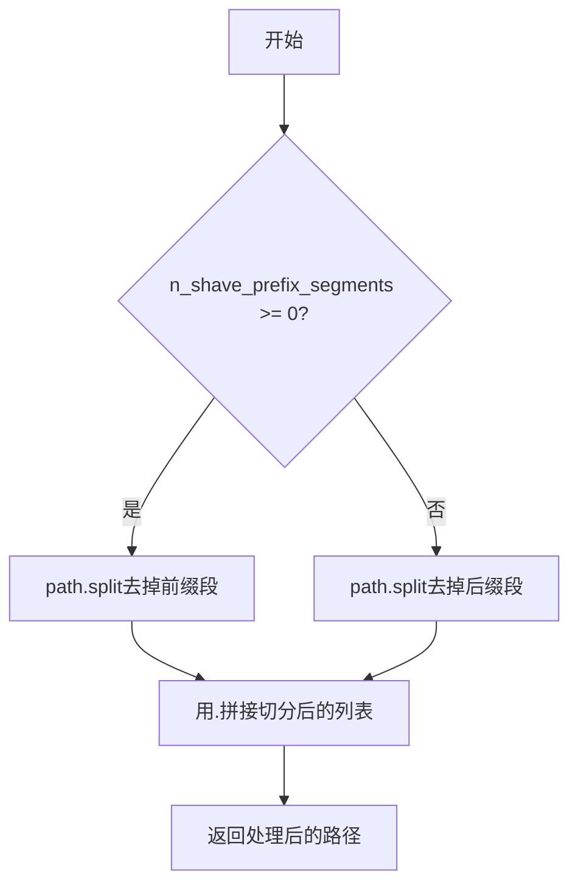
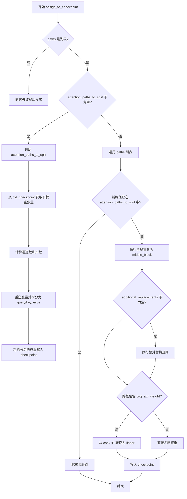
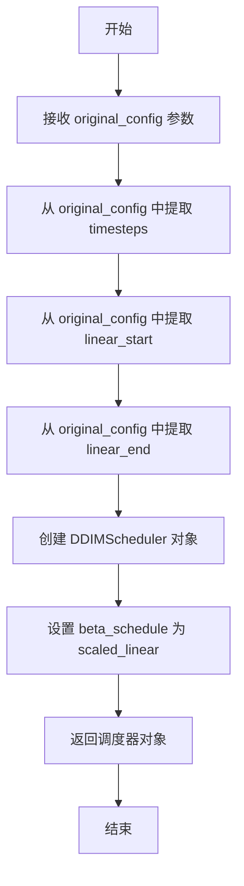
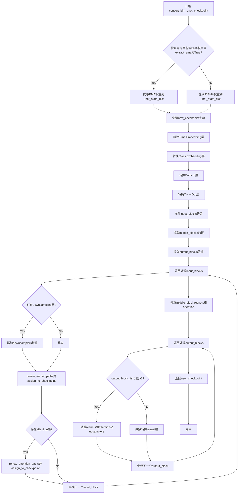
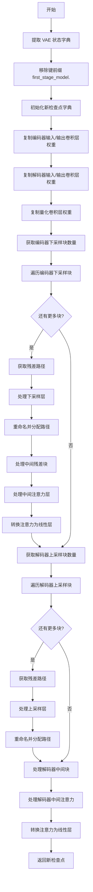
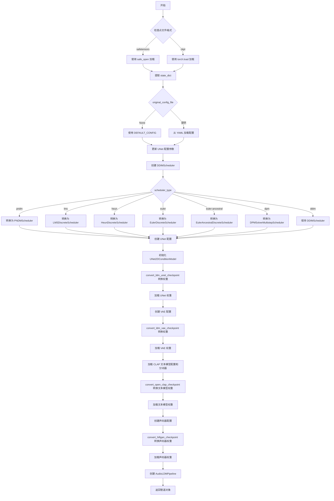

# `diffusers\scripts\convert_original_audioldm_to_diffusers.py` 详细设计文档

这是一个用于将AudioLDM检查点从原始格式转换为HuggingFace Diffusers格式的转换脚本，支持UNet、VAE、CLAP文本编码器和HiFiGAN声码器等组件的权重迁移和配置转换。

## 整体流程



## 类结构

```
脚本文件 (无类定义)
├── 全局配置变量
│   ├── CLAP_KEYS_TO_MODIFY_MAPPING
│   ├── CLAP_KEYS_TO_IGNORE
│   ├── CLAP_EXPECTED_MISSING_KEYS
│   └── DEFAULT_CONFIG
├── 路径转换辅助函数
│   ├── shave_segments
│   ├── renew_resnet_paths
│   ├── renew_vae_resnet_paths
│   ├── renew_attention_paths
│   └── renew_vae_attention_paths
├── 检查点分配函数
│   ├── assign_to_checkpoint
│   └── conv_attn_to_linear
├── 配置创建函数
│   ├── create_unet_diffusers_config
│   ├── create_vae_diffusers_config
│   ├── create_diffusers_schedular
create_transformers_vocoder_config
├── 检查点转换函数
convert_ldm_unet_checkpoint
convert_ldm_vae_checkpoint
convert_open_clap_checkpoint
convert_hifigan_checkpoint
└── 主加载函数
    └── load_pipeline_from_original_audioldm_ckpt
```

## 全局变量及字段


### `CLAP_KEYS_TO_MODIFY_MAPPING`
    
A dictionary that maps old CLAP model checkpoint keys to new transformer model key names for conversion

类型：`Dict[str, str]`
    


### `CLAP_KEYS_TO_IGNORE`
    
A list of key prefixes to ignore during CLAP checkpoint conversion

类型：`List[str]`
    


### `CLAP_EXPECTED_MISSING_KEYS`
    
A list of keys that are expected to be missing when loading CLAP text model state dict

类型：`List[str]`
    


### `DEFAULT_CONFIG`
    
Default configuration dictionary for AudioLDM model architecture including UNet, VAE, and vocoder parameters

类型：`Dict[str, Any]`
    


    

## 全局函数及方法


### `shave_segments`

该函数用于移除路径字符串中的特定段。当 `n_shave_prefix_segments` 为正值时，移除路径开头的相应数量的段；当为负值时，移除路径末尾的相应数量的段。常在模型权重转换过程中用于调整参数键名（state dict keys）。

参数：

- `path`：`str`，原始路径字符串（例如 `"input_blocks.0.0.weight"`）
- `n_shave_prefix_segments`：`int`，默认值为 `1`，指定要移除的段数量。正值移除开头的段，负值移除末尾的段

返回值：`str`，返回处理后的路径字符串

#### 流程图



#### 带注释源码

```python
# Copied from diffusers.pipelines.stable_diffusion.convert_from_ckpt.shave_segments
def shave_segments(path, n_shave_prefix_segments=1):
    """
    Removes segments. Positive values shave the first segments, negative shave the last segments.
    
    参数:
        path: 原始路径字符串
        n_shave_prefix_segments: 要移除的段数量，正值移除开头，负值移除末尾
    
    返回:
        处理后的路径字符串
    """
    # 判断是否移除前缀段
    if n_shave_prefix_segments >= 0:
        # 正值：从指定位置开始取后面的所有段
        # 例如 path="input_blocks.0.0.weight", n_shave_prefix_segments=1
        # split后得到['input_blocks', '0', '0', 'weight']
        # [1:]取['0', '0', 'weight']，再join得到'0.0.weight'
        return ".".join(path.split(".")[n_shave_prefix_segments:])
    else:
        # 负值：取从开头到指定位置的段
        # 例如 path="input_blocks.0.0.weight", n_shave_prefix_segments=-1
        # split后得到['input_blocks', '0', '0', 'weight']
        # [:-1]取['input_blocks', '0', '0']，再join得到'input_blocks.0.0'
        return ".".join(path.split(".")[:n_shave_prefix_segments])
```


### `renew_resnet_paths`

该函数用于将 AudioLDM/Stable Diffusion 模型中 ResNet 层的旧路径名称映射到新的 Diffusers 命名规范，实现从旧版检查点格式到新版格式的局部路径转换。

参数：

- `old_list`：`List[str]`，需要转换的旧路径名称列表
- `n_shave_prefix_segments`：`int`，可选参数，默认为 0，表示要从路径开头移除的段数（用于层级调整）

返回值：`List[Dict[str, str]]`，返回包含旧路径（`old`）和新路径（`new`）映射关系的字典列表

#### 流程图

```mermaid
flowchart TD
    A[开始] --> B[初始化空 mapping 列表]
    B --> C{遍历 old_list 中的每个 old_item}
    C --> D[将 'in_layers.0' 替换为 'norm1']
    D --> E[将 'in_layers.2' 替换为 'conv1']
    E --> F[将 'out_layers.0' 替换为 'norm2']
    F --> G[将 'out_layers.3' 替换为 'conv2']
    G --> H[将 'emb_layers.1' 替换为 'time_emb_proj']
    H --> I[将 'skip_connection' 替换为 'conv_shortcut']
    I --> J[调用 shave_segments 处理路径前缀]
    J --> K[将 {'old': old_item, 'new': new_item} 添加到 mapping]
    K --> C
    C --> L{遍历完成?}
    L --> M[返回 mapping 列表]
    M --> N[结束]
```

#### 带注释源码

```python
# Copied from diffusers.pipelines.stable_diffusion.convert_from_ckpt.renew_resnet_paths
def renew_resnet_paths(old_list, n_shave_prefix_segments=0):
    """
    Updates paths inside resnets to the new naming scheme (local renaming)
    
    将 ResNet 层的路径从旧命名方式转换为新命名方式。
    这个函数处理的是模型内部的局部重命名，用于兼容旧的检查点格式。
    """
    # 初始化结果列表，用于存储旧路径到新路径的映射关系
    mapping = []
    
    # 遍历输入的每一个旧路径项
    for old_item in old_list:
        # 首先将旧字符串替换为新的命名规范
        
        # 替换输入层的归一化层名称：in_layers.0 -> norm1
        new_item = old_item.replace("in_layers.0", "norm1")
        # 替换输入层的卷积层名称：in_layers.2 -> conv1
        new_item = new_item.replace("in_layers.2", "conv1")
        
        # 替换输出层的归一化层名称：out_layers.0 -> norm2
        new_item = new_item.replace("out_layers.0", "norm2")
        # 替换输出层的卷积层名称：out_layers.3 -> conv2
        new_item = new_item.replace("out_layers.3", "conv2")
        
        # 替换时间嵌入投影层：emb_layers.1 -> time_emb_proj
        new_item = new_item.replace("emb_layers.1", "time_emb_proj")
        # 替换跳跃连接：skip_connection -> conv_shortcut
        new_item = new_item.replace("skip_connection", "conv_shortcut")
        
        # 调用 shave_segments 函数，根据 n_shave_prefix_segments 参数
        # 决定是否需要移除路径的前缀段（用于处理嵌套层级）
        new_item = shave_segments(new_item, n_shave_prefix_segments=n_shave_prefix_segments)
        
        # 将当前 old_item 到 new_item 的映射添加到结果列表中
        mapping.append({"old": old_item, "new": new_item})
    
    # 返回完整的映射列表
    return mapping
```


### `renew_vae_resnet_paths`

该函数是模型权重转换脚本中的关键辅助函数，专门用于将 AudioLDM（基于 LDM 架构）的 VAE（变分自编码器）ResNet 层的权重键名（Key）从原始格式重命名为 Hugging Face Diffusers 库兼容的新格式。它主要处理 `nin_shortcut` 到 `conv_shortcut` 的特定命名替换，并可选地修整路径前缀。

参数：

-  `old_list`：`List[str]`，需要转换的旧权重路径列表。
-  `n_shave_prefix_segments`：`int`（默认值 0），在路径重命名时传递给 `shave_segments` 函数的参数，用于去除路径字符串前端的特定段数（例如去除层索引）。

返回值：`List[Dict[str, str]]`，返回一个映射列表，其中每个元素是一个字典，包含原权重路径（`old`）和新权重路径（`new`），供后续的 `assign_to_checkpoint` 函数使用。

#### 流程图

```mermaid
flowchart TD
    A([开始]) --> B[输入: old_list, n_shave_prefix_segments]
    B --> C[初始化空列表 mapping]
    C --> D{遍历 old_list 中的每个元素}
    D -->|当前元素: old_item| E[new_item = old_item]
    E --> F{替换字符串 'nin_shortcut' -> 'conv_shortcut'}
    F --> G[调用 shave_segments 修整 new_item]
    G --> H[构造字典 {'old': old_item, 'new': new_item}]
    H --> I[将字典添加到 mapping 列表]
    I --> D
    D -->|遍历结束| J[返回 mapping]
    J --> K([结束])
```

#### 带注释源码

```python
# Copied from diffusers.pipelines.stable_diffusion.convert_from_ckpt.renew_vae_resnet_paths
def renew_vae_resnet_paths(old_list, n_shave_prefix_segments=0):
    """
    Updates paths inside resnets to the new naming scheme (local renaming)
    
    此函数用于在模型权重格式转换时，将旧版 VAE ResNet 的键名映射到新版 Diffusers 的键名。
    """
    mapping = []
    for old_item in old_list:
        new_item = old_item

        # 核心替换逻辑：将 LDM 风格命名的 'nin_shortcut' (短路连接) 
        # 替换为 Diffusers 风格命名的 'conv_shortcut'
        new_item = new_item.replace("nin_shortcut", "conv_shortcut")
        
        # 调用辅助函数 shave_segments 去除路径前缀，
        # n_shave_prefix_segments 参数决定了去除多少个以点号(.)分隔的前缀段
        new_item = shave_segments(new_item, n_shave_prefix_segments=n_shave_prefix_segments)

        # 将旧路径和新路径的对应关系存入列表
        mapping.append({"old": old_item, "new": new_item})

    return mapping
```


### `renew_attention_paths`

该函数用于将 AudioLDM 检查点中注意力层（attention layers）的路径更新为新的命名约定（本地重命名）。它接受一个旧路径列表，并返回包含旧路径和新路径对应关系的映射列表。

参数：

- `old_list`：`List[str]`，需要转换的原始注意力层路径列表

返回值：`List[Dict[str, str]]`，返回映射列表，其中每个字典包含 `old`（原始路径）和 `new`（新路径）两个键

#### 流程图

```mermaid
flowchart TD
    A[开始] --> B[初始化空映射列表 mapping]
    B --> C{遍历 old_list 中的每个 old_item}
    C -->|是| D[将 old_item 赋值给 new_item]
    D --> E[注释掉的替换操作:<br/>norm.weight -> group_norm.weight<br/>norm.bias -> group_norm.bias<br/>proj_out.weight -> proj_attn.weight<br/>proj_out.bias -> proj_attn.bias]
    E --> F[将映射 {'old': old_item, 'new': new_item} 添加到 mapping 列表]
    F --> C
    C -->|否| G[返回 mapping 列表]
    G --> H[结束]
```

#### 带注释源码

```python
# Copied from diffusers.pipelines.stable_diffusion.convert_from_ckpt.renew_attention_paths
def renew_attention_paths(old_list):
    """
    Updates paths inside attentions to the new naming scheme (local renaming)
    """
    # 初始化一个空列表用于存储路径映射
    mapping = []
    
    # 遍历传入的旧路径列表
    for old_item in old_list:
        # 将当前旧路径赋值给新路径变量
        new_item = old_item

        # 下面是被注释掉的替换规则，这些规则在当前版本中未启用
        # 如果需要启用，需要取消注释以下代码块：
        #         new_item = new_item.replace('norm.weight', 'group_norm.weight')
        #         new_item = new_item.replace('norm.bias', 'group_norm.bias')

        #         new_item = new_item.replace('proj_out.weight', 'proj_attn.weight')
        #         new_item = new_item.replace('proj_out.bias', 'proj_attn.bias')

        #         new_item = shave_segments(new_item, n_shave_prefix_segments=n_shave_prefix_segments)

        # 将旧路径和新路径的映射添加到列表中
        mapping.append({"old": old_item, "new": new_item})

    # 返回路径映射列表
    return mapping
```


### `renew_vae_attention_paths`

该函数用于更新 VAE（变分自编码器）模型中注意力层（attention layers）的参数路径名称，将其从旧的命名方案转换为新的 Diffusers 库所期望的命名约定。它执行一系列字符串替换操作，将原始权重名称映射到新的结构化名称。

参数：

- `old_list`：`List[str]`，包含需要转换的旧权重路径字符串列表
- `n_shave_prefix_segments`：`int`，默认为 0，指定要从路径开头移除的分段数量

返回值：`List[Dict[str, str]]`，返回字典列表，每个字典包含 `"old"`（原始路径）和 `"new"`（新路径）键值对

#### 流程图

```mermaid
flowchart TD
    A[开始] --> B[初始化空列表 mapping]
    B --> C{遍历 old_list 中的每个 old_item}
    C -->|是| D[复制 old_item 到 new_item]
    D --> E["替换: norm.weight → group_norm.weight"]
    E --> F["替换: norm.bias → group_norm.bias"]
    F --> G["替换: q.weight → query.weight"]
    G --> H["替换: q.bias → query.bias"]
    H --> I["替换: k.weight → key.weight"]
    I --> J["替换: k.bias → key.bias"]
    J --> K["替换: v.weight → value.weight"]
    K --> L["替换: v.bias → value.bias"]
    L --> M["替换: proj_out.weight → proj_attn.weight"]
    M --> N["替换: proj_out.bias → proj_attn.bias"]
    N --> O[调用 shave_segments 修整路径前缀]
    O --> P[将 {old, new} 字典添加到 mapping 列表]
    P --> C
    C -->|否| Q[返回 mapping 列表]
    Q --> Z[结束]
```

#### 带注释源码

```python
# Copied from diffusers.pipelines.stable_diffusion.convert_from_ckpt.renew_vae_attention_paths
def renew_vae_attention_paths(old_list, n_shave_prefix_segments=0):
    """
    Updates paths inside attentions to the new naming scheme (local renaming)
    """
    mapping = []
    # 遍历每个需要转换的旧权重路径
    for old_item in old_list:
        new_item = old_item

        # 将 norm.weight/bias 替换为 group_norm.weight/bias
        new_item = new_item.replace("norm.weight", "group_norm.weight")
        new_item = new_item.replace("norm.bias", "group_norm.bias")

        # 将 q.weight/bias 替换为 query.weight/bias
        new_item = new_item.replace("q.weight", "query.weight")
        new_item = new_item.replace("q.bias", "query.bias")

        # 将 k.weight/bias 替换为 key.weight/bias
        new_item = new_item.replace("k.weight", "key.weight")
        new_item = new_item.replace("k.bias", "key.bias")

        # 将 v.weight/bias 替换为 value.weight/bias
        new_item = new_item.replace("v.weight", "value.weight")
        new_item = new_item.replace("v.bias", "value.bias")

        # 将 proj_out.weight/bias 替换为 proj_attn.weight/bias
        new_item = new_item.replace("proj_out.weight", "proj_attn.weight")
        new_item = new_item.replace("proj_out.bias", "proj_attn.bias")

        # 调用 shave_segments 函数修整路径前缀段
        new_item = shave_segments(new_item, n_shave_prefix_segments=n_shave_prefix_segments)

        # 将原始路径和新路径作为字典添加到映射列表
        mapping.append({"old": old_item, "new": new_item})

    return mapping
```


### `assign_to_checkpoint`

该函数执行模型权重转换的最后步骤：接收本地转换后的权重路径列表，完成全局重命名，将旧检查点中的权重分配到新检查点中。如果提供了注意力路径，还会将合并的 QKV 权重拆分为 query、key、value 三个独立权重。

参数：

- `paths`：`list`，包含字典的列表，每个字典有 'old' 和 'new' 键，表示旧权重路径到新权重路径的映射
- `checkpoint`：`dict`，目标新检查点字典，用于存储转换后的权重
- `old_checkpoint`：`dict`，源旧检查点字典，包含待转换的原始权重
- `attention_paths_to_split`：`dict`，可选，需要拆分的注意力层路径映射，将合并的 QKV 拆分为 query/key/value
- `additional_replacements`：`list`，可选，额外的字符串替换规则列表，用于自定义路径重命名
- `config`：`dict`，可选，模型配置字典，用于获取 `num_head_channels` 等参数

返回值：`None`，函数直接修改 `checkpoint` 字典，无返回值

#### 流程图



#### 带注释源码

```python
# Copied from diffusers.pipelines.stable_diffusion.convert_from_ckpt.assign_to_checkpoint
def assign_to_checkpoint(
    paths, checkpoint, old_checkpoint, attention_paths_to_split=None, additional_replacements=None, config=None
):
    """
    This does the final conversion step: take locally converted weights and apply a global renaming to them. It splits
    attention layers, and takes into account additional replacements that may arise.

    Assigns the weights to the new checkpoint.
    """
    # 验证 paths 参数是否为列表类型，确保后续处理正确
    assert isinstance(paths, list), "Paths should be a list of dicts containing 'old' and 'new' keys."

    # 如果提供了注意力路径需要拆分，则处理 QKV 权重的拆分
    if attention_paths_to_split is not None:
        for path, path_map in attention_paths_to_split.items():
            # 从旧检查点获取原始 QKV 合并的权重张量
            old_tensor = old_checkpoint[path]
            # 通道数等于张量第一维除以3（因为是query、key、value合并）
            channels = old_tensor.shape[0] // 3

            # 根据张量维度确定目标形状
            target_shape = (-1, channels) if len(old_tensor.shape) == 3 else (-1)

            # 计算注意力头数
            num_heads = old_tensor.shape[0] // config["num_head_channels"] // 3

            # 重塑张量以分离不同的头
            old_tensor = old_tensor.reshape((num_heads, 3 * channels // num_heads) + old_tensor.shape[1:])
            # 在维度1上拆分得到 query、key、value
            query, key, value = old_tensor.split(channels // num_heads, dim=1)

            # 将拆分后的权重重塑为目标形状并写入新检查点
            checkpoint[path_map["query"]] = query.reshape(target_shape)
            checkpoint[path_map["key"]] = key.reshape(target_shape)
            checkpoint[path_map["value"]] = value.reshape(target_shape)

    # 遍历所有路径，进行全局重命名并复制权重
    for path in paths:
        new_path = path["new"]

        # 已经处理过的注意力路径，跳过
        if attention_paths_to_split is not None and new_path in attention_paths_to_split:
            continue

        # 全局重命名：将 middle_block 的旧命名转换为 diffusers 新的 mid_block 命名
        new_path = new_path.replace("middle_block.0", "mid_block.resnets.0")
        new_path = new_path.replace("middle_block.1", "mid_block.attentions.0")
        new_path = new_path.replace("middle_block.2", "mid_block.resnets.1")

        # 应用额外的自定义替换规则
        if additional_replacements is not None:
            for replacement in additional_replacements:
                new_path = new_path.replace(replacement["old"], replacement["new"])

        # proj_attn.weight 需要从卷积1D转换为线性层
        if "proj_attn.weight" in new_path:
            # 提取第一个切片作为线性层权重
            checkpoint[new_path] = old_checkpoint[path["old"]][:, :, 0]
        else:
            # 直接复制权重到新检查点
            checkpoint[new_path] = old_checkpoint[path["old"]]
```


### `conv_attn_to_linear`

该函数用于将 AudioLDM 模型中卷积形式的注意力权重（Conv1D）转换为线性层（Linear）权重。在从原始 AudioLDM 检查点转换为 diffusers 格式时，注意力层的权重以卷积形式存储，需要将其展平为线性层权重。

参数：

- `checkpoint`：`dict`，包含模型权重的检查点字典，直接在该字典上进行修改

返回值：`None`，该函数直接修改传入的 `checkpoint` 字典，无返回值

#### 流程图

```mermaid
flowchart TD
    A[开始: 传入 checkpoint 字典] --> B[获取所有键列表 keys]
    B --> C[定义注意力权重键列表 attn_keys]
    C --> D{遍历 keys 中的每个 key}
    D --> E{检查 key 的最后两部分是否在 attn_keys 中}
    E -->|是| F{检查 checkpoint[key] 维度是否大于 2}
    F -->|是| G[将权重切片 [:, :, 0, 0] 转换为线性权重]
    F -->|否| H{检查 key 是否包含 'proj_attn.weight'}
    E -->|否| H
    G --> H
    H -->|是| I{检查 checkpoint[key] 维度是否大于 2}
    H -->|否| J{检查是否还有更多 key}
    I -->|是| K[将权重切片 [:, :, 0] 转换为线性权重]
    I -->|否| J
    K --> J
    J -->|是| D
    J -->|否| L[结束]
```

#### 带注释源码

```python
# Copied from diffusers.pipelines.stable_diffusion.convert_from_ckpt.conv_attn_to_linear
def conv_attn_to_linear(checkpoint):
    """
    将卷积形式的注意力权重转换为线性层权重。
    
    在原始 AudioLDM 模型中，注意力层的 query、key、value 以及 proj_attn 
    是以 Conv1D（卷积）的形式存储的。diffusers 模型使用 nn.Linear，
    因此需要将卷积权重转换为线性权重。
    """
    # 获取检查点中所有键的列表
    keys = list(checkpoint.keys())
    # 定义需要转换的注意力权重键名
    attn_keys = ["query.weight", "key.weight", "value.weight"]
    
    # 遍历检查点中的所有键
    for key in keys:
        # 获取键名的最后两部分（例如："attentions.0.query.weight" -> "query.weight"）
        key_suffix = ".".join(key.split(".")[-2:])
        
        # 如果是 query、key、value 权重
        if key_suffix in attn_keys:
            # 检查权重维度是否大于 2（卷积权重通常是 3 维或 4 维）
            if checkpoint[key].ndim > 2:
                # 通过取第一个切片将卷积权重转换为线性权重
                # 例如：从 [channels, 3*channels, kernel_size] 转换为 [channels, 3*channels]
                checkpoint[key] = checkpoint[key][:, :, 0, 0]
        
        # 如果是 proj_attn.weight（投影注意力权重）
        elif "proj_attn.weight" in key:
            # 检查权重维度是否大于 2
            if checkpoint[key].ndim > 2:
                # 将卷积权重转换为线性权重
                checkpoint[key] = checkpoint[key][:, :, 0]
```


### `create_unet_diffusers_config`

该函数用于将原始 AudioLDM 模型的 UNet 配置转换为 Diffusers 库所需的格式，通过提取原始配置中的 UNet 参数（如通道数、注意力分辨率、残差块数量等）并映射为 Diffusers 的 UNet2DConditionModel 构造函数所需的标准配置字典。

#### 参数

- `original_config`：`dict`，原始 AudioLDM 模型的完整配置文件（YAML 加载的字典），包含 model、params、unet_config 等嵌套结构
- `image_size`：`int`，模型训练时使用的图像尺寸，用于计算 UNet 的 sample_size

#### 返回值

`dict`，返回 Diffusers 格式的 UNet 配置字典，包含以下关键字段：
- `sample_size`：UNet 输入样本的空间尺寸
- `in_channels` / `out_channels`：输入输出通道数
- `down_block_types` / `up_block_types`：下采样/上采样块类型元组
- `block_out_channels`：各阶段输出通道数元组
- `layers_per_block`：每个阶段残差层数量
- `cross_attention_dim`：交叉注意力维度
- `class_embed_type` / `projection_class_embeddings_input_dim` / `class_embeddings_concat`：可选的类别嵌入配置

#### 流程图

```mermaid
flowchart TD
    A[开始] --> B[从 original_config 提取 unet_params 和 vae_params]
    B --> C[计算 block_out_channels: model_channels × channel_mult]
    C --> D[遍历 block_out_channels 构建 down_block_types]
    D --> E[根据 attention_resolutions 判断使用 CrossAttnDownBlock2D 或 DownBlock2D]
    E --> F[构建 up_block_types]
    F --> G[计算 vae_scale_factor: 2^(len(ch_mult) - 1)]
    G --> H[提取或推断 cross_attention_dim]
    H --> I[检查并设置 class_embed_type 相关参数]
    I --> J[组装完整配置字典]
    J --> K[返回 config]
```

#### 带注释源码

```python
def create_unet_diffusers_config(original_config, image_size: int):
    """
    Creates a UNet config for diffusers based on the config of the original AudioLDM model.
    """
    # 从原始配置中提取 UNet 相关参数
    unet_params = original_config["model"]["params"]["unet_config"]["params"]
    # 从原始配置中提取 VAE 相关参数（用于计算 scale_factor）
    vae_params = original_config["model"]["params"]["first_stage_config"]["params"]["ddconfig"]

    # 根据 channel_mult 计算各阶段的输出通道数
    # 例如: model_channels=128, channel_mult=[1,2,3,5] -> [128, 256, 384, 640]
    block_out_channels = [unet_params["model_channels"] * mult for mult in unet_params["channel_mult"]]

    # 构建下采样块类型列表
    down_block_types = []
    resolution = 1
    for i in range(len(block_out_channels)):
        # 如果当前分辨率在 attention_resolutions 中，使用交叉注意力块
        block_type = "CrossAttnDownBlock2D" if resolution in unet_params["attention_resolutions"] else "DownBlock2D"
        down_block_types.append(block_type)
        if i != len(block_out_channels) - 1:
            resolution *= 2  # 分辨率翻倍

    # 构建上采样块类型列表（逆序遍历）
    up_block_types = []
    for i in range(len(block_out_channels)):
        block_type = "CrossAttnUpBlock2D" if resolution in unet_params["attention_resolutions"] else "UpBlock2D"
        up_block_types.append(block_type)
        resolution //= 2  # 分辨率减半

    # 计算 VAE 缩放因子，用于调整潜在空间的采样尺寸
    vae_scale_factor = 2 ** (len(vae_params["ch_mult"]) - 1)

    # 确定交叉注意力维度，如果未指定则使用 block_out_channels
    cross_attention_dim = (
        unet_params["cross_attention_dim"] if "cross_attention_dim" in unet_params else block_out_channels
    )

    # 处理 Film（FILM: Feature-wise Linear Modulation）条件嵌入相关配置
    class_embed_type = "simple_projection" if "extra_film_condition_dim" in unet_params else None
    projection_class_embeddings_input_dim = (
        unet_params["extra_film_condition_dim"] if "extra_film_condition_dim" in unet_params else None
    )
    class_embeddings_concat = unet_params["extra_film_use_concat"] if "extra_film_use_concat" in unet_params else None

    # 组装最终的 Diffusers 格式配置字典
    config = {
        "sample_size": image_size // vae_scale_factor,  # 根据 VAE 缩放因子调整样本尺寸
        "in_channels": unet_params["in_channels"],       # UNet 输入通道数
        "out_channels": unet_params["out_channels"],     # UNet 输出通道数
        "down_block_types": tuple(down_block_types),     # 下采样块类型
        "up_block_types": tuple(up_block_types),         # 上采样块类型
        "block_out_channels": tuple(block_out_channels),# 各阶段输出通道
        "layers_per_block": unet_params["num_res_blocks"],# 每块残差层数
        "cross_attention_dim": cross_attention_dim,      # 交叉注意力维度
        "class_embed_type": class_embed_type,            # 类别嵌入类型
        "projection_class_embeddings_input_dim": projection_class_embeddings_input_dim,
        "class_embeddings_concat": class_embeddings_concat,
    }

    return config
```


### `create_vae_diffusers_config`

该函数用于将原始 AudioLDM 模型的 VAE 配置转换为 diffusers 库所需的格式。它从原始配置中提取 VAE 参数，并根据是否为标准模型或学习到的 VAE  Scaling Factor 来计算合适的缩放因子，最终返回一个完整的 VAE 配置字典。

参数：

- `original_config`：`Dict`，原始 AudioLDM 模型的配置文件，包含模型结构和参数信息
- `checkpoint`：`Dict`，原始模型的检查点文件，包含权重和缩放因子等信息
- `image_size`：`int`，模型训练时使用的图像尺寸

返回值：`Dict`，返回包含 diffusers VAE 所需配置的字典，包括样本尺寸、输入输出通道数、块类型、通道数、潜在通道数、每层块数和缩放因子等。

#### 流程图

```mermaid
flowchart TD
    A[开始] --> B[提取VAE参数<br/>original_config["model"]["params"]["first_stage_config"]["params"]["ddconfig"]]
    B --> C[计算block_out_channels<br/>vae_params["ch"] * mult for mult in vae_params["ch_mult"]]
    C --> D[设置down_block_types<br/>DownEncoderBlock2D列表]
    D --> E[设置up_block_types<br/>UpDecoderBlock2D列表]
    E --> F{检查scale_by_std<br/>"scale_by_std" in original_config["model"]["params"]?}
    F -->|是| G[使用checkpoint的scale_factor]
    F -->|否| H[使用默认0.18215]
    G --> I[组装config字典]
    H --> I
    I --> J[返回config字典]
```

#### 带注释源码

```python
# Adapted from diffusers.pipelines.stable_diffusion.convert_from_ckpt.create_vae_diffusers_config
def create_vae_diffusers_config(original_config, checkpoint, image_size: int):
    """
    Creates a VAE config for diffusers based on the config of the original AudioLDM model. Compared to the original
    Stable Diffusion conversion, this function passes a *learnt* VAE scaling factor to the diffusers VAE.
    """
    # 从原始配置中提取VAE的ddconfig参数
    vae_params = original_config["model"]["params"]["first_stage_config"]["params"]["ddconfig"]
    # 提取embed_dim（虽然这里用下划线表示不感兴趣，但实际上在AudioLDM中这个值存在）
    _ = original_config["model"]["params"]["first_stage_config"]["params"]["embed_dim"]

    # 根据ch_mult计算每个阶段的输出通道数
    block_out_channels = [vae_params["ch"] * mult for mult in vae_params["ch_mult"]]
    # 设置下采样块的类型为DownEncoderBlock2D
    down_block_types = ["DownEncoderBlock2D"] * len(block_out_channels)
    # 设置上采样块的类型为UpDecoderBlock2D
    up_block_types = ["UpDecoderBlock2D"] * len(block_out_channels)

    # 确定缩放因子：如果模型配置中包含scale_by_std，则使用checkpoint中的scale_factor
    # 否则使用Stable Diffusion的默认VAE缩放因子0.18215
    scaling_factor = checkpoint["scale_factor"] if "scale_by_std" in original_config["model"]["params"] else 0.18215

    # 组装最终的VAE配置字典
    config = {
        "sample_size": image_size,                      # 样本尺寸
        "in_channels": vae_params["in_channels"],       # 输入通道数
        "out_channels": vae_params["out_ch"],           # 输出通道数
        "down_block_types": tuple(down_block_types),   # 下采样块类型元组
        "up_block_types": tuple(up_block_types),       # 上采样块类型元组
        "block_out_channels": tuple(block_out_channels),# 块输出通道数元组
        "latent_channels": vae_params["z_channels"],   # 潜在空间通道数
        "layers_per_block": vae_params["num_res_blocks"],# 每个块的残差层数
        "scaling_factor": float(scaling_factor),        # VAE缩放因子
    }
    return config
```


### `create_diffusers_schedular`

该函数用于从原始 AudioLDM 模型的配置中创建并返回一个 Diffusers 库中的 DDIMScheduler（DDIM 调度器），将原始模型的噪声调度参数转换为 Diffusers 格式。

参数：

- `original_config`：`dict`，原始 AudioLDM 模型的配置文件，包含 `model.params.timesteps`、`model.params.linear_start`、`model.params.linear_end` 等键值，用于提取噪声调度的关键参数。

返回值：`DDIMScheduler`，Diffusers 库中的 DDIM 调度器对象，用于在扩散模型的采样过程中控制噪声调度。

#### 流程图



#### 带注释源码

```python
# Copied from diffusers.pipelines.stable_diffusion.convert_from_ckpt.create_diffusers_schedular
def create_diffusers_schedular(original_config):
    """
    创建并返回一个基于原始 AudioLDM 模型配置的 Diffusers DDIMScheduler 对象。
    
    该函数从 original_config 中提取噪声调度的关键参数（timesteps、beta_start、beta_end），
    并使用这些参数初始化 Diffusers 库中的 DDIMScheduler。
    """
    # 使用 DDIMScheduler 构造函数创建调度器
    # 参数 num_train_timesteps: 训练时的总时间步数
    # 参数 beta_start: 噪声调度起始 beta 值
    # 参数 beta_end: 噪声调度结束 beta 值
    # 参数 beta_schedule: beta 调度策略，此处使用 scaled_linear
    schedular = DDIMScheduler(
        num_train_timesteps=original_config["model"]["params"]["timesteps"],
        beta_start=original_config["model"]["params"]["linear_start"],
        beta_end=original_config["model"]["params"]["linear_end"],
        beta_schedule="scaled_linear",
    )
    # 返回配置好的 DDIMScheduler 对象
    return schedular
```


### `convert_ldm_unet_checkpoint`

该函数用于将 AudioLDM 模型的 UNet 检查点转换为 Diffusers 格式。它从原始检查点中提取 UNet 权重，处理 EMA 权重（如有），并将各层（时间嵌入、类嵌入、输入块、中间块、输出块）重新映射到 Diffusers 架构命名约定，同时特别处理了 Film 嵌入层。

参数：

- `checkpoint`：`dict`，原始 AudioLDM 检查点的完整状态字典
- `config`：`dict`，UNet 配置字典，包含 `layers_per_block`、`cross_attention_dim` 等参数
- `path`：`str` 或 `None`，原始检查点文件路径，用于打印信息（可选）
- `extract_ema`：`bool`，是否从检查点中提取 EMA 权重，默认为 False

返回值：`dict`，转换后的 Diffusers 格式 UNet 检查点状态字典

#### 流程图



#### 带注释源码

```python
# Adapted from diffusers.pipelines.stable_diffusion.convert_from_ckpt.convert_ldm_unet_checkpoint
def convert_ldm_unet_checkpoint(checkpoint, config, path=None, extract_ema=False):
    """
    Takes a state dict and a config, and returns a converted checkpoint. Compared to the original Stable Diffusion
    conversion, this function additionally converts the learnt film embedding linear layer.
    """

    # 提取 UNet 相关的状态字典
    # 初始化空字典用于存储 UNet 权重
    unet_state_dict = {}
    # 获取检查点中所有键的列表
    keys = list(checkpoint.keys())

    # 定义 UNet 在原始检查点中的键前缀
    unet_key = "model.diffusion_model."
    
    # 判断是否需要提取 EMA 权重：
    # 如果超过100个参数以 'model_ema' 开头，则认为该检查点包含 EMA 权重
    if sum(k.startswith("model_ema") for k in keys) > 100 and extract_ema:
        print(f"Checkpoint {path} has both EMA and non-EMA weights.")
        print(
            "In this conversion only the EMA weights are extracted. If you want to instead extract the non-EMA"
            " weights (useful to continue fine-tuning), please make sure to remove the `--extract_ema` flag."
        )
        # 从 EMA 权重中提取 UNet 权重
        for key in keys:
            if key.startswith(unet_key):
                # 将 EMA 键转换为 UNet 键
                flat_ema_key = "model_ema." + "".join(key.split(".")[1:])
                unet_state_dict[key.replace(unet_key, "")] = checkpoint.pop(flat_ema_key)
    else:
        # 检查是否存在 EMA 权重但未选择提取
        if sum(k.startswith("model_ema") for k in keys) > 100:
            print(
                "In this conversion only the non-EMA weights are extracted. If you want to instead extract the EMA"
                " weights (usually better for inference), please make sure to add the `--extract_ema` flag."
            )

        # 提取非 EMA 权重
        for key in keys:
            if key.startswith(unet_key):
                # 移除前缀 'model.diffusion_model.'
                unet_state_dict[key.replace(unet_key, "")] = checkpoint.pop(key)

    # 初始化新的检查点字典
    new_checkpoint = {}

    # 转换时间嵌入层 (Time Embedding)
    # 将原始的 'time_embed.0.weight' 转换为 'time_embedding.linear_1.weight'
    new_checkpoint["time_embedding.linear_1.weight"] = unet_state_dict["time_embed.0.weight"]
    new_checkpoint["time_embedding.linear_1.bias"] = unet_state_dict["time_embed.0.bias"]
    new_checkpoint["time_embedding.linear_2.weight"] = unet_state_dict["time_embed.2.weight"]
    new_checkpoint["time_embedding.linear_2.bias"] = unet_state_dict["time_embed.2.bias"]

    # 转换 Film 嵌入层 (Class Embedding)
    # AudioLDM 特有的 learnt film embedding 线性层
    new_checkpoint["class_embedding.weight"] = unet_state_dict["film_emb.weight"]
    new_checkpoint["class_embedding.bias"] = unet_state_dict["film_emb.bias"]

    # 转换输入卷积层 (Conv In)
    new_checkpoint["conv_in.weight"] = unet_state_dict["input_blocks.0.0.weight"]
    new_checkpoint["conv_in.bias"] = unet_state_dict["input_blocks.0.0.bias"]

    # 转换输出卷积层 (Conv Out)
    new_checkpoint["conv_norm_out.weight"] = unet_state_dict["out.0.weight"]
    new_checkpoint["conv_norm_out.bias"] = unet_state_dict["out.0.bias"]
    new_checkpoint["conv_out.weight"] = unet_state_dict["out.2.weight"]
    new_checkpoint["conv_out.bias"] = unet_state_dict["out.2.bias"]

    # 提取输入块的键
    # 通过集合操作获取唯一的输入块数量
    num_input_blocks = len({".".join(layer.split(".")[:2]) for layer in unet_state_dict if "input_blocks" in layer})
    # 为每个输入块创建键列表
    input_blocks = {
        layer_id: [key for key in unet_state_dict if f"input_blocks.{layer_id}" in key]
        for layer_id in range(num_input_blocks)
    }

    # 提取中间块的键
    num_middle_blocks = len({".".join(layer.split(".")[:2]) for layer in unet_state_dict if "middle_block" in layer})
    middle_blocks = {
        layer_id: [key for key in unet_state_dict if f"middle_block.{layer_id}" in key]
        for layer_id in range(num_middle_blocks)
    }

    # 提取输出块的键
    num_output_blocks = len({".".join(layer.split(".")[:2]) for layer in unet_state_dict if "output_blocks" in layer})
    output_blocks = {
        layer_id: [key for key in unet_state_dict if f"output_blocks.{layer_id}" in key]
        for layer_id in range(num_output_blocks)
    }

    # 处理输入块 (Down Blocks)
    # 遍历所有输入块（跳过索引0，因为它是输入卷积层）
    for i in range(1, num_input_blocks):
        # 计算块ID和层ID
        block_id = (i - 1) // (config["layers_per_block"] + 1)
        layer_in_block_id = (i - 1) % (config["layers_per_block"] + 1)

        # 提取当前输入块中的 resnet 和 attention 键
        resnets = [
            key for key in input_blocks[i] if f"input_blocks.{i}.0" in key and f"input_blocks.{i}.0.op" not in key
        ]
        attentions = [key for key in input_blocks[i] if f"input_blocks.{i}.1" in key]

        # 检查是否存在下采样层 (downsampling)
        if f"input_blocks.{i}.0.op.weight" in unet_state_dict:
            new_checkpoint[f"down_blocks.{block_id}.downsamplers.0.conv.weight"] = unet_state_dict.pop(
                f"input_blocks.{i}.0.op.weight"
            )
            new_checkpoint[f"down_blocks.{block_id}.downsamplers.0.conv.bias"] = unet_state_dict.pop(
                f"input_blocks.{i}.0.op.bias"
            )

        # 转换 ResNet 层
        paths = renew_resnet_paths(resnets)
        meta_path = {"old": f"input_blocks.{i}.0", "new": f"down_blocks.{block_id}.resnets.{layer_in_block_id}"}
        assign_to_checkpoint(
            paths, new_checkpoint, unet_state_dict, additional_replacements=[meta_path], config=config
        )

        # 转换 Attention 层
        if len(attentions):
            paths = renew_attention_paths(attentions)
            meta_path = {"old": f"input_blocks.{i}.1", "new": f"down_blocks.{block_id}.attentions.{layer_in_block_id}"}
            assign_to_checkpoint(
                paths, new_checkpoint, unet_state_dict, additional_replacements=[meta_path], config=config
            )

    # 处理中间块 (Middle Block)
    resnet_0 = middle_blocks[0]
    attentions = middle_blocks[1]
    resnet_1 = middle_blocks[2]

    # 转换中间块的 ResNet 层
    resnet_0_paths = renew_resnet_paths(resnet_0)
    assign_to_checkpoint(resnet_0_paths, new_checkpoint, unet_state_dict, config=config)

    resnet_1_paths = renew_resnet_paths(resnet_1)
    assign_to_checkpoint(resnet_1_paths, new_checkpoint, unet_state_dict, config=config)

    # 转换中间块的 Attention 层
    attentions_paths = renew_attention_paths(attentions)
    meta_path = {"old": "middle_block.1", "new": "mid_block.attentions.0"}
    assign_to_checkpoint(
        attentions_paths, new_checkpoint, unet_state_dict, additional_replacements=[meta_path], config=config
    )

    # 处理输出块 (Up Blocks)
    for i in range(num_output_blocks):
        # 计算块ID和层ID
        block_id = i // (config["layers_per_block"] + 1)
        layer_in_block_id = i % (config["layers_per_block"] + 1)
        
        # 提取输出块层名称
        output_block_layers = [shave_segments(name, 2) for name in output_blocks[i]]
        output_block_list = {}

        # 整理层信息
        for layer in output_block_layers:
            layer_id, layer_name = layer.split(".")[0], shave_segments(layer, 1)
            if layer_id in output_block_list:
                output_block_list[layer_id].append(layer_name)
            else:
                output_block_list[layer_id] = [layer_name]

        # 处理包含多个层的输出块
        if len(output_block_list) > 1:
            resnets = [key for key in output_blocks[i] if f"output_blocks.{i}.0" in key]
            attentions = [key for key in output_blocks[i] if f"output_blocks.{i}.1" in key]

            # 转换 ResNet 层
            resnet_0_paths = renew_resnet_paths(resnets)
            paths = renew_resnet_paths(resnets)

            meta_path = {"old": f"output_blocks.{i}.0", "new": f"up_blocks.{block_id}.resnets.{layer_in_block_id}"}
            assign_to_checkpoint(
                paths, new_checkpoint, unet_state_dict, additional_replacements=[meta_path], config=config
            )

            # 处理上采样层 (Upsampling)
            output_block_list = {k: sorted(v) for k, v in output_block_list.items()}
            if ["conv.bias", "conv.weight"] in output_block_list.values():
                index = list(output_block_list.values()).index(["conv.bias", "conv.weight"])
                new_checkpoint[f"up_blocks.{block_id}.upsamplers.0.conv.weight"] = unet_state_dict[
                    f"output_blocks.{i}.{index}.conv.weight"
                ]
                new_checkpoint[f"up_blocks.{block_id}.upsamplers.0.conv.bias"] = unet_state_dict[
                    f"output_blocks.{i}.{index}.conv.bias"
                ]

                # 清除已处理的 attention
                if len(attentions) == 2:
                    attentions = []

            # 转换 Attention 层
            if len(attentions):
                paths = renew_attention_paths(attentions)
                meta_path = {
                    "old": f"output_blocks.{i}.1",
                    "new": f"up_blocks.{block_id}.attentions.{layer_in_block_id}",
                }
                assign_to_checkpoint(
                    paths, new_checkpoint, unet_state_dict, additional_replacements=[meta_path], config=config
                )
        else:
            # 处理单个层的输出块（直接转换）
            resnet_0_paths = renew_resnet_paths(output_block_layers, n_shave_prefix_segments=1)
            for path in resnet_0_paths:
                old_path = ".".join(["output_blocks", str(i), path["old"]])
                new_path = ".".join(["up_blocks", str(block_id), "resnets", str(layer_in_block_id), path["new"]])

                new_checkpoint[new_path] = unet_state_dict[old_path]

    # 返回转换后的检查点
    return new_checkpoint
```


### `convert_ldm_vae_checkpoint`

该函数负责将 AudioLDM 模型中的 VAE（变分自编码器）检查点从原始格式转换为 Diffusers 库兼容的格式，处理编码器和解码器的权重映射、注意力机制重命名以及残差块的路径更新。

参数：

- `checkpoint`：`Dict[str, torch.Tensor]` 原始 AudioLDM 检查点字典，包含 VAE 权重
- `config`：`Dict[str, Any]` VAE 配置字典，包含模型架构参数（如 `sample_size`、`in_channels`、`block_out_channels` 等）

返回值：`Dict[str, torch.Tensor]`，返回转换后的 Diffusers 格式 VAE 检查点

#### 流程图



#### 带注释源码

```python
# 将 LDM VAE 检查点转换为 Diffusers 格式
def convert_ldm_vae_checkpoint(checkpoint, config):
    # 提取 VAE 状态字典
    vae_state_dict = {}
    vae_key = "first_stage_model."  # 原始检查点中 VAE 的键前缀
    keys = list(checkpoint.keys())
    
    # 遍历检查点中的键，提取 VAE 相关权重
    for key in keys:
        if key.startswith(vae_key):
            # 移除前缀并添加到 VAE 状态字典
            vae_state_dict[key.replace(vae_key, "")] = checkpoint.get(key)

    # 初始化新的检查点字典
    new_checkpoint = {}

    # 复制编码器的输入卷积层权重和偏置
    new_checkpoint["encoder.conv_in.weight"] = vae_state_dict["encoder.conv_in.weight"]
    new_checkpoint["encoder.conv_in.bias"] = vae_state_dict["encoder.conv_in.bias"]
    
    # 复制编码器的输出卷积层权重和偏置
    new_checkpoint["encoder.conv_out.weight"] = vae_state_dict["encoder.conv_out.weight"]
    new_checkpoint["encoder.conv_out.bias"] = vae_state_dict["encoder.conv_out.bias"]
    
    # 复制编码器的归一化层权重和偏置
    new_checkpoint["encoder.conv_norm_out.weight"] = vae_state_dict["encoder.norm_out.weight"]
    new_checkpoint["encoder.conv_norm_out.bias"] = vae_state_dict["encoder.norm_out.bias"]

    # 复制解码器的输入卷积层权重和偏置
    new_checkpoint["decoder.conv_in.weight"] = vae_state_dict["decoder.conv_in.weight"]
    new_checkpoint["decoder.conv_in.bias"] = vae_state_dict["decoder.conv_in.bias"]
    
    # 复制解码器的输出卷积层权重和偏置
    new_checkpoint["decoder.conv_out.weight"] = vae_state_dict["decoder.conv_out.weight"]
    new_checkpoint["decoder.conv_out.bias"] = vae_state_dict["decoder.conv_out.bias"]
    
    # 复制解码器的归一化层权重和偏置
    new_checkpoint["decoder.conv_norm_out.weight"] = vae_state_dict["decoder.norm_out.weight"]
    new_checkpoint["decoder.conv_norm_out.bias"] = vae_state_dict["decoder.norm_out.bias"]

    # 复制量化卷积层权重（用于潜在空间量化）
    new_checkpoint["quant_conv.weight"] = vae_state_dict["quant_conv.weight"]
    new_checkpoint["quant_conv.bias"] = vae_state_dict["quant_conv.bias"]
    
    # 复制后量化卷积层权重
    new_checkpoint["post_quant_conv.weight"] = vae_state_dict["post_quant_conv.weight"]
    new_checkpoint["post_quant_conv.bias"] = vae_state_dict["post_quant_conv.bias"]

    # 获取编码器下采样块的数量
    # 通过查找 "encoder.down" 模式来确定块的数量
    num_down_blocks = len({".".join(layer.split(".")[:3]) for layer in vae_state_dict if "encoder.down" in layer})
    
    # 创建下采样块到键的映射字典
    down_blocks = {
        layer_id: [key for key in vae_state_dict if f"down.{layer_id}" in key] 
        for layer_id in range(num_down_blocks)
    }

    # 获取解码器上采样块的数量
    num_up_blocks = len({".".join(layer.split(".")[:3]) for layer in vae_state_dict if "decoder.up" in layer})
    
    # 创建上采样块到键的映射字典
    up_blocks = {
        layer_id: [key for key in vae_state_dict if f"up.{layer_id}" in key] 
        for layer_id in range(num_up_blocks)
    }

    # 遍历编码器的每个下采样块
    for i in range(num_down_blocks):
        # 获取当前块的残差网络路径（下采样层除外）
        resnets = [key for key in down_blocks[i] if f"down.{i}" in key and f"down.{i}.downsample" not in key]

        # 如果存在下采样卷积层，提取并重命名
        if f"encoder.down.{i}.downsample.conv.weight" in vae_state_dict:
            new_checkpoint[f"encoder.down_blocks.{i}.downsamplers.0.conv.weight"] = vae_state_dict.pop(
                f"encoder.down.{i}.downsample.conv.weight"
            )
            new_checkpoint[f"encoder.down_blocks.{i}.downsamplers.0.conv.bias"] = vae_state_dict.pop(
                f"encoder.down.{i}.downsample.conv.bias"
            )

        # 重命名残差路径并分配到新检查点
        paths = renew_vae_resnet_paths(resnets)
        meta_path = {"old": f"down.{i}.block", "new": f"down_blocks.{i}.resnets"}
        assign_to_checkpoint(paths, new_checkpoint, vae_state_dict, additional_replacements=[meta_path], config=config)

    # 处理编码器中间残差块（2个块）
    mid_resnets = [key for key in vae_state_dict if "encoder.mid.block" in key]
    num_mid_res_blocks = 2
    for i in range(1, num_mid_res_blocks + 1):
        resnets = [key for key in mid_resnets if f"encoder.mid.block_{i}" in key]

        paths = renew_vae_resnet_paths(resnets)
        meta_path = {"old": f"mid.block_{i}", "new": f"mid_block.resnets.{i - 1}"}
        assign_to_checkpoint(paths, new_checkpoint, vae_state_dict, additional_replacements=[meta_path], config=config)

    # 处理编码器中间注意力层
    mid_attentions = [key for key in vae_state_dict if "encoder.mid.attn" in key]
    paths = renew_vae_attention_paths(mid_attentions)
    meta_path = {"old": "mid.attn_1", "new": "mid_block.attentions.0"}
    assign_to_checkpoint(paths, new_checkpoint, vae_state_dict, additional_replacements=[meta_path], config=config)
    
    # 将卷积注意力权重转换为线性层权重
    conv_attn_to_linear(new_checkpoint)

    # 遍历解码器的每个上采样块（逆序处理）
    for i in range(num_up_blocks):
        block_id = num_up_blocks - 1 - i  # 逆序索引
        resnets = [
            key for key in up_blocks[block_id] if f"up.{block_id}" in key and f"up.{block_id}.upsample" not in key
        ]

        # 如果存在上采样卷积层，提取并重命名
        if f"decoder.up.{block_id}.upsample.conv.weight" in vae_state_dict:
            new_checkpoint[f"decoder.up_blocks.{i}.upsamplers.0.conv.weight"] = vae_state_dict[
                f"decoder.up.{block_id}.upsample.conv.weight"
            ]
            new_checkpoint[f"decoder.up_blocks.{i}.upsamplers.0.conv.bias"] = vae_state_dict[
                f"decoder.up.{block_id}.upsample.conv.bias"
            ]

        # 重命名残差路径并分配到新检查点
        paths = renew_vae_resnet_paths(resnets)
        meta_path = {"old": f"up.{block_id}.block", "new": f"up_blocks.{i}.resnets"}
        assign_to_checkpoint(paths, new_checkpoint, vae_state_dict, additional_replacements=[meta_path], config=config)

    # 处理解码器中间残差块
    mid_resnets = [key for key in vae_state_dict if "decoder.mid.block" in key]
    num_mid_res_blocks = 2
    for i in range(1, num_mid_res_blocks + 1):
        resnets = [key for key in mid_resnets if f"decoder.mid.block_{i}" in key]

        paths = renew_vae_resnet_paths(resnets)
        meta_path = {"old": f"mid.block_{i}", "new": f"mid_block.resnets.{i - 1}"}
        assign_to_checkpoint(paths, new_checkpoint, vae_state_dict, additional_replacements=[meta_path], config=config)

    # 处理解码器中间注意力层
    mid_attentions = [key for key in vae_state_dict if "decoder.mid.attn" in key]
    paths = renew_vae_attention_paths(mid_attentions)
    meta_path = {"old": "mid.attn_1", "new": "mid_block.attentions.0"}
    assign_to_checkpoint(paths, new_checkpoint, vae_state_dict, additional_replacements=[meta_path], config=config)
    
    # 将卷积注意力权重转换为线性层权重
    conv_attn_to_linear(new_checkpoint)
    
    # 返回转换后的检查点
    return new_checkpoint
```


### `convert_open_clap_checkpoint`

该函数用于将原始 AudioLDM 模型中的 CLAP（Contrastive Language-Audio Pretraining）文本编码器检查点转换为 Hugging Face Transformers 库所需的格式。主要处理文本分支的权重映射、键名转换以及 QKV 权重的分割，同时丢弃音频分支部分。

参数：

- `checkpoint`：`dict`，原始 AudioLDM 检查点的完整状态字典（包含 UNet、VAE、CLAP 文本编码器、音频编码器等多个组件的权重）

返回值：`dict`，转换后的 CLAP 文本模型状态字典，键名已适配 Transformers 的 `ClapTextModelWithProjection` 架构

#### 流程图

```mermaid
flowchart TD
    A[开始: 传入原始 checkpoint] --> B[提取 CLAP 文本模型状态字典]
    B --> C[遍历模型状态字典中的每个键值对]
    C --> D{检查键是否需要忽略}
    D -->|是| E[跳过当前键]
    D -->|否| F{应用键名映射规则}
    F --> G[替换 text_branch → text_model]
    F --> H[替换 attn → attention.self]
    F --> I[替换其他映射规则]
    G --> J{检查是否为 sequential 层}
    H --> J
    I --> J
    J -->|是| K[转换为 layers.{n}.linear.{x} 格式]
    J -->|否| L{检查是否为 projection 层}
    L -->|是| M[转换为 _projection.linear{1 或 2} 格式]
    L -->|否| N{检查是否包含 audio 和 qkv}
    K --> N
    M --> N
    N -->|是| O[分割 QKV 为 query/key/value 三个权重]
    N -->|否| P[直接复制键值]
    O --> Q[添加到新检查点]
    P --> Q
    E --> R{是否还有未处理键}
    Q --> R
    R -->|是| C
    R -->|否| S[返回转换后的新 checkpoint]
```

#### 带注释源码

```python
def convert_open_clap_checkpoint(checkpoint):
    """
    Takes a state dict and returns a converted CLAP checkpoint.
    """
    # 从原始检查点中提取 CLAP 文本嵌入模型的状态字典，丢弃音频组件
    # 原始 AudioLDM 的 CLAP 文本模型键前缀为 "cond_stage_model.model.text_"
    model_state_dict = {}
    model_key = "cond_stage_model.model.text_"
    keys = list(checkpoint.keys())
    for key in keys:
        # 过滤出文本模型相关的键，并移除原有的键前缀
        if key.startswith(model_key):
            model_state_dict[key.replace(model_key, "text_")] = checkpoint.get(key)

    # 创建新的检查点字典，用于存储转换后的权重
    new_checkpoint = {}

    # 定义正则表达式模式，用于匹配特定的层结构
    # 匹配格式如: xxx.sequential.0.xxx 或 xxx.sequential.1.xxx
    sequential_layers_pattern = r".*sequential.(\d+).*"
    # 匹配格式如: xxx_projection.0.xxx 或 xxx_projection.1.xxx
    text_projection_pattern = r".*_projection.(\d+).*"

    # 遍历提取出的文本模型状态字典，进行键名转换
    for key, value in model_state_dict.items():
        # 检查键是否应该被忽略（不进行任何映射转换）
        if key.split(".")[0] in CLAP_KEYS_TO_IGNORE:
            continue

        # 应用全局键名映射规则（如 text_branch → text_model, attn → attention.self 等）
        for key_to_modify, new_key in CLAP_KEYS_TO_MODIFY_MAPPING.items():
            if key_to_modify in key:
                key = key.replace(key_to_modify, new_key)

        # 检查是否匹配 sequential 层模式（如 transformer.encoder.layers.0 Sequential）
        if re.match(sequential_layers_pattern, key):
            # 提取 sequential 层的索引号
            sequential_layer = re.match(sequential_layers_pattern, key).group(1)

            # 将 sequential 层转换为 Transformer 的 layers 列表结构
            # 例如: sequential.0 → layers.0.linear.
            key = key.replace(f"sequential.{sequential_layer}.", f"layers.{int(sequential_layer) // 3}.linear.")
        # 检查是否匹配文本投影层模式
        elif re.match(text_projection_pattern, key):
            # 提取投影层的索引号
            projecton_layer = int(re.match(text_projection_pattern, key).group(1))

            # 因为 CLAP 使用 nn.Sequential，而 Transformers 使用独立的线性层
            # 需要将层索引映射到 Transformers 的线性层编号
            # 投影层索引 0 → linear1，索引 >0 → linear2
            transformers_projection_layer = 1 if projecton_layer == 0 else 2

            key = key.replace(f"_projection.{projecton_layer}.", f"_projection.linear{transformers_projection_layer}.")

        # 检查是否为音频分支的 QKV 权重（需要分割为 query/key/value 三个独立权重）
        if "audio" and "qkv" in key:
            # 将混合的 QKV 张量分割为 query、key、value 三个独立张量
            mixed_qkv = value
            qkv_dim = mixed_qkv.size(0) // 3  # 总维度除以 3 得到每个分支的维度

            # 分割张量：前 1/3 为 query，中间 1/3 为 key，最后 1/3 为 value
            query_layer = mixed_qkv[:qkv_dim]
            key_layer = mixed_qkv[qkv_dim : qkv_dim * 2]
            value_layer = mixed_qkv[qkv_dim * 2 :]

            # 将分割后的三个权重添加到新检查点，键名中的 "qkv" 替换为 "query/key/value"
            new_checkpoint[key.replace("qkv", "query")] = query_layer
            new_checkpoint[key.replace("qkv", "key")] = key_layer
            new_checkpoint[key.replace("qkv", "value")] = value_layer
        else:
            # 普通权重直接复制到新检查点
            new_checkpoint[key] = value

    return new_checkpoint
```


### `create_transformers_vocoder_config`

该函数用于将原始 AudioLDM 模型的声码器（Vocoder）配置转换为 Hugging Face Transformers 库中 SpeechT5HifiGan 模型所需的配置格式。它从原始配置中提取声码器相关参数，并返回一个包含模型输入维度、采样率、上采样参数等信息的字典。

参数：

- `original_config`：`dict`，原始 AudioLDM 模型的完整配置字典，包含模型参数、声码器配置等信息

返回值：`dict`，转换后的声码器配置字典，包含以下键值对：
- `model_in_dim`：声码器输入维度（梅尔频谱数量）
- `sampling_rate`：音频采样率
- `upsample_initial_channel`：上采样初始通道数
- `upsample_rates`：上采样率列表
- `upsample_kernel_sizes`：上采样核大小列表
- `resblock_kernel_sizes`：残差块核大小列表
- `resblock_dilation_sizes`：残差块膨胀尺寸列表
- `normalize_before`：是否在注意力前进行归一化

#### 流程图

```mermaid
flowchart TD
    A[开始: 传入 original_config] --> B[提取声码器参数字典]
    B --> C[获取 vocoder_params['num_mels'] 作为 model_in_dim]
    C --> D[获取 vocoder_params['sampling_rate'] 作为 sampling_rate]
    D --> E[获取 vocoder_params['upsample_initial_channel'] 作为 upsample_initial_channel]
    E --> F[转换 vocoder_params['upsample_rates'] 为列表: upsample_rates]
    F --> G[转换 vocoder_params['upsample_kernel_sizes'] 为列表: upsample_kernel_sizes]
    G --> H[转换 vocoder_params['resblock_kernel_sizes'] 为列表: resblock_kernel_sizes]
    H --> I[嵌套转换 vocoder_params['resblock_dilation_sizes'] 为二维列表: resblock_dilation_sizes]
    I --> J[设置 normalize_before = False]
    J --> K[返回配置字典 config]
```

#### 带注释源码

```python
def create_transformers_vocoder_config(original_config):
    """
    Creates a config for transformers SpeechT5HifiGan based on the config of the vocoder model.
    
    该函数将原始 AudioLDM 模型的声码器配置转换为 Hugging Face Transformers
    库中 SpeechT5HifiGan 模型所需的配置格式。
    
    Args:
        original_config (dict): 原始 AudioLDM 模型的完整配置字典，包含模型参数、
                                VAE 配置、声码器配置等信息。通常通过 YAML 文件加载或使用 DEFAULT_CONFIG。
    
    Returns:
        dict: 转换后的声码器配置字典，包含以下键值对：
            - model_in_dim (int): 声码器输入维度，对应梅尔频谱的频段数量
            - sampling_rate (int): 音频采样率
            - upsample_initial_channel (int): 上采样层初始通道数
            - upsample_rates (list): 上采样率列表，用于控制每层上采样的倍数
            - upsample_kernel_sizes (list): 上采样核大小列表
            - resblock_kernel_sizes (list): 残差块核大小列表
            - resblock_dilation_sizes (list): 残差块膨胀尺寸的二维列表
            - normalize_before (bool): 是否在注意力机制前进行归一化，此处固定为 False
    """
    # 从原始配置中提取声码器参数字典
    # original_config["model"]["params"]["vocoder_config"]["params"] 包含声码器的所有超参数
    vocoder_params = original_config["model"]["params"]["vocoder_config"]["params"]

    # 构建转换后的配置字典，将原始参数名映射到 Transformers 兼容的参数名
    config = {
        # 声码器输入维度，通常对应梅尔频谱的频段数量（如 64 或 80）
        "model_in_dim": vocoder_params["num_mels"],
        
        # 音频采样率，AudioLDM 默认为 16000 Hz
        "sampling_rate": vocoder_params["sampling_rate"],
        
        # 上采样层的初始通道数，决定第一层上采样卷积的输入通道数
        "upsample_initial_channel": vocoder_params["upsample_initial_channel"],
        
        # 上采样率列表，将低分辨率特征图上采样到原始音频长度
        # 原始配置可能为元组或列表，此处统一转换为 Python 列表
        "upsample_rates": list(vocoder_params["upsample_rates"]),
        
        # 上采样核大小列表，每个元素对应一层上采样的卷积核尺寸
        "upsample_kernel_sizes": list(vocoder_params["upsample_kernel_sizes"]),
        
        # 残差块核大小列表，用于上采样路径中的残差卷积层
        "resblock_kernel_sizes": list(vocoder_params["resblock_kernel_sizes"]),
        
        # 残差块膨胀尺寸的二维列表，用于扩大感受野
        # 需要将内层元组也转换为列表，以符合 Transformers 库的格式要求
        "resblock_dilation_sizes": [
            list(resblock_dilation) for resblock_dilation in vocoder_params["resblock_dilation_sizes"]
        ],
        
        # 是否在注意力机制前进行归一化，AudioLDM 声码器默认不使用此选项
        "normalize_before": False,
    }

    # 返回构建好的配置字典，可用于初始化 SpeechT5HifiGanConfig
    return config
```


### `convert_hifigan_checkpoint`

该函数用于将原始 AudioLDM 检查点中的 HiFiGAN vocoder 模型状态字典转换为 Hugging Face Diffusers 格式。它从检查点中提取 vocoder 权重，修改变量命名（主要是上采样器的键名），并在不需要归一化前置时初始化 mean 和 scale 向量。

参数：

- `checkpoint`：`dict`，原始 AudioLDM 检查点的完整状态字典
- `config`：`SpeechT5HifiGanConfig`，HiFiGAN vocoder 的配置对象，包含 upsample_rates、normalize_before、model_in_dim 等属性

返回值：`dict`，转换后的 vocoder 状态字典，键名符合 Diffusers 的 SpeechT5HifiGan 模型格式

#### 流程图

```mermaid
flowchart TD
    A[开始] --> B[创建空字典 vocoder_state_dict]
    B --> C[设置 vocoder_key = 'first_stage_model.vocoder.']
    C --> D[遍历 checkpoint 的所有键]
    D --> E{键是否以 vocoder_key 开头?}
    E -->|是| F[提取子键并存储到 vocoder_state_dict]
    E -->|否| G[跳过该键]
    F --> D
    G --> H[遍历 config.upsample_rates 长度次数]
    H --> I[重命名 ups.{i}.weight → upsampler.{i}.weight]
    I --> J[重命名 ups.{i}.bias → upsampler.{i}.bias]
    J --> K{config.normalize_before 为 False?}
    K -->|是| L[初始化 mean 为零向量, scale 为全1向量]
    K -->|否| M[跳过初始化]
    L --> N[返回转换后的 vocoder_state_dict]
    M --> N
```

#### 带注释源码

```python
def convert_hifigan_checkpoint(checkpoint, config):
    """
    Takes a state dict and config, and returns a converted HiFiGAN vocoder checkpoint.
    """
    # 从原始检查点中提取 vocoder 的状态字典
    # 创建空字典用于存储提取后的 vocoder 权重
    vocoder_state_dict = {}
    # 定义 vocoder 在原始检查点中的键前缀
    vocoder_key = "first_stage_model.vocoder."
    # 获取原始检查点的所有键
    keys = list(checkpoint.keys())
    # 遍历所有键，提取以 vocoder_key 为前缀的权重
    for key in keys:
        if key.startswith(vocoder_key):
            # 移除前缀并存储到新字典中
            vocoder_state_dict[key.replace(vocoder_key, "")] = checkpoint.get(key)

    # 修复上采样器(upsampler)的键名
    # 原始键名使用 'ups.{i}.*' 格式，需要转换为 'upsampler.{i}.*' 格式
    # 其他变量名已经正确，无需修改
    for i in range(len(config.upsample_rates)):
        # 将权重键从 ups.{i}.weight 重命名为 upsampler.{i}.weight
        vocoder_state_dict[f"upsampler.{i}.weight"] = vocoder_state_dict.pop(f"ups.{i}.weight")
        # 将偏置键从 ups.{i}.bias 重命名为 upsampler.{i}.bias
        vocoder_state_dict[f"upsampler.{i}.bias"] = vocoder_state_dict.pop(f"ups.{i}.bias")

    # 如果配置中不设置 normalize_before，则需要初始化 mean 和 scale 变量
    # 因为在 Diffusers 的 SpeechT5HifiGan 模型中，这些变量如果不被使用会被初始化为默认值
    if not config.normalize_before:
        # 当不进行前置归一化时，这些变量未被使用，因此设置为初始值
        # mean 初始化为零向量，用于存储潜在空间的均值
        vocoder_state_dict["mean"] = torch.zeros(config.model_in_dim)
        # scale 初始化为全1向量，用于存储潜在空间的缩放因子
        vocoder_state_dict["scale"] = torch.ones(config.model_in_dim)

    # 返回转换后的 vocoder 状态字典
    return vocoder_state_dict
```


### `load_pipeline_from_original_audioldm_ckpt`

该函数用于将原始 AudioLDM 模型的检查点文件（.ckpt 或 .safetensors）转换为 Diffusers 库兼容的 AudioLDMPipeline 对象。它加载并转换 UNet、VAE、文本编码器和声码器等所有组件，同时支持自定义配置参数。

参数：

- `checkpoint_path`：`str`，原始检查点文件的路径（.ckpt 或 .safetensors 格式）
- `original_config_file`：`str`，原始模型架构对应的 YAML 配置文件路径，若为 None 则自动使用 audioldm-s-full-v2 配置
- `image_size`：`int`，模型训练时使用的图像大小，默认为 512
- `prediction_type`：`str`，模型训练时的预测类型，若为 None 则自动从配置中推断
- `extract_ema`：`bool`，是否提取 EMA 权重，仅对同时包含 EMA 和非 EMA 权重的检查点有效，默认为 False
- `scheduler_type`：`str`，使用的调度器类型，支持 "pndm", "lms", "heun", "euler", "euler-ancestral", "dpm", "ddim"，默认为 "ddim"
- `num_in_channels`：`int`，UNet 输入通道数，若为 None 则从配置自动推断
- `model_channels`：`int`，UNet 模型通道数，若为 None 则从配置自动推断
- `num_head_channels`：`int`，UNet 注意力头通道数，若为 None 则从配置自动推断
- `device`：`str`，用于加载模型的设备，默认为 None（自动选择 cuda 或 cpu）
- `from_safetensors`：`bool`，是否从 safetensors 格式加载检查点，默认为 False

返回值：`AudioLDMPipeline`，转换后的 Diffusers 兼容 AudioLDM 管道对象

#### 流程图



#### 带注释源码

```python
def load_pipeline_from_original_audioldm_ckpt(
    checkpoint_path: str,                      # 检查点文件路径
    original_config_file: str = None,          # 原始 YAML 配置文件路径
    image_size: int = 512,                    # 模型训练的图像大小
    prediction_type: str = None,               # 预测类型（epsilon 或 v_prediction）
    extract_ema: bool = False,                 # 是否提取 EMA 权重
    scheduler_type: str = "ddim",              # 调度器类型
    num_in_channels: int = None,              # UNet 输入通道数
    model_channels: int = None,                # UNet 模型通道数
    num_head_channels: int = None,             # UNet 注意力头通道数
    device: str = None,                        # 设备（cpu 或 cuda）
    from_safetensors: bool = False,            # 是否从 safetensors 加载
) -> AudioLDMPipeline:
    """
    Load an AudioLDM pipeline object from a `.ckpt`/`.safetensors` file and (ideally) a `.yaml` config file.

    Although many of the arguments can be automatically inferred, some of these rely on brittle checks against the
    global step count, which will likely fail for models that have undergone further fine-tuning. Therefore, it is
    recommended that you override the default values and/or supply an `original_config_file` wherever possible.

    Args:
        checkpoint_path (`str`): Path to `.ckpt` file.
        original_config_file (`str`):
            Path to `.yaml` config file corresponding to the original architecture. If `None`, will be automatically
            set to the audioldm-s-full-v2 config.
        image_size (`int`, *optional*, defaults to 512):
            The image size that the model was trained on.
        prediction_type (`str`, *optional*):
            The prediction type that the model was trained on. If `None`, will be automatically
            inferred by looking for a key in the config. For the default config, the prediction type is `'epsilon'`.
        num_in_channels (`int`, *optional*, defaults to None):
            The number of UNet input channels. If `None`, it will be automatically inferred from the config.
        model_channels (`int`, *optional*, defaults to None):
            The number of UNet model channels. If `None`, it will be automatically inferred from the config. Override
            to 128 for the small checkpoints, 192 for the medium checkpoints and 256 for the large.
        num_head_channels (`int`, *optional*, defaults to None):
            The number of UNet head channels. If `None`, it will be automatically inferred from the config. Override
            to 32 for the small and medium checkpoints, and 64 for the large.
        scheduler_type (`str`, *optional*, defaults to 'pndm'):
            Type of scheduler to use. Should be one of `["pndm", "lms", "heun", "euler", "euler-ancestral", "dpm",
            "ddim"]`.
        extract_ema (`bool`, *optional*, defaults to `False`): Only relevant for
            checkpoints that have both EMA and non-EMA weights. Whether to extract the EMA weights or not. Defaults to
            `False`. Pass `True` to extract the EMA weights. EMA weights usually yield higher quality images for
            inference. Non-EMA weights are usually better to continue fine-tuning.
        device (`str`, *optional*, defaults to `None`):
            The device to use. Pass `None` to determine automatically.
        from_safetensors (`str`, *optional*, defaults to `False`):
            If `checkpoint_path` is in `safetensors` format, load checkpoint with safetensors instead of PyTorch.
        return: An AudioLDMPipeline object representing the passed-in `.ckpt`/`.safetensors` file.
    """

    # 1. 加载检查点文件
    if from_safetensors:
        # 如果是 safetensors 格式，使用 safe_open 加载
        from safetensors import safe_open

        checkpoint = {}
        with safe_open(checkpoint_path, framework="pt", device="cpu") as f:
            for key in f.keys():
                checkpoint[key] = f.get_tensor(key)
    else:
        # 否则使用 torch.load 加载
        if device is None:
            device = "cuda" if torch.cuda.is_available() else "cpu"
            checkpoint = torch.load(checkpoint_path, map_location=device)
        else:
            checkpoint = torch.load(checkpoint_path, map_location=device)

    # 2. 提取 state_dict（某些检查点包含嵌套结构）
    if "state_dict" in checkpoint:
        checkpoint = checkpoint["state_dict"]

    # 3. 加载原始配置文件
    if original_config_file is None:
        # 使用默认配置
        original_config = DEFAULT_CONFIG
    else:
        # 从 YAML 文件加载配置
        original_config = yaml.safe_load(original_config_file)

    # 4. 更新 UNet 配置参数（允许用户覆盖）
    if num_in_channels is not None:
        original_config["model"]["params"]["unet_config"]["params"]["in_channels"] = num_in_channels

    if model_channels is not None:
        original_config["model"]["params"]["unet_config"]["params"]["model_channels"] = model_channels

    if num_head_channels is not None:
        original_config["model"]["params"]["unet_config"]["params"]["num_head_channels"] = num_head_channels

    # 5. 确定预测类型
    if (
        "parameterization" in original_config["model"]["params"]
        and original_config["model"]["params"]["parameterization"] == "v"
    ):
        if prediction_type is None:
            prediction_type = "v_prediction"
    else:
        if prediction_type is None:
            prediction_type = "epsilon"

    # 6. 设置默认图像大小
    if image_size is None:
        image_size = 512

    # 7. 创建调度器
    num_train_timesteps = original_config["model"]["params"]["timesteps"]
    beta_start = original_config["model"]["params"]["linear_start"]
    beta_end = original_config["model"]["params"]["linear_end"]

    # 初始化 DDIMScheduler
    scheduler = DDIMScheduler(
        beta_end=beta_end,
        beta_schedule="scaled_linear",
        beta_start=beta_start,
        num_train_timesteps=num_train_timesteps,
        steps_offset=1,
        clip_sample=False,
        set_alpha_to_one=False,
        prediction_type=prediction_type,
    )
    # 确保调度器正确配置
    scheduler.register_to_config(clip_sample=False)

    # 根据 scheduler_type 转换为其他调度器
    if scheduler_type == "pndm":
        config = dict(scheduler.config)
        config["skip_prk_steps"] = True
        scheduler = PNDMScheduler.from_config(config)
    elif scheduler_type == "lms":
        scheduler = LMSDiscreteScheduler.from_config(scheduler.config)
    elif scheduler_type == "heun":
        scheduler = HeunDiscreteScheduler.from_config(scheduler.config)
    elif scheduler_type == "euler":
        scheduler = EulerDiscreteScheduler.from_config(scheduler.config)
    elif scheduler_type == "euler-ancestral":
        scheduler = EulerAncestralDiscreteScheduler.from_config(scheduler.config)
    elif scheduler_type == "dpm":
        scheduler = DPMSolverMultistepScheduler.from_config(scheduler.config)
    elif scheduler_type == "ddim":
        scheduler = scheduler
    else:
        raise ValueError(f"Scheduler of type {scheduler_type} doesn't exist!")

    # 8. 转换并加载 UNet 模型
    unet_config = create_unet_diffusers_config(original_config, image_size=image_size)
    unet = UNet2DConditionModel(**unet_config)

    converted_unet_checkpoint = convert_ldm_unet_checkpoint(
        checkpoint, unet_config, path=checkpoint_path, extract_ema=extract_ema
    )

    unet.load_state_dict(converted_unet_checkpoint)

    # 9. 转换并加载 VAE 模型
    vae_config = create_vae_diffusers_config(original_config, checkpoint=checkpoint, image_size=image_size)
    converted_vae_checkpoint = convert_ldm_vae_checkpoint(checkpoint, vae_config)

    vae = AutoencoderKL(**vae_config)
    vae.load_state_dict(converted_vae_checkpoint)

    # 10. 转换并加载文本模型（CLAP）
    # AudioLDM 使用与原始 CLAP 模型相同的配置和分词器
    config = ClapTextConfig.from_pretrained("laion/clap-htsat-unfused")
    tokenizer = AutoTokenizer.from_pretrained("laion/clap-htsat-unfused")

    converted_text_model = convert_open_clap_checkpoint(checkpoint)
    text_model = ClapTextModelWithProjection(config)

    missing_keys, unexpected_keys = text_model.load_state_dict(converted_text_model, strict=False)
    # 过滤掉预期缺失的 token_type_ids
    missing_keys = list(set(missing_keys) - set(CLAP_EXPECTED_MISSING_KEYS))

    if len(unexpected_keys) > 0:
        raise ValueError(f"Unexpected keys when loading CLAP model: {unexpected_keys}")

    if len(missing_keys) > 0:
        raise ValueError(f"Missing keys when loading CLAP model: {missing_keys}")

    # 11. 转换并加载声码器模型（HiFi-GAN）
    vocoder_config = create_transformers_vocoder_config(original_config)
    vocoder_config = SpeechT5HifiGanConfig(**vocoder_config)
    converted_vocoder_checkpoint = convert_hifigan_checkpoint(checkpoint, vocoder_config)

    vocoder = SpeechT5HifiGan(vocoder_config)
    vocoder.load_state_dict(converted_vocoder_checkpoint)

    # 12. 实例化 Diffusers 管道
    pipe = AudioLDMPipeline(
        vae=vae,
        text_encoder=text_model,
        tokenizer=tokenizer,
        unet=unet,
        scheduler=scheduler,
        vocoder=vocoder,
    )

    return pipe
```

## 关键组件


### 张量索引与键路径映射

负责将原始AudioLDM检查点中的模型权重键（如`model.diffusion_model.input_blocks.0.0.weight`）映射到Diffusers格式的新键（如`down_blocks.0.resnets.0.conv1.weight`），通过`renew_resnet_paths`、`renew_attention_paths`等函数实现局部路径转换，再由`assign_to_checkpoint`完成全局键名重命名与权重赋值。

### EMA权重提取

通过检测检查点中是否存在超过100个以`model_ema`开头的键来判断是否为EMA检查点，并在`convert_ldm_unet_checkpoint`中根据`extract_ema`参数决定提取EMA权重还是非EMA权重，用于支持推理优化或微调继续训练。

### UNet结构配置生成

`create_unet_diffusers_config`函数从原始YAML配置中提取UNet参数（通道数、注意力分辨率、块类型等），并将其转换为Diffusers格式的UNet2DConditionModel配置，支持CrossAttnDownBlock2D和DownBlock2D等不同块类型。

### VAE检查点转换

`convert_ldm_vae_checkpoint`函数将原始VAE的编码器和解码器权重（包括resnet块、注意力层、上下采样器）重新映射到Diffusers的AutoencoderKL结构，并处理`conv_attn_to_linear`转换将卷积注意力权重转换为线性层权重。

### CLAP文本模型转换

`convert_open_clap_checkpoint`函数使用正则表达式和键映射字典将CLAP文本分支的权重键转换为HuggingFace Transformers的ClapTextModelWithProjection格式，处理顺序层索引、文本投影层和QKV分离等特殊转换。

### HiFiGAN声码器转换

`convert_hifigan_checkpoint`函数将原始声码器的上采样器键从`ups.i.weight`格式重命名为`upsampler.i.weight`格式，并处理归一化参数的初始化。

### 调度器工厂

`create_diffusers_schedular`函数基于原始配置创建DDIMScheduler，支持从DDIMScheduler动态转换为PNDM、LMS、Heun、Euler等不同类型的调度器，满足多种采样需求。

### 管道加载主函数

`load_pipeline_from_original_audioldm_ckpt`是核心入口函数，协调完成检查点加载、配置解析、各模型组件（UNet、VAE、文本编码器、声码器）转换与加载，最终组装为可用的AudioLDMPipeline对象。


## 问题及建议


### 已知问题

-   **拼写错误**：函数 `create_diffusers_schedular` 名称中 "schedular" 应为 "scheduler"，且注释中也有类似拼写错误
-   **硬编码的模型路径**：`laion/clap-htsat-unfused` 被硬编码在 `load_pipeline_from_original_audioldm_ckpt` 中，缺乏灵活性
-   **硬编码的配置值**：`DEFAULT_CONFIG` 字典包含硬编码的训练参数（如 `linear_start: 0.0015`, `timesteps: 1000`），且 `scaling_factor` 默认值 0.18215 也是硬编码
-   **全局变量设计不佳**：`CLAP_KEYS_TO_MODIFY_MAPPING`、`CLAP_KEYS_TO_IGNORE`、`CLAP_EXPECTED_MISSING_KEYS` 作为模块级全局变量，缺乏封装
-   **缺失类型注解**：多个函数（如 `convert_ldm_unet_checkpoint`、`convert_ldm_vae_checkpoint`）缺少完整的类型注解
-   **注释掉的死代码**：`renew_attention_paths` 函数中包含被注释掉的代码行，可能遗留自复制过程
-   **缺少输入验证**：未验证 `checkpoint_path` 是否存在、`original_config_file` 格式是否正确、checkpoint 完整性等
-   **资源未正确释放**：使用 `torch.load` 加载大文件后未显式释放内存

### 优化建议

-   修正拼写错误，将 `schedular` 改为 `scheduler`
-   将硬编码的配置值提取为常量或配置文件，并添加配置验证逻辑
-   考虑将 CLAP 相关的映射字典封装为配置类或通过参数传入
-   为所有公共函数添加完整的类型注解（参数和返回值）
-   移除 `renew_attention_paths` 中注释掉的死代码
-   添加输入验证：检查文件存在性、YAML 格式有效性、checkpoint 必需键的存在性
-   使用上下文管理器或显式删除大字典以帮助垃圾回收
-   考虑将 `convert_ldm_vae_checkpoint` 中 encoder 和 decoder 的重复逻辑抽象为通用函数
-   添加日志记录替代部分 print 语句，便于生产环境调试

## 其它


### 设计目标与约束

本转换脚本的核心设计目标是将原始AudioLDM模型的检查点文件（.ckpt或.safetensors格式）转换为HuggingFace diffusers库兼容的格式，以便用户能够在diffusers框架中使用AudioLDM进行音频生成。主要设计约束包括：1）必须保持模型权重的一致性，确保转换后的模型能够产生与原始模型相同的输出；2）需要支持多种调度器类型（ddim、pndm、lms、euler等）以满足不同的采样需求；3）需要支持EMA和非EMA权重的提取；4）需要处理AudioLDM特有的Film embedding机制；5）需要兼容不同规模的模型变体（small、medium、large）。

### 错误处理与异常设计

代码中的错误处理主要体现在以下几个方面：1）在加载检查点时，如果设备为None，会自动检测CUDA可用性并选择合适的设备；2）在加载CLAP文本模型时，会检查missing_keys和unexpected_keys，如果存在非预期的键会抛出ValueError；3）在创建调度器时，如果传入的scheduler_type不支持会抛出ValueError异常；4）在load_pipeline_from_original_audioldm_ckpt函数中，使用assert语句进行参数验证；5）在转换过程中，使用checkpoint.get()方法安全获取值，避免KeyError。然而，代码中存在一些可以改进的地方：缺少对checkpoint文件完整性的验证、缺少对original_config文件格式的校验、缺少对转换后模型结构的验证。

### 数据流与状态机

数据流主要分为以下几个阶段：第一阶段是加载原始检查点文件，根据from_safetensors参数选择使用safetensors或torch.load加载；第二阶段是配置创建阶段，包括创建UNet配置、VAE配置、调度器配置和声码器配置；第三阶段是权重转换阶段，分别调用convert_ldm_unet_checkpoint、convert_ldm_vae_checkpoint、convert_open_clap_checkpoint和convert_hifigan_checkpoint进行权重转换；第四阶段是模型实例化阶段，创建各个模型组件；第五阶段是权重加载阶段，将转换后的权重加载到模型中；最后是管道组装阶段，创建AudioLDMPipeline并返回。整个转换过程是单向的，没有状态机的复杂状态转换。

### 外部依赖与接口契约

本脚本依赖于以下外部库和模型：1）PyTorch库用于张量操作和模型加载；2）transformers库提供ClapTextConfig、ClapTextModelWithProjection、AutoTokenizer和SpeechT5HifiGan；3）diffusers库提供UNet2DConditionModel、AutoencoderKL、各种调度器和AudioLDMPipeline；4）yaml库用于解析原始配置文件；5）safetensors库用于加载safetensors格式的检查点；6）HuggingFace预训练模型"laion/clap-htsat-unfused"作为文本编码器的配置和分词器基础。接口契约方面，load_pipeline_from_original_audioldm_ckpt函数接受多个参数并返回AudioLDMPipeline对象，转换后的模型可以通过pipe.save_pretrained保存到指定路径。

### 性能考虑与优化空间

性能方面主要涉及内存使用和转换速度：1）在加载大模型检查点时使用torch.load的map_location参数避免不必要的设备转换；2）在权重转换过程中使用checkpoint.pop()方法直接移除已处理的键，减少内存占用；3）使用dict和list comprehension进行高效的数据处理。优化空间包括：1）可以添加批处理机制处理大规模权重转换；2）可以添加内存映射支持处理超大检查点文件；3）可以添加转换进度的实时显示；4）可以添加并行处理支持同时转换多个组件；5）可以添加缓存机制避免重复加载配置。

### 配置管理与默认值

代码中包含默认配置DEFAULT_CONFIG，定义了AudioLDM-s-full-v2的完整模型配置，包括unet_config、first_stage_config（VAE配置）和vocoder_config。当original_config_file为None时自动使用该默认配置。调度器默认使用DDIMScheduler，默认的scheduler_type为"ddim"，默认image_size为512。代码还定义了多个映射字典用于权重名称转换，包括CLAP_KEYS_TO_MODIFY_MAPPING、CLAP_KEYS_TO_IGNORE和CLAP_EXPECTED_MISSING_KEYS，这些映射对于正确转换模型至关重要。

### 兼容性考虑

兼容性设计主要体现在以下几个方面：1）支持多种检查点格式（.ckpt和.safetensors）；2）支持多种调度器类型；3）支持提取EMA或非EMA权重；4）支持自定义模型通道数和注意力头通道数；5）支持自定义输入通道数；6）支持不同预测类型（epsilon和v_prediction）；7）支持CPU和CUDA设备。然而，代码对某些旧版本的AudioLDM模型可能存在兼容性问题，例如某些权重命名约定可能不同。

### 测试与验证建议

建议添加以下测试用例：1）使用已知的小型检查点进行完整转换流程测试，验证输出与预期一致；2）测试各种调度器类型的转换；3）测试EMA和非EMA权重的提取；4）测试不同设备（CPU、CUDA）的兼容性；5）测试转换后模型的生成质量；6）添加单元测试验证各个转换函数的具体逻辑；7）添加集成测试验证完整的转换-保存-加载流程。

### 使用示例与最佳实践

最佳使用实践包括：1）尽可能提供original_config_file参数以确保配置准确性；2）对于推理用途建议使用--extract_ema参数提取EMA权重；3）对于fine-tuning建议不使用--extract_ema；4）根据模型规模合理设置model_channels和num_head_channels参数；5）使用safetensors格式可以提高加载速度和安全性；6）转换完成后建议验证生成的音频质量是否符合预期。典型使用命令格式为：python convert_audioldm_to_diffusers.py --checkpoint_path /path/to/xxx.ckpt --original_config_file /path/to/config.yaml --dump_path /path/to/output --scheduler_type ddim --extract_ema

    