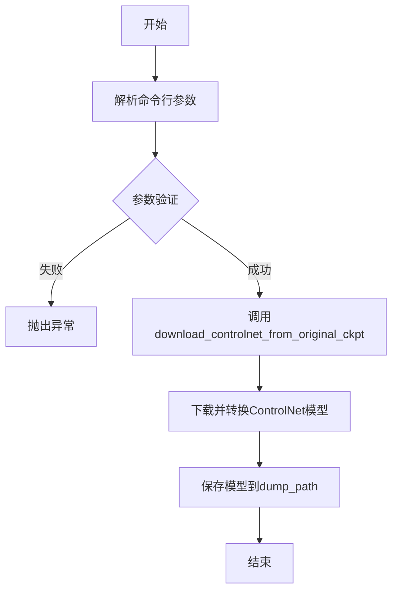
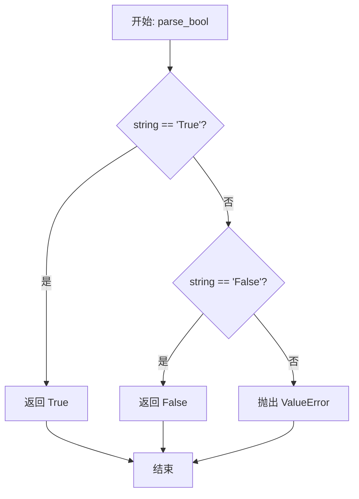
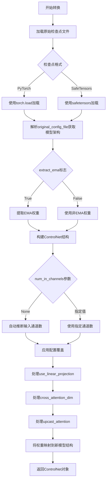

# `diffusers\scripts\convert_original_controlnet_to_diffusers.py` 详细设计文档

这是一个专门用于将仅包含ControlNet的原始Stable Diffusion检查点转换为Hugging Face diffusers格式的转换脚本，支持多种参数配置如EMA权重提取、注意力机制上浮、safetensors格式转换等。

## 整体流程



## 类结构

```
该脚本为单文件脚本，无类层次结构
主要包含：
└── convert_controlnet.py (主脚本)
    ├── parse_bool (辅助函数)
    └── __main__ (入口点)
```

## 全局变量及字段


### `parser`
    
ArgumentParser对象，用于解析命令行参数

类型：`ArgumentParser`
    


### `args`
    
解析后的命令行参数命名空间

类型：`Namespace`
    


### `controlnet`
    
转换后的ControlNet模型对象

类型：`ControlNetModel`
    


    

## 全局函数及方法


### `parse_bool`

将字符串 `"True"` 或 `"False"` 解析为对应的布尔值 `True` 或 `False`，如果输入不是这两个有效值之一，则抛出 `ValueError` 异常。该函数主要用于 argparse 将命令行字符串参数转换为布尔类型。

参数：

-  `string`：`str`，需要解析的字符串参数

返回值：`bool`，解析后的布尔值（`True` 或 `False`）

#### 流程图



#### 带注释源码

```python
def parse_bool(string):
    """
    将字符串解析为布尔值。
    
    参数:
        string (str): 需要解析的字符串,期望值为 "True" 或 "False".
    
    返回:
        bool: 解析后的布尔值.
    
    异常:
        ValueError: 当字符串既不是 "True" 也不是 "False" 时抛出.
    """
    # 检查字符串是否表示布尔值 True
    if string == "True":
        return True
    # 检查字符串是否表示布尔值 False
    elif string == "False":
        return False
    # 如果不是有效的布尔字符串,抛出 ValueError
    else:
        raise ValueError(f"could not parse string as bool {string}")
```


### `download_controlnet_from_original_ckpt`

该函数是diffusers库提供的核心转换函数，用于将仅包含ControlNet权重的Stable Diffusion检查点转换为diffusers格式。它负责加载原始检查点文件、解析配置文件、提取模型权重，并返回一个可使用的ControlNet对象。

参数：

- `checkpoint_path`：`str`，待转换的原始检查点文件路径（支持.pt、.ckpt、.safetensors格式）
- `original_config_file`：`str`，原始模型的YAML配置文件路径，定义了模型架构
- `image_size`：`int`，模型训练时使用的图像大小（默认512，SD v2使用768）
- `extract_ema`：`bool`，是否从检查点中提取EMA权重（EMA权重通常推理质量更高，非EMA权重更适合微调）
- `num_in_channels`：`int | None`，输入通道数，若为None则自动推断
- `upcast_attention`：`bool`，是否将注意力计算强制上cast（SD 2.1需要）
- `from_safetensors`：`bool`，是否使用safetensors格式加载检查点
- `device`：`str | None`，指定计算设备（如"cpu"、"cuda:0"）
- `use_linear_projection`：`bool | None`，是否使用线性投影（覆盖配置）
- `cross_attention_dim`：`int | None`，交叉注意力维度（覆盖配置）

返回值：`diffusers.models.controlnet.ControlNetConditioningEmbedding` 或类似的ControlNet对象，转换后的ControlNet模型，可直接用于Stable Diffusion pipeline

#### 流程图



#### 带注释源码

```python
# 调用示例（从提供的代码中提取）
controlnet = download_controlnet_from_original_ckpt(
    checkpoint_path=args.checkpoint_path,           # 原始检查点路径
    original_config_file=args.original_config_file, # YAML配置文件
    image_size=args.image_size,                     # 训练图像尺寸
    extract_ema=args.extract_ema,                   # 是否提取EMA权重
    num_in_channels=args.num_in_channels,           # 输入通道数
    upcast_attention=args.upcast_attention,         # 是否上cast注意力
    from_safetensors=args.from_safetensors,         # 使用safetensors加载
    device=args.device,                             # 计算设备
    use_linear_projection=args.use_linear_projection,# 线性投影覆盖
    cross_attention_dim=args.cross_attention_dim,   # 交叉注意力维度覆盖
)

# 保存转换后的模型
controlnet.save_pretrained(args.dump_path, safe_serialization=args.to_safetensors)
```

## 关键组件


### 命令行参数解析器 (argparse.ArgumentParser)

使用 Python 标准库 argparse 构建的命令行参数解析器，负责接收和验证用户输入的转换参数，包括检查点路径、配置文件、图像尺寸、EMA 提取选项、设备选择等。

### 布尔值解析函数 (parse_bool)

自定义的布尔类型解析函数，用于将字符串 "True"/"False" 转换为 Python 布尔值，解决 argparse 中布尔参数需要显式指定 True/False 的问题。

### ControlNet 检查点下载函数 (download_controlnet_from_original_ckpt)

从 diffusers 库导入的核心转换函数，负责从原始 Stable Diffusion 检查点中提取和转换 ControlNet 模型权重，支持 EMA/非 EMA 权重选择、输入通道推断、注意力上 Cast 等高级选项。

### 模型保存方法 (controlnet.save_pretrained)

HuggingFace Diffusers 标准的模型保存接口，将转换后的 ControlNet 模型序列化并保存到指定路径，支持 PyTorch 或 Safetensors 格式的安全序列化。

### 命令行参数集

包括 `--checkpoint_path`（原始检查点路径）、`--original_config_file`（YAML 格式的原始架构配置）、`--num_in_channels`（输入通道数）、`--image_size`（训练图像尺寸）、`--extract_ema`（EMA 权重提取）、`--upcast_attention`（注意力上 Cast）、`--from_safetensors` / `--to_safetensors`（格式转换）、`--dump_path`（输出路径）、`--device`（计算设备）、`--use_linear_projection`（线性投影覆盖）、`--cross_attention_dim`（交叉注意力维度覆盖）等 12 个可配置参数。


## 问题及建议


### 已知问题

-   **缺少异常处理机制**：代码未对文件不存在、路径权限问题、模型加载失败等异常情况进行捕获和处理，可能导致程序直接崩溃而无可用错误信息
-   **输入参数验证不足**：未验证 `checkpoint_path`、`original_config_file` 和 `dump_path` 对应文件/目录是否存在且可访问，也未检查 `num_in_channels` 等数值参数的合法性范围
-   **设备参数未设置默认值**：`--device` 参数无默认值，若用户未指定可能使用默认CPU导致转换极慢，或在代码内部处理不一致
-   **进度与日志完全缺失**：转换过程没有任何日志输出或进度提示，用户无法了解转换状态，尤其对于大模型转换场景，用户体验差
-   **内存管理不完善**：处理大型ControlNet模型时未考虑内存优化策略（如半精度转换、内存清理等），可能在资源受限环境下导致OOM
-   **类型注解不完整**：全局变量 `args` 缺乏类型注解，降低了代码的可读性和IDE支持
-   **内部函数定义位置不当**：`parse_bool` 函数定义在 `__main__` 块内部，不利于单元测试和代码复用
-   **参数传递不完整**：调用 `download_controlnet_from_original_ckpt` 时未传递 `to_safetensors` 参数，可能导致输出格式与用户预期不符

### 优化建议

-   添加 try-except 块捕获 FileNotFoundError、OSError、RuntimeError 等常见异常，并向用户输出友好的错误信息
-   在解析参数后增加文件路径存在性和有效性验证逻辑
-   为 `--device` 参数设置合理的默认值（如 "cuda" 或 "cpu"），或明确提示用户必须指定
-   引入 `logging` 模块，在关键步骤（开始转换、转换中、完成）输出日志信息
-   考虑支持 `--half` 或 `--fp16` 参数以启用半精度转换，并在转换完成后显式调用 `gc.collect()` 和 `torch.cuda.empty_cache()` 清理内存
-   为 `args` 变量添加类型注解 `argparse.Namespace`
-   将 `parse_bool` 函数提取到模块顶层，作为独立工具函数
-   在 `download_controlnet_from_original_ckpt` 调用中添加 `to_safetensors` 参数传递，保持参数一致性
-   考虑添加 `--verbose` 或 `--quiet` 参数控制日志输出级别
-   可添加参数 `--max_memory` 让用户指定最大可用显存，避免OOM问题


## 其它


### 设计目标与约束

本脚本的设计目标是将仅包含ControlNet的原始检查点（通常来自Stable Diffusion Web UI或其他训练框架）转换为HuggingFace Diffusers库兼容的格式。主要约束包括：1) 必须提供原始模型的配置文件（YAML格式）；2) 检查点路径和输出路径为必填参数；3) 仅支持PyTorch（.pt/.ckpt）或Safetensors格式的检查点；4) 转换后的模型默认使用PyTorch序列化方式。

### 错误处理与异常设计

脚本主要依赖argparse进行参数验证，parse_bool函数会捕获无法解析为布尔值的字符串并抛出ValueError。download_controlnet_from_original_ckpt函数内部应处理文件不存在、格式不兼容、通道数不匹配等异常。保存模型时的safe_serialization参数控制是否使用Safetensors格式以避免潜在的安全风险。

### 数据流与状态机

数据流为：命令行参数输入 → 参数解析与验证 → 调用download_controlnet_from_original_ckpt加载并转换检查点 → 调用save_pretrained保存转换后的模型。无复杂状态机，仅为线性转换流程。

### 外部依赖与接口契约

主要依赖：1) diffusers库的convert_from_ckpt模块中的download_controlnet_from_original_ckpt函数；2) argparse模块处理命令行参数。接口契约：download_controlnet_from_original_ckpt接受checkpoint_path、original_config_file、image_size、extract_ema、num_in_channels、upcast_attention、from_safetensors、device、use_linear_projection、cross_attention_dim等参数，返回ControlNet对象。

### 性能考虑

转换性能主要取决于检查点文件大小和设备类型。可通过指定--device参数（如cuda:0）利用GPU加速转换过程。--from_safetensors和--to_safetensors选项可影响加载和保存速度，Safetensors通常更快且更安全。

### 安全性考虑

--from_safetensors和--to_safetensors选项提供安全的张量序列化方式。脚本本身不执行任意代码，但加载的检查点可能包含恶意权重，建议仅使用可信来源的检查点文件。

### 配置管理

所有配置通过命令行参数传入，包括：checkpoint_path（检查点路径）、original_config_file（原始配置文件）、image_size（训练图像尺寸）、num_in_channels（输入通道数）、extract_ema（是否提取EMA权重）、upcast_attention（是否上转注意力）、from_safetensors/safe_serialization（输入输出格式）、device（计算设备）、use_linear_projection和cross_attention_dim（模型架构覆盖参数）。

### 使用示例

```bash
python convert_controlnet_to_diffusers.py \
    --checkpoint_path /path/to/controlnet_model.pt \
    --original_config_file /path/to/config.yaml \
    --image_size 512 \
    --dump_path /path/to/output \
    --device cuda:0 \
    --to_safetensors
```

### 限制与注意事项

1) 仅支持纯ControlNet检查点，不支持完整Stable Diffusion模型；2) 原始配置文件必须与检查点架构匹配；3) image_size参数必须与训练时使用的尺寸一致（v1.x/v2 base用512，v2用768）；4) extract_ema参数影响模型质量，推理通常用EMA权重，微调通常用非EMA权重；5) cross_attention_dim和use_linear_projection为覆盖参数，仅在配置文件信息不完整时使用。

    