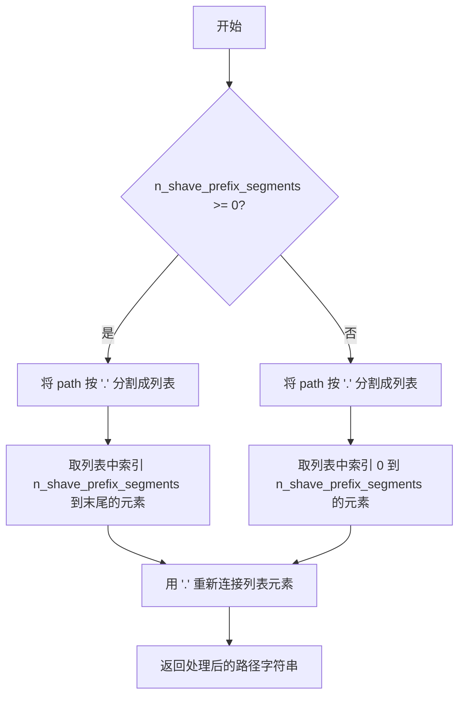
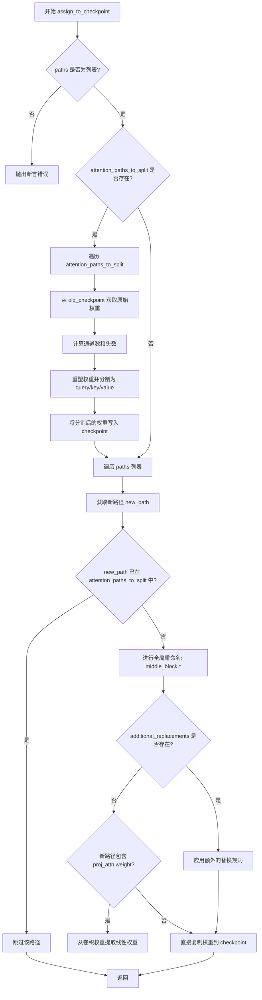
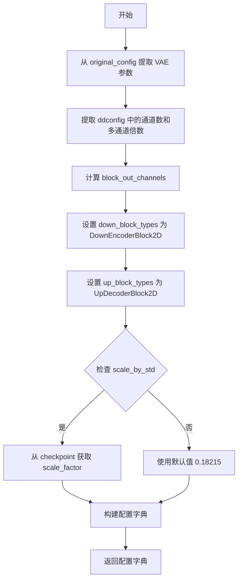
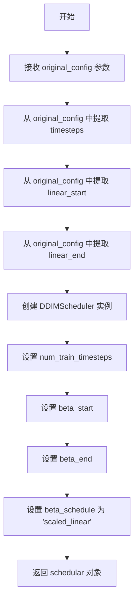
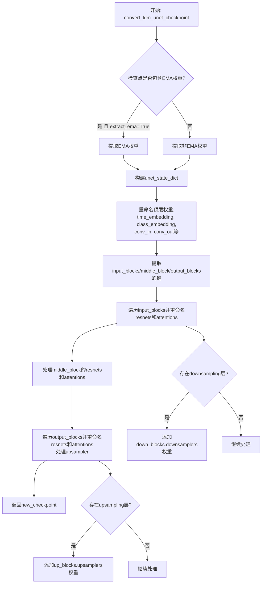
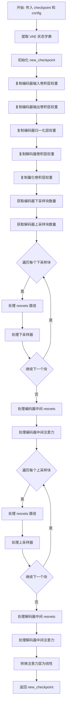
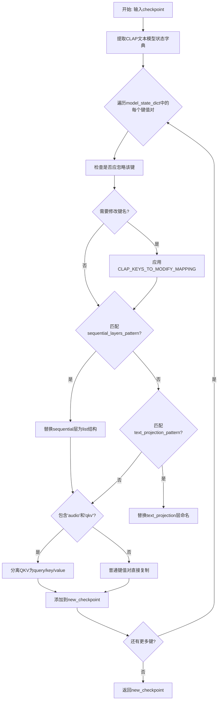
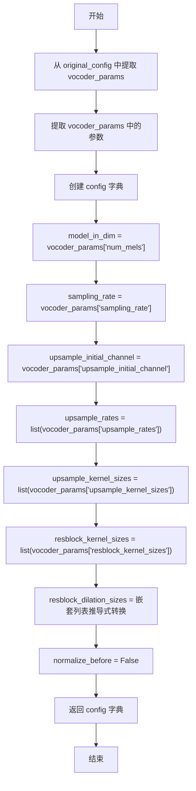
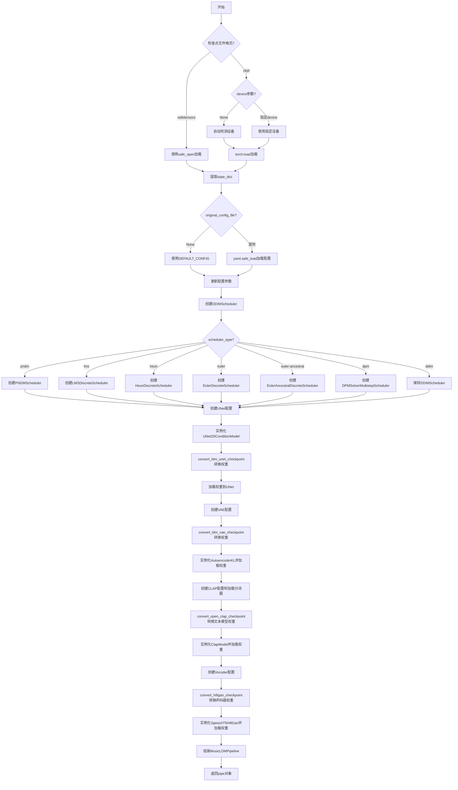

# `diffusers\scripts\convert_original_musicldm_to_diffusers.py` 详细设计文档

这是一个用于将预训练的 MusicLDM 模型检查点（.ckpt 或 .safetensors 格式）转换并加载到 Hugging Face Diffusers 库的 Pipeline 中的脚本。它负责处理 UNet（去噪网络）、VAE（变分自编码器）、CLAP（文本/音频编码器）和 HiFi-GAN（声码器）的权重映射、架构转换和配置生成，最终输出一个完整的 MusicLDMPipeline 对象。

## 整体流程

```mermaid
graph TD
    Start([开始]) --> ParseArgs[解析命令行参数]
    ParseArgs --> LoadFunc[调用 load_pipeline_from_original_MusicLDM_ckpt]
    LoadFunc --> LoadCkpt{加载检查点}
    LoadCkpt -- .safetensors --> SafeOpen[使用 safe_open 加载]
    LoadCkpt -- .ckpt --> TorchLoad[使用 torch.load 加载]
    SafeOpen --> LoadConfig
    TorchLoad --> LoadConfig[加载原始 YAML 配置或使用 DEFAULT_CONFIG]
    LoadConfig --> CreateSched[创建调度器 (DDIM/PNDM/etc.)]
    CreateSched --> CreateUNet[创建 UNet 配置与模型]
    CreateUNet --> ConvertUNet[convert_ldm_unet_checkpoint 转换权重]
    ConvertUNet --> LoadUNet[加载权重到 UNet2DConditionModel]
    LoadUNet --> CreateVAE[创建 VAE 配置与模型]
    CreateVAE --> ConvertVAE[convert_ldm_vae_checkpoint 转换权重]
    ConvertVAE --> LoadVAE[加载权重到 AutoencoderKL]
    LoadVAE --> CreateCLAP[创建 CLAP Text Encoder 配置与模型]
    CreateCLAP --> ConvertCLAP[convert_open_clap_checkpoint 转换权重]
    ConvertCLAP --> LoadCLAP[加载权重到 ClapModel]
    LoadCLAP --> CreateVocoder[创建 Vocoder 配置与模型]
    CreateVocoder --> ConvertVocoder[convert_hifigan_checkpoint 转换权重]
    ConvertVocoder --> LoadVocoder[加载权重到 SpeechT5HifiGan]
    LoadVocoder --> Assemble[实例化 MusicLDMPipeline]
    Assemble --> Save[保存_pipeline到磁盘]
```

## 类结构

```

```

## 全局变量及字段


### `CLAP_KEYS_TO_MODIFY_MAPPING`
    
CLAP模型键名修改映射字典，用于将原始CLAP检查点的键名转换为Transformers库兼容的键名

类型：`Dict[str, str]`
    


### `CLAP_KEYS_TO_IGNORE`
    
CLAP模型需要忽略的键名列表，这些键在检查点转换过程中会被过滤掉

类型：`List[str]`
    


### `CLAP_EXPECTED_MISSING_KEYS`
    
预期在加载CLAP模型时会缺失的键列表，用于在状态字典加载时跳过这些键的检查

类型：`List[str]`
    


### `DEFAULT_CONFIG`
    
MusicLDM模型的默认配置文件，包含模型各组件（UNet、VAE、Vocoder等）的结构和参数配置

类型：`Dict[str, Any]`
    


    

## 全局函数及方法


### `shave_segments`

该函数用于处理模型检查点中的路径字符串，根据指定的段数移除路径的部分片段。正值表示从头开始移除片段，负值表示从末尾移除片段。

参数：

-  `path`：`str`，要处理的路径字符串（例如 `"input_blocks.1.0.weight"`）
-  `n_shave_prefix_segments`：`int`，要移除的段数，默认值为 `1`。正数从头开始移除，负数从末尾移除

返回值：`str`，处理后的路径字符串

#### 流程图



#### 带注释源码

```python
def shave_segments(path, n_shave_prefix_segments=1):
    """
    Removes segments. Positive values shave the first segments, negative shave the last segments.
    
    参数:
        path (str): 要处理的路径字符串，例如 "input_blocks.1.0.weight"
        n_shave_prefix_segments (int): 要移除的段数。正值从头开始移除，负值从末尾移除
    
    返回:
        str: 处理后的路径字符串
    """
    # 判断是否为正向移除（从头开始移除）
    if n_shave_prefix_segments >= 0:
        # 分割路径字符串，取从 n_shave_prefix_segments 开始到末尾的部分
        # 例如: "a.b.c.d".split(".")[1:] => ["b", "c", "d"] => "b.c.d"
        return ".".join(path.split(".")[n_shave_prefix_segments:])
    else:
        # 分割路径字符串，取从开头到 n_shave_prefix_segments 的部分（负数索引从末尾计数）
        # 例如: "a.b.c.d".split(".")[:-1] => ["a", "b", "c"] => "a.b.c"
        return ".".join(path.split(".")[:n_shave_prefix_segments])
```


### `renew_resnet_paths`

该函数用于将旧版ResNet权重路径转换为Diffusers新版命名规范，通过替换特定字符串片段（如`in_layers.0`→`norm1`、`out_layers.0`→`norm2`等）实现本地路径重命名，并可选地去除路径前缀段。

参数：

- `old_list`：`list`，旧版ResNet权重路径列表
- `n_shave_prefix_segments`：`int`，可选，默认为0，去除路径前缀段的数量

返回值：`list`，返回包含`{"old": 旧路径, "new": 新路径}`字典的列表

#### 流程图

```mermaid
graph TD
    A[开始] --> B[初始化空mapping列表]
    B --> C{遍历old_list中的每个old_item}
    C -->|是| D[复制old_item到new_item]
    D --> E[替换: in_layers.0 → norm1]
    E --> F[替换: in_layers.2 → conv1]
    F --> G[替换: out_layers.0 → norm2]
    G --> H[替换: out_layers.3 → conv2]
    H --> I[替换: emb_layers.1 → time_emb_proj]
    I --> J[替换: skip_connection → conv_shortcut]
    J --> K[调用shave_segments处理前缀]
    K --> L[添加{'old': old_item, 'new': new_item}到mapping]
    L --> C
    C -->|否| M[返回mapping列表]
    M --> N[结束]
```

#### 带注释源码

```python
# Copied from diffusers.pipelines.stable_diffusion.convert_from_ckpt.renew_resnet_paths
def renew_resnet_paths(old_list, n_shave_prefix_segments=0):
    """
    Updates paths inside resnets to the new naming scheme (local renaming)
    """
    mapping = []
    for old_item in old_list:
        new_item = old_item.replace("in_layers.0", "norm1")       # 替换输入层第0个为norm1
        new_item = new_item.replace("in_layers.2", "conv1")        # 替换输入层第2个为conv1

        new_item = new_item.replace("out_layers.0", "norm2")       # 替换输出层第0个为norm2
        new_item = new_item.replace("out_layers.3", "conv2")       # 替换输出层第3个为conv2

        new_item = new_item.replace("emb_layers.1", "time_emb_proj")  # 替换时间嵌入投影
        new_item = new_item.replace("skip_connection", "conv_shortcut")  # 替换跳跃连接

        new_item = shave_segments(new_item, n_shave_prefix_segments=n_shave_prefix_segments)

        mapping.append({"old": old_item, "new": new_item})

    return mapping
```


### `renew_vae_resnet_paths`

该函数用于将 MusicLDM VAE（变分自编码器）模型中的 ResNet（残差网络）路径从旧命名方案更新为新命名方案，主要处理 `nin_shortcut` 到 `conv_shortcut` 的转换，并通过 `shave_segments` 函数修剪路径前缀段。

参数：

- `old_list`：`List[str]`，需要转换的旧权重路径列表
- `n_shave_prefix_segments`：`int`，可选参数，默认为 0，用于控制 `shave_segments` 函数修剪路径前缀段的数量

返回值：`List[Dict[str, str]]`，返回包含旧路径（`old`）和新路径（`new`）映射的列表

#### 流程图

```mermaid
flowchart TD
    A[开始] --> B[初始化空 mapping 列表]
    B --> C{遍历 old_list 中的每个元素}
    C -->|是| D[将当前 old_item 赋值给 new_item]
    D --> E{检查 'nin_shortcut' 是否在 new_item 中}
    E -->|是| F[将 'nin_shortcut' 替换为 'conv_shortcut']
    E -->|否| G[跳过替换]
    F --> H[调用 shave_segments 修眼前缀段]
    G --> H
    H --> I[将 {'old': old_item, 'new': new_item} 添加到 mapping]
    I --> C
    C -->|否| J[返回 mapping 列表]
    J --> K[结束]
```

#### 带注释源码

```python
# Copied from diffusers.pipelines.stable_diffusion.convert_from_ckpt.renew_vae_resnet_paths
def renew_vae_resnet_paths(old_list, n_shave_prefix_segments=0):
    """
    Updates paths inside resnets to the new naming scheme (local renaming)
    """
    # 初始化用于存储旧路径到新路径映射的列表
    mapping = []
    
    # 遍历输入的旧路径列表
    for old_item in old_list:
        # 将当前旧路径复制为新路径的起点
        new_item = old_item

        # 将 'nin_shortcut' 替换为 'conv_shortcut'
        # 这是 VAE 模型中残差连接的命名转换
        new_item = new_item.replace("nin_shortcut", "conv_shortcut")
        
        # 调用 shave_segments 函数，根据 n_shave_prefix_segments 参数
        # 修剪路径的前缀段（正数修剪开头，负数修剪结尾）
        new_item = shave_segments(new_item, n_shave_prefix_segments=n_shave_prefix_segments)

        # 将旧路径和新路径的映射添加到结果列表中
        mapping.append({"old": old_item, "new": new_item})

    # 返回包含所有路径映射的列表
    return mapping
```


### `renew_attention_paths`

该函数用于将注意力模块（Attention）的旧权重路径更新为新的命名规则（本地重命名），但目前实现中只是简单地保留原始路径（所有替换操作均被注释掉）。

参数：

- `old_list`：`List[str]`，包含需要转换的旧权重路径列表

返回值：`List[Dict[str, str]]`，返回映射列表，每个元素为 `{"old": 旧路径, "new": 新路径}` 形式的字典

#### 流程图

```mermaid
flowchart TD
    A[开始] --> B[初始化空映射列表 mapping]
    B --> C{遍历 old_list 中的每个 old_item}
    C -->|是| D[将 old_item 赋值给 new_item]
    D --> E[（可选）替换 norm.weight → group_norm.weight]
    E --> F[（可选）替换 norm.bias → group_norm.bias]
    F --> G[（可选）替换 proj_out.weight → proj_attn.weight]
    G --> H[（可选）替换 proj_out.bias → proj_attn.bias]
    H --> I[（可选）调用 shave_segments 修整路径]
    I --> J[将 {'old': old_item, 'new': new_item} 添加到 mapping]
    J --> C
    C -->|遍历完成| K[返回 mapping 列表]
    K --> L[结束]
```

#### 带注释源码

```python
# Copied from diffusers.pipelines.stable_diffusion.convert_from_ckpt.renew_attention_paths
def renew_attention_paths(old_list):
    """
    Updates paths inside attentions to the new naming scheme (local renaming)
    """
    # 初始化一个空列表用于存储路径映射
    mapping = []
    # 遍历输入的旧路径列表
    for old_item in old_list:
        # 将旧路径赋值给新路径变量（当前实现未做任何实际转换）
        new_item = old_item

        # 下面的替换操作已被注释掉，原本用于将旧命名转换为新命名：
        # 将 norm.weight 替换为 group_norm.weight（注意力层归一化权重）
        # new_item = new_item.replace('norm.weight', 'group_norm.weight')
        # 将 norm.bias 替换为 group_norm.bias（注意力层归一化偏置）
        # new_item = new_item.replace('norm.bias', 'group_norm.bias')

        # 将 proj_out.weight 替换为 proj_attn.weight（注意力输出投影权重）
        # new_item = new_item.replace('proj_out.weight', 'proj_attn.weight')
        # 将 proj_out.bias 替换为 proj_attn.bias（注意力输出投影偏置）
        # new_item = new_item.replace('proj_out.bias', 'proj_attn.bias')

        # 可选：调用 shave_segments 修整路径前缀段
        # new_item = shave_segments(new_item, n_shave_prefix_segments=n_shave_prefix_segments)

        # 将旧路径和新路径的映射关系添加到列表中
        mapping.append({"old": old_item, "new": new_item})

    # 返回路径映射列表
    return mapping
```


### `renew_vae_attention_paths`

该函数用于将 MusicLDM 检查点中 VAE（变分自编码器）注意力层的老路径名称转换为 Diffusers 库的新命名约定。它通过字符串替换将原始的注意力层参数名称（如 q、k、v、proj_out 等）映射到 Diffusers 格式的名称（如 to_q、to_k、to_v、to_out.0 等），并支持可选的路径段修剪功能。

参数：

- `old_list`：`List[str]`，需要转换的旧权重路径列表
- `n_shave_prefix_segments`：`int`，可选参数，默认为 0，表示要从路径前缀移除的段数

返回值：`List[Dict[str, str]]`，返回包含 "old" 和 "new" 键的字典列表，每个字典对应一个路径的旧名称和新名称映射

#### 流程图

```mermaid
flowchart TD
    A[开始: renew_vae_attention_paths] --> B[初始化空mapping列表]
    B --> C[遍历old_list中的每个old_item]
    C --> D[将old_item赋值给new_item]
    D --> E{处理 norm.weight → group_norm.weight}
    E --> F{处理 norm.bias → group_norm.bias}
    F --> G{处理 q.weight → to_q.weight}
    G --> H{处理 q.bias → to_q.bias}
    H --> I{处理 k.weight → to_k.weight}
    I --> J{处理 k.bias → to_k.bias}
    J --> K{处理 v.weight → to_v.weight}
    K --> L{处理 v.bias → to_v.bias}
    L --> M{处理 proj_out.weight → to_out.0.weight}
    M --> N{处理 proj_out.bias → to_out.0.bias}
    N --> O[调用shave_segments修剪路径前缀]
    O --> P[将 {'old': old_item, 'new': new_item} 添加到mapping]
    P --> Q{old_list遍历完成?}
    Q -->|否| C
    Q -->|是| R[返回mapping列表]
```

#### 带注释源码

```python
def renew_vae_attention_paths(old_list, n_shave_prefix_segments=0):
    """
    Updates paths inside attentions to the new naming scheme (local renaming)
    
    该函数将旧版 MusicLDM VAE 注意力层权重路径转换为 Diffusers 框架的新命名规范。
    主要转换包括：norm → group_norm, q/k/v → to_q/to_k/to_v, proj_out → to_out.0
    
    参数:
        old_list (List[str]): 包含旧权重路径名称的列表
        n_shave_prefix_segments (int, optional): 要从路径前缀移除的段数，默认为0
    
    返回:
        List[Dict[str, str]]: 映射列表，每个元素为 {'old': 旧路径, 'new': 新路径} 的字典
    """
    mapping = []
    # 遍历所有旧的路径名称
    for old_item in old_list:
        new_item = old_item

        # 将 norm.weight 替换为 group_norm.weight（注意力层归一化权重）
        new_item = new_item.replace("norm.weight", "group_norm.weight")
        # 将 norm.bias 替换为 group_norm.bias（注意力层归一化偏置）
        new_item = new_item.replace("norm.bias", "group_norm.bias")

        # 将 q.weight 替换为 to_q.weight（查询权重矩阵）
        new_item = new_item.replace("q.weight", "to_q.weight")
        # 将 q.bias 替换为 to_q.bias（查询偏置向量）
        new_item = new_item.replace("q.bias", "to_q.bias")

        # 将 k.weight 替换为 to_k.weight（键权重矩阵）
        new_item = new_item.replace("k.weight", "to_k.weight")
        # 将 k.bias 替换为 to_k.bias（键偏置向量）
        new_item = new_item.replace("k.bias", "to_k.bias")

        # 将 v.weight 替换为 to_v.weight（值权重矩阵）
        new_item = new_item.replace("v.weight", "to_v.weight")
        # 将 v.bias 替换为 to_v.bias（值偏置向量）
        new_item = new_item.replace("v.bias", "to_v.bias")

        # 将 proj_out.weight 替换为 to_out.0.weight（输出投影权重）
        new_item = new_item.replace("proj_out.weight", "to_out.0.weight")
        # 将 proj_out.bias 替换为 to_out.0.bias（输出投影偏置）
        new_item = new_item.replace("proj_out.bias", "to_out.0.bias")

        # 根据 n_shave_prefix_segments 参数修剪路径前缀
        new_item = shave_segments(new_item, n_shave_prefix_segments=n_shave_prefix_segments)

        # 将旧路径和新路径的映射添加到列表中
        mapping.append({"old": old_item, "new": new_item})

    return mapping
```


### `assign_to_checkpoint`

该函数执行模型权重转换的最后一步：接收本地转换后的权重路径，应用全局重命名规则，将权重从原始检查点（old_checkpoint）分配到新的检查点（checkpoint）中，支持分割注意力层权重以及处理额外的路径替换。

参数：

- `paths`：`list[dict]`，包含 "old" 和 "new" 键的字典列表，表示原始权重路径与新权重路径的映射关系
- `checkpoint`：`dict`，目标检查点字典，用于存储转换后的权重
- `old_checkpoint`：`dict`，原始模型的检查点字典，包含待转换的权重
- `attention_paths_to_split`：`dict`，可选，需要分割的注意力层路径映射，用于将 QKV 权重分离
- `additional_replacements`：`list[dict]`，可选，额外的路径替换规则列表
- `config`：`dict`，可选，模型配置信息，用于获取注意力头数量等参数

返回值：`None`，函数直接修改 `checkpoint` 字典，不返回值

#### 流程图



#### 带注释源码

```python
# Copied from diffusers.pipelines.stable_diffusion.convert_from_ckpt.assign_to_checkpoint
def assign_to_checkpoint(
    paths, checkpoint, old_checkpoint, attention_paths_to_split=None, additional_replacements=None, config=None
):
    """
    This does the final conversion step: take locally converted weights and apply a global renaming to them. It splits
    attention layers, and takes into account additional replacements that may arise.

    Assigns the weights to the new checkpoint.
    """
    # 验证 paths 参数必须是字典列表，每个字典包含 'old' 和 'new' 键
    assert isinstance(paths, list), "Paths should be a list of dicts containing 'old' and 'new' keys."

    # 如果需要分割注意力层（例如将 QKV 权重分离为 query、key、value）
    if attention_paths_to_split is not None:
        for path, path_map in attention_paths_to_split.items():
            # 从原始检查点获取注意力层的权重张量
            old_tensor = old_checkpoint[path]
            # 计算通道数（总通道数除以 3，因为 QKV 各占一份）
            channels = old_tensor.shape[0] // 3

            # 确定目标形状：3D 张量使用 (-1, channels)，2D 张量使用 (-1)
            target_shape = (-1, channels) if len(old_tensor.shape) == 3 else (-1)

            # 计算注意力头的数量
            num_heads = old_tensor.shape[0] // config["num_head_channels"] // 3

            # 重塑张量以分离不同的头和 QKV 分量
            old_tensor = old_tensor.reshape((num_heads, 3 * channels // num_heads) + old_tensor.shape[1:])
            # 沿着通道维度分割为 query、key、value 三个张量
            query, key, value = old_tensor.split(channels // num_heads, dim=1)

            # 将分割后的权重写入目标检查点，使用对应的路径映射
            checkpoint[path_map["query"]] = query.reshape(target_shape)
            checkpoint[path_map["key"]] = key.reshape(target_shape)
            checkpoint[path_map["value"]] = value.reshape(target_shape)

    # 遍历所有需要转换的路径
    for path in paths:
        new_path = path["new"]

        # 如果该路径已经在注意力层分割中处理过，则跳过
        if attention_paths_to_split is not None and new_path in attention_paths_to_split:
            continue

        # 全局重命名：将原始的 middle_block 路径转换为 diffusers 格式
        new_path = new_path.replace("middle_block.0", "mid_block.resnets.0")
        new_path = new_path.replace("middle_block.1", "mid_block.attentions.0")
        new_path = new_path.replace("middle_block.2", "mid_block.resnets.1")

        # 应用额外的替换规则（例如处理输入/输出块的映射）
        if additional_replacements is not None:
            for replacement in additional_replacements:
                new_path = new_path.replace(replacement["old"], replacement["new"])

        # proj_attn.weight 需要从 1D 卷积权重转换为线性层权重
        # 原始权重形状为 (out_channels, in_channels, 1)，取 [:,:,0] 转换为 (out_channels, in_channels)
        if "proj_attn.weight" in new_path:
            checkpoint[new_path] = old_checkpoint[path["old"]][:, :, 0]
        else:
            # 直接将权重从原始检查点复制到目标检查点
            checkpoint[new_path] = old_checkpoint[path["old"]]
```


### `conv_attn_to_linear`

该函数用于将 MusicLDM 检查点中注意力机制的卷积权重（3D张量）转换为线性权重（2D张量）。在从原始 LDM 格式转换为 Diffusers 格式时，VAE 的注意力层权重存储为卷积形式，需要通过 squeeze 操作去除冗余维度以适配线性层。

参数：

- `checkpoint`：`dict`，待转换的检查点字典，包含模型权重键值对

返回值：`None`，该函数直接修改传入的字典，无返回值

#### 流程图

```mermaid
flowchart TD
    A[开始 conv_attn_to_linear] --> B[获取 checkpoint 的所有键列表]
    B --> C[定义注意力层键列表: to_q.weight, to_k.weight, to_v.weight]
    C --> D[定义输出投影键: to_out.0.weight]
    D --> E{遍历 keys 中的每个 key}
    E --> F{检查 key 的后缀是否匹配 attn_keys 或 proj_key}
    F -->|否| E
    F -->|是| G{检查 checkpoint[key] 维度是否大于 2}
    G -->|否| E
    G -->|是| H[使用 squeeze 去除维度为 1 的维度]
    H --> E
    E --> I[遍历结束]
    I --> J[结束]
```

#### 带注释源码

```python
def conv_attn_to_linear(checkpoint):
    """
    将注意力层的卷积权重转换为线性权重。
    原始 LDM VAE 中的注意力层使用卷积权重存储，转换为 Diffusers 格式时需要去除冗余维度。
    """
    # 获取检查点的所有键
    keys = list(checkpoint.keys())
    
    # 定义需要转换的注意力层键名后缀
    # to_q.weight, to_k.weight, to_v.weight 对应 Query、Key、Value 的权重
    attn_keys = ["to_q.weight", "to_k.weight", "to_v.weight"]
    
    # 定义输出投影层的键名后缀
    proj_key = "to_out.0.weight"
    
    # 遍历检查点中的所有键
    for key in keys:
        # 提取键名的最后两个或三个部分，用于匹配注意力层键
        # 例如: "encoder.mid_block.attentions.0.to_q.weight" -> "to_q.weight"
        # 例如: "decoder.mid_block.attentions.0.to_out.0.weight" -> "to_out.0.weight"
        if ".".join(key.split(".")[-2:]) in attn_keys or ".".join(key.split(".")[-3:]) == proj_key:
            # 检查权重张量维度是否大于 2（3D 卷积权重）
            if checkpoint[key].ndim > 2:
                # 使用 squeeze 去除维度为 1 的维度，将 3D 权重转换为 2D
                checkpoint[key] = checkpoint[key].squeeze()
```


### `create_unet_diffusers_config`

该函数用于将原始 MusicLDM 模型的 UNet 配置转换为 diffusers 库所需的格式，通过解析原始配置文件中的 UNet 参数和 VAE 参数，计算出适合 diffusers UNet2DConditionModel 的各种配置项，包括下采样/上采样块类型、通道数、注意力维度等。

参数：

- `original_config`：`dict`，原始 MusicLDM 模型的完整配置文件，包含模型参数、UNet 配置和 VAE 配置
- `image_size`：`int`，模型训练时使用的图像尺寸

返回值：`dict`，返回包含用于创建 diffusers UNet2DConditionModel 的配置字典

#### 流程图

```mermaid
flowchart TD
    A[开始: create_unet_diffusers_config] --> B[提取UNet参数和VAE参数]
    B --> C[计算block_out_channels<br/>model_channels × channel_mult]
    C --> D[构建down_block_types列表]
    D --> E[遍历block_out_channels]
    E --> F{resolution是否在<br/>attention_resolutions中?}
    F -->|是| G[使用CrossAttnDownBlock2D]
    F -->|否| H[使用DownBlock2D]
    G --> I[记录block_type]
    H --> I
    I --> J{是否到达<br/>最后一个块?}
    J -->|否| K[resolution ×= 2]
    K --> E
    J -->|是| L[构建up_block_types列表]
    L --> M[计算vae_scale_factor<br/>2^(len(ch_mult)-1)]
    M --> N[确定cross_attention_dim]
    N --> O[确定class_embed_type等<br/>Film相关参数]
    O --> P[构建最终配置字典]
    P --> Q[返回config]
```

#### 带注释源码

```python
def create_unet_diffusers_config(original_config, image_size: int):
    """
    Creates a UNet config for diffusers based on the config of the original MusicLDM model.
    
    此函数将原始 MusicLDM 模型的 UNet 配置转换为 diffusers 库所需的格式。
    
    参数:
        original_config: 原始 MusicLDM 模型的完整配置字典
        image_size: 模型训练时使用的图像尺寸
    
    返回:
        包含 UNet 配置的字典，可用于创建 UNet2DConditionModel
    """
    # 从原始配置中提取 UNet 参数
    # original_config["model"]["params"]["unet_config"]["params"] 包含 UNet 的具体参数
    unet_params = original_config["model"]["params"]["unet_config"]["params"]
    
    # 从原始配置中提取 VAE 参数
    # 用于计算 VAE 缩放因子
    vae_params = original_config["model"]["params"]["first_stage_config"]["params"]["ddconfig"]

    # 计算每个块的输出通道数
    # 通过将基础通道数乘以通道乘数得到
    block_out_channels = [unet_params["model_channels"] * mult for mult in unet_params["channel_mult"]]

    # 构建下采样块类型列表
    down_block_types = []
    resolution = 1
    # 遍历每个分辨率级别
    for i in range(len(block_out_channels)):
        # 根据当前分辨率是否在注意力分辨率列表中来决定块类型
        # 如果需要注意力机制，使用 CrossAttnDownBlock2D，否则使用 DownBlock2D
        block_type = "CrossAttnDownBlock2D" if resolution in unet_params["attention_resolutions"] else "DownBlock2D"
        down_block_types.append(block_type)
        # 如果不是最后一个块，分辨率翻倍
        if i != len(block_out_channels) - 1:
            resolution *= 2

    # 构建上采样块类型列表
    # 从最高分辨率开始，逐步降低
    up_block_types = []
    for i in range(len(block_out_channels)):
        # 同样根据分辨率决定是否使用注意力块
        block_type = "CrossAttnUpBlock2D" if resolution in unet_params["attention_resolutions"] else "UpBlock2D"
        up_block_types.append(block_type)
        resolution //= 2

    # 计算 VAE 缩放因子
    # 基于 VAE 通道乘数的长度计算，用于调整 sample_size
    vae_scale_factor = 2 ** (len(vae_params["ch_mult"]) - 1)

    # 确定交叉注意力维度
    # 如果配置中指定了 cross_attention_dim 则使用它，否则使用块输出通道数
    cross_attention_dim = (
        unet_params["cross_attention_dim"] if "cross_attention_dim" in unet_params else block_out_channels
    )

    # 确定类别嵌入类型
    # MusicLDM 使用 Film (FILM) 条件嵌入，如果配置中有 extra_film_condition_dim 则使用简单投影
    class_embed_type = "simple_projection" if "extra_film_condition_dim" in unet_params else None
    
    # 投影类别嵌入输入维度
    projection_class_embeddings_input_dim = (
        unet_params["extra_film_condition_dim"] if "extra_film_condition_dim" in unet_params else None
    )
    
    # 类别嵌入是否拼接
    class_embeddings_concat = unet_params["extra_film_use_concat"] if "extra_film_use_concat" in unet_params else None

    # 构建最终的 UNet 配置字典
    config = {
        "sample_size": image_size // vae_scale_factor,  # 调整后的样本尺寸
        "in_channels": unet_params["in_channels"],       # 输入通道数
        "out_channels": unet_params["out_channels"],     # 输出通道数
        "down_block_types": tuple(down_block_types),    # 下采样块类型元组
        "up_block_types": tuple(up_block_types),        # 上采样块类型元组
        "block_out_channels": tuple(block_out_channels),# 块输出通道数元组
        "layers_per_block": unet_params["num_res_blocks"], # 每个块的残差层数
        "cross_attention_dim": cross_attention_dim,     # 交叉注意力维度
        "class_embed_type": class_embed_type,           # 类别嵌入类型
        "projection_class_embeddings_input_dim": projection_class_embeddings_input_dim, # 投影输入维度
        "class_embeddings_concat": class_embeddings_concat, # 嵌入拼接标志
    }

    return config
```


### `create_vae_diffusers_config`

该函数用于从原始 MusicLDM 模型的配置中创建适用于 Diffusers 的 VAE（变分自编码器）配置。与原始 Stable Diffusion 转换不同的是，此函数会将一个**学习到的** VAE 缩放因子（scaling factor）传递给 Diffusers VAE。

参数：

- `original_config`：`Dict`，原始 MusicLDM 模型的配置字典，包含了模型的参数信息
- `checkpoint`：`Dict`，原始检查点的状态字典，用于获取 `scale_factor`
- `image_size`：`int`，图像尺寸，用于设置 VAE 的 `sample_size`

返回值：`Dict`，返回一个包含 VAE 配置的字典，可用于实例化 `AutoencoderKL`

#### 流程图



#### 带注释源码

```python
# Adapted from diffusers.pipelines.stable_diffusion.convert_from_ckpt.create_vae_diffusers_config
def create_vae_diffusers_config(original_config, checkpoint, image_size: int):
    """
    Creates a VAE config for diffusers based on the config of the original MusicLDM model. Compared to the original
    Stable Diffusion conversion, this function passes a *learnt* VAE scaling factor to the diffusers VAE.
    """
    # 从原始配置中提取 VAE 参数（first_stage_config 下的 ddconfig）
    vae_params = original_config["model"]["params"]["first_stage_config"]["params"]["ddconfig"]
    # 提取 embed_dim（虽然这里没有使用，但保留了提取语句）
    _ = original_config["model"]["params"]["first_stage_config"]["params"]["embed_dim"]

    # 计算输出通道数：基础通道数乘以通道倍数
    block_out_channels = [vae_params["ch"] * mult for mult in vae_params["ch_mult"]]
    # 设置下采样块类型为 DownEncoderBlock2D（编码器下采样块）
    down_block_types = ["DownEncoderBlock2D"] * len(block_out_channels)
    # 设置上采样块类型为 UpDecoderBlock2D（解码器上采样块）
    up_block_types = ["UpDecoderBlock2D"] * len(block_out_channels)

    # 确定 VAE 缩放因子：如果配置中有 scale_by_std，则从检查点获取，否则使用默认值
    scaling_factor = checkpoint["scale_factor"] if "scale_by_std" in original_config["model"]["params"] else 0.18215

    # 构建并返回 VAE 配置字典
    config = {
        "sample_size": image_size,                   # VAE 输入/输出的样本尺寸
        "in_channels": vae_params["in_channels"],    # 输入通道数
        "out_channels": vae_params["out_ch"],        # 输出通道数
        "down_block_types": tuple(down_block_types), # 下采样块类型元组
        "up_block_types": tuple(up_block_types),     # 上采样块类型元组
        "block_out_channels": tuple(block_out_channels), # 输出通道数元组
        "latent_channels": vae_params["z_channels"], # 潜在空间通道数
        "layers_per_block": vae_params["num_res_blocks"], # 每个块的残差层数
        "scaling_factor": float(scaling_factor),     # VAE 缩放因子
    }
    return config
```


### `create_diffusers_schedular`

该函数用于将原始 MusicLDM 模型的调度器配置转换为 Diffusers 库中的 DDIMScheduler 对象。它从原始配置字典中提取时间步数、beta 起始值和结束值，并使用 "scaled_linear" 的 beta 调度策略创建一个 DDIMScheduler 实例。

参数：

- `original_config`：`Dict`，包含原始 MusicLDM 模型配置字典，需要从中提取 `model.params.timesteps`、`model.params.linear_start` 和 `model.params.linear_end` 等调度器参数

返回值：`DDIMScheduler`，返回配置好的 Diffusers DDIMScheduler 对象，用于在扩散模型的推理或训练过程中调度时间步

#### 流程图



#### 带注释源码

```python
# 从 diffusers.pipelines.stable_diffusion.convert_from_ckpt 复制
# Copied from diffusers.pipelines.stable_diffusion.convert_from_ckpt.create_diffusers_schedular
def create_diffusers_schedular(original_config):
    """
    根据原始 MusicLDM 模型的配置创建 Diffusers DDIMScheduler。
    
    该函数从原始配置字典中提取调度器所需的参数：
    - timesteps: 训练时使用的时间步总数
    - linear_start: beta 线性起始值
    - linear_end: beta 线性结束值
    """
    # 使用 DDIMScheduler 类创建调度器实例
    # DDIM (Denoising Diffusion Implicit Models) 是一种常用的扩散模型调度器
    schedular = DDIMScheduler(
        # 从原始配置中提取训练时间步数
        num_train_timesteps=original_config["model"]["params"]["timesteps"],
        # 从原始配置中提取 beta 起始值（线性）
        beta_start=original_config["model"]["params"]["linear_start"],
        # 从原始配置中提取 beta 结束值（线性）
        beta_end=original_config["model"]["params"]["linear_end"],
        # 使用 scaled_linear 调度策略（beta 值随时间步线性增加）
        beta_schedule="scaled_linear",
    )
    # 返回配置好的 DDIMScheduler 对象
    return schedular
```


### `convert_ldm_unet_checkpoint`

该函数用于将 MusicLDM 模型中预训练的 UNet 检查点从原始格式转换为 Hugging Face Diffusers 格式。与标准 Stable Diffusion 转换不同，它额外处理了 Film（FILM）条件嵌入层的权重映射，使得模型能够在 Diffusers 框架下正常运行。

参数：

- `checkpoint`：`dict`，原始 MusicLDM 检查点的完整状态字典，包含了 UNet、VAE、文本编码器等所有模型权重
- `config`：`dict`，UNet 模型的配置字典，包含层数、注意力配置、交叉注意力维度等参数
- `path`：`str` 或 `None`，检查点文件的路径，用于在同时存在 EMA 和非 EMA 权重时输出提示信息
- `extract_ema`：`bool`，是否从检查点中提取 EMA（指数移动平均）权重，默认为 False

返回值：`dict`，转换后的新检查点字典，键名已更改为 Diffusers 格式的 UNet 权重

#### 流程图



#### 带注释源码

```python
def convert_ldm_unet_checkpoint(checkpoint, config, path=None, extract_ema=False):
    """
    Takes a state dict and a config, and returns a converted checkpoint. Compared to the original Stable Diffusion
    conversion, this function additionally converts the learnt film embedding linear layer.
    """

    # 提取 UNet 的 state_dict
    unet_state_dict = {}
    keys = list(checkpoint.keys())

    # UNet 在原始检查点中的键前缀
    unet_key = "model.diffusion_model."
    
    # 判断是否包含 EMA 权重（至少有100个参数以 model_ema 开头）
    # at least a 100 parameters have to start with `model_ema` in order for the checkpoint to be EMA
    if sum(k.startswith("model_ema") for k in keys) > 100 and extract_ema:
        print(f"Checkpoint {path} has both EMA and non-EMA weights.")
        print(
            "In this conversion only the EMA weights are extracted. If you want to instead extract the non-EMA"
            " weights (useful to continue fine-tuning), please make sure to remove the `--extract_ema` flag."
        )
        # 从 EMA 权重中提取 UNet 参数
        for key in keys:
            if key.startswith(unet_key):
                flat_ema_key = "model_ema." + "".join(key.split(".")[1:])
                unet_state_dict[key.replace(unet_key, "")] = checkpoint.pop(flat_ema_key)
    else:
        # 非 EMA 权重提取路径
        if sum(k.startswith("model_ema") for k in keys) > 100:
            print(
                "In this conversion only the non-EMA weights are extracted. If you want to instead extract the EMA"
                " weights (usually better for inference), please make sure to add the `--extract_ema` flag."
            )

        for key in keys:
            if key.startswith(unet_key):
                unet_state_dict[key.replace(unet_key, "")] = checkpoint.pop(key)

    # 初始化新检查点字典
    new_checkpoint = {}

    # 重命名时间嵌入层 (time embedding)
    # 从 time_embed.0 -> time_embedding.linear_1
    new_checkpoint["time_embedding.linear_1.weight"] = unet_state_dict["time_embed.0.weight"]
    new_checkpoint["time_embedding.linear_1.bias"] = unet_state_dict["time_embed.0.bias"]
    new_checkpoint["time_embedding.linear_2.weight"] = unet_state_dict["time_embed.2.weight"]
    new_checkpoint["time_embedding.linear_2.bias"] = unet_state_dict["time_embed.2.bias"]

    # 重命名 Film 条件嵌入层 (class embedding)
    # 这是 MusicLDM 特有的，额外转换 film embedding 线性层
    new_checkpoint["class_embedding.weight"] = unet_state_dict["film_emb.weight"]
    new_checkpoint["class_embedding.bias"] = unet_state_dict["film_emb.bias"]

    # 重命名输入卷积层
    new_checkpoint["conv_in.weight"] = unet_state_dict["input_blocks.0.0.weight"]
    new_checkpoint["conv_in.bias"] = unet_state_dict["input_blocks.0.0.bias"]

    # 重命名输出卷积层
    new_checkpoint["conv_norm_out.weight"] = unet_state_dict["out.0.weight"]
    new_checkpoint["conv_norm_out.bias"] = unet_state_dict["out.0.bias"]
    new_checkpoint["conv_out.weight"] = unet_state_dict["out.2.weight"]
    new_checkpoint["conv_out.bias"] = unet_state_dict["out.2.bias"]

    # 检索输入块的键（按层 ID 分组）
    num_input_blocks = len({".".join(layer.split(".")[:2]) for layer in unet_state_dict if "input_blocks" in layer})
    input_blocks = {
        layer_id: [key for key in unet_state_dict if f"input_blocks.{layer_id}" in key]
        for layer_id in range(num_input_blocks)
    }

    # 检索中间块的键
    num_middle_blocks = len({".".join(layer.split(".")[:2]) for layer in unet_state_dict if "middle_block" in layer})
    middle_blocks = {
        layer_id: [key for key in unet_state_dict if f"middle_block.{layer_id}" in key]
        for layer_id in range(num_middle_blocks)
    }

    # 检索输出块的键
    num_output_blocks = len({".".join(layer.split(".")[:2]) for layer in unet_state_dict if "output_blocks" in layer})
    output_blocks = {
        layer_id: [key for key in unet_state_dict if f"output_blocks.{layer_id}" in key]
        for layer_id in range(num_output_blocks)
    }

    # 处理输入块 (Down Blocks)
    for i in range(1, num_input_blocks):
        # 计算在哪个 down block 中以及在 block 内的层索引
        block_id = (i - 1) // (config["layers_per_block"] + 1)
        layer_in_block_id = (i - 1) % (config["layers_per_block"] + 1)

        # 获取 resnets 和 attentions 的键
        resnets = [
            key for key in input_blocks[i] if f"input_blocks.{i}.0" in key and f"input_blocks.{i}.0.op" not in key
        ]
        attentions = [key for key in input_blocks[i] if f"input_blocks.{i}.1" in key]

        # 处理下采样层 (downsampler)
        if f"input_blocks.{i}.0.op.weight" in unet_state_dict:
            new_checkpoint[f"down_blocks.{block_id}.downsamplers.0.conv.weight"] = unet_state_dict.pop(
                f"input_blocks.{i}.0.op.weight"
            )
            new_checkpoint[f"down_blocks.{block_id}.downsamplers.0.conv.bias"] = unet_state_dict.pop(
                f"input_blocks.{i}.0.op.bias"
            )

        # 重命名 resnet 路径并分配权重
        paths = renew_resnet_paths(resnets)
        meta_path = {"old": f"input_blocks.{i}.0", "new": f"down_blocks.{block_id}.resnets.{layer_in_block_id}"}
        assign_to_checkpoint(
            paths, new_checkpoint, unet_state_dict, additional_replacements=[meta_path], config=config
        )

        # 重命名 attention 路径并分配权重
        if len(attentions):
            paths = renew_attention_paths(attentions)
            meta_path = {"old": f"input_blocks.{i}.1", "new": f"down_blocks.{block_id}.attentions.{layer_in_block_id}"}
            assign_to_checkpoint(
                paths, new_checkpoint, unet_state_dict, additional_replacements=[meta_path], config=config
            )

    # 处理中间块 (Middle Block)
    resnet_0 = middle_blocks[0]
    attentions = middle_blocks[1]
    resnet_1 = middle_blocks[2]

    # 第一个 resnet
    resnet_0_paths = renew_resnet_paths(resnet_0)
    assign_to_checkpoint(resnet_0_paths, new_checkpoint, unet_state_dict, config=config)

    # 第二个 resnet
    resnet_1_paths = renew_resnet_paths(resnet_1)
    assign_to_checkpoint(resnet_1_paths, new_checkpoint, unet_state_dict, config=config)

    # 中间注意力层
    attentions_paths = renew_attention_paths(attentions)
    meta_path = {"old": "middle_block.1", "new": "mid_block.attentions.0"}
    assign_to_checkpoint(
        attentions_paths, new_checkpoint, unet_state_dict, additional_replacements=[meta_path], config=config
    )

    # 处理输出块 (Up Blocks)
    for i in range(num_output_blocks):
        block_id = i // (config["layers_per_block"] + 1)
        layer_in_block_id = i % (config["layers_per_block"] + 1)
        
        # 处理输出层名称
        output_block_layers = [shave_segments(name, 2) for name in output_blocks[i]]
        output_block_list = {}

        for layer in output_block_layers:
            layer_id, layer_name = layer.split(".")[0], shave_segments(layer, 1)
            if layer_id in output_block_list:
                output_block_list[layer_id].append(layer_name)
            else:
                output_block_list[layer_id] = [layer_name]

        # 如果有多个层（resnet + attention），分别处理
        if len(output_block_list) > 1:
            resnets = [key for key in output_blocks[i] if f"output_blocks.{i}.0" in key]
            attentions = [key for key in output_blocks[i] if f"output_blocks.{i}.1" in key]

            resnet_0_paths = renew_resnet_paths(resnets)
            paths = renew_resnet_paths(resnets)

            meta_path = {"old": f"output_blocks.{i}.0", "new": f"up_blocks.{block_id}.resnets.{layer_in_block_id}"}
            assign_to_checkpoint(
                paths, new_checkpoint, unet_state_dict, additional_replacements=[meta_path], config=config
            )

            # 排序层列表
            output_block_list = {k: sorted(v) for k, v in output_block_list.items()}
            
            # 检查是否存在上采样层 (upsampler)
            if ["conv.bias", "conv.weight"] in output_block_list.values():
                index = list(output_block_list.values()).index(["conv.bias", "conv.weight"])
                new_checkpoint[f"up_blocks.{block_id}.upsamplers.0.conv.weight"] = unet_state_dict[
                    f"output_blocks.{i}.{index}.conv.weight"
                ]
                new_checkpoint[f"up_blocks.{block_id}.upsamplers.0.conv.bias"] = unet_state_dict[
                    f"output_blocks.{i}.{index}.conv.bias"
                ]

                # 清除已处理的 attention
                if len(attentions) == 2:
                    attentions = []

            # 处理 attention 层
            if len(attentions):
                paths = renew_attention_paths(attentions)
                meta_path = {
                    "old": f"output_blocks.{i}.1",
                    "new": f"up_blocks.{block_id}.attentions.{layer_in_block_id}",
                }
                assign_to_checkpoint(
                    paths, new_checkpoint, unet_state_dict, additional_replacements=[meta_path], config=config
                )
        else:
            # 只有一个层的情况（可能是单个 resnet）
            resnet_0_paths = renew_resnet_paths(output_block_layers, n_shave_prefix_segments=1)
            for path in resnet_0_paths:
                old_path = ".".join(["output_blocks", str(i), path["old"]])
                new_path = ".".join(["up_blocks", str(block_id), "resnets", str(layer_in_block_id), path["new"]])

                new_checkpoint[new_path] = unet_state_dict[old_path]

    # 返回转换后的检查点
    return new_checkpoint
```


### `convert_ldm_vae_checkpoint`

将 MusicLDM 的 VAE 检查点从原始格式转换为 diffusers 格式的函数。该函数提取 VAE 状态字典，处理编码器和解码器的各个组件（包括卷积层、归一化层、下采样器、上采样器、中间块和注意力层），并重新映射键名以匹配 diffusers 的 AutoencoderKL 模型结构。

参数：

- `checkpoint`：`dict`，原始 MusicLDM 检查点的完整状态字典
- `config`：`dict`，VAE 配置文件，包含样本大小、通道数、块类型等参数

返回值：`dict`，转换后的新检查点字典，键名符合 diffusers 的 AutoencoderKL 模型格式

#### 流程图



#### 带注释源码

```python
# 从原始检查点中提取 VAE 状态字典
def convert_ldm_vae_checkpoint(checkpoint, config):
    # extract state dict for VAE
    vae_state_dict = {}
    vae_key = "first_stage_model."  # VAE 在原始检查点中的键前缀
    keys = list(checkpoint.keys())
    # 遍历所有键，提取以 "first_stage_model." 开头的 VAE 相关权重
    for key in keys:
        if key.startswith(vae_key):
            # 移除前缀，转换为新的键名
            vae_state_dict[key.replace(vae_key, "")] = checkpoint.get(key)

    # 初始化新的检查点字典
    new_checkpoint = {}

    # ========== 编码器卷积层 ==========
    # 复制编码器的输入卷积层（conv_in）
    new_checkpoint["encoder.conv_in.weight"] = vae_state_dict["encoder.conv_in.weight"]
    new_checkpoint["encoder.conv_in.bias"] = vae_state_dict["encoder.conv_in.bias"]
    # 复制编码器的输出卷积层（conv_out）
    new_checkpoint["encoder.conv_out.weight"] = vae_state_dict["encoder.conv_out.weight"]
    new_checkpoint["encoder.conv_out.bias"] = vae_state_dict["encoder.conv_out.bias"]
    # 复制编码器的输出归一化层（conv_norm_out）
    new_checkpoint["encoder.conv_norm_out.weight"] = vae_state_dict["encoder.norm_out.weight"]
    new_checkpoint["encoder.conv_norm_out.bias"] = vae_state_dict["encoder.norm_out.bias"]

    # ========== 解码器卷积层 ==========
    # 复制解码器的输入卷积层
    new_checkpoint["decoder.conv_in.weight"] = vae_state_dict["decoder.conv_in.weight"]
    new_checkpoint["decoder.conv_in.bias"] = vae_state_dict["decoder.conv_in.bias"]
    # 复制解码器的输出卷积层
    new_checkpoint["decoder.conv_out.weight"] = vae_state_dict["decoder.conv_out.weight"]
    new_checkpoint["decoder.conv_out.bias"] = vae_state_dict["decoder.conv_out.bias"]
    # 复制解码器的输出归一化层
    new_checkpoint["decoder.conv_norm_out.weight"] = vae_state_dict["decoder.norm_out.weight"]
    new_checkpoint["decoder.conv_norm_out.bias"] = vae_state_dict["decoder.norm_out.bias"]

    # ========== 量化卷积层 ==========
    # 复制量化器相关的卷积层
    new_checkpoint["quant_conv.weight"] = vae_state_dict["quant_conv.weight"]
    new_checkpoint["quant_conv.bias"] = vae_state_dict["quant_conv.bias"]
    new_checkpoint["post_quant_conv.weight"] = vae_state_dict["post_quant_conv.weight"]
    new_checkpoint["post_quant_conv.bias"] = vae_state_dict["post_quant_conv.bias"]

    # ========== 编码器下采样块 ==========
    # 统计编码器中下采样块的数量（通过唯一的前三层路径判断）
    num_down_blocks = len({".".join(layer.split(".")[:3]) for layer in vae_state_dict if "encoder.down" in layer})
    # 为每个下采样块收集相关的键
    down_blocks = {
        layer_id: [key for key in vae_state_dict if f"down.{layer_id}" in key] for layer_id in range(num_down_blocks)
    }

    # ========== 解码器上采样块 ==========
    # 统计解码器中上采样块的数量
    num_up_blocks = len({".".join(layer.split(".")[:3]) for layer in vae_state_dict if "decoder.up" in layer})
    # 为每个上采样块收集相关的键
    up_blocks = {
        layer_id: [key for key in vae_state_dict if f"up.{layer_id}" in key] for layer_id in range(num_up_blocks)
    }

    # ========== 处理编码器下采样块 ==========
    for i in range(num_down_blocks):
        # 获取当前块中的 resnet 层（排除下采样层）
        resnets = [key for key in down_blocks[i] if f"down.{i}" in key and f"down.{i}.downsample" not in key]

        # 处理下采样器（downsample）层
        if f"encoder.down.{i}.downsample.conv.weight" in vae_state_dict:
            new_checkpoint[f"encoder.down_blocks.{i}.downsamplers.0.conv.weight"] = vae_state_dict.pop(
                f"encoder.down.{i}.downsample.conv.weight"
            )
            new_checkpoint[f"encoder.down_blocks.{i}.downsamplers.0.conv.bias"] = vae_state_dict.pop(
                f"encoder.down.{i}.downsample.conv.bias"
            )

        # 转换 resnet 路径并分配权重
        paths = renew_vae_resnet_paths(resnets)
        meta_path = {"old": f"down.{i}.block", "new": f"down_blocks.{i}.resnets"}
        assign_to_checkpoint(paths, new_checkpoint, vae_state_dict, additional_replacements=[meta_path], config=config)

    # ========== 处理编码器中间块 ==========
    # 处理中间 resnet 块
    mid_resnets = [key for key in vae_state_dict if "encoder.mid.block" in key]
    num_mid_res_blocks = 2
    for i in range(1, num_mid_res_blocks + 1):
        resnets = [key for key in mid_resnets if f"encoder.mid.block_{i}" in key]

        paths = renew_vae_resnet_paths(resnets)
        meta_path = {"old": f"mid.block_{i}", "new": f"mid_block.resnets.{i - 1}"}
        assign_to_checkpoint(paths, new_checkpoint, vae_state_dict, additional_replacements=[meta_path], config=config)

    # 处理中间注意力层
    mid_attentions = [key for key in vae_state_dict if "encoder.mid.attn" in key]
    paths = renew_vae_attention_paths(mid_attentions)
    meta_path = {"old": "mid.attn_1", "new": "mid_block.attentions.0"}
    assign_to_checkpoint(paths, new_checkpoint, vae_state_dict, additional_replacements=[meta_path], config=config)
    # 将卷积注意力转换为线性层
    conv_attn_to_linear(new_checkpoint)

    # ========== 处理解码器上采样块 ==========
    for i in range(num_up_blocks):
        # 注意：块 ID 需要反向（从最高层到最低层）
        block_id = num_up_blocks - 1 - i
        # 获取当前块中的 resnet 层（排除上采样层）
        resnets = [
            key for key in up_blocks[block_id] if f"up.{block_id}" in key and f"up.{block_id}.upsample" not in key
        ]

        # 处理上采样器（upsample）层
        if f"decoder.up.{block_id}.upsample.conv.weight" in vae_state_dict:
            new_checkpoint[f"decoder.up_blocks.{i}.upsamplers.0.conv.weight"] = vae_state_dict[
                f"decoder.up.{block_id}.upsample.conv.weight"
            ]
            new_checkpoint[f"decoder.up_blocks.{i}.upsamplers.0.conv.bias"] = vae_state_dict[
                f"decoder.up.{block_id}.upsample.conv.bias"
            ]

        # 转换 resnet 路径并分配权重
        paths = renew_vae_resnet_paths(resnets)
        meta_path = {"old": f"up.{block_id}.block", "new": f"up_blocks.{i}.resnets"}
        assign_to_checkpoint(paths, new_checkpoint, vae_state_dict, additional_replacements=[meta_path], config=config)

    # ========== 处理解码器中间块 ==========
    # 处理中间 resnet 块
    mid_resnets = [key for key in vae_state_dict if "decoder.mid.block" in key]
    num_mid_res_blocks = 2
    for i in range(1, num_mid_res_blocks + 1):
        resnets = [key for key in mid_resnets if f"decoder.mid.block_{i}" in key]

        paths = renew_vae_resnet_paths(resnets)
        meta_path = {"old": f"mid.block_{i}", "new": f"mid_block.resnets.{i - 1}"}
        assign_to_checkpoint(paths, new_checkpoint, vae_state_dict, additional_replacements=[meta_path], config=config)

    # 处理中间注意力层
    mid_attentions = [key for key in vae_state_dict if "decoder.mid.attn" in key]
    paths = renew_vae_attention_paths(mid_attentions)
    meta_path = {"old": "mid.attn_1", "new": "mid_block.attentions.0"}
    assign_to_checkpoint(paths, new_checkpoint, vae_state_dict, additional_replacements=[meta_path], config=config)
    # 将卷积注意力转换为线性层
    conv_attn_to_linear(new_checkpoint)
    
    # 返回转换后的检查点
    return new_checkpoint
```


### `convert_open_clap_checkpoint`

将MusicLDM检查点中的CLAP文本编码器状态字典转换为HuggingFace Transformers兼容的CLAP模型格式，处理层名称映射、QKV分离和顺序层的重命名。

参数：

- `checkpoint`：`Dict`，原始MusicLDM检查点（包含CLAP模型权重）

返回值：`Dict`，转换后的CLAP检查点（适配HuggingFace Transformers的ClapModel）

#### 流程图



#### 带注释源码

```python
def convert_open_clap_checkpoint(checkpoint):
    """
    Takes a state dict and returns a converted CLAP checkpoint.
    """
    # 提取CLAP文本嵌入模型的状态字典，丢弃音频组件
    model_state_dict = {}
    model_key = "cond_stage_model.model."
    keys = list(checkpoint.keys())
    for key in keys:
        # 筛选出以cond_stage_model.model.开头的键
        if key.startswith(model_key):
            # 移除前缀，保留后面的键名
            model_state_dict[key.replace(model_key, "")] = checkpoint.get(key)

    new_checkpoint = {}

    # 定义正则表达式模式用于匹配特定层
    sequential_layers_pattern = r".*sequential.(\d+).*"
    text_projection_pattern = r".*_projection.(\d+).*"

    # 遍历模型状态字典中的每个键值对
    for key, value in model_state_dict.items():
        # 检查键是否应该被忽略，如果在忽略列表中则标记为spectrogram
        for key_to_ignore in CLAP_KEYS_TO_IGNORE:
            if key_to_ignore in key:
                key = "spectrogram"

        # 检查是否有需要修改的键，并应用映射
        for key_to_modify, new_key in CLAP_KEYS_TO_MODIFY_MAPPING.items():
            if key_to_modify in key:
                key = key.replace(key_to_modify, new_key)

        # 处理sequential层：替换为list结构
        if re.match(sequential_layers_pattern, key):
            # 提取sequential层的索引
            sequential_layer = re.match(sequential_layers_pattern, key).group(1)
            # 将sequential.n.替换为layers.n//3.linear.
            key = key.replace(f"sequential.{sequential_layer}.", f"layers.{int(sequential_layer) // 3}.linear.")
        # 处理text_projection层
        elif re.match(text_projection_pattern, key):
            # 提取projection层索引
            projecton_layer = int(re.match(text_projection_pattern, key).group(1))
            # CLAP使用nn.Sequential，transformers使用不同的命名
            # 第0层对应linear1，第1层对应linear2
            transformers_projection_layer = 1 if projecton_layer == 0 else 2
            key = key.replace(f"_projection.{projecton_layer}.", f"_projection.linear{transformers_projection_layer}.")

        # 处理音频分支的QKV分离
        if "audio" and "qkv" in key:
            # 将混合的QKV张量拆分为query、key和value
            mixed_qkv = value
            qkv_dim = mixed_qkv.size(0) // 3

            # 分割QKV：张量前1/3为query，中间1/3为key，最后1/3为value
            query_layer = mixed_qkv[:qkv_dim]
            key_layer = mixed_qkv[qkv_dim : qkv_dim * 2]
            value_layer = mixed_qkv[qkv_dim * 2:]

            # 将分离后的张量添加到新checkpoint
            new_checkpoint[key.replace("qkv", "query")] = query_layer
            new_checkpoint[key.replace("qkv", "key")] = key_layer
            new_checkpoint[key.replace("qkv", "value")] = value_layer
        # 非spectrogram的普通键值对直接复制
        elif key != "spectrogram":
            new_checkpoint[key] = value

    return new_checkpoint
```


### `create_transformers_vocoder_config`

创建一个用于 transformers SpeechT5HifiGan 的配置字典，基于原始 MusicLDM 模型配置中的声码器（vocoder）参数。

参数：

- `original_config`：`Dict`，包含原始 MusicLDM 模型配置信息的字典，其中包含 `model.params.vocoder_config.params` 路径下的声码器参数。

返回值：`Dict`，返回一个包含声码器配置的字典，可用于初始化 `SpeechT5HifiGanConfig`。

#### 流程图



#### 带注释源码

```python
def create_transformers_vocoder_config(original_config):
    """
    Creates a config for transformers SpeechT5HifiGan based on the config of the vocoder model.
    
    此函数用于将原始 MusicLDM 模型的声码器配置转换为 transformers 库中
    SpeechT5HifiGan 模型所需的配置格式。
    
    Args:
        original_config (Dict): 包含原始 MusicLDM 模型配置的字典，
                                需要包含 model.params.vocoder_config.params 路径下的声码器参数。
    
    Returns:
        Dict: 一个包含以下键的配置字典:
            - model_in_dim: 梅尔频谱的维度数量
            - sampling_rate: 采样率
            - upsample_initial_channel: 上采样初始通道数
            - upsample_rates: 上采样率的列表
            - upsample_kernel_sizes: 上采样核大小的列表
            - resblock_kernel_sizes: 残差块核大小的列表
            - resblock_dilation_sizes: 残差块扩张大小的嵌套列表
            - normalize_before: 是否在之前归一化（固定为 False）
    """
    # 从原始配置中提取声码器参数
    # original_config 结构: model.params.vocoder_config.params
    vocoder_params = original_config["model"]["params"]["vocoder_config"]["params"]

    # 构建转换后的配置字典
    config = {
        # 梅尔频谱的维度，对应原始配置中的 num_mels 参数
        "model_in_dim": vocoder_params["num_mels"],
        # 音频采样率
        "sampling_rate": vocoder_params["sampling_rate"],
        # 上采样初始通道数
        "upsample_initial_channel": vocoder_params["upsample_initial_channel"],
        # 将上采样率元组转换为列表
        "upsample_rates": list(vocoder_params["upsample_rates"]),
        # 将上采样核大小元组转换为列表
        "upsample_kernel_sizes": list(vocoder_params["upsample_kernel_sizes"]),
        # 将残差块核大小元组转换为列表
        "resblock_kernel_sizes": list(vocoder_params["resblock_kernel_sizes"]),
        # 将残差块扩张大小从元组列表转换为嵌套列表
        # 例如: ((1,3,5), (1,3,5), (1,3,5)) -> [[1,3,5], [1,3,5], [1,3,5]]
        "resblock_dilation_sizes": [
            list(resblock_dilation) for resblock_dilation in vocoder_params["resblock_dilation_sizes"]
        ],
        # SpeechT5HifiGan 使用固定值 False，表示不在上采样前进行归一化
        "normalize_before": False,
    }

    # 返回可用于初始化 SpeechT5HifiGanConfig 的配置字典
    return config
```


### `convert_hifigan_checkpoint`

该函数用于将MusicLDM中HiFiGAN声码器的原始检查点（checkpoint）转换为diffusers库兼容的格式，主要处理键名映射、upsampler层重命名以及归一化参数的调整。

参数：

- `checkpoint`：`dict`，原始MusicLDM模型的完整检查点字典，包含声码器权重
- `config`：`SpeechT5HifiGanConfig`，HiFiGAN声码器的配置对象，包含上采样率、归一化设置等参数

返回值：`dict`，转换后的声码器状态字典，键名已适配diffusers的SpeechT5HifiGan模型结构

#### 流程图

```mermaid
flowchart TD
    A[开始: convert_hifigan_checkpoint] --> B[提取vocoder_state_dict]
    B --> C{遍历checkpoint的键}
    C -->|键以'first_stage_model.vocoder.'开头| D[提取子键并添加到vocoder_state_dict]
    C -->|否则| E[跳过该键]
    D --> C
    E --> F[修复upsampler键名]
    F --> G{遍历config.upsample_rates}
    G -->|对于每个i| H[将'ups.{i}.weight'重命名为'upsampler.{i}.weight']
    H --> I[将'ups.{i}.bias'重命名为'upsampler.{i}.bias']
    G --> J{检查config.normalize_before}
    J -->|为False| K[初始化mean和scale张量]
    J -->|为True| L[跳过归一化参数设置]
    K --> M[返回转换后的vocoder_state_dict]
    L --> M
```

#### 带注释源码

```
def convert_hifigan_checkpoint(checkpoint, config):
    """
    Takes a state dict and config, and returns a converted HiFiGAN vocoder checkpoint.
    """
    # 步骤1: 从原始检查点中提取声码器的状态字典
    # 原始键名前缀为 "first_stage_model.vocoder."，转换后去除该前缀
    vocoder_state_dict = {}
    vocoder_key = "first_stage_model.vocoder."
    keys = list(checkpoint.keys())
    for key in keys:
        if key.startswith(vocoder_key):
            # 提取子键（去除前缀）并保存对应的值
            vocoder_state_dict[key.replace(vocoder_key, "")] = checkpoint.get(key)

    # 步骤2: 修复上采样器（upsampler）的键名
    # 原始模型使用 "ups.{i}.weight/bias"，diffusers使用 "upsampler.{i}.weight/bias"
    for i in range(len(config.upsample_rates)):
        vocoder_state_dict[f"upsampler.{i}.weight"] = vocoder_state_dict.pop(f"ups.{i}.weight")
        vocoder_state_dict[f"upsampler.{i}.bias"] = vocoder_state_dict.pop(f"ups.{i}.bias")

    # 步骤3: 处理归一化参数
    # 如果配置中不进行归一化前处理（normalize_before=False），
    # 则需要初始化mean和scale为默认值（全零/全一）
    if not config.normalize_before:
        # 如果不设置normalize_before，则这些变量未使用，初始化为零和一
        vocoder_state_dict["mean"] = torch.zeros(config.model_in_dim)
        vocoder_state_dict["scale"] = torch.ones(config.model_in_dim)

    # 步骤4: 返回转换后的声码器状态字典
    return vocoder_state_dict
```


### `load_pipeline_from_original_MusicLDM_ckpt`

该函数是MusicLDM模型检查点转换的核心入口函数，负责将原始MusicLDM的`.ckpt`/`.safetensors`检查点文件及其配置文件转换并加载为HuggingFace Diffusers格式的`MusicLDMPipeline`对象，同时完成UNet、VAE、文本编码器（CLAP）和声码器（HiFi-GAN）等所有组件的权重转换、加载和组装工作。

参数：

- `checkpoint_path`：`str`，原始检查点文件的路径（.ckpt或.safetensors格式）
- `original_config_file`：`str`，可选，原始模型对应的YAML配置文件路径，若为None则使用内置的默认配置
- `image_size`：`int`，可选，默认值1024，模型训练时使用的图像/音频分辨率大小
- `prediction_type`：`str`，可选，模型训练时的预测类型（epsilon或v_prediction），若为None则自动从配置推断
- `extract_ema`：`bool`，可选，默认值False，是否从检查点中提取EMA权重，True则提取EMA权重用于推理，False则提取非EMA权重用于微调
- `scheduler_type`：`str`，可选，默认值"ddim"，要使用的调度器类型，可选值包括pndm、lms、heun、euler、euler-ancestral、dpm、ddim
- `num_in_channels`：`int`，可选，UNet的输入通道数，若为None则从配置自动推断
- `model_channels`：`int`，可选，UNet的模型通道数，若为None则从配置自动推断，小型检查点建议128，中型192，大型256
- `num_head_channels`：`int`，可选，UNet的头通道数，若为None则从配置自动推断，小型和中型建议32，大型建议64
- `device`：`str`，可选，指定加载设备（cpu/cuda），若为None则自动检测（优先cuda）
- `from_safetensors`：`bool`，可选，默认值False，当检查点为safetensors格式时设为True以使用safetensors库加载

返回值：`MusicLDMPipeline`，转换并组装完成后的完整MusicLDM推理管道对象，包含了VAE、文本编码器、分词器、UNet、调度器和声码器等所有组件

#### 流程图



#### 带注释源码

```python
def load_pipeline_from_original_MusicLDM_ckpt(
    checkpoint_path: str,
    original_config_file: str = None,
    image_size: int = 1024,
    prediction_type: str = None,
    extract_ema: bool = False,
    scheduler_type: str = "ddim",
    num_in_channels: int = None,
    model_channels: int = None,
    num_head_channels: int = None,
    device: str = None,
    from_safetensors: bool = False,
) -> MusicLDMPipeline:
    """
    Load an MusicLDM pipeline object from a `.ckpt`/`.safetensors` file and (ideally) a `.yaml` config file.

    Although many of the arguments can be automatically inferred, some of these rely on brittle checks against the
    global step count, which will likely fail for models that have undergone further fine-tuning. Therefore, it is
    recommended that you override the default values and/or supply an `original_config_file` wherever possible.

    Args:
        checkpoint_path (`str`): Path to `.ckpt` file.
        original_config_file (`str`):
            Path to `.yaml` config file corresponding to the original architecture. If `None`, will be automatically
            set to the MusicLDM-s-full-v2 config.
        image_size (`int`, *optional*, defaults to 1024):
            The image size that the model was trained on.
        prediction_type (`str`, *optional*):
            The prediction type that the model was trained on. If `None`, will be automatically
            inferred by looking for a key in the config. For the default config, the prediction type is `'epsilon'`.
        num_in_channels (`int`, *optional*, defaults to None):
            The number of UNet input channels. If `None`, it will be automatically inferred from the config.
        model_channels (`int`, *optional*, defaults to None):
            The number of UNet model channels. If `None`, it will be automatically inferred from the config. Override
            to 128 for the small checkpoints, 192 for the medium checkpoints and 256 for the large.
        num_head_channels (`int`, *optional*, defaults to None):
            The number of UNet head channels. If `None`, it will be automatically inferred from the config. Override
            to 32 for the small and medium checkpoints, and 64 for the large.
        scheduler_type (`str`, *optional*, defaults to 'pndm'):
            Type of scheduler to use. Should be one of `["pndm", "lms", "heun", "euler", "euler-ancestral", "dpm",
            "ddim"]`.
        extract_ema (`bool`, *optional*, defaults to `False`): Only relevant for
            checkpoints that have both EMA and non-EMA weights. Whether to extract the EMA weights or not. Defaults to
            `False`. Pass `True` to extract the EMA weights. EMA weights usually yield higher quality images for
            inference. Non-EMA weights are usually better to continue fine-tuning.
        device (`str`, *optional*, defaults to `None`):
            The device to use. Pass `None` to determine automatically.
        from_safetensors (`str`, *optional*, defaults to `False`):
            If `checkpoint_path` is in `safetensors` format, load checkpoint with safetensors instead of PyTorch.
        return: An MusicLDMPipeline object representing the passed-in `.ckpt`/`.safetensors` file.
    """
    # 1. 根据文件格式加载检查点（支持safetensors和pytorch两种格式）
    if from_safetensors:
        from safetensors import safe_open

        checkpoint = {}
        with safe_open(checkpoint_path, framework="pt", device="cpu") as f:
            for key in f.keys():
                checkpoint[key] = f.get_tensor(key)
    else:
        if device is None:
            device = "cuda" if torch.cuda.is_available() else "cpu"
            checkpoint = torch.load(checkpoint_path, map_location=device)
        else:
            checkpoint = torch.load(checkpoint_path, map_location=device)

    # 2. 提取state_dict（某些检查点会嵌套在state_dict键下）
    if "state_dict" in checkpoint:
        checkpoint = checkpoint["state_dict"]

    # 3. 加载原始配置文件（YAML格式），若未提供则使用内置默认配置
    if original_config_file is None:
        original_config = DEFAULT_CONFIG
    else:
        original_config = yaml.safe_load(original_config_file)

    # 4. 根据传入参数动态覆盖配置中的相关字段
    if num_in_channels is not None:
        original_config["model"]["params"]["unet_config"]["params"]["in_channels"] = num_in_channels

    if model_channels is not None:
        original_config["model"]["params"]["unet_config"]["params"]["model_channels"] = model_channels

    if num_head_channels is not None:
        original_config["model"]["params"]["unet_config"]["params"]["num_head_channels"] = num_head_channels

    # 5. 确定预测类型（epsilon或v_prediction）
    if (
        "parameterization" in original_config["model"]["params"]
        and original_config["model"]["params"]["parameterization"] == "v"
    ):
        if prediction_type is None:
            prediction_type = "v_prediction"
    else:
        if prediction_type is None:
            prediction_type = "epsilon"

    if image_size is None:
        image_size = 512

    # 6. 从配置中提取调度器参数并创建DDIMScheduler
    num_train_timesteps = original_config["model"]["params"]["timesteps"]
    beta_start = original_config["model"]["params"]["linear_start"]
    beta_end = original_config["model"]["params"]["linear_end"]

    scheduler = DDIMScheduler(
        beta_end=beta_end,
        beta_schedule="scaled_linear",
        beta_start=beta_start,
        num_train_timesteps=num_train_timesteps,
        steps_offset=1,
        clip_sample=False,
        set_alpha_to_one=False,
        prediction_type=prediction_type,
    )
    # make sure scheduler works correctly with DDIM
    scheduler.register_to_config(clip_sample=False)

    # 7. 根据scheduler_type创建对应的调度器实例
    if scheduler_type == "pndm":
        config = dict(scheduler.config)
        config["skip_prk_steps"] = True
        scheduler = PNDMScheduler.from_config(config)
    elif scheduler_type == "lms":
        scheduler = LMSDiscreteScheduler.from_config(scheduler.config)
    elif scheduler_type == "heun":
        scheduler = HeunDiscreteScheduler.from_config(scheduler.config)
    elif scheduler_type == "euler":
        scheduler = EulerDiscreteScheduler.from_config(scheduler.config)
    elif scheduler_type == "euler-ancestral":
        scheduler = EulerAncestralDiscreteScheduler.from_config(scheduler.config)
    elif scheduler_type == "dpm":
        scheduler = DPMSolverMultistepScheduler.from_config(scheduler.config)
    elif scheduler_type == "ddim":
        scheduler = scheduler
    else:
        raise ValueError(f"Scheduler of type {scheduler_type} doesn't exist!")

    # 8. 转换并加载UNet模型
    unet_config = create_unet_diffusers_config(original_config, image_size=image_size)
    unet = UNet2DConditionModel(**unet_config)

    converted_unet_checkpoint = convert_ldm_unet_checkpoint(
        checkpoint, unet_config, path=checkpoint_path, extract_ema=extract_ema
    )

    unet.load_state_dict(converted_unet_checkpoint)

    # 9. 转换并加载VAE模型
    vae_config = create_vae_diffusers_config(original_config, checkpoint=checkpoint, image_size=image_size)
    converted_vae_checkpoint = convert_ldm_vae_checkpoint(checkpoint, vae_config)

    vae = AutoencoderKL(**vae_config)
    vae.load_state_dict(converted_vae_checkpoint)

    # 10. 转换并加载文本模型（CLAP）
    # MusicLDM uses the same tokenizer as the original CLAP model, but a slightly different configuration
    config = ClapConfig.from_pretrained("laion/clap-htsat-unfused")
    config.audio_config.update(
        {
            "patch_embeds_hidden_size": 128,
            "hidden_size": 1024,
            "depths": [2, 2, 12, 2],
        }
    )
    tokenizer = AutoTokenizer.from_pretrained("laion/clap-htsat-unfused")
    feature_extractor = AutoFeatureExtractor.from_pretrained("laion/clap-htsat-unfused")

    converted_text_model = convert_open_clap_checkpoint(checkpoint)
    text_model = ClapModel(config)

    missing_keys, unexpected_keys = text_model.load_state_dict(converted_text_model, strict=False)
    # we expect not to have token_type_ids in our original state dict so let's ignore them
    missing_keys = list(set(missing_keys) - set(CLAP_EXPECTED_MISSING_KEYS))

    if len(unexpected_keys) > 0:
        raise ValueError(f"Unexpected keys when loading CLAP model: {unexpected_keys}")

    if len(missing_keys) > 0:
        raise ValueError(f"Missing keys when loading CLAP model: {missing_keys}")

    # 11. 转换并加载声码器模型（HiFi-GAN）
    vocoder_config = create_transformers_vocoder_config(original_config)
    vocoder_config = SpeechT5HifiGanConfig(**vocoder_config)
    converted_vocoder_checkpoint = convert_hifigan_checkpoint(checkpoint, vocoder_config)

    vocoder = SpeechT5HifiGan(vocoder_config)
    vocoder.load_state_dict(converted_vocoder_checkpoint)

    # 12. 组装完整的MusicLDM Pipeline并返回
    pipe = MusicLDMPipeline(
        vae=vae,
        text_encoder=text_model,
        tokenizer=tokenizer,
        unet=unet,
        scheduler=scheduler,
        vocoder=vocoder,
        feature_extractor=feature_extractor,
    )

    return pipe
```

## 关键组件


### 张量索引与路径映射

负责将原始MusicLDM模型的层名称和权重重新映射到Diffusers格式，包括`shave_segments`移除路径段、`renew_resnet_paths`更新resnet层名称、`renew_attention_paths`更新attention层名称等函数，实现键名到新架构的转换。

### EMA权重提取

在`convert_ldm_unet_checkpoint`函数中实现，支持从检查点中选择性提取EMA权重或非EMA权重，通过`extract_ema`参数控制，用于平衡推理质量和微调需求。

### 检查点分配与权重分割

`assign_to_checkpoint`函数执行最终转换步骤，包括将注意力层权重分割为query、key、value三个部分，处理全局路径重命名，并将权重从原始格式转换到目标格式。

### UNet配置转换

`create_unet_diffusers_config`函数将MusicLDM的UNet配置转换为Diffusers格式，处理注意力分辨率、交叉注意力维度、类别嵌入等参数的映射。

### VAE配置转换

`create_vae_diffusers_config`函数创建Diffusers兼容的VAE配置，包括学习到的VAE缩放因子（scaling_factor）的处理，将原始DDIM配置转换为AutoencoderKL所需格式。

### CLAP文本模型转换

`convert_open_clap_checkpoint`函数处理CLAP文本编码器的检查点转换，包括键名映射、QKV分离、顺序层转换等，将原始CLAP模型权重转换为Transformers兼容格式。

### HiFiGAN声码器转换

`convert_hifigan_checkpoint`函数将MusicLDM的声码器权重转换为SpeechT5HifiGan格式，处理上采样器键名重命名和归一化参数的适配。

### 调度器创建与配置

`create_diffusers_schedular`函数和主加载函数中的调度器配置逻辑，根据原始模型参数创建Diffusers调度器，支持PNDM、LMS、Heun、Euler等多种调度器类型。

### 完整管道加载

`load_pipeline_from_original_MusicLDM_ckpt`函数是核心入口，整合UNet、VAE、文本编码器、声码器等所有组件的转换和加载，输出完整的MusicLDMPipeline对象。


## 问题及建议


### 已知问题

-   **拼写错误**：函数名 `create_diffusers_schedular` 中 "schedular" 应为 "scheduler"，这会导致后续维护时的混淆
-   **硬编码的默认值**：`DEFAULT_CONFIG` 是硬编码在代码中的，如果模型架构有变化需要修改代码，缺乏配置灵活性
-   **硬编码的模型路径**：代码中硬编码了 `"laion/clap-htsat-unfused"` 作为CLAP模型来源，没有提供通过参数配置的方式
-   **缺少类型注解**：大部分函数缺少参数和返回值的类型注解，影响代码可读性和静态分析工具的使用
-   **Magic Numbers**：`0.18215` 作为VAE scaling factor 是硬编码的，没有解释其来源或提供配置选项
-   **代码重复**：`renew_resnet_paths` 和 `renew_vae_resnet_paths` 函数逻辑高度相似；UNet和VAE的中间块转换逻辑重复
-   **字典遍历顺序不确定**：使用 `list(set(...))` 来处理missing_keys和unexpected_keys，集合的遍历顺序是不确定的，可能导致非确定性的行为
-   **缺少输入验证**：对checkpoint文件内容的完整性验证不足，例如没有检查必需的键是否存在
-   **错误处理不足**：文件加载失败、配置解析错误等情况缺少友好的错误提示和异常处理
-   **仅使用print进行日志输出**：缺少正式的日志记录机制，不利于生产环境的问题排查

### 优化建议

-   修正拼写错误，将 `schedular` 改为 `scheduler`
-   为所有函数添加完整的类型注解，包括参数类型和返回类型
-   将硬编码的配置（如DEFAULT_CONFIG、Magic Numbers）提取为独立的配置文件或命令行参数
-   重构重复代码，提取公共函数以减少代码冗余
-   添加正式的日志记录（使用Python的logging模块）替代print语句
-   增加输入验证逻辑，检查checkpoint必需键的存在性和config参数的合法性
-   改进错误处理，为每种可能的失败情况提供清晰的错误消息
-   考虑使用 dataclass 或 Pydantic 模型来定义配置结构，提供更好的类型安全和默认值管理
-   添加单元测试，覆盖核心转换逻辑的正确性
-   使用 `OrderedDict` 或在处理集合后保持确定性顺序，确保结果的可复现性


## 其它


### 设计目标与约束

本脚本的核心目标是将MusicLDM原始检查点（.ckpt或.safetensors格式）转换为HuggingFace diffusers兼容的MusicLDMPipeline格式。主要约束包括：1）必须保留原始模型的权重信息并进行正确的路径映射；2）支持EMA和非EMA权重的选择提取；3）兼容多种调度器类型（ddim、pndm、lms、heun、euler等）；4）处理CLAP文本编码器的特殊映射规则；5）支持自定义配置参数以适应不同版本的MusicLDM模型。

### 错误处理与异常设计

脚本采用多层错误处理机制：1）使用assert语句进行关键前置条件验证，如`assign_to_checkpoint`函数中验证paths是否为列表；2）对于配置和参数错误，抛出ValueError异常，如不支持的调度器类型、意外的权重键、缺失的权重键等；3）对于文件加载失败，由torch.load和safe_open自然抛出IO相关异常；4）关键转换步骤包含打印警告信息，如同时存在EMA和非EMA权重时的提示。错误处理遵循"快速失败"原则，在转换早期发现问题。

### 数据流与状态机

数据流主要分为五个阶段：第一阶段为配置加载，根据original_config_file加载YAML配置或使用DEFAULT_CONFIG；第二阶段为检查点加载，支持从.ckpt或.safetensors文件加载state_dict；第三阶段为各组件转换，包括UNet权重转换、VAE权重转换、CLAP文本模型转换、HiFiGAN声码器转换；第四阶段为模型实例化，根据转换后的配置创建各组件模型；第五阶段为Pipeline组装，将所有组件组合为MusicLDMPipeline并保存。整个过程是单向顺序执行的，无状态回滚机制。

### 外部依赖与接口契约

主要外部依赖包括：1）transformers库提供ClapConfig、ClapModel、AutoTokenizer、AutoFeatureExtractor；2）diffusers库提供AutoencoderKL、各类Scheduler、UNet2DConditionModel、MusicLDMPipeline；3）speecht5_hifigan提供SpeechT5HifiGan及其配置；4）torch用于张量操作；5）yaml用于配置文件解析；6）safetensors用于安全张量加载。接口契约方面，load_pipeline_from_original_MusicLDM_ckpt函数接受多个可选参数并返回MusicLDMPipeline对象，各转换函数接受原始检查点字典和配置字典，返回转换后的权重字典或配置字典。

### 配置管理

配置管理采用三级机制：第一级为DEFAULT_CONFIG常量，定义了MusicLDM-s-full-v2的默认完整配置结构；第二级为YAML配置文件，通过original_config_file参数传入，支持用户自定义模型架构；第三级为函数参数覆盖，num_in_channels、model_channels、num_head_channels等参数可覆盖配置文件中对应值。配置对象在转换过程中逐层传递，从create_*_diffusers_config函数生成最终用于模型实例化的配置字典。scaling_factor的处理体现了配置兼容性设计，支持scale_by_std模式和固定值模式。

### 模型架构映射规则

映射规则主要体现在四类函数中：1）路径前缀替换，如"model.diffusion_model."移除、"first_stage_model."移除；2）层级名称转换，如"in_layers.0"→"norm1"、"out_layers.3"→"conv2"；3）注意力机制重命名，如"proj_out.weight"→"to_out.0.weight"；4）块结构重组，input_blocks转换为down_blocks，output_blocks转换为up_blocks，middle_block转换为mid_block。CLAP模型有独立的映射表CLAP_KEYS_TO_MODIFY_MAPPING和CLAP_KEYS_TO_IGNORE。特殊处理包括qkv分离、1D卷积转线性层、EMA权重提取等。

### 安全性考虑

安全性主要体现在：1）支持safetensors格式加载，通过from_safetensors参数控制，避免pickle潜在的安全风险；2）设备指定机制，支持CPU加载避免GPU内存溢出；3）状态字典验证，检查state_dict键是否存在；4）strict=False加载策略允许部分权重不匹配但会检查意外键。代码本身不执行任意代码，加载的模型结构由transformers和diffusers库定义，相对安全。

### 性能考虑

性能优化点包括：1）使用pop()方法原地移除已处理的键，减少内存复制；2）支持device参数指定加载设备，避免不必要的CPU-GPU数据传输；3）checkpoint字典在转换过程中逐步构建，避免大规模中间数据结构；4）使用集合操作进行键分类（如num_input_blocks计算），提高查找效率。大模型转换主要瓶颈在内存占用，建议在CPU上进行完整转换后再移动到目标设备。

### 兼容性说明

本脚本主要针对MusicLDM 1.0版本设计，对MusicLDM-s-full-v2有最佳支持。版本兼容性注意事项：1）不同版本的cross_attention_dim配置可能不同；2）Film条件嵌入（extra_film_condition_dim）为MusicLDM特有，需正确映射；3）VAE scaling_factor的提取逻辑依赖原始配置中的scale_by_std标志；4）CLAP模型使用laion/clap-htsat-unfused作为基础Tokenizer和FeatureExtractor。对于其他基于LDM的音频生成模型，可能需要调整映射规则。

    