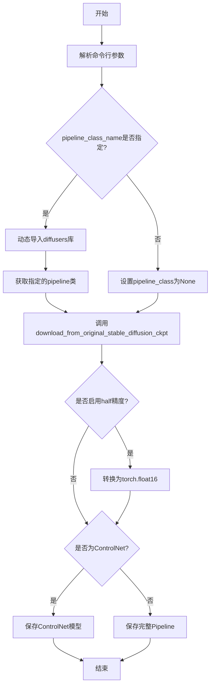
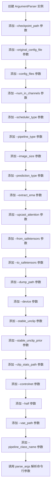
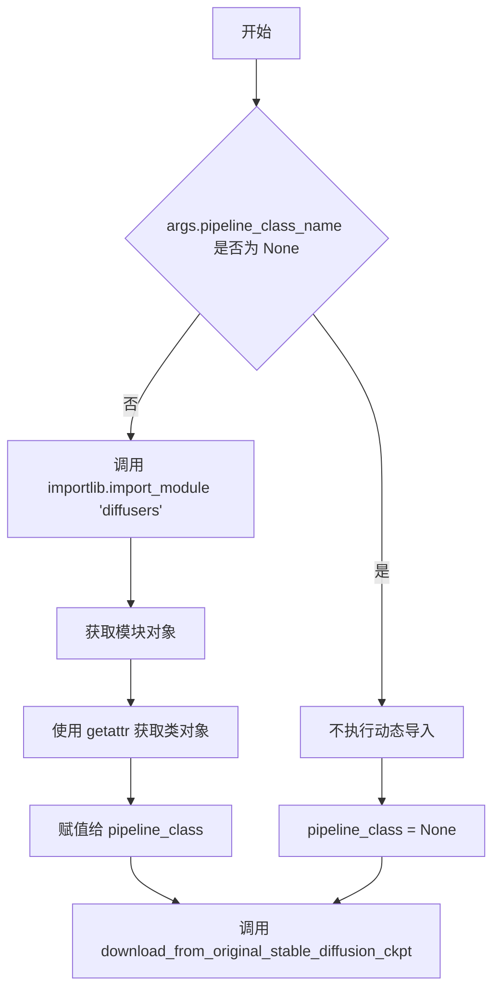
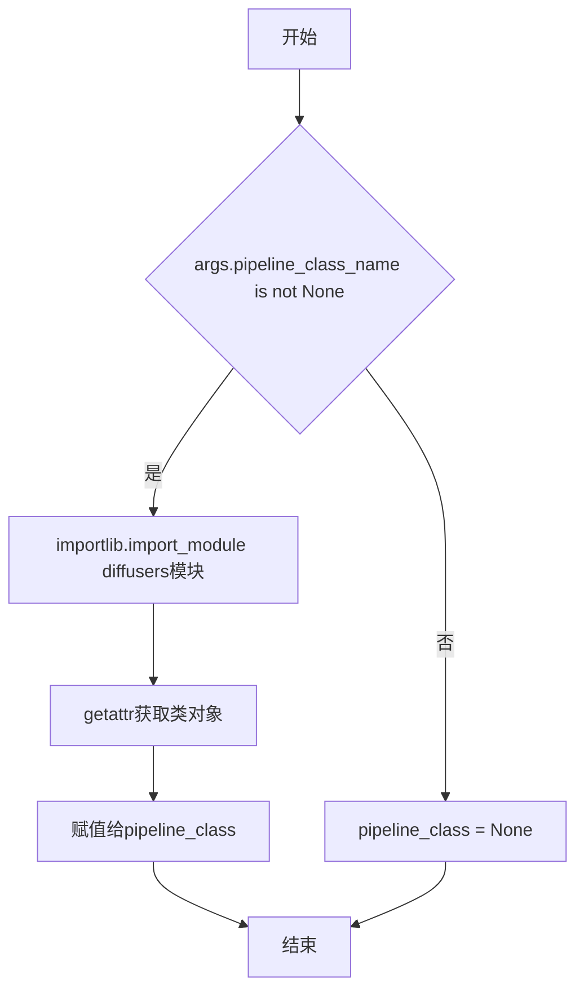
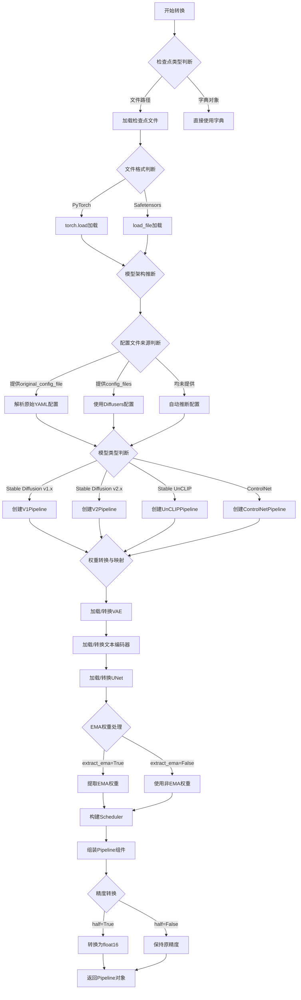
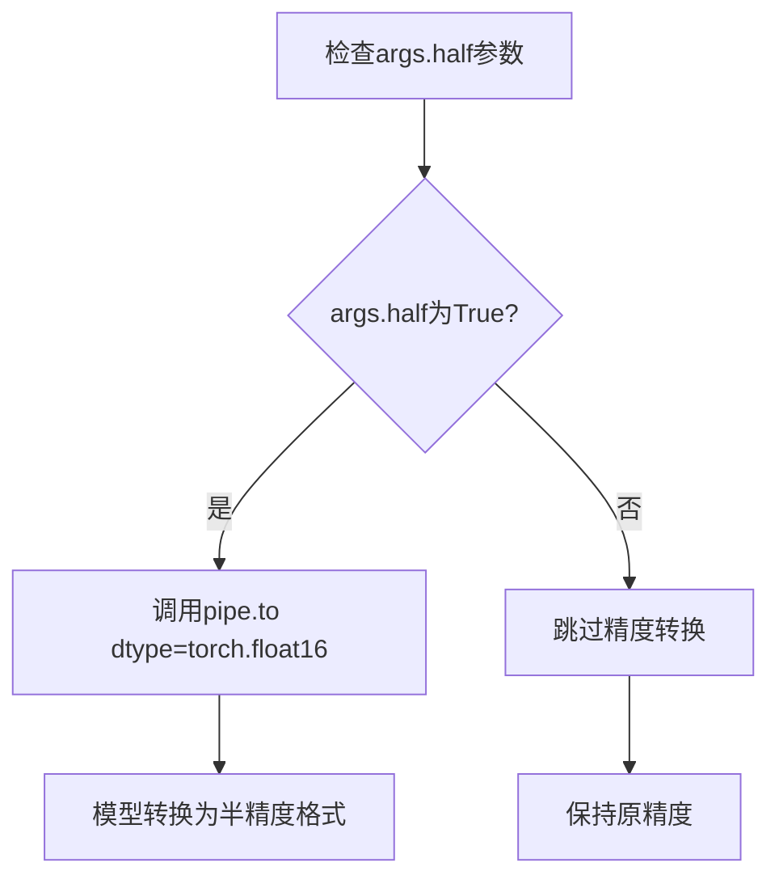
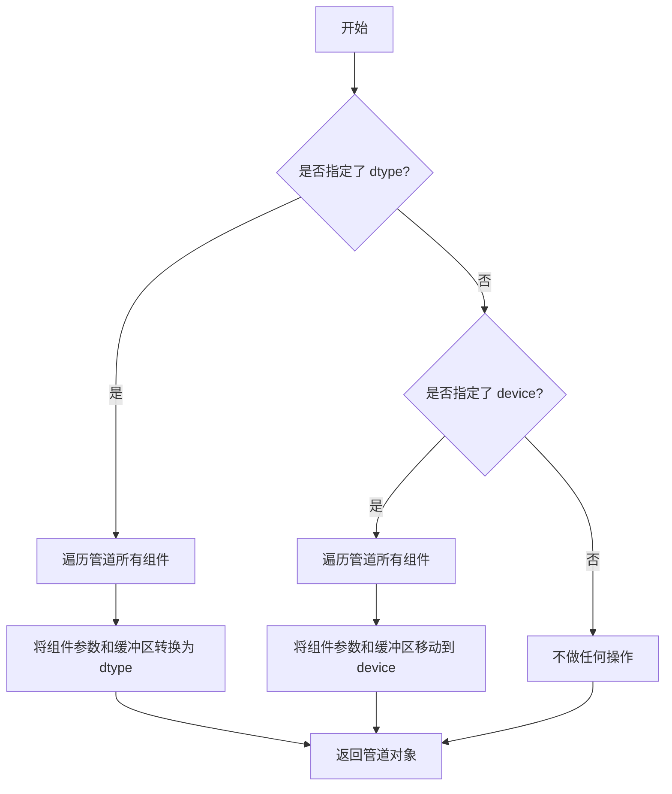
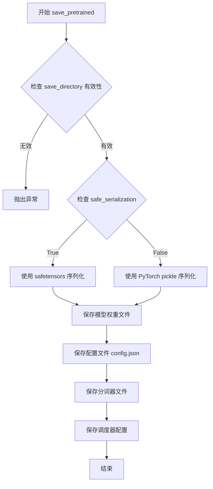
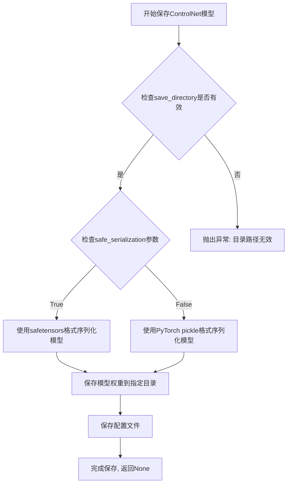

# `diffusers\scripts\convert_original_stable_diffusion_to_diffusers.py` 详细设计文档

这是一个检查点转换脚本，用于将原始的Stable Diffusion模型检查点（如CompVis/stable-diffusion格式）转换为Hugging Face diffusers库兼容的格式，支持多种参数配置如调度器类型、EMA提取、精度转换等。

## 整体流程



## 类结构

```
该脚本为独立执行脚本，无自定义类定义
主要依赖: diffusers.pipelines.stable_diffusion.convert_from_ckpt.download_from_Original_stable_diffusion_ckpt
外部库: argparse, importlib, torch
```

## 全局变量及字段


### `args`
    
命令行参数对象，包含所有配置选项如checkpoint路径、模型类型、输出路径等

类型：`argparse.Namespace`
    


### `pipe`
    
转换后的diffusers格式pipeline对象，用于保存或后续推理

类型：`DiffusionPipeline`
    


### `pipeline_class`
    
动态加载的pipeline类，若未指定则为None，将由转换函数自动推断

类型：`Optional[type]`
    


### `class_obj`
    
通过importlib动态导入的pipeline类对象，用于实例化特定的pipeline

类型：`type`
    


    

## 全局函数及方法


### `argparse.ArgumentParser`

该代码模块使用 Python 标准库中的 `argparse.ArgumentParser` 类创建命令行参数解析器，用于接收和验证用户通过命令行传入的各种参数，以配置 Stable Diffusion 检查点转换流程。

参数：

- 无（`ArgumentParser` 类的构造函数不接受自定义参数，仅使用默认行为）

返回值：`ArgumentParser` 对象，用于后续添加命令行参数

#### 流程图



#### 带注释源码

```python
# 创建 ArgumentParser 实例，用于解析命令行参数
parser = argparse.ArgumentParser()

# ========== 必选参数 ==========
# 指定要转换的检查点路径
parser.add_argument(
    "--checkpoint_path", 
    default=None, 
    type=str, 
    required=True, 
    help="Path to the checkpoint to convert."
)

# 指定输出模型保存路径
parser.add_argument("--dump_path", default=None, type=str, required=True, help="Path to the output model.")

# ========== 可选配置参数 ==========
# 原始模型的 YAML 配置文件路径
parser.add_argument(
    "--original_config_file",
    default=None,
    type=str,
    help="The YAML config file corresponding to the original architecture.",
)

# 架构的 YAML 配置文件路径
parser.add_argument(
    "--config_files",
    default=None,
    type=str,
    help="The YAML config file corresponding to the architecture.",
)

# 输入通道数（若为 None，则自动推断）
parser.add_argument(
    "--num_in_channels",
    default=None,
    type=int,
    help="The number of input channels. If `None` number of input channels will be automatically inferred.",
)

# 调度器类型选择
parser.add_argument(
    "--scheduler_type",
    default="pndm",
    type=str,
    help="Type of scheduler to use. Should be one of ['pndm', 'lms', 'ddim', 'euler', 'euler-ancestral', 'dpm']",
)

# 管道类型（若为 None，则自动推断）
parser.add_argument(
    "--pipeline_type",
    default=None,
    type=str,
    help=(
        "The pipeline type. One of 'FrozenOpenCLIPEmbedder', 'FrozenCLIPEmbedder', 'PaintByExample'"
        ". If `None` pipeline will be automatically inferred."
    ),
)

# 模型训练时使用的图像尺寸
parser.add_argument(
    "--image_size",
    default=None,
    type=int,
    help=(
        "The image size that the model was trained on. Use 512 for Stable Diffusion v1.X and Stable Diffusion v2"
        " Base. Use 768 for Stable Diffusion v2."
    ),
)

# 模型训练时使用的预测类型
parser.add_argument(
    "--prediction_type",
    default=None,
    type=str,
    help=(
        "The prediction type that the model was trained on. Use 'epsilon' for Stable Diffusion v1.X and Stable"
        " Diffusion v2 Base. Use 'v_prediction' for Stable Diffusion v2."
    ),
)

# ========== 布尔标志参数 ==========
# 是否提取 EMA 权重
parser.add_argument(
    "--extract_ema",
    action="store_true",
    help=(
        "Only relevant for checkpoints that have both EMA and non-EMA weights. Whether to extract the EMA weights"
        " or not. Defaults to `False`. Add `--extract_ema` to extract the EMA weights. EMA weights usually yield"
        " higher quality images for inference. Non-EMA weights are usually better to continue fine-tuning."
    ),
)

# 是否上cast注意力计算
parser.add_argument(
    "--upcast_attention",
    action="store_true",
    help=(
        "Whether the attention computation should always be upcasted. This is necessary when running stable"
        " diffusion 2.1."
    ),
)

# 是否使用 safetensors 格式加载检查点
parser.add_argument(
    "--from_safetensors",
    action="store_true",
    help="If `--checkpoint_path` is in `safetensors` format, load checkpoint with safetensors instead of PyTorch.",
)

# 是否使用 safetensors 格式保存模型
parser.add_argument(
    "--to_safetensors",
    action="store_true",
    help="Whether to store pipeline in safetensors format or not.",
)

# 是否为 ControlNet 检查点
parser.add_argument(
    "--controlnet", 
    action="store_true", 
    default=None, 
    help="Set flag if this is a controlnet checkpoint."
)

# 是否以半精度保存权重
parser.add_argument("--half", action="store_true", help="Save weights in half precision.")

# ========== 高级配置参数 ==========
# 设备选择（cpu, cuda:0 等）
parser.add_argument("--device", type=str, help="Device to use (e.g. cpu, cuda:0, cuda:1, etc.)")

# Stable unCLIP 模型类型
parser.add_argument(
    "--stable_unclip",
    type=str,
    default=None,
    required=False,
    help="Set if this is a stable unCLIP model. One of 'txt2img' or 'img2img'.",
)

# Stable unCLIP 先验模型选择
parser.add_argument(
    "--stable_unclip_prior",
    type=str,
    default=None,
    required=False,
    help="Set if this is a stable unCLIP txt2img model. Selects which prior to use. If `--stable_unclip` is set to `txt2img`, the karlo prior (https://huggingface.co/kakaobrain/karlo-v1-alpha/tree/main/prior) is selected by default.",
)

# CLIP 统计文件路径
parser.add_argument(
    "--clip_stats_path",
    type=str,
    help="Path to the clip stats file. Only required if the stable unclip model's config specifies `model.params.noise_aug_config.params.clip_stats_path`.",
    required=False,
)

# VAE 模型路径（避免重复转换）
parser.add_argument(
    "--vae_path",
    type=str,
    default=None,
    required=False,
    help="Set to a path, hub id to an already converted vae to not convert it again.",
)

# 指定管道类名称
parser.add_argument(
    "--pipeline_class_name",
    type=str,
    default=None,
    required=False,
    help="Specify the pipeline class name",
)

# ========== 解析命令行参数 ==========
# 将命令行参数解析为命名空间对象
args = parser.parse_args()
```


### `importlib.import_module`

该函数是Python标准库中的核心模块导入函数，用于在运行时动态导入指定名称的模块。在本代码中，它被用于根据用户提供的`pipeline_class_name`参数动态获取diffusers库中的管道类。

参数：

- `name`：`str`，要导入的模块名称，本代码中固定为`"diffusers"`
- `package`：`str | None`，可选的相对导入包参数，本代码中未使用

返回值：`types.ModuleType`，返回导入的模块对象，本代码中用于获取`diffusers`模块后通过`getattr`获取具体的管道类

#### 流程图



#### 带注释源码

```python
# 第112-114行：使用importlib.import_module动态导入diffusers模块
if args.pipeline_class_name is not None:
    # name参数：要导入的模块名称字符串
    # 返回types.ModuleType类型的模块对象
    library = importlib.import_module("diffusers")
    
    # 获取模块中的指定类（管道类）
    # args.pipeline_class_name是用户传入的类名字符串
    # 如'StableDiffusionPipeline'等
    class_obj = getattr(library, args.pipeline_class_name)
    
    # 将获取到的类赋值给pipeline_class变量
    pipeline_class = class_obj
else:
    # 如果没有指定pipeline_class_name，则设为None
    # download_from_original_stable_diffusion_ckpt函数会自动推断
    pipeline_class = None
```

#### 上下文使用说明

该`importlib.import_module`调用在代码中的主要作用是：
1. 支持用户通过命令行参数`--pipeline_class_name`指定任意diffusers库中的管道类
2. 实现了插件式的架构，允许在不修改转换脚本的情况下支持新的管道类型
3. 配合`getattr`实现动态类获取，是Python元编程的典型应用场景


### `getattr`

获取模块中指定名称的属性（类、函数等），用于动态加载.pipeline_class_name指定的管道类。

参数：

- `library`：`module`，从`importlib.import_module("diffusers")`导入的diffusers模块对象
- `args.pipeline_class_name`：`str`，要获取的管道类名称字符串

返回值：`type`，返回diffusers库中指定名称的类对象

#### 流程图



#### 带注释源码

```python
if args.pipeline_class_name is not None:
    # 导入diffusers库模块
    library = importlib.import_module("diffusers")
    
    # 从模块中动态获取指定名称的属性（类）
    # 参数1: 模块对象
    # 参数2: 属性名称字符串（来自命令行参数）
    class_obj = getattr(library, args.pipeline_class_name)
    
    # 将获取到的类赋值给pipeline_class变量
    pipeline_class = class_obj
else:
    # 如果未指定pipeline_class_name，则设置为None
    pipeline_class = None
```


### `download_from_original_stable_diffusion_ckpt`

该函数是Stable Diffusion模型检查点转换的核心入口，负责将原始CompVis/ldm格式的Stable Diffusion模型检查点转换为HuggingFace Diffusers库支持的Pipeline格式，支持多种变体（v1.x、v2.x、Stable UnCLIP、ControlNet等）的自动检测与转换。

参数：

- `checkpoint_path_or_dict`：`Union[str, Dict[str, Any]]`，原始检查点文件的路径或已加载的检查点字典对象
- `original_config_file`：`Optional[str]`，原始模型的YAML配置文件路径，用于定义模型架构
- `config_files`：`Optional[Dict[str, str]]`，Diffusers格式的配置文件路径字典
- `image_size`：`Optional[int]`，模型训练时使用的图像尺寸（512或768）
- `prediction_type`：`Optional[str]`，预测类型（"epsilon"或"v_prediction"）
- `model_type`：`Optional[str]`，Pipeline类型标识符（如"FrozenOpenCLIPEmbedder"、"FrozenCLIPEmbedder"等）
- `extract_ema`：`bool`，是否从检查点中提取EMA权重，默认为False
- `scheduler_type`：`str`，调度器类型，默认为"pndm"，支持['pndm', 'lms', 'ddim', 'euler', 'euler-ancestral', 'dpm']
- `num_in_channels`：`Optional[int]`，输入通道数，未指定时自动推断
- `upcast_attention`：`bool`，是否对注意力计算进行向上类型转换（用于SD 2.1）
- `from_safetensors`：`bool`，是否使用safetensors格式加载检查点
- `device`：`Optional[str]`，计算设备（如"cpu"、"cuda:0"）
- `stable_unclip`：`Optional[str]`，Stable UnCLIP模型类型（"txt2img"或"img2img"）
- `stable_unclip_prior`：`Optional[str]`，Stable UnCLIP先验模型选择
- `clip_stats_path`：`Optional[str]`，CLIP统计文件路径（用于某些Stable UnCLIP配置）
- `controlnet`：`Optional[bool]`，是否为ControlNet检查点
- `vae_path`：`Optional[str]`，预转换的VAE模型路径（避免重复转换）
- `pipeline_class`：`Optional[type]`，指定的Pipeline类对象

返回值：`Union[DiffusionPipeline, ControlNetPipeline]`，转换后的Diffusers Pipeline对象

#### 流程图



#### 带注释源码

```python
# 核心转换函数调用示例（来源于convert_from_ckpt.py）
# 此函数由diffusers库提供，这里展示的是调用方如何组织参数

# 步骤1：解析命令行参数
args = parser.parse_args()

# 步骤2：处理可选的pipeline_class_name
if args.pipeline_class_name is not None:
    # 动态导入diffusers库并获取指定的Pipeline类
    library = importlib.import_module("diffusers")
    class_obj = getattr(library, args.pipeline_class_name)
    pipeline_class = class_obj
else:
    # 未指定则由函数自动推断
    pipeline_class = None

# 步骤3：调用核心转换函数download_from_original_stable_diffusion_ckpt
pipe = download_from_original_stable_diffusion_ckpt(
    # 必需参数：检查点路径或字典
    checkpoint_path_or_dict=args.checkpoint_path,
    
    # 配置相关参数
    original_config_file=args.original_config_file,  # 原始SD YAML配置
    config_files=args.config_files,  # Diffusers配置
    
    # 模型训练参数（用于正确重建模型结构）
    image_size=args.image_size,  # 图像尺寸：512或768
    prediction_type=args.prediction_type,  # 预测类型：epsilon或v_prediction
    num_in_channels=args.num_in_channels,  # 输入通道数
    
    # 模型类型与权重处理
    model_type=args.pipeline_type,  # Pipeline类型标识
    extract_ema=args.extract_ema,  # 是否提取EMA权重
    upcast_attention=args.upcast_attention,  # 是否上转注意力
    from_safetensors=args.from_safetensors,  # 使用safetensors加载
    
    # 调度器与后处理
    scheduler_type=args.scheduler_type,  # 调度器类型
    device=args.device,  # 计算设备
    
    # 特殊模型变体支持
    stable_unclip=args.stable_unclip,  # Stable UnCLIP类型
    stable_unclip_prior=args.stable_unclip_prior,  # 先验模型
    clip_stats_path=args.clip_stats_path,  # CLIP统计
    
    # 扩展支持
    controlnet=args.controlnet,  # ControlNet标志
    vae_path=args.vae_path,  # 预转换VAE路径
    pipeline_class=pipeline_class,  # 指定Pipeline类
)

# 步骤4：可选的精度转换
if args.half:
    # 将整个Pipeline转换为半精度(float16)
    pipe.to(dtype=torch.float16)

# 步骤5：保存转换后的模型
if args.controlnet:
    # 仅保存ControlNet模型
    pipe.controlnet.save_pretrained(args.dump_path, safe_serialization=args.to_safetensors)
else:
    # 保存完整Pipeline
    pipe.save_pretrained(args.dump_path, safe_serialization=args.to_safetensors)
```


# 代码设计文档

## 概述

本代码是一个用于将原始Stable Diffusion检查点（checkpoint）转换为HuggingFace Diffusers格式的转换脚本，支持多种配置选项，包括半精度（float16）模型保存、调度器类型选择、EMA权重提取等功能。

## 文件的整体运行流程

```
开始
  ↓
解析命令行参数
  ↓
根据pipeline_class_name动态加载管道类
  ↓
调用download_from_original_stable_diffusion_ckpt()进行模型转换
  ↓
判断是否需要转换为半精度(torch.float16)
  ↓
根据是否为ControlNet保存对应模型
  ↓
结束
```

## 关键组件信息

| 组件名称 | 一句话描述 |
|---------|-----------|
| download_from_original_stable_diffusion_ckpt | 核心转换函数，负责将原始SD checkpoint转换为Diffusers格式 |
| pipe.to(dtype=torch.float16) | 将模型转换为半精度浮点格式的方法调用 |
| pipe.save_pretrained | 保存转换后的模型到指定路径 |

## 潜在的技术债务或优化空间

1. **错误处理不足**：缺少对无效checkpoint路径、损坏的模型文件等的异常处理
2. **参数验证缺失**：未对冲突参数（如同时设置original_config_file和config_files）进行验证
3. **日志信息有限**：转换过程缺乏进度反馈和详细日志
4. **硬编码依赖**：对diffusers库的具体版本没有约束

## 其它项目

### 设计目标与约束
- 目标：实现从原始Stable Diffusion检查点到HuggingFace Diffusers格式的平滑转换
- 约束：需要PyTorch和diffusers库支持

### 错误处理与异常设计
- 缺少try-except包装
- 依赖argparse的默认错误处理

### 外部依赖与接口契约
- 依赖：`torch`, `diffusers`, `importlib`, `argparse`
- 主要接口：`download_from_original_stable_diffusion_ckpt()`函数

---

## 关于 torch.float16 的详细信息

根据代码中的使用场景，以下是关于 `torch.float16` 的详细分析：

### `torch.float16` - 半精度浮点类型

这是PyTorch中的一种数据类型，用于表示16位浮点数（半精度），相比32位浮点数（float32）可以减少50%的显存占用和计算量。

#### 代码中的使用场景

```python
if args.half:
    pipe.to(dtype=torch.float16)
```

#### 流程图



#### 完整上下文源码

```python
# 判断是否需要转换为半精度
if args.half:
    # 将整个pipeline转换为半精度(float16)格式
    # 目的：减少模型显存占用，加快推理速度
    # 适用场景：推理部署，显存受限环境
    pipe.to(dtype=torch.float16)  # torch.float16 = 半精度浮点类型

# 根据是否为ControlNet模型保存到对应路径
if args.controlnet:
    # 仅保存ControlNet部分
    pipe.controlnet.save_pretrained(args.dump_path, safe_serialization=args.to_safetensors)
else:
    # 保存完整pipeline
    pipe.save_pretrained(args.dump_path, safe_serialization=args.to_safetensors)
```

### 参数信息

虽然`torch.float16`本身不是函数，但其在代码中的使用涉及以下参数：

| 参数 | 值 | 类型 | 描述 |
|-----|-----|------|------|
| dtype | torch.float16 | torch.dtype | 指定转换的目标数据类型为半精度浮点 |

### 返回值

- **返回值类型**：无返回值（in-place操作）
- **返回值描述**：`pipe.to()`方法会修改pipe对象本身，将其所有组件（unet、vae、text_encoder等）转换为指定的dtype

### 设计考量

使用`torch.float16`的优势：
1. **显存节省**：模型大小减半（对于约4GB的SD模型，转换后约2GB）
2. **推理加速**：在支持Tensor Core的GPU上可获得显著加速
3. **精度损失可控**：对于大多数推理场景，精度损失肉眼难以察觉

注意事项：
1. 某些操作（如某些注意力机制）可能需要特殊处理
2. 转换后的模型在CPU上可能表现不佳
3. 部分opeation可能仍需float32精度


### `pipe.to`

描述：将扩散管道的所有组件（如模型、调度器等）移动到指定的计算设备（如 CPU、GPU）并转换为指定的数据类型（精度），例如 `torch.float16`，以优化推理性能或适应资源限制。

参数：
- `dtype`：`torch.dtype`，要转换到的目标数据类型，例如 `torch.float16` 表示半精度浮点数，用于减少内存占用和提高推理速度。（注：代码中调用时仅指定了 `dtype`，设备默认为当前环境或之前设置的设备。）

返回值：`None`，但该方法会直接修改管道对象本身，将其所有组件转换为指定的数据类型和设备。

#### 流程图



注：在代码中仅指定了 `dtype`，因此主要执行精度转换；若同时指定设备，则执行设备移动。

#### 带注释源码

```python
# 从给定代码中提取的调用部分
if args.half:
    pipe.to(dtype=torch.float16)  # 将整个扩散管道转换为 float16 精度（半精度），以加速推理并降低显存占用
```

注：`pipe.to` 方法继承自 `torch.nn.Module`，在 diffusers 库的 `DiffusionPipeline` 中被重写以支持对管道所有组件的统一转换。典型的实现会遍历所有子模块（如 unet、vae、text_encoder 等），调用其 `.to(dtype=dtype)` 方法进行转换。


### `pipe.save_pretrained`

该方法是DiffusionPipeline类的重要成员，用于将转换后的Stable Diffusion管道模型持久化保存到指定目录，支持安全序列化（safetensors）和传统PyTorch格式两种保存方式。

参数：

- `save_directory`：`str`，即代码中的`args.dump_path`，表示保存目标目录的路径
- `safe_serialization`：`bool`，即代码中的`args.to_safetensors`，指定是否使用safetensors格式进行安全序列化

返回值：`None`，该方法无返回值，直接将模型写入磁盘

#### 流程图



#### 带注释源码

```python
# 调用 save_pretrained 方法保存转换后的管道
# 参数1: args.dump_path - 输出模型的目录路径
# 参数2: safe_serialization=args.to_safetensors - 是否使用 safetensors 格式保存
if args.controlnet:
    # ControlNet 特殊处理：仅保存 ControlNet 模型部分
    pipe.controlnet.save_pretrained(args.dump_path, safe_serialization=args.to_safetensors)
else:
    # 标准保存：保存完整管道（UNet、VAE、Text Encoder、Scheduler等）
    pipe.save_pretrained(args.dump_path, safe_serialization=args.to_safetensors)

# save_pretrained 方法内部执行以下操作：
# 1. 创建保存目录（若不存在）
# 2. 序列化模型权重（.safetensors 或 .bin 文件）
# 3. 保存 pipeline_config.json 配置文件
# 4. 保存 text_encoder 模型和配置
# 5. 保存 vae 模型和配置
# 6. 保存 unet 模型和配置
# 7. 保存 scheduler 配置信息
# 8. 保存 tokenizer 配置和文件
```


### `pipe.controlnet.save_pretrained`

ControlNet模型的保存方法，用于将加载的ControlNet模型权重持久化到磁盘，支持安全序列化格式。

参数：

- `save_directory`：`str`，保存模型的目录路径（对应代码中的`args.dump_path`）
- `safe_serialization`：`bool`，是否使用safetensors格式保存（对应代码中的`args.to_safetensors`）

返回值：`None`，该方法直接保存模型到磁盘，不返回任何值

#### 流程图



#### 带注释源码

```python
# 代码片段展示该方法的调用方式（来自主脚本）
if args.controlnet:
    # 只有当传入--controlnet参数时，才会执行此分支
    # 仅保存ControlNet模型部分，不保存完整pipeline
    pipe.controlnet.save_pretrained(args.dump_path, safe_serialization=args.to_safetensors)
else:
    # 保存完整的Stable Diffusion pipeline
    pipe.save_pretrained(args.dump_path, safe_serialization=args.to_safetensors)
```

> **注意**：该源码片段来自转换脚本的调用部分，`save_pretrained`的具体实现位于diffusers库的`ControlNetModel`类中。从调用方式可以推断：
> - `args.dump_path`：用户指定的输出目录路径
> - `args.to_safetensors`：布尔标志，控制是否使用safetensors安全序列化格式


## 关键组件


### 命令行参数解析模块

负责解析所有用户输入的参数，包括检查点路径、配置文件、模型类型、调度器类型、精度控制等约20+个参数，为后续转换提供完整的配置信息。

### 动态Pipeline类加载器

根据用户指定的pipeline_class_name参数，动态导入diffusers库中的对应Pipeline类，实现灵活的Pipeline类型选择，支持自定义Pipeline类的扩展。

### 检查点转换核心函数调用

调用download_from_original_stable_diffusion_ckpt函数执行实际的模型转换工作，支持原始SD检查点到diffusers格式的完整转换流程，包括模型权重、配置文件的处理。

### 模型精度控制模块

根据--half参数决定是否将模型转换为float16半精度格式，以减少显存占用和提升推理速度。

### 差异化模型保存模块

根据是否为ControlNet模型，选择保存完整的Pipeline或仅保存ControlNet部分，并支持safetensors格式的安全序列化选项。


## 问题及建议


### 已知问题

- **缺少输入验证**：未检查 `checkpoint_path` 文件是否存在以及是否可读，可能导致运行时错误
- **异常处理缺失**：整个转换流程没有任何 try-except 包装，转换失败时程序会直接崩溃
- **参数校验不足**：scheduler_type、pipeline_type 等参数仅在帮助文本中列出有效值，但未进行运行时校验
- **设备默认值不明确**：device 参数默认为 None，未指定设备时的行为不清晰
- **ControlNet 逻辑隐患**：当 controlnet=True 时直接假设 checkpoint 包含 ControlNet 模型，但未做验证，可能导致保存失败
- **配置冲突**：`original_config_file` 和 `config_files` 均可选，但底层函数可能需要其中之一，缺少前置校验
- **无日志输出**：缺少日志机制，无法追踪转换进度或排查问题
- **动态类加载风险**：通过 `pipeline_class_name` 动态导入类存在潜在安全风险
- **half 精度未做兼容性检查**：直接转换为 float16 但未验证目标设备是否支持

### 优化建议

- 添加文件存在性检查和必要的参数校验
- 用 try-except 包裹核心转换逻辑并提供友好的错误信息
- 定义常量或枚举来管理 scheduler_type 和 pipeline_type 的有效值集合
- 明确 device 参数为空时的默认值行为（如自动选择 CUDA 或 CPU）
- 在 controlnet=True 前验证 checkpoint 是否包含 ControlNet 权重
- 引入标准 logging 模块记录转换进度和关键节点
- 对动态类加载进行白名单限制或添加安全提示
- 在启用 half 精度前检测 CUDA 可用性或用户确认
- 添加 `--verbose` 或 `--quiet` 选项控制日志级别
- 考虑将部分参数分组（如 Stable UnCLIP 相关参数）以提升可维护性


## 其它


### 设计目标与约束

本转换脚本的核心设计目标是将原始Stable Diffusion检查点转换为HuggingFace Diffusers兼容格式，支持多种模型变体（v1.x、v2、Stable UnCLIP、ControlNet等）的转换。约束条件包括：必须提供`--checkpoint_path`和`--dump_path`参数；某些参数（如`--original_config_file`）对于特定模型版本是必需的；转换过程需要足够的磁盘空间和内存资源。

### 错误处理与异常设计

脚本主要依赖`argparse`进行参数验证，核心转换逻辑由`download_from_original_stable_diffusion_ckpt`函数执行。该函数可能抛出的异常包括：文件路径不存在或无效、模型配置不匹配、CUDA内存不足、YAML配置文件解析错误等。脚本未显式捕获异常，建议添加try-except块处理转换失败情况，并向用户返回有意义的错误信息。

### 数据流与状态机

脚本的数据流为：命令行参数解析 → 参数校验 → 调用转换核心函数 → 模型加载与转换 → 模型保存。状态机主要包括：初始状态（参数解析）→ 转换中状态（模型下载与转换）→ 完成状态（模型保存）。转换过程可能需要下载原始配置文件和模型权重。

### 外部依赖与接口契约

主要依赖包括：`torch`（PyTorch框架）、`diffusers`库（包含`download_from_original_stable_diffusion_ckpt`函数）、`argparse`（命令行解析）、`importlib`（动态导入管道类）。接口契约方面，`download_from_original_stable_diffusion_ckpt`接受多个参数并返回转换后的`Pipeline`对象；保存方法`save_pretrained`遵循HuggingFace标准接口，支持`safe_serialization`参数。

### 配置管理设计

脚本通过命令行参数传递配置，支持YAML配置文件（`--original_config_file`、`--config_files`）和运行时参数两种方式。配置优先级：命令行显式参数 > 配置文件 > 函数默认值。建议使用配置对象或字典统一管理所有转换参数，提高可维护性。

### 性能优化建议

当前实现支持`--half`参数保存半精度模型，建议添加批处理转换支持、多线程下载、内存映射等优化。对于大模型转换，可考虑分阶段转换（先转换UNet，再转换VAE和文本编码器），并提供转换进度回调机制。

### 安全性考虑

脚本处理来自外部的模型检查点，建议添加：检查点文件哈希验证、模型来源可信度检查、敏感信息扫描（虽然当前代码无恶意意图）。使用`--from_safetensors`和`--to_safetensors`参数可提高模型文件安全性。

### 可测试性设计

当前脚本缺乏单元测试。建议添加：参数解析测试（验证所有参数组合）、模拟转换测试（使用小模型验证流程）、端到端测试（使用标准Stable Diffusion v1.x检查点验证转换正确性）。可使用pytest框架组织测试用例。

### 版本兼容性说明

脚本需要与不同版本的Diffusers库兼容。当前代码引用`diffusers.pipelines.stable_diffusion.convert_from_ckpt`模块，该模块的API在不同版本间可能有变化。建议在文档中明确支持的Diffusers版本范围，并提供版本检测和降级策略。

### 使用示例与最佳实践

标准Stable Diffusion v1.x转换：`python script.py --checkpoint_path model.ckpt --original_config_file v1.yaml --dump_path output/`
Stable Diffusion v2转换：需指定`--image_size 768 --prediction_type v_prediction`
ControlNet转换：需添加`--controlnet`标志并使用相应配置文件
半精度保存：添加`--half`参数减少存储空间


    