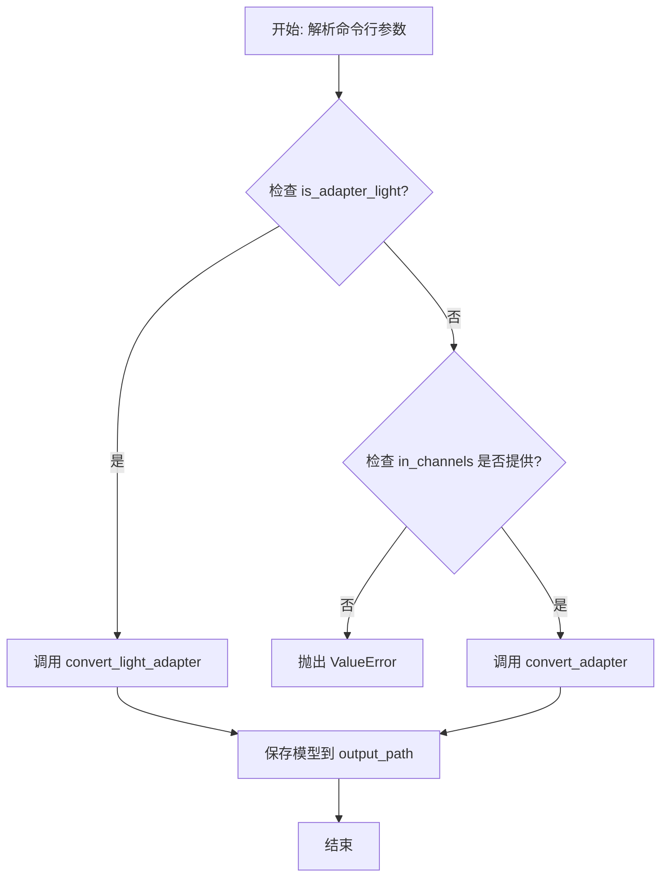
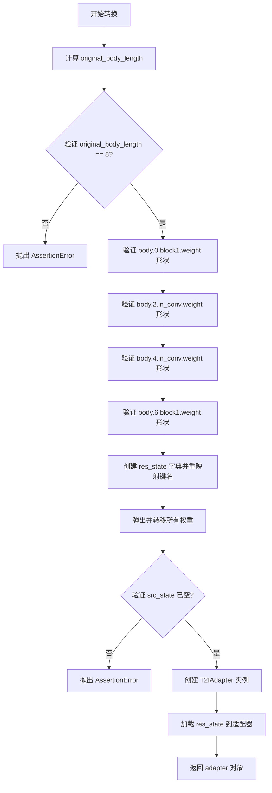
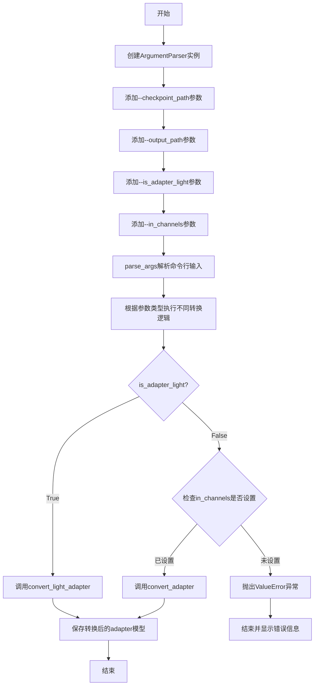
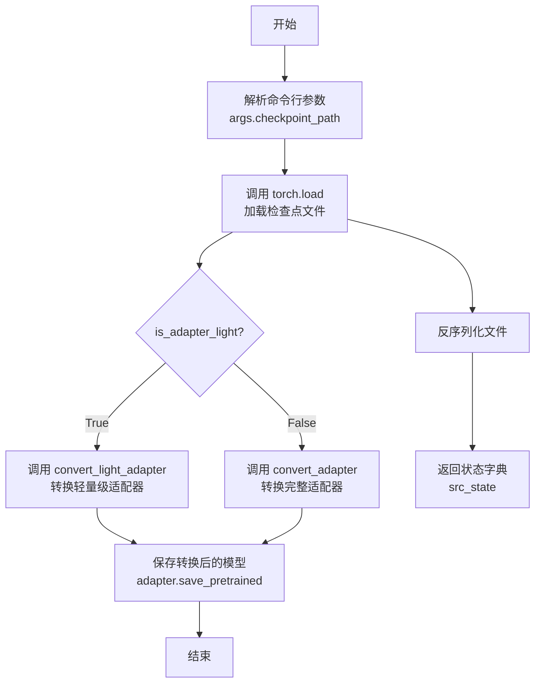
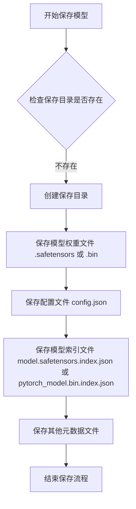

# `diffusers\scripts\convert_original_t2i_adapter.py` 详细设计文档

一个用于将T2I-Adapter预训练检查点转换为HuggingFace diffusers库兼容格式的转换脚本，支持full_adapter和light_adapter两种适配器类型的权重格式转换。

## 整体流程



## 类结构

```
该脚本为扁平化结构，无类定义
仅包含两个主要的转换函数:
├── convert_adapter (full_adapter转换)
└── convert_light_adapter (light_adapter转换)
```

## 全局变量及字段


### `src_state`
    
加载的原始检查点状态字典，包含模型权重和偏置参数

类型：`dict[str, torch.Tensor]`
    


### `in_channels`
    
输入通道数，用于指定适配器模型的输入特征维度

类型：`int`
    


### `original_body_length`
    
原始body部分层数，通过解析状态字典键名中的最大索引值计算得出

类型：`int`
    


### `res_state`
    
转换后的状态字典，键名按照T2IAdapter模型结构重新组织

类型：`dict[str, torch.Tensor]`
    


### `adapter`
    
转换后的适配器模型实例，可用于推理或保存为HuggingFace格式

类型：`T2IAdapter`
    


    

## 全局函数及方法


### `convert_adapter`

将 full_adapter 格式的检查点（state_dict）转换为 Diffusers 兼容格式的 T2IAdapter 模型对象。该函数通过重新映射键名并验证张量形状，确保原始预训练权重能够被 Diffusers 库正确加载和使用。

参数：

- `src_state`：`dict`，原始 full_adapter 格式的检查点状态字典，键名为字符串，值为 PyTorch 张量
- `in_channels`：`int`，输入图像的通道数，用于初始化 T2IAdapter

返回值：`T2IAdapter`，转换后的 Diffusers 兼容 T2IAdapter 模型对象

#### 流程图



#### 带注释源码

```python
def convert_adapter(src_state, in_channels):
    """
    将 full_adapter 格式的检查点转换为 Diffusers 兼容格式
    
    参数:
        src_state: 原始 full_adapter 格式的状态字典
        in_channels: 输入通道数
    
    返回:
        转换后的 T2IAdapter 模型对象
    """
    
    # ---- 步骤1: 计算原始 body 的层数 ----
    # 通过查找包含 "body." 的键，提取最大的索引号并加1
    # 例如: "body.0.block1.weight" -> 提取出 0, 然后找最大值
    original_body_length = max([int(x.split(".")[1]) for x in src_state.keys() if "body." in x]) + 1

    # ---- 步骤2: 验证 body 长度为8 (full_adapter 固定结构) ----
    assert original_body_length == 8

    # ---- 步骤3: 验证各层权重形状确保格式正确 ----
    # (0, 1) -> channels 1: 验证第一层的 block1 卷积权重形状
    assert src_state["body.0.block1.weight"].shape == (320, 320, 3, 3)

    # (2, 3) -> channels 2: 验证第二层的输入卷积权重形状
    assert src_state["body.2.in_conv.weight"].shape == (640, 320, 1, 1)

    # (4, 5) -> channels 3: 验证第三层的输入卷积权重形状
    assert src_state["body.4.in_conv.weight"].shape == (1280, 640, 1, 1)

    # (6, 7) -> channels 4: 验证第四层的 block1 卷积权重形状
    assert src_state["body.6.block1.weight"].shape == (1280, 1280, 3, 3)

    # ---- 步骤4: 重映射键名，将原始格式转换为 Diffusers 格式 ----
    # 原始格式: "body.X.blockY.weight"
    # 目标格式: "adapter.body.N.resnets.M.blockY.weight"
    res_state = {
        # 适配器输入卷积层
        "adapter.conv_in.weight": src_state.pop("conv_in.weight"),
        "adapter.conv_in.bias": src_state.pop("conv_in.bias"),
        
        # ---- body.0 (对应原始 body.0 和 body.1) ----
        # 0.resnets.0 (原始 body.0)
        "adapter.body.0.resnets.0.block1.weight": src_state.pop("body.0.block1.weight"),
        "adapter.body.0.resnets.0.block1.bias": src_state.pop("body.0.block1.bias"),
        "adapter.body.0.resnets.0.block2.weight": src_state.pop("body.0.block2.weight"),
        "adapter.body.0.resnets.0.block2.bias": src_state.pop("body.0.block2.bias"),
        
        # 0.resnets.1 (原始 body.1)
        "adapter.body.0.resnets.1.block1.weight": src_state.pop("body.1.block1.weight"),
        "adapter.body.0.resnets.1.block1.bias": src_state.pop("body.1.block1.bias"),
        "adapter.body.0.resnets.1.block2.weight": src_state.pop("body.1.block2.weight"),
        "adapter.body.0.resnets.1.block2.bias": src_state.pop("body.1.block2.bias"),
        
        # ---- body.1 (对应原始 body.2 和 body.3) ----
        # in_conv (原始 body.2.in_conv)
        "adapter.body.1.in_conv.weight": src_state.pop("body.2.in_conv.weight"),
        "adapter.body.1.in_conv.bias": src_state.pop("body.2.in_conv.bias"),
        
        # 1.resnets.0 (原始 body.2)
        "adapter.body.1.resnets.0.block1.weight": src_state.pop("body.2.block1.weight"),
        "adapter.body.1.resnets.0.block1.bias": src_state.pop("body.2.block1.bias"),
        "adapter.body.1.resnets.0.block2.weight": src_state.pop("body.2.block2.weight"),
        "adapter.body.1.resnets.0.block2.bias": src_state.pop("body.2.block2.bias"),
        
        # 1.resnets.1 (原始 body.3)
        "adapter.body.1.resnets.1.block1.weight": src_state.pop("body.3.block1.weight"),
        "adapter.body.1.resnets.1.block1.bias": src_state.pop("body.3.block1.bias"),
        "adapter.body.1.resnets.1.block2.weight": src_state.pop("body.3.block2.weight"),
        "adapter.body.1.resnets.1.block2.bias": src_state.pop("body.3.block2.bias"),
        
        # ---- body.2 (对应原始 body.4 和 body.5) ----
        # in_conv (原始 body.4.in_conv)
        "adapter.body.2.in_conv.weight": src_state.pop("body.4.in_conv.weight"),
        "adapter.body.2.in_conv.bias": src_state.pop("body.4.in_conv.bias"),
        
        # 2.resnets.0 (原始 body.4)
        "adapter.body.2.resnets.0.block1.weight": src_state.pop("body.4.block1.weight"),
        "adapter.body.2.resnets.0.block1.bias": src_state.pop("body.4.block1.bias"),
        "adapter.body.2.resnets.0.block2.weight": src_state.pop("body.4.block2.weight"),
        "adapter.body.2.resnets.0.block2.bias": src_state.pop("body.4.block2.bias"),
        
        # 2.resnets.1 (原始 body.5)
        "adapter.body.2.resnets.1.block1.weight": src_state.pop("body.5.block1.weight"),
        "adapter.body.2.resnets.1.block1.bias": src_state.pop("body.5.block1.bias"),
        "adapter.body.2.resnets.1.block2.weight": src_state.pop("body.5.block2.weight"),
        "adapter.body.2.resnets.1.block2.bias": src_state.pop("body.5.block2.bias"),
        
        # ---- body.3 (对应原始 body.6 和 body.7) ----
        # 3.resnets.0 (原始 body.6)
        "adapter.body.3.resnets.0.block1.weight": src_state.pop("body.6.block1.weight"),
        "adapter.body.3.resnets.0.block1.bias": src_state.pop("body.6.block1.bias"),
        "adapter.body.3.resnets.0.block2.weight": src_state.pop("body.6.block2.weight"),
        "adapter.body.3.resnets.0.block2.bias": src_state.pop("body.6.block2.bias"),
        
        # 3.resnets.1 (原始 body.7)
        "adapter.body.3.resnets.1.block1.weight": src_state.pop("body.7.block1.weight"),
        "adapter.body.3.resnets.1.block1.bias": src_state.pop("body.7.block1.bias"),
        "adapter.body.3.resnets.1.block2.weight": src_state.pop("body.7.block2.weight"),
        "adapter.body.3.resnets.1.block2.bias": src_state.pop("body.7.block2.bias"),
    }

    # ---- 步骤5: 验证所有键都已转移 ----
    # 确认 src_state 中的所有键都已被 pop 干净
    assert len(src_state) == 0

    # ---- 步骤6: 创建 Diffusers T2IAdapter 并加载权重 ----
    # 使用 full_adapter 类型初始化适配器
    adapter = T2IAdapter(in_channels=in_channels, adapter_type="full_adapter")

    # 将转换后的权重加载到适配器中
    adapter.load_state_dict(res_state)

    # ---- 步骤7: 返回转换后的适配器 ----
    return adapter
```


### `convert_light_adapter`

将light_adapter格式的检查点（包含4个body块，每块4个resnets）转换为diffusers兼容的T2IAdapter模型格式。

参数：

- `src_state`：`dict`，原始light_adapter格式的检查点状态字典，键名为如"body.0.in_conv.weight"等形式

返回值：`T2IAdapter`，转换后的diffusers兼容格式的adapter模型实例

#### 流程图

```mermaid
flowchart TD
    A[开始: 输入src_state] --> B[计算original_body_length]
    B --> C{original_body_length == 4?}
    C -->|是| D[构建res_state映射字典]
    C -->|否| E[抛出AssertionError]
    D --> F{src_state是否完全转换?}
    F -->|是| G[创建T2IAdapter实例: in_channels=3, channels=[320<br>640<br>1280], num_res_blocks=4]
    F -->|否| H[抛出AssertionError]
    G --> I[加载res_state到adapter]
    I --> J[返回adapter模型]
```

#### 带注释源码

```python
def convert_light_adapter(src_state):
    """
    将light_adapter格式的检查点转换为diffusers兼容格式
    
    参数:
        src_state: 原始light_adapter格式的检查点状态字典
        
    返回:
        转换后的T2IAdapter模型实例
    """
    # 计算原始body块的数量（通过解析包含"body."的键名）
    # 例如: body.0.xxx, body.1.xxx -> 最大索引为3，所以body_length = 3+1 = 4
    original_body_length = max([int(x.split(".")[1]) for x in src_state.keys() if "body." in x]) + 1

    # Light adapter应该有4个body块
    assert original_body_length == 4

    # 构建从light_adapter格式到diffusers格式的键名映射字典
    # 源格式: body.X.body.Y.blockZ.weight
    # 目标格式: adapter.body.X.resnets.Y.blockZ.weight
    res_state = {
        # body.0.in_conv - 第一个block的输入卷积层
        "adapter.body.0.in_conv.weight": src_state.pop("body.0.in_conv.weight"),
        "adapter.body.0.in_conv.bias": src_state.pop("body.0.in_conv.bias"),
        
        # body.0的4个resnet块 (body.0.body.0 ~ body.0.body.3)
        "adapter.body.0.resnets.0.block1.weight": src_state.pop("body.0.body.0.block1.weight"),
        "adapter.body.0.resnets.0.block1.bias": src_state.pop("body.0.body.0.block1.bias"),
        "adapter.body.0.resnets.0.block2.weight": src_state.pop("body.0.body.0.block2.weight"),
        "adapter.body.0.resnets.0.block2.bias": src_state.pop("body.0.body.0.block2.bias"),
        
        "adapter.body.0.resnets.1.block1.weight": src_state.pop("body.0.body.1.block1.weight"),
        "adapter.body.0.resnets.1.block1.bias": src_state.pop("body.0.body.1.block1.bias"),
        "adapter.body.0.resnets.1.block2.weight": src_state.pop("body.0.body.1.block2.weight"),
        "adapter.body.0.resnets.1.block2.bias": src_state.pop("body.0.body.1.block2.bias"),
        
        "adapter.body.0.resnets.2.block1.weight": src_state.pop("body.0.body.2.block1.weight"),
        "adapter.body.0.resnets.2.block1.bias": src_state.pop("body.0.body.2.block1.bias"),
        "adapter.body.0.resnets.2.block2.weight": src_state.pop("body.0.body.2.block2.weight"),
        "adapter.body.0.resnets.2.block2.bias": src_state.pop("body.0.body.2.block2.bias"),
        
        "adapter.body.0.resnets.3.block1.weight": src_state.pop("body.0.body.3.block1.weight"),
        "adapter.body.0.resnets.3.block1.bias": src_state.pop("body.0.body.3.block1.bias"),
        "adapter.body.0.resnets.3.block2.weight": src_state.pop("body.0.body.3.block2.weight"),
        "adapter.body.0.resnets.3.block2.bias": src_state.pop("body.0.body.3.block2.bias"),
        
        # body.0.out_conv - 第一个block的输出卷积层
        "adapter.body.0.out_conv.weight": src_state.pop("body.0.out_conv.weight"),
        "adapter.body.0.out_conv.bias": src_state.pop("body.0.out_conv.bias"),
        
        # body.1的输入卷积和4个resnet块
        "adapter.body.1.in_conv.weight": src_state.pop("body.1.in_conv.weight"),
        "adapter.body.1.in_conv.bias": src_state.pop("body.1.in_conv.bias"),
        "adapter.body.1.resnets.0.block1.weight": src_state.pop("body.1.body.0.block1.weight"),
        "adapter.body.1.resnets.0.block1.bias": src_state.pop("body.1.body.0.block1.bias"),
        "adapter.body.1.resnets.0.block2.weight": src_state.pop("body.1.body.0.block2.weight"),
        "adapter.body.1.resnets.0.block2.bias": src_state.pop("body.1.body.0.block2.bias"),
        "adapter.body.1.resnets.1.block1.weight": src_state.pop("body.1.body.1.block1.weight"),
        "adapter.body.1.resnets.1.block1.bias": src_state.pop("body.1.body.1.block1.bias"),
        "adapter.body.1.resnets.1.block2.weight": src_state.pop("body.1.body.1.block2.weight"),
        "adapter.body.1.resnets.1.block2.bias": src_state.pop("body.1.body.1.block2.bias"),
        "adapter.body.1.resnets.2.block1.weight": src_state.pop("body.1.body.2.block1.weight"),
        "adapter.body.1.resnets.2.block1.bias": src_state.pop("body.1.body.2.block1.bias"),
        "adapter.body.1.resnets.2.block2.weight": src_state.pop("body.1.body.2.block2.weight"),
        "adapter.body.1.resnets.2.block2.bias": src_state.pop("body.1.body.2.block2.bias"),
        "adapter.body.1.resnets.3.block1.weight": src_state.pop("body.1.body.3.block1.weight"),
        "adapter.body.1.resnets.3.block1.bias": src_state.pop("body.1.body.3.block1.bias"),
        "adapter.body.1.resnets.3.block2.weight": src_state.pop("body.1.body.3.block2.weight"),
        "adapter.body.1.resnets.3.block2.bias": src_state.pop("body.1.body.3.block2.bias"),
        "adapter.body.1.out_conv.weight": src_state.pop("body.1.out_conv.weight"),
        "adapter.body.1.out_conv.bias": src_state.pop("body.1.out_conv.bias"),
        
        # body.2的输入卷积和4个resnet块
        "adapter.body.2.in_conv.weight": src_state.pop("body.2.in_conv.weight"),
        "adapter.body.2.in_conv.bias": src_state.pop("body.2.in_conv.bias"),
        "adapter.body.2.resnets.0.block1.weight": src_state.pop("body.2.body.0.block1.weight"),
        "adapter.body.2.resnets.0.block1.bias": src_state.pop("body.2.body.0.block1.bias"),
        "adapter.body.2.resnets.0.block2.weight": src_state.pop("body.2.body.0.block2.weight"),
        "adapter.body.2.resnets.0.block2.bias": src_state.pop("body.2.body.0.block2.bias"),
        "adapter.body.2.resnets.1.block1.weight": src_state.pop("body.2.body.1.block1.weight"),
        "adapter.body.2.resnets.1.block1.bias": src_state.pop("body.2.body.1.block1.bias"),
        "adapter.body.2.resnets.1.block2.weight": src_state.pop("body.2.body.1.block2.weight"),
        "adapter.body.2.resnets.1.block2.bias": src_state.pop("body.2.body.1.block2.bias"),
        "adapter.body.2.resnets.2.block1.weight": src_state.pop("body.2.body.2.block1.weight"),
        "adapter.body.2.resnets.2.block1.bias": src_state.pop("body.2.body.2.block1.bias"),
        "adapter.body.2.resnets.2.block2.weight": src_state.pop("body.2.body.2.block2.weight"),
        "adapter.body.2.resnets.2.block2.bias": src_state.pop("body.2.body.2.block2.bias"),
        "adapter.body.2.resnets.3.block1.weight": src_state.pop("body.2.body.3.block1.weight"),
        "adapter.body.2.resnets.3.block1.bias": src_state.pop("body.2.body.3.block1.bias"),
        "adapter.body.2.resnets.3.block2.weight": src_state.pop("body.2.body.3.block2.weight"),
        "adapter.body.2.resnets.3.block2.bias": src_state.pop("body.2.body.3.block2.bias"),
        "adapter.body.2.out_conv.weight": src_state.pop("body.2.out_conv.weight"),
        "adapter.body.2.out_conv.bias": src_state.pop("body.2.out_conv.bias"),
        
        # body.3的输入卷积和4个resnet块
        "adapter.body.3.in_conv.weight": src_state.pop("body.3.in_conv.weight"),
        "adapter.body.3.in_conv.bias": src_state.pop("body.3.in_conv.bias"),
        "adapter.body.3.resnets.0.block1.weight": src_state.pop("body.3.body.0.block1.weight"),
        "adapter.body.3.resnets.0.block1.bias": src_state.pop("body.3.body.0.block1.bias"),
        "adapter.body.3.resnets.0.block2.weight": src_state.pop("body.3.body.0.block2.weight"),
        "adapter.body.3.resnets.0.block2.bias": src_state.pop("body.3.body.0.block2.bias"),
        "adapter.body.3.resnets.1.block1.weight": src_state.pop("body.3.body.1.block1.weight"),
        "adapter.body.3.resnets.1.block1.bias": src_state.pop("body.3.body.1.block1.bias"),
        "adapter.body.3.resnets.1.block2.weight": src_state.pop("body.3.body.1.block2.weight"),
        "adapter.body.3.resnets.1.block2.bias": src_state.pop("body.3.body.1.block2.bias"),
        "adapter.body.3.resnets.2.block1.weight": src_state.pop("body.3.body.2.block1.weight"),
        "adapter.body.3.resnets.2.block1.bias": src_state.pop("body.3.body.2.block1.bias"),
        "adapter.body.3.resnets.2.block2.weight": src_state.pop("body.3.body.2.block2.weight"),
        "adapter.body.3.resnets.2.block2.bias": src_state.pop("body.3.body.2.block2.bias"),
        "adapter.body.3.resnets.3.block1.weight": src_state.pop("body.3.body.3.block1.weight"),
        "adapter.body.3.resnets.3.block1.bias": src_state.pop("body.3.body.3.block1.bias"),
        "adapter.body.3.resnets.3.block2.weight": src_state.pop("body.3.body.3.block2.weight"),
        "adapter.body.3.resnets.3.block2.bias": src_state.pop("body.3.body.3.block2.bias"),
        "adapter.body.3.out_conv.weight": src_state.pop("body.3.out_conv.weight"),
        "adapter.body.3.out_conv.bias": src_state.pop("body.3.out_conv.bias"),
    }

    # 验证所有键都被正确转换（src_state应该为空）
    assert len(src_state) == 0

    # 创建diffusers格式的T2IAdapter模型
    # 参数说明:
    #   in_channels=3: 输入通道数 (RGB图像)
    #   channels=[320, 640, 1280]: 各block的通道数
    #   num_res_blocks=4: 每个block包含4个resnet块
    #   adapter_type="light_adapter": 指定适配器类型
    adapter = T2IAdapter(
        in_channels=3, 
        channels=[320, 640, 1280], 
        num_res_blocks=4, 
        adapter_type="light_adapter"
    )

    # 加载转换后的状态字典到模型
    adapter.load_state_dict(res_state)

    # 返回转换后的adapter模型
    return adapter
```


### `argparse` (命令行参数解析)

该代码段使用Python的`argparse`模块构建命令行参数解析器，用于接收T2I-Adapter检查点转换工具的用户输入参数，包括检查点路径、输出路径、适配器类型和输入通道数等配置。

#### 参数

- `checkpoint_path`：`str`，必填参数，指定要转换的检查点文件路径
- `output_path`：`str`，必填参数，指定转换后检查点的保存路径
- `is_adapter_light`：`bool`，可选标志，指示检查点是否来自Adapter-Light架构（如color-adapter）
- `in_channels`：`int`，可选参数，非light adapter的输入通道数

#### 返回值

- `args`：返回解析后的命名空间对象，包含所有命令行参数的属性值

#### 流程图



#### 带注释源码

```python
if __name__ == "__main__":
    # 创建ArgumentParser实例，用于解析命令行参数
    parser = argparse.ArgumentParser()

    # 添加checkpoint_path参数：指定要转换的检查点文件路径
    parser.add_argument(
        "--checkpoint_path", default=None, type=str, required=True, 
        help="Path to the checkpoint to convert."
    )
    
    # 添加output_path参数：指定转换后检查点的保存路径
    parser.add_argument(
        "--output_path", default=None, type=str, required=True, 
        help="Path to the store the result checkpoint."
    )
    
    # 添加is_adapter_light参数：布尔标志，指示是否使用light adapter架构
    parser.add_argument(
        "--is_adapter_light",
        action="store_true",
        help="Is checkpoint come from Adapter-Light architecture. ex: color-adapter",
    )
    
    # 添加in_channels参数：非light adapter的输入通道数
    parser.add_argument("--in_channels", required=False, type=int, 
                        help="Input channels for non-light adapter")

    # 解析命令行参数
    args = parser.parse_args()
    
    # 加载源检查点文件
    src_state = torch.load(args.checkpoint_path)

    # 根据参数选择转换逻辑
    if args.is_adapter_light:
        # 使用light adapter转换函数
        adapter = convert_light_adapter(src_state)
    else:
        # 检查in_channels参数是否设置
        if args.in_channels is None:
            raise ValueError("set `--in_channels=<n>`")
        # 使用标准adapter转换函数
        adapter = convert_adapter(src_state, args.in_channels)

    # 保存转换后的模型到指定路径
    adapter.save_pretrained(args.output_path)
```


### `torch.load`

从指定路径加载 PyTorch 检查点文件，将其反序列化为 Python 对象（通常是状态字典）。

参数：

- `f`：`str`，要加载的检查点文件路径。此处为 `args.checkpoint_path`，表示待转换的 T2I-Adapter 原始检查点文件路径。

返回值：`Any`，返回检查点的状态字典（state dict），此处为包含模型权重和参数的字典。

#### 流程图



#### 带注释源码

```python
# 解析命令行参数
args = parser.parse_args()

# 核心调用：torch.load
# 从 checkpoint_path 加载检查点文件，返回状态字典（包含模型权重和参数）
# torch.load 是 PyTorch 用于反序列化保存的模型/张量对象的函数
src_state = torch.load(args.checkpoint_path)

# 根据是否为轻量级适配器选择转换函数
if args.is_adapter_light:
    # 转换轻量级适配器（4个 body 块）
    adapter = convert_light_adapter(src_state)
else:
    # 验证 in_channels 参数必须提供
    if args.in_channels is None:
        raise ValueError("set `--in_channels=<n>`")
    # 转换完整适配器（8个 body 块）
    adapter = convert_adapter(src_state, args.in_channels)

# 将转换后的适配器保存到指定路径
adapter.save_pretrained(args.output_path)
```


### `adapter.save_pretrained`

该方法调用了 Hugging Face diffusers 库中 `T2IAdapter` 模型的 `save_pretrained` 方法，用于将转换后的适配器模型（包含权重、配置等）保存到指定的输出目录，以便后续加载使用。

参数：

-  `save_directory`：`str`，保存模型的输出目录路径（即 `args.output_path`）

返回值：`None`，无返回值，该方法直接执行保存操作

#### 流程图



#### 带注释源码

```python
# ... 代码接上一部分 ...
if args.is_adapter_light:
    # 根据是否为轻量适配器选择转换函数
    adapter = convert_light_adapter(src_state)
else:
    # 检查是否提供了输入通道数
    if args.in_channels is None:
        raise ValueError("set `--in_channels=<n>`")
    # 转换完整适配器模型
    adapter = convert_adapter(src_state, args.in_channels)

# 调用 diffusers 库中 T2IAdapter 的 save_pretrained 方法
# 功能：将模型权重、配置等信息保存到指定目录
# 参数：args.output_path - 用户指定的输出路径
# 返回值：无（None）
adapter.save_pretrained(args.output_path)
```

## 关键组件


### 张量索引与权重映射

通过字典操作和键名重命名，将原始检查点的权重参数映射到Diffusers T2IAdapter模型的目标结构中。使用`src_state.pop()`方法提取并转换键名，同时验证权重形状确保转换正确性。

### convert_adapter 函数

负责将完整的T2I-Adapter检查点（original_body_length=8）转换为Diffusers格式的函数。支持4个stage（channels: 320->640->1280->1280），每个stage包含2个resnet块，将原始的block1/block2结构映射为resnets.0/resnets.1结构。

### convert_light_adapter 函数

负责将轻量级T2I-Adapter检查点（original_body_length=4）转换为Diffusers格式的函数。采用更深的resnet结构（每个stage有4个resnet块），并包含in_conv和out_conv层，用于处理如color-adapter等轻量级模型。

### 命令行参数解析与适配器类型选择

通过argparse模块接收checkpoint_path、output_path、is_adapter_light标志和in_channels参数。根据is_adapter_light标志选择调用convert_light_adapter或convert_adapter函数，并进行必要的参数验证。

### T2IAdapter 模型实例化与状态加载

基于指定的adapter_type（full_adapter或light_adapter）创建对应的T2IAdapter模型实例，然后使用load_state_dict方法将转换后的权重加载到模型中，最后通过save_pretrained保存到指定路径。


## 问题及建议


### 已知问题

- **硬编码的模型结构参数**：代码中硬编码了 `original_body_length == 8` 和 `original_body_length == 4`，通道数 `[320, 640, 1280]`，以及各种权重形状断言，缺乏灵活性，无法适配不同规模的 T2I-Adapter 模型变体。
- **使用 assert 进行业务逻辑验证**：代码中使用 `assert` 语句进行模型结构验证和状态字典非空检查，在 Python 运行时使用 `-O` 优化标志时会被跳过，导致关键验证失效。
- **字典键映射的脆弱性**：大量使用 `src_state.pop()` 直接映射键名，键名拼写错误或结构不匹配时会导致 `KeyError`，且错误信息不明确，难以定位问题。
- **无输入参数校验**：`--in_channels` 参数在非 light adapter 模式下为必需，但仅在运行时通过条件判断抛出异常，缺乏 argparse 级别的参数依赖校验机制。
- **重复代码模式**：两个转换函数 `convert_adapter` 和 `convert_light_adapter` 包含大量相似的键映射逻辑，违反 DRY 原则，可维护性差。
- **无日志和调试信息**：转换过程无任何日志输出，无法追踪转换进度或调试失败原因。
- **缺乏类型注解**：函数参数和返回值缺少类型提示，影响代码可读性和静态分析工具的效能。

### 优化建议

- **参数化模型结构**：将硬编码的 `body_length`、通道数、权重形状等抽象为配置参数或从输入状态字典动态推断，增强代码通用性。
- **用异常替代 assert**：将模型结构验证改为明确的 `raise ValueError` 或 `raise RuntimeError`，确保在生产环境中也能生效。
- **封装键映射逻辑**：提取公共的键名转换逻辑为辅助函数或映射表，使用循环或配置文件批量生成映射关系，减少重复代码。
- **增强错误处理**：为 `pop()` 操作添加异常捕获，提供更具描述性的错误信息，指出缺失的键名。
- **添加命令行参数校验**：利用 argparse 的 `type` 或 `set_defaults` 实现参数间依赖校验，提前验证 `in_channels` 的必要性。
- **引入日志记录**：使用 `logging` 模块记录转换步骤、键数量、模型信息等，便于调试和审计。
- **补充类型注解**：为函数参数和返回值添加类型提示，提升代码可维护性。

## 其它


### 设计目标与约束

本脚本的设计目标是将T2I-Adapter的预训练检查点从原始格式转换为HuggingFace diffusers库兼容的格式。主要约束包括：(1) 仅支持full_adapter和light_adapter两种类型；(2) full_adapter要求original_body_length为8，light_adapter要求为4；(3) 输入检查点必须为torch.save保存的.state_dict()格式；(4) 转换后的模型通过adapter.save_pretrained保存为HuggingFace格式。

### 错误处理与异常设计

代码采用断言（assert）进行关键验证，包括：original_body_length检查确保适配器结构正确；权重形状检查确保通道数匹配（320/640/1280）；src_state耗尽检查确保所有权重都被正确映射。当in_channels参数缺失且非light适配器时，抛出ValueError异常提示用户必须设置该参数。

### 外部依赖与接口契约

本脚本依赖两个核心外部库：(1) torch - 用于加载原始检查点和张量操作；(2) diffusers库中的T2IAdapter类 - 作为转换目标模型。接口契约要求输入检查点必须是torch.load加载的.state_dict()格式，输出为HuggingFace标准的adapter目录结构（包含model_index.json和模型权重文件）。

### 命令行参数详解

| 参数名称 | 类型 | 必填 | 默认值 | 描述 |
|---------|------|------|--------|------|
| --checkpoint_path | str | 是 | None | 原始检查点文件路径 |
| --output_path | str | 是 | None | 转换后检查点输出路径 |
| --is_adapter_light | flag | 否 | False | 标识是否为light adapter架构 |
| --in_channels | int | 否* | None | full adapter的输入通道数，light adapter不需要 |

*当is_adapter_light为False时为必填参数

### 数据流与状态机

脚本的数据流如下：加载原始检查点 → 根据adapter类型选择转换函数 → 验证原始模型结构 → 创建权重映射字典 → 创建目标T2IAdapter实例 → 加载转换后的权重 → 保存为HuggingFace格式。状态转换通过is_adapter_light标志位控制，full adapter走convert_adapter路径，light adapter走convert_light_adapter路径。

### 适配器架构差异

full_adapter与light_adapter的核心差异在于：full_adapter具有4个stage（body.0-3），每个stage包含2个resnets块，original_body_length=8；light_adapter将4个stage压缩到2个stage（body.0-1），每个stage包含4个resnets块，且权重键名包含额外的body层级（如body.0.body.0），original_body_length=4。

### 版本兼容性说明

本脚本针对特定的T2I-Adapter权重格式设计，假设原始权重来自官方发布的预训练模型。如果原始模型架构发生更新（如新增层级或修改模块命名），本脚本需要相应更新。脚本依赖于diffusers库中的T2IAdapter实现，版本兼容性取决于diffusers库的版本迭代。

    