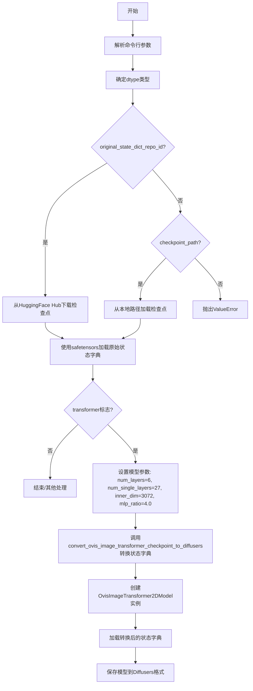
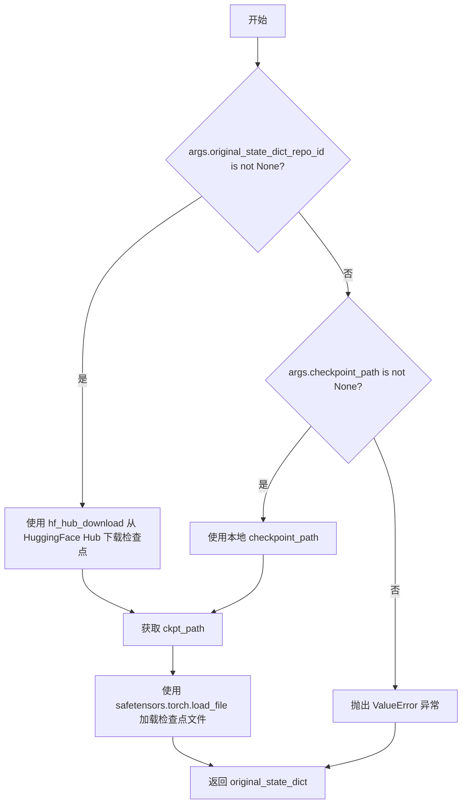
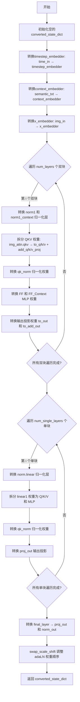
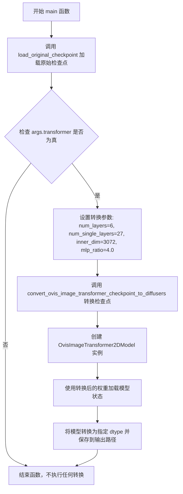

# `diffusers\scripts\convert_ovis_image_to_diffusers.py` 详细设计文档

该脚本用于将Ovis-Image模型（来自AIDC-AI/Ovis-Image-7B仓库的safetensors格式检查点）转换为HuggingFace Diffusers库兼容的OvisImageTransformer2DModel格式，主要处理权重键名的映射和结构转换，包括时间嵌入、上下文嵌入、双Transformer块和单Transformer块的参数重命名与重组。

## 整体流程



## 类结构

```
无类定义（脚本文件）
全局函数:
├── load_original_checkpoint(args)
├── swap_scale_shift(weight)
├── convert_ovis_image_transformer_checkpoint_to_diffusers(...)
└── main(args)
```

## 全局变量及字段


### `CTX`
    
根据accelerate库可用性选择的上下文管理器，用于初始化空权重或作为空上下文

类型：`context manager / Callable`
    


### `parser`
    
命令行参数解析器实例，用于定义和解析脚本的可选和必需参数

类型：`argparse.ArgumentParser`
    


### `args`
    
解析后的命令行参数命名空间对象，包含所有传入的参数值

类型：`argparse.Namespace`
    


### `dtype`
    
PyTorch张量数据类型，根据命令行参数dtype确定（bf16或float32）

类型：`torch.dtype`
    


    

## 全局函数及方法


### `load_original_checkpoint`

该函数用于加载原始的 Ovis-Image 检查点文件，支持从 HuggingFace Hub 远程下载或从本地路径加载，并返回包含模型权重的状态字典。

参数：

-  `args`：`argparse.Namespace`，包含命令行参数的对象，需包含 `original_state_dict_repo_id`（HuggingFace Hub 仓库 ID）、`filename`（文件名）和 `checkpoint_path`（本地路径）属性

返回值：`Dict`，返回从检查点文件中加载的原始模型状态字典（键为参数名称，值为 PyTorch 张量）

#### 流程图



#### 带注释源码

```python
def load_original_checkpoint(args):
    """
    加载原始 Ovis-Image 检查点文件。
    
    支持两种加载方式：
    1. 从 HuggingFace Hub 远程下载（通过 original_state_dict_repo_id 和 filename）
    2. 从本地路径加载（通过 checkpoint_path）
    
    参数:
        args: 包含命令行参数的命名空间对象，必须包含以下属性之一：
            - original_state_dict_repo_id: HuggingFace Hub 仓库 ID
            - checkpoint_path: 本地检查点文件路径
            - filename: 下载时的文件名（默认 "ovis_image.safetensors"）
    
    返回:
        Dict: 包含原始模型权重参数的状态字典
    
    异常:
        ValueError: 当既未提供 original_state_dict_repo_id 也未提供 checkpoint_path 时抛出
    """
    # 判断是否提供了 HuggingFace Hub 仓库 ID
    if args.original_state_dict_repo_id is not None:
        # 从 HuggingFace Hub 下载检查点文件
        # 使用 hf_hub_download 函数下载指定仓库中的文件
        ckpt_path = hf_hub_download(
            repo_id=args.original_state_dict_repo_id,  # 仓库标识符
            filename=args.filename  # 要下载的文件名
        )
    # 判断是否提供了本地检查点路径
    elif args.checkpoint_path is not None:
        # 使用本地文件路径
        ckpt_path = args.checkpoint_path
    else:
        # 既没有提供远程仓库 ID 也没有提供本地路径，抛出错误
        raise ValueError(" please provide either `original_state_dict_repo_id` or a local `checkpoint_path`")

    # 使用 safetensors 库安全地加载检查点文件
    # safetensors 是一种高效的模型权重存储格式，支持内存映射
    original_state_dict = safetensors.torch.load_file(ckpt_path)
    
    # 返回加载的原始状态字典
    return original_state_dict
```


### `swap_scale_shift`

该函数用于在 SD3 原始实现与 Diffusers 实现之间进行权重顺序的适配。在 SD3 原始的 `AdaLayerNormContinuous` 实现中，线性投影输出被分割为 `[shift, scale]`，而在 Diffusers 实现中则被分割为 `[scale, shift]`。该函数通过分割并重新拼接权重张量，使得原始检查点可以直接用于 Diffusers 实现的模型。

参数：

- `weight`：`torch.Tensor`，原始权重张量，通常是线性层的权重，形状为 `(2*hidden_dim, ...)`，需要按照第一维（dim=0）进行分割

返回值：`torch.Tensor`，重新拼接后的权重张量，形状与输入相同，但顺序已从 `[shift, scale]` 交换为 `[scale, shift]`

#### 流程图

```mermaid
flowchart TD
    A[开始: 传入权重 weight] --> B{检查权重形状}
    B -->|有效| C[使用 chunk 将权重沿 dim=0 分割为两部分]
    C --> D[分割结果: shift, scale]
    D --> E[使用 cat 将 [scale, shift] 沿 dim=0 拼接]
    E --> F[返回新权重 new_weight]
    B -->|无效| G[抛出异常/返回错误]
```

#### 带注释源码

```python
def swap_scale_shift(weight):
    """
    交换权重张量中的 shift 和 scale 顺序。
    
    在 SD3 原始实现中，AdaLayerNormContinuous 将线性投影输出分割为 [shift, scale]；
    而在 Diffusers 中则分割为 [scale, shift]。该函数通过重新排列权重使两者兼容。
    
    参数:
        weight: torch.Tensor, 原始权重张量
        
    返回:
        torch.Tensor, 重新拼接后的权重张量
    """
    # 使用 chunk 将权重沿第0维分割为两部分
    # 第一部分为 shift（原始顺序的前半部分）
    # 第二部分为 scale（原始顺序的后半部分）
    shift, scale = weight.chunk(2, dim=0)
    
    # 重新拼接两部分，顺序改为 [scale, shift]
    # 这与 Diffusers 实现的 AdaLayerNormContinuous 期望的顺序一致
    new_weight = torch.cat([scale, shift], dim=0)
    
    # 返回重新排列后的权重
    return new_weight
```


### `convert_ovis_image_transformer_checkpoint_to_diffusers`

该函数用于将原始 Ovis-Image 模型的检查点（checkpoint）状态字典转换为 Diffusers 库兼容的 OvisImageTransformer2DModel 格式。主要处理权重键名映射、层归一化顺序调整、以及注意力机制权重重排等转换工作。

#### 参数

- `original_state_dict`：`Dict[str, torch.Tensor]`，原始 Ovis-Image 模型的状态字典，包含模型各层的权重参数
- `num_layers`：`int`，双 transformer 块（double transformer blocks）的数量
- `num_single_layers`：`int`，单 transformer 块（single transformer blocks）的数量
- `inner_dim`：`int`，模型内部隐藏维度
- `mlp_ratio`：`float`，MLP 隐藏层扩展比率，默认为 4.0

#### 返回值

`Dict[str, torch.Tensor]`，转换后的 Diffusers 兼容状态字典

#### 流程图



#### 带注释源码

```python
def convert_ovis_image_transformer_checkpoint_to_diffusers(
    original_state_dict, num_layers, num_single_layers, inner_dim, mlp_ratio=4.0
):
    """
    将原始 Ovis-Image Transformer 检查点转换为 Diffusers 格式

    参数:
        original_state_dict: 原始模型的状态字典（会被 pop 操作修改）
        num_layers: 双 transformer 块的数量
        num_single_layers: 单 transformer 块的数量
        inner_dim: 隐藏层维度
        mlp_ratio: MLP 隐藏层扩展比率

    返回:
        转换后的 Diffusers 兼容状态字典
    """
    converted_state_dict = {}

    # ========== 1. 时间步嵌入器转换 ==========
    # original: time_in.in_layer / time_in.out_layer
    # diffusers: timestep_embedder.linear_1 / timestep_embedder.linear_2
    converted_state_dict["timestep_embedder.linear_1.weight"] = original_state_dict.pop("time_in.in_layer.weight")
    converted_state_dict["timestep_embedder.linear_1.bias"] = original_state_dict.pop("time_in.in_layer.bias")
    converted_state_dict["timestep_embedder.linear_2.weight"] = original_state_dict.pop("time_in.out_layer.weight")
    converted_state_dict["timestep_embedder.linear_2.bias"] = original_state_dict.pop("time_in.out_layer.bias")

    # ========== 2. 上下文嵌入器转换 ==========
    # original: semantic_txt_norm / semantic_txt_in
    # diffusers: context_embedder_norm / context_embedder
    converted_state_dict["context_embedder_norm.weight"] = original_state_dict.pop("semantic_txt_norm.weight")
    converted_state_dict["context_embedder.weight"] = original_state_dict.pop("semantic_txt_in.weight")
    converted_state_dict["context_embedder.bias"] = original_state_dict.pop("semantic_txt_in.bias")

    # ========== 3. 图像嵌入器转换 ==========
    # original: img_in
    # diffusers: x_embedder
    converted_state_dict["x_embedder.weight"] = original_state_dict.pop("img_in.weight")
    converted_state_dict["x_embedder.bias"] = original_state_dict.pop("img_in.bias")

    # ========== 4. 双 Transformer 块转换 ==========
    # 处理图像注意力 (img_attn) 和文本注意力 (txt_attn) 的 QKV 权重
    # original: double_blocks.{i}.img_attn.qkv.weight → diffusers: to_q, to_k, to_v, add_q_proj, add_k_proj, add_v_proj
    for i in range(num_layers):
        block_prefix = f"transformer_blocks.{i}."

        # 4.1 归一化层转换
        # 图像归一化: img_mod.lin → norm1.linear
        converted_state_dict[f"{block_prefix}norm1.linear.weight"] = original_state_dict.pop(
            f"double_blocks.{i}.img_mod.lin.weight"
        )
        converted_state_dict[f"{block_prefix}norm1.linear.bias"] = original_state_dict.pop(
            f"double_blocks.{i}.img_mod.lin.bias"
        )
        # 文本归一化: txt_mod.lin → norm1_context.linear
        converted_state_dict[f"{block_prefix}norm1_context.linear.weight"] = original_state_dict.pop(
            f"double_blocks.{i}.txt_mod.lin.weight"
        )
        converted_state_dict[f"{block_prefix}norm1_context.linear_bias"] = original_state_dict.pop(
            f"double_blocks.{i}.txt_mod.lin.bias"
        )

        # 4.2 QKV 权重拆分与转换
        # 图像注意力 QKV 拆分为 query, key, value
        sample_q, sample_k, sample_v = torch.chunk(
            original_state_dict.pop(f"double_blocks.{i}.img_attn.qkv.weight"), 3, dim=0
        )
        # 文本注意力 QKV 拆分为 add_q, add_k, add_v (用于 cross-attention)
        context_q, context_k, context_v = torch.chunk(
            original_state_dict.pop(f"double_blocks.{i}.txt_attn.qkv.weight"), 3, dim=0
        )
        # 拆分偏置
        sample_q_bias, sample_k_bias, sample_v_bias = torch.chunk(
            original_state_dict.pop(f"double_blocks.{i}.img_attn.qkv.bias"), 3, dim=0
        )
        context_q_bias, context_k_bias, context_v_bias = torch.chunk(
            original_state_dict.pop(f"double_blocks.{i}.txt_attn.qkv.bias"), 3, dim=0
        )

        # 图像自注意力权重
        converted_state_dict[f"{block_prefix}attn.to_q.weight"] = torch.cat([sample_q])
        converted_state_dict[f"{block_prefix}attn.to_q.bias"] = torch.cat([sample_q_bias])
        converted_state_dict[f"{block_prefix}attn.to_k.weight"] = torch.cat([sample_k])
        converted_state_dict[f"{block_prefix}attn.to_k.bias"] = torch.cat([sample_k_bias])
        converted_state_dict[f"{block_prefix}attn.to_v.weight"] = torch.cat([sample_v])
        converted_state_dict[f"{block_prefix}attn.to_v.bias"] = torch.cat([sample_v_bias])

        # 文本交叉注意力权重 (add_* 表示额外添加的 cross-attention)
        converted_state_dict[f"{block_prefix}attn.add_q_proj.weight"] = torch.cat([context_q])
        converted_state_dict[f"{block_prefix}attn.add_q_proj.bias"] = torch.cat([context_q_bias])
        converted_state_dict[f"{block_prefix}attn.add_k_proj.weight"] = torch.cat([context_k])
        converted_state_dict[f"{block_prefix}attn.add_k_proj.bias"] = torch.cat([context_k_bias])
        converted_state_dict[f"{block_prefix}attn.add_v_proj.weight"] = torch.cat([context_v])
        converted_state_dict[f"{block_prefix}attn.add_v_proj.bias"] = torch.cat([context_v_bias])

        # 4.3 QK 归一化权重转换
        converted_state_dict[f"{block_prefix}attn.norm_q.weight"] = original_state_dict.pop(
            f"double_blocks.{i}.img_attn.norm.query_norm.weight"
        )
        converted_state_dict[f"{block_prefix}attn.norm_k.weight"] = original_state_dict.pop(
            f"double_blocks.{i}.img_attn.norm.key_norm.weight"
        )
        converted_state_dict[f"{block_prefix}attn.norm_added_q.weight"] = original_state_dict.pop(
            f"double_blocks.{i}.txt_attn.norm.query_norm.weight"
        )
        converted_state_dict[f"{block_prefix}attn.norm_added_k.weight"] = original_state_dict.pop(
            f"double_blocks.{i}.txt_attn.norm.key_norm.weight"
        )

        # 4.4 FFN (Feed-Forward Network) 权重转换
        # 图像 FFN: 合并 up_proj 和 gate_proj 为 proj 权重 (SwiGLU 格式)
        converted_state_dict[f"{block_prefix}ff.net.0.proj.weight"] = torch.cat(
            [
                original_state_dict.pop(f"double_blocks.{i}.img_mlp.up_proj.weight"),
                original_state_dict.pop(f"double_blocks.{i}.img_mlp.gate_proj.weight"),
            ],
            dim=0,
        )
        converted_state_dict[f"{block_prefix}ff.net.0.proj.bias"] = torch.cat(
            [
                original_state_dict.pop(f"double_blocks.{i}.img_mlp.up_proj.bias"),
                original_state_dict.pop(f"double_blocks.{i}.img_mlp.gate_proj.bias"),
            ],
            dim=0,
        )
        converted_state_dict[f"{block_prefix}ff.net.2.weight"] = original_state_dict.pop(
            f"double_blocks.{i}.img_mlp.down_proj.weight"
        )
        converted_state_dict[f"{block_prefix}ff.net.2.bias"] = original_state_dict.pop(
            f"double_blocks.{i}.img_mlp.down_proj.bias"
        )

        # 文本 FFN (ff_context)
        converted_state_dict[f"{block_prefix}ff_context.net.0.proj.weight"] = torch.cat(
            [
                original_state_dict.pop(f"double_blocks.{i}.txt_mlp.up_proj.weight"),
                original_state_dict.pop(f"double_blocks.{i}.txt_mlp.gate_proj.weight"),
            ],
            dim=0,
        )
        converted_state_dict[f"{block_prefix}ff_context.net.0.proj.bias"] = torch.cat(
            [
                original_state_dict.pop(f"double_blocks.{i}.txt_mlp.up_proj.bias"),
                original_state_dict.pop(f"double_blocks.{i}.txt_mlp.gate_proj.bias"),
            ],
            dim=0,
        )
        converted_state_dict[f"{block_prefix}ff_context.net.2.weight"] = original_state_dict.pop(
            f"double_blocks.{i}.txt_mlp.down_proj.weight"
        )
        converted_state_dict[f"{block_prefix}ff_context.net.2.bias"] = original_state_dict.pop(
            f"double_blocks.{i}.txt_mlp.down_proj.bias"
        )

        # 4.5 输出投影权重转换
        converted_state_dict[f"{block_prefix}attn.to_out.0.weight"] = original_state_dict.pop(
            f"double_blocks.{i}.img_attn.proj.weight"
        )
        converted_state_dict[f"{block_prefix}attn.to_out.0.bias"] = original_state_dict.pop(
            f"double_blocks.{i}.img_attn.proj.bias"
        )
        converted_state_dict[f"{block_prefix}attn.to_add_out.weight"] = original_state_dict.pop(
            f"double_blocks.{i}.txt_attn.proj.weight"
        )
        converted_state_dict[f"{block_prefix}attn.to_add_out.bias"] = original_state_dict.pop(
            f"double_blocks.{i}.txt_attn.proj.bias"
        )

    # ========== 5. 单 Transformer 块转换 ==========
    # 单块只有自注意力，无 cross-attention
    for i in range(num_single_layers):
        block_prefix = f"single_transformer_blocks.{i}."

        # 5.1 归一化层转换
        converted_state_dict[f"{block_prefix}norm.linear.weight"] = original_state_dict.pop(
            f"single_blocks.{i}.modulation.lin.weight"
        )
        converted_state_dict[f"{block_prefix}norm.linear.bias"] = original_state_dict.pop(
            f"single_blocks.{i}.modulation.lin.bias"
        )

        # 5.2 拆分 linear1 权重为 Q/K/V 和 MLP
        # 计算 MLP 隐藏维度
        mlp_hidden_dim = int(inner_dim * mlp_ratio)
        # 拆分大小: (inner_dim, inner_dim, inner_dim, mlp_hidden_dim * 2)
        split_size = (inner_dim, inner_dim, inner_dim, mlp_hidden_dim * 2)
        q, k, v, mlp = torch.split(original_state_dict.pop(f"single_blocks.{i}.linear1.weight"), split_size, dim=0)
        q_bias, k_bias, v_bias, mlp_bias = torch.split(
            original_state_dict.pop(f"single_blocks.{i}.linear1.bias"), split_size, dim=0
        )

        # 注意力权重
        converted_state_dict[f"{block_prefix}attn.to_q.weight"] = torch.cat([q])
        converted_state_dict[f"{block_prefix}attn.to_q.bias"] = torch.cat([q_bias])
        converted_state_dict[f"{block_prefix}attn.to_k.weight"] = torch.cat([k])
        converted_state_dict[f"{block_prefix}attn.to_k.bias"] = torch.cat([k_bias])
        converted_state_dict[f"{block_prefix}attn.to_v.weight"] = torch.cat([v])
        converted_state_dict[f"{block_prefix}attn.to_v.bias"] = torch.cat([v_bias])

        # MLP 投影权重
        converted_state_dict[f"{block_prefix}proj_mlp.weight"] = torch.cat([mlp])
        converted_state_dict[f"{block_prefix}proj_mlp.bias"] = torch.cat([mlp_bias])

        # 5.3 QK 归一化
        converted_state_dict[f"{block_prefix}attn.norm_q.weight"] = original_state_dict.pop(
            f"single_blocks.{i}.norm.query_norm.weight"
        )
        converted_state_dict[f"{block_prefix}attn.norm_k.weight"] = original_state_dict.pop(
            f"single_blocks.{i}.norm.key_norm.weight"
        )

        # 5.4 输出投影
        converted_state_dict[f"{block_prefix}proj_out.weight"] = original_state_dict.pop(
            f"single_blocks.{i}.linear2.weight"
        )
        converted_state_dict[f"{block_prefix}proj_out.bias"] = original_state_dict.pop(
            f"single_blocks.{i}.linear2.bias"
        )

    # ========== 6. 最终输出层转换 ==========
    # final_layer.linear → proj_out
    converted_state_dict["proj_out.weight"] = original_state_dict.pop("final_layer.linear.weight")
    converted_state_dict["proj_out.bias"] = original_state_dict.pop("final_layer.linear.bias")

    # final_layer.adaLN_modulation.1 → norm_out.linear
    # 注意: 这里调用 swap_scale_shift 交换 scale 和 shift 顺序
    # original 实现: [shift, scale], diffusers 实现: [scale, shift]
    converted_state_dict["norm_out.linear.weight"] = swap_scale_shift(
        original_state_dict.pop("final_layer.adaLN_modulation.1.weight")
    )
    converted_state_dict["norm_out.linear.bias"] = swap_scale_shift(
        original_state_dict.pop("final_layer.adaLN_modulation.1.bias")
    )

    return converted_state_dict
```


### `main`

该函数是脚本的主入口点，负责协调整个Ovis-Image模型检查点到Diffusers格式的转换流程。它首先加载原始检查点，然后根据命令行参数判断是否执行Transformer模型的转换，如果是，则调用转换函数将原始检查点转换为Diffusers格式的权重，并保存到指定路径。

参数：

- `args`：`argparse.Namespace`，包含所有命令行参数的对象，具体包括：
  - `original_state_dict_repo_id`：原始检查点所在的HuggingFace仓库ID
  - `filename`：要下载的文件名
  - `checkpoint_path`：本地检查点路径
  - `in_channels`：输入通道数
  - `out_channels`：输出通道数
  - `transformer`：是否执行Transformer转换的标志
  - `output_path`：输出路径
  - `dtype`：数据类型（bf16或float32）

返回值：`None`，该函数不返回任何值，仅执行副作用操作（保存模型）

#### 流程图



#### 带注释源码

```python
def main(args):
    """
    主入口函数，负责将Ovis-Image模型检查点转换为Diffusers格式
    
    参数:
        args: 包含所有命令行参数的argparse.Namespace对象
            - original_state_dict_repo_id: HuggingFace仓库ID
            - filename: 要下载的文件名
            - checkpoint_path: 本地检查点路径
            - in_channels: 输入通道数，默认64
            - out_channels: 输出通道数
            - transformer: 是否执行Transformer转换的标志
            - output_path: 输出路径
            - dtype: 数据类型，bf16或float32
    
    返回值:
        None: 该函数不返回任何值，仅执行模型转换和保存操作
    """
    # 步骤1: 加载原始检查点
    # 根据args中的信息从HuggingFace Hub或本地路径加载原始权重
    original_ckpt = load_original_checkpoint(args)

    # 步骤2: 检查是否需要进行Transformer转换
    if args.transformer:
        # 步骤3: 设置Ovis-Image Transformer的模型参数
        # 这些参数对应于Ovis-Image-7B模型的架构配置
        num_layers = 6  # 双Transformer块的数量
        num_single_layers = 27  # 单Transformer块的数量
        inner_dim = 3072  # 内部维度/隐藏层大小
        mlp_ratio = 4.0  # MLP扩展比率

        # 步骤4: 调用转换函数将原始检查点转换为Diffusers格式
        # 这个函数会重命名和重组权重以匹配Diffusers的OvisImageTransformer2DModel架构
        converted_transformer_state_dict = convert_ovis_image_transformer_checkpoint_to_diffusers(
            original_ckpt, 
            num_layers, 
            num_single_layers, 
            inner_dim, 
            mlp_ratio=mlp_ratio
        )
        
        # 步骤5: 创建Diffusers格式的Transformer模型实例
        # 使用指定的输入输出通道数初始化模型
        transformer = OvisImageTransformer2DModel(
            in_channels=args.in_channels, 
            out_channels=args.out_channels
        )
        
        # 步骤6: 使用转换后的权重加载模型状态
        # strict=True确保所有权重都能正确匹配
        transformer.load_state_dict(converted_transformer_state_dict, strict=True)

        # 步骤7: 打印提示信息并将模型保存为Diffusers格式
        print("Saving Ovis-Image Transformer in Diffusers format.")
        # 将模型转换为指定的数据类型(bf16或fp32)并保存到指定路径
        transformer.to(dtype).save_pretrained(f"{args.output_path}/transformer")
```

---

### 文档补充信息

#### 文件整体运行流程

1. **参数解析阶段**：脚本使用`argparse`解析命令行参数，包括模型来源（Hub或本地）、模型类型、输出路径等
2. **数据类型确定**：根据`dtype`参数将字符串转换为PyTorch数据类型（bf16或fp32）
3. **检查点加载**：调用`load_original_checkpoint`函数从远程仓库或本地路径加载原始检查点
4. **模型转换与保存**：如果是Transformer模式，调用转换函数处理权重，然后创建模型实例并保存

#### 关键组件信息

| 组件名称 | 描述 |
|---------|------|
| `load_original_checkpoint` | 从HuggingFace Hub或本地路径加载原始safetensors格式的检查点 |
| `swap_scale_shift` | 交换AdaLayerNormContinuous中scale和shift的权重顺序，以适配Diffusers实现 |
| `convert_ovis_image_transformer_checkpoint_to_diffusers` | 核心转换函数，将原始检查点的权重键名和结构转换为Diffusers格式 |
| `OvisImageTransformer2DModel` | Diffusers库中的Ovis图像Transformer模型类 |

#### 潜在的技术债务或优化空间

1. **硬编码的模型参数**：转换参数（num_layers、num_single_layers、inner_dim等）在main函数中硬编码，应该从原始检查点中动态读取或作为命令行参数提供
2. **缺少错误处理**：转换过程中没有对权重键的缺失或多余进行详细报告，可能导致转换不完整但无法及时发现
3. **不支持非Transformer模式**：脚本目前只实现了Transformer的转换逻辑，其他模型类型（如VAE、文本编码器等）的转换需要额外实现

#### 其它项目

**设计目标与约束**：
- 将Ovis-Image原始检查点转换为HuggingFace Diffusers格式
- 保持权重数值的等效性（通过swap_scale_shift调整顺序）
- 支持bf16和fp32两种精度

**错误处理与异常设计**：
- `load_original_checkpoint`会检查是否提供了仓库ID或本地路径，如都未提供则抛出`ValueError`
- `load_state_dict`使用strict=True确保权重键的严格匹配

**数据流与状态机**：
- 数据流：原始检查点 → 转换函数处理 → 转换后的状态字典 → 模型实例 → 保存到磁盘
- 状态机：参数解析 → 加载检查点 → 转换（如需要）→ 保存模型

## 关键组件


### 命令行参数解析器 (argparse)

负责解析用户输入的转换参数，包括原始模型仓库ID、文件名、输出路径、模型类型等配置信息。

### 原始Checkpoint加载器 (load_original_checkpoint)

从HuggingFace Hub或本地路径加载原始的Ovis-Image模型权重，使用safetensors格式。

### 权重重排函数 (swap_scale_shift)

将原始模型中的shift-scale顺序调整为Diffusers实现所需的scale-shift顺序，以适配AdaLayerNormContinuous层的实现差异。

### Transformer权重转换器 (convert_ovis_image_transformer_checkpoint_to_diffusers)

核心转换逻辑，负责将原始Ovis-Image模型的权重键名和结构映射到Diffusers格式的OvisImageTransformer2DModel，包括时间嵌入器、上下文嵌入器、图像嵌入器、双Transformer块、单Transformer块和输出层的权重重组与拼接。

### 双Transformer块处理模块

处理原始模型中double_blocks的权重转换，包括归一化层(img_mod/txt_mod)、注意力机制的QKV分离与重组、MLP的up_proj和gate_proj拼接、qk_norm归一化权重以及输出投影的键名映射。

### 单Transformer块处理模块

处理原始模型中single_blocks的权重转换，包括modulation层的线性变换、线性层权重按维度切分(Q/K/V/MLP)、qk_norm归一化权重和输出投影的键名映射。

### 模型加载与保存模块 (main)

执行转换流程：加载原始checkpoint → 配置模型参数(num_layers=6, num_single_layers=27, inner_dim=3072) → 执行权重转换 → 创建OvisImageTransformer2DModel实例 → 加载转换后的权重 → 保存为Diffusers格式。


## 问题及建议


### 已知问题

- **硬编码的模型参数**: `num_layers=6`, `num_single_layers=27`, `inner_dim=3072`, `mlp_ratio=4.0` 被硬编码在 `main()` 函数中，无法适应不同规模的模型变体，容易导致转换错误或兼容性问题。
- **缺乏输入验证**: 未对原始状态字典进行完整性检查，如果模型权重缺少必要的键（如 `time_in.in_layer.weight` 等），`pop()` 操作会直接抛出 `KeyError` 而非给出友好的错误提示。
- **转换后未校验**: 转换完成后没有检查 `original_state_dict` 是否还有剩余未处理的键，可能导致部分权重被遗漏而无法检测。
- **功能不完整**: 代码仅支持转换 `transformer` 部分（通过 `--transformer` 标志），但缺少其他组件（如 VAE、text encoder、scheduler 等）的转换逻辑，无法完成完整的模型转换流程。
- **参数解析时机问题**: `args = parser.parse_args()` 在模块顶层执行，而 `main(args)` 在 `if __name__ == "__main__"` 块中调用，当模块被导入作为库使用时可能导致意外行为。
- **缺失日志记录**: 缺少日志记录功能，无法追踪转换过程中的详细信息（如转换了多少层、处理了哪些权重等），不利于调试和问题排查。
- **未使用的上下文管理器**: 定义了 `CTX = init_empty_weights if is_accelerate_available() else nullcontext`，但在代码中未实际使用。
- **缺乏单元测试**: 没有为转换函数编写单元测试，难以保证转换逻辑的正确性和回归测试。

### 优化建议

- **动态推断模型参数**: 从原始状态字典中动态推断模型层数、维度等信息，或从配置文件/HuggingFace Hub 的 `config.json` 中读取，避免硬编码。
- **增强错误处理**: 添加权重键的预检查和异常捕获机制，提供更清晰的错误信息；转换完成后检查剩余未处理的键并发出警告。
- **完善参数验证**: 在 `main()` 开头对 `args.output_path`、`args.in_channels` 等必要参数进行校验，确保必填参数已提供。
- **添加日志模块**: 使用 Python `logging` 模块记录转换进度、转换的层数、权重数量等信息，便于调试和监控。
- **扩展转换功能**: 实现完整的模型转换支持，包括 VAE、text encoder、tokenizer、scheduler 等组件的转换。
- **解耦参数解析**: 将参数解析移至 `main()` 函数内部，或提供函数式调用接口以支持编程式调用。
- **编写测试用例**: 为核心转换函数 `convert_ovis_image_transformer_checkpoint_to_diffusers()` 编写单元测试，验证权重映射的正确性。
- **支持更多数据类型**: 扩展 `dtype` 支持，包括 `fp16`、`fp32` 等，而不仅仅是 `bf16` 和 `fp32`。


## 其它


### 设计目标与约束

本脚本的核心设计目标是将Ovis-Image模型的原始检查点转换为Diffusers库兼容的格式，使得训练好的模型能够在Diffusers框架下进行推理和部署。主要约束包括：仅支持transformer类型的模型转换；目标模型必须为OvisImageTransformer2DModel；输入输出通道数需与原始模型匹配；权重映射关系严格按照Diffusers的模型结构定义进行。

### 错误处理与异常设计

代码中的错误处理主要体现在以下几个方面：1) load_original_checkpoint函数中，当既未提供original_state_dict_repo_id也未提供checkpoint_path时，抛出ValueError异常，提示用户必须选择其中一种方式提供模型权重；2) 转换过程中的权重键名映射使用pop操作，若原始检查点中缺少必要的权重键，将导致KeyError；3) save_pretrained调用时若输出路径不存在或无写入权限，将抛出OSError。设计上可以增加更详细的错误日志和权重缺失的容错处理。

### 数据流与状态机

数据流主要分为三个阶段：第一阶段为原始检查点加载，通过HuggingFace Hub下载或本地路径读取safetensors格式的权重文件；第二阶段为状态字典转换，遍历原始权重的键名并重新映射到Diffusers格式的键名，同时进行必要的张量操作如chunk和cat；第三阶段为模型加载与保存，将转换后的权重加载到OvisImageTransformer2DModel并保存到指定路径。整个过程是单向顺序执行的状态机，无分支状态。

### 外部依赖与接口契约

本脚本依赖以下外部库：safetensors.torch用于加载safetensors格式的模型权重；torch作为基础张量计算库；accelerate库用于初始化空权重上下文；huggingface_hub用于从HuggingFace Hub下载模型；diffusers库中的OvisImageTransformer2DModel类作为目标模型格式。接口契约方面，命令行参数需提供original_state_dict_repo_id或checkpoint_path之一，output_path为必需参数，transformer为触发转换的标志位。

### 性能考虑与资源消耗

性能方面主要考虑内存占用和计算开销：加载原始检查点时需要一次性将整个模型权重加载到内存；对于7B规模的模型，权重文件约占14GB存储空间；转换过程中的chunk和cat操作会创建新的张量副本，峰值内存可能达到原权重的2-3倍。建议在内存充足的机器上运行，或考虑流式处理方式减少峰值内存。

### 配置参数详解

命令行参数包括：original_state_dict_repo_id指定HuggingFace Hub上的模型仓库ID；filename指定要下载的文件名，默认为"ovis_image.safetensors"；checkpoint_path指定本地检查点路径，优先级低于repo_id；in_channels输入通道数，默认为64；out_channels输出通道数，默认为None；transformer标志位，指定是否进行transformer模型转换；output_path输出目录路径，必需参数；dtype指定模型精度，支持"bf16"和"float32"两种。

### 使用示例与典型场景

典型使用场景包括：1) 从HuggingFace Hub转换模型：python scripts/convert_ovis_image_to_diffusers.py --original_state_dict_repo_id "AIDC-AI/Ovis-Image-7B" --filename "ovis_image.safetensors" --output_path "ovis-image" --transformer；2) 从本地文件转换：python scripts/convert_ovis_image_to_diffusers.py --checkpoint_path "/path/to/ovis_image.safetensors" --output_path "ovis-image" --transformer；3) 指定精度转换：python scripts/convert_ovis_image_to_diffusers.py --original_state_dict_repo_id "AIDC-AI/Ovis-Image-7B" --output_path "ovis-image" --transformer --dtype "float32"。

### 版本兼容性与依赖要求

本脚本适配以下版本要求：Python 3.8+；torch 2.0+；diffusers 0.30.0+以支持OvisImageTransformer2DModel；safetensors 0.4.0+；accelerate 0.20.0+；huggingface_hub 0.16.0+。建议在虚拟环境中运行以避免依赖冲突。

### 安全性与潜在风险

安全考虑包括：1) 从HuggingFace Hub下载模型时需验证仓库可信度；2) 本地文件路径需防止路径遍历攻击；3) 模型权重转换过程中原始文件不会被修改；4) 转换后的模型文件应妥善保管，防止权重泄露。潜在风险包括：若原始检查点格式与代码中的映射逻辑不匹配，可能导致转换后的模型存在隐藏bug；硬编码的num_layers、num_single_layers等参数仅适配特定版本模型。

### 扩展性与未来改进

当前代码的扩展性限制包括：硬编码的模型结构参数(num_layers=6, num_single_layers=27, inner_dim=3072)仅适用于特定模型规模；缺少对非transformer类型模型(如VAE、UNet)的转换支持。未来可改进的方向：1) 将模型结构参数化，由用户通过命令行指定；2) 添加模型结构自动检测功能；3) 增加进度条显示转换进度；4) 添加验证功能，检查转换后模型的参数完整性；5) 支持批量转换多个检查点。


    