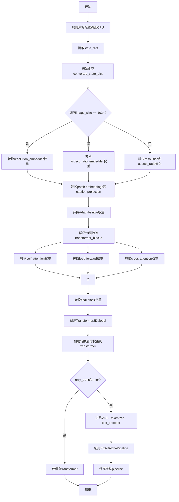
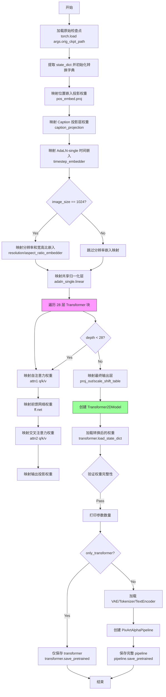
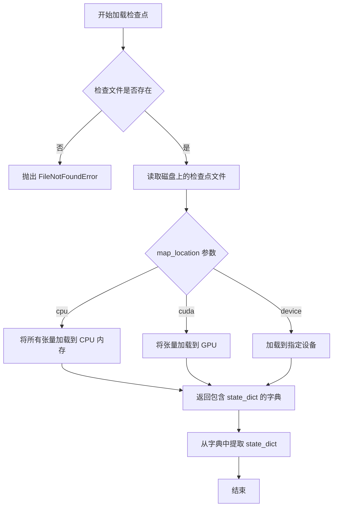
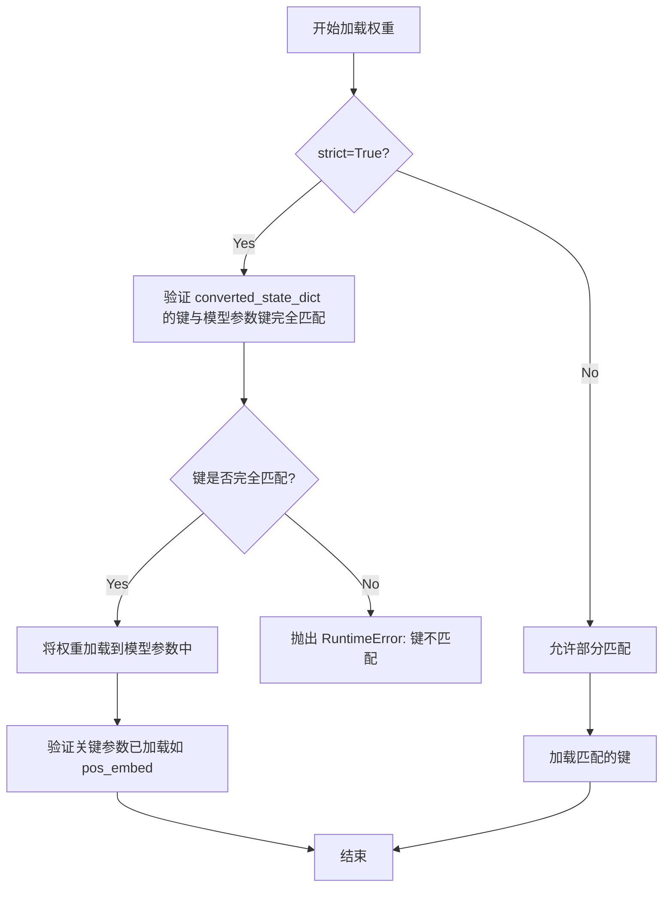
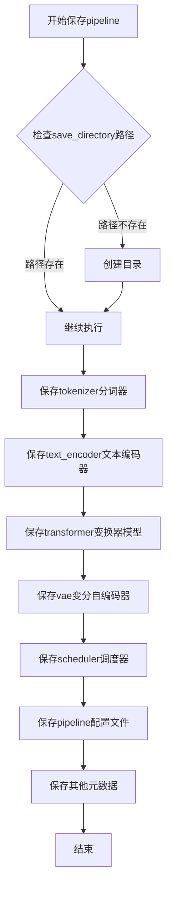

# `diffusers\scripts\convert_pixart_alpha_to_diffusers.py` 详细设计文档

该脚本用于将PixArt-alpha原始检查点模型转换为Diffusers库兼容的格式，通过重新映射和转换模型权重（包括位置嵌入、Caption投影、AdaLN、Transformer块、注意力模块等），并可选择性地保存完整的PixArtAlphaPipeline或仅保存Transformer模型。

## 整体流程



## 类结构

```
脚本文件 (无自定义类)
└── 使用第三方库类:
    ├── Transformer2DModel (diffusers)
    ├── AutoencoderKL (diffusers)
    ├── PixArtAlphaPipeline (diffusers)
    ├── DPMSolverMultistepScheduler (diffusers)
    ├── T5EncoderModel (transformers)
    └── T5Tokenizer (transformers)
```

## 全局变量及字段


### `ckpt_id`
    
模型标识符 'PixArt-alpha/PixArt-alpha'

类型：`str`
    


### `interpolation_scale`
    
不同分辨率的插值缩放系数 {256: 0.5, 512: 1, 1024: 2}

类型：`dict`
    


### `args`
    
命令行参数命名空间

类型：`Namespace`
    


### `args.orig_ckpt_path`
    
原始检查点路径

类型：`str`
    


### `args.image_size`
    
图像尺寸 256/512/1024

类型：`int`
    


### `args.dump_path`
    
输出目录路径

类型：`str`
    


### `args.only_transformer`
    
是否仅保存transformer

类型：`bool`
    


### `all_state_dict`
    
完整的检查点状态字典

类型：`dict`
    


### `state_dict`
    
提取后的模型状态字典

类型：`dict`
    


### `converted_state_dict`
    
转换后的状态字典

类型：`dict`
    


### `depth`
    
Transformer层循环变量

类型：`int`
    


### `transformer`
    
转换后的Transformer模型

类型：`Transformer2DModel`
    


### `scheduler`
    
调度器实例

类型：`DPMSolverMultistepScheduler`
    


### `vae`
    
VAE模型

类型：`AutoencoderKL`
    


### `tokenizer`
    
T5分词器

类型：`T5Tokenizer`
    


### `text_encoder`
    
T5文本编码器

类型：`T5EncoderModel`
    


### `pipeline`
    
完整的PixArt管道

类型：`PixArtAlphaPipeline`
    


### `num_model_params`
    
Transformer参数总数

类型：`int`
    


    

## 全局函数及方法


### `main(args)`

该函数是主转换函数，负责将 PixArt-Alpha 原始检查点（Original Checkpoint）的模型权重映射并转换为 Hugging Face Diffusers 格式的 pipeline，支持仅保存 Transformer 或完整 pipeline。

参数：

- `args`：`argparse.Namespace`，包含以下属性：
  - `orig_ckpt_path`：`str`，原始检查点文件的路径
  - `image_size`：`int`，预训练模型的图像尺寸，支持 256、512、1024
  - `dump_path`：`str`，输出 pipeline 的保存路径
  - `only_transformer`：`bool`，是否仅保存 transformer 模型

返回值：`None`，无返回值，主要通过文件输出产生结果

#### 流程图



#### 带注释源码

```python
def main(args):
    # 加载原始检查点到 CPU 内存
    # 原始检查点包含 'state_dict' 键，存储模型权重
    all_state_dict = torch.load(args.orig_ckpt_path, map_location="cpu")
    state_dict = all_state_dict.pop("state_dict")
    converted_state_dict = {}

    # === Patch embeddings: 位置嵌入投影层 ===
    # 原始模型使用 x_embedder.proj，diffusers 使用 pos_embed.proj
    converted_state_dict["pos_embed.proj.weight"] = state_dict.pop("x_embedder.proj.weight")
    converted_state_dict["pos_embed.proj.bias"] = state_dict.pop("x_embedder.proj.bias")

    # === Caption projection: 文本嵌入投影层 ===
    # 将 y_embedder.y_proj.fc1/fc2 映射到 caption_projection.linear_1/2
    converted_state_dict["caption_projection.linear_1.weight"] = state_dict.pop("y_embedder.y_proj.fc1.weight")
    converted_state_dict["caption_projection.linear_1.bias"] = state_dict.pop("y_embedder.y_proj.fc1.bias")
    converted_state_dict["caption_projection.linear_2.weight"] = state_dict.pop("y_embedder.y_proj.fc2.weight")
    converted_state_dict["caption_projection.linear_2.bias"] = state_dict.pop("y_embedder.y_proj.fc2.bias")

    # === AdaLN-single: 自适应层归一化时间嵌入 ===
    # 时间嵌入 MLP (t_embedder.mlp.0 -> linear_1, t_embedder.mlp.2 -> linear_2)
    converted_state_dict["adaln_single.emb.timestep_embedder.linear_1.weight"] = state_dict.pop(
        "t_embedder.mlp.0.weight"
    )
    converted_state_dict["adaln_single.emb.timestep_embedder.linear_1.bias"] = state_dict.pop("t_embedder.mlp.0.bias")
    converted_state_dict["adaln_single.emb.timestep_embedder.linear_2.weight"] = state_dict.pop(
        "t_embedder.mlp.2.weight"
    )
    converted_state_dict["adaln_single.emb.timestep_embedder.linear_2.bias"] = state_dict.pop("t_embedder.mlp.2.bias")

    # === 分辨率嵌入: 仅 1024 分辨率模型需要 ===
    if args.image_size == 1024:
        # 分辨率嵌入 (csize_embedder)
        converted_state_dict["adaln_single.emb.resolution_embedder.linear_1.weight"] = state_dict.pop(
            "csize_embedder.mlp.0.weight"
        )
        converted_state_dict["adaln_single.emb.resolution_embedder.linear_1.bias"] = state_dict.pop(
            "csize_embedder.mlp.0.bias"
        )
        converted_state_dict["adaln_single.emb.resolution_embedder.linear_2.weight"] = state_dict.pop(
            "csize_embedder.mlp.2.weight"
        )
        converted_state_dict["adaln_single.emb.resolution_embedder.linear_2.bias"] = state_dict.pop(
            "csize_embedder.mlp.2.bias"
        )
        # 宽高比嵌入 (ar_embedder)
        converted_state_dict["adaln_single.emb.aspect_ratio_embedder.linear_1.weight"] = state_dict.pop(
            "ar_embedder.mlp.0.weight"
        )
        converted_state_dict["adaln_single.emb.aspect_ratio_embedder.linear_1.bias"] = state_dict.pop(
            "ar_embedder.mlp.0.bias"
        )
        converted_state_dict["adaln_single.emb.aspect_ratio_embedder.linear_2.weight"] = state_dict.pop(
            "ar_embedder.mlp.2.weight"
        )
        converted_state_dict["adaln_single.emb.aspect_ratio_embedder.linear_2.bias"] = state_dict.pop(
            "ar_embedder.mlp.2.bias"
        )

    # === 共享归一化层 (t_block.1 -> adaln_single.linear) ===
    converted_state_dict["adaln_single.linear.weight"] = state_dict.pop("t_block.1.weight")
    converted_state_dict["adaln_single.linear.bias"] = state_dict.pop("t_block.1.bias")

    # === 遍历 28 层 Transformer 块进行权重映射 ===
    for depth in range(28):
        # Scale-shift 表 (用于 AdaLN)
        converted_state_dict[f"transformer_blocks.{depth}.scale_shift_table"] = state_dict.pop(
            f"blocks.{depth}.scale_shift_table"
        )

        # === 自注意力 (Self-Attention) ===
        # 原始 QKV 权重按 dim=0 切分为 q, k, v 三个部分
        q, k, v = torch.chunk(state_dict.pop(f"blocks.{depth}.attn.qkv.weight"), 3, dim=0)
        q_bias, k_bias, v_bias = torch.chunk(state_dict.pop(f"blocks.{depth}.attn.qkv.bias"), 3, dim=0)
        
        # 映射到 to_q, to_k, to_v
        converted_state_dict[f"transformer_blocks.{depth}.attn1.to_q.weight"] = q
        converted_state_dict[f"transformer_blocks.{depth}.attn1.to_q.bias"] = q_bias
        converted_state_dict[f"transformer_blocks.{depth}.attn1.to_k.weight"] = k
        converted_state_dict[f"transformer_blocks.{depth}.attn1.to_k.bias"] = k_bias
        converted_state_dict[f"transformer_blocks.{depth}.attn1.to_v.weight"] = v
        converted_state_dict[f"transformer_blocks.{depth}.attn1.to_v.bias"] = v_bias
        
        # 输出投影 (proj)
        converted_state_dict[f"transformer_blocks.{depth}.attn1.to_out.0.weight"] = state_dict.pop(
            f"blocks.{depth}.attn.proj.weight"
        )
        converted_state_dict[f"transformer_blocks.{depth}.attn1.to_out.0.bias"] = state_dict.pop(
            f"blocks.{depth}.attn.proj.bias"
        )

        # === 前馈网络 (Feed-Forward Network) ===
        # MLP: fc1 -> proj, fc2 -> net.2
        converted_state_dict[f"transformer_blocks.{depth}.ff.net.0.proj.weight"] = state_dict.pop(
            f"blocks.{depth}.mlp.fc1.weight"
        )
        converted_state_dict[f"transformer_blocks.{depth}.ff.net.0.proj.bias"] = state_dict.pop(
            f"blocks.{depth}.mlp.fc1.bias"
        )
        converted_state_dict[f"transformer_blocks.{depth}.ff.net.2.weight"] = state_dict.pop(
            f"blocks.{depth}.mlp.fc2.weight"
        )
        converted_state_dict[f"transformer_blocks.{depth}.ff.net.2.bias"] = state_dict.pop(
            f"blocks.{depth}.mlp.fc2.bias"
        )

        # === 交叉注意力 (Cross-Attention) ===
        # 文本条件注意力: q_linear, kv_linear 分别存储
        q = state_dict.pop(f"blocks.{depth}.cross_attn.q_linear.weight")
        q_bias = state_dict.pop(f"blocks.{depth}.cross_attn.q_linear.bias")
        k, v = torch.chunk(state_dict.pop(f"blocks.{depth}.cross_attn.kv_linear.weight"), 2, dim=0)
        k_bias, v_bias = torch.chunk(state_dict.pop(f"blocks.{depth}.cross_attn.kv_linear.bias"), 2, dim=0)

        # 映射到 attn2 (to_q, to_k, to_v)
        converted_state_dict[f"transformer_blocks.{depth}.attn2.to_q.weight"] = q
        converted_state_dict[f"transformer_blocks.{depth}.attn2.to_q.bias"] = q_bias
        converted_state_dict[f"transformer_blocks.{depth}.attn2.to_k.weight"] = k
        converted_state_dict[f"transformer_blocks.{depth}.attn2.to_k.bias"] = k_bias
        converted_state_dict[f"transformer_blocks.{depth}.attn2.to_v.weight"] = v
        converted_state_dict[f"transformer_blocks.{depth}.attn2.to_v.bias"] = v_bias

        # 输出投影
        converted_state_dict[f"transformer_blocks.{depth}.attn2.to_out.0.weight"] = state_dict.pop(
            f"blocks.{depth}.cross_attn.proj.weight"
        )
        converted_state_dict[f"transformer_blocks.{depth}.attn2.to_out.0.bias"] = state_dict.pop(
            f"blocks.{depth}.cross_attn.proj.bias"
        )

    # === 最终输出层 (Final Layer) ===
    converted_state_dict["proj_out.weight"] = state_dict.pop("final_layer.linear.weight")
    converted_state_dict["proj_out.bias"] = state_dict.pop("final_layer.linear.bias")
    converted_state_dict["scale_shift_table"] = state_dict.pop("final_layer.scale_shift_table")

    # === 创建 Diffusers Transformer2DModel ===
    # DiT XL/2 配置: 28层, 16头, 72维每头, 1152交叉注意力维度
    transformer = Transformer2DModel(
        sample_size=args.image_size // 8,  # VAE 下采样 8x
        num_layers=28,
        attention_head_dim=72,
        in_channels=4,   # VAE latent 通道数
        out_channels=8,  # 输出通道数
        patch_size=2,
        attention_bias=True,
        num_attention_heads=16,
        cross_attention_dim=1152,
        activation_fn="gelu-approximate",
        num_embeds_ada_norm=1000,
        norm_type="ada_norm_single",
        norm_elementwise_affine=False,
        norm_eps=1e-6,
        caption_channels=4096,  # T5-XXL 文本编码器维度
    )
    
    # 加载转换后的权重，严格模式确保所有键都匹配
    transformer.load_state_dict(converted_state_dict, strict=True)

    # === 验证位置嵌入存在 ===
    assert transformer.pos_embed.pos_embed is not None
    
    # 移除不需要的键 (位置嵌入在 Diffusers 中自动处理)
    state_dict.pop("pos_embed")
    state_dict.pop("y_embedder.y_embedding")
    
    # 验证所有权重都已转换
    assert len(state_dict) == 0, f"State dict is not empty, {state_dict.keys()}"

    # 打印参数统计
    num_model_params = sum(p.numel() for p in transformer.parameters())
    print(f"Total number of transformer parameters: {num_model_params}")

    # === 根据参数保存模型 ===
    if args.only_transformer:
        # 仅保存 Transformer 模型
        transformer.save_pretrained(os.path.join(args.dump_path, "transformer"))
    else:
        # 加载额外组件并保存完整 pipeline
        scheduler = DPMSolverMultistepScheduler()
        
        # 从预训练模型加载 VAE
        vae = AutoencoderKL.from_pretrained(ckpt_id, subfolder="sd-vae-ft-ema")
        
        # 加载 T5 文本编码器 (用于文本条件)
        tokenizer = T5Tokenizer.from_pretrained(ckpt_id, subfolder="t5-v1_1-xxl")
        text_encoder = T5EncoderModel.from_pretrained(ckpt_id, subfolder="t5-v1_1-xxl")

        # 创建 PixArtAlphaPipeline
        pipeline = PixArtAlphaPipeline(
            tokenizer=tokenizer, 
            text_encoder=text_encoder, 
            transformer=transformer, 
            vae=vae, 
            scheduler=scheduler
        )

        # 保存完整 pipeline
        pipeline.save_pretrained(args.dump_path)
```


### `torch.load`

加载 PyTorch 检查点文件（.pth 或 .pt 格式），将预训练的模型权重从磁盘加载到内存中，并根据 map_location 参数将张量映射到指定的计算设备。

参数：

- `f`：str，要加载的文件路径（这里通过 `args.orig_ckpt_path` 传入）
- `map_location`：str，指定加载后张量映射到的设备（这里固定为 `"cpu"`）

返回值：dict，包含检查点文件中存储的完整状态字典，通常包含模型权重、优化器状态等信息。

#### 流程图



#### 带注释源码

```python
# 加载预训练的检查点文件
# orig_ckpt_path: 原始检查点文件的路径
# map_location="cpu": 将所有张量从原始设备映射到 CPU 内存
# 这在模型权重需要跨设备迁移（如从 GPU 转到 CPU）时特别有用
all_state_dict = torch.load(args.orig_ckpt_path, map_location="cpu")

# 从加载的完整状态字典中提取模型权重
# 检查点文件通常包含 'state_dict' 键，存储实际的模型参数
state_dict = all_state_dict.pop("state_dict")

# 接下来会将原始检查点中的权重键名进行转换
# 以适配 Diffusers 库的 Transformer2DModel 架构
converted_state_dict = {}

# 示例：将 'x_embedder.proj.weight' 转换为 'pos_embed.proj.weight'
converted_state_dict["pos_embed.proj.weight"] = state_dict.pop("x_embedder.proj.weight")
# ... (更多键名转换)
```


### `torch.chunk`

该函数在代码中用于将 PixArt-alpha 预训练检查点中耦合的权重矩阵（如 QKV 权重、KV 权重）按维度 0 拆分为独立的 Query、Key、Value 权重矩阵，以适配目标模型（DiT）的模块化结构。

参数：

-  `input`：`Tensor`，从原始 state_dict 中提取的权重或偏置张量（如 `state_dict.pop(f"blocks.{depth}.attn.qkv.weight")`）。
-  `chunks`：`int`，要分割的块数量。在代码中主要用于分割 QKV（值为 3）和 KV（值为 2）。
-  `dim`：`int`，执行分割的维度索引。代码中统一使用 `0`（通常对应输出通道维度）。

返回值：`Tuple[Tensor, ...]，返回分割后的张量元组（例如分离出的 q, k, v 权重）。

#### 流程图

```mermaid
graph LR
    A[输入张量: 复合权重矩阵<br/>(e.g., qkv.weight)] --> B[torch.chunk 执行分割]
    B -->|Dim=0, Chunks=3| C[Query 权重]
    B -->|Dim=0, Chunks=3| D[Key 权重]
    B -->|Dim=0, Chunks=3| E[Value 权重]
    C --> F[转换后的 State Dict]
    D --> F
    E --> F
```

#### 带注释源码

以下是代码中第一次调用 `torch.chunk` 的示例，用于将自注意力机制的 QKV 权重分离：

```python
# 从原始状态字典中提取当前层(depth)的QKV联合权重，形状通常为 [3*head_dim, dim]
qkv_weight = state_dict.pop(f"blocks.{depth}.attn.qkv.weight")

# 使用 torch.chunk 在第0维(输出维度)将联合权重均匀切分为3份
# 返回的 q, k, v 将作为独立的权重赋值给目标模型的不同注意力头
q, k, v = torch.chunk(qkv_weight, 3, dim=0)
```


### `Transformer2DModel.load_state_dict`

将预训练的权重字典加载到 Transformer2DModel 模型实例中，支持严格的键匹配模式，确保模型权重完整且正确地从 PixArt-alpha 格式转换为 diffusers 格式。

参数：

- `converted_state_dict`：`Dict[str, torch.Tensor]`，包含从原始 PixArt-alpha 检查点转换后的模型权重，键名为转换后的新键名（如 `transformer_blocks.0.attn1.to_q.weight`），值为对应的张量参数
- `strict`：`bool`，设置为 `True` 时要求加载的 state_dict 键与模型当前参数键完全匹配，任何不匹配或缺失的键都会抛出错误；若为 `False` 则允许部分匹配

返回值：`None`，PyTorch 的 `load_state_dict` 方法返回 `None`，但会原地修改模型的参数

#### 流程图



#### 带注释源码

```python
# 在主函数 main(args) 中调用 load_state_dict 的上下文
# 1. 首先创建 Transformer2DModel 模型实例（使用指定参数）
transformer = Transformer2DModel(
    sample_size=args.image_size // 8,      # 图像尺寸除以8（因为有下采样）
    num_layers=28,                         # 28层Transformer块
    attention_head_dim=72,                 # 注意力头维度
    in_channels=4,                         # 输入通道数（VAE输出）
    out_channels=8,                       # 输出通道数
    patch_size=2,                          # 分块大小
    attention_bias=True,                   # 是否使用注意力偏置
    num_attention_heads=16,                # 注意力头数量
    cross_attention_dim=1152,              # 跨注意力维度
    activation_fn="gelu-approximate",      # 激活函数
    num_embeds_ada_norm=1000,              # AdaNorm嵌入数量
    norm_type="ada_norm_single",           # 归一化类型
    norm_elementwise_affine=False,         # 是否使用逐元素仿射
    norm_eps=1e-6,                         # 归一化epsilon
    caption_channels=4096,                 # caption通道数
)

# 2. 加载转换后的权重字典到模型
# converted_state_dict: 包含所有转换后的权重键值对
# strict=True: 确保权重键完全匹配，不允许缺失或多余键
transformer.load_state_dict(converted_state_dict, strict=True)

# 3. 加载后验证关键参数存在
assert transformer.pos_embed.pos_embed is not None  # 验证位置编码已正确加载

# 4. 清理不再需要的state_dict项
state_dict.pop("pos_embed")
state_dict.pop("y_embedder.y_embedding")

# 5. 验证所有权重都已成功转换和加载
assert len(state_dict) == 0, f"State dict is not empty, {state_dict.keys()}"
```


### `Transformer2DModel.save_pretrained`

将Transformer模型保存到指定目录，用于后续加载或部署。

参数：

- `save_directory`：`str`，目标目录路径，用于保存模型权重和配置文件

返回值：`None`，该方法不返回值，直接将模型写入磁盘

#### 流程图

```mermaid
flowchart TD
    A[开始] --> B{args.only_transformer == True?}
    B -->|Yes| C[构建transformer保存路径<br/>os.path.join(args.dump_path, "transformer")]
    C --> D[调用transformer.save_pretrained<br/>保存模型到指定目录]
    D --> E[结束]
    B -->|No| F[构建完整Pipeline<br/>包含VAE, Text Encoder, Scheduler]
    F --> G[调用pipeline.save_pretrained<br/>保存完整推理 pipeline]
    G --> E
```

#### 带注释源码

```python
# 在 main 函数中，根据 only_transformer 标志决定保存内容
if args.only_transformer:
    # 仅保存 Transformer2DModel 模型
    # save_directory: str类型，拼接输出目录与"transformer"子目录
    transformer.save_pretrained(os.path.join(args.dump_path, "transformer"))
else:
    # 保存完整的 PixArtAlphaPipeline
    # 包含 tokenizer, text_encoder, transformer, vae, scheduler
    pipeline = PixArtAlphaPipeline(
        tokenizer=tokenizer, text_encoder=text_encoder, transformer=transformer, vae=vae, scheduler=scheduler
    )
    pipeline.save_pretrained(args.dump_path)
```


### `PixArtAlphaPipeline.save_pretrained()`

该方法是diffusers库中`DiffusionPipeline`基类提供的标准方法，用于将完整的PixArtAlphaPipeline（包括tokenizer、text_encoder、transformer、vae、scheduler等所有组件）保存到指定目录，以便后续加载推理。

参数：

- `save_directory`：`str`，要保存pipeline的目标目录路径（即`args.dump_path`）

返回值：无返回值（`None`），方法执行完成后会在指定目录生成包含模型权重、配置文件和分词器文件的多个子目录和文件。

#### 流程图



#### 带注释源码

```python
# 在主函数main中调用pipeline.save_pretrained的代码片段
# 当args.only_transformer为False时执行完整pipeline的保存

# 创建调度器实例
scheduler = DPMSolverMultistepScheduler()

# 从预训练模型加载VAE变分自编码器
vae = AutoencoderKL.from_pretrained(ckpt_id, subfolder="sd-vae-ft-ema")

# 加载T5分词器和文本编码器
tokenizer = T5Tokenizer.from_pretrained(ckpt_id, subfolder="t5-v1_1-xxl")
text_encoder = T5EncoderModel.from_pretrained(ckpt_id, subfolder="t5-v1_1-xxl")

# 构建完整的PixArt Alpha推理pipeline
pipeline = PixArtAlphaPipeline(
    tokenizer=tokenizer,           # T5分词器
    text_encoder=text_encoder,      # T5文本编码器
    transformer=transformer,        # DiT变换器（已转换权重）
    vae=vae,                        # VAE编码器/解码器
    scheduler=scheduler             # DPM多步调度器
)

# 保存完整pipeline到指定目录
# 内部会依次保存：tokenizer、text_encoder、transformer、vae、scheduler
# 以及pipeline的config.json配置文件
pipeline.save_pretrained(args.dump_path)
```

## 关键组件


### 权重映射与转换 (Weight Mapping & Conversion)

该组件负责将原始 PixArt-alpha 检查点的权重键名映射为 Hugging Face Diffusers 格式的键名，涵盖位置嵌入、caption 投影、AdaLN-single LN、Transformer 块、注意力机制和前馈网络等所有核心权重，确保转换后的模型结构与 `Transformer2DModel` 兼容。

### 张量分割 (Tensor Chunking)

使用 `torch.chunk` 函数将原始模型中联合存储的 QKV 权重和偏置分割为独立的 query、key、value 分量，这是处理注意力机制权重转换的关键步骤，使得自注意力和交叉注意力的权重能正确映射到目标模型结构。

### 条件嵌入处理 (Conditional Embedding Handling)

针对 1024 分辨率模型的特殊处理组件，负责转换 resolution_embedder（分辨率嵌入）和 aspect_ratio_embedder（宽高比嵌入）的权重，这些嵌入层用于根据输入图像尺寸动态调整模型行为。

### 自注意力权重映射 (Self-Attention Weight Mapping)

将原始模型中 `blocks.{depth}.attn` 下的权重映射到 Diffusers 格式的 `transformer_blocks.{depth}.attn1`，包括 to_q、to_k、to_v 和 to_out 层，实现自注意力机制的完整权重转换。

### 交叉注意力权重映射 (Cross-Attention Weight Mapping)

处理文本到图像交叉注意力的权重转换，将原始的 q_linear、kv_linear 和 proj 层映射到目标模型的 `transformer_blocks.{depth}.attn2` 结构，支持文本条件的注入。

### 前馈网络权重映射 (Feed-Forward Network Weight Mapping)

将原始 Transformer 块的 MLP（多层感知机）权重映射到目标模型的 `transformer_blocks.{depth}.ff.net` 结构，包括 fc1 和 fc2 层的转换。

### Transformer 模型初始化 (Transformer Model Initialization)

使用 `Transformer2DModel` 构建目标模型，配置关键参数包括：28 层 Transformer 块、72 维注意力头、16 个注意力头、4 输入通道、8 输出通道、2x2 patch 大小、1152 维交叉注意力维度、gelu-approximate 激活函数、ada_norm_single 归一化类型和 4096 caption 通道。

### VAE 和文本编码器加载 (VAE & Text Encoder Loading)

从预训练模型 ID 加载变分自编码器（AutoencoderKL）、T5 文本编码器（T5EncoderModel）和对应的分词器（T5Tokenizer），这些组件是完整 PixArtAlphaPipeline 的必要组成部分。

### PixArtAlphaPipeline 组装 (Pipeline Assembly)

将转换后的 transformer 与加载的 VAE、tokenizer、text_encoder 和 scheduler 组装为完整的 `PixArtAlphaPipeline` 实例，并支持保存到指定路径。

### 命令行参数解析 (CLI Argument Parsing)

使用 argparse 定义和管理运行参数，包括原始检查点路径、图像尺寸（256/512/1024）、输出路径和是否仅保存 transformer 的选项。


## 问题及建议


### 已知问题

- **硬编码的模型路径**：`ckpt_id = "PixArt-alpha/PixArt-alpha"` 硬编码在文件顶部，应作为命令行参数传入以提高灵活性
- **未使用的变量**：`interpolation_scale` 字典定义后完全未使用，造成代码冗余
- **硬编码的层数**：transformer 深度 28 硬编码在代码中（`for depth in range(28)`），应从原始 checkpoint 动态获取或作为参数
- **不正确的布尔参数解析**：parser 的 `--only_transformer` 使用 `type=bool`，这不会按预期工作（任何非空字符串都会被当作 True），应改为 `action='store_true'`
- **缺少错误的 key 存在性检查**：大量 `state_dict.pop()` 调用没有提供默认值或检查 key 是否存在，遇到不匹配的 checkpoint 会直接抛出 KeyError
- **1024 分支的逻辑缺陷**：resolution_embedder 和 aspect_ratio_embedder 的转换逻辑仅在 `image_size == 1024` 时执行，但实际可能其他尺寸模型也需要这些组件
- **内存效率问题**：一次性将整个 checkpoint 加载到内存（`torch.load(args.orig_ckpt_path, map_location="cpu")`），对于大型模型可能导致内存溢出
- **缺乏模块化设计**：所有转换逻辑堆积在 main 函数中，违反单一职责原则，难以测试和维护

### 优化建议

- 将 checkpoint 路径、模型 ID 等硬编码值提取为命令行参数
- 将重复的权重映射逻辑重构为通用的辅助函数（如 `convert_attention_weights`、`convert_mlp_weights` 等）
- 为所有 `state_dict.pop()` 调用添加 `.get()` 方法或 try-except 块处理缺失的 key
- 使用 `argparse` 的 `action='store_true'` 替代 `type=bool` 处理布尔标志
- 添加类型注解提高代码可读性和 IDE 支持
- 考虑使用 `mmap` 或流式加载处理超大型 checkpoint 文件
- 将转换逻辑拆分为独立的转换器类或函数，提高可测试性
- 添加完整的单元测试验证权重转换的正确性
- 在转换完成后输出未处理的 keys 警告，而非仅在非空时断言

## 其它


### 设计目标与约束

将 PixArt-alpha 原始检查点转换为 Hugging Face Diffusers 格式的 PixArtAlphaPipeline，支持 256、512、1024 三种图像尺寸的模型转换，可选择仅转换 transformer 或完整 pipeline。

### 错误处理与异常设计

使用 `assert` 语句验证关键张量存在性（如 `transformer.pos_embed.pos_embed is not None`），检查转换后 state_dict 是否完全清空（`len(state_dict) == 0`），通过 `strict=True` 严格加载状态字典以捕获键不匹配问题。

### 数据流与状态机

主流程：加载原始检查点 → 提取 state_dict → 遍历各层进行键名映射（patch embeddings、caption projection、AdaLN、transformer blocks、final block）→ 创建 Transformer2DModel → 加载转换后权重 → 根据参数选择保存 transformer 或完整 pipeline。

### 外部依赖与接口契约

依赖 `diffusers` 库的 `AutoencoderKL`、`DPMSolverMultistepScheduler`、`PixArtAlphaPipeline`、`Transformer2DModel`；依赖 `transformers` 库的 `T5EncoderModel`、`T5Tokenizer`；依赖 `torch` 进行张量操作。

### 性能考虑

转换过程在 CPU 上进行，使用 `torch.load(..., map_location="cpu")` 避免内存溢出；大模型转换需考虑内存占用，28 层 transformer 包含大量张量复制操作。

### 安全性考虑

解析命令行参数时未对路径进行安全验证，需确保 `orig_ckpt_path` 和 `dump_path` 路径合法，避免路径遍历攻击。

### 配置管理

通过 `argparse` 管理配置，支持 `--orig_ckpt_path`、`--image_size`、`--dump_path`、`--only_transformer` 四个参数；`interpolation_scale` 字典定义不同分辨率的缩放因子。

### 测试策略

需验证三种图像尺寸的转换正确性，验证 `only_transformer` 模式输出，验证转换后 pipeline 能正常进行推理，验证 state_dict 完全转换无残留键。

### 部署注意事项

需安装 `torch`、`diffusers`、`transformers` 及相关依赖；需要足够的磁盘空间存储转换后的模型（约数 GB）；建议在内存充足的环境运行以避免 OOM。

### 版本兼容性

代码使用 `diffusers` 库的特定类（PixArtAlphaPipeline、Transformer2DModel），需确保版本兼容；`activation_fn="gelu-approximate"` 指定特定激活函数版本。

### 资源管理

模型参数统计通过 `sum(p.numel() for p in transformer.parameters())` 计算并打印；转换后的模型通过 `save_pretrained` 保存到指定目录。

### 监控与日志

使用 `print` 输出转换后的模型参数量；未使用结构化日志记录，转换失败时信息有限。

    