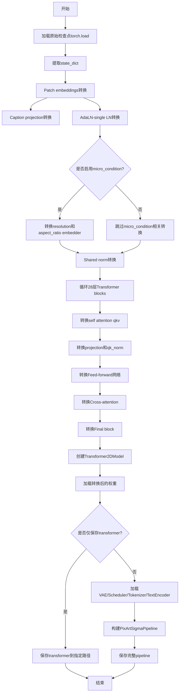
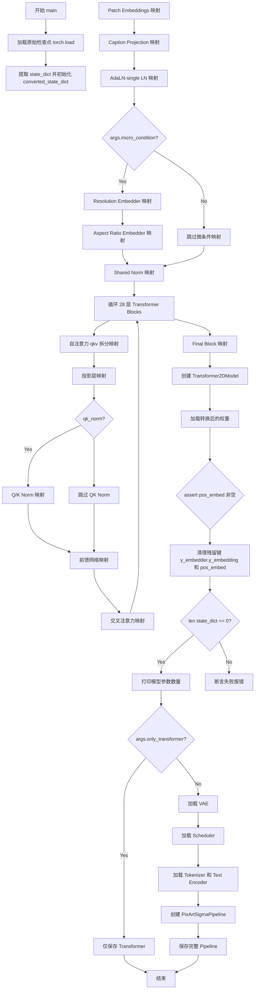
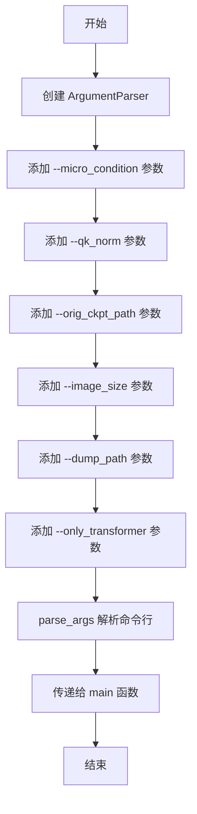
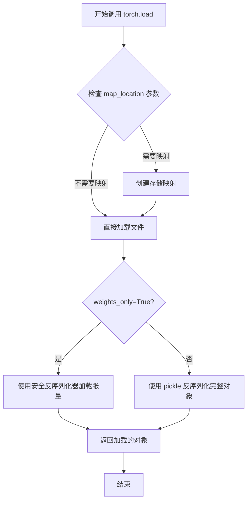
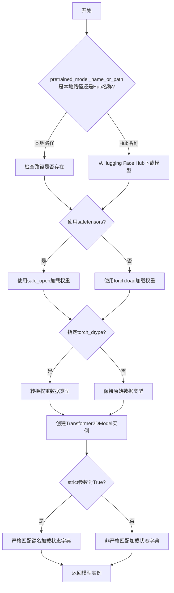
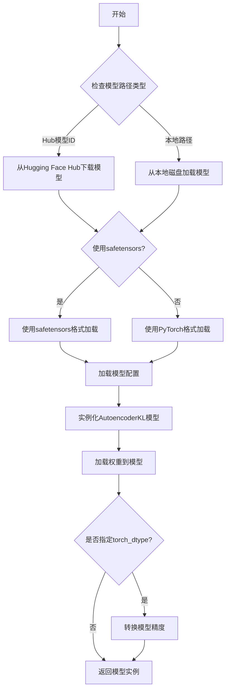
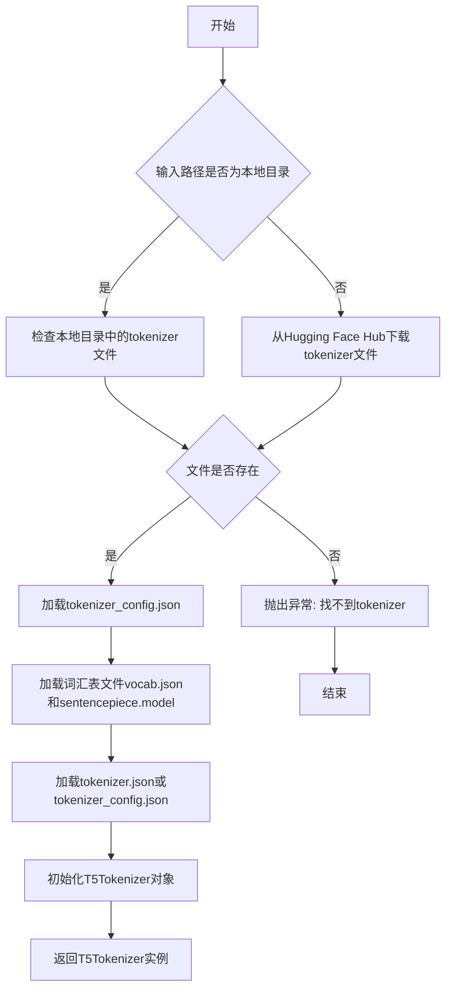
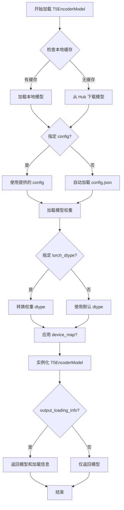
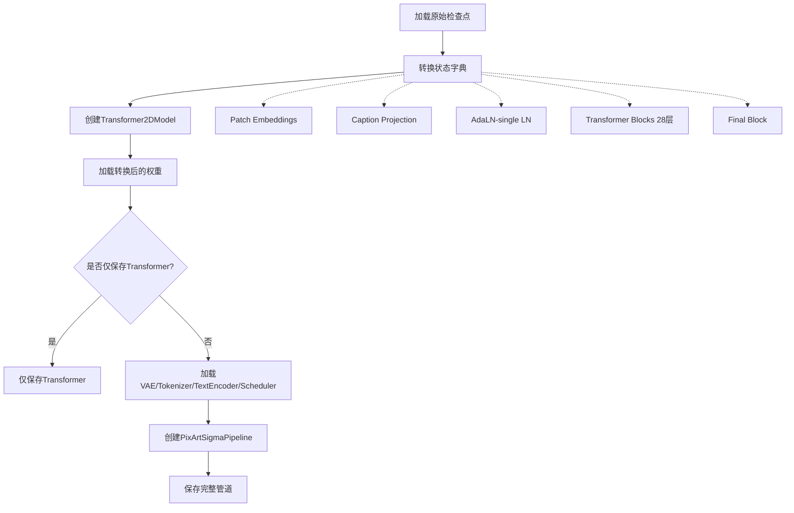

# `diffusers\scripts\convert_pixart_sigma_to_diffusers.py` 详细设计文档

该脚本用于将PixArt-Sigma/PixArt-alpha的预训练检查点模型转换为HuggingFace Diffusers格式，支持多种图像尺寸(256/512/1024/2048)，并处理Transformer、VAE、T5文本编码器等组件的权重映射和pipeline构建。

## 整体流程



## 类结构

```
无类定义 (脚本级程序)
仅包含main()函数和全局常量
```

## 全局变量及字段


### `ckpt_id`
    
HuggingFace Hub上的PixArt模型仓库标识符，用于加载VAE、tokenizer和text_encoder等预训练组件

类型：`str`
    


### `interpolation_scale`
    
分辨率到插值缩放因子的映射字典，用于不同图像尺寸下的位置编码插值

类型：`Dict[int, float]`
    


    

## 全局函数及方法


### `main`

该函数是模型检查点转换的核心入口，负责将 PixArt-Sigma 原始检查点（来自 `x_embedder`、`y_embedder`、`t_embedder`、`blocks` 等结构）转换为 Diffusers 格式的 `PixArtSigmaPipeline`，包括 Transformer、VAE、Text Encoder 和 Scheduler 的完整权重映射与保存。

参数：

- `args`：`argparse.Namespace`，命令行参数对象，包含以下属性：
  - `micro_condition`：`bool`，是否在 PixArtMS 结构训练中使用微条件（分辨率和宽高比嵌入）
  - `qk_norm`：`bool`，是否在训练中使用查询/键归一化
  - `orig_ckpt_path`：`str`，原始检查点文件的路径
  - `image_size`：`int`，预训练模型的图像尺寸，可选值：256、512、1024、2048
  - `dump_path`：`str`，输出管道的保存路径
  - `only_transformer`：`bool`，是否仅保存 Transformer 模型（若为 True 则跳过 VAE、Text Encoder 和 Scheduler 的加载）

返回值：`None`，该函数无返回值，通过副作用完成模型转换与保存

#### 流程图



#### 带注释源码

```python
def main(args):
    """
    将 PixArt-Sigma 原始检查点转换为 Diffusers 格式的 PixArtSigmaPipeline
    
    参数:
        args: 包含以下属性的 argparse.Namespace 对象:
            - micro_condition: bool, 是否使用微条件
            - qk_norm: bool, 是否使用 QK 归一化
            - orig_ckpt_path: str, 原始检查点路径
            - image_size: int, 图像尺寸
            - dump_path: str, 输出路径
            - only_transformer: bool, 是否仅保存 Transformer
    """
    # 加载原始检查点文件（包含完整的模型状态）
    all_state_dict = torch.load(args.orig_ckpt_path)
    # 从检查点中提取 state_dict（标准 PyTorch Lightning 格式）
    state_dict = all_state_dict.pop("state_dict")
    # 初始化转换后的状态字典，用于存储 Diffusers 格式的权重
    converted_state_dict = {}

    # ===== 1. Patch Embeddings 转换 =====
    # 将原始的 x_embedder.proj 映射到 pos_embed.proj
    converted_state_dict["pos_embed.proj.weight"] = state_dict.pop("x_embedder.proj.weight")
    converted_state_dict["pos_embed.proj.bias"] = state_dict.pop("x_embedder.proj.bias")

    # ===== 2. Caption Projection 转换 =====
    # 将 y_embedder.y_proj.fc1/fc2 映射到 caption_projection.linear_1/linear_2
    converted_state_dict["caption_projection.linear_1.weight"] = state_dict.pop("y_embedder.y_proj.fc1.weight")
    converted_state_dict["caption_projection.linear_1.bias"] = state_dict.pop("y_embedder.y_proj.fc1.bias")
    converted_state_dict["caption_projection.linear_2.weight"] = state_dict.pop("y_embedder.y_proj.fc2.weight")
    converted_state_dict["caption_projection.linear_2.bias"] = state_dict.pop("y_embedder.y_proj.fc2.bias")

    # ===== 3. AdaLN-single LN 转换 =====
    # 时间嵌入器的 MLP 层映射（t_embedder.mlp.0 -> linear_1, t_embedder.mlp.2 -> linear_2）
    converted_state_dict["adaln_single.emb.timestep_embedder.linear_1.weight"] = state_dict.pop(
        "t_embedder.mlp.0.weight"
    )
    converted_state_dict["adaln_single.emb.timestep_embedder.linear_1.bias"] = state_dict.pop("t_embedder.mlp.0.bias")
    converted_state_dict["adaln_single.emb.timestep_embedder.linear_2.weight"] = state_dict.pop(
        "t_embedder.mlp.2.weight"
    )
    converted_state_dict["adaln_single.emb.timestep_embedder.linear_2.bias"] = state_dict.pop("t_embedder.mlp.2.bias")

    # ===== 4. 微条件转换（可选）=====
    if args.micro_condition:
        # 分辨率嵌入器转换（csize_embedder.mlp -> resolution_embedder.linear）
        converted_state_dict["adaln_single.emb.resolution_embedder.linear_1.weight"] = state_dict.pop(
            "csize_embedder.mlp.0.weight"
        )
        converted_state_dict["adaln_single.emb.resolution_embedder.linear_1.bias"] = state_dict.pop(
            "csize_embedder.mlp.0.bias"
        )
        converted_state_dict["adaln_single.emb.resolution_embedder.linear_2.weight"] = state_dict.pop(
            "csize_embedder.mlp.2.weight"
        )
        converted_state_dict["adaln_single.emb.resolution_embedder.linear_2.bias"] = state_dict.pop(
            "csize_embedder.mlp.2.bias"
        )
        # 宽高比嵌入器转换（ar_embedder.mlp -> aspect_ratio_embedder.linear）
        converted_state_dict["adaln_single.emb.aspect_ratio_embedder.linear_1.weight"] = state_dict.pop(
            "ar_embedder.mlp.0.weight"
        )
        converted_state_dict["adaln_single.emb.aspect_ratio_embedder.linear_1.bias"] = state_dict.pop(
            "ar_embedder.mlp.0.bias"
        )
        converted_state_dict["adaln_single.emb.aspect_ratio_embedder.linear_2.weight"] = state_dict.pop(
            "ar_embedder.mlp.2.weight"
        )
        converted_state_dict["adaln_single.emb.aspect_ratio_embedder.linear_2.bias"] = state_dict.pop(
            "ar_embedder.mlp.2.bias"
        )
    
    # ===== 5. Shared Norm 转换 =====
    # 共享归一化层的线性变换（t_block.1 -> adaln_single.linear）
    converted_state_dict["adaln_single.linear.weight"] = state_dict.pop("t_block.1.weight")
    converted_state_dict["adaln_single.linear.bias"] = state_dict.pop("t_block.1.bias")

    # ===== 6. 循环转换 28 层 Transformer Blocks =====
    for depth in range(28):
        # 6.1 缩放偏移表（Scale-Shift Table）
        converted_state_dict[f"transformer_blocks.{depth}.scale_shift_table"] = state_dict.pop(
            f"blocks.{depth}.scale_shift_table"
        )
        
        # 6.2 自注意力（Self-Attention）转换
        # 原始 QKV 权重按维度 chunks 成三份
        q, k, v = torch.chunk(state_dict.pop(f"blocks.{depth}.attn.qkv.weight"), 3, dim=0)
        q_bias, k_bias, v_bias = torch.chunk(state_dict.pop(f"blocks.{depth}.attn.qkv.bias"), 3, dim=0)
        # 映射到 Diffusers 格式的 to_q/to_k/to_v
        converted_state_dict[f"transformer_blocks.{depth}.attn1.to_q.weight"] = q
        converted_state_dict[f"transformer_blocks.{depth}.attn1.to_q.bias"] = q_bias
        converted_state_dict[f"transformer_blocks.{depth}.attn1.to_k.weight"] = k
        converted_state_dict[f"transformer_blocks.{depth}.attn1.to_k.bias"] = k_bias
        converted_state_dict[f"transformer_blocks.{depth}.attn1.to_v.weight"] = v
        converted_state_dict[f"transformer_blocks.{depth}.attn1.to_v.bias"] = v_bias
        # 投影层（Projection）
        converted_state_dict[f"transformer_blocks.{depth}.attn1.to_out.0.weight"] = state_dict.pop(
            f"blocks.{depth}.attn.proj.weight"
        )
        converted_state_dict[f"transformer_blocks.{depth}.attn1.to_out.0.bias"] = state_dict.pop(
            f"blocks.{depth}.attn.proj.bias"
        )
        
        # 6.3 QK 归一化（可选）
        if args.qk_norm:
            converted_state_dict[f"transformer_blocks.{depth}.attn1.q_norm.weight"] = state_dict.pop(
                f"blocks.{depth}.attn.q_norm.weight"
            )
            converted_state_dict[f"transformer_blocks.{depth}.attn1.q_norm.bias"] = state_dict.pop(
                f"blocks.{depth}.attn.q_norm.bias"
            )
            converted_state_dict[f"transformer_blocks.{depth}.attn1.k_norm.weight"] = state_dict.pop(
                f"blocks.{depth}.attn.k_norm.weight"
            )
            converted_state_dict[f"transformer_blocks.{depth}.attn1.k_norm.bias"] = state_dict.pop(
                f"blocks.{depth}.attn.k_norm.bias"
            )

        # 6.4 前馈网络（Feed-Forward Network）转换
        # MLP fc1 -> ff.net.0.proj, MLP fc2 -> ff.net.2
        converted_state_dict[f"transformer_blocks.{depth}.ff.net.0.proj.weight"] = state_dict.pop(
            f"blocks.{depth}.mlp.fc1.weight"
        )
        converted_state_dict[f"transformer_blocks.{depth}.ff.net.0.proj.bias"] = state_dict.pop(
            f"blocks.{depth}.mlp.fc1.bias"
        )
        converted_state_dict[f"transformer_blocks.{depth}.ff.net.2.weight"] = state_dict.pop(
            f"blocks.{depth}.mlp.fc2.weight"
        )
        converted_state_dict[f"transformer_blocks.{depth}.ff.net.2.bias"] = state_dict.pop(
            f"blocks.{depth}.mlp.fc2.bias"
        )

        # 6.5 交叉注意力（Cross-Attention）转换
        # 原始交叉注意力有独立的 q_linear 和 kv_linear
        q = state_dict.pop(f"blocks.{depth}.cross_attn.q_linear.weight")
        q_bias = state_dict.pop(f"blocks.{depth}.cross_attn.q_linear.bias")
        k, v = torch.chunk(state_dict.pop(f"blocks.{depth}.cross_attn.kv_linear.weight"), 2, dim=0)
        k_bias, v_bias = torch.chunk(state_dict.pop(f"blocks.{depth}.cross_attn.kv_linear.bias"), 2, dim=0)

        converted_state_dict[f"transformer_blocks.{depth}.attn2.to_q.weight"] = q
        converted_state_dict[f"transformer_blocks.{depth}.attn2.to_q.bias"] = q_bias
        converted_state_dict[f"transformer_blocks.{depth}.attn2.to_k.weight"] = k
        converted_state_dict[f"transformer_blocks.{depth}.attn2.to_k.bias"] = k_bias
        converted_state_dict[f"transformer_blocks.{depth}.attn2.to_v.weight"] = v
        converted_state_dict[f"transformer_blocks.{depth}.attn2.to_v.bias"] = v_bias

        converted_state_dict[f"transformer_blocks.{depth}.attn2.to_out.0.weight"] = state_dict.pop(
            f"blocks.{depth}.cross_attn.proj.weight"
        )
        converted_state_dict[f"transformer_blocks.{depth}.attn2.to_out.0.bias"] = state_dict.pop(
            f"blocks.{depth}.cross_attn.proj.bias"
        )

    # ===== 7. 最终层（Final Block）转换 =====
    converted_state_dict["proj_out.weight"] = state_dict.pop("final_layer.linear.weight")
    converted_state_dict["proj_out.bias"] = state_dict.pop("final_layer.linear.bias")
    converted_state_dict["scale_shift_table"] = state_dict.pop("final_layer.scale_shift_table")

    # ===== 8. 创建 Transformer2DModel 并加载权重 =====
    # 根据图像尺寸选择插值缩放因子
    transformer = Transformer2DModel(
        sample_size=args.image_size // 8,  # 输入被 VAE 编码为 latent，8x 下采样
        num_layers=28,                      # 28 层 Transformer
        attention_head_dim=72,              # 注意力头维度
        in_channels=4,                      # VAE latent 通道数
        out_channels=8,                     # 输出通道数（预测噪声和协方差）
        patch_size=2,                       # 图像分块大小
        attention_bias=True,                # 是否使用注意力偏置
        num_attention_heads=16,             # 注意力头数量（16 * 72 = 1152 维度）
        cross_attention_dim=1152,           # 跨注意力维度（T5 特征维度）
        activation_fn="gelu-approximate",   # 激活函数
        num_embeds_ada_norm=1000,           # AdaNorm 嵌入数量
        norm_type="ada_norm_single",        # 归一化类型
        norm_elementwise_affine=False,      # 是否使用元素级仿射
        norm_eps=1e-6,                      # 归一化 epsilon
        caption_channels=4096,              # 标题/文本特征通道数
        interpolation_scale=interpolation_scale[args.image_size],  # 插值缩放
        use_additional_conditions=args.micro_condition,  # 是否使用额外条件
    )
    # 严格模式加载权重（确保所有键都匹配）
    transformer.load_state_dict(converted_state_dict, strict=True)

    # ===== 9. 验证和清理 =====
    assert transformer.pos_embed.pos_embed is not None
    try:
        # 尝试移除可能残留的键（某些检查点版本可能不包含这些）
        state_dict.pop("y_embedder.y_embedding")
        state_dict.pop("pos_embed")
    except Exception as e:
        print(f"Skipping {str(e)}")
        pass
    # 确保所有权重都已转换，无遗漏
    assert len(state_dict) == 0, f"State dict is not empty, {state_dict.keys()}"

    # ===== 10. 统计并保存 =====
    num_model_params = sum(p.numel() for p in transformer.parameters())
    print(f"Total number of transformer parameters: {num_model_params}")

    if args.only_transformer:
        # 仅保存 Transformer 模型
        transformer.save_pretrained(os.path.join(args.dump_path, "transformer"))
    else:
        # 加载完整的 PixArt-Sigma 组件（VAE、Scheduler、Tokenizer、Text Encoder）
        # PixArt-Sigma VAE 链接
        vae = AutoencoderKL.from_pretrained(f"{ckpt_id}/pixart_sigma_sdxlvae_T5_diffusers", subfolder="vae")

        scheduler = DPMSolverMultistepScheduler()

        tokenizer = T5Tokenizer.from_pretrained(f"{ckpt_id}/pixart_sigma_sdxlvae_T5_diffusers", subfolder="tokenizer")
        text_encoder = T5EncoderModel.from_pretrained(
            f"{ckpt_id}/pixart_sigma_sdxlvae_T5_diffusers", subfolder="text_encoder"
        )

        # 创建完整的 PixArtSigmaPipeline
        pipeline = PixArtSigmaPipeline(
            tokenizer=tokenizer, text_encoder=text_encoder, transformer=transformer, vae=vae, scheduler=scheduler
        )

        # 保存完整管道到指定路径
        pipeline.save_pretrained(args.dump_path)
```


### `argparse.ArgumentParser`

该代码使用 `argparse` 库定义了命令行参数解析器，用于接收模型转换脚本所需的配置参数，包括检查点路径、图像尺寸、输出路径等。

参数：

- `parser`：`argparse.ArgumentParser` 对象，命令行参数解析器实例本身
- `--micro_condition`：布尔值（action="store_true"），是否在训练时使用 Micro-condition
- `--qk_norm`：布尔值（action="store_true"），是否在训练时使用 qk norm
- `--orig_ckpt_path`：字符串，要转换的检查点文件路径
- `--image_size`：整数，预训练模型的图像尺寸，支持 256、512、1024、2048
- `--dump_path`：字符串，输出管道的保存路径
- `--only_transformer`：布尔值，是否仅保存 transformer 模型

返回值：`args` 命名空间对象，包含所有解析后的命令行参数

#### 流程图



#### 带注释源码

```python
if __name__ == "__main__":
    # 创建命令行参数解析器
    parser = argparse.ArgumentParser()

    # 添加微条件参数（可选，训练时使用 PixArtMS 结构）
    parser.add_argument(
        "--micro_condition",
        action="store_true",  # 如果指定则为 True，否则为 False
        help="If use Micro-condition in PixArtMS structure during training."
    )

    # 添加 QK 归一化参数（可选，训练时使用 qk norm）
    parser.add_argument(
        "--qk_norm",
        action="store_true",
        help="If use qk norm during training."
    )

    # 添加原始检查点路径参数（可选）
    parser.add_argument(
        "--orig_ckpt_path",
        default=None,
        type=str,
        required=False,
        help="Path to the checkpoint to convert."
    )

    # 添加图像尺寸参数（可选，默认 1024）
    parser.add_argument(
        "--image_size",
        default=1024,
        type=int,
        choices=[256, 512, 1024, 2048],  # 限制可选值
        required=False,
        help="Image size of pretrained model, 256, 512, 1024, or 2048."
    )

    # 添加输出路径参数（必填）
    parser.add_argument(
        "--dump_path",
        default=None,
        type=str,
        required=True,
        help="Path to the output pipeline."
    )

    # 添加仅保存 transformer 参数（可选，默认 True）
    parser.add_argument(
        "--only_transformer",
        default=True,
        type=bool,
        required=True,
        help="If only save transformer model."
    )

    # 解析命令行参数
    args = parser.parse_args()

    # 调用主函数，传入解析后的参数
    main(args)
```


### `torch.load`

这是 PyTorch 标准库中的函数，用于从磁盘加载序列化的对象（通常是模型的权重字典）。

参数：

- `f`：`str` 或 `os.PathLike`，要加载的文件路径或文件对象
- `map_location`：`Optional[Union[str, dict, Callable]]`，指定如何将存储位置重新映射（用于跨设备加载，如 CPU/GPU 转换）
- `pickle_module`：`Optional[module]`，用于反序列化的模块（默认为 pickle）
- `weights_only`：`bool`，如果为 `True`，则只加载张量、基本类型和字典，不加载自定义类（默认 `False`）
- `mmap`：`bool`，如果为 `True`，则内存映射文件以加快加载速度（默认 `False`）

返回值：`Any`，返回反序列化后的对象，通常是包含模型权重的字典（`dict`）。

#### 流程图



#### 带注释源码

```python
# 在本代码中的调用方式
all_state_dict = torch.load(args.orig_ckpt_path)

# 参数说明：
# args.orig_ckpt_path: str 类型，指向原始 checkpoint 文件的路径
# 使用默认的 map_location=None，意味着在哪个设备保存就在哪个设备加载
# weights_only 默认 False，会加载完整的 checkpoint 对象（包括自定义类等）

# 典型的 torch.load 调用示例：
# 1. 从文件加载到 CPU（无论保存时在什么设备）
# state_dict = torch.load('model.pt', map_location='cpu')
# 
# 2. 从 GPU 加载到 CPU
# state_dict = torch.load('model.pt', map_location=torch.device('cpu'))
# 
# 3. 安全加载（不加载自定义类）
# state_dict = torch.load('model.pt', weights_only=True)
# 
# 4. 内存映射加载（适合大文件）
# state_dict = torch.load('model.pt', mmap=True, mmap启用=True)

# 在本代码中的后续处理：
# all_state_dict 是一个字典，包含了 "state_dict" 键以及其他可能的元信息
# 通过 pop("state_dict") 提取出实际的模型权重字典
state_dict = all_state_dict.pop("state_dict")
```

#### 在本代码中的上下文

```python
def main(args):
    # 使用 torch.load 加载原始 checkpoint
    # checkpoint 文件路径由命令行参数 args.orig_ckpt_path 指定
    # 返回的 all_state_dict 通常是一个 OrderedDict 或 dict
    all_state_dict = torch.load(args.orig_ckpt_path)
    
    # 从中提取出模型的状态字典
    state_dict = all_state_dict.pop("state_dict")
    
    # 接下来对 state_dict 进行键名的转换和映射
    # 将原始 PixArt-alpha 格式的权重键转换为 Diffusers 格式
    converted_state_dict = {}
    # ... (大量的键转换逻辑)
```


### `Transformer2DModel.from_pretrained`

该方法是 diffusers 库中 `Transformer2DModel` 类的类方法，用于从预训练模型或 Hugging Face Hub 加载预训练的 Transformer2DModel 模型权重和配置。

**注意**：提供的代码中并未直接调用 `from_pretrained` 方法，而是通过构造函数手动创建模型并使用 `load_state_dict` 加载权重。以下信息基于 diffusers 库的标准实现。

参数：

- `pretrained_model_name_or_path`：`str` 或 `os.PathLike`，预训练模型的名称（如 "PixArt-alpha/PixArt-XL-2-1024-MS"）或本地路径
- `subfolder`：`str`，可选，模型在仓库中的子文件夹路径
- `torch_dtype`：`torch.dtype`，可选，指定加载模型的张量数据类型（如 `torch.float16`）
- `use_safetensors`：`bool`，可选，是否使用 safetensors 格式加载模型
- `cache_dir`：`str`，可选，模型缓存目录
- `variant`：`str`，可选，加载模型的特定变体（如 "fp16"）
- `output_loading_info`：`bool`，可选，是否返回详细的加载信息
- `local_files_only`：`bool`，可选，是否仅使用本地文件
- `revision`：`str`，可选，GitHub 仓库的提交哈希或分支名

返回值：`Transformer2DModel`，返回加载后的 Transformer2DModel 实例

#### 流程图



#### 带注释源码

```python
# 注意：这是基于diffusers库的标准实现重构的源码
# 实际的from_pretrained是类方法，直接在Transformer2DModel类上调用

@classmethod
def from_pretrained(
    cls,
    pretrained_model_name_or_path: Union[str, os.PathLike],  # 模型名称或本地路径
    subfolder: Optional[str] = None,  # 子文件夹路径
    torch_dtype: Optional[torch.dtype] = None,  # 张量数据类型
    use_safetensors: Optional[bool] = None,  # 是否使用safetensors
    cache_dir: Optional[Union[str, os.PathLike]] = None,  # 缓存目录
    variant: Optional[str] = None,  # 模型变体
    output_loading_info: bool = False,  # 是否输出加载信息
    local_files_only: bool = False,  # 是否仅使用本地文件
    revision: Optional[str] = None,  # GitHub提交哈希
    **kwargs  # 其他参数
) -> "Transformer2DModel":
    """
    从预训练模型加载Transformer2DModel
    
    参数:
        pretrained_model_name_or_path: 模型名称或本地路径
        subfolder: 模型子目录
        torch_dtype: 加载的数据类型
        use_safetensors: 使用safetensors格式
        cache_dir: 缓存目录
        variant: 模型变体
        output_loading_info: 输出加载详情
        local_files_only: 仅使用本地文件
        revision: Git版本
        
    返回:
        加载好的Transformer2DModel实例
    """
    
    # 1. 加载配置文件
    config_dict = cls.load_config(
        pretrained_model_name_or_path,
        subfolder=subfolder,
        cache_dir=cache_dir,
        revision=revision,
    )
    
    # 2. 加载模型权重
    model_file = cls._get_model_file(
        pretrained_model_name_or_path,
        subfolder=subfolder,
        cache_dir=cache_dir,
        use_safetensors=use_safetensors,
        variant=variant,
    )
    
    # 3. 加载状态字典
    if use_safetensors:
        import safetensors
        with safetensors.safe_open(model_file, framework="pt") as f:
            state_dict = {k: f.get_tensor(k) for k in f.keys()}
    else:
        state_dict = torch.load(model_file, map_location="cpu")
    
    # 4. 转换数据类型
    if torch_dtype is not None:
        state_dict = {k: v.to(torch_dtype) for k, v in state_dict.items()}
    
    # 5. 从配置创建模型实例
    model = cls(**config_dict)
    
    # 6. 加载权重到模型
    model.load_state_dict(state_dict, strict=True)
    
    # 7. 返回模型
    return model
```

---

### 上下文中的实际使用方式

在提供的代码中，使用了以下替代方式加载模型：

```python
# 通过构造函数创建模型实例
transformer = Transformer2DModel(
    sample_size=args.image_size // 8,      # 样本尺寸
    num_layers=28,                         # Transformer层数
    attention_head_dim=72,                # 注意力头维度
    in_channels=4,                         # 输入通道数
    out_channels=8,                       # 输出通道数
    patch_size=2,                         # 补丁大小
    attention_bias=True,                  # 是否使用注意力偏置
    num_attention_heads=16,               # 注意力头数量
    cross_attention_dim=1152,             # 跨注意力维度
    activation_fn="gelu-approximate",    # 激活函数
    num_embeds_ada_norm=1000,            # AdaNorm嵌入数量
    norm_type="ada_norm_single",         # 归一化类型
    norm_elementwise_affine=False,       # 元素级仿射
    norm_eps=1e-6,                        # 归一化 epsilon
    caption_channels=4096,               # 标题通道数
    interpolation_scale=interpolation_scale[args.image_size],  # 插值缩放
    use_additional_conditions=args.micro_condition,  # 使用额外条件
)

# 手动加载转换后的权重
transformer.load_state_dict(converted_state_dict, strict=True)
```


### `AutoencoderKL.from_pretrained`

该函数是 Diffusers 库中用于加载预训练 AutoencoderKL（变分自编码器）模型的类方法。它根据给定的模型路径或 Hugging Face Hub 模型 ID，从磁盘或远程仓库加载预训练的 VAE 模型权重、配置和相关文件，并返回一个配置好的 `AutoencoderKL` 实例，用于图像的编码和解码操作。

参数：

- `pretrained_model_name_or_path`：`str`，模型名称（如 "stabilityai/stable-diffusion-2-1"）或本地模型目录的路径
- `subfolder`：`str`，可选参数，指定模型子文件夹路径（如此处的 "vae"）
- `cache_dir`：`str`，可选参数，指定模型缓存目录
- `torch_dtype`：`torch.dtype`，可选参数，指定加载模型的精度（如 `torch.float16`）
- `use_safetensors`：`bool`，可选参数，是否使用 safetensors 格式加载模型
- `variant`：`str`，可选参数，指定模型变体（如 "fp16"）
- `pretrained_cfg`：`bool`，可选参数，是否加载预训练的 cfg 信息

返回值：`AutoencoderKL`，返回已加载并配置好的变分自编码器模型实例，可用于图像编码（encode）和解码（decode）。

#### 流程图



#### 带注释源码

```python
# 从 diffusers 库导入 AutoencoderKL 类
from diffusers import AutoencoderKL

# 调用 from_pretrained 类方法加载预训练 VAE 模型
# 参数说明：
#   - f"{ckpt_id}/pixart_sigma_sdxlvae_T5_diffusers": 模型路径或Hub模型ID
#     此处 ckpt_id = "PixArt-alpha"，组合后为 "PixArt-alpha/pixart_sigma_sdxlvae_T5_diffusers"
#   - subfolder="vae": 指定加载 vae 子文件夹中的模型
vae = AutoencoderKL.from_pretrained(
    f"{ckpt_id}/pixart_sigma_sdxlvae_T5_diffusers",  # 模型 identifier
    subfolder="vae"  # 子目录路径
)

# 返回的 vae 对象是 AutoencoderKL 实例
# 可用于:
#   - vae.encode(image): 将图像编码为潜在表示
#   - vae.decode(latents): 将潜在表示解码为图像
```


### `T5Tokenizer.from_pretrained`

这是transformers库中T5Tokenizer类的类方法，用于从预训练模型路径或Hugging Face Hub加载预训练的T5分词器。该方法会自动下载并缓存分词器所需的词汇表、配置文件和其他必要文件，返回一个配置好的T5Tokenizer实例供后续文本编码使用。

参数：

- `pretrained_model_name_or_path`：`str`，预训练模型目录路径或Hugging Face Hub上的模型ID（如"PixArt-alpha/pixart_sigma_sdxlvae_T5_diffusers"）
- `subfolder`：`str`，可选参数，指定模型目录中的子文件夹名称（如"tokenizer"）
- `*args`：`tuple`，可变位置参数，用于传递额外参数
- `**kwargs`：`dict`，可变关键字参数，用于传递额外配置选项（如cache_dir、use_fast等）

返回值：`T5Tokenizer`，返回加载后的T5分词器对象，包含词汇表、特殊标记、模型最大长度等配置信息，可用于对文本进行分词和编码。

#### 流程图



#### 带注释源码

```python
# 代码中实际调用方式
tokenizer = T5Tokenizer.from_pretrained(
    f"{ckpt_id}/pixart_sigma_sdxlvae_T5_diffusers",  # 预训练模型路径
    subfolder="tokenizer"  # 指定tokenizer子目录
)

# 完整方法签名（参考transformers库）
# T5Tokenizer.from_pretrained(
#     pretrained_model_name_or_path: str,  # 模型路径或Hub ID
#     subfolder: str = None,  # 可选的子目录
#     *args,  # 其他位置参数
#     **kwargs  # 额外关键字参数（如cache_dir, use_fast, force_download等）
# ) -> T5Tokenizer
```

#### 使用上下文源码

```python
# 在本项目中的实际使用场景
# 用于加载PixArt-Sigma模型的T5文本编码器tokenizer

# 变量定义
ckpt_id = "PixArt-alpha"  # 模型标识符

# 加载tokenizer
tokenizer = T5Tokenizer.from_pretrained(
    f"{ckpt_id}/pixart_sigma_sdxlvae_T5_diffusers",  # 完整的Hub路径
    subfolder="tokenizer"  # 指定tokenizer所在的子文件夹
)

# 后续用于构建PixArtSigmaPipeline
pipeline = PixArtSigmaPipeline(
    tokenizer=tokenizer,  # 将tokenizer传入pipeline
    text_encoder=text_encoder,
    transformer=transformer,
    vae=vae,
    scheduler=scheduler
)
```

#### 技术说明

该方法在transformers库中的主要功能包括：
1. 自动处理模型文件的下载和缓存
2. 解析tokenizer配置文件（tokenizer_config.json）
3. 加载词汇表文件（vocab.json、merges.txt等）
4. 初始化T5Tokenizer并设置特殊标记（如pad_token、eos_token等）
5. 配置最大序列长度等模型参数


### `T5EncoderModel.from_pretrained`

`T5EncoderModel.from_pretrained` 是 Hugging Face `transformers` 库中的类方法，用于从预训练模型权重加载 T5 编码器模型。该方法支持从 Hugging Face Hub 或本地路径加载模型，并返回配置好的 `T5EncoderModel` 实例。

参数：

- `pretrained_model_name_or_path`：`str`，模型名称（如 "google/t5-v1_1-base"）或本地模型路径
- `subfolder`：`str`，可选，模型目录中的子文件夹路径（如 "text_encoder"）
- `config`：`Union[str, PretrainedConfig, None]`，可选，模型配置文件
- `cache_dir`：`Optional[str]`，可选，模型缓存目录
- `force_download`：`bool`，可选，是否强制重新下载模型（默认 False）
- `resume_download`：`bool`，可选，是否恢复中断的下载（默认 True）
- `proxies`：`Optional[Dict[str, str]]`，可选，下载代理设置
- `output_loading_info`：`bool`，可选，是否返回详细的加载信息（默认 False）
- `local_files_only`：`bool`，可选，是否仅使用本地文件（默认 False）
- `use_auth_token`：`Optional[str]`，可选，访问私有模型所需的认证令牌
- `revision`：`str`，可选，模型版本/分支（默认 "main"）
- `mirror`：`Optional[str]`，可选，模型镜像源
- `torch_dtype`：`Optional[torch.dtype]`，可选，模型权重的 dtype（如 torch.float16）
- `device_map`：`Union[str, Dict[str, int], None]`，可选，设备映射策略
- `max_memory`：`Optional[Dict[Union[str, int], int]]`，可选，每个设备的最大内存
- `low_cpu_mem_usage`：`bool`，可选，是否降低 CPU 内存使用（默认 True）
- `trust_remote_code`：`bool`，可选，是否信任远程代码（默认 False）

返回值：`T5EncoderModel`，加载并配置好的 T5 文本编码器模型实例

#### 流程图



#### 带注释源码

```python
# transformers 库中 T5EncoderModel.from_pretrained 的简化实现逻辑
# 实际源码位于 transformers/src/transformers/modeling_utils.py

# 1. 解析预训练模型路径或名称
# pretrained_model_name_or_path = "PixArt-alpha/pixart_sigma_sdxlvae_T5_diffusers"
# subfolder = "text_encoder"

# 2. 从预训练路径或 Hub 加载配置文件
config = AutoConfig.from_pretrained(
    pretrained_model_name_or_path,
    subfolder=subfolder,
    trust_remote_code=False,
)

# 3. 确定模型类型并实例化模型
# T5EncoderModel 继承自 PreTrainedModel
model = T5EncoderModel(config)

# 4. 加载权重文件
# 支持从本地目录、Hub 或缓存加载
weights_path = pretrained_model_name_or_path
if subfolder:
    weights_path = os.path.join(weights_path, subfolder)

# 加载 state_dict
state_dict = torch.load(weights_path + "/pytorch_model.bin", map_location="cpu")

# 5. 加载权重到模型
model.load_state_dict(state_dict, strict=True)

# 6. 可选：转换为指定 dtype（如 float16）
if torch_dtype is not None:
    model = model.to(torch_dtype)

# 7. 可选：应用设备映射（用于模型并行）
if device_map is not None:
    model = dispatch_model(model, device_map)

# 8. 返回模型实例
# 在代码中的实际调用：
text_encoder = T5EncoderModel.from_pretrained(
    f"{ckpt_id}/pixart_sigma_sdxlvae_T5_diffusers", subfolder="text_encoder"
)
# 结果: T5EncoderModel 实例，包含 T5 编码器的全部权重和配置
```


### `PixArtSigmaPipeline` (在 `main` 函数中的实例化)

这是 Diffusers 库中的 PixArt-Sigma 图像生成管道，用于将 PixArt-alpha 预训练模型（原始检查点）转换为 HuggingFace Diffusers 格式并组装成完整的生成管道。

参数：

- `tokenizer`：`T5Tokenizer`，T5 文本分词器，用于将文本输入编码为token
- `text_encoder`：`T5EncoderModel`，T5 文本编码器，将token转换为文本嵌入向量
- `transformer`：`Transformer2DModel`，PixArt-Sigma 的核心Transformer扩散模型，处理潜在空间的图像生成
- `vae`：`AutoencoderKL`，变分自编码器，用于潜在空间与像素空间之间的转换
- `scheduler`：`DPMSolverMultistepScheduler`，DPM-Solver 多步采样调度器，控制去噪扩散过程

返回值：`PixArtSigmaPipeline`，整合了文本编码器、VAE、Transformer和调度器的完整图像生成管道对象，可用于文本到图像的生成。

#### 流程图



#### 带注释源码

```python
# 如果不是仅保存Transformer，则加载完整的扩散管道组件
if not args.only_transformer:
    # 从预训练模型加载VAE（变分自编码器）
    # 用于在潜在空间和像素空间之间进行转换
    vae = AutoencoderKL.from_pretrained(
        f"{ckpt_id}/pixart_sigma_sdxlvae_T5_diffusers", 
        subfolder="vae"
    )

    # 创建DPM-Solver多步调度器
    # 一种高效的扩散模型采样算法，比标准DDPM需要更少的步骤
    scheduler = DPMSolverMultistepScheduler()

    # 加载T5文本分词器
    # 将输入文本转换为token序列
    tokenizer = T5Tokenizer.from_pretrained(
        f"{ckpt_id}/pixart_sigma_sdxlvae_T5_diffusers", 
        subfolder="tokenizer"
    )
    
    # 加载T5文本编码器模型
    # 将token序列编码为文本嵌入向量，供Transformer使用
    text_encoder = T5EncoderModel.from_pretrained(
        f"{ckpt_id}/pixart_sigma_sdxlvae_T5_diffusers", 
        subfolder="text_encoder"
    )

    # 创建完整的PixArt-Sigma生成管道
    # 整合所有组件：分词器、文本编码器、Transformer、VAE、调度器
    pipeline = PixArtSigmaPipeline(
        tokenizer=tokenizer,           # 文本分词器
        text_encoder=text_encoder,     # 文本编码模型
        transformer=transformer,       # 核心扩散Transformer
        vae=vae,                       # VAE编码器/解码器
        scheduler=scheduler            # 采样调度器
    )

    # 将完整的管道保存到指定路径
    # 包括所有组件的权重和配置
    pipeline.save_pretrained(args.dump_path)
```

## 关键组件


### 状态字典加载与解析

加载原始PixArt-Sigma checkpoint文件，提取其中的state_dict并进行预处理，为后续权重转换做准备。

### Patch Embeddings转换

将原始模型中x_embedder.proj的权重和偏置转换为目标格式的pos_embed.proj，实现位置嵌入投影层的权重映射。

### Caption Projection转换

将文本嵌入层y_embedder.y_proj的fc1和fc2权重转换为caption_projection的linear_1和linear_2，实现文本条件投影层的权重迁移。

### AdaLN-single LN转换

转换时间步嵌入器t_embedder.mlp的权重，包括linear_1和linear_2，实现自适应层归一化单例的Embedding层权重转换。

### Micro-condition处理

当启用micro_condition参数时，处理分辨率嵌入器csize_embedder和宽高比嵌入器ar_embedder的MLP权重，转换为对应的resolution_embedder和aspect_ratio_embedder权重。

### Transformer Blocks循环转换

遍历28层transformer块，对每层进行自注意力、前馈网络和跨注意力的权重转换，包括QKV分离、投影层权重迁移，以及可选的QK归一化权重处理。

### 自注意力机制（Self-attention）

将合并的QKV权重拆分为独立的query、key、value权重，并转换对应的偏置项，同时处理注意力输出投影层的权重。

### 前馈网络转换

将MLP的fc1和fc2权重转换为ff.net的proj和输出权重，实现前馈网络层的权重映射。

### 跨注意力机制转换

处理交叉注意力层的query、key、value权重，将q_linear、kv_linear分别拆分为独立的权重项，并转换对应的偏置和输出投影权重。

### QK归一化处理

当启用qk_norm参数时，转换注意力层中的q_norm和k_norm权重，实现查询和键值的归一化处理。

### Final Block转换

转换最终输出层的线性变换权重proj_out以及scale_shift_table，完成模型头部权重的迁移。

### Transformer2DModel构建

根据指定的图像尺寸、层数、注意力头维度等参数构建目标Transformer2DModel模型实例，并加载转换后的权重。

### 权重验证与清理

验证位置嵌入是否正确加载，尝试移除多余的y_embedding和pos_embed键，确保状态字典完全转换。

### Pipeline组件加载

当only_transformer为False时，加载VAE、Scheduler、Tokenizer和Text Encoder等组件，构建完整的PixArtSigmaPipeline。

### 命令行参数解析

通过argparse定义并解析micro_condition、qk_norm、orig_ckpt_path、image_size、dump_path和only_transformer等参数，控制转换流程和输出选项。


## 问题及建议


### 已知问题

-   **argparse 参数配置错误**：`--only_transformer` 参数同时设置了 `default=True` 和 `required=True`，这两者互斥。`required=True` 表示该参数必须由用户显式提供，但 `default=True` 又提供了默认值，这会导致命令行解析行为不符合预期。
-   **硬编码的模型架构参数**：代码中硬编码了 `num_layers=28`、`attention_head_dim=72`、`num_attention_heads=16`、`cross_attention_dim=1152` 等关键模型参数，如果原始 checkpoint 的架构不同，转换会失败或产生错误结果。这些参数应该从原始模型配置中读取。
-   **硬编码的 interpolation_scale**：分辨率到缩放因子的映射是硬编码的，如果原始模型使用了不同的插值缩放策略，转换后的模型可能会有不一致的行为。
-   **缺乏类型注解和文档**：整个脚本没有类型注解和 docstring，不利于后续维护和理解。
-   **异常处理不充分**：`try-except` 块捕获异常后只是 `pass` 跳过，没有记录日志或采取补救措施，可能导致静默的数据丢失。
-   **状态字典清理逻辑脆弱**：在转换结束时通过 `assert len(state_dict) == 0` 来验证是否还有未处理的权重，这种方式过于严格。如果原始模型有额外的辅助权重或不同版本的权重，转换会直接失败。
-   **模型下载路径未验证**：直接使用字符串拼接构建 Hugging Face 模型路径（`f"{ckpt_id}/..."`），没有检查网络连接或模型是否存在。
-   **资源加载未做优化**：使用 `torch.load` 加载完整 checkpoint 到内存，没有考虑内存优化选项（如 `map_location`）。
-   **变量命名混淆**：`all_state_dict` 和 `state_dict` 命名相似但含义不同，容易造成误解。`all_state_dict.pop("state_dict")` 的写法不够直观。

### 优化建议

-   **修复 argparse 配置**：移除 `--only_transformer` 的 `required=True`，或者根据实际需求调整默认值和 required 属性。
-   **从原始 checkpoint 读取模型配置**：尽量从原始模型的元数据或配置文件中读取架构参数，而不是硬编码。
-   **改进异常处理**：为关键操作添加有意义的错误信息和日志记录，而不是简单的 `pass` 或 `print(f"Skipping...")`。
-   **添加类型注解和文档**：为函数参数、返回值添加类型提示，添加模块级和函数级的 docstring。
-   **改进状态字典验证逻辑**：使用更宽松的验证方式，对未处理的权重进行记录和警告，而不是直接断言失败。
-   **添加模型路径验证**：在下载模型前检查路径有效性，添加网络异常处理。
-   **优化内存使用**：为 `torch.load` 添加 `map_location` 参数，考虑使用 `weights_only=True`（如果适用）来减少内存占用。
-   **提取配置常量**：将硬编码的模型参数和路径提取为配置文件或命令行参数，提高脚本的灵活性。
-   **模块化重构**：将转换逻辑拆分为独立的函数（如 `convert_embedding`、`convert_transformer_block` 等），提高代码可读性和可测试性。

## 其它


### 设计目标与约束

本代码的核心目标是将 PixArt-alpha/PixArt-sigma 预训练模型检查点转换为 Diffusers 格式的 PixArtSigmaPipeline。设计约束包括：(1) 仅支持指定的图像尺寸（256/512/1024/2048）；(2) 转换过程要求严格的键名映射，不允许未处理的残存键；(3) 仅转换 transformer 模型或完整 pipeline（包含 VAE、tokenizer、text_encoder 和 scheduler）。

### 错误处理与异常设计

主要异常处理包括：(1) 使用 `try-except` 块处理 `state_dict.pop` 时可能出现的 KeyError，捕获后打印跳过信息并继续；(2) 使用 `assert` 语句验证 `pos_embed` 存在性和 `state_dict` 是否完全清空，若有残留键则抛出 AssertionError；(3) 参数校验通过 argparse 的 `choices` 和 `required` 属性实现。

### 数据流与状态机

数据流主要经历三个阶段：(1) 加载阶段：从指定路径加载原始检查点到 `all_state_dict` 并提取 `state_dict`；(2) 转换阶段：按照预定义的键映射规则，将原始模型的状态字典键名转换为 Diffusers 格式的键名，处理 28 层 transformer block 的参数重排；(3) 保存阶段：根据 `only_transformer` 标志位决定保存完整 pipeline 或仅保存 transformer 模型。

### 外部依赖与接口契约

核心依赖包括：`torch`（模型加载与张量操作）、`transformers`（T5EncoderModel 和 T5Tokenizer）、`diffusers`（AutoencoderKL、DPMSolverMultistepScheduler、PixArtSigmaPipeline、Transformer2DModel）。外部模型托管于 HuggingFace Hub，路径格式为 `{ckpt_id}/pixart_sigma_sdxlvae_T5_diffusers`，其中 `ckpt_id` 固定为 "PixArt-alpha"。

### 配置参数说明

命令行参数包括：`--micro_condition`（启用微条件训练模式，处理分辨率和宽高比嵌入）、`--qk_norm`（启用 qk 归一化）、`--orig_ckpt_path`（原始检查点路径）、`--image_size`（图像尺寸）、`--dump_path`（输出路径）、`--only_transformer`（仅保存 transformer）。`interpolation_scale` 字典定义了不同图像尺寸的插值缩放因子。

### 性能考量与优化空间

当前实现的主要性能开销在于循环处理 28 层 transformer block 的参数映射，每层涉及大量 tensor chunk 操作。优化方向包括：(1) 批量处理 attention 参数的 qkv 分离；(2) 使用键名模式匹配替代硬编码的逐层映射；(3) 对于大规模转换任务，可考虑增量转换和并行处理。

### 安全性考虑

当前脚本未实现用户输入验证和路径安全检查。建议添加：(1) 检查 `orig_ckpt_path` 和 `dump_path` 是否为合法路径，防止路径遍历攻击；(2) 验证模型下载来源的可信度；(3) 对下载的模型文件进行完整性校验。

    