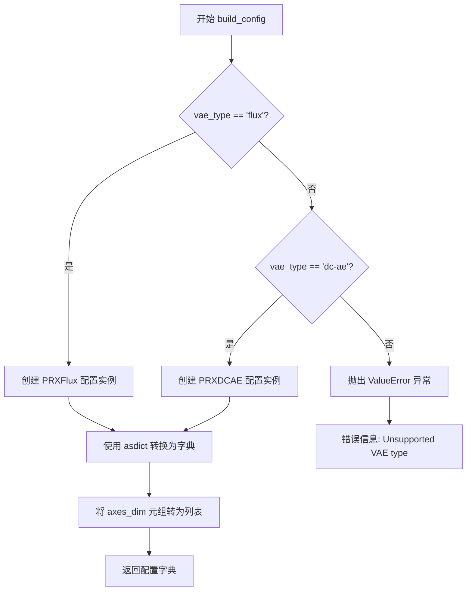
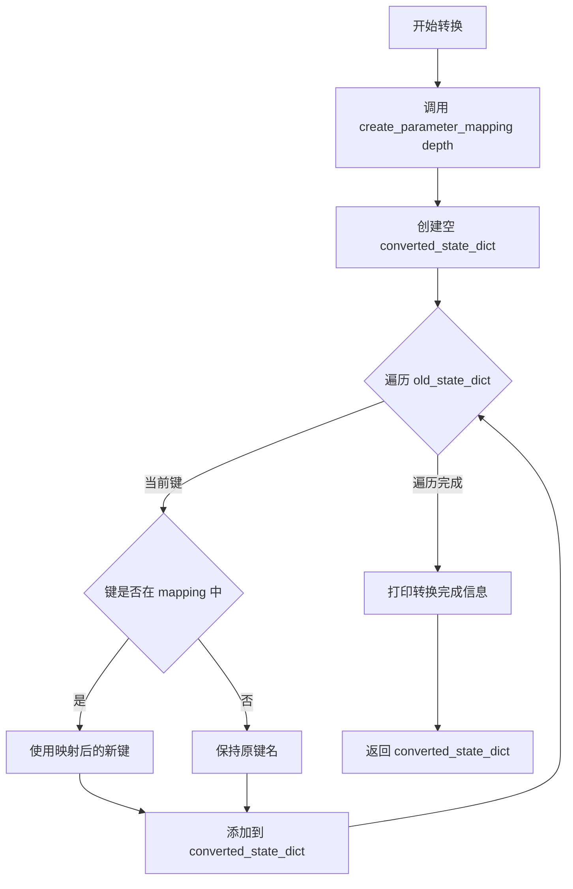
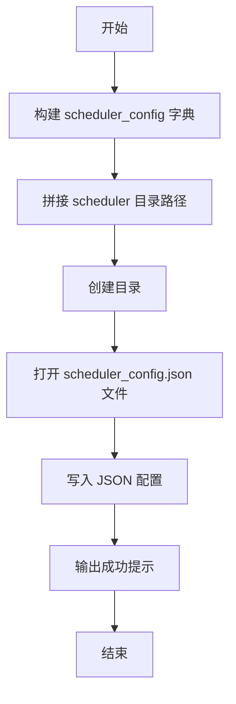
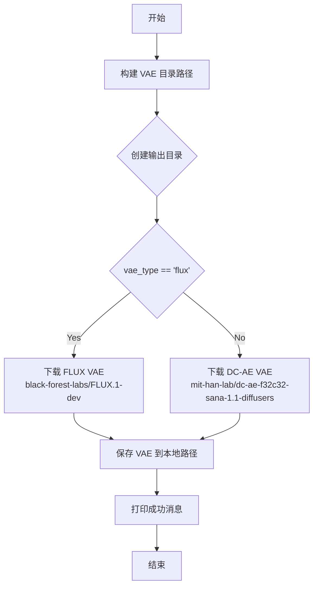
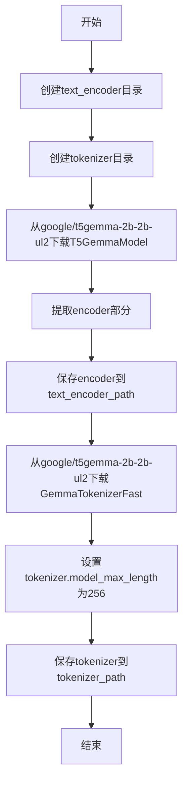
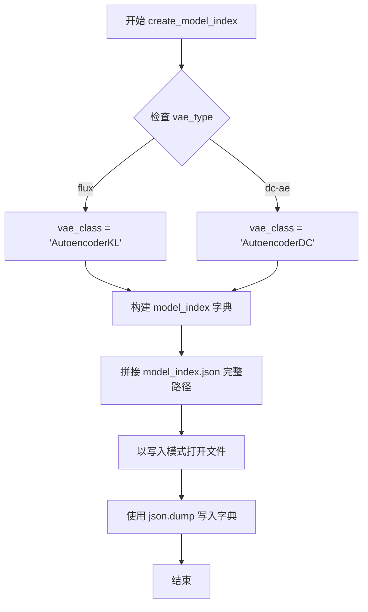
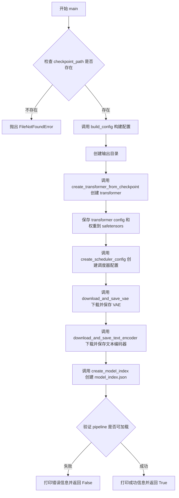

# `diffusers\scripts\convert_prx_to_diffusers.py` 详细设计文档

这是一个将PRX checkpoint从原始代码库格式转换为diffusers格式的脚本，主要用于将PRXTransformer2DModel的权重重新映射为diffusers兼容的格式，同时下载并保存VAE（支持FLUX和DC-AE两种类型）和T5Gemma文本编码器，最终组装成完整的PRXPipeline并验证其可加载性。

## 整体流程

```mermaid
graph TD
    A[开始] --> B[验证checkpoint路径是否存在]
    B --> C[根据vae_type构建配置 (PRXFlux或PRXDCAE)]
    C --> D[创建输出目录]
    D --> E[从checkpoint创建PRXTransformer2DModel]
    E --> E1[加载旧checkpoint]
    E1 --> E2[转换checkpoint参数名称]
    E2 --> E3[创建Transformer并加载转换后的权重]
    E3 --> E4[验证权重加载结果]
    E4 --> F[保存Transformer到输出目录]
    F --> G[创建Scheduler配置文件]
    G --> H[下载并保存VAE (根据vae_type选择FLUX或DC-AE)]
    H --> I[下载并保存T5Gemma文本编码器和tokenizer]
    I --> J[创建model_index.json]
    J --> K[验证Pipeline能否成功加载]
    K --> L{加载成功?}
    L -- 是 --> M[输出转换成功信息]
    L -- 否 --> N[输出错误信息并返回False]
    M --> O[结束]
```

## 类结构

```
PRXBase (dataclass frozen)
├── PRXFlux (dataclass frozen)
└── PRXDCAE (dataclass frozen)
```

## 全局变量及字段


### `DEFAULT_RESOLUTION`
    
默认分辨率，值为512

类型：`int`
    


### `PRXBase.context_in_dim`
    
上下文输入维度，默认2304

类型：`int`
    


### `PRXBase.hidden_size`
    
隐藏层大小，默认1792

类型：`int`
    


### `PRXBase.mlp_ratio`
    
MLP比率，默认3.5

类型：`float`
    


### `PRXBase.num_heads`
    
注意力头数，默认28

类型：`int`
    


### `PRXBase.depth`
    
Transformer深度，默认16

类型：`int`
    


### `PRXBase.axes_dim`
    
轴维度，默认(32, 32)

类型：`Tuple[int, int]`
    


### `PRXBase.theta`
    
旋转位置编码参数，默认10000

类型：`int`
    


### `PRXBase.time_factor`
    
时间因子，默认1000.0

类型：`float`
    


### `PRXBase.time_max_period`
    
时间最大周期，默认10000

类型：`int`
    


### `PRXFlux.in_channels`
    
输入通道数，16

类型：`int`
    


### `PRXFlux.patch_size`
    
Patch大小，2

类型：`int`
    


### `PRXDCAE.in_channels`
    
输入通道数，32

类型：`int`
    


### `PRXDCAE.patch_size`
    
Patch大小，1

类型：`int`
    
    

## 全局函数及方法


### `build_config`

该函数根据传入的 VAE 类型（'flux' 或 'dc-ae'）构建对应的配置字典，用于初始化 PRXTransformer2DModel。它从预定义的配置类 PRXFlux 或 PRXDCAE 中提取参数，并将元组类型的 axes_dim 转换为列表格式。

参数：

- `vae_type`：`str`， VAE 类型，'flux' 或 'dc-ae'

返回值：`Tuple[dict, int]`， 返回配置字典（实际只返回 dict 类型，类型标注存在错误）

#### 流程图



#### 带注释源码

```python
def build_config(vae_type: str) -> Tuple[dict, int]:
    """
    根据 VAE 类型构建对应的配置字典。
    
    参数:
        vae_type: str, VAE 类型，'flux' 或 'dc-ae'
    
    返回:
        Tuple[dict, int]: 配置字典（实际只返回 dict，类型标注有误）
    """
    # 判断 VAE 类型，选择对应的配置类
    if vae_type == "flux":
        # flux 类型使用 PRXFlux 配置，包含 16 通道
        cfg = PRXFlux()
    elif vae_type == "dc-ae":
        # dc-ae 类型使用 PRXDCAE 配置，包含 32 通道
        cfg = PRXDCAE()
    else:
        # 不支持的 VAE 类型，抛出异常
        raise ValueError(f"Unsupported VAE type: {vae_type}. Use 'flux' or 'dc-ae'")

    # 将配置类的数据类实例转换为字典
    config_dict = asdict(cfg)
    
    # 将 axes_dim 从元组转换为列表，以符合 JSON 序列化要求
    # type: ignore[index] 忽略静态类型检查器的索引警告
    config_dict["axes_dim"] = list(config_dict["axes_dim"])
    
    # 返回配置字典
    return config_dict
```


### `create_parameter_mapping`

该函数用于创建旧版本 PRX checkpoint 参数名到新版本 diffusers 格式参数名的映射关系，主要处理模型结构从 PRXBlock 到 PRXAttention 的重组。

参数：

- `depth`：`int`，模型的块（blocks）数量，即 PRXTransformer 的层数深度

返回值：`dict`，映射字典，键为旧的参数名，值为新的 diffusers 参数名

#### 流程图

```mermaid
flowchart TD
    A[开始] --> B[初始化空字典 mapping]
    B --> C[循环 i 从 0 到 depth-1]
    C --> D[映射 img_qkv_proj.weight]
    D --> E[映射 txt_kv_proj.weight]
    E --> F[映射 qk_norm.query_norm.scale]
    F --> G[映射 qk_norm.key_norm.scale]
    G --> H[映射 qk_norm query/key weight]
    H --> I[映射 k_norm.scale]
    I --> J[映射 k_norm.weight]
    J --> K[映射 attn_out.weight]
    K --> L{i < depth - 1?}
    L -->|是| C
    L -->|否| M[返回 mapping 字典]
    
    D -.-> N[blocks.{i}.blocks.{i}.attention]
    E -.-> N
    F -.-> O[norm_q / norm_k]
    G -.-> O
    H -.-> O
    I -.-> P[norm_added_k]
    J -.-> P
    K -.-> Q[to_out.0]
```

#### 带注释源码

```python
def create_parameter_mapping(depth: int) -> dict:
    """Create mapping from old parameter names to new diffusers names."""

    # 初始化空字典，用于存储参数名映射关系
    mapping = {}

    # 遍历每一层 blocks，将旧结构参数名映射到新的 attention 模块结构
    for i in range(depth):
        # QKV 投影从 PRXBlock 移动到 PRXAttention 模块
        # img_qkv_proj: 处理图像 token 的 QKV 投影
        mapping[f"blocks.{i}.img_qkv_proj.weight"] = f"blocks.{i}.attention.img_qkv_proj.weight"
        # txt_kv_proj: 处理文本 token 的 KV 投影
        mapping[f"blocks.{i}.txt_kv_proj.weight"] = f"blocks.{i}.attention.txt_kv_proj.weight"

        # QK norm 移动到 attention 模块，并重命名为匹配 Attention 的 qk_norm 结构
        # query_norm.scale -> norm_q.weight
        mapping[f"blocks.{i}.qk_norm.query_norm.scale"] = f"blocks.{i}.attention.norm_q.weight"
        # key_norm.scale -> norm_k.weight
        mapping[f"blocks.{i}.qk_norm.key_norm.scale"] = f"blocks.{i}.attention.norm_k.weight"
        # query_norm.weight -> norm_q.weight
        mapping[f"blocks.{i}.qk_norm.query_norm.weight"] = f"blocks.{i}.attention.norm_q.weight"
        # key_norm.weight -> norm_k.weight
        mapping[f"blocks.{i}.qk_norm.key_norm.weight"] = f"blocks.{i}.attention.norm_k.weight"

        # K norm 用于文本 token，也移动到 attention 模块
        # k_norm.scale -> norm_added_k.weight
        mapping[f"blocks.{i}.k_norm.scale"] = f"blocks.{i}.attention.norm_added_k.weight"
        mapping[f"blocks.{i}.k_norm.weight"] = f"blocks.{i}.attention.norm_added_k.weight"

        # Attention 输出投影：从 attn_out 重组到 to_out.0
        mapping[f"blocks.{i}.attn_out.weight"] = f"blocks.{i}.attention.to_out.0.weight"

    return mapping
```


### `convert_checkpoint_parameters`

将旧的 PRX checkpoint 参数名称转换为新的 diffusers 格式，通过预定义的映射规则重命名状态字典中的键，并返回转换后的新状态字典。

参数：

- `old_state_dict`：`Dict[str, torch.Tensor]`，旧 checkpoint 的状态字典，包含原始参数名称和对应的张量值
- `depth`：`int`，模型的层数深度，用于生成正确的参数映射关系

返回值：`dict[str, torch.Tensor]`，转换后的新状态字典，键已根据 diffusers 格式重命名

#### 流程图



#### 带注释源码

```python
def convert_checkpoint_parameters(old_state_dict: Dict[str, torch.Tensor], depth: int) -> dict[str, torch.Tensor]:
    """Convert old checkpoint parameters to new diffusers format.

    Args:
        old_state_dict: Dictionary containing old parameter names as keys and torch.Tensor as values.
        depth: The depth of the model, used to generate the correct parameter mapping.

    Returns:
        A new state dict with parameter names converted to diffusers format.
    """

    # 打印转换开始的提示信息
    print("Converting checkpoint parameters...")

    # 根据模型深度创建参数名称映射表
    # 映射表将旧的 PRXBlock 参数名转换为新的 PRXAttention 参数名
    mapping = create_parameter_mapping(depth)
    
    # 初始化转换后的状态字典
    converted_state_dict = {}

    # 遍历旧状态字典中的所有参数
    for key, value in old_state_dict.items():
        # 默认使用原键名
        new_key = key

        # 如果当前键在映射表中，则转换为新键名
        if key in mapping:
            new_key = mapping[key]
            # 打印映射信息，便于调试和追踪
            print(f"  Mapped: {key} -> {new_key}")

        # 将参数添加到转换后的状态字典中
        converted_state_dict[new_key] = value

    # 打印转换完成的参数数量
    print(f"✓ Converted {len(converted_state_dict)} parameters")
    
    # 返回转换后的新状态字典
    return converted_state_dict
```


### `create_transformer_from_checkpoint`

该函数用于将原始 PRX 检查点文件加载并转换为 diffusers 格式的 PRXTransformer2DModel，处理不同检查点格式并完成参数名称映射与权重加载。

**参数：**

- `checkpoint_path`：`str`，原始检查点文件的路径（.pth 文件）
- `config`：`dict`，包含模型配置的字典，用于创建 PRXTransformer2DModel

**返回值：**`PRXTransformer2DModel`，创建并加载权重后的转换器模型实例

#### 流程图

```mermaid
flowchart TD
    A[开始] --> B{检查 checkpoint_path 是否存在}
    B -->|不存在| C[抛出 FileNotFoundError]
    B -->|存在| D[使用 torch.load 加载检查点]
    D --> E{检查点类型判断}
    E -->|dict 且包含 'model'| F[提取 state_dict = old_checkpoint['model']]
    E -->|dict 且包含 'state_dict'| G[提取 state_dict = old_checkpoint['state_dict']]
    E -->|其他| H[直接使用 state_dict = old_checkpoint]
    F --> I[打印加载的参数数量]
    G --> I
    H --> I
    I --> J[从 config 获取 depth]
    J --> K[调用 convert_checkpoint_parameters 转换参数名称]
    K --> L[使用 config 创建 PRXTransformer2DModel]
    L --> M[调用 load_state_dict 加载转换后的权重]
    M --> N{检查 missing_keys 和 unexpected_keys}
    N -->|有缺失| O[打印缺失键警告]
    N -->|有冗余| P[打印冗余键警告]
    N -->|无异常| Q[打印成功信息]
    O --> R[返回 transformer]
    P --> R
    Q --> R
    R --> S[结束]
```

#### 带注释源码

```python
def create_transformer_from_checkpoint(checkpoint_path: str, config: dict) -> PRXTransformer2DModel:
    """Create and load PRXTransformer2DModel from old checkpoint."""

    print(f"Loading checkpoint from: {checkpoint_path}")

    # 检查文件是否存在，不存在则抛出异常
    if not os.path.exists(checkpoint_path):
        raise FileNotFoundError(f"Checkpoint not found: {checkpoint_path}")

    # 使用 torch.load 加载检查点到 CPU
    old_checkpoint = torch.load(checkpoint_path, map_location="cpu")

    # 处理不同的检查点格式：
    # 1. 字典包含 'model' 键
    # 2. 字典包含 'state_dict' 键
    # 3. 直接就是 state_dict
    if isinstance(old_checkpoint, dict):
        if "model" in old_checkpoint:
            state_dict = old_checkpoint["model"]
        elif "state_dict" in old_checkpoint:
            state_dict = old_checkpoint["state_dict"]
        else:
            state_dict = old_checkpoint
    else:
        state_dict = old_checkpoint

    print(f"✓ Loaded checkpoint with {len(state_dict)} parameters")

    # 从配置中获取模型深度，用于参数名称转换
    model_depth = int(config.get("depth", 16))
    # 调用转换函数，将旧参数名称映射到新的 diffusers 格式
    converted_state_dict = convert_checkpoint_parameters(state_dict, depth=model_depth)

    # 使用配置字典创建 PRXTransformer2DModel 实例
    print("Creating PRXTransformer2DModel...")
    transformer = PRXTransformer2DModel(**config)

    # 加载转换后的状态字典，strict=False 允许部分匹配
    print("Loading converted parameters...")
    missing_keys, unexpected_keys = transformer.load_state_dict(converted_state_dict, strict=False)

    # 检查并报告缺失的键
    if missing_keys:
        print(f"⚠ Missing keys: {missing_keys}")
    # 检查并报告意外的键
    if unexpected_keys:
        print(f"⚠ Unexpected keys: {unexpected_keys}")

    # 如果没有缺失或意外的键，打印成功信息
    if not missing_keys and not unexpected_keys:
        print("✓ All parameters loaded successfully!")

    # 返回加载好的转换器模型
    return transformer
```


### `create_scheduler_config`

该函数用于创建 FlowMatchEulerDiscreteScheduler（流匹配欧拉离散调度器）的配置文件，并将其保存为 JSON 格式到指定的输出目录中。

参数：

- `output_path`：`str`，输出目录的路径，用于存放调度器配置文件
- `shift`：`float`，调度器的 shift 参数，用于控制噪声调度的时间偏移

返回值：`None`，该函数不返回任何值，仅执行文件写入操作

#### 流程图



#### 带注释源码

```python
def create_scheduler_config(output_path: str, shift: float):
    """Create FlowMatchEulerDiscreteScheduler config."""

    # 构建调度器配置字典，包含类名、训练时间步数和shift参数
    scheduler_config = {
        "_class_name": "FlowMatchEulerDiscreteScheduler",  # 调度器类名
        "num_train_timesteps": 1000,                        # 训练时间步数
        "shift": shift                                       # 用户指定的shift参数
    }

    # 拼接调度器配置文件的存放目录路径
    scheduler_path = os.path.join(output_path, "scheduler")
    
    # 创建目录（如果目录已存在则不报错）
    os.makedirs(scheduler_path, exist_ok=True)

    # 打开配置文件并写入JSON格式的配置内容
    with open(os.path.join(scheduler_path, "scheduler_config.json"), "w") as f:
        json.dump(scheduler_config, f, indent=2)

    # 打印成功创建配置文件的提示信息
    print("✓ Created scheduler config")
```


### `download_and_save_vae`

该函数根据指定的 VAE 类型（flux 或 dc-ae）从 Hugging Face Hub 下载预训练的 VAE 模型（AutoencoderKL 或 AutoencoderDC），并将其保存到本地指定目录。

参数：

- `vae_type`：`str`，VAE 类型标识符，用于选择要下载的模型（"flux" 或 "dc-ae"）
- `output_path`：`str`，目标输出目录的路径，VAE 模型将保存在此目录下的 "vae" 子目录中

返回值：`None`，该函数无返回值，仅执行下载和保存操作

#### 流程图



#### 带注释源码

```python
def download_and_save_vae(vae_type: str, output_path: str):
    """Download and save VAE to local directory."""
    # 动态导入 diffusers 库中的 VAE 类
    # AutoencoderKL 用于 FLUX 模型（16通道）
    # AutoencoderDC 用于 DC-AE 模型（32通道）
    from diffusers import AutoencoderDC, AutoencoderKL

    # 构建 VAE 模型的保存路径：output_path/vae
    vae_path = os.path.join(output_path, "vae")
    # 创建目录（如果不存在）
    os.makedirs(vae_path, exist_ok=True)

    # 根据 vae_type 选择对应的 VAE 模型进行下载
    if vae_type == "flux":
        # FLUX VAE 使用 AutoencoderKL
        print("Downloading FLUX VAE from black-forest-labs/FLUX.1-dev...")
        vae = AutoencoderKL.from_pretrained("black-forest-labs/FLUX.1-dev", subfolder="vae")
    else:  # dc-ae
        # DC-AE VAE 使用 AutoencoderDC
        print("Downloading DC-AE VAE from mit-han-lab/dc-ae-f32c32-sana-1.1-diffusers...")
        vae = AutoencoderDC.from_pretrained("mit-han-lab/dc-ae-f32c32-sana-1.1-diffusers")

    # 将下载的 VAE 模型保存到本地路径
    vae.save_pretrained(vae_path)
    # 打印确认消息，包含保存路径
    print(f"✓ Saved VAE to {vae_path}")
```


### `download_and_save_text_encoder`

该函数用于从 Hugging Face Hub 下载 T5Gemma 文本编码器模型及其分词器，并将其保存到指定的本地目录中，同时只保留编码器（encoder）部分而丢弃解码器（decoder）部分。

参数：

- `output_path`：`str`，输出目录的路径，用于存放下载的文本编码器（text_encoder）和分词器（tokenizer）文件

返回值：`None`，该函数无返回值，仅执行下载和保存操作

#### 流程图



#### 带注释源码

```python
def download_and_save_text_encoder(output_path: str):
    """
    Download and save T5Gemma text encoder and tokenizer.
    
    从 Hugging Face Hub 下载 T5Gemma 文本编码器模型及其分词器，
    并将其保存到指定的本地目录中。该函数只保留编码器（encoder）部分，
    而丢弃解码器（decoder）部分，因为 PRX Pipeline 只需要编码器。
    
    参数:
        output_path: str, 输出目录的路径，用于存放下载的文本编码器和分词器文件
    """
    # 动态导入 transformers 库中的相关类
    from transformers import GemmaTokenizerFast
    from transformers.models.t5gemma.modeling_t5gemma import T5GemmaModel

    # 构造 text_encoder 和 tokenizer 的保存路径
    text_encoder_path = os.path.join(output_path, "text_encoder")
    tokenizer_path = os.path.join(output_path, "tokenizer")
    
    # 创建保存目录（如果不存在则创建）
    os.makedirs(text_encoder_path, exist_ok=True)
    os.makedirs(tokenizer_path, exist_ok=True)

    # 从 Hugging Face Hub 下载 T5Gemma 模型
    print("Downloading T5Gemma model from google/t5gemma-2b-2b-ul2...")
    t5gemma_model = T5GemmaModel.from_pretrained("google/t5gemma-2b-2b-ul2")

    # 从完整模型中提取只包含 encoder 的部分
    # PRX Pipeline 只需要编码器，不需要解码器
    t5gemma_encoder = t5gemma_model.encoder
    
    # 将编码器保存到本地目录
    t5gemma_encoder.save_pretrained(text_encoder_path)
    print(f"✓ Saved T5GemmaEncoder to {text_encoder_path}")

    # 下载并保存 tokenizer
    print("Downloading tokenizer from google/t5gemma-2b-2b-ul2...")
    tokenizer = GemmaTokenizerFast.from_pretrained("google/t5gemma-2b-2b-ul2")
    
    # 设置 tokenization 的最大长度为 256
    # 这是 PRX 模型设计的限制，超过此长度的文本将被截断
    tokenizer.model_max_length = 256
    tokenizer.save_pretrained(tokenizer_path)
    print(f"✓ Saved tokenizer to {tokenizer_path}")
```


### `create_model_index`

该函数用于生成 diffusers 格式的 PRX Pipeline 配置文件 `model_index.json`，记录管道中各组件（Pipeline、Transformer、VAE、Text Encoder、Tokenizer、Scheduler）的类名、模块路径及默认采样尺寸等元信息，供 `PRXPipeline.from_pretrained()` 加载时读取。

参数：

- `vae_type`：`str`，VAE 类型标识，值为 `"flux"` 时使用 `AutoencoderKL`，值为 `"dc-ae"` 时使用 `AutoencoderDC`
- `default_image_size`：`int`，Transformer 的默认采样尺寸，对应 `model_index` 中的 `default_sample_size` 字段
- `output_path`：`str`，输出目录路径，`model_index.json` 将写入该目录

返回值：`None`，该函数直接写入文件，不返回任何值

#### 流程图



#### 带注释源码

```python
def create_model_index(vae_type: str, default_image_size: int, output_path: str):
    """Create model_index.json for the pipeline."""

    # 根据 vae_type 确定 VAE 的类名，用于填写 model_index 中 vae 字段
    # flux 使用 AutoencoderKL (来自 black-forest-labs/FLUX.1-dev)
    # dc-ae 使用 AutoencoderDC (来自 mit-han-lab/dc-ae-f32c32-sana-1.1-diffusers)
    if vae_type == "flux":
        vae_class = "AutoencoderKL"
    else:  # dc-ae
        vae_class = "AutoencoderDC"

    # 构建 model_index.json 的核心数据结构
    # 该文件是 diffusers pipeline 的必需配置文件，记录各组件的类名和模块来源
    model_index = {
        "_class_name": "PRXPipeline",               # Pipeline 入口类名
        "_diffusers_version": "0.31.0.dev0",        # diffusers 库版本号
        "_name_or_path": os.path.basename(output_path),  # 模型路径名称（取 output_path 的末尾目录名）
        "default_sample_size": default_image_size, # Transformer 默认采样尺寸
        "scheduler": ["diffusers", "FlowMatchEulerDiscreteScheduler"],  # 调度器：类名 + 模块来源
        "text_encoder": ["prx", "T5GemmaEncoder"], # 文本编码器：自定义模块 + 类名
        "tokenizer": ["transformers", "GemmaTokenizerFast"],             # 分词器：transformers 库 + 类名
        "transformer": ["diffusers", "PRXTransformer2DModel"],           # 主干 Transformer：diffusers 库 + 类名
        "vae": ["diffusers", vae_class],          # VAE：根据 vae_type 动态选择类名
    }

    # 拼接输出文件的完整路径：<output_path>/model_index.json
    model_index_path = os.path.join(output_path, "model_index.json")
    
    # 写入 JSON 文件，使用 indent=2 实现格式化缩进
    with open(model_index_path, "w") as f:
        json.dump(model_index, f, indent=2)
```


### `main(args)`

该函数是脚本的核心入口，负责将原始 PRX checkpoint 转换为 diffusers 格式的 pipeline，包括转换 transformer、下载并保存 VAE 和文本编码器、创建配置文件，并验证生成的 pipeline 可正常加载。

参数：

- `args`：`Namespace`（来自 argparse），命令行参数集合，包含 checkpoint_path（原始 checkpoint 路径）、output_path（输出目录）、vae_type（VAE 类型：flux 或 dc-ae）、resolution（目标分辨率）、shift（调度器偏移量）

返回值：`bool`，转换成功返回 True，失败返回 False

#### 流程图



#### 带注释源码

```python
def main(args):
    # 验证输入：检查原始 checkpoint 文件是否存在
    if not os.path.exists(args.checkpoint_path):
        raise FileNotFoundError(f"Checkpoint not found: {args.checkpoint_path}")

    # 根据 vae_type 构建对应的配置字典（flux 或 dc-ae）
    config = build_config(args.vae_type)

    # 创建输出目录
    os.makedirs(args.output_path, exist_ok=True)
    print(f"✓ Output directory: {args.output_path}")

    # 从原始 checkpoint 创建并转换 PRXTransformer2DModel
    transformer = create_transformer_from_checkpoint(args.checkpoint_path, config)

    # 准备保存 transformer 的路径
    transformer_path = os.path.join(args.output_path, "transformer")
    os.makedirs(transformer_path, exist_ok=True)

    # 将配置保存为 config.json
    with open(os.path.join(transformer_path, "config.json"), "w") as f:
        json.dump(config, f, indent=2)

    # 提取 state dict 并保存为 safetensors 格式
    state_dict = transformer.state_dict()
    save_file(state_dict, os.path.join(transformer_path, "diffusion_pytorch_model.safetensors"))
    print(f"✓ Saved transformer to {transformer_path}")

    # 创建 FlowMatchEulerDiscreteScheduler 配置文件
    create_scheduler_config(args.output_path, args.shift)

    # 下载并保存 VAE（根据 vae_type 选择 AutoencoderKL 或 AutoencoderDC）
    download_and_save_vae(args.vae_type, args.output_path)

    # 下载并保存 T5Gemma 文本编码器和 tokenizer
    download_and_save_text_encoder(args.output_path)

    # 创建 model_index.json，记录各组件的类名和路径
    create_model_index(args.vae_type, args.resolution, args.output_path)

    # 验证 pipeline 可以正确加载
    try:
        # 从本地路径加载完整的 PRXPipeline
        pipeline = PRXPipeline.from_pretrained(args.output_path)
        print("Pipeline loaded successfully!")
        print(f"Transformer: {type(pipeline.transformer).__name__}")
        print(f"VAE: {type(pipeline.vae).__name__}")
        print(f"Text Encoder: {type(pipeline.text_encoder).__name__}")
        print(f"Scheduler: {type(pipeline.scheduler).__name__}")

        # 统计并打印 transformer 的参数量
        num_params = sum(p.numel() for p in pipeline.transformer.parameters())
        print(f"✓ Transformer parameters: {num_params:,}")

    except Exception as e:
        # 加载失败时打印错误并返回 False
        print(f"Pipeline verification failed: {e}")
        return False

    # 打印最终成功信息
    print("Conversion completed successfully!")
    print(f"Converted pipeline saved to: {args.output_path}")
    print(f"VAE type: {args.vae_type}")

    # 成功完成转换
    return True
```

## 关键组件


### 张量索引与惰性加载

该脚本使用 `torch.load` 加载检查点文件，采用惰性加载策略仅在需要时将张量从磁盘加载到内存。状态字典通过 `transformer.load_state_dict()` 方法按需映射到模型参数，支持仅转换需要的参数而不完全展开整个张量结构。

### 反量化支持

脚本通过 `download_and_save_vae` 函数支持两种 VAE 类型的反量化：flux 类型使用 `AutoencoderKL`（16通道，FP16优化），dc-ae 类型使用 `AutoencoderDC`（32通道，浮点精度）。配置类 `PRXFlux` 和 `PRXDCAE` 分别定义了不同 VAE 类型的输入通道数和 patch_size 参数。

### 量化策略

`build_config` 函数根据 `vae_type` 参数动态构建配置字典，支持灵活的模型结构配置。参数映射通过 `create_parameter_mapping` 函数实现旧检查点到新 diffusers 格式的转换，包括 QKV 投影重定位、QK 归一化重命名等结构优化策略。

### 调度器配置生成

`create_scheduler_config` 函数生成 FlowMatchEulerDiscreteScheduler 的配置文件，支持可调的 shift 参数用于控制扩散过程的时间步调度策略。

### 流水线验证机制

主函数包含完整的流水线加载验证逻辑，通过 `PRXPipeline.from_pretrained` 验证转换后的模型完整性，并输出各类组件的详细信息和参数统计。


## 问题及建议


### 已知问题

- **参数映射不完整**：`create_parameter_mapping` 函数仅处理了 `weight` 参数，遗漏了 `bias` 参数的映射，可能导致转换后的模型缺失偏置项
- **硬编码版本号**：代码中硬编码了 `"_diffusers_version": "0.31.0.dev0"`，缺乏动态获取版本的方式，未来版本更新时需要手动修改
- **缺少完整的错误处理**：网络下载函数（`download_and_save_vae`、`download_and_save_text_encoder`）没有处理网络超时、下载失败、重试机制等异常情况
- **魔法数字和硬编码配置**：多处使用硬编码值（如 `tokenizer.model_max_length = 256`、`num_train_timesteps: 1000`），缺乏配置化管理
- **命令行参数限制过严**：`resolution` 参数仅允许 `[256, 512, 1024]` 三个选项，限制了模型的灵活性
- **文件覆盖无保护**：保存模型时未检查目标文件是否存在及是否可写，可能导致意外覆盖
- **数据类字段重复**：`PRXFlux` 和 `PRXDCAE` 继承自 `PRXBase`，但部分字段重复定义（如 `in_channels`），增加了维护成本

### 优化建议

- **完善参数映射**：扩展 `create_parameter_mapping` 函数，添加 bias 参数的映射逻辑，并处理更多参数名称变体
- **动态获取版本**：使用 `diffusers.__version__` 替代硬编码的版本号，提高代码可维护性
- **添加重试机制**：为网络下载函数添加重试逻辑和超时控制，提升脚本健壮性
- **配置文件外部化**：将魔法数字和硬编码配置提取到配置文件或命令行参数中
- **放宽参数限制**：`resolution` 参数改为接受任意正整数值，或提供更灵活的验证方式
- **文件操作安全**：在保存模型前检查文件是否存在，必要时提示用户确认或自动备份
- **重构数据类**：考虑使用组合或泛型方式重构数据类，减少字段重复定义

## 其它


### 设计目标与约束

本工具旨在将PRX（图像生成模型）检查点从原始格式转换为HuggingFace Diffusers兼容格式，支持两种VAE类型（flux和dc-ae）以及三种分辨率（256、512、1024）。约束条件包括：必须提供有效的检查点路径、输出目录必须可创建、仅支持预定义的VAE类型和分辨率组合。

### 错误处理与异常设计

代码采用多层异常处理机制：文件存在性检查（FileNotFoundError）确保检查点和目录有效；参数验证（ValueError）限制VAE类型和分辨率的合法取值；通用异常捕获（Exception）用于捕获转换过程中的未知错误并打印完整堆栈信息。检查点加载支持多种格式（model、state_dict或直接状态字典），增强容错能力。

### 数据流与状态机

数据流遵循以下流程：1）解析命令行参数并验证；2）根据VAE类型构建配置字典；3）加载原始检查点并提取状态字典；4）通过参数映射表转换旧命名到新命名；5）创建PRXTransformer2DModel并加载转换后的状态；6）保存转换后的模型（config.json + safetensors）；7）下载并保存VAE、文本编码器、分词器和调度器配置；8）生成model_index.json；9）验证管道可正确加载。

### 外部依赖与接口契约

核心依赖包括：torch（张量操作）、safetensors.torch（安全张量序列化）、diffusers（PRXPipeline、PRXTransformer2DModel、AutoencoderKL、AutoencoderDC、FlowMatchEulerDiscreteScheduler）、transformers（GemmaTokenizerFast、T5GemmaModel）。外部模型来源：black-forest-labs/FLUX.1-dev（VAE）、mit-han-lab/dc-ae-f32c32-sana-1.1-diffusers（DC-AE）、google/t5gemma-2b-2b-ul2（文本编码器）。

### 配置管理

配置通过dataclass体系管理：PRXBase定义基础参数（context_in_dim、hidden_size、mlp_ratio、num_heads、depth、axes_dim、theta、time_factor、time_max_period），PRXFlux和PRXDCAE分别继承并定义in_channels和patch_size。build_config函数将dataclass转换为字典，axes_dim元组转换为列表以兼容JSON序列化。

### 版本兼容性

model_index.json明确指定diffusers_version为0.31.0.dev0，确保管道加载时的版本一致性。配置中的参数（如depth、hidden_size等）需要与目标diffusers版本中的PRXTransformer2DModel实现兼容。

### 命令行接口设计

使用argparse构建CLI，提供五个参数：checkpoint_path（必需，原始检查点路径）、output_path（必需，输出目录）、vae_type（必需，选择flux或dc-ae）、resolution（可选，默认512，支持256/512/1024）、shift（可选，默认3.0，调度器移位参数）。参数包含帮助文档说明用途和约束。

### 文件输出结构

输出目录结构如下：output_path/ ├── model_index.json ├── transformer/ │   ├── config.json │   └── diffusion_pytorch_model.safetensors ├── vae/ ├── text_encoder/ ├── tokenizer/ └── scheduler/ └── scheduler_config.json

### 性能考虑

使用safetensors格式存储模型权重，相比pickle具有更快的序列化和反序列化速度。加载检查点时使用map_location="cpu"避免GPU内存溢出。load_state_dict使用strict=False允许部分参数匹配，提供更好的兼容性。

### 安全考虑

使用safetensors.torch的save_file确保张量序列化的安全性。download_and_save函数从官方HuggingFace Hub加载预训练模型，验证来源可信。参数映射转换在本地完成，不涉及远程代码执行。

### 可扩展性

dataclass frozen=True设计确保配置不可变。create_parameter_mapping函数基于depth参数动态生成映射规则，支持不同深度的模型。检查点加载支持多种字典格式（model、state_dict或直接），便于适配不同的原始检查点格式。

### 测试考虑

main函数末尾包含管道验证逻辑：尝试使用PRXPipeline.from_pretrained加载完整管道，验证各组件类型（transformer、vae、text_encoder、scheduler），统计并打印transformer参数总数。验证失败时打印错误信息但继续运行，允许用户检查部分输出。

    