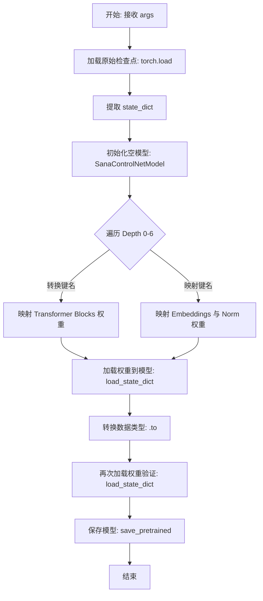
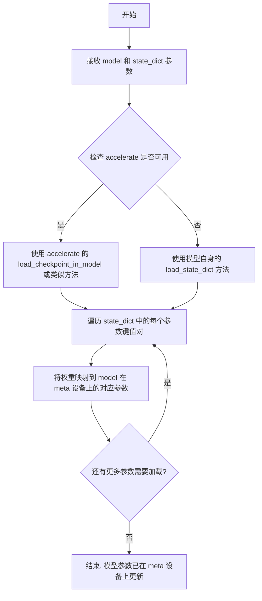
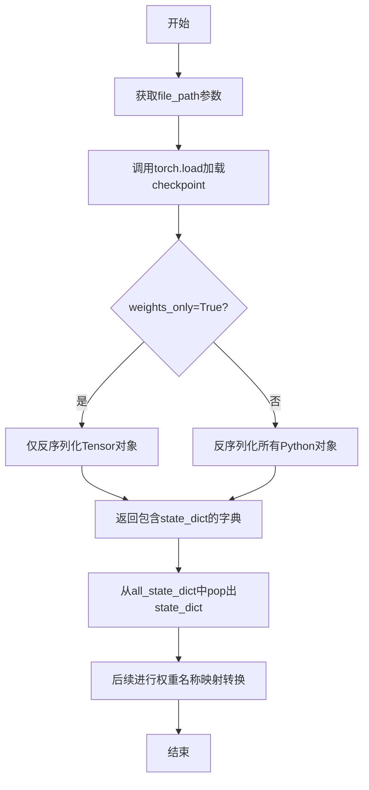
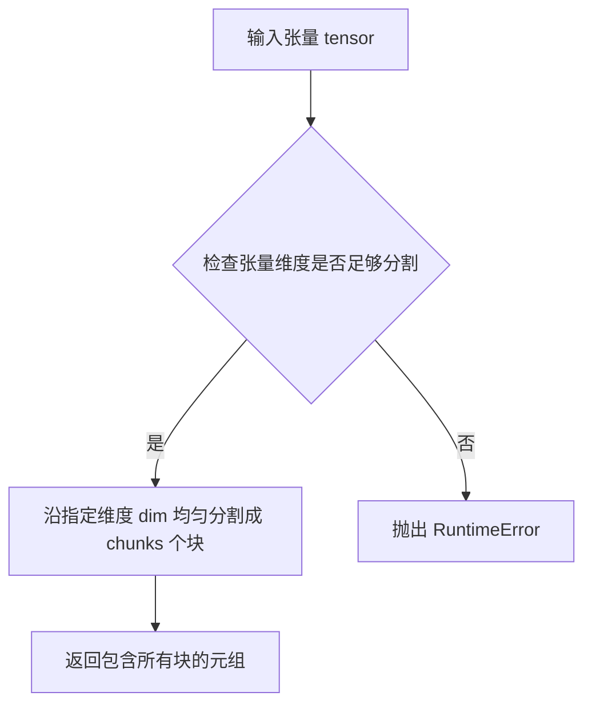
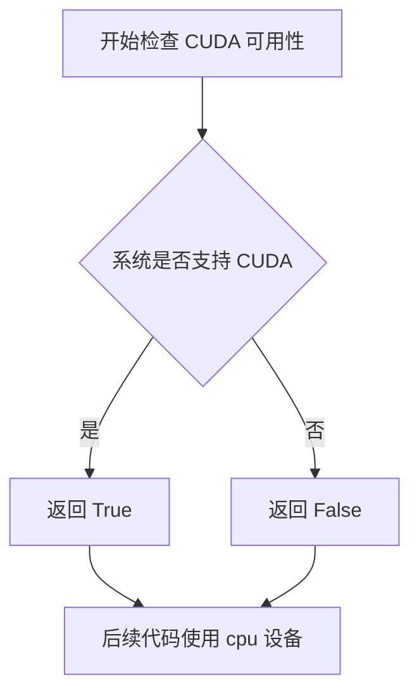
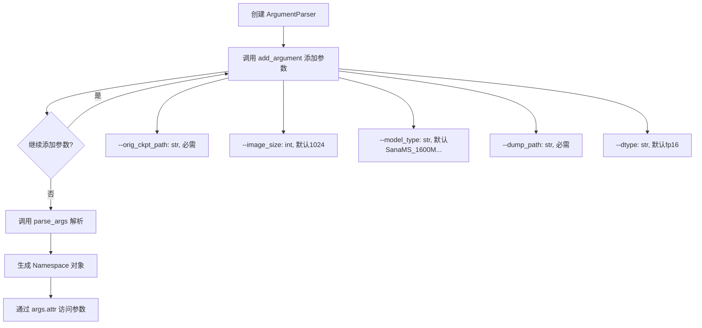

# `diffusers\scripts\convert_sana_controlnet_to_diffusers.py` 详细设计文档

该脚本用于将Sana模型的ControlNet检查点转换为HuggingFace Diffusers格式,处理了patch embeddings、caption projection、AdaLN、transformer blocks等各层的权重映射和名称转换,并支持多种模型配置和图像尺寸。

## 整体流程

```mermaid
graph TD
    A[开始: 解析命令行参数] --> B[加载原始checkpoint]
    B --> C{检查accelerate库可用性}
    C -- 是 --> D[使用init_empty_weights上下文]
    C -- 否 --> E[使用nullcontext]
    D --> F[创建SanaControlNetModel实例]
    E --> F
    F --> G[映射patch embeddings层权重]
    G --> H[映射caption projection层权重]
    H --> I[映射AdaLN-single LN层权重]
    I --> J[映射shared norm层权重]
    J --> K[映射positional embedding interpolation scale]
    K --> L[映射ControlNet Input Projection层]
    L --> M{遍历depth in range(7)}
    M --> N[映射transformer blocks: scale_shift_table]
    N --> O[映射self attention (q,k,v)]
    O --> P[映射projection层]
    P --> Q[映射feed-forward层]
    Q --> R[映射cross-attention层]
    R --> S[映射ControlNet After Projection]
    S --> T[加载权重到模型]
    T --> U[转换为目标数据类型]
    T --> V[保存为Diffusers格式]
    V --> W[结束]
```

## 类结构

```
模块级
├── main (主函数)
├── CTX (全局上下文管理器)
├── DTYPE_MAPPING (全局字典)
├── VARIANT_MAPPING (全局字典)
└── model_kwargs (全局字典)
```

## 全局变量及字段


### `CTX`
    
根据accelerate库是否可用选择空权重初始化上下文管理器或nullcontext

类型：`contextlib.contextmanager`
    


### `DTYPE_MAPPING`
    
将字符串类型('fp32', 'fp16', 'bf16')映射到对应的torch数据类型

类型：`Dict[str, torch.dtype]`
    


### `VARIANT_MAPPING`
    
将字符串类型映射到diffusers模型的variant名称('fp16', 'bf16'或None)

类型：`Dict[str, Optional[str]]`
    


### `all_state_dict`
    
从原始检查点文件加载的完整状态字典

类型：`Dict[str, Any]`
    


### `state_dict`
    
从all_state_dict中提取的模型权重状态字典

类型：`Dict[str, torch.Tensor]`
    


### `converted_state_dict`
    
经过键名转换后的状态字典，用于适配Diffusers格式

类型：`Dict[str, torch.Tensor]`
    


### `interpolation_scale`
    
图像尺寸到位置嵌入插值缩放因子的映射字典

类型：`Dict[int, Optional[float]]`
    


### `depth`
    
循环变量，表示当前处理的Transformer块深度(0-6)

类型：`int`
    


### `q`
    
自注意力机制的查询权重张量，从qkv权重分割得到

类型：`torch.Tensor`
    


### `k`
    
自注意力机制的键权重张量，从qkv权重分割得到

类型：`torch.Tensor`
    


### `v`
    
自注意力机制的值权重张量，从qkv权重分割得到

类型：`torch.Tensor`
    


### `q_bias`
    
查询线性层的偏置张量

类型：`torch.Tensor`
    


### `k_bias`
    
键线性层的偏置张量

类型：`torch.Tensor`
    


### `v_bias`
    
值线性层的偏置张量

类型：`torch.Tensor`
    


### `controlnet`
    
转换后的Sana ControlNet模型实例

类型：`SanaControlNetModel`
    


### `num_model_params`
    
ControlNet模型的参数总数

类型：`int`
    


### `weight_dtype`
    
模型权重的目标数据类型，根据命令行参数dtype确定

类型：`torch.dtype`
    


### `variant`
    
模型variant标识，用于保存预训练模型时指定精度变体

类型：`Optional[str]`
    


### `device`
    
计算设备，优先使用CUDA否则使用CPU

类型：`str`
    


### `args`
    
命令行参数命名空间，包含orig_ckpt_path、image_size、model_type、dump_path、dtype等配置

类型：`argparse.Namespace`
    


### `file_path`
    
原始检查点文件的路径，从args.orig_ckpt_path提取

类型：`str`
    


    

## 全局函数及方法


### `main`

该函数是脚本的核心入口，负责将原始Sana模型的检查点（Checkpoint）文件转换为HuggingFace Diffusers库支持的`SanaControlNetModel`格式。函数通过手动映射复杂的键名（Key Mapping），重新组织权重矩阵，并最终保存为标准的Diffusers模型目录。

参数：

-  `args`：`argparse.Namespace`，命令行参数集合。包含原始模型路径（`orig_ckpt_path`）、图像尺寸（`image_size`）、模型类型标识（`model_type`）、输出路径（`dump_path`）以及权重数据类型（`dtype`）。

返回值：`None`，该函数执行转换和保存操作，不返回任何值。

#### 流程图



#### 带注释源码

```python
def main(args):
    # 获取原始检查点文件路径
    file_path = args.orig_ckpt_path

    # 使用 PyTorch 加载权重，仅加载权重数据 (weights_only=True 防止恶意 pickle)
    all_state_dict = torch.load(file_path, weights_only=True)
    # 弹出主要的 state_dict，原始文件通常包含 'state_dict' 键
    state_dict = all_state_dict.pop("state_dict")
    # 用于存放转换后的键值对
    converted_state_dict = {}

    # --- 1. 基础组件映射 (Patch Embeddings, Caption Projection, Time Embedding, Norms) ---
    
    # Patch embeddings: x_embedder -> patch_embed
    converted_state_dict["patch_embed.proj.weight"] = state_dict.pop("x_embedder.proj.weight")
    converted_state_dict["patch_embed.proj.bias"] = state_dict.pop("x_embedder.proj.bias")

    # Caption projection: y_embedder -> caption_projection
    converted_state_dict["caption_projection.linear_1.weight"] = state_dict.pop("y_embedder.y_proj.fc1.weight")
    converted_state_dict["caption_projection.linear_1.bias"] = state_dict.pop("y_embedder.y_proj.fc1.bias")
    converted_state_dict["caption_projection.linear_2.weight"] = state_dict.pop("y_embedder.y_proj.fc2.weight")
    converted_state_dict["caption_projection.linear_2.bias"] = state_dict.pop("y_embedder.y_proj.fc2.bias")

    # AdaLN-single LN (Time embedding): t_embedder -> time_embed
    converted_state_dict["time_embed.emb.timestep_embedder.linear_1.weight"] = state_dict.pop(
        "t_embedder.mlp.0.weight"
    )
    converted_state_dict["time_embed.emb.timestep_embedder.linear_1.bias"] = state_dict.pop("t_embedder.mlp.0.bias")
    converted_state_dict["time_embed.emb.timestep_embedder.linear_2.weight"] = state_dict.pop(
        "t_embedder.mlp.2.weight"
    )
    converted_state_dict["time_embed.emb.timestep_embedder.linear_2.bias"] = state_dict.pop("t_embedder.mlp.2.bias")

    # Shared norm: t_block -> time_embed
    converted_state_dict["time_embed.linear.weight"] = state_dict.pop("t_block.1.weight")
    converted_state_dict["time_embed.linear.bias"] = state_dict.pop("t_block.1.bias")

    # y norm: attention_y_norm -> caption_norm
    converted_state_dict["caption_norm.weight"] = state_dict.pop("attention_y_norm.weight")

    # Positional embedding interpolation scale (不同分辨率的插值系数)
    interpolation_scale = {512: None, 1024: None, 2048: 1.0, 4096: 2.0}

    # ControlNet Input Projection: controlnet.0.before_proj -> input_block
    converted_state_dict["input_block.weight"] = state_dict.pop("controlnet.0.before_proj.weight")
    converted_state_dict["input_block.bias"] = state_dict.pop("controlnet.0.before_proj.bias")

    # --- 2. Transformer Blocks 循环映射 (Depth 0-6) ---
    for depth in range(7):
        # 2.1 Scale & Shift Table
        converted_state_dict[f"transformer_blocks.{depth}.scale_shift_table"] = state_dict.pop(
            f"controlnet.{depth}.copied_block.scale_shift_table"
        )

        # 2.2 Self Attention (自注意力): 处理 QKV 融合权重
        # 原始权重是融合在一起的 [q, k, v]，需要按维度 chunk 分开
        q, k, v = torch.chunk(state_dict.pop(f"controlnet.{depth}.copied_block.attn.qkv.weight"), 3, dim=0)
        converted_state_dict[f"transformer_blocks.{depth}.attn1.to_q.weight"] = q
        converted_state_dict[f"transformer_blocks.{depth}.attn1.to_k.weight"] = k
        converted_state_dict[f"transformer_blocks.{depth}.attn1.to_v.weight"] = v
        
        # Projection (输出投影)
        converted_state_dict[f"transformer_blocks.{depth}.attn1.to_out.0.weight"] = state_dict.pop(
            f"controlnet.{depth}.copied_block.attn.proj.weight"
        )
        converted_state_dict[f"transformer_blocks.{depth}.attn1.to_out.0.bias"] = state_dict.pop(
            f"controlnet.{depth}.copied_block.attn.proj.bias"
        )

        # 2.3 Feed-forward (前馈网络): 处理 Inverted Conv, Depth Conv, Point Conv
        converted_state_dict[f"transformer_blocks.{depth}.ff.conv_inverted.weight"] = state_dict.pop(
            f"controlnet.{depth}.copied_block.mlp.inverted_conv.conv.weight"
        )
        converted_state_dict[f"transformer_blocks.{depth}.ff.conv_inverted.bias"] = state_dict.pop(
            f"controlnet.{depth}.copied_block.mlp.inverted_conv.conv.bias"
        )
        converted_state_dict[f"transformer_blocks.{depth}.ff.conv_depth.weight"] = state_dict.pop(
            f"controlnet.{depth}.copied_block.mlp.depth_conv.conv.weight"
        )
        converted_state_dict[f"transformer_blocks.{depth}.ff.conv_depth.bias"] = state_dict.pop(
            f"controlnet.{depth}.copied_block.mlp.depth_conv.conv.bias"
        )
        converted_state_dict[f"transformer_blocks.{depth}.ff.conv_point.weight"] = state_dict.pop(
            f"controlnet.{depth}.copied_block.mlp.point_conv.conv.weight"
        )
        # 注意：源码中可能遗漏了 conv_point.bias 的映射，需注意检查

        # 2.4 Cross Attention (交叉注意力): 分离 Q 和 KV 线性层
        q = state_dict.pop(f"controlnet.{depth}.copied_block.cross_attn.q_linear.weight")
        q_bias = state_dict.pop(f"controlnet.{depth}.copied_block.cross_attn.q_linear.bias")
        # 原始 KV 是融合的，需要 chunk
        k, v = torch.chunk(state_dict.pop(f"controlnet.{depth}.copied_block.cross_attn.kv_linear.weight"), 2, dim=0)
        k_bias, v_bias = torch.chunk(
            state_dict.pop(f"controlnet.{depth}.copied_block.cross_attn.kv_linear.bias"), 2, dim=0
        )

        converted_state_dict[f"transformer_blocks.{depth}.attn2.to_q.weight"] = q
        converted_state_dict[f"transformer_blocks.{depth}.attn2.to_q.bias"] = q_bias
        converted_state_dict[f"transformer_blocks.{depth}.attn2.to_k.weight"] = k
        converted_state_dict[f"transformer_blocks.{depth}.attn2.to_k.bias"] = k_bias
        converted_state_dict[f"transformer_blocks.{depth}.attn2.to_v.weight"] = v
        converted_state_dict[f"transformer_blocks.{depth}.attn2.to_v.bias"] = v_bias

        converted_state_dict[f"transformer_blocks.{depth}.attn2.to_out.0.weight"] = state_dict.pop(
            f"controlnet.{depth}.copied_block.cross_attn.proj.weight"
        )
        converted_state_dict[f"transformer_blocks.{depth}.attn2.to_out.0.bias"] = state_dict.pop(
            f"controlnet.{depth}.copied_block.cross_attn.proj.bias"
        )

        # 2.5 ControlNet Output Projection
        converted_state_dict[f"controlnet_blocks.{depth}.weight"] = state_dict.pop(
            f"controlnet.{depth}.after_proj.weight"
        )
        converted_state_dict[f"controlnet_blocks.{depth}.bias"] = state_dict.pop(f"controlnet.{depth}.after_proj.bias")

    # --- 3. 初始化 Diffusers 模型 ---
    
    # 使用 context manager 初始化空权重（如果 accelerate 可用），避免内存爆炸
    with CTX():
        # 根据命令行指定的模型类型 (model_type) 获取超参数配置
        controlnet = SanaControlNetModel(
            num_attention_heads=model_kwargs[args.model_type]["num_attention_heads"],
            attention_head_dim=model_kwargs[args.model_type]["attention_head_dim"],
            num_layers=model_kwargs[args.model_type]["num_layers"],
            num_cross_attention_heads=model_kwargs[args.model_type]["num_cross_attention_heads"],
            cross_attention_head_dim=model_kwargs[args.model_type]["cross_attention_head_dim"],
            cross_attention_dim=model_kwargs[args.model_type]["cross_attention_dim"],
            caption_channels=2304,
            sample_size=args.image_size // 32, # 计算 latent 空间大小
            interpolation_scale=interpolation_scale[args.image_size],
        )

    # --- 4. 加载转换后的权重 ---
    
    if is_accelerate_available():
        # 使用 accelerate 的高级 API 加载到 meta device
        load_model_dict_into_meta(controlnet, converted_state_dict)
    else:
        # 标准 PyTorch 加载，assign=True 确保张量被正确分配
        controlnet.load_state_dict(converted_state_dict, strict=True, assign=True)

    # 统计参数量
    num_model_params = sum(p.numel() for p in controlnet.parameters())
    print(f"Total number of controlnet parameters: {num_model_params}")

    # --- 5. 类型转换与最终保存 ---
    
    # 将模型权重转换为指定的精度 (fp16, bf16, fp32)
    controlnet = controlnet.to(weight_dtype)
    # 再次加载权重以确保权重与目标 dtype 匹配 (虽然 to() 是 in-place，但此处逻辑可能为了触发某些验证或重写)
    controlnet.load_state_dict(converted_state_dict, strict=True)

    print(f"Saving Sana ControlNet in Diffusers format in {args.dump_path}.")
    # 保存为 Diffusers 格式
    controlnet.save_pretrained(args.dump_path)
```


### `load_model_dict_into_meta`

该函数是 `diffusers` 库中的一个模型加载工具函数，用于将预训练权重加载到位于 `meta` 设备上的模型中。这是 `accelerate` 库提供的一种内存高效加载大型模型权重的技术，允许在不使用实际 GPU 内存的情况下验证模型结构和权重映射。

参数：

- `model`：`torch.nn.Module`，目标模型实例，通常是通过 `init_empty_weights()` 上下文管理器创建的带有空权重的模型
- `state_dict`：`Dict[str, torch.Tensor]`，包含模型权重的字典，键为参数名称，值为对应的张量

返回值：`None`，该函数直接修改模型在 `meta` 设备上的参数，不返回任何值

#### 流程图



#### 带注释源码

```python
# load_model_dict_into_meta 是 diffusers.models.model_loading_utils 模块中的函数
# 以下是其使用方式的示例（从提供的代码中提取）:

# 首先创建一个空的模型上下文（使用 init_empty_weights 如果 accelerate 可用）
with CTX():  # CTX = init_empty_weights if is_accelerate_available else nullcontext
    controlnet = SanaControlNetModel(
        num_attention_heads=model_kwargs[args.model_type]["num_attention_heads"],
        attention_head_dim=model_kwargs[args.model_type]["attention_head_dim"],
        num_layers=model_kwargs[args.model_type]["num_layers"],
        # ... 其他参数
    )

# 然后使用 load_model_dict_into_meta 将权重加载到 meta 设备上的模型
if is_accelerate_available():
    # 这个函数会将 converted_state_dict 中的权重加载到 controlnet 模型中
    # 权重会被放置在 meta 设备上，而不是实际的 GPU 内存中
    load_model_dict_into_meta(controlnet, converted_state_dict)
else:
    # 如果 accelerate 不可用，则使用普通的 load_state_dict
    controlnet.load_state_dict(converted_state_dict, strict=True, assign=True)

# 之后可以继续对模型进行操作，如转换为指定数据类型
controlnet = controlnet.to(weight_dtype)
# 再次加载权重以应用数据类型转换
controlnet.load_state_dict(converted_state_dict, strict=True)
```

#### 备注

由于 `load_model_dict_into_meta` 是从外部库 `diffusers` 导入的函数，上述源码是基于其使用方式推断的。该函数的核心作用是实现 **内存高效的模型权重加载**，特别适用于加载超大规模模型（如 10B+ 参数的模型），因为权重不需要同时存在于 GPU 内存中。


### `torch.load`

`torch.load` 是 PyTorch 提供的核心函数，用于从磁盘加载序列化的对象（通常是模型权重）。在本代码中，它用于加载原始 Sana 模型的 checkpoint 文件，提取其中的 `state_dict` 以便进行模型格式转换。

参数：

- `f` (file_path)：`str`，要加载的checkpoint文件路径，通过命令行参数 `--orig_ckpt_path` 传入
- `weights_only`：`bool`，设置为 `True` 时只反序列化张量对象，忽略Python对象（如optimizer等），可提高安全性和加载速度

返回值：`任意Python对象`，通常是字典类型，包含原始checkpoint中的所有数据。本代码中返回的 `all_state_dict` 是一个字典，通过 `pop("state_dict")` 提取内部的模型权重字典

#### 流程图



#### 带注释源码

```python
# 使用 torch.load 加载原始 checkpoint 文件
# 参数说明：
#   file_path: 通过 args.orig_ckpt_path 传入的checkpoint路径
#   weights_only=True: 仅加载权重数据（张量），不加载Python对象
#                     这样可以避免潜在的安全风险（如恶意代码执行），
#                     同时提高加载速度和内存效率
all_state_dict = torch.load(file_path, weights_only=True)

# 从加载的字典中提取 "state_dict" 键对应的模型权重
# 这是一个 OrderedDict 或普通 dict，包含了模型所有层的权重参数
state_dict = all_state_dict.pop("state_dict")

# 后续代码将这些权重进行名称映射转换：
# 例如将 "x_embedder.proj.weight" 转换为 "patch_embed.proj.weight"
# 以适配 Diffusers 格式的 SanaControlNetModel 结构
converted_state_dict = {}

# Patch embeddings 权重转换
converted_state_dict["patch_embed.proj.weight"] = state_dict.pop("x_embedder.proj.weight")
converted_state_dict["patch_embed.proj.bias"] = state_dict.pop("x_embedder.proj.bias")
# ... 更多权重映射 ...
```


### `torch.chunk`

`torch.chunk` 是 PyTorch 的内置张量操作函数，用于将输入张量沿指定维度分割成多个相等的块。

参数：

- `tensor`：`torch.Tensor`，要分割的输入张量
- `chunks`：`int`，要分割的块数量
- `dim`：`int`，要沿其进行分割的维度，默认为 0

返回值：`Tuple[torch.Tensor, ...]`，包含分割后的张量块的元组

#### 流程图



#### 带注释源码

```python
# torch.chunk 函数使用示例及原理说明

# 第一次使用：将 QKV 权重分成三份（q, k, v）
# 从 state_dict 中提取并弹出控制网络的 QKV 权重
qkv_weight = state_dict.pop(f"controlnet.{depth}.copied_block.attn.qkv.weight")
# 使用 torch.chunk 将权重沿第0维分成3等份，分别用于 query、key、value 投影
q, k, v = torch.chunk(qkv_weight, 3, dim=0)

# 第二次使用：将交叉注意力 kv 权重分成两份（k, v）
kv_weight = state_dict.pop(f"controlnet.{depth}.copied_block.cross_attn.kv_linear.weight")
# 沿第0维将 kv 权重分成2等份，分别用于 key 和 value
k, v = torch.chunk(kv_weight, 2, dim=0)

# 第三次使用：将交叉注意力 kv 偏置分成两份（k_bias, v_bias）
kv_bias = state_dict.pop(f"controlnet.{depth}.copied_block.cross_attn.kv_linear.bias")
# 沿第0维将 kv 偏置分成2等份，分别用于 key 和 value 的偏置
k_bias, v_bias = torch.chunk(kv_bias, 2, dim=0)

# 函数签名: torch.chunk(input, chunks, dim=0) -> List[Tensor]
# - input: 待分割的张量
# - chunks: 必须能被对应维度大小整除，否则会抛出错误
# - dim: 分割的维度索引，默认为第0维
```


### `torch.cuda.is_available`

检测当前系统环境是否支持 CUDA（NVIDIA GPU 计算），返回布尔值以指示 PyTorch 是否可以使用 GPU 进行计算。

参数：无需参数

返回值：`bool`，如果 CUDA 可用则返回 `True`，否则返回 `False`

#### 流程图



#### 带注释源码

```python
# torch.cuda.is_available() 是 PyTorch 库中的内置函数
# 用于检查当前系统是否具备 CUDA 计算能力
# 
# 参数：无参数
# 返回值：布尔值 (bool)
#   - True: CUDA 可用，可以使用 GPU 进行计算
#   - False: CUDA 不可用，只能使用 CPU
#
# 在本项目中的实际调用方式：
device = "cuda" if torch.cuda.is_available() else "cpu"
# 解释：如果 CUDA 可用，将 device 设为 "cuda"；否则设为 "cpu"
#
# 常见用途：
# 1. 动态选择计算设备
# 2. 在没有 GPU 的环境中优雅降级
# 3. 条件性加载模型到 GPU
```


### `parser.add_argument`

该函数是 `argparse.ArgumentParser` 的方法，用于定义命令行参数的行为、类型、默认值和帮助信息。每个 `add_argument` 调用都会添加一个命令行参数，解析后可通过 `args.参数名` 访问。这是将外部输入转换为程序内部配置的核心机制，使脚本具备灵活的命令行交互能力。

参数：

- `name or flags`：参数名称或标志列表（如 `"--orig_ckpt_path"`），可以是位置参数或可选参数
- `type`：参数值的类型转换函数（如 `str`、`int`），默认为字符串类型
- `default`：如果参数未提供时使用的默认值（如 `None`、`1024`）
- `required`：指定参数是否为必需项，布尔类型
- `choices`：参数值的可选范围列表（如 `[512, 1024, 2048, 4096]`）
- `help`：参数的帮助文档字符串，供 `--help` 使用
- `action`：参数处理行为，默认为 `'store'`

返回值：`None` 或 `argparse.Action`，添加参数后的返回值为 `None`，通常不用于程序逻辑

#### 流程图



#### 带注释源码

```python
if __name__ == "__main__":
    # 创建命令行参数解析器
    parser = argparse.ArgumentParser()

    # 添加 orig_ckpt_path 参数：指定要转换的检查点文件路径
    # - default=None: 未提供时默认值为 None
    # - type=str: 将输入转换为字符串类型
    # - required=True: 该参数为必需参数，运行时必须提供
    # - help: 帮助文档，描述参数用途
    parser.add_argument(
        "--orig_ckpt_path", default=None, type=str, required=True, help="Path to the checkpoint to convert."
    )

    # 添加 image_size 参数：预训练模型的图像尺寸
    # - default=1024: 默认图像大小为 1024
    # - type=int: 将输入转换为整数类型
    # - choices=[512, 1024, 2048, 4096]: 限制可选值为这四个尺寸
    # - required=False: 该参数为可选参数
    parser.add_argument(
        "--image_size",
        default=1024,
        type=int,
        choices=[512, 1024, 2048, 4096],
        required=False,
        help="Image size of pretrained model, 512, 1024, 2048 or 4096.",
    )

    # 添加 model_type 参数：指定要转换的模型类型
    # - default: 默认使用 SanaMS_1600M_P1_ControlNet_D7 模型
    # - choices: 限制为两个预定义的模型类型选项
    parser.add_argument(
        "--model_type",
        default="SanaMS_1600M_P1_ControlNet_D7",
        type=str,
        choices=["SanaMS_1600M_P1_ControlNet_D7", "SanaMS_600M_P1_ControlNet_D7"],
    )

    # 添加 dump_path 参数：输出管道的保存路径
    parser.add_argument("--dump_path", default=None, type=str, required=True, help="Path to the output pipeline.")

    # 添加 dtype 参数：模型权重的精度类型
    # - default="fp16": 默认为半精度浮点数
    # - choices: 支持 fp32、fp16、bf16 三种精度
    parser.add_argument("--dtype", default="fp16", type=str, choices=["fp32", "fp16", "bf16"], help="Weight dtype.")

    # 解析命令行参数，将解析结果封装为 Namespace 对象
    args = parser.parse_args()

    # 后续使用方式示例：
    # args.orig_ckpt_path  # 获取检查点路径
    # args.image_size      # 获取图像尺寸
    # args.model_type      # 获取模型类型
    # args.dump_path       # 获取输出路径
    # args.dtype           # 获取数据类型
```


## 关键组件


### 状态字典键名转换模块

负责将原始Sana模型检查点中的状态字典键名转换为Diffusers格式，包括patch embeddings、caption projection、AdaLN-single LN、共享归一化、y norm等权重映射

### Transformer块转换模块

处理7层Transformer块的权重转换，包含自注意力(q/k/v分离)、投影层、前馈网络(反转卷积、深度卷积、点卷积)、交叉注意力以及ControlNet块输出的权重重新映射

### 模型配置字典

定义两种Sana模型架构(SanaMS_1600M_P1_ControlNet_D7和SanaMS_600M_P1_ControlNet_D7)的参数配置，包括注意力头数、注意力头维度、层数、交叉注意力维度等关键超参数

### 数据类型与变体映射

提供FP32/FP16/BF16三种权重数据类型与torch数据类型的映射，以及对应的variant字符串映射，用于模型加载和保存时的精度控制

### 惰性权重加载模块

使用accelerate库的init_empty_weights或nullcontext实现惰性加载，在不分配实际内存的情况下构建模型结构，然后通过load_model_dict_into_meta将权重加载到meta设备

### 命令行参数解析模块

提供原始检查点路径、图像大小、模型类型、输出路径和权重数据类型等命令行参数支持


## 问题及建议


### 已知问题

-   **魔法字符串缺乏维护性**：大量硬编码的权重键名（如 `"x_embedder.proj.weight"`, `"controlnet.{depth}.copied_block.attn.qkv.weight"` 等），这些字符串容易出错且难以调试，若原始模型键名变更会导致转换失败。
-   **缺少输入验证与错误处理**：`state_dict.pop()` 调用未做键存在性检查，若原始检查点缺少对应权重会直接抛出 `KeyError` 导致脚本中断。
-   **未使用的变量**：`weight_dtype`、`variant`、`device` 变量被定义但在代码中未被实际使用，造成冗余。
-   **硬编码的配置值**：`num_layers=7` 通过循环硬编码，`caption_channels=2304` 直接写死，缺乏配置来源说明，若模型结构变化需手动修改代码。
-   **重复的映射逻辑**：大量相似的 `converted_state_dict[key] = state_dict.pop(...)` 模式，未抽象为通用函数，导致代码冗长且不易维护。
-   **设备与类型管理不完整**：虽然定义了 `weight_dtype` 并在后续使用了它，但在 `controlnet.to(weight_dtype)` 前未检查 CUDA 可用性，且在 CPU 环境下可能失败。
-   **潜在的内存问题**：使用 `weights_only=True` 加载检查点，但某些自定义层可能包含非张量对象，导致加载失败或数据丢失。

### 优化建议

-   **提取配置与映射表**：将权重键名映射关系、模型超参数配置提取为独立的配置字典或 JSON/YAML 文件，提高可维护性。
-   **添加健壮性检查**：在 `pop()` 前使用 `state_dict.get()` 或 `in` 检查键是否存在，或捕获 `KeyError` 并给出友好的错误提示。
-   **删除未使用变量**：移除未使用的 `weight_dtype`、`variant`、`device` 定义，或在代码中正确使用它们。
-   **抽象映射逻辑**：编写辅助函数（如 `convert_weight(state_dict, src_key, dest_key)`）来减少重复代码。
-   **动态获取模型配置**：从原始检查点或配置文件中读取 `num_layers`、`caption_channels` 等参数，而非硬编码。
-   **增强日志与进度**：添加详细的日志输出，显示当前转换的层、进度百分比，便于调试和问题追踪。
-   **完善错误处理**：添加 `try-except` 块捕获可能的异常（如 `torch.load` 失败、类型转换错误等），并提供回退方案。

## 其它


### 设计目标与约束

本代码的设计目标是将Sana模型的原始检查点权重转换为Diffusers格式的ControlNet模型，支持SanaMS_1600M_P1_ControlNet_D7和SanaMS_600M_P1_ControlNet_D7两种模型架构。约束条件包括：图像尺寸仅支持512、1024、2048、4096四种选择；权重数据类型仅支持fp32、fp16、bf16三种；模型层数固定为7层；cross_attention_dim和caption_channels等参数需与模型架构匹配。

### 错误处理与异常设计

代码在权重加载和转换过程中缺乏显式的错误处理机制。主要潜在错误包括：文件路径不存在或无权访问时torch.load会抛出FileNotFoundError或PermissionError；state_dict中的键不存在时pop操作会抛出KeyError；模型参数与转换后的权重维度不匹配时load_state_dict会报错；CUDA不可用时模型仍会被发送到不存在的设备导致运行时错误。建议改进措施包括：在torch.load前检查文件存在性；对state_dict.pop操作添加默认值或使用pop(key, default)模式；添加try-except块捕获并报告具体错误信息；明确处理CUDA不可用的情况。

### 数据流与状态机

数据流经过以下主要阶段：阶段一为参数解析与配置准备，通过argparse接收命令行参数，初始化DTYPE_MAPPING、VARIANT_MAPPING和model_kwargs配置字典；阶段二为原始权重加载，使用torch.load加载检查点文件，提取state_dict并丢弃额外的元数据；阶段三为权重键名转换，构建converted_state_dict字典，将原始Sana模型的键名映射到Diffusers格式的键名，包括patch_embed、caption_projection、time_embed、transformer_blocks等组件的权重；阶段四为模型初始化，根据参数创建SanaControlNetModel实例；阶段五为权重加载与保存，将转换后的权重加载到模型并保存到指定路径。

### 外部依赖与接口契约

代码依赖以下外部库和模块：torch库提供张量操作和模型参数管理；diffusers库提供SanaControlNetModel类和load_model_dict_into_meta函数；accelerate库的init_empty_weights和is_accelerate_available函数用于支持设备无关的模型加载；argparse库用于命令行参数解析。接口契约方面：orig_ckpt_path参数指定原始检查点文件路径，必须是有效的.pt或.ckpt文件；dump_path参数指定输出目录路径；image_size参数必须为512、1024、2048或4096之一；model_type参数必须匹配model_kwargs中定义的键；dtype参数指定权重精度。

### 安全性与权限考量

代码存在以下安全相关问题：weights_only=True参数仅允许加载张量数据，但代码未验证检查点文件的来源和完整性；直接使用命令行参数构造文件路径存在路径注入风险；模型保存时未检查目标目录是否已存在同名文件，可能导致覆盖；未对用户输入的路径进行规范化处理。建议增加文件完整性验证、路径安全检查、覆盖确认对话框等安全措施。

### 配置管理与硬编码问题

代码中存在多处硬编码配置：interpolation_scale字典硬编码了各图像尺寸的插值缩放因子；caption_channels被硬编码为2304；模型架构参数在model_kwargs中定义但与SanaControlNetModel的构造函数参数紧密耦合。这些硬编码值使得代码难以适应不同的模型变体或配置需求，建议将配置参数化并从外部配置文件或命令行参数读取。

### 性能与资源考量

权重转换过程的性能瓶颈主要包括：大尺寸检查点文件加载到内存可能占用大量显存；使用torch.chunk进行张量分割操作涉及内存复制；模型.to(weight_dtype)操作会触发额外的内存分配；strict=True的load_state_dict会进行完整的键匹配验证。优化建议包括：使用内存映射加载大型检查点；分批处理权重转换；考虑使用assign=True避免不必要的复制；仅在需要时进行dtype转换。

### 可测试性与可维护性

代码的可测试性较低，主要问题包括：主函数main(args)直接依赖命令行参数，没有提供可独立调用的接口；全局变量DTYPE_MAPPING、VARIANT_MAPPING与函数逻辑耦合；权重转换逻辑嵌入在main函数中难以单独测试。建议改进措施包括：将权重转换逻辑提取为独立的转换函数；将配置字典作为参数传递而非全局定义；增加单元测试验证各个权重映射的正确性；添加日志记录便于调试和问题追踪。
    