# `diffusers\scripts\convert_sana_to_diffusers.py` 详细设计文档

这是一个将Nvidia Sana系列模型（包含SanaMS和SanaSprint变体）的检查点转换为HuggingFace Diffusers格式的脚本，支持多种模型规模（600M到4.8B参数）和图像分辨率（512到4096像素），并可选择保存完整的推理pipeline或仅保存transformer模型。

## 整体流程

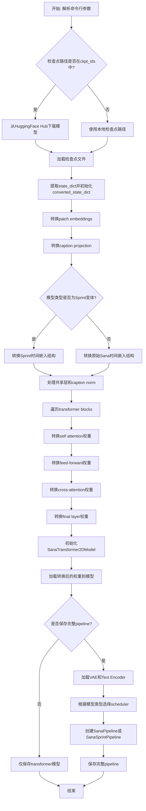

## 类结构

```
全局区域
├── CTX (上下文管理器)
├── ckpt_ids (检查点ID列表)
├── DTYPE_MAPPING (数据类型映射)
└── main(args) (主转换函数)
    ├── 检查点加载逻辑
    ├── 状态字典转换逻辑
    │   ├── patch_embed转换
    │   ├── caption_projection转换
    │   ├── time_embed转换
    │   ├── transformer_blocks转换
    │   └── final_layer转换
    ├── 模型初始化
    └── pipeline保存逻辑
```

## 全局变量及字段


### `CTX`
    
根据accelerate库可用性选择的上下文管理器，用于初始化空权重或空操作

类型：`contextlib.contextmanager`
    


### `ckpt_ids`
    
预定义的HuggingFace检查点ID列表，包含各种Sana模型变体的路径

类型：`List[str]`
    


### `DTYPE_MAPPING`
    
字符串到PyTorch数据类型的映射字典，用于转换权重数据类型

类型：`Dict[str, torch.dtype]`
    


### `cache_dir_path`
    
HuggingFace模型缓存目录的路径

类型：`str`
    


### `ckpt_id`
    
当前选择的检查点完整标识符

类型：`str`
    


### `file_path`
    
检查点文件的本地路径

类型：`str`
    


### `all_state_dict`
    
从检查点文件加载的完整状态字典

类型：`Dict[str, Any]`
    


### `state_dict`
    
从all_state_dict中提取的模型权重字典

类型：`Dict[str, torch.Tensor]`
    


### `converted_state_dict`
    
转换后的状态字典，将原始检查点键映射到Diffusers格式

类型：`Dict[str, torch.Tensor]`
    


### `flow_shift`
    
流匹配调度器的偏移参数，根据图像尺寸设置

类型：`float`
    


### `layer_num`
    
Transformer模型的层数，根据模型类型确定

类型：`int`
    


### `interpolation_scale`
    
不同图像尺寸的插值比例映射

类型：`Dict[int, Optional[float]]`
    


### `qk_norm`
    
QK归一化类型，用于某些Sana变体

类型：`Optional[str]`
    


### `transformer_kwargs`
    
SanaTransformer2DModel的构造参数字典

类型：`Dict[str, Any]`
    


### `transformer`
    
转换后的Diffusers格式Transformer模型

类型：`SanaTransformer2DModel`
    


### `num_model_params`
    
Transformer模型的参数总数

类型：`int`
    


### `weight_dtype`
    
模型权重的目标数据类型

类型：`torch.dtype`
    


### `device`
    
计算设备，优先使用CUDA否则回退到CPU

类型：`str`
    


### `args`
    
命令行参数解析结果，包含所有配置选项

类型：`argparse.Namespace`
    


### `model_kwargs`
    
不同模型类型的超参数配置字典，包含注意力头维度、层数等

类型：`Dict[str, Dict[str, int]]`
    


    

## 全局函数及方法


### `main(args)`

该函数是脚本的核心入口，负责将原始 Sana 模型的检查点转换为 Hugging Face Diffusers 格式。它支持多种模型变体，处理状态字典的映射、模型配置、权重转换，并可选择保存完整的 pipeline 或仅保存 transformer 模型。

参数：

- `args`：`argparse.Namespace`，命令行参数解析结果，包含模型类型、图像大小、检查点路径、输出路径等配置

返回值：`None`，该函数无返回值，主要执行模型转换和保存操作

#### 流程图

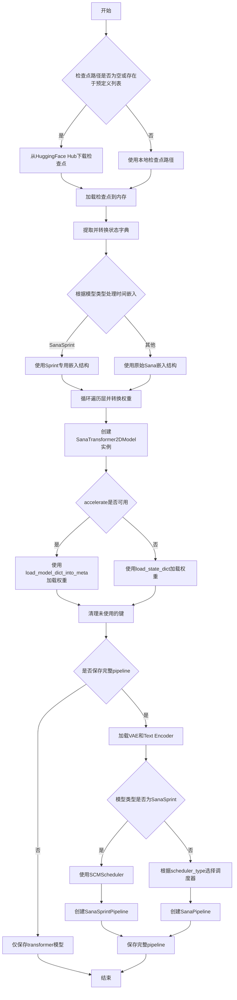

#### 带注释源码

```python
def main(args):
    """
    将原始Sana模型检查点转换为Diffusers格式
    主要流程：下载/加载检查点 -> 转换权重 -> 创建模型 -> 保存
    """
    # 1. 确定检查点路径
    cache_dir_path = os.path.expanduser("~/.cache/huggingface/hub")

    # 判断是否需要从HuggingFace Hub下载
    if args.orig_ckpt_path is None or args.orig_ckpt_path in ckpt_ids:
        # 使用预定义的检查点ID列表
        ckpt_id = args.orig_ckpt_path or ckpt_ids[0]
        # 下载模型快照到缓存目录
        snapshot_download(
            repo_id=f"{'/'.join(ckpt_id.split('/')[:2])}",  # 提取repo_id部分
            cache_dir=cache_dir_path,
            repo_type="model",
        )
        # 下载具体的检查点文件
        file_path = hf_hub_download(
            repo_id=f"{'/'.join(ckpt_id.split('/')[:2])}",
            filename=f"{'/'.join(ckpt_id.split('/')[2:])}",  # 提取文件路径
            cache_dir=cache_dir_path,
            repo_type="model",
        )
    else:
        # 使用本地检查点路径
        file_path = args.orig_ckpt_path

    # 2. 加载检查点
    print(colored(f"Loading checkpoint from {file_path}", "green", attrs=["bold"]))
    all_state_dict = torch.load(file_path, weights_only=True)  # 只加载权重，不加载优化器状态
    state_dict = all_state_dict.pop("state_dict")  # 提取state_dict
    converted_state_dict = {}  # 存储转换后的权重

    # 3. 转换状态字典 - patch embeddings
    converted_state_dict["patch_embed.proj.weight"] = state_dict.pop("x_embedder.proj.weight")
    converted_state_dict["patch_embed.proj.bias"] = state_dict.pop("x_embedder.proj.bias")

    # 4. 转换 caption projection
    converted_state_dict["caption_projection.linear_1.weight"] = state_dict.pop("y_embedder.y_proj.fc1.weight")
    converted_state_dict["caption_projection.linear_1.bias"] = state_dict.pop("y_embedder.y_proj.fc1.bias")
    converted_state_dict["caption_projection.linear_2.weight"] = state_dict.pop("y_embedder.y_proj.fc2.weight")
    converted_state_dict["caption_projection.linear_2.bias"] = state_dict.pop("y_embedder.y_proj.fc2.bias")

    # 5. 处理不同模型类型的时间嵌入结构
    if args.model_type in ["SanaSprint_1600M_P1_D20", "SanaSprint_600M_P1_D28"]:
        # Sprint模型使用不同的时间嵌入结构
        converted_state_dict["time_embed.timestep_embedder.linear_1.weight"] = state_dict.pop(
            "t_embedder.mlp.0.weight"
        )
        converted_state_dict["time_embed.timestep_embedder.linear_1.bias"] = state_dict.pop("t_embedder.mlp.0.bias")
        converted_state_dict["time_embed.timestep_embedder.linear_2.weight"] = state_dict.pop(
            "t_embedder.mlp.2.weight"
        )
        converted_state_dict["time_embed.timestep_embedder.linear_2.bias"] = state_dict.pop("t_embedder.mlp.2.bias")

        # Sprint模型的guidance embedder
        converted_state_dict["time_embed.guidance_embedder.linear_1.weight"] = state_dict.pop(
            "cfg_embedder.mlp.0.weight"
        )
        converted_state_dict["time_embed.guidance_embedder.linear_1.bias"] = state_dict.pop("cfg_embedder.mlp.0.bias")
        converted_state_dict["time_embed.guidance_embedder.linear_2.weight"] = state_dict.pop(
            "cfg_embedder.mlp.2.weight"
        )
        converted_state_dict["time_embed.guidance_embedder.linear_2.bias"] = state_dict.pop("cfg_embedder.mlp.2.bias")
    else:
        # 原始Sana时间嵌入结构
        converted_state_dict["time_embed.emb.timestep_embedder.linear_1.weight"] = state_dict.pop(
            "t_embedder.mlp.0.weight"
        )
        converted_state_dict["time_embed.emb.timestep_embedder.linear_1.bias"] = state_dict.pop(
            "t_embedder.mlp.0.bias"
        )
        converted_state_dict["time_embed.emb.timestep_embedder.linear_2.weight"] = state_dict.pop(
            "t_embedder.mlp.2.weight"
        )
        converted_state_dict["time_embed.emb.timestep_embedder.linear_2.bias"] = state_dict.pop(
            "t_embedder.mlp.2.bias"
        )

    # 6. 共享归一化层
    converted_state_dict["time_embed.linear.weight"] = state_dict.pop("t_block.1.weight")
    converted_state_dict["time_embed.linear.bias"] = state_dict.pop("t_block.1.bias")

    # 7. Caption归一化
    converted_state_dict["caption_norm.weight"] = state_dict.pop("attention_y_norm.weight")

    # 8. 根据图像大小确定flow_shift参数
    if args.image_size == 4096:
        flow_shift = 6.0
    else:
        flow_shift = 3.0

    # 9. 根据模型类型确定层数
    if args.model_type in ["SanaMS_1600M_P1_D20", "SanaSprint_1600M_P1_D20", "SanaMS1.5_1600M_P1_D20"]:
        layer_num = 20
    elif args.model_type in ["SanaMS_600M_P1_D28", "SanaSprint_600M_P1_D28"]:
        layer_num = 28
    elif args.model_type == "SanaMS_4800M_P1_D60":
        layer_num = 60
    else:
        raise ValueError(f"{args.model_type} is not supported.")

    # 10. 设置位置嵌入插值缩放
    interpolation_scale = {512: None, 1024: None, 2048: 1.0, 4096: 2.0}
    
    # 11. 确定是否需要QK归一化
    qk_norm = (
        "rms_norm_across_heads"
        if args.model_type
        in ["SanaMS1.5_1600M_P1_D20", "SanaMS1.5_4800M_P1_D60", "SanaSprint_600M_P1_D28", "SanaSprint_1600M_P1_D20"]
        else None
    )

    # 12. 遍历每一层进行权重转换
    for depth in range(layer_num):
        # Transformer blocks - scale shift table
        converted_state_dict[f"transformer_blocks.{depth}.scale_shift_table"] = state_dict.pop(
            f"blocks.{depth}.scale_shift_table"
        )

        # 自注意力 - 分割QKV权重
        q, k, v = torch.chunk(state_dict.pop(f"blocks.{depth}.attn.qkv.weight"), 3, dim=0)
        converted_state_dict[f"transformer_blocks.{depth}.attn1.to_q.weight"] = q
        converted_state_dict[f"transformer_blocks.{depth}.attn1.to_k.weight"] = k
        converted_state_dict[f"transformer_blocks.{depth}.attn1.to_v.weight"] = v
        
        # QK归一化（如果需要）
        if qk_norm is not None:
            converted_state_dict[f"transformer_blocks.{depth}.attn1.norm_q.weight"] = state_dict.pop(
                f"blocks.{depth}.attn.q_norm.weight"
            )
            converted_state_dict[f"transformer_blocks.{depth}.attn1.norm_k.weight"] = state_dict.pop(
                f"blocks.{depth}.attn.k_norm.weight"
            )

        # 投影层
        converted_state_dict[f"transformer_blocks.{depth}.attn1.to_out.0.weight"] = state_dict.pop(
            f"blocks.{depth}.attn.proj.weight"
        )
        converted_state_dict[f"transformer_blocks.{depth}.attn1.to_out.0.bias"] = state_dict.pop(
            f"blocks.{depth}.attn.proj.bias"
        )

        # 前馈网络 - 线性注意力
        converted_state_dict[f"transformer_blocks.{depth}.ff.conv_inverted.weight"] = state_dict.pop(
            f"blocks.{depth}.mlp.inverted_conv.conv.weight"
        )
        converted_state_dict[f"transformer_blocks.{depth}.ff.conv_inverted.bias"] = state_dict.pop(
            f"blocks.{depth}.mlp.inverted_conv.conv.bias"
        )
        converted_state_dict[f"transformer_blocks.{depth}.ff.conv_depth.weight"] = state_dict.pop(
            f"blocks.{depth}.mlp.depth_conv.conv.weight"
        )
        converted_state_dict[f"transformer_blocks.{depth}.ff.conv_depth.bias"] = state_dict.pop(
            f"blocks.{depth}.mlp.depth_conv.conv.bias"
        )
        converted_state_dict[f"transformer_blocks.{depth}.ff.conv_point.weight"] = state_dict.pop(
            f"blocks.{depth}.mlp.point_conv.conv.weight"
        )

        # 交叉注意力
        q = state_dict.pop(f"blocks.{depth}.cross_attn.q_linear.weight")
        q_bias = state_dict.pop(f"blocks.{depth}.cross_attn.q_linear.bias")
        k, v = torch.chunk(state_dict.pop(f"blocks.{depth}.cross_attn.kv_linear.weight"), 2, dim=0)
        k_bias, v_bias = torch.chunk(state_dict.pop(f"blocks.{depth}.cross_attn.kv_linear.bias"), 2, dim=0)

        converted_state_dict[f"transformer_blocks.{depth}.attn2.to_q.weight"] = q
        converted_state_dict[f"transformer_blocks.{depth}.attn2.to_q.bias"] = q_bias
        converted_state_dict[f"transformer_blocks.{depth}.attn2.to_k.weight"] = k
        converted_state_dict[f"transformer_blocks.{depth}.attn2.to_k.bias"] = k_bias
        converted_state_dict[f"transformer_blocks.{depth}.attn2.to_v.weight"] = v
        converted_state_dict[f"transformer_blocks.{depth}.attn2.to_v.bias"] = v_bias
        
        # 交叉注意力QK归一化
        if qk_norm is not None:
            converted_state_dict[f"transformer_blocks.{depth}.attn2.norm_q.weight"] = state_dict.pop(
                f"blocks.{depth}.cross_attn.q_norm.weight"
            )
            converted_state_dict[f"transformer_blocks.{depth}.attn2.norm_k.weight"] = state_dict.pop(
                f"blocks.{depth}.cross_attn.k_norm.weight"
            )

        converted_state_dict[f"transformer_blocks.{depth}.attn2.to_out.0.weight"] = state_dict.pop(
            f"blocks.{depth}.cross_attn.proj.weight"
        )
        converted_state_dict[f"transformer_blocks.{depth}.attn2.to_out.0.bias"] = state_dict.pop(
            f"blocks.{depth}.cross_attn.proj.bias"
        )

    # 13. 最终输出层
    converted_state_dict["proj_out.weight"] = state_dict.pop("final_layer.linear.weight")
    converted_state_dict["proj_out.bias"] = state_dict.pop("final_layer.linear.bias")
    converted_state_dict["scale_shift_table"] = state_dict.pop("final_layer.scale_shift_table")

    # 14. 创建Transformer模型
    with CTX():  # 使用空权重上下文（如果accelerate可用）
        transformer_kwargs = {
            "in_channels": 32,
            "out_channels": 32,
            "num_attention_heads": model_kwargs[args.model_type]["num_attention_heads"],
            "attention_head_dim": model_kwargs[args.model_type]["attention_head_dim"],
            "num_layers": model_kwargs[args.model_type]["num_layers"],
            "num_cross_attention_heads": model_kwargs[args.model_type]["num_cross_attention_heads"],
            "cross_attention_head_dim": model_kwargs[args.model_type]["cross_attention_head_dim"],
            "cross_attention_dim": model_kwargs[args.model_type]["cross_attention_dim"],
            "caption_channels": 2304,
            "mlp_ratio": 2.5,
            "attention_bias": False,
            "sample_size": args.image_size // 32,
            "patch_size": 1,
            "norm_elementwise_affine": False,
            "norm_eps": 1e-6,
            "interpolation_scale": interpolation_scale[args.image_size],
        }

        # Sprint模型添加qk_norm参数
        if args.model_type in [
            "SanaMS1.5_1600M_P1_D20",
            "SanaMS1.5_4800M_P1_D60",
            "SanaSprint_600M_P1_D28",
            "SanaSprint_1600M_P1_D20",
        ]:
            transformer_kwargs["qk_norm"] = "rms_norm_across_heads"
        
        # Sprint模型需要guidance_embeds
        if args.model_type in ["SanaSprint_1600M_P1_D20", "SanaSprint_600M_P1_D28"]:
            transformer_kwargs["guidance_embeds"] = True

        transformer = SanaTransformer2DModel(**transformer_kwargs)

    # 15. 加载权重到模型
    if is_accelerate_available():
        load_model_dict_into_meta(transformer, converted_state_dict)
    else:
        transformer.load_state_dict(converted_state_dict, strict=True, assign=True)

    # 16. 清理可选的键
    try:
        state_dict.pop("y_embedder.y_embedding")
        state_dict.pop("pos_embed")
        state_dict.pop("logvar_linear.weight")
        state_dict.pop("logvar_linear.bias")
    except KeyError:
        print("y_embedder.y_embedding or pos_embed not found in the state_dict")

    # 17. 验证所有键都已处理
    assert len(state_dict) == 0, f"State dict is not empty, {state_dict.keys()}"

    # 18. 打印模型参数量
    num_model_params = sum(p.numel() for p in transformer.parameters())
    print(f"Total number of transformer parameters: {num_model_params}")

    # 19. 转换权重数据类型
    transformer = transformer.to(weight_dtype)

    # 20. 根据选项保存模型
    if not args.save_full_pipeline:
        # 仅保存transformer
        print(
            colored(
                f"Only saving transformer model of {args.model_type}. "
                f"Set --save_full_pipeline to save the whole Pipeline",
                "green",
                attrs=["bold"],
            )
        )
        transformer.save_pretrained(
            os.path.join(args.dump_path, "transformer"), safe_serialization=True, max_shard_size="5GB"
        )
    else:
        # 保存完整pipeline
        print(colored(f"Saving the whole Pipeline containing {args.model_type}", "green", attrs=["bold"]))
        
        # 加载VAE
        ae = AutoencoderDC.from_pretrained("mit-han-lab/dc-ae-f32c32-sana-1.1-diffusers", torch_dtype=torch.float32)

        # 加载Text Encoder
        text_encoder_model_path = "Efficient-Large-Model/gemma-2-2b-it"
        tokenizer = AutoTokenizer.from_pretrained(text_encoder_model_path)
        tokenizer.padding_side = "right"
        text_encoder = AutoModelForCausalLM.from_pretrained(
            text_encoder_model_path, torch_dtype=torch.bfloat16
        ).get_decoder()

        # 根据模型类型选择pipeline和scheduler
        if args.model_type in ["SanaSprint_1600M_P1_D20", "SanaSprint_600M_P1_D28"]:
            # Sprint模型强制使用SCM Scheduler
            if args.scheduler_type != "scm":
                print(
                    colored(
                        f"Warning: Overriding scheduler_type '{args.scheduler_type}' to 'scm' for SanaSprint model",
                        "yellow",
                        attrs=["bold"],
                    )
                )

            scheduler_config = {
                "prediction_type": "trigflow",
                "sigma_data": 0.5,
            }
            scheduler = SCMScheduler(**scheduler_config)
            pipe = SanaSprintPipeline(
                tokenizer=tokenizer,
                text_encoder=text_encoder,
                transformer=transformer,
                vae=ae,
                scheduler=scheduler,
            )
        else:
            # 原始Sana scheduler
            if args.scheduler_type == "flow-dpm_solver":
                scheduler = DPMSolverMultistepScheduler(
                    flow_shift=flow_shift,
                    use_flow_sigmas=True,
                    prediction_type="flow_prediction",
                )
            elif args.scheduler_type == "flow-euler":
                scheduler = FlowMatchEulerDiscreteScheduler(shift=flow_shift)
            else:
                raise ValueError(f"Scheduler type {args.scheduler_type} is not supported")

            pipe = SanaPipeline(
                tokenizer=tokenizer,
                text_encoder=text_encoder,
                transformer=transformer,
                vae=ae,
                scheduler=scheduler,
            )

        # 保存完整pipeline
        pipe.save_pretrained(args.dump_path, safe_serialization=True, max_shard_size="5GB")
```


### `hf_hub_download`

从Hugging Face Hub下载指定模型文件的函数，负责从远程仓库获取模型权重并缓存到本地。

参数：

- `repo_id`：`str`，Hugging Face Hub上的仓库标识符，格式为"namespace/repo_name"
- `filename`：`str`，要下载的文件名（包括路径）
- `cache_dir`：`str`，本地缓存目录路径，用于存储下载的文件
- `repo_type`：`str`，仓库类型，默认为"model"，还可为"dataset"、"space"等

返回值：`str`，下载到本地缓存目录后的文件完整路径

#### 流程图

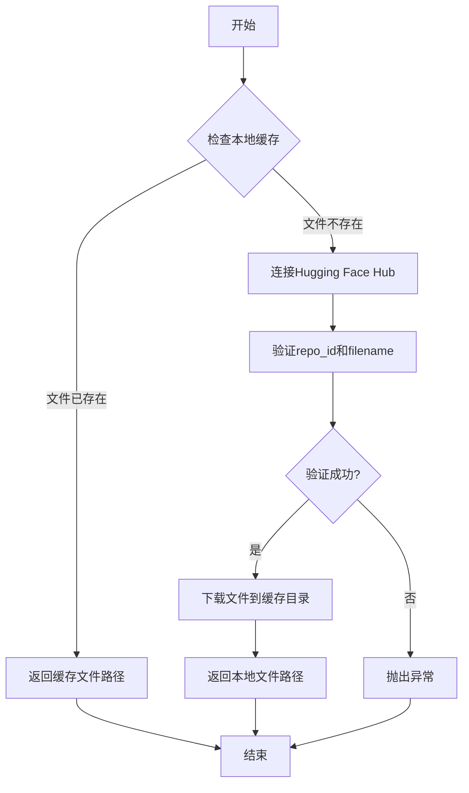

#### 带注释源码

```python
# 从huggingface_hub库导入hf_hub_download函数
# 该函数用于从Hugging Face Hub下载模型文件到本地缓存
from huggingface_hub import hf_hub_download, snapshot_download

# ...

def main(args):
    # ...
    
    # 如果未指定checkpoint路径或路径在预定义列表中，则从Hub下载
    if args.orig_ckpt_path is None or args.orig_ckpt_path in ckpt_ids:
        ckpt_id = args.orig_ckpt_path or ckpt_ids[0]
        
        # 首先下载整个仓库快照（确保所有依赖文件可用）
        snapshot_download(
            repo_id=f"{'/'.join(ckpt_id.split('/')[:2])}",  # 提取仓库命名空间和名称
            cache_dir=cache_dir_path,  # 指定缓存目录
            repo_type="model",  # 指定仓库类型为模型
        )
        
        # 核心：下载指定的checkpoint文件
        file_path = hf_hub_download(
            repo_id=f"{'/'.join(ckpt_id.split('/')[:2])}",  # Hugging Face仓库ID
            filename=f"{'/'.join(ckpt_id.split('/')[2:])}",  # 要下载的文件名（相对路径）
            cache_dir=cache_dir_path,  # 本地缓存目录
            repo_type="model",  # 仓库类型
        )
    else:
        # 使用本地指定的checkpoint路径
        file_path = args.orig_ckpt_path

    # 打印下载完成信息
    print(colored(f"Loading checkpoint from {file_path}", "green", attrs=["bold"]))
    
    # 加载下载的checkpoint文件
    all_state_dict = torch.load(file_path, weights_only=True)
```


### `snapshot_download`

从 Hugging Face Hub 下载模型仓库的完整快照（所有文件），在此脚本中用于将指定的 Sana 模型仓库下载到本地缓存目录。

参数：

- `repo_id`：`str`，Hugging Face Hub 上的模型仓库 ID，格式为“{namespace}/{repo_name}”，从此脚本的 `ckpt_id` 变量中提取前两部分得到
- `cache_dir`：`str`，本地缓存目录路径，设置为 `~/.cache/huggingface/hub`
- `repo_type`：`str`，仓库类型，指定为 `"model"` 表示模型仓库

返回值：`str`，返回下载的仓库本地缓存路径（在此脚本中未直接使用其返回值）

#### 流程图

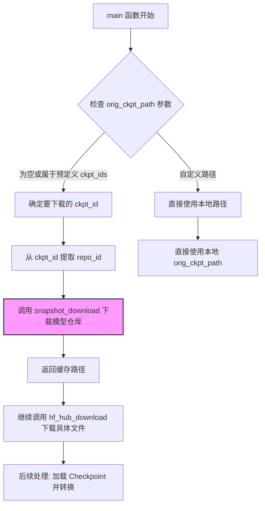

#### 带注释源码

```python
# 在 main 函数中调用 snapshot_download 的上下文
def main(args):
    # 扩展用户缓存目录路径
    cache_dir_path = os.path.expanduser("~/.cache/huggingface/hub")

    # 判断是否需要从 Hugging Face Hub 下载模型
    if args.orig_ckpt_path is None or args.orig_ckpt_path in ckpt_ids:
        # 确定要下载的 checkpoint ID，默认为第一个
        ckpt_id = args.orig_ckpt_path or ckpt_ids[0]
        
        # ========== snapshot_download 调用开始 ==========
        # 功能：下载整个模型仓库到本地缓存
        # 参数说明：
        #   repo_id: 仓库标识符，从 ckpt_id 提取前两部分
        #            例如 "Efficient-Large-Model/Sana_Sprint_0.6B_1024px"
        #   cache_dir: 缓存存放目录 "~/.cache/huggingface/hub"
        #   repo_type: 指定为 "model" 类型仓库
        snapshot_download(
            repo_id=f"{'/'.join(ckpt_id.split('/')[:2])}",  # 提取 "namespace/repo_name" 部分
            cache_dir=cache_dir_path,
            repo_type="model",
        )
        # ========== snapshot_download 调用结束 ==========
        
        # 继续下载具体的 checkpoint 文件
        file_path = hf_hub_download(
            repo_id=f"{'/'.join(ckpt_id.split('/')[:2])}",
            filename=f"{'/'.join(ckpt_id.split('/')[2:])}",  # 提取路径部分作为文件名
            cache_dir=cache_dir_path,
            repo_type="model",
        )
    else:
        # 如果提供了本地路径，则直接使用本地 checkpoint 文件
        file_path = args.orig_ckpt_path

    # 后续处理：加载并转换模型权重...
```


### `torch.load`

这是 PyTorch 中用于加载序列化模型检查点文件的函数，将磁盘上的 `.pth` 或 `.pt` 文件重新加载为 Python 对象（通常是字典）。

参数：

-  `file_path`：`str`，要加载的检查点文件路径，即从 Hugging Face Hub 下载的模型权重文件路径
-  `weights_only`：`bool`，如果设为 `True`，则只加载张量、字典等基本数据类型，不加载 Python 对象（如自定义类实例），可以防止潜在的安全风险

返回值：`dict`，返回包含整个检查点内容的字典，在本代码中用于获取 `state_dict` 键下的模型权重

#### 流程图

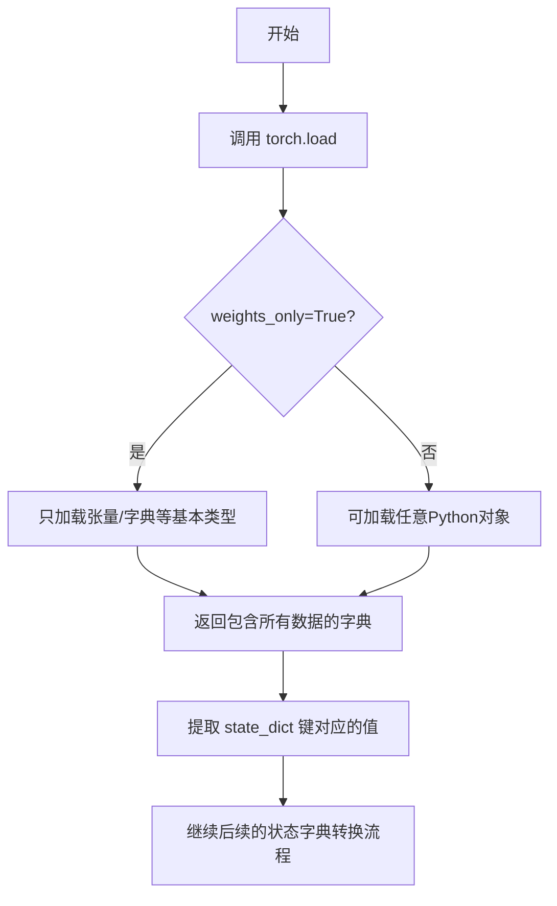

#### 带注释源码

```python
# 从文件路径加载模型检查点
# 参数 file_path: 检查点文件的完整路径（从 Hugging Face Hub 下载的 .pth 文件）
# 参数 weights_only=True: 仅加载张量等基本数据类型，不加载自定义 Python 对象，提高安全性
all_state_dict = torch.load(file_path, weights_only=True)

# 从完整的检查点字典中提取 'state_dict' 键对应的模型权重
# 这个 state_dict 包含了模型的所有参数（权重和偏置）
state_dict = all_state_dict.pop("state_dict")

# 初始化一个空字典用于存储转换后的权重
# 因为原始检查点的键名与 Diffusers 格式不同，需要进行映射转换
converted_state_dict = {}
```


### `SanaTransformer2DModel`

这是从 `diffusers` 库导入的 Transformer 模型类，在脚本中通过 `transformer_kwargs` 字典进行参数化配置并实例化，用于构建 Sana 图像生成模型的核心 Transformer 组件。

参数：

- `in_channels`：`int`，输入通道数，值为 32
- `out_channels`：`int`，输出通道数，值为 32
- `num_attention_heads`：`int`，自注意力头数，根据 model_type 从 model_kwargs 字典获取
- `attention_head_dim`：`int`，注意力头维度，根据 model_type 从 model_kwargs 字典获取
- `num_layers`：`int`，Transformer 块数量，根据 model_type 从 model_kwargs 字典获取
- `num_cross_attention_heads`：`int`，交叉注意力头数，根据 model_type 从 model_kwargs 字典获取
- `cross_attention_head_dim`：`int`，交叉注意力头维度，根据 model_type 从 model_kwargs 字典获取
- `cross_attention_dim`：`int`，交叉注意力维度，根据 model_type 从 model_kwargs 字典获取
- `caption_channels`：`int`，Caption 投影通道数，固定为 2304
- `mlp_ratio`：`float`，MLP 扩展比率，固定为 2.5
- `attention_bias`：`bool`，注意力 bias 标志，固定为 False
- `sample_size`：`int`，样本尺寸，等于 args.image_size // 32
- `patch_size`：`int`，Patch 大小，固定为 1
- `norm_elementwise_affine`：`bool`，归一化是否使用仿射变换，固定为 False
- `norm_eps`：`float`，归一化 epsilon 值，固定为 1e-6
- `interpolation_scale`：`float` 或 `None`，位置嵌入插值缩放因子，根据 image_size 从 interpolation_scale 字典获取
- `qk_norm`：`str` 或 `None`，QK 归一化类型，当 model_type 为特定 Sana Sprint 或 Sana 1.5 模型时设置为 "rms_norm_across_heads"
- `guidance_embeds`：`bool`，是否启用 guidance 嵌入，当 model_type 为 "SanaSprint_1600M_P1_D20" 或 "SanaSprint_600M_P1_D28" 时为 True

返回值：`SanaTransformer2DModel`，返回配置好的 Sana Transformer 2D 模型实例

#### 流程图

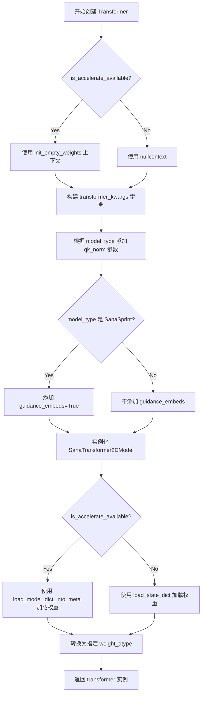

#### 带注释源码

```python
# 构建 Transformer 模型参数字典
transformer_kwargs = {
    "in_channels": 32,  # 输入通道数
    "out_channels": 32,  # 输出通道数
    "num_attention_heads": model_kwargs[args.model_type]["num_attention_heads"],  # 自注意力头数
    "attention_head_dim": model_kwargs[args.model_type]["attention_head_dim"],  # 注意力头维度
    "num_layers": model_kwargs[args.model_type]["num_layers"],  # Transformer 层数
    "num_cross_attention_heads": model_kwargs[args.model_type]["num_cross_attention_heads"],  # 交叉注意力头数
    "cross_attention_head_dim": model_kwargs[args.model_type]["cross_attention_head_dim"],  # 交叉注意力头维度
    "cross_attention_dim": model_kwargs[args.model_type]["cross_attention_dim"],  # 交叉注意力维度
    "caption_channels": 2304,  # Caption 投影通道数
    "mlp_ratio": 2.5,  # MLP 扩展比率
    "attention_bias": False,  # 是否使用注意力偏置
    "sample_size": args.image_size // 32,  # 样本尺寸（图像大小除以下采样因子）
    "patch_size": 1,  # Patch 大小
    "norm_elementwise_affine": False,  # 归一化是否使用仿射变换
    "norm_eps": 1e-6,  # 归一化 epsilon
    "interpolation_scale": interpolation_scale[args.image_size],  # 位置嵌入插值缩放因子
}

# 为特定模型添加 QK 归一化参数（Sana Sprint 和 Sana 1.5 系列）
if args.model_type in [
    "SanaMS1.5_1600M_P1_D20",
    "SanaMS1.5_4800M_P1_D60",
    "SanaSprint_600M_P1_D28",
    "SanaSprint_1600M_P1_D20",
]:
    transformer_kwargs["qk_norm"] = "rms_norm_across_heads"

# 为 Sana Sprint 模型添加 guidance 嵌入支持
if args.model_type in ["SanaSprint_1600M_P1_D20", "SanaSprint_600M_P1_D28"]:
    transformer_kwargs["guidance_embeds"] = True

# 使用上下文管理器（根据 accelerate 可用性选择）
with CTX():
    # 创建 SanaTransformer2DModel 实例
    transformer = SanaTransformer2DModel(**transformer_kwargs)

# 根据是否使用 accelerate 加载权重
if is_accelerate_available():
    load_model_dict_into_meta(transformer, converted_state_dict)  # 分布式加载
else:
    transformer.load_state_dict(converted_state_dict, strict=True, assign=True)  # 直接加载

# 将模型转换为指定的权重数据类型
transformer = transformer.to(weight_dtype)
```


### `load_model_dict_into_meta`

该函数用于将转换后的状态字典（state_dict）加载到使用 `init_empty_weights` 上下文管理器创建的空权重模型（meta 设备上的模型）中。这是 accelerate 库提供的一种高效加载大模型的方法，可以避免一次性将整个模型加载到内存中。

参数：

- `transformer`：`SanaTransformer2DModel`，目标模型对象，通常是在 `init_empty_weights()` 上下文中创建的空权重模型
- `converted_state_dict`：`dict`，已经转换好的模型状态字典，包含模型各层的权重参数

返回值：无返回值（`None`），该函数直接修改 `transformer` 模型对象，将状态字典中的权重加载到模型中

#### 流程图

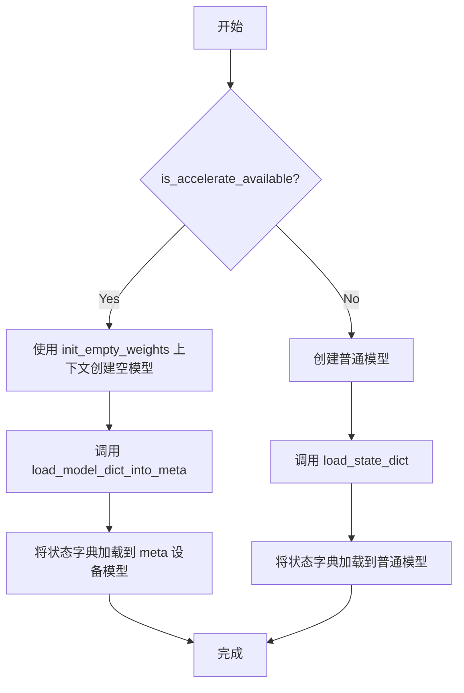

#### 带注释源码

```python
# 在代码中的使用方式：
# 这段代码展示了对 load_model_dict_into_meta 函数的调用逻辑

if is_accelerate_available():
    # 当 accelerate 库可用时，使用 init_empty_weights 上下文
    # 在这个上下文中，transformer 是一个没有实际权重的空模型（位于 meta 设备上）
    # load_model_dict_into_meta 会将 converted_state_dict 中的权重
    # 高效地加载到这个空模型中
    load_model_dict_into_meta(transformer, converted_state_dict)
else:
    # 当 accelerate 不可用时，直接使用普通的 load_state_dict 方法
    # strict=True 要求状态字典的键与模型参数完全匹配
    # assign=True 表示将状态字典中的张量直接赋值给模型参数
    transformer.load_state_dict(converted_state_dict, strict=True, assign=True)

# 完整的上下文代码示例：
with CTX():
    transformer_kwargs = {
        "in_channels": 32,
        "out_channels": 32,
        "num_attention_heads": model_kwargs[args.model_type]["num_attention_heads"],
        # ... 其他参数
    }
    # 在 init_empty_weights 上下文中创建空模型
    transformer = SanaTransformer2DModel(**transformer_kwargs)

# 然后使用 load_model_dict_into_meta 加载权重
if is_accelerate_available():
    load_model_dict_into_meta(transformer, converted_state_dict)
```

> **注意**：该函数是从 `diffusers.models.model_loading_utils` 导入的外部函数，其完整实现位于 diffusers 库中。文档中展示的是该函数在本项目代码中的调用方式和使用上下文。


### `AutoencoderDC.from_pretrained`

该方法是 `diffusers` 库中 `AutoencoderDC` 类的类方法，用于从 Hugging Face Hub 或本地路径加载预训练的 DC AE（Diffusion-based Autoencoder）模型。在代码中用于加载 Sana 模型的 VAE（变分自编码器）组件。

参数：

-  `pretrained_model_name_or_path`：`str`，Hugging Face Hub 上的模型 ID（例如 "mit-han-lab/dc-ae-f32c32-sana-1.1-diffusers"）或本地模型路径
-  `torch_dtype`：`torch.dtype`，可选参数，指定模型权重加载的数据类型，代码中传入 `torch.float32`

返回值：`AutoencoderDC`，返回加载后的 AutoencoderDC 实例对象

#### 流程图

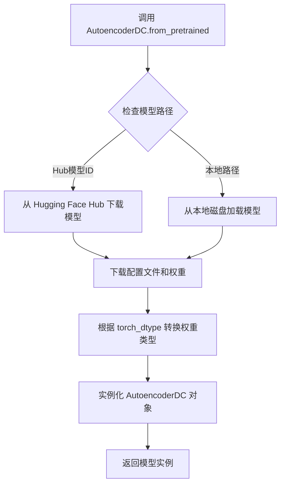

#### 带注释源码

```python
# 在 Sana 流水线保存时的 VAE 模型加载
# 位置：代码第 280 行附近

# 从预训练模型加载 AutoencoderDC
# 参数说明：
#   - 第一个参数：模型在 Hugging Face Hub 上的标识符
#   - torch_dtype：指定模型权重使用 float32 精度加载
ae = AutoencoderDC.from_pretrained(
    "mit-han-lab/dc-ae-f32c32-sana-1.1-diffusers",  # 模型仓库 ID
    torch_dtype=torch.float32  # 权重数据类型为 FP32
)

# 后续该 ae 对象会被传入 SanaPipeline 或 SanaSprintPipeline 中
# 作为 VAE 组件用于图像的编码和解码
```


### `AutoTokenizer.from_pretrained`

从预训练模型路径或HuggingFace Hub加载Tokenizer，用于对文本进行分词处理。

参数：

- `pretrained_model_name_or_path`：`str`，预训练模型在本地磁盘的路径或HuggingFace Hub上的模型ID（代码中传入 `"Efficient-Large-Model/gemma-2-2b-it"`）

返回值：`tokenizer`（类型：`PreTrainedTokenizer`），返回分词器对象，用于将文本转换为模型可处理的token序列。

#### 流程图

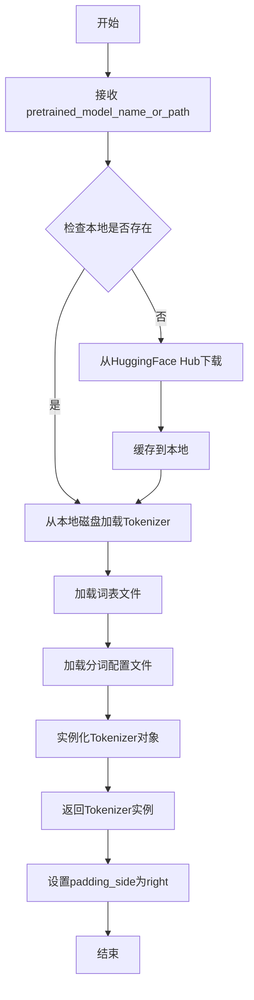

#### 带注释源码

```python
# 从预训练模型路径加载Tokenizer
# 参数 text_encoder_model_path = "Efficient-Large-Model/gemma-2-2b-it"
tokenizer = AutoTokenizer.from_pretrained(text_encoder_model_path)

# 设置padding_side为right，确保在批量生成时padding在序列右侧
tokenizer.padding_side = "right"
```


### `AutoModelForCausalLM.from_pretrained`

这是 Hugging Face Transformers 库中的核心方法，用于从预训练模型仓库加载 Causal LM（因果语言模型）模型权重和配置。在本代码中用于加载文本编码器模型。

参数：

- `pretrained_model_name_or_path`：`str`，模型在 Hugging Face Hub 上的模型 ID（例如 "Efficient-Large-Model/gemma-2-2b-it"）或本地路径
- `torch_dtype`：`torch.dtype`，指定模型权重的数据类型（本代码中为 `torch.bfloat16`）

返回值：`PreTrainedModel`，返回预训练模型对象，随后调用 `.get_decoder()` 获取解码器部分

#### 流程图

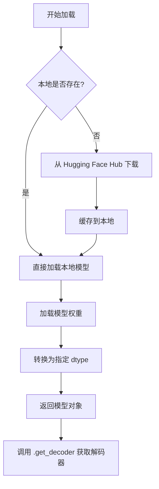

#### 带注释源码

```python
# 定义文本编码器模型的 Hugging Face Hub 路径
text_encoder_model_path = "Efficient-Large-Model/gemma-2-2b-it"

# 加载与模型配套的 tokenizer
tokenizer = AutoTokenizer.from_pretrained(text_encoder_model_path)
# 设置 padding 在右侧（适用于解码器）
tokenizer.padding_side = "right"

# 从预训练模型加载 Causal LM 模型
# 参数：
#   - pretrained_model_name_or_path: "Efficient-Large-Model/gemma-2-2b-it"
#   - torch_dtype: torch.bfloat16 以节省显存
text_encoder = AutoModelForCausalLM.from_pretrained(
    text_encoder_model_path, 
    torch_dtype=torch.bfloat16
).get_decoder()  # 只获取解码器部分用于文本编码
```

#### 详细说明

| 项目 | 说明 |
|------|------|
| **调用位置** | 在 `main` 函数中，约第 244-246 行 |
| **上下文** | 当 `args.save_full_pipeline` 为 True 时，用于加载文本编码器以构建完整的 SanaPipeline |
| **模型类型** | Gemma-2-2b-it（Google 的指令微调版本） |
| **权重精度** | bfloat16（兼顾精度与显存效率） |
| **后续处理** | 调用 `.get_decoder()` 提取解码器部分，因为 Pipeline 只需要解码器而非完整的 Causal LM |
| **设计考量** | 复用预训练语言模型作为文本编码器，减少训练成本 |


### `SanaPipeline`

SanaPipeline是用于 Sana 大型图像生成模型的完整推理管道，整合了分词器、文本编码器、Transformer 主干网络、VAE 解码器和调度器，支持多种调度算法（如 DPM Solver 和 Euler）进行高效的高分辨率图像合成。

参数：

- `tokenizer`：`PreTrainedTokenizer`，用于将文本提示转换为模型可处理的 token 序列
- `text_encoder`：`PreTrainedModel`，将 token 序列编码为文本嵌入向量，供 Transformer 使用
- `transformer`：`SanaTransformer2DModel`， Sana 的核心 Diffusion Transformer 主干网络，负责基于文本嵌入和噪声潜在表示进行去噪生成
- `vae`：`AutoencoderDC`，DC 变分自编码器，负责将潜在表示解码为最终图像
- `scheduler`：`SchedulerMixin`， Diffusion 调度器（如 DPMSolverMultistepScheduler、FlowMatchEulerDiscreteScheduler），控制去噪过程的采样步骤和噪声调度策略

返回值：`SanaPipeline`，返回配置完整的管道对象，可直接调用进行文本到图像生成

#### 流程图

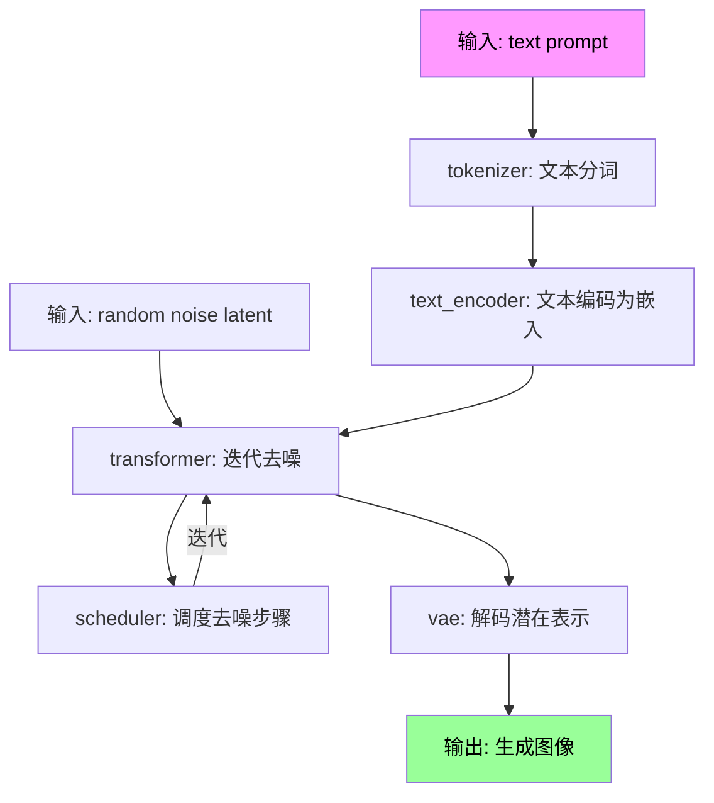

#### 带注释源码

```python
# 源代码位于 diffusers 库中，此处展示调用方的创建逻辑
# 当模型类型为非 SanaSprint 时（如 SanaMS_1600M_P1_D20），使用 SanaPipeline

# 根据调度器类型选择合适的调度器
if args.scheduler_type == "flow-dpm_solver":
    # DPM Solver 多步调度器，适合高质量快速采样
    scheduler = DPMSolverMultistepScheduler(
        flow_shift=flow_shift,          # 流匹配偏移量，图像尺寸越大偏移越大
        use_flow_sigmas=True,           # 使用流匹配 sigma 参数
        prediction_type="flow_prediction",  # 预测类型为流预测
    )
elif args.scheduler_type == "flow-euler":
    # Euler 离散调度器，简洁的数值积分方法
    scheduler = FlowMatchEulerDiscreteScheduler(shift=flow_shift)
else:
    raise ValueError(f"Scheduler type {args.scheduler_type} is not supported")

# 创建完整的 SanaPipeline 管道
pipe = SanaPipeline(
    tokenizer=tokenizer,          # 从 gemma-2-2b-it 加载的分词器
    text_encoder=text_encoder,    # Gemma 2B 因果语言模型作为文本编码器
    transformer=transformer,      # 已转换的 SanaTransformer2DModel
    vae=mit-han-lab/dc-ae-f32c32-sana-1.1-diffusers,  # DC 自编码器
    scheduler=scheduler,          # 选择的调度器
)

# 保存完整管道到指定路径
pipe.save_pretrained(args.dump_path, safe_serialization=True, max_shard_size="5GB")
```


### `SanaSprintPipeline` (在转换脚本上下文中的使用)

`SanaSprintPipeline` 是从 `diffusers` 库导入的类，用于创建 Sana Sprint 模型的完整推理 Pipeline。在本转换脚本中，它被实例化以保存包含所有组件（tokenizer、text_encoder、transformer、vae、scheduler）的完整 Diffusers 格式模型。

由于代码中未直接定义 `SanaSprintPipeline` 类本身（仅从 `diffusers` 导入并使用），以下信息基于代码中对 `SanaSprintPipeline` 的调用方式：

#### 流程图

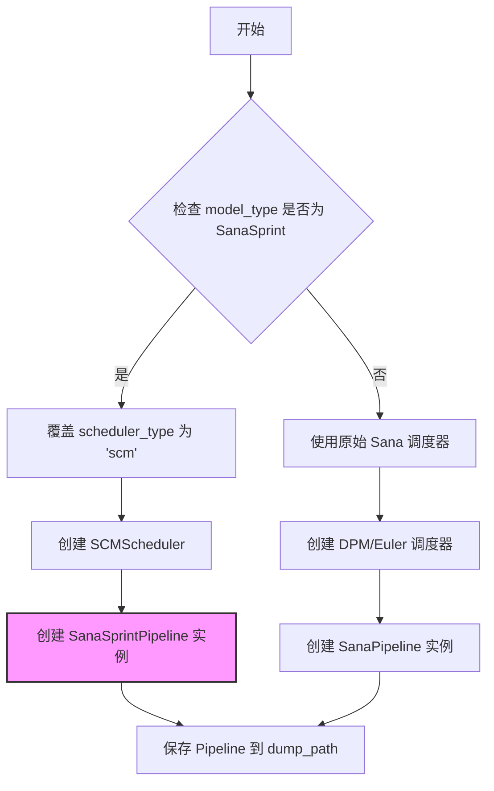

#### 带注释源码

```python
# 从 diffusers 库导入 SanaSprintPipeline 类
from diffusers import SanaSprintPipeline

# 在 main 函数中，当 model_type 为 SanaSprint 类型时：
if args.model_type in ["SanaSprint_1600M_P1_D20", "SanaSprint_600M_P1_D28"]:
    # 强制使用 SCM Scheduler 用于 Sana Sprint 模型
    if args.scheduler_type != "scm":
        print(
            colored(
                f"Warning: Overriding scheduler_type '{args.scheduler_type}' to 'scm' for SanaSprint model",
                "yellow",
                attrs=["bold"],
            )
        )

    # SCM Scheduler 配置，用于 Sana Sprint
    scheduler_config = {
        "prediction_type": "trigflow",
        "sigma_data": 0.5,
    }
    scheduler = SCMScheduler(**scheduler_config)
    
    # 创建 SanaSprintPipeline 实例
    # 参数:
    #   - tokenizer: 用于文本编码的 tokenizer
    #   - text_encoder: 文本编码器模型
    #   - transformer: 已转换的 Sana Transformer 模型
    #   - vae: 变分自编码器
    #   - scheduler: SCM 调度器
    pipe = SanaSprintPipeline(
        tokenizer=tokenizer,
        text_encoder=text_encoder,
        transformer=transformer,
        vae=ae,
        scheduler=scheduler,
    )

# 保存 Pipeline 到指定路径
pipe.save_pretrained(args.dump_path, safe_serialization=True, max_shard_size="5GB")
```

---

### 补充：转换脚本的 `main` 函数

由于 `SanaSprintPipeline` 类定义在外部库中，以下是包含其用法的 `main` 函数详细信息：

#### 流程图

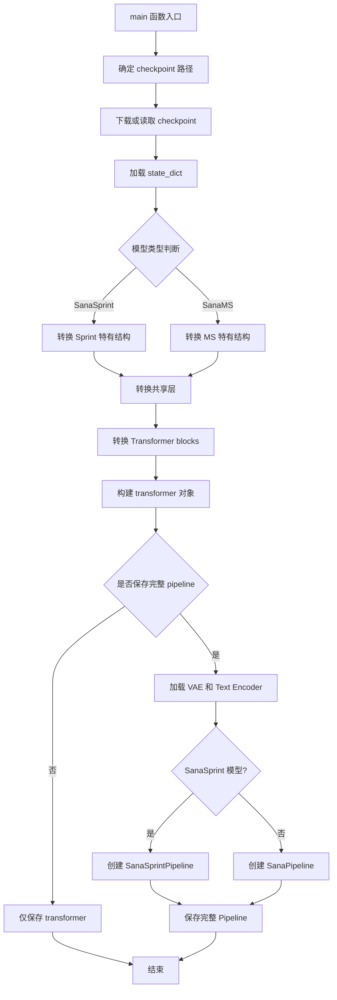

#### 带注释源码

```python
def main(args):
    """
    主转换函数：将原始 Sana/SanaSprint 模型检查点转换为 Diffusers 格式
    
    参数:
        args: 命令行参数对象，包含:
            - orig_ckpt_path: 原始 checkpoint 路径
            - image_size: 图像尺寸
            - model_type: 模型类型
            - scheduler_type: 调度器类型
            - dump_path: 输出路径
            - save_full_pipeline: 是否保存完整 pipeline
            - dtype: 数据类型
    """
    cache_dir_path = os.path.expanduser("~/.cache/huggingface/hub")

    # 1. 处理 checkpoint 路径（下载或本地路径）
    if args.orig_ckpt_path is None or args.orig_ckpt_path in ckpt_ids:
        ckpt_id = args.orig_ckpt_path or ckpt_ids[0]
        snapshot_download(
            repo_id=f"{'/'.join(ckpt_id.split('/')[:2])}",
            cache_dir=cache_dir_path,
            repo_type="model",
        )
        file_path = hf_hub_download(
            repo_id=f"{'/'.join(ckpt_id.split('/')[:2])}",
            filename=f"{'/'.join(ckpt_id.split('/')[2:])}",
            cache_dir=cache_dir_path,
            repo_type="model",
        )
    else:
        file_path = args.orig_ckpt_path

    print(colored(f"Loading checkpoint from {file_path}", "green", attrs=["bold"]))
    
    # 2. 加载并转换 state_dict
    all_state_dict = torch.load(file_path, weights_only=True)
    state_dict = all_state_dict.pop("state_dict")
    converted_state_dict = {}

    # 3. Patch embeddings 转换
    converted_state_dict["patch_embed.proj.weight"] = state_dict.pop("x_embedder.proj.weight")
    converted_state_dict["patch_embed.proj.bias"] = state_dict.pop("x_embedder.proj.bias")

    # 4. Caption projection 转换
    converted_state_dict["caption_projection.linear_1.weight"] = state_dict.pop("y_embedder.y_proj.fc1.weight")
    converted_state_dict["caption_projection.linear_1.bias"] = state_dict.pop("y_embedder.y_proj.fc1.bias")
    converted_state_dict["caption_projection.linear_2.weight"] = state_dict.pop("y_embedder.y_proj.fc2.weight")
    converted_state_dict["caption_projection.linear_2.bias"] = state_dict.pop("y_embedder.y_proj.fc2.bias")

    # 5. 时间嵌入转换（根据模型类型分支）
    if args.model_type in ["SanaSprint_1600M_P1_D20", "SanaSprint_600M_P1_D28"]:
        # Sprint 模型特有结构
        converted_state_dict["time_embed.timestep_embedder.linear_1.weight"] = state_dict.pop("t_embedder.mlp.0.weight")
        converted_state_dict["time_embed.timestep_embedder.linear_1.bias"] = state_dict.pop("t_embedder.mlp.0.bias")
        converted_state_dict["time_embed.timestep_embedder.linear_2.weight"] = state_dict.pop("t_embedder.mlp.2.weight")
        converted_state_dict["time_embed.timestep_embedder.linear_2.bias"] = state_dict.pop("t_embedder.mlp.2.bias")

        # Guidance embedder (Sprint 特有)
        converted_state_dict["time_embed.guidance_embedder.linear_1.weight"] = state_dict.pop("cfg_embedder.mlp.0.weight")
        converted_state_dict["time_embed.guidance_embedder.linear_1.bias"] = state_dict.pop("cfg_embedder.mlp.0.bias")
        converted_state_dict["time_embed.guidance_embedder.linear_2.weight"] = state_dict.pop("cfg_embedder.mlp.2.weight")
        converted_state_dict["time_embed.guidance_embedder.linear_2.bias"] = state_dict.pop("cfg_embedder.mlp.2.bias")
    else:
        # 原始 Sana 结构
        converted_state_dict["time_embed.emb.timestep_embedder.linear_1.weight"] = state_dict.pop("t_embedder.mlp.0.weight")
        converted_state_dict["time_embed.emb.timestep_embedder.linear_1.bias"] = state_dict.pop("t_embedder.mlp.0.bias")
        converted_state_dict["time_embed.emb.timestep_embedder.linear_2.weight"] = state_dict.pop("t_embedder.mlp.2.weight")
        converted_state_dict["time_embed.emb.timestep_embedder.linear_2.bias"] = state_dict.pop("t_embedder.mlp.2.bias")

    # 6. 共享归一化层转换
    converted_state_dict["time_embed.linear.weight"] = state_dict.pop("t_block.1.weight")
    converted_state_dict["time_embed.linear.bias"] = state_dict.pop("t_block.1.bias")
    converted_state_dict["caption_norm.weight"] = state_dict.pop("attention_y_norm.weight")

    # 7. 确定模型层数
    if args.model_type in ["SanaMS_1600M_P1_D20", "SanaSprint_1600M_P1_D20", "SanaMS1.5_1600M_P1_D20"]:
        layer_num = 20
    elif args.model_type in ["SanaMS_600M_P1_D28", "SanaSprint_600M_P1_D28"]:
        layer_num = 28
    elif args.model_type == "SanaMS_4800M_P1_D60":
        layer_num = 60
    else:
        raise ValueError(f"{args.model_type} is not supported.")

    # 8. 遍历转换每个 Transformer block
    for depth in range(layer_num):
        # 自注意力、交叉注意力和前馈网络的权重转换
        # ... (详细的权重映射代码)
        pass

    # 9. 创建 Transformer 模型
    with CTX():
        transformer_kwargs = {
            "in_channels": 32,
            "out_channels": 32,
            # ... 其他参数
        }
        transformer = SanaTransformer2DModel(**transformer_kwargs)

    # 10. 加载权重
    if is_accelerate_available():
        load_model_dict_into_meta(transformer, converted_state_dict)
    else:
        transformer.load_state_dict(converted_state_dict, strict=True, assign=True)

    # 11. 保存模型
    if not args.save_full_pipeline:
        # 仅保存 transformer
        transformer.save_pretrained(...)
    else:
        # 加载额外组件并创建完整 Pipeline
        ae = AutoencoderDC.from_pretrained("mit-han-lab/dc-ae-f32c32-sana-1.1-diffusers", torch_dtype=torch.float32)
        text_encoder_model_path = "Efficient-Large-Model/gemma-2-2b-it"
        tokenizer = AutoTokenizer.from_pretrained(text_encoder_model_path)
        text_encoder = AutoModelForCausalLM.from_pretrained(text_encoder_model_path, torch_dtype=torch.bfloat16).get_decoder()

        # 关键：根据模型类型选择 Pipeline 类
        if args.model_type in ["SanaSprint_1600M_P1_D20", "SanaSprint_600M_P1_D28"]:
            # 对于 Sprint 模型，强制使用 SCM Scheduler
            scheduler = SCMScheduler(prediction_type="trigflow", sigma_data=0.5)
            
            # 创建 SanaSprintPipeline (Sprint 专用)
            pipe = SanaSprintPipeline(
                tokenizer=tokenizer,
                text_encoder=text_encoder,
                transformer=transformer,
                vae=ae,
                scheduler=scheduler,
            )
        else:
            # 原始 Sana 模型使用其他调度器
            if args.scheduler_type == "flow-dpm_solver":
                scheduler = DPMSolverMultistepScheduler(flow_shift=flow_shift, use_flow_sigmas=True, prediction_type="flow_prediction")
            elif args.scheduler_type == "flow-euler":
                scheduler = FlowMatchEulerDiscreteScheduler(shift=flow_shift)
            else:
                raise ValueError(f"Scheduler type {args.scheduler_type} is not supported")

            pipe = SanaPipeline(
                tokenizer=tokenizer,
                text_encoder=text_encoder,
                transformer=transformer,
                vae=ae,
                scheduler=scheduler,
            )

        pipe.save_pretrained(args.dump_path, safe_serialization=True, max_shard_size="5GB")
```


### `SCMScheduler`

SCMScheduler 是来自 Hugging Face diffusers 库的调度器类，用于 Sana 生成模型的采样过程。它实现了 SCM (Signed Consistency Model) 采样算法，支持 "trigflow" 预测类型，专门为 SanaSprint 模型设计。

参数：

-  `**scheduler_config`：关键字参数，调度器配置选项
    - `prediction_type`：字符串，预测类型（代码中传递 "trigflow"）
    - `sigma_data`：浮点数，sigma 数据参数（代码中传递 0.5）

返回值：`Scheduler`，返回一个配置好的调度器实例，用于扩散模型的采样步骤

#### 流程图

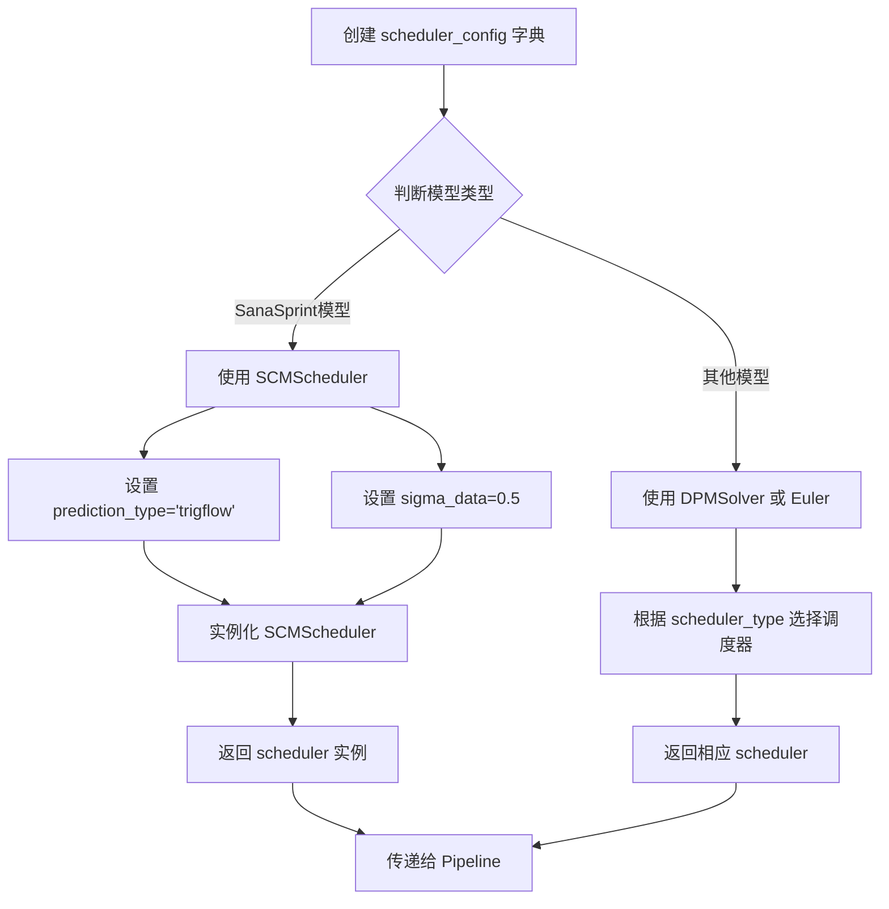

#### 带注释源码

```python
# SCM Scheduler for Sana Sprint
# 当模型类型为 SanaSprint 时，强制使用 SCMScheduler 调度器
# SCM (Signed Consistency Model) 是一种一致性模型采样方法
scheduler_config = {
    "prediction_type": "trigflow",  # 预测类型为 trigflow，用于流匹配
    "sigma_data": 0.5,               # sigma 数据参数，控制噪声水平
}
# 实例化 SCMScheduler 调度器
scheduler = SCMScheduler(**scheduler_config)

# 将调度器传递给 SanaSprintPipeline
pipe = SanaSprintPipeline(
    tokenizer=tokenizer,
    text_encoder=text_encoder,
    transformer=transformer,
    vae=ae,
    scheduler=scheduler,  # 使用配置好的 SCMScheduler
)
```

---

### 注意事项

由于 `SCMScheduler` 是从外部库 (`diffusers`) 导入的类，而非在本文件中定义，以上信息基于：

1. **代码中的使用方式**：在 `main()` 函数中针对 SanaSprint 模型创建调度器的逻辑
2. **导入语句**：`from diffusers import SCMScheduler`
3. **配置参数**：`prediction_type="trigflow"` 和 `sigma_data=0.5`

如需查看 `SCMScheduler` 的完整实现细节，建议参考 [Hugging Face diffusers 官方文档](https://huggingface.co/docs/diffusers/api/schedulers/scm)。


### `DPMSolverMultistepScheduler`

这是来自 diffusers 库的调度器类，在本代码中用于非 Sana Sprint 模型的扩散采样调度，支持 flow-shift 和 flow sigmas 技术来实现高效的图像生成流程。

参数：

- `flow_shift`：`float`，流偏移参数，用于控制流匹配的时间步长平移，影响模型在不同分辨率下的生成质量（代码中根据图像大小设置为 6.0 或 3.0）
- `use_flow_sigmas`：`bool`，是否使用流 sigmas，启用后将使用流匹配版本的 sigma 计算方式
- `prediction_type`：`str`，预测类型，设置为 "flow_prediction" 表示使用流预测（trigflow）

返回值：`DPMSolverMultistepScheduler` 对象，返回配置好的调度器实例，用于 SanaPipeline 的生成流程

#### 流程图

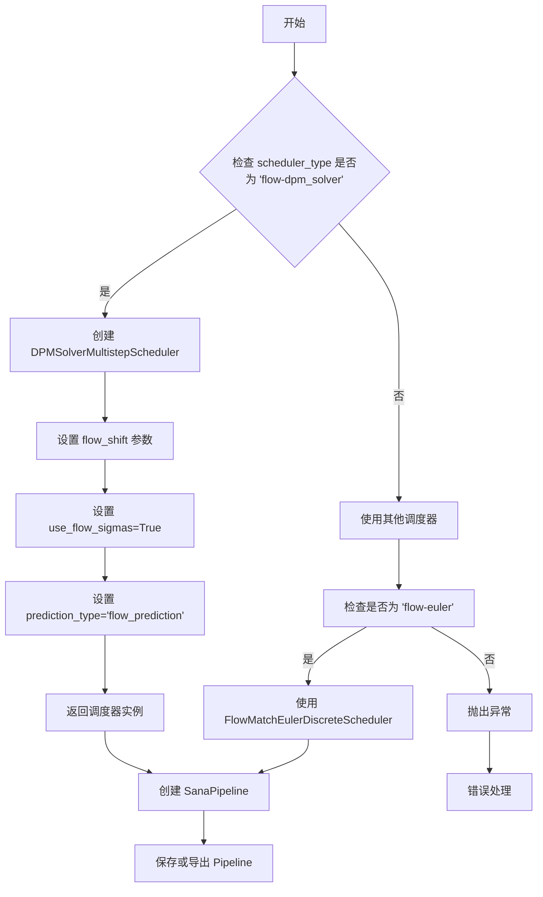

#### 带注释源码

```python
# 从 diffusers 库导入调度器
from diffusers import DPMSolverMultistepScheduler

# 根据图像大小设置 flow_shift 参数
# 4096px 使用较大的偏移值 6.0，其他使用 3.0
if args.image_size == 4096:
    flow_shift = 6.0
else:
    flow_shift = 3.0

# ... (模型转换和加载代码) ...

# 仅在非 Sana Sprint 模型且选择 flow-dpm_solver 调度器时使用
if args.scheduler_type == "flow-dpm_solver":
    # 创建 DPM-Solver 调度器
    # flow_shift: 控制流匹配的时间步长偏移，影响生成质量
    # use_flow_sigmas: 启用流版本的 sigma 计算，用于流匹配模型
    # prediction_type: 指定预测类型为流预测（trigflow）
    scheduler = DPMSolverMultistepScheduler(
        flow_shift=flow_shift,
        use_flow_sigmas=True,
        prediction_type="flow_prediction",
    )
elif args.scheduler_type == "flow-euler":
    # 备用的欧拉调度器选项
    scheduler = FlowMatchEulerDiscreteScheduler(shift=flow_shift)
else:
    raise ValueError(f"Scheduler type {args.scheduler_type} is not supported")

# 使用配置好的调度器创建完整的 Pipeline
pipe = SanaPipeline(
    tokenizer=tokenizer,
    text_encoder=text_encoder,
    transformer=transformer,
    vae=ae,
    scheduler=scheduler,
)
```


# FlowMatchEulerDiscreteScheduler 详细设计文档

### FlowMatchEulerDiscreteScheduler

FlowMatchEulerDiscreteScheduler 是 diffusers 库中的一个调度器类，用于基于 Flow Matching 的扩散模型采样。该调度器在代码中作为 SanaPipeline 的可选调度器之一，通过欧拉离散方法实现 flow matching 的迭代求解，用于将噪声逐步去噪生成图像。

参数：

-  `shift`：`float`，流匹配的位移参数，用于控制 flow matching 的偏移量。在代码中根据图像尺寸动态设置，4096px 时为 6.0，其他尺寸为 3.0

返回值：`SchedulerMixin`，返回配置好的 FlowMatchEulerDiscreteScheduler 实例

#### 流程图

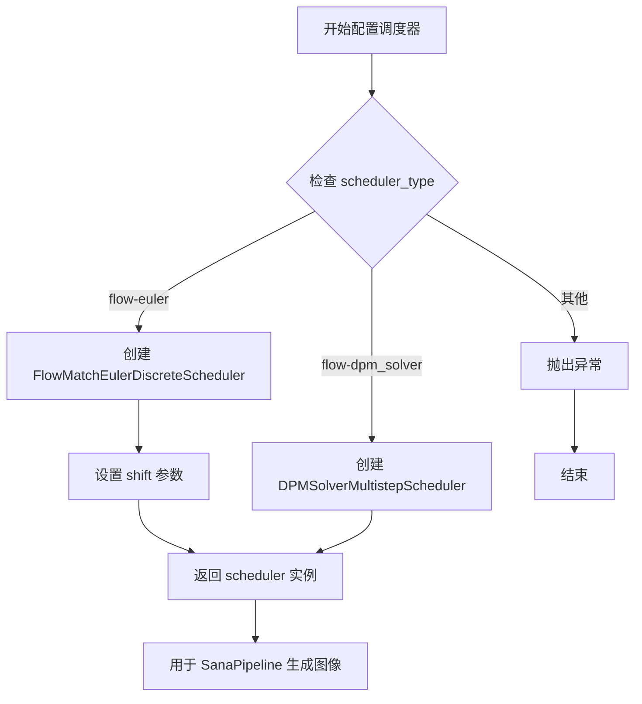

#### 带注释源码

```python
# FlowMatchEulerDiscreteScheduler 在代码中的使用方式：
# 从 diffusers 库导入
from diffusers import FlowMatchEulerDiscreteScheduler

# 在 main 函数中根据 scheduler_type 创建调度器
if args.scheduler_type == "flow-dpm_solver":
    # 使用 DPM Solver 多步调度器
    scheduler = DPMSolverMultistepScheduler(
        flow_shift=flow_shift,           # 流位移参数
        use_flow_sigmas=True,            # 使用 flow sigmas
        prediction_type="flow_prediction",  # 预测类型
    )
elif args.scheduler_type == "flow-euler":
    # 使用 Flow Match Euler 离散调度器
    # shift 参数根据图像尺寸动态调整
    # 4096px 图像使用 6.0，其他使用 3.0
    scheduler = FlowMatchEulerDiscreteScheduler(shift=flow_shift)
else:
    raise ValueError(f"Scheduler type {args.scheduler_type} is not supported")

# 将调度器传递给 SanaPipeline
pipe = SanaPipeline(
    tokenizer=tokenizer,
    text_encoder=text_encoder,
    transformer=transformer,
    vae=ae,
    scheduler=scheduler,  # 调度器用于控制去噪过程
)
```

#### 完整上下文

```python
# 动态计算 flow_shift 参数
if args.image_size == 4096:
    flow_shift = 6.0
else:
    flow_shift = 3.0

# ... 后续使用 ...
if args.scheduler_type == "flow-euler":
    scheduler = FlowMatchEulerDiscreteScheduler(shift=flow_shift)
```

## 补充说明

### 关键组件信息

- **FlowMatchEulerDiscreteScheduler**：基于欧拉法的 Flow Matching 离散调度器，用于 diffusion 模型的去噪采样过程
- **DPMSolverMultistepScheduler**：DPM-Solver 多步调度器，提供更快的采样速度
- **SCMScheduler**：SCM 调度器，专为 Sana Sprint 模型设计

### 设计目标与约束

- 支持多种调度器类型以适配不同的生成需求
- 根据图像尺寸动态调整 flow_shift 参数以优化生成质量

### 潜在技术债务

1. **硬编码的调度器选择逻辑**：当前代码中调度器选择逻辑较为固定，扩展性有限
2. **缺乏对 FlowMatchEulerDiscreteScheduler 内部参数的详细配置**：仅使用了 shift 参数，其他参数使用默认值

## 关键组件


### 状态字典转换器 (State Dict Converter)

负责将原始Sana模型的checkpoint键名转换为Diffusers格式，包含对patch嵌入、caption投影、时间嵌入、注意力机制、前馈网络等的键名映射和权重重组。

### 惰性权重初始化 (Lazy Weight Initialization)

使用`init_empty_weights`或`nullcontext`实现模型结构的惰性加载，通过`load_model_dict_into_meta`将权重加载到Meta设备，避免一次性加载完整模型到内存。

### 模型类型适配器 (Model Type Adapter)

根据`model_type`参数（如SanaMS_1600M、SanaSprint_1600M等）动态选择不同的转换逻辑，包括时间嵌入结构差异处理、qk_norm参数配置、引导嵌入支持等。

### 多调度器支持 (Multi-Scheduler Support)

根据模型类型和参数选择合适的调度器：Sana Sprint使用SCMScheduler，其他模型支持DPMSolverMultistepScheduler或FlowMatchEulerDiscreteScheduler，并动态调整flow_shift参数。

### 检查点下载与缓存管理 (Checkpoint Download & Cache Management)

使用`snapshot_download`和`hf_hub_download`从HuggingFace Hub下载模型权重，支持本地缓存路径管理和预定义模型ID列表。

### 权重类型转换 (Weight Type Conversion)

通过`DTYPE_MAPPING`将命令行dtype参数（fp32/fp16/bf16）转换为PyTorch数据类型，并在模型加载后使用`.to(weight_dtype)`进行转换。

### Transformer模型配置生成器 (Transformer Config Generator)

根据模型类型从`model_kwargs`字典中提取注意力头维度、层数、交叉注意力配置等参数，动态构建`SanaTransformer2DModel`所需的配置字典。

## 问题及建议


### 已知问题

-   **语法错误**：`ckpt_ids` 列表中第一个元素缺少逗号，导致 `"Efficient-Large-Model/Sana_Sprint_0.6B_1024px/checkpoints/Sana_Sprint_0.6B_1024px.pth"` 和第二个字符串被自动拼接成一个无效的路径
-   **变量引用错误**：`main(args)` 函数内部引用了 `model_kwargs` 变量，但该变量定义在 `if __name__ == "__main__"` 块的末尾，会导致 `NameError`
-   **缺少权重类型定义**：`main(args)` 函数中使用了 `weight_dtype` 变量，但在函数内部未定义，仅在全局作用域最后定义，可能导致作用域混淆
-   **硬编码的模型参数**：transformer_kwargs 中的 `in_channels: 32`, `out_channels: 32`, `caption_channels: 2304`, `mlp_ratio: 2.5` 等magic numbers缺乏注释说明
-   **异常处理不完善**：`state_dict.pop()` 操作在循环中没有异常保护，若原始模型权重结构不符合预期会导致程序崩溃
-   **缺少输入验证**：`args.orig_ckpt_path` 存在None和空字符串的边界情况未处理
-   **scheduler_type 验证不足**：虽然提示使用 'scm' 用于Sana Sprint模型，但 `choices` 列表仍允许其他模型类型选择该选项，可能导致运行时错误
-   **资源泄露风险**：大规模 state_dict 一次性加载到内存，对于超大规模模型可能导致内存溢出

### 优化建议

-   修复 `ckpt_ids` 列表的语法错误，确保每个元素之间有逗号分隔
-   将 `model_kwargs` 和 `weight_dtype` 的定义移至 `main(args)` 函数内部或作为模块级常量在使用前定义
-   提取硬编码的模型超参数为配置文件或类定义，提高可维护性
-   为所有 state_dict 转换操作添加 try-except 块，提供更友好的错误信息并支持调试
-   增加命令行参数验证逻辑，确保 `scheduler_type` 与 `model_type` 的兼容性
-   使用流式加载或分片加载策略处理大体积检查点文件，避免内存峰值
-   添加 `--dry-run` 或 `--validate` 模式，仅验证检查点结构而不执行完整转换

## 其它


### 设计目标与约束

本代码的设计目标是将NVIDIA Sana模型的原始检查点（.pth格式）转换为HuggingFace Diffusers格式，以便与Diffusers库无缝集成。核心约束包括：1）仅支持特定的Sana模型变体（SanaMS和SanaSprint系列），不支持其他模型；2）图像尺寸仅支持512、1024、2048、4096像素；3）权重数据类型支持fp32/fp16/bf16三种格式；4）必须依赖accelerate库才能支持分片模型加载；5）转换后的模型必须与Diffusers库的SanaPipeline或SanaSprintPipeline兼容。

### 错误处理与异常设计

代码中的错误处理主要包括：1）ValueError异常：当model_type不支持或scheduler_type不匹配时抛出明确错误信息；2）KeyError异常：通过try-except捕获state_dict中可能不存在的可选键（如y_embedding、pos_embed等）；3）AssertionError：当state_dict转换后仍有残留键时抛出，表明转换逻辑不完整；4）HF Hub下载异常：snapshot_download和hf_hub_download可能抛出网络或权限错误，调用方需处理。整体错误处理粒度较粗，建议增加更多具体异常类型和错误恢复机制。

### 数据流与状态机

数据流主要分为三个阶段：第一阶段是检查点加载与下载，根据orig_ckpt_path参数决定是从HuggingFace Hub下载还是直接加载本地文件；第二阶段是状态字典转换，将原始Sana模型的键名映射到Diffusers格式，包括patch_embed、caption_projection、time_embed、各transformer_blocks和final_layer的转换；第三阶段是模型构建与保存，根据save_full_pipeline参数决定仅保存transformer还是完整pipeline。状态机转换是单向的，不支持从Diffusers格式反向转换回原始Sana格式。

### 外部依赖与接口契约

主要外部依赖包括：1）transformers库（AutoModelForCausalLM、AutoTokenizer）用于文本编码器；2）diffusers库（SanaPipeline、SanaSprintPipeline、SanaTransformer2DModel等）用于模型定义；3）huggingface_hub（hf_hub_download、snapshot_download）用于模型下载；4）accelerate库（init_empty_weights、load_model_dict_into_meta）用于分片模型加载；5）torch库用于张量操作。接口契约方面：输入需要提供有效的checkpoint路径或使用预定义模型ID，输出生成指定dump_path下的Diffusers格式模型文件。

### 性能考虑与资源需求

性能方面主要考虑：1）GPU内存需求取决于模型规模（600M-4800M参数），建议至少16GB显存；2）使用init_empty_weights()上下文管理器可避免在CPU上加载完整模型；3）模型保存时采用safe_serialization=True确保安全但可能较慢；4）max_shard_size="5GB"控制单个分片大小。转换速度主要瓶颈在状态字典的键名映射和大规模张量操作，建议对频繁使用的模型类型缓存转换结果。

### 配置管理与参数说明

关键配置参数包括：1）orig_ckpt_path：原始检查点路径，可为None或ckpt_ids中的预定义模型；2）image_size：图像尺寸，决定interpolation_scale和flow_shift参数；3）model_type：模型类型，决定transformer层数、注意力头维度等架构参数；4）scheduler_type：调度器类型， SanaSprint强制使用SCMScheduler；5）dump_path：输出路径，必须指定；6）save_full_pipeline：是否保存完整pipeline；7）dtype：权重数据类型。model_kwargs字典存储各模型类型的架构配置，与model_type参数联动。

### 安全性考虑

代码安全性体现在：1）使用weights_only=True加载checkpoint，防止恶意 pickled 对象执行任意代码；2）safe_serialization=True保存模型时使用安全序列化格式；3）无用户输入直接执行代码的路径；4）文件路径通过os.path.expanduser处理~扩展。建议：1）对下载的模型文件进行完整性校验（SHA256等）；2）对ckpt_ids列表进行白名单验证，防止路径遍历攻击；3）添加模型下载来源的签名验证。

### 版本兼容性

版本兼容性需求：1）Python版本需支持from __future__ import annotations语法（Python 3.7+）；2）torch版本需支持weights_only参数（PyTorch 1.6+）；3）diffusers库版本需支持SanaPipeline和相关调度器（diffusers 0.30+）；4）transformers库需支持Gemma-2-2b-it模型；5）accelerate库版本需支持init_empty_weights和load_model_dict_into_meta。建议在requirements.txt中明确指定最低版本要求。

### 测试策略建议

建议添加以下测试用例：1）各model_type的转换完整性测试，验证所有state_dict键都被正确转换；2）image_size与model_type的兼容性测试；3）scheduler_type与model_type的匹配测试；4）转换后模型的推理测试，验证输出图像质量；5）内存使用测试，验证大模型不会OOM；6）多平台测试（CUDA/CPU）；7）回归测试，确保代码修改不破坏已有模型转换。建议使用pytest框架组织测试，并提供CI/CD集成。

    