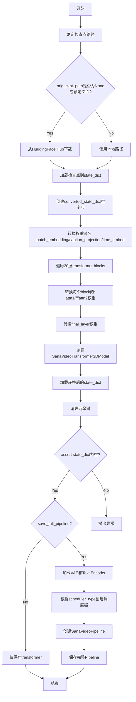

# `diffusers\scripts\convert_sana_video_to_diffusers.py` 详细设计文档

该脚本是一个权重转换工具，用于将NVlabs的Sana-Video预训练模型（.pth格式）转换为Hugging Face Diffusers库兼容的格式，核心流程包括从Hub或本地加载权重、执行复杂的键名映射（适配Transformer结构）、配置VAE与文本编码器，并支持选择保存完整的生成Pipeline或仅Transformer模型。

## 整体流程

```mermaid
graph TD
Start([开始]) --> ParseArgs[解析命令行参数]
ParseArgs --> CheckPath{检查原始检查点路径}
CheckPath -- 默认/远程ID --> Download[从 HuggingFace Hub 下载]
CheckPath -- 本地路径 --> LoadLocal[直接使用本地文件路径]
Download --> LoadPTH[加载 .pth 权重文件]
LoadLocal --> LoadPTH
LoadPTH --> ExtractState[提取 state_dict]
ExtractState --> Mapping[执行键名映射 (Key Remapping)]
Mapping --> InitTrans[初始化 Diffusers Transformer]
InitTrans --> LoadWeights[加载转换后的权重]
LoadWeights --> Validate[校验并清理残余键]
Validate --> Choice{args.save_full_pipeline?}
Choice -- No --> SaveTrans[仅保存 Transformer 模型]
Choice -- Yes --> LoadVAE[加载 Wan2.1 VAE]
LoadVAE --> LoadText[加载 Gemma Text Encoder]
LoadText --> ChooseSched[根据 args.scheduler_type 选择调度器]
ChooseSched --> BuildPipe[构建 SanaVideoPipeline]
BuildPipe --> SavePipe[保存完整 Pipeline]
SaveTrans --> End([结束])
SavePipe --> End
```

## 类结构

```
Script Module (脚本模块)
├── Global Variables (全局变量)
│   ├── CTX
│   ├── ckpt_ids
│   └── DTYPE_MAPPING
└── Main Execution Flow
    └── main(args) - 核心转换逻辑
```

## 全局变量及字段


### `CTX`
    
条件上下文管理器，当accelerate可用时使用init_empty_weights，否则使用nullcontext

类型：`contextmanager`
    


### `ckpt_ids`
    
预定义模型检查点ID列表，用于指定SANA-Video_2B_480p模型路径

类型：`List[str]`
    


### `DTYPE_MAPPING`
    
字符串到PyTorch数据类型的映射字典，用于将命令行dtype参数转换为实际的torch数据类型

类型：`Dict[str, torch.dtype]`
    


### `args`
    
通过argparse解析的命令行参数对象，包含模型路径、视频大小、任务类型等配置

类型：`Namespace`
    


### `device`
    
计算设备字符串，根据CUDA可用性设置为'cuda'或'cpu'

类型：`str`
    


### `weight_dtype`
    
模型权重的数据类型，根据args.dtype参数从DTYPE_MAPPING映射获取

类型：`torch.dtype`
    


### `cache_dir_path`
    
HuggingFace模型缓存目录的绝对路径，用于存储下载的模型文件

类型：`str`
    


### `file_path`
    
模型检查点文件的完整路径，可以是本地路径或从HuggingFace下载的缓存路径

类型：`str`
    


### `all_state_dict`
    
从检查点文件加载的完整状态字典，包含模型的所有权重和参数

类型：`OrderedDict`
    


### `state_dict`
    
从all_state_dict中提取的模型状态字典，用于存储待转换的原始模型权重

类型：`OrderedDict`
    


### `converted_state_dict`
    
转换后的状态字典，用于存储从原始格式映射到目标格式的模型权重

类型：`dict`
    


### `flow_shift`
    
流模型的偏移量参数，控制扩散/流模型的调度参数，固定值为8.0

类型：`float`
    


### `layer_num`
    
Transformer模型的层数，指定为20层，与SANA-Video_2B模型结构匹配

类型：`int`
    


### `qk_norm`
    
查询-键归一化标志，用于控制是否对注意力机制的q和k进行归一化处理

类型：`bool`
    


### `sample_size`
    
视频采样的空间尺寸参数，根据视频分辨率480或720设置为30或22

类型：`int`
    


### `patch_size`
    
3D补丁尺寸元组，用于视频模型的时空补丁划分，根据视频分辨率设置为(1,2,2)或(1,1,1)

类型：`tuple`
    


### `transformer_kwargs`
    
SanaVideoTransformer3DModel的构造参数字典，包含模型架构的所有超参数配置

类型：`dict`
    


### `transformer`
    
转换后的SANA视频变换器模型对象，包含20层Transformer结构用于视频生成

类型：`SanaVideoTransformer3DModel`
    


    

## 全局函数及方法


### `main`

该函数是SanaVideo模型检查点转换工具的核心入口，负责将原始Sana模型的检查点文件转换为HuggingFace Diffusers兼容的格式，支持480p和720p两种视频尺寸，可选择仅保存Transformer模型或完整的Diffusers Pipeline。

参数：

- `args`：`argparse.Namespace`，命令行参数对象，包含以下属性：
  - `orig_ckpt_path`：`str`，原始检查点路径，None时使用默认HuggingFace Hub路径
  - `video_size`：`int`，视频尺寸，支持480或720
  - `model_type`：`str`，模型类型，默认为"SanaVideo"
  - `scheduler_type`：`str`，调度器类型，支持flow-dpm_solver/flow-euler/uni-pc
  - `task`：`str`，任务类型，t2v或i2v
  - `dump_path`：`str`，输出路径
  - `save_full_pipeline`：`bool`，是否保存完整Pipeline
  - `dtype`：`str`，权重数据类型，fp32/fp16/bf16

返回值：`None`，该函数无返回值，通过side effect完成模型转换和保存

#### 流程图



#### 带注释源码

```python
def main(args):
    """
    将SanaVideo模型检查点转换为HuggingFace Diffusers格式
    
    主要功能：
    1. 从HuggingFace Hub或本地加载原始检查点
    2. 将原始模型权重键名转换为Diffusers格式
    3. 创建并配置SanaVideoTransformer3DModel
    4. 保存转换后的模型（完整Pipeline或仅Transformer）
    """
    # 定义HuggingFace缓存目录路径
    cache_dir_path = os.path.expanduser("~/.cache/huggingface/hub")

    # 确定检查点路径：从Hub下载或使用本地路径
    if args.orig_ckpt_path is None or args.orig_ckpt_path in ckpt_ids:
        # 使用默认预定义检查点ID
        ckpt_id = args.orig_ckpt_path or ckpt_ids[0]
        # 从HuggingFace Hub下载模型快照到缓存目录
        snapshot_download(
            repo_id=f"{'/'.join(ckpt_id.split('/')[:2])}",  # 提取repo_id: "Efficient-Large-Model/SANA-Video_2B_480p"
            cache_dir=cache_dir_path,
            repo_type="model",
        )
        # 下载具体检查点文件
        file_path = hf_hub_download(
            repo_id=f"{'/'.join(ckpt_id.split('/')[:2])}",
            filename=f"{'/'.join(ckpt_id.split('/')[2:])}",  # 提取文件名: "checkpoints/SANA_Video_2B_480p.pth"
            cache_dir=cache_dir_path,
            repo_type="model",
        )
    else:
        # 直接使用本地检查点路径
        file_path = args.orig_ckpt_path

    # 打印加载信息（带颜色强调）
    print(colored(f"Loading checkpoint from {file_path}", "green", attrs=["bold"]))
    # 使用weights_only=True安全加载PyTorch权重
    all_state_dict = torch.load(file_path, weights_only=True)
    # 从检查点中提取state_dict（移除外层包装）
    state_dict = all_state_dict.pop("state_dict")
    # 创建转换后的state_dict容器
    converted_state_dict = {}

    # ====== 转换_patch_embedding权重 ======
    # 将x_embedder.proj.weight转换为patch_embedding.weight
    converted_state_dict["patch_embedding.weight"] = state_dict.pop("x_embedder.proj.weight")
    converted_state_dict["patch_embedding.bias"] = state_dict.pop("x_embedder.proj.bias")

    # ====== 转换_caption_projection权重 ======
    # Caption投影层：y_embedder.y_proj.fc1 -> caption_projection.linear_1
    converted_state_dict["caption_projection.linear_1.weight"] = state_dict.pop("y_embedder.y_proj.fc1.weight")
    converted_state_dict["caption_projection.linear_1.bias"] = state_dict.pop("y_embedder.y_proj.fc1.bias")
    converted_state_dict["caption_projection.linear_2.weight"] = state_dict.pop("y_embedder.y_proj.fc2.weight")
    converted_state_dict["caption_projection.linear_2.bias"] = state_dict.pop("y_embedder.y_proj.fc2.bias")

    # ====== 转换_time_embed权重 ======
    # 时间嵌入层：t_embedder.mlp.0 -> time_embed.emb.timestep_embedder.linear_1
    converted_state_dict["time_embed.emb.timestep_embedder.linear_1.weight"] = state_dict.pop(
        "t_embedder.mlp.0.weight"
    )
    converted_state_dict["time_embed.emb.timestep_embedder.linear_1.bias"] = state_dict.pop("t_embedder.mlp.0.bias")
    converted_state_dict["time_embed.emb.timestep_embedder.linear_2.weight"] = state_dict.pop(
        "t_embedder.mlp.2.weight"
    )
    converted_state_dict["time_embed.emb.timestep_embedder.linear_2.bias"] = state_dict.pop("t_embedder.mlp.2.bias")

    # ====== 转换Shared norm权重 ======
    # 时间块归一化层
    converted_state_dict["time_embed.linear.weight"] = state_dict.pop("t_block.1.weight")
    converted_state_dict["time_embed.linear.bias"] = state_dict.pop("t_block.1.bias")

    # ====== 转换y norm权重 ======
    # Caption归一化层
    converted_state_dict["caption_norm.weight"] = state_dict.pop("attention_y_norm.weight")

    # ====== 配置调度器参数 ======
    flow_shift = 8.0  # Flow matching位移参数
    # I2V任务只支持flow-euler调度器
    if args.task == "i2v":
        assert args.scheduler_type == "flow-euler", "Scheduler type must be flow-euler for i2v task."

    # ====== 模型配置参数 ======
    layer_num = 20  # Transformer层数
    qk_norm = True  # QK归一化标志

    # ====== 根据视频尺寸设置采样参数 ======
    if args.video_size == 480:
        sample_size = 30  # Wan-VAE: 8xp2下采样因子
        patch_size = (1, 2, 2)
    elif args.video_size == 720:
        sample_size = 22  # Wan-VAE: 32xp1下采样因子
        patch_size = (1, 1, 1)
    else:
        raise ValueError(f"Video size {args.video_size} is not supported.")

    # ====== 遍历转换每个Transformer block ======
    for depth in range(layer_num):
        # --- 转换scale_shift_table ---
        converted_state_dict[f"transformer_blocks.{depth}.scale_shift_table"] = state_dict.pop(
            f"blocks.{depth}.scale_shift_table"
        )

        # --- 转换Self Attention (attn1) ---
        # 原始QKV权重是合并的，需要按dim=0分chunk
        q, k, v = torch.chunk(state_dict.pop(f"blocks.{depth}.attn.qkv.weight"), 3, dim=0)
        converted_state_dict[f"transformer_blocks.{depth}.attn1.to_q.weight"] = q
        converted_state_dict[f"transformer_blocks.{depth}.attn1.to_k.weight"] = k
        converted_state_dict[f"transformer_blocks.{depth}.attn1.to_v.weight"] = v
        
        # 添加Q/K归一化（用于Sana-Sprint和Sana-1.5）
        if qk_norm is not None:
            converted_state_dict[f"transformer_blocks.{depth}.attn1.norm_q.weight"] = state_dict.pop(
                f"blocks.{depth}.attn.q_norm.weight"
            )
            converted_state_dict[f"transformer_blocks.{depth}.attn1.norm_k.weight"] = state_dict.pop(
                f"blocks.{depth}.attn.k_norm.weight"
            )
        
        # 转换投影层
        converted_state_dict[f"transformer_blocks.{depth}.attn1.to_out.0.weight"] = state_dict.pop(
            f"blocks.{depth}.attn.proj.weight"
        )
        converted_state_dict[f"transformer_blocks.{depth}.attn1.to_out.0.bias"] = state_dict.pop(
            f"blocks.{depth}.attn.proj.bias"
        )

        # --- 转换Feed Forward Network (FFN) ---
        # 逆卷积层
        converted_state_dict[f"transformer_blocks.{depth}.ff.conv_inverted.weight"] = state_dict.pop(
            f"blocks.{depth}.mlp.inverted_conv.conv.weight"
        )
        converted_state_dict[f"transformer_blocks.{depth}.ff.conv_inverted.bias"] = state_dict.pop(
            f"blocks.{depth}.mlp.inverted_conv.conv.bias"
        )
        # 深度卷积
        converted_state_dict[f"transformer_blocks.{depth}.ff.conv_depth.weight"] = state_dict.pop(
            f"blocks.{depth}.mlp.depth_conv.conv.weight"
        )
        converted_state_dict[f"transformer_blocks.{depth}.ff.conv_depth.bias"] = state_dict.pop(
            f"blocks.{depth}.mlp.depth_conv.conv.bias"
        )
        # 点卷积和时序卷积
        converted_state_dict[f"transformer_blocks.{depth}.ff.conv_point.weight"] = state_dict.pop(
            f"blocks.{depth}.mlp.point_conv.conv.weight"
        )
        converted_state_dict[f"transformer_blocks.{depth}.ff.conv_temp.weight"] = state_dict.pop(
            f"blocks.{depth}.mlp.t_conv.weight"
        )

        # --- 转换Cross Attention (attn2) ---
        # 分离Q和KV的线性层
        q = state_dict.pop(f"blocks.{depth}.cross_attn.q_linear.weight")
        q_bias = state_dict.pop(f"blocks.{depth}.cross_attn.q_linear.bias")
        k, v = torch.chunk(state_dict.pop(f"blocks.{depth}.cross_attn.kv_linear.weight"), 2, dim=0)
        k_bias, v_bias = torch.chunk(state_dict.pop(f"blocks.{depth}.cross_attn.kv_linear.bias"), 2, dim=0)

        converted_state_dict[f"transformer_blocks.{depth}.attn2.to_q.weight"] = q
        converted_state_dict[f"transformer_blocks.{depth}.attn2.to_q.bias"] = q_bias
        converted_state_dict[f"transformer_blocks.{depth}.attn2.to_k.weight"] = k
        converted_state_dict[f"transformer_blocks.{depth}.attn2.to_k.bias"] = k_bias
        converted_state_dict[f"transformer_blocks.{depth}.attn2.to_v.weight"] = v
        converted_state_dict[f"transformer_blocks.{depth}.attn2.to_v.bias"] = v_bias
        
        # 跨注意力Q/K归一化
        if qk_norm is not None:
            converted_state_dict[f"transformer_blocks.{depth}.attn2.norm_q.weight"] = state_dict.pop(
                f"blocks.{depth}.cross_attn.q_norm.weight"
            )
            converted_state_dict[f"transformer_blocks.{depth}.attn2.norm_k.weight"] = state_dict.pop(
                f"blocks.{depth}.cross_attn.k_norm.weight"
            )

        # 跨注意力输出投影
        converted_state_dict[f"transformer_blocks.{depth}.attn2.to_out.0.weight"] = state_dict.pop(
            f"blocks.{depth}.cross_attn.proj.weight"
        )
        converted_state_dict[f"transformer_blocks.{depth}.attn2.to_out.0.bias"] = state_dict.pop(
            f"blocks.{depth}.cross_attn.proj.bias"
        )

    # ====== 转换Final Layer权重 ======
    converted_state_dict["proj_out.weight"] = state_dict.pop("final_layer.linear.weight")
    converted_state_dict["proj_out.bias"] = state_dict.pop("final_layer.linear.bias")
    converted_state_dict["scale_shift_table"] = state_dict.pop("final_layer.scale_shift_table")

    # ====== 创建Transformer模型 ======
    # 使用init_empty_weights上下文以节省内存（如果accelerate可用）
    with CTX():
        transformer_kwargs = {
            "in_channels": 16,
            "out_channels": 16,
            "num_attention_heads": 20,
            "attention_head_dim": 112,
            "num_layers": 20,
            "num_cross_attention_heads": 20,
            "cross_attention_head_dim": 112,
            "cross_attention_dim": 2240,
            "caption_channels": 2304,
            "mlp_ratio": 3.0,
            "attention_bias": False,
            "sample_size": sample_size,
            "patch_size": patch_size,
            "norm_elementwise_affine": False,
            "norm_eps": 1e-6,
            "qk_norm": "rms_norm_across_heads",
            "rope_max_seq_len": 1024,
        }

        # 实例化SanaVideoTransformer3DModel
        transformer = SanaVideoTransformer3DModel(**transformer_kwargs)

    # 加载转换后的权重到模型
    transformer.load_state_dict(converted_state_dict, strict=True, assign=True)

    # ====== 清理可能的额外键 ======
    try:
        state_dict.pop("y_embedder.y_embedding")
        state_dict.pop("pos_embed")
        state_dict.pop("logvar_linear.weight")
        state_dict.pop("logvar_linear.bias")
    except KeyError:
        print("y_embedder.y_embedding or pos_embed not found in the state_dict")

    # 验证所有权重都已转换
    assert len(state_dict) == 0, f"State dict is not empty, {state_dict.keys()}"

    # 打印模型参数量
    num_model_params = sum(p.numel() for p in transformer.parameters())
    print(f"Total number of transformer parameters: {num_model_params}")

    # 转换模型权重数据类型
    transformer = transformer.to(weight_dtype)

    # ====== 根据参数决定保存方式 ======
    if not args.save_full_pipeline:
        # 仅保存Transformer模型
        print(
            colored(
                f"Only saving transformer model of {args.model_type}. "
                f"Set --save_full_pipeline to save the whole Pipeline",
                "green",
                attrs=["bold"],
            )
        )
        transformer.save_pretrained(
            os.path.join(args.dump_path, "transformer"), safe_serialization=True, max_shard_size="5GB"
        )
    else:
        # 保存完整Pipeline
        print(colored(f"Saving the whole Pipeline containing {args.model_type}", "green", attrs=["bold"]))
        
        # --- 加载VAE ---
        vae = AutoencoderKLWan.from_pretrained(
            "Wan-AI/Wan2.1-T2V-1.3B-Diffusers", subfolder="vae", torch_dtype=torch.float32
        )

        # --- 加载Text Encoder ---
        text_encoder_model_path = "Efficient-Large-Model/gemma-2-2b-it"
        tokenizer = AutoTokenizer.from_pretrained(text_encoder_model_path)
        tokenizer.padding_side = "right"
        text_encoder = AutoModelForCausalLM.from_pretrained(
            text_encoder_model_path, torch_dtype=torch.bfloat16
        ).get_decoder()

        # --- 根据scheduler_type选择调度器 ---
        if args.scheduler_type == "flow-dpm_solver":
            scheduler = DPMSolverMultistepScheduler(
                flow_shift=flow_shift,
                use_flow_sigmas=True,
                prediction_type="flow_prediction",
            )
        elif args.scheduler_type == "flow-euler":
            scheduler = FlowMatchEulerDiscreteScheduler(shift=flow_shift)
        elif args.scheduler_type == "uni-pc":
            scheduler = UniPCMultistepScheduler(
                prediction_type="flow_prediction",
                use_flow_sigmas=True,
                num_train_timesteps=1000,
                flow_shift=flow_shift,
            )
        else:
            raise ValueError(f"Scheduler type {args.scheduler_type} is not supported")

        # --- 创建完整Pipeline ---
        pipe = SanaVideoPipeline(
            tokenizer=tokenizer,
            text_encoder=text_encoder,
            transformer=transformer,
            vae=vae,
            scheduler=scheduler,
        )

        # --- 保存完整Pipeline ---
        pipe.save_pretrained(args.dump_path, safe_serialization=True, max_shard_size="5GB")
```

## 关键组件


### 张量索引与状态字典转换

代码中使用`state_dict.pop()`方法从原始检查点中提取权重，并按特定键名映射规则转换到Diffusers格式。转换涵盖了patch_embedding、caption_projection、time_embed、transformer_blocks（包括self-attention、cross-attention和feed-forward层）、proj_out等核心组件。

### 惰性加载与权重初始化

使用`init_empty_weights`上下文管理器（在`CTX()`中实现）配合`is_accelerate_available`检查，实现模型结构的惰性初始化，仅在实际需要时分配显存。同时通过`load_state_dict(..., assign=True)`实现权重的直接赋值而非复制。

### 反量化与权重类型转换

通过`DTYPE_MAPPING`字典支持fp32、fp16、bf16三种权重精度，并通过`transformer.to(weight_dtype)`将模型转换为目标数据类型。`weights_only=True`参数确保加载时仅读取权重数据而非完整检查点对象。

### 调度器与采样策略

支持三种调度器类型：flow-dpm_solver（DPMSolverMultistepScheduler）、flow-euler（FlowMatchEulerDiscreteScheduler）和uni-pc（UniPCMultistepScheduler），均配置flow_shift=8.0和flow_prediction预测类型，以支持基于流匹配的图像/视频生成。

### 视频尺寸适配与VAE配置

根据args.video_size（480或720）动态设置sample_size和patch_size参数：480p对应sample_size=30、patch_size=(1,2,2)；720p对应sample_size=22、patch_size=(1,1,1)。自动选择Wan2.1-VAE下采样因子以适配不同分辨率。

### 完整Pipeline组装

当启用--save_full_pipeline时，组装完整的SanaVideoPipeline，包含tokenizer、text_encoder（gemma-2-2b-it）、transformer、vae和scheduler六大组件，并统一保存到目标目录。


## 问题及建议


### 已知问题

- **硬编码配置值**：代码中存在大量硬编码的模型参数（如 `layer_num = 20`、`flow_shift = 8.0`、注意力头维度 `attention_head_dim=112` 等），这些值应该通过配置文件或命令行参数传入，以提高代码的灵活性和可维护性。
- **未使用的变量**：`args.model_type` 参数被传入但在实际转换逻辑中未被使用，仅用于打印信息，违反了参数传递的语义一致性原则。
- **脆弱的路径解析逻辑**：使用 `'/'.join(ckpt_id.split('/')[:2])` 和 `'/'.join(ckpt_id.split('/')[2:])` 进行路径解析的方式非常脆弱，容易因路径格式变化而失效。
- **错误处理不当**：`try-except` 块捕获 `KeyError` 后仅打印消息，未对缺失字段进行区分处理，可能导致静默的数据丢失。
- **内存效率问题**：使用 `torch.load` 将整个检查点加载到内存后再处理，对于大型模型可能导致内存溢出风险。
- **类型注解缺失**：主函数 `main(args)` 缺乏参数和返回值的类型注解，降低了代码的可读性和静态分析能力。
- **调度器参数校验不完整**：仅在 `args.task == "i2v"` 时校验调度器类型，但其他任务类型缺乏相应校验；`args.task` 参数在实际转换中未被使用。

### 优化建议

- **提取配置到独立模块**：将模型超参数（如层数、注意力头维度、隐藏层大小等）抽取到独立的配置文件或配置类中，通过参数化方式传递给转换逻辑。
- **增强错误处理机制**：对状态字典字段缺失进行细粒度处理，区分必需字段和可选字段，为关键字段缺失抛出明确异常，可选字段缺失记录警告日志。
- **优化内存使用**：采用分块加载或流式处理方式处理大型检查点文件，避免一次性加载整个模型到内存。
- **完善参数校验**：在函数入口处对所有输入参数进行完整性校验，确保 `model_type`、`task` 等参数在实际逻辑中被正确使用。
- **添加类型注解和文档**：为所有函数添加完整的类型注解和 docstring，描述参数含义、返回值及可能的异常情况。
- **重构状态字典转换逻辑**：将重复的状态字典映射逻辑抽取为通用的转换函数或映射表，减少代码冗余并提高可维护性。

## 其它


### 设计目标与约束

将NVIDIA Sana视频模型的检查点转换为Hugging Face Diffusers格式，支持SanaVideo模型的部署和推理。约束条件：仅支持480p和720p两种视频分辨率，支持三种调度器类型（flow-dpm_solver、flow-euler、uni-pc），任务类型仅支持t2v（文本到视频）和i2v（图像到视频）。

### 错误处理与异常设计

代码中包含多个异常处理机制：当video_size不是480或720时抛出ValueError；当scheduler_type不是支持的三种类型时抛出ValueError；当state_dict转换后不为空时抛出AssertionError；当checkpoint路径不存在或下载失败时由huggingface_hub库抛出异常。此外，使用try-except捕获KeyError处理可选字段缺失的情况。

### 外部依赖与接口契约

主要依赖包括：torch（深度学习框架）、transformers（文本编码器）、diffusers（Diffusion模型库）、accelerate（模型加载加速）、huggingface_hub（模型下载）、termcolor（彩色输出）。接口契约：输入为原始检查点路径（本地或HuggingFace Hub），输出为转换后的Diffusers格式模型保存在dump_path。

### 配置文件与参数说明

命令行参数包括：orig_ckpt_path（原始检查点路径）、video_size（视频尺寸480或720）、model_type（模型类型SanaVideo）、scheduler_type（调度器类型）、task（任务类型t2v或i2v）、dump_path（输出路径）、save_full_pipeline（是否保存完整管道）、dtype（权重数据类型fp32/fp16/bf16）。

### 性能考虑与资源需求

转换过程需要加载完整检查点到内存，2B参数的transformer模型需要约8GB显存（fp32）。使用init_empty_weights上下文管理器在accelerate可用时减少内存占用。权重转换后可选择保存为安全序列化格式（safe_serialization=True），单文件分片大小限制为5GB。

### 安全性考虑

使用weights_only=True加载检查点防止恶意代码执行。模型保存支持安全序列化（safe_serialization=True）防止权重篡改。

### 版本兼容性

代码使用from __future__ import annotations支持Python 3.7+类型注解。依赖库版本需满足：torch、transformers、diffusers、accelerate、huggingface_hub。建议使用Python 3.10+和CUDA 11.8+以获得最佳兼容性。

    