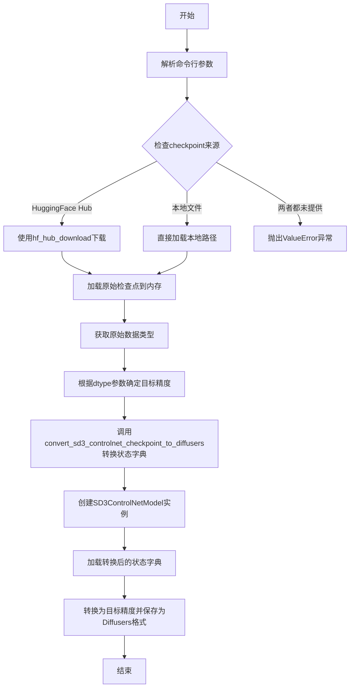
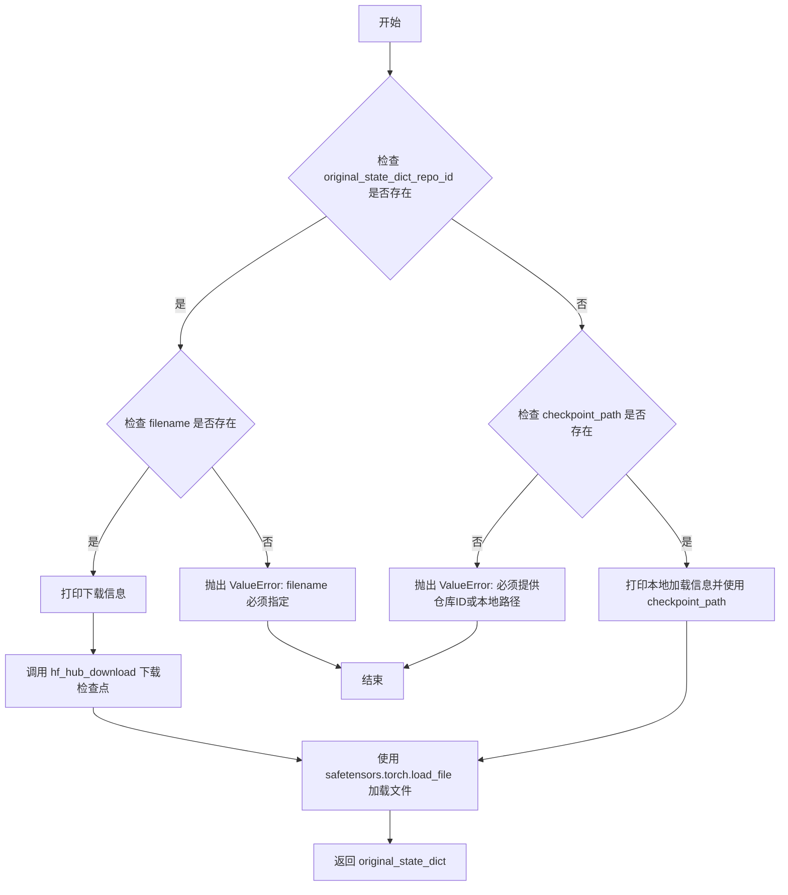
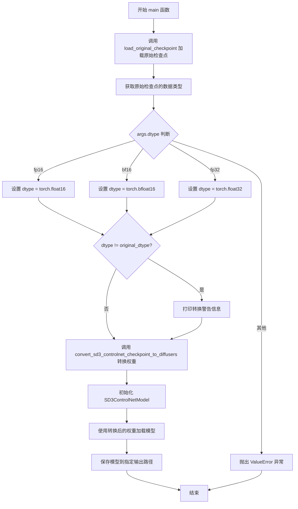

# `diffusers\scripts\convert_sd3_controlnet_to_diffusers.py` 详细设计文档

该脚本用于将Stable Diffusion 3.5的ControlNet模型从原始检查点格式（safetensors）转换为HuggingFace Diffusers格式，支持从本地文件或HuggingFace Hub加载模型，并可指定输出精度（fp16/bf16/fp32）。

## 整体流程



## 类结构

```
无类层次结构（脚本文件）
└── 全局函数
    ├── load_original_checkpoint(args)
    ├── convert_sd3_controlnet_checkpoint_to_diffusers(original_state_dict)
    └── main(args)
```

## 全局变量及字段


### `parser`
    
命令行参数解析器，用于定义和管理脚本的可选参数，包括checkpoint路径、输出路径、数据类型等

类型：`argparse.ArgumentParser`
    


### `args`
    
解析后的命令行参数命名空间对象，包含checkpoint_path、output_path、dtype等用户提供的参数值

类型：`argparse.Namespace`
    


    

## 全局函数及方法


### `load_original_checkpoint`

该函数负责加载原始的 Stable Diffusion 3.5 ControlNet 检查点文件，支持从 HuggingFace Hub 远程下载或从本地文件系统加载两种方式，并返回一个包含模型权重的字典对象。

参数：

-  `args`：命令行参数对象（argparse.Namespace），包含 `original_state_dict_repo_id`（HuggingFace 仓库 ID）、`filename`（远程仓库中的文件名）和 `checkpoint_path`（本地检查点文件路径）三个可选属性

返回值：`Dict[str, torch.Tensor]`，返回加载后的原始模型状态字典，键为参数名称，值为对应的 PyTorch 张量

#### 流程图



#### 带注释源码

```python
def load_original_checkpoint(args):
    """
    加载原始的 SD3.5 ControlNet 检查点。
    
    支持两种加载方式：
    1. 从 HuggingFace Hub 远程下载（需要指定 repo_id 和 filename）
    2. 从本地文件系统加载（需要指定 checkpoint_path）
    
    参数:
        args: 命令行参数对象，包含以下属性：
            - original_state_dict_repo_id: HuggingFace 仓库 ID（可选）
            - filename: 远程仓库中的文件名（当使用 repo_id 时必填）
            - checkpoint_path: 本地检查点文件路径（可选）
    
    返回:
        Dict[str, torch.Tensor]: 原始模型状态字典
    
    异常:
        ValueError: 当未提供必要的加载参数或参数组合不合法时抛出
    """
    # 分支1：从 HuggingFace Hub 下载
    if args.original_state_dict_repo_id is not None:
        # 验证远程下载时必须指定 filename
        if args.filename is None:
            raise ValueError("When using `original_state_dict_repo_id`, `filename` must also be specified")
        
        # 打印下载提示信息
        print(f"Downloading checkpoint from {args.original_state_dict_repo_id}/{args.filename}")
        
        # 调用 huggingface_hub 库下载检查点文件
        ckpt_path = hf_hub_download(repo_id=args.original_state_dict_repo_id, filename=args.filename)
    
    # 分支2：从本地文件加载
    elif args.checkpoint_path is not None:
        # 打印本地加载提示信息
        print(f"Loading checkpoint from local path: {args.checkpoint_path}")
        
        # 直接使用本地文件路径
        ckpt_path = args.checkpoint_path
    
    # 分支3：参数都不提供，抛出错误
    else:
        raise ValueError("Please provide either `original_state_dict_repo_id` or a local `checkpoint_path`")

    # 使用 safetensors 库安全加载检查点文件（支持安全张量格式）
    original_state_dict = safetensors.torch.load_file(ckpt_path)
    
    # 返回加载后的原始状态字典
    return original_state_dict
```


### `convert_sd3_controlnet_checkpoint_to_diffusers`

该函数用于将 Stable Diffusion 3.5 ControlNet 检查点从原始格式转换为 Diffusers 格式，主要处理权重键名的映射关系，包括控制net块、位置嵌入、时间文本嵌入以及转换器块的重组（将 QKV 分离为 Q、K、V 并重新映射各层权重）。

参数：

- `original_state_dict`：`Dict[str, torch.Tensor]`，原始检查点的状态字典，包含键名和对应的张量权重

返回值：`Dict[str, torch.Tensor]`，转换后的状态字典，键名已映射为 Diffusers 格式

#### 流程图

```mermaid
flowchart TD
    A[开始转换] --> B[初始化空字典 converted_state_dict]
    
    B --> C[循环处理 19 个 controlnet_blocks]
    C --> C1[直接映射 controlnet_blocks.{i}.weight 和 bias]
    
    C1 --> D[映射位置编码]
    D --> D1[映射 pos_embed_input.proj.weight 和 bias]
    
    D1 --> E[映射时间文本嵌入]
    E --> E1[遍历 time_text_mappings 字典并复制对应权重]
    
    E1 --> F[循环处理 19 个 transformer_blocks]
    F --> G[拆分 QKV]
    G --> G1[使用 torch.chunk 将 qkv.weight 拆分为 q, k, v]
    G --> G2[使用 torch.chunk 将 qkv.bias 拆分为 q_bias, k_bias, v_bias]
    
    G2 --> H[映射注意力层权重]
    H --> H1[映射 to_q, to_k, to_v 的 weight 和 bias]
    H1 --> H2[映射 to_out.0 的 proj weight 和 bias]
    
    H2 --> I[映射前馈网络]
    I --> I1[映射 ff.net.0.proj 对应 fc1]
    I1 --> I2[映射 ff.net.2 对应 fc2]
    
    I2 --> J[映射归一化层]
    J --> J1[映射 norm1.linear 对应 adaLN_modulation.1]
    
    J1 --> K{是否还有更多 transformer_blocks}
    K -->|是| F
    K -->|否| L[返回 converted_state_dict]
    
    style A fill:#f9f,color:#000
    style L fill:#9f9,color:#000
```

#### 带注释源码

```python
def convert_sd3_controlnet_checkpoint_to_diffusers(original_state_dict):
    """
    将 Stable Diffusion 3.5 ControlNet 检查点转换为 Diffusers 格式
    
    参数:
        original_state_dict: 原始检查点的状态字典
        
    返回:
        转换后的状态字典
    """
    # 初始化空字典用于存储转换后的权重
    converted_state_dict = {}

    # ============================================================
    # 第一部分：处理 ControlNet 块 (19 个块)
    # 直接映射权重和偏置，不改变数值
    # ============================================================
    for i in range(19):  # 19 controlnet blocks
        # 将原始键名映射到 Diffusers 格式的键名
        converted_state_dict[f"controlnet_blocks.{i}.weight"] = original_state_dict[f"controlnet_blocks.{i}.weight"]
        converted_state_dict[f"controlnet_blocks.{i}.bias"] = original_state_dict[f"controlnet_blocks.{i}.bias"]

    # ============================================================
    # 第二部分：处理位置编码嵌入
    # 直接映射位置编码的投影层权重
    # ============================================================
    converted_state_dict["pos_embed_input.proj.weight"] = original_state_dict["pos_embed_input.proj.weight"]
    converted_state_dict["pos_embed_input.proj.bias"] = original_state_dict["pos_embed_input.proj.bias"]

    # ============================================================
    # 第三部分：处理时间和文本嵌入层
    # 包含 timestep_embedder 和 text_embedder 的线性层
    # ============================================================
    time_text_mappings = {
        # 时间步嵌入器 (timestep embedder) 的两层全连接网络
        "time_text_embed.timestep_embedder.linear_1.weight": "time_text_embed.timestep_embedder.linear_1.weight",
        "time_text_embed.timestep_embedder.linear_1.bias": "time_text_embed.timestep_embedder.linear_1.bias",
        "time_text_embed.timestep_embedder.linear_2.weight": "time_text_embed.timestep_embedder.linear_2.weight",
        "time_text_embed.timestep_embedder.linear_2.bias": "time_text_embed.timestep_embedder.linear_2.bias",
        # 文本嵌入器 (text embedder) 的两层全连接网络
        "time_text_embed.text_embedder.linear_1.weight": "time_text_embed.text_embedder.linear_1.weight",
        "time_text_embed.text_embedder.linear_1.bias": "time_text_embed.text_embedder.linear_1.bias",
        "time_text_embed.text_embedder.linear_2.weight": "time_text_embed.text_embedder.linear_2.weight",
        "time_text_embed.text_embedder.linear_2.bias": "time_text_embed.text_embedder.linear_2.bias",
    }

    # 遍历映射字典并复制存在的权重
    for new_key, old_key in time_text_mappings.items():
        if old_key in original_state_dict:
            converted_state_dict[new_key] = original_state_dict[old_key]

    # ============================================================
    # 第四部分：处理 Transformer 块 (19 个块)
    # 这是最复杂的部分，需要拆分联合的 QKV 权重
    # ============================================================
    for i in range(19):
        # ------------------------------------------------
        # 步骤 1: 拆分 QKV (Query, Key, Value)
        # 原始模型使用联合的 qkv 层，需要拆分为独立的 Q, K, V
        # ------------------------------------------------
        # 获取联合的 QKV 权重，形状为 [3*head_dim*num_heads, ...]
        qkv_weight = original_state_dict[f"transformer_blocks.{i}.attn.qkv.weight"]
        qkv_bias = original_state_dict[f"transformer_blocks.{i}.attn.qkv.bias"]
        
        # 使用 torch.chunk 按维度 0 (channel 维度) 均匀拆分为 3 份
        q, k, v = torch.chunk(qkv_weight, 3, dim=0)
        q_bias, k_bias, v_bias = torch.chunk(qkv_bias, 3, dim=0)

        # ------------------------------------------------
        # 步骤 2: 构建块映射字典
        # 将原始键名映射到 Diffusers 格式的键名
        # ------------------------------------------------
        block_mappings = {
            # 注意力机制的 Q、K、V 权重和偏置
            f"transformer_blocks.{i}.attn.to_q.weight": q,
            f"transformer_blocks.{i}.attn.to_q.bias": q_bias,
            f"transformer_blocks.{i}.attn.to_k.weight": k,
            f"transformer_blocks.{i}.attn.to_k.bias": k_bias,
            f"transformer_blocks.{i}.attn.to_v.weight": v,
            f"transformer_blocks.{i}.attn.to_v.bias": v_bias,
            
            # 输出投影层 (原 proj 映射到 to_out.0)
            f"transformer_blocks.{i}.attn.to_out.0.weight": original_state_dict[
                f"transformer_blocks.{i}.attn.proj.weight"
            ],
            f"transformer_blocks.{i}.attn.to_out.0.bias": original_state_dict[
                f"transformer_blocks.{i}.attn.proj.bias"
            ],
            
            # 前馈网络 (MLP) 的两层投影
            # 原始使用 fc1/fc2，Diffusers 使用 ff.net.0.proj / ff.net.2
            f"transformer_blocks.{i}.ff.net.0.proj.weight": original_state_dict[
                f"transformer_blocks.{i}.mlp.fc1.weight"
            ],
            f"transformer_blocks.{i}.ff.net.0.proj.bias": original_state_dict[
                f"transformer_blocks.{i}.mlp.fc1.bias"
            ],
            f"transformer_blocks.{i}.ff.net.2.weight": original_state_dict[
                f"transformer_blocks.{i}.mlp.fc2.weight"
            ],
            f"transformer_blocks.{i}.ff.net.2.bias": original_state_dict[
                f"transformer_blocks.{i}.mlp.fc2.bias"
            ],
            
            # 归一化层 (adaLN_modulation 映射到 norm1.linear)
            # adaLN_modulation 包含两个子层: 0 是线性层, 1 是线性层
            f"transformer_blocks.{i}.norm1.linear.weight": original_state_dict[
                f"transformer_blocks.{i}.adaLN_modulation.1.weight"
            ],
            f"transformer_blocks.{i}.norm1.linear.bias": original_state_dict[
                f"transformer_blocks.{i}.adaLN_modulation.1.bias"
            ],
        }
        
        # 批量更新转换后的状态字典
        converted_state_dict.update(block_mappings)

    # 返回转换完成的状态字典
    return converted_state_dict
```


### `main`

该函数是脚本的主入口，负责协调整个转换流程：加载原始检查点、转换权重结构、初始化 Diffusers 格式的 SD3ControlNetModel，并保存到指定路径。

参数：

-  `args`：`argparse.Namespace`，包含命令行参数，包括检查点路径、输出路径、数据类型等配置

返回值：`None`，该函数执行完成后直接退出

#### 流程图



#### 带注释源码

```python
def main(args):
    """
    主函数：执行 Stable Diffusion 3.5 ControlNet 检查点到 Diffusers 格式的转换
    
    处理流程：
    1. 加载原始检查点（本地文件或 HuggingFace 仓库）
    2. 根据命令行参数确定目标数据类型
    3. 转换权重结构以匹配 Diffusers 格式
    4. 初始化 SD3ControlNetModel 并加载转换后的权重
    5. 保存为 Diffusers 格式到指定输出路径
    
    参数:
        args: 命令行参数对象，包含以下属性:
            - checkpoint_path: 本地检查点文件路径
            - original_state_dict_repo_id: HuggingFace 仓库 ID
            - filename: 仓库中的文件名
            - output_path: 输出路径
            - dtype: 目标数据类型 (fp16, bf16, fp32)
    
    返回值:
        None: 函数执行完成后直接退出
    """
    
    # 步骤1：加载原始检查点
    # 调用 load_original_checkpoint 函数，根据参数从本地或远程加载检查点
    # 返回原始状态的字典（键为权重名称，值为张量）
    original_ckpt = load_original_checkpoint(args)
    
    # 获取原始检查点的数据类型（从第一个张量的 dtype 获取）
    # 用于后续判断是否需要进行数据类型转换
    original_dtype = next(iter(original_ckpt.values())).dtype

    # 步骤2：解析目标数据类型
    # 初始化 dtype 为 fp32 作为默认值
    # 根据 args.dtype 参数将字符串转换为对应的 PyTorch 数据类型
    if args.dtype == "fp16":
        dtype = torch.float16      # 半精度浮点，节省显存但精度较低
    elif args.dtype == "bf16":
        dtype = torch.bfloat16     # Brain Float16，动态范围与 fp32 相同
    elif args.dtype == "fp32":
        dtype = torch.float32      # 单精度浮点，精度最高
    else:
        # 不支持的 dtype 类型，抛出异常
        raise ValueError(f"Unsupported dtype: {args.dtype}. Must be one of: fp16, bf16, fp32")

    # 步骤3：检查是否需要类型转换
    # 如果目标 dtype 与原始 dtype 不同，打印警告信息
    # 转换精度可能导致数值精度损失
    if dtype != original_dtype:
        print(
            f"Converting checkpoint from {original_dtype} to {dtype}. This can lead to unexpected results, proceed with caution."
        )

    # 步骤4：转换检查点权重结构
    # 调用转换函数，将原始检查点的权重键名映射为 Diffusers 格式
    # 包括：
    # - controlnet_blocks 的权重和偏置
    # - 位置编码投影
    # - 时间嵌入和文本嵌入
    # - Transformer 块（将 QKV 分离为 Q、K、V）
    converted_controlnet_state_dict = convert_sd3_controlnet_checkpoint_to_diffusers(original_ckpt)

    # 步骤5：初始化 Diffusers 格式的 SD3ControlNetModel
    # 创建符合 SD3.5 架构的 ControlNet 模型实例
    # 参数配置：
    # - patch_size=2: 图像分块大小
    # - in_channels=16: 输入通道数
    # - num_layers=19: 控制网块数量
    # - attention_head_dim=64: 注意力头维度
    # - num_attention_heads=38: 注意力头数量
    # - caption_projection_dim=2048: 标题投影维度
    # - pooled_projection_dim=2048: 池化投影维度
    # - out_channels=16: 输出通道数
    # - use_pos_embed=False: 不使用位置嵌入（SD3.5 特性）
    # - force_zeros_for_pooled_projection=False: 不强制池化投影为零
    controlnet = SD3ControlNetModel(
        patch_size=2,
        in_channels=16,
        num_layers=19,
        attention_head_dim=64,
        num_attention_heads=38,
        joint_attention_dim=None,
        caption_projection_dim=2048,
        pooled_projection_dim=2048,
        out_channels=16,
        pos_embed_max_size=None,
        pos_embed_type=None,
        use_pos_embed=False,
        force_zeros_for_pooled_projection=False,
    )

    # 步骤6：加载转换后的权重到模型
    # strict=True 表示严格匹配键名，确保所有权重都正确映射
    controlnet.load_state_dict(converted_controlnet_state_dict, strict=True)

    # 步骤7：保存模型到指定路径
    # 将模型转换为目标 dtype 并保存为 Diffusers 格式
    # Diffusers 格式包含模型配置和权重文件
    print(f"Saving SD3 ControlNet in Diffusers format in {args.output_path}.")
    controlnet.to(dtype).save_pretrained(args.output_path)
```

## 关键组件


### 张量索引与状态字典映射

该组件负责将原始检查点中的联合QKV权重拆分为独立的Query、Key、Value张量。通过`torch.chunk`操作将`qkv.weight`按维度0均分为3份，分别对应Q、K、V的权重。这是SD3架构与Diffusers格式之间的核心差异点，需要显式拆分才能兼容。

### 反量化与数据类型转换

该组件处理不同数值精度的转换逻辑。通过解析`--dtype`参数（fp16/bf16/fp32），将原始检查点的张量转换为目标精度。代码在转换前会检查原始精度并发出警告，确保数据类型转换的透明度。该设计支持从任意精度到目标精度的转换需求。

### 量化策略与模型初始化

该组件定义SD3ControlNetModel的结构参数，包括19层变换器块、38个注意力头、64的注意力头维度等关键配置。通过`patch_size=2`、`in_channels=16`等参数指定模型架构，并使用`pos_embed_max_size=None`和`use_pos_embed=False`禁用位置嵌入，这与SD3.5 ControlNet的设计一致。

### 检查点加载与路径解析

该组件支持两种检查点加载模式：从本地文件系统加载或从HuggingFace Hub下载。通过`hf_hub_download`函数获取远程检查点，使用`safetensors.torch.load_file`安全加载张量数据。该设计提供了灵活的模型来源选择。

### 状态字典键名转换映射

该组件包含完整的键名映射规则，将原始检查点的命名体系转换为Diffusers格式。包括controlnet块、位置嵌入、时间文本嵌入、变换器块注意力层和前馈网络的所有参数映射。特别处理了QKV拆分、MLP到FFN的映射以及adaLN调制的规范。

### 主执行流程与模型保存

该组件协调整个转换流程：加载原始检查点→转换状态字典→初始化模型→加载权重→保存为Diffusers格式。使用`strict=True`确保所有参数严格匹配，并支持_dtype转换后保存。

## 问题及建议


### 已知问题

-   **全局参数解析导致可测试性差**：在模块级别直接调用 `parser.parse_args()`，使得该脚本难以作为模块导入使用，无法进行单元测试，且如果在其他Python代码中导入时会立即执行解析。
-   **缺少参数互斥验证**：当同时提供 `checkpoint_path` 和 `original_state_dict_repo_id` 时，脚本没有明确处理这种冲突情况，可能导致意外行为。
-   **硬编码的模型架构参数**：SD3ControlNetModel 的初始化参数（patch_size=2, in_channels=16, num_layers=19, attention_head_dim=64, num_attention_heads=38等）被硬编码在代码中，如果官方模型结构更新，脚本需要手动修改。
-   **缺少状态字典键值验证**：在转换函数中直接访问 `original_state_dict` 的键（如 `f"controlnet_blocks.{i}.weight"`），如果原始checkpoint缺少某些键，会抛出KeyError异常而非给出友好提示。
-   **QKV分割维度硬编码**：`torch.chunk(qkv_weight, 3, dim=0)` 假设QKV按照dim=0均分，但没有验证权重形状是否符合预期，可能在错误的模型上运行时产生难以追踪的错误。
-   **冗余的映射字典**：`time_text_mappings` 字典中的键和值完全相同（如 `"time_text_embed.timestep_embedder.linear_1.weight": "time_text_embed.timestep_embedder.linear_1.weight"`），这种冗余设计增加了维护成本。
-   **数据类型转换风险**：直接将原始checkpoint转换为目标dtype时，仅打印警告信息但仍继续执行，可能导致精度损失且用户无法轻易发现。
-   **无输出目录创建**：如果 `output_path` 的父目录不存在，`save_pretrained` 可能失败，缺少预先创建目录的逻辑。

### 优化建议

-   **重构为可导入的模块**：将参数解析移至 `main()` 函数内部或使用 `if __name__ == "__main__"` 保护，确保脚本可被其他模块安全导入并调用转换函数。
-   **添加参数互斥检查**：在 `main()` 或单独的验证函数中检查 `checkpoint_path` 和 `original_state_dict_repo_id` 的互斥关系，确保两者不同时提供。
-   **提取配置常量**：将硬编码的模型参数（19层、38个头等）定义为模块级常量或通过参数传入，便于未来适配不同版本的ControlNet模型。
-   **添加键存在性验证**：在访问 `original_state_dict` 键之前，使用 `.get()` 方法或预先检查键是否存在，对于缺失的键给出清晰的错误信息或跳过处理。
-   **验证权重形状**：在执行 QKV 分割前，检查 `qkv_weight` 的形状是否符合预期的倍数为3，确保模型结构匹配。
-   **简化映射逻辑**：对于 `time_text_mappings`，可以使用更简洁的方式生成映射，或者仅在键不存在时记录警告而非创建冗余字典。
-   **添加数据类型转换选项**：提供 `--force_dtype_conversion` 参数让用户选择是否允许不同dtype之间的转换，或者在转换前进行兼容性检查。
-   **自动创建输出目录**：在使用 `save_pretrained` 前，使用 `os.makedirs(args.output_path, exist_ok=True)` 确保输出目录存在。
-   **添加进度条**：对于大型模型转换，可以使用 `tqdm` 展示转换进度，提升用户体验。
-   **增强错误处理**：为文件加载、模型保存等操作添加 try-except 块，捕获特定异常并给出用户友好的错误提示。


## 其它


### 设计目标与约束

本脚本的设计目标是将Stable Diffusion 3.5 ControlNet检查点从原始格式转换为Diffusers格式，以便在Diffusers库中使用。核心约束包括：仅支持SD3.5版本的ControlNet模型（支持Canny、Depth、Blur三种类型）；目标格式必须为Diffusers格式；支持fp16、bf16、fp32三种数据类型转换；仅支持从safetensors格式加载原始检查点。

### 错误处理与异常设计

脚本采用明确的参数校验和异常抛出策略。在`load_original_checkpoint`函数中，当既未提供`original_state_dict_repo_id`也未提供`checkpoint_path`时，抛出`ValueError`提示必须提供其中一种路径；当使用`original_state_dict_repo_id`但未指定`filename`时，同样抛出`ValueError`。在`main`函数中，对不支持的dtype类型抛出`ValueError`，并列出可选类型。加载检查点后使用`strict=True`进行状态字典加载，确保权重键名完全匹配。

### 数据流与状态机

数据流遵循以下路径：用户输入参数 → 参数解析 → 原始检查点加载（本地文件或HuggingFace下载）→ 权重转换（键名映射、QKV分离、块结构重组）→ SD3ControlNetModel初始化 → 状态字典加载 → 模型保存。整个过程是单向线性流程，无状态分支。

### 外部依赖与接口契约

脚本依赖以下外部包：`argparse`（命令行参数解析）、`safetensors.torch`（加载safetensors格式权重）、`torch`（张量操作）、`huggingface_hub`（从HuggingFace Hub下载模型）、`diffusers`（SD3ControlNetModel类）。输入接口为命令行参数：checkpoint_path或original_state_dict_repo_id+filename二选一、output_path（必需）、dtype（可选，默认fp32）。输出接口为保存到output_path的Diffusers格式模型目录，包含config.json和model.safetensors文件。

### 配置与参数详解

关键配置参数包括：patch_size=2、in_channels=16、num_layers=19、attention_head_dim=64、num_attention_heads=38、joint_attention_dim=None、caption_projection_dim=2048、pooled_projection_dim=2048、out_channels=16。这些参数对应SD3.5 Large ControlNet的架构规格，19层对应19个controlnet_blocks和19个transformer_blocks。

### 转换逻辑详解

权重转换分为四个主要部分：第一部分是controlnet_blocks的直接映射，保持19个块的weight和bias不变；第二部分是pos_embed_input的位置编码投影层映射；第三部分是time_text_embed的时间嵌入和文本嵌入层映射；第四部分是最复杂的transformer_blocks转换，需要将原始的qkv权重按dim=0均分为三份得到q、k、v，将mlp.fc1/fc2映射到ff.net.0.proj和ff.net.2，将proj映射到to_out.0，将adaLN_modulation.1映射到norm1.linear。

### 使用限制与注意事项

脚本仅支持SD3.5版本的ControlNet，不支持SD 1.5/2.x或SDXL版本。转换后的模型在Diffusers中的行为可能与原始实现存在细微差异。dtype转换可能带来精度损失，建议在需要精确结果时使用fp32。strict=True的加载模式要求原始检查点包含所有必需的权重，否则会抛出RuntimeError。

### 安全性考虑

脚本从HuggingFace Hub下载模型时使用hf_hub_download，该函数通过HTTPS进行安全传输。本地文件路径直接传入加载函数，理论上存在路径遍历风险，但在模型转换场景下可接受。转换过程中权重数据保留在内存中，未进行持久化临时存储。

### 可扩展性设计

当前转换逻辑硬编码了19层的映射规则，若需支持不同层数的ControlNet模型，需要修改循环范围和配置参数。转换函数`convert_sd3_controlnet_checkpoint_to_diffusers`可作为基函数扩展，未来可添加更多ControlNet类型的支持。SD3ControlNetModel的初始化参数目前固定，未来可通过命令行参数暴露更多配置选项。


    