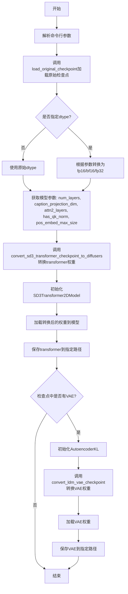
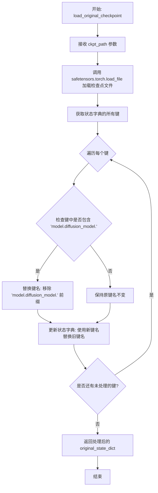
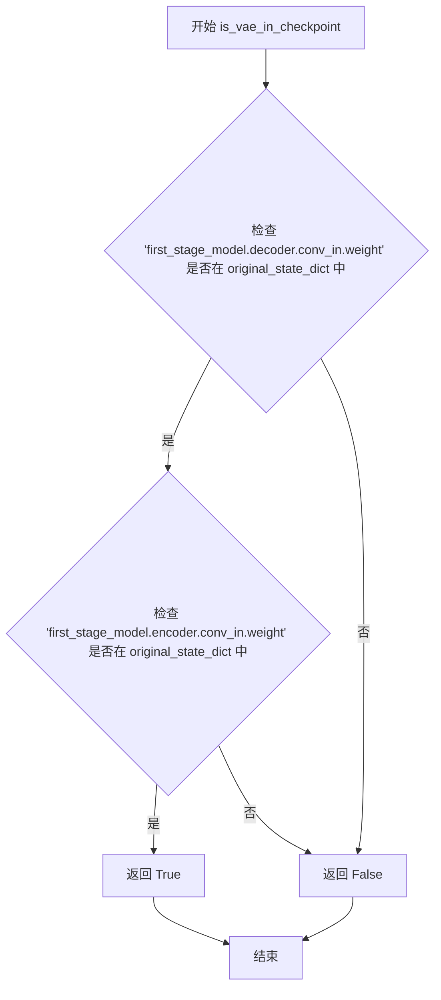
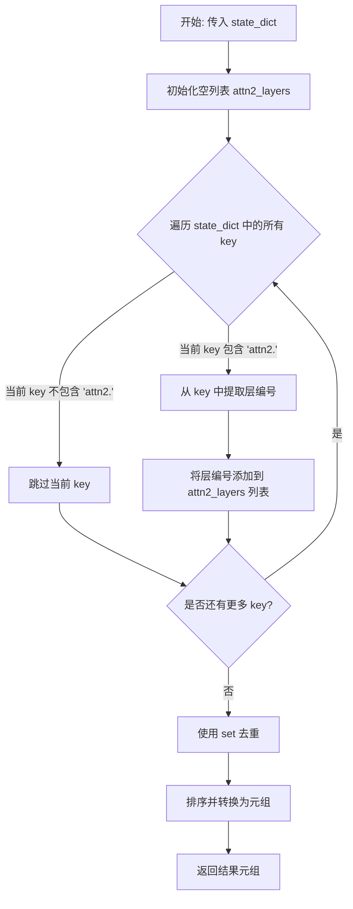
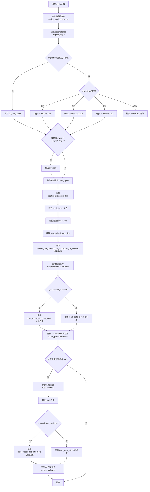

# `diffusers\scripts\convert_sd3_to_diffusers.py` 详细设计文档

这是一个将Stable Diffusion 3（SD3）模型从原始检查点格式转换为Diffusers格式的转换工具，支持Transformer和VAE模型的权重迁移、键名映射、维度调整等功能。

## 整体流程



## 类结构

```
全局变量与函数
├── CTX (条件上下文管理器)
├── parser (命令行参数解析器)
├── load_original_checkpoint (加载并预处理原始检查点)
├── swap_scale_shift (交换shift和scale权重)
├── convert_sd3_transformer_checkpoint_to_diffusers (转换transformer检查点)
├── is_vae_in_checkpoint (检查是否有VAE)
├── get_attn2_layers (获取attn2层索引)
├── get_pos_embed_max_size (获取位置嵌入最大尺寸)
├── get_caption_projection_dim (获取caption投影维度)
└── main (主函数)
```

## 全局变量及字段


### `CTX`
    
Context manager used to conditionally initialize empty weights or do nothing, depending on whether accelerate is available.

类型：`contextlib.AbstractContextManager`
    


### `parser`
    
Argument parser instance that defines command‑line options for checkpoint path, output path, and data type.

类型：`argparse.ArgumentParser`
    


### `args`
    
Namespace holding the parsed values of the command‑line arguments.

类型：`argparse.Namespace`
    


    

## 全局函数及方法


### `load_original_checkpoint`

该函数负责从指定的检查点路径加载原始的 SafeTensors 格式的模型权重，并对键名进行预处理，移除 `model.diffusion_model.` 前缀，以便与 Diffusers 格式兼容。

参数：

- `ckpt_path`：`str`，检查点文件的路径

返回值：`Dict[str, torch.Tensor]`，返回处理后的原始状态字典，其中包含模型的所有权重张量

#### 流程图



#### 带注释源码

```python
def load_original_checkpoint(ckpt_path):
    """
    加载原始 SD3 检查点文件并进行键名预处理
    
    Args:
        ckpt_path: 原始检查点文件的路径（SafeTensors 格式）
    
    Returns:
        处理后的状态字典，移除了 'model.diffusion_model.' 前缀
    """
    # 使用 safetensors 库加载检查点文件
    # 这是一个高效的 PyTorch 权重加载方式，支持内存映射
    original_state_dict = safetensors.torch.load_file(ckpt_path)
    
    # 获取所有键的列表（需要复制，因为我们会修改字典）
    keys = list(original_state_dict.keys())
    
    # 遍历所有键，处理包含特定前缀的键
    for k in keys:
        # 检查键中是否包含扩散模型的前缀
        if "model.diffusion_model." in k:
            # 替换键名：移除前缀，使其与 Diffusers 格式兼容
            # 例如: "model.diffusion_model.x_embedder.proj.weight" -> "x_embedder.proj.weight"
            original_state_dict[k.replace("model.diffusion_model.", "")] = original_state_dict.pop(k)

    # 返回处理后的状态字典
    return original_state_dict
```


### `swap_scale_shift`

该函数用于在 SD3 原始 checkpoint 与 Diffusers 实现之间进行权重顺序适配。由于原始 SD3 实现的 `AdaLayerNormContinuous` 将线性投影输出分割为 `[shift, scale]`，而 Diffusers 实现分割为 `[scale, shift]`，因此该函数通过交换这两部分的顺序，使权重能够被 Diffusers 模型正确加载和使用。

参数：

- `weight`：`torch.Tensor`，原始 checkpoint 中的权重张量，包含按维度0分割的 shift 和 scale 两部分
- `dim`：`int`，分割权重张量时使用的维度，在本场景中固定为0

返回值：`torch.Tensor`，返回重新拼接后的权重张量，其中 scale 部分在前，shift 部分在后

#### 流程图

```mermaid
flowchart TD
    A[开始: 接收weight和dim参数] --> B[使用chunk方法按dim=0将weight分割为2部分]
    B --> C[将分割结果解包为shift和scale]
    C --> D[使用torch.cat按dim=0重新拼接: [scale, shift]]
    E[返回新的权重张量] --> F[结束]
    D --> E
```

#### 带注释源码

```python
def swap_scale_shift(weight, dim):
    """
    交换权重中 shift 和 scale 的顺序
    
    在 SD3 原始实现中，AdaLayerNormContinuous 的线性投影输出分割为 [shift, scale]，
    而在 Diffusers 实现中分割为 [scale, shift]。此函数通过交换顺序实现兼容转换。
    
    参数:
        weight: torch.Tensor - 原始权重张量，形状为 [2*dim, ...]
        dim: int - 分割维度，通常为0
    
    返回:
        torch.Tensor - 交换顺序后的权重张量，形状与输入相同
    """
    # 按dim=0将权重张量均匀分割成两部分
    # 第一部分为shift（原权重的前半部分）
    # 第二部分为scale（权重的后半部分）
    shift, scale = weight.chunk(2, dim=0)
    
    # 重新拼接：先放scale，再放shift
    # 这样就将 [shift, scale] 转换为 [scale, shift]
    new_weight = torch.cat([scale, shift], dim=0)
    
    return new_weight
```


### `convert_sd3_transformer_checkpoint_to_diffusers`

该函数负责将Stable Diffusion 3（SD3）原始检查点中的Transformer模型状态字典转换为Diffusers格式，通过重命名键名、调整权重顺序（如AdaLayerNorm的scale/shift交换）以及重新组织注意力机制（QKV分离）等操作，使原始模型权重能够被Diffusers的SD3Transformer2DModel加载。

参数：

- `original_state_dict`：`Dict[str, torch.Tensor]`，原始SD3模型的状态字典，包含以"model.diffusion_model."为前缀的键
- `num_layers`：`int`，Transformer块的总层数
- `caption_projection_dim`：`int`，文本嵌入投影的维度，用于确定scale/shift交换时的分割维度
- `dual_attention_layers`：`Tuple[int, ...]`，包含双重注意力机制层索引的元组
- `has_qk_norm`：`bool`，指示原始模型是否使用QK归一化

返回值：`Dict[str, torch.Tensor]`，转换后的Diffusers格式状态字典

#### 流程图

```mermaid
flowchart TD
    A[开始] --> B[初始化空字典 converted_state_dict]
    B --> C[转换Positional Embeddings]
    C --> D[转换Timestep Embeddings]
    D --> E[转换Context Embeddings]
    E --> F[转换Pooled Context Projection]
    F --> G[遍历每层Transformer块 i in range(num_layers)]
    G --> H1[提取并分离QKV权重]
    H1 --> H2[构建Attn1的to_q/k/v权重]
    H2 --> H3[构建Attn1的add_q/k/v权重]
    H3 --> H4{has_qk_norm?}
    H4 -- Yes --> H5[添加norm_q/k和norm_added_q/k权重]
    H4 -- No --> H6
    H5 --> H6[添加Attn1输出投影权重]
    H6 --> H7{i in dual_attention_layers?}
    H7 -- Yes --> H8[处理Attn2的QKV和输出投影]
    H7 -- No --> H9
    H8 --> H9[添加Norm1和Norm1_context权重]
    H9 --> H10{是否是最后一层?}
    H10 -- No --> H11[直接添加norm1_context权重]
    H10 -- Yes --> H12[调用swap_scale_shift处理权重]
    H11 --> H13[添加FF和FF_Context权重]
    H12 --> H13
    H13 --> G
    G --> I{循环结束?}
    I -- No --> G
    I -- Yes --> J[添加Final Layer权重]
    J --> K[返回converted_state_dict]
```

#### 带注释源码

```python
def convert_sd3_transformer_checkpoint_to_diffusers(
    original_state_dict, num_layers, caption_projection_dim, dual_attention_layers, has_qk_norm
):
    """
    将SD3原始检查点转换为Diffusers格式的状态字典
    
    参数:
        original_state_dict: 原始SD3模型的状态字典
        num_layers: Transformer块数量
        caption_projection_dim: 文本投影维度
        dual_attention_layers: 包含双重注意力的层索引
        has_qk_norm: 是否使用QK归一化
    """
    converted_state_dict = {}

    # === 位置和补丁嵌入 ===
    # 将pos_embed和x_embedder的权重映射到Diffusers的pos_embed结构
    converted_state_dict["pos_embed.pos_embed"] = original_state_dict.pop("pos_embed")
    converted_state_dict["pos_embed.proj.weight"] = original_state_dict.pop("x_embedder.proj.weight")
    converted_state_dict["pos_embed.proj.bias"] = original_state_dict.pop("x_embedder.proj.bias")

    # === 时间步嵌入 ===
    # 将t_embedder的MLP权重映射到timestep_embedder
    converted_state_dict["time_text_embed.timestep_embedder.linear_1.weight"] = original_state_dict.pop(
        "t_embedder.mlp.0.weight"
    )
    converted_state_dict["time_text_embed.timestep_embedder.linear_1.bias"] = original_state_dict.pop(
        "t_embedder.mlp.0.bias"
    )
    converted_state_dict["time_text_embed.timestep_embedder.linear_2.weight"] = original_state_dict.pop(
        "t_embedder.mlp.2.weight"
    )
    converted_state_dict["time_text_embed.timestep_embedder.linear_2.bias"] = original_state_dict.pop(
        "t_embedder.mlp.2.bias"
    )

    # === 上下文投影 ===
    # 映射文本上下文嵌入层
    converted_state_dict["context_embedder.weight"] = original_state_dict.pop("context_embedder.weight")
    converted_state_dict["context_embedder.bias"] = original_state_dict.pop("context_embedder.bias")

    # === 池化上下文投影 ===
    # 将y_embedder的MLP映射到text_embedder
    converted_state_dict["time_text_embed.text_embedder.linear_1.weight"] = original_state_dict.pop(
        "y_embedder.mlp.0.weight"
    )
    converted_state_dict["time_text_embed.text_embedder.linear_1.bias"] = original_state_dict.pop(
        "y_embedder.mlp.0.bias"
    )
    converted_state_dict["time_text_embed.text_embedder.linear_2.weight"] = original_state_dict.pop(
        "y_embedder.mlp.2.weight"
    )
    converted_state_dict["time_text_embed.text_embedder.linear_2.bias"] = original_state_dict.pop(
        "y_embedder.mlp.2.bias"
    )

    # === Transformer块 ===
    # 遍历每一层，处理注意力机制、前馈网络等
    for i in range(num_layers):
        # ---- 样本注意力 QKV ----
        # 从joint_blocks中提取x_block的qkv权重并按dim=0分割为3份
        sample_q, sample_k, sample_v = torch.chunk(
            original_state_dict.pop(f"joint_blocks.{i}.x_block.attn.qkv.weight"), 3, dim=0
        )
        
        # ---- 上下文注意力 QKV ----
        # 从joint_blocks中提取context_block的qkv权重并分割
        context_q, context_k, context_v = torch.chunk(
            original_state_dict.pop(f"joint_blocks.{i}.context_block.attn.qkv.weight"), 3, dim=0
        )
        
        # 处理偏置项，同样分割为q、k、v三部分
        sample_q_bias, sample_k_bias, sample_v_bias = torch.chunk(
            original_state_dict.pop(f"joint_blocks.{i}.x_block.attn.qkv.bias"), 3, dim=0
        )
        context_q_bias, context_k_bias, context_v_bias = torch.chunk(
            original_state_dict.pop(f"joint_blocks.{i}.context_block.attn.qkv.bias"), 3, dim=0
        )

        # 映射样本注意力的to_q、to_k、to_v投影权重
        converted_state_dict[f"transformer_blocks.{i}.attn.to_q.weight"] = torch.cat([sample_q])
        converted_state_dict[f"transformer_blocks.{i}.attn.to_q.bias"] = torch.cat([sample_q_bias])
        converted_state_dict[f"transformer_blocks.{i}.attn.to_k.weight"] = torch.cat([sample_k])
        converted_state_dict[f"transformer_blocks.{i}.attn.to_k.bias"] = torch.cat([sample_k_bias])
        converted_state_dict[f"transformer_blocks.{i}.attn.to_v.weight"] = torch.cat([sample_v])
        converted_state_dict[f"transformer_blocks.{i}.attn.to_v.bias"] = torch.cat([sample_v_bias])

        # 映射上下文注意力的add_q、add_k、add_v投影权重
        converted_state_dict[f"transformer_blocks.{i}.attn.add_q_proj.weight"] = torch.cat([context_q])
        converted_state_dict[f"transformer_blocks.{i}.attn.add_q_proj.bias"] = torch.cat([context_q_bias])
        converted_state_dict[f"transformer_blocks.{i}.attn.add_k_proj.weight"] = torch.cat([context_k])
        converted_state_dict[f"transformer_blocks.{i}.attn.add_k_proj.bias"] = torch.cat([context_k_bias])
        converted_state_dict[f"transformer_blocks.{i}.attn.add_v_proj.weight"] = torch.cat([context_v])
        converted_state_dict[f"transformer_blocks.{i}.attn.add_v_proj.bias"] = torch.cat([context_v_bias])

        # ---- QK归一化 ----
        # SD3.5版本使用RMS norm进行QK归一化
        if has_qk_norm:
            converted_state_dict[f"transformer_blocks.{i}.attn.norm_q.weight"] = original_state_dict.pop(
                f"joint_blocks.{i}.x_block.attn.ln_q.weight"
            )
            converted_state_dict[f"transformer_blocks.{i}.attn.norm_k.weight"] = original_state_dict.pop(
                f"joint_blocks.{i}.x_block.attn.ln_k.weight"
            )
            converted_state_dict[f"transformer_blocks.{i}.attn.norm_added_q.weight"] = original_state_dict.pop(
                f"joint_blocks.{i}.context_block.attn.ln_q.weight"
            )
            converted_state_dict[f"transformer_blocks.{i}.attn.norm_added_k.weight"] = original_state_dict.pop(
                f"joint_blocks.{i}.context_block.attn.ln_k.weight"
            )

        # ---- 输出投影 ----
        # 处理主注意力输出投影
        converted_state_dict[f"transformer_blocks.{i}.attn.to_out.0.weight"] = original_state_dict.pop(
            f"joint_blocks.{i}.x_block.attn.proj.weight"
        )
        converted_state_dict[f"transformer_blocks.{i}.attn.to_out.0.bias"] = original_state_dict.pop(
            f"joint_blocks.{i}.x_block.attn.proj.bias"
        )
        
        # 非最后一层才需要上下文输出投影
        if not (i == num_layers - 1):
            converted_state_dict[f"transformer_blocks.{i}.attn.to_add_out.weight"] = original_state_dict.pop(
                f"joint_blocks.{i}.context_block.attn.proj.weight"
            )
            converted_state_dict[f"transformer_blocks.{i}.attn.to_add_out.bias"] = original_state_dict.pop(
                f"joint_blocks.{i}.context_block.attn.proj.bias"
            )

        # ---- Attn2（双重注意力）----
        # 仅在指定层处理，SD3.5的所有层都使用双重注意力
        if i in dual_attention_layers:
            # 提取Attn2的QKV权重并分割
            sample_q2, sample_k2, sample_v2 = torch.chunk(
                original_state_dict.pop(f"joint_blocks.{i}.x_block.attn2.qkv.weight"), 3, dim=0
            )
            sample_q2_bias, sample_k2_bias, sample_v2_bias = torch.chunk(
                original_state_dict.pop(f"joint_blocks.{i}.x_block.attn2.qkv.bias"), 3, dim=0
            )
            
            # 映射Attn2的to_q、to_k、to_v权重
            converted_state_dict[f"transformer_blocks.{i}.attn2.to_q.weight"] = torch.cat([sample_q2])
            converted_state_dict[f"transformer_blocks.{i}.attn2.to_q.bias"] = torch.cat([sample_q2_bias])
            converted_state_dict[f"transformer_blocks.{i}.attn2.to_k.weight"] = torch.cat([sample_k2])
            converted_state_dict[f"transformer_blocks.{i}.attn2.to_k.bias"] = torch.cat([sample_k2_bias])
            converted_state_dict[f"transformer_blocks.{i}.attn2.to_v.weight"] = torch.cat([sample_v2])
            converted_state_dict[f"transformer_blocks.{i}.attn2.to_v.bias"] = torch.cat([sample_v2_bias])

            # Attn2的QK归一化（仅主样本注意力部分）
            if has_qk_norm:
                converted_state_dict[f"transformer_blocks.{i}.attn2.norm_q.weight"] = original_state_dict.pop(
                    f"joint_blocks.{i}.x_block.attn2.ln_q.weight"
                )
                converted_state_dict[f"transformer_blocks.{i}.attn2.norm_k.weight"] = original_state_dict.pop(
                    f"joint_blocks.{i}.x_block.attn2.ln_k.weight"
                )

            # Attn2输出投影
            converted_state_dict[f"transformer_blocks.{i}.attn2.to_out.0.weight"] = original_state_dict.pop(
                f"joint_blocks.{i}.x_block.attn2.proj.weight"
            )
            converted_state_dict[f"transformer_blocks.{i}.attn2.to_out.0.bias"] = original_state_dict.pop(
                f"joint_blocks.{i}.x_block.attn2.proj.bias"
            )

        # ---- 层归一化（AdaLN）----
        # 样本块的AdaLN调制权重
        converted_state_dict[f"transformer_blocks.{i}.norm1.linear.weight"] = original_state_dict.pop(
            f"joint_blocks.{i}.x_block.adaLN_modulation.1.weight"
        )
        converted_state_dict[f"transformer_blocks.{i}.norm1.linear.bias"] = original_state_dict.pop(
            f"joint_blocks.{i}.x_block.adaLN_modulation.1.bias"
        )
        
        # 上下文块的AdaLN处理
        if not (i == num_layers - 1):
            # 非最后一层直接映射
            converted_state_dict[f"transformer_blocks.{i}.norm1_context.linear.weight"] = original_state_dict.pop(
                f"joint_blocks.{i}.context_block.adaLN_modulation.1.weight"
            )
            converted_state_dict[f"transformer_blocks.{i}.norm1_context.linear.bias"] = original_state_dict.pop(
                f"joint_blocks.{i}.context_block.adaLN_modulation.1.bias"
            )
        else:
            # 最后一层需要交换scale和shift顺序
            # 这是因为原始SD3实现顺序为[shift, scale]而Diffusers为[scale, shift]
            converted_state_dict[f"transformer_blocks.{i}.norm1_context.linear.weight"] = swap_scale_shift(
                original_state_dict.pop(f"joint_blocks.{i}.context_block.adaLN_modulation.1.weight"),
                dim=caption_projection_dim,
            )
            converted_state_dict[f"transformer_blocks.{i}.norm1_context.linear.bias"] = swap_scale_shift(
                original_state_dict.pop(f"joint_blocks.{i}.context_block.adaLN_modulation.1.bias"),
                dim=caption_projection_dim,
            )

        # ---- 前馈网络（FF）----
        # 样本块的前馈网络权重
        converted_state_dict[f"transformer_blocks.{i}.ff.net.0.proj.weight"] = original_state_dict.pop(
            f"joint_blocks.{i}.x_block.mlp.fc1.weight"
        )
        converted_state_dict[f"transformer_blocks.{i}.ff.net.0.proj.bias"] = original_state_dict.pop(
            f"joint_blocks.{i}.x_block.mlp.fc1.bias"
        )
        converted_state_dict[f"transformer_blocks.{i}.ff.net.2.weight"] = original_state_dict.pop(
            f"joint_blocks.{i}.x_block.mlp.fc2.weight"
        )
        converted_state_dict[f"transformer_blocks.{i}.ff.net.2.bias"] = original_state_dict.pop(
            f"joint_blocks.{i}.x_block.mlp.fc2.bias"
        )
        
        # 上下文块的前馈网络
        if not (i == num_layers - 1):
            converted_state_dict[f"transformer_blocks.{i}.ff_context.net.0.proj.weight"] = original_state_dict.pop(
                f"joint_blocks.{i}.context_block.mlp.fc1.weight"
            )
            converted_state_dict[f"transformer_blocks.{i}.ff_context.net.0.proj.bias"] = original_state_dict.pop(
                f"joint_blocks.{i}.context_block.mlp.fc1.bias"
            )
            converted_state_dict[f"transformer_blocks.{i}.ff_context.net.2.weight"] = original_state_dict.pop(
                f"joint_blocks.{i}.context_block.mlp.fc2.weight"
            )
            converted_state_dict[f"transformer_blocks.{i}.ff_context.net.2.bias"] = original_state_dict.pop(
                f"joint_blocks.{i}.context_block.mlp.fc2.bias"
            )

    # === 最终层 ===
    # 处理final_layer的投影和AdaLN调制
    converted_state_dict["proj_out.weight"] = original_state_dict.pop("final_layer.linear.weight")
    converted_state_dict["proj_out.bias"] = original_state_dict.pop("final_layer.linear.bias")
    
    # 最终层同样需要swap_scale_shift处理
    converted_state_dict["norm_out.linear.weight"] = swap_scale_shift(
        original_state_dict.pop("final_layer.adaLN_modulation.1.weight"), dim=caption_projection_dim
    )
    converted_state_dict["norm_out.linear.bias"] = swap_scale_shift(
        original_state_dict.pop("final_layer.adaLN_modulation.1.bias"), dim=caption_projection_dim
    )

    return converted_state_dict
```


### `is_vae_in_checkpoint`

该函数用于检查原始模型检查点中是否同时包含 VAE（变分自编码器）的编码器和解码器权重，以判断是否为 SD（Stable Diffusion）模型检查点。

参数：

- `original_state_dict`：`Dict`，原始检查点的状态字典（state dictionary），包含了模型各层的权重参数

返回值：`bool`，如果检查点中同时包含 VAE 编码器和解码器的输入卷积层权重，则返回 `True`，否则返回 `False`

#### 流程图



#### 带注释源码

```python
def is_vae_in_checkpoint(original_state_dict):
    """
    检查原始检查点中是否包含 VAE（变分自编码器）模型权重。
    
    该函数通过检查特定键来判断检查点是否包含 VAE 部分。
    SD（Stable Diffusion）模型的检查点通常包含 first_stage_model 部分，
    其中 encoder 和 decoder 分别为编码器和解码器。
    
    参数:
        original_state_dict (dict): 原始模型检查点的状态字典
            
    返回:
        bool: 
            - True: 检查点同时包含 VAE 编码器和解码器的权重
            - False: 检查点不包含 VAE 部分或仅包含部分权重
    """
    # 检查解码器（decoder）的输入卷积层权重是否存在
    has_decoder = "first_stage_model.decoder.conv_in.weight" in original_state_dict
    # 检查编码器（encoder）的输入卷积层权重是否存在
    has_encoder = "first_stage_model.encoder.conv_in.weight" in original_state_dict
    
    # 只有当编码器和解码器权重都存在时才返回 True
    return has_decoder and has_encoder
```


### `get_attn2_layers`

该函数用于从原始模型状态字典中提取所有包含 `attn2`（第二代注意力机制）的层编号，并返回一个排序后的元组。这些层编号用于标识模型中使用了双重注意力机制（dual attention）的 Transformer 块。

参数：

- `state_dict`：`dict`，原始模型检查点的状态字典，包含模型权重和层信息

返回值：`tuple`，包含所有使用 attn2 的层编号的升序元组

#### 流程图



#### 带注释源码

```python
def get_attn2_layers(state_dict):
    """
    从原始检查点状态字典中提取所有使用 attn2（双重注意力）的层编号。
    
    该函数用于识别模型中哪些 Transformer 层使用了双重注意力机制。
    在 SD3 模型中，某些层可能同时具有标准注意力（attn）和双重注意力（attn2）。
    
    参数:
        state_dict (dict): 原始模型检查点的状态字典，键通常包含如
                          'joint_blocks.0.x_block.attn2.qkv.weight' 这样的命名
            
    返回:
        tuple: 包含所有使用 attn2 的层编号的升序元组。例如: (0, 1, 2, 3, 4, 5, 6, 7, 8, 9, 10, 11, 12)
    """
    # 初始化一个空列表用于存储所有找到的层编号
    attn2_layers = []
    
    # 遍历状态字典中的所有键
    for key in state_dict.keys():
        # 检查当前键是否包含 'attn2.' 字符串
        # 这表示该层具有双重注意力机制（如 attn2.to_q.weight, attn2.to_k.weight 等）
        if "attn2." in key:
            # 从键名中提取层编号
            # 键的格式通常是: 'joint_blocks.{i}.x_block.attn2.qkv.weight'
            # 通过 '.' 分割后取第二个元素即为层编号
            layer_num = int(key.split(".")[1])
            
            # 将提取到的层编号添加到列表中
            attn2_layers.append(layer_num)
    
    # 使用 set() 去除重复的层编号（因为一个层可能有多个 attn2 相关的键）
    # 然后排序并转换为元组返回
    return tuple(sorted(set(attn2_layers)))
```


### `get_pos_embed_max_size`

该函数用于从原始模型的状态字典中提取位置嵌入（positional embedding）的最大尺寸。它通过计算位置嵌入张量的平方根来确定正方形特征图的最大边长，这在将原始 Stable Diffusion 3 检查点转换为 Diffusers 格式时用于初始化 Transformer 模型的 `pos_embed_max_size` 参数。

参数：

- `state_dict`：`Dict[str, torch.Tensor]`，包含原始检查点权重的状态字典，必须包含 "pos_embed" 键

返回值：`int`，位置嵌入的最大尺寸（通常为正方形的边长，例如 192 或 384）

#### 流程图

```mermaid
flowchart TD
    A[开始] --> B[获取 state_dict 中的 pos_embed 张量]
    B --> C[提取 pos_embed.shape[1] 作为 num_patches]
    C --> D[计算 sqrtnum_patches]
    D --> E[将结果转换为整数]
    E --> F[返回 pos_embed_max_size]
    F --> G[结束]
```

#### 带注释源码

```python
def get_pos_embed_max_size(state_dict):
    """
    从状态字典中获取位置嵌入的最大尺寸。
    
    该函数通过计算位置嵌入张量中补丁数量的平方根来确定
    正方形特征图的最大边长。
    
    参数:
        state_dict: 包含原始检查点权重的状态字典，必须包含 "pos_embed" 键
        
    返回:
        int: 位置嵌入的最大尺寸（正方形边长）
    """
    # 从状态字典中获取位置嵌入张量，形状为 [1, num_patches, hidden_dim]
    # shape[1] 表示补丁数量（即序列长度）
    num_patches = state_dict["pos_embed"].shape[1]
    
    # 计算正方形特征图的边长（假设为正方形布局）
    # 例如：num_patches = 36864 时，max_size = int(36864 ** 0.5) = 192
    pos_embed_max_size = int(num_patches**0.5)
    
    # 返回计算得到的最大尺寸
    return pos_embed_max_size
```


### `get_caption_projection_dim`

从状态字典中提取SD3模型上下文嵌入器的输出维度，作为caption投影的维度。

参数：

- `state_dict`：`dict`，原始SD3检查点的状态字典，包含模型权重

返回值：`int`，caption投影维度（即上下文嵌入器权重的输出维度）

#### 流程图

```mermaid
flowchart TD
    A[开始: get_caption_projection_dim] --> B[输入: state_dict]
    B --> C[访问 state_dict['context_embedder.weight']]
    C --> D[获取权重的shape[0]]
    D --> E[提取输出维度]
    E --> F[返回 caption_projection_dim]
```

#### 带注释源码

```
def get_caption_projection_dim(state_dict):
    """
    从原始检查点的状态字典中提取caption投影维度。
    
    在SD3模型中，context_embedder是一个线性层，其输出维度决定了
    caption投影层的维度。该维度用于将文本嵌入投影到与transformer
    兼容的空间中。
    
    参数:
        state_dict: 包含原始SD3模型权重的字典
        
    返回:
        caption_projection_dim: 上下文嵌入器的输出维度
    """
    # 从状态字典中获取context_embedder的权重
    # shape[0]表示该线性层的输出维度
    caption_projection_dim = state_dict["context_embedder.weight"].shape[0]
    
    # 返回提取的投影维度
    return caption_projection_dim
```


### `main`

主函数，负责将 Stable Diffusion 3 (SD3) 的原始检查点文件转换为 Hugging Face Diffusers 格式。它首先加载原始检查点，根据命令行参数确定目标数据类型，然后分析模型结构参数（层数、注意力维度等），接着转换 Transformer 模型权重并保存，最后检查原始检查点中是否包含 VAE 模型，如有则一并转换并保存。

参数：

-  `args`：`argparse.Namespace`，命令行参数对象，包含 `checkpoint_path`（原始检查点文件路径）、`output_path`（输出目录路径）和 `dtype`（目标数据类型）三个属性

返回值：`None`，该函数执行完成后不返回值，主要通过保存模型到指定路径产生副作用

#### 流程图



#### 带注释源码

```python
def main(args):
    """
    主函数：将 SD3 原始检查点转换为 Diffusers 格式
    
    参数:
        args: 包含 checkpoint_path, output_path, dtype 的命名空间对象
    
    返回:
        None
    """
    # Step 1: 加载原始检查点文件
    # 调用 load_original_checkpoint 函数，使用 safetensors 格式加载模型权重
    original_ckpt = load_original_checkpoint(args.checkpoint_path)
    
    # 获取原始检查点中第一个张量的数据类型作为参考
    original_dtype = next(iter(original_ckpt.values())).dtype

    # Initialize dtype with a default value
    dtype = None

    # Step 2: 根据命令行参数确定目标数据类型
    if args.dtype is None:
        # 未指定 dtype 时，使用原始检查点的数据类型
        dtype = original_dtype
    elif args.dtype == "fp16":
        dtype = torch.float16
    elif args.dtype == "bf16":
        dtype = torch.bfloat16
    elif args.dtype == "fp32":
        dtype = torch.float32
    else:
        # 不支持的 dtype 类型，抛出异常
        raise ValueError(f"Unsupported dtype: {args.dtype}")

    # 如果目标数据类型与原始数据类型不一致，打印警告信息
    if dtype != original_dtype:
        print(
            f"Checkpoint dtype {original_dtype} does not match requested dtype {dtype}. "
            "This can lead to unexpected results, proceed with caution."
        )

    # Step 3: 从检查点推断模型结构参数
    # 通过解析包含 "joint_blocks" 的 key 来确定 Transformer 层数
    # 例如 joint_blocks.0.xxx, joint_blocks.1.xxx 等
    num_layers = list(set(int(k.split(".", 2)[1]) for k in original_ckpt if "joint_blocks" in k))[-1] + 1

    # 获取 caption projection 维度，从 context_embedder 的权重形状推断
    caption_projection_dim = get_caption_projection_dim(original_ckpt)

    # 获取使用 attn2（第二次注意力机制）的层索引
    # SD3.0 为空元组，SD3.5 为 (0, 1, 2, ..., 12)
    attn2_layers = get_attn2_layers(original_ckpt)

    # 检查是否使用 qk norm (RMS norm)
    # SD3.5 版本使用 ln_q 相关的键
    has_qk_norm = any("ln_q" in key for key in original_ckpt.keys())

    # 获取位置嵌入的最大尺寸
    # SD3.5 2B 模型使用 384，SD3.0 和 SD3.5 8B 使用 192
    pos_embed_max_size = get_pos_embed_max_size(original_ckpt)

    # Step 4: 转换 Transformer 模型权重
    # 将原始 SD3 检查点中的权重键名映射到 Diffusers 格式
    converted_transformer_state_dict = convert_sd3_transformer_checkpoint_to_diffusers(
        original_ckpt, num_layers, caption_projection_dim, attn2_layers, has_qk_norm
    )

    # Step 5: 创建并初始化 Transformer 模型
    # 使用 init_empty_weights 或 nullcontext 根据 accelerate 库可用性
    with CTX():
        transformer = SD3Transformer2DModel(
            sample_size=128,              # 输入样本的空间分辨率
            patch_size=2,                  # 补丁大小
            in_channels=16,                # 输入通道数（latent 空间）
            joint_attention_dim=4096,      # 联合注意力维度
            num_layers=num_layers,         # Transformer 层数
            caption_projection_dim=caption_projection_dim,  # 文本嵌入投影维度
            num_attention_heads=num_layers, # 注意力头数
            pos_embed_max_size=pos_embed_max_size,  # 位置嵌入最大尺寸
            qk_norm="rms_norm" if has_qk_norm else None,  # 是否使用 RMS norm
            dual_attention_layers=attn2_layers,  # 双注意力层列表
        )

    # Step 6: 加载转换后的权重到模型
    # 根据 accelerate 库可用性选择加载方式
    if is_accelerate_available():
        # 使用 accelerate 库的低内存加载方式（适用于大模型）
        load_model_dict_into_meta(transformer, converted_transformer_state_dict)
    else:
        # 直接使用 PyTorch 的标准加载方式
        transformer.load_state_dict(converted_transformer_state_dict, strict=True)

    # Step 7: 保存转换后的 Transformer 模型
    print("Saving SD3 Transformer in Diffusers format.")
    # 将模型转换为目标 dtype 后保存
    transformer.to(dtype).save_pretrained(f"{args.output_path}/transformer")

    # Step 8: 检查并处理 VAE 模型（如果存在）
    if is_vae_in_checkpoint(original_ckpt):
        # 创建空的 VAE 模型
        with CTX():
            vae = AutoencoderKL.from_config(
                "stabilityai/stable-diffusion-xl-base-1.0",  # 使用 SDXL VAE 配置
                subfolder="vae",
                latent_channels=16,
                use_post_quant_conv=False,
                use_quant_conv=False,
                scaling_factor=1.5305,
                shift_factor=0.0609,
            )
        
        # 转换 VAE 权重格式
        converted_vae_state_dict = convert_ldm_vae_checkpoint(original_ckpt, vae.config)
        
        # 加载 VAE 权重
        if is_accelerate_available():
            load_model_dict_into_meta(vae, converted_vae_state_dict)
        else:
            vae.load_state_dict(converted_vae_state_dict, strict=True)

        # 保存 VAE 模型
        print("Saving SD3 Autoencoder in Diffusers format.")
        vae.to(dtype).save_pretrained(f"{args.output_path}/vae")
```

## 关键组件


### 张量索引与惰性加载

代码中使用 `original_state_dict.pop()` 方法实现惰性加载，通过键名匹配提取张量并从原字典中删除，避免重复遍历。

### 反量化支持

main 函数支持多种数据类型转换（fp16/bf16/fp32），并对数据类型不匹配的情况发出警告，确保模型权重的正确转换。

### 量化策略

通过 `get_attn2_layers` 检测 attn2 层，通过 `has_qk_norm` 判断是否使用 RMS norm，实现对 SD3.0 和 SD3.5 不同量化策略的适配。

### 位置嵌入处理

使用 `get_pos_embed_max_size` 从位置嵌入形状计算最大尺寸，支持不同版本 SD3 的 192 和 384 两种配置。

### Caption 投影维度获取

`get_caption_projection_dim` 从 context_embedder 的权重形状中提取投影维度，用于配置 Transformer 模型。

### AdaLayerNorm 权重交换

`swap_scale_shift` 函数在转换过程中交换原始检查点中 shift/scale 的顺序，以适配 Diffusers 实现中的 scale/shift 格式。

### VAE 条件转换

`is_vae_in_checkpoint` 检测原始检查点是否包含 VAE 权重，仅在存在时执行 VAE 的转换和保存。

### 双注意力层支持

通过 `dual_attention_layers` 参数识别需要双注意力机制的层，支持 SD3.5 版本的特殊注意力结构。

### 上下文管理器条件初始化

使用 `CTX = init_empty_weights if is_accelerate_available() else nullcontext` 实现条件初始化，根据加速库可用性选择空权重初始化或空上下文。


## 问题及建议


### 已知问题

-   **硬编码的配置值**：VAE配置路径 `"stabilityai/stable-diffusion-xl-base-1.0"`、scaling_factor、shift_factor、sample_size、patch_size、in_channels、joint_attention_dim等参数硬编码在不同位置，缺乏灵活性
-   **魔法字符串未提取为常量**：大量模型键名如 `"model.diffusion_model."`、`"joint_blocks."`、`"x_block.attn.qkv.weight"` 等以字符串形式重复出现，应提取为常量类或配置文件
-   **命令行参数缺乏验证**：未检查checkpoint_path和output_path是否存在、文件是否损坏、输出目录是否可写
-   **缺少异常处理**：文件加载、张量操作、模型保存等关键步骤均无try-except保护，程序可能因单个错误直接崩溃
-   **全局状态依赖**：使用全局变量`args`和`CTX`，降低了代码的可测试性和模块化程度
-   **依赖非公共API**：直接调用`diffusers.loaders.single_file_utils.convert_ldm_vae_checkpoint`和`diffusers.models.model_loading_utils.load_model_dict_into_meta`，这些内部API可能随版本变化导致兼容性问题
-   **转换函数过长**：`convert_sd3_transformer_checkpoint_to_diffusers`函数超过300行，包含大量重复的键名映射逻辑，难以维护和扩展
-   **类型注解缺失**：所有函数均无类型注解，影响代码可读性和IDE支持
-   **日志记录不规范**：仅使用print语句输出信息，缺少分级日志记录，不便于生产环境调试
-   **重复代码模式**：大量`torch.chunk`和`torch.cat`操作模式重复，可抽象为辅助函数
-   **脆弱的层数解析逻辑**：`num_layers = list(set(...))[-1] + 1`依赖于特定的键名格式和顺序，假设最后一层索引代表总层数，存在逻辑风险
-   **未使用的导入**：`AutoencoderKL`和`SD3Transformer2DModel`被导入但仅在函数内部动态使用

### 优化建议

-   将所有硬编码的模型配置参数提取到独立的配置文件（如YAML或JSON），通过配置类统一管理
-   创建常量类或枚举定义所有模型键名前缀和转换映射规则，避免字符串硬编码
-   添加完整的命令行参数验证逻辑，包括文件存在性检查、目录创建、权限验证等
-   为关键操作（文件IO、张量转换、模型保存）添加异常处理和错误恢复机制
-   重构`convert_sd3_transformer_checkpoint_to_diffusers`函数，将转换逻辑按模块（位置编码、时间嵌入、Transformer块等）拆分为独立函数
-   为所有函数添加类型注解，包括参数类型和返回值类型
-   使用标准日志模块（logging）替代print语句，实现日志级别控制
-   抽象重复的张量操作模式为工具函数，如`split_qkv`、`merge_qkv`、`swap_modulation_weights`等
-   改进层数检测逻辑，使用更健壮的方式计算总层数，如统计唯一的层索引集合后取最大值加一
-   考虑将主逻辑封装为可导入的模块，提供清晰的公共API，同时保留命令行入口
-   添加单元测试覆盖关键转换逻辑，确保不同版本SD3检查点的兼容性

## 其它


### 设计目标与约束

本脚本的设计目标是将SD3（Stable Diffusion 3）模型的原始检查点格式转换为Hugging Face Diffusers格式，使其能够在Diffusers库中进行推理和微调。核心约束包括：1）仅支持SD3原始格式到Diffusers格式的单向转换；2）依赖diffusers、safetensors、torch等特定版本的库；3）需要确保转换后的模型权重与Diffusers实现的SD3Transformer2DModel和AutoencoderKL架构完全兼容；4）内存使用受限于原始检查点大小和目标模型规模。

### 错误处理与异常设计

代码包含以下错误处理机制：1）参数验证：dtype参数仅支持"fp16"、"bf16"、"fp32"三种值，不支持时抛出ValueError；2）类型转换安全：使用next(iter(original_ckpt.values())).dtype获取原始数据类型；3）严格加载：使用strict=True确保权重键完全匹配；4）兼容性警告：当请求的dtype与原始dtype不匹配时打印警告信息。潜在异常包括文件路径不存在、权重键不匹配、内存不足等。

### 数据流与状态机

数据流主要分为三个阶段：加载阶段→转换阶段→保存阶段。加载阶段：load_original_checkpoint加载safetensors文件并重命名"model.diffusion_model."前缀的键。转换阶段：首先通过get_caption_projection_dim、get_attn2_layers、get_pos_embed_max_size等函数提取元数据，然后调用convert_sd3_transformer_checkpoint_to_diffusers进行权重映射转换。保存阶段：根据is_vae_in_checkpoint判断是否包含VAE，如包含则转换并保存VAE。

### 外部依赖与接口契约

主要外部依赖包括：1）safetensors.torch：用于加载.safetensors格式的检查点文件；2）torch：核心张量操作；3）diffusers库：SD3Transformer2DModel、AutoencoderKL模型类以及load_model_dict_into_meta、convert_ldm_vae_checkpoint辅助函数；4）accelerate库（可选）：用于init_empty_weights和load_model_dict_into_meta。接口契约：命令行参数--checkpoint_path（输入检查点路径）、--output_path（输出目录）、--dtype（目标数据类型）。

### 性能考虑

性能相关设计：1）使用init_empty_weights（accelerate可用时）延迟分配内存，避免在CPU上加载完整模型；2）按需转换dtype避免不必要的数据复制；3）权重转换使用in-place操作（pop）减少内存占用；4）attn2_layers通过集合去重优化。对于大型模型（如8B参数），内存峰值出现在load_original_checkpoint加载完整检查点和transformer.to(dtype)转换时。

### 安全性考虑

代码运行在用户提供的文件路径上，存在路径遍历风险（建议在生产环境中验证输出路径）。dtype转换可能导致精度损失，代码通过警告信息提醒用户。safetensors格式本身提供安全优势，可防止pickle等序列化风险。

### 版本兼容性

脚本支持SD3的不同版本：1）SD3.0：attn2_layers为空元组()，无qk_norm，使用pos_embed_max_size=192；2）SD3.5：attn2_layers包含0-12层，有qk_norm，pos_embed_max_size根据模型规模为192或384；3）SD3.5 2B：pos_embed_max_size=384；4）SD3.5 8B：pos_embed_max_size=192。版本识别通过get_attn2_layers和has_qk_norm自动完成。

### 使用示例

基本用法：python convert_sd3_checkpoint.py --checkpoint_path /path/to/model.safetensors --output_path /path/to/output --dtype fp16。VAE自动检测：当检查点包含first_stage_model时会同时转换VAE。

### 已知限制

1）仅支持.safetensors格式，不支持.pt/.ckpt格式；2）转换后的模型仅支持Diffusers推理，不支持再转换回原始格式；3）某些特殊层（如自定义注意力机制）可能无法完美转换；4）依赖Diffusers库的具体版本实现。

### 日志与监控

代码使用print语句进行关键步骤的日志输出：1）"Saving SD3 Transformer in Diffusers format."；2）"Saving SD3 Autoencoder in Diffusers format."；3）dtype不匹配警告信息。缺少结构化日志和进度条，建议在生产环境中添加更详细的日志。

### 配置参数详解

--checkpoint_path：输入的SD3模型检查点文件路径（必需）；--output_path：转换后的Diffusers模型输出目录（必需）；--dtype：目标数据类型，可选fp16/bf16/fp32，默认为原始检查点的数据类型。
    