# `diffusers\scripts\convert_shap_e_to_diffusers.py` 详细设计文档

该脚本用于将 Shap-E 模型的原始检查点转换为 Diffusers 格式，支持文本条件 Prior 模型、图像条件 Prior 模型和渲染器（Renderer）模型的转换，通过重新映射权重键名和调整模型结构来适配 Diffusers 库的标准格式。

## 整体流程

```mermaid
graph TD
    A[开始: 解析命令行参数] --> B{debug 参数是否为空?}
    B -- 是 --> C[执行完整转换流程]
    B -- 否 --> D[根据 debug 值选择转换阶段]
    C --> E[加载 Prior 检查点]
    D --> E
    E --> F[调用 prior() 或 prior_image() 或 renderer()]
    F --> G{转换类型}
    G -- prior --> H[创建 PriorTransformer 模型]
    G -- prior_image --> I[创建图像 PriorTransformer 模型]
    G -- renderer --> J[创建 ShapERenderer 模型]
    H --> K[调用对应的转换函数]
    I --> K
    J --> K
    K --> L[重新映射权重键名]
    L --> M[加载转换后的检查点到模型]
    M --> N[保存模型到 dump_path]
    N --> O[结束]
```

## 类结构

```
全局函数 (模块级)
├── prior_model_from_original_config
├── prior_original_checkpoint_to_diffusers_checkpoint
├── prior_attention_to_diffusers
├── prior_ff_to_diffusers
├── prior_image_model_from_original_config
├── prior_image_original_checkpoint_to_diffusers_checkpoint
├── create_mc_lookup_table
├── renderer_model_from_original_config
├── renderer_model_original_checkpoint_to_diffusers_checkpoint
├── split_attentions
├── prior (驱动函数)
├── prior_image (驱动函数)
├── renderer (驱动函数)
├── load_prior_checkpoint_to_model
└── load_checkpoint_to_model
```

## 全局变量及字段


### `PRIOR_ORIGINAL_PREFIX`
    
Prior模型原始检查点中权重键的前缀字符串，用于映射原始模型到Diffusers格式

类型：`str`
    


### `PRIOR_CONFIG`
    
PriorTransformer模型的配置参数字典，包含注意力头数、层数、嵌入维度等模型架构参数

类型：`dict`
    


### `PRIOR_IMAGE_ORIGINAL_PREFIX`
    
Prior图像模型原始检查点中权重键的前缀字符串，用于映射原始图像条件模型到Diffusers格式

类型：`str`
    


### `PRIOR_IMAGE_CONFIG`
    
图像条件PriorTransformer模型的配置参数字典，包含针对图像嵌入的特定配置参数

类型：`dict`
    


### `MC_TABLE`
    
Marching Cubes算法的查找表，包含256种立方体配置及其对应的三角面片顶点索引，用于3D网格重建

类型：`list`
    


### `RENDERER_CONFIG`
    
ShapERenderer渲染器模型的配置参数字典，当前为空字典使用默认配置

类型：`dict`
    


### `RENDERER_MLP_ORIGINAL_PREFIX`
    
渲染器MLP网络在原始检查点中的键前缀，用于神经网络渲染器的权重转换

类型：`str`
    


### `RENDERER_PARAMS_PROJ_ORIGINAL_PREFIX`
    
渲染器参数投影层在原始检查点中的键前缀，用于参数预测网络的权重转换

类型：`str`
    


### `PRIOR_EXPECTED_MISSING_KEYS`
    
Prior模型加载时预期缺失的键列表，包含clip_mean和clip_std，这些是从原始状态字典中缺失的统计参数

类型：`list`
    


    

## 全局函数及方法


### `prior_model_from_original_config`

该函数根据预定义的 `PRIOR_CONFIG` 配置字典创建一个 `PriorTransformer` 模型实例，用于生成 Shap-E 模型的先验（prior）模型。

参数：

- 该函数没有参数

返回值：`PriorTransformer`，使用指定配置参数实例化的先验模型对象

#### 流程图

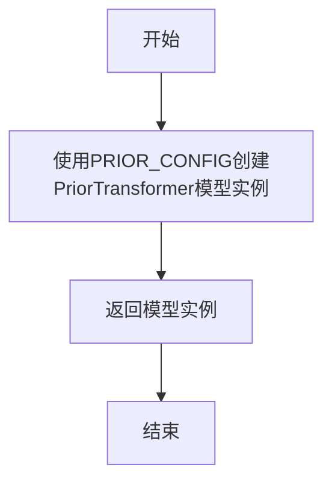

#### 带注释源码

```python
def prior_model_from_original_config():
    """
    根据预定义的 PRIOR_CONFIG 配置创建 PriorTransformer 模型实例。
    
    PRIOR_CONFIG 包含模型的关键超参数，如注意力头数、层数、嵌入维度等。
    该函数主要用于将原始的 Shap-E 先验模型转换为 diffusers 格式的模型。
    
    返回:
        PriorTransformer: 配置后的先验模型对象
    """
    # 使用 PRIOR_CONFIG 字典中的参数实例化 PriorTransformer 类
    # PRIOR_CONFIG 包含: num_attention_heads=16, attention_head_dim=64, 
    # num_layers=24, embedding_dim=1024, num_embeddings=1024 等配置
    model = PriorTransformer(**PRIOR_CONFIG)

    # 返回创建完成的模型实例，后续可用于加载权重或进行模型转换
    return model
```


### `prior_original_checkpoint_to_diffusers_checkpoint`

该函数负责将原始 Shap-E prior 模型的检查点（checkpoint）转换为 Diffusers 框架兼容的格式，通过重映射键名并重新组织权重结构，使其适配 Diffusers 的 PriorTransformer 模型架构。

参数：

- `model`：`PriorTransformer`，用于获取 transformer_blocks 数量和 attention_head_dim 的模型实例
- `checkpoint`：`Dict`，原始格式的检查点字典，键名为原始模型权重名称

返回值：`Dict`，转换后的 Diffusers 格式检查点字典

#### 流程图

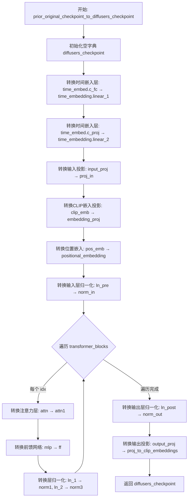

#### 带注释源码

```python
def prior_original_checkpoint_to_diffusers_checkpoint(model, checkpoint):
    """
    将原始 Shap-E prior 模型的检查点转换为 Diffusers 格式

    参数:
        model: PriorTransformer 模型实例，用于获取模型结构信息
        checkpoint: 原始格式的检查点字典

    返回:
        转换后的 Diffusers 格式检查点字典
    """
    diffusers_checkpoint = {}

    # === 1. 时间嵌入层转换 ===
    # 原始: wrapped.time_embed.c_fc -> Diffusers: time_embedding.linear_1
    diffusers_checkpoint.update(
        {
            "time_embedding.linear_1.weight": checkpoint[f"{PRIOR_ORIGINAL_PREFIX}.time_embed.c_fc.weight"],
            "time_embedding.linear_1.bias": checkpoint[f"{PRIOR_ORIGINAL_PREFIX}.time_embed.c_fc.bias"],
        }
    )

    # 原始: wrapped.time_embed.c_proj -> Diffusers: time_embedding.linear_2
    diffusers_checkpoint.update(
        {
            "time_embedding.linear_2.weight": checkpoint[f"{PRIOR_ORIGINAL_PREFIX}.time_embed.c_proj.weight"],
            "time_embedding.linear_2.bias": checkpoint[f"{PRIOR_ORIGINAL_PREFIX}.time_embed.c_proj.bias"],
        }
    )

    # === 2. 输入投影层转换 ===
    # 原始: wrapped.input_proj -> Diffusers: proj_in
    diffusers_checkpoint.update(
        {
            "proj_in.weight": checkpoint[f"{PRIOR_ORIGINAL_PREFIX}.input_proj.weight"],
            "proj_in.bias": checkpoint[f"{PRIOR_ORIGINAL_PREFIX}.input_proj.bias"],
        }
    )

    # === 3. CLIP 嵌入投影转换 ===
    # 原始: wrapped.clip_emb -> Diffusers: embedding_proj
    diffusers_checkpoint.update(
        {
            "embedding_proj.weight": checkpoint[f"{PRIOR_ORIGINAL_PREFIX}.clip_embed.weight"],
            "embedding_proj.bias": checkpoint[f"{PRIOR_ORIGINAL_PREFIX}.clip_embed.bias"],
        }
    )

    # === 4. 位置嵌入转换 ===
    # 原始: wrapped.pos_emb -> Diffusers: positional_embedding
    # 添加新的维度以适配 Diffusers 格式
    diffusers_checkpoint.update({"positional_embedding": checkpoint[f"{PRIOR_ORIGINAL_PREFIX}.pos_emb"][None, :]})

    # === 5. 输入层归一化转换 ===
    # 原始: wrapped.ln_pre -> Diffusers: norm_in
    diffusers_checkpoint.update(
        {
            "norm_in.weight": checkpoint[f"{PRIOR_ORIGINAL_PREFIX}.ln_pre.weight"],
            "norm_in.bias": checkpoint[f"{PRIOR_ORIGINAL_PREFIX}.ln_pre.bias"],
        }
    )

    # === 6. Transformer 块转换 ===
    # 遍历每个 transformer block 进行转换
    # 原始: wrapped.backbone.resblocks.<x> -> Diffusers: transformer_blocks.<x>
    for idx in range(len(model.transformer_blocks)):
        diffusers_transformer_prefix = f"transformer_blocks.{idx}"
        original_transformer_prefix = f"{PRIOR_ORIGINAL_PREFIX}.backbone.resblocks.{idx}"

        # 6.1 注意力层转换
        # 原始: .attn -> Diffusers: .attn1
        diffusers_attention_prefix = f"{diffusers_transformer_prefix}.attn1"
        original_attention_prefix = f"{original_transformer_prefix}.attn"
        diffusers_checkpoint.update(
            prior_attention_to_diffusers(
                checkpoint,
                diffusers_attention_prefix=diffusers_attention_prefix,
                original_attention_prefix=original_attention_prefix,
                attention_head_dim=model.attention_head_dim,
            )
        )

        # 6.2 前馈网络转换
        # 原始: .mlp -> Diffusers: .ff
        diffusers_ff_prefix = f"{diffusers_transformer_prefix}.ff"
        original_ff_prefix = f"{original_transformer_prefix}.mlp"
        diffusers_checkpoint.update(
            prior_ff_to_diffusers(
                checkpoint, diffusers_ff_prefix=diffusers_ff_prefix, original_ff_prefix=original_ff_prefix
            )
        )

        # 6.3 层归一化转换 (第一个)
        # 原始: .ln_1 -> Diffusers: .norm1
        diffusers_checkpoint.update(
            {
                f"{diffusers_transformer_prefix}.norm1.weight": checkpoint[
                    f"{original_transformer_prefix}.ln_1.weight"
                ],
                f"{diffusers_transformer_prefix}.norm1.bias": checkpoint[f"{original_transformer_prefix}.ln_1.bias"],
            }
        )

        # 6.4 层归一化转换 (第二个)
        # 原始: .ln_2 -> Diffusers: .norm3
        diffusers_checkpoint.update(
            {
                f"{diffusers_transformer_prefix}.norm3.weight": checkpoint[
                    f"{original_transformer_prefix}.ln_2.weight"
                ],
                f"{diffusers_transformer_prefix}.norm3.bias": checkpoint[f"{original_transformer_prefix}.ln_2.bias"],
            }
        )

    # === 7. 输出层归一化转换 ===
    # 原始: wrapped.ln_post -> Diffusers: norm_out
    diffusers_checkpoint.update(
        {
            "norm_out.weight": checkpoint[f"{PRIOR_ORIGINAL_PREFIX}.ln_post.weight"],
            "norm_out.bias": checkpoint[f"{PRIOR_ORIGINAL_PREFIX}.ln_post.bias"],
        }
    )

    # === 8. 输出投影转换 ===
    # 原始: wrapped.output_proj -> Diffusers: proj_to_clip_embeddings
    diffusers_checkpoint.update(
        {
            "proj_to_clip_embeddings.weight": checkpoint[f"{PRIOR_ORIGINAL_PREFIX}.output_proj.weight"],
            "proj_to_clip_embeddings.bias": checkpoint[f"{PRIOR_ORIGINAL_PREFIX}.output_proj.bias"],
        }
    )

    return diffusers_checkpoint
```


### `prior_attention_to_diffusers`

该函数负责将原始 Shap-E Prior 模型中的注意力机制（Attention）权重参数转换为 Diffusers 框架所需的格式。主要处理原始模型中的 `c_qkv` 权重拆分为 Query、Key、Value 三部分，以及 `c_proj` 权重转换为输出投影层。

参数：

- `checkpoint`：`dict`，包含原始模型权重键值对的字典。
- `diffusers_attention_prefix`：`str`，转换后权重在目标字典中的前缀路径（例如 `transformer_blocks.0.attn1`）。
- `original_attention_prefix`：`str`，原始权重在源字典中的前缀路径（例如 `wrapped.backbone.resblocks.0.attn`）。
- `attention_head_dim`：`int`，注意力头的维度，用于分割权重。

返回值：`dict`，包含转换后权重参数的字典。

#### 流程图

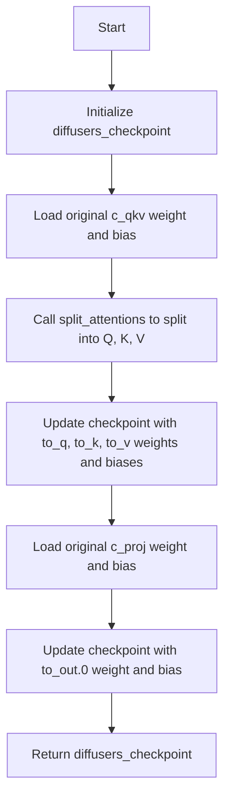

#### 带注释源码

```python
def prior_attention_to_diffusers(
    checkpoint, *, diffusers_attention_prefix, original_attention_prefix, attention_head_dim
):
    # 初始化用于存储转换后权重的字典
    diffusers_checkpoint = {}

    # <original>.c_qkv -> <diffusers>.{to_q, to_k, to_v}
    # 原始模型中 Q、K、V 是融合在 c_qkv 一个权重矩阵中的，需要按 head_dim 切分
    [q_weight, k_weight, v_weight], [q_bias, k_bias, v_bias] = split_attentions(
        weight=checkpoint[f"{original_attention_prefix}.c_qkv.weight"],
        bias=checkpoint[f"{original_attention_prefix}.c_qkv.bias"],
        split=3, # 分割为 Q, K, V 三部分
        chunk_size=attention_head_dim,
    )

    # 将切分后的 Q, K, V 权重更新到目标字典，使用 Diffusers 标准的命名空间
    diffusers_checkpoint.update(
        {
            f"{diffusers_attention_prefix}.to_q.weight": q_weight,
            f"{diffusers_attention_prefix}.to_q.bias": q_bias,
            f"{diffusers_attention_prefix}.to_k.weight": k_weight,
            f"{diffusers_attention_prefix}.to_k.bias": k_bias,
            f"{diffusers_attention_prefix}.to_v.weight": v_weight,
            f"{diffusers_attention_prefix}.to_v.bias": v_bias,
        }
    )

    # <original>.c_proj -> <diffusers>.to_out.0
    # 原始模型的输出投影对应 Diffusers 的 to_out.0
    diffusers_checkpoint.update(
        {
            f"{diffusers_attention_prefix}.to_out.0.weight": checkpoint[f"{original_attention_prefix}.c_proj.weight"],
            f"{diffusers_attention_prefix}.to_out.0.bias": checkpoint[f"{original_attention_prefix}.c_proj.bias"],
        }
    )

    return diffusers_checkpoint
```


### `prior_ff_to_diffusers`

该函数用于将原始 Shap-E 模型的先验（Prior）模块中前馈神经网络（Feed Forward Network）的检查点参数从原始格式转换为 Diffusers 格式。它主要处理 `c_fc` 和 `c_proj` 层的权重和偏置，将其映射到 Diffusers 模型中对应的 `net.0.proj` 和 `net.2` 位置。

参数：

- `checkpoint`：`dict`，原始格式的模型检查点字典，包含键如 `{original_ff_prefix}.c_fc.weight` 等
- `diffusers_ff_prefix`：`str`，Diffusers 格式中前馈网络参数的前缀路径（例如 `transformer_blocks.0.ff`）
- `original_ff_prefix`：`str`，原始格式中前馈网络参数的前缀路径（例如 `wrapped.backbone.resblocks.0.mlp`）

返回值：`dict`，转换后的 Diffusers 格式检查点字典，键为转换后的参数路径

#### 流程图

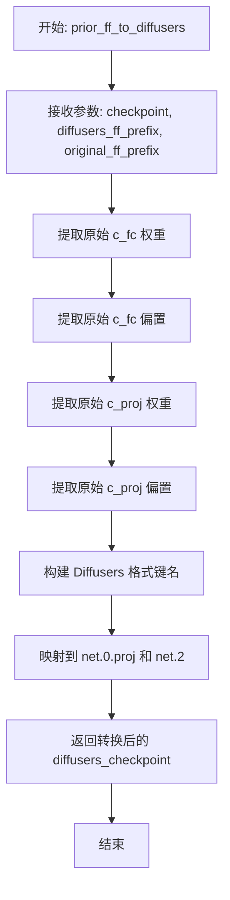

#### 带注释源码

```python
def prior_ff_to_diffusers(checkpoint, *, diffusers_ff_prefix, original_ff_prefix):
    """
    将原始格式的先验模块前馈网络检查点转换为 Diffusers 格式。
    
    原始格式中: <original>.mlp.c_fc 和 <original>.mlp.c_proj
    Diffusers格式中: <diffusers>.ff.net.0.proj 和 <diffusers>.ff.net.2
    
    参数:
        checkpoint: 原始格式的模型检查点字典
        diffusers_ff_prefix: Diffusers格式中前馈网络的前缀路径
        original_ff_prefix: 原始格式中前馈网络的前缀路径
    
    返回:
        转换后的Diffusers格式检查点字典
    """
    # 初始化转换后的检查点字典
    diffusers_checkpoint = {
        # 将原始的 c_fc 层映射到 Diffusers 格式的 net.0.proj
        # 原始: wrapped.backbone.resblocks.x.mlp.c_fc.weight
        # 转换后: transformer_blocks.x.ff.net.0.proj.weight
        f"{diffusers_ff_prefix}.net.{0}.proj.weight": checkpoint[f"{original_ff_prefix}.c_fc.weight"],
        f"{diffusers_ff_prefix}.net.{0}.proj.bias": checkpoint[f"{original_ff_prefix}.c_fc.bias"],
        
        # 将原始的 c_proj 层映射到 Diffusers 格式的 net.2
        # 原始: wrapped.backbone.resblocks.x.mlp.c_proj.weight
        # 转换后: transformer_blocks.x.ff.net.2.weight
        f"{diffusers_ff_prefix}.net.{2}.weight": checkpoint[f"{original_ff_prefix}.c_proj.weight"],
        f"{diffusers_ff_prefix}.net.{2}.bias": checkpoint[f"{original_ff_prefix}.c_proj.bias"],
    }

    return diffusers_checkpoint
```


### `prior_image_model_from_original_config`

该函数用于根据原始图像先验模型的配置创建一个PriorTransformer模型实例，主要用于Shap-E项目中图像条件先验模型的初始化。

参数：

- 该函数无参数

返回值：`PriorTransformer`，返回一个使用`PRIOR_IMAGE_CONFIG`配置初始化的PriorTransformer模型实例。

#### 流程图

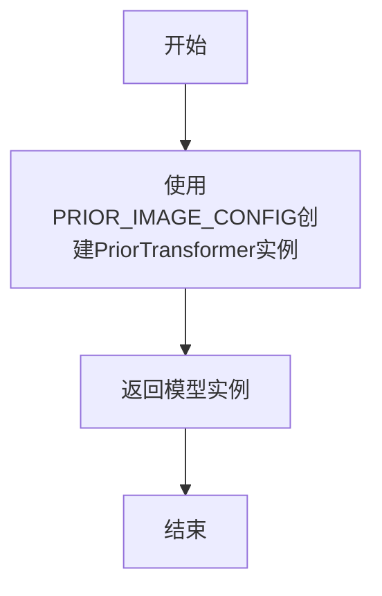

#### 带注释源码

```python
def prior_image_model_from_original_config():
    """
    根据原始图像先验模型配置创建PriorTransformer模型。
    
    该函数使用PRIOR_IMAGE_CONFIG字典中的参数来初始化一个专门用于
    图像条件生成的PriorTransformer模型。PRIOR_IMAGE_CONFIG与普通的
    PRIOR_CONFIG相比，在attention_head_dim、embedding_proj_dim等方面
    有所不同，以适应图像先验的特殊需求。
    
    Returns:
        PriorTransformer: 使用PRIOR_IMAGE_CONFIG配置初始化的模型实例
    """
    # 使用PRIOR_IMAGE_CONFIG配置字典初始化PriorTransformer模型
    # 该配置定义了16层transformer、1024维embedding、8个attention头等参数
    model = PriorTransformer(**PRIOR_IMAGE_CONFIG)

    # 返回创建完成的模型实例，供后续的checkpoint转换使用
    return model
```


### `prior_image_original_checkpoint_to_diffusers_checkpoint`

该函数负责将 Shap-E 模型的 prior_image（图像条件先验）检查点从原始格式转换为 Diffusers 格式。它通过重新映射层名称和权重张量，将原始 checkpoint 中的权重迁移到 Diffusers 兼容的模型结构中，支持图像条件生成的模型转换。

参数：

- `model`：`PriorTransformer`，原始配置构建的 PriorTransformer 模型实例，用于获取模型结构信息（如 transformer_blocks 数量、attention_head_dim）
- `checkpoint`：字典，原始格式的 Shap-E prior_image 检查点，包含以 `wrapped.` 为前缀的层权重

返回值：字典，转换后的 Diffusers 格式检查点，键名为 Diffusers 模型层名称，值为对应的权重张量

#### 流程图

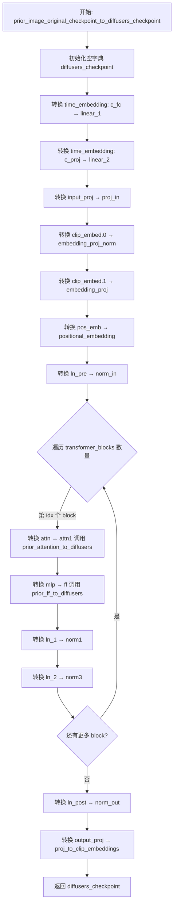

#### 带注释源码

```python
def prior_image_original_checkpoint_to_diffusers_checkpoint(model, checkpoint):
    """
    将 prior_image 原始检查点转换为 Diffusers 格式
    参数:
        model: PriorTransformer 模型实例
        checkpoint: 原始格式的检查点字典
    返回:
        转换后的 Diffusers 格式检查点字典
    """
    diffusers_checkpoint = {}

    # 原始: wrapped.time_embed.c_fc -> Diffusers: time_embedding.linear_1
    diffusers_checkpoint.update(
        {
            "time_embedding.linear_1.weight": checkpoint[f"{PRIOR_IMAGE_ORIGINAL_PREFIX}.time_embed.c_fc.weight"],
            "time_embedding.linear_1.bias": checkpoint[f"{PRIOR_IMAGE_ORIGINAL_PREFIX}.time_embed.c_fc.bias"],
        }
    )

    # 原始: wrapped.time_embed.c_proj -> Diffusers: time_embedding.linear_2
    diffusers_checkpoint.update(
        {
            "time_embedding.linear_2.weight": checkpoint[f"{PRIOR_IMAGE_ORIGINAL_PREFIX}.time_embed.c_proj.weight"],
            "time_embedding.linear_2.bias": checkpoint[f"{PRIOR_IMAGE_ORIGINAL_PREFIX}.time_embed.c_proj.bias"],
        }
    )

    # 原始: wrapped.input_proj -> Diffusers: proj_in
    diffusers_checkpoint.update(
        {
            "proj_in.weight": checkpoint[f"{PRIOR_IMAGE_ORIGINAL_PREFIX}.input_proj.weight"],
            "proj_in.bias": checkpoint[f"{PRIOR_IMAGE_ORIGINAL_PREFIX}.input_proj.bias"],
        }
    )

    # 原始: wrapped.clip_embed.0 -> Diffusers: embedding_proj_norm (新增的归一化层)
    diffusers_checkpoint.update(
        {
            "embedding_proj_norm.weight": checkpoint[f"{PRIOR_IMAGE_ORIGINAL_PREFIX}.clip_embed.0.weight"],
            "embedding_proj_norm.bias": checkpoint[f"{PRIOR_IMAGE_ORIGINAL_PREFIX}.clip_embed.0.bias"],
        }
    )

    # 原始: wrapped.clip_embed.1 -> Diffusers: embedding_proj
    diffusers_checkpoint.update(
        {
            "embedding_proj.weight": checkpoint[f"{PRIOR_IMAGE_ORIGINAL_PREFIX}.clip_embed.1.weight"],
            "embedding_proj.bias": checkpoint[f"{PRIOR_IMAGE_ORIGINAL_PREFIX}.clip_embed.1.bias"],
        }
    )

    # 原始: wrapped.pos_emb -> Diffusers: positional_embedding (增加批次维度)
    diffusers_checkpoint.update(
        {"positional_embedding": checkpoint[f"{PRIOR_IMAGE_ORIGINAL_PREFIX}.pos_emb"][None, :]}
    )

    # 原始: wrapped.ln_pre -> Diffusers: norm_in
    diffusers_checkpoint.update(
        {
            "norm_in.weight": checkpoint[f"{PRIOR_IMAGE_ORIGINAL_PREFIX}.ln_pre.weight"],
            "norm_in.bias": checkpoint[f"{PRIOR_IMAGE_ORIGINAL_PREFIX}.ln_pre.bias"],
        }
    )

    # 遍历所有 transformer 块进行转换
    # 原始: wrapped.backbone.resblocks.<x> -> Diffusers: transformer_blocks.<x>
    for idx in range(len(model.transformer_blocks)):
        diffusers_transformer_prefix = f"transformer_blocks.{idx}"
        original_transformer_prefix = f"{PRIOR_IMAGE_ORIGINAL_PREFIX}.backbone.resblocks.{idx}"

        # 原始: .attn -> Diffusers: .attn1 (调用辅助函数处理注意力权重拆分)
        diffusers_attention_prefix = f"{diffusers_transformer_prefix}.attn1"
        original_attention_prefix = f"{original_transformer_prefix}.attn"
        diffusers_checkpoint.update(
            prior_attention_to_diffusers(
                checkpoint,
                diffusers_attention_prefix=diffusers_attention_prefix,
                original_attention_prefix=original_attention_prefix,
                attention_head_dim=model.attention_head_dim,
            )
        )

        # 原始: .mlp -> Diffusers: .ff (调用辅助函数处理前馈网络权重)
        diffusers_ff_prefix = f"{diffusers_transformer_prefix}.ff"
        original_ff_prefix = f"{original_transformer_prefix}.mlp"
        diffusers_checkpoint.update(
            prior_ff_to_diffusers(
                checkpoint, diffusers_ff_prefix=diffusers_ff_prefix, original_ff_prefix=original_ff_prefix
            )
        )

        # 原始: .ln_1 -> Diffusers: .norm1
        diffusers_checkpoint.update(
            {
                f"{diffusers_transformer_prefix}.norm1.weight": checkpoint[
                    f"{original_transformer_prefix}.ln_1.weight"
                ],
                f"{diffusers_transformer_prefix}.norm1.bias": checkpoint[f"{original_transformer_prefix}.ln_1.bias"],
            }
        )

        # 原始: .ln_2 -> Diffusers: .norm3
        diffusers_checkpoint.update(
            {
                f"{diffusers_transformer_prefix}.norm3.weight": checkpoint[
                    f"{original_transformer_prefix}.ln_2.weight"
                ],
                f"{diffusers_transformer_prefix}.norm3.bias": checkpoint[f"{original_transformer_prefix}.ln_2.bias"],
            }
        )

    # 原始: wrapped.ln_post -> Diffusers: norm_out
    diffusers_checkpoint.update(
        {
            "norm_out.weight": checkpoint[f"{PRIOR_IMAGE_ORIGINAL_PREFIX}.ln_post.weight"],
            "norm_out.bias": checkpoint[f"{PRIOR_IMAGE_ORIGINAL_PREFIX}.ln_post.bias"],
        }
    )

    # 原始: wrapped.output_proj -> Diffusers: proj_to_clip_embeddings
    diffusers_checkpoint.update(
        {
            "proj_to_clip_embeddings.weight": checkpoint[f"{PRIOR_IMAGE_ORIGINAL_PREFIX}.output_proj.weight"],
            "proj_to_clip_embeddings.bias": checkpoint[f"{PRIOR_IMAGE_ORIGINAL_PREFIX}.output_proj.bias"],
        }
    )

    return diffusers_checkpoint
```


### `create_mc_lookup_table`

该函数用于创建 Marching Cubes（移动立方体）算法的查找表，将预定义的 MC_TABLE（包含256种立方体配置和对应的边连接信息）转换为 PyTorch 张量格式的 cases（边索引）和 masks（有效三角形标记），供 MeshDecoder 在渲染过程中重建网格面使用。

参数：  
- 该函数无参数

返回值：  
- `cases`：`torch.Tensor`（形状为 (256, 5, 3)，dtype=torch.long），存储每个立方体配置中三角面片对应的边索引  
- `masks`：`torch.Tensor`（形状为 (256, 5)，dtype=torch.bool），标记每个立方体配置中有效三角形的位置

#### 流程图

```mermaid
flowchart TD
    A[开始 create_mc_lookup_table] --> B[初始化张量: cases为256x5x3的long型零张量]
    B --> C[初始化张量: masks为256x5的bool型零张量]
    C --> D[定义edge_to_index映射表<br/>边角点对到边索引的映射<br/>共12条边: 0-11]
    E{遍历 MC_TABLE<br/>i = 0 到 255} --> F{遍历每个case中的triangles<br/>j = 0 到 len(case)-1}
    F --> G{遍历tri中的边对<br/>k = 0 到 len tri/2-1}
    G --> H[提取边角点对 c1, c2]
    H --> I{判断 c1 < c2]
    I -->|是| J[使用 c1, c2 作为键]
    I -->|否| K[交换为 c2, c1 作为键]
    J --> L[从 edge_to_index 获取边索引]
    K --> L
    L --> M[将边索引存入 cases[i, j, k]]
    M --> N[设置 masks[i, j] = True]
    N --> O{是否还有更多k?}
    O -->|是| G
    O -->|否| P{是否还有更多j?}
    P -->|是| F
    P -->|否| Q{是否还有更多i?}
    Q -->|是| E
    Q -->|否| R[返回 cases 和 masks]
```

#### 带注释源码

```python
def create_mc_lookup_table():
    """
    创建 Marching Cubes 查找表，将 MC_TABLE 转换为 PyTorch 张量格式
    
    MC_TABLE 包含256种立方体配置（对应8个角点的2^8=256种状态组合），
    每种配置包含若干三角面片，每个三角面片由3条边组成，每条边由2个角点定义。
    本函数将这些角点对转换为边索引，供网格解码器使用。
    """
    
    # 初始化 cases 张量: (256, 5, 3) - 存储每个配置的边索引
    # 256: 立方体的所有可能状态
    # 5: 每个状态最多5个三角面片
    # 3: 每个三角面片3条边
    cases = torch.zeros(256, 5, 3, dtype=torch.long)
    
    # 初始化 masks 张量: (256, 5) - 标记有效三角面片位置
    masks = torch.zeros(256, 5, dtype=torch.bool)
    
    # 建立边角点对到边索引的映射关系
    # 立方体的8个角点编号: 0-7
    # 12条边: (0,1), (2,3), (4,5), (6,7), (0,2), (1,3), (4,6), (5,7), 
    #         (0,4), (1,5), (2,6), (3,7)
    edge_to_index = {
        (0, 1): 0,
        (2, 3): 1,
        (4, 5): 2,
        (6, 7): 3,
        (0, 2): 4,
        (1, 3): 5,
        (4, 6): 6,
        (5, 7): 7,
        (0, 4): 8,
        (1, 5): 9,
        (2, 6): 10,
        (3, 7): 11,
    }
    
    # 遍历 MC_TABLE 中的所有256种配置
    for i, case in enumerate(MC_TABLE):
        # 遍历每种配置中的所有三角面片
        for j, tri in enumerate(case):
            # tri 是一个包含6个元素的列表 [c1, c2, c3, c4, c5, c6]
            # 表示3条边: (c1,c2), (c3,c4), (c5,c6)
            # 使用 zip(tri[::2], tri[1::2]) 每次提取2个元素即一条边的两个角点
            for k, (c1, c2) in enumerate(zip(tri[::2], tri[1::2])):
                # 确保使用从小到大的角点序号作为键查询映射表
                cases[i, j, k] = edge_to_index[(c1, c2) if c1 < c2 else (c2, c1)]
            # 标记该位置存在有效的三角面片
            masks[i, j] = True
    
    return cases, masks
```


### `renderer_model_from_original_config`

该函数用于根据原始配置创建一个 `ShapERenderer` 模型实例。它使用空的 `RENDERER_CONFIG` 字典（默认配置）来实例化模型，并返回创建的模型对象。

参数：
- 该函数无参数

返回值：`ShapERenderer`，返回新创建的 ShapERenderer 模型实例

#### 流程图

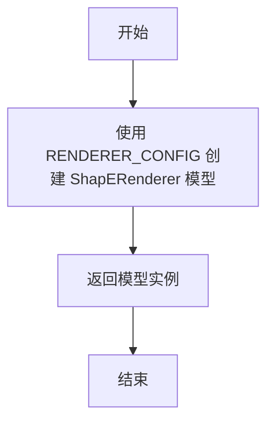

#### 带注释源码

```python
def renderer_model_from_original_config():
    """
    根据原始配置创建并返回一个 ShapERenderer 模型实例。
    使用 RENDERER_CONFIG 字典中的配置参数（此处为空字典，使用默认参数）来实例化模型。
    
    Returns:
        model: ShapERenderer 模型实例
    """
    # 使用 RENDERER_CONFIG（当前为空字典 {}）作为配置参数创建 ShapERenderer 模型
    # ShapERenderer 是 diffusers 库中用于渲染的模型类
    model = ShapERenderer(**RENDERER_CONFIG)

    # 返回创建完成的模型实例
    return model
```


### `renderer_model_original_checkpoint_to_diffusers_checkpoint`

该函数负责将原始 Shap-E 渲染器（Renderer）的检查点模型格式转换为 Diffusers 库兼容的检查点格式。主要通过映射原始模型的 MLP 层、参数投影层、背景参数以及 marching cubes 查找表来实现格式转换。

参数：

- `model`：`ShapERenderer`，原始配置创建的 ShapERenderer 模型实例，用于获取目标键名和形状信息
- `checkpoint`：`Dict[str, torch.Tensor]`，原始格式的检查点字典，包含以特定前缀（如 `renderer.nerstf` 和 `encoder.params_proj`）为键的模型权重

返回值：`Dict[str, torch.Tensor]`，转换后的 Diffusers 格式检查点字典

#### 流程图

```mermaid
flowchart TD
    A[开始] --> B[初始化空字典 diffusers_checkpoint]
    B --> C[转换 MLP 层权重]
    C --> D{遍历 model.mlp.state_dict 的每个键 k}
    D -->|是| E[构造新键名 mlp.{k}<br/>从原始检查点提取 checkpoint[renderer.nerstf.{k}]]
    E --> D
    D -->|否| F[转换 params_proj 层权重]
    F --> G{遍历 model.params_proj.state_dict 的每个键 k}
    G -->|是| H[构造新键名 params_proj.{k}<br/>从原始检查点提取 checkpoint[encoder.params_proj.{k}]]
    H --> G
    G -->|否| I[设置 void.background 参数]
    I --> J[调用 create_mc_lookup_table 生成 cases 和 masks]
    J --> K[添加 mesh_decoder.cases 和 mesh_decoder.masks]
    K --> L[返回 diffusers_checkpoint]
```

#### 带注释源码

```python
def renderer_model_original_checkpoint_to_diffusers_checkpoint(model, checkpoint):
    """
    将原始 Shap-E Renderer 模型的检查点转换为 Diffusers 格式
    
    参数:
        model: ShapERenderer 模型实例，用于获取目标键名
        checkpoint: 原始格式的检查点字典
    
    返回:
        转换后的 Diffusers 格式检查点字典
    """
    # 1. 初始化空字典用于存储转换后的检查点
    diffusers_checkpoint = {}
    
    # 2. 转换 MLP 层 (renderer.nerstf -> mlp)
    # 遍历模型中 mlp 的所有参数键，将原始检查点中的对应权重复制到新键名
    # 原始前缀: "renderer.nerstf"
    diffusers_checkpoint.update(
        {f"mlp.{k}": checkpoint[f"{RENDERER_MLP_ORIGINAL_PREFIX}.{k}"] for k in model.mlp.state_dict().keys()}
    )

    # 3. 转换 params_proj 层 (encoder.params_proj -> params_proj)
    # 遍历模型中 params_proj 的所有参数键，映射到新的键名
    # 原始前缀: "encoder.params_proj"
    diffusers_checkpoint.update(
        {
            f"params_proj.{k}": checkpoint[f"{RENDERER_PARAMS_PROJ_ORIGINAL_PREFIX}.{k}"]
            for k in model.params_proj.state_dict().keys()
        }
    )

    # 4. 设置 void.background 参数
    # 直接从模型状态中获取，不从原始检查点转换
    diffusers_checkpoint.update({"void.background": model.state_dict()["void.background"]})

    # 5. 创建并添加 marching cubes 查找表
    # 用于 MeshDecoder 的网格解码功能
    cases, masks = create_mc_lookup_table()

    # 6. 添加网格解码器的查找表数据
    diffusers_checkpoint.update({"mesh_decoder.cases": cases})
    diffusers_checkpoint.update({"mesh_decoder.masks": masks})

    # 7. 返回转换后的检查点
    return diffusers_checkpoint
```


### `split_attentions`

该函数用于将原始的注意力机制权重（包含query、key、value）按照指定的分割数量和块大小进行分割，将连续的权重矩阵和偏置向量切分成多个子部分，以便适配Diffusers模型中分离的Q、K、V投影层。

参数：

- `weight`：`torch.Tensor`，原始权重矩阵，用于注意力机制的QKV投影
- `bias`：`torch.Tensor`，原始偏置向量，对应权重矩阵的偏置
- `split`：`int`，分割的数量，通常为3（对应Q、K、V三个部分）
- `chunk_size`：`int`，每个分割块的行数大小，通常等于注意力头维度

返回值：`Tuple[List[torch.Tensor], List[torch.Tensor]]`，返回两个列表，第一个是分割后的权重列表，第二个是分割后的偏置列表

#### 流程图

```mermaid
flowchart TD
    A[开始 split_attentions] --> B[初始化空列表: weights和biases]
    B --> C[设置权重偏置索引为0]
    C --> D{遍历权重行数<br/>从0到weight.shape[0]<br/>步长为chunk_size}
    D --> E[计算当前块对应的行索引]
    E --> F[提取当前块的权重行: weight[row_indices, :]]
    F --> G[提取当前块的偏置行: bias[row_indices]]
    G --> H{当前weights[索引]是否为None}
    H -->|是| I[直接赋值weights[索引]和biases[索引]]
    H -->|否| J[使用torch.concat追加到现有张量]
    I --> K[更新权重偏置索引: 索引+1模split]
    J --> K
    K --> L{是否还有剩余行需要处理}
    L -->|是| D
    L -->|否| M[返回weights和biases列表]
    M --> N[结束]
```

#### 带注释源码

```python
def split_attentions(*, weight, bias, split, chunk_size):
    """
    将原始的注意力权重和偏置分割成多个部分
    
    参数:
        weight: 原始权重矩阵 (torch.Tensor)
        bias: 原始偏置向量 (torch.Tensor)
        split: 分割的数量，通常为3对应Q、K、V (int)
        chunk_size: 每个块的行数大小 (int)
    
    返回:
        (weights, biases): 分割后的权重和偏置列表
    """
    # 初始化存储分割后权重和偏置的列表
    weights = [None] * split
    biases = [None] * split

    # 当前处理的权重/偏置索引
    weights_biases_idx = 0

    # 按照chunk_size步长遍历权重矩阵的所有行
    for starting_row_index in range(0, weight.shape[0], chunk_size):
        # 计算当前块对应的行索引范围
        row_indices = torch.arange(starting_row_index, starting_row_index + chunk_size)

        # 提取当前块的权重行
        weight_rows = weight[row_indices, :]
        # 提取当前块的偏置行
        bias_rows = bias[row_indices]

        # 判断当前索引位置的权重是否已经存在
        if weights[weights_biases_idx] is None:
            # 首次赋值，直接存储
            assert weights[weights_biases_idx] is None
            weights[weights_biases_idx] = weight_rows
            biases[weights_biases_idx] = bias_rows
        else:
            # 已存在，使用concat追加
            assert weights[weights_biases_idx] is not None
            weights[weights_biases_idx] = torch.concat([weights[weights_biases_idx], weight_rows])
            biases[weights_biases_idx] = torch.concat([biases[weights_biases_idx], bias_rows])

        # 更新索引，使用模运算实现循环分配
        weights_biases_idx = (weights_biases_idx + 1) % split

    return weights, biases
```


### `prior`

该函数是 Shap-E 模型转换脚本的核心函数之一，负责加载原始 prior 模型的检查点，将其从原始格式转换为 diffusers 格式，然后加载到新创建的 PriorTransformer 模型中。

参数：

-  `args`：命令行参数对象（argparse.Namespace），包含 prior_checkpoint_path 等检查点路径信息
-  `checkpoint_map_location`：torch.device，用于指定加载检查点时使用的设备

返回值：`PriorTransformer`，转换并加载完成后的 PriorTransformer 模型实例

#### 流程图

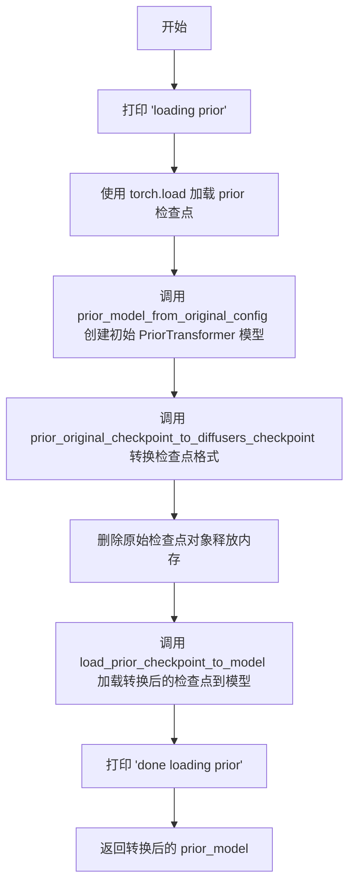

#### 带注释源码

```python
def prior(*, args, checkpoint_map_location):
    """
    加载并转换 prior 模型检查点
    
    参数:
        args: 命令行参数，包含 prior_checkpoint_path 等
        checkpoint_map_location: 加载检查点时使用的设备
    
    返回:
        PriorTransformer: 转换并加载完成的模型
    """
    print("loading prior")

    # 从指定路径加载原始格式的 prior 检查点
    # map_location 参数确保检查点被加载到指定设备
    prior_checkpoint = torch.load(args.prior_checkpoint_path, map_location=checkpoint_map_location)

    # 创建 PriorTransformer 模型实例，使用默认配置
    prior_model = prior_model_from_original_config()

    # 将原始检查点格式转换为 diffusers 格式
    # 这包括映射层名称、重组权重等操作
    prior_diffusers_checkpoint = prior_original_checkpoint_to_diffusers_checkpoint(prior_model, prior_checkpoint)

    # 显式删除原始检查点以释放内存
    del prior_checkpoint

    # 将转换后的检查点加载到模型中
    load_prior_checkpoint_to_model(prior_diffusers_checkpoint, prior_model)

    print("done loading prior")

    # 返回转换后的模型，可用于后续保存或推理
    return prior_model
```


### `prior_image`

该函数负责加载并转换 Shap-E 模型中的 prior_image（图像先验）检查点，将其从原始格式转换为 Diffusers 格式，然后加载到 PriorTransformer 模型实例中。

参数：

- `args`：`argparse.Namespace`，包含命令行参数，其中 `args.prior_image_checkpoint_path` 指定 prior_image 检查点的文件路径
- `checkpoint_map_location`：`torch.device`，指定加载检查点时使用的设备（如 CPU 或 CUDA）

返回值：`PriorTransformer`，转换并加载后的 prior_image 模型实例

#### 流程图

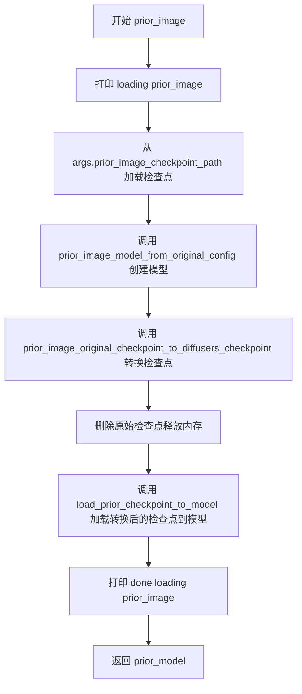

#### 带注释源码

```python
def prior_image(*, args, checkpoint_map_location):
    """
    加载 prior_image 检查点并转换为 Diffusers 格式模型
    
    参数:
        args: 命令行参数，包含 prior_image_checkpoint_path 等配置
        checkpoint_map_location: torch.device，检查点加载的目标设备
    
    返回:
        PriorTransformer: 转换并加载完成的 prior_image 模型
    """
    # 打印加载提示信息
    print("loading prior_image")
    
    # 从指定路径加载原始格式的 prior_image 检查点
    # map_location 参数确保检查点被加载到正确的设备上
    print(f"load checkpoint from {args.prior_image_checkpoint_path}")
    prior_checkpoint = torch.load(args.prior_image_checkpoint_path, map_location=checkpoint_map_location)
    
    # 使用 prior_image 专用配置创建 PriorTransformer 模型实例
    # 配置与 prior 不同，attention_head_dim 为 1024//8=128，num_attention_heads 为 8
    prior_model = prior_image_model_from_original_config()
    
    # 将原始检查点格式转换为 Diffusers 格式
    # 包括权重重命名、层映射等转换操作
    prior_diffusers_checkpoint = prior_image_original_checkpoint_to_diffusers_checkpoint(prior_model, prior_checkpoint)
    
    # 删除原始检查点以释放内存
    del prior_checkpoint
    
    # 将转换后的检查点加载到模型中
    # 使用临时文件方式加载，支持加载 clip_mean 和 clip_std 等预期缺失的键
    load_prior_checkpoint_to_model(prior_diffusers_checkpoint, prior_model)
    
    # 打印完成提示
    print("done loading prior_image")
    
    # 返回加载完成的模型实例
    return prior_model
```


### `renderer`

该函数是Shap-E模型转换脚本的核心组件之一，负责加载并转换renderer（发射器）模型的检查点。它首先从原始检查点文件加载权重，然后使用原始配置创建ShapERenderer模型，接着将原始检查点格式转换为diffusers格式，最后将转换后的权重加载到模型中并返回。

参数：

- `args`：`argparse.Namespace`，包含命令行参数，主要使用`args.transmitter_checkpoint_path`指定renderer检查点路径
- `checkpoint_map_location`：`torch.device`，指定加载检查点时使用的设备（如CPU或CUDA）

返回值：`ShapERenderer`，转换并加载完成的ShapERenderer模型实例

#### 流程图

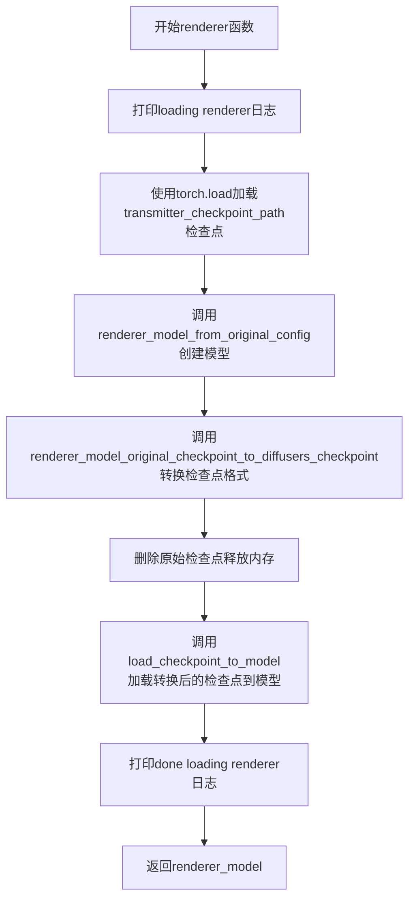

#### 带注释源码

```python
def renderer(*, args, checkpoint_map_location):
    """
    加载并转换renderer（发射器）模型的检查点。
    
    Args:
        args: 命令行参数对象，包含transmitter_checkpoint_path等配置
        checkpoint_map_location: torch.device，指定检查点加载的目标设备
    
    Returns:
        ShapERenderer: 转换并加载完成的renderer模型
    """
    # 打印加载开始日志，注意前面有空格用于日志格式化
    print(" loading renderer")

    # 从transmitter_checkpoint_path加载原始检查点
    # transmitter_checkpoint_path对应原始模型中的transmitter.pt
    renderer_checkpoint = torch.load(args.transmitter_checkpoint_path, map_location=checkpoint_map_location)

    # 根据原始配置创建ShapERenderer模型实例
    # 使用RENDERER_CONFIG字典中的配置参数
    renderer_model = renderer_model_from_original_config()

    # 将原始检查点格式转换为diffusers格式
    # 涉及MLP层、params_proj层、mesh_decoder等组件的权重映射
    renderer_diffusers_checkpoint = renderer_model_original_checkpoint_to_diffusers_checkpoint(
        renderer_model, renderer_checkpoint
    )

    # 删除原始检查点引用，释放内存
    del renderer_checkpoint

    # 使用strict=True严格加载检查点
    # 这会确保模型权重与检查点完全匹配
    load_checkpoint_to_model(renderer_diffusers_checkpoint, renderer_model, strict=True)

    # 打印加载完成日志
    print("done loading renderer")

    # 返回加载完成的renderer模型
    return renderer_model
```


### `load_prior_checkpoint_to_model`

该函数负责将转换后的 Diffusers 检查点（checkpoint）加载到 `PriorTransformer` 模型中。它通过临时文件中间媒介来管理内存，并执行严格的状态字典键验证，以确保模型权重的完整性和正确性，同时允许特定的已知缺失键（`clip_mean` 和 `clip_std`）。

参数：

-  `checkpoint`：`Dict[str, torch.Tensor]`，包含模型权重的字典，通常是转换后的 Diffusers 格式。
-  `model`：`torch.nn.Module`，目标模型实例（通常是 `PriorTransformer`），权重将被加载到此模型中。

返回值：`None`。该函数直接修改传入的 `model` 对象，不返回任何值。

#### 流程图

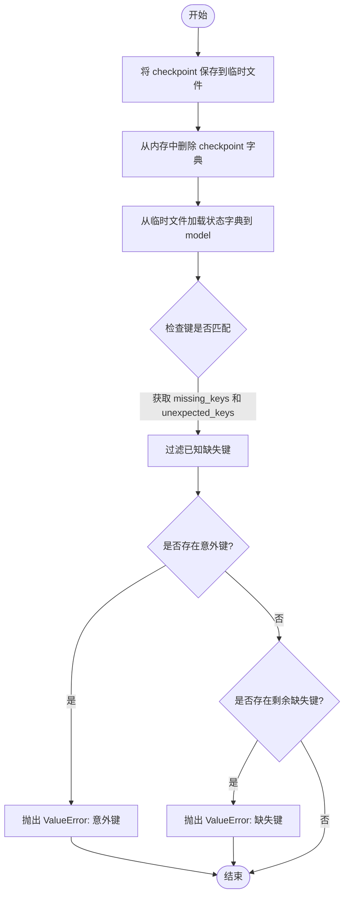

#### 带注释源码

```python
def load_prior_checkpoint_to_model(checkpoint, model):
    # 定义了预期的缺失键（这些键在原始模型中存在但转换后的模型不需要）
    # prior model will expect clip_mean and clip_std, which are missing from the state_dict
    PRIOR_EXPECTED_MISSING_KEYS = ["clip_mean", "clip_std"]

    # 使用临时文件来中转 checkpoint，可能是为了避免在内存中同时保留大字典和模型
    with tempfile.NamedTemporaryFile() as file:
        # 1. 将 checkpoint 字典保存到临时文件
        torch.save(checkpoint, file.name)
        
        # 2. 主动删除 checkpoint 字典以释放内存
        del checkpoint
        
        # 3. 从临时文件加载状态字典
        # strict=False 允许部分加载，即使某些键不完全匹配
        missing_keys, unexpected_keys = model.load_state_dict(torch.load(file.name), strict=False)
        
        # 4. 从缺失键列表中移除已知的预期缺失键
        missing_keys = list(set(missing_keys) - set(PRIOR_EXPECTED_MISSING_KEYS))

        # 5. 检查是否存在意外键（模型不应该有的权重），如果有则报错
        if len(unexpected_keys) > 0:
            raise ValueError(f"Unexpected keys when loading prior model: {unexpected_keys}")
        
        # 6. 检查是否存在缺失键（模型应该有但加载的权重中没有的），如果有则报错
        if len(missing_keys) > 0:
            raise ValueError(f"Missing keys when loading prior model: {missing_keys}")
```


### `load_checkpoint_to_model`

该函数用于将检查点（checkpoint）加载到指定的 PyTorch 模型中。它首先将检查点保存到临时文件，然后根据 `strict` 参数选择不同的加载方式：严格加载或使用 `accelerate` 库的自动设备映射加载。

参数：

- `checkpoint`：`Dict`，要加载的检查点字典，包含模型的权重参数
- `model`：`torch.nn.Module`，目标 PyTorch 模型对象
- `strict`：`bool`，控制在加载检查点时是否严格匹配模型参数键。默认为 `False`

返回值：`None`，该函数不返回任何值，仅执行模型权重的加载操作

#### 流程图

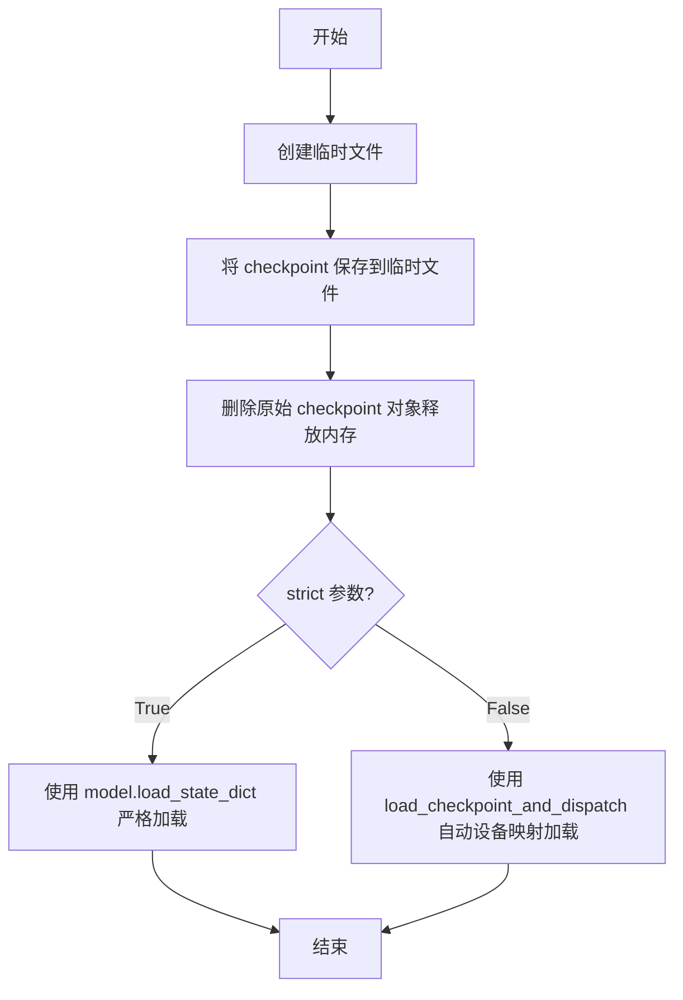

#### 带注释源码

```python
def load_checkpoint_to_model(checkpoint, model, strict=False):
    """
    将检查点加载到指定的 PyTorch 模型中。
    
    参数:
        checkpoint: 模型检查点字典
        model: 目标 PyTorch 模型
        strict: 是否严格匹配键，默认为 False
    """
    # 使用临时文件作为中介，避免直接传递大字典可能导致的问题
    with tempfile.NamedTemporaryFile() as file:
        # 将检查点保存到临时文件
        torch.save(checkpoint, file.name)
        # 显式删除原始检查点对象以释放内存
        del checkpoint
        
        # 根据 strict 参数选择加载方式
        if strict:
            # 严格模式：要求检查点中的键与模型参数完全匹配
            model.load_state_dict(torch.load(file.name), strict=True)
        else:
            # 非严格模式：使用 accelerate 库的自动设备映射功能
            # device_map="auto" 会自动将模型的不同层分配到不同设备
            load_checkpoint_and_dispatch(model, file.name, device_map="auto")
```

## 关键组件


### Prior模型配置与转换

将原始Shap-E的Prior模型检查点转换为Diffusers格式，包含时间嵌入、输入投影、位置编码、Transformer块和输出投影的映射

### Prior Image模型配置与转换

针对图像条件版本的Prior模型进行检查点转换，与主Prior模型类似但配置略有不同（注意力头数为8而非16）

### Renderer模型配置与转换

将渲染器（nerstf MLP和params_proj）的原始检查点转换为Diffusers格式，并创建 marching cubes 查找表用于网格解码

### Marching Cubes查找表

用于将体素网格转换为三角形mesh的查找表，包含256种情况下的边索引映射和掩码

### 注意力权重分割函数

将原始模型中的融合QKV权重和偏置分割为独立的query、key、value权重，适配Diffusers的注意力机制结构

### 检查点加载与分发

使用临时文件进行模型权重加载，Prior模型使用load_state_dict进行宽松加载（允许缺失键），Renderer模型使用accelerate的load_checkpoint_and_dispatch进行设备自动分发

### 命令行参数解析

支持Prior检查点、Prior Image检查点、Renderer检查点的单独或组合转换，支持调试模式和设备指定


## 问题及建议


### 已知问题

-   **代码重复**：函数 `prior_original_checkpoint_to_diffusers_checkpoint` 和 `prior_image_original_checkpoint_to_diffusers_checkpoint` 存在大量重复代码，仅在少量字段映射上有差异，应提取公共逻辑。
-   **临时文件滥用**：`load_prior_checkpoint_to_model` 和 `load_checkpoint_to_model` 使用 `tempfile.NamedTemporaryFile()` 保存检查点后再加载，这种方式效率低下且增加磁盘 I/O，应直接使用 `model.load_state_dict()`。
-   **缺少输入验证**：命令行参数 `prior_checkpoint_path`、`prior_image_checkpoint_path`、`transmitter_checkpoint_path` 等未验证文件是否存在或有效，可能导致运行时错误。
-   **硬编码的大型常量**：`MC_TABLE` 是一个包含 256 个元素的列表，直接硬编码在源码中约 2000 行，降低了代码可读性和可维护性，应考虑从外部文件加载或通过算法生成。
-   **魔法数字与字符串**：代码中多处使用魔法数字（如索引 `0`、`2`）和字符串（如 `"wrapped"`），应提取为命名常量以提高可读性。
-   **冗余常量**：`PRIOR_ORIGINAL_PREFIX` 和 `PRIOR_IMAGE_ORIGINAL_PREFIX` 均定义为 `"wrapped"`，属于重复定义。
-   **不恰当的错误处理**：使用 `assert` 进行运行时检查（如 `assert weights[weights_biases_idx] is None`），这些检查在 Python 优化模式下会被跳过，应使用正式的异常处理。
-   **TODO 未完成**：代码中存在 `print("YiYi TO-DO")` 的占位符，表明某处逻辑尚未实现。
-   **缺少类型注解**：函数参数和返回值缺少类型提示，影响代码的可维护性和静态分析。
-   **变量命名不清晰**：部分变量名过于简短（如 `idx`、`k`、`i`），缺乏描述性。

### 优化建议

-   将 `prior_original_checkpoint_to_diffusers_checkpoint` 和 `prior_image_original_checkpoint_to_diffusers_checkpoint` 的公共逻辑提取为基函数或模板方法，减少代码重复。
-   移除临时文件写入逻辑，直接使用 `model.load_state_dict(torch.load(...))` 加载检查点。
-   在脚本开头添加输入文件存在性检查，使用 `os.path.exists()` 验证路径。
-   将 `MC_TABLE` 数据移至独立的 JSON 或 pickle 文件，代码中仅保留加载逻辑。
-   定义枚举或常量类管理前缀字符串、索引值等魔法数字。
-   统一前缀常量定义，或使用配置文件管理不同模型的前缀。
-   将 `assert` 语句替换为 `raise ValueError` 或 `raise FileNotFoundError`。
-   实现 TODO 标记处的逻辑或删除该占位符代码。
-   为关键函数添加类型注解（如 `def prior(...) -> PriorTransformer:`）。
-   重命名循环变量为更具描述性的名称（如 `layer_idx` 代替 `idx`）。


## 其它


### 设计目标与约束

将 Shap-E 模型的预训练检查点从原始 OpenAI 格式转换为 Hugging Face diffusers 格式，支持三种模型的转换：文本条件 prior 模型、图像条件 prior_image 模型和渲染器（transmitter）模型。转换过程中必须保持模型权重的一致性，确保转换后的模型能够直接用于 diffusers 库中的 ShapEPipeline。代码设计为命令行工具，支持分阶段调试转换过程。

### 错误处理与异常设计

代码使用以下策略处理错误：检查点加载失败时抛出 FileNotFoundError；状态字典键不匹配时，prior 模型使用 expected_missing_keys 列表过滤已知缺失键（clip_mean、clip_std），如果存在意外键或未过滤的缺失键则抛出 ValueError；renderer 模型使用 strict=True 严格加载，任何键不匹配都会导致错误；临时文件操作失败时由 Python 运行时抛出异常。代码没有实现重试机制或详细的错误日志记录。

### 数据流与状态机

程序的数据流如下：命令行参数解析 → 检查点文件加载（torch.load）→ 创建目标架构的空模型 → 调用转换函数将原始检查点键映射到 diffusers 格式 → 使用临时文件间接加载状态字典 → 模型加载转换后的权重 → 保存到输出目录。程序支持 debug 参数实现有限状态机：None 状态执行所有转换（YiYi TODO 标记表明完整流程未完成），"prior" 状态仅转换 prior 模型，"prior_image" 状态仅转换 prior_image 模型，"renderer" 状态仅转换 renderer 模型。

### 外部依赖与接口契约

主要依赖包括：torch（张量操作和模型加载）、accelerate.load_checkpoint_and_dispatch（模型分发到设备）、diffusers.PriorTransformer（目标 prior 模型架构）、diffusers.pipelines.shap_e.ShapERenderer（目标渲染器架构）。输入接口为命令行参数：--prior_checkpoint_path、--prior_image_checkpoint_path、--transmitter_checkpoint_path 指定原始检查点路径，--dump_path 指定输出目录，--checkpoint_load_device 指定加载设备，--debug 指定调试阶段。输出为 Hugging Face diffusers 格式的模型目录，可通过 save_pretrained 保存。

### 配置管理

代码使用硬编码的全局字典配置：PRIOR_CONFIG（24层transformer，1024维嵌入，16个注意力头）、PRIOR_IMAGE_CONFIG（24层transformer，1024维嵌入，8个注意力头，增加 embedding_proj_norm 层）、RENDERER_CONFIG（空字典使用默认参数）。这些配置与原始 Shap-E 模型的架构紧密耦合，没有提供从配置文件或命令行动态调整配置的能力。MC_TABLE 是 marching cubes 算法的查找表，存储256种可能的几何情况映射。

### 安全考虑

代码在临时文件中保存检查点后立即删除，使用 tempfile.NamedTemporaryFile 确保文件在异常情况下也能清理。没有实现用户输入验证（除 argparse 的必需参数检查），没有敏感数据处理，没有网络请求，所有操作均为本地文件IO。内存管理方面使用 del 手动删除大对象（prior_checkpoint、renderer_checkpoint、diffusers_checkpoint），但转换后的检查点仍需完整保存在内存中直到临时文件写入完成。

### 性能优化与批处理

转换过程中存在以下性能特征：split_attentions 函数将融合的 QKV 权重矩阵按注意力头维度分割为独立的 q/k/v 权重，采用循环累加方式拼接张量，时间复杂度 O(n)。prior 和 prior_image 转换函数使用循环遍历每一层 transformer_blocks，对于24层模型需要24次迭代。create_mc_lookup_table 函数在每次调用时重新计算 MC_TABLE 的索引映射，可以预计算后硬编码以提高效率。模型加载使用 accelerate 库的 device_map="auto" 实现自动设备分配，但转换过程本身在 CPU 上执行。

### 版本控制与兼容性

代码依赖 diffusers 库中的 PriorTransformer 和 ShapERenderer 类，这些类的接口可能随版本变化。PRIOR_EXPECTED_MISSING_KEYS 列表硬编码了 "clip_mean" 和 "clip_std"，表明原始检查点可能缺少这些键。代码没有版本检测或兼容性检查机制。转换后的模型保存格式为 Hugging Face 标准格式（safetensors 或 pytorch_model.bin），具有良好的跨版本兼容性。

### 测试策略建议

代码中包含 "# TODO maybe document and/or can do more efficiently" 注释，表明开发者意识到需要优化。测试应覆盖：1）转换前后模型输出的一致性验证；2）三种模型单独转换和组合转换的完整性；3）边界情况（空检查点、损坏文件、权限错误）；4）不同设备（cpu/cuda）的加载兼容性；5）MC_TABLE 查找表正确性的单元测试。

### 关键组件信息

**PriorTransformer 转换模块**：负责将文本条件 prior 模型从原始格式转换为 diffusers 格式，包含 time_embedding、positional_embedding、transformer_blocks、norm_out 等层的权重映射。**PriorImageTransformer 转换模块**：负责将图像条件 prior 模型从原始格式转换，增加了 embedding_proj_norm 层处理图像嵌入。**Renderer 转换模块**：负责将渲染器模型（Neural Radiance Field MLP）转换为 diffusers 格式，包含 mlp 和 params_proj 组件，并处理 marching cubes 查找表的初始化。**Marching Cubes 查找表**：MC_TABLE 是256x?的边角映射表，用于将体素网格转换为三角网格，create_mc_lookup_table 函数将其转换为 PyTorch 张量格式以供渲染器使用。

### 潜在技术债务

代码存在以下可改进之处：1）prior 和 prior_image 转换函数存在大量重复代码（超过150行相似逻辑），应抽象为通用函数；2）create_mc_lookup_table 的索引映射可以预计算而非运行时计算；3）临时文件使用方式不够高效，可考虑直接使用 BytesIO；4）硬编码的配置值应提取为常量或配置文件；5）缺少详细的文档字符串和类型注解；6）YiYi TODO 注释表明完整流程尚未完成；7）debug 参数与主流程的耦合度较高，状态机实现不够优雅。

    