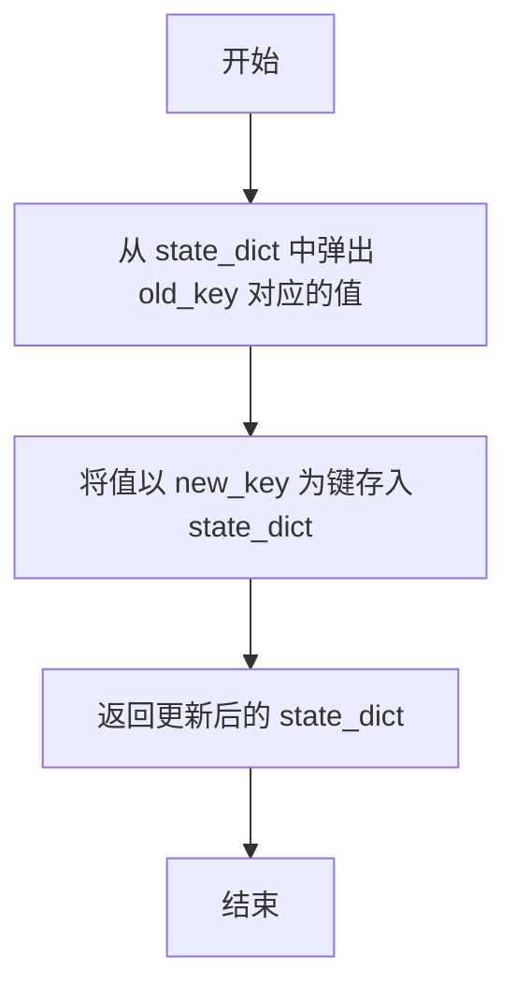
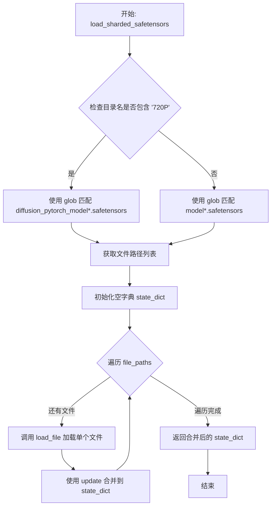
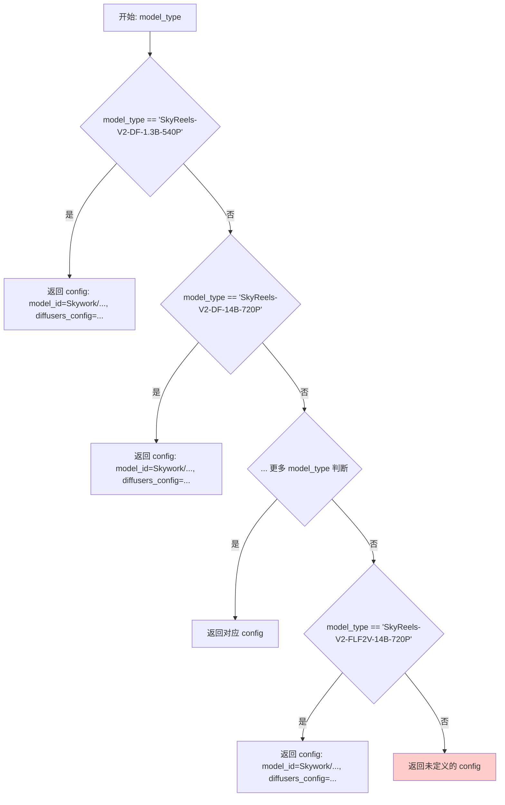
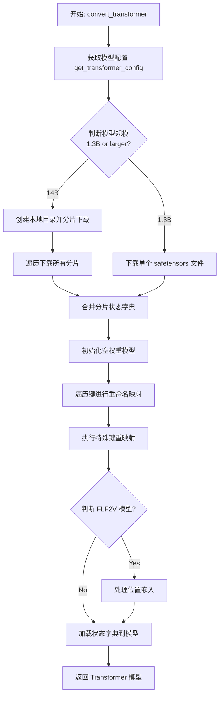
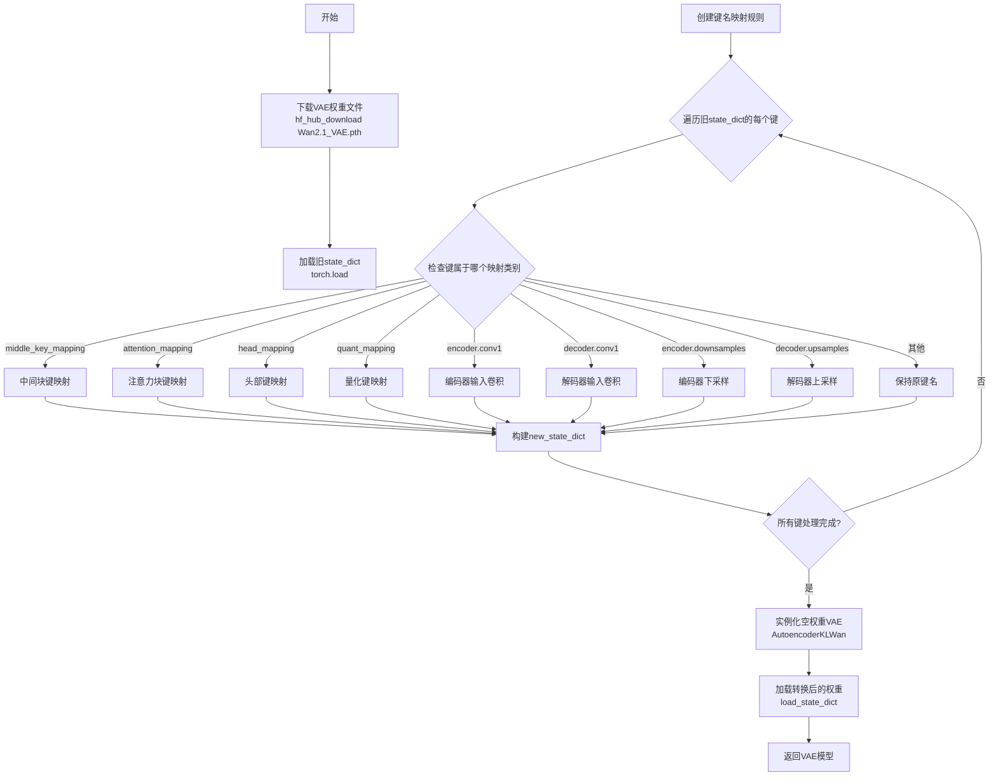
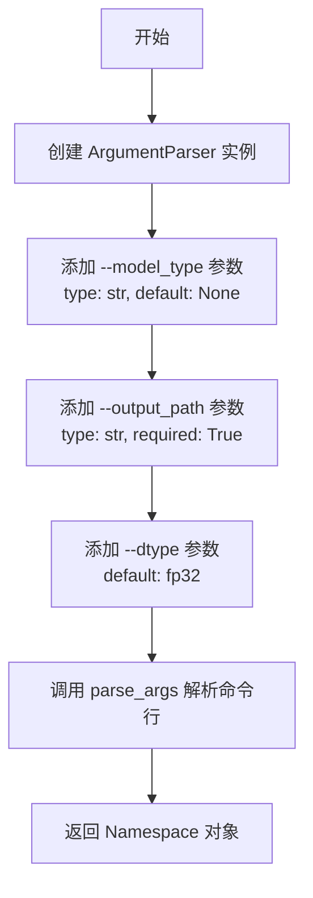

# `diffusers\scripts\convert_skyreelsv2_to_diffusers.py` 详细设计文档

这是一个模型权重转换脚本，用于将 SkyReels-V2 的原始检查点（Transformer、VAE）及其配置转换为 Hugging Face Diffusers 格式，支持 Text-to-Video (T2V)、Image-to-Video (I2V) 和 Diffusion Forcing (DF) 模型的转换与 pipeline 组装。

## 整体流程

```mermaid
graph TD
    A[开始: 解析命令行参数] --> B{获取 model_type}
    B --> C[调用 get_transformer_config]
    C --> D{判断模型规模 1.3B or 14B}
    D -- 1.3B --> E[下载单文件 model.safetensors]
    D -- 14B --> F[循环下载分片 safetensors]
    E --> G[调用 load_sharded_safetensors 合并 state_dict]
    F --> G
    G --> H[使用 init_empty_weights 初始化空模型]
    H --> I[遍历原始 key 进行重命名 (TRANSFORMER_KEYS_RENAME_DICT)]
    I --> J[调用 load_state_dict 加载权重]
    J --> K[返回 Transformer 对象]
    K --> L[调用 convert_vae 转换 VAE]
    L --> M[加载 UMT5 文本编码器]
    M --> N{判断 model_type 是否包含 I2V 或 FLF2V}
    N -- 是 --> O[加载 CLIP 图像编码器]
    N -- 否 --> P[根据类型选择 Pipeline 类 (T2V / I2V / DF)]
    O --> P
    P --> Q[实例化 SkyReelsV2*Pipeline]
    Q --> R[调用 save_pretrained 保存到本地]
```

## 类结构

```
SkyReelsV2Pipeline (主Pipeline)
├── SkyReelsV2Transformer3DModel (3D Diffusion Transformer)
├── UMT5EncoderModel (Text Encoder)
├── AutoencoderKLWan (VAE)
├── UniPCMultistepScheduler (Scheduler)
└── (可选) CLIPVisionModelWithProjection (Image Encoder for I2V)
```

## 全局变量及字段


### `TRANSFORMER_KEYS_RENAME_DICT`
    
用于将原始模型的键名映射到 Diffusers 模型的键名的字典

类型：`Dict[str, str]`
    


### `TRANSFORMER_SPECIAL_KEYS_REMAP`
    
用于处理特殊的键名重映射逻辑的字典，当前为空

类型：`Dict[str, Any]`
    


### `DTYPE_MAPPING`
    
映射字符串 dtype (fp32/fp16/bf16) 到 torch dtype 对象的字典

类型：`Dict[str, torch.dtype]`
    


### `middle_key_mapping`
    
局部字典，用于 VAE 中间块键名映射

类型：`Dict[str, str]`
    


### `attention_mapping`
    
局部字典，用于 VAE 注意力块键名映射

类型：`Dict[str, str]`
    


### `head_mapping`
    
局部字典，用于 VAE 头部键名映射

类型：`Dict[str, str]`
    


### `quant_mapping`
    
局部字典，用于 VAE 量化块键名映射

类型：`Dict[str, str]`
    


    

## 全局函数及方法


### `update_state_dict_`

该函数用于更新模型状态字典中的键名，将旧的键名替换为新的键名，实现模型权重的键名映射转换。

参数：

- `state_dict`：`Dict[str, Any]`，需要更新的模型状态字典，包含模型权重等数据
- `old_key`：`str`，状态字典中需要被替换的旧键名
- `new_key`：`str`，用于替换旧键名的新键名

返回值：`dict[str, Any]`，更新键名后的状态字典

#### 流程图



#### 带注释源码

```python
def update_state_dict_(state_dict: Dict[str, Any], old_key: str, new_key: str) -> dict[str, Any]:
    """
    更新状态字典中的键名，将旧键名替换为新键名。
    
    参数:
        state_dict: 模型状态字典，包含权重等参数
        old_key: 需要被替换的旧键名
        new_key: 新的键名
    
    返回:
        更新后的状态字典
    """
    # 使用 pop 方法取出旧键对应的值，同时从字典中删除该键值对
    # 然后将取出的值以新键名存入字典，实现键名重命名
    state_dict[new_key] = state_dict.pop(old_key)
```


### `load_sharded_safetensors`

该函数用于从指定目录加载所有的 safetensors 文件，并根据目录名称中的分辨率标识（720P 或其他）采用不同的文件命名模式进行匹配，最后将所有分片的状态字典合并为一个完整的状态字典返回。

参数：

- `dir`：`pathlib.Path`，待加载的 safetensors 文件所在目录路径

返回值：`Dict[str, Any]`，合并后的模型状态字典，包含所有 safetensors 文件中的键值对

#### 流程图



#### 带注释源码

```python
def load_sharded_safetensors(dir: pathlib.Path):
    """
    加载目录下所有的 safetensors 文件并合并状态字典
    
    Args:
        dir: pathlib.Path, 包含 safetensors 分片文件的目录路径
        
    Returns:
        Dict[str, Any]: 合并后的模型状态字典
    """
    # 根据目录名判断分辨率类型，720P 模型使用不同的文件命名模式
    if "720P" in str(dir):
        # 720P 分辨率模型使用 diffusion_pytorch_model 前缀
        file_paths = list(dir.glob("diffusion_pytorch_model*.safetensors"))
    else:
        # 其他分辨率（540P）使用 model 前缀
        file_paths = list(dir.glob("model*.safetensors"))
    
    # 初始化空的状态字典用于合并
    state_dict = {}
    
    # 遍历所有匹配的分片文件并逐个加载合并
    for path in file_paths:
        # 使用 safetensors.torch.load_file 加载单个文件
        # 返回该分片的键值对字典
        state_dict.update(load_file(path))
    
    # 返回合并后的完整状态字典
    return state_dict
```

---

### 补充信息

#### 关键组件

| 组件 | 描述 |
|------|------|
| `pathlib.Path.glob()` | 用于根据模式匹配目录下的文件 |
| `safetensors.torch.load_file` | 高效加载 safetensors 格式的模型权重文件 |
| `dict.update()` | 用于将多个分片的状态字典合并 |

#### 潜在技术债务与优化空间

1. **硬编码的分辨率判断逻辑**：通过字符串包含 "720P" 来判断模型类型的方式较为脆弱，建议使用配置文件或枚举类型来明确区分模型规格。
2. **缺乏错误处理**：如果目录不存在或没有匹配的文件，函数会返回空字典，可能导致后续调用失败时难以定位问题。
3. **文件顺序依赖**：使用 `glob` 返回的文件顺序可能不确定，如果模型分片之间存在顺序依赖，可能导致状态字典键的覆盖顺序不可控。
4. **内存占用**：一次性加载所有分片到内存中，对于超大模型可能导致内存压力，可考虑流式加载或内存映射。

#### 其他设计考量

- **文件命名约定依赖**：函数假设 720P 模型使用 `diffusion_pytorch_model*.safetensors` 命名，其他使用 `model*.safetensors`，这与上游模型的导出方式紧密耦合。
- **返回值语义**：返回的字典直接来自 `load_file`，保留了原始的键名，可能需要配合 `TRANSFORMER_KEYS_RENAME_DICT` 进行后续的名称转换。
- **调用上下文**：该函数在 `convert_transformer` 中被调用，用于加载分片的 transformer 模型权重。


### `get_transformer_config`

该函数根据输入的模型类型（model_type）返回对应的 HuggingFace 模型 ID 和 Diffusers 配置字典，用于模型转换和加载。

参数：

- `model_type`：`str`，模型类型标识符，如 "SkyReels-V2-DF-1.3B-540P"、"SkyReels-V2-T2V-14B-720P" 等

返回值：`dict[str, Any]`，包含两个键的字典：
  - `model_id`：HuggingFace 模型仓库标识符（字符串）
  - `diffusers_config`：Diffusers 模型配置字典，包含注意力头维度、层数、隐藏层维度等参数

#### 流程图



#### 带注释源码

```python
def get_transformer_config(model_type: str) -> dict[str, Any]:
    """
    根据模型类型返回对应的 HuggingFace 模型 ID 和 Diffusers 配置字典。
    
    参数:
        model_type: str, 模型类型标识符, 支持以下类型:
            - SkyReels-V2-DF-1.3B-540P (Diffusion Forcing, 1.3B参数, 540P分辨率)
            - SkyReels-V2-DF-14B-720P (Diffusion Forcing, 14B参数, 720P分辨率)
            - SkyReels-V2-DF-14B-540P (Diffusion Forcing, 14B参数, 540P分辨率)
            - SkyReels-V2-T2V-14B-720P (Text-to-Video, 14B参数, 720P分辨率)
            - SkyReels-V2-T2V-14B-540P (Text-to-Video, 14B参数, 540P分辨率)
            - SkyReels-V2-I2V-1.3B-540P (Image-to-Video, 1.3B参数, 540P分辨率)
            - SkyReels-V2-I2V-14B-540P (Image-to-Video, 14B参数, 540P分辨率)
            - SkyReels-V2-I2V-14B-720P (Image-to-Video, 14B参数, 720P分辨率)
            - SkyReels-V2-FLF2V-1.3B-540P (Face Lip Sync + First Frame to Video, 1.3B参数)
            - SkyReels-V2-FLF2V-14B-540P (Face Lip Sync + First Frame to Video, 14B参数)
            - SkyReels-V2-FLF2V-14B-720P (Face Lip Sync + First Frame to Video, 14B参数)
    
    返回:
        dict[str, Any]: 包含以下键的字典:
            - model_id: HuggingFace 模型仓库标识符 (如 "Skywork/SkyReels-V2-DF-1.3B-540P")
            - diffusers_config: Diffusers 配置字典, 包含模型架构参数:
                - added_kv_proj_dim: 添加的 KV 投影维度 (I2V/FLF2V 模型需要)
                - attention_head_dim: 注意力头维度
                - cross_attn_norm: 是否使用交叉注意力归一化
                - eps: 归一化 epsilon 值
                - ffn_dim: 前馈网络隐藏层维度
                - freq_dim: 频率嵌入维度
                - in_channels: 输入通道数 (T2V/DF为16, I2V/FLF2V为36)
                - num_attention_heads: 注意力头数量
                - inject_sample_info: 是否注入采样信息
                - num_layers: Transformer 层数
                - out_channels: 输出通道数
                - patch_size: 空间时间 patch 大小 [1, 2, 2]
                - qk_norm: QK 归一化类型
                - text_dim: 文本嵌入维度
                - image_dim: 图像嵌入维度 (I2V/FLF2V 模型需要)
                - pos_embed_seq_len: 位置编码序列长度 (FLF2V 模型需要)
    """
    # Diffusion Forcing 模型配置 - 1.3B 参数, 540P 分辨率
    if model_type == "SkyReels-V2-DF-1.3B-540P":
        config = {
            "model_id": "Skywork/SkyReels-V2-DF-1.3B-540P",
            "diffusers_config": {
                "added_kv_proj_dim": None,  # DF 模型不需要额外的 KV 投影
                "attention_head_dim": 128,  # 注意力头维度
                "cross_attn_norm": True,     # 启用交叉注意力归一化
                "eps": 1e-06,                # RMS Norm epsilon
                "ffn_dim": 8960,             # 前馈网络维度 (1.3B 模型)
                "freq_dim": 256,             # 频率嵌入维度
                "in_channels": 16,          # 输入通道数 (latent channels)
                "num_attention_heads": 12,   # 注意力头数量 (1.3B 模型)
                "inject_sample_info": True,  # 注入采样信息
                "num_layers": 30,            # Transformer 层数 (1.3B 模型)
                "out_channels": 16,          # 输出通道数
                "patch_size": [1, 2, 2],     # 时空 patch 尺寸
                "qk_norm": "rms_norm_across_heads",  # QK 归一化方式
                "text_dim": 4096,            # 文本嵌入维度 (UMT5)
            },
        }
    # Diffusion Forcing 模型配置 - 14B 参数, 720P 分辨率
    elif model_type == "SkyReels-V2-DF-14B-720P":
        config = {
            "model_id": "Skywork/SkyReels-V2-DF-14B-720P",
            "diffusers_config": {
                "added_kv_proj_dim": None,
                "attention_head_dim": 128,
                "cross_attn_norm": True,
                "eps": 1e-06,
                "ffn_dim": 13824,            # 14B 模型使用更大的 FFN
                "freq_dim": 256,
                "in_channels": 16,
                "num_attention_heads": 40,   # 14B 模型使用更多注意力头
                "inject_sample_info": False, # 720P 模型不注入采样信息
                "num_layers": 40,            # 14B 模型使用更多层
                "out_channels": 16,
                "patch_size": [1, 2, 2],
                "qk_norm": "rms_norm_across_heads",
                "text_dim": 4096,
            },
        }
    # Diffusion Forcing 模型配置 - 14B 参数, 540P 分辨率
    elif model_type == "SkyReels-V2-DF-14B-540P":
        config = {
            "model_id": "Skywork/SkyReels-V2-DF-14B-540P",
            "diffusers_config": {
                "added_kv_proj_dim": None,
                "attention_head_dim": 128,
                "cross_attn_norm": True,
                "eps": 1e-06,
                "ffn_dim": 13824,
                "freq_dim": 256,
                "in_channels": 16,
                "num_attention_heads": 40,
                "inject_sample_info": False,
                "num_layers": 40,
                "out_channels": 16,
                "patch_size": [1, 2, 2],
                "qk_norm": "rms_norm_across_heads",
                "text_dim": 4096,
            },
        }
    # Text-to-Video 模型配置 - 14B 参数, 720P 分辨率
    elif model_type == "SkyReels-V2-T2V-14B-720P":
        config = {
            "model_id": "Skywork/SkyReels-V2-T2V-14B-720P",
            "diffusers_config": {
                "added_kv_proj_dim": None,
                "attention_head_dim": 128,
                "cross_attn_norm": True,
                "eps": 1e-06,
                "ffn_dim": 13824,
                "freq_dim": 256,
                "in_channels": 16,
                "num_attention_heads": 40,
                "inject_sample_info": False,
                "num_layers": 40,
                "out_channels": 16,
                "patch_size": [1, 2, 2],
                "qk_norm": "rms_norm_across_heads",
                "text_dim": 4096,
            },
        }
    # Text-to-Video 模型配置 - 14B 参数, 540P 分辨率
    elif model_type == "SkyReels-V2-T2V-14B-540P":
        config = {
            "model_id": "Skywork/SkyReels-V2-T2V-14B-540P",
            "diffusers_config": {
                "added_kv_proj_dim": None,
                "attention_head_dim": 128,
                "cross_attn_norm": True,
                "eps": 1e-06,
                "ffn_dim": 13824,
                "freq_dim": 256,
                "in_channels": 16,
                "num_attention_heads": 40,
                "inject_sample_info": False,
                "num_layers": 40,
                "out_channels": 16,
                "patch_size": [1, 2, 2],
                "qk_norm": "rms_norm_across_heads",
                "text_dim": 4096,
            },
        }
    # Image-to-Video 模型配置 - 1.3B 参数, 540P 分辨率
    elif model_type == "SkyReels-V2-I2V-1.3B-540P":
        config = {
            "model_id": "Skywork/SkyReels-V2-I2V-1.3B-540P",
            "diffusers_config": {
                "added_kv_proj_dim": 1536,   # I2V 模型需要图像条件的 KV 投影
                "attention_head_dim": 128,
                "cross_attn_norm": True,
                "eps": 1e-06,
                "ffn_dim": 8960,
                "freq_dim": 256,
                "in_channels": 36,           # I2V 模型输入通道数更多 (包含图像条件)
                "num_attention_heads": 12,
                "inject_sample_info": False,
                "num_layers": 30,
                "out_channels": 16,
                "patch_size": [1, 2, 2],
                "qk_norm": "rms_norm_across_heads",
                "text_dim": 4096,
                "image_dim": 1280,            # 图像嵌入维度 (CLIP ViT-H/14 输出)
            },
        }
    # Image-to-Video 模型配置 - 14B 参数, 540P 分辨率
    elif model_type == "SkyReels-V2-I2V-14B-540P":
        config = {
            "model_id": "Skywork/SkyReels-V2-I2V-14B-540P",
            "diffusers_config": {
                "added_kv_proj_dim": 5120,   # 14B 模型需要更大的图像条件投影
                "attention_head_dim": 128,
                "cross_attn_norm": True,
                "eps": 1e-06,
                "ffn_dim": 13824,
                "freq_dim": 256,
                "in_channels": 36,
                "num_attention_heads": 40,
                "inject_sample_info": False,
                "num_layers": 40,
                "out_channels": 16,
                "patch_size": [1, 2, 2],
                "qk_norm": "rms_norm_across_heads",
                "text_dim": 4096,
                "image_dim": 1280,
            },
        }
    # Image-to-Video 模型配置 - 14B 参数, 720P 分辨率
    elif model_type == "SkyReels-V2-I2V-14B-720P":
        config = {
            "model_id": "Skywork/SkyReels-V2-I2V-14B-720P",
            "diffusers_config": {
                "added_kv_proj_dim": 5120,
                "attention_head_dim": 128,
                "cross_attn_norm": True,
                "eps": 1e-06,
                "ffn_dim": 13824,
                "freq_dim": 256,
                "in_channels": 36,
                "num_attention_heads": 40,
                "inject_sample_info": False,
                "num_layers": 40,
                "out_channels": 16,
                "patch_size": [1, 2, 2],
                "qk_norm": "rms_norm_across_heads",
                "text_dim": 4096,
                "image_dim": 1280,
            },
        }
    # Face Lip Sync + First Frame to Video 模型配置 - 1.3B 参数, 540P
    # 注意: FLF2V 模型复用了 I2V 的模型 ID (可能是数据共享)
    elif model_type == "SkyReels-V2-FLF2V-1.3B-540P":
        config = {
            "model_id": "Skywork/SkyReels-V2-I2V-1.3B-540P",
            "diffusers_config": {
                "added_kv_proj_dim": 1536,
                "attention_head_dim": 128,
                "cross_attn_norm": True,
                "eps": 1e-06,
                "ffn_dim": 8960,
                "freq_dim": 256,
                "in_channels": 36,
                "num_attention_heads": 12,
                "inject_sample_info": False,
                "num_layers": 30,
                "out_channels": 16,
                "patch_size": [1, 2, 2],
                "qk_norm": "rms_norm_across_heads",
                "text_dim": 4096,
                "image_dim": 1280,
                "pos_embed_seq_len": 514,     # FLF2V 特定: 位置编码序列长度
            },
        }
    # Face Lip Sync + First Frame to Video 模型配置 - 14B 参数, 540P
    elif model_type == "SkyReels-V2-FLF2V-14B-540P":
        config = {
            "model_id": "Skywork/SkyReels-V2-I2V-14B-540P",
            "diffusers_config": {
                "added_kv_proj_dim": 5120,
                "attention_head_dim": 128,
                "cross_attn_norm": True,
                "eps": 1e-06,
                "ffn_dim": 13824,
                "freq_dim": 256,
                "in_channels": 36,
                "num_attention_heads": 40,
                "inject_sample_info": False,
                "num_layers": 40,
                "out_channels": 16,
                "patch_size": [1, 2, 2],
                "qk_norm": "rms_norm_across_heads",
                "text_dim": 4096,
                "image_dim": 1280,
                "pos_embed_seq_len": 514,
            },
        }
    # Face Lip Sync + First Frame to Video 模型配置 - 14B 参数, 720P
    elif model_type == "SkyReels-V2-FLF2V-14B-720P":
        config = {
            "model_id": "Skywork/SkyReels-V2-I2V-14B-720P",
            "diffusers_config": {
                "added_kv_proj_dim": 5120,
                "attention_head_dim": 128,
                "cross_attn_norm": True,
                "eps": 1e-06,
                "ffn_dim": 13824,
                "freq_dim": 256,
                "in_channels": 36,
                "num_attention_heads": 40,
                "inject_sample_info": False,
                "num_layers": 40,
                "out_channels": 16,
                "patch_size": [1, 2, 2],
                "qk_norm": "rms_norm_across_heads",
                "text_dim": 4096,
                "image_dim": 1280,
                "pos_embed_seq_len": 514,
            },
        }
    return config
```


### `convert_transformer`

核心转换函数，负责下载、加载、键名重命名并实例化 Transformer 模型。

参数：

- `model_type`：`str`，模型类型标识符（如 "SkyReels-V2-DF-1.3B-540P" 等），用于确定模型配置、下载路径和分片策略

返回值：`SkyReelsV2Transformer3DModel`，重命名后的 Diffusers 格式 Transformer 模型实例

#### 流程图



#### 带注释源码

```python
def convert_transformer(model_type: str):
    """
    核心转换函数，负责下载、加载、键名重命名并实例化 Transformer 模型
    
    参数:
        model_type: str, 模型类型标识符（如 "SkyReels-V2-DF-1.3B-540P" 等）
        
    返回:
        SkyReelsV2Transformer3DModel: 重命名后的 Diffusers 格式 Transformer 模型实例
    """
    # 步骤1: 根据模型类型获取对应的配置信息（包含模型ID和diffusers配置）
    config = get_transformer_config(model_type)
    diffusers_config = config["diffusers_config"]
    model_id = config["model_id"]

    # 步骤2: 根据模型规模选择不同的下载策略
    if "1.3B" in model_type:
        # 小模型直接下载单个 safetensors 文件
        original_state_dict = load_file(hf_hub_download(model_id, "model.safetensors"))
    else:
        # 大模型需要分片下载
        os.makedirs(model_type, exist_ok=True)
        model_dir = pathlib.Path(model_type)
        
        # 根据分辨率和模型类型确定分片数量和命名规则
        if "720P" in model_type:
            top_shard = 7 if "I2V" in model_type else 6
            zeros = "0" * (4 if "I2V" or "T2V" in model_type else 3)
            model_name = "diffusion_pytorch_model"
        elif "540P" in model_type:
            top_shard = 14 if "I2V" in model_type else 12
            model_name = "model"

        # 循环下载所有分片文件
        for i in range(1, top_shard + 1):
            shard_path = f"{model_name}-{i:05d}-of-{zeros}{top_shard}.safetensors"
            hf_hub_download(model_id, shard_path, local_dir=model_dir)
        
        # 加载合并所有分片的状态字典
        original_state_dict = load_sharded_safetensors(model_dir)

    # 步骤3: 使用空权重初始化目标 Transformer 模型结构
    with init_empty_weights():
        transformer = SkyReelsV2Transformer3DModel.from_config(diffusers_config)

    # 步骤4: 遍历状态字典中的所有键，应用键名重命名映射
    for key in list(original_state_dict.keys()):
        new_key = key[:]
        for replace_key, rename_key in TRANSFORMER_KEYS_RENAME_DICT.items():
            new_key = new_key.replace(replace_key, rename_key)
        # 更新字典中的键名
        update_state_dict_(original_state_dict, key, new_key)

    # 步骤5: 应用特殊键的重映射处理（当前为空操作，预留扩展）
    for key in list(original_state_dict.keys()):
        for special_key, handler_fn_inplace in TRANSFORMER_SPECIAL_KEYS_REMAP.items():
            if special_key not in key:
                continue
            handler_fn_inplace(key, original_state_dict)

    # 步骤6: 针对 FLF2V 模型特殊处理位置嵌入
    if "FLF2V" in model_type:
        if (
            hasattr(transformer.condition_embedder, "image_embedder")
            and hasattr(transformer.condition_embedder.image_embedder, "pos_embed")
            and transformer.condition_embedder.image_embedder.pos_embed is not None
        ):
            # 获取目标位置嵌入的形状，并用零填充
            pos_embed_shape = transformer.condition_embedder.image_embedder.pos_embed.shape
            original_state_dict["condition_embedder.image_embedder.pos_embed"] = torch.zeros(pos_embed_shape)

    # 步骤7: 将重命名后的状态字典加载到模型中
    transformer.load_state_dict(original_state_dict, strict=True, assign=True)
    return transformer
```


### `convert_vae`

该函数是核心的VAE模型转换模块，负责从HuggingFace Hub下载Wan2.1 VAE权重文件，解析旧格式的权重状态字典，通过预定义的复杂键名映射规则将原始键名转换为Diffusers兼容的键名体系，最终实例化AutoencoderKLWan模型并加载转换后的权重，返回可用于Diffuserspipeline的VAE模型实例。

参数：

- 无参数

返回值：`AutoencoderKLWan`，返回转换并加载权重后的VAE模型实例

#### 流程图



#### 带注释源码

```python
def convert_vae():
    """
    核心转换函数：负责下载VAE权重、进行键名映射转换并实例化VAE模型
    
    该函数执行以下步骤：
    1. 从HuggingFace Hub下载Wan2.1 VAE权重文件
    2. 加载旧格式的权重状态字典
    3. 通过多个映射字典将旧键名转换为Diffusers兼容的键名
    4. 实例化AutoencoderKLWan模型
    5. 加载转换后的权重并返回模型
    """
    # 步骤1: 从HuggingFace Hub下载预训练的VAE权重文件
    # 模型ID: Wan-AI/Wan2.1-T2V-14B，文件名: Wan2.1_VAE.pth
    vae_ckpt_path = hf_hub_download("Wan-AI/Wan2.1-T2V-14B", "Wan2.1_VAE.pth")
    
    # 步骤2: 使用torch加载权重文件
    # weights_only=True表示只加载权重数据，不加载Python对象
    old_state_dict = torch.load(vae_ckpt_path, weights_only=True)
    
    # 初始化新的状态字典，用于存储转换后的键值对
    new_state_dict = {}

    # ===== 创建中间块键名映射 =====
    # 映射规则：将旧格式的encoder/decoder.middle块键名
    # 转换为Diffusers格式的mid_block.resnets键名
    # 包含两个resnet块，每个块有norm1、conv1、norm2、conv2四个组件
    middle_key_mapping = {
        # Encoder middle block - 第一个resnet块
        "encoder.middle.0.residual.0.gamma": "encoder.mid_block.resnets.0.norm1.gamma",
        "encoder.middle.0.residual.2.bias": "encoder.mid_block.resnets.0.conv1.bias",
        "encoder.middle.0.residual.2.weight": "encoder.mid_block.resnets.0.conv1.weight",
        "encoder.middle.0.residual.3.gamma": "encoder.mid_block.resnets.0.norm2.gamma",
        "encoder.middle.0.residual.6.bias": "encoder.mid_block.resnets.0.conv2.bias",
        "encoder.middle.0.residual.6.weight": "encoder.mid_block.resnets.0.conv2.weight",
        # Encoder middle block - 第二个resnet块
        "encoder.middle.2.residual.0.gamma": "encoder.mid_block.resnets.1.norm1.gamma",
        "encoder.middle.2.residual.2.bias": "encoder.mid_block.resnets.1.conv1.bias",
        "encoder.middle.2.residual.2.weight": "encoder.mid_block.resnets.1.conv1.weight",
        "encoder.middle.2.residual.3.gamma": "encoder.mid_block.resnets.1.norm2.gamma",
        "encoder.middle.2.residual.6.bias": "encoder.mid_block.resnets.1.conv2.bias",
        "encoder.middle.2.residual.6.weight": "encoder.mid_block.resnets.1.conv2.weight",
        # Decoder middle block - 第一个resnet块
        "decoder.middle.0.residual.0.gamma": "decoder.mid_block.resnets.0.norm1.gamma",
        "decoder.middle.0.residual.2.bias": "decoder.mid_block.resnets.0.conv1.bias",
        "decoder.middle.0.residual.2.weight": "decoder.mid_block.resnets.0.conv1.weight",
        "decoder.middle.0.residual.3.gamma": "decoder.mid_block.resnets.0.norm2.gamma",
        "decoder.middle.0.residual.6.bias": "decoder.mid_block.resnets.0.conv2.bias",
        "decoder.middle.0.residual.6.weight": "decoder.mid_block.resnets.0.conv2.weight",
        # Decoder middle block - 第二个resnet块
        "decoder.middle.2.residual.0.gamma": "decoder.mid_block.resnets.1.norm1.gamma",
        "decoder.middle.2.residual.2.bias": "decoder.mid_block.resnets.1.conv1.bias",
        "decoder.middle.2.residual.2.weight": "decoder.mid_block.resnets.1.conv1.weight",
        "decoder.middle.2.residual.3.gamma": "decoder.mid_block.resnets.1.norm2.gamma",
        "decoder.middle.2.residual.6.bias": "decoder.mid_block.resnets.1.conv2.bias",
        "decoder.middle.2.residual.6.weight": "decoder.mid_block.resnets.1.conv2.weight",
    }

    # ===== 创建注意力块键名映射 =====
    # 映射规则：将旧格式的middle块注意力层键名
    # 转换为Diffusers格式的mid_block.attentions键名
    # 包含norm、to_qkv、proj三个组件
    attention_mapping = {
        # Encoder middle attention
        "encoder.middle.1.norm.gamma": "encoder.mid_block.attentions.0.norm.gamma",
        "encoder.middle.1.to_qkv.weight": "encoder.mid_block.attentions.0.to_qkv.weight",
        "encoder.middle.1.to_qkv.bias": "encoder.mid_block.attentions.0.to_qkv.bias",
        "encoder.middle.1.proj.weight": "encoder.mid_block.attentions.0.proj.weight",
        "encoder.middle.1.proj.bias": "encoder.mid_block.attentions.0.proj.bias",
        # Decoder middle attention
        "decoder.middle.1.norm.gamma": "decoder.mid_block.attentions.0.norm.gamma",
        "decoder.middle.1.to_qkv.weight": "decoder.mid_block.attentions.0.to_qkv.weight",
        "decoder.middle.1.to_qkv.bias": "decoder.mid_block.attentions.0.to_qkv.bias",
        "decoder.middle.1.proj.weight": "decoder.mid_block.attentions.0.proj.weight",
        "decoder.middle.1.proj.bias": "decoder.mid_block.attentions.0.proj.bias",
    }

    # ===== 创建头部组件键名映射 =====
    # 映射规则：将encoder/decoder.head的3层结构
    # 转换为Diffusers格式的norm_out和conv_out
    # 旧格式: head.0(gamma), head.2(bias/weight)
    # 新格式: norm_out, conv_out
    head_mapping = {
        # Encoder head
        "encoder.head.0.gamma": "encoder.norm_out.gamma",
        "encoder.head.2.bias": "encoder.conv_out.bias",
        "encoder.head.2.weight": "encoder.conv_out.weight",
        # Decoder head
        "decoder.head.0.gamma": "decoder.norm_out.gamma",
        "decoder.head.2.bias": "decoder.conv_out.bias",
        "decoder.head.2.weight": "decoder.conv_out.weight",
    }

    # ===== 创建量化组件键名映射 =====
    # 映射规则：将quant块的conv1/conv2
    # 转换为quant_conv和post_quant_conv
    quant_mapping = {
        "conv1.weight": "quant_conv.weight",
        "conv1.bias": "quant_conv.bias",
        "conv2.weight": "post_quant_conv.weight",
        "conv2.bias": "post_quant_conv.bias",
    }

    # ===== 处理每个键名并进行转换 =====
    for key, value in old_state_dict.items():
        # 处理中间块键名
        if key in middle_key_mapping:
            new_key = middle_key_mapping[key]
            new_state_dict[new_key] = value
        # 处理注意力块键名
        elif key in attention_mapping:
            new_key = attention_mapping[key]
            new_state_dict[new_key] = value
        # 处理头部键名
        elif key in head_mapping:
            new_key = head_mapping[key]
            new_state_dict[new_key] = value
        # 处理量化键名
        elif key in quant_mapping:
            new_key = quant_mapping[key]
            new_state_dict[new_key] = value
        # 处理编码器输入卷积 - conv1 -> conv_in
        elif key == "encoder.conv1.weight":
            new_state_dict["encoder.conv_in.weight"] = value
        elif key == "encoder.conv1.bias":
            new_state_dict["encoder.conv_in.bias"] = value
        # 处理解码器输入卷积 - conv1 -> conv_in
        elif key == "decoder.conv1.weight":
            new_state_dict["decoder.conv_in.weight"] = value
        elif key == "decoder.conv1.bias":
            new_state_dict["decoder.conv_in.bias"] = value
        # 处理编码器下采样层
        # 旧格式: encoder.downsamples.X.residual.Y.component
        # 新格式: encoder.down_blocks.X.resnets.Y.component
        elif key.startswith("encoder.downsamples."):
            # 转换为down_blocks
            new_key = key.replace("encoder.downsamples.", "encoder.down_blocks.")
            
            # 转换residual块命名规则
            if ".residual.0.gamma" in new_key:
                new_key = new_key.replace(".residual.0.gamma", ".norm1.gamma")
            elif ".residual.2.bias" in new_key:
                new_key = new_key.replace(".residual.2.bias", ".conv1.bias")
            elif ".residual.2.weight" in new_key:
                new_key = new_key.replace(".residual.2.weight", ".conv1.weight")
            elif ".residual.3.gamma" in new_key:
                new_key = new_key.replace(".residual.3.gamma", ".norm2.gamma")
            elif ".residual.6.bias" in new_key:
                new_key = new_key.replace(".residual.6.bias", ".conv2.bias")
            elif ".residual.6.weight" in new_key:
                new_key = new_key.replace(".residual.6.weight", ".conv2.weight")
            elif ".shortcut.bias" in new_key:
                new_key = new_key.replace(".shortcut.bias", ".conv_shortcut.bias")
            elif ".shortcut.weight" in new_key:
                new_key = new_key.replace(".shortcut.weight", ".conv_shortcut.weight")

            new_state_dict[new_key] = value

        # 处理解码器上采样层
        # 这部分逻辑较为复杂，需要处理多种情况：
        # 1. residual块：需要重新索引block和resnet
        # 2. shortcut连接：需要重新映射键名
        # 3. upsamplers：需要转换到upsamplers子结构
        elif key.startswith("decoder.upsamples."):
            # 转换为up_blocks
            parts = key.split(".")
            block_idx = int(parts[2])

            # 处理residual块 - 需要重新分组和索引
            if "residual" in key:
                # 将原始的block索引映射到新的block和resnet索引
                # 旧: 0,1,2 -> 新: block 0, resnet 0,1,2
                # 旧: 4,5,6 -> 新: block 1, resnet 0,1,2
                # 旧: 8,9,10 -> 新: block 2, resnet 0,1,2
                # 旧: 12,13,14 -> 新: block 3, resnet 0,1,2
                if block_idx in [0, 1, 2]:
                    new_block_idx = 0
                    resnet_idx = block_idx
                elif block_idx in [4, 5, 6]:
                    new_block_idx = 1
                    resnet_idx = block_idx - 4
                elif block_idx in [8, 9, 10]:
                    new_block_idx = 2
                    resnet_idx = block_idx - 8
                elif block_idx in [12, 13, 14]:
                    new_block_idx = 3
                    resnet_idx = block_idx - 12
                else:
                    # 其他块保持原样
                    new_state_dict[key] = value
                    continue

                # 转换residual块命名
                if ".residual.0.gamma" in key:
                    new_key = f"decoder.up_blocks.{new_block_idx}.resnets.{resnet_idx}.norm1.gamma"
                elif ".residual.2.bias" in key:
                    new_key = f"decoder.up_blocks.{new_block_idx}.resnets.{resnet_idx}.conv1.bias"
                elif ".residual.2.weight" in key:
                    new_key = f"decoder.up_blocks.{new_block_idx}.resnets.{resnet_idx}.conv1.weight"
                elif ".residual.3.gamma" in key:
                    new_key = f"decoder.up_blocks.{new_block_idx}.resnets.{resnet_idx}.norm2.gamma"
                elif ".residual.6.bias" in key:
                    new_key = f"decoder.up_blocks.{new_block_idx}.resnets.{resnet_idx}.conv2.bias"
                elif ".residual.6.weight" in key:
                    new_key = f"decoder.up_blocks.{new_block_idx}.resnets.{resnet_idx}.conv2.weight"
                else:
                    new_key = key

                new_state_dict[new_key] = value

            # 处理shortcut连接
            elif ".shortcut." in key:
                if block_idx == 4:
                    # 特殊处理block 4的shortcut
                    new_key = key.replace(".shortcut.", ".resnets.0.conv_shortcut.")
                    new_key = new_key.replace("decoder.upsamples.4", "decoder.up_blocks.1")
                else:
                    new_key = key.replace("decoder.upsamples.", "decoder.up_blocks.")
                    new_key = new_key.replace(".shortcut.", ".conv_shortcut.")

                new_state_dict[new_key] = value

            # 处理upsampler层 (resample/time_conv)
            elif ".resample." in key or ".time_conv." in key:
                # 映射不同的block索引到up_blocks子结构
                if block_idx == 3:
                    new_key = key.replace(f"decoder.upsamples.{block_idx}", "decoder.up_blocks.0.upsamplers.0")
                elif block_idx == 7:
                    new_key = key.replace(f"decoder.upsamples.{block_idx}", "decoder.up_blocks.1.upsamplers.0")
                elif block_idx == 11:
                    new_key = key.replace(f"decoder.upsamples.{block_idx}", "decoder.up_blocks.2.upsamplers.0")
                else:
                    new_key = key.replace("decoder.upsamples.", "decoder.up_blocks.")

                new_state_dict[new_key] = value
            else:
                # 其他情况直接替换前缀
                new_key = key.replace("decoder.upsamples.", "decoder.up_blocks.")
                new_state_dict[new_key] = value
        else:
            # 其他键名保持不变
            new_state_dict[key] = value

    # 步骤3: 使用init_empty_weights上下文创建空权重的VAE模型
    # 这样可以避免加载模型架构时分配内存
    with init_empty_weights():
        vae = AutoencoderKLWan()
    
    # 步骤4: 加载转换后的权重
    # strict=True确保所有键都能匹配
    # assign=True确保权重被正确分配到模型参数
    vae.load_state_dict(new_state_dict, strict=True, assign=True)
    
    # 返回转换完成的VAE模型
    return vae
```

### 关键组件信息

| 组件名称 | 描述 |
|---------|------|
| `middle_key_mapping` | 中间块键名映射字典，将旧格式的encoder/decoder.middle块键名映射到Diffusers的mid_block.resnets格式 |
| `attention_mapping` | 注意力块键名映射字典，将middle层的注意力机制键名映射到mid_block.attentions格式 |
| `head_mapping` | 头部组件键名映射字典，将encoder/decoder.head的3层结构映射到norm_out和conv_out |
| `quant_mapping` | 量化组件键名映射字典，将quant块的conv1/conv2映射到quant_conv和post_quant_conv |
| `AutoencoderKLWan` | Diffusers库中的Wan VAE模型类，用于图像/视频的编码和解码 |
| `init_empty_weights` | Accelerate库的上下文管理器，用于创建空权重的模型以节省内存 |

### 潜在的技术债务或优化空间

1. **硬编码的路径和模型ID**：VAE权重路径和模型ID ("Wan-AI/Wan2.1-T2V-14B") 被硬编码在函数内部，应该作为参数传入以提高灵活性。

2. **重复的映射逻辑**：上采样层的处理逻辑包含大量重复的if-elif分支，可以考虑使用配置驱动的方式或更优雅的映射表来简化。

3. **缺少错误处理**：函数没有处理下载失败、权重加载失败或键名不匹配等异常情况。

4. **魔法数字和字符串**：如block索引映射 (0,1,2 -> 0, 4,5,6 -> 1等) 应该提取为常量或配置文件。

5. **测试覆盖缺失**：如此复杂的键名转换逻辑缺乏单元测试验证，转换过程中的错误难以发现。

### 其它项目

#### 设计目标与约束

- **设计目标**：将Wan2.1的旧格式VAE权重转换为Diffusers库兼容的格式
- **核心约束**：必须保持权重数值的精确性，确保转换后的模型行为与原始模型一致

#### 错误处理与异常设计

- 当前实现缺乏异常处理机制
- 建议添加：网络下载超时处理、权重文件完整性校验、键名匹配失败的警告机制

#### 数据流与状态机

1. **下载阶段** → `hf_hub_download` 获取原始权重文件
2. **加载阶段** → `torch.load` 解析旧格式state_dict
3. **转换阶段** → 遍历每个键，根据映射规则转换键名
4. **实例化阶段** → `init_empty_weights` + `AutoencoderKLWan` 创建模型框架
5. **加载阶段** → `load_state_dict` 填充权重

#### 外部依赖与接口契约

| 依赖库 | 用途 | 来源 |
|--------|------|------|
| `torch` | 张量操作和模型加载 | PyTorch |
| `huggingface_hub` | 模型文件下载 | HuggingFace |
| `accelerate` | 空权重模型创建 | Accelerate |
| `diffusers` | VAE模型类 | Diffusers |


### `get_args`

该函数用于解析命令行参数，包括模型类型（`--model_type`）、输出路径（`--output_path`）和数据类型（`--dtype`），返回包含所有参数的命名空间对象。

参数：此函数没有显式参数，参数通过命令行传入。

返回值：`argparse.Namespace`，包含解析后的命令行参数对象，其属性包括 `model_type`、`output_path` 和 `dtype`。

#### 流程图



#### 带注释源码

```python
def get_args():
    """
    解析命令行参数，返回包含模型类型、输出路径和数据类型的命名空间对象。
    
    支持的参数：
        --model_type: 模型类型（如 SkyReels-V2-DF-1.3B-540P）
        --output_path: 转换后模型的输出路径（必填）
        --dtype: 模型权重的数据类型（fp32/fp16/bf16），默认为 fp32
    """
    # 创建命令行参数解析器
    parser = argparse.ArgumentParser()
    
    # 添加模型类型参数（可选，默认 None）
    # 用于指定要转换的 SkyReels-V2 模型变体
    parser.add_argument("--model_type", type=str, default=None)
    
    # 添加输出路径参数（必填）
    # 指定转换后的 Diffusers 格式模型保存路径
    parser.add_argument("--output_path", type=str, required=True)
    
    # 添加数据类型参数（可选，默认为 fp32）
    # 控制转换后模型权重的精度
    parser.add_argument("--dtype", default="fp32")
    
    # 解析命令行参数并返回命名空间对象
    # 返回的 args 对象包含 .model_type, .output_path, .dtype 属性
    return parser.parse_args()
```

## 关键组件


### SkyReels-V2 模型转换器

该代码是一个模型权重转换工具，用于将 SkyReels-V2 视频生成模型的检查点权重从原始格式转换为 Diffusers 格式，支持 T2V（文本到视频）、I2V（图像到视频）、DF（扩散 forcing）等多种模型变体。

### TRANSFORMER_KEYS_RENAME_DICT

全局变量，用于将原始模型的权重键名映射到 Diffusers 格式的键名，包含时间嵌入、文本嵌入、注意力机制、FFN 等组件的键名转换规则。

### TRANSFORMER_SPECIAL_KEYS_REMAP

全局变量，用于存储特殊键名的自定义处理函数（当前为空字典），可扩展用于需要复杂转换逻辑的键名处理。

### update_state_dict_

函数用于更新 state_dict 中的键名，将旧键名替换为新键名。

### load_sharded_safetensors

函数用于加载分片的 safetensors 格式模型权重文件，根据目录名称判断使用不同的文件匹配模式（720P 或 540P）。

### get_transformer_config

函数根据模型类型返回对应的 HuggingFace 模型 ID 和 Diffusers 配置参数，包含注意力头维度、FFN 维度、层数、通道数等关键配置。

### convert_transformer

主转换函数，负责将原始格式的 Transformer 模型权重转换为 Diffusers 格式，支持单文件和多分片文件的加载，自动处理键名重命名和特殊键映射。

### convert_vae

函数用于将 VAE 模型的检查点权重从原始格式转换为 Diffusers 格式，包含对编码器和解码器各组件（middle block、attention、head、quant 等）的键名映射和转换逻辑。

### get_args

函数使用 argparse 解析命令行参数，包括模型类型、输出路径和数据类型。

### DTYPE_MAPPING

全局字典，用于将命令行 dtype 字符串映射到 PyTorch 的数据类型对象（fp32、fp16、bf16）。

### 主执行流程

主程序入口，负责协调整个转换流程：根据模型类型加载对应配置，调用转换函数加载和转换 transformer、VAE、text_encoder 等组件，根据模型类型选择合适的 pipeline（SkyReelsV2Pipeline、SkyReelsV2ImageToVideoPipeline 或 SkyReelsV2DiffusionForcingPipeline），最后将转换后的模型保存到指定路径。


## 问题及建议


### 已知问题

-   **模型ID映射错误**：`get_transformer_config`函数中，FLF2V系列模型（如"SkyReels-V2-FLF2V-1.3B-540P"）的`model_id`被错误地设置为"I2V"模型的ID（如"Skywork/SkyReels-V2-I2V-1.3B-540P"），导致模型下载来源错误
-   **硬编码配置重复**：多个模型类型的`diffusers_config`几乎完全相同，但分散在大量if-elif分支中，造成代码冗余，难以维护
-   **VAE模型路径硬编码错误**：`convert_vae`函数中VAE路径使用了"Wan-AI/Wan2.1-T2V-14B"，但注释显示应使用Wan2.1项目的VAE，可能导致下载的权重不匹配
-   **缺失错误处理**：`hf_hub_download`、`load_sharded_safetensors`、`load_file`等I/O操作均无异常捕获和重试机制，网络中断或文件损坏时会导致脚本直接崩溃
-   **未使用的全局变量**：`TRANSFORMER_SPECIAL_KEYS_REMAP`定义为空的dict但未被使用，代码中存在对其调用的逻辑但实际不会执行
-   **魔法数字和硬编码字符串**：如"720P"、"540P"、"I2V"、"T2V"等字符串散布在代码中，应提取为常量或配置
-   **顺序下载分片模型**：大型模型（如14B）有多个分片，下载采用顺序for循环，可改为并行下载以提升速度
-   **命名不一致**：`convert_vae`函数实际上执行的是模型权重转换（state_dict remapping），而非VAE架构转换，函数命名可能造成误解
-   **类型注解不一致**：部分函数使用了Python 3.10+的`dict[str, Any]`语法，但整个项目可能需要兼容旧版Python
-   **内存压力风险**：对于14B大模型，所有分片的state_dict全部加载到内存后再合并，可能导致内存溢出

### 优化建议

-   **重构配置管理**：将通用的diffusers_config提取为基础配置，通过模型类型参数动态覆盖差异部分（如num_layers、ffn_dim等），减少代码重复
-   **增加错误处理和重试机制**：为网络请求添加try-except捕获，使用指数退避算法实现重试逻辑，处理临时网络故障
-   **提取常量定义**：将"720P"、"540P"、文件名前缀、分片数量等硬编码值定义为模块级常量或配置文件
-   **修复模型ID映射**：为每种模型类型配置正确的model_id，可通过配置文件或枚举管理
-   **实现分片并行下载**：使用`concurrent.futures.ThreadPoolExecutor`或`asyncio`实现分片并行下载，配合进度条显示
-   **优化内存使用**：对于大型模型，考虑分片加载并逐步转换，而非一次性全部加载到内存
-   **清理未使用代码**：移除`TRANSFORMER_SPECIAL_KEYS_REMAP`相关代码或补充实现，使其成为可扩展的接口
-   **统一类型注解**：确保类型注解兼容目标Python版本，或明确声明最低版本要求

## 其它


### 设计目标与约束

本代码的设计目标是将SkyReels-V2系列预训练模型（包含T2V、I2V、FLF2V、DF等多种变体）从HuggingFace Safetensors分片格式转换为Diffusers格式，以便在Diffusers框架下进行推理和部署。主要约束包括：1）支持多种模型分辨率（540P/720P）和参数规模（1.3B/14B）；2）需要处理模型键名的复杂映射和重命名；3）转换过程中需要下载大量模型文件，对网络和磁盘空间有要求；4）生成的Diffusers模型需要保持与原模型一致的性能。

### 错误处理与异常设计

代码中错误处理相对薄弱，主要依赖外部库（transformers、diffusers）的默认异常。主要潜在异常包括：1）网络下载失败（hf_hub_download）；2）模型文件路径不存在或格式错误（load_file、load_sharded_safetensors）；3）状态字典键名不匹配导致加载失败（load_state_dict）；4）磁盘空间不足导致写入失败（save_pretrained）。建议增加异常捕获、错误日志记录、重试机制，以及对关键操作的输入验证。

### 外部依赖与接口契约

本代码依赖以下核心外部组件：1）transformers库（AutoProcessor、AutoTokenizer、CLIPVisionModelWithProjection、UMT5EncoderModel）；2）diffusers库（AutoencoderKLWan、SkyReelsV2系列Pipeline、SkyReelsV2Transformer3DModel、UniPCMultistepScheduler）；3）accelerate库（init_empty_weights）；4）huggingface_hub（hf_hub_download）；5）safetensors（load_file）；6）torch。接口契约方面：convert_transformer返回SkyReelsV2Transformer3DModel实例，convert_vae返回AutoencoderKLWan实例，最终通过Pipeline的save_pretrained方法保存为Diffusers格式。

### 配置与参数说明

核心配置参数包括：1）model_type：指定要转换的模型变体（如SkyReels-V2-T2V-14B-720P），决定使用哪个配置字典；2）output_path：转换后模型的保存路径（必需参数）；3）dtype：模型数据类型（fp32/fp16/bf16），默认为fp32。TRANSFORMER_KEYS_RENAME_DICT定义了约50个键名映射规则，用于处理原始模型与Diffusers模型的结构差异。DTYPE_MAPPING提供数据类型字符串到torch dtype的映射。

### 性能考量

当前实现存在以下性能瓶颈：1）分片模型下载采用顺序循环，效率较低，可考虑并行下载；2）load_sharded_safetensors逐个加载文件后合并，对于大模型内存占用较高；3）状态字典键名替换采用嵌套循环，O(n*m)复杂度；4）使用init_empty_weights创建空模型后加载完整权重，存在中间内存开销。建议优化方向：使用asyncio并行下载分片文件、使用memory-mapped文件减少内存占用、预编译键名映射表减少字符串操作、使用assign=True参数避免不必要的权重复制。

### 安全性考虑

代码在安全性方面存在以下需要注意的点：1）模型下载依赖第三方HuggingFace Hub，存在供应链安全风险，建议验证模型hash或使用可信源；2）torch.load使用weights_only=True，但部分路径（如hf_hub_download的本地文件）未明确指定；3）代码未实现任何身份验证或访问控制机制；4）远程代码执行风险：from_config和from_pretrained可能加载任意代码。建议增加模型完整性校验、限制可加载的模型来源、添加沙箱机制。

### 测试策略

建议补充以下测试用例：1）单元测试：验证每个模型类型的config生成正确性、键名映射规则完整性；2）集成测试：针对每种model_type执行完整转换流程，验证输出模型可正常加载和推理；3）性能测试：对比转换前后模型输出的数值一致性；4）边界测试：测试网络中断、磁盘空间不足、权限不足等异常场景；5）回归测试：确保修改转换逻辑后历史模型仍能正确转换。

### 资源管理

代码运行涉及以下资源消耗：1）网络带宽：14B模型需下载数十GB的模型文件；2）磁盘空间：需要同时保留原始分片文件和转换后的Diffusers模型；3）内存：加载完整状态字典和模型权重需要大量RAM（14B模型约28GB+）；4）GPU显存：转换为Diffusers格式后可通过.save_pretrained的max_shard_size参数控制单文件大小。建议在代码中添加资源使用估算、进度提示、资源清理逻辑，以及支持断点续传能力。

### 版本兼容性与迁移策略

代码依赖库的版本兼容性需要关注：1）diffusers库版本需支持SkyReelsV2系列Pipeline和AutoencoderKLWan；2）transformers库版本需支持UMT5EncoderModel；3）safetensors格式可能在不同版本间存在差异。建议：1）固定依赖版本或使用requirements.txt；2）提供版本检测和升级提示；3）记录已测试通过的版本组合；4）对于未来新增模型类型，需要在get_transformer_config中添加相应配置。

    