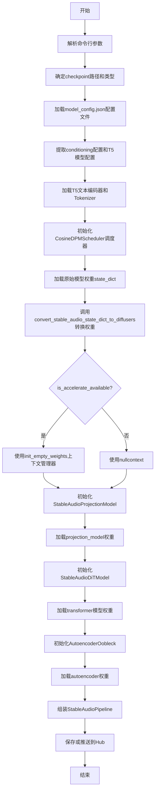

# `diffusers\scripts\convert_stable_audio.py` 详细设计文档

这是一个模型权重转换脚本，用于将Stable Audio 1.0模型的预训练权重（支持safetensors和ckpt格式）转换为Hugging Face Diffusers库的管道格式，包括T5文本编码器、投影模型、DiT Transformer和自编码器的权重映射与加载。

## 整体流程



## 类结构

```
Script (主脚本)
└── convert_stable_audio_state_dict_to_diffusers (全局转换函数)
    ├── projection_model_state_dict (投影模型状态字典处理)
    ├── model_state_dict (DiT模型状态字典处理)
    └── autoencoder_state_dict (自编码器状态字典处理)
```

## 全局变量及字段


### `args`
    
命令行参数集合，包含模型路径、转换选项和保存配置

类型：`argparse.Namespace`
    


### `checkpoint_path`
    
模型权重文件路径，根据use_safetensors参数选择.safetensors或.ckpt格式

类型：`str`
    


### `config_path`
    
配置文件路径，指向model_config.json

类型：`str`
    


### `device`
    
设备类型，固定为'cpu'，用于加载模型权重

类型：`str`
    


### `dtype`
    
数据类型，根据variant参数决定使用bfloat16或float32

类型：`torch.dtype`
    


### `config_dict`
    
从JSON加载的模型配置，包含模型结构和参数信息

类型：`dict`
    


### `conditioning_dict`
    
条件配置字典，从config_dict中提取conditioning配置

类型：`dict`
    


### `t5_model_config`
    
T5文本编码器配置，包含模型名称和最大长度

类型：`dict`
    


### `text_encoder`
    
T5文本编码器模型实例，用于将文本转换为嵌入向量

类型：`T5EncoderModel`
    


### `tokenizer`
    
T5分词器实例，用于将文本分割为token

类型：`AutoTokenizer`
    


### `scheduler`
    
调度器实例，用于 diffusion 过程的噪声调度

类型：`CosineDPMSolverMultistepScheduler`
    


### `ctx`
    
根据accelerate可用性的上下文管理器，用于初始化空权重或nullcontext

类型：`contextmanager`
    


### `orig_state_dict`
    
原始模型权重字典，从checkpoint文件加载

类型：`dict`
    


### `model_config`
    
DiT模型配置，从config_dict中提取diffusion配置

类型：`dict`
    


### `model_state_dict`
    
转换后的DiT模型权重，用于加载到StableAudioDiTModel

类型：`dict`
    


### `projection_model_state_dict`
    
转换后的投影模型权重，用于加载到StableAudioProjectionModel

类型：`dict`
    


### `autoencoder_state_dict`
    
转换后的自编码器权重，用于加载到AutoencoderOobleck

类型：`dict`
    


### `StableAudioProjectionModel.projection_model`
    
投影模型实例，用于将文本嵌入投影到条件空间

类型：`StableAudioProjectionModel`
    


### `StableAudioDiTModel.model`
    
DiT Transformer模型实例，核心扩散变换器模型

类型：`StableAudioDiTModel`
    


### `AutoencoderOobleck.autoencoder`
    
自编码器实例，用于音频的编码和解码

类型：`AutoencoderOobleck`
    


### `StableAudioPipeline.pipeline`
    
最终的Diffusers管道，整合所有组件用于音频生成

类型：`StableAudioPipeline`
    
    

## 全局函数及方法


### `convert_stable_audio_state_dict_to_diffusers`

该函数是Stable Audio模型权重转换的核心逻辑，负责将Stable Audio原始格式的模型状态字典（state_dict）拆解并重新映射为Diffusers库所需的三个独立子字典：投影模型状态字典、DiT模型状态字典和自编码器状态字典，同时进行键名转换、权重重组和维度调整等操作。

参数：

- `state_dict`：`dict`，Stable Audio模型的原始权重字典，包含模型、投影器和自编码器的所有参数
- `num_autoencoder_layers`：`int`，自编码器的层数，默认为5，用于确定权重键的映射索引

返回值：`tuple(dict, dict, dict)`，返回一个包含三个元素的元组，分别是：
- 第一个元素：Diffusers格式的DiT模型权重字典（model_state_dict）
- 第二个元素：Diffusers格式的投影模型权重字典（projection_model_state_dict）
- 第三个元素：Diffusers格式的自编码器权重字典（autoencoder_state_dict）

#### 流程图

```mermaid
flowchart TD
    A[开始: convert_stable_audio_state_dict_to_diffusers] --> B[提取投影模型权重]
    B --> C[键名映射: conditioner → 空, embedder.embedding → time_positional_embedding]
    C --> D[替换: seconds_start → start_number_conditioner, seconds_total → end_number_conditioner]
    D --> E[提取DiT模型权重]
    E --> F[键名映射: 移除model.model.前缀]
    F --> G[注意力层键名转换]
    G --> H[LayerNorm键名转换: gamma→weight, beta→bias]
    H --> I[其他层键名映射: project→proj等]
    I --> J{检查time_proj.weight}
    J -->|是| K[squeeze(1)操作]
    J -->|否| L{检查to_qkv或to_kv}
    L -->|to_qkv| M[拆分为q, k, v三个独立权重]
    L -->|to_kv| N[拆分为k, v两个独立权重]
    L -->|其他| O[直接映射键名]
    M --> P[提取自编码器权重]
    N --> P
    O --> P
    K --> P
    P --> Q[键名映射: pretransform.model. → 空, coder.layers.0 → coder.conv1]
    Q --> R{处理coder.layers}
    R -->|是| S[索引转换: layers.{idx} → block.{idx-1}]
    S --> T[编码器/解码器层映射]
    T --> U[特殊处理: snake激活函数维度unsqueeze]
    R -->|否| V[直接传递键名]
    U --> W[返回三个状态字典元组]
    V --> W
```

#### 带注释源码

```python
def convert_stable_audio_state_dict_to_diffusers(state_dict, num_autoencoder_layers=5):
    """
    将Stable Audio原始权重字典转换为Diffusers格式的三个子字典
    
    参数:
        state_dict: Stable Audio模型的原始权重字典
        num_autoencoder_layers: 自编码器层数，默认为5
    
    返回:
        包含三个字典的元组: (model_state_dict, projection_model_state_dict, autoencoder_state_dict)
    """
    
    # ============================================================
    # 第一部分: 处理投影模型(Projection Model)的权重
    # 投影模型负责将时间步信息转换为条件向量
    # ============================================================
    
    # 过滤出包含"conditioner.conditioners"的键，并进行初步键名映射
    # 移除"conditioner.conditioners."前缀
    # 将"embedder.embedding"映射为"time_positional_embedding"
    projection_model_state_dict = {
        k.replace("conditioner.conditioners.", "").replace("embedder.embedding", "time_positional_embedding"): v
        for (k, v) in state_dict.items()
        if "conditioner.conditioners" in k
    }

    # 注释: 假设文本编码器到潜在空间没有投影层，如果有需要稍作调整
    # 将时间相关的键名从Stable Audio格式转换为Diffusers格式
    # seconds_start → start_number_conditioner (起始时间条件)
    # seconds_total → end_number_conditioner (结束时间条件)
    for key, value in list(projection_model_state_dict.items()):
        new_key = key.replace("seconds_start", "start_number_conditioner").replace(
            "seconds_total", "end_number_conditioner"
        )
        projection_model_state_dict[new_key] = projection_model_state_dict.pop(key)

    # ============================================================
    # 第二部分: 处理DiT (Diffusion Transformer)模型的权重
    # 这是核心的去噪扩散模型
    # ============================================================
    
    # 过滤出包含"model.model."的键并移除该前缀
    model_state_dict = {k.replace("model.model.", ""): v for (k, v) in state_dict.items() if "model.model." in k}
    
    # 遍历所有键进行复杂的键名转换
    for key, value in list(model_state_dict.items()):
        # ----- 注意力层(Attention Layers)的键名转换 -----
        new_key = (
            key.replace("transformer.", "")                    # 移除transformer.前缀
            .replace("layers", "transformer_blocks")           # layers → transformer_blocks
            .replace("self_attn", "attn1")                      # 自注意力 → attn1
            .replace("cross_attn", "attn2")                     # 交叉注意力 → attn2
            .replace("ff.ff", "ff.net")                         # 前馈网络 → ff.net
        )
        
        # ----- LayerNorm层的键名转换 -----
        # Diffusers使用不同的命名规范，将gamma/beta转换为weight/bias
        new_key = (
            new_key.replace("pre_norm", "norm1")                # 预归一化 → norm1
            .replace("cross_attend_norm", "norm2")              # 交叉注意力归一化 → norm2
            .replace("ff_norm", "norm3")                        # 前馈网络归一化 → norm3
            .replace("to_out", "to_out.0")                      # 输出投影 → to_out.0
        )
        
        # LayerNorm的gamma/beta参数替换为weight/bias
        new_key = new_key.replace("gamma", "weight").replace("beta", "bias")

        # ----- 其他层次(Other Layers)的键名转换 -----
        new_key = (
            new_key.replace("project", "proj")                 # project → proj
            .replace("to_timestep_embed", "timestep_proj")      # 时间步嵌入投影
            .replace("timestep_features", "time_proj")          # 时间特征 → time_proj
            .replace("to_global_embed", "global_proj")          # 全局嵌入投影
            .replace("to_cond_embed", "cross_attention_proj")   # 条件嵌入投影
        )

        # ----- 特殊处理: time_proj.weight -----
        # Diffusers使用GaussianFourierProjection实现time_proj，会创建1D张量
        # 而原始模型可能是2D，需要squeeze掉第一个维度
        if new_key == "time_proj.weight":
            model_state_dict[key] = model_state_dict[key].squeeze(1)

        # ----- QKV权重拆分处理 -----
        # 原始模型将Q(查询)、K(键)、V(值)合并为一个权重张量
        # 需要拆分为三个独立的权重
        if "to_qkv" in new_key:
            # 原始权重在dim=0上按QKV顺序拼接，拆分为三份
            q, k, v = torch.chunk(model_state_dict.pop(key), 3, dim=0)
            model_state_dict[new_key.replace("qkv", "q")] = q   # 存储Query权重
            model_state_dict[new_key.replace("qkv", "k")] = k   # 存储Key权重
            model_state_dict[new_key.replace("qkv", "v")] = v   # 存储Value权重
        elif "to_kv" in new_key:
            # 只包含K和V的权重，拆分为两份
            k, v = torch.chunk(model_state_dict.pop(key), 2, dim=0)
            model_state_dict[new_key.replace("kv", "k")] = k
            model_state_dict[new_key.replace("kv", "v")] = v
        else:
            # 其他键直接重命名后存储
            model_state_dict[new_key] = model_state_dict.pop(key)

    # ============================================================
    # 第三部分: 处理自编码器(Autoencoder)的权重
    # 自编码器用于将音频编码到潜在空间和从潜在空间解码
    # ============================================================
    
    # 过滤出包含"pretransform.model."的键
    # 替换"pretransform.model."为空，"coder.layers.0"为"coder.conv1"
    autoencoder_state_dict = {
        k.replace("pretransform.model.", "").replace("coder.layers.0", "coder.conv1"): v
        for (k, v) in state_dict.items()
        if "pretransform.model." in k
    }

    # 遍历所有自编码器键进行复杂的结构映射
    for key, _ in list(autoencoder_state_dict.items()):
        new_key = key
        
        # 检查是否包含coder.layers，需要进行层次索引转换
        if "coder.layers" in new_key:
            # 提取层级索引（例如 layers.3 → idx=3）
            idx = int(new_key.split("coder.layers.")[1].split(".")[0])

            # 将layers.{idx}映射为block.{idx-1}
            # Diffusers使用block结构而非简单的layers列表
            new_key = new_key.replace(f"coder.layers.{idx}", f"block.{idx - 1}")

            # ----- 编码器(Encoder)的特殊映射 -----
            if "encoder" in new_key:
                # 编码器有5层: res_unit1, res_unit2, res_unit3, snake1, conv1
                for i in range(3):
                    new_key = new_key.replace(f"block.{idx - 1}.layers.{i}", f"block.{idx - 1}.res_unit{i + 1}")
                new_key = new_key.replace(f"block.{idx - 1}.layers.3", f"block.{idx - 1}.snake1")
                new_key = new_key.replace(f"block.{idx - 1}.layers.4", f"block.{idx - 1}.conv1")
            else:
                # ----- 解码器(Decoder)的特殊映射 -----
                # 解码器有5层: snake1, conv_t1, res_unit1, res_unit2, res_unit3
                for i in range(2, 5):
                    new_key = new_key.replace(f"block.{idx - 1}.layers.{i}", f"block.{idx - 1}.res_unit{i - 1}")
                new_key = new_key.replace(f"block.{idx - 1}.layers.0", f"block.{idx - 1}.snake1")
                new_key = new_key.replace(f"block.{idx - 1}.layers.1", f"block.{idx - 1}.conv_t1")

            # ----- snake激活函数的参数映射 -----
            # Snake激活函数使用alpha和beta参数
            new_key = new_key.replace("layers.0.beta", "snake1.beta")
            new_key = new_key.replace("layers.0.alpha", "snake1.alpha")
            new_key = new_key.replace("layers.2.beta", "snake2.beta")
            new_key = new_key.replace("layers.2.alpha", "snake2.alpha")
            new_key = new_key.replace("layers.1.bias", "conv1.bias")
            new_key = new_key.replace("layers.1.weight_", "conv1.weight_")
            new_key = new_key.replace("layers.3.bias", "conv2.bias")
            new_key = new_key.replace("layers.3.weight_", "conv2.weight_")

            # ----- 最后几层的特殊处理 -----
            # 最后一层不再作为block，而是直接命名
            if idx == num_autoencoder_layers + 1:
                new_key = new_key.replace(f"block.{idx - 1}", "snake1")
            elif idx == num_autoencoder_layers + 2:
                new_key = new_key.replace(f"block.{idx - 1}", "conv2")

        # 提取并删除旧键的权重
        value = autoencoder_state_dict.pop(key)
        
        # ----- 特殊处理: Snake激活函数权重 -----
        # Snake函数的权重需要添加batch维度和最后维度
        # 原始形状可能是 [dim]，需要变为 [1, dim, 1]
        if "snake" in new_key:
            value = value.unsqueeze(0).unsqueeze(-1)
            
        # 检查是否有键冲突
        if new_key in autoencoder_state_dict:
            raise ValueError(f"{new_key} already in state dict.")
            
        # 存储新键名对应的权重
        autoencoder_state_dict[new_key] = value

    # 返回三个独立的状态字典
    return model_state_dict, projection_model_state_dict, autoencoder_state_dict
```

## 关键组件


### 状态字典转换函数 (convert_stable_audio_state_dict_to_diffusers)

核心转换函数，负责将Stable Audio原始模型权重转换为Diffusers兼容的格式，包括投影模型、Transformer模型和自编码器的状态字典重构与键名映射。

### T5文本编码器 (T5EncoderModel)

使用HuggingFace Transformers库加载的T5编码器，用于将文本提示编码为条件向量，集成到Diffusers pipeline中。

### 分词器 (AutoTokenizer)

HuggingFace分词器，与T5编码器配合使用，处理文本输入的tokenization，支持截断和最大长度控制。

### 投影模型 (StableAudioProjectionModel)

将文本编码器输出维度映射到条件空间的投影模型，包含时间位置嵌入和条件维度转换功能。

### DiT Transformer模型 (StableAudioDiTModel)

基于Diffusion Transformer架构的核心生成模型，处理潜空间表征的条件生成，包含自注意力、交叉注意力和时间步嵌入。

### 自编码器 (AutoencoderOobleck)

用于音频编码和解码的变分自编码器，包含下采样和上采样路径，处理原始音频与潜空间之间的转换。

### 调度器 (CosineDPMSolverMultistepScheduler)

基于DPM-Solver的多步采样调度器，采用余弦噪声调度和v-prediction预测类型，用于生成过程的噪声调度。

### Pipeline组装 (StableAudioPipeline)

整合所有组件（transformer、tokenizer、text_encoder、scheduler、vae、projection_model）构建完整的音频生成pipeline。

### 状态字典键名映射逻辑

针对Transformer层的注意力机制（self_attn→attn1, cross_attn→attn2）、LayerNorm参数（gamma→weight, beta→bias）、QKV分离等关键映射规则。

### 自编码器层索引重映射

处理coder.layers结构到coder.block.{idx-1}的转换，以及res_unit、snake、conv等子模块的层级重构逻辑。

### 参数类型与精度控制

通过variant参数支持bf16浮点格式转换，默认使用float32精度，确保模型权重的数据类型一致性。

### 加速库集成 (accelerate)

使用init_empty_weights和load_model_dict_into_meta实现内存高效的模型加载，支持大模型的磁盘映射加载。


## 问题及建议


### 已知问题

- **硬编码的默认值和假设**：代码中硬编码了 `num_autoencoder_layers=5`，且注释假设 `seconds_start` 和 `seconds_total` 具有相同的 min/max 值，缺乏灵活性。
- **脆弱的字符串替换逻辑**：状态字典键的转换大量依赖字符串替换（如 `replace("transformer.", "")`、`replace("layers", "transformer_blocks")` 等），当源模型结构变化时极易损坏。
- **缺乏完整的错误处理**：文件路径检查、JSON 配置解析、模型加载等关键步骤缺少异常捕获与用户友好的错误提示。
- **魔法数字和硬编码参数**：调度器的 `sigma_min=0.3`、`sigma_max=500`、`solver_order=2` 等参数直接写死，难以适配不同模型变体。
- **内存效率问题**：一次性将整个 `orig_state_dict` 加载到内存，对于超大模型可能导致 OOM。
- **重复代码模式**：状态字典转换函数中存在大量重复的键名替换逻辑，可抽象为通用映射表。
- **类型注解缺失**：核心函数 `convert_stable_audio_state_dict_to_diffusers` 缺少参数和返回值的类型注解。

### 优化建议

- **引入配置验证机制**：在解析 `config_dict` 后增加 schema 验证，确保必要字段存在且类型正确。
- **抽象键名映射规则**：使用配置驱动的键映射表或正则表达式替代硬编码的字符串替换，提高可维护性。
- **添加参数化配置**：将调度器参数、默认路径等提取为命令行可选参数或配置文件。
- **实现增量加载与内存优化**：对于超大 checkpoint，考虑分块加载或使用 memory-mapped 文件。
- **增加日志记录**：使用 `logging` 模块记录转换进度、警告和错误，便于调试追踪。
- **重构自动编码器转换逻辑**：将复杂的嵌套替换逻辑拆分为独立的子函数，降低圈复杂度。
- **补充类型注解**：为所有函数添加完整的类型签名，提升代码可读性和静态检查能力。

## 其它


### 设计目标与约束

将 Stable Audio 1.0 模型的权重转换为 Hugging Face Diffusers 格式的 StableAudioPipeline，支持模型部署和推理。约束条件包括：仅支持 CPU 设备加载（device="cpu"），可选支持 bf16 精度转换，默认使用 float32 精度，模型保存路径可通过命令行配置。

### 错误处理与异常设计

关键异常处理包括：文件路径不存在时的 FileNotFoundError，模型权重格式不匹配时的 ValueError，配置文件解析错误时的 json.JSONDecodeError，以及 autoencoder_state_dict 中键值冲突时的 ValueError。脚本未实现完整的异常捕获机制，建议在生产环境中增加参数校验和异常恢复逻辑。

### 数据流与状态机

数据流分为三个阶段：阶段一加载原始模型权重（支持 safetensors 或 ckpt 格式）；阶段二通过 convert_stable_audio_state_dict_to_diffusers 函数将权重键名映射为 diffusers 格式，输出三个独立的状态字典；阶段三使用空权重上下文（init_empty_weights）初始化模型结构并加载转换后的权重，最后组装为 StableAudioPipeline 并保存。

### 外部依赖与接口契约

核心依赖包括：torch（张量操作）、safetensors.torch（安全张量加载）、transformers（T5EncoderModel、AutoTokenizer）、diffusers（StableAudioPipeline 及相关组件）、accelerate（可选，用于内存高效加载）。配置文件 model_config.json 必须包含 model.conditioning.configs、model.diffusion.config、model.pretransform.config 等关键配置节。

### 配置管理

所有配置通过命令行参数和 model_config.json 文件传入。命令行参数包括：model_folder_path（模型权重路径）、use_safetensors（是否使用 safetensors 格式）、save_directory（输出目录）、repo_id（Hub 仓库 ID）、push_to_hub（是否推送）、variant（权重变体如 bf16）。配置文件必须包含 sample_size、sample_rate、模型结构参数（embed_dim、num_heads、depth 等）。

### 性能考虑

使用 init_empty_weights 上下文管理器避免在 CPU 上完整加载模型到内存，结合 load_model_dict_into_meta 实现元设备上的模型结构初始化。对于大模型转换，建议在具备加速功能的设备上运行。当前实现仅支持 CPU 设备，转换大规模模型时可能面临内存瓶颈。

### 安全性考虑

支持通过 use_safetensors 加载安全张量格式，防止恶意权重文件执行任意代码。模型保存时可指定 variant 为 bf16 以优化精度与存储空间。建议在生产环境中对输入路径进行安全校验，防止路径遍历攻击。

### 测试策略

建议测试场景包括：不同权重格式（safetensors/ckpt）的加载转换、配置文件缺失或格式错误的异常处理、转换后 pipeline 的推理验证、权重键名映射的完整性检查、跨版本 diffusers 库的兼容性测试。

### 部署要求

转换后的 pipeline 可通过 StableAudioPipeline.from_pretrained() 加载部署。部署环境需要安装 diffusers、transformers、torch、safetensors 等依赖库。建议使用 Python 3.8+ 环境，GPU 推理时需确保 CUDA 可用。

### 版本兼容性

当前代码基于 diffusers 库设计，需确认兼容的 diffusers 版本。StableAudioPipeline、StableAudioDiTModel、AutoencoderOobleck 等组件为特定版本新增，需使用对应版本以上的 diffusers。T5 文本编码器依赖 transformers 库，需确保版本兼容。

    