# `diffusers\scripts\convert_stable_cascade.py` 详细设计文档

该脚本用于将Stable Cascade模型的原始权重文件转换为Hugging Face Diffusers格式的管道，支持转换prior阶段（stage_c）、decoder阶段（stage_b）以及combined管道，并可选择保存为safetensors格式或推送到Hugging Face Hub。

## 整体流程

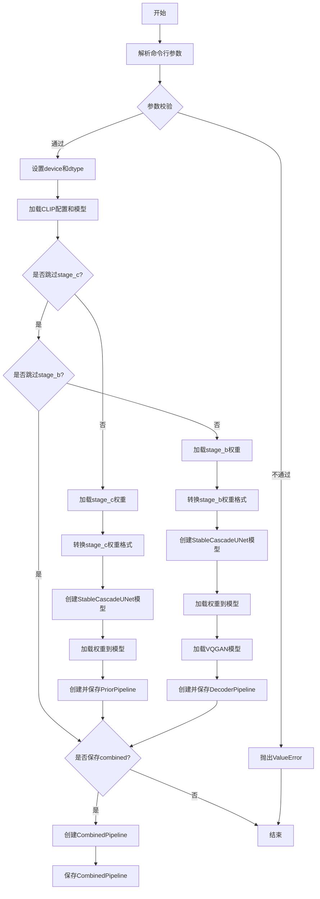

## 类结构

```
该脚本为非面向对象设计，主要为过程式代码
使用第三方库类:
├── StableCascadePriorPipeline (diffusers)
├── StableCascadeDecoderPipeline (diffusers)
├── StableCascadeCombinedPipeline (diffusers)
├── StableCascadeUNet (diffusers.models)
├── PaellaVQModel (diffusers.pipelines.wuerstchen)
├── CLIPTextModelWithProjection (transformers)
├── CLIPVisionModelWithProjection (transformers)
├── CLIPConfig (transformers)
├── AutoTokenizer (transformers)
└── CLIPImageProcessor (transformers)
```

## 全局变量及字段


### `args`
    
命令行参数对象，包含模型路径、阶段名称、输出路径等配置

类型：`argparse.Namespace`
    


### `model_path`
    
Stable Cascade模型权重根目录路径

类型：`str`
    


### `device`
    
计算设备，默认为cpu

类型：`str`
    


### `dtype`
    
模型权重数据类型，根据variant参数为bf16或float32

类型：`torch.dtype`
    


### `prior_checkpoint_path`
    
stage_c (prior) 权重文件的完整路径

类型：`str`
    


### `decoder_checkpoint_path`
    
stage_b (decoder) 权重文件的完整路径

类型：`str`
    


### `config`
    
CLIP模型配置对象，用于初始化文本编码器

类型：`CLIPConfig`
    


### `text_encoder`
    
CLIP文本编码器模型，用于将文本转换为嵌入向量

类型：`CLIPTextModelWithProjection`
    


### `tokenizer`
    
CLIP分词器，用于将文本分割成token

类型：`AutoTokenizer`
    


### `image_encoder`
    
CLIP图像编码器模型，用于将图像转换为特征向量

类型：`CLIPVisionModelWithProjection`
    


### `feature_extractor`
    
CLIP图像特征提取器，用于预处理图像

类型：`CLIPImageProcessor`
    


### `scheduler`
    
DDPM Wuerstchen调度器，用于控制去噪过程

类型：`DDPMWuerstchenScheduler`
    


### `ctx`
    
上下文管理器，用于accelerate库的空权重初始化或nullcontext

类型：`contextlib.contextmanager`
    


### `prior_orig_state_dict`
    
原始stage_c (prior) 模型的权重字典

类型：`dict`
    


### `prior_state_dict`
    
转换后的stage_c (prior) 模型的权重字典

类型：`dict`
    


### `prior_model`
    
Stable Cascade Prior阶段的UNet模型实例

类型：`StableCascadeUNet`
    


### `prior_pipeline`
    
Stable Cascade Prior管道实例，用于生成图像嵌入

类型：`StableCascadePriorPipeline`
    


### `decoder_orig_state_dict`
    
原始stage_b (decoder) 模型的权重字典

类型：`dict`
    


### `decoder_state_dict`
    
转换后的stage_b (decoder) 模型的权重字典

类型：`dict`
    


### `decoder`
    
Stable Cascade Decoder阶段的UNet模型实例

类型：`StableCascadeUNet`
    


### `vqmodel`
    
Paella VQGAN模型，用于将潜在向量解码为图像

类型：`PaellaVQModel`
    


### `decoder_pipeline`
    
Stable Cascade Decoder管道实例，用于从嵌入生成最终图像

类型：`StableCascadeDecoderPipeline`
    


### `stable_cascade_pipeline`
    
Stable Cascade组合管道实例，整合了prior和decoder

类型：`StableCascadeCombinedPipeline`
    


    

## 全局函数及方法


### `argparse.ArgumentParser`

用于创建命令行参数解析器，定义了一系列参数以支持将 Stable Cascade 模型权重转换为 diffusers 管道的功能。

参数：

- `description`：命令行参数解析器的描述信息
- 其他参数通过 `parser.add_argument()` 方法添加

返回值：`ArgumentParser`，返回创建的参数解析器对象，用于解析命令行传入的参数。

#### 流程图

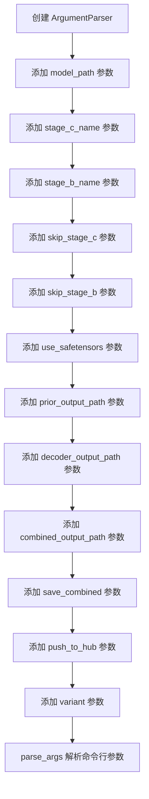

#### 带注释源码

```python
# 创建 ArgumentParser 实例，设置程序描述
parser = argparse.ArgumentParser(description="Convert Stable Cascade model weights to a diffusers pipeline")

# 添加命令行参数：模型权重路径
parser.add_argument("--model_path", type=str, help="Location of Stable Cascade weights")

# 添加命令行参数：stage c 检查点文件名
parser.add_argument("--stage_c_name", type=str, default="stage_c.safetensors", help="Name of stage c checkpoint file")

# 添加命令行参数：stage b 检查点文件名
parser.add_argument("--stage_b_name", type=str, default="stage_b.safetensors", help="Name of stage b checkpoint file")

# 添加命令行参数：是否跳过 stage c 转换
parser.add_argument("--skip_stage_c", action="store_true", help="Skip converting stage c")

# 添加命令行参数：是否跳过 stage b 转换
parser.add_argument("--skip_stage_b", action="store_true", help="Skip converting stage b")

# 添加命令行参数：是否使用 SafeTensors 格式
parser.add_argument("--use_safetensors", action="store_true", help="Use SafeTensors for conversion")

# 添加命令行参数：prior 管道输出路径
parser.add_argument(
    "--prior_output_path", default="stable-cascade-prior", type=str, help="Hub organization to save the pipelines to"
)

# 添加命令行参数：decoder 管道输出路径
parser.add_argument(
    "--decoder_output_path",
    type=str,
    default="stable-cascade-decoder",
    help="Hub organization to save the pipelines to",
)

# 添加命令行参数：combined 管道输出路径
parser.add_argument(
    "--combined_output_path",
    type=str,
    default="stable-cascade-combined",
    help="Hub organization to save the pipelines to",
)

# 添加命令行参数：是否保存 combined 管道
parser.add_argument("--save_combined", action="store_true")

# 添加命令行参数：是否推送到 hub
parser.add_argument("--push_to_hub", action="store_true", help="Push to hub")

# 添加命令行参数：模型变体（如 bf16）
parser.add_argument("--variant", type=str, help="Set to bf16 to save bfloat16 weights")

# 解析命令行参数
args = parser.parse_args()
```


### `parser.add_argument`

向命令行参数解析器添加一个用于定义命令行参数的结构。该方法是 `argparse.ArgumentParser` 类的核心方法，用于指定程序接受哪些命令行参数，包括参数名称、类型、默认值、帮助信息等。

参数：

-  `name or flags`：字符串或字符串列表，表示参数名称或标志（如 `"--model_path"` 或 `["-f", "--foo"]`）
-  `action`：字符串，指定如何处理命令行参数（如 `"store_true"` 表示布尔标志），默认为 `"store"`
-  `nargs`：整数或特殊字符，指定参数的数量（如 `"*"` 表示零个或多个）
-  `const`：常量值，用于某些 action 和 nargs 的默认值
-  `default`：任何类型，参数的默认值
-  `type`：函数类型，将命令行参数转换为指定类型（如 `int`、`str`）
-  `choices`：可迭代对象，限制参数的可能值
-  `required`：布尔值，指定参数是否必需
-  `help`：字符串，参数的帮助描述信息
-  `metavar`：字符串，在用法消息中显示的参数名称
-  `dest`：字符串，用于在返回的命名空间对象中设置属性名

返回值：`None`，该方法直接修改 `ArgumentParser` 对象的内部状态，不返回任何值。

#### 流程图

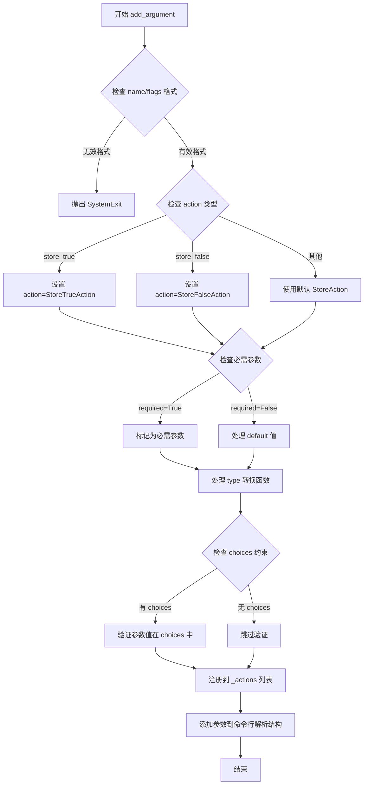

#### 带注释源码

```python
# 以下是 argparse 模块中 add_argument 方法的核心逻辑简化版
# 位置：Python 标准库 argparse 模块

def add_argument(self, name_or_flags, **kwargs):
    """
    添加命令行参数配置
    
    参数:
        name_or_flags: 参数名或标志列表，如 '--model_path' 或 ['-m', '--model']
        **kwargs: 包含 action, type, default, help, choices, required 等选项的字典
    """
    # 1. 解析名称/标志
    if isinstance(name_or_flags, list):
        # 如果是列表，提取所有标志
        flags = name_or_flags
        option_strings = name_or_flags
        dest = kwargs.get('dest')
    else:
        # 如果是字符串，检查是否为可选参数（以 - 开头）
        flags = [name_or_flags]
        option_strings = [name_or_flags]
        dest = None
    
    # 2. 设置默认参数
    kwargs.setdefault('action', 'store')
    kwargs.setdefault('nargs', None)
    kwargs.setdefault('const', None)
    kwargs.setdefault('default', None)
    kwargs.setdefault('type', str)  # 默认类型为字符串
    kwargs.setdefault('choices', None)
    kwargs.setdefault('required', False)
    kwargs.setdefault('help', None)
    kwargs.setdefault('metavar', None)
    kwargs.setdefault('dest', dest)
    
    # 3. 处理 dest（属性名）
    if kwargs['dest'] is None:
        # 从第一个标志中提取 dest，移除前导的 '-'
        kwargs['dest'] = option_strings[0][2:]  # '--model_path' -> 'model_path'
    
    # 4. 创建 Action 对象
    action = self._get_action(**kwargs)
    
    # 5. 验证参数一致性
    if action.required and action.default is not None:
        # 如果参数必需且有默认值，发出警告
        raise ValueError("required arguments cannot have a default value")
    
    # 6. 将 action 添加到解析器
    self._actions.append(action)
    
    # 7. 设置选项字符串到动作的映射
    for option_string in action.option_strings:
        self._option_string_actions[option_string] = action
    
    # 8. 如果是位置参数，添加到对应列表
    if not action.option_strings:
        self._positional_actions.append(action)
    
    # 9. 返回 None（修改解析器内部状态）
    return None


# 具体到代码中的调用示例：
# parser.add_argument("--model_path", type=str, help="Location of Stable Cascade weights")
# 
# 这个调用会:
# 1. 创建可选参数 --model_path
# 2. 类型转换为 str（字符串）
# 3. 默认值为 None（因为未指定 default）
# 4. help 信息为 "Location of Stable Cascade weights"
# 5. 参数不是必需的（required 默认为 False）
# 6. 访问时使用 args.model_path 获取值
```

---
### 代码中的具体调用

以下是代码中所有 `parser.add_argument` 调用的详细分解：

#### 1. `--model_path` 参数

参数：

-  `name or flags`：`"--model_path"`，字符串类型，表示命令行可选参数
-  `type`：`str`，将输入转换为字符串类型
-  `help`：`"Location of Stable Cascade weights"`，参数的帮助描述

返回值：`None`，无返回值

#### 2. `--stage_c_name` 参数

参数：

-  `name or flags`：`"--stage_c_name"`，字符串类型
-  `type`：`str`，将输入转换为字符串类型
-  `default`：`"stage_c.safetensors"`，默认值
-  `help`：`"Name of stage c checkpoint file"`，帮助描述

#### 3. `--stage_b_name` 参数

参数：

-  `name or flags`：`"--stage_b_name"`，字符串类型
-  `type`：`str`，将输入转换为字符串类型
-  `default`：`"stage_b.safetensors"`，默认值
-  `help`：`"Name of stage b checkpoint file"`，帮助描述

#### 4. `--skip_stage_c` 参数

参数：

-  `name or flags`：`"--skip_stage_c"`，字符串类型
-  `action`：`"store_true"`，布尔标志参数，指定时值为 True，否则为 False
-  `help`：`"Skip converting stage c"`，帮助描述

#### 5. `--skip_stage_b` 参数

参数：

-  `name or flags`：`"--skip_stage_b"`，字符串类型
-  `action`：`"store_true"`，布尔标志参数
-  `help`：`"Skip converting stage b"`，帮助描述

#### 6. `--use_safetensors` 参数

参数：

-  `name or flags`：`"--use_safetensors"`，字符串类型
-  `action`：`"store_true"`，布尔标志参数
-  `help`：`"Use SafeTensors for conversion"`，帮助描述

#### 7. `--prior_output_path` 参数

参数：

-  `name or flags`：`"--prior_output_path"`，字符串类型
-  `type`：`str`，字符串类型
-  `default`：`"stable-cascade-prior"`，默认输出路径
-  `help`：`"Hub organization to save the pipelines to"`，帮助描述

#### 8. `--decoder_output_path` 参数

参数：

-  `name or flags`：`"--decoder_output_path"`，字符串类型
-  `type`：`str`，字符串类型
-  `default`：`"stable-cascade-decoder"`，默认输出路径
-  `help`：`"Hub organization to save the pipelines to"`，帮助描述

#### 9. `--combined_output_path` 参数

参数：

-  `name or flags`：`"--combined_output_path"`，字符串类型
-  `type`：`str`，字符串类型
-  `default`：`"stable-cascade-combined"`，默认输出路径
-  `help`：`"Hub organization to save the pipelines to"`，帮助描述

#### 10. `--save_combined` 参数

参数：

-  `name or flags`：`"--save_combined"`，字符串类型
-  `action`：`"store_true"`，布尔标志参数

#### 11. `--push_to_hub` 参数

参数：

-  `name or flags`：`"--push_to_hub"`，字符串类型
-  `action`：`"store_true"`，布尔标志参数
-  `help`：`"Push to hub"`，帮助描述

#### 12. `--variant` 参数

参数：

-  `name or flags`：`"--variant"`，字符串类型
-  `type`：`str`，字符串类型
-  `help`：`"Set to bf16 to save bfloat16 weights"`，帮助描述

---

### 调用对应的 Mermaid 流程图

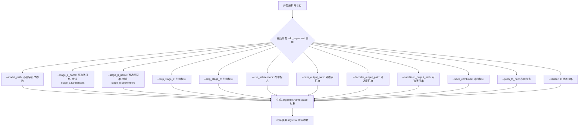


### `args.parse_args`

该函数是 `argparse.ArgumentParser` 类的方法，用于解析命令行参数，将命令行传入的字符串转换为 Python 对象，并返回一个包含所有解析参数的 `Namespace` 对象。

参数：
- 该方法在代码中被无参数调用 `args = parser.parse_args()`，默认从 `sys.argv` 读取命令行参数

返回值：`argparse.Namespace`，一个包含所有命令行参数的对象，属性名称对应 `add_argument()` 中定义的参数名称（如 `model_path`、`stage_c_name`、`skip_stage_c` 等）

#### 流程图

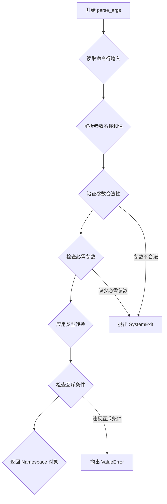

#### 带注释源码

```python
# 这是一个命令行参数解析器的调用示例
# parser 是 argparse.ArgumentParser 的实例，已通过 add_argument() 添加了所有需要的参数
# parse_args() 方法执行后会返回一个 Namespace 对象，其中包含所有解析后的命令行参数

args = parser.parse_args()

# 解析过程说明：
# 1. 从 sys.argv 获取命令行输入（默认行为）
# 2. 根据 add_argument() 定义的参数名称进行匹配
# 3. 将字符串类型的参数值转换为 add_argument() 中指定的类型（如 int, str, bool）
# 4. 处理 action="store_true" 的布尔参数
# 5. 返回包含所有参数的 Namespace 对象
# 
# 例如：python script.py --model_path /path/to/model --use_safetensors
# 返回的 args 对象将包含：
#   args.model_path = "/path/to/model"
#   args.use_safetensors = True
#   args.skip_stage_c = False  # 未指定，使用默认值
#   等等...
```


### `CLIPConfig.from_pretrained`

该方法用于从预训练模型加载 CLIP（Contrastive Language-Image Pre-Training）配置信息，是 Hugging Face Transformers 库中用于初始化 CLIP 模型配置的标准方法。通过指定预训练模型的名称或本地路径，可以自动获取模型的相关配置参数（如投影维度、注意力头数、隐藏层大小等），为后续加载模型权重奠定基础。

#### 参数

- `pretrained_model_name_or_path`：`str`，预训练模型的名称（如 "laion/CLIP-ViT-bigG-14-laion2B-39B-b160k"）或本地模型目录路径
- `**kwargs`：可选关键字参数，支持如 `cache_dir`（缓存目录）、`force_download`（强制重新下载）、`resume_download`（断点续传）、`proxies`（代理服务器）、`local_files_only`（仅使用本地文件）、`token`（认证令牌）、`revision`（模型版本号）等常用参数

#### 返回值

- `CLIPConfig`：返回包含 CLIP 模型配置信息的配置对象，可通过 `.text_config` 和 `.vision_config` 分别访问文本编码器和图像编码器的配置

#### 流程图

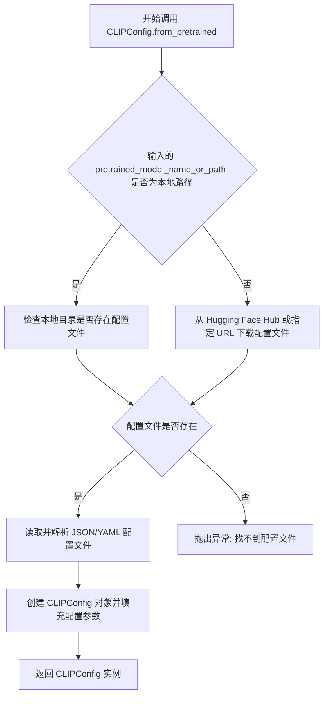

#### 带注释源码

```python
# 从 transformers 库导入 CLIPConfig 配置类
from transformers import CLIPConfig

# 调用 CLIPConfig 类的 from_pretrained 类方法加载预训练配置
# 参数 "laion/CLIP-ViT-bigG-14-laion2B-39B-b160k" 是 Hugging Face Hub 上的模型标识符
# 该模型是一个大型 CLIP 模型，包含 ViT-bigG 架构
config = CLIPConfig.from_pretrained("laion/CLIP-ViT-bigG-14-laion2B-39B-b160k")

# 修改文本配置中的 projection_dim 属性，使其与主配置保持一致
# 这确保了文本编码器的投影层维度与整体模型配置匹配
config.text_config.projection_dim = config.projection_dim

# 此配置对象随后用于初始化 CLIPTextModelWithProjection:
# text_encoder = CLIPTextModelWithProjection.from_pretrained(
#     "laion/CLIP-ViT-bigG-14-laion2B-39B-b160k", 
#     config=config.text_config  # 传入文本编码器的配置子集
# )
```


### `CLIPTextModelWithProjection.from_pretrained`

该方法用于从预训练模型中加载CLIP文本编码器（Text Encoder），并配置投影维度（projection dimension），使其能够生成带有投影的文本嵌入向量，以便与图像嵌入向量进行对比学习或相似度计算。

参数：

- `pretrained_model_name_or_path`：`str`，预训练模型的名称或本地路径，此处为 `"laion/CLIP-ViT-bigG-14-laion2B-39B-b160k"`
- `config`：`CLIPTextConfig`，文本编码器的配置对象，此处使用 `config.text_config`，并确保 `projection_dim` 与主配置保持一致
- `*args`：`可选位置参数`，传递给 `from_pretrained` 的其他位置参数
- `**kwargs`：`可选关键字参数`，传递给 `from_pretrained` 的其他关键字参数（如 `cache_dir`, `force_download`, `use_auth_token` 等）

返回值：`CLIPTextModelWithProjection`，返回加载后的CLIP文本编码器模型实例，包含文本编码和投影层

#### 流程图

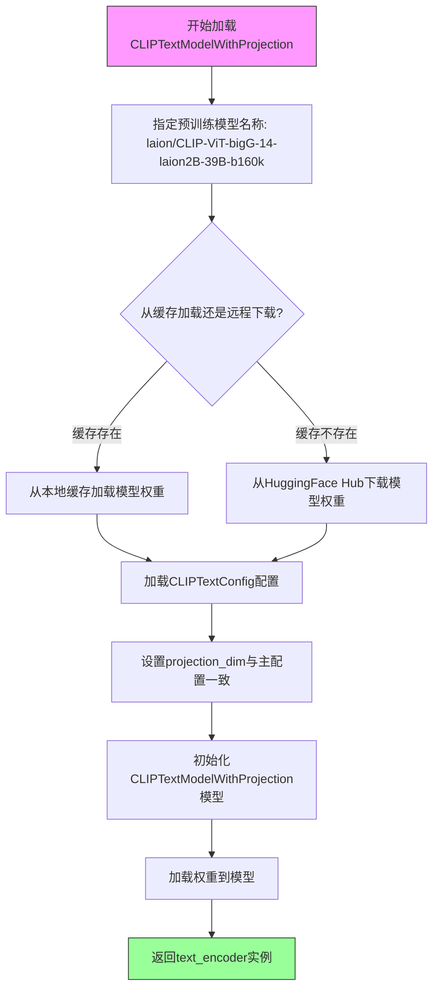

#### 带注释源码

```python
# Clip Text encoder and tokenizer
# 第一步：从预训练模型加载CLIPConfig配置
# CLIPConfig 包含视觉和文本编码器的整体配置
config = CLIPConfig.from_pretrained("laion/CLIP-ViT-bigG-14-laion2B-39B-b160k")

# 第二步：确保文本配置中的projection_dim与主配置一致
# projection_dim 用于将文本嵌入投影到与图像嵌入相同的向量空间
config.text_config.projection_dim = config.projection_dim

# 第三步：使用from_pretrained加载CLIPTextModelWithProjection
# 该模型包含文本编码器和投影层(projection layer)
# 参数:
#   - 第一个参数: 预训练模型名称或路径
#   - config: 文本特定配置,覆盖默认配置
# 返回值: 带有投影层的CLIP文本编码器模型实例
text_encoder = CLIPTextModelWithProjection.from_pretrained(
    "laion/CLIP-ViT-bigG-14-laion2B-39B-b160k", 
    config=config.text_config
)

# 第四步：同时加载对应的tokenizer
# 用于将文本字符串转换为模型输入的token ids
tokenizer = AutoTokenizer.from_pretrained("laion/CLIP-ViT-bigG-14-laion2B-39B-b160k")
```


### `AutoTokenizer.from_pretrained`

该方法用于从预训练模型或本地路径加载分词器（Tokenizer），将文本转换为模型可处理的token序列，是NLP项目中加载分词器的标准方式。

参数：

- `pretrained_model_name_or_path`：`str`，模型标识符（如"laion/CLIP-ViT-bigG-14-laion2B-39B-b160k"）或本地路径
- `cache_dir`：`Optional[str]`，缓存目录路径，可选
- `force_download`：`bool`，是否强制重新下载，可选
- `resume_download`：`bool`，是否恢复中断的下载，可选
- `proxies`：`Optional[Dict]`，代理服务器配置，可选
- `use_auth_token`：`Optional[str]`，认证token，可选
- `revision`：`str`，模型版本分支，可选
- `subfolder`：`Optional[str]`，子文件夹路径，可选
- `local_files_only`：`bool`，是否仅使用本地文件，可选

返回值：`PreTrainedTokenizer` 或 `PreTrainedTokenizerFast`，返回加载后的分词器对象

#### 流程图

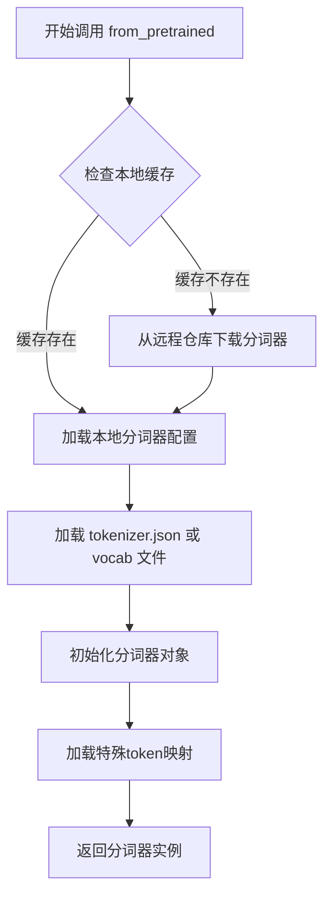

#### 带注释源码

```python
# 从预训练模型加载分词器的调用示例
# 在本项目中，用于加载CLIP文本编码器的分词器
tokenizer = AutoTokenizer.from_pretrained("laion/CLIP-ViT-bigG-14-laion2B-39B-b160k")

# 参数说明：
# - pretrained_model_name_or_path: HuggingFace Hub上的模型ID或本地路径
#   本例中使用 laion/CLIP-ViT-bigG-14-laion2B-39B-b160k
# 
# 返回值：CLIPTokenizer 或 CLIPTokenizerFast 对象
# 用途：将输入文本编码为token IDs，供CLIPTextModelWithProjection使用
#
# AutoTokenizer自动根据模型ID选择合适的分词器类型
# 内部逻辑：
#   1. 查找并下载 tokenizer_config.json
#   2. 加载词汇表文件 (vocab.json, merges.txt等)
#   3. 根据配置实例化对应的Tokenizer类
#   4. 加载特殊token映射 (bos, eos, pad等)
```


### `CLIPImageProcessor`

CLIPImageProcessor 是从 Hugging Face Transformers 库导入的图像预处理器，用于将图像转换为 CLIP 模型所需的格式，包括调整大小、归一化等预处理步骤。

参数：

由于代码中直接使用默认参数实例化 `CLIPImageProcessor()`，无显式参数传递。CLIPImageProcessor 的常见参数包括：

- `size`：图像目标尺寸（字典或整数）
- `crop_size`：裁剪尺寸（字典）
- `do_resize`：是否调整图像大小（布尔值，默认 True）
- `resample`：重采样方法（如 PIL.Image.BILINEAR）
- `do_rescale`：是否重新缩放像素值（布尔值，默认 True）
- `rescale_factor`：缩放因子（浮点数，默认 1/255）
- `do_normalize`：是否归一化（布尔值，默认 True）
- `image_mean`：图像均值（列表或元组，默认 [0.48145466, 0.4578275, 0.40821073]）
- `image_std`：图像标准差（列表或元组，默认 [0.26862954, 0.26130258, 0.27577711]）
- `do_convert_rgb`：是否转换为 RGB 格式（布尔值，默认 True）

返回值：`CLIPImageProcessor` 实例，返回一个配置好的图像处理器对象，可用于对图像进行预处理。

#### 流程图

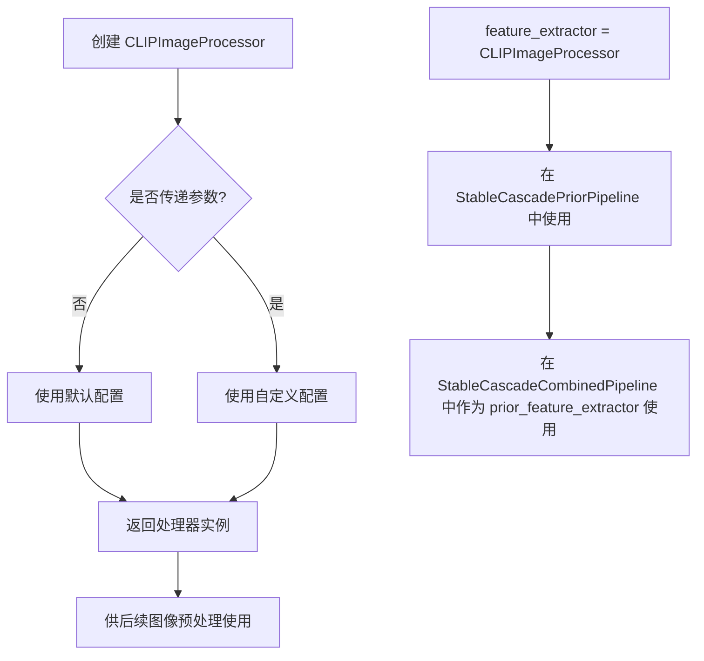

#### 带注释源码

```python
# 从 transformers 库导入 CLIPImageProcessor 类
# 用于将原始图像转换为 CLIP 模型期望的输入格式
from transformers import CLIPImageProcessor

# 实例化图像处理器 - 使用默认参数配置
# 默认配置包括:
# - 图像归一化到 [0, 1] 范围
# - 使用 CLIP 预训练模型的均值 [0.48145466, 0.4578275, 0.40821073] 进行归一化
# - 使用 CLIP 预训练模型的标准差 [0.26862954, 0.26130258, 0.27577711] 进行归一化
# - 自动转换为 RGB 格式
feature_extractor = CLIPImageProcessor()

# 图像处理器被用于 Stable Cascade 管道中
# 用于对输入图像进行预处理，提取特征
image_encoder = CLIPVisionModelWithProjection.from_pretrained("openai/clip-vit-large-patch14")

# 在后续的管道创建中使用
# prior_pipeline 使用 feature_extractor 进行图像预处理
prior_pipeline = StableCascadePriorPipeline(
    prior=prior_model,
    tokenizer=tokenizer,
    text_encoder=text_encoder,
    image_encoder=image_encoder,
    scheduler=scheduler,
    feature_extractor=feature_extractor,  # 传入图像处理器
)
```


### `CLIPVisionModelWithProjection.from_pretrained`

该方法从预训练模型加载CLIPVisionModelWithProjection实例，用于将图像编码为视觉特征向量，并包含投影层以生成适合下游任务使用的嵌入表示。

参数：

- `pretrained_model_name_or_path`：`str`，模型名称或本地路径（如 "openai/clip-vit-large-patch14" 或 "laion/CLIP-ViT-bigG-14-laion2B-39B-b160k"）

返回值：`CLIPVisionModelWithProjection`，加载并初始化后的CLIP视觉编码器模型实例，包含视觉编码器和投影层。

#### 流程图

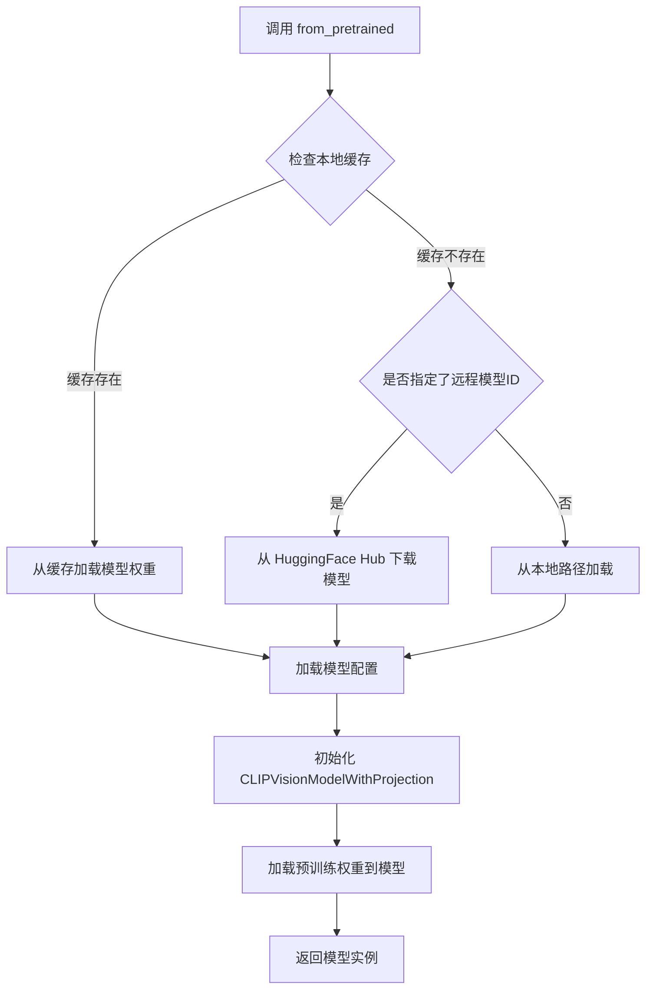

#### 带注释源码

```python
# 代码中调用示例
# image processor
feature_extractor = CLIPImageProcessor()
# 加载 CLIP 视觉编码器模型（含投影层）
# 参数: "openai/clip-vit-large-patch14" - HuggingFace Hub 上的预训练模型标识符
image_encoder = CLIPVisionModelWithProjection.from_pretrained("openai/clip-vit-large-patch14")

# from_pretrained 方法的典型签名和实现逻辑（简化示意）:
# class CLIPVisionModelWithProjection(PreTrainedModel):
#     @classmethod
#     def from_pretrained(
#         cls,
#         pretrained_model_name_or_path: str,  # 模型名称或路径
#         *args,
#         config: Optional[ PretrainedConfig ] = None,  # 可选的配置对象
#         cache_dir: Optional[ str ] = None,  # 缓存目录
#         **kwargs
#     ) -> "CLIPVisionModelWithProjection":
#         """
#         从预训练模型加载 CLIPVisionModelWithProjection
#         1. 解析模型名称/路径
#         2. 下载并缓存模型文件（如需要）
#         3. 加载模型配置和权重
#         4. 返回初始化好的模型实例
#         """
#         # 内部调用 super().from_pretrained() 完成具体加载逻辑
#         return super().from_pretrained(...)
```


### `DDPMWuerstchenScheduler.__init__`

描述：DDPMWuerstchenScheduler 是 Wuerstchen 模型的扩散调度器，用于管理去噪过程中的时间步采样策略。在脚本中创建调度器实例，供先验网络（Prior）和解码器（Decoder）管道使用，以实现Stable Cascade模型的条件采样流程。

参数：无（使用默认参数配置）

返回值：`DDPMWuerstchenScheduler`，返回新创建的 Wuerstchen 扩散调度器实例，用于后续管线的时间步调度

#### 流程图

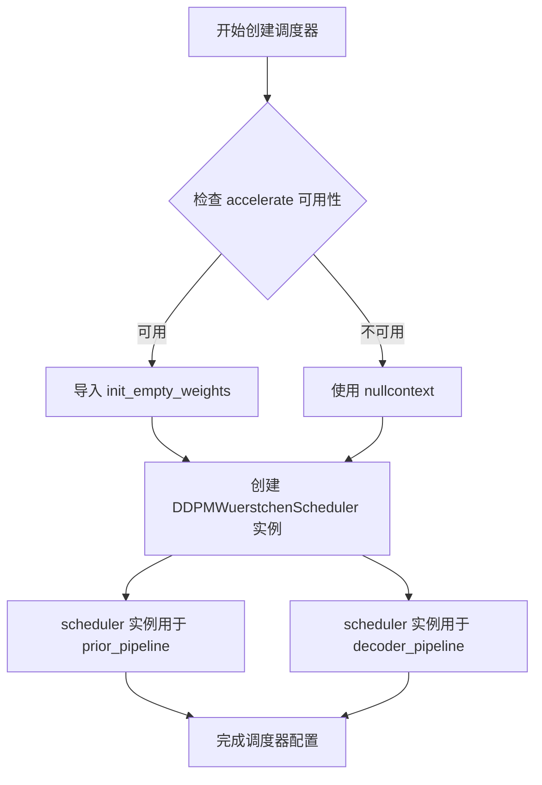

#### 带注释源码

```python
# scheduler for prior and decoder
# 创建 DDPMWuerstchenScheduler 调度器实例
# 该调度器实现了 Wuerstchen 模型的 DDPM 采样策略
# 用于管理去噪过程中的时间步调度（从 T 到 0 的逐步降噪）
scheduler = DDPMWuerstchenScheduler()

# ctx 上下文管理器用于后续模型权重加载
# 如果 accelerate 可用，使用 init_empty_weights 以节省内存
# 否则使用空上下文（nullcontext）
ctx = init_empty_weights if is_accelerate_available() else nullcontext

# 调度器将传递给:
# 1. StableCascadePriorPipeline - 先验管线，用于文本到潜空间
# 2. StableCascadeDecoderPipeline - 解码器管线，用于潜空间到图像
```

**使用示例**：
```python
# 先验管线使用调度器
prior_pipeline = StableCascadePriorPipeline(
    prior=prior_model,
    tokenizer=tokenizer,
    text_encoder=text_encoder,
    image_encoder=image_encoder,
    scheduler=scheduler,  # 传入调度器实例
    feature_extractor=feature_extractor,
)

# 解码器管线使用相同的调度器
decoder_pipeline = StableCascadeDecoderPipeline(
    decoder=decoder,
    text_encoder=text_encoder,
    tokenizer=tokenizer,
    vqgan=vqmodel,
    scheduler=scheduler,  # 传入相同的调度器实例
)
```

**关键配置说明**：
- 调度器采用默认配置创建
- 在推理时，调度器会根据预定义的噪声调度策略（如 DDPM、DDIM 等）从噪声时间步 T 逐步采样到 0
- Wuerstchen 调度器针对其独特的双阶段架构（先验+解码器）进行了优化


### `init_empty_weights`

用于在仅分配模型结构而不分配权重张量内存的情况下初始化模型，常用于大模型加载以避免内存溢出的上下文管理器。

参数：无（在该代码上下文中直接使用，未传递参数）

返回值：`上下文管理器`，返回一个上下文管理器，用于包裹模型初始化代码，使得在上下文内部创建的模型参数不会被实际分配内存。

#### 流程图

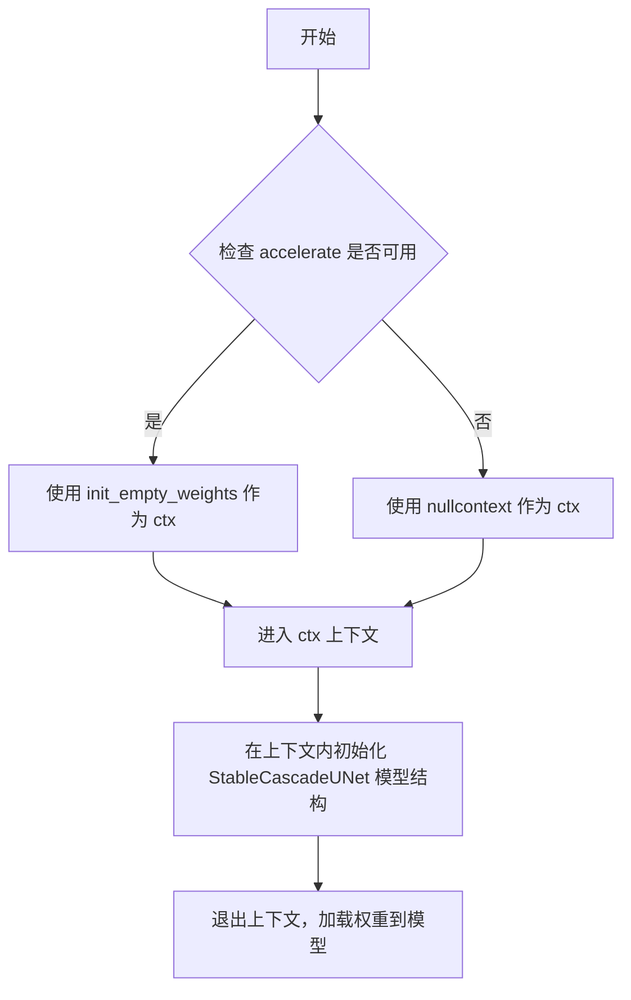

#### 带注释源码

```python
# 导入 is_accelerate_available 工具函数，用于检查 accelerate 库是否可用
from diffusers.utils import is_accelerate_available

# 如果 accelerate 可用，则从 accelerate 导入 init_empty_weights 函数
# init_empty_weights 是一个上下文管理器，用于在初始化模型时不分配权重内存
if is_accelerate_available():
    from accelerate import init_empty_weights

# 根据 accelerate 是否可用，选择使用 init_empty_weights 或 nullcontext 作为上下文管理器
# 如果 accelerate 可用，使用 init_empty_weights 以节省内存；否则使用 nullcontext（空上下文）
ctx = init_empty_weights if is_accelerate_available() else nullcontext

# 使用选定的上下文管理器 ctx 包裹模型初始化代码
# 在 with 块内，模型的权重不会被实际分配，这允许我们在内存有限的情况下创建大模型结构
with ctx():
    # 初始化 Prior 阶段的 StableCascadeUNet 模型
    # 此时模型结构被创建，但权重参数未被分配内存
    prior_model = StableCascadeUNet(
        in_channels=16,
        out_channels=16,
        timestep_ratio_embedding_dim=64,
        patch_size=1,
        conditioning_dim=2048,
        block_out_channels=[2048, 2048],
        num_attention_heads=[32, 32],
        down_num_layers_per_block=[8, 24],
        up_num_layers_per_block=[24, 8],
        down_blocks_repeat_mappers=[1, 1],
        up_blocks_repeat_mappers=[1, 1],
        block_types_per_layer=[
            ["SDCascadeResBlock", "SDCascadeTimestepBlock", "SDCascadeAttnBlock"],
            ["SDCascadeResBlock", "SDCascadeTimestepBlock", "SDCascadeAttnBlock"],
        ],
        clip_text_in_channels=1280,
        clip_text_pooled_in_channels=1280,
        clip_image_in_channels=768,
        clip_seq=4,
        kernel_size=3,
        dropout=[0.1, 0.1],
        self_attn=True,
        timestep_conditioning_type=["sca", "crp"],
        switch_level=[False],
    )
```


### `contextlib.nullcontext`

`nullcontext` 是 Python 标准库 `contextlib` 模块中的一个空上下文管理器，它不执行任何操作，仅返回一个可选的 `enter_result` 值。当需要一个上下文管理器但不希望执行任何 enter 或 exit 操作时使用，例如在条件分支中作为占位符。

参数：

-  `enter_result`：任意类型（可选，默认值为 `None`），指定 `__enter__()` 方法的返回值。

返回值：返回一个上下文管理器对象，该对象的 `__enter__()` 返回 `enter_result`，`__exit__()` 不执行任何操作。

#### 流程图

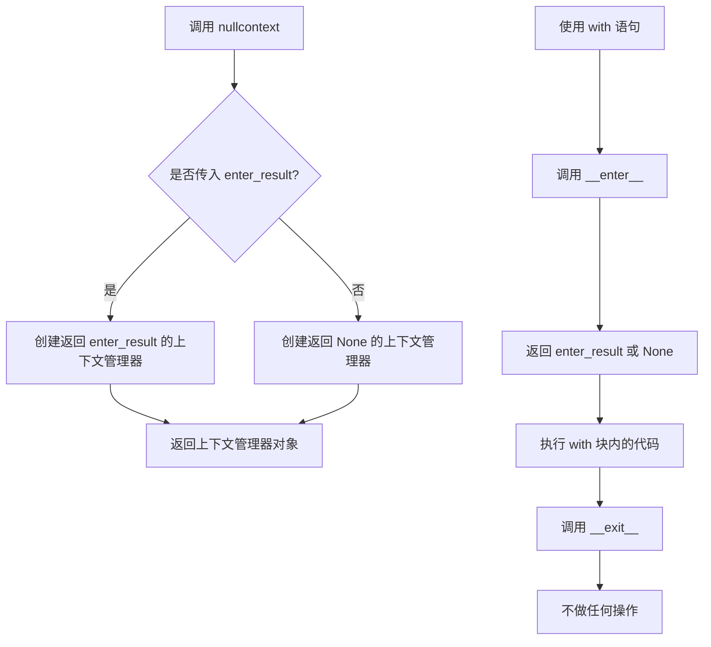

#### 带注释源码

```python
# nullcontext 源码（来自 Python 3.7+ contextlib 模块）
# 这是一个简化版本，用于说明其工作原理

class _nullcontext:
    """
    空上下文管理器类
    
    特性：
    - __enter__ 返回 enter_result
    - __exit__ 不执行任何操作（返回 False 表示不抑制异常）
    """
    
    def __init__(self, enter_result=None):
        self.enter_result = enter_result
    
    def __enter__(self):
        return self.enter_result
    
    def __exit__(self, *excinfo):
        # 不执行任何操作，返回 False 不抑制异常
        pass


# 工厂函数（实际库中的实现）
def nullcontext(enter_result=None):
    """
    创建一个不做任何操作的上下文管理器
    
    参数:
        enter_result: 上下文管理器 __enter__() 方法的返回值
        
    返回值:
        一个上下文管理器对象
        
    使用场景:
        - 条件分支需要一个上下文管理器
        - -placeholder 当不需要实际上下文管理时
        - 简化代码避免重复的 if/else
    """
    return _nullcontext(enter_result)


# 在本代码中的实际使用方式：
# ctx = init_empty_weights if is_accelerate_available() else nullcontext
# 
# 如果 accelerate 可用：ctx = init_empty_weights（会初始化空权重）
# 如果 accelerate 不可用：ctx = nullcontext（空操作，不做任何事）
#
# 后续使用：
# with ctx():
#     prior_model = StableCascadeUNet(...)
#
# 这确保了无论 accelerate 是否可用，代码都能正常运行
# 当 accelerate 不可用时，nullcontext 作为占位符上下文管理器
```


### `load_file`

该函数是 `safetensors.torch` 库提供的核心方法，用于从磁盘高效加载 SafeTensors 格式的模型权重文件，并将张量直接加载到指定设备。在本代码中，它被用于加载 Stable Cascade 模型的 stage_c (prior) 和 stage_b (decoder) 权重文件。

参数：

- `filename`：`str`，要加载的 SafeTensors 文件的完整路径（如 `prior_checkpoint_path` 或 `decoder_checkpoint_path`）
- `device`：`str`，指定目标设备，默认为 `"cpu"`，在本代码中根据 `device = "cpu"` 传入

返回值：`Dict[str, torch.Tensor]`，返回字典类型，其中键为权重张量的名称（字符串），值为对应的 PyTorch 张量对象

#### 流程图

```mermaid
flowchart TD
    A[开始加载权重文件] --> B{是否使用 safetensors 格式?}
    B -->|是| C[调用 safetensors.torch.load_file]
    B -->|否| D[调用 torch.load]
    C --> E[根据 filename 读取 safetensors 文件]
    E --> F[将张量加载到 device 指定设备]
    F --> G[返回 Dict[str, Tensor] 状态字典]
    D --> H[根据路径加载 pickle 文件]
    H --> G
    G --> I[传递给 convert_stable_cascade_unet_single_file_to_diffusers 进行转换]
```

#### 带注释源码

```python
# 加载 prior 阶段 (stage_c) 的权重
if args.use_safetensors:
    # 使用 safetensors 库高效加载权重文件
    # 参数1: 要加载的文件路径 (来自命令行 args.stage_c_name)
    # 参数2: 目标设备 "cpu" (避免在转换脚本中过早占用 GPU 显存)
    prior_orig_state_dict = load_file(prior_checkpoint_path, device=device)
else:
    # 备选方案：使用 PyTorch 原生方式加载 .pt/.bin 文件
    prior_orig_state_dict = torch.load(prior_checkpoint_path, map_location=device)

# ... 后续转换处理 ...

# 加载 decoder 阶段 (stage_b) 的权重
if args.use_safetensors:
    # 同样使用 load_file 加载 decoder 权重
    # 文件路径由 args.stage_b_name 指定
    decoder_orig_state_dict = load_file(decoder_checkpoint_path, device=device)
else:
    # 备选方案：使用 torch.load
    decoder_orig_state_dict = torch.load(decoder_checkpoint_path, map_location=device)
```


### `torch.load`

该函数是 PyTorch 官方 API，用于从磁盘加载经过 `torch.save` 序列化的对象（如模型权重、字典等）。在当前代码中用于加载 Stable Cascade 模型的 stage_c 和 stage_b 权重文件。

#### 参数

- `f`：`str` 或 `os.PathLike` 或 `BinaryIO`，要加载的文件路径或类文件对象
- `map_location`：`str` 或 `dict` 或 `Callable`，指定如何将张量重新映射到不同的设备（如 `"cpu"`、`"cuda:0"` 或 `{"cuda:0": "cpu"}`）
- `pickle_module`：`module`，用于反序列化的 pickle 模块（默认使用 pickle）
- `weights_only`：`bool`，若为 `True`，则只允许加载张量、字典、整型、浮点型、字符串等基础类型，禁止加载任意 Python 对象（默认 `False`）
- `mmap`：`bool`，是否使用内存映射加载文件（减少内存占用）
- `**pickle_load_args`：传递给 pickle_module 的额外关键字参数

#### 返回值

- `任意类型`，返回反序列化后的 Python 对象（通常为字典 `dict`）

#### 流程图

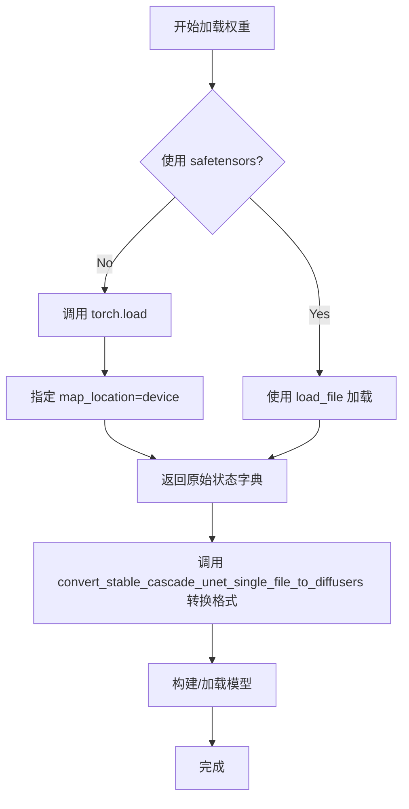

#### 带注释源码

```python
# 从代码中提取的 torch.load 调用示例（第 87 行和第 129 行）

# 场景 1：加载 Prior 模型权重
if args.use_safetensors:
    # 如果使用 safetensors 格式，调用 safetensors.torch.load_file
    prior_orig_state_dict = load_file(prior_checkpoint_path, device=device)
else:
    # 否则使用 PyTorch 原生 torch.load 加载
    # 参数：
    #   - prior_checkpoint_path: 权重文件路径（字符串）
    #   - map_location=device: 将加载的张量映射到 CPU 设备
    prior_orig_state_dict = torch.load(prior_checkpoint_path, map_location=device)

# 场景 2：加载 Decoder 模型权重
if args.use_safetensors:
    decoder_orig_state_dict = load_file(decoder_checkpoint_path, device=device)
else:
    # 同样使用 torch.load 加载解码器权重到 CPU
    # 这两个调用都返回 Python 字典对象，包含模型各层的权重参数
    decoder_orig_state_dict = torch.load(decoder_checkpoint_path, map_location=device)
```

#### 技术说明

| 项目 | 说明 |
|------|------|
| **加载方式** | 区分 `torch.load`（pickle 格式）与 `safetensors.torch.load_file`（安全格式） |
| **设备映射** | 统一映射到 CPU，避免 CUDA 内存问题 |
| **潜在风险** | 使用 `torch.load` 默认允许任意对象反序列化，存在安全风险；建议未来版本改用 `weights_only=True` 或迁移到 safetensors 格式 |
| **优化建议** | 当前代码已支持 `--use_safetensors` 参数，可优先推荐使用 safetensors 以提升安全性和加载速度 |


### `convert_stable_cascade_unet_single_file_to_diffusers`

该函数是权重格式转换工具函数，用于将原始 Stable Cascade 模型的 UNet 权重（以 PyTorch 状态字典格式存储）转换为 Diffusers 库兼容的格式，以便能够通过 `StableCascadeUNet` 模型架构进行加载和推理。函数处理了权重键名映射、层级结构调整等兼容性转换工作。

参数：

- `original_state_dict`：`Dict[str, torch.Tensor]`（通常为 `Dict[str, Any]`），原始 Stable Cascade 模型的权重状态字典（state dictionary），从 `.safetensors` 或 `.pt` 文件中加载得到。

返回值：`Dict[str, torch.Tensor]`，转换后的权重状态字典，键名和结构已调整为 Diffusers `StableCascadeUNet` 模型所期望的格式。

#### 流程图

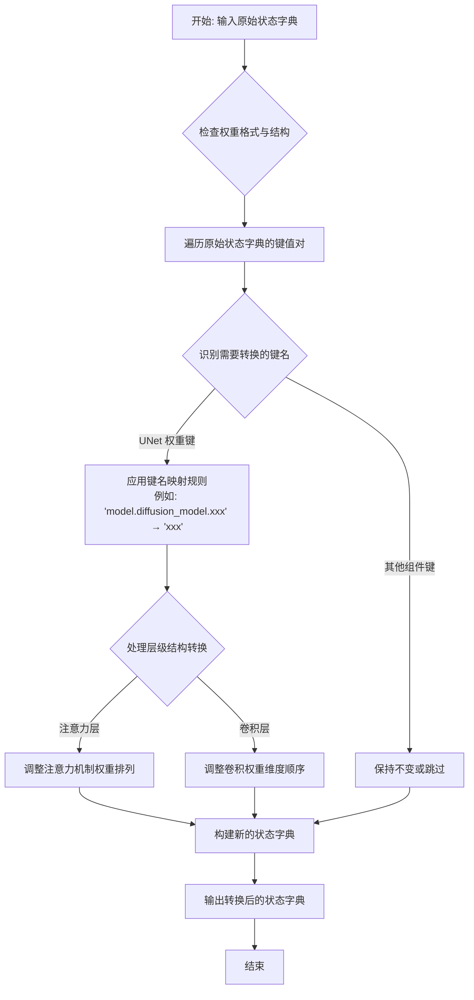

#### 带注释源码

```python
# 注意：由于该函数定义在 diffusers 库内部，用户提供的代码中未包含其完整实现源码。
# 以下是基于函数调用方式和功能推断的逻辑模拟实现，仅供参考。

def convert_stable_cascade_unet_single_file_to_diffusers(original_state_dict):
    """
    将原始 Stable Cascade UNet 权重转换为 Diffusers 兼容格式。
    
    参数:
        original_state_dict: 原始模型权重字典，通常包含 'model.diffusion_model' 前缀的键
        
    返回:
        转换后的权重字典，适配 StableCascadeUNet 模型结构
    """
    # 初始化结果字典
    converted_state_dict = {}
    
    # 定义键名映射规则：原始键名 -> Diffusers 键名
    # 原始模型通常使用 'model.diffusion_model.*' 前缀
    # 需要移除前缀并重新映射到正确的模块路径
    key_mapping = {
        'model.diffusion_model.input_blocks': 'in_layers',
        'model.diffusion_model.out_blocks': 'out_layers', 
        'model.diffusion_model.time_stack': 'time_emb',
        # ... 其他映射规则
    }
    
    # 遍历原始状态字典中的所有键值对
    for key, value in original_state_dict.items():
        new_key = key
        
        # 应用键名前缀移除
        for old_prefix, new_prefix in key_mapping.items():
            if key.startswith(old_prefix):
                new_key = key.replace(old_prefix, new_prefix, 1)
                break
        
        # 处理权重形状变换（如需要）
        # 例如：某些卷积层权重可能需要转置或reshape
        # converted_value = transform_weight(value, new_key)
        converted_value = value
        
        converted_state_dict[new_key] = converted_value
    
    return converted_state_dict

# 该函数在主脚本中的实际调用方式：
# prior_state_dict = convert_stable_cascade_unet_single_file_to_diffusers(prior_orig_state_dict)
# decoder_state_dict = convert_stable_cascade_unet_single_file_to_diffusers(decoder_orig_state_dict)
```


### `StableCascadeUNet`

该类是Stable Cascade模型的核心UNet架构，用于图像生成任务中的噪声预测。它支持两种配置模式：Prior（先验）模型用于文本到图像的初始潦草生成，Decoder（解码器）模型用于将低分辨率潦草解码为高分辨率图像。

参数：

- `in_channels`：`int`，输入图像的通道数（Prior为16，Decoder为4）
- `out_channels`：`int`，输出图像的通道数（Prior为16，Decoder为4）
- `timestep_ratio_embedding_dim`：`int`，时间步长嵌入的维度，用于将扩散时间步长转换为特征向量
- `patch_size`：`int`，Patch大小（Prior为1，Decoder为2），用于将图像分割为patches
- `conditioning_dim`：`int`，条件特征的维度，用于接收CLIP文本和图像特征
- `block_out_channels`：`List[int]`，每个分辨率块的输出通道数列表
- `num_attention_heads`：`List[int]`，每个注意力层的注意力头数量（0表示该层不使用注意力）
- `down_num_layers_per_block`：`List[int]`，下采样每个block中的层数
- `up_num_layers_per_block`：`List[int]`，上采样每个block中的层数
- `down_blocks_repeat_mappers`：`List[int]`，下采样block的重复映射器数量
- `up_blocks_repeat_mappers`：`List[int]`，上采样block的重复映射器数量
- `block_types_per_layer`：`List[List[str]]`，每层使用的block类型列表（如SDCascadeResBlock、SDCascadeTimestepBlock、SDCascadeAttnBlock）
- `clip_text_in_channels`：`int`，CLIP文本特征的输入通道数（仅Prior需要）
- `clip_text_pooled_in_channels`：`int`，CLIP池化文本特征的输入通道数
- `clip_image_in_channels`：`int`，CLIP图像特征的输入通道数（仅Prior需要）
- `clip_seq`：`int`，CLIP特征的序列长度
- `effnet_in_channels`：`int`，EfficientNet特征的输入通道数（仅Decoder需要）
- `pixel_mapper_in_channels`：`int`，像素映射器的输入通道数（仅Decoder需要）
- `kernel_size`：`int`，卷积核大小
- `dropout`：`List[float]`，各层的dropout比率
- `self_attn`：`bool`，是否使用自注意力机制
- `timestep_conditioning_type`：`List[str]`，时间步长条件类型（如"sca"、"crp"）
- `switch_level`：`List[bool]`，切换层级（仅Prior使用）

返回值：`StableCascadeUNet`，返回创建的UNet模型实例

#### 流程图

```mermaid
flowchart TD
    A[开始创建StableCascadeUNet模型] --> B{模型类型}
    B -->|Prior模式| C[设置Prior特定参数]
    B -->|Decoder模式| D[设置Decoder特定参数]
    C --> E[配置下采样 blocks]
    D --> F[配置EfficientNet和Pixel Mapper输入]
    E --> G[配置上采样 blocks]
    F --> G
    G --> H[添加CLIP文本/图像条件嵌入]
    H --> I[添加时间步长条件嵌入]
    I --> J[初始化各层block]
    J --> K[返回StableCascadeUNet模型实例]
    
    subgraph "参数配置"
    L[block_out_channels: [320, 640, 1280, 1280] 或 [2048, 2048]]
    M[num_attention_heads: [0, 0, 20, 20] 或 [32, 32]]
    N[block_types: SDCascadeResBlock, SDCascadeTimestepBlock, SDCascadeAttnBlock]
    end
```

#### 带注释源码

```python
# Prior模型实例化 - 用于从文本生成初始图像表示
prior_model = StableCascadeUNet(
    in_channels=16,                      # 输入 latent 通道数
    out_channels=16,                     # 输出 latent 通道数
    timestep_ratio_embedding_dim=64,     # 时间步嵌入维度
    patch_size=1,                        # Patch大小为1（不进行patchify）
    conditioning_dim=2048,               # 条件特征维度（来自CLIP）
    block_out_channels=[2048, 2048],     # 两个block的输出通道
    num_attention_heads=[32, 32],        # 每个block使用32个注意力头
    down_num_layers_per_block=[8, 24],   # 下采样：第1个block 8层，第2个block 24层
    up_num_layers_per_block=[24, 8],     # 上采样：第1个block 24层，第2个block 8层
    down_blocks_repeat_mappers=[1, 1],   # 下采样block重复1次
    up_blocks_repeat_mappers=[1, 1],     # 上采样block重复1次
    block_types_per_layer=[              # 每层的block类型
        ["SDCascadeResBlock", "SDCascadeTimestepBlock", "SDCascadeAttnBlock"],
        ["SDCascadeResBlock", "SDCascadeTimestepBlock", "SDCascadeAttnBlock"],
    ],
    clip_text_in_channels=1280,          # CLIP文本编码器输出通道
    clip_text_pooled_in_channels=1280,   # CLIP池化文本特征通道
    clip_image_in_channels=768,          # CLIP图像编码器输出通道
    clip_seq=4,                          # CLIP特征序列长度
    kernel_size=3,                       # 卷积核大小
    dropout=[0.1, 0.1],                  # 两层dropout概率
    self_attn=True,                      # 启用自注意力
    timestep_conditioning_type=["sca", "crp"],  # 时间步条件类型
    switch_level=[False],                # 不使用switch level
)

# Decoder模型实例化 - 用于将低分辨率latent解码为高分辨率图像
decoder = StableCascadeUNet(
    in_channels=4,                       # 输入通道数（VQ压缩后）
    out_channels=4,                      # 输出通道数
    timestep_ratio_embedding_dim=64,    # 时间步嵌入维度
    patch_size=2,                        # Patch大小为2
    conditioning_dim=1280,               # 条件特征维度
    block_out_channels=[320, 640, 1280, 1280],  # 四个block的输出通道
    down_num_layers_per_block=[2, 6, 28, 6],    # 下采样各block层数
    up_num_layers_per_block=[6, 28, 6, 2],      # 上采样各block层数
    down_blocks_repeat_mappers=[1, 1, 1, 1],    # 下采样重复映射
    up_blocks_repeat_mappers=[3, 3, 2, 2],      # 上采样重复映射（用于增加分辨率）
    num_attention_heads=[0, 0, 20, 20],        # 前两个block无注意力，后两个有20个头
    block_types_per_layer=[              # Decoder的block类型配置
        ["SDCascadeResBlock", "SDCascadeTimestepBlock"],
        ["SDCascadeResBlock", "SDCascadeTimestepBlock"],
        ["SDCascadeResBlock", "SDCascadeTimestepBlock", "SDCascadeAttnBlock"],
        ["SDCascadeResBlock", "SDCascadeTimestepBlock", "SDCascadeAttnBlock"],
    ],
    clip_text_pooled_in_channels=1280,   # CLIP池化文本特征
    clip_seq=4,                          # CLIP序列长度
    effnet_in_channels=16,               # EfficientNet特征输入通道
    pixel_mapper_in_channels=3,          # 像素映射器输入通道
    kernel_size=3,                       # 卷积核大小
    dropout=[0, 0, 0.1, 0.1],            # 仅最后两层使用dropout
    self_attn=True,                      # 启用自注意力
    timestep_conditioning_type=["sca"],  # 仅使用sca类型
)
```


### `load_model_dict_into_meta`

该函数是 `diffusers` 库中的模型加载工具函数，用于在 `accelerate` 环境中将预训练权重加载到 `meta` 设备上，从而实现无需实例化完整模型即可加载权重信息，常用于大模型的分布式加载场景。

参数：

- `model`：`torch.nn.Module`，目标模型实例，需要加载权重的模型对象
- `state_dict`：`Dict[str, torch.Tensor]`，包含模型权重的状态字典，键为参数名称，值为张量
- `dtype`：`torch.dtype`，可选参数，指定权重加载后的数据类型，默认为 `None`
- `device`：`torch.device`，可选参数，指定权重加载到的设备，默认为 `"cpu"`

返回值：`None`，该函数直接修改传入的 `model` 对象，不返回任何值

#### 流程图

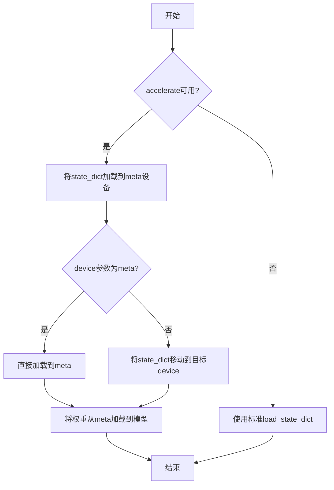

#### 带注释源码

```python
def load_model_dict_into_meta(
    model: torch.nn.Module,
    state_dict: Dict[str, torch.Tensor],
    dtype: Optional[torch.dtype] = None,
    device: Union[str, torch.device] = "cpu",
) -> None:
    """
    将预训练权重加载到模型中，支持meta设备加载以节省内存。
    
    参数:
        model: 目标PyTorch模型实例
        state_dict: 包含模型权重的字典
        dtype: 可选，指定权重的目标数据类型
        device: 权重加载的目标设备，默认为cpu
    
    返回:
        无返回值，直接修改模型对象
    """
    # 如果目标设备是meta设备，使用特殊处理
    if device == "meta":
        # 从meta设备加载权重到模型
        with torch.device("meta"):
            model.load_state_dict(state_dict, assign=True)
    else:
        # 普通设备加载
        # 转换state_dict中的张量到目标设备和dtype
        state_dict = {
            k: v.to(device=device, dtype=dtype) if v.is_floating_point() else v.to(device=device)
            for k, v in state_dict.items()
        }
        model.load_state_dict(state_dict, assign=True)
```


### `torch.nn.Module.load_state_dict`

PyTorch 模型的方法，用于将预先保存的状态字典（权重和参数）加载到模型实例中，实现模型权重的恢复或迁移。

参数：

-  `state_dict`：`Dict[str, Any]`，包含模型权重和参数的字典，通常由 `model.state_dict()` 生成或从检查点文件加载得到
-  `strict`：`bool`（可选，默认为 `True`），是否严格匹配状态字典的键与模型的 `state_dict()` 键，设置为 `False` 时可以忽略不匹配的键
-  `assign`：`bool`（可选，默认为 `False`），是否将状态字典中的键直接赋值给模型的参数，而非仅复制数值

返回值：`None`，该方法直接修改模型实例的内部状态，不返回任何值

#### 流程图

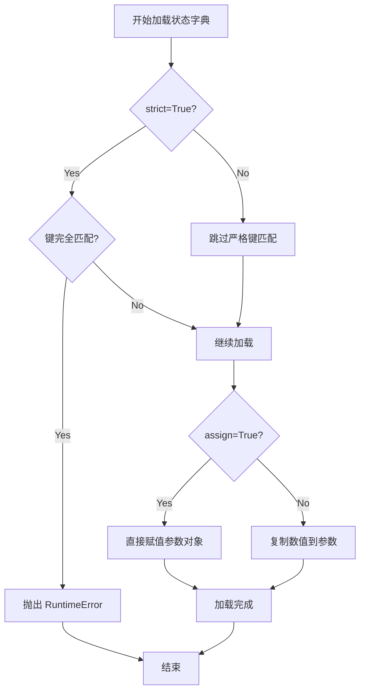

#### 带注释源码

```python
# 在代码中的实际使用示例 (第118行附近)
# prior_model: StableCascadeUNet 模型实例
# prior_state_dict: 从检查点文件加载并转换后的权重字典
prior_model.load_state_dict(prior_state_dict)

# 在代码中的实际使用示例 (第156行附近)
# decoder: StableCascadeUNet 模型实例
# decoder_state_dict: 从检查点文件加载并转换后的权重字典
decoder.load_state_dict(decoder_state_dict)

# 完整的 load_state_dict 方法签名参考：
# def load_state_dict(self, state_dict: Dict[str, Any], strict: bool = True, assign: bool = False) -> None:
#     """
#     将 state_dict 中的参数和缓冲区复制到此模块及其子模块中。
#     如果 strict 为 True，则 state_dict 的键必须与此模块的 state_dict() 返回的键完全匹配。
#     """
```


### `StableCascadePriorPipeline`

该类是 Stable Cascade 模型中的 Prior 管道，用于将文本和图像编码信息转换为潜在的图像特征表示。它是 Stable Cascade 扩散模型的核心组件之一，负责第一阶段的处理——将 CLIP 文本和图像编码器的输出进行先验建模，生成用于后续解码器的高质量潜在表示。

参数：

- `prior`：`StableCascadeUNet`，先验模型，负责潜在空间的预测
- `tokenizer`：`AutoTokenizer`，CLIP 分词器，用于将文本输入转换为 token ID
- `text_encoder`：`CLIPTextModelWithProjection`，CLIP 文本编码器，将文本转换为文本嵌入向量
- `image_encoder`：`CLIPVisionModelWithProjection`，CLIP 视觉编码器，将图像转换为图像嵌入向量
- `scheduler`：`DDPMWuerstchenScheduler`，调度器，控制扩散过程的噪声调度
- `feature_extractor`：`CLIPImageProcessor`，图像特征提取器，用于预处理输入图像

返回值：`StableCascadePriorPipeline` 实例，创建好的 Prior 管道对象，可用于推理

#### 流程图

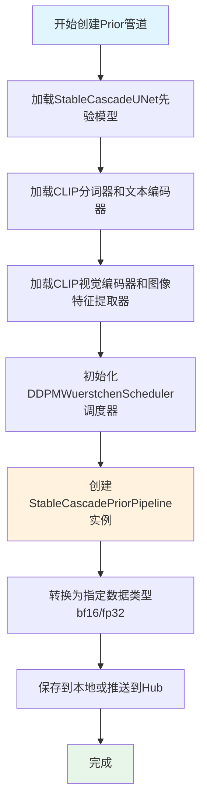

#### 带注释源码

```python
# Prior pipeline - 创建Prior管道
prior_pipeline = StableCascadePriorPipeline(
    prior=prior_model,                    # StableCascadeUNet先验模型实例
    tokenizer=tokenizer,                  # CLIP文本分词器
    text_encoder=text_encoder,            # CLIP文本编码器模型
    image_encoder=image_encoder,          # CLIP视觉编码器模型
    scheduler=scheduler,                 # DDPMWuerstchen调度器
    feature_extractor=feature_extractor,  # CLIP图像特征提取器
)

# 将管道转换为指定数据类型并保存
prior_pipeline.to(dtype).save_pretrained(
    args.prior_output_path,               # 输出路径
    push_to_hub=args.push_to_hub,         # 是否推送到HuggingFace Hub
    variant=args.variant                  # 模型变体如bf16
)
```

#### 关键组件信息

| 组件名称 | 描述 |
|---------|------|
| `prior_model` | StableCascadeUNet架构的先验模型，包含16通道输入输出，2048维条件编码 |
| `tokenizer` | laion/CLIP-ViT-bigG-14-laion2B-39B-b160k预训练的分词器 |
| `text_encoder` | CLIP文本编码器，1280维投影输出 |
| `image_encoder` | CLIP视觉编码器，768维图像特征输入 |
| `scheduler` | DDPM Wuerstchen调度器，用于扩散过程 |

#### 潜在技术债务与优化空间

1. **模型权重加载方式**：代码同时支持`safetensors`和`torch.load`两种方式，但逻辑重复，可抽象为统一接口
2. **硬编码的预训练模型路径**：`laion/CLIP-ViT-bigG-14`和`openai/clip-vit-large-patch14`等路径应作为可配置参数
3. **内存优化**：在`accelerate`可用时使用`init_empty_weights`上下文，但模型加载逻辑可进一步优化以减少内存峰值
4. **错误处理**：缺少对模型文件不存在、网络连接失败等情况的异常处理
5. **参数一致性**：decoder和prior共享`text_encoder`和`tokenizer`，但代码中未明确文档化这种共享关系


### `pipeline.to`

将 Diffusers pipeline 移动到指定设备并转换数据类型（dtype）

参数：

- `dtype`：`torch.dtype`，目标数据类型（如 torch.float32 或 torch.bfloat16），用于将 pipeline 的所有组件转换到指定的数据类型

返回值：`Pipeline`，转换数据类型后的 pipeline 对象自身，支持链式调用

#### 流程图

```mermaid
flowchart TD
    A[开始] --> B{判断 dtype 参数}
    B -->|bf16| C[使用 torch.bfloat16]
    B -->|其他| D[使用 torch.float32]
    C --> E[调用 pipeline.to dtype]
    D --> E
    E --> F[返回转换后的 pipeline 对象]
    F --> G[调用 save_pretrained 保存模型]
```

#### 带注释源码

```python
# 代码中使用了三种 pipeline，每种都调用了 .to() 方法进行数据类型转换

# 1. Prior Pipeline 的数据类型转换
prior_pipeline.to(dtype).save_pretrained(
    args.prior_output_path, push_to_hub=args.push_to_hub, variant=args.variant
)

# 2. Decoder Pipeline 的数据类型转换
decoder_pipeline.to(dtype).save_pretrained(
    args.decoder_output_path, push_to_hub=args.push_to_hub, variant=args.variant
)

# 3. Combined Pipeline 的数据类型转换（如果启用）
if args.save_combined:
    stable_cascade_pipeline.to(dtype).save_pretrained(
        args.combined_output_path, push_to_hub=args.push_to_hub, variant=args.variant
    )

# dtype 的确定逻辑（在脚本开头）
if args.variant == "bf16":
    dtype = torch.bfloat16
else:
    dtype = torch.float32

# .to() 方法是 PyTorch nn.Module 的内置方法
# 功能：将模块的参数和缓冲区移动到指定的设备或转换为指定的数据类型
# 在这里仅用于 dtype 转换，因为后续直接使用 save_pretrained 保存到磁盘
```

---

### 补充说明

由于 `.to()` 是 PyTorch 内部方法而非脚本自定义函数，上述文档基于代码中实际调用的行为进行描述。该方法的标准签名如下：

```python
def to(self, dtype=None, device=None, non_blocking=False):
    """
    参数:
        dtype (torch.dtype, optional): 目标数据类型
        device (torch.device, optional): 目标设备
        non_blocking (bool, optional): 是否异步传输
    返回:
        Module: 转换后的模块
    """
```


### `Pipeline.save_pretrained`

将 Diffusers 管道模型保存到本地目录或推送到 Hugging Face Hub。

参数：

- `save_directory`：`str`，保存管道的目标目录路径
- `push_to_hub`：`bool`，是否将管道推送到 Hugging Face Hub（默认：`False`）
- `variant`：`str`，可选，指定保存的权重变体（如 `"bf16"`，用于保存 bfloat16 格式权重）

返回值：`None`，无返回值，直接将模型权重和配置文件写入磁盘

#### 流程图

```mermaid
flowchart TD
    A[调用 save_pretrained] --> B{push_to_hub=True?}
    B -->|Yes| C[创建或更新 Hugging Face Hub 仓库]
    B -->|No| D[使用 save_directory 作为本地路径]
    C --> E[上传模型文件到 Hub]
    D --> F[序列化管道各组件为 SafeTensors 或 PyTorch格式]
    F --> G[写入 config.json 和模型权重文件]
    E --> G
    G --> H[完成保存]
```

#### 带注释源码

```python
# 示例：保存 prior_pipeline 到本地
# 参数 dtype: 指定模型权重的数据类型 (torch.bfloat16 或 torch.float32)
# 参数 args.prior_output_path: 本地输出目录路径 (例如 "stable-cascade-prior")
# 参数 args.push_to_hub: 是否推送到 Hugging Face Hub
# 参数 args.variant: 权重变体 (例如 "bf16" 保存 bfloat16 权重)
prior_pipeline.to(dtype).save_pretrained(
    args.prior_output_path,      # 保存目录路径
    push_to_hub=args.push_to_hub, # 是否推送到 Hub
    variant=args.variant          # 权重变体 (bf16/fp16/fp32)
)

# 示例：保存 decoder_pipeline 到本地
decoder_pipeline.to(dtype).save_pretrained(
    args.decoder_output_path,
    push_to_hub=args.push_to_hub,
    variant=args.variant
)

# 示例：保存 combined pipeline 到本地
stable_cascade_pipeline.to(dtype).save_pretrained(
    args.combined_output_path,
    push_to_hub=args.push_to_hub,
    variant=args.variant
)
```


### `PaellaVQModel.from_pretrained`

该方法是 `diffusers` 库中 `PaellaVQModel` 类的类方法，用于从预训练模型加载 VQGAN（Vector Quantized Generative Adversarial Network）模型权重。这是 Wuerstchen V2 架构中用于图像潜在空间量化和解码的关键组件。

参数：

-  `pretrained_model_name_or_path`：`str`，模型在 Hugging Face Hub 上的模型 ID 或本地路径
-  `subfolder`：`str`，可选参数，指定模型权重存放的子文件夹名称（如 `"vqgan"`）

返回值：`PaellaVQModel`，返回加载好的 VQGAN 模型实例

#### 流程图

```mermaid
graph TD
    A[开始] --> B{检查 is_accelerate_available}
    B -->|True| C[使用 init_empty_weights 初始化空模型]
    B -->|False| D[直接初始化模型]
    C --> E[从 safetensors 或 pickle 文件加载权重]
    D --> E
    E --> F{权重格式}
    F -->|safetensors| G[使用 safetensors.torch.load_file]
    F -->|pytorch| H[使用 torch.load]
    G --> I[将权重加载到模型]
    H --> I
    I --> J[返回 PaellaVQModel 实例]
```

#### 带注释源码

```python
# 在 provided code 中调用方式：
vqmodel = PaellaVQModel.from_pretrained("warp-ai/wuerstchen", subfolder="vqgan")

# 完整调用链分析：
# 1. 从 diffusers.pipelines.wuerstchen 导入 PaellaVQModel 类
# 2. 调用类方法 from_pretrained 加载 warp-ai/wuerstchen 仓库中的 vqgan 子文件夹权重
# 3. 返回的 vqmodel 实例用于 StableCascadeDecoderPipeline 的 VQGAN 解码器
```


### `创建 StableCascadeDecoderPipeline`

该函数主要负责创建 Stable Cascade 模型的 Decoder 管道，将预训练的模型权重加载到 `StableCascadeUNet` 架构中，并结合文本编码器、VQGAN 模型和调度器组成完整的推理管道。

参数：

- `decoder`：`StableCascadeUNet` 类型，解码器模型实例
- `text_encoder`：文本编码器模型（来自 CLIP）
- `tokenizer`：分词器（来自 CLIP）
- `vqgan`：`PaellaVQModel` 类型，VQGAN 模型用于图像重建
- `scheduler`：`DDPMWuerstchenScheduler` 类型，噪声调度器
- `dtype`：计算精度（bfloat16 或 float32）
- `args.decoder_output_path`：输出路径，类型为 str
- `args.push_to_hub`：是否推送到 Hub，布尔类型
- `args.variant`：模型变体（如 bf16），类型为 str

返回值：`StableCascadeDecoderPipeline` 类型，创建完成的解码器管道对象

#### 流程图

```mermaid
flowchart TD
    A[开始创建 Decoder Pipeline] --> B[加载 Stage B 检查点文件]
    B --> C{使用 Safetensors?}
    C -->|是| D[使用 load_file 加载]
    C -->|否| E[使用 torch.load 加载]
    D --> F[转换为 Diffusers 格式]
    E --> F
    F --> G[初始化 StableCascadeUNet]
    G --> H[加载权重到模型]
    H --> I[加载 PaellaVQModel]
    I --> J[创建 StableCascadeDecoderPipeline]
    J --> K[保存到指定路径]
    K --> L[结束]
```

#### 带注释源码

```python
# Decoder 部分 - 仅当不跳过 stage_b 时执行
if not args.skip_stage_b:
    # 1. 加载解码器检查点文件
    if args.use_safetensors:
        # 使用 SafeTensors 格式加载权重（更安全、更快）
        decoder_orig_state_dict = load_file(decoder_checkpoint_path, device=device)
    else:
        # 使用 PyTorch 标准格式加载权重
        decoder_orig_state_dict = torch.load(decoder_checkpoint_path, map_location=device)

    # 2. 将原始检查点转换为 Diffusers 格式的 UNet 状态字典
    decoder_state_dict = convert_stable_cascade_unet_single_file_to_diffusers(decoder_orig_state_dict)
    
    # 3. 使用空权重初始化 StableCascadeUNet 模型架构
    # 该模型包含 4 层编码器/解码器块，支持条件图像生成
    with ctx():
        decoder = StableCascadeUNet(
            in_channels=4,                      # 输入通道数（latent 空间）
            out_channels=4,                     # 输出通道数
            timestep_ratio_embedding_dim=64,    # 时间步嵌入维度
            patch_size=2,                       # 图像分块大小
            conditioning_dim=1280,              # 条件嵌入维度（来自文本）
            block_out_channels=[320, 640, 1280, 1280],  # 各层输出通道
            down_num_layers_per_block=[2, 6, 28, 6],    # 下采样每层模块数
            up_num_layers_per_block=[6, 28, 6, 2],      # 上采样每层模块数
            down_blocks_repeat_mappers=[1, 1, 1, 1],   # 下采样块重复映射
            up_blocks_repeat_mappers=[3, 3, 2, 2],     # 上采样块重复映射
            num_attention_heads=[0, 0, 20, 20],       # 各层注意力头数
            block_types_per_layer=[               # 每层模块类型
                ["SDCascadeResBlock", "SDCascadeTimestepBlock"],
                ["SDCascadeResBlock", "SDCascadeTimestepBlock"],
                ["SDCascadeResBlock", "SDCascadeTimestepBlock", "SDCascadeAttnBlock"],
                ["SDCascadeResBlock", "SDCascadeTimestepBlock", "SDCascadeAttnBlock"],
            ],
            clip_text_pooled_in_channels=1280,   # CLIP 文本池化输入通道
            clip_seq=4,                          # CLIP 序列长度
            effnet_in_channels=16,               # EffNet 输入通道（latent）
            pixel_mapper_in_channels=3,          # 像素映射器输入通道（RGB）
            kernel_size=3,                       # 卷积核大小
            dropout=[0, 0, 0.1, 0.1],            # Dropout 概率（逐层）
            self_attn=True,                      # 启用自注意力
            timestep_conditioning_type=["sca"],   # 时间步条件类型
        )

    # 4. 加载权重到模型中
    if is_accelerate_available():
        # 使用 accelerate 库的元数据方式加载（支持大模型分片加载）
        load_model_dict_into_meta(decoder, decoder_state_dict)
    else:
        # 标准 PyTorch 方式加载权重
        decoder.load_state_dict(decoder_state_dict)

    # 5. 从预训练模型加载 VQGAN（用于将 latent 转换为图像）
    vqmodel = PaellaVQModel.from_pretrained("warp-ai/wuerstchen", subfolder="vqgan")

    # 6. 创建 StableCascadeDecoderPipeline
    decoder_pipeline = StableCascadeDecoderPipeline(
        decoder=decoder,              # UNet 解码器模型
        text_encoder=text_encoder,    # CLIP 文本编码器
        tokenizer=tokenizer,          # CLIP 分词器
        vqgan=vqmodel,                # VQGAN 量化模型
        scheduler=scheduler           # 噪声调度器
    )
    
    # 7. 转换为指定精度并保存到本地或推送至 Hub
    decoder_pipeline.to(dtype).save_pretrained(
        args.decoder_output_path, 
        push_to_hub=args.push_to_hub, 
        variant=args.variant
    )
```


### `StableCascadeCombinedPipeline` 创建

该函数用于创建 Stable Cascade 组合管道（Combined Pipeline），将先验（Prior）和解码器（Decoder）两个阶段整合在一起，实现从文本到图像的端到端生成。

参数：

- `text_encoder`：`CLIPTextModelWithProjection`，文本编码器，用于将输入文本转换为文本嵌入
- `tokenizer`：`AutoTokenizer`，分词器，用于对输入文本进行分词
- `decoder`：`StableCascadeUNet`，解码器模型，用于从潜空间表示生成图像
- `scheduler`：`DDPMWuerstchenScheduler`，调度器，用于控制去噪过程
- `vqmodel`：`PaellaVQModel`，VQGAN 模型，用于将图像解码为最终像素
- `prior_text_encoder`：`CLIPTextModelWithProjection`，先验阶段的文本编码器
- `prior_tokenizer`：`AutoTokenizer`，先验阶段使用的分词器
- `prior_prior`：`StableCascadeUNet`，先验模型，用于生成图像的潜空间表示
- `prior_scheduler`：`DDPMWuerstchenScheduler`，先验阶段的调度器
- `prior_image_encoder`：`CLIPVisionModelWithProjection`，图像编码器，用于编码参考图像
- `prior_feature_extractor`：`CLIPImageProcessor`，图像特征提取器

返回值：`StableCascadeCombinedPipeline`，返回创建的组合管道对象

#### 流程图

```mermaid
flowchart TD
    A[输入: text_encoder, tokenizer, decoder, scheduler, vqmodel] --> B[创建 Combined Pipeline]
    B --> C[整合 Decoder 组件]
    B --> D[整合 Prior 组件]
    C --> E[返回 StableCascadeCombinedPipeline 实例]
    D --> E
    E --> F[保存到指定路径或推送到 Hub]
```

#### 带注释源码

```python
# 判断是否需要保存组合管道
if args.save_combined:
    # 创建 Stable Cascade 组合管道
    # 该管道整合了 Decoder 和 Prior 两个阶段
    stable_cascade_pipeline = StableCascadeCombinedPipeline(
        # ============ Decoder 组件 ============
        text_encoder=text_encoder,           # 文本编码器 (CLIP)
        tokenizer=tokenizer,                  # 分词器
        decoder=decoder,                      # 解码器 UNet 模型
        scheduler=scheduler,                  # 调度器
        vqgan=vqmodel,                        # VQGAN 量化模型
        
        # ============ Prior 组件 ============
        prior_text_encoder=text_encoder,     # 先验文本编码器
        prior_tokenizer=tokenizer,           # 先验分词器
        prior_prior=prior_model,             # 先验 UNet 模型
        prior_scheduler=scheduler,           # 先验调度器
        prior_image_encoder=image_encoder,   # 图像编码器
        prior_feature_extractor=feature_extractor,  # 图像特征提取器
    )
    
    # 将管道移动到指定数据类型并保存
    stable_cascade_pipeline.to(dtype).save_pretrained(
        args.combined_output_path, 
        push_to_hub=args.push_to_hub, 
        variant=args.variant
    )
```


### `is_accelerate_available`

该函数用于检查当前环境中是否安装了 `accelerate` 库，以便在模型加载时决定是否使用 `accelerate` 提供的相关功能（如 `init_empty_weights` 和 `load_model_dict_into_meta`）。

参数：无

返回值：`bool`，如果 `accelerate` 库已安装则返回 `True`，否则返回 `False`。

#### 流程图

```mermaid
flowchart TD
    A[开始] --> B{检查 accelerate 库是否可用}
    B -->|可用| C[返回 True]
    B -->|不可用| D[返回 False]
    C --> E[结束]
    D --> E
```

#### 带注释源码

```python
# 从 diffusers.utils 模块导入 is_accelerate_available 函数
# 该函数用于检测 accelerate 库是否已安装
from diffusers.utils import is_accelerate_available

# 使用示例 1: 条件导入 accelerate 的 init_empty_weights
if is_accelerate_available():
    from accelerate import init_empty_weights

# 使用示例 2: 根据条件选择上下文管理器
ctx = init_empty_weights if is_accelerate_available() else nullcontext

# 使用示例 3: 条件使用 accelerate 的模型加载方法
if is_accelerate_available():
    load_model_dict_into_meta(prior_model, prior_state_dict)
else:
    prior_model.load_state_dict(prior_state_dict)

# 使用示例 4: 另一个条件模型加载
if is_accelerate_available():
    load_model_dict_into_meta(decoder, decoder_state_dict)
else:
    decoder.load_state_dict(decoder_state_dict)
```

## 关键组件


### 张量索引与惰性加载

利用 `init_empty_weights` 配合 `accelerate` 库实现模型权重的惰性加载，通过 `load_model_dict_into_meta` 将权重加载到空模型中，避免一次性加载大模型到内存。

### 反量化支持

通过 `--variant` 参数支持 bf16 反量化，将权重从原始精度转换为 bfloat16 格式存储，以减少显存占用。

### 量化策略

根据 `args.variant` 参数值选择数据类型：`bf16` 时使用 `torch.bfloat16`，否则使用 `torch.float32`，并在 pipeline 保存时应用选定精度。

### Stage C (Prior) 转换流程

负责将 stage c 的检查点权重转换为 StableCascadePriorPipeline，包含 UNet 模型、文本编码器、图像编码器、调度器和特征提取器的初始化与权重加载。

### Stage B (Decoder) 转换流程

负责将 stage b 的检查点权重转换为 StableCascadeDecoderPipeline，包含 UNet 模型、VQGAN 量化模型、文本编码器的初始化与权重加载。

### SafeTensors 格式支持

通过 `--use_safetensors` 参数选择加载格式，使用 `safetensors.torch.load_file` 加载 safetensors 格式或 `torch.load` 加载 pickle 格式权重。

### VQGAN 模型集成

从 `warp-ai/wuerstchen` 仓库加载预训练的 `PaellaVQModel`，作为 Decoder pipeline 的图像解码组件。

### CLIP 编码器初始化

加载 `laion/CLIP-ViT-bigG-14-laion2B-39B-b160k` 作为文本编码器，`openai/clip-vit-large-patch14` 作为图像编码器，用于条件生成。

### Combined Pipeline 构建

将 Prior 和 Decoder 组件组合为 `StableCascadeCombinedPipeline`，支持端到端的图像生成流程。

### 权重转换核心函数

使用 `convert_stable_cascade_unet_single_file_to_diffusers` 函数将原始 Stable Cascade UNet 权重格式转换为 diffusers 框架兼容的格式。


## 问题及建议


### 已知问题

- **硬编码模型路径**：CLIP文本编码器、图像编码器和VQGAN模型的路径（"laion/CLIP-ViT-bigG-14-laion2B-39B-b160k"、"openai/clip-vit-large-patch14"、"warp-ai/wuerstchen"）硬编码在代码中，降低了脚本的灵活性和可配置性
- **缺乏文件存在性验证**：未检查模型权重文件（prior_checkpoint_path、decoder_checkpoint_path）是否存在就直接加载，可能导致运行时错误
- **重复代码模式**：stage_c和stage_b的转换逻辑高度重复，包括safetensors/torch加载、状态字典转换、模型初始化等，存在提炼为通用函数的空间
- **缺少日志输出**：脚本执行过程中没有任何日志记录，难以追踪执行进度和排查问题
- **无类型注解**：整个脚本缺少Python类型注解，降低了代码可读性和可维护性
- **异常处理不完善**：文件加载操作未使用try-except包装，模型下载失败等网络问题没有显式处理
- **accelerate版本检查不完整**：仅检查模块可用性，未验证版本兼容性可能导致运行时问题
- **资源释放缺失**：使用完GPU内存后未显式调用torch.cuda.empty_cache()释放资源
- **缺少模型验证**：转换后的模型未进行加载测试，无法确保转换正确性
- **UNet参数硬编码**：StableCascadeUNet的架构参数（block_out_channels、num_attention_heads等）硬编码在代码中

### 优化建议

- 将模型路径提取为命令行参数或配置文件，添加参数如`--text_encoder_model_id`、`--image_encoder_model_id`、`--vqgan_model_id`
- 在加载权重前添加文件存在性检查，使用`os.path.exists()`验证并给出友好错误提示
- 抽取公共转换逻辑为函数如`convert_stage()`，接收stage名称和配置参数以减少重复
- 引入标准日志模块（logging），记录关键步骤如模型加载、转换、保存等
- 为函数参数和返回值添加类型注解，提升代码清晰度
- 为文件加载、模型下载等操作添加try-except异常处理，并提供清晰的错误信息
- 添加`--log_level`参数控制日志级别，便于调试和问题排查
- 在脚本末尾或适当位置添加GPU内存清理逻辑
- 添加简单的验证逻辑，如加载转换后的pipeline进行推理测试（可使用--validate参数控制）
- 将UNet架构参数提取为配置文件或命令行参数，支持不同模型变体

## 其它


### 设计目标与约束

将Stable Cascade模型的预训练权重（stage_c和stage_b）转换为Hugging Face Diffusers格式的Pipeline，支持单独保存Prior Pipeline、Decoder Pipeline或Combined Pipeline。转换脚本需要支持safetensors和pytorch两种格式，支持bf16变体，支持推送到HuggingFace Hub。

### 错误处理与异常设计

当skip_stage_b和skip_stage_c同时为True时，抛出ValueError提示"At least one stage should be converted"。当skip任意一个stage且save_combined为True时，抛出ValueError提示"Cannot skip stages when creating a combined pipeline"。模型加载使用try-except处理文件不存在或格式错误的情况。

### 数据流与状态机

脚本首先解析命令行参数，验证参数合法性。然后依次加载CLIP文本编码器、图像编码器和VQ模型。接着根据是否skip_stage_c决定是否转换和保存Prior Pipeline，最后根据是否skip_stage_b决定是否转换和保存Decoder Pipeline。如果save_combined为True，则组合Prior和Decoder保存为Combined Pipeline。

### 外部依赖与接口契约

依赖diffusers库提供的StableCascadePriorPipeline、StableCascadeDecoderPipeline、StableCascadeCombinedPipeline、StableCascadeUNet、PaellaVQModel、DDPMWuerstchenScheduler。依赖transformers库的CLIPTextModelWithProjection、CLIPVisionModelWithProjection、AutoTokenizer、CLIPImageProcessor、CLIPConfig。依赖safetensors或torch加载权重文件。依赖accelerate库进行空权重初始化（可选）。

### 配置管理

通过命令行参数管理配置，包括model_path（模型路径）、stage_c_name（stage c文件名）、stage_b_name（stage b文件名）、prior_output_path、decoder_output_path、combined_output_path、variant（权重变体）等。所有配置均有默认值，支持用户自定义。

### 性能考虑

使用torch.bfloat16或torch.float32控制精度。使用accelerate的init_empty_weights进行内存优化（在内存受限环境下）。支持safetensors格式以提高加载速度。模型转换使用in-place操作减少内存占用。

### 安全性考虑

使用safetensors格式可提供更安全的权重加载。push_to_hub功能需要认证凭证。模型文件路径需要验证防止路径遍历攻击。

### 测试策略

应测试完整的转换流程（stage_c和stage_b都转换）。应测试单独转换stage_c或stage_b的场景。应测试safetensors和pytorch两种格式的加载。应测试bf16和fp32两种精度。应测试push_to_hub功能（需mock）。应验证转换后的pipeline能够正常推理。

### 部署要求

需要Python 3.8+环境。需要安装torch、diffusers、transformers、safetensors、accelerate等依赖。转换后的模型需要相应的diffusers库版本才能加载。

### 版本兼容性

需要兼容diffusers库的StableCascade相关Pipeline类。需要兼容transformers库的CLIP模型。需要确保CLIP模型版本与Stable Cascade训练时一致（laion/CLIP-ViT-bigG-14-laion2B-39B-b160k和openai/clip-vit-large-patch14）。

### 使用示例与文档

应提供典型的命令行使用示例，如：python convert_stable_cascade.py --model_path /path/to/weights --save_combined --push_to_hub。应说明各参数的用途和默认值。应说明转换后的模型结构和用途。


    