# `diffusers\scripts\convert_stable_cascade_lite.py` 详细设计文档

该脚本用于将Stable Cascade模型的权重文件（支持safetensors和pytorch格式）转换为Hugging Face Diffusers库的流水线格式，支持独立的Prior Pipeline、Decoder Pipeline以及Combined Pipeline的生成，并可选择推送到Hugging Face Hub。

## 整体流程

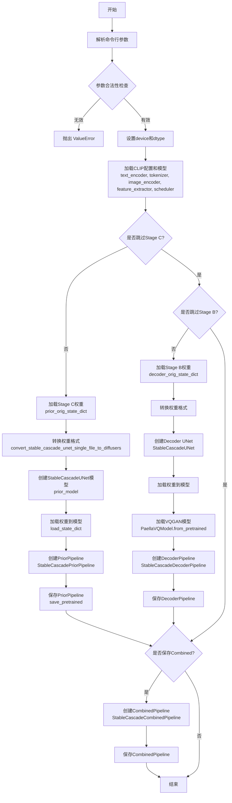

## 类结构

```
无自定义类 (纯脚本文件)
主要依赖的外部类:
├── CLIPConfig (transformers)
├── CLIPTextModelWithProjection (transformers)
├── CLIPVisionModelWithProjection (transformers)
├── AutoTokenizer (transformers)
├── CLIPImageProcessor (transformers)
├── StableCascadeUNet (diffusers.models)
├── PaellaVQModel (diffusers.pipelines.wuerstchen)
├── StableCascadePriorPipeline (diffusers)
├── StableCascadeDecoderPipeline (diffusers)
├── StableCascadeCombinedPipeline (diffusers)
└── DDPMWuerstchenScheduler (diffusers)
```

## 全局变量及字段


### `args`
    
命令行参数对象，包含模型路径、阶段名称、输出路径等配置

类型：`argparse.Namespace`
    


### `model_path`
    
Stable Cascade模型权重路径

类型：`str`
    


### `device`
    
设备类型，默认为'cpu'

类型：`str`
    


### `dtype`
    
数据类型，根据variant参数为bfloat16或float32

类型：`torch.dtype`
    


### `prior_checkpoint_path`
    
Stage C（Prior）权重文件路径

类型：`str`
    


### `decoder_checkpoint_path`
    
Stage B（Decoder）权重文件路径

类型：`str`
    


### `config`
    
CLIP模型配置对象

类型：`CLIPConfig`
    


### `text_encoder`
    
CLIP文本编码器模型

类型：`CLIPTextModelWithProjection`
    


### `tokenizer`
    
CLIP分词器

类型：`AutoTokenizer`
    


### `feature_extractor`
    
CLIP图像特征提取器

类型：`CLIPImageProcessor`
    


### `image_encoder`
    
CLIP图像编码器模型

类型：`CLIPVisionModelWithProjection`
    


### `scheduler`
    
Wuerstchen扩散模型调度器

类型：`DDPMWuerstchenScheduler`
    


### `ctx`
    
空权重初始化上下文管理器

类型：`contextlib.contextmanager`
    


### `prior_orig_state_dict`
    
Stage C原始权重字典

类型：`dict`
    


### `prior_state_dict`
    
转换后的Stage C权重字典

类型：`dict`
    


### `prior_model`
    
Prior模型实例

类型：`StableCascadeUNet`
    


### `prior_pipeline`
    
Prior推理流水线

类型：`StableCascadePriorPipeline`
    


### `decoder_orig_state_dict`
    
Stage B原始权重字典

类型：`dict`
    


### `decoder_state_dict`
    
转换后的Stage B权重字典

类型：`dict`
    


### `decoder`
    
Decoder模型实例

类型：`StableCascadeUNet`
    


### `vqmodel`
    
Wuerstchen VQGAN模型实例

类型：`PaellaVQModel`
    


### `decoder_pipeline`
    
Decoder推理流水线

类型：`StableCascadeDecoderPipeline`
    


### `stable_cascade_pipeline`
    
组合推理流水线

类型：`StableCascadeCombinedPipeline`
    


    

## 全局函数及方法


### `argparse.ArgumentParser`

这是一个命令行参数解析器构造函数，用于创建 ArgumentParser 对象以处理脚本的命令行参数输入。

#### 参数

- `description`：`str`，描述该脚本功能的字符串，说明此脚本用于将 Stable Cascade 模型权重转换为 diffusers pipeline

#### 返回值

`ArgumentParser`，返回一个新的参数解析器对象，用于定义、解析和管理命令行参数

#### 流程图

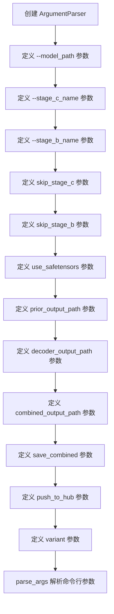

#### 带注释源码

```python
# 创建 ArgumentParser 对象，设置脚本描述
parser = argparse.ArgumentParser(
    description="Convert Stable Cascade model weights to a diffusers pipeline"
)

# 添加模型路径参数
parser.add_argument(
    "--model_path",
    type=str,
    help="Location of Stable Cascade weights"
)

# 添加 Stage C 检查点文件名参数（带默认值）
parser.add_argument(
    "--stage_c_name",
    type=str,
    default="stage_c_lite.safetensors",
    help="Name of stage c checkpoint file"
)

# 添加 Stage B 检查点文件名参数（带默认值）
parser.add_argument(
    "--stage_b_name",
    type=str,
    default="stage_b_lite.safetensors",
    help="Name of stage b checkpoint file"
)

# 添加跳过 Stage C 转换的标志参数
parser.add_argument(
    "--skip_stage_c",
    action="store_true",
    help="Skip converting stage c"
)

# 添加跳过 Stage B 转换的标志参数
parser.add_argument(
    "--skip_stage_b",
    action="store_true",
    help="Skip converting stage b"
)

# 添加使用 SafeTensors 的标志参数
parser.add_argument(
    "--use_safetensors",
    action="store_true",
    help="Use SafeTensors for conversion"
)

# 添加 Prior 输出路径参数（带默认值）
parser.add_argument(
    "--prior_output_path",
    default="stable-cascade-prior-lite",
    type=str,
    help="Hub organization to save the pipelines to"
)

# 添加 Decoder 输出路径参数（带默认值）
parser.add_argument(
    "--decoder_output_path",
    type=str,
    default="stable-cascade-decoder-lite",
    help="Hub organization to save the pipelines to"
)

# 添加 Combined 输出路径参数（带默认值）
parser.add_argument(
    "--combined_output_path",
    type=str,
    default="stable-cascade-combined-lite",
    help="Hub organization to save the pipelines to"
)

# 添加保存 Combined pipeline 的标志参数
parser.add_argument(
    "--save_combined",
    action="store_true"
)

# 添加推送到 Hub 的标志参数
parser.add_argument(
    "--push_to_hub",
    action="store_true",
    help="Push to hub"
)

# 添加模型变体参数（用于指定 bf16）
parser.add_argument(
    "--variant",
    type=str,
    help="Set to bf16 to save bfloat16 weights"
)

# 解析命令行参数并存储到 args 对象
args = parser.parse_args()
```


### `parser.parse_args()`

该函数是 `argparse.ArgumentParser` 类的方法，用于解析命令行传入的参数，将其转换为可访问的命名空间对象，并进行基本的参数校验（如检查是否同时跳过所有阶段）。

#### 参数

此方法不接受任何直接参数，它从 `sys.argv` 中自动获取命令行参数。

- 无直接参数（从系统 argv 获取）

#### 返回值：`Namespace`

返回 `argparse.Namespace` 对象，包含所有定义的命令行参数及其解析后的值：

| 参数名称 | 类型 | 描述 |
|---------|------|------|
| `model_path` | `str` | Stable Cascade 权重文件路径 |
| `stage_c_name` | `str` | Stage C 检查点文件名（默认：`stage_c_lite.safetensors`） |
| `stage_b_name` | `str` | Stage B 检查点文件名（默认：`stage_b_lite.safetensors`） |
| `skip_stage_c` | `bool` | 是否跳过转换 Stage C（默认：`False`） |
| `skip_stage_b` | `bool` | 是否跳过转换 Stage B（默认：`False`） |
| `use_safetensors` | `bool` | 是否使用 SafeTensors 格式（默认：`False`） |
| `prior_output_path` | `str` | Prior 管道输出路径（默认：`stable-cascade-prior-lite`） |
| `decoder_output_path` | `str` | Decoder 管道输出路径（默认：`stable-cascade-decoder-lite`） |
| `combined_output_path` | `str` | 组合管道输出路径（默认：`stable-cascade-combined-lite`） |
| `save_combined` | `bool` | 是否保存组合管道（默认：`False`） |
| `push_to_hub` | `bool` | 是否推送到 Hugging Face Hub（默认：`False`） |
| `variant` | `str` | 模型变体（如 `bf16` 用于 bfloat16 权重） |

#### 流程图

```mermaid
flowchart TD
    A[开始 parse_args] --> B[读取 sys.argv]
    B --> C{检查必需参数}
    C -->|缺少 model_path| D[抛出错误: argument --model_path is required]
    C -->|参数完整| E{验证参数逻辑}
    E -->|skip_stage_b=True 且 skip_stage_c=True| F[抛出错误: At least one stage should be converted]
    E -->|(skip_stage_b 或 skip_stage_c) 且 save_combined=True| G[抛出错误: Cannot skip stages when creating a combined pipeline]
    E -->|验证通过| H[返回 Namespace 对象]
    D --> I[终止程序]
    F --> I
    G --> I
    H --> J[程序继续执行]
```

#### 带注释源码

```python
# 创建参数解析器，添加描述信息
parser = argparse.ArgumentParser(description="Convert Stable Cascade model weights to a diffusers pipeline")

# ==================== 添加命令行参数 ====================

# 必需的模型权重路径参数
parser.add_argument(
    "--model_path", 
    type=str, 
    help="Location of Stable Cascade weights"  # Stable Cascade 权重文件位置
)

# Stage C 检查点文件名（可选，有默认值）
parser.add_argument(
    "--stage_c_name", 
    type=str, 
    default="stage_c_lite.safetensors", 
    help="Name of stage c checkpoint file"  # Stage C 检查点文件名
)

# Stage B 检查点文件名（可选，有默认值）
parser.add_argument(
    "--stage_b_name", 
    type=str, 
    default="stage_b_lite.safetensors", 
    help="Name of stage b checkpoint file"  # Stage B 检查点文件名
)

# 跳过 Stage C 转换的标志
parser.add_argument(
    "--skip_stage_c", 
    action="store_true", 
    help="Skip converting stage c"  # 跳过转换 Stage C
)

# 跳过 Stage B 转换的标志
parser.add_argument(
    "--skip_stage_b", 
    action="store_true", 
    help="Skip converting stage b"  # 跳过转换 Stage B
)

# 使用 SafeTensors 格式的标志
parser.add_argument(
    "--use_safetensors", 
    action="store_true", 
    help="Use SafeTensors for conversion"  # 使用 SafeTensors 进行转换
)

# Prior 管道输出路径
parser.add_argument(
    "--prior_output_path", 
    default="stable-cascade-prior-lite",
    type=str, 
    help="Hub organization to save the pipelines to"  # 保存管道的输出路径
)

# Decoder 管道输出路径
parser.add_argument(
    "--decoder_output_path", 
    type=str, 
    default="stable-cascade-decoder-lite", 
    help="Hub organization to save the pipelines to"  # 保存管道的输出路径
)

# 组合管道输出路径
parser.add_argument(
    "--combined_output_path", 
    type=str, 
    default="stable-cascade-combined-lite", 
    help="Hub organization to save the pipelines to"  # 保存管道的输出路径
)

# 保存组合管道的标志
parser.add_argument(
    "--save_combined", 
    action="store_true"
)

# 推送到 Hugging Face Hub 的标志
parser.add_argument(
    "--push_to_hub", 
    action="store_true", 
    help="Push to hub"  # 推送到 Hub
)

# 模型变体选择（如 bf16）
parser.add_argument(
    "--variant", 
    type=str, 
    help="Set to bf16 to save bfloat16 weights"  # 设置为 bf16 以保存 bfloat16 权重
)

# ==================== 解析命令行参数 ====================
# 从命令行读取参数并解析为 Namespace 对象
args = parser.parse_args()

# ==================== 参数校验逻辑 ====================
# 检查：至少要转换一个 stage
if args.skip_stage_b and args.skip_stage_c:
    raise ValueError("At least one stage should be converted")

# 检查：在创建组合管道时不能跳过任何 stage
if (args.skip_stage_b or args.skip_stage_c) and args.save_combined:
    raise ValueError("Cannot skip stages when creating a combined pipeline")

# 解析后，args 对象包含所有参数值，可通过 args.xxx 访问
# 例如：args.model_path, args.variant, args.use_safetensors 等
model_path = args.model_path
```

#### 关键点说明

1. **参数类型**：使用 `action="store_true"` 的为布尔标志，其他为字符串/路径类型
2. **默认值**：大部分参数有预设的默认值，可根据需求覆盖
3. **校验时机**：参数校验发生在 `parse_args()` 返回后的后续代码中（而非解析时）
4. **返回类型**：`Namespace` 是简单的对象，可通过属性访问方式（如 `args.model_path`）获取参数值


### `CLIPConfig.from_pretrained()`

该方法用于从预训练模型或本地路径加载 CLIP 模型配置，返回一个包含 CLIP 文本编码器和视觉编码器架构参数的 `CLIPConfig` 配置对象。

参数：

- `pretrained_model_name_or_path`：`str` 或 `os.PathLike`，预训练模型的名称（如 Hugging Face Hub 上的模型 ID）或本地目录路径
- `cache_dir`：`str` 或 `os.PathLike`，可选，用于下载缓存模型的目录路径
- `force_download`：`bool`，可选，默认为 `False`，是否强制重新下载模型
- `resume_download`：`bool`，可选，默认为 `True`，是否恢复中断的下载
- `proxies`：`dict`，可选，代理服务器配置
- `output_loading_info`：`bool`，可选，默认为 `False`，是否返回详细的加载信息
- `local_files_only`：`bool`，可选，默认为 `False`，是否仅使用本地文件
- `use_auth_token`：`str` 或 `bool`，可选，用于访问私有模型的认证令牌
- `revision`：`str`，可选，默认为 `"main"`，模型仓库的特定版本或分支
- `**kwargs`：其他可选参数

返回值：`CLIPConfig`，返回包含 CLIP 模型架构配置的对象，包括文本编码器、视觉编码器、投影维度等参数。

#### 流程图

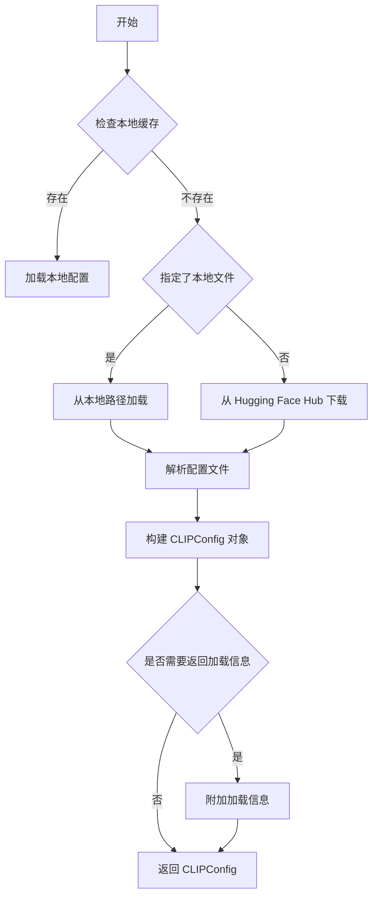

#### 带注释源码

```python
# 从预训练模型加载 CLIP 配置
# 这是 transformers 库中 CLIPConfig 类的类方法
config = CLIPConfig.from_pretrained("laion/CLIP-ViT-bigG-14-laion2B-39B-b160k")

# 示例：在代码中修改配置
# 将文本配置中的 projection_dim 设置为与主配置相同
config.text_config.projection_dim = config.projection_dim

# 此配置对象随后用于实例化 CLIPTextModelWithProjection
# config.text_config 只传递文本编码器的配置部分
text_encoder = CLIPTextModelWithProjection.from_pretrained(
    "laion/CLIP-ViT-bigG-14-laion2B-39B-b160k", config=config.text_config
)
```


### `CLIPTextModelWithProjection.from_pretrained()`

该方法用于从预训练模型加载 CLIP 文本编码器（带投影层），支持从 Hugging Face Hub 或本地路径加载模型权重和配置，并返回配置好的文本编码器实例用于推理或微调。

参数：

-  `pretrained_model_name_or_path`：`str`，预训练模型的名称（如 "laion/CLIP-ViT-bigG-14-laion2B-39B-b160k"）或本地模型目录路径
-  `config`：`Optional[Union[CLIPTextConfig, PretrainedConfig]]`，可选的模型配置对象，用于覆盖默认配置。代码中传入 `config.text_config` 以统一投影维度

返回值：`CLIPTextModelWithProjection`，加载完成的 CLIP 文本编码器模型实例，包含文本编码和投影功能，可输出文本嵌入向量

#### 流程图

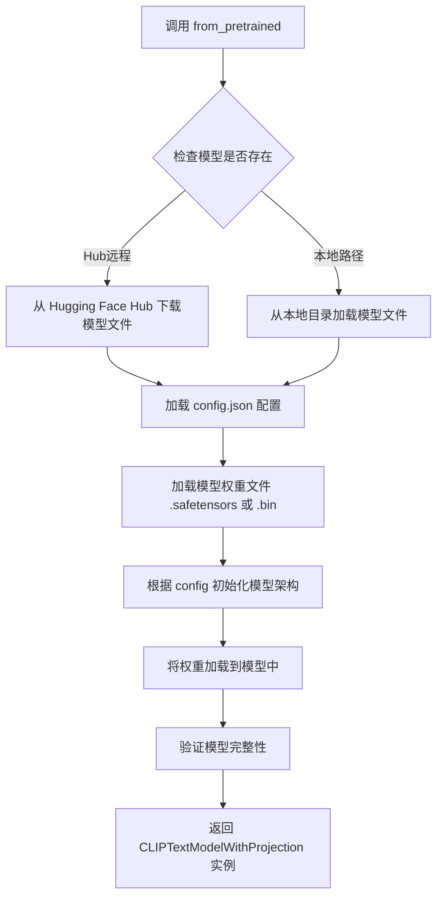

#### 带注释源码

```python
# Clip Text encoder and tokenizer
# 加载 CLIP 配置，使用 laion/CLIP-ViT-bigG-14-laion2B-39B-b160k 预训练模型
config = CLIPConfig.from_pretrained("laion/CLIP-ViT-bigG-14-laion2B-39B-b160k")

# 将文本配置的投影维度设置为与主配置一致，确保维度匹配
config.text_config.projection_dim = config.projection_dim

# 加载带投影层的 CLIP 文本编码器模型
# 参数1: 预训练模型名称或路径
# 参数2: config - 显式传入文本配置以统一投影维度
text_encoder = CLIPTextModelWithProjection.from_pretrained(
    "laion/CLIP-ViT-bigG-14-laion2B-39B-b160k", config=config.text_config
)

# 加载对应的分词器，用于将文本转换为 token
tokenizer = AutoTokenizer.from_pretrained("laion/CLIP-ViT-bigG-14-laion2B-39B-b160k")
```


### `AutoTokenizer.from_pretrained`

此方法用于从预训练的模型仓库（Hub）或本地路径加载与模型权重配套的分词器（Tokenizer）。在当前脚本中，它加载了 `laion/CLIP-ViT-bigG-14-laion2B-39B-b160k` 模型对应的分词器，以便将文本输入转换为模型可处理的 token 序列。

参数：

-  `pretrained_model_name_or_path`：`str`，指定预训练分词器的模型ID（Hub仓库名）或本地目录路径。代码中传入值为 `"laion/CLIP-ViT-bigG-14-laion2B-39B-b160k"`，该模型是一个大规模 CLIP 文本编码器。

返回值：`PreTrainedTokenizer` (具体实现通常为 `CLIPTokenizer`)，返回加载完成的分词器对象，用于对文本进行编码（Encode）。

#### 流程图

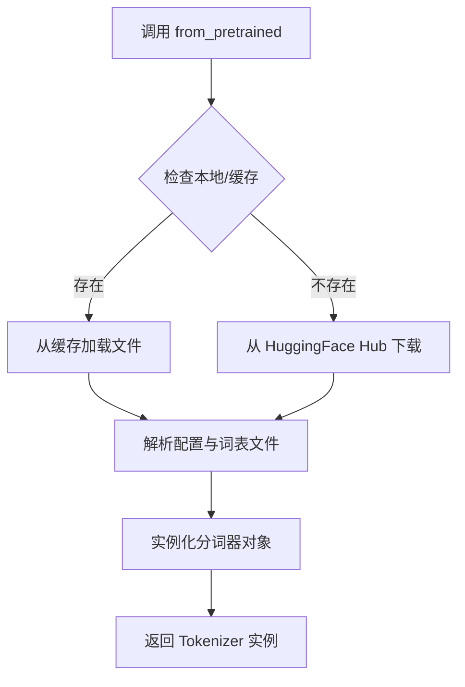

#### 带注释源码

```python
# 从 Hugging Face Transformers 库导入自动分词器工厂类
from transformers import AutoTokenizer

# ... (模型配置与权重加载逻辑)

# 加载与 CLIP ViT-bigG 配套的文本分词器
# 这里的模型 ID 指向 laion 社区提供的预训练权重
# 返回的 tokenizer 对象用于后续 pipeline 的文本编码
tokenizer = AutoTokenizer.from_pretrained("laion/CLIP-ViT-bigG-14-laion2B-39B-b160k")
```

#### 关键组件信息

- **AutoTokenizer**: Transformers 库提供的工厂类，能够根据模型名称自动推断并加载对应的分词器类型（如 BERT, CLIP, GPT 等）。
- **Model ID**: `laion/CLIP-ViT-bigG-14-laion2B-39B-b160k`，一个拥有 39B 参数的 CLIP 文本模型，相应的分词器需要匹配其词汇表。

#### 潜在的技术债务或优化空间

1.  **硬编码的模型标识符**：脚本中直接硬编码了模型ID字符串。若需要切换不同的文本编码器（如替换为更轻量的模型以节省显存），需要修改多处代码，缺乏配置灵活性。
2.  **未指定分词器变体**：调用时未显式传递 `subfolder` (如 `subfolder="tokenizer"`) 或 `use_fast` (默认通常为 True) 等参数。如果远程仓库结构复杂，可能需要明确指定以避免加载错误。
3.  **缺少错误处理**：未对分词器加载失败（如网络超时、模型ID不存在）进行 `try-except` 捕获，可能导致转换脚本直接崩溃。

#### 其它项目

- **数据流与状态机**：该函数是数据预处理的第一环。在 Stable Cascade Pipeline 中，Tokenzier 负责将用户输入的 Prompt 转换为 `input_ids` 和 `attention_mask`，随后送入 `CLIPTextModel` 进行文本嵌入。
- **外部依赖与接口契约**：完全依赖 Hugging Face `transformers` 库。返回值必须符合 `PreTrainedTokenizer` 接口规范，以便后续 Pipeline 组件（如 `StableCascadePriorPipeline`）能正常调用 `tokenizer(...)` 方法进行批量编码。


### `CLIPImageProcessor`

这是从 `transformers` 库导入的图像处理器类，用于对图像进行预处理（调整大小、归一化、裁剪等），使其符合 CLIP 模型的输入要求。在脚本中用于创建 `feature_extractor` 实例，供 Stable Cascade 管道处理图像特征提取。

参数：该类在实例化时不接受任何参数，使用默认配置。

返回值：返回 `CLIPImageProcessor` 实例对象，用于对输入图像进行预处理。

#### 流程图

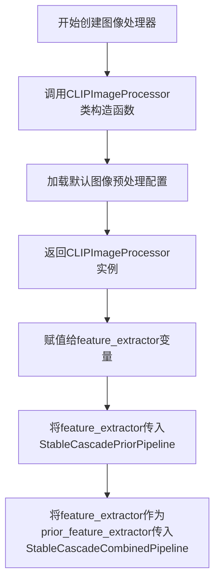

#### 带注释源码

```python
# 从 transformers 库导入 CLIPImageProcessor 类
from transformers import (
    # ... 其他导入
    CLIPImageProcessor,
    # ... 其他导入
)

# 在脚本中创建 CLIPImageProcessor 实例
# 该处理器用于对图像进行预处理，包括：
# - 调整图像大小到模型所需尺寸
# - 像素值归一化（通常归一化到 [0, 1] 或 [-1, 1]）
# - 可能包含中心裁剪或随机裁剪等操作
feature_extractor = CLIPImageProcessor()

# 后续使用：
# 1. 传入 Prior Pipeline 用于图像特征提取
prior_pipeline = StableCascadePriorPipeline(
    prior=prior_model,
    tokenizer=tokenizer,
    text_encoder=text_encoder,
    image_encoder=image_encoder,
    scheduler=scheduler,
    feature_extractor=feature_extractor,  # 使用创建的图像处理器
)

# 2. 如果保存合并管道，也需要传入
if args.save_combined:
    stable_cascade_pipeline = StableCascadeCombinedPipeline(
        # ... 其他参数
        prior_feature_extractor=feature_extractor,  # 合并管道也需要图像处理器
    )
```


### `CLIPVisionModelWithProjection.from_pretrained`

该函数是 Hugging Face Transformers 库中 `CLIPVisionModelWithProjection` 类的类方法，用于从预训练模型加载 CLIP 视觉编码器（Vision Encoder）的权重和配置，从而实例化一个可用于图像特征提取的视觉模型。

参数：

- `pretrained_model_name_or_path`：`str`，模型标识符或本地模型路径，指定要加载的预训练模型（例如 "openai/clip-vit-large-patch14"）
- `*args`：可变位置参数，传递给父类的其他位置参数
- `config`：`Optional[Union[CLIPVisionConfig, str, Path]]`，可选的模型配置对象或路径
- `cache_dir`：`Optional[str]`，可选的缓存目录路径
- `force_download`：`bool`，是否强制重新下载模型（默认为 False）
- `resume_download`：`bool`，是否恢复中断的下载（默认为 False）
- `proxies`：`Optional[Dict[str, str]]`，可选的代理服务器配置
- `output_loading_info`：`bool`，是否返回详细的加载信息（默认为 False）
- `local_files_only`：`bool`，是否仅使用本地文件（默认为 False）
- `use_auth_token`：`Optional[str]`，可选的认证令牌
- `revision`：`str`，模型版本号（默认为 "main"）
- `mirror`：`Optional[str]`，可选的镜像源
- `variant`：`Optional[str]`，模型变体（如 "fp16"）
- `torch_dtype`：`Optional[torch.dtype]`，PyTorch 数据类型

返回值：`CLIPVisionModelWithProjection`，返回加载好的 CLIP 视觉模型实例，包含投影层，可输出图像嵌入向量

#### 流程图

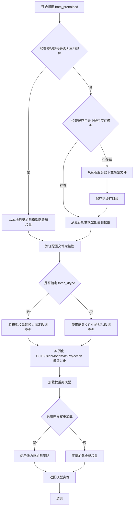

#### 带注释源码

```python
# 在给定的转换脚本中的调用方式
# 第92行：加载CLIP视觉编码器用于图像特征提取
image_encoder = CLIPVisionModelWithProjection.from_pretrained("openai/clip-vit-large-patch14")

# 参数说明：
# "openai/clip-vit-large-patch14" 是 Hugging Face Hub 上的预训练模型标识符
# 该模型是 OpenAI 开发的 CLIP ViT-L/14@336 变体，具有强大的图像理解能力

# 返回值说明：
# image_encoder 是一个 CLIPVisionModelWithProjection 类型的模型对象
# 该模型包含：
#   - vision_model: CLIPVisionTransformer 主干网络
#   - visual_projection: 线性投影层，将视觉特征映射到文本嵌入空间
# 
# 可用于：
#   - image_features = image_encoder(images).image_embeds  # 获取图像嵌入向量
#   - 在 Stable Cascade 管道中作为先验（Prior）阶段的图像编码器
```


### `DDPMWuerstchenScheduler`

该函数是 `diffusers` 库中的调度器类，用于 Stable Cascade 模型的去噪采样过程。通过实例化该调度器，为后续的 Prior Pipeline 和 Decoder Pipeline 提供噪声调度功能。

参数：
- 该函数调用不需要任何参数（使用默认配置）

返回值：`DDPMWuerstchenScheduler` 对象，一个调度器实例，用于管理扩散模型的噪声调度过程

#### 流程图

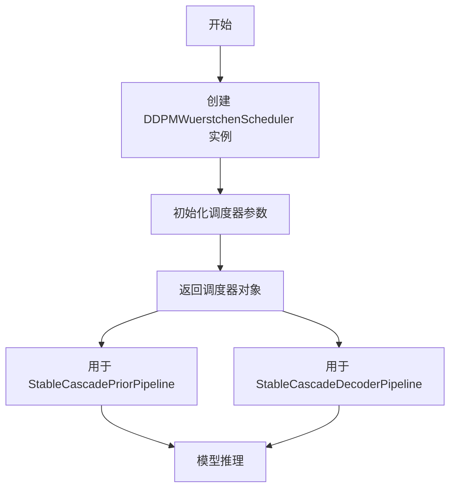

#### 带注释源码

```python
# scheduler for prior and decoder
# 创建 DDPMWuerstchenScheduler 调度器实例
# 该调度器实现了 Wuerstchen 论文中描述的 DDPM 噪声调度策略
# 用于控制 Stable Cascade 模型的去噪过程
scheduler = DDPMWuerstchenScheduler()

# 调度器被传递给 Prior Pipeline
prior_pipeline = StableCascadePriorPipeline(
    prior=prior_model,
    tokenizer=tokenizer,
    text_encoder=text_encoder,
    image_encoder=image_encoder,
    scheduler=scheduler,  # <-- 使用上述调度器
    feature_extractor=feature_extractor,
)

# 调度器被传递给 Decoder Pipeline
decoder_pipeline = StableCascadeDecoderPipeline(
    decoder=decoder,
    text_encoder=text_encoder,
    tokenizer=tokenizer,
    vqgan=vqmodel,
    scheduler=scheduler,  # <-- 复用同一调度器实例
)
```


### `init_empty_weights`

初始化空权重上下文管理器，用于在加速环境中以元设备（meta device）方式初始化模型，以避免在模型权重加载前占用大量内存。

参数：

- 无直接参数（该函数为无参数调用，返回一个上下文管理器）

返回值：`ContextManager`，一个上下文管理器，用于包裹模型初始化代码，使得模型在元设备上创建而不占用实际显存。

#### 流程图

```mermaid
flowchart TD
    A[开始] --> B{is_accelerate_available?}
    B -->|True| C[使用 init_empty_weights]
    B -->|False| D[使用 nullcontext]
    C --> E[返回上下文管理器]
    D --> E
    E --> F[with ctx(): 创建 StableCascadeUNet 模型]
    F --> G[模型在元设备上初始化]
    G --> H[后续加载权重到模型]
```

#### 带注释源码

```python
# 从 accelerate 库导入 init_empty_weights 函数
# 该函数用于在不支持实际张量分配的环境中初始化模型
if is_accelerate_available():
    from accelerate import init_empty_weights

# 根据是否安装了 accelerate 库，选择使用 init_empty_weights 或 nullcontext
# init_empty_weights: 在元设备上创建模型，避免内存占用
# nullcontext: 标准的空上下文管理器，不做任何特殊处理
ctx = init_empty_weights if is_accelerate_available() else nullcontext

# 使用上下文管理器包裹模型初始化代码
# 在 accelerate 可用时，模型将以元设备方式创建
with ctx():
    prior_model = StableCascadeUNet(
        in_channels=16,
        out_channels=16,
        timestep_ratio_embedding_dim=64,
        patch_size=1,
        conditioning_dim=1536,
        block_out_channels=[1536, 1536],
        num_attention_heads=[24, 24],
        down_num_layers_per_block=[4, 12],
        up_num_layers_per_block=[12, 4],
        down_blocks_repeat_mappers=[1, 1],
        up_blocks_repeat_mappers=[1, 1],
        block_types_per_layer=[
            ["SDCascadeResBlock", "SDCascadeTimestepBlock", "SDCascadeAttnBlock"],
            ["SDCascadeResBlock", "SDCascadeTimestepBlock", "SDCascadeAttnBlock"],
        ],
        clip_text_in_channels=1280,
        clip_text_pooled_in_channels=1280,
        clip_image_in_channels=768,
        clip_seq=4,
        kernel_size=3,
        dropout=[0.1, 0.1],
        self_attn=True,
        timestep_conditioning_type=["sca", "crp"],
        switch_level=[False],
    )
```


### `load_file`

`load_file` 是从 `safetensors.torch` 导入的函数，用于从磁盘加载 safetensors 格式的模型权重文件，并将其作为 Python 字典返回。

参数：

-  `filename`：`str`，safetensors 权重文件的路径
-  `device`：`str` 或 `torch.device`，指定加载权重到目标设备（如 "cpu"、"cuda"）

返回值：`Dict[str, torch.Tensor]`，返回包含权重名称和对应张量的字典

#### 流程图

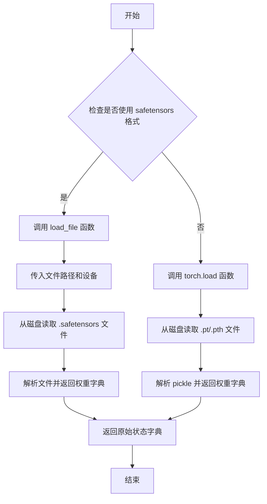

#### 带注释源码

```python
# 检查是否使用 safetensors 格式加载
if args.use_safetensors:
    # 调用 load_file 加载 prior 阶段权重
    # 参数：
    #   - prior_checkpoint_path: safetensors 文件路径
    #   - device: 目标设备 (cpu)
    # 返回值：包含权重张量的字典
    prior_orig_state_dict = load_file(prior_checkpoint_path, device=device)
else:
    # 如果不使用 safetensors，则使用 torch.load 加载
    prior_orig_state_dict = torch.load(prior_checkpoint_path, map_location=device)

# ...

if args.use_safetensors:
    # 同样方式加载 decoder 阶段权重
    decoder_orig_state_dict = load_file(decoder_checkpoint_path, device=device)
else:
    decoder_orig_state_dict = torch.load(decoder_checkpoint_path, map_location=device)
```


### `torch.load`

`torch.load` 是 PyTorch 提供的核心函数，用于从磁盘加载序列化（pickle）的对象，如模型权重、检查点（checkpoint）等。它支持将加载的 tensors 映射到不同的设备（CPU 或 GPU），并允许自定义 pickle 模块来反序列化对象。

参数：

- `f`：`str | Path | BinaryIO | IO[bytes]`，待加载文件的路径（字符串或 Path 对象），或者是类文件对象（file-like object）
- `map_location`：`str | Device | dict | fn`，指定如何将存储的 tensors 映射到新设备的参数。可以是字符串（如 "cpu"、"cuda:0"）、torch.device 对象、字典（原始 tensor 到新位置的映射）、或一个函数
- `pickle_module`：`module`，用于反序列化（unpickle）的 pickle 模块，默认为 Python 标准库的 pickle 模块
- `weights_only`：`bool`，如果为 `True`，则只允许加载 tensor、字典、列表和 tuple 等基本类型，不允许加载任意 Python 对象（如自定义类实例），默认为 `False`
- `mmap`：`bool`，如果为 `True`，则使用内存映射（memory mapping）来加载文件，可以减少内存占用，默认为 `False`

返回值：`Any`，返回从文件中反序列化得到的对象，通常是包含模型权重和优化器状态的字典。

#### 流程图

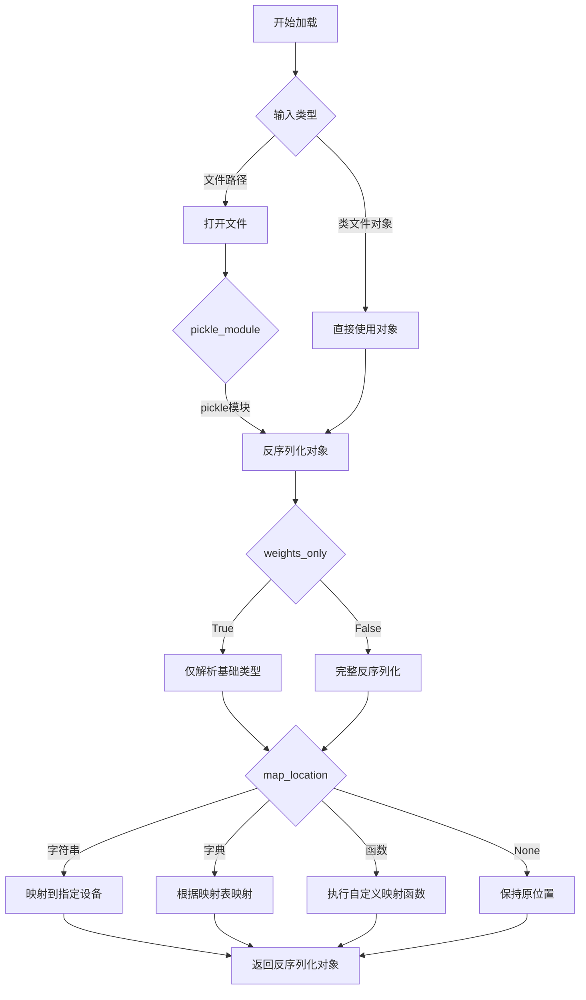

#### 带注释源码

```python
# torch.load 是 PyTorch 用于加载序列化对象的函数
# 以下是其核心工作原理的简化版本（基于 PyTorch 源码概念）

def torch_load(f, map_location=None, pickle_module=pickle, weights_only=False, mmap=False):
    """
    加载保存的检查点文件
    
    Args:
        f: 文件路径或类文件对象
        map_location: 设备映射策略
        pickle_module: 使用的 pickle 模块
        weights_only: 是否仅加载基础类型
        mmap: 是否使用内存映射
    
    Returns:
        反序列化后的 Python 对象
    """
    # 1. 打开文件（如果传入的是路径字符串）
    if isinstance(f, (str, Path)):
        if mmap:
            # 内存映射方式：直接在磁盘上访问，避免加载整个文件到内存
            filep = open(f, 'rb')
            mmap = mmap.mmap(filep.fileno(), 0, access=mmap.ACCESS_READ)
            f = mmap
        else:
            # 普通方式：将整个文件内容读入内存
            f = open(f, 'rb')
    
    # 2. 解码文件头的元信息（PyTorch 版本、tensor 信息等）
    # ...
    
    # 3. 使用 pickle_module 反序列化
    # 如果 weights_only=True，只允许加载基础类型（tensor, dict, list, tuple, int, float, str, bytes）
    if weights_only:
        # 限制只能加载安全的类型，防止代码执行漏洞
        unpickler = pickle_module.Unpickler(f)
        unpickler.persistent_load = persistent_load
        result = unpickler.load()
    else:
        # 完整反序列化，可以加载任意 Python 对象
        result = pickle_module.load(f)
    
    # 4. 应用 map_location 映射 tensors 到指定设备
    if map_location is not None:
        # 递归处理 result 中的所有 tensor
        result = _rebuild_tensor_mapping(result, map_location)
    
    return result


def _rebuild_tensor_mapping(obj, map_location):
    """
    根据 map_location 重新映射 tensor 设备
    """
    if isinstance(obj, torch.Tensor):
        # 创建新的 tensor，设备由 map_location 决定
        return obj.to(device=map_location)
    elif isinstance(obj, dict):
        # 递归处理字典中的所有值
        return {k: _rebuild_tensor_mapping(v, map_location) for k, v in obj.items()}
    elif isinstance(obj, (list, tuple)):
        # 递归处理列表/元组中的所有元素
        return type(obj)(_rebuild_tensor_mapping(v, map_location) for v in obj)
    else:
        return obj
```

#### 代码中的实际调用示例

在提供的代码中，`torch.load` 被调用两次：

```python
# 第一次：加载 Prior 阶段模型权重
prior_orig_state_dict = torch.load(prior_checkpoint_path, map_location=device)

# 第二次：加载 Decoder 阶段模型权重  
decoder_orig_state_dict = torch.load(decoder_checkpoint_path, map_location=device)
```

其中：
- `prior_checkpoint_path` / `decoder_checkpoint_path`：权重文件路径（字符串）
- `map_location=device`：将加载的 tensor 从原存储位置映射到 `device`（值为 "cpu"）

这两处的调用都遵循了标准模式：加载磁盘上的权重文件，并确保所有 tensor 被加载到指定的设备（CPU）上，以便后续转换为 Diffusers 格式的模型。


### `convert_stable_cascade_unet_single_file_to_diffusers`

该函数用于将 Stable Cascade 模型的原始单文件权重字典转换为 Diffusers 库所需的格式。通过重新映射键名和调整权重维度，使其兼容 `StableCascadeUNet` 模型的架构。

参数：

- `original_state_dict`：`Dict[str, Tensor]`，原始的 Stable Cascade 模型权重字典，包含从 safetensors 或 pytorch_bin 文件加载的未转换权重

返回值：`Dict[str, Tensor]`，转换后的权重字典，键名已重新映射为 Diffusers `StableCascadeUNet` 模型期望的格式

#### 流程图

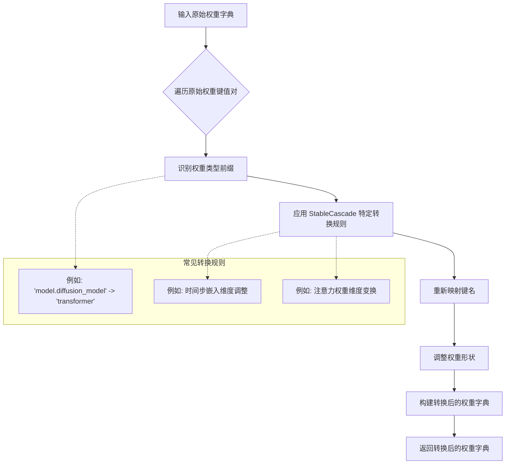

#### 带注释源码

```python
# 此函数定义在 diffusers.loaders.single_file_utils 模块中
# 以下是基于使用方式推断的函数签名和功能说明

def convert_stable_cascade_unet_single_file_to_diffusers(
    original_state_dict: Dict[str, Tensor]
) -> Dict[str, Tensor]:
    """
    将 Stable Cascade 原始权重转换为 Diffusers 格式
    
    参数:
        original_state_dict: 包含原始模型权重的字典，
                            键为字符串（如 'model.diffusion_model.xxx'），
                            值为 PyTorch 张量
    
    返回:
        转换后的权重字典，键名适配 StableCascadeUNet 模型结构
    """
    
    # 在代码中的调用方式：
    # prior_state_dict = convert_stable_cascade_unet_single_file_to_diffusers(prior_orig_state_dict)
    # decoder_state_dict = convert_stable_cascade_unet_single_file_to_diffusers(decoder_orig_state_dict)
    
    # 转换逻辑通常包括：
    # 1. 识别并转换 'model.diffusion_model' 前缀
    # 2. 重新映射 ResBlock, AttnBlock, TimestepBlock 等模块的权重
    # 3. 调整维度顺序（如 attention 的 q, k, v 权重）
    # 4. 处理 text conditioning 和 image conditioning 相关的权重
    
    # 示例转换示例（实际逻辑更复杂）：
    # 原键名: 'model.diffusion_model.input_blocks.0.0.weight'
    # 新键名: 'transformer.down_blocks.0.resnets.0.conv1.weight'
    
    pass
```

#### 实际使用示例

```python
# 在提供的转换脚本中的实际调用

# 1. 加载原始 Prior 权重
if args.use_safetensors:
    prior_orig_state_dict = load_file(prior_checkpoint_path, device=device)
else:
    prior_orig_state_dict = torch.load(prior_checkpoint_path, map_location=device)

# 2. 调用转换函数
prior_state_dict = convert_stable_cascade_unet_single_file_to_diffusers(prior_orig_state_dict)

# 3. 创建模型并加载转换后的权重
prior_model = StableCascadeUNet(...)  # 初始化模型结构
prior_model.load_state_dict(prior_state_dict)  # 加载转换后的权重

# Decoder 阶段同理
decoder_state_dict = convert_stable_cascade_unet_single_file_to_diffusers(decoder_orig_state_dict)
```

#### 备注

- 该函数的具体实现位于 `diffusers` 库的 `diffusers/loaders/single_file_utils.py` 文件中
- 转换逻辑针对 `StableCascadeUNet` 的特定架构进行了优化
- 支持 Prior（stage_c）和 Decoder（stage_b）两种模型的权重转换


### `StableCascadeUNet`

`StableCascadeUNet` 是 diffusers 库中的一个 UNet 模型类，用于 Stable Cascade 模型的先验（Prior）和解码器（Decoder）两个阶段的神经网络构建。该类通过配置大量参数来实现灵活的 U-Net 架构，支持文本和图像条件的注入，适用于 diffusion 模型的噪声预测任务。

参数：

- `in_channels`：`int`，输入数据的通道数。Prior 模型为 16，Decoder 模型为 4。
- `out_channels`：`int`，输出数据的通道数。Prior 模型为 16，Decoder 模型为 4。
- `timestep_ratio_embedding_dim`：`int`，时间步长比例嵌入的维度，默认 64。
- `patch_size`：`int`，补丁大小，用于图像分块处理。Prior 为 1，Decoder 为 2。
- `conditioning_dim`：`int`，条件嵌入的维度。Prior 为 1536，Decoder 为 1280。
- `block_out_channels`：`List[int]`，每个阶段的输出通道数列表。Prior 为 [1536, 1536]，Decoder 为 [320, 576, 1152, 1152]。
- `num_attention_heads`：`List[int]`，每个阶段的注意力头数量。Prior 为 [24, 24]，Decoder 为 [0, 9, 18, 18]。
- `down_num_layers_per_block`：`List[int]`，下采样每个块的层数。Prior 为 [4, 12]，Decoder 为 [2, 4, 14, 4]。
- `up_num_layers_per_block`：`List[int]`，上采样每个块的层数。Prior 为 [12, 4]，Decoder 为 [4, 14, 4, 2]。
- `down_blocks_repeat_mappers`：`List[int]`，下采样块的重复映射器。
- `up_blocks_repeat_mappers`：`List[int]`，上采样块的重复映射器。
- `block_types_per_layer`：`List[List[str]]`，每层使用的块类型列表，如 ["SDCascadeResBlock", "SDCascadeTimestepBlock", "SDCascadeAttnBlock"]。
- `clip_text_in_channels`：`int`，CLIP 文本编码器输入通道数（仅 Prior 需要），1280。
- `clip_text_pooled_in_channels`：`int`，CLIP 文本池化输入通道数，1280。
- `clip_image_in_channels`：`int`，CLIP 图像编码器输入通道数（仅 Prior 需要），768。
- `clip_seq`：`int`，CLIP 序列长度，默认 4。
- `effnet_in_channels`：`int`，EfficientNet 输入通道数（仅 Decoder 需要），16。
- `pixel_mapper_in_channels`：`int`，像素映射器输入通道数（仅 Decoder 需要），3。
- `kernel_size`：`int`，卷积核大小，默认 3。
- `dropout`：`List[float]`，各层的 dropout 概率列表。
- `self_attn`：`bool`，是否使用自注意力机制，默认 True。
- `timestep_conditioning_type`：`List[str]`，时间步长条件类型。Prior 为 ["sca", "crp"]，Decoder 为 ["sca"]。
- `switch_level`：`List[bool]`，切换级别（仅 Prior 需要），[False]。

返回值：`StableCascadeUNet`，返回创建的 UNet 模型实例，用于后续的权重加载和 pipeline 组装。

#### 流程图

```mermaid
flowchart TD
    A[开始创建 StableCascadeUNet] --> B{判断模型类型}
    B -->|Prior| C[设置 prior 特定参数<br/>in_channels=16<br/>conditioning_dim=1536<br/>block_out_channels=[1536, 1536]
    B -->|Decoder| D[设置 decoder 特定参数<br/>in_channels=4<br/>conditioning_dim=1280<br/>block_out_channels=[320, 576, 1152, 1152]
    C --> E[配置公共参数<br/>timestep_ratio_embedding_dim=64<br/>patch_size<br/>clip_seq=4<br/>kernel_size=3]
    D --> E
    E --> F[配置块结构<br/>down_num_layers_per_block<br/>up_num_layers_per_block<br/>block_types_per_layer]
    F --> G[配置注意力机制<br/>num_attention_heads<br/>self_attn=True<br/>timestep_conditioning_type]
    G --> H[配置 dropout 和条件注入<br/>dropout<br/>clip_text_pooled_in_channels]
    H --> I[调用 StableCascadeUNet.__init__]
    I --> J[返回模型实例]
    J --> K[加载权重状态字典<br/>load_state_dict]
    K --> L[用于构建 Pipeline<br/>StableCascadePriorPipeline / StableCascadeDecoderPipeline]
```

#### 带注释源码

```python
# Prior 模型的 StableCascadeUNet 创建
with ctx():
    prior_model = StableCascadeUNet(
        # 输入输出通道数 - Prior 处理的是潜在空间特征
        in_channels=16,
        out_channels=16,
        # 时间步长嵌入维度，控制时间条件的表示精度
        timestep_ratio_embedding_dim=64,
        # 补丁大小，1 表示不进行分块处理
        patch_size=1,
        # 条件嵌入维度，来自 CLIP 文本/图像编码器的特征维度
        conditioning_dim=1536,
        # 每个 UNet 阶段的输出通道数，两阶段结构
        block_out_channels=[1536, 1536],
        # 每阶段的注意力头数量
        num_attention_heads=[24, 24],
        # 下采样每块的层数配置
        down_num_layers_per_block=[4, 12],
        # 上采样每块的层数配置
        up_num_layers_per_block=[12, 4],
        # 下采样块重复映射
        down_blocks_repeat_mappers=[1, 1],
        # 上采样块重复映射
        up_blocks_repeat_mappers=[1, 1],
        # 每层使用的块类型：残差块、时间步块、注意力块
        block_types_per_layer=[
            ["SDCascadeResBlock", "SDCascadeTimestepBlock", "SDCascadeAttnBlock"],
            ["SDCascadeResBlock", "SDCascadeTimestepBlock", "SDCascadeAttnBlock"],
        ],
        # CLIP 文本编码器输入通道数
        clip_text_in_channels=1280,
        # CLIP 文本池化特征输入通道数
        clip_text_pooled_in_channels=1280,
        # CLIP 图像编码器输入通道数
        clip_image_in_channels=768,
        # CLIP 序列长度
        clip_seq=4,
        # 卷积核大小
        kernel_size=3,
        # Dropout 概率列表
        dropout=[0.1, 0.1],
        # 启用自注意力
        self_attn=True,
        # 时间步长条件类型：sca 和 crp 两种
        timestep_conditioning_type=["sca", "crp"],
        # 切换级别配置
        switch_level=[False],
    )

# Decoder 模型的 StableCascadeUNet 创建
with ctx():
    decoder = StableCascadeUNet(
        # Decoder 处理更细粒度的特征，通道数更少
        in_channels=4,
        out_channels=4,
        # 相同的时间步长嵌入维度
        timestep_ratio_embedding_dim=64,
        # Decoder 使用更大的 patch size
        patch_size=2,
        # 条件维度来自文本编码器
        conditioning_dim=1280,
        # 四阶段结构，通道数逐步增加
        block_out_channels=[320, 576, 1152, 1152],
        # 下采样层数配置
        down_num_layers_per_block=[2, 4, 14, 4],
        # 上采样层数配置
        up_num_layers_per_block=[4, 14, 4, 2],
        # 下采样块重复映射
        down_blocks_repeat_mappers=[1, 1, 1, 1],
        # 上采样块重复映射（2倍）
        up_blocks_repeat_mappers=[2, 2, 2, 2],
        # 注意力头配置，第一层为0表示不使用注意力
        num_attention_heads=[0, 9, 18, 18],
        # 块类型配置，后两阶段包含注意力块
        block_types_per_layer=[
            ["SDCascadeResBlock", "SDCascadeTimestepBlock"],
            ["SDCascadeResBlock", "SDCascadeTimestepBlock"],
            ["SDCascadeResBlock", "SDCascadeTimestepBlock", "SDCascadeAttnBlock"],
            ["SDCascadeResBlock", "SDCascadeTimestepBlock", "SDCascadeAttnBlock"],
        ],
        # CLIP 文本池化特征输入通道数
        clip_text_pooled_in_channels=1280,
        # CLIP 序列长度
        clip_seq=4,
        # EfficientNet 输入通道数
        effnet_in_channels=16,
        # 像素映射器输入通道数
        pixel_mapper_in_channels=3,
        # 卷积核大小
        kernel_size=3,
        # Dropout 概率，仅在高层使用
        dropout=[0, 0, 0.1, 0.1],
        # 启用自注意力
        self_attn=True,
        # 时间步长条件类型，仅使用 sca
        timestep_conditioning_type=["sca"],
    )
```


### `load_model_dict_into_meta`

将模型状态字典（state dict）加载到模型中，支持在 CPU meta 设备上初始化模型后加载权重，主要用于加速（accelerate）库的环境下避免内存峰值。

参数：

- `model`：`torch.nn.Module`，目标 PyTorch 模型对象，需要加载权重的模型实例
- `state_dict`：`dict`，包含模型权重的状态字典，键为参数名称，值为对应的张量数据

返回值：`None`，该函数直接修改传入的 `model` 对象，不返回任何值

#### 流程图

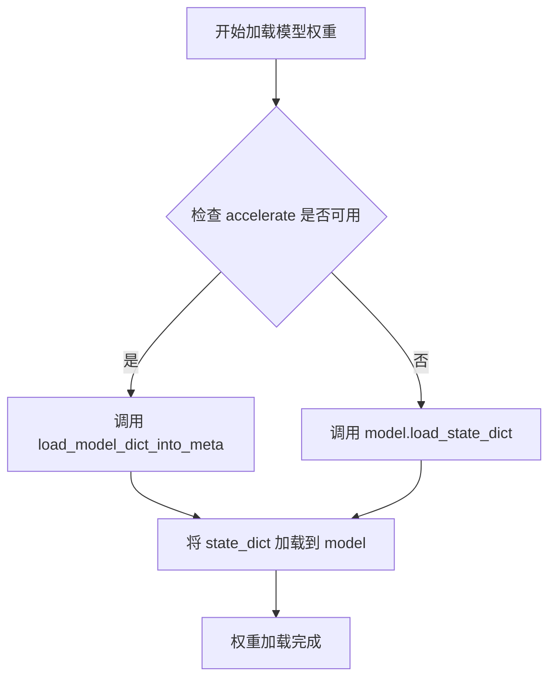

#### 带注释源码

```python
# 该函数定义位于 diffusers.models.model_loading_utils 模块
# 当前代码中通过 import 导入后直接调用

# 使用示例 1：加载 Prior 模型权重
if is_accelerate_available():
    # 当 accelerate 库可用时，使用 meta 设备加载避免内存峰值
    load_model_dict_into_meta(prior_model, prior_state_dict)
else:
    # 否则直接使用 PyTorch 原生方法加载
    prior_model.load_state_dict(prior_state_dict)

# 使用示例 2：加载 Decoder 模型权重
if is_accelerate_available():
    # 同样使用 load_model_dict_into_meta 加载 decoder 权重
    load_model_dict_into_meta(decoder, decoder_state_dict)
else:
    # 回退到标准 state_dict 加载方式
    decoder.load_state_dict(decoder_state_dict)
```

---

### 补充说明

#### 设计目标与约束

- **目标**：在转换 Stable Cascade 模型权重时，支持大模型权重的内存高效加载
- **约束**：依赖 `accelerate` 库提供的 `init_empty_weights()` 上下文管理器，需配合 `meta` 设备使用

#### 外部依赖

- `diffusers.models.model_loading_utils.load_model_dict_into_meta`：核心函数，负责将权重加载到模型
- `accelerate` 库（可选）：当不可用时回退到标准的 `load_state_dict` 方法

#### 错误处理

- 代码中通过 `if is_accelerate_available()` 判断是否使用该函数，若 accelerate 不可用则使用传统方式加载
- 实际函数内部的错误处理（如权重键不匹配等）由 `diffusers` 库自身定义


### `nn.Module.load_state_dict`

`load_state_dict` 是 PyTorch `nn.Module` 类的方法，用于将预训练的模型权重加载到模型中。在本代码中用于将转换后的权重加载到 StableCascadeUNet 模型（prior_model 和 decoder）。

参数：

- `state_dict`：`Dict[str, Any]`，包含模型参数的字典，通常由 `model.state_dict()` 或 `convert_stable_cascade_unet_single_file_to_diffusers()` 返回
- `strict`：`bool`，可选，默认为 `True`，是否严格匹配 state_dict 的键与模型的 state_dict() 返回的键
- `assign`：`bool`，可选，默认为 `False`，是否将参数分配给其默认名称

返回值：`OrderedDict[str, Any]`，返回包含未匹配键的 `OrderedDict`（如果 `strict=False`）

#### 流程图

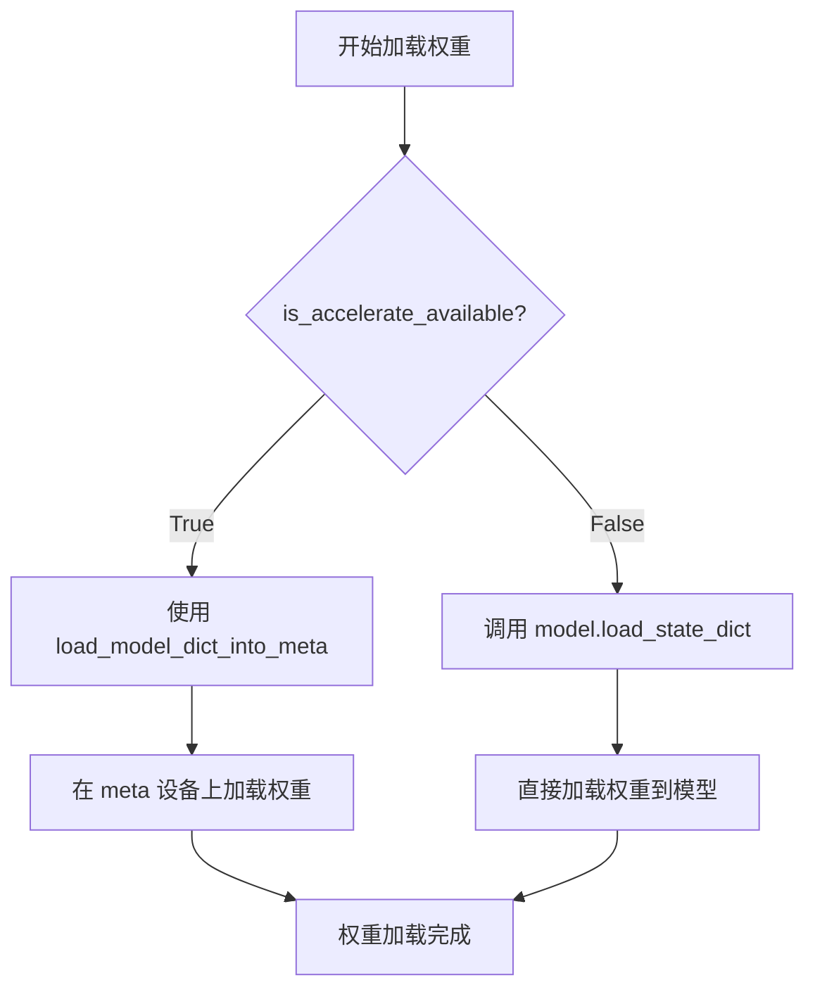

#### 带注释源码

```python
# 在 prior_model 中加载转换后的权重
if is_accelerate_available():
    # 当 accelerate 可用时，使用 load_model_dict_into_meta 在 meta 设备上加载权重
    # 这样可以避免一次性将整个模型加载到内存中，适用于大模型
    load_model_dict_into_meta(prior_model, prior_state_dict)
else:
    # 当 accelerate 不可用时，直接使用 PyTorch 的 load_state_dict 方法
    # 将 prior_state_dict 中的权重加载到 prior_model 中
    prior_model.load_state_dict(prior_state_dict)

# 在 decoder 中加载转换后的权重
if is_accelerate_available():
    # 同样使用 accelerate 的方式加载 decoder 权重
    load_model_dict_into_meta(decoder, decoder_state_dict)
else:
    # 直接加载权重到 decoder 模型
    decoder.load_state_dict(decoder_state_dict)
```

#### 调用点说明

| 调用位置 | 模型对象 | 权重来源 |
|---------|---------|---------|
| ~106行 | `prior_model` (StableCascadeUNet) | `convert_stable_cascade_unet_single_file_to_diffusers(prior_orig_state_dict)` |
| ~157行 | `decoder` (StableCascadeUNet) | `convert_stable_cascade_unet_single_file_to_diffusers(decoder_orig_state_dict)` |

#### 技术细节

- `load_state_dict` 是非线程安全的方法，不应在多线程环境下同时调用同一个模型的此方法
- 默认情况下 `strict=True`，要求 state_dict 的键与模型参数键完全匹配
- 加载权重后，模型进入训练模式（如果之前是训练模式）或评估模式（调用 `eval()` 后）会保持之前的模式
- 如果使用 `assign=False`（默认），权重会被加载到对应键的参数中；如果 `assign=True`，权重会按参数名称分配


### `PaellaVQModel.from_pretrained()`

从预训练模型路径或Hub加载VQGAN（Vector Quantized Generative Adversarial Network）模型，实例化PaellaVQModel对象，用于Stable Cascade解码器中的图像解码过程。

参数：

- `pretrained_model_name_or_path`：`str`，模型标识符，可以是Hugging Face Hub上的模型ID、本地目录路径或包含权重的文件路径
- `subfolder`：`str`（可选），模型权重所在的子文件夹名称，此处为`"vqgan"`
- `cache_dir`：`str`（可选），缓存目录路径
- `force_download`：`bool`（可选），是否强制重新下载模型
- `resume_download`：`bool`（可选），是否恢复中断的下载
- `proxies`：`dict`（可选），代理服务器配置
- `local_files_only`：`bool`（可选），是否仅使用本地文件
- `use_auth_token`：`str`（可选），访问私有模型所需的认证令牌
- `revision`：`str`（可选），模型版本提交哈希
- `torch_dtype`：`torch.dtype`（可选），模型权重的目标数据类型
- `device_map`：`str`或`dict`（可选），设备映射策略
- `max_memory`：`dict`（可选），每个设备的最大内存配置
- `offload_folder`：`str`（可选），卸载文件夹路径
- `offload_state_dict`：`bool`（可选），是否卸载状态字典
- `low_cpu_mem_usage`：`bool`（可选），是否降低CPU内存使用

返回值：`PaellaVQModel`，加载后的VQGAN模型实例，用于将潜在表示解码为图像

#### 流程图

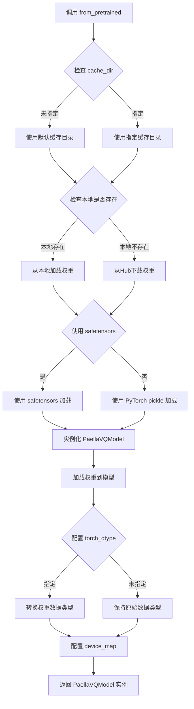

#### 带注释源码

```python
# 代码中的实际调用示例
vqmodel = PaellaVQModel.from_pretrained("warp-ai/wuerstchen", subfolder="vqgan")

# 参数说明：
# - "warp-ai/wuerstchen": Hugging Face Hub上的模型标识符
# - subfolder="vqgan": 指定从模型的 vqgan 子目录加载VQGAN权重

# 该方法继承自 diffusers 的 BaseObject 类
# 内部实现大致逻辑：
# 1. 调用 from_pretrained 方法加载配置和权重
# 2. 从指定的 subfolder ("vqgan") 读取模型配置
# 3. 实例化 PaellaVQModel 模型对象
# 4. 加载预训练权重到模型
# 5. 返回配置好的模型实例供后续解码使用
```

#### 详细设计信息

**类概述：**

`PaellaVQModel`是Wuerstchen V2管道中的VQGAN（Vector Quantized Generative Adversarial Network）模型实现，采用Paella架构进行高效的潜在码本解码。在Stable Cascade管道中，该模型负责将decoder输出的潜在表示（latent representation）解码为最终图像。

**技术债务与优化空间：**

1. **模型加载效率**：当前使用CPU加载，建议在GPU环境下使用时显式指定`torch_dtype`以避免额外的类型转换开销
2. **缓存管理**：未显式配置`cache_dir`，默认缓存路径可能占用大量磁盘空间
3. **错误处理**：缺少对模型下载失败、网络超时等异常情况的捕获和处理
4. **版本兼容性**：`warp-ai/wuerstchen`模型仓库可能随时间更新，未指定`revision`可能导致隐式的非确定性行为

**外部依赖与接口契约：**

- **输入**：潜在表示张量（latent tensors）
- **输出**：解码后的图像张量
- **依赖库**：`torch`, `diffusers`, `safetensors`（如可用）
- **模型来源**：`warp-ai/wuerstchen`仓库的vqgan子目录


### `StableCascadePriorPipeline`

该函数用于创建 Stable Cascade 模型的 Prior（先验）流水线，将预训练的 Stable Cascade UNet 模型与 CLIP 文本/图像编码器、调度器等组件结合，生成可用于图像生成推理的完整管道。

参数：

- `prior`：`StableCascadeUNet`，先验 UNet 模型，负责根据文本和图像条件生成潜在表示
- `tokenizer`：`AutoTokenizer`，CLIP 文本分词器，用于将文本输入转换为 token 序列
- `text_encoder`：`CLIPTextModelWithProjection`，CLIP 文本编码器，将文本转换为文本嵌入向量
- `image_encoder`：`CLIPVisionModelWithProjection`，CLIP 视觉编码器，将图像转换为图像嵌入向量
- `scheduler`：`DDPMWuerstchenScheduler`，DDPM 调度器，控制扩散模型的采样过程
- `feature_extractor`：`CLIPImageProcessor`，CLIP 图像预处理器，用于预处理输入图像

返回值：`StableCascadePriorPipeline`，返回配置好的先验流水线对象，可用于文本到图像的生成推理

#### 流程图

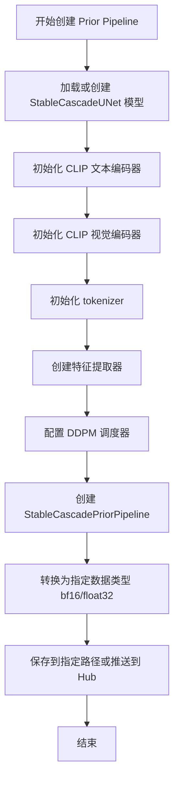

#### 带注释源码

```python
# Prior pipeline - 创建先验流水线
prior_pipeline = StableCascadePriorPipeline(
    prior=prior_model,                    # Stable Cascade UNet 先验模型
    tokenizer=tokenizer,                  # CLIP 文本分词器
    text_encoder=text_encoder,            # CLIP 文本编码器
    image_encoder=image_encoder,          # CLIP 图像编码器
    scheduler=scheduler,                  # DDPM 调度器
    feature_extractor=feature_extractor,  # CLIP 特征提取器
)

# 将流水线转换为指定数据类型并保存
prior_pipeline.to(dtype).save_pretrained(
    args.prior_output_path,          # 输出路径
    push_to_hub=args.push_to_hub,   # 是否推送到 Hugging Face Hub
    variant=args.variant            # 模型变体（如 bf16）
)
```

#### 关键组件信息

| 组件名称 | 描述 |
|---------|------|
| `StableCascadeUNet` | Stable Cascade 专用的 UNet 架构，用于先验生成 |
| `CLIPTextModelWithProjection` | CLIP 文本编码器，支持投影维度的文本嵌入 |
| `CLIPVisionModelWithProjection` | CLIP 视觉编码器，支持投影维度的图像嵌入 |
| `DDPMWuerstchenScheduler` | Wuerstchen 架构的 DDPM 调度器 |
| `convert_stable_cascade_unet_single_file_to_diffusers` | 将单文件检查点转换为 diffusers 格式的工具函数 |

#### 潜在技术债务与优化空间

1. **硬编码的预训练模型路径**：代码中硬编码了 `"laion/CLIP-ViT-bigG-14-laion2B-39B-b160k"` 和 `"openai/clip-vit-large-patch14"`，应通过参数配置
2. **模型权重加载方式**：同时支持 SafeTensors 和 PyTorch 格式，但加载逻辑可以进一步抽象
3. **错误处理不足**：缺少对模型加载失败、网络连接问题等的异常处理
4. **内存优化**：在 CPU 上加载大模型时未使用分片加载或内存映射技术
5. **重复代码**：prior 和 decoder 的创建流程有部分重复，可以抽象为通用函数

#### 其它项目说明

- **设计目标**：将 Stable Cascade 模型权重转换为 diffusers 格式的 pipeline，便于在 diffusers 库中使用
- **约束条件**：必须至少转换 stage_c 或 stage_b 之一，不能同时跳过两者；combined pipeline 不能在跳过任一 stage 的情况下创建
- **数据流**：文本/图像 → CLIP 编码器 → 嵌入向量 → StableCascadeUNet → 潜在表示 → 解码器 → 最终图像
- **外部依赖**：依赖 `diffusers`、`transformers`、`safetensors`、`accelerate` 等库


### `StableCascadeDecoderPipeline`

这是 Stable Cascade 模型的解码器流水线类，用于将模型的解码器（Decoder）组件与文本编码器、Tokenizer、VQGAN 模型和调度器组合在一起，形成一个完整的推理 pipeline。

参数：

- `decoder`：`StableCascadeUNet`，解码器模型，用于将潜在表示解码为图像
- `text_encoder`：`CLIPTextModelWithProjection`，文本编码器，用于将文本提示编码为向量表示
- `tokenizer`：`AutoTokenizer`，分词器，用于将文本输入转换为 token ID
- `vqgan`：`PaellaVQModel`，VQGAN 模型，用于将离散表示解码为最终图像
- `scheduler`：`DDPMWuerstchenScheduler`，调度器，用于控制去噪过程的噪声调度

返回值：`StableCascadeDecoderPipeline`，返回配置好的解码器流水线对象，可用于图像生成推理

#### 流程图

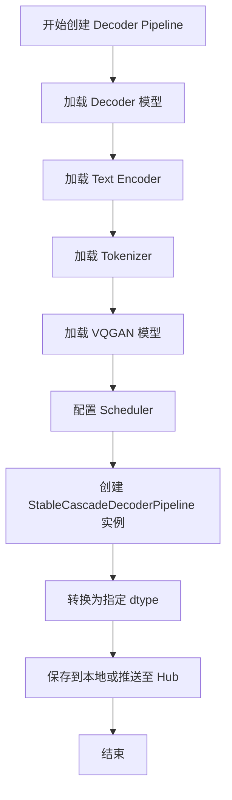

#### 带注释源码

```python
# 从 diffusers 库导入 StableCascadeDecoderPipeline 类
from diffusers import StableCascadeDecoderPipeline

# Decoder pipeline
# 使用已加载的 decoder、text_encoder、tokenizer、vqgan 和 scheduler 创建解码器流水线
decoder_pipeline = StableCascadeDecoderPipeline(
    decoder=decoder,                # StableCascadeUNet 解码器模型实例
    text_encoder=text_encoder,      # CLIP 文本编码器
    tokenizer=tokenizer,            # CLIP 分词器
    vqgan=vqgan,                    # VQGAN 模型用于最终图像解码
    scheduler=scheduler             # DDPM Wuerstchen 调度器
)

# 将流水线转换为指定的数据类型（bfloat16 或 float32）
decoder_pipeline.to(dtype).save_pretrained(
    args.decoder_output_path,       # 输出路径
    push_to_hub=args.push_to_hub,   # 是否推送至 Hugging Face Hub
    variant=args.variant            # 模型变体（如 bf16）
)
```


### `StableCascadeCombinedPipeline`

该函数是 Stable Cascade 组合流水线的构造函数，用于将_prior（先验）流水线_和_decoder（解码器）流水线_组合在一起，形成一个完整的文本到图像生成管道。组合后的流水线可以同时利用先验模型（将文本和图像映射到latent空间）和解码器模型（将latent空间解码为最终图像），从而实现端到端的图像生成。

参数：

- `text_encoder`：`CLIPTextModelWithProjection`，文本编码器，用于将输入文本转换为文本嵌入表示
- `tokenizer`：`AutoTokenizer`，分词器，用于将输入文本分割为token序列
- `decoder`：`StableCascadeUNet`，解码器模型，将latent表示解码为图像
- `scheduler`：`DDPMWuerstchenScheduler`，调度器，控制去噪过程的噪声调度
- `vqgan`：`PaellaVQModel`，VQGAN模型，用于图像的量化和解码
- `prior_text_encoder`：`CLIPTextModelWithProjection`，先验阶段的文本编码器
- `prior_tokenizer`：`AutoTokenizer`，先验阶段的分词器
- `prior_prior`：`StableCascadeUNet`，先 prior模型，处理文本和图像条件生成latent表示
- `prior_scheduler`：`DDPMWuerstchenScheduler`，先 prior阶段的调度器
- `prior_image_encoder`：`CLIPVisionModelWithProjection`，图像编码器，将图像转换为嵌入表示
- `prior_feature_extractor`：`CLIPImageProcessor`，图像特征提取器，用于预处理图像

返回值：`StableCascadeCombinedPipeline`，返回组合后的Stable Cascade流水线对象，可用于文本到图像的生成

#### 流程图

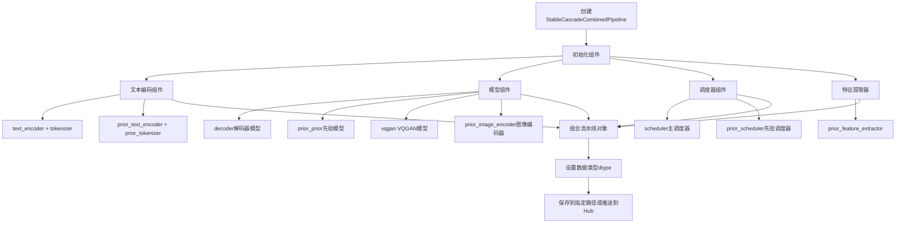

#### 带注释源码

```python
if args.save_combined:
    # Stable Cascade combined pipeline
    # 创建Stable Cascade组合流水线，整合先验和解码器两个阶段
    stable_cascade_pipeline = StableCascadeCombinedPipeline(
        # Decoder阶段组件 - 负责将latent表示解码为最终图像
        text_encoder=text_encoder,          # CLIP文本编码器，处理输入文本
        tokenizer=tokenizer,                 # 分词器，文本预处理
        decoder=decoder,                     # StableCascade UNet解码器模型
        scheduler=scheduler,                 # DDPM Wuerstchen调度器
        vqgan=vqmodel,                       # VQGAN量化解码模型
        
        # Prior阶段组件 - 负责根据文本和图像条件生成latent表示
        prior_text_encoder=text_encoder,    # 先验阶段文本编码器（可复用）
        prior_tokenizer=tokenizer,           # 先验阶段分词器（可复用）
        prior_prior=prior_model,             # 先验UNet模型
        prior_scheduler=scheduler,          # 先验阶段调度器
        prior_image_encoder=image_encoder,  # CLIP图像编码器
        prior_feature_extractor=feature_extractor,  # 图像特征提取器
    )
    
    # 将流水线转换为指定数据类型(bf16或fp32)并保存
    stable_cascade_pipeline.to(dtype).save_pretrained(
        args.combined_output_path,              # 输出路径
        push_to_hub=args.push_to_hub,            # 是否推送到HuggingFace Hub
        variant=args.variant                     # 模型变体(如bf16)
    )
```

#### 补充说明

| 组件类型 | 组件名称 | 作用描述 |
|---------|---------|---------|
| 文本处理 | text_encoder, tokenizer | 将用户输入的文本转换为模型可处理的嵌入向量 |
| 先验模型 | prior_prior | 根据文本嵌入和可选的图像嵌入生成中间latent表示 |
| 图像编码 | prior_image_encoder, prior_feature_extractor | 处理参考图像，提取图像特征用于条件生成 |
| 解码器 | decoder | 将先验模型输出的latent表示解码为最终图像 |
| VQ模型 | vqgan | 对解码过程进行矢量量化，提高生成质量 |
| 调度器 | scheduler, prior_scheduler | 控制扩散去噪过程的时间和空间调度 |


### `save_pretrained`

保存流水线到本地目录或 Hugging Face Hub，支持模型权重的序列化和可选的 Hub 上传。

参数：

-  `save_directory`：`str`，保存流水线的目标目录路径或 Hub 仓库 ID
-  `safe_serialization`：`bool`，可选，是否使用安全序列化（safetensors 格式），默认为 `True`
-  `variant`：`str`，可选，模型变体（如 "fp16"、"bf16" 等），用于指定保存的权重精度
-  `push_to_hub`：`bool`，可选，是否将流水线推送到 Hugging Face Hub，默认为 `False`
-  `**kwargs`：其他可选参数，如 `repo_id`、`create_repo` 等

返回值：`None`，无返回值，直接将流水线保存到指定位置

#### 流程图

```mermaid
flowchart TD
    A[开始保存流水线] --> B{检查 save_directory 是否有效}
    B -->|无效| C[抛出异常]
    B -->|有效| D{push_to_hub 为 True?}
    D -->|是| E[创建或获取 Hub 仓库]
    D -->|否| F[使用 safe_serialization?]
    F -->|是| G[使用 safetensors 格式保存]
    F -->|否| H[使用 PyTorch pickle 格式保存]
    G --> I[保存配置文件]
    H --> I
    E --> I
    I --> J{存在 variant?}
    J -->|是| K[加载对应变体权重]
    J -->|否| L[保存当前权重]
    K --> M[序列化权重并保存]
    L --> M
    M --> N[保存其他必要文件]
    N --> O[完成保存]
```

#### 带注释源码

```python
# 在 StableCascadePriorPipeline 中的调用示例
prior_pipeline.to(dtype).save_pretrained(
    args.prior_output_path,    # 保存目录路径
    push_to_hub=args.push_to_hub,  # 是否推送到 Hub
    variant=args.variant       # 模型变体 (如 'bf16')
)

# 在 StableCascadeDecoderPipeline 中的调用示例
decoder_pipeline.to(dtype).save_pretrained(
    args.decoder_output_path,
    push_to_hub=args.push_to_hub,
    variant=args.variant
)

# 在 StableCascadeCombinedPipeline 中的调用示例
stable_cascade_pipeline.to(dtype).save_pretrained(
    args.combined_output_path,
    push_to_hub=args.push_to_hub,
    variant=args.variant
)
```

## 关键组件


### 张量索引与惰性加载

通过`init_empty_weights`和`load_model_dict_into_meta`实现模型权重的惰性加载，避免一次性加载完整模型到内存。使用`ctx()`上下文管理器配合`is_accelerate_available()`检查，在accelerate可用时启用惰性初始化。

### 反量化支持

通过`dtype`变量控制模型权重的数据类型。当`args.variant == "bf16"`时使用`torch.bfloat16`，否则默认使用`torch.float32`。在pipeline保存时通过`.to(dtype)`方法将模型转换为目标精度。

### 量化策略

支持两种量化策略：一是选择不同的精度变体（bf16/float32），二是支持SafeTensors格式加载（通过`args.use_safetensors`参数）。SafeTensors格式提供更安全的权重加载方式，避免pickle相关的安全风险。

### Stage C (Prior) 转换流程

负责将Stable Cascade的stage C权重转换为diffusers格式的PriorPipeline。包含权重加载、格式转换、模型初始化、权重加载和pipeline保存的完整流程。

### Stage B (Decoder) 转换流程

负责将Stable Cascade的stage B权重转换为diffusers格式的DecoderPipeline。额外加载了warp-ai/wuerstchen的VQGAN模型用于解码，流程与Stage C类似。

### Combined Pipeline 构建

当`args.save_combined`为True时，将Prior和Decoder组件组合成完整的StableCascadeCombinedPipeline，包含文本编码器、Tokenizer、Decoder、Scheduler、VQGAN、Prior等全部组件。


## 问题及建议


### 已知问题

- 硬编码模型路径：CLIP模型路径（"laion/CLIP-ViT-bigG-14-laion2B-39B-b160k"、"openai/clip-vit-large-patch14"）和VQGAN模型路径（"warp-ai/wuerstchen"）被硬编码在代码中，缺乏灵活性和可配置性
- 缺少文件存在性检查：未检查指定路径的模型文件、checkpoint文件是否存在就直接加载，可能导致运行时错误
- 重复代码：prior和decoder的权重加载、转换逻辑存在大量重复，未抽象为通用函数
- 缺少异常处理：整个转换过程缺乏try-except保护，任意环节失败都会导致脚本中断且无错误恢复
- 内存管理不足：加载大模型时未显式管理内存，且在CPU上加载可能引发OOM风险
- 类型验证缺失：未验证checkpoint文件格式与use_safetensors参数是否匹配

### 优化建议

- 将模型路径提取为命令行参数或配置文件常量，避免硬编码
- 添加文件存在性检查，在加载前验证路径有效性，提升错误可读性
- 抽象通用转换逻辑为函数（如load_and_convert_model），减少代码重复
- 添加try-except块包裹关键操作，提供有意义的错误信息与回滚机制
- 使用torch.cuda.empty_cache()或梯度禁用上下文管理内存，考虑分片加载大权重
- 添加checkpoint格式与use_safetensors参数的校验逻辑，确保一致性
- 添加日志记录模块（logging），分级别输出转换进度与错误详情
- 考虑将stage_c和stage_b的模型配置参数化，支持不同版本的Stable Cascade模型

## 其它


### 设计目标与约束

将Stable Cascade模型权重转换为HuggingFace Diffusers格式的pipeline，支持多种配置选项（safetensors格式、bf16精度、分别或组合保存），确保转换后的模型能够在Diffusers框架中正常运行。

### 错误处理与异常设计

脚本在以下情况抛出ValueError异常：
- 当同时跳过stage_b和stage_c时（至少需要转换一个stage）
- 当跳过某个stage但尝试创建combined pipeline时
使用try-except处理模型加载可能的文件不存在或格式错误异常，但代码中未显式捕获，建议增加更完善的异常捕获机制。

### 数据流与状态机

数据流主要分为三条路径：
1. Stage C (Prior) 路径：加载权重 -> 转换格式 -> 构建UNet模型 -> 创建PriorPipeline -> 保存
2. Stage B (Decoder) 路径：加载权重 -> 转换格式 -> 构建UNet模型 -> 加载VQGAN -> 创建DecoderPipeline -> 保存
3. Combined 路径：组合Prior和Decoder组件 -> 创建CombinedPipeline -> 保存

### 外部依赖与接口契约

主要依赖：
- transformers: CLIP模型加载（CLIPTextModelWithProjection, CLIPVisionModelWithProjection, AutoTokenizer, CLIPImageProcessor）
- diffusers: StableCascade系列Pipeline、StableCascadeUNet、DDPMWuerstchenScheduler、PaellaVQModel
- safetensors: 权重文件加载
- accelerate: 空权重初始化（可选）
- torch: 张量操作

接口契约：
- 输入：原始Stable Cascade权重文件路径、配置参数
- 输出：保存为Diffusers格式的pipeline目录

### 配置文件与参数说明

核心命令行参数：
- model_path: 原始模型权重目录路径
- stage_c_name/stage_b_name: Stage C/B的权重文件名
- use_safetensors: 是否使用safetensors格式加载
- prior_output_path/decoder_output_path/combined_output_path: 输出目录名
- variant: 权重精度类型（bf16或float32）
- push_to_hub: 是否推送到HuggingFace Hub

### 性能考虑

- 使用init_empty_weights配合load_model_dict_into_meta实现内存高效加载（当accelerate可用时）
- 支持bf16精度减少内存占用
- 权重转换在CPU上执行，大模型可能耗时较长

### 安全性考虑

- 支持safetensors格式以提高安全性（防止pickle恶意代码）
- 权重加载时指定device="cpu"避免GPU内存溢出
- 未对输入路径进行安全验证，存在路径遍历风险

### 使用示例

```bash
# 完整转换所有stage并保存combined pipeline
python convert_stable_cascade.py --model_path /path/to/weights --save_combined

# 仅转换prior，使用safetensors，bf16精度
python convert_stable_cascade.py --model_path /path/to/weights --use_safetensors --variant bf16 --skip_stage_b

# 推送到HuggingFace Hub
python convert_stable_cascade.py --model_path /path/to/weights --push_to_hub
```

### 版本兼容性

依赖库版本要求（基于代码推断）：
- transformers >= 4.35（支持CLIPTextModelWithProjection）
- diffusers >= 0.25（支持StableCascade系列）
- safetensors >= 0.4.0
- torch >= 2.0
- accelerate >= 0.20（可选）


    