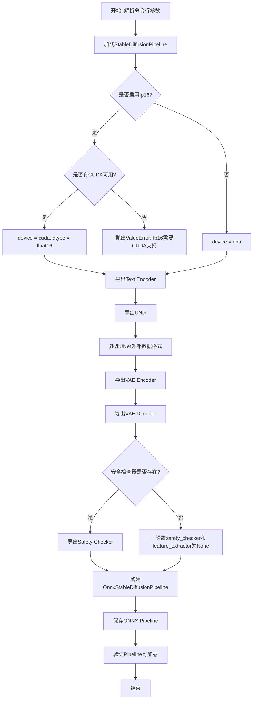
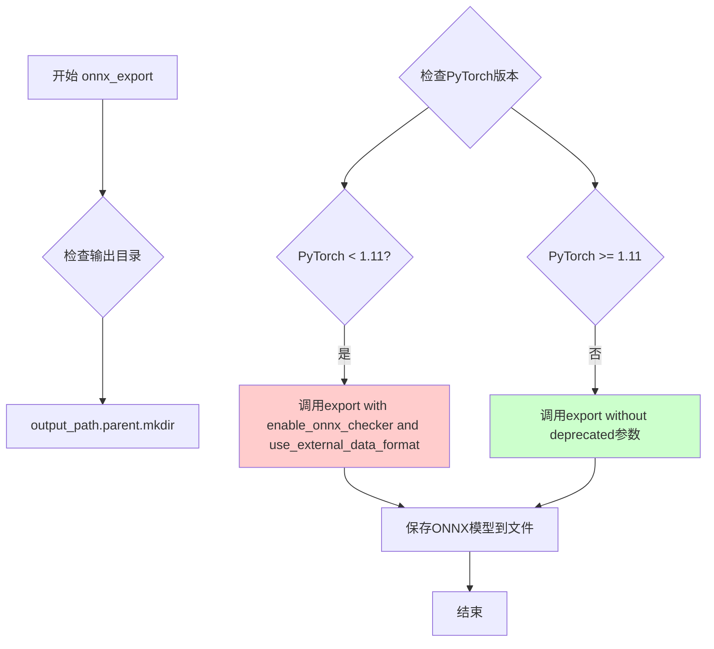
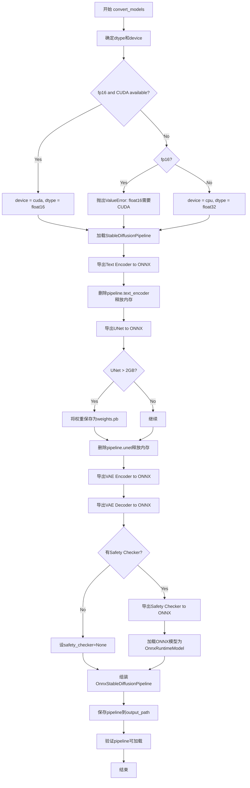

# `diffusers\scripts\convert_stable_diffusion_checkpoint_to_onnx.py` 详细设计文档

这是一个将HuggingFace Diffusers的Stable Diffusion Pipeline转换为ONNX格式的转换脚本，支持文本编码器、UNet、VAE编解码器和安全检查器的导出，可选fp16精度导出。

## 整体流程



## 类结构

```
此脚本为模块级代码，无类定义
主要包含两个全局函数:
├── onnx_export (ONNX模型导出函数)
└── convert_models (主转换流程函数)
```

## 全局变量及字段


### `is_torch_less_than_1_11`
    
检查PyTorch版本是否小于1.11，用于决定是否使用已弃用的ONNX导出参数

类型：`bool`
    


    

## 全局函数及方法


### `onnx_export`

该函数是用于将PyTorch模型导出为ONNX格式的核心工具函数，通过封装`torch.onnx.export`并处理PyTorch版本兼容性（1.11版本前后的参数差异），同时确保输出目录已创建。

参数：

- `model`：`torch.nn.Module`，需要导出到ONNX格式的PyTorch模型
- `model_args`：`tuple`，模型的输入参数元组，用于ONNX追踪（trace）
- `output_path`：`Path`，输出ONNX文件的保存路径
- `ordered_input_names`：`list` 或 `tuple`，有序的输入张量名称列表
- `output_names`：`list` 或 `tuple`，输出张量名称列表
- `dynamic_axes`：`dict`，动态轴字典，指定哪些维度是可变的（如 `{0: "batch", 1: "sequence"}`）
- `opset`：`int`，ONNX操作集（operator set）版本号
- `use_external_data_format`：`bool`，可选，默认`False`，是否使用外部数据格式（对于大于2GB的模型需要设为`True`）

返回值：`None`，该函数没有返回值（隐式返回`None`），通过副作用将模型保存到指定路径

#### 流程图



#### 带注释源码

```python
def onnx_export(
    model,                      # torch.nn.Module: 要导出的PyTorch模型
    model_args: tuple,          # tuple: 模型的输入参数元组，用于ONNX tracing
    output_path: Path,         # Path: 输出ONNX文件的路径
    ordered_input_names,        # list/tuple: 有序的输入张量名称列表
    output_names,              # list/tuple: 输出张量名称列表
    dynamic_axes,              # dict: 动态轴字典，定义可变维度
    opset,                     # int: ONNX操作集版本
    use_external_data_format=False,  # bool: 是否使用外部数据格式（大模型需要）
):
    # 确保输出目录存在，如果不存在则创建（parents=True表示创建所有父目录）
    output_path.parent.mkdir(parents=True, exist_ok=True)
    
    # PyTorch在v1.11版本废弃了enable_onnx_checker和use_external_data_format参数
    # 因此需要根据PyTorch版本进行向后兼容处理
    if is_torch_less_than_1_11:
        # 对于PyTorch < 1.11，使用废弃的参数（enable_onnx_checker用于验证ONNX模型）
        export(
            model,                      # 要导出的模型
            model_args,                 # 模型输入参数
            f=output_path.as_posix(),   # 输出文件路径（转为字符串）
            input_names=ordered_input_names,  # 输入张量名称
            output_names=output_names,  # 输出张量名称
            dynamic_axes=dynamic_axes,  # 动态轴定义
            do_constant_folding=True,   # 启用常量折叠优化
            use_external_data_format=use_external_data_format,  # 外部数据格式
            enable_onnx_checker=True,   # 启用ONNX模型检查器
            opset_version=opset,        # ONNX操作集版本
        )
    else:
        # 对于PyTorch >= 1.11，不使用已废弃的参数
        export(
            model,
            model_args,
            f=output_path.as_posix(),
            input_names=ordered_input_names,
            output_names=output_names,
            dynamic_axes=dynamic_axes,
            do_constant_folding=True,
            opset_version=opset,
        )
```


### `convert_models`

该函数是Stable Diffusion模型转换为ONNX格式的核心入口，负责将预训练的diffusers格式模型导出为ONNX运行时可用的模型文件，包括Text Encoder、UNet、VAE Encoder、VAE Decoder及Safety Checker等关键组件，并最终组装为`OnnxStableDiffusionPipeline`进行保存和可加载性验证。

参数：

- `model_path`：`str`，输入的diffusers检查点路径（本地目录或Hub上的模型）
- `output_path`：`str`，输出的ONNX模型保存路径
- `opset`：`int`，ONNX operator set版本号，默认为14
- `fp16`：`bool`，是否以float16精度导出模型，默认为False

返回值：`None`，该函数无返回值，通过副作用完成模型转换和保存

#### 流程图



#### 带注释源码

```python
@torch.no_grad()
def convert_models(model_path: str, output_path: str, opset: int, fp16: bool = False):
    """
    将Stable Diffusion模型转换为ONNX格式的主函数
    
    参数:
        model_path: 输入的diffusers检查点路径
        output_path: 输出的ONNX模型保存路径
        opset: ONNX operator set版本号
        fp16: 是否以float16精度导出
    
    返回值:
        None
    """
    # 确定数据精度：fp16则使用float16，否则使用float32
    dtype = torch.float16 if fp16 else torch.float32
    
    # 确定运行设备：fp16模式需要CUDA支持，否则只能在CPU运行
    if fp16 and torch.cuda.is_available():
        device = "cuda"
    elif fp16 and not torch.cuda.is_available():
        # fp16只能在GPU上运行，CPU不支持float16计算
        raise ValueError("`float16` model export is only supported on GPUs with CUDA")
    else:
        device = "cpu"
    
    # 加载预训练的Stable Diffusion pipeline
    pipeline = StableDiffusionPipeline.from_pretrained(model_path, torch_dtype=dtype).to(device)
    output_path = Path(output_path)

    # ===== TEXT ENCODER =====
    # 获取text encoder的配置信息
    num_tokens = pipeline.text_encoder.config.max_position_embeddings
    text_hidden_size = pipeline.text_encoder.config.hidden_size
    
    # 准备示例输入：使用一个示例prompt进行跟踪
    text_input = pipeline.tokenizer(
        "A sample prompt",
        padding="max_length",
        max_length=pipeline.tokenizer.model_max_length,
        truncation=True,
        return_tensors="pt",
    )
    
    # 导出text encoder到ONNX格式
    onnx_export(
        pipeline.text_encoder,
        # casting to torch.int32 until the CLIP fix is released
        model_args=(text_input.input_ids.to(device=device, dtype=torch.int32)),
        output_path=output_path / "text_encoder" / "model.onnx",
        ordered_input_names=["input_ids"],
        output_names=["last_hidden_state", "pooler_output"],
        dynamic_axes={
            "input_ids": {0: "batch", 1: "sequence"},
        },
        opset=opset,
    )
    # 释放text encoder内存
    del pipeline.text_encoder

    # ===== UNET =====
    # 获取UNet配置信息
    unet_in_channels = pipeline.unet.config.in_channels
    unet_sample_size = pipeline.unet.config.sample_size
    unet_path = output_path / "unet" / "model.onnx"
    
    # 导出UNet到ONNX格式
    onnx_export(
        pipeline.unet,
        # UNet输入: sample(latent), timestep, encoder_hidden_states, return_dict
        model_args=(
            torch.randn(2, unet_in_channels, unet_sample_size, unet_sample_size).to(device=device, dtype=dtype),
            torch.randn(2).to(device=device, dtype=dtype),
            torch.randn(2, num_tokens, text_hidden_size).to(device=device, dtype=dtype),
            False,
        ),
        output_path=unet_path,
        ordered_input_names=["sample", "timestep", "encoder_hidden_states", "return_dict"],
        output_names=["out_sample"],  # 不能与输入同名以保证正确跟踪
        dynamic_axes={
            "sample": {0: "batch", 1: "channels", 2: "height", 3: "width"},
            "timestep": {0: "batch"},
            "encoder_hidden_states": {0: "batch", 1: "sequence"},
        },
        opset=opset,
        use_external_data_format=True,  # UNet > 2GB, 需要分割权重
    )
    
    # 处理UNet外部权重文件（大于2GB需要特殊处理）
    unet_model_path = str(unet_path.absolute().as_posix())
    unet_dir = os.path.dirname(unet_model_path)
    unet = onnx.load(unet_model_path)
    # 清理现有的tensor文件
    shutil.rmtree(unet_dir)
    os.mkdir(unet_dir)
    # 将外部tensor文件合并为一个
    onnx.save_model(
        unet,
        unet_model_path,
        save_as_external_data=True,
        all_tensors_to_one_file=True,
        location="weights.pb",
        convert_attribute=False,
    )
    # 释放UNet内存
    del pipeline.unet

    # ===== VAE ENCODER =====
    vae_encoder = pipeline.vae
    vae_in_channels = vae_encoder.config.in_channels
    vae_sample_size = vae_encoder.config.sample_size
    
    # 修改forward方法以获取原始tensor输出
    vae_encoder.forward = lambda sample, return_dict: vae_encoder.encode(sample, return_dict)[0].sample()
    
    # 导出VAE encoder到ONNX格式
    onnx_export(
        vae_encoder,
        model_args=(
            torch.randn(1, vae_in_channels, vae_sample_size, vae_sample_size).to(device=device, dtype=dtype),
            False,
        ),
        output_path=output_path / "vae_encoder" / "model.onnx",
        ordered_input_names=["sample", "return_dict"],
        output_names=["latent_sample"],
        dynamic_axes={
            "sample": {0: "batch", 1: "channels", 2: "height", 3: "width"},
        },
        opset=opset,
    )

    # ===== VAE DECODER =====
    vae_decoder = pipeline.vae
    vae_latent_channels = vae_decoder.config.latent_channels
    vae_out_channels = vae_decoder.config.out_channels
    
    # 只通过decoder部分进行前向传播
    vae_decoder.forward = vae_encoder.decode
    
    # 导出VAE decoder到ONNX格式
    onnx_export(
        vae_decoder,
        model_args=(
            torch.randn(1, vae_latent_channels, unet_sample_size, unet_sample_size).to(device=device, dtype=dtype),
            False,
        ),
        output_path=output_path / "vae_decoder" / "model.onnx",
        ordered_input_names=["latent_sample", "return_dict"],
        output_names=["sample"],
        dynamic_axes={
            "latent_sample": {0: "batch", 1: "channels", 2: "height", 3: "width"},
        },
        opset=opset,
    )
    # 释放VAE内存
    del pipeline.vae

    # ===== SAFETY CHECKER =====
    if pipeline.safety_checker is not None:
        safety_checker = pipeline.safety_checker
        clip_num_channels = safety_checker.config.vision_config.num_channels
        clip_image_size = safety_checker.config.vision_config.image_size
        
        # 使用ONNX专用的前向方法
        safety_checker.forward = safety_checker.forward_onnx
        
        # 导出safety checker到ONNX格式
        onnx_export(
            pipeline.safety_checker,
            model_args=(
                torch.randn(
                    1,
                    clip_num_channels,
                    clip_image_size,
                    clip_image_size,
                ).to(device=device, dtype=dtype),
                torch.randn(1, vae_sample_size, vae_sample_size, vae_out_channels).to(device=device, dtype=dtype),
            ),
            output_path=output_path / "safety_checker" / "model.onnx",
            ordered_input_names=["clip_input", "images"],
            output_names=["out_images", "has_nsfw_concepts"],
            dynamic_axes={
                "clip_input": {0: "batch", 1: "channels", 2: "height", 3: "width"},
                "images": {0: "batch", 1: "height", 2: "width", 3: "channels"},
            },
            opset=opset,
        )
        # 释放safety checker内存
        del pipeline.safety_checker
        # 加载ONNX格式的safety checker
        safety_checker = OnnxRuntimeModel.from_pretrained(output_path / "safety_checker")
        feature_extractor = pipeline.feature_extractor
    else:
        safety_checker = None
        feature_extractor = None

    # ===== 组装ONNX Pipeline =====
    onnx_pipeline = OnnxStableDiffusionPipeline(
        vae_encoder=OnnxRuntimeModel.from_pretrained(output_path / "vae_encoder"),
        vae_decoder=OnnxRuntimeModel.from_pretrained(output_path / "vae_decoder"),
        text_encoder=OnnxRuntimeModel.from_pretrained(output_path / "text_encoder"),
        tokenizer=pipeline.tokenizer,
        unet=OnnxRuntimeModel.from_pretrained(output_path / "unet"),
        scheduler=pipeline.scheduler,
        safety_checker=safety_checker,
        feature_extractor=feature_extractor,
        requires_safety_checker=safety_checker is not None,
    )

    # 保存ONNX pipeline到磁盘
    onnx_pipeline.save_pretrained(output_path)
    print("ONNX pipeline saved to", output_path)

    # 清理内存
    del pipeline
    del onnx_pipeline
    
    # 验证ONNX pipeline可加载性
    _ = OnnxStableDiffusionPipeline.from_pretrained(output_path, provider="CPUExecutionProvider")
    print("ONNX pipeline is loadable")
```

## 关键组件


### 张量索引与惰性加载

代码中通过动态axes定义实现了张量维度索引，支持batch维度的动态变化。例如在`dynamic_axes`中指定`"input_ids": {0: "batch", 1: "sequence"}`，允许不同batch大小的输入。惰性加载体现在分阶段导出各组件（text_encoder, unet, vae_encoder, vae_decoder, safety_checker），每次仅加载需要的模型部分，导出后立即删除以释放内存。

### 反量化支持

通过`fp16`参数支持float16精度导出。代码中根据`fp16`参数选择`torch.float16`或`torch.float32`作为dtype，并将模型和输入张量转换为相应精度。当指定fp16但无CUDA可用时，会抛出`ValueError`明确提示仅支持GPU。

### 量化策略

代码使用`use_external_data_format=True`处理大模型（如UNet超过2GB），将权重分割为外部数据文件，并通过`onnx.save_model`将所有张量合并到单个`weights.pb`文件中，实现模型文件的优化管理。

### onnx_export函数

负责将PyTorch模型导出为ONNX格式。根据torch版本（<1.11或>=1.11）兼容不同的export参数，处理`enable_onnx_checker`和`use_external_data_format`参数的废弃情况。支持动态轴定义以适应不同输入尺寸。

### convert_models函数

主转换流程函数，按顺序导出pipeline的各个组件（text_encoder, unet, vae_encoder, vae_decoder, safety_checker），处理VAE编码器和解码器的特殊forward逻辑，最终组合成`OnnxStableDiffusionPipeline`并验证可加载性。

### TEXT ENCODER组件

将transformers的文本编码器导出为ONNX，使用`max_position_embeddings`和`hidden_size`获取配置信息，输入为tokenizer处理后的input_ids，输出last_hidden_state和pooler_output。

### UNET组件

导出UNet模型处理噪声预测，输入包括sample、timestep、encoder_hidden_states和return_dict，输出out_sample。由于模型超过2GB需要外部数据格式，并进行张量文件清理和重新整合。

### VAE ENCODER组件

通过lambda函数修改vae_encoder的forward方法，使其返回encode后的sample而非完整字典，从而仅导出编码器部分。

### VAE DECODER组件

将vae_decoder的forward指向vae_encoder.decode，仅导出解码器部分，处理latent空间到图像空间的转换。

### SAFETY CHECKER组件

条件性导出安全检查器，如果pipeline.safety_checker存在则导出，并使用forward_onnx方法。导出后加载为OnnxRuntimeModel。

### OnnxStableDiffusionPipeline组合

将所有导出的ONNX模型（vae_encoder, vae_decoder, text_encoder, unet, safety_checker）与原始tokenizer、scheduler、feature_extractor组合成完整的推理管道。

### 命令行参数处理

使用argparse解析model_path、output_path、opset和fp16参数，其中opset默认为14，fp16默认为False。


## 问题及建议


### 已知问题

- **版本检查逻辑冗余**：第18行 `version.parse(version.parse(torch.__version__).base_version)` 对版本进行了重复解析，增加了不必要的计算开销，应简化为 `version.parse(torch.__version__).base_version`。
- **硬编码张量维度**：多处使用 `torch.randn(2, ...)` 和 `torch.randn(1, ...)` 硬编码batch size，缺乏灵活性，不同batch size的模型可能导致转换失败。
- **Monkey Patch方式不规范**：第115行和第145行使用lambda和直接赋值修改 `forward` 方法（`vae_encoder.forward = lambda...`、`vae_decoder.forward = vae_encoder.decode`），这种方式破坏了对象的原始接口，容易产生隐藏bug且难以调试。
- **目录操作存在竞态风险**：第99-102行先删除目录再重建，使用 `shutil.rmtree` + `os.mkdir` 的组合而非 `Path.mkdir(..., exist_ok=True)`，在并发场景下可能产生竞态条件。
- **GPU内存释放不完整**：虽然使用 `del` 删除了pipeline组件，但在GPU环境下未调用 `torch.cuda.empty_cache()`，可能导致显存未及时释放。
- **缺乏错误处理和验证**：模型加载、ONNX导出、文件保存等关键步骤均无try-except保护，失败时只会抛出原始异常，难以定位问题。
- **测试加载冗余**：第171-172行在保存后立即加载验证会增加不必要的执行时间，且仅打印成功信息，未做深度验证。

### 优化建议

- 将硬编码的张量维度提取为可配置参数，或从模型config中动态获取batch size。
- 考虑使用子类继承或wrapper类替代monkey patch方式来处理VAE encoder/decoder的转发逻辑，提高代码可维护性。
- 统一使用 `Path.mkdir(parents=True, exist_ok=True)` 进行目录创建，避免手动文件操作。
- 在GPU模式下添加 `torch.cuda.empty_cache()` 调用，并增加内存监控日志。
- 为关键函数添加try-except包装和详细的错误信息，包括具体是哪个组件导出失败。
- 移除或条件化保存后的加载测试，或将其改为可选的验证步骤。
- 添加类型注解和docstring，增强代码可读性和可维护性。

## 其它


### 设计目标与约束

将HuggingFace Diffusers库中的Stable Diffusion Pipeline转换为ONNX格式，使其可以在ONNX Runtime中运行，无需PyTorch依赖。约束条件包括：PyTorch版本兼容性（需要处理1.11版本前后的API变化）、ONNX Opset版本支持（默认14）、float16模型仅支持CUDA设备、UNet模型因大小超过2GB需要使用外部数据格式存储。

### 错误处理与异常设计

代码中包含以下错误处理：检测到fp16模式但无CUDA可用时抛出ValueError("`float16` model export is only supported on GPUs with CUDA")；PyTorch版本检测用于兼容性处理；文件操作中使用mkdir确保输出目录存在；ONNX模型加载后进行文件重组以处理大模型。

### 数据流与状态机

转换流程按顺序执行：加载StableDiffusionPipeline → 导出Text Encoder → 导出UNet（含外部数据处理） → 导出VAE Encoder → 导出VAE Decoder → 导出Safety Checker（可选） → 组装OnnxStableDiffusionPipeline → 保存并验证可加载性。

### 外部依赖与接口契约

主要依赖包括：torch、onnx、onnxruntime、diffusers、packaging、argparse。输入接口通过命令行参数提供model_path（原始模型路径）、output_path（输出路径）、opset（ONNX操作集版本）、fp16（是否使用半精度）。输出为包含多个ONNX模型的目录结构。

### 性能考虑

fp16模式可减少模型大小和加速推理；使用torch.no_grad()减少内存占用；UNet使用外部数据格式以支持大于2GB的模型；转换过程中逐步删除不再需要的pipeline组件以释放内存。

### 兼容性考虑

代码通过is_torch_less_than_1_11变量处理PyTorch 1.11版本前后的API变化（enable_onnx_checker和use_external_data_format参数在1.11后被弃用）；支持CPU和CUDA设备；通过动态轴支持变长输入。

### 使用示例

```bash
python convert_sd_to_onnx.py --model_path CompVis/stable-diffusion-v1-4 --output_path ./onnx_sd --opset 14 --fp16
```
    