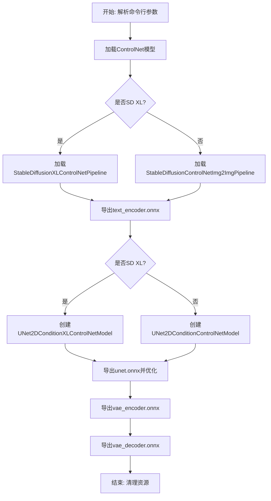
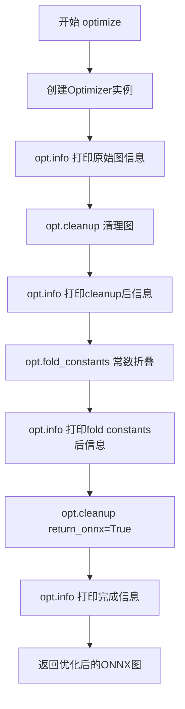
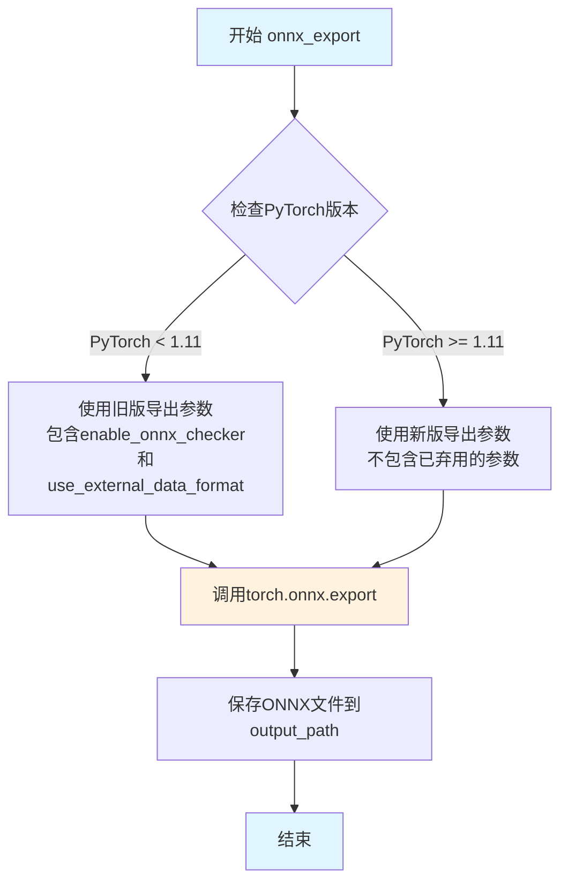
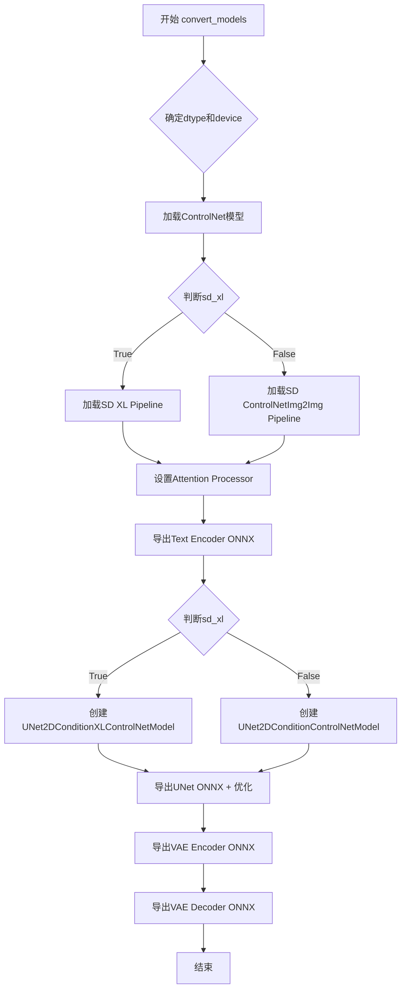
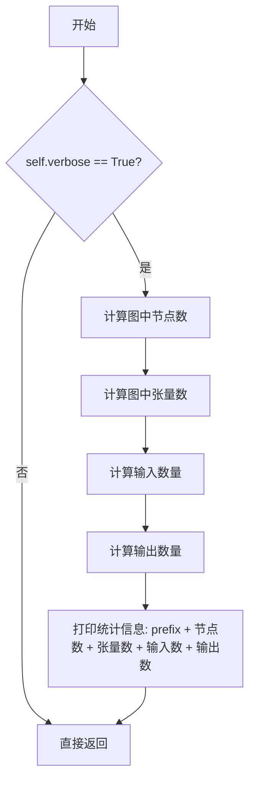
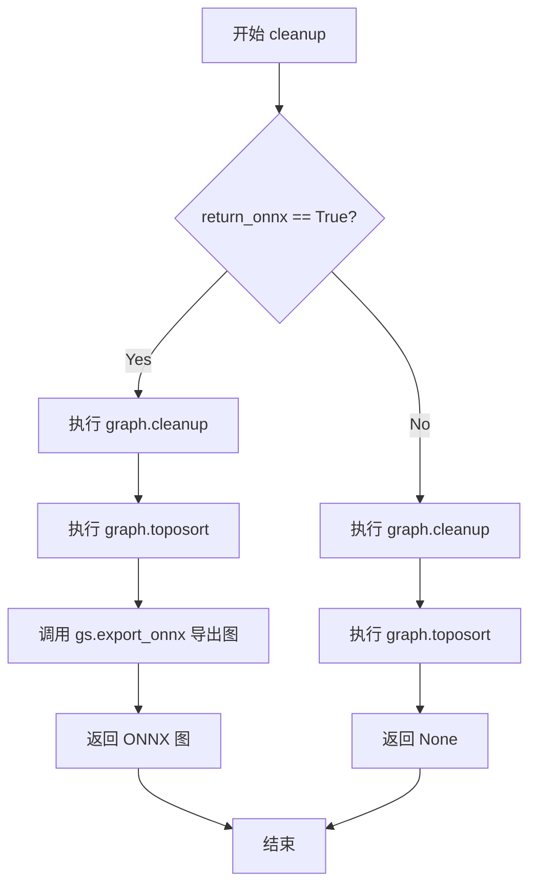
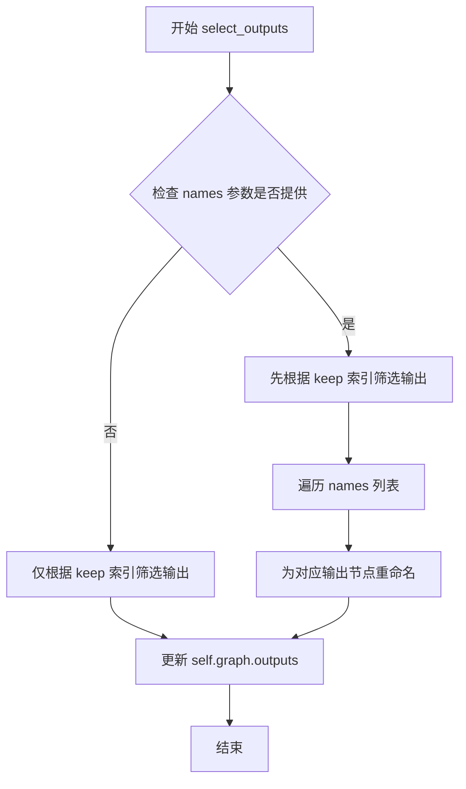
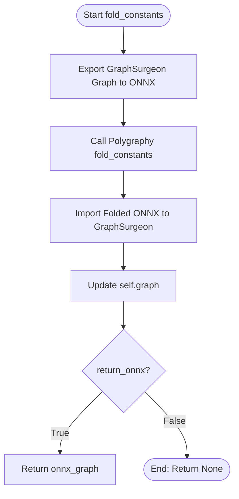
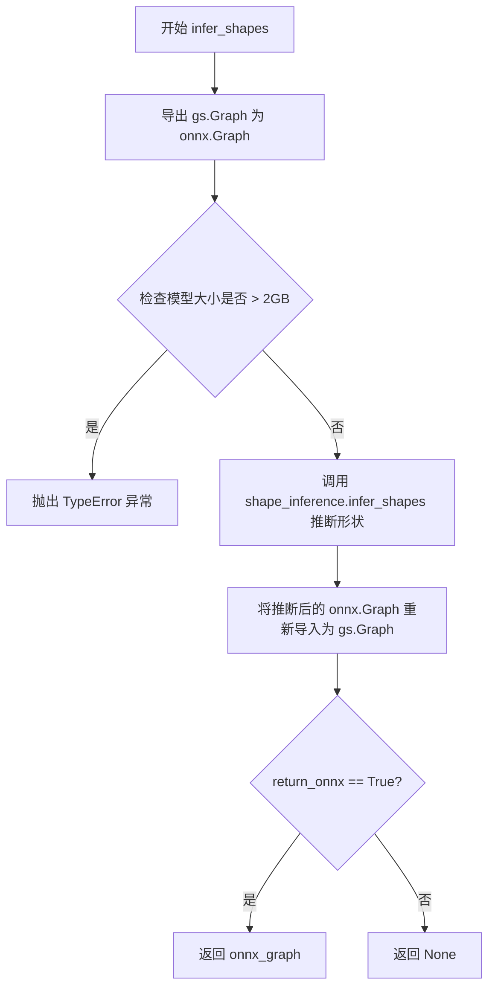
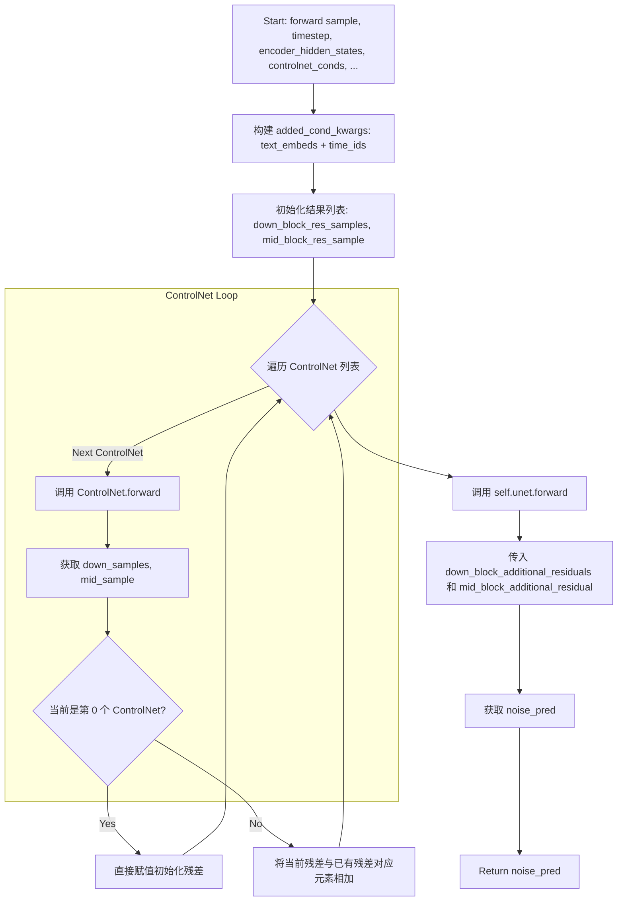

# `diffusers\scripts\convert_stable_diffusion_controlnet_to_onnx.py` 详细设计文档

该脚本用于将HuggingFace Diffusers库中的Stable Diffusion ControlNet模型（包括SD 1.5和SD XL版本）转换为ONNX格式，支持fp16精度导出，并包含ONNX图优化流程，输出text_encoder、unet（含ControlNet）、vae_encoder和vae_decoder四个ONNX模型文件。

## 整体流程



## 类结构

```
Optimizer (ONNX图优化类)
├── info() - 打印图信息
├── cleanup() - 清理和拓扑排序
├── select_outputs() - 选择输出节点
├── fold_constants() - 折叠常量
└── infer_shapes() - 推理形状

UNet2DConditionControlNetModel (SD 1.5 UNet+ControlNet模型)
└── forward() - 前向传播

UNet2DConditionXLControlNetModel (SD XL UNet+ControlNet模型)
└── forward() - 前向传播

全局函数
├── optimize() - ONNX图优化入口
├── onnx_export() - 导出模型到ONNX
└── convert_models() - 主转换函数
```

## 全局变量及字段


### `is_torch_less_than_1_11`
    
PyTorch版本小于1.11的标识，用于兼容性检查

类型：`bool`
    


### `is_torch_2_0_1`
    
PyTorch版本等于2.0.1的标识，用于特定版本处理

类型：`bool`
    


### `Optimizer.graph`
    
ONNX图对象，用于存储和操作ONNX计算图

类型：`gs.Graph`
    


### `Optimizer.verbose`
    
是否输出详细信息，控制调试信息打印

类型：`bool`
    


### `UNet2DConditionControlNetModel.unet`
    
UNet模型，用于噪声预测

类型：`UNet2DConditionModel`
    


### `UNet2DConditionControlNetModel.controlnets`
    
ControlNet模型列表，用于条件控制

类型：`ControlNetModel`
    


### `UNet2DConditionXLControlNetModel.unet`
    
UNet模型，用于噪声预测

类型：`UNet2DConditionModel`
    


### `UNet2DConditionXLControlNetModel.controlnets`
    
ControlNet模型列表，用于条件控制

类型：`ControlNetModel`
    
    

## 全局函数及方法


### `optimize`

这是一个ONNX图优化的入口函数，通过实例化 `Optimizer` 类并依次执行清理、常数折叠等优化操作，最终返回优化后的ONNX计算图。

参数：

- `onnx_graph`：`onnx.ModelProto` 或等效的ONNX图对象，需要进行优化的原始ONNX模型图
- `name`：`str`，用于日志输出的模型名称前缀，方便追踪优化过程
- `verbose`：`bool`，是否输出详细的优化过程信息（节点数、张量数等）

返回值：`onnx.ModelProto`，经过清理和常数折叠优化后的ONNX图对象

#### 流程图



#### 带注释源码

```python
def optimize(onnx_graph, name, verbose):
    """
    ONNX图优化的主入口函数
    
    该函数执行以下优化步骤：
    1. 导入ONNX图到GraphSurgeon
    2. 清理图中无用的节点和边
    3. 执行常数折叠以简化计算
    4. 再次清理以确保图的高效性
    
    Args:
        onnx_graph: 输入的ONNX模型图对象
        name: 用于日志输出的标识名称
        verbose: 是否输出详细日志
    
    Returns:
        优化后的ONNX图对象
    """
    # 创建Optimizer实例，传入ONNX图和verbose标志
    opt = Optimizer(onnx_graph, verbose=verbose)
    
    # 打印优化前的原始图信息（节点数、张量数、输入输出数）
    opt.info(name + ": original")
    
    # 执行图清理：移除无用节点并进行拓扑排序
    opt.cleanup()
    opt.info(name + ": cleanup")
    
    # 执行常数折叠：将可以预先计算的节点合并为常量
    opt.fold_constants()
    opt.info(name + ": fold constants")
    
    # 注意：shape inference 被注释掉了，因为可能导致问题
    # opt.infer_shapes()
    # opt.info(name + ': shape inference')
    
    # 再次清理图并返回ONNX格式的图对象
    onnx_opt_graph = opt.cleanup(return_onnx=True)
    opt.info(name + ": finished")
    
    # 返回优化后的ONNX图
    return onnx_opt_graph
```


### `onnx_export`

该函数负责将PyTorch模型导出为ONNX格式，根据PyTorch版本兼容性处理不同的导出参数，并使用推理模式和自动混合精度优化导出过程。

参数：

- `model`：`torch.nn.Module`，要导出的PyTorch模型
- `model_args`：`tuple`，模型输入参数的元组，用于ONNX追踪
- `output_path`：`Path`，输出ONNX文件的路径
- `ordered_input_names`：`list`，输入张量的名称列表
- `output_names`：`list`，输出张量的名称列表
- `dynamic_axes`：`dict`，动态轴的字典，用于指定可变的维度
- `opset`：`int`，ONNX操作集版本号
- `use_external_data_format`：`bool`，是否使用外部数据格式（可选，默认为False）

返回值：`None`，函数执行完成后直接保存ONNX文件到指定路径

#### 流程图



#### 带注释源码

```python
def onnx_export(
    model,  # torch.nn.Module: 要导出的PyTorch模型
    model_args: tuple,  # tuple: 模型输入参数元组，用于ONNX追踪
    output_path: Path,  # Path: 输出ONNX文件的路径对象
    ordered_input_names,  # list: 输入张量的名称列表
    output_names,  # list: 输出张量的名称列表
    dynamic_axes,  # dict: 动态轴字典，指定哪些维度是可变的
    opset,  # int: ONNX操作集版本号
    use_external_data_format: bool = False,  # bool: 是否使用外部数据格式（默认False）
):
    """
    将PyTorch模型导出为ONNX格式的函数
    
    处理逻辑：
    1. 创建输出目录
    2. 根据PyTorch版本选择不同的导出参数（1.11之前vs之后）
    3. 使用inference_mode和autocast优化导出过程
    4. 调用torch.onnx.export执行实际导出
    """
    # 确保输出目录存在，parents=True创建所有父目录
    output_path.parent.mkdir(parents=True, exist_ok=True)
    
    # PyTorch deprecated the `enable_onnx_checker` and `use_external_data_format` arguments in v1.11,
    # so we check the torch version for backwards compatibility
    # 使用inference_mode()禁用梯度计算，提高推理性能
    # 使用autocast("cuda")启用自动混合精度
    with torch.inference_mode(), torch.autocast("cuda"):
        # 根据PyTorch版本选择不同的导出策略
        if is_torch_less_than_1_11:
            # 旧版本：包含已弃用的参数
            export(
                model,  # 要导出的模型
                model_args,  # 模型输入参数
                f=output_path.as_posix(),  # 输出文件路径（转换为POSIX格式）
                input_names=ordered_input_names,  # 输入张量名称
                output_names=output_names,  # 输出张量名称
                dynamic_axes=dynamic_axes,  # 动态轴配置
                do_constant_folding=True,  # 是否执行常量折叠优化
                use_external_data_format=use_external_data_format,  # 外部数据格式（支持大模型）
                enable_onnx_checker=True,  # 启用ONNX检查器（已弃用）
                opset_version=opset,  # ONNX操作集版本
            )
        else:
            # 新版本：不包含已弃用的参数
            export(
                model,  # 要导出的模型
                model_args,  # 模型输入参数
                f=output_path.as_posix(),  # 输出文件路径
                input_names=ordered_input_names,  # 输入张量名称
                output_names=output_names,  # 输出张量名称
                dynamic_axes=dynamic_axes,  # 动态轴配置
                do_constant_folding=True,  # 是否执行常量折叠优化
                opset_version=opset,  # ONNX操作集版本
            )
```


### `convert_models`

该函数是主转换函数，负责将ControlNet pipeline（支持Stable Diffusion和SD XL两种版本）转换为ONNX格式，导出text_encoder、unet、vae_encoder和vae_decoder四个模型文件，并支持fp16精度优化。

参数：

- `model_path`：`str`，Stable Diffusion模型的路径（本地目录或Hub上的模型ID）
- `controlnet_path`：`list`，ControlNet模型的路径列表，支持多个ControlNet
- `output_path`：`str`，输出ONNX模型的目录路径
- `opset`：`int`，ONNX操作集版本号，默认14
- `fp16`：`bool`，是否以float16精度导出模型，默认False
- `sd_xl`：`bool`，是否为Stable Diffusion XL模型，默认False

返回值：`None`，函数不返回任何值，但会在output_path下生成四个ONNX模型文件（text_encoder/model.onnx、unet/model.onnx+weights.pb、vae_encoder/model.onnx、vae_decoder/model.onnx）

#### 流程图



#### 带注释源码

```python
@torch.no_grad()
def convert_models(
    model_path: str, controlnet_path: list, output_path: str, opset: int, fp16: bool = False, sd_xl: bool = False
):
    """
    Function to convert models in stable diffusion controlnet pipeline into ONNX format

    Example:
    python convert_stable_diffusion_controlnet_to_onnx.py
    --model_path danbrown/RevAnimated-v1-2-2
    --controlnet_path lllyasviel/control_v11f1e_sd15_tile ioclab/brightness-controlnet
    --output_path path-to-models-stable_diffusion/RevAnimated-v1-2-2
    --fp16

    Example for SD XL:
    python convert_stable_diffusion_controlnet_to_onnx.py
    --model_path stabilityai/stable-diffusion-xl-base-1.0
    --controlnet_path SargeZT/sdxl-controlnet-seg
    --output_path path-to-models-stable_diffusion/stable-diffusion-xl-base-1.0
    --fp16
    --sd_xl

    Returns:
        create 4 onnx models in output path
        text_encoder/model.onnx
        unet/model.onnx + unet/weights.pb
        vae_encoder/model.onnx
        vae_decoder/model.onnx

        run test script in diffusers/examples/community
        python test_onnx_controlnet.py
        --sd_model danbrown/RevAnimated-v1-2-2
        --onnx_model_dir path-to-models-stable_diffusion/RevAnimated-v1-2-2
        --qr_img_path path-to-qr-code-image
    """
    # 根据fp16参数确定数据类型，fp16使用float16，否则使用float32
    dtype = torch.float16 if fp16 else torch.float32
    # 确定设备：如果fp16且有GPU则用cuda，否则如果fp16但无GPU则报错，否则用cpu
    if fp16 and torch.cuda.is_available():
        device = "cuda"
    elif fp16 and not torch.cuda.is_available():
        raise ValueError("`float16` model export is only supported on GPUs with CUDA")
    else:
        device = "cpu"

    # 初始化ControlNet模型列表
    controlnets = []
    for path in controlnet_path:
        # 从预训练模型加载ControlNet并转换为指定dtype
        controlnet = ControlNetModel.from_pretrained(path, torch_dtype=dtype).to(device)
        # 如果是PyTorch 2.0.1，设置Attention Processor
        if is_torch_2_0_1:
            controlnet.set_attn_processor(AttnProcessor())
        controlnets.append(controlnet)

    # 根据sd_xl标志选择加载不同的Pipeline
    if sd_xl:
        # SD XL模式：只支持单个ControlNet
        if len(controlnets) == 1:
            controlnet = controlnets[0]
        else:
            raise ValueError("MultiControlNet is not yet supported.")
        # 加载SD XL ControlNet Pipeline
        pipeline = StableDiffusionXLControlNetPipeline.from_pretrained(
            model_path, controlnet=controlnet, torch_dtype=dtype, variant="fp16", use_safetensors=True
        ).to(device)
    else:
        # 普通SD模式：支持多个ControlNet
        pipeline = StableDiffusionControlNetImg2ImgPipeline.from_pretrained(
            model_path, controlnet=controlnets, torch_dtype=dtype
        ).to(device)

    # 转换output_path为Path对象
    output_path = Path(output_path)
    # 如果是PyTorch 2.0.1，为UNet和VAE设置Attention Processor
    if is_torch_2_0_1:
        pipeline.unet.set_attn_processor(AttnProcessor())
        pipeline.vae.set_attn_processor(AttnProcessor())

    # ========== TEXT ENCODER ==========
    # 获取text_encoder的配置信息
    num_tokens = pipeline.text_encoder.config.max_position_embeddings
    text_hidden_size = pipeline.text_encoder.config.hidden_size
    # 准备文本输入
    text_input = pipeline.tokenizer(
        "A sample prompt",
        padding="max_length",
        max_length=pipeline.tokenizer.model_max_length,
        truncation=True,
        return_tensors="pt",
    )
    # 导出text_encoder为ONNX
    onnx_export(
        pipeline.text_encoder,
        # casting to torch.int32 until the CLIP fix is released: https://github.com/huggingface/transformers/pull/18515/files
        model_args=(text_input.input_ids.to(device=device, dtype=torch.int32)),
        output_path=output_path / "text_encoder" / "model.onnx",
        ordered_input_names=["input_ids"],
        output_names=["last_hidden_state", "pooler_output"],
        dynamic_axes={
            "input_ids": {0: "batch", 1: "sequence"},
        },
        opset=opset,
    )
    # 释放text_encoder内存
    del pipeline.text_encoder

    # ========== UNET ==========
    if sd_xl:
        # SD XL模式：使用XL专用的UNet模型
        controlnets = torch.nn.ModuleList(controlnets)
        unet_controlnet = UNet2DConditionXLControlNetModel(pipeline.unet, controlnets)
        unet_in_channels = pipeline.unet.config.in_channels
        unet_sample_size = pipeline.unet.config.sample_size
        text_hidden_size = 2048
        img_size = 8 * unet_sample_size
        unet_path = output_path / "unet" / "model.onnx"

        # 导出SD XL UNet ONNX（带额外参数：text_embeds和time_ids）
        onnx_export(
            unet_controlnet,
            model_args=(
                torch.randn(2, unet_in_channels, unet_sample_size, unet_sample_size).to(device=device, dtype=dtype),
                torch.tensor([1.0]).to(device=device, dtype=dtype),
                torch.randn(2, num_tokens, text_hidden_size).to(device=device, dtype=dtype),
                torch.randn(len(controlnets), 2, 3, img_size, img_size).to(device=device, dtype=dtype),
                torch.randn(len(controlnets), 1).to(device=device, dtype=dtype),
                torch.randn(2, 1280).to(device=device, dtype=dtype),
                torch.rand(2, 6).to(device=device, dtype=dtype),
            ),
            output_path=unet_path,
            ordered_input_names=[
                "sample",
                "timestep",
                "encoder_hidden_states",
                "controlnet_conds",
                "conditioning_scales",
                "text_embeds",
                "time_ids",
            ],
            output_names=["noise_pred"],  # has to be different from "sample" for correct tracing
            dynamic_axes={
                "sample": {0: "2B", 2: "H", 3: "W"},
                "encoder_hidden_states": {0: "2B"},
                "controlnet_conds": {1: "2B", 3: "8H", 4: "8W"},
                "text_embeds": {0: "2B"},
                "time_ids": {0: "2B"},
            },
            opset=opset,
            use_external_data_format=True,  # UNet is > 2GB, so the weights need to be split
        )
        # 优化UNet ONNX模型
        unet_model_path = str(unet_path.absolute().as_posix())
        unet_dir = os.path.dirname(unet_model_path)
        # 推理形状
        shape_inference.infer_shapes_path(unet_model_path, unet_model_path)
        # 优化图
        unet_opt_graph = optimize(onnx.load(unet_model_path), name="Unet", verbose=True)
        # 清理现有的tensor文件
        shutil.rmtree(unet_dir)
        os.mkdir(unet_dir)
        # 将外部tensor文件合并为一个
        onnx.save_model(
            unet_opt_graph,
            unet_model_path,
            save_as_external_data=True,
            all_tensors_to_one_file=True,
            location="weights.pb",
            convert_attribute=False,
        )
        # 释放unet内存
        del pipeline.unet
    else:
        # 普通SD模式：使用标准UNet模型
        controlnets = torch.nn.ModuleList(controlnets)
        unet_controlnet = UNet2DConditionControlNetModel(pipeline.unet, controlnets)
        unet_in_channels = pipeline.unet.config.in_channels
        unet_sample_size = pipeline.unet.config.sample_size
        img_size = 8 * unet_sample_size
        unet_path = output_path / "unet" / "model.onnx"

        # 导出普通SD UNet ONNX
        onnx_export(
            unet_controlnet,
            model_args=(
                torch.randn(2, unet_in_channels, unet_sample_size, unet_sample_size).to(device=device, dtype=dtype),
                torch.tensor([1.0]).to(device=device, dtype=dtype),
                torch.randn(2, num_tokens, text_hidden_size).to(device=device, dtype=dtype),
                torch.randn(len(controlnets), 2, 3, img_size, img_size).to(device=device, dtype=dtype),
                torch.randn(len(controlnets), 1).to(device=device, dtype=dtype),
            ),
            output_path=unet_path,
            ordered_input_names=[
                "sample",
                "timestep",
                "encoder_hidden_states",
                "controlnet_conds",
                "conditioning_scales",
            ],
            output_names=["noise_pred"],  # has to be different from "sample" for correct tracing
            dynamic_axes={
                "sample": {0: "2B", 2: "H", 3: "W"},
                "encoder_hidden_states": {0: "2B"},
                "controlnet_conds": {1: "2B", 3: "8H", 4: "8W"},
            },
            opset=opset,
            use_external_data_format=True,  # UNet is > 2GB, so the weights need to be split
        )
        # 优化UNet ONNX模型（同SD XL）
        unet_model_path = str(unet_path.absolute().as_posix())
        unet_dir = os.path.dirname(unet_model_path)
        shape_inference.infer_shapes_path(unet_model_path, unet_model_path)
        unet_opt_graph = optimize(onnx.load(unet_model_path), name="Unet", verbose=True)
        shutil.rmtree(unet_dir)
        os.mkdir(unet_dir)
        onnx.save_model(
            unet_opt_graph,
            unet_model_path,
            save_as_external_data=True,
            all_tensors_to_one_file=True,
            location="weights.pb",
            convert_attribute=False,
        )
        del pipeline.unet

    # ========== VAE ENCODER ==========
    vae_encoder = pipeline.vae
    vae_in_channels = vae_encoder.config.in_channels
    vae_sample_size = vae_encoder.config.sample_size
    # 需要获取encoder的原始tensor输出（sample）
    # 重写forward方法以获取latent分布的sample
    vae_encoder.forward = lambda sample: vae_encoder.encode(sample).latent_dist.sample()
    onnx_export(
        vae_encoder,
        model_args=(torch.randn(1, vae_in_channels, vae_sample_size, vae_sample_size).to(device=device, dtype=dtype),),
        output_path=output_path / "vae_encoder" / "model.onnx",
        ordered_input_names=["sample"],
        output_names=["latent_sample"],
        dynamic_axes={
            "sample": {0: "batch", 1: "channels", 2: "height", 3: "width"},
        },
        opset=opset,
    )

    # ========== VAE DECODER ==========
    vae_decoder = pipeline.vae
    vae_latent_channels = vae_decoder.config.latent_channels
    # 只通过decoder部分进行前向传播
    # 使用encoder的decode方法
    vae_decoder.forward = vae_encoder.decode
    onnx_export(
        vae_decoder,
        model_args=(
            torch.randn(1, vae_latent_channels, unet_sample_size, unet_sample_size).to(device=device, dtype=dtype),
        ),
        output_path=output_path / "vae_decoder" / "model.onnx",
        ordered_input_names=["latent_sample"],
        output_names=["sample"],
        dynamic_axes={
            "latent_sample": {0: "batch", 1: "channels", 2: "height", 3: "width"},
        },
        opset=opset,
    )
    # 释放vae内存
    del pipeline.vae

    # 释放pipeline内存
    del pipeline
```


### `Optimizer.info`

该方法用于在verbose模式下打印ONNX图的统计信息，包括节点数、张量数、输入数和输出数。

参数：

- `prefix`：`str`，用于标识统计信息的前缀文本，通常表示当前图的处理阶段（如"original"、"cleanup"等）

返回值：`None`，该方法无返回值，仅通过print输出统计信息

#### 流程图



#### 带注释源码

```python
def info(self, prefix):
    # 仅在verbose模式为True时执行打印操作
    if self.verbose:
        # 打印ONNX图的统计信息
        # prefix: 用于标识当前图的处理阶段
        # self.graph.nodes: 图中所有节点的列表
        # self.graph.tensors().keys(): 图中所有张量的键集合
        # self.graph.inputs: 图的输入张量列表
        # self.graph.outputs: 图的输出张量列表
        print(
            f"{prefix} .. {len(self.graph.nodes)} nodes, {len(self.graph.tensors().keys())} tensors, {len(self.graph.inputs)} inputs, {len(self.graph.outputs)} outputs"
        )
```


### `Optimizer.cleanup`

清理 ONNX 图并对其进行拓扑排序，移除未使用的节点和常量，同时确保节点顺序符合依赖关系。

参数：

- `return_onnx`：`bool`，可选参数。如果设置为 `True`，方法将返回清理后的 ONNX 图；如果为 `False`（默认值），则仅执行清理操作但不返回图。

返回值：`onnx.GraphProto | None`，返回清理后的 ONNX 图对象。如果 `return_onnx` 为 `False`，则返回 `None`。

#### 流程图



#### 带注释源码

```python
def cleanup(self, return_onnx=False):
    """
    清理 ONNX 图并拓扑排序
    
    Args:
        return_onnx: 如果为 True，则返回清理后的 ONNX 图；否则返回 None
    
    Returns:
        清理后的 ONNX 图（如果 return_onnx 为 True），否则返回 None
    """
    # 清理图：移除未使用的节点、常量折叠等优化操作
    self.graph.cleanup().toposort()
    
    # 判断是否需要返回 ONNX 格式的图
    if return_onnx:
        # 将 GraphSurgeon 图导出为 ONNX 格式并返回
        return gs.export_onnx(self.graph)
```


### `Optimizer.select_outputs`

该方法是 `Optimizer` 类的核心成员之一，用于根据索引列表选择并重置 ONNX 计算图的输出节点，可指定新的输出名称，实现图结构的裁剪与输出适配。

参数：

- `keep`：`list`，整数索引列表，用于指定需要保留的输出节点在原输出列表中的位置
- `names`：`list`，可选参数，字符串列表，用于为保留下来的输出节点指定新的名称

返回值：`None`，该方法直接修改 `Optimizer` 实例的内部图结构，无返回值

#### 流程图



#### 带注释源码

```python
def select_outputs(self, keep, names=None):
    """
    根据索引列表选择计算图的输出节点，可选地重命名输出
    
    参数:
        keep: 整数索引列表，指定要保留的输出节点位置
        names: 可选的字符串列表，用于为保留的输出指定新名称
    
    处理逻辑:
        1. 使用 keep 列表中的索引从原输出列表中选取对应节点
        2. 如果提供了 names，则按顺序为每个输出节点设置新名称
        3. 直接修改 self.graph.outputs 属性以更新图的输出
    """
    # 根据 keep 索引列表筛选输出节点
    # keep 中的每个元素表示原 self.graph.outputs 列表的索引
    self.graph.outputs = [self.graph.outputs[o] for o in keep]
    
    # 如果提供了 names 参数，为保留的输出节点重命名
    if names:
        # 遍历 names 列表，按索引顺序为每个输出设置新名称
        for i, name in enumerate(names):
            self.graph.outputs[i].name = name
```


### 1. 一段话描述

本代码是一个用于将 Stable Diffusion ControlNet 管道（Diffusers 模型）转换为 ONNX 格式的转换工具脚本。其核心功能是加载预训练的 PyTorch 模型，导出为 ONNX 运行时可用的模型文件，并进行一系列优化。`Optimizer.fold_constants` 函数是优化流程中的关键一环，它利用 Polygraphy 库对生成的 ONNX 计算图进行常量折叠（Constant Folding），通过预先计算图中固定的常量表达式来精简图结构，从而提升推理性能并减小模型复杂度。

### 2. 文件的整体运行流程

1.  **参数解析**：通过 `argparse` 获取模型路径、ControlNet 路径、输出路径等参数。
2.  **模型加载**：在 `convert_models` 函数中，根据是否为 SD XL 版本，加载 `StableDiffusionControlNetImg2ImgPipeline` 或 `StableDiffusionXLControlNetPipeline`，并将 ControlNet 和 UNet 移动到指定设备（CPU/GPU）。
3.  **子模型导出**：
    *   导出 `text_encoder`。
    *   封装 `UNet` 与 `ControlNet` 为 `UNet2DConditionControlNetModel` 或 `UNet2DConditionXLControlNetModel`，然后导出为 UNet ONNX 模型（由于模型巨大，使用外部数据格式）。
    *   导出 `vae_encoder` 和 `vae_decoder`。
4.  **模型优化**：对导出的 UNet ONNX 模型调用 `optimize` 函数。
    *   `Optimizer.cleanup`：清理无用节点并拓扑排序。
    *   **Optimizer.fold_constants**：执行常量折叠优化（**核心流程**）。
    *   `Optimizer.infer_shapes`（可选，当前代码注释中已屏蔽）。
5.  **保存模型**：将优化后的 ONNX 模型重新保存到指定目录。

### 3. 类的详细信息

#### 类：`Optimizer`

**类简介**：
`Optimizer` 类是一个 ONNX 图优化器封装类，依赖于 `onnx-graphsurgeon` (gs) 库来操作 ONNX 结构。它提供了图清理、常量折叠、形状推断等功能。

**类字段**：

| 字段名 | 类型 | 描述 |
| :--- | :--- | :--- |
| `graph` | `gs.Graph` | GraphSurgeon 的图对象，用于在内存中表示和操作 ONNX 计算图。 |
| `verbose` | `bool` | 控制是否输出详细的日志信息。 |

**类方法**：

| 方法名 | 描述 |
| :--- | :--- |
| `__init__` | 构造函数，接收 ONNX 图对象并转换为 GS 图。 |
| `info` | 打印图的节点、张量、输入输出数量信息。 |
| `cleanup` | 清理图中未使用的节点并进行拓扑排序。 |
| `select_outputs` | 根据索引选择保留的输出节点。 |
| **`fold_constants`** | **执行常量折叠优化。** |
| `infer_shapes` | 执行 ONNX 形状推断。 |

---

### 4. 关键组件信息

| 组件名称 | 一句话描述 |
| :--- | :--- |
| `onnx-graphsurgeon` (gs) | 用于在 Python 中方便地编辑和操作 ONNX 模型的库。 |
| `polygraphy.backend.onnx.loader.fold_constants` | Polygraphy 库提供的常量折叠工具，能基于 ONNX Runtime 进行高效的常量求值。 |
| `onnx.shape_inference` | ONNX 内置的形状推断工具，用于确定张量的维度。 |

---

### 5. 目标函数详细设计：Optimizer.fold_constants

#### 5.1 基本信息

- **函数名**: `Optimizer.fold_constants`
- **参数**:
  - `return_onnx`: `bool`，控制是否返回 ONNX 模型对象。如果为 `True`，则返回优化后的 ONNX 图；否则返回 `None`。
- **返回值**: `Optional[onnx.ModelProto]`，如果 `return_onnx` 为 `True`，返回经过常量折叠处理的 ONNX 模型对象，否则返回 `None`。

#### 5.2 流程图



#### 5.3 带注释源码

```python
def fold_constants(self, return_onnx=False):
    """
    对当前 ONNX 图执行常量折叠优化。
    常量折叠是一种优化技术，可以将图中可以预先计算出的节点（如常量运算）
    替换为它们的计算结果，从而减少运行时的计算量。

    参数:
        return_onnx (bool): 如果为 True，直接返回优化后的 ONNX 模型对象；
                           如果为 False，仅更新内部图结构，默认返回 None。

    返回:
        onnx.ModelProto or None: 优化后的 ONNX 模型（如果 return_onnx 为 True）。
    """
    # 1. 将 GraphSurgeon 的内部图结构导出为标准的 ONNX ModelProto 对象
    onnx_graph = fold_constants(
        gs.export_onnx(self.graph), 
        allow_onnxruntime_shape_inference=True
    )
    
    # 2. 使用 Polygraphy 的 fold_constants 函数对 ONNX 图进行常量折叠
    #    allow_onnxruntime_shape_inference=True 允许在折叠过程中使用 ONNX Runtime 进行形状推断，
    #    以便处理更复杂的依赖于中间结果形状的常量运算。

    # 3. 将优化后的 ONNX 模型重新导入回 GraphSurgeon 图结构，更新 self.graph
    self.graph = gs.import_onnx(onnx_graph)

    # 4. 根据参数决定是否返回 ONNX 模型对象
    if return_onnx:
        return onnx_graph
```

---

### 6. 潜在的技术债务或优化空间

1.  **缺少异常处理**：`fold_constants` 方法调用了外部库 (`polygraphy`) 进行优化，如果模型结构极其复杂或存在不支持的算子，可能会抛出异常。代码中缺少 `try-except` 块来捕获并处理这类错误，可能导致转换脚本直接崩溃。
2.  **硬编码参数**：在调用 `fold_constants` 时，`allow_onnxruntime_shape_inference=True` 是硬编码的。虽然这通常能带来更好的优化效果，但缺乏灵活性，无法根据用户需求关闭。
3.  **版本兼容性与检测**：`is_torch_less_than_1_11` 和 `is_torch_2_0_1` 的检测逻辑是针对旧版 PyTorch 导出的兼容性处理（处理 `enable_onnx_checker` 和 `use_external_data_format` 参数）。这种版本号字符串解析方式较为脆弱，且随着 PyTorch 版本更新可能需要持续维护。
4.  **函数命名冲突**：导入语句 `from polygraphy.backend.onnx.loader import fold_constants` 将全局函数 `fold_constants` 导入了当前作用域。类方法 `fold_constants` 与此全局函数同名，虽然在类方法内部通过 `fold_constants(...)` 调用是合法的（Python 会在类方法的作用域中先查找局部/全局的 `fold_constants`，即 polygraphy 的函数），但这降低了代码的可读性，容易造成混淆。

### 7. 其它项目

- **设计目标与约束**：主要目标是将大型 Diffusers 模型（特别是 >2GB 的 UNet）转换为 ONNX 格式以用于推理。使用了 `use_external_data_format=True` 来解决单文件 2GB 限制的问题。
- **错误处理与异常设计**：
    - 在 `infer_shapes` 中捕获了 `ByteSize > 2GB` 的错误并抛出 `TypeError`。
    - `optimize` 函数依赖于模型成功加载和导出，缺乏对损坏模型的校验。
- **数据流与状态机**：
    - `Optimizer` 类维护了一个状态流：`__init__` (Load) -> `cleanup` (Clean) -> `fold_constants` (Optimize) -> `infer_shapes` (Refine) -> `cleanup` (Final Clean)。
    - `self.graph` 是贯穿整个流程的核心状态对象。
- **外部依赖与接口契约**：
    - 依赖 `onnx-graphsurgeon` 进行图操作。
    - 依赖 `polygraphy` 进行图优化。
    - 依赖 `onnx` 进行模型序列化与形状推断。
    - 依赖 `diffusers` 库加载原始模型权重。


### `Optimizer.infer_shapes`

该方法负责对 ONNX 计算图进行形状推理（Shape Inference），通过 ONNX 运行时提供的形状推断功能来填充图中张量的维度信息，支持返回推断后的 ONNX 模型或仅更新内部图结构。

参数：

- `return_onnx`：`bool`，可选参数，默认为 `False`。当设置为 `True` 时，方法返回推断形状后的 ONNX 模型对象（`onnx.ModelProto`）；否则返回 `None`，仅更新内部图结构。

返回值：`Optional[onnx.ModelProto]`，返回推断形状后的 ONNX 模型对象，如果 `return_onnx` 为 `False` 则返回 `None`。

#### 流程图



#### 带注释源码

```python
def infer_shapes(self, return_onnx=False):
    """
    对 ONNX 计算图进行形状推理（Shape Inference）。
    
    该方法首先将当前的 gs.Graph 导出为 ONNX 图，然后使用 ONNX 运行时
    的 shape_inference.infer_shapes 函数来推断图中各张量的维度信息。
    推断后的图会被重新导入回 gs.Graph 对象中。
    
    注意：由于 ONNX 形状推断需要将整个模型加载到内存中，因此对超过 2GB
    的大模型会抛出 TypeError 异常。
    
    参数:
        return_onnx (bool): 是否返回推断形状后的 ONNX 模型对象。
                           默认为 False，此时仅更新内部图结构。
    
    返回:
        onnx.ModelProto 或 None: 当 return_onnx 为 True 时返回推断后的
                                 ONNX 模型；否则返回 None。
    """
    # Step 1: 将 gs.Graph（GraphSurgeon 图）导出为 ONNX 图
    onnx_graph = gs.export_onnx(self.graph)
    
    # Step 2: 检查模型大小是否超过 2GB 限制（2147483648 字节）
    # ONNX 形状推断需要将整个模型加载到内存，超过限制会导致失败
    if onnx_graph.ByteSize() > 2147483648:
        # 模型过大，抛出类型错误异常
        raise TypeError("ERROR: model size exceeds supported 2GB limit")
    else:
        # Step 3: 调用 ONNX 的形状推断功能，填充张量的形状信息
        # infer_shapes 会分析算子并推断出每个输出张量的维度
        onnx_graph = shape_inference.infer_shapes(onnx_graph)

    # Step 4: 将推断形状后的 ONNX 图重新导入为 gs.Graph
    # 更新内部 self.graph 以保持一致性
    self.graph = gs.import_onnx(onnx_graph)
    
    # Step 5: 根据参数决定是否返回 ONNX 模型
    if return_onnx:
        return onnx_graph
    # 如果 return_onnx 为 False，隐式返回 None
```


### `UNet2DConditionControlNetModel.forward`

该方法是 `UNet2DConditionControlNetModel` 类的前向传播函数，核心功能是结合多个 ControlNet 的输出条件信息，对 Stable Diffusion 的 UNet 模型进行条件引导，输出噪声预测结果。方法首先遍历所有 ControlNet 模型，获取它们产生的中间特征（down_samples 和 mid_sample），然后将这些特征进行累加融合，最后将融合后的条件信息传递给 UNet 模型进行噪声预测。

参数：

- `sample`：`torch.Tensor`，输入的噪声样本，通常是潜在空间的随机噪声
- `timestep`：`torch.Tensor` 或 int，扩散过程的时间步，用于调节去噪强度
- `encoder_hidden_states`：`torch.Tensor`，文本编码器输出的隐藏状态，提供文本条件信息
- `controlnet_conds`：`list[torch.Tensor]` 或 `torch.Tensor`，ControlNet 的条件输入，通常是控制图像（如边缘图、深度图等）
- `controlnet_scales`：`list[float]` 或 `torch.Tensor`，ControlNet 输出特征的缩放因子，用于调节条件影响的强度

返回值：`torch.Tensor`，预测的噪声，用于后续的去噪过程

#### 流程图

```mermaid
flowchart TD
    A[开始 forward] --> B[遍历 ControlNet 列表]
    B --> C[调用第 i 个 ControlNet]
    C --> D[获取 down_samples 和 mid_sample]
    D --> E{是否是第一个 ControlNet?}
    E -->|是| F[初始化 down_block_res_samples 和 mid_block_res_sample]
    E -->|否| G[累加 down_samples 和 mid_sample]
    F --> H[继续遍历下一个 ControlNet]
    G --> H
    H --> I{还有更多 ControlNet?}
    I -->|是| C
    I -->|否| J[调用 UNet 进行噪声预测]
    J --> K[传入 down_block_additional_residuals 和 mid_block_additional_residual]
    K --> L[获取 noise_pred[0]]
    L --> M[返回 noise_pred]
```

#### 带注释源码

```python
def forward(
    self,
    sample,                     # 输入噪声样本 (batch, channels, height, width)
    timestep,                   # 扩散时间步
    encoder_hidden_states,      # 文本嵌入 (batch, seq_len, hidden_dim)
    controlnet_conds,           # ControlNet 条件输入列表
    controlnet_scales,          # 条件缩放因子列表
):
    """
    前向传播：结合多个 ControlNet 的条件信息进行噪声预测
    
    Args:
        sample: 输入的潜在空间噪声样本
        timestep: 扩散过程的时间步
        encoder_hidden_states: 文本编码器的隐藏状态
        controlnet_conds: ControlNet 条件输入列表
        controlnet_scales: 各 ControlNet 的条件缩放因子
    
    Returns:
        noise_pred: 预测的噪声张量
    """
    
    # 遍历所有 ControlNet 模型，处理每个条件输入
    for i, (controlnet_cond, conditioning_scale, controlnet) in enumerate(
        zip(controlnet_conds, controlnet_scales, self.controlnets)
    ):
        # 调用单个 ControlNet 获取中间特征
        # down_samples: 下采样块的特征列表
        # mid_sample: 中间块的特征
        down_samples, mid_sample = controlnet(
            sample,
            timestep,
            encoder_hidden_states=encoder_hidden_states,
            controlnet_cond=controlnet_cond,      # 条件图像
            conditioning_scale=conditioning_scale, # 条件强度缩放
            return_dict=False,
        )

        # 合并多个 ControlNet 的输出特征
        if i == 0:
            # 第一个 ControlNet：直接赋值初始化
            down_block_res_samples, mid_block_res_sample = down_samples, mid_sample
        else:
            # 后续 ControlNet：累加特征
            down_block_res_samples = [
                samples_prev + samples_curr
                for samples_prev, samples_curr in zip(down_block_res_samples, down_samples)
            ]
            mid_block_res_sample += mid_sample

    # 将融合后的 ControlNet 特征传入 UNet
    # return_dict=False 返回元组，取第一个元素 [0]
    noise_pred = self.unet(
        sample,
        timestep,
        encoder_hidden_states=encoder_hidden_states,
        down_block_additional_residuals=down_block_res_samples,  # 下采样块额外残差
        mid_block_additional_residual=mid_block_res_sample,      # 中间块额外残差
        return_dict=False,
    )[0]
    
    return noise_pred
```


### `UNet2DConditionXLControlNetModel.forward`

这是 `UNet2DConditionXLControlNetModel` 类的前向传播方法，负责协调多个 ControlNet 的输出并将其融入主 UNet 的推理过程中。它首先遍历所有 ControlNet 模型以提取中间特征（down samples 和 mid sample），并将这些特征进行累加融合（multi-controlnet 逻辑），最后将融合后的特征作为额外残差传递给 UNet，以生成针对特定条件和时刻的噪声预测。

参数：

- `sample`：`torch.Tensor`，输入的潜在空间样本（Latent sample），通常来自扩散过程的当前状态。
- `timestep`：`torch.Tensor`，当前的扩散时间步长（Timestamp），用于告知模型当前的噪声级别。
- `encoder_hidden_states`：`torch.Tensor`，编码后的文本隐藏状态（Text embeddings），包含文本 prompt 的信息。
- `controlnet_conds`：`List[torch.Tensor]`，ControlNet 的条件输入列表，通常是经过预处理的图像条件（如深度图、边缘图等）。
- `controlnet_scales`：`List[float]` 或 `List[torch.Tensor]`，对应每个 ControlNet 输出结果的缩放因子（Conditioning scale），用于控制每个条件对最终生成结果的影响强度。
- `text_embeds`：`torch.Tensor`，SDXL 模型特有的额外文本嵌入（Text embeds），通常包含 pooled text embeddings。
- `time_ids`：`torch.Tensor`，SDXL 模型特有的时间标识（Time IDs），包含图像尺寸等元信息，用于调节 UNet 的位置编码。

返回值：`torch.Tensor`，预测的噪声（Noise prediction），用于在扩散采样步骤中减除噪声。

#### 流程图



#### 带注释源码

```python
def forward(
    self,
    sample,
    timestep,
    encoder_hidden_states,
    controlnet_conds,
    controlnet_scales,
    text_embeds,
    time_ids,
):
    # 构建 SDXL 额外的调节参数，包含文本嵌入和时间ID
    added_cond_kwargs = {"text_embeds": text_embeds, "time_ids": time_ids}
    
    # 遍历所有的 ControlNet 及其对应的条件和缩放因子
    for i, (controlnet_cond, conditioning_scale, controlnet) in enumerate(
        zip(controlnet_conds, controlnet_scales, self.controlnets)
    ):
        # 调用每个 ControlNet 模型的前向传播，获取中间层的特征图
        # down_samples: 包含下采样过程中的特征残差
        # mid_sample: 包含中间层的特征
        down_samples, mid_sample = controlnet(
            sample,
            timestep,
            encoder_hidden_states=encoder_hidden_states,
            controlnet_cond=controlnet_cond,
            conditioning_scale=conditioning_scale,
            added_cond_kwargs=added_cond_kwargs,
            return_dict=False,
        )

        # 合并/累加多个 ControlNet 的输出结果
        if i == 0:
            # 第一个 ControlNet 的结果直接作为基准
            down_block_res_samples, mid_block_res_sample = down_samples, mid_sample
        else:
            # 后续的 ControlNet 结果与之前的进行累加，实现多条件控制
            down_block_res_samples = [
                samples_prev + samples_curr
                for samples_prev, samples_curr in zip(down_block_res_samples, down_samples)
            ]
            mid_block_res_sample += mid_sample

    # 将融合后的 ControlNet 特征作为额外的残差连接传入 UNet
    noise_pred = self.unet(
        sample,
        timestep,
        encoder_hidden_states=encoder_hidden_states,
        down_block_additional_residuals=down_block_res_samples,
        mid_block_additional_residual=mid_block_res_sample,
        added_cond_kwargs=added_cond_kwargs,
        return_dict=False,
    )[0]
    return noise_pred
```

## 关键组件


### Optimizer

用于优化ONNX图的工具类，提供清理、拓扑排序、常量折叠和形状推断等功能

### UNet2DConditionControlNetModel

SD 1.5版本的UNet与ControlNet组合模型，合并多个ControlNet的输出残差并传递给UNet进行噪声预测

### UNet2DConditionXLControlNetModel

SD XL版本的UNet与ControlNet组合模型，支持text_embeds和time_ids等额外条件参数

### onnx_export

将PyTorch模型导出为ONNX格式的通用函数，处理版本兼容性并支持动态轴和外部数据格式

### convert_models

主转换函数，负责加载diffusers模型、初始化ControlNet、分模块导出text_encoder、unet、vae_encoder和vae_decoder为ONNX格式

### is_torch_less_than_1_11

全局布尔变量，判断PyTorch版本是否低于1.11以兼容旧版本的export参数

### is_torch_2_0_1

全局布尔变量，判断PyTorch版本是否为2.0.1，用于处理该版本的特殊attention processor设置

### optimize

对ONNX图进行cleanup、fold constants和cleanup优化的流程函数

### AttnProcessor

从diffusers库导入的注意力处理器，用于PyTorch 2.0.1版本时重置attention处理方式

### fold_constants

来自Polygraphy库的常量折叠工具，用于ONNX图的常量传播优化

### shape_inference

ONNX库提供的形状推断工具，用于推断模型张量形状

### ControlNetModel

diffusers库中的ControlNet模型类，用于条件图像生成

### StableDiffusionControlNetImg2ImgPipeline

SD 1.5版本的ControlNet img2img pipeline封装类

### StableDiffusionXLControlNetPipeline

SD XL版本的ControlNet pipeline封装类，支持额外的text_embeds和time_ids条件


## 问题及建议


### 已知问题

- **函数职责过于庞大**：`convert_models` 函数承担了过多职责，包括模型加载、导出、优化和清理，违反了单一职责原则，导致代码难以维护和测试。
- **重复代码**：SD XL和非SD XL的UNet导出逻辑几乎完全重复，仅参数不同；VAE encoder/decoder的导出也存在类似问题，增加了维护成本和出错风险。
- **硬编码值缺乏解释**：代码中存在硬编码的魔法数字和字符串（如`text_hidden_size = 2048`、动态轴键名`"2B"`、`"8H"`、`"8W"`等），缺乏注释说明其含义。
- **版本检查逻辑复杂**：通过解析版本字符串比较的方式来判断PyTorch版本（`is_torch_less_than_1_11`、`is_torch_2_0_1`），逻辑繁琐且容易出错，可使用更现代的方式简化。
- **缺少必要错误处理**：未对模型路径存在性、磁盘空间、CUDA内存等进行验证；ONNX导出失败时缺少异常捕获和处理机制。
- **注释代码未清理**：`infer_shapes()`调用和shape inference相关代码被注释掉但未删除，形成“死代码”。
- **内存管理不完善**：使用`del`语句删除变量后没有调用`torch.cuda.empty_cache()`，在大模型导出时可能导致内存累积。
- **命名不一致**：变量命名风格不统一，如`controlnet_path`（复数）与`controlnets`混用，容易造成混淆。
- **缺少类型注解**：大部分函数参数和返回值缺少类型注解，降低了代码的可读性和IDE支持。

### 优化建议

- **提取子函数**：将`convert_models`中的文本编码器、UNet、VAE编码器、VAE解码器的导出逻辑分别提取为独立函数，每个函数专注于单一模型的导出。
- **消除重复代码**：使用策略模式或工厂模式处理SD XL和非SD XL的差异，将共同逻辑抽象为基类或共享函数。
- **添加配置类**：创建配置类或 dataclass 来管理导出参数（如动态轴配置、路径等），避免硬编码。
- **简化版本检查**：使用`torch.version`或直接比较版本元组，简化版本判断逻辑。
- **增强错误处理**：添加输入验证、异常捕获、日志记录等机制，提高脚本的健壮性。
- **清理注释代码**：删除被注释掉的代码块，或使用特性开关（feature flag）管理可选功能。
- **完善类型注解**：为所有函数添加类型注解，使用`typing`模块的`Optional`、`List`等类型。
- **统一命名规范**：遵循Python命名约定（如snake_case），保持变量命名一致性。

## 其它


### 设计目标与约束

本项目的核心目标是将HuggingFace Diffusers库中的Stable Diffusion ControlNet模型转换为ONNX格式，以便在ONNX Runtime或其他支持ONNX的推理引擎上运行。主要设计约束包括：(1) 支持SD 1.x和SD XL两种版本；(2) 支持FP16精度导出以减少模型体积和提升推理性能；(3) 由于UNet模型超过2GB限制，需要使用external data format存储权重；(4) 需要兼容不同版本的PyTorch（1.11前后API差异）；(5) 单个ControlNet支持，多ControlNet仅在SD 1.x版本支持，SD XL版本暂不支持MultiControlNet。

### 错误处理与异常设计

代码中包含以下错误处理机制：(1) 当指定fp16但CUDA不可用时抛出ValueError("`float16` model export is only supported on GPUs with CUDA")；(2) 当模型大小超过2GB时在shape_inference阶段抛出TypeError("ERROR: model size exceeds supported 2GB limit")；(3) SD XL模式下多个ControlNet时抛出ValueError("MultiControlNet is not yet supported")；(4) 使用torch.inference_mode()和torch.autocast("cuda")确保推理模式的正确性；(5) 文件操作中使用mkdir确保输出目录存在。潜在改进：可添加更详细的日志记录、输入验证（如模型路径存在性检查、opset版本兼容性检查）、网络下载失败的重试机制等。

### 数据流与状态机

整体数据流程如下：首先通过convert_models函数接收模型路径参数，初始化ControlNet模型和Pipeline；然后依次导出text_encoder、unet（含controlnet）、vae_encoder、vae_decoder四个ONNX模型；在UNet导出后进行优化（cleanup、fold_constants）并重新保存；最后清理Pipeline释放内存。状态转换主要体现在：(1) 模型加载阶段：CPU/GPU设备分配、dtype设置；(2) 导出阶段：PyTorch模型 → ONNX Graph → 优化 → 保存；(3) 条件分支：SD XL vs SD 1.x、fp16 vs fp32、单ControlNet vs MultiControlNet。

### 外部依赖与接口契约

主要外部依赖包括：(1) onnx：ONNX模型操作；(2) onnx_graphsurgeon (gs)：ONNX图修改；(3) polygraphy.backend.onnx：常量折叠；(4) torch.onnx：PyTorch模型导出；(5) diffusers：Diffusers库加载模型；(6) packaging：版本解析。接口契约方面：convert_models函数接受model_path(str)、controlnet_path(list)、output_path(str)、opset(int)、fp16(bool)、sd_xl(bool)参数，无返回值但会在output_path下生成text_encoder/model.onnx、unet/model.onnx+weights.pb、vae_encoder/model.onnx、vae_decoder/model.onnx四个模型文件。

### 关键组件信息

1. **Optimizer类**：负责ONNX图的优化操作，包括cleanup（清理和拓扑排序）、fold_constants（常量折叠）、infer_shapes（形状推断）；
2. **UNet2DConditionControlNetModel类**：SD 1.x版本的UNet+ControlNet组合模型，用于合并多个ControlNet的输出并调用UNet进行噪声预测；
3. **UNet2DConditionXLControlNetModel类**：SD XL版本的UNet+ControlNet组合模型，增加了text_embeds和time_ids参数以支持XL模型的额外条件输入；
4. **onnx_export函数**：封装PyTorch的ONNX导出逻辑，处理不同PyTorch版本的API兼容性；
5. **convert_models函数**：主转换流程函数，协调各个模型的导出顺序和参数配置。

### 潜在技术债务与优化空间

(1) 代码中包含被注释掉的shape_inference调用，可能是有意为之但应说明原因；(2) VAE encoder/decoder通过猴子补丁方式修改forward方法，这种 hack 方式不够优雅，可考虑继承封装；(3) UNet优化逻辑在SD XL和SD 1.x分支中重复，可抽象为公共函数；(4) 缺少单元测试和集成测试；(5) 没有提供模型验证脚本的具体实现细节；(6) 对模型下载失败、网络超时等情况缺乏处理；(7) 可以考虑添加进度条显示导出进度；(8) 硬编码的版本比较逻辑（is_torch_less_than_1_11、is_torch_2_0_1）可以封装为配置常量。

### 配置与常量信息

全局配置常量包括：is_torch_less_than_1_11（判断PyTorch < 1.11）、is_torch_2_0_1（判断PyTorch == 2.0.1）、默认opset版本为14。命令行参数包括：--model_path（必填，Diffusers模型路径）、--controlnet_path（必填，ControlNet模型路径，可多个）、--output_path（必填，输出路径）、--opset（默认14，ONNX算子集版本）、--fp16（可选，导出FP16模型）、--sd_xl（可选，SD XL模式）。

### 运行环境要求

(1) Python环境；(2) PyTorch（支持1.x和2.x版本）；(3) CUDA支持（fp16模式必需）；(4) 足量的磁盘空间（UNet模型加上weights.pb可能超过2GB）；(5) 足够的GPU显存（加载完整Pipeline需要较大显存）。建议在具有足够资源的机器上运行以避免OOM。

### 版本兼容性说明

代码针对不同PyTorch版本做了兼容性处理：(1) PyTorch < 1.11：export函数支持enable_onnx_checker和use_external_data_format参数；(2) PyTorch >= 1.11：这两个参数已被废弃；(3) PyTorch == 2.0.1：需要调用set_attn_processor设置AttnProcessor以确保注意力机制正确。对于ONNX Runtime版本，建议使用与opset版本兼容的ONNX Runtime版本（默认opset=14对应ONNX 1.14左右）。


    