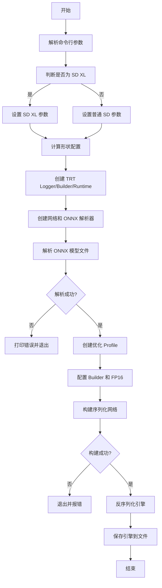
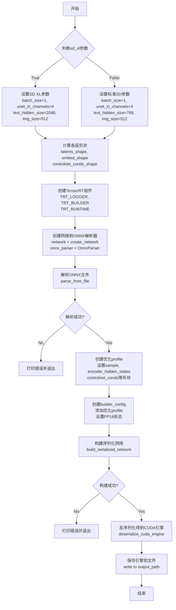
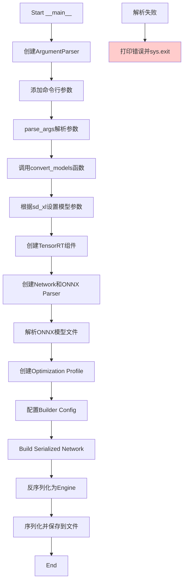

# `diffusers\scripts\convert_stable_diffusion_controlnet_to_tensorrt.py` 详细设计文档

该脚本用于将 Stable Diffusion ControlNet 的 ONNX 模型转换为 TensorRT 引擎格式，支持 SD XL 和普通 SD 模型，可选 FP16 加速，以提升推理性能。

## 整体流程



## 类结构

```
无类定义（纯函数式脚本）
convert_models (主转换函数)
└── __main__ (入口函数)
```

## 全局变量及字段


### `batch_size`
    
批处理大小，固定为1，用于SD模型推理

类型：`int`
    


### `unet_in_channels`
    
UNet输入通道数，SD和SDXL均为4

类型：`int`
    


### `unet_sample_size`
    
UNet样本大小，决定潜在空间的分辨率

类型：`int`
    


### `num_tokens`
    
文本token数量，固定为77对应CLIP最大序列长度

类型：`int`
    


### `text_hidden_size`
    
文本嵌入隐藏层大小，SD为768，SDXL为2048

类型：`int`
    


### `img_size`
    
输入图像尺寸，固定为512像素

类型：`int`
    


### `latents_shape`
    
潜在变量形状，包含批次、通道和空间维度信息

类型：`tuple`
    


### `embed_shape`
    
文本嵌入形状，定义了encoder_hidden_states的维度

类型：`tuple`
    


### `controlnet_conds_shape`
    
ControlNet条件输入形状，包含多个条件图像

类型：`tuple`
    


### `text_embeds_shape`
    
SDXL文本嵌入形状，用于SDXL pipeline的文本嵌入输入

类型：`tuple`
    


### `time_ids_shape`
    
SDXL时间ID形状，用于SDXL pipeline的时间步信息

类型：`tuple`
    


### `TRT_LOGGER`
    
TensorRT日志记录器，用于输出引擎构建过程中的日志信息

类型：`trt.Logger`
    


### `TRT_BUILDER`
    
TensorRT构建器，用于创建网络和优化配置文件

类型：`trt.Builder`
    


### `TRT_RUNTIME`
    
TensorRT运行时，用于反序列化CUDA引擎进行推理

类型：`trt.Runtime`
    


### `network`
    
TensorRT网络定义对象，包含模型结构和层信息

类型：`trt.INetworkDefinition`
    


### `onnx_parser`
    
ONNX解析器，用于从ONNX文件解析网络结构

类型：`trt.OnnxParser`
    


### `parse_success`
    
ONNX模型解析是否成功的标志

类型：`bool`
    


### `profile`
    
TensorRT优化配置文件，用于设置输入张量的动态形状范围

类型：`trt.IOptimizationProfile`
    


### `config`
    
TensorRT构建器配置，包含优化选项和构建标志

类型：`trt.IBuilderConfig`
    


### `plan`
    
序列化的TensorRT网络plan，包含优化的网络权重和结构

类型：`bytes`
    


### `engine`
    
TensorRT CUDA引擎，用于执行推理计算

类型：`trt.ICudaEngine`
    


    

## 全局函数及方法


### `convert_models`

该函数用于将Stable Diffusion ControlNet管道中的ONNX模型转换为TensorRT引擎格式，支持标准SD和SD XL模型，并可通过FP16精度优化提升推理性能。

参数：

- `onnx_path`：`str`，ONNX模型文件的路径
- `num_controlnet`：`int`，ControlNet模型的数量，用于确定条件输入的形状
- `output_path`：`str`，转换后TensorRT引擎文件的输出路径
- `fp16`：`bool`，可选参数，默认为`False`，是否使用FP16半精度模式
- `sd_xl`：`bool`，可选参数，默认为`False`，是否为SD XL模型

返回值：`None`，函数通过将TensorRT引擎序列化写入到`output_path`指定的文件路径完成转换

#### 流程图



#### 带注释源码

```python
def convert_models(onnx_path: str, num_controlnet: int, output_path: str, fp16: bool = False, sd_xl: bool = False):
    """
    Function to convert models in stable diffusion controlnet pipeline into TensorRT format

    Example:
    python convert_stable_diffusion_controlnet_to_tensorrt.py
    --onnx_path path-to-models-stable_diffusion/RevAnimated-v1-2-2/unet/model.onnx
    --output_path path-to-models-stable_diffusion/RevAnimated-v1-2-2/unet/model.engine
    --fp16
    --num_controlnet 2

    Example for SD XL:
    python convert_stable_diffusion_controlnet_to_tensorrt.py
    --onnx_path path-to-models-stable_diffusion/stable-diffusion-xl-base-1.0/unet/model.onnx
    --output_path path-to-models-stable_diffusion/stable-diffusion-xl-base-1.0/unet/model.engine
    --fp16
    --num_controlnet 1
    --sd_xl

    Returns:
        unet/model.engine

        run test script in diffusers/examples/community
        python test_onnx_controlnet.py
        --sd_model danbrown/RevAnimated-v1-2-2
        --onnx_model_dir path-to-models-stable_diffusion/RevAnimated-v1-2-2
        --unet_engine_path path-to-models-stable_diffusion/stable-diffusion-xl-base-1.0/unet/model.engine
        --qr_img_path path-to-qr-code-image
    """
    # 根据是否为SD XL模型设置对应的batch参数和隐藏层维度
    if sd_xl:
        batch_size = 1
        unet_in_channels = 4
        unet_sample_size = 64
        num_tokens = 77
        text_hidden_size = 2048  # SD XL使用更大的文本嵌入维度
        img_size = 512

        text_embeds_shape = (2 * batch_size, 1280)  # SD XL的文本嵌入形状
        time_ids_shape = (2 * batch_size, 6)  # SD XL的时间ID形状
    else:
        batch_size = 1
        unet_in_channels = 4
        unet_sample_size = 64
        num_tokens = 77
        text_hidden_size = 768  # 标准SD的文本嵌入维度
        img_size = 512
        batch_size = 1

    # 计算latent空间、embedding和控制net条件的形状
    latents_shape = (2 * batch_size, unet_in_channels, unet_sample_size, unet_sample_size)
    embed_shape = (2 * batch_size, num_tokens, text_hidden_size)
    controlnet_conds_shape = (num_controlnet, 2 * batch_size, 3, img_size, img_size)

    # 初始化TensorRT日志记录器（VERBOSE级别以获取详细日志）
    TRT_LOGGER = trt.Logger(trt.Logger.VERBOSE)
    # 创建TensorRT Builder用于构建引擎
    TRT_BUILDER = trt.Builder(TRT_LOGGER)
    # 创建TensorRT Runtime用于反序列化引擎
    TRT_RUNTIME = trt.Runtime(TRT_LOGGER)

    # 创建网络定义，EXPLICIT_BATCH标志表示使用显式batch维度
    network = TRT_BUILDER.create_network(1 << int(trt.NetworkDefinitionCreationFlag.EXPLICIT_BATCH))
    # 创建ONNX解析器用于解析ONNX模型
    onnx_parser = trt.OnnxParser(network, TRT_LOGGER)

    # 从文件解析ONNX模型
    parse_success = onnx_parser.parse_from_file(onnx_path)
    # 打印所有解析错误
    for idx in range(onnx_parser.num_errors):
        print(onnx_parser.get_error(idx))
    # 解析失败则退出程序
    if not parse_success:
        sys.exit("ONNX model parsing failed")
    print("Load Onnx model done")

    # 创建优化profile，用于指定动态输入尺寸的最小/最优/最大值
    profile = TRT_BUILDER.create_optimization_profile()

    # 设置各输入张量的形状（min/opt/max都使用相同形状）
    profile.set_shape("sample", latents_shape, latents_shape, latents_shape)
    profile.set_shape("encoder_hidden_states", embed_shape, embed_shape, embed_shape)
    profile.set_shape("controlnet_conds", controlnet_conds_shape, controlnet_conds_shape, controlnet_conds_shape)
    # SD XL模型额外需要text_embeds和time_ids输入
    if sd_xl:
        profile.set_shape("text_embeds", text_embeds_shape, text_embeds_shape, text_embeds_shape)
        profile.set_shape("time_ids", time_ids_shape, time_ids_shape, time_ids_shape)

    # 创建builder配置
    config = TRT_BUILDER.create_builder_config()
    # 添加优化profile
    config.add_optimization_profile(profile)
    # 禁用外部tactic sources以确保兼容性
    config.set_preview_feature(trt.PreviewFeature.DISABLE_EXTERNAL_TACTIC_SOURCES_FOR_CORE_0805, True)
    # 如果启用FP16模式
    if fp16:
        config.set_flag(trt.BuilderFlag.FP16)

    # 构建序列化网络（引擎）
    plan = TRT_BUILDER.build_serialized_network(network, config)
    if plan is None:
        sys.exit("Failed building engine")
    print("Succeeded building engine")

    # 反序列化CUDA引擎
    engine = TRT_RUNTIME.deserialize_cuda_engine(plan)

    # 将TensorRT引擎序列化保存到文件
    with open(output_path, "wb") as f:
        f.write(engine.serialize())
```


### `__main__`

程序主入口点，负责解析命令行参数并调用模型转换函数，将ONNX模型转换为TensorRT引擎格式。

参数：

- 无直接参数（通过`argparse`解析以下命令行参数）：
  - `--onnx_path`：`str`，ONNX模型文件路径
  - `--num_controlnet`：`int`，ControlNet模型数量
  - `--output_path`：`str`，输出TensorRT引擎文件路径
  - `--fp16`：`bool`，是否使用FP16精度（默认False）
  - `--sd_xl`：`bool`，是否使用SD XL pipeline（默认False）

返回值：`None`，程序无返回值，通过`sys.exit()`处理错误情况

#### 流程图



#### 带注释源码

```python
if __name__ == "__main__":
    # 创建命令行参数解析器
    parser = argparse.ArgumentParser()

    # 添加SD XL模式参数（可选标志）
    parser.add_argument("--sd_xl", action="store_true", default=False, help="SD XL pipeline")

    # 添加ONNX模型路径参数（必需）
    parser.add_argument(
        "--onnx_path",
        type=str,
        required=True,
        help="Path to the onnx checkpoint to convert",
    )

    # 添加ControlNet数量参数
    parser.add_argument("--num_controlnet", type=int)

    # 添加输出路径参数（必需）
    parser.add_argument("--output_path", type=str, required=True, help="Path to the output model.")

    # 添加FP16精度参数（可选标志）
    parser.add_argument("--fp16", action="store_true", default=False, help="Export the models in `float16` mode")

    # 解析命令行参数
    args = parser.parse_args()

    # 调用模型转换函数，传入解析后的参数
    # 参数顺序：onnx_path, num_controlnet, output_path, fp16, sd_xl
    convert_models(args.onnx_path, args.num_controlnet, args.output_path, args.fp16, args.sd_xl)
```

#### 关键设计说明

| 项目 | 说明 |
|------|------|
| **设计目标** | 将Stable Diffusion ControlNet的ONNX模型转换为TensorRT引擎，以提升推理性能 |
| **参数校验** | 使用`argparse`的`required=True`确保必需参数存在 |
| **错误处理** | 通过`sys.exit()`在ONNX解析失败或引擎构建失败时退出程序 |
| **外部依赖** | 依赖`tensorrt`、`argparse`、`sys`库 |
| **配置灵活性** | 支持SD 1.5和SD XL两种模式，通过`--sd_xl`标志切换 |

## 关键组件


### TensorRT引擎转换核心模块

负责将ONNX格式的UNet模型转换为TensorRT引擎文件，是整个脚本的核心功能模块，包含模型解析、形状配置、引擎构建和序列化保存的完整流程。

### SD XL模型参数配置模块

针对Stable Diffusion XL模型的特殊参数配置模块，包括batch_size=1、unet_in_channels=4、text_hidden_size=2048、text_embeds_shape和time_ids_shape等SD XL特有的维度信息。

### ControlNet条件输入处理模块

处理ControlNet条件输入的形状配置，支持多个ControlNet的场景，配置controlnet_conds的形状为(num_controlnet, 2*batch_size, 3, img_size, img_size)。

### FP16量化策略模块

实现可选的FP16精度转换功能，通过config.set_flag(trt.BuilderFlag.FP16)启用半精度模式以提升推理性能并减少内存占用。

### 形状配置与优化Profile模块

创建TensorRT优化配置文件，设置sample、encoder_hidden_states、controlnet_conds等输入张量的形状范围，用于引擎的优化和兼容性保障。

### ONNX模型解析模块

使用TensorRT的OnnxParser解析ONNX模型文件，包含错误处理机制和解析成功状态验证，确保模型格式正确可转换。

### 命令行参数解析模块

使用argparse处理用户输入参数，包括onnx_path、output_path、num_controlnet、fp16和sd_xl等关键转换参数。


## 问题及建议


### 已知问题

- 缺少 `num_controlnet` 参数的验证，该参数在脚本中是必需的但没有默认值，且没有在代码中检查其有效性
- 代码没有检查 ONNX 文件是否存在就直接尝试解析，可能导致难以追踪的错误
- 缺少对输出路径目录的检查，如果目标目录不存在会导致文件写入失败
- 存在重复赋值 `batch_size = 1`（第46行和第47行），这是冗余代码
- TensorRT 对象（network、config、builder 等）没有进行资源释放，可能导致内存泄漏
- 反序列化引擎后没有检查 `engine` 是否为 None 就直接尝试序列化，可能导致运行时错误
- 仅使用 `print` 语句进行输出，没有使用正式的日志框架，不利于生产环境的问题排查
- 构建引擎过程是长时间运行的操作，但没有任何进度提示
- 硬编码的形状配置不支持动态批处理优化，只能处理固定形状的输入

### 优化建议

- 为 `num_controlnet` 添加参数校验，确保其值合法（大于0）
- 在解析 ONNX 文件前检查文件是否存在，添加文件路径验证逻辑
- 使用 `os.makedirs` 或 `pathlib` 确保输出目录存在
- 移除重复的 `batch_size = 1` 赋值语句
- 使用 TensorRT 的 `torch.cuda.Stream` 或上下文管理器确保资源正确释放
- 添加 `try-except` 块捕获 TensorRT 异常，提供更友好的错误信息
- 将日志输出替换为 `logging` 模块，支持不同日志级别配置
- 为构建过程添加进度回调或进度条显示
- 将硬编码的形状值提取为函数参数，支持动态范围配置以实现更优的推理性能
- 考虑添加 INT8 量化支持和自定义工作区大小配置选项

## 其它


### 设计目标与约束

本工具旨在将Stable Diffusion ControlNet的ONNX模型转换为TensorRT引擎，以实现推理加速。核心约束包括：1) 仅支持ONNX格式的输入模型；2) 针对ControlNet pipeline优化，需指定num_controlnet数量；3) 支持FP16半精度加速；4) 区分SD 1.x和SD XL两种模型架构，两者具有不同的输入维度配置；5) 输出为序列化的TensorRT引擎文件（.engine）。

### 错误处理与异常设计

代码采用以下错误处理机制：1) ONNX解析失败时通过`sys.exit("ONNX model parsing failed")`终止程序并打印所有解析错误；2) TensorRT引擎构建失败时通过`sys.exit("Failed building engine")`终止；3) 缺少必需参数（onnx_path、output_path、num_controlnet）时argparse会自动报错并提示用法；4) 文件写入失败时Python会抛出IOError异常由上层处理。

### 数据流与状态机

数据流如下：1) 读取ONNX模型文件 → 2) 解析为TensorRT network → 3) 创建优化配置（设置输入shape profile）→ 4) 配置构建选项（FP16等）→ 5) 构建序列化engine → 6) 反序列化验证 → 7) 写入文件。无复杂状态机，为线性转换流程。

### 外部依赖与接口契约

核心依赖：1) tensorrt（需与CUDA版本匹配）；2) argparse（Python标准库）；3) sys（Python标准库）。接口契约：输入为ONNX模型文件路径，输出为TensorRT引擎文件，函数签名为`convert_models(onnx_path: str, num_controlnet: int, output_path: str, fp16: bool = False, sd_xl: bool = False)`。

### 性能考虑与优化建议

当前实现使用固定shape（latents_shape、embed_shape等），建议：1) 添加动态shape支持以适应不同batch_size；2) 添加INT8量化选项进一步压缩模型；3) 添加workspace size配置以支持更大模型；4) 考虑添加多GPU支持；5) 当前为串行构建，可添加缓存机制避免重复编译。

### 安全考虑

当前代码安全风险较低，但建议：1) 对output_path进行路径合法性检查，防止目录遍历攻击；2) 对onnx_path进行文件存在性和权限检查；3) 添加模型大小限制防止内存溢出；4) 考虑添加签名验证确保模型来源可信。

### 兼容性考虑

版本兼容性要求：1) TensorRT 8.x以上版本；2) Python 3.8+；3) CUDA 11.x或12.x（与TensorRT版本匹配）。SD 1.x与SD XL模型结构不兼容，需要通过sd_xl参数区分处理。

### 使用示例和调用方式

命令行调用：`python convert_stable_diffusion_controlnet_to_tensorrt.py --onnx_path <path> --output_path <path> --num_controlnet <n> [--fp16] [--sd_xl]`。Python模块调用：`convert_models("model.onnx", 2, "model.engine", fp16=True, sd_xl=False)`。

### 已知问题和限制

1) num_controlnet参数在argparse中未设置required=True，可能导致未指定时出错；2) 缺少对ONNX模型输入输出的验证；3) 未处理模型转换过程中的内存管理，大模型可能导致OOM；4) 未提供转换进度反馈；5) 未支持从Python对象直接转换，仅支持文件输入。


    