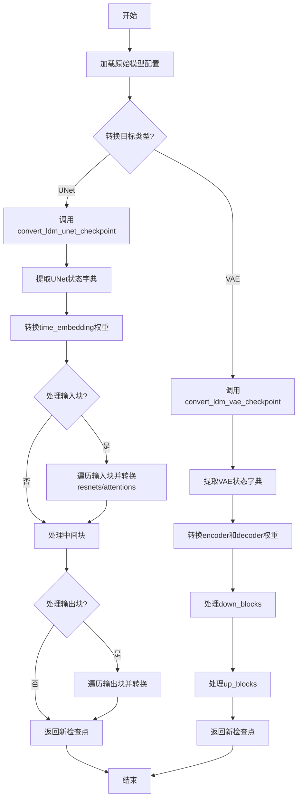
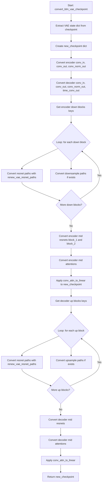

```mermaid
flowchart TD
    A[开始转换] --> B{skip_extract_state_dict?}
    B -->|Yes| C[直接使用checkpoint作为unet_state_dict]
    B -->|No| D{EMA权重判断}
    D -->|EMA权重>100| E[提取EMA权重]
    D -->|EMA权重≤100| F[提取普通权重]
    E --> G[记录日志警告]
    F --> H[记录日志警告]
    G --> I[创建new_checkpoint字典]
    H --> I
    I --> J[转换time_embedding层]
    J --> K{class_embed_type?}
    K -->|None| L[跳过类别嵌入]
    K -->|timestep| M[转换class_embedding层]
    K -->|projection| M
    K -->|Other| N[抛出NotImplementedError]
    M --> O[转换add_embedding层]
    L --> O
    O --> P[转换conv_in和conv_out层]
    P --> Q[提取input_blocks键]
    Q --> R[提取middle_blocks键]
    R --> S[提取output_blocks键]
    S --> T{遍历input_blocks i=1到num_input_blocks-1}
    T --> U[计算block_id和layer_in_block_id]
    U --> V[分离spatial_resnets和temporal_resnets]
    V --> W[分离attentions]
    W --> X{存在downsampler?}
    X -->|Yes| Y[转换downsampler权重]
    X -->|No| Z[继续]
    Y --> AA[调用renew_resnet_paths转换resnet路径]
    AA --> AB[调用assign_to_checkpoint分配权重]
    AB --> AC{存在attentions?}
    AC -->|Yes| AD[转换attention路径]
    AC -->|No| AE[处理middle_blocks]
    AD --> AE
    T --> AE
    
    AE --> AF[处理middle_block三个部分]
    AF --> AG[resnet_0的spatial和temporal转换]
    AG --> AH[attentions转换]
    AH --> AI[resnet_1的spatial和temporal转换]
    AI --> AJ{遍历output_blocks i=0到num_output_blocks-1}
    
    AJ --> AK[计算block_id和layer_in_block_id]
    AK --> AL{output_block_list长度>1?}
    AL -->|Yes| AM[处理多层次output_block]
    AL -->|No| AN[处理单层次output_block]
    AM --> AO[分离spatial和temporal resnets]
    AO --> AP[分离attentions]
    AP --> AQ{存在upsampler?}
    AQ -->|Yes| AR[转换upsampler权重]
    AQ -->|No| AS[继续]
    AR --> AT[分配权重到checkpoint]
    AS --> AT
    AT --> AU[返回new_checkpoint]
    
    AN --> AV[转换spatial_layers路径]
    AV --> AW[转换temporal_layers路径]
    AW --> AX[返回new_checkpoint]
    
    AE --> AU
    AJ --> AU
    AU --> AV
```

# `diffusers\scripts\convert_svd_to_diffusers.py` 详细设计文档

该代码是一个模型权重转换工具集，主要用于将LDM（Latent Diffusion Models）格式的预训练检查点转换为Diffusers库兼容的格式。它包含了UNet和VAE模型的权重提取、重命名和重新映射逻辑，支持时空注意力机制和ResNet块的转换，并提供了多种配置选项来处理不同的模型变体。

## 整体流程



## 类结构

```
无类层次结构
└── 全局函数集合
    ├── 配置创建函数
    │   └── create_unet_diffusers_config
    ├── 路径重命名函数
    │   ├── renew_attention_paths
    │   ├── renew_resnet_paths
    │   ├── shave_segments
    │   ├── renew_vae_resnet_paths
    │   └── renew_vae_attention_paths
    ├── 核心转换函数
    │   ├── assign_to_checkpoint
    │   ├── convert_ldm_unet_checkpoint
    │   ├── convert_ldm_vae_checkpoint
    │   └── conv_attn_to_linear
    └── 工具函数
        └── logger (全局日志实例)
```

## 全局变量及字段


### `logger`
    
用于记录转换过程中的警告和信息日志

类型：`Logger`
    


    

## 全局函数及方法


### `create_unet_diffusers_config`

该函数用于将LDM（Latent Diffusion Models）模型的原始配置文件转换为Diffusers库所需的UNet配置格式，支持普通UNet和ControlNet两种模式。

参数：

- `original_config`：`Any`，原始LDM模型的配置对象，包含模型参数结构
- `image_size`：`int`，输入图像的尺寸
- `controlnet`：`bool`，可选参数（默认为False），标志位，指示是否为ControlNet模型生成配置

返回值：`dict`，返回包含Diffusers格式UNet配置的字典，包括样本尺寸、输入输出通道、下采样/上采样块类型、注意力维度等关键配置项。

#### 流程图

```mermaid
flowchart TD
    A[开始: create_unet_diffusers_config] --> B{controlnet == True?}
    B -->|Yes| C[从original_config.model.params.control_stage_config获取unet_params]
    B -->|No| D{original_config.model.params存在unet_config?}
    D -->|Yes| E[从unet_config获取unet_params]
    D -->|No| F[从network_config获取unet_params]
    C --> G[从first_stage_config获取vae_params]
    E --> G
    F --> G
    
    G --> H[计算block_out_channels: model_channels * channel_mult]
    H --> I[遍历block_out_channels构建down_block_types]
    I --> J[根据attention_resolutions判断使用CrossAttn还是普通DownBlock]
    J --> K[构建up_block_types列表]
    
    K --> L{transformer_depth是否为空?}
    L -->|No| M[设置transformer_layers_per_block]
    L -->|Yes| N[设置默认值为1]
    
    M --> O[计算vae_scale_factor: 2^(len(ch_mult)-1)]
    O --> P[获取head_dim和use_linear_projection参数]
    P --> Q[初始化class_embed_type等配置项]
    
    Q --> R{context_dim是否存在?]
    R -->|Yes| S[设置context_dim]
    R -->|No| T[保持为None]
    
    T --> U{num_classes是否存在?}
    U -->|Yes| V{num_classes == 'sequential'?}
    U -->|No| W[继续后续处理]
    V -->|Yes| X[设置addition_time_embed_dim和projection_class_embeddings_input_dim]
    V -->|No| W
    
    X --> Y[构建基础config字典]
    W --> Y
    
    Y --> Z{disable_self_attentions存在?}
    Z -->|Yes| AA[添加only_cross_attention到config]
    Z -->|No| AB
    
    AA --> AC{num_classes是整数?}
    AB --> AC
    
    AC -->|Yes| AD[添加num_class_embeds到config]
    AC -->|No| AE
    
    AE --> AF{controlnet == True?}
    AF -->|Yes| AG[添加conditioning_channels到config]
    AF -->|No| AH[添加out_channels和up_block_types到config]
    
    AG --> AI[返回config字典]
    AH --> AI
    AD --> AI
```

#### 带注释源码

```python
def create_unet_diffusers_config(original_config, image_size: int, controlnet=False):
    """
    Creates a config for the diffusers based on the config of the LDM model.
    """
    # 根据controlnet标志位从原始配置中获取UNet参数
    # 如果是ControlNet模式，从control_stage_config获取
    # 否则从unet_config或network_config获取
    if controlnet:
        unet_params = original_config.model.params.control_stage_config.params
    else:
        if "unet_config" in original_config.model.params and original_config.model.params.unet_config is not None:
            unet_params = original_config.model.params.unet_config.params
        else:
            unet_params = original_config.model.params.network_config.params

    # 从原始配置中获取VAE参数，用于计算缩放因子
    vae_params = original_config.model.params.first_stage_config.params.encoder_config.params

    # 计算输出通道数列表：基础通道数乘以各级的通道乘数
    block_out_channels = [unet_params.model_channels * mult for mult in unet_params.channel_mult]

    # 初始化下采样块类型列表
    down_block_types = []
    resolution = 1
    # 遍历每个分辨率层级，确定使用的块类型
    for i in range(len(block_out_channels)):
        # 如果当前分辨率在注意力分辨率集合中，使用带跨注意力 temporal 版本
        block_type = (
            "CrossAttnDownBlockSpatioTemporal"
            if resolution in unet_params.attention_resolutions
            else "DownBlockSpatioTemporal"
        )
        down_block_types.append(block_type)
        # 更新分辨率（除了最后一层外，每层分辨率翻倍）
        if i != len(block_out_channels) - 1:
            resolution *= 2

    # 初始化上采样块类型列表，从最高分辨率开始
    up_block_types = []
    for i in range(len(block_out_channels)):
        block_type = (
            "CrossAttnUpBlockSpatioTemporal"
            if resolution in unet_params.attention_resolutions
            else "UpBlockSpatioTemporal"
        )
        up_block_types.append(block_type)
        resolution //= 2

    # 处理transformer深度参数
    # 如果transformer_depth是整数，直接使用；如果是列表，保持原样
    if unet_params.transformer_depth is not None:
        transformer_layers_per_block = (
            unet_params.transformer_depth
            if isinstance(unet_params.transformer_depth, int)
            else list(unet_params.transformer_depth)
        )
    else:
        # 默认值为1
        transformer_layers_per_block = 1

    # 计算VAE缩放因子：2的(通道乘数长度-1)次方
    vae_scale_factor = 2 ** (len(vae_params.ch_mult) - 1)

    # 获取注意力头维度
    head_dim = unet_params.num_heads if "num_heads" in unet_params else None
    # 检查是否使用线性投影
    use_linear_projection = (
        unet_params.use_linear_in_transformer if "use_linear_in_transformer" in unet_params else False
    )
    # 如果使用线性投影且head_dim为空，根据通道乘数计算head_dim列表
    if use_linear_projection:
        # stable diffusion 2-base-512 and 2-768
        if head_dim is None:
            head_dim_mult = unet_params.model_channels // unet_params.num_head_channels
            head_dim = [head_dim_mult * c for c in list(unet_params.channel_mult)]

    # 初始化类别嵌入相关配置（默认为None）
    class_embed_type = None
    addition_embed_type = None
    addition_time_embed_dim = None
    projection_class_embeddings_input_dim = None
    context_dim = None

    # 处理上下文维度参数
    if unet_params.context_dim is not None:
        context_dim = (
            unet_params.context_dim if isinstance(unet_params.context_dim, int) else unet_params.context_dim[0]
        )

    # 处理类别数量参数
    if "num_classes" in unet_params:
        # 如果是顺序类别嵌入模式
        if unet_params.num_classes == "sequential":
            addition_time_embed_dim = 256
            assert "adm_in_channels" in unet_params
            projection_class_embeddings_input_dim = unet_params.adm_in_channels

    # 构建基础配置字典，包含Diffusers格式UNet的核心参数
    config = {
        "sample_size": image_size // vae_scale_factor,  # 调整后的样本尺寸
        "in_channels": unet_params.in_channels,          # 输入通道数
        "down_block_types": tuple(down_block_types),     # 下采样块类型元组
        "block_out_channels": tuple(block_out_channels), # 输出通道数元组
        "layers_per_block": unet_params.num_res_blocks,   # 每块残差层数
        "cross_attention_dim": context_dim,               # 跨注意力维度
        "attention_head_dim": head_dim,                  # 注意力头维度
        "use_linear_projection": use_linear_projection,  # 是否使用线性投影
        "class_embed_type": class_embed_type,            # 类别嵌入类型
        "addition_embed_type": addition_embed_type,     # 额外嵌入类型
        "addition_time_embed_dim": addition_time_embed_dim, # 时间嵌入维度
        "projection_class_embeddings_input_dim": projection_class_embeddings_input_dim, # 投影类别嵌入输入维度
        "transformer_layers_per_block": transformer_layers_per_block, # 每块transformer层数
    }

    # 如果配置中存在禁用自注意力的选项，添加到config中
    if "disable_self_attentions" in unet_params:
        config["only_cross_attention"] = unet_params.disable_self_attentions

    # 如果类别数量是整数而非字符串，添加到config中
    if "num_classes" in unet_params and isinstance(unet_params.num_classes, int):
        config["num_class_embeds"] = unet_params.num_classes

    # 根据是否为ControlNet添加特定配置
    if controlnet:
        config["conditioning_channels"] = unet_params.hint_channels
    else:
        config["out_channels"] = unet_params.out_channels
        config["up_block_types"] = tuple(up_block_types)

    # 返回构建好的配置字典
    return config
```


### `assign_to_checkpoint`

该函数执行从 LDM（Latent Diffusion Models）模型权重到 Diffusers 格式权重的最终转换步骤。它获取本地转换的权重，应用全局重命名规则（包括中间块的命名转换），拆分注意力层的权重（将 q、k、v 分离），并处理额外的替换规则，最终将转换后的权重分配到新的 checkpoint 字典中。

参数：

- `paths`：`List[Dict[str, str]]`，包含 'old' 和 'new' 键的字典列表，指定权重从旧命名到新命名的映射关系
- `checkpoint`：`Dict`，新的 checkpoint 字典，用于存储转换后的权重
- `old_checkpoint`：`Dict`，原始的 LDM checkpoint 字典，包含待转换的权重
- `attention_paths_to_split`：`Optional[Dict]`，可选参数，需要拆分的注意力层路径及其映射关系，用于将合并的注意力权重分离为 query、key、value 三个独立的权重
- `additional_replacements`：`Optional[List[Dict]]`，可选参数，额外的替换规则列表，每个替换规则包含 'old' 和 'new' 键
- `config`：`Optional[Dict]`，可选参数，包含模型配置的字典，用于获取 num_head_channels 等配置信息
- `mid_block_suffix`：`str`，可选参数，中间块的后缀字符串，用于区分 spatial_res_block 和 temporal_res_block

返回值：`None`（无返回值，函数通过修改 `checkpoint` 字典来输出结果）

#### 流程图

```mermaid
flowchart TD
    A[开始 assign_to_checkpoint] --> B{paths 是列表?}
    B -->|否| C[抛出 AssertionError]
    B -->|是| D{attention_paths_to_split 是否存在?}
    D -->|是| E[遍历 attention_paths_to_split]
    E --> F[从 old_checkpoint 获取旧张量]
    F --> G[计算通道数和 num_heads]
    G --> H[重塑张量并分离 query/key/value]
    H --> I[将分离的权重存入 checkpoint]
    D -->|否| J[处理 mid_block_suffix]
    J --> K[遍历 paths 列表]
    K --> L{新路径是否在 attention_paths_to_split 中?}
    L -->|是| M[跳过当前路径]
    L -->|否| N[进行全局重命名]
    N --> O[替换 middle_block.0 → mid_block.resnets.0 + suffix]
    O --> P[替换 middle_block.1 → mid_block.attentions.0]
    P --> Q[替换 middle_block.2 → mid_block.resnets.1 + suffix]
    Q --> R{是否有 additional_replacements?}
    R -->|是| S[应用额外替换规则]
    R -->|否| T{是否为注意力权重?}
    S --> T
    T -->|是且 shape 为 3 维| U[取 [:, :, 0] 转换]
    T -->|是且 shape 为 4 维| V[取 [:, :, 0, 0] 转换]
    T -->|否| W[直接赋值]
    U --> X[存入 checkpoint]
    V --> X
    W --> X
    X --> Y{继续遍历 paths?}
    Y -->|是| K
    Y -->|否| Z[结束]
    M --> Y
```

#### 带注释源码

```python
def assign_to_checkpoint(
    paths,
    checkpoint,
    old_checkpoint,
    attention_paths_to_split=None,
    additional_replacements=None,
    config=None,
    mid_block_suffix="",
):
    """
    This does the final conversion step: take locally converted weights and apply a global renaming to them. It splits
    attention layers, and takes into account additional replacements that may arise.

    Assigns the weights to the new checkpoint.
    """
    # 断言确保 paths 是包含 'old' 和 'new' 键的字典列表
    assert isinstance(paths, list), "Paths should be a list of dicts containing 'old' and 'new' keys."

    # 如果存在需要拆分的注意力层路径，则进行拆分处理
    if attention_paths_to_split is not None:
        # 遍历每个需要拆分的注意力层
        for path, path_map in attention_paths_to_split.items():
            # 从旧 checkpoint 中获取该路径对应的张量
            old_tensor = old_checkpoint[path]
            # 计算通道数（原张量通道数的 1/3，因为要分离成 q、k、v）
            channels = old_tensor.shape[0] // 3

            # 确定目标形状，用于后续 reshape 操作
            target_shape = (-1, channels) if len(old_tensor.shape) == 3 else (-1)

            # 计算 num_heads 数量
            num_heads = old_tensor.shape[0] // config["num_head_channels"] // 3

            # 重塑张量以便分离：将 (num_heads, 3*channels//num_heads, ...) 的形状拆分
            old_tensor = old_tensor.reshape((num_heads, 3 * channels // num_heads) + old_tensor.shape[1:])
            # 使用 split 方法将张量沿 dim=1 分割成 query、key、value 三个部分
            query, key, value = old_tensor.split(channels // num_heads, dim=1)

            # 将分离后的 query、key、value 重新 reshape 并存入新 checkpoint
            checkpoint[path_map["query"]] = query.reshape(target_shape)
            checkpoint[path_map["key"]] = key.reshape(target_shape)
            checkpoint[path_map["value"]] = value.reshape(target_shape)

    # 处理中间块后缀：如果为 None 则设为空字符串，否则添加点号前缀
    if mid_block_suffix is not None:
        mid_block_suffix = f".{mid_block_suffix}"
    else:
        mid_block_suffix = ""

    # 遍历每个路径映射，进行全局重命名
    for path in paths:
        new_path = path["new"]

        # 如果该路径已经在 attention_paths_to_split 中处理过，则跳过
        if attention_paths_to_split is not None and new_path in attention_paths_to_split:
            continue

        # 全局重命名：将旧命名转换为新命名
        # middle_block.0 转换为 mid_block.resnets.0 + 后缀
        new_path = new_path.replace("middle_block.0", f"mid_block.resnets.0{mid_block_suffix}")
        # middle_block.1 转换为 mid_block.attentions.0
        new_path = new_path.replace("middle_block.1", "mid_block.attentions.0")
        # middle_block.2 转换为 mid_block.resnets.1 + 后缀
        new_path = new_path.replace("middle_block.2", f"mid_block.resnets.1{mid_block_suffix}")

        # 如果存在额外的替换规则，则逐一应用
        if additional_replacements is not None:
            for replacement in additional_replacements:
                new_path = new_path.replace(replacement["old"], replacement["new"])

        # 调试打印语句（应该被移除的技术债务）
        if new_path == "mid_block.resnets.0.spatial_res_block.norm1.weight":
            print("yeyy")

        # 判断是否为注意力权重：包含 proj_attn.weight 或 attentions + to_
        is_attn_weight = "proj_attn.weight" in new_path or ("attentions" in new_path and "to_" in new_path)
        # 获取对应旧权重的形状
        shape = old_checkpoint[path["old"]].shape
        
        # 如果是注意力权重且为 3 维张量（1D 卷积），需要转换为线性层（取第一个切片）
        if is_attn_weight and len(shape) == 3:
            checkpoint[new_path] = old_checkpoint[path["old"]][:, :, 0]
        # 如果是注意力权重且为 4 维张量（2D 卷积），同样取第一个切片
        elif is_attn_weight and len(shape) == 4:
            checkpoint[new_path] = old_checkpoint[path["old"]][:, :, 0, 0]
        # 否则直接复制权重到新 checkpoint
        else:
            checkpoint[new_path] = old_checkpoint[path["old"]]
```


### `renew_attention_paths`

该函数用于将注意力层（attention layers）中的路径从旧的命名方案更新为新的命名方案（本地重命名），主要包括将 `time_stack` 替换为 `temporal_transformer_blocks`，以及更新 `time_pos_embed` 的索引名称。

参数：

- `old_list`：`List[str]`，包含旧注意力层路径的列表
- `n_shave_prefix_segments`：`int` = 0，用于指定要移除的前缀段数（当前函数中未使用，保留用于未来扩展）

返回值：`List[Dict[str, str]]`，返回映射列表，其中每个元素为包含 `old`（旧路径）和 `new`（新路径）的字典

#### 流程图

```mermaid
flowchart TD
    A[开始] --> B[初始化空映射列表 mapping]
    B --> C{遍历 old_list 中的每个 old_item}
    C -->|是| D[复制 old_item 为 new_item]
    D --> E{替换 'time_stack' -> 'temporal_transformer_blocks'}
    E --> F{替换 'time_pos_embed.0.bias' -> 'time_pos_embed.linear_1.bias'}
    F --> G{替换 'time_pos_embed.0.weight' -> 'time_pos_embed.linear_1.weight'}
    G --> H{替换 'time_pos_embed.2.bias' -> 'time_pos_embed.linear_2.bias'}
    H --> I{替换 'time_pos_embed.2.weight' -> 'time_pos_embed.linear_2.weight'}
    I --> J[将 {'old': old_item, 'new': new_item} 添加到 mapping]
    J --> C
    C -->|否| K[返回 mapping]
    K --> L[结束]
```

#### 带注释源码

```python
def renew_attention_paths(old_list, n_shave_prefix_segments=0):
    """
    Updates paths inside attentions to the new naming scheme (local renaming)
    
    参数:
        old_list: 包含旧注意力层路径的列表
        n_shave_prefix_segments: 保留参数，当前未使用（可用于未来扩展的shave_segments调用）
    
    返回:
        映射列表，每个元素为 {'old': 旧路径, 'new': 新路径} 的字典
    """
    mapping = []
    for old_item in old_list:
        new_item = old_item

        # 以下替换已被注释，保留用于可能的未来用途
        # new_item = new_item.replace('norm.weight', 'group_norm.weight')
        # new_item = new_item.replace('norm.bias', 'group_norm.bias')
        # new_item = new_item.replace('proj_out.weight', 'proj_attn.weight')
        # new_item = new_item.replace('proj_out.bias', 'proj_attn.bias')
        # new_item = shave_segments(new_item, n_shave_prefix_segments=n_shave_prefix_segments)
        
        # 将 time_stack 替换为 temporal_transformer_blocks
        new_item = new_item.replace("time_stack", "temporal_transformer_blocks")

        # 更新 time_pos_embed 的索引名称（从 .0/.2 到 linear_1/linear_2）
        new_item = new_item.replace("time_pos_embed.0.bias", "time_pos_embed.linear_1.bias")
        new_item = new_item.replace("time_pos_embed.0.weight", "time_pos_embed.linear_1.weight")
        new_item = new_item.replace("time_pos_embed.2.bias", "time_pos_embed.linear_2.bias")
        new_item = new_item.replace("time_pos_embed.2.weight", "time_pos_embed.linear_2.weight")

        # 将旧路径和新路径的映射添加到结果列表
        mapping.append({"old": old_item, "new": new_item})

    return mapping
```


### `shave_segments`

该函数用于从路径字符串中移除指定数量的段（segment）。当 `n_shave_prefix_segments` 为正值时，移除路径开头的相应数量的段；当为负值时，移除路径末尾的相应数量的段。常在模型权重键名转换过程中，用于调整路径层级以适配新的命名规则。

参数：

- `path`：`str`，需要处理的路径字符串，通常为模型权重键名（如 "input_blocks.0.0.weight"）
- `n_shave_prefix_segments`：`int`，指定要移除的段数量，正值移除开头，负值移除末尾，默认为 1

返回值：`str`，处理后的路径字符串

#### 流程图

```mermaid
flowchart TD
    A[开始] --> B{判断 n_shave_prefix_segments >= 0?}
    B -- 是 --> C[使用 path.split('.')[n_shave_prefix_segments:] 切片]
    C --> D[用 '.'.join 重新组合路径]
    D --> F[返回结果]
    B -- 否 --> E[使用 path.split('.')[:n_shave_prefix_segments] 切片]
    E --> D
```

#### 带注释源码

```
def shave_segments(path, n_shave_prefix_segments=1):
    """
    Removes segments. Positive values shave the first segments, negative shave the last segments.
    """
    # 判断是否为正向去除（去除前缀段）
    if n_shave_prefix_segments >= 0:
        # 将路径按 '.' 分割后，从第 n_shave_prefix_segments 个元素开始取到最后
        # 例如：path = "a.b.c.d", n_shave_prefix_segments=1 -> ["b", "c", "d"]
        return ".".join(path.split(".")[n_shave_prefix_segments:])
    else:
        # 负值情况：去除末尾的段
        # 例如：path = "a.b.c.d", n_shave_prefix_segments=-1 -> ["a", "b", "c"]
        return ".".join(path.split(".")[:n_shave_prefix_segments])
```


### `renew_resnet_paths`

将旧的 ResNet 路径名称转换为新的命名方案（本地重命名），用于将 LDMs (Latent Diffusion Models) 的 UNet 权重键映射到 Diffusers 格式。

参数：

- `old_list`：`List[str]`，包含旧权重路径名称的列表
- `n_shave_prefix_segments`：`int`，要修剪的前缀段数，默认为 0

返回值：`List[Dict[str, str]]`，返回包含 "old" 和 "new" 键的字典列表，表示旧路径到新路径的映射关系

#### 流程图

```mermaid
flowchart TD
    A[开始] --> B[初始化空映射列表 mapping]
    --> C{遍历 old_list 中的每个 old_item}
    C -->|是| D[复制 old_item 为 new_item]
    D --> E[替换 in_layers.0 -> norm1]
    E --> F[替换 in_layers.2 -> conv1]
    F --> G[替换 out_layers.0 -> norm2]
    G --> H[替换 out_layers.3 -> conv2]
    H --> I[替换 emb_layers.1 -> time_emb_proj]
    I --> J[替换 skip_connection -> conv_shortcut]
    J --> K[替换 time_stack. -> 空字符串]
    K --> L[调用 shave_segments 修减前缀段]
    L --> M[将 {old, new} 添加到 mapping]
    M --> C
    C -->|否| N[返回 mapping]
    N --> O[结束]
```

#### 带注释源码

```
def renew_resnet_paths(old_list, n_shave_prefix_segments=0):
    """
    Updates paths inside resnets to the new naming scheme (local renaming)
    
    此函数将 LDM 格式的 ResNet 权重路径转换为 Diffusers 格式。
    主要处理以下转换：
    - in_layers.0 -> norm1 (输入层归一化)
    - in_layers.2 -> conv1 (输入层卷积)
    - out_layers.0 -> norm2 (输出层归一化)
    - out_layers.3 -> conv2 (输出层卷积)
    - emb_layers.1 -> time_emb_proj (时间嵌入投影)
    - skip_connection -> conv_shortcut (跳跃连接)
    - time_stack. -> 删除 (时间堆栈前缀)
    
    参数:
        old_list: 旧格式的权重路径列表
        n_shave_prefix_segments: 修剪的路径前缀段数
    
    返回:
        包含新旧路径映射的字典列表
    """
    mapping = []
    for old_item in old_list:
        new_item = old_item.replace("in_layers.0", "norm1")
        new_item = new_item.replace("in_layers.2", "conv1")

        new_item = new_item.replace("out_layers.0", "norm2")
        new_item = new_item.replace("out_layers.3", "conv2")

        new_item = new_item.replace("emb_layers.1", "time_emb_proj")
        new_item = new_item.replace("skip_connection", "conv_shortcut")

        new_item = new_item.replace("time_stack.", "")

        new_item = shave_segments(new_item, n_shave_prefix_segments=n_shave_prefix_segments)

        mapping.append({"old": old_item, "new": new_item})

    return mapping
```


### `convert_ldm_unet_checkpoint`

该函数是LDM UNet检查点转换为Diffusers格式的核心函数，负责将原始LDM（Latent Diffusion Models）模型的UNet权重和结构转换为Hugging Face Diffusers库所需的格式，支持EMA权重提取、ControlNet模式以及空间和时间transformer块的正确映射。

参数：

- `checkpoint`：`Dict`，原始LDM模型的完整检查点字典，包含模型权重和键值对
- `config`：`Dict`，包含UNet配置的字典，定义了模型的架构参数如层数、通道数、注意力维度等
- `path`：`Optional[str]`，可选参数，指定检查点的文件路径，用于日志输出
- `extract_ema`：`bool`，默认为False，是否从检查点中提取EMA（指数移动平均）权重而非普通权重
- `controlnet`：`bool`，默认为False，是否为ControlNet模型转换，检查点结构有所不同
- `skip_extract_state_dict`：`bool`，默认为False，是否跳过state_dict提取步骤，当checkpoint直接传入UNet状态字典时设为True

返回值：`Dict`，转换后的新检查点字典，键名为Diffusers格式的层名称，值为对应的权重张量

#### 流程图



#### 带注释源码

```python
def convert_ldm_unet_checkpoint(
    checkpoint, config, path=None, extract_ema=False, controlnet=False, skip_extract_state_dict=False
):
    """
    Takes a state dict and a config, and returns a converted checkpoint.
    将LDM UNet检查点转换为Diffusers格式
    """
    # 根据skip_extract_state_dict决定是否需要从checkpoint中提取UNet的state_dict
    if skip_extract_state_dict:
        # 如果已经传入了UNet的state_dict，直接使用
        unet_state_dict = checkpoint
    else:
        # 从完整的checkpoint中提取UNet相关的权重
        unet_state_dict = {}
        keys = list(checkpoint.keys())
        
        # UNet在LDM检查点中的前缀键名
        unet_key = "model.diffusion_model."
        
        # 统计以model_ema开头的键数量，如果超过100个则认为检查点包含EMA权重
        # at least a 100 parameters have to start with `model_ema` in order for the checkpoint to be EMA
        if sum(k.startswith("model_ema") for k in keys) > 100 and extract_ema:
            # 如果同时存在EMA和非EMA权重，给出警告
            logger.warning(f"Checkpoint {path} has both EMA and non-EMA weights.")
            logger.warning(
                "In this conversion only the EMA weights are extracted. If you want to instead extract the non-EMA"
                " weights (useful to continue fine-tuning), please make sure to remove the `--extract_ema` flag."
            )
            # 提取EMA权重：将model.diffusion_model.xxx替换为model_ema.xxx
            for key in keys:
                if key.startswith(unet_key):
                    flat_ema_key = "model_ema." + "".join(key.split(".")[1:])
                    unet_state_dict[key.replace(unet_key, "")] = checkpoint.pop(flat_ema_key)
        else:
            # 如果没有超过100个EMA键，或者不要求提取EMA，则提取普通权重
            if sum(k.startswith("model_ema") for k in keys) > 100:
                logger.warning(
                    "In this conversion only the non-EMA weights are extracted. If you want to instead extract the EMA"
                    " weights (usually better for inference), please make sure to add the `--extract_ema` flag."
                )
            
            # 遍历所有键，提取以model.diffusion_model.开头的键
            for key in keys:
                if key.startswith(unet_key):
                    unet_state_dict[key.replace(unet_key, "")] = checkpoint.pop(key)
    
    # 创建新的检查点字典用于存储转换后的权重
    new_checkpoint = {}
    
    # ============ 转换时间嵌入层 (Time Embedding) ============
    # LDM中使用time_embed.0和time_embed.2，Diffusers中使用time_embedding.linear_1和linear_2
    new_checkpoint["time_embedding.linear_1.weight"] = unet_state_dict["time_embed.0.weight"]
    new_checkpoint["time_embedding.linear_1.bias"] = unet_state_dict["time_embed.0.bias"]
    new_checkpoint["time_embedding.linear_2.weight"] = unet_state_dict["time_embed.2.weight"]
    new_checkpoint["time_embedding.linear_2.bias"] = unet_state_dict["time_embed.2.bias"]
    
    # ============ 转换类别嵌入层 (Class Embedding) ============
    # 根据config中的class_embed_type决定如何转换类别嵌入
    if config["class_embed_type"] is None:
        # No parameters to port，没有类别嵌入需要处理
        ...
    elif config["class_embed_type"] == "timestep" or config["class_embed_type"] == "projection":
        # 类别嵌入存储在labelEmb.0.0和labelEmb.0.2中
        new_checkpoint["class_embedding.linear_1.weight"] = unet_state_dict["label_emb.0.0.weight"]
        new_checkpoint["class_embedding.linear_1.bias"] = unet_state_dict["label_emb.0.0.bias"]
        new_checkpoint["class_embedding.linear_2.weight"] = unet_state_dict["label_emb.0.2.weight"]
        new_checkpoint["class_embedding.linear_2.bias"] = unet_state_dict["label_emb.0.2.bias"]
    else:
        raise NotImplementedError(f"Not implemented `class_embed_type`: {config['class_embed_type']}")
    
    # ============ 转换额外嵌入层 (Add Embedding) ============
    # 用于文本时间嵌入等额外条件
    # if config["addition_embed_type"] == "text_time":
    new_checkpoint["add_embedding.linear_1.weight"] = unet_state_dict["label_emb.0.0.weight"]
    new_checkpoint["add_embedding.linear_1.bias"] = unet_state_dict["label_emb.0.0.bias"]
    new_checkpoint["add_embedding.linear_2.weight"] = unet_state_dict["label_emb.0.2.weight"]
    new_checkpoint["add_embedding.linear_2.bias"] = unet_state_dict["label_emb.0.2.bias"]
    
    # ============ 转换输入和输出卷积层 ============
    # 输入卷积层：input_blocks.0.0 -> conv_in
    new_checkpoint["conv_in.weight"] = unet_state_dict["input_blocks.0.0.weight"]
    new_checkpoint["conv_in.bias"] = unet_state_dict["input_blocks.0.0.bias"]
    
    # 输出卷积层：out.0 -> conv_norm_out, out.2 -> conv_out
    new_checkpoint["conv_norm_out.weight"] = unet_state_dict["out.0.weight"]
    new_checkpoint["conv_norm_out.bias"] = unet_state_dict["out.0.bias"]
    new_checkpoint["conv_out.weight"] = unet_state_dict["out.2.weight"]
    new_checkpoint["conv_out.bias"] = unet_state_dict["out.2.bias"]
    
    # ============ 提取并分组各模块的键 ============
    # 检索input_blocks中的所有键，并按layer_id分组
    # Retrieves the keys for the input blocks only
    num_input_blocks = len({".".join(layer.split(".")[:2]) for layer in unet_state_dict if "input_blocks" in layer})
    input_blocks = {
        layer_id: [key for key in unet_state_dict if f"input_blocks.{layer_id}" in key]
        for layer_id in range(num_input_blocks)
    }
    
    # 检索middle_blocks中的所有键
    # Retrieves the keys for the middle blocks only
    num_middle_blocks = len({".".join(layer.split(".")[:2]) for layer in unet_state_dict if "middle_block" in layer})
    middle_blocks = {
        layer_id: [key for key in unet_state_dict if f"middle_block.{layer_id}" in key]
        for layer_id in range(num_middle_blocks)
    }
    
    # 检索output_blocks中的所有键
    # Retrieves the keys for the output blocks only
    num_output_blocks = len({".".join(layer.split(".")[:2]) for layer in unet_state_dict if "output_blocks" in layer})
    output_blocks = {
        layer_id: [key for key in unet_state_dict if f"output_blocks.{layer_id}" in key]
        for layer_id in range(num_output_blocks)
    }
    
    # ============ 处理输入块 (Input Blocks) ============
    # 遍历输入块，从索引1开始（索引0是conv_in，已处理）
    for i in range(1, num_input_blocks):
        # 计算在down_block中的位置
        block_id = (i - 1) // (config["layers_per_block"] + 1)
        layer_in_block_id = (i - 1) % (config["layers_per_block"] + 1)
        
        # 分离空间ResNet、时间ResNet和注意力层
        # spatial resnets: 不包含time_stack和time_mixer的层
        spatial_resnets = [
            key
            for key in input_blocks[i]
            if f"input_blocks.{i}.0" in key
            and (
                f"input_blocks.{i}.0.op" not in key
                and f"input_blocks.{i}.0.time_stack" not in key
                and f"input_blocks.{i}.0.time_mixer" not in key
            )
        ]
        # temporal resnets: 包含time_stack的层
        temporal_resnets = [key for key in input_blocks[i] if f"input_blocks.{i}.0.time_stack" in key]
        # attentions: 索引为1的层
        attentions = [key for key in input_blocks[i] if f"input_blocks.{i}.1" in key]
        
        # 处理下采样层 (Downsampler)
        if f"input_blocks.{i}.0.op.weight" in unet_state_dict:
            new_checkpoint[f"down_blocks.{block_id}.downsamplers.0.conv.weight"] = unet_state_dict.pop(
                f"input_blocks.{i}.0.op.weight"
            )
            new_checkpoint[f"down_blocks.{block_id}.downsamplers.0.conv.bias"] = unet_state_dict.pop(
                f"input_blocks.{i}.0.op.bias"
            )
        
        # 转换空间ResNet路径并分配权重
        paths = renew_resnet_paths(spatial_resnets)
        meta_path = {
            "old": f"input_blocks.{i}.0",
            "new": f"down_blocks.{block_id}.resnets.{layer_in_block_id}.spatial_res_block",
        }
        assign_to_checkpoint(
            paths, new_checkpoint, unet_state_dict, additional_replacements=[meta_path], config=config
        )
        
        # 转换时间ResNet路径并分配权重
        paths = renew_resnet_paths(temporal_resnets)
        meta_path = {
            "old": f"input_blocks.{i}.0",
            "new": f"down_blocks.{block_id}.resnets.{layer_in_block_id}.temporal_res_block",
        }
        assign_to_checkpoint(
            paths, new_checkpoint, unet_state_dict, additional_replacements=[meta_path], config=config
        )
        
        # 处理time_mixer的mix_factor参数
        # TODO resnet time_mixer.mix_factor
        if f"input_blocks.{i}.0.time_mixer.mix_factor" in unet_state_dict:
            new_checkpoint[f"down_blocks.{block_id}.resnets.{layer_in_block_id}.time_mixer.mix_factor"] = (
                unet_state_dict[f"input_blocks.{i}.0.time_mixer.mix_factor"]
            )
        
        # 处理注意力层
        if len(attentions):
            paths = renew_attention_paths(attentions)
            meta_path = {"old": f"input_blocks.{i}.1", "new": f"down_blocks.{block_id}.attentions.{layer_in_block_id}"}
            assign_to_checkpoint(
                paths, new_checkpoint, unet_state_dict, additional_replacements=[meta_path], config=config
            )
    
    # ============ 处理中间块 (Middle Block) ============
    # middle_block有三个部分：resnet_0, attention, resnet_1
    resnet_0 = middle_blocks[0]
    attentions = middle_blocks[1]
    resnet_1 = middle_blocks[2]
    
    # 处理resnet_0：分离空间和时间部分
    resnet_0_spatial = [key for key in resnet_0 if "time_stack" not in key and "time_mixer" not in key]
    resnet_0_paths = renew_resnet_paths(resnet_0_spatial)
    assign_to_checkpoint(
        resnet_0_paths, new_checkpoint, unet_state_dict, config=config, mid_block_suffix="spatial_res_block"
    )
    
    resnet_0_temporal = [key for key in resnet_0 if "time_stack" in key and "time_mixer" not in key]
    resnet_0_paths = renew_resnet_paths(resnet_0_temporal)
    assign_to_checkpoint(
        resnet_0_paths, new_checkpoint, unet_state_dict, config=config, mid_block_suffix="temporal_res_block"
    )
    
    # 处理resnet_1：分离空间和时间部分
    resnet_1_spatial = [key for key in resnet_1 if "time_stack" not in key and "time_mixer" not in key]
    resnet_1_paths = renew_resnet_paths(resnet_1_spatial)
    assign_to_checkpoint(
        resnet_1_paths, new_checkpoint, unet_state_dict, config=config, mid_block_suffix="spatial_res_block"
    )
    
    resnet_1_temporal = [key for key in resnet_1 if "time_stack" in key and "time_mixer" not in key]
    resnet_1_paths = renew_resnet_paths(resnet_1_temporal)
    assign_to_checkpoint(
        resnet_1_paths, new_checkpoint, unet_state_dict, config=config, mid_block_suffix="temporal_res_block"
    )
    
    # 转换time_mixer的mix_factor
    new_checkpoint["mid_block.resnets.0.time_mixer.mix_factor"] = unet_state_dict[
        "middle_block.0.time_mixer.mix_factor"
    ]
    new_checkpoint["mid_block.resnets.1.time_mixer.mix_factor"] = unet_state_dict[
        "middle_block.2.time_mixer.mix_factor"
    ]
    
    # 处理中间注意力层
    attentions_paths = renew_attention_paths(attentions)
    meta_path = {"old": "middle_block.1", "new": "mid_block.attentions.0"}
    assign_to_checkpoint(
        attentions_paths, new_checkpoint, unet_state_dict, additional_replacements=[meta_path], config=config
    )
    
    # ============ 处理输出块 (Output Blocks) ============
    for i in range(num_output_blocks):
        # 计算在up_block中的位置
        block_id = i // (config["layers_per_block"] + 1)
        layer_in_block_id = i % (config["layers_per_block"] + 1)
        
        # 解析输出块中的层信息
        output_block_layers = [shave_segments(name, 2) for name in output_blocks[i]]
        output_block_list = {}
        
        for layer in output_block_layers:
            layer_id, layer_name = layer.split(".")[0], shave_segments(layer, 1)
            if layer_id in output_block_list:
                output_block_list[layer_id].append(layer_name)
            else:
                output_block_list[layer_id] = [layer_name]
        
        # 根据output_block_list的长度决定处理方式
        if len(output_block_list) > 1:
            # 多层次输出块：包含resnet和可能的attention/upsample
            
            # 分离空间和时间ResNet
            spatial_resnets = [
                key
                for key in output_blocks[i]
                if f"output_blocks.{i}.0" in key
                and (f"output_blocks.{i}.0.time_stack" not in key and "time_mixer" not in key)
            ]
            
            temporal_resnets = [key for key in output_blocks[i] if f"output_blocks.{i}.0.time_stack" in key]
            
            # 转换空间ResNet
            paths = renew_resnet_paths(spatial_resnets)
            meta_path = {
                "old": f"output_blocks.{i}.0",
                "new": f"up_blocks.{block_id}.resnets.{layer_in_block_id}.spatial_res_block",
            }
            assign_to_checkpoint(
                paths, new_checkpoint, unet_state_dict, additional_replacements=[meta_path], config=config
            )
            
            # 转换时间ResNet
            paths = renew_resnet_paths(temporal_resnets)
            meta_path = {
                "old": f"output_blocks.{i}.0",
                "new": f"up_blocks.{block_id}.resnets.{layer_in_block_id}.temporal_res_block",
            }
            assign_to_checkpoint(
                paths, new_checkpoint, unet_state_dict, additional_replacements=[meta_path], config=config
            )
            
            # 处理time_mixer.mix_factor
            if f"output_blocks.{i}.0.time_mixer.mix_factor" in unet_state_dict:
                new_checkpoint[f"up_blocks.{block_id}.resnets.{layer_in_block_id}.time_mixer.mix_factor"] = (
                    unet_state_dict[f"output_blocks.{i}.0.time_mixer.mix_factor"]
                )
            
            # 检查是否存在upsample层
            output_block_list = {k: sorted(v) for k, v in output_block_list.items()}
            if ["conv.bias", "conv.weight"] in output_block_list.values():
                index = list(output_block_list.values()).index(["conv.bias", "conv.weight"])
                new_checkpoint[f"up_blocks.{block_id}.upsamplers.0.conv.weight"] = unet_state_dict[
                    f"output_blocks.{i}.{index}.conv.weight"
                ]
                new_checkpoint[f"up_blocks.{block_id}.upsamplers.0.conv.bias"] = unet_state_dict[
                    f"output_blocks.{i}.{index}.conv.bias"
                ]
                
                # 清除已分配的attention
                if len(attentions) == 2:
                    attentions = []
            
            # 处理attention层
            attentions = [key for key in output_blocks[i] if f"output_blocks.{i}.1" in key and "conv" not in key]
            if len(attentions):
                paths = renew_attention_paths(attentions)
                meta_path = {
                    "old": f"output_blocks.{i}.1",
                    "new": f"up_blocks.{block_id}.attentions.{layer_in_block_id}",
                }
                assign_to_checkpoint(
                    paths, new_checkpoint, unet_state_dict, additional_replacements=[meta_path], config=config
                )
        else:
            # 单层次输出块：直接转换路径
            spatial_layers = [
                layer for layer in output_block_layers if "time_stack" not in layer and "time_mixer" not in layer
            ]
            resnet_0_paths = renew_resnet_paths(spatial_layers, n_shave_prefix_segments=1)
            
            for path in resnet_0_paths:
                old_path = ".".join(["output_blocks", str(i), path["old"]])
                new_path = ".".join(
                    ["up_blocks", str(block_id), "resnets", str(layer_in_block_id), "spatial_res_block", path["new"]]
                )
                
                new_checkpoint[new_path] = unet_state_dict[old_path]
            
            # 处理时间层
            temporal_layers = [
                layer for layer in output_block_layers if "time_stack" in layer and "time_mixer" not in key
            ]
            resnet_0_paths = renew_resnet_paths(temporal_layers, n_shave_prefix_segments=1)
            
            for path in resnet_0_paths:
                old_path = ".".join(["output_blocks", str(i), path["old"]])
                new_path = ".".join(
                    ["up_blocks", str(block_id), "resnets", str(layer_in_block_id), "temporal_res_block", path["new"]]
                )
                
                new_checkpoint[new_path] = unet_state_dict[old_path]
            
            # 处理time_mixer
            new_checkpoint["up_blocks.0.resnets.0.time_mixer.mix_factor"] = unet_state_dict[
                f"output_blocks.{str(i)}.0.time_mixer.mix_factor"
            ]
    
    # 返回转换后的检查点
    return new_checkpoint
```


### `conv_attn_to_linear`

该函数用于将扩散模型检查点中的卷积注意力权重转换为线性（Linear）层权重。由于某些检查点中的注意力权重是以卷积形式（4维张量）存储的，但目标模型需要线性层权重（2维张量），因此需要进行维度压缩处理。

参数：

- `checkpoint`：`dict`，待转换的检查点字典，包含注意力层的权重（如 `to_q.weight`、`to_k.weight`、`to_v.weight`、`proj_attn.weight` 等）

返回值：`None`，该函数直接修改传入的 `checkpoint` 字典，无返回值

#### 流程图

```mermaid
flowchart TD
    A[开始: conv_attn_to_linear] --> B[获取checkpoint的所有key]
    B --> C[定义注意力层键名列表: to_q.weight, to_k.weight, to_v.weight]
    C --> D[遍历keys中的每个key]
    D --> E{检查key是否匹配注意力键名}
    E -->|是| F{张量维度是否大于2}
    F -->|是| G[使用[:, :, 0, 0]压缩维度]
    F -->|否| I[继续下一个key]
    G --> I
    E -->|否| J{key是否包含proj_attn.weight}
    J -->|是| K{张量维度是否大于2}
    K -->|是| L[使用[:, :, 0]压缩维度]
    K -->|否| I
    J -->|否| I
    I --> M{是否还有未处理的key}
    M -->|是| D
    M -->|否| N[结束]
```

#### 带注释源码

```python
def conv_attn_to_linear(checkpoint):
    """
    将检查点中的卷积注意力权重转换为线性层权重。
    
    某些旧版本的扩散模型checkpoint中的注意力权重是以卷积形式存储的
    （shape为 [out_channels, in_channels, height, width]），
    需要将其转换为线性层权重（shape为 [out_channels, in_channels]）。
    """
    # 获取检查点中所有的键名
    keys = list(checkpoint.keys())
    
    # 定义注意力层的键名列表，用于匹配需要转换的权重
    attn_keys = ["to_q.weight", "to_k.weight", "to_v.weight"]
    
    # 遍历检查点中的所有键
    for key in keys:
        # 获取键名的最后两个部分，构造类似 "to_q.weight" 的格式
        if ".".join(key.split(".")[-2:]) in attn_keys:
            # 对于 to_q/to_k/to_v 权重，如果是4维张量（卷积）
            if checkpoint[key].ndim > 2:
                # 从4维张量中提取第一个空间位置的权重，转换为2维张量
                # 例如: [out_ch, in_ch, 1, 1] -> [out_ch, in_ch]
                checkpoint[key] = checkpoint[key][:, :, 0, 0]
        # 检查是否是 proj_attn.weight（投影注意力权重）
        elif "proj_attn.weight" in key:
            # 对于 proj_attn 权重，如果是3维张量
            if checkpoint[key].ndim > 2:
                # 从3维张量中提取第一个位置，转换为2维张量
                # 例如: [out_ch, in_ch, 1] -> [out_ch, in_ch]
                checkpoint[key] = checkpoint[key][:, :, 0]
```


### `renew_vae_resnet_paths`

该函数用于将旧版 VAE ResNet 路径更新为新版命名方案（本地重命名），支持时间块和空间块的路径转换。

参数：

- `old_list`：`List[str]`，需要转换的旧版路径列表。
- `n_shave_prefix_segments`：`int`，可选，默认为 0，用于控制路径前缀的截取段数。
- `is_temporal`：`bool`，可选，默认为 False，指示是否为时间块（当前未使用，保留接口）。

返回值：`List[Dict[str, str]]`，返回路径映射列表，每个元素为包含 "old" 和 "new" 键的字典。

#### 流程图

```mermaid
flowchart TD
    A[开始] --> B[初始化空列表 mapping]
    B --> C{遍历 old_list 中的每个 old_item}
    C -->|是| D[复制 old_item 到 new_item]
    D --> E[替换 in_layers.0 → norm1]
    E --> F[替换 in_layers.2 → conv1]
    F --> G[替换 out_layers.0 → norm2]
    G --> H[替换 out_layers.3 → conv2]
    H --> I[替换 skip_connection → conv_shortcut]
    I --> J[替换 time_stack. → temporal_res_block.]
    J --> K[替换 conv1 → spatial_res_block.conv1]
    K --> L[替换 norm1 → spatial_res_block.norm1]
    L --> M[替换 conv2 → spatial_res_block.conv2]
    M --> N[替换 norm2 → spatial_res_block.norm2]
    N --> O[替换 nin_shortcut → spatial_res_block.conv_shortcut]
    O --> P[替换 mix_factor → spatial_res_block.time_mixer.mix_factor]
    P --> Q[调用 shave_segments 处理 new_item]
    Q --> R[将 {'old': old_item, 'new': new_item} 添加到 mapping]
    R --> C
    C -->|否| S[返回 mapping]
    S --> T[结束]
```

#### 带注释源码

```python
def renew_vae_resnet_paths(old_list, n_shave_prefix_segments=0, is_temporal=False):
    """
    Updates paths inside resnets to the new naming scheme (local renaming)
    
    This function converts old VAE ResNet paths to new naming conventions,
    handling both temporal and spatial resnet blocks.
    
    Args:
        old_list: List of old path strings to be converted
        n_shave_prefix_segments: Number of leading path segments to remove
        is_temporal: Boolean flag for temporal resnet (reserved for future use)
    
    Returns:
        List of dictionaries with 'old' and 'new' path mappings
    """
    mapping = []  # Initialize empty list to store path mappings
    
    # Iterate through each old path item
    for old_item in old_list:
        new_item = old_item  # Start with the original path
        
        # === Temporal resnet transformations ===
        # Convert layer indices to new naming scheme
        new_item = old_item.replace("in_layers.0", "norm1")
        new_item = new_item.replace("in_layers.2", "conv1")
        
        new_item = new_item.replace("out_layers.0", "norm2")
        new_item = new_item.replace("out_layers.3", "conv2")
        
        # Rename skip connection
        new_item = new_item.replace("skip_connection", "conv_shortcut")
        
        # Add temporal resnet prefix
        new_item = new_item.replace("time_stack.", "temporal_res_block.")
        
        # === Spatial resnet transformations ===
        # Add spatial resnet block prefix to conv and norm layers
        new_item = new_item.replace("conv1", "spatial_res_block.conv1")
        new_item = new_item.replace("norm1", "spatial_res_block.norm1")
        
        new_item = new_item.replace("conv2", "spatial_res_block.conv2")
        new_item = new_item.replace("norm2", "spatial_res_block.norm2")
        
        # Handle shortcut connections
        new_item = new_item.replace("nin_shortcut", "spatial_res_block.conv_shortcut")
        
        # Handle time mixing factor
        new_item = new_item.replace("mix_factor", "spatial_res_block.time_mixer.mix_factor")
        
        # Apply prefix shaving if needed
        new_item = shave_segments(new_item, n_shave_prefix_segments=n_shave_prefix_segments)
        
        # Add mapping to list
        mapping.append({"old": old_item, "new": new_item})
    
    return mapping  # Return the complete mapping list
```


### `renew_vae_attention_paths`

该函数用于将 VAE 模型中注意力层（attention layers）的旧权重路径名称更新为新版本（Diffusers 格式）的命名约定。它通过字符串替换的方式，将原始 LDM/SD 模型中的注意力层参数名称映射到新的命名体系（如将 `norm.weight` 改为 `group_norm.weight`，将 `q.weight` 改为 `to_q.weight` 等）。

参数：

- `old_list`：`List[str]`，需要转换的旧权重路径名称列表
- `n_shave_prefix_segments`：`int` = 0，传递给 `shave_segments` 函数的参数，用于移除路径中的前 N 个段（可选）

返回值：`List[Dict[str, str]]`，返回由字典组成的列表，每个字典包含 `old`（原始路径）和 `new`（新路径）键值对

#### 流程图

```mermaid
flowchart TD
    A[开始 renew_vae_attention_paths] --> B[初始化空映射列表 mapping]
    B --> C{遍历 old_list 中的每个 old_item}
    C -->|是| D[复制 old_item 到 new_item]
    D --> E["替换 'norm.weight' -> 'group_norm.weight'"]
    E --> F["替换 'norm.bias' -> 'group_norm.bias'"]
    F --> G["替换 'q.weight' -> 'to_q.weight'"]
    G --> H["替换 'q.bias' -> 'to_q.bias'"]
    H --> I["替换 'k.weight' -> 'to_k.weight'"]
    I --> J["替换 'k.bias' -> 'to_k.bias'"]
    J --> K["替换 'v.weight' -> 'to_v.weight'"]
    K --> L["替换 'v.bias' -> 'to_v.bias'"]
    L --> M["替换 'proj_out.weight' -> 'to_out.0.weight'"]
    M --> N["替换 'proj_out.bias' -> 'to_out.0.bias'"]
    N --> O[调用 shave_segments 去除前缀段]
    O --> P[将 {'old': old_item, 'new': new_item} 添加到 mapping]
    P --> C
    C -->|否| Q[返回 mapping 列表]
    Q --> Z[结束]
```

#### 带注释源码

```python
def renew_vae_attention_paths(old_list, n_shave_prefix_segments=0):
    """
    Updates paths inside attentions to the new naming scheme (local renaming)
    
    将 VAE 注意力层的路径从旧命名方案（LDM/SD）更新为新命名方案（Diffusers）
    """
    # 初始化映射列表，用于存储旧路径到新路径的转换关系
    mapping = []
    
    # 遍历所有需要转换的旧路径
    for old_item in old_list:
        new_item = old_item  # 复制当前旧路径作为新路径的起点

        # 将归一化层命名从旧版 'norm' 改为新版 'group_norm'
        new_item = new_item.replace("norm.weight", "group_norm.weight")
        new_item = new_item.replace("norm.bias", "group_norm.bias")

        # 将 Query 参数命名从 'q' 改为 'to_q'（符合 Diffusers 命名规范）
        new_item = new_item.replace("q.weight", "to_q.weight")
        new_item = new_item.replace("q.bias", "to_q.bias")

        # 将 Key 参数命名从 'k' 改为 'to_k'
        new_item = new_item.replace("k.weight", "to_k.weight")
        new_item = new_item.replace("k.bias", "to_k.bias")

        # 将 Value 参数命名从 'v' 改为 'to_v'
        new_item = new_item.replace("v.weight", "to_v.weight")
        new_item = new_item.replace("v.bias", "to_v.bias")

        # 将输出投影层命名从 'proj_out' 改为 'to_out.0'
        new_item = new_item.replace("proj_out.weight", "to_out.0.weight")
        new_item = new_item.replace("proj_out.bias", "to_out.0.bias")

        # 调用 shave_segments 去除路径中的前缀段（如去除索引层级）
        new_item = shave_segments(new_item, n_shave_prefix_segments=n_shave_prefix_segments)

        # 将转换后的映射关系添加到列表中
        mapping.append({"old": old_item, "new": new_item})

    # 返回完整的路径映射列表
    return mapping
```


### `convert_ldm_vae_checkpoint`

该函数用于将 LDM（Latent Diffusion Models）格式的 VAE（Variational Autoencoder）检查点转换为 Diffusers 格式。它从原始检查点中提取 VAE 状态字典，并根据给定的配置将编码器和解码器的权重从旧命名方案映射到新命名方案。

参数：

- `checkpoint`：`dict`，原始 LDM 模型的检查点字典，包含键值对形式的模型权重
- `config`：`dict`，VAE 配置文件，包含模型结构和参数信息

返回值：`dict`，转换后的新检查点字典，权重键已重命名为 Diffusers 格式

#### 流程图



#### 带注释源码

```
def convert_ldm_vae_checkpoint(checkpoint, config):
    """
    将 LDM VAE 检查点转换为 Diffusers 格式。
    
    参数:
        checkpoint: 原始 LDM 模型的检查点字典
        config: VAE 配置文件
    返回值:
        转换后的新检查点字典
    """
    
    # 从原始检查点中提取 VAE 状态字典
    # 检查是否使用 "first_stage_model." 前缀
    vae_state_dict = {}
    keys = list(checkpoint.keys())
    vae_key = "first_stage_model." if any(k.startswith("first_stage_model.") for k in keys) else ""
    for key in keys:
        if key.startswith(vae_key):
            # 移除前缀并添加到 VAE 状态字典
            vae_state_dict[key.replace(vae_key, "")] = checkpoint.get(key)

    # 创建新的检查点字典
    new_checkpoint = {}

    # ========== 转换编码器卷积层 ==========
    new_checkpoint["encoder.conv_in.weight"] = vae_state_dict["encoder.conv_in.weight"]
    new_checkpoint["encoder.conv_in.bias"] = vae_state_dict["encoder.conv_in.bias"]
    new_checkpoint["encoder.conv_out.weight"] = vae_state_dict["encoder.conv_out.weight"]
    new_checkpoint["encoder.conv_out.bias"] = vae_state_dict["encoder.conv_out.bias"]
    new_checkpoint["encoder.conv_norm_out.weight"] = vae_state_dict["encoder.norm_out.weight"]
    new_checkpoint["encoder.conv_norm_out.bias"] = vae_state_dict["encoder.norm_out.bias"]

    # ========== 转换解码器卷积层 ==========
    new_checkpoint["decoder.conv_in.weight"] = vae_state_dict["decoder.conv_in.weight"]
    new_checkpoint["decoder.conv_in.bias"] = vae_state_dict["decoder.conv_in.bias"]
    new_checkpoint["decoder.conv_out.weight"] = vae_state_dict["decoder.conv_out.weight"]
    new_checkpoint["decoder.conv_out.bias"] = vae_state_dict["decoder.conv_out.bias"]
    new_checkpoint["decoder.conv_norm_out.weight"] = vae_state_dict["decoder.norm_out.weight"]
    new_checkpoint["decoder.conv_norm_out.bias"] = vae_state_dict["decoder.norm_out.bias"]
    # 转换时间混合卷积层
    new_checkpoint["decoder.time_conv_out.weight"] = vae_state_dict["decoder.time_mix_conv.weight"]
    new_checkpoint["decoder.time_conv_out.bias"] = vae_state_dict["decoder.time_mix_conv.bias"]

    # ========== 处理编码器下采样块 ==========
    # 获取编码器下采样块的数量（通过提取唯一的第一层结构）
    num_down_blocks = len({".".join(layer.split(".")[:3]) for layer in vae_state_dict if "encoder.down" in layer})
    # 按层 ID 组织键
    down_blocks = {
        layer_id: [key for key in vae_state_dict if f"down.{layer_id}" in key] 
        for layer_id in range(num_down_blocks)
    }

    # 遍历每个下采样块
    for i in range(num_down_blocks):
        # 获取当前块的 resnet 路径（排除下采样层）
        resnets = [key for key in down_blocks[i] if f"down.{i}" in key and f"down.{i}.downsample" not in key]

        # 转换下采样层（如果存在）
        if f"encoder.down.{i}.downsample.conv.weight" in vae_state_dict:
            new_checkpoint[f"encoder.down_blocks.{i}.downsamplers.0.conv.weight"] = vae_state_dict.pop(
                f"encoder.down.{i}.downsample.conv.weight"
            )
            new_checkpoint[f"encoder.down_blocks.{i}.downsamplers.0.conv.bias"] = vae_state_dict.pop(
                f"encoder.down.{i}.downsample.conv.bias"
            )

        # 使用 renew_vae_resnet_paths 转换 resnet 路径
        paths = renew_vae_resnet_paths(resnets)
        meta_path = {"old": f"down.{i}.block", "new": f"down_blocks.{i}.resnets"}
        assign_to_checkpoint(paths, new_checkpoint, vae_state_dict, additional_replacements=[meta_path], config=config)

    # ========== 处理编码器中间块 ==========
    mid_resnets = [key for key in vae_state_dict if "encoder.mid.block" in key]
    num_mid_res_blocks = 2
    for i in range(1, num_mid_res_blocks + 1):
        resnets = [key for key in mid_resnets if f"encoder.mid.block_{i}" in key]
        paths = renew_vae_resnet_paths(resnets)
        meta_path = {"old": f"mid.block_{i}", "new": f"mid_block.resnets.{i - 1}"}
        assign_to_checkpoint(paths, new_checkpoint, vae_state_dict, additional_replacements=[meta_path], config=config)

    # 处理编码器中间注意力层
    mid_attentions = [key for key in vae_state_dict if "encoder.mid.attn" in key]
    paths = renew_vae_attention_paths(mid_attentions)
    meta_path = {"old": "mid.attn_1", "new": "mid_block.attentions.0"}
    assign_to_checkpoint(paths, new_checkpoint, vae_state_dict, additional_replacements=[meta_path], config=config)
    # 将卷积注意力转换为线性
    conv_attn_to_linear(new_checkpoint)

    # ========== 处理解码器上采样块 ==========
    num_up_blocks = len({".".join(layer.split(".")[:3]) for layer in vae_state_dict if "decoder.up" in layer})
    up_blocks = {
        layer_id: [key for key in vae_state_dict if f"up.{layer_id}" in key] 
        for layer_id in range(num_up_blocks)
    }

    for i in range(num_up_blocks):
        # 逆序处理上采样块（因为 LDM 和 Diffusers 的顺序相反）
        block_id = num_up_blocks - 1 - i

        resnets = [
            key for key in up_blocks[block_id] if f"up.{block_id}" in key and f"up.{block_id}.upsample" not in key
        ]

        # 转换上采样层
        if f"decoder.up.{block_id}.upsample.conv.weight" in vae_state_dict:
            new_checkpoint[f"decoder.up_blocks.{i}.upsamplers.0.conv.weight"] = vae_state_dict[
                f"decoder.up.{block_id}.upsample.conv.weight"
            ]
            new_checkpoint[f"decoder.up_blocks.{i}.upsamplers.0.conv.bias"] = vae_state_dict[
                f"decoder.up.{block_id}.upsample.conv.bias"
            ]

        paths = renew_vae_resnet_paths(resnets)
        meta_path = {"old": f"up.{block_id}.block", "new": f"up_blocks.{i}.resnets"}
        assign_to_checkpoint(paths, new_checkpoint, vae_state_dict, additional_replacements=[meta_path], config=config)

    # ========== 处理解码器中间块 ==========
    mid_resnets = [key for key in vae_state_dict if "decoder.mid.block" in key]
    for i in range(1, num_mid_res_blocks + 1):
        resnets = [key for key in mid_resnets if f"decoder.mid.block_{i}" in key]
        paths = renew_vae_resnet_paths(resnets)
        meta_path = {"old": f"mid.block_{i}", "new": f"mid_block.resnets.{i - 1}"}
        assign_to_checkpoint(paths, new_checkpoint, vae_state_dict, additional_replacements=[meta_path], config=config)

    # 处理解码器中间注意力层
    mid_attentions = [key for key in vae_state_dict if "decoder.mid.attn" in key]
    paths = renew_vae_attention_paths(mid_attentions)
    meta_path = {"old": "mid.attn_1", "new": "mid_block.attentions.0"}
    assign_to_checkpoint(paths, new_checkpoint, vae_state_dict, additional_replacements=[meta_path], config=config)
    conv_attn_to_linear(new_checkpoint)
    
    return new_checkpoint
```

## 关键组件


### 张量索引与路径重命名

负责将LDM模型中的权重路径转换为Diffusers格式，通过字符串替换和路径重构实现权重映射。

### 反量化与注意力层分割

在`assign_to_checkpoint`函数中实现，将原始注意力权重tensor从(3*channels, ...)形状分割为query、key、value三个独立的权重张量。

### EMA权重提取支持

在`convert_ldm_unet_checkpoint`中实现，通过检测`model_ema`前缀的权重数量来判断是否为EMA检查点，并支持可选提取EMA或非EMA权重。

### 时间块与空间块分离

处理UNet中间块和输入输出块时，将`time_stack`相关权重映射到`temporal_res_block`，将普通resnet权重映射到`spatial_res_block`。

### VAE检查点转换

`convert_ldm_vae_checkpoint`函数处理VAE模型的encoder和decoder权重，将LDM格式的VAE权重转换为Diffusers格式，包括resnet和attention路径的重命名。

### 卷积注意力到线性投影转换

`conv_attn_to_linear`函数处理1D卷积权重（维度>2），将其reshape或切片为线性投影权重格式。

### 配置映射与元路径替换

在权重转换过程中，使用`meta_path`进行全局路径替换，将输入块路径映射到下采样块路径，将输出块路径映射到上采样块路径。

### 时间嵌入层转换

将LDM格式的`time_embed.0`和`time_embed.2`转换为Diffusers格式的`time_embedding.linear_1`和`time_embedding.linear_2`。


## 问题及建议


### 已知问题

-   **调试代码未清理**：存在明显的调试语句 `print("yeyy")` 残留在 `assign_to_checkpoint` 函数中。
-   **大量被注释的代码**：多处被注释掉的代码行未被清理，如 `renew_attention_paths` 中的替换逻辑注释块。
-   **Magic Number 缺乏解释**：代码中 `if sum(k.startswith("model_ema") for k in keys) > 100` 的阈值 100 缺乏说明其来源和用途。
-   **重复代码逻辑**：`renew_resnet_paths` 与 `renew_vae_resnet_paths`、`renew_attention_paths` 与 `renew_vae_attention_paths` 存在大量重复的字符串替换逻辑，可抽象为通用函数。
-   **未使用的函数参数**：`renew_vae_resnet_paths` 的 `is_temporal` 参数被定义但从未使用。
-   **函数职责过于庞大**：`convert_ldm_unet_checkpoint` 和 `convert_ldm_vae_checkpoint` 函数体过长（数百行），包含大量内联逻辑，难以维护和测试。
-   **缺少输入参数验证**：未对 `original_config`、`checkpoint`、`config` 等关键输入参数进行 None 检查或类型验证，可能导致运行时错误。
-   **字典访问缺乏安全检查**：多处直接使用 `unet_state_dict[key]` 或 `checkpoint[key]` 访问字典，若 key 不存在会抛出 KeyError。
-   **路径处理逻辑不清晰**：`shave_segments` 函数对负数参数的处理逻辑（`path.split(".")[:n_shave_prefix_segments]`）不够直观，易产生误用。
-   **硬编码的命名约定**：大量层名称的映射规则（如 "time_embed.0.weight" -> "time_embedding.linear_1.weight"）硬编码在函数中，不利于配置化和扩展。

### 优化建议

-   **清理调试代码与注释**：移除 `print("yeyy")` 及所有被注释的代码块，保持代码库整洁。
-   **提取常量与配置**：将 magic number、层名称映射规则提取为模块级常量或外部配置文件。
-   **重构大函数**：将 `convert_ldm_unet_checkpoint` 拆分为多个独立职责的子函数（如提取权重、转换输入块、转换中间块、转换输出块等）。
-   **合并重复逻辑**：抽取 `renew_resnet_paths` 和 `renew_vae_resnet_paths` 的公共部分为基函数，通过参数区分 VAE 与 UNet 的特定转换规则。
-   **添加参数校验**：在函数入口处增加必要的输入校验，确保 `original_config`、`checkpoint` 等关键参数非空且类型正确。
-   **使用安全的字典访问**：使用 `checkpoint.get(key, default)` 或 `key in dict` 检查代替直接索引访问，避免 KeyError。
-   **完善文档字符串**：为所有公共函数补充完整的文档说明，包括参数含义、返回值说明及可能抛出的异常。

## 其它


### 设计目标与约束

该代码库的核心目标是将LDM（Latent Diffusion Models）格式的预训练模型检查点转换为diffusers库所需的格式，主要针对UNet和VAE组件。设计约束包括：1）必须保持权重数值的完整性，确保转换后的模型在推理时产生与原始模型一致的结果；2）需要支持多种模型架构变体，包括ControlNet和标准的文本到图像扩散模型；3）转换过程需要兼容不同版本的LDM配置文件，包括使用EMA权重和非EMA权重的检查点。

### 错误处理与异常设计

代码中的错误处理主要包括：1）使用logger.warning记录EMA权重提取的警告信息，提示用户可能存在的权重覆盖情况；2）使用assert语句验证paths参数是否为列表类型，确保传入参数格式正确；3）对于未实现的class_embed_type，抛出NotImplementedError异常，明确提示开发者当前不支持该类型；4）代码中存在的调试语句（如print("yeyy")）表明可能存在遗留的调试代码，需要清理。整体而言，错误处理机制相对薄弱，缺乏对无效配置、缺失权重键等情况的健壮性处理。

### 数据流与状态机

数据流主要分为两条路径：UNet转换流程和VAE转换流程。UNet转换流程：原始检查点→提取UNet状态字典→转换time_embedding→转换class_embedding→转换输入块（input_blocks）→转换中间块（middle_block）→转换输出块（output_blocks）→返回新检查点。VAE转换流程：原始检查点→提取VAE状态字典→转换编码器部分（下采样块+中间块）→转换解码器部分（上采样块+中间块）→返回新检查点。状态机转换涉及路径重命名规则的应用，从LDM的层级命名（如input_blocks.0.0.weight）转换为diffusers的标准命名（如down_blocks.0.resnets.0.spatial_res_block.conv1.weight）。

### 外部依赖与接口契约

该代码依赖以下外部模块：1）diffusers.utils.is_accelerate_available - 用于检查accelerate库是否可用，当前代码中仅用于条件导入但未实际使用；2）diffusers.utils.logging - 用于获取日志记录器。接口契约方面：create_unet_diffusers_config接收original_config（原始LDM配置对象）、image_size（图像尺寸整数）和controlnet（布尔标志），返回包含UNet配置的字典；convert_ldm_unet_checkpoint接收checkpoint（原始检查点字典）、config（UNet配置字典）及其他可选参数，返回转换后的新检查点字典；convert_ldm_vae_checkpoint接收checkpoint和config，返回转换后的VAE新检查点。所有转换函数均假设输入检查点包含特定的键结构，不符合时可能导致KeyError。

### 配置与版本兼容性

代码中存在多个硬编码的命名约定，需要与特定版本的LDM模型保持兼容。主要兼容的模型版本包括Stable Diffusion 2.0的512和768分辨率变体，以及Video Diffusion Models的时空版本。attention_resolutions、transformer_depth、num_heads等参数用于确定注意力机制的维度配置。代码对context_dim、num_classes、disable_self_attentions等可选参数进行了条件处理，但未提供完整的版本兼容性检测机制。

### 性能考量与优化建议

当前实现使用大量字符串操作和列表推导式进行路径转换，在处理大型检查点时可能存在性能瓶颈。优化建议：1）将多次使用的正则表达式或字符串模式进行预编译；2）使用字典替代列表进行键的查找和映射，提高O(n)到O(1)的查询效率；3）移除不必要的debugging代码（如print语句和ipdb导入）；4）对于大规模转换任务，可考虑使用批量处理和多线程加速。代码中存在的重复逻辑（如resnet路径转换在多处重复出现）可以通过函数抽象进一步优化。

### 测试与验证策略

建议补充以下测试用例：1）配置解析测试 - 验证create_unet_diffusers_config对不同模型配置的输出正确性；2）路径转换完整性测试 - 确保所有原始权重键都能在新检查点中找到对应位置；3）数值精度测试 - 验证转换后的权重数值与原始权重的误差在可接受范围内；4）逆转换测试 - 验证转换后的检查点可以正确加载到diffusers的UNet和VAE模型中并进行推理；5）边界条件测试 - 测试空配置、缺失字段、异常值等情况下的代码行为。

### 安全性与局限性

代码的安全性考量：1）直接对输入字典进行pop操作会修改原始checkpoint对象，建议在函数开始时进行深拷贝；2）缺少对checkpoint参数类型和结构的验证，恶意构造的输入可能导致未预期的行为。主要局限性：1）仅支持特定的LDM架构变体，对其他变体的支持需要额外开发；2）缺少对转换后模型完整性的验证机制；3）某些硬编码的路径替换规则可能导致未来模型版本的不兼容；4）time_mixer.mix_factor等特定参数的转换逻辑较为脆弱，依赖于原始模型的具体实现细节。


    