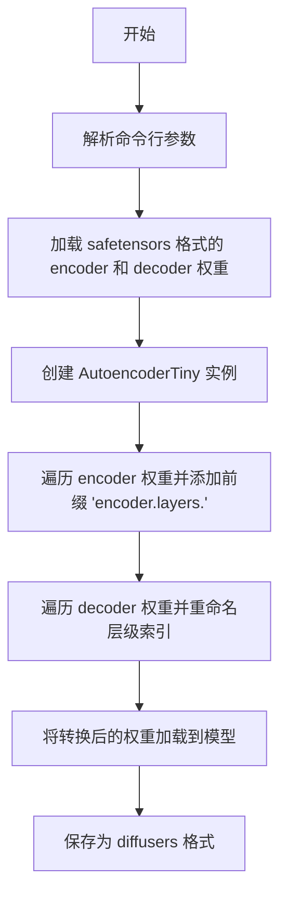
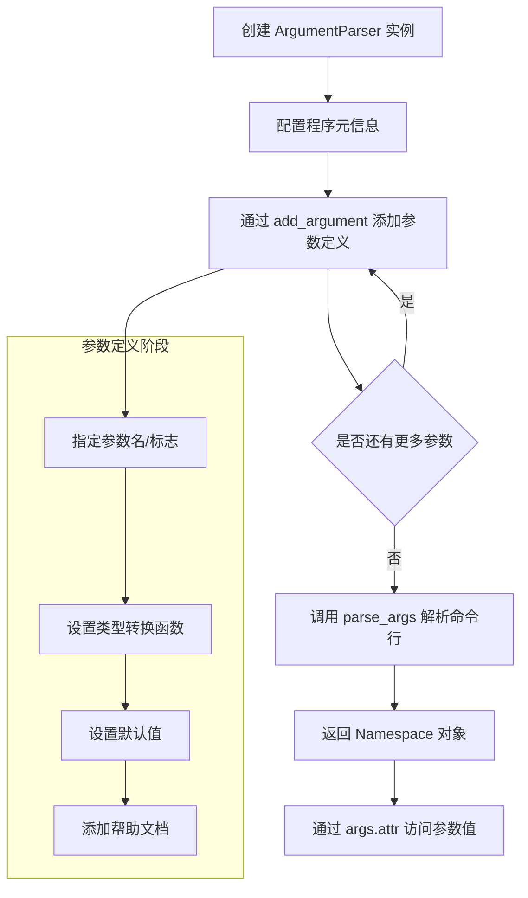
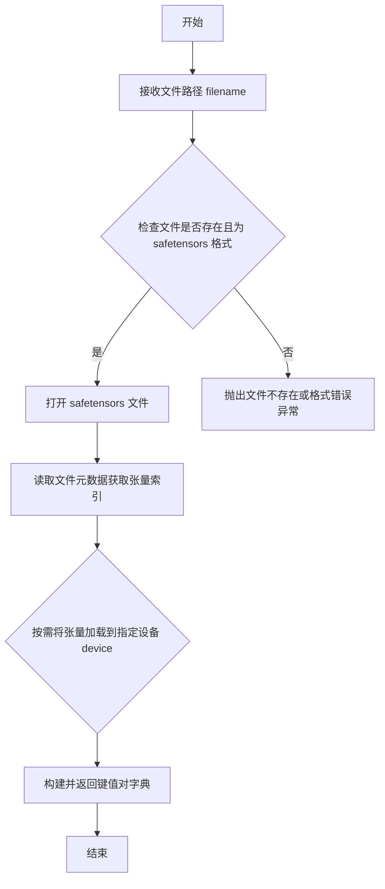
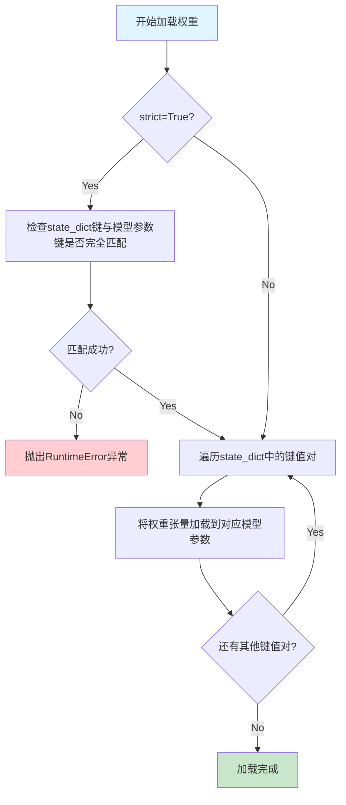
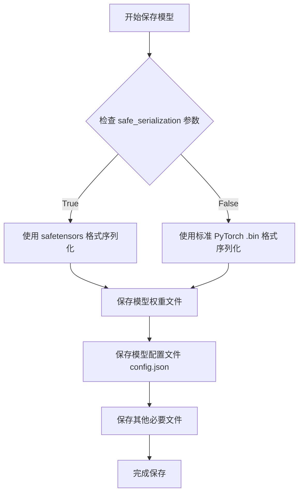

# `diffusers\scripts\convert_tiny_autoencoder_to_diffusers.py` 详细设计文档

这是一个模型权重转换脚本，用于将预训练的 Tiny AutoEncoder (TAESD) 的 encoder 和 decoder 权重从 safetensors 格式转换为 Hugging Face diffusers 库兼容的格式，以便在 diffusers 框架中使用。

## 整体流程



## 类结构

```
此脚本为单文件脚本，无自定义类层次结构
主要依赖: diffusers.AutoencoderTiny (第三方库类)
```

## 全局变量及字段


### `parser`
    
命令行参数解析器实例，用于定义和解析脚本所需的命令行参数

类型：`argparse.ArgumentParser`
    


### `args`
    
解析后的命令行参数命名空间，包含所有传入的命令行选项值

类型：`argparse.Namespace`
    


### `encoder_state_dict`
    
从 safetensors 文件加载的 encoder 权重字典，键为权重名称，值为张量

类型：`Dict[str, torch.Tensor]`
    


### `decoder_state_dict`
    
从 safetensors 文件加载的 decoder 权重字典，键为权重名称，值为张量

类型：`Dict[str, torch.Tensor]`
    


### `tiny_autoencoder`
    
diffusers 库的 Tiny Autoencoder 模型实例，用于承载转换后的权重

类型：`AutoencoderTiny`
    


### `new_state_dict`
    
转换后的权重字典，键已按 diffusers 格式重命名以适配模型结构

类型：`Dict[str, torch.Tensor]`
    


### `k`
    
循环变量，用于遍历原始权重字典中的键名

类型：`str`
    


### `layer_id`
    
decoder 层索引，通过解析原始键名并减1计算得到

类型：`int`
    


### `new_k`
    
转换后的新键名，格式为 'layer_id.剩余层级路径'

类型：`str`
    


    

## 全局函数及方法


### `argparse.ArgumentParser`

`argparse.ArgumentParser` 是 Python 标准库中用于解析命令行参数的解析器类，它提供了一个方便的工具来编写用户友好的命令行接口，能够自动生成帮助信息并解析 sys.argv 中的参数。

参数：

- `prog`：`str`，程序名称，默认为 sys.argv[0]
- `usage`：`str`，描述程序用法的字符串，默认为自动生成
- `description`：`str`，在参数帮助信息之前显示的文本，默认为 None
- `epilog`：`str`，在参数帮助信息之后显示的文本，默认为 None
- `parents`：`list[ArgumentParser]`，一个 ArgumentParser 对象列表，其参数也应包含在内，默认为 []
- `formatter_class`：`type`，用于自定义帮助格式的类，默认为 None
- `prefix_chars`：`str`，可选参数的前缀字符集，默认为 '-'
- `fromfile_prefix_chars`：`str`，用于从文件中读取额外参数的前缀字符，默认为 None
- `argument_default`：`any`，参数的全局默认值，默认为 None
- `conflict_handler`：`str`，处理冲突选项的策略，默认为 'error'
- `add_help`：`bool`，是否在解析器中添加 -h/--help 选项，默认为 True
- `allow_abbrev`：`bool`，是否允许长选项的唯一前缀缩写，默认为 True

返回值：`argparse.Namespace`，一个简单的对象，用于存储通过属性方式访问的解析后参数

#### 流程图



#### 带注释源码

```python
import argparse  # 导入标准库的 argparse 模块

# 创建 ArgumentParser 实例，配置程序描述和帮助信息
parser = argparse.ArgumentParser(
    description="将 Tiny Autoencoder 模型权重转换为 diffusers 格式的脚本"
)

# 添加 --dump_path 参数：输出模型的保存路径
# type=str: 参数值转换为字符串类型
# required=True: 该参数为必需参数
# help: 帮助文档描述参数用途
parser.add_argument(
    "--dump_path", 
    default=None, 
    type=str, 
    required=True, 
    help="Path to the output model."
)

# 添加 --encoder_ckpt_path 参数：编码器检查点文件路径
parser.add_argument(
    "--encoder_ckpt_path",
    default=None,
    type=str,
    required=True,
    help="Path to the encoder ckpt.",
)

# 添加 --decoder_ckpt_path 参数：解码器检查点文件路径
parser.add_argument(
    "--decoder_ckpt_path",
    default=None,
    type=str,
    required=True,
    help="Path to the decoder ckpt.",
)

# 添加 --use_safetensors 参数：布尔标志参数
# action="store_true": 当指定此标志时，参数值为 True；否则为 False
parser.add_argument(
    "--use_safetensors", 
    action="store_true", 
    help="Whether to serialize in the safetensors format."
)

# 解析命令行参数，返回 Namespace 对象
args = parser.parse_args()

# 通过属性方式访问解析后的参数值
# args.dump_path: 获取 --dump_path 的值
# args.encoder_ckpt_path: 获取 --encoder_ckpt_path 的值
# args.decoder_ckpt_path: 获取 --decoder_ckpt_path 的值
# args.use_safetensors: 获取 --use_safetensors 的布尔值
```


### `safetensors.torch.load_file`

该函数用于从磁盘加载 safetensors 格式的模型权重文件，并将其作为 Python 字典返回。字典的键是张量名称，值是对应的 PyTorch 张量。

参数：

-  `filename`：`str`，要加载的 safetensors 文件的路径
-  `device`：`str`， optional，默认为 "cpu"，指定将张量加载到的设备（如 "cpu", "cuda"）

返回值：`Dict[str, torch.Tensor]`，返回包含所有权重张量的字典，键为张量名称，值为对应的 PyTorch 张量

#### 流程图



#### 带注释源码

```python
# safetensors.torch.load_file 源码示例（基于官方实现逻辑）

def load_file(filename: str, device: str = "cpu") -> Dict[str, torch.Tensor]:
    """
    从 safetensors 文件加载张量到内存
    
    参数:
        filename: safetensors 文件的路径
        device: 目标设备，默认为 "cpu"
    
    返回:
        包含所有张量的字典
    """
    # 1. 打开 safetensors 文件（一种安全的 pickle 格式）
    with open(filename, "rb") as f:
        # 2. 读取 8 字节的 header 大小
        header_size_bytes = f.read(8)
        header_size = int.from_bytes(header_size_bytes, "little")
        
        # 3. 读取 header 元数据（JSON 格式，包含所有张量的索引信息）
        header_bytes = f.read(header_size)
        header = json.loads(header_bytes.decode("utf-8"))
    
    # 4. 遍历 header 中的每个张量条目
    tensors = {}
    for tensor_name, tensor_info in header.items():
        # 获取该张量在文件中的偏移量和大小
        data_offset = tensor_info["data_offset"]
        shape = tensor_info["shape"]
        dtype = tensor_info["dtype"]
        
        # 5. 跳转到数据位置并读取原始字节
        with open(filename, "rb") as f:
            f.seek(data_offset)
            # 根据 dtype 计算需要读取的字节数
            num_bytes = math.prod(shape) * torch.dtype(dtype).itemsize
            data_bytes = f.read(num_bytes)
        
        # 6. 将字节反序列化为 PyTorch 张量
        tensor = torch.frombuffer(
            buffer=data_bytes,
            dtype=torch.dtype(dtype)
        ).clone()  # clone() 确保数据可写
        
        # 7. 移动到目标设备
        tensor = tensor.to(device=device)
        
        # 8. 存入结果字典
        tensors[tensor_name] = tensor
    
    return tensors
```

> **注意**：上述源码是基于 safetensors 库公开逻辑的简化示例，实际实现可能包含更多优化（如内存映射、延迟加载等）以提升性能。


### AutoencoderTiny

描述：AutoencoderTiny是diffusers库中的一个小型自动编码器模型类，用于图像的编码和解码。代码中创建该类实例作为将权重转换为diffusers格式的容器。

参数：

- （无参数）- AutoencoderTiny类的构造函数不接受任何参数，使用默认配置创建实例

返回值：`AutoencoderTiny`（实例），返回一个小型的自动编码器模型实例，可用于加载权重和保存预训练模型

#### 流程图

```mermaid
flowchart TD
    A[开始] --> B[导入AutoencoderTiny类]
    B --> C[创建AutoencoderTiny实例: tiny_autoencoder = AutoencoderTiny()]
    C --> D[准备转换后的state_dict]
    D --> E[加载权重: tiny_autoencoder.load_state_dict]
    E --> F[保存模型: tiny_autoencoder.save_pretrained]
    F --> G[结束]
```

#### 带注释源码

```python
# 导入diffusers库中的AutoencoderTiny类
from diffusers import AutoencoderTiny

# ... [前序代码：加载权重、转换权重格式] ...

# 创建AutoencoderTiny实例
# 这是一个轻量级的变分自编码器，用于图像压缩
# 构造函数无参数，使用库内置的默认配置
tiny_autoencoder = AutoencoderTiny()

# ... [权重转换逻辑：修改state_dict的键名] ...

# 将转换后的权重加载到模型中
tiny_autoencoder.load_state_dict(new_state_dict)

# 将模型保存为diffusers格式
# 参数：dump_path-输出路径, safe_serialization-是否使用safetensors格式
tiny_autoencoder.save_pretrained(args.dump_path, safe_serialization=args.use_safetensors)
```

#### 补充说明

由于`AutoencoderTiny`是外部库（diffusers）中的类，未在此代码文件中定义，因此无法提供该类的完整内部实现细节。以上信息基于代码中的使用方式进行描述。如需了解`AutoencoderTiny`类的完整设计，建议参考diffusers官方文档。


### `tiny_autoencoder.load_state_dict`

将预先处理好的状态字典（state_dict）加载到 TinyAutoencoder 模型中，完成模型权重的初始化和更新。

参数：

- `state_dict`：`Dict[str, torch.Tensor]`，包含模型权重的字典，键为参数名称，值为对应的张量（Tensor）
- `strict`：`bool`（可选，默认为 `True`），是否严格检查 state_dict 的键与模型参数键完全匹配
- `assign`：`bool`（可选，默认为 `False`），是否将加载的权重直接赋值给模型参数而非匹配

返回值：`None`，该方法直接在模型对象上进行操作，无返回值

#### 流程图



#### 带注释源码

```python
# 在主脚本中的调用上下文：
tiny_autoencoder = AutoencoderTiny()  # 实例化Tiny自动编码器模型
new_state_dict = {}  # 初始化新的状态字典

# 修改编码器状态字典：添加"encoder.layers."前缀
for k in encoder_state_dict:
    new_state_dict.update({f"encoder.layers.{k}": encoder_state_dict[k]})

# 修改解码器状态字典：调整层ID和键名格式
for k in decoder_state_dict:
    layer_id = int(k.split(".")[0]) - 1  # 层ID减1（从0开始索引）
    new_k = str(layer_id) + "." + ".".join(k.split(".")[1:])
    new_state_dict.update({f"decoder.layers.{new_k}": decoder_state_dict[k]})

# 调用load_state_dict方法加载权重到模型
# 参数new_state_dict: 包含转换后的权重字典
# 键的格式必须与AutoencoderTiny模型的内部参数结构匹配
tiny_autoencoder.load_state_dict(new_state_dict)

# 方法内部执行流程（PyTorch标准实现逻辑）：
# 1. 验证state_dict中的所有键都能在模型中找到对应的参数
# 2. 遍历state_dict中的每个(key, value)对
# 3. 使用value更新模型中对应的参数tensor
# 4. 完成权重加载后，模型参数被new_state_dict中的值替换
```

#### 详细说明

| 属性 | 值 |
|------|-----|
| **方法所属类** | `torch.nn.Module` (AutoencoderTiny继承自DiffusionPipeline) |
| **调用对象** | `tiny_autoencoder` (AutoencoderTiny实例) |
| **输入状态** | `new_state_dict` - 包含encoder和decoder层权重的字典 |
| **输出状态** | 模型参数被更新为new_state_dict中的值 |


### `AutoencoderTiny.save_pretrained`

该方法用于将 AutoencoderTiny 模型及其配置文件保存到指定目录，可选择安全序列化格式（safetensors）或标准 PyTorch 格式。

参数：

- `save_directory`：`str`，保存模型的输出目录路径
- `safe_serialization`：`bool`，是否使用 safetensors 格式进行序列化（默认为 True）

返回值：`None`，直接将模型保存到指定目录

#### 流程图



#### 带注释源码

```python
# 从 diffusers 库导入的 AutoencoderTiny 类
from diffusers import AutoencoderTiny

# 创建模型实例
tiny_autoencoder = AutoencoderTiny()

# ... (加载 state_dict 的代码省略) ...

# 加载状态字典到模型
tiny_autoencoder.load_state_dict(new_state_dict)

# 调用 save_pretrained 方法保存模型
# 参数:
#   - args.dump_path: 保存目录路径 (str 类型)
#   - safe_serialization: 是否使用 safetensors 格式 (bool 类型)
# 返回值: None (直接写入文件系统)
tiny_autoencoder.save_pretrained(args.dump_path, safe_serialization=args.use_safetensors)
```

## 关键组件


### 参数解析模块

负责解析命令行参数，包括输出路径、encoder和decoder的检查点路径、以及是否使用safetensors格式序列化。

### 权重加载模块

使用safetensors.torch从指定路径加载encoder和decoder的原始权重文件。

### 状态字典转换模块

将原始权重键名重映射到diffusers格式。encoder层直接在键前添加"encoder.layers."前缀；decoder层需要解析原始键中的层ID并进行减1操作，同时重新组织键结构。

### 模型加载与保存模块

创建AutoencoderTiny实例，将转换后的状态字典加载到模型中，并保存为diffusers格式。

### AutoencoderTiny模型

diffusers库中的微型自编码器类，用于承载转换后的权重。


## 问题及建议


### 已知问题

-   **缺少文件存在性检查**：代码未检查 `encoder_ckpt_path` 和 `decoder_ckpt_path` 指定的文件是否存在，若文件不存在会抛出不够友好的 `FileNotFoundError`
-   **缺少状态字典格式验证**：代码直接假设原始状态字典的 key 格式符合预期（encoder 为简单键名，decoder 为 `"数字.层名"` 格式），未进行格式验证，可能导致静默失败或 `KeyError`
-   **硬编码的层索引转换逻辑**：decoder 的 key 转换 `int(k.split(".")[0]) - 1` 假设首段为数字，若格式不符会抛出 `ValueError`，缺乏健壮性
-   **缺少空状态字典检查**：未检查加载的状态字典是否为空，若为空会导致后续 `load_state_dict` 失败但错误信息不明确
-   **使用 print 而非日志框架**：使用 `print` 语句输出信息，不利于生产环境下的日志管理和配置
-   **无进度反馈**：对于大型模型文件，缺少加载进度的用户反馈

### 优化建议

-   **添加异常处理**：为 `safetensors.torch.load_file` 调用添加 try-except 块，捕获文件读取异常并提供清晰的错误信息
-   **添加输入验证**：在处理状态字典前，验证 key 格式是否符合预期格式，可使用正则表达式或显式检查
-   **添加空值检查**：在转换前检查 `encoder_state_dict` 和 `decoder_state_dict` 是否为空，提供明确的错误提示
-   **使用日志框架**：将 `print` 替换为 Python 标准 `logging` 模块，支持日志级别配置
-   **增加静默模式**：添加 `--quiet` 参数以支持无输出模式
-   **支持多种输入格式**：扩展支持 `.pt`/`.pth` 格式的权重文件，而非仅限 safetensors
-   **添加类型注解**：为函数参数和返回值添加类型提示，提升代码可读性和可维护性

## 其它


### 设计目标与约束

将使用safetensors格式存储的Tiny Autoencoder（TAESD）模型权重转换为Hugging Face Diffusers库兼容的格式。核心约束包括：输入必须是有效的safetensors文件路径，输出目录必须可写，模型结构必须与AutoencoderTiny类兼容。

### 错误处理与异常设计

代码主要依赖argparse进行参数校验，文件读取使用safetensors.torch.load_file，模型加载使用load_state_dict。可能的异常包括：文件不存在或路径错误、权重键值不匹配、磁盘空间不足等。当前实现未显式捕获异常，建议在生产环境中添加try-except块处理文件读写异常和模型加载异常。

### 外部依赖与接口契约

主要依赖包括：argparse（命令行参数解析）、safetensors.torch（权重文件读取）、diffusers库的AutoencoderTiny类。接口契约要求：encoder_ckpt_path和decoder_ckpt_path指向有效的safetensors文件，dump_path为输出目录路径，use_safetensors为可选参数控制输出格式。

### 性能考虑

该脚本为一次性转换工具，性能要求较低。潜在优化点包括：批量处理多个模型、添加进度显示、支持GPU加速转换（当前仅使用CPU）。

### 安全性考虑

代码从本地文件加载模型权重，安全性主要取决于输入文件的来源。建议添加文件完整性校验（checksum验证）、路径遍历防护（防止--dump_path被滥用）、以及输入文件格式验证。

### 配置与参数说明

| 参数 | 类型 | 必填 | 默认值 | 说明 |
|------|------|------|--------|------|
| dump_path | string | 是 | - | 输出模型保存路径 |
| encoder_ckpt_path | string | 是 | - | 编码器权重文件路径 |
| decoder_ckpt_path | string | 是 | - | 解码器权重文件路径 |
| use_safetensors | flag | 否 | False | 是否使用safetensors格式保存 |

### 使用示例与限制

使用示例：python convert_tiny_autoencoder_to_diffusers.py --encoder_ckpt_path taesd_encoder.safetensors --decoder_ckpt_path taesd_decoder.safetensors --dump_path taesd-diffusers --use_safetensors

限制与注意事项：
- 权重键名转换逻辑针对特定模型架构设计，通用性有限
- 假设编码器和解码器权重文件结构符合TAESD原始格式
- 转换后的模型需要与对应版本的diffusers库配合使用
- 未验证转换后模型的数值正确性（依赖外部gist中的测试用例）

### 版本与兼容性

该脚本针对diffusers库中的AutoencoderTiny类设计，需要确保diffusers库版本与模型架构兼容。safetensors格式支持需要安装safetensors包。


    