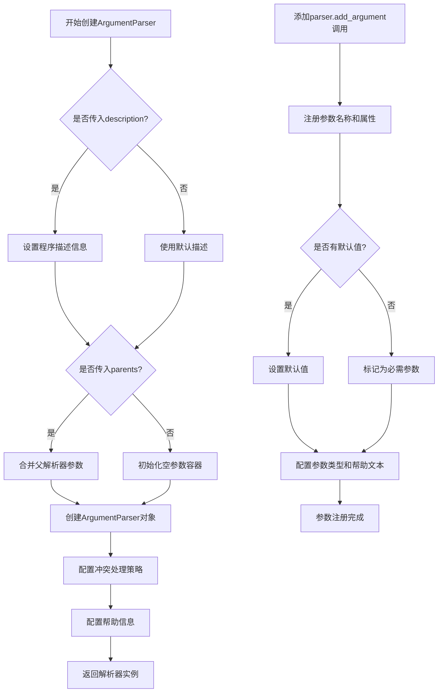
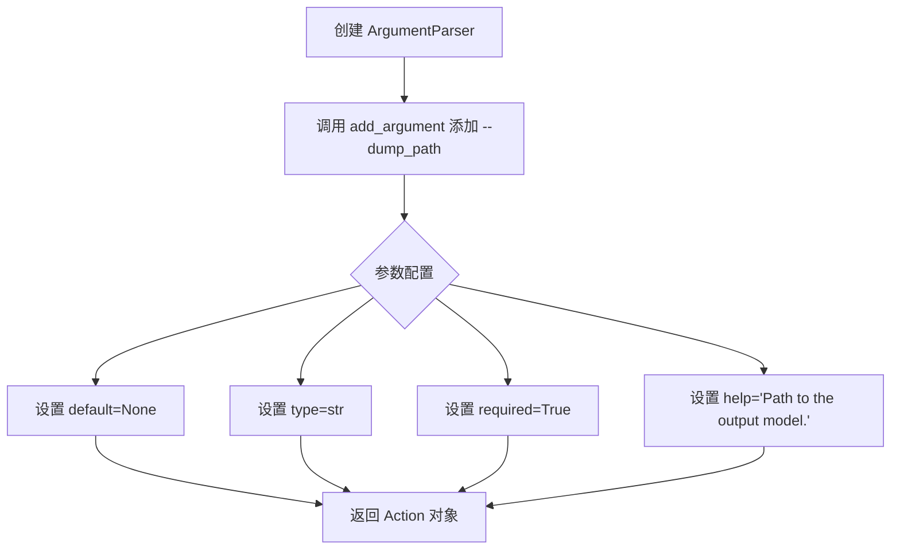
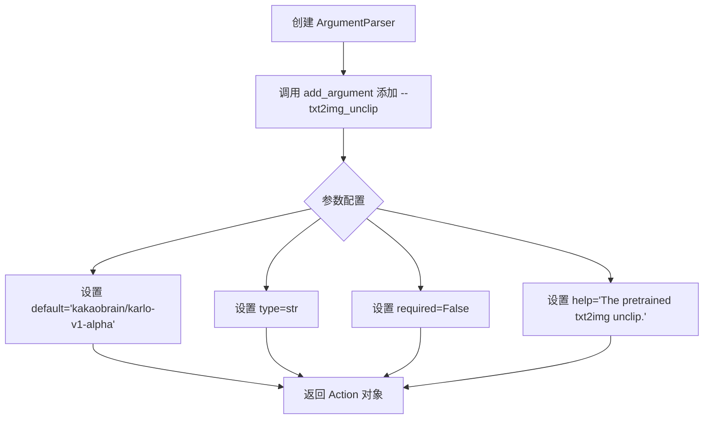
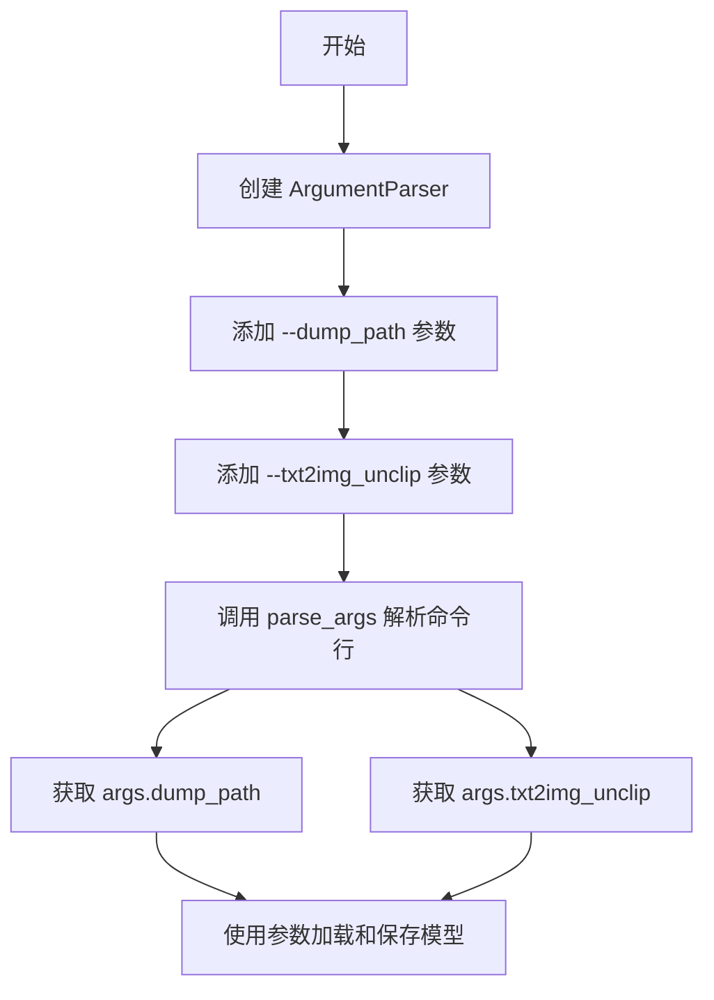
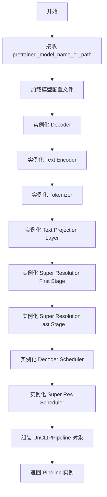
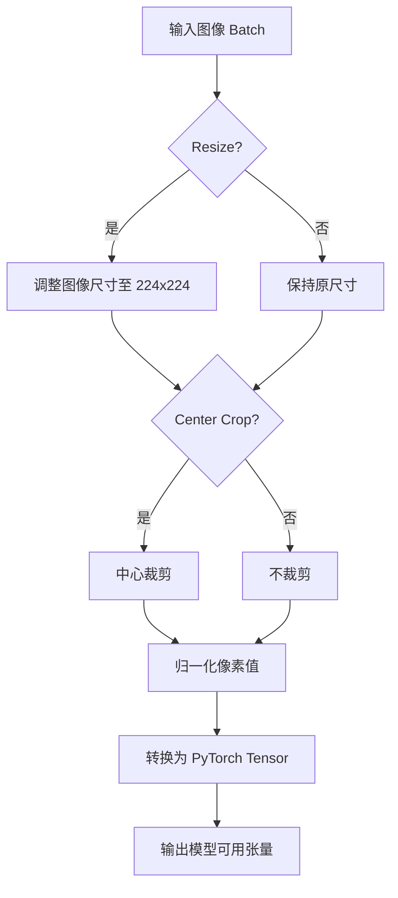
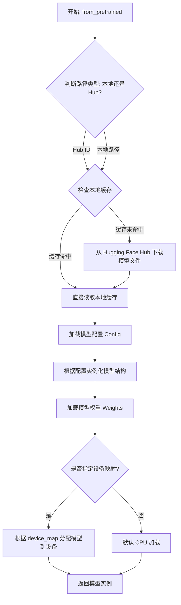
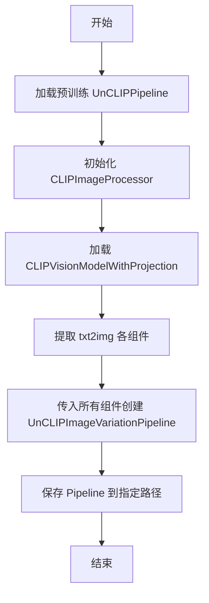
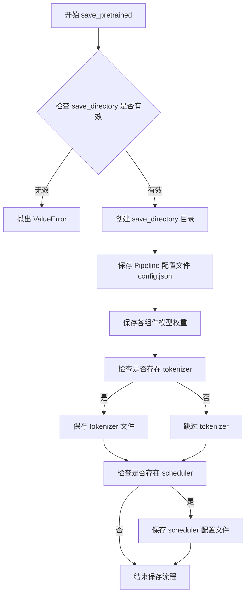

# `diffusers\scripts\convert_unclip_txt2img_to_image_variation.py` 详细设计文档

该脚本用于将预训练的UnCLIP文本到图像Pipeline转换为图像到图像的图像变化Pipeline，通过复用原始txt2img模型的解码器、文本编码器等组件，并添加CLIP图像编码器来实现图像变体生成功能。

## 整体流程

```mermaid
graph TD
    A[开始] --> B[解析命令行参数]
    B --> C[从预训练模型加载UnCLIPPipeline (txt2img)]
    C --> D[创建CLIPImageProcessor]
    D --> E[加载CLIPVisionModelWithProjection]
    E --> F[创建UnCLIPImageVariationPipeline]
    F --> G[保存Pipeline到指定路径]
    G --> H[结束]
```

## 类结构

```
无自定义类定义 (脚本文件)
主要使用第三方库类:
├── argparse.ArgumentParser
├── transformers.CLIPImageProcessor
├── transformers.CLIPVisionModelWithProjection
├── diffusers.UnCLIPPipeline
└── diffusers.UnCLIPImageVariationPipeline
```

## 全局变量及字段


### `parser`
    
命令行参数解析器对象

类型：`ArgumentParser`
    


### `args`
    
解析后的命令行参数命名空间

类型：`Namespace`
    


### `txt2img`
    
文本到图像的预训练Pipeline对象

类型：`UnCLIPPipeline`
    


### `feature_extractor`
    
CLIP图像特征提取器

类型：`CLIPImageProcessor`
    


### `image_encoder`
    
CLIP视觉编码模型

类型：`CLIPVisionModelWithProjection`
    


### `img2img`
    
图像变化Pipeline对象

类型：`UnCLIPImageVariationPipeline`
    


    

## 全局函数及方法


### `argparse.ArgumentParser`

`ArgumentParser` 是 Python `argparse` 模块中的核心类，用于创建命令行参数解析器对象。该解析器能够自动生成帮助信息、处理命令行传入的参数，并将解析后的参数存储为对象属性供程序使用。

参数：

- `prog`：`str`，程序名称，默认为 `sys.argv[0]`
- `usage`：`str`，描述程序用法的字符串，默认自动生成
- `description`：`str`，程序功能描述，显示在帮助信息中
- `epilog`：`str`，帮助信息末尾显示的文本
- `parents`：`list[ArgumentParser]`，需要继承参数的父解析器列表
- `formatter_class`：`type`，用于自定义帮助格式的类
- `prefix_chars`：`str`，可选参数的前缀字符，默认为 `-`
- `fromfile_prefix_chars`：`str`，从文件读取参数的前缀字符
- `argument_default`：`any`，参数的全局默认值
- `conflict_handler`：`str`，处理冲突选项的策略（`'error'` 或 `'resolve'`）
- `add_help`：`bool`，是否添加 `-h`/`--help` 选项，默认为 `True`
- `allow_abbrev`：`bool`，是否允许长选项唯一缩写，默认为 `True`

返回值：`ArgumentParser`，返回命令行参数解析器对象

#### 流程图



#### 带注释源码

```python
import argparse

from transformers import CLIPImageProcessor, CLIPVisionModelWithProjection
from diffusers import UnCLIPImageVariationPipeline, UnCLIPPipeline

if __name__ == "__main__":
    # ============================================================
    # 创建命令行参数解析器
    # ArgumentParser 是 argparse 模块的核心类，用于:
    # 1. 定义程序可以接受的命令行参数
    # 2. 自动生成 --help 文本
    # 3. 解析 sys.argv 中的命令行输入
    # ============================================================
    parser = argparse.ArgumentParser(
        # description: 程序功能描述，会显示在帮助信息中
        description="UnCLIP Image Variation Pipeline 导出工具"
    )

    # ============================================================
    # 添加 --dump_path 参数
    # add_argument 方法参数说明:
    # - 第一个位置参数: 参数名称
    # - default: 默认值，设为 None 表示无默认值
    # - type: 参数类型转换函数，str 会将输入转为字符串
    # - required: 是否为必需参数，True 表示必须提供
    # - help: 参数的帮助描述
    # ============================================================
    parser.add_argument(
        "--dump_path",           # 参数名
        default=None,            # 默认值
        type=str,                # 参数类型
        required=True,           # 必需参数
        help="Path to the output model."  # 帮助文本
    )

    # ============================================================
    # 添加 --txt2img_unclip 参数
    # 这是一个可选参数，带有默认值
    # ============================================================
    parser.add_argument(
        "--txt2img_unclip",      # 参数名
        default="kakaobrain/karlo-v1-alpha",  # 默认值
        type=str,                # 参数类型
        required=False,          # 可选参数
        help="The pretrained txt2img unclip."  # 帮助文本
    )

    # ============================================================
    # 解析命令行参数
    # parse_args() 会:
    # 1. 读取 sys.argv
    # 2. 根据 add_argument 定义的规则验证参数
    # 3. 转换参数类型
    # 4. 返回包含所有参数的命名空间对象
    # ============================================================
    args = parser.parse_args()

    # 使用解析后的参数
    # args.dump_path: 输出模型路径
    # args.txt2img_unclip: 预训练模型路径
    txt2img = UnCLIPPipeline.from_pretrained(args.txt2img_unclip)

    # 后续代码创建图像变体管道并保存...
    feature_extractor = CLIPImageProcessor()
    image_encoder = CLIPVisionModelWithProjection.from_pretrained("openai/clip-vit-large-patch14")

    img2img = UnCLIPImageVariationPipeline(
        decoder=txt2img.decoder,
        text_encoder=txt2img.text_encoder,
        tokenizer=txt2img.tokenizer,
        text_proj=txt2img.text_proj,
        feature_extractor=feature_extractor,
        image_encoder=image_encoder,
        super_res_first=txt2img.super_res_first,
        super_res_last=txt2img.super_res_last,
        decoder_scheduler=txt2img.decoder_scheduler,
        super_res_scheduler=txt2img.super_res_scheduler,
    )

    img2img.save_pretrained(args.dump_path)
```


### `parser.add_argument`

在 `argparse.ArgumentParser` 实例上调用 `add_argument` 方法，用于定义命令行参数。每个 `add_argument` 调用会向解析器添加一个参数规范，指定参数的名称、类型、默认值、是否必需以及帮助信息。

#### 第一次调用：定义 `--dump_path` 参数

参数：

- `--dump_path`：命令行参数名称，以 `--` 开头表示可选参数
- `default=None`：默认值为 `None`
- `type=str`：参数类型为字符串
- `required=True`：表示该参数是必需的，必须在命令行中提供
- `help="Path to the output model."`：参数的帮助描述，说明该参数用于指定输出模型的路径

返回值：`argparse.Action`（具体为 `_StoreAction` 或其子类），返回的 Action 对象包含参数的元数据和解析逻辑，用于后续的参数解析过程。

#### 流程图



#### 带注释源码

```python
# 创建命令行参数解析器
parser = argparse.ArgumentParser()

# 添加 --dump_path 参数：输出模型的保存路径
# default=None: 默认值为 None
# type=str: 参数类型为字符串
# required=True: 该参数为必需参数，命令行必须提供
# help: 参数的帮助说明文本
parser.add_argument(
    "--dump_path",        # 参数名称（完整名称）
    default=None,         # 默认值，未提供时使用
    type=str,             # 参数值的数据类型
    required=True,        # 是否为必需参数
    help="Path to the output model."  # 帮助文档描述
)
```

---

#### 第二次调用：定义 `--txt2img_unclip` 参数

参数：

- `--txt2img_unclip`：命令行参数名称
- `default="kakaobrain/karlo-v1-alpha"`：默认值为 "kakaobrain/karlo-v1-alpha"
- `type=str`：参数类型为字符串
- `required=False`：表示该参数是可选的，可以不提供
- `help="The pretrained txt2img unclip."`：参数的帮助描述，说明该参数用于指定预训练的 txt2img unclip 模型

返回值：`argparse.Action`（具体为 `_StoreAction` 或其子类），返回的 Action 对象包含参数的元数据和解析逻辑。

#### 流程图



#### 带注释源码

```python
# 添加 --txt2img_unclip 参数：预训练的 txt2img unclip 模型路径或标识符
# default: 默认使用 kakaobrain/karlo-v1-alpha 模型
# type=str: 参数值的数据类型为字符串
# required=False: 该参数为可选参数，可以不提供
# help: 帮助文档描述参数的用途
parser.add_argument(
    "--txt2img_unclip",  # 参数名称
    default="kakaobrain/karlo-v1-alpha",  # 默认预训练模型
    type=str,            # 参数类型
    required=False,      # 可选参数
    help="The pretrained txt2img unclip."  # 帮助说明
)
```

---

### 整体参数解析流程



### 完整带注释源码

```python
import argparse  # 导入命令行参数解析模块

# 从 diffusers 库导入 UnCLIPImageVariationPipeline 和 UnCLIPPipeline
from diffusers import UnCLIPImageVariationPipeline, UnCLIPPipeline

# 从 transformers 库导入 CLIP 图像处理器和视觉模型
from transformers import CLIPImageProcessor, CLIPVisionModelWithProjection


if __name__ == "__main__":
    # 创建命令行参数解析器对象
    parser = argparse.ArgumentParser()

    # 添加 --dump_path 参数：指定输出模型的保存路径
    # - default=None: 默认值为 None
    # - type=str: 参数类型为字符串
    # - required=True: 该参数为必需参数
    # - help: 提供参数的帮助说明
    parser.add_argument(
        "--dump_path", 
        default=None, 
        type=str, 
        required=True, 
        help="Path to the output model."
    )

    # 添加 --txt2img_unclip 参数：指定预训练的 txt2img unclip 模型
    # - default: 默认使用 kakaobrain/karlo-v1-alpha 模型
    # - type=str: 参数类型为字符串
    # - required=False: 该参数为可选参数
    # - help: 提供参数的帮助说明
    parser.add_argument(
        "--txt2img_unclip",
        default="kakaobrain/karlo-v1-alpha",
        type=str,
        required=False,
        help="The pretrained txt2img unclip.",
    )

    # 解析命令行参数，将解析结果存储在 args 对象中
    args = parser.parse_args()

    # 使用 args.txt2img_unclip 指定的预训练模型创建 UnCLIPPipeline
    txt2img = UnCLIPPipeline.from_pretrained(args.txt2img_unclip)

    # 创建 CLIP 图像处理器
    feature_extractor = CLIPImageProcessor()

    # 加载 CLIP 视觉模型（用于图像编码）
    image_encoder = CLIPVisionModelWithProjection.from_pretrained("openai/clip-vit-large-patch14")

    # 创建 UnCLIPImageVariationPipeline（图像变体生成管道）
    img2img = UnCLIPImageVariationPipeline(
        decoder=txt2img.decoder,                    # 解码器
        text_encoder=txt2img.text_encoder,          # 文本编码器
        tokenizer=txt2img.tokenizer,                # 分词器
        text_proj=txt2img.text_proj,                # 文本投影层
        feature_extractor=feature_extractor,       # 特征提取器
        image_encoder=image_encoder,               # 图像编码器
        super_res_first=txt2img.super_res_first,   # 第一个超分辨率模型
        super_res_last=txt2img.super_res_last,      # 第二个超分辨率模型
        decoder_scheduler=txt2img.decoder_scheduler,    # 解码器调度器
        super_res_scheduler=txt2img.super_res_scheduler, # 超分辨率调度器
    )

    # 将创建的图像变体管道保存到 args.dump_path 指定的路径
    img2img.save_pretrained(args.dump_path)
```


### `parser.parse_args()`

解析通过 `ArgumentParser` 添加的命令行参数（`--dump_path` 和 `--txt2img_unclip`），返回一个包含所有参数值的 `Namespace` 对象。

参数：

- 该方法无显式传入参数，它使用 `sys.argv` 中的命令行参数

返回值：`Namespace`，一个对象属性，其中包含从命令行解析的参数值（如 `args.dump_path` 和 `args.txt2img_unclip`）

#### 流程图

```mermaid
flowchart TD
    A[开始 parse_args] --> B{检查 sys.argv}
    B -->|无参数| C[使用空列表]
    B -->|有参数| D[使用 sys.argv[1:]]
    C --> E[逐个匹配命令行参数与预定义的 add_argument 规则]
    D --> E
    E --> F{参数是否合法}
    F -->|不合法| G[抛出 SystemExit 异常并显示错误信息]
    F -->|合法| H[创建 Namespace 对象]
    H --> I[将解析的值存入 Namespace 对象]
    I --> J[返回 Namespace 对象]
    
    style A fill:#f9f,stroke:#333
    style H fill:#9f9,stroke:#333
    style J fill:#9f9,stroke:#333
```

#### 带注释源码

```python
# parse_args() 方法的调用位于 if __name__ == "__main__": 块中
# 位于脚本末尾，在所有 parser.add_argument() 调用之后

args = parser.parse_args()

# 这里的 parse_args() 执行以下操作：
# 1. 读取 sys.argv（Python 脚本运行时传入的系统参数列表）
# 2. 根据之前通过 parser.add_argument() 注册的参数规则进行匹配
# 3. 验证参数是否符合类型要求（如 type=str）和是否满足 required=True
# 4. 如果参数验证失败，自动打印帮助信息并以退出码 2 终止程序
# 5. 成功解析后返回一个 Namespace 对象，其属性对应各参数名

# 示例：解析后 args.dump_path 的值为命令行传入的输出路径
# 示例：解析后 args.txt2img_unclip 的值默认为 "kakaobrain/karlo-v1-alpha"
#                              或命令行传入的自定义路径
```

> **注意**：`parse_args()` 是 `argparse.ArgumentParser` 类的方法，在代码中通过 `parser` 对象调用。它不直接接收参数，而是隐式读取 `sys.argv`。


### `UnCLIPPipeline.from_pretrained`

从预训练模型加载 `UnCLIPPipeline` 实例的类方法，用于初始化文本到图像生成管线。该方法会自动加载模型权重、配置信息、调度器等组件，并返回一个完整配置的 Pipeline 对象。

参数：

- `pretrained_model_name_or_path`：`str`，预训练模型的名称（Hub 模型 ID）或本地路径。代码中通过 `args.txt2img_unclip` 传递，默认为 "kakaobrain/karlo-v1-alpha"

返回值：`UnCLIPPipeline`，返回一个配置完整的文本到图像生成管线对象，包含 `decoder`、`text_encoder`、`tokenizer`、`text_proj`、`super_res_first`、`super_res_last`、`decoder_scheduler` 和 `super_res_scheduler` 等组件。

#### 流程图



#### 带注释源码

```python
# 从预训练模型加载 UnCLIPPipeline
# 参数: 模型名称或路径 (默认: "kakaobrain/karlo-v1-alpha")
# 返回: 包含文本到图像生成所需所有组件的 Pipeline 对象
txt2img = UnCLIPPipeline.from_pretrained(args.txt2img_unclip)

# 后续使用示例:
# txt2img.decoder                  # 图像解码器
# txt2img.text_encoder            # 文本编码器
# txt2img.tokenizer               # 分词器
# txt2img.text_proj               # 文本投影层
# txt2img.super_res_first         # 超分辨率第一阶段
# txt2img.super_res_last          # 超分辨率最后阶段
# txt2img.decoder_scheduler       # 解码器调度器
# txt2img.super_res_scheduler     # 超分辨率调度器
```


### 1. 代码核心功能概述
这段代码是一个模型转换与组装脚本。其核心功能是加载一个预训练的文本到图像（Text-to-Image）UnCLIP模型，并利用`CLIPImageProcessor()`实例化一个图像预处理器，将其与CLIP视觉编码器结合，构建一个图像到图像（Image-to-Image）的变体生成管道（`UnCLIPImageVariationPipeline`），最终保存为新的预训练模型。

### 2. 文件整体运行流程
1. **参数解析**：使用`argparse`解析命令行参数，获取模型输出路径和源模型路径。
2. **加载Txt2Img模型**：从指定路径加载预训练的`UnCLIPPipeline`，该对象包含了解码器、文本编码器等组件。
3. **实例化图像处理器**：调用`CLIPImageProcessor()`创建图像特征提取器（使用默认配置）。
4. **加载视觉编码器**：加载预训练的`CLIPVisionModelWithProjection`用于编码图像。
5. **组装Img2Img管道**：将步骤2、3、4的组件组合成`UnCLIPImageVariationPipeline`。
6. **保存模型**：将组装好的管道保存到指定路径。

---

### 3. 核心函数/类详细设计 (`CLIPImageProcessor`)

#### `{函数名/类名}`
`CLIPImageProcessor` (类构造函数)

#### 描述
实例化CLIP图像预处理器。该处理器负责对输入图像进行预处理（调整尺寸、归一化等），以符合CLIP视觉模型的输入标准（通常为224x224分辨率和特定的像素分布）。

#### 参数
- **无显式参数**：在当前代码中，未向构造函数传递任何参数，使用`transformers`库的内置默认配置。
  - *潜在默认配置*：`size=224`, `resample=PIL.Image.BILINEAR`, `do_normalize=True`, `image_mean=[0.48145466, 0.4578275, 0.40821073]`, `image_std=[0.26862954, 0.26130258, 0.27577711]`。

#### 返回值
- **`CLIPImageProcessor` 对象**：返回一个图像处理器实例，用于后续对图像批次的处理（调用 `__call__` 方法）。

#### 流程图
该流程图展示了 `CLIPImageProcessor` 实例在后续被用于处理图像时的内部逻辑流程。



#### 带注释源码
```python
# 实例化 CLIP 图像预处理器
# 此处使用 transformers 库的默认参数（默认将图像处理为 224x224 并进行归一化）
# 该处理器将作为 feature_extractor 传入 UnCLIPImageVariationPipeline
feature_extractor = CLIPImageProcessor()
```

---

### 4. 关键组件信息
- **UnCLIPPipeline**: 原始的文本到图像生成管道，作为组件供给者。
- **UnCLIPImageVariationPipeline**: 最终生成的图像变体管道，用于根据图像生成图像。
- **CLIPVisionModelWithProjection**: CLIP 视觉编码器模型，负责将图像转换为向量表示。

### 5. 潜在的技术债务与优化空间
1. **硬编码模型路径**：代码中直接硬编码了 CLIP 视觉模型的路径 (`"openai/clip-vit-large-patch14"`)，应通过参数传入或配置化管理。
2. **缺乏错误处理**：脚本缺少对模型加载失败、磁盘空间不足等情况的异常捕获和处理。
3. **隐式依赖**：代码依赖于 `transformers` 和 `diffusers` 库的特定版本，未声明依赖环境。

### 6. 其它项目说明
- **设计目标**：解耦并重组预训练模型组件，实现功能从 Txt2Img 到 Img2Img 的转换。
- **接口契约**：输入到 `UnCLIPImageVariationPipeline` 的图像需经过 `feature_extractor` 处理。
- **数据流**：图像输入 -> `feature_extractor` (CLIPImageProcessor) -> 特征向量 -> `image_encoder` -> 潜在向量 -> `decoder` -> 输出图像。


### `CLIPVisionModelWithProjection.from_pretrained`

该函数是 Hugging Face Transformers 库中 `CLIPVisionModelWithProjection` 类的类方法，用于从预训练模型仓库（如 Hugging Face Hub）或本地目录加载包含投影层（Projection Layer）的 CLIP 视觉编码器模型权重和配置。

参数：

- `pretrained_model_name_or_path`：`str`，预训练模型的标识符（Model ID），例如 `"openai/clip-vit-large-patch14"`，或者是指向本地模型目录的路径。

返回值：`CLIPVisionModelWithProjection`，返回一个加载了预训练权重的模型实例，该实例包含视觉编码器和投影头。

#### 流程图



#### 带注释源码

以下是代码中调用该方法的具体源码片段及注释：

```python
# 使用 from_pretrained 方法加载模型
# 参数 "openai/clip-vit-large-patch14" 指定了预训练模型的名称
# 该方法会自动处理模型权重、配置文件的下载（如果未缓存）和加载过程
image_encoder = CLIPVisionModelWithProjection.from_pretrained("openai/clip-vit-large-patch14")
```

#### 潜在的技术债务或优化空间

1.  **未指定数据类型 (dtype)**：在示例代码中，直接加载模型默认使用 `float32` 精度。在实际生产环境或推理中，为了减少显存占用和提高推理速度，通常建议显式指定 `torch_dtype=torch.float16`（如果硬件支持）。
2.  **缺乏错误处理**：代码未对模型加载失败（如网络中断、模型 ID 不存在）进行 `try-except` 捕获，如果是在 pipelines 中运行还好，但作为独立脚本运行可能会直接崩溃。
3.  **设备管理**：未显式指定 `device_map`，可能导致模型加载到 CPU 后，在后续使用 `image_encoder` 进行推理时需要手动 `.to(device)`，增加了人工管理的复杂度。

#### 其它项目

*   **外部依赖**：依赖于 `transformers` 库。
*   **接口契约**：返回值必须是一个继承自 `PreTrainedModel` 的模型对象。
*   **数据流**：输入是模型标识符字符串，输出是模型对象实例。


### `UnCLIPImageVariationPipeline`

该函数用于从预训练的 UnCLIPPipeline 中提取各组件（解码器、文本编码器、分词器、文本投影器、特征提取器、图像编码器、超分辨率模型及其调度器），构建一个专门用于根据输入图像生成图像变化（Image Variation）的 Pipeline。

参数：

- `decoder`：`DiffusionDecoder` 类型，来自 txt2img pipeline 的解码器组件，负责图像的生成
- `text_encoder`：`PreTrainedModel` 类型，来自 txt2img pipeline 的文本编码器，用于将文本提示转换为特征表示
- `tokenizer`：`PreTrainedTokenizer` 类型，来自 txt2img pipeline 的分词器，用于对输入文本进行分词
- `text_proj`：`TextProjection` 类型，来自 txt2img pipeline 的文本投影层，负责文本特征的投影
- `feature_extractor`：`CLIPImageProcessor` 类型，CLIP 图像预处理器，用于对输入图像进行预处理
- `image_encoder`：`CLIPVisionModelWithProjection` 类型，CLIP 视觉编码器，用于提取图像特征
- `super_res_first`：`DiffusionScheduler` 类型，来自 txt2img pipeline 的第一阶段超分辨率模型
- `super_res_last`：`DiffusionScheduler` 类型，来自 txt2img pipeline 的第二阶段超分辨率模型
- `decoder_scheduler`：`DiffusionScheduler` 类型，来自 txt2img pipeline 的解码器调度器，控制去噪过程
- `super_res_scheduler`：`DiffusionScheduler` 类型，来自 txt2img pipeline 的超分辨率调度器

返回值：`UnCLIPImageVariationPipeline` 类型，返回一个配置好的图像变化 Pipeline 实例，用于根据输入图像生成其变体

#### 流程图



#### 带注释源码

```python
# 导入必要的库
import argparse
from transformers import CLIPImageProcessor, CLIPVisionModelWithProjection
from diffusers import UnCLIPImageVariationPipeline, UnCLIPPipeline

if __name__ == "__main__":
    # 创建命令行参数解析器
    parser = argparse.ArgumentParser()

    # 添加输出路径参数
    parser.add_argument("--dump_path", default=None, type=str, required=True, 
                        help="Path to the output model.")

    # 添加预训练 txt2img unclip 模型路径参数
    parser.add_argument(
        "--txt2img_unclip",
        default="kakaobrain/karlo-v1-alpha",
        type=str,
        required=False,
        help="The pretrained txt2img unclip.",
    )

    # 解析命令行参数
    args = parser.parse_args()

    # 从预训练模型加载 UnCLIPPipeline
    txt2img = UnCLIPPipeline.from_pretrained(args.txt2img_unclip)

    # 初始化 CLIP 图像处理器（用于图像预处理）
    feature_extractor = CLIPImageProcessor()
    
    # 加载 CLIP 视觉编码器（用于图像特征提取）
    image_encoder = CLIPVisionModelWithProjection.from_pretrained("openai/clip-vit-large-patch14")

    # 创建图像变化 Pipeline
    # 从 txt2img pipeline 中提取各组件并组合
    img2img = UnCLIPImageVariationPipeline(
        decoder=txt2img.decoder,                    # 解码器组件
        text_encoder=txt2img.text_encoder,          # 文本编码器
        tokenizer=txt2img.tokenizer,                # 分词器
        text_proj=txt2img.text_proj,                # 文本投影层
        feature_extractor=feature_extractor,        # 图像预处理
        image_encoder=image_encoder,                # 图像编码器
        super_res_first=txt2img.super_res_first,    # 第一阶段超分
        super_res_last=txt2img.super_res_last,      # 第二阶段超分
        decoder_scheduler=txt2img.decoder_scheduler,  # 解码器调度器
        super_res_scheduler=txt2img.super_res_scheduler,  # 超分调度器
    )

    # 将创建的 Pipeline 保存到指定路径
    img2img.save_pretrained(args.dump_path)
```


### `img2img.save_pretrained()`

保存 UnCLIPImageVariationPipeline 实例到指定路径，包括所有模型权重、配置文件、tokenizer、scheduler 配置等组件，以便后续可以通过 `from_pretrained()` 重新加载。

参数：

- `save_directory`：`str`，要保存的目标目录路径，不能为空
- `safe_serialization`：`bool`，是否安全序列化（使用 safetensors 格式），默认为 True
- `variant`：`str`，可选，模型变体名称（如 "fp16"）
- `push_to_hub`：`bool`，是否推送到 Hugging Face Hub，默认为 False
- `**kwargs`：其他可选参数，如 `commit_message`、`create_pr` 等

返回值：`None`，直接保存到磁盘，无返回值

#### 流程图



#### 带注释源码

```python
def save_pretrained(
    self,
    save_directory: Union[str, os.PathLike],
    safe_serialization: bool = True,
    variant: Optional[str] = None,
    push_to_hub: bool = False,
    **kwargs,
):
    """
    保存 Pipeline 到指定目录
    
    参数:
        save_directory: 保存目标路径
        safe_serialization: 是否使用安全序列化 (safetensors)
        variant: 模型变体 (如 'fp16')
        push_to_hub: 是否推送到 Hugging Face Hub
        **kwargs: 其他 Hugging Face Hub 相关参数
    """
    
    # 1. 验证保存路径
    if not isinstance(save_directory, (str, os.PathLike)):
        raise ValueError(f"save_directory 必须是字符串或 PathLike 类型")
    
    # 2. 创建目录 (如果不存在)
    os.makedirs(save_directory, exist_ok=True)
    
    # 3. 保存 Pipeline 配置文件
    # 包含 pipeline_class、_class_name、_diffusers_version 等元信息
    pipeline_config = {
        "pipeline_class": self.__class__.__name__,
        # ... 其他配置
    }
    self.save_config(save_directory)
    
    # 4. 遍历所有组件并保存模型权重
    # 组件包括: decoder, text_encoder, image_encoder, 
    #           text_proj, super_res_first, super_res_last 等
    for component_name, component in self.components.items():
        if component is None:
            continue
        
        # 如果组件有 save_pretrained 方法，调用它
        if hasattr(component, 'save_pretrained'):
            component.save_pretrained(
                os.path.join(save_directory, component_name),
                safe_serialization=safe_serialization,
                variant=variant,
            )
    
    # 5. 保存 tokenizer (如果有)
    if hasattr(self, 'tokenizer') and self.tokenizer is not None:
        self.tokenizer.save_pretrained(save_directory)
    
    # 6. 保存 scheduler 配置 (如果有)
    if hasattr(self, 'decoder_scheduler'):
        # 保存各 scheduler 的配置
        self.decoder_scheduler.save_config(save_directory)
    
    # 7. 如果需要推送到 Hub
    if push_to_hub:
        # 创建 repo 并上传文件
        self.upload_to_hub(save_directory, **kwargs)
```

## 关键组件


### 参数解析器

使用 argparse 模块解析命令行参数，包括输出路径 `--dump_path` 和预训练的 txt2img unclip 模型路径 `--txt2img_unclip`，用于配置整个脚本的执行参数。

### UnCLIPPipeline 加载器

从预训练模型 `kakaobrain/karlo-v1-alpha` 加载完整的文本到图像管道，包含 decoder、text_encoder、tokenizer、text_proj、scheduler 等多个组件。

### CLIP 图像处理器

使用 `CLIPImageProcessor` 类处理输入图像，将图像转换为模型可处理的特征表示。

### CLIP 视觉编码器

使用 `openai/clip-vit-large-patch14` 预训练模型加载图像编码器 `CLIPVisionModelWithProjection`，用于提取图像特征向量。

### UnCLIPImageVariationPipeline 构建器

核心组件，将 txt2img 管道中的组件与新的图像编码器组合，创建图像变体生成管道，包括：decoder（解码器）、text_encoder（文本编码器）、tokenizer（分词器）、text_proj（文本投影）、feature_extractor（特征提取器）、image_encoder（图像编码器）、super_res（超分辨率组件）、scheduler（调度器）。

### 模型保存器

将组合好的 `UnCLIPImageVariationPipeline` 管道保存到指定的输出路径 `--dump_path`，生成可复用的预训练模型文件。


## 问题及建议


### 已知问题

-   **硬编码模型名称**：`image_encoder` 使用的 "openai/clip-vit-large-patch14" 是硬编码的，缺乏灵活性，无法通过命令行参数配置
-   **缺少异常处理**：整个流程没有任何 try-except 块，网络连接失败、模型加载失败等情况会导致程序直接崩溃
-   **无参数验证**：未对 `dump_path` 是否为空、路径是否合法进行校验，也未检查模型是否成功加载
-   **缺乏日志输出**：程序运行过程中没有任何日志信息，无法追踪执行状态和问题排查
-   **资源未显式释放**：模型加载后未显式调用 `torch.cuda.empty_cache()` 或进行资源清理，大模型占用显存较高
-   **缺少类型注解**：函数参数和返回值没有任何类型提示，降低了代码可读性和可维护性
-   **无文档注释**：代码缺乏模块级和函数级 docstring，无法快速理解代码意图
-   **模型版本不确定性**：未指定具体的模型版本标签，可能导致不同时间运行结果不一致

### 优化建议

-   将 `image_encoder` 的模型名称提取为命令行参数，支持用户自定义配置
-   添加完整的异常处理逻辑，捕获模型加载失败、IO 异常等情况，并给出友好的错误提示
-   在流程关键节点添加 `logging` 日志输出，记录模型加载、保存等操作状态
-   使用 `torch.cuda.empty_cache()` 或上下文管理器显式管理 GPU 资源
-   为所有函数和关键变量添加类型注解，提升代码质量
-   为脚本和关键函数添加 docstring，说明功能、参数和返回值
-   考虑使用 `device_map="auto"` 或 `low_cpu_mem_usage=True` 优化内存占用
-   建议在模型名称后添加版本标签（如 @latest 或具体版本号），确保可复现性


## 其它


### 设计目标与约束

该脚本的核心设计目标是将预训练的UnCLIP文本到图像模型转换为图像变体模型（img2img变体），通过复用txt2img模型的核心组件（decoder、text_encoder、tokenizer等），并替换或添加图像相关的组件（feature_extractor、image_encoder），实现从文本驱动生成到图像驱动生成的转换。约束条件包括：需要确保源txt2img模型与目标变体模型之间的组件兼容性，输出路径必须可写，且依赖的预训练模型（kakaobrain/karlo-v1-alpha和openai/clip-vit-large-patch14）必须可用。

### 错误处理与异常设计

脚本目前缺乏显式的错误处理机制。在实际运行中可能出现的异常包括：命令行参数解析失败（如dump_path未提供）、预训练模型加载失败（网络问题或模型不存在）、磁盘空间不足导致保存失败、以及模型组件版本不兼容导致的警告或错误。建议增加try-except块捕获模型加载异常、保存异常，并添加参数校验（如检查dump_path是否为空或路径是否存在），同时建议添加日志记录以便排查问题。

### 外部依赖与接口契约

该脚本依赖以下外部包和模型：transformers库（CLIPImageProcessor、CLIPVisionModelWithProjection）、diffusers库（UnCLIPImageVariationPipeline、UnCLIPPipeline）、预训练模型kakaobrain/karlo-v1-alpha（txt2img UnCLIP模型）和openai/clip-vit-large-patch14（CLIP图像编码器）。接口契约方面：输入为两个命令行参数（dump_path和可选的txt2img_unclip），输出为保存到dump_path的完整Pipeline模型文件。调用方需要确保环境中已安装对应版本的transformers和diffusers库。

### 配置管理

当前脚本的配置通过命令行参数传递，主要配置项包括dump_path（输出路径）和txt2img_unclip（预训练模型路径）。建议将硬编码的预训练模型名称（"openai/clip-vit-large-patch14"）也提取为命令行参数，以增加灵活性。此外，可考虑添加配置文件（如yaml或json）来管理不同场景下的模型组合配置。

### 性能考量与资源需求

该脚本在运行时需要加载多个大型预训练模型（txt2img模型约数GB、CLIP ViT-L/14模型约1GB），因此对显存和内存有较高要求。建议在加载模型时添加device_map="auto"以支持多卡加载，或明确指定运行设备（cuda/cpu）。保存模型时同样需要足够的磁盘空间。建议在文档中注明最低资源需求（建议16GB+内存，至少20GB磁盘空间）。

### 版本兼容性与依赖管理

该代码依赖transformers和diffusers库，不同版本之间可能存在API变更。建议在文档中明确标注测试通过的版本范围（如transformers>=4.30.0, diffusers>=0.20.0），并建议使用虚拟环境或容器来保证环境一致性。可考虑添加requirements.txt或pyproject.toml文件来管理依赖版本。

### 使用示例与运行指南

使用示例：python script_name.py --dump_path ./output_model --txt2img_unclip kakaobrain/karlo-v1-alpha。可选参数说明：--dump_path必须指定，--txt2img_unclip默认为kakaobrain/karlo-v1-alpha。运行前需确保已安装依赖：pip install transformers diffusers。运行后会在dump_path目录下生成完整的UnCLIPImageVariationPipeline模型文件，可直接用于图像到图像的生成任务。

### 安全考虑

该脚本从远程加载预训练模型，存在模型投毒风险。建议在使用前验证模型来源的可靠性（kakaobrain和openai均为可信来源），或使用本地预先验证过的模型副本。此外，保存模型时应注意输出目录的权限设置，避免写入敏感路径。


    