# `diffusers\scripts\convert_unidiffuser_to_diffusers.py` 详细设计文档

该脚本用于将UniDiffuser模型的检查点（checkpoint）转换为HuggingFace Diffusers格式，支持VAE、U-ViT（UNet）和Caption Decoder三种模型的转换，并可组装成完整的UniDiffuserPipeline。

## 整体流程

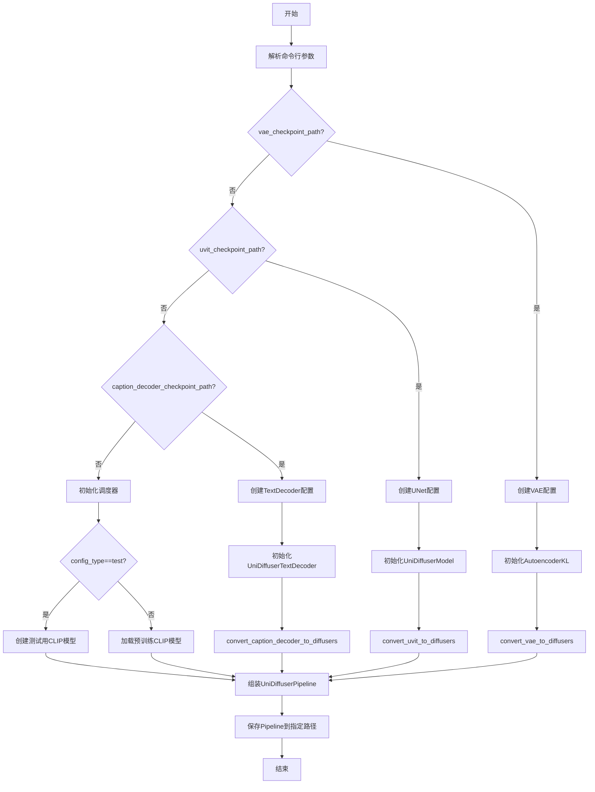

## 类结构

```
模块级别 (无类定义)
├── 全局配置函数
│   ├── create_vae_diffusers_config_* (test/big)
│   ├── create_unidiffuser_unet_config_* (test/big)
│   └── create_text_decoder_config_* (test/big)
├── 路径转换工具函数
│   ├── shave_segments
│   ├── renew_vae_resnet_paths
│   ├── renew_vae_attention_paths
│   ├── conv_attn_to_linear
│   └── assign_to_checkpoint
├── 模型转换函数
│   ├── convert_vae_to_diffusers
│   ├── convert_uvit_block_to_diffusers_block
│   ├── convert_uvit_to_diffusers
│   └── convert_caption_decoder_to_diffusers
└── 主入口 (if __name__ == "__main__")
```

## 全局变量及字段


### `SCHEDULER_CONFIG`
    
Configuration parameters for the DPMSolverMultistepScheduler, including beta start/end values, schedule type, and solver order.

类型：`Namespace`
    


### `args`
    
Parsed command-line arguments containing paths to VAE, U-ViT, and caption decoder checkpoints, output pipeline path, config type, version, and safe serialization flag.

类型：`Namespace`
    


    

## 全局函数及方法


### shave_segments

移除路径中的特定段，根据 n_shave_prefix_segments 的值决定移除前缀还是后缀段。

参数：
- `path`：`str`，要处理的原始路径字符串（例如 "encoder.down.0.block.0.weight"）
- `n_shave_prefix_segments`：`int`，默认为1，正值表示移除前n个段，负值表示移除后n个段

返回值：`str`，处理后的路径字符串

#### 流程图

```mermaid
flowchart TD
    A[开始] --> B{n_shave_prefix_segments >= 0?}
    B -->|是| C[使用 path.split('.')[n_shave_prefix_segments:] 保留后半部分]
    B -->|否| D[使用 path.split('.')[:n_shave_prefix_segments] 保留前半部分]
    C --> E[用 '.'.join 重新拼接]
    D --> E
    E --> F[返回处理后的路径]
```

#### 带注释源码

```python
def shave_segments(path, n_shave_prefix_segments=1):
    """
    Removes segments. Positive values shave the first segments, negative shave the last segments.
    
    参数:
        path: str, 原始路径字符串，如 "encoder.down.0.block.0.weight"
        n_shave_prefix_segments: int, 要移除的段数。正值移除前缀，负值移除后缀
    
    返回:
        str: 处理后的路径字符串
    """
    # 如果 n_shave_prefix_segments >= 0，移除前n个段
    if n_shave_prefix_segments >= 0:
        # 示例: path = "encoder.down.0.block.0.weight", n_shave_prefix_segments = 1
        # split(".") 后得到 ["encoder", "down", "0", "block", "0", "weight"]
        # [1:] 取下标1及之后的元素，得到 ["down", "0", "block", "0", "weight"]
        # ".".join 重新拼接为 "down.0.block.0.weight"
        return ".".join(path.split(".")[n_shave_prefix_segments:])
    else:
        # 如果 n_shave_prefix_segments < 0，移除后n个段
        # 示例: path = "encoder.down.0.block.0.weight", n_shave_prefix_segments = -1
        # split(".") 后得到 ["encoder", "down", "0", "block", "0", "weight"]
        # [:-1] 取最后一个元素之前的部分，得到 ["encoder", "down", "0", "block", "0"]
        # ".".join 重新拼接为 "encoder.down.0.block.0"
        return ".".join(path.split(".")[:n_shave_prefix_segments])
```

#### 关键组件信息

| 组件名称 | 一句话描述 |
|---------|-----------|
| `renew_vae_resnet_paths` | 使用 shave_segments 更新 VAE resnet 路径的映射函数 |
| `renew_vae_attention_paths` | 使用 shave_segments 更新 VAE attention 路径的映射函数 |
| `assign_to_checkpoint` | 将转换后的权重分配到新检查点的核心函数 |

#### 潜在技术债务或优化空间

1. **硬编码默认值**：n_shave_prefix_segments 的默认值在不同调用处可能不同，缺乏统一管理
2. **错误处理不足**：函数未对空字符串或 None 值进行校验，可能导致运行时错误
3. **文档注释可增强**：可以添加更多使用示例说明正负值的具体效果

#### 其它项目

- **设计目标**：提供灵活的路径段移除功能，用于模型权重检查点的路径转换
- **调用场景**：该函数被 `renew_vae_resnet_paths` 和 `renew_vae_attention_paths` 调用，用于在模型格式转换过程中重命名权重路径
- **边界情况**：当 path 不包含分隔符 "." 时，直接返回原 path；当 n_shave_prefix_segments 超过实际段数时，可能返回空字符串


### `renew_vae_resnet_paths`

该函数用于将 UniDiffuser VAE 检查点中的 resnet 路径更新为 diffusers 命名约定，执行本地重命名操作（主要是将 "nin_shortcut" 替换为 "conv_shortcut"，并根据需要切割路径前缀）。

参数：

- `old_list`：`List[str]`，旧路径列表，包含需要重命名的原始键名
- `n_shave_prefix_segments`：`int`，默认为 0，控制 `shave_segments` 函数切割前缀段的数量

返回值：`List[Dict[str, str]]`，返回包含 "old" 和 "new" 键的字典列表，表示旧路径到新路径的映射关系

#### 流程图

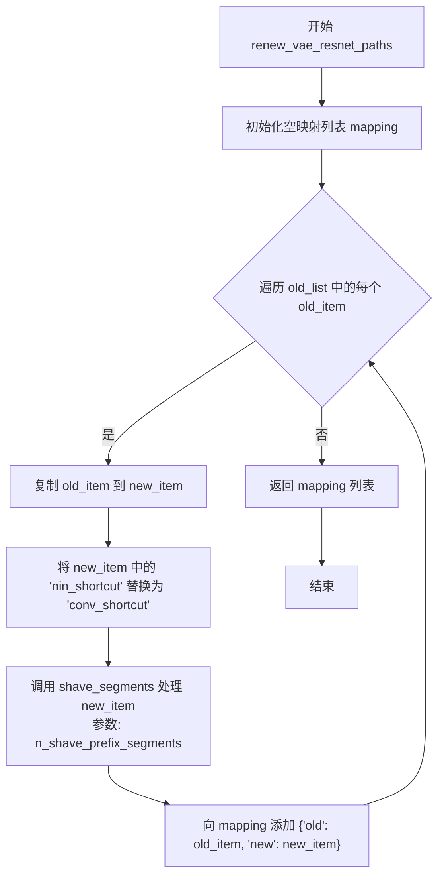

#### 带注释源码

```
# 将 VAE resnet 路径转换为新的 diffusers 命名方案
def renew_vae_resnet_paths(old_list, n_shave_prefix_segments=0):
    """
    Updates paths inside resnets to the new naming scheme (local renaming)
    """
    # 初始化映射列表，用于存储旧路径到新路径的转换关系
    mapping = []
    
    # 遍历输入的旧路径列表
    for old_item in old_list:
        # 复制当前旧路径作为新路径的起点
        new_item = old_item

        # 执行字符串替换：将 "nin_shortcut" 替换为 "conv_shortcut"
        # 这是 VAE 模型从旧版 checkpoint 转换到新版的关键命名变更
        new_item = new_item.replace("nin_shortcut", "conv_shortcut")
        
        # 调用 shave_segments 函数处理路径前缀
        # n_shave_prefix_segments 参数控制要切割的前缀段数
        # 正数表示切掉前几个分段，负数表示保留前几个分段
        new_item = shave_segments(new_item, n_shave_prefix_segments=n_shave_prefix_segments)

        # 将转换后的映射关系添加到列表中
        mapping.append({"old": old_item, "new": new_item})

    # 返回完整的路径映射列表
    return mapping
```

#### 关键说明

1. **功能定位**：此函数是 VAE 检查点转换流程中的局部重命名步骤，配合 `assign_to_checkpoint` 完成全局路径转换
2. **调用场景**：在 `convert_vae_to_diffusers` 函数中被多次调用，分别处理 encoder/decoder 的 down_blocks、mid_block、up_blocks 中的 resnet 层
3. **依赖函数**：内部调用 `shave_segments` 函数进行路径前缀处理，该函数定义在代码前部
4. **转换示例**：
   - 输入：`"encoder.down.0.block.0.nin_shortcut.weight"`
   - 输出（n_shave_prefix_segments=0）：`"encoder.down.0.block.0.conv_shortcut.weight"`
   - 输出（n_shave_prefix_segments=1）：`"down.0.block.0.conv_shortcut.weight"`（去掉了 "encoder." 前缀）


### `renew_vae_attention_paths`

该函数用于将 UniDiffuser 检查点中的 VAE 注意力层路径转换为 Diffusers 格式的路径，通过一系列字符串替换实现本地重命名。

参数：

- `old_list`：`List[str]`，需要转换的旧路径列表
- `n_shave_prefix_segments`：`int`，可选参数，默认为 0，表示需要去除的前缀段数量

返回值：`List[Dict[str, str]]`，返回包含旧路径和新路径映射的字典列表

#### 流程图

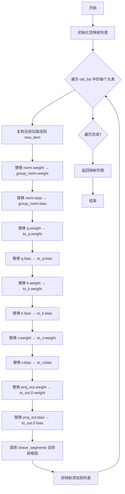

#### 带注释源码

```python
# Copied from diffusers.pipelines.stable_diffusion.convert_from_ckpt.renew_vae_attention_paths
def renew_vae_attention_paths(old_list, n_shave_prefix_segments=0):
    """
    Updates paths inside attentions to the new naming scheme (local renaming)
    """
    mapping = []
    for old_item in old_list:
        new_item = old_item

        # 归一化层重命名
        new_item = new_item.replace("norm.weight", "group_norm.weight")
        new_item = new_item.replace("norm.bias", "group_norm.bias")

        # Query 权重重命名
        new_item = new_item.replace("q.weight", "to_q.weight")
        new_item = new_item.replace("q.bias", "to_q.bias")

        # Key 权重重命名
        new_item = new_item.replace("k.weight", "to_k.weight")
        new_item = new_item.replace("k.bias", "to_k.bias")

        # Value 权重重命名
        new_item = new_item.replace("v.weight", "to_v.weight")
        new_item = new_item.replace("v.bias", "to_v.bias")

        # 输出投影重命名
        new_item = new_item.replace("proj_out.weight", "to_out.0.weight")
        new_item = new_item.replace("proj_out.bias", "to_out.0.bias")

        # 去除前缀段
        new_item = shave_segments(new_item, n_shave_prefix_segments=n_shave_prefix_segments)

        # 添加到映射列表
        mapping.append({"old": old_item, "new": new_item})

    return mapping
```


### `conv_attn_to_linear`

该函数用于将 UniDiffuser 检查点中的卷积注意力权重转换为线性层权重，通过移除多余的维度（从卷积权重中提取中心切片），确保与 diffusers 格式兼容。

参数：

- `checkpoint`：`Dict`，PyTorch 模型状态字典，包含模型权重，函数会直接修改此字典

返回值：`None`，函数无返回值，直接修改传入的 `checkpoint` 字典

#### 流程图

```mermaid
flowchart TD
    A[开始] --> B[获取 checkpoint 的所有键列表]
    B --> C[定义注意力权重键列表: query.weight, key.weight, value.weight]
    C --> D[遍历所有键]
    D --> E{检查键的最后两部分是否在 attn_keys 中}
    E -->|是| F{权重维度是否 > 2}
    F -->|是| G[执行切片: checkpoint[key][:, :, 0, 0]]
    F -->|否| H[跳过当前键]
    G --> I{继续遍历}
    E -->|否| J{检查键是否包含 proj_attn.weight}
    J -->|是| K{权重维度是否 > 2}
    K -->|是| L[执行切片: checkpoint[key][:, :, 0]]
    K -->|否| I
    J -->|否| I
    I --> M{遍历结束?}
    M -->|否| D
    M -->|是| N[结束]
```

#### 带注释源码

```
# Copied from diffusers.pipelines.stable_diffusion.convert_from_ckpt.conv_attn_to_linear
def conv_attn_to_linear(checkpoint):
    """
    将卷积注意力权重转换为线性层权重。
    对于注意力机制的 query/key/value 权重，从 4D 卷积权重中提取中心切片变为 2D；
    对于 proj_attn.weight，从 3D 卷积权重中提取中心切片变为 2D。
    
    参数:
        checkpoint: 包含模型权重的字典，将被直接修改
        
    返回:
        无返回值，直接修改传入的 checkpoint 字典
    """
    # 获取检查点中所有键的列表
    keys = list(checkpoint.keys())
    
    # 定义注意力机制中需要转换的权重键
    # 这些是 QKV 投影的权重名称
    attn_keys = ["query.weight", "key.weight", "value.weight"]
    
    # 遍历检查点中的所有键
    for key in keys:
        # 获取键名的最后两个部分，用于匹配注意力权重
        # 例如: "encoder.mid_block.attentions.0.to_q.weight" -> "to_q.weight"
        # 但这里实际匹配的是完整的最后两个部分，如 "query.weight"
        if ".".join(key.split(".")[-2:]) in attn_keys:
            # 检查权重是否为卷积形式（维度 > 2）
            if checkpoint[key].ndim > 2:
                # 从 4D 卷积权重 [out_channels, in_channels, height, width] 
                # 提取中心切片变为 2D 线性权重 [out_channels, in_channels]
                # 相当于取卷积核中心位置的权重
                checkpoint[key] = checkpoint[key][:, :, 0, 0]
        # 处理投影注意力权重
        elif "proj_attn.weight" in key:
            # 检查权重是否为卷积形式（维度 > 2）
            if checkpoint[key].ndim > 2:
                # 从 3D 卷积权重 [out_channels, in_channels, length]
                # 提取中心切片变为 2D 线性权重 [out_channels, in_channels]
                checkpoint[key] = checkpoint[key][:, :, 0]
```


### `assign_to_checkpoint`

该函数执行模型权重转换的最后一步：接收本地转换后的权重路径映射表，进行全局重命名（将旧版中间块命名转换为新版ResNet和注意力模块命名），并将权重从旧检查点分配到新检查点。如果需要，还会将注意力层的权重拆分为 Query、Key、Value 三个独立的权重。

参数：

- `paths`：`List[Dict[str, str]]`，包含 "old" 和 "new" 键的字典列表，定义权重路径的映射关系
- `checkpoint`：`Dict[str, torch.Tensor]`，目标新检查点字典，用于存储转换后的权重
- `old_checkpoint`：`Dict[str, torch.Tensor]`，源旧检查点字典，包含原始权重
- `attention_paths_to_split`：`Optional[Dict[str, Dict[str, str]]]`，可选参数，需要拆分的注意力层路径映射，键为原路径，值为包含 "query"、"key"、"value" 新路径的字典
- `additional_replacements`：`Optional[List[Dict[str, str]]]`，可选参数，额外的字符串替换规则列表，每个元素包含 "old" 和 "new" 键
- `num_head_channels`：`int`，默认为 1，每个注意力头的通道数，用于计算注意力层的分割维度

返回值：`None`，函数直接修改 `checkpoint` 字典，不返回值

#### 流程图

```mermaid
flowchart TD
    A[开始 assign_to_checkpoint] --> B{paths 是否为列表}
    B -->|否| C[抛出 AssertionError]
    B -->|是| D{attention_paths_to_split 不为空?}
    D -->|是| E[遍历 attention_paths_to_split]
    E --> F[从 old_checkpoint 获取张量]
    F --> G[计算通道数和头数]
    G --> H[重塑张量并分割为 Q/K/V]
    H --> I[将 Q/K/V 写入 checkpoint]
    I --> J{还有更多路径?}
    J -->|是| E
    J -->|否| K{遍历 paths}
    D -->|否| K
    K --> L[获取新路径 new_path]
    L --> M{该路径已在 attention_paths_to_split 中?}
    M -->|是| N[跳过当前路径]
    M -->|否| O[全局重命名: middle_block 替换]
    O --> P{additional_replacements 不为空?}
    P -->|是| Q[应用额外替换规则]
    P -->|否| R{是注意力权重且为3D?}
    Q --> R
    R -->|是| S[提取 [:, :, 0] 并写入 checkpoint]
    R -->|否| T{是注意力权重且为4D?}
    T -->|是| U[提取 [:, :, 0, 0] 并写入 checkpoint]
    T -->|否| V[直接复制权重到 checkpoint]
    N --> K
    S --> W{还有更多路径?}
    U --> W
    V --> W
    W -->|是| K
    W -->|否| X[结束]
```

#### 带注释源码

```python
def assign_to_checkpoint(
    paths,
    checkpoint,
    old_checkpoint,
    attention_paths_to_split=None,
    additional_replacements=None,
    num_head_channels=1,
):
    """
    This does the final conversion step: take locally converted weights and apply a global renaming to them. It splits
    attention layers, and takes into account additional replacements that may arise.

    Assigns the weights to the new checkpoint.
    """
    # 验证 paths 参数类型，确保是包含 'old' 和 'new' 键的字典列表
    assert isinstance(paths, list), "Paths should be a list of dicts containing 'old' and 'new' keys."

    # 如果存在需要拆分的注意力路径，则先将注意力层拆分为 Query、Key、Value
    if attention_paths_to_split is not None:
        for path, path_map in attention_paths_to_split.items():
            # 从旧检查点获取需要拆分的原始张量
            old_tensor = old_checkpoint[path]
            # 计算通道数：将张量第一维除以 3（因为 Q、K、V 各占一份）
            channels = old_tensor.shape[0] // 3

            # 根据原始张量维度确定目标形状
            # 3D 张量目标形状为 (-1, channels)，4D 张量目标形状为 (-1)
            target_shape = (-1, channels) if len(old_tensor.shape) == 3 else (-1)

            # 计算注意力头数量：通道总数除以每头的通道数再除以 3
            num_heads = old_tensor.shape[0] // num_head_channels // 3

            # 重塑张量以便分割：将 (总通道数, ...) 重塑为 (num_heads, 3 * channels_per_head, ...)
            old_tensor = old_tensor.reshape((num_heads, 3 * channels // num_heads) + old_tensor.shape[1:])
            # 按通道维度分割为 Query、Key、Value 三个张量
            query, key, value = old_tensor.split(channels // num_heads, dim=1)

            # 将分割后的 Q、K、V 写入新检查点，使用目标形状重塑
            checkpoint[path_map["query"]] = query.reshape(target_shape)
            checkpoint[path_map["key"]] = key.reshape(target_shape)
            checkpoint[path_map["value"]] = value.reshape(target_shape)

    # 遍历所有路径映射，进行全局重命名并复制权重
    for path in paths:
        new_path = path["new"]

        # 如果该路径已在 attention_paths_to_split 中处理过，则跳过
        if attention_paths_to_split is not None and new_path in attention_paths_to_split:
            continue

        # 执行全局重命名：将旧版中间块命名转换为新版 diffusers 命名
        new_path = new_path.replace("middle_block.0", "mid_block.resnets.0")
        new_path = new_path.replace("middle_block.1", "mid_block.attentions.0")
        new_path = new_path.replace("middle_block.2", "mid_block.resnets.1")

        # 应用额外的替换规则（如需要）
        if additional_replacements is not None:
            for replacement in additional_replacements:
                new_path = new_path.replace(replacement["old"], replacement["new"])

        # 检查是否为注意力权重且需要形状转换
        # proj_attn.weight 需要从 1D 卷积转换为线性层，或者注意力层的 to_q/k/v 权重
        is_attn_weight = "proj_attn.weight" in new_path or ("attentions" in new_path and "to_" in new_path)
        # 获取旧检查点中对应权重的形状
        shape = old_checkpoint[path["old"]].shape
        
        # 根据形状进行不同的处理
        if is_attn_weight and len(shape) == 3:
            # 3D 权重（如 Conv1D）：提取第一个时间步 [:, :, 0]
            checkpoint[new_path] = old_checkpoint[path["old"]][:, :, 0]
        elif is_attn_weight and len(shape) == 4:
            # 4D 权重（如 Conv2D）：提取左上角像素 [:, :, 0, 0]
            checkpoint[new_path] = old_checkpoint[path["old"]][:, :, 0, 0]
        else:
            # 普通权重：直接复制
            checkpoint[new_path] = old_checkpoint[path["old"]]
```


### `create_vae_diffusers_config`

该函数是 UniDiffuser 检查点转换工具中的 VAE 配置创建工厂函数，根据传入的 `config_type` 参数返回对应规模的 VAE 配置字典（测试配置或大型配置），用于初始化 diffusers 格式的 AutoencoderKL 模型。

参数：

- `config_type`：`str`，配置类型，指定要创建的 VAE 配置规模，目前支持 `"test"`（测试用小规模配置）和 `"big"`（生产用大规模配置）

返回值：`dict`，返回包含 VAE 模型配置的字典，包括样本大小、输入输出通道数、块类型、通道数、潜在通道数和每块层数等关键参数

#### 流程图

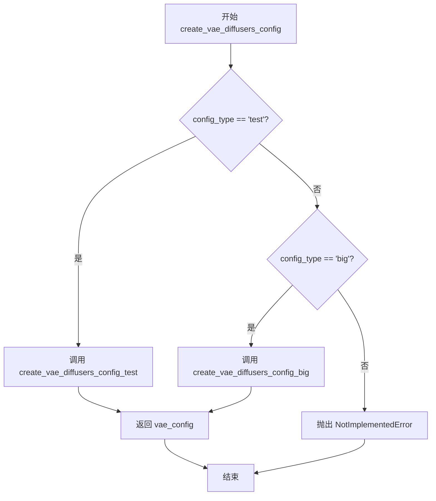

#### 带注释源码

```python
def create_vae_diffusers_config(config_type):
    """
    根据配置类型创建对应的 VAE 配置字典。
    
    参数:
        config_type (str): 配置类型，'test' 或 'big'
        
    返回:
        dict: VAE 配置字典，包含模型结构参数
    """
    # 注意：这里存在一个设计缺陷 - 使用了全局变量 args.config_type
    # 而不是函数参数 config_type，这会导致参数传递失效
    if args.config_type == "test":
        # 调用测试配置创建函数，返回小规模 VAE 配置
        vae_config = create_vae_diffusers_config_test()
    elif args.config_type == "big":
        # 调用大型配置创建函数，返回大规模 VAE 配置
        vae_config = create_vae_diffusers_config_big()
    else:
        # 配置类型不支持时抛出异常
        raise NotImplementedError(
            f"Config type {config_type} is not implemented, currently only config types"
            " 'test' and 'big' are available."
        )
    return vae_config


def create_vae_diffusers_config_test():
    """创建测试用的小规模 VAE 配置"""
    vae_config = {
        "sample_size": 32,           # 输入图像分辨率
        "in_channels": 3,            # 输入通道数（RGB）
        "out_channels": 3,           # 输出通道数
        "down_block_types": ["DownEncoderBlock2D", "DownEncoderBlock2D"],  # 编码器下采样块类型
        "up_block_types": ["UpDecoderBlock2D", "UpDecoderBlock2D"],       # 解码器上采样块类型
        "block_out_channels": [32, 64],  # 各块的输出通道数
        "latent_channels": 4,        # 潜在空间通道数
        "layers_per_block": 1,      # 每个块中的残差层数
    }
    return vae_config


def create_vae_diffusers_config_big():
    """创建生产用的大规模 VAE 配置（UniDiffuser-v1）"""
    vae_config = {
        "sample_size": 256,          # 高分辨率输入
        "in_channels": 3,
        "out_channels": 3,
        "down_block_types": [
            "DownEncoderBlock2D", 
            "DownEncoderBlock2D", 
            "DownEncoderBlock2D", 
            "DownEncoderBlock2D"
        ],
        "up_block_types": [
            "UpDecoderBlock2D", 
            "UpDecoderBlock2D", 
            "UpDecoderBlock2D", 
            "UpDecoderBlock2D"
        ],
        "block_out_channels": [128, 256, 512, 512],  # 更大的通道数
        "latent_channels": 4,
        "layers_per_block": 2,       # 更深的网络结构
    }
    return vae_config
```

### 关键组件信息

| 组件名称 | 描述 |
|---------|------|
| `create_vae_diffusers_config` | VAE 配置工厂函数，根据类型返回对应配置 |
| `create_vae_diffusers_config_test` | 创建测试用小规模 VAE 配置（2层下采样，32/64通道） |
| `create_vae_diffusers_config_big` | 创建生产用大规模 VAE 配置（4层下采样，128-512通道） |
| `SCHEDULER_CONFIG` | 全局调度器配置命名空间（Beta 起始/结束值、调度方式、求解器阶数） |

### 潜在的技术债务或优化空间

1. **函数参数未使用（Bug）**：`create_vae_diffusers_config` 函数接收 `config_type` 参数但实际使用全局变量 `args.config_type`，导致函数参数设计失效。应统一使用传入的参数 `config_type`。

2. **配置硬编码**：VAE 配置直接硬编码在函数中，缺乏灵活性。建议改为从配置文件或预定义常量加载。

3. **缺乏配置验证**：没有对 `config_type` 参数进行输入验证（如空值检查、类型检查），可能产生隐藏错误。

4. **重复代码模式**：`create_vae_diffusers_config`、`create_unidiffuser_unet_config`、`create_text_decoder_config` 三个函数具有相同的条件分支逻辑，可提取为通用的配置工厂模式。

5. **错误信息不够友好**：未提供可用配置类型的完整列表，用户可能不清楚具体支持哪些选项。

### 其它项目

- **设计目标**：提供 UniDiffuser 原生检查点到 diffusers 格式的 VAE 模型配置转换能力
- **约束**：仅支持 `"test"` 和 `"big"` 两种配置类型
- **错误处理**：对不支持的配置类型抛出 `NotImplementedError` 异常
- **数据流**：配置创建 → 模型实例化 → 检查点权重转换 → 模型加载
- **外部依赖**：依赖 `diffusers` 库的 `AutoencoderKL` 类和 `argparse` 模块


### `create_unidiffuser_unet_config`

该函数用于根据配置类型（test 或 big）和版本号创建 UniDiffuser UNet 模型的配置字典。对于 UniDiffuser-v1 版本，还会额外启用数据类型嵌入（data type embedding）。

参数：

- `config_type`：`str`，配置类型，指定创建"test"（测试用小模型）或"big"（完整模型）的配置
- `version`：`int`，UniDiffuser 模型版本号，0 表示 v0，1 表示 v1

返回值：`dict`，返回包含 UniDiffuser UNet 模型配置的字典，包括文本维度、图像维度、注意力头数、层数等关键参数

#### 流程图

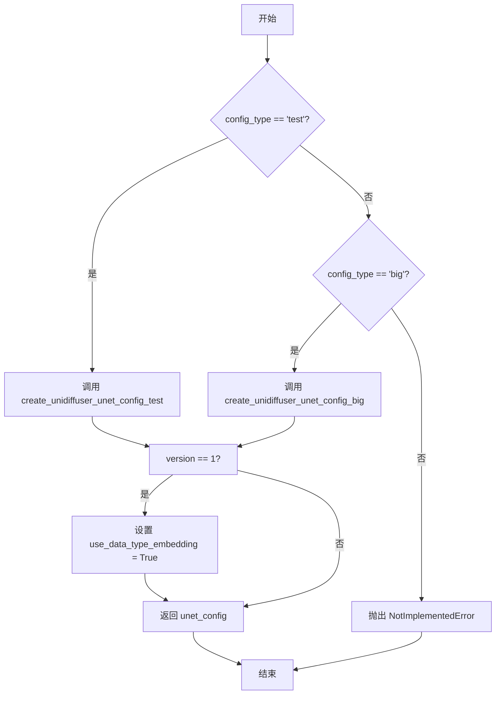

#### 带注释源码

```python
def create_unidiffuser_unet_config(config_type, version):
    """
    根据配置类型和版本创建 UniDiffuser UNet 模型配置。

    参数:
        config_type (str): 配置类型，"test" 或 "big"
        version (int): 模型版本，0 或 1

    返回:
        dict: 包含 UNet 模型配置的字典
    """
    # Hardcoded for now - 目前配置是硬编码的
    if args.config_type == "test":  # 注意：这里使用了 args.config_type 而不是参数 config_type，存在 bug
        unet_config = create_unidiffuser_unet_config_test()  # 获取测试配置
    elif args.config_type == "big":
        unet_config = create_unidiffuser_unet_config_big()   # 获取大模型配置
    else:
        raise NotImplementedError(
            f"Config type {config_type} is not implemented, currently only config types"
            " 'test' and 'big' are available."
        )
    
    # Unidiffuser-v1 uses data type embeddings - v1 版本使用数据类型嵌入
    if version == 1:
        unet_config["use_data_type_embedding"] = True
    
    return unet_config  # 返回配置字典
```

---

**技术债务/优化空间**：
1. **参数使用错误**：函数接收参数 `config_type` 和 `version`，但在条件判断中使用了全局变量 `args.config_type` 而不是参数 `config_type`，这会导致函数行为不符合预期，应改为直接使用 `config_type` 参数。
2. **硬编码配置**：目前配置是硬编码的，可以考虑从配置文件或外部参数加载，提高灵活性。
3. **版本判断不完整**：仅判断了 version == 1 的情况，version == 0 时没有明确处理。


### `create_text_decoder_config`

根据配置类型返回对应的文本解码器配置。该函数是一个配置工厂函数，根据传入的 `config_type` 参数（"test" 或 "big"）返回不同规模的文本解码器配置字典。

参数：

- `config_type`：`str`，配置类型标识符，用于指定返回哪种规模的配置。支持的值为 "test"（测试用的小规模配置）和 "big"（生产用的大规模配置）。

返回值：`dict`，包含文本解码器完整配置参数的字典，包括前缀长度、词表大小、层数、注意力头数等模型架构参数。

#### 流程图

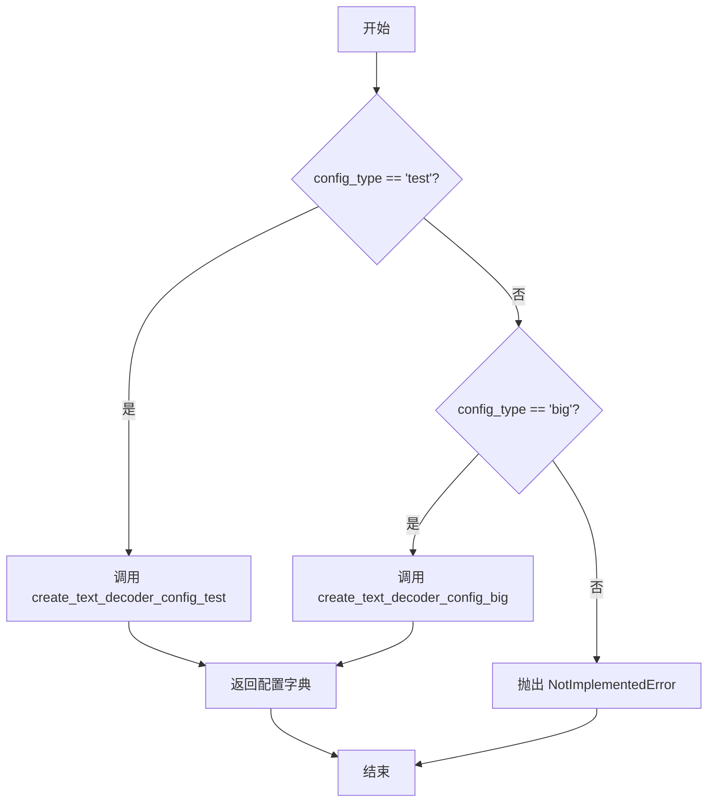

#### 带注释源码

```python
def create_text_decoder_config(config_type):
    """
    根据配置类型返回对应的文本解码器配置。
    
    这是一个工厂函数，用于创建不同规模的 UniDiffuserTextDecoder 配置。
    目前支持两种配置类型：'test'（小规模测试配置）和 'big'（大规模生产配置）。
    """
    # Hardcoded for now
    # 目前配置是硬编码的，未来可能从配置文件或外部来源加载
    if args.config_type == "test":
        # 测试配置：使用较小的模型维度，用于快速验证和测试
        text_decoder_config = create_text_decoder_config_test()
    elif args.config_type == "big":
        # 生产配置：使用完整规模的模型，对应 UniDiffuser-v1 的实际部署配置
        text_decoder_config = create_text_decoder_config_big()
    else:
        # 如果传入不支持的配置类型，抛出明确的错误信息
        raise NotImplementedError(
            f"Config type {config_type} is not implemented, currently only config types"
            " 'test' and 'big' are available."
        )
    return text_decoder_config
```


### `create_vae_diffusers_config_test`

该函数是一个配置工厂方法，用于生成 UniDiffuser 模型中 VAE（变分自编码器）的测试配置。它返回一个预定义的字典，包含了 VAE 模型的关键架构参数，如输入输出通道数、块类型、通道维度等，这些参数适配了 diffusers 库中 AutoencoderKL 的构造函数需求，使得可以快速创建用于单元测试或快速原型开发的小规模 VAE 模型实例。

参数：

- 该函数无参数

返回值：`dict`，返回包含 VAE 测试配置项的字典，键包括 sample_size（样本尺寸）、in_channels（输入通道数）、out_channels（输出通道数）、down_block_types（下采样块类型列表）、up_block_types（上采样块类型列表）、block_out_channels（各块的输出通道数列表）、latent_channels（潜在空间通道数）以及 layers_per_block（每块的层数）。

#### 流程图

```mermaid
flowchart TD
    A[开始] --> B[创建 vae_config 字典]
    B --> C[设置 sample_size: 32]
    C --> D[设置 in_channels: 3]
    D --> E[设置 out_channels: 3]
    E --> F[设置 down_block_types: DownEncoderBlock2D x2]
    F --> G[设置 up_block_types: UpDecoderBlock2D x2]
    G --> H[设置 block_out_channels: [32, 64]]
    H --> I[设置 latent_channels: 4]
    I --> J[设置 layers_per_block: 1]
    J --> K[返回 vae_config 字典]
    K --> L[结束]
```

#### 带注释源码

```python
# Hardcoded configs for test versions of the UniDiffuser models, corresponding to those in the fast default tests.
def create_vae_diffusers_config_test():
    """
    创建用于测试的 VAE diffusers 配置。
    
    该函数返回一个硬编码的字典，包含 VAE 模型的所有关键架构参数。
    这些参数对应于 diffusers 库中 AutoencoderKL 的构造函数参数，
    用于创建一个小规模的 VAE 模型实例，适合单元测试和快速原型开发。
    """
    # 定义 VAE 配置字典，包含模型架构的所有关键参数
    vae_config = {
        "sample_size": 32,                           # 输入图像的尺寸（高宽），设为 32x32 像素
        "in_channels": 3,                             # 输入通道数，3 对应 RGB 图像
        "out_channels": 3,                            # 输出通道数，同样为 3（RGB）
        "down_block_types": [                         # 下采样（编码器）块的类型列表
            "DownEncoderBlock2D",                     # 第一个下采样块
            "DownEncoderBlock2D"                      # 第二个下采样块
        ],
        "up_block_types": [                           # 上采样（解码器）块的类型列表
            "UpDecoderBlock2D",                       # 第一个上采样块
            "UpDecoderBlock2D"                        # 第二个上采样块
        ],
        "block_out_channels": [32, 64],               # 各块的输出通道数列表
        "latent_channels": 4,                         # 潜在空间的通道数（VAE 压缩后的维度）
        "layers_per_block": 1,                        # 每个块中包含的残差层数量
    }
    # 返回完整的配置字典，供 AutoencoderKL(**vae_config) 使用
    return vae_config
```


### `create_unidiffuser_unet_config_test`

该函数用于创建 UniDiffuser 模型中 U-Net（统一_diffuser）组件的测试配置参数集合，返回一个包含模型架构、超参数等配置的字典。

参数： 无

返回值：`dict`，返回包含 UniDiffuser U-Net 测试模型配置的字典，包含文本维度、图像维度、注意力头数、层数、归一化类型等关键配置信息。

#### 流程图

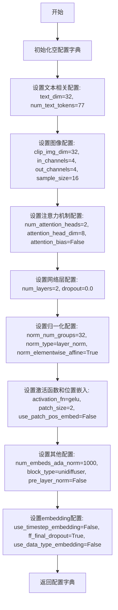

#### 带注释源码

```python
def create_unidiffuser_unet_config_test():
    """
    创建 UniDiffuser U-Net 测试模型的配置参数。
    用于快速测试的轻量级配置，对应 diffusers 库中的 UniDiffuserModel。
    """
    # 构建包含所有 U-Net 配置项的字典
    unet_config = {
        # 文本嵌入维度配置
        "text_dim": 32,               # 文本特征的嵌入维度
        "clip_img_dim": 32,           # CLIP 图像特征的嵌入维度
        "num_text_tokens": 77,        # 文本 token 的最大数量（与 CLIP tokenizer 对应）
        
        # 注意力机制配置
        "num_attention_heads": 2,     # 注意力头的数量
        "attention_head_dim": 8,      # 每个注意力头的维度
        "attention_bias": False,      # 是否在注意力层使用偏置
        
        # 输入输出通道配置
        "in_channels": 4,              # 输入通道数（latent space 维度）
        "out_channels": 4,            # 输出通道数
        
        # 网络层配置
        "num_layers": 2,              # Transformer 层的数量
        "dropout": 0.0,               # Dropout 概率
        
        # 归一化配置
        "norm_num_groups": 32,         # Group Normalization 的组数
        "norm_type": "layer_norm",    # 归一化类型（LayerNorm）
        "norm_elementwise_affine": True,  # 是否使用可学习的仿射参数
        
        # 图像尺寸配置
        "sample_size": 16,             # 输入图像的空间尺寸（用于测试）
        "patch_size": 2,               # 图像分块大小
        
        # 激活函数配置
        "activation_fn": "gelu",       # 激活函数类型（Gaussian Error Linear Unit）
        
        # 自适应归一化配置
        "num_embeds_ada_norm": 1000,   # 自适应归一化使用的 embedding 数量
        
        # 模块类型配置
        "block_type": "unidiffuser",   # 块类型标识
        
        # 归一化位置配置
        "pre_layer_norm": False,       # 是否在层前进行归一化（False 表示层后归一化）
        
        # 时间步 embedding 配置
        "use_timestep_embedding": False,  # 是否使用时间步 embedding
        
        # 位置编码配置
        "use_patch_pos_embed": False,    # 是否使用分块位置编码
        
        # Dropout 配置
        "ff_final_dropout": True,        # 前馈网络最终层是否使用 dropout
        
        # 数据类型 embedding 配置
        "use_data_type_embedding": False, # 是否使用数据类型 embedding（UniDiffuser-v1 需设为 True）
    }
    return unet_config
```


### `create_text_decoder_config_test`

该函数用于创建 UniDiffuser 模型文本解码器（text_decoder）的测试配置，返回一个包含模型超参数的字典，该配置对应于快速默认测试中的小型模型配置。

参数： 无

返回值：`dict`，返回文本解码器的测试配置字典，包含模型的结构参数（如层数、注意力头数、嵌入维度等）。

#### 流程图

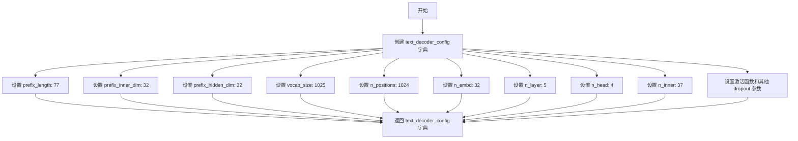

#### 带注释源码

```python
def create_text_decoder_config_test():
    """
    创建 UniDiffuser 文本解码器的测试配置。
    
    返回一个包含小型测试模型超参数的字典，用于快速默认测试。
    这些参数对应于一个规模较小的文本解码器，适合用于开发调试和功能验证。
    """
    text_decoder_config = {
        "prefix_length": 77,          # 前缀序列长度，与 CLIP 文本 token 数量一致
        "prefix_inner_dim": 32,       # 前缀内部维度
        "prefix_hidden_dim": 32,      # 前缀隐藏层维度
        "vocab_size": 1025,           # 词汇表大小 = 1024 + 1（新增的 EOS token）
        "n_positions": 1024,           # 最大位置编码数量
        "n_embd": 32,                 # 嵌入维度
        "n_layer": 5,                 # Transformer 层数
        "n_head": 4,                  # 注意力头数
        "n_inner": 37,                # 内部前馈网络维度
        "activation_function": "gelu",  # 激活函数类型
        "resid_pdrop": 0.1,           # 残差连接 dropout 概率
        "embd_pdrop": 0.1,            # 嵌入层 dropout 概率
        "attn_pdrop": 0.1,            # 注意力层 dropout 概率
        "layer_norm_epsilon": 1e-5,   # LayerNorm epsilon 参数
        "initializer_range": 0.02,    # 权重初始化范围
    }
    return text_decoder_config
```


### `create_vae_diffusers_config_big`

该函数用于创建 UniDiffuser V1 大型模型的 VAE（Variational Autoencoder）配置字典，定义了编码器和解码器的架构参数，包括输入输出通道、下采样/上采样块类型、块通道数和每块的层数等。

参数： 无

返回值：`dict`，返回包含 VAE 配置参数的字典，用于初始化 `AutoencoderKL` 模型

#### 流程图

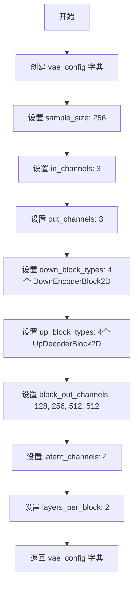

#### 带注释源码

```
def create_vae_diffusers_config_big():
    """
    创建 UniDiffuser V1 大型模型的 VAE 配置。
    
    该配置对应 HuggingFace 模型 thu-ml/unidiffuser-v1。
    参考: https://github.com/thu-ml/unidiffuser/blob/main/configs/sample_unidiffuser_v1.py
    """
    # 定义 VAE 配置字典，包含模型架构的所有关键参数
    vae_config = {
        "sample_size": 256,                    # 输入图像的空间分辨率 (256x256)
        "in_channels": 3,                      # 输入图像的通道数 (RGB图像为3)
        "out_channels": 3,                     # 输出图像的通道数 (RGB图像为3)
        
        # 编码器(下采样)块的类型列表，从输入到潜在空间
        "down_block_types": [
            "DownEncoderBlock2D", 
            "DownEncoderBlock2D", 
            "DownEncoderBlock2D", 
            "DownDecoderBlock2D"  # 4级下采样
        ],
        
        # 解码器(上采样)块的类型列表，从潜在空间到输出
        "up_block_types": [
            "UpDecoderBlock2D", 
            "UpDecoderBlock2D", 
            "UpDecoderBlock2D", 
            "UpDecoderBlock2D"  # 4级上采样
        ],
        
        # 每个下采样/上采样块的输出通道数
        # 编码器: 3 -> 128 -> 256 -> 512 -> 512
        # 解码器: 512 -> 512 -> 256 -> 128 -> 3
        "block_out_channels": [128, 256, 512, 512],
        
        "latent_channels": 4,                   # 潜在空间的通道数 (VAE的z维度)
        "layers_per_block": 2,                 # 每个块中的残差层数量
    }
    
    # 返回完整的VAE配置字典
    # 此配置将用于初始化 diffusers 库的 AutoencoderKL 类
    return vae_config
```


### `create_unidiffuser_unet_config_big`

该函数用于创建 UniDiffuser 大型模型（big version）的 UNet 配置文件，包含模型的各种超参数和架构配置，如文本维度、图像维度、注意力头数、层数等。

参数：

- 该函数无参数

返回值：`Dict[str, Any]`，返回包含 UniDiffuser 大型 UNet 模型配置的字典

#### 流程图

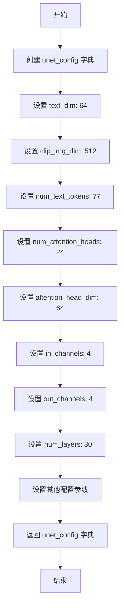

#### 带注释源码

```python
def create_unidiffuser_unet_config_big():
    """
    创建 UniDiffuser 大型模型的 UNet 配置文件。
    该配置对应于 UniDiffuser V1 模型（https://huggingface.co/thu-ml/unidiffuser-v1）
    
    返回:
        dict: 包含 UNet 模型配置参数的字典
    """
    # 初始化配置字典
    unet_config = {
        # 文本嵌入的维度
        "text_dim": 64,
        # CLIP 图像嵌入的维度
        "clip_img_dim": 512,
        # 文本 token 的数量
        "num_text_tokens": 77,
        # 注意力头的数量
        "num_attention_heads": 24,
        # 每个注意力头的维度
        "attention_head_dim": 64,
        # 输入通道数（潜在空间维度）
        "in_channels": 4,
        # 输出通道数
        "out_channels": 4,
        # Transformer 层数量
        "num_layers": 30,
        # Dropout 概率
        "dropout": 0.0,
        # 归一化组的数量
        "norm_num_groups": 32,
        # 是否使用注意力偏置
        "attention_bias": False,
        # 样本大小
        "sample_size": 64,
        # 补丁大小
        "patch_size": 2,
        # 激活函数类型
        "activation_fn": "gelu",
        # AdaNorm 嵌入数量
        "num_embeds_ada_norm": 1000,
        # 归一化类型
        "norm_type": "layer_norm",
        # 块类型
        "block_type": "unidiffuser",
        # 是否使用预层归一化
        "pre_layer_norm": False,
        # 是否使用时间步嵌入
        "use_timestep_embedding": False,
        # 是否使用元素级仿射归一化
        "norm_elementwise_affine": True,
        # 是否使用补丁位置嵌入
        "use_patch_pos_embed": False,
        # 前馈网络最终 dropout
        "ff_final_dropout": True,
        # 是否使用数据类型嵌入（V1 版本使用）
        "use_data_type_embedding": False,
    }
    # 返回配置字典
    return unet_config
```


### `create_text_decoder_config_big`

该函数用于创建大型 UniDiffuser 模型的文本解码器配置（Text Decoder），返回包含 GPT2 风格模型参数的字典配置。

参数：无参数

返回值：`dict`，返回文本解码器的配置字典，包含模型架构、超参数等信息

#### 流程图

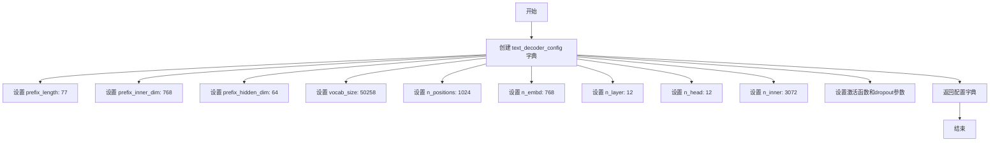

#### 带注释源码

```python
# From https://huggingface.co/gpt2/blob/main/config.json, the GPT2 checkpoint used by UniDiffuser
def create_text_decoder_config_big():
    """
    创建大型 UniDiffuser 模型的文本解码器配置。
    该配置对应 GPT2 模型的结构，用于文本解码器 (UniDiffuserTextDecoder)。
    """
    text_decoder_config = {
        "prefix_length": 77,           # 前缀长度，与 CLIP 文本 token 数量一致
        "prefix_inner_dim": 768,       # 前缀内部维度
        "prefix_hidden_dim": 64,       # 前缀隐藏层维度
        "vocab_size": 50258,           # 词汇表大小 (50257 + 1 用于新 EOS token)
        "n_positions": 1024,           # 最大位置编码数量
        "n_embd": 768,                 # 嵌入维度
        "n_layer": 12,                 # Transformer 层数
        "n_head": 12,                  # 注意力头数
        "n_inner": 3072,               # 前馈网络内部维度 (4 * n_embd)
        "activation_function": "gelu", # 激活函数
        "resid_pdrop": 0.1,            # 残差连接的 dropout 概率
        "embd_pdrop": 0.1,             # 嵌入层的 dropout 概率
        "attn_pdrop": 0.1,             # 注意力层的 dropout 概率
        "layer_norm_epsilon": 1e-5,    # LayerNorm 的 epsilon 值
        "initializer_range": 0.02,     # 权重初始化范围
    }
    return text_decoder_config
```


### `convert_vae_to_diffusers`

将 UniDiffuser 的 autoencoder_kl.pth 检查点转换为 Diffusers 格式的 AutoencoderKL 模型。

参数：

- `ckpt`：`str` 或 `Path`，原始 UniDiffuser VAE 检查点文件路径 (autoencoder_kl.pth)
- `diffusers_model`：`AutoencoderKL`，Diffusers 模型实例，用于加载转换后的权重
- `num_head_channels`：`int`，可选（默认值为 1），在 VAE 转换中未使用，但为保持接口一致性而保留

返回值：`AutoencoderKL`，加载转换后权重的新模型实例

#### 流程图

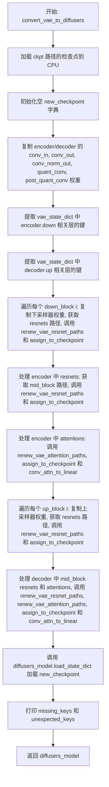

#### 带注释源码

```python
# 基于 diffusers.pipelines.stable_diffusion.convert_from_ckpt.convert_ldm_vae_checkpoint
def convert_vae_to_diffusers(ckpt, diffusers_model, num_head_channels=1):
    """
    Converts a UniDiffuser autoencoder_kl.pth checkpoint to a diffusers AutoencoderKL.
    
    参数:
        ckpt: 原始 UniDiffuser VAE 检查点文件路径 (autoencoder_kl.pth)
        diffusers_model: Diffusers AutoencoderKL 模型实例
        num_head_channels: 头部通道数，VAE 转换中未使用，保持接口一致性
    返回:
        加载转换后权重的 diffusers_model
    """
    # autoencoder_kl.pth ckpt 是 torch state dict
    # 加载检查点到 CPU 内存
    vae_state_dict = torch.load(ckpt, map_location="cpu")

    # 初始化新的检查点字典，用于存储转换后的权重
    new_checkpoint = {}

    # 复制 encoder 的输入卷积层权重和偏置
    new_checkpoint["encoder.conv_in.weight"] = vae_state_dict["encoder.conv_in.weight"]
    new_checkpoint["encoder.conv_in.bias"] = vae_state_dict["encoder.conv_in.bias"]
    # 复制 encoder 的输出卷积层权重和偏置
    new_checkpoint["encoder.conv_out.weight"] = vae_state_dict["encoder.conv_out.weight"]
    new_checkpoint["encoder.conv_out.bias"] = vae_state_dict["encoder.conv_out.bias"]
    # 复制 encoder 的归一化层权重和偏置
    new_checkpoint["encoder.conv_norm_out.weight"] = vae_state_dict["encoder.norm_out.weight"]
    new_checkpoint["encoder.conv_norm_out.bias"] = vae_state_dict["encoder.norm_out.bias"]

    # 复制 decoder 的输入卷积层权重和偏置
    new_checkpoint["decoder.conv_in.weight"] = vae_state_dict["decoder.conv_in.weight"]
    new_checkpoint["decoder.conv_in.bias"] = vae_state_dict["decoder.conv_in.bias"]
    # 复制 decoder 的输出卷积层权重和偏置
    new_checkpoint["decoder.conv_out.weight"] = vae_state_dict["decoder.conv_out.weight"]
    new_checkpoint["decoder.conv_out.bias"] = vae_state_dict["decoder.conv_out.bias"]
    # 复制 decoder 的归一化层权重和偏置
    new_checkpoint["decoder.conv_norm_out.weight"] = vae_state_dict["decoder.norm_out.weight"]
    new_checkpoint["decoder.conv_norm_out.bias"] = vae_state_dict["decoder.norm_out.bias"]

    # 复制量化卷积层权重和偏置
    new_checkpoint["quant_conv.weight"] = vae_state_dict["quant_conv.weight"]
    new_checkpoint["quant_conv.bias"] = vae_state_dict["quant_conv.bias"]
    # 复制后量化卷积层权重和偏置
    new_checkpoint["post_quant_conv.weight"] = vae_state_dict["post_quant_conv.weight"]
    new_checkpoint["post_quant_conv.bias"] = vae_state_dict["post_quant_conv.bias"]

    # 检索 encoder down blocks 的键
    # 通过提取前三层来统计有多少个 down block
    num_down_blocks = len({".".join(layer.split(".")[:3]) for layer in vae_state_dict if "encoder.down" in layer})
    # 为每个 down block 提取对应的键
    down_blocks = {
        layer_id: [key for key in vae_state_dict if f"down.{layer_id}" in key] for layer_id in range(num_down_blocks)
    }

    # 检索 decoder up blocks 的键
    # 通过提取前三层来统计有多少个 up block
    num_up_blocks = len({".".join(layer.split(".")[:3]) for layer in vae_state_dict if "decoder.up" in layer})
    # 为每个 up block 提取对应的键
    up_blocks = {
        layer_id: [key for key in vae_state_dict if f"up.{layer_id}" in key] for layer_id in range(num_up_blocks)
    }

    # 处理 encoder 的 down blocks
    for i in range(num_down_blocks):
        # 获取当前 down block 的 resnet 路径（排除下采样器）
        resnets = [key for key in down_blocks[i] if f"down.{i}" in key and f"down.{i}.downsample" not in key]

        # 如果存在下采样器，复制其权重
        if f"encoder.down.{i}.downsample.conv.weight" in vae_state_dict:
            new_checkpoint[f"encoder.down_blocks.{i}.downsamplers.0.conv.weight"] = vae_state_dict.pop(
                f"encoder.down.{i}.downsample.conv.weight"
            )
            new_checkpoint[f"encoder.down_blocks.{i}.downsamplers.0.conv.bias"] = vae_state_dict.pop(
                f"encoder.down.{i}.downsample.conv.bias"
            )

        # 更新 resnet 路径并分配到新检查点
        paths = renew_vae_resnet_paths(resnets)
        meta_path = {"old": f"down.{i}.block", "new": f"down_blocks.{i}.resnets"}
        assign_to_checkpoint(
            paths,
            new_checkpoint,
            vae_state_dict,
            additional_replacements=[meta_path],
            num_head_channels=num_head_channels,  # VAE 中未使用
        )

    # 处理 encoder 的中间块 resnets
    mid_resnets = [key for key in vae_state_dict if "encoder.mid.block" in key]
    num_mid_res_blocks = 2
    for i in range(1, num_mid_res_blocks + 1):
        resnets = [key for key in mid_resnets if f"encoder.mid.block_{i}" in key]

        paths = renew_vae_resnet_paths(resnets)
        meta_path = {"old": f"mid.block_{i}", "new": f"mid_block.resnets.{i - 1}"}
        assign_to_checkpoint(
            paths,
            new_checkpoint,
            vae_state_dict,
            additional_replacements=[meta_path],
            num_head_channels=num_head_channels,  # VAE 中未使用
        )

    # 处理 encoder 的中间块 attention
    mid_attentions = [key for key in vae_state_dict if "encoder.mid.attn" in key]
    paths = renew_vae_attention_paths(mid_attentions)
    meta_path = {"old": "mid.attn_1", "new": "mid_block.attentions.0"}
    assign_to_checkpoint(
        paths,
        new_checkpoint,
        vae_state_dict,
        additional_replacements=[meta_path],
        num_head_channels=num_head_channels,  # VAE 中未使用
    )
    # 将卷积 attention 转换为线性
    conv_attn_to_linear(new_checkpoint)

    # 处理 decoder 的 up blocks（逆序处理）
    for i in range(num_up_blocks):
        block_id = num_up_blocks - 1 - i
        # 获取当前 up block 的 resnet 路径（排除上采样器）
        resnets = [
            key for key in up_blocks[block_id] if f"up.{block_id}" in key and f"up.{block_id}.upsample" not in key
        ]

        # 如果存在上采样器，复制其权重
        if f"decoder.up.{block_id}.upsample.conv.weight" in vae_state_dict:
            new_checkpoint[f"decoder.up_blocks.{i}.upsamplers.0.conv.weight"] = vae_state_dict[
                f"decoder.up.{block_id}.upsample.conv.weight"
            ]
            new_checkpoint[f"decoder.up_blocks.{i}.upsamplers.0.conv.bias"] = vae_state_dict[
                f"decoder.up.{block_id}.upsample.conv.bias"
            ]

        # 更新 resnet 路径并分配到新检查点
        paths = renew_vae_resnet_paths(resnets)
        meta_path = {"old": f"up.{block_id}.block", "new": f"up_blocks.{i}.resnets"}
        assign_to_checkpoint(
            paths,
            new_checkpoint,
            vae_state_dict,
            additional_replacements=[meta_path],
            num_head_channels=num_head_channels,  # VAE 中未使用
        )

    # 处理 decoder 的中间块 resnets
    mid_resnets = [key for key in vae_state_dict if "decoder.mid.block" in key]
    num_mid_res_blocks = 2
    for i in range(1, num_mid_res_blocks + 1):
        resnets = [key for key in mid_resnets if f"decoder.mid.block_{i}" in key]

        paths = renew_vae_resnet_paths(resnets)
        meta_path = {"old": f"mid.block_{i}", "new": f"mid_block.resnets.{i - 1}"}
        assign_to_checkpoint(
            paths,
            new_checkpoint,
            vae_state_dict,
            additional_replacements=[meta_path],
            num_head_channels=num_head_channels,  # VAE 中未使用
        )

    # 处理 decoder 的中间块 attention
    mid_attentions = [key for key in vae_state_dict if "decoder.mid.attn" in key]
    paths = renew_vae_attention_paths(mid_attentions)
    meta_path = {"old": "mid.attn_1", "new": "mid_block.attentions.0"}
    assign_to_checkpoint(
        paths,
        new_checkpoint,
        vae_state_dict,
        additional_replacements=[meta_path],
        num_head_channels=num_head_channels,  # VAE 中未使用
    )
    # 将卷积 attention 转换为线性
    conv_attn_to_linear(new_checkpoint)

    # 将转换后的权重加载到 diffusers 模型中
    missing_keys, unexpected_keys = diffusers_model.load_state_dict(new_checkpoint)
    # 打印缺失的键
    for missing_key in missing_keys:
        print(f"Missing key: {missing_key}")
    # 打印意外的键
    for unexpected_key in unexpected_keys:
        print(f"Unexpected key: {unexpected_key}")

    # 返回加载了权重的模型
    return diffusers_model
```


### `convert_uvit_block_to_diffusers_block`

该函数用于将 UniDiffuser 模型中 transformer 块（Block）的权重键映射到 Diffusers 格式的 transformer 块（`UTransformerBlock`/`UniDiffuserBlock`）的权重键，实现模型权重的格式转换。

参数：

- `uvit_state_dict`：`dict`，原始 UniDiffuser U-ViT 检查点的状态字典
- `new_state_dict`：`dict`，转换后的 Diffusers 格式状态字典（输出参数）
- `block_prefix`：`str`，当前转换的块在前缀（例如 "in_blocks.0"、"out_blocks.1" 等）
- `new_prefix`：`str`，新权重键的前缀，默认为 "transformer.transformer_"
- `skip_connection`：`bool`，是否为输出块（out_blocks）处理跳跃连接，默认为 False

返回值：`tuple`，返回元组 `(uvit_state_dict, new_state_dict)`，但实际使用中 `uvit_state_dict` 未被修改，仅 `new_state_dict` 被填充

#### 流程图

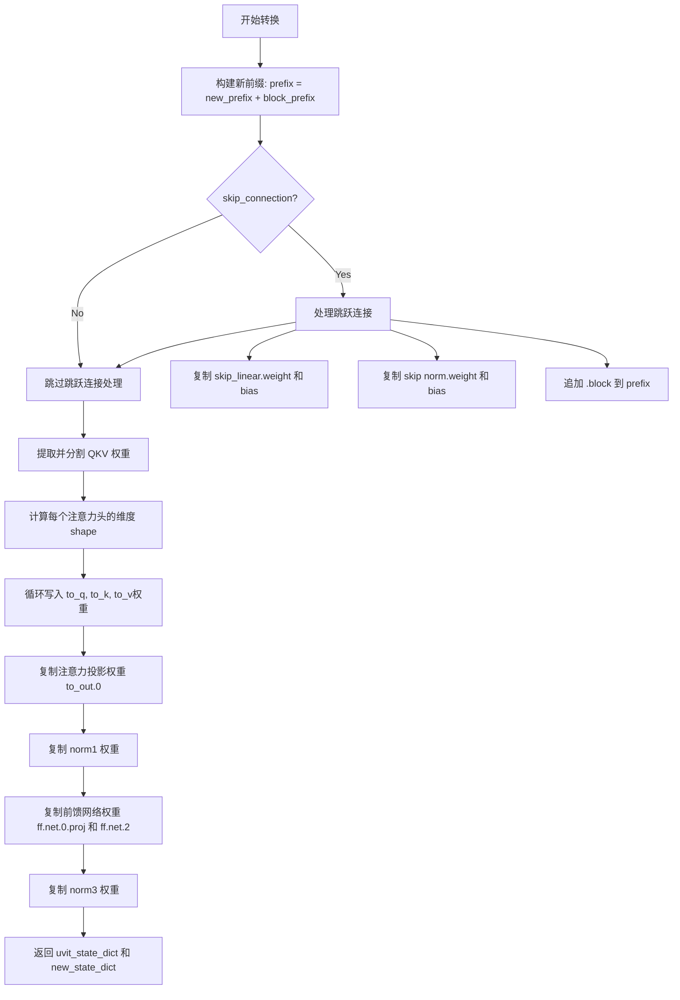

#### 带注释源码

```python
def convert_uvit_block_to_diffusers_block(
    uvit_state_dict,
    new_state_dict,
    block_prefix,
    new_prefix="transformer.transformer_",
    skip_connection=False,
):
    """
    Maps the keys in a UniDiffuser transformer block (`Block`) to the keys in a diffusers transformer block
    (`UTransformerBlock`/`UniDiffuserBlock`).
    """
    # 1. 拼接完整的前缀路径，用于构建新状态字典的键名
    prefix = new_prefix + block_prefix
    
    # 2. 处理跳跃连接（仅在 out_blocks 时为 True）
    if skip_connection:
        # 将 skip_linear 权重映射到新的路径格式
        new_state_dict[prefix + ".skip.skip_linear.weight"] = uvit_state_dict[block_prefix + ".skip_linear.weight"]
        new_state_dict[prefix + ".skip.skip_linear.bias"] = uvit_state_dict[block_prefix + ".skip_linear.bias"]
        
        # 将 norm1 权重映射到 skip.norm
        new_state_dict[prefix + ".skip.norm.weight"] = uvit_state_dict[block_prefix + ".norm1.weight"]
        new_state_dict[prefix + ".skip.norm.bias"] = uvit_state_dict[block_prefix + ".norm1.bias"]

        # 对于输出块，需要在路径中追加 ".block"
        prefix += ".block"

    # 3. 处理注意力机制的 QKV 权重（从合并的 qkv 拆分为 q、k、v）
    # 提取原始的 QKV 权重矩阵
    qkv = uvit_state_dict[block_prefix + ".attn.qkv.weight"]
    
    # 定义新的注意力权重键名列表
    new_attn_keys = [".attn1.to_q.weight", ".attn1.to_k.weight", ".attn1.to_v.weight"]
    # 拼接完整路径前缀
    new_attn_keys = [prefix + key for key in new_attn_keys]
    
    # 计算每个注意力头的权重维度（总维度除以 3）
    shape = qkv.shape[0] // len(new_attn_keys)
    
    # 循环拆分并写入 Q、K、V 权重
    for i, attn_key in enumerate(new_attn_keys):
        new_state_dict[attn_key] = qkv[i * shape : (i + 1) * shape]

    # 4. 复制注意力输出投影权重
    new_state_dict[prefix + ".attn1.to_out.0.weight"] = uvit_state_dict[block_prefix + ".attn.proj.weight"]
    new_state_dict[prefix + ".attn1.to_out.0.bias"] = uvit_state_dict[block_prefix + ".attn.proj.bias"]
    
    # 5. 复制第一个归一化层的权重（注意：UniDiffuser 的 norm2 对应 Diffusers 的 norm1）
    new_state_dict[prefix + ".norm1.weight"] = uvit_state_dict[block_prefix + ".norm2.weight"]
    new_state_dict[prefix + ".norm1.bias"] = uvit_state_dict[block_prefix + ".norm2.bias"]
    
    # 6. 复制前馈网络（MLP）的权重
    # fc1 -> ff.net.0.proj（第一层线性变换）
    new_state_dict[prefix + ".ff.net.0.proj.weight"] = uvit_state_dict[block_prefix + ".mlp.fc1.weight"]
    new_state_dict[prefix + ".ff.net.0.proj.bias"] = uvit_state_dict[block_prefix + ".mlp.fc1.bias"]
    
    # fc2 -> ff.net.2（第二层线性变换）
    new_state_dict[prefix + ".ff.net.2.weight"] = uvit_state_dict[block_prefix + ".mlp.fc2.weight"]
    new_state_dict[prefix + ".ff.net.2.bias"] = uvit_state_dict[block_prefix + ".mlp.fc2.bias"]
    
    # 7. 复制第三个归一化层的权重
    new_state_dict[prefix + ".norm3.weight"] = uvit_state_dict[block_prefix + ".norm3.weight"]
    new_state_dict[prefix + ".norm3.bias"] = uvit_state_dict[block_prefix + ".norm3.bias"]

    # 8. 返回状态字典元组（uvit_state_dict 未被修改，仅返回以保持接口一致性）
    return uvit_state_dict, new_state_dict
```


### `convert_uvit_to_diffusers`

将 UniDiffuser 的 U-ViT（uvit_v*.pth）检查点模型转换为 diffusers 格式的 UniDiffuserModel 模型。

参数：

- `ckpt`：`str`，原始 UniDiffuser U-ViT 检查点文件的路径（.pth 文件）
- `diffusers_model`：`UniDiffuserModel`，已初始化的 diffusers UniDiffuserModel 模型实例

返回值：`UniDiffuserModel`，完成权重映射和加载后的 diffusers 模型实例

#### 流程图

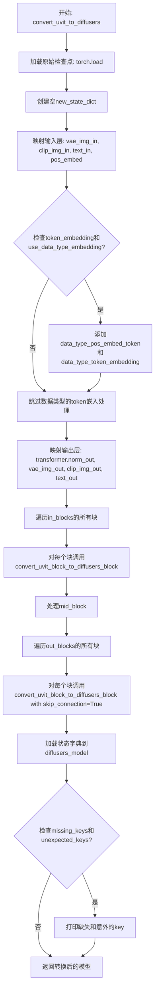

#### 带注释源码

```python
def convert_uvit_to_diffusers(ckpt, diffusers_model):
    """
    Converts a UniDiffuser uvit_v*.pth checkpoint to a diffusers UniDiffusersModel.
    
    参数:
        ckpt: 原始UniDiffuser U-ViT检查点文件路径 (.pth格式)
        diffusers_model: 已实例化的diffusers UniDiffuserModel对象
    
    返回:
        加载转换后权重的新状态字典的UniDiffuserModel模型
    """
    # uvit_v*.pth ckpt is a torch state dict
    # 从指定路径加载原始检查点，使用CPU映射
    uvit_state_dict = torch.load(ckpt, map_location="cpu")

    # 创建新的状态字典用于存储转换后的权重
    new_state_dict = {}

    # ========================================
    # 输入层映射 (Input Layers)
    # ========================================
    # 将原始的patch_embed投影层映射到vae_img_in
    new_state_dict["vae_img_in.proj.weight"] = uvit_state_dict["patch_embed.proj.weight"]
    new_state_dict["vae_img_in.proj.bias"] = uvit_state_dict["patch_embed.proj.bias"]
    
    # 将CLIP图像嵌入层映射到clip_img_in
    new_state_dict["clip_img_in.weight"] = uvit_state_dict["clip_img_embed.weight"]
    new_state_dict["clip_img_in.bias"] = uvit_state_dict["clip_img_embed.bias"]
    
    # 将文本嵌入层映射到text_in
    new_state_dict["text_in.weight"] = uvit_state_dict["text_embed.weight"]
    new_state_dict["text_in.bias"] = uvit_state_dict["text_embed.bias"]

    # 复制位置嵌入
    new_state_dict["pos_embed"] = uvit_state_dict["pos_embed"]

    # ========================================
    # 处理数据类型token嵌入 (UniDiffuser-v1)
    # ========================================
    # Handle data type token embeddings for UniDiffuser-v1
    # 仅当检查点包含token_embedding且模型配置启用data_type_embedding时执行
    if "token_embedding.weight" in uvit_state_dict and diffusers_model.use_data_type_embedding:
        # 添加数据类型的位置嵌入token
        new_state_dict["data_type_pos_embed_token"] = uvit_state_dict["pos_embed_token"]
        # 添加数据类型的token嵌入权重
        new_state_dict["data_type_token_embedding.weight"] = uvit_state_dict["token_embedding.weight"]

    # ========================================
    # 初始化transformer的PatchEmbedding
    # ========================================
    # Also initialize the PatchEmbedding in UTransformer2DModel with the PatchEmbedding from the checkpoint.
    # This isn't used in the current implementation, so might want to remove.
    # 注意：当前实现中未使用，可能需要移除
    new_state_dict["transformer.pos_embed.proj.weight"] = uvit_state_dict["patch_embed.proj.weight"]
    new_state_dict["transformer.pos_embed.proj.bias"] = uvit_state_dict["patch_embed.proj.bias"]

    # ========================================
    # 输出层映射 (Output Layers)
    # ========================================
    # 映射transformer的输出归一化层
    new_state_dict["transformer.norm_out.weight"] = uvit_state_dict["norm.weight"]
    new_state_dict["transformer.norm_out.bias"] = uvit_state_dict["norm.bias"]

    # 映射VAE图像输出层
    new_state_dict["vae_img_out.weight"] = uvit_state_dict["decoder_pred.weight"]
    new_state_dict["vae_img_out.bias"] = uvit_state_dict["decoder_pred.bias"]
    
    # 映射CLIP图像输出层
    new_state_dict["clip_img_out.weight"] = uvit_state_dict["clip_img_out.weight"]
    new_state_dict["clip_img_out.bias"] = uvit_state_dict["clip_img_out.bias"]
    
    # 映射文本输出层
    new_state_dict["text_out.weight"] = uvit_state_dict["text_out.weight"]
    new_state_dict["text_out.bias"] = uvit_state_dict["text_out.bias"]

    # ========================================
    # 处理in_blocks (输入Transformer块)
    # ========================================
    # in_blocks
    # 提取所有in_blocks的层级前缀（如 "0", "1", "2" 等）
    in_blocks_prefixes = {".".join(layer.split(".")[:2]) for layer in uvit_state_dict if "in_blocks" in layer}
    # 遍历每个输入块并转换
    for in_block_prefix in list(in_blocks_prefixes):
        convert_uvit_block_to_diffusers_block(uvit_state_dict, new_state_dict, in_block_prefix)

    # ========================================
    # 处理mid_block (中间Transformer块)
    # ========================================
    # mid_block
    # Assume there's only one mid block
    # 假设只有一个中间块，直接转换
    convert_uvit_block_to_diffusers_block(uvit_state_dict, new_state_dict, "mid_block")

    # ========================================
    # 处理out_blocks (输出Transformer块)
    # ========================================
    # out_blocks
    # 提取所有out_blocks的层级前缀
    out_blocks_prefixes = {".".join(layer.split(".")[:2]) for layer in uvit_state_dict if "out_blocks" in layer}
    # 遍历每个输出块并转换（带skip_connection标志）
    for out_block_prefix in list(out_blocks_prefixes):
        convert_uvit_block_to_diffusers_block(uvit_state_dict, new_state_dict, out_block_prefix, skip_connection=True)

    # ========================================
    # 加载状态字典到模型
    # ========================================
    # 使用load_state_dict加载转换后的权重，返回缺失和意外的key
    missing_keys, unexpected_keys = diffusers_model.load_state_dict(new_state_dict)
    # 打印缺失的key（如果有）
    for missing_key in missing_keys:
        print(f"Missing key: {missing_key}")
    # 打印意外的key（如果有）
    for unexpected_key in unexpected_keys:
        print(f"Unexpected key: {unexpected_key}")

    # 返回转换完成的模型
    return diffusers_model
```


### `convert_caption_decoder_to_diffusers`

该函数用于将 UniDiffuser 项目的 caption_decoder.pth 检查点转换为 Diffusers 格式的 UniDiffuserTextDecoder 模型，处理权重键的映射和前缀移除，并最终将转换后的权重加载到目标模型中。

参数：

- `ckpt`：`str`，caption_decoder.pth 检查点文件的路径
- `diffusers_model`：`UniDiffuserTextDecoder`，已初始化的 Diffusers UniDiffuserTextDecoder 模型实例

返回值：`UniDiffuserTextDecoder`，完成权重加载后的 Diffusers 模型实例

#### 流程图

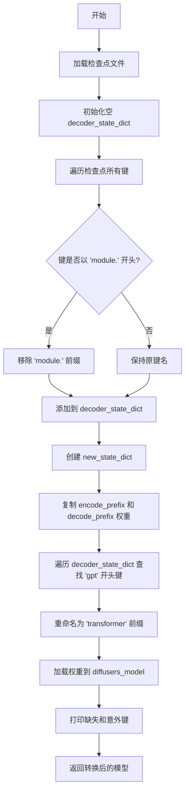

#### 带注释源码

```python
def convert_caption_decoder_to_diffusers(ckpt, diffusers_model):
    """
    Converts a UniDiffuser caption_decoder.pth checkpoint to a diffusers UniDiffuserTextDecoder.
    """
    # caption_decoder.pth ckpt is a torch state dict
    # 从指定路径加载检查点文件到 CPU 内存
    checkpoint_state_dict = torch.load(ckpt, map_location="cpu")
    
    # 创建新的字典用于存储处理后的状态字典
    decoder_state_dict = {}
    
    # Remove the "module." prefix, if necessary
    # 定义要移除的前缀（用于处理 DataParallel/DistributedDataParallel 保存的模型）
    caption_decoder_key = "module."
    
    # 遍历检查点中的所有键，处理可能的 "module." 前缀
    for key in checkpoint_state_dict:
        if key.startswith(caption_decoder_key):
            # 移除 "module." 前缀并添加到新字典
            decoder_state_dict[key.replace(caption_decoder_key, "")] = checkpoint_state_dict.get(key)
        else:
            # 保持原键名不变
            decoder_state_dict[key] = checkpoint_state_dict.get(key)

    # 创建新的状态字典用于 Diffusers 模型
    new_state_dict = {}

    # Encoder and Decoder
    # 复制编码器和解码器的前缀嵌入权重和偏置
    new_state_dict["encode_prefix.weight"] = decoder_state_dict["encode_prefix.weight"]
    new_state_dict["encode_prefix.bias"] = decoder_state_dict["encode_prefix.bias"]
    new_state_dict["decode_prefix.weight"] = decoder_state_dict["decode_prefix.weight"]
    new_state_dict["decode_prefix.bias"] = decoder_state_dict["decode_prefix.bias"]

    # Internal GPT2LMHeadModel transformer model
    # 遍历所有以 "gpt" 开头的键，将其重命名为 "transformer" 前缀
    for key, val in decoder_state_dict.items():
        if key.startswith("gpt"):
            # 获取 "gpt" 后面的部分作为后缀
            suffix = key[len("gpt") :]
            # 将 "gpt" 前缀替换为 "transformer"
            new_state_dict["transformer" + suffix] = val

    # 将转换后的权重加载到 Diffusers 模型中
    missing_keys, unexpected_keys = diffusers_model.load_state_dict(new_state_dict)
    
    # 打印缺失的键（模型需要但检查点中没有的）
    for missing_key in missing_keys:
        print(f"Missing key: {missing_key}")
    
    # 打印意外的键（检查点中有但模型不需要的）
    for unexpected_key in unexpected_keys:
        print(f"Unexpected key: {unexpected_key}")

    # 返回完成权重加载的模型
    return diffusers_model
```

## 关键组件


### 张量索引与状态字典映射

负责将原始UniDiffuser检查点中的状态字典键名映射到Diffusers对应的键名。通过shave_segments、renew_vae_resnet_paths、renew_vae_attention_paths等函数实现键名的局部和全局替换，支持encoder/decoder的down_blocks、mid_block、up_blocks的层级转换。

### 注意力机制权重拆分

负责将原始模型中的qkv权重拆分为query、key、value三个独立权重。在assign_to_checkpoint函数中实现，通过reshape和split操作将合并的注意力权重分离为Diffusers格式的to_q、to_k、to_v权重。

### VAE检查点转换

负责将UniDiffuser的autoencoder_kl.pth检查点转换为Diffusers的AutoencoderKL格式。convert_vae_to_diffusers函数处理encoder和decoder的conv_in、conv_out、norm_out、quant_conv、post_quant_conv以及各层级(resnets、attention)的权重映射。

### U-ViTtransformer块转换

负责将UniDiffuser的UViT块结构转换为Diffusers的UniDiffuserModel格式。convert_uvit_block_to_diffusers_block函数处理attention的qkv拆分、mlp的fc1/fc2映射、skip connection以及norm层的重命名。

### Caption Decoder转换

负责将UniDiffuser的caption_decoder.pth检查点转换为Diffusers的UniDiffuserTextDecoder格式。convert_caption_decoder_to_diffusers函数处理encode_prefix、decode_prefix以及内部GPT2LMHeadModel的权重映射。

### 配置文件工厂

根据config_type参数(test/big)创建对应的模型配置。create_vae_diffusers_config、create_unidiffuser_unet_config、create_text_decoder_config函数返回不同规模模型的预定义配置参数。

### 管道组装与序列化

负责在main函数中将转换后的VAE、UNet、TextEncoder、ImageEncoder、TextDecoder等组件组装成UniDiffuserPipeline，并支持safe_serialization选项进行安全序列化保存。

### 调度器配置

预定义的DPM多步求解器调度器配置SCHEDULER_CONFIG，包含beta_start、beta_end、beta_schedule、solver_order等参数，用于推理阶段的噪声调度。


## 问题及建议


### 已知问题

-   **全局变量依赖**：`create_vae_diffusers_config`、`create_unidiffuser_unet_config` 等函数直接使用全局变量 `args`，导致函数非纯且难以测试，违反函数式编程原则
-   **硬编码配置**：多种配置（VAE、UNet、Text Decoder）以硬编码方式实现，缺乏从外部配置文件或命令行参数读取的灵活性
-   **缺少类型注解**：所有函数均无类型提示（type hints），降低代码可读性和 IDE 辅助功能
-   **文件 I/O 缺乏异常处理**：`torch.load` 操作未包装在 try-except 中，若文件不存在或损坏会导致程序直接崩溃
-   **使用 print 调试**：使用 `print` 输出 missing_keys 和 unexpected_keys，建议替换为标准 logging 模块
-   **代码重复**：VAE 转换函数中 encoder 和 decoder 部分存在重复逻辑，可抽象为通用函数
-   **参数未充分利用**：`convert_vae_to_diffusers` 函数接受 `num_head_channels` 参数但实际未在 VAE 转换中使用
-   **缺乏输入验证**：未验证 `config_type` 参数是否为有效值（在多处重复检查）
-   **潜在的 torch.load 安全问题**：使用 `torch.load(ckpt, map_location="cpu")` 未设置 `weights_only=True` 参数
-   **配置分散**：SCHEDULER_CONFIG 定义在全局，但调度器创建在 main 函数中紧邻其他逻辑

### 优化建议

-   **重构函数签名**：将 `config_type` 和 `version` 作为参数传递给配置创建函数，消除对全局 `args` 的依赖
-   **添加类型注解**：为所有函数参数和返回值添加类型提示，提升代码可维护性
-   **统一错误处理**：为文件加载操作添加 try-except 块，捕获 FileNotFoundError、RuntimeError 等异常
-   **引入日志记录**：使用 `logging` 模块替代 print，便于配置日志级别和输出目标
-   **抽象重复逻辑**：提取 VAE encoder/decoder 转换的公共逻辑为独立函数
-   **配置外部化**：将硬编码配置迁移至 YAML 或 JSON 配置文件
-   **添加输入验证**：使用 argparse 的 choices 参数验证 config_type 等枚举值
-   **优化 torch.load**：对于可信来源的 checkpoint，考虑添加 `weights_only=True` 参数
-   **代码模块化**：将配置创建、模型转换、Pipeline 组装分离到不同模块或类中

## 其它


### 设计目标与约束

本代码的设计目标是将UniDiffuser的原始检查点（checkpoint）转换为Hugging Face Diffusers格式的模型。主要约束包括：1）仅支持VAE、U-ViT（UniDiffuserModel）和Caption Decoder（文本解码器）三种组件的转换；2）提供两种配置类型（test和big）用于测试和正式模型转换；3）支持UniDiffuser-v0和v1两个版本的模型转换；4）支持安全序列化（safe serialization）选项。

### 错误处理与异常设计

代码中的错误处理主要通过以下方式实现：1）使用NotImplementedError处理不支持的配置类型（config_type）；2）在模型加载后检查missing_keys和unexpected_keys并打印警告信息；3）使用assert语句验证assign_to_checkpoint函数的输入参数类型。主要异常场景包括：配置文件类型不匹配、模型权重键不兼容、checkpoint文件路径无效等。当前实现采用打印警告而非抛出异常的方式处理权重键不匹配问题，这可能导致静默失败。

### 数据流与状态机

整体数据流分为三个主要转换路径：1）VAE转换路径：加载autoencoder_kl.pth → 映射权重键 → 更新checkpoint → 加载到AutoencoderKL模型；2）U-ViT转换路径：加载uvit_v*.pth → 映射权重键（包括输入层、输出层、in_blocks、mid_block、out_blocks） → 加载到UniDiffuserModel；3）Caption Decoder转换路径：加载caption_decoder.pth → 移除module.前缀 → 映射权重键 → 加载到UniDiffuserTextDecoder。最后将所有转换后的组件组合成UniDiffuserPipeline并保存。

### 外部依赖与接口契约

本代码依赖以下外部包：torch（模型加载）、transformers（CLIP模型和分词器）、diffusers（DiffusersPipeline和调度器）、argparse（命令行参数解析）。关键接口契约包括：1）输入接口：各checkpoint文件路径、配置类型、版本号；2）输出接口：保存的Diffusers pipeline路径；3）模型接口：VAE使用AutoencoderKL、Text Encoder使用CLIPTextModel、Image Encoder使用CLIPVisionModelWithProjection、Text Decoder使用UniDiffuserTextDecoder、UNet使用UniDiffuserModel、Scheduler使用DPMSolverMultistepScheduler。

### 性能考虑

代码在性能方面有以下特点：1）使用torch.load(ckpt, map_location="cpu")将checkpoint加载到CPU；2）权重复制操作（assign_to_checkpoint）可能存在一定的内存开销；3）对于大模型（big配置），需要足够的CPU内存来存储中间状态字典。当前实现未采用模型并行或混合精度优化，转换大模型时可能面临内存压力。

### 可测试性

代码设计了一定的可测试性：1）提供test配置类型用于快速验证转换逻辑；2）包含缺失键和意外键的打印输出，便于调试；3）模块化的转换函数设计（convert_vae_to_diffusers、convert_uvit_to_diffusers、convert_caption_decoder_to_diffusers）便于单元测试。然而，当前代码缺少独立的测试用例，主要依赖手动验证。

### 配置管理

代码采用硬编码的配置生成器模式管理配置：1）create_vae_diffusers_config、create_unidiffuser_unet_config、create_text_decoder_config三个函数根据config_type参数返回对应配置；2）test和big两种配置分别对应测试用小模型和生产用大模型；3）SCHEDULER_CONFIG使用Namespace定义调度器配置。这种方式配置项有限，扩展性有待改进。

### 安全性考虑

代码在安全性方面包含以下措施：1）支持safe_serialization参数用于安全的模型序列化；2）通过命令行参数控制文件路径，避免硬编码敏感路径；3）使用torch.load加载checkpoint时限定在CPU上执行。当前未实现checkpoint完整性校验、输入路径验证或恶意模型文件防护机制。

### 使用示例与注意事项

典型使用场景包括：1）完整转换：提供所有checkpoint路径和输出路径；2）部分转换：仅提供需要转换的组件checkpoint；3）测试模式：使用test配置快速验证流程。注意事项：1）text_decoder需要预先调整token embeddings大小；2）GPT2Tokenizer需要添加特殊的EOS token；3）转换大模型时需确保足够的磁盘空间和内存。


    