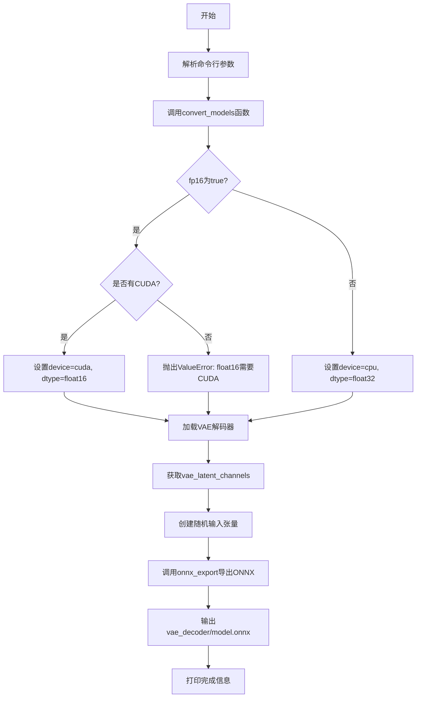

# `diffusers\scripts\convert_vae_diff_to_onnx.py` 详细设计文档

该脚本用于将diffusers库的VAE（变分自编码器）解码器模型导出为ONNX格式，支持PyTorch版本兼容性检查和float16精度导出，主要用于优化Stable Diffusion等模型的推理性能。

## 整体流程



## 类结构

```
该脚本为单文件程序，无类定义
└── 模块级函数
    ├── onnx_export (ONNX导出工具函数)
    └── convert_models (主转换函数)
```

## 全局变量及字段


### `is_torch_less_than_1_11`
    
判断PyTorch版本是否小于1.11的全局变量，用于兼容性检查

类型：`bool`
    


    

## 全局函数及方法


### `onnx_export`

该函数是 ONNX 模型导出的封装函数，支持 PyTorch 版本兼容性检查，根据不同的 PyTorch 版本调用 `torch.onnx.export` 并处理参数差异，同时确保输出目录存在。

参数：

- `model`：`torch.nn.Module`，要导出的 PyTorch 模型。
- `model_args`：`tuple`，模型输入参数的元组，用于指定模型的输入张量。
- `output_path`：`Path`，输出 ONNX 模型文件的路径。
- `ordered_input_names`：`List[str]` 或 `Sequence[str]`，输入张量的名称列表，按顺序排列。
- `output_names`：`List[str]` 或 `Sequence[str]`，输出张量的名称列表。
- `dynamic_axes`：`Dict`，动态轴的字典，指定哪些维度是可变的（例如支持批量大小变化）。
- `opset`：`int`，ONNX 操作集版本号。
- `use_external_data_format`：`bool`（可选，默认为 `False`），是否使用外部数据格式导出大型模型。

返回值：`None`，该函数无返回值（隐式返回 `None`）。

#### 流程图

```mermaid
graph TD
    A[开始] --> B[创建输出目录: output_path.parent.mkdir]
    B --> C{PyTorch 版本检查: is_torch_less_than_1_11}
    C -->|是 (版本 < 1.11)| D[调用 torch.onnx.export<br>包含 enable_onnx_checker 和<br>use_external_data_format 参数]
    C -->|否 (版本 >= 1.11)| E[调用 torch.onnx.export<br>不包含 deprecated 参数]
    D --> F[结束]
    E --> F
```

#### 带注释源码

```python
def onnx_export(
    model,
    model_args: tuple,
    output_path: Path,
    ordered_input_names,
    output_names,
    dynamic_axes,
    opset,
    use_external_data_format=False,
):
    # 确保输出目录存在，如果不存在则创建（包括父目录）
    output_path.parent.mkdir(parents=True, exist_ok=True)
    # PyTorch 在 v1.11 版本中弃用了 enable_onnx_checker 和 use_external_data_format 参数，
    # 因此这里进行版本检查以保持向后兼容性
    if is_torch_less_than_1_11:
        # 对于旧版本 PyTorch (< 1.11)，使用包含已弃用参数的导出方式
        export(
            model,
            model_args,
            f=output_path.as_posix(),
            input_names=ordered_input_names,
            output_names=output_names,
            dynamic_axes=dynamic_axes,
            do_constant_folding=True,
            use_external_data_format=use_external_data_format,
            enable_onnx_checker=True,
            opset_version=opset,
        )
    else:
        # 对于新版本 PyTorch (>= 1.11)，使用不包含已弃用参数的导出方式
        export(
            model,
            model_args,
            f=output_path.as_posix(),
            input_names=ordered_input_names,
            output_names=output_names,
            dynamic_axes=dynamic_axes,
            do_constant_folding=True,
            opset_version=opset,
        )
```


### `convert_models`

主转换函数，负责加载diffusers模型的VAE解码器并将其导出为ONNX格式。

参数：

- `model_path`：`str`，输入的diffusers检查点路径（本地目录或Hub上的模型）
- `output_path`：`str`，输出的ONNX模型保存路径
- `opset`：`int`，要使用的ONNX操作集版本
- `fp16`：`bool = False`，是否以float16模式导出模型

返回值：`None`，该函数无返回值，直接将ONNX模型写入磁盘

#### 流程图

```mermaid
flowchart TD
    A[开始 convert_models] --> B[确定数据类型 dtype]
    B --> C{fp16 且 CUDA可用?}
    C -->|是| D[device = "cuda"]
    C -->|否| E{fp16 但无CUDA?}
    E -->|是| F[抛出 ValueError]
    E -->|否| G[device = "cpu"]
    D --> H[加载 VAE Decoder]
    G --> H
    F --> Z[结束]
    H --> I[获取 latent_channels]
    I --> J[替换 vae_decoder.forward 为 decode]
    J --> K[调用 onnx_export 导出模型]
    K --> L[删除 vae_decoder 释放内存]
    L --> Z
```

#### 带注释源码

```python
@torch.no_grad()  # 禁用梯度计算，减少内存消耗
def convert_models(model_path: str, output_path: str, opset: int, fp16: bool = False):
    """
    将diffusers模型的VAE解码器导出为ONNX格式
    
    参数:
        model_path: str - diffusers检查点路径
        output_path: str - 输出ONNX模型路径
        opset: int - ONNX操作集版本
        fp16: bool - 是否使用float16精度
    """
    
    # 1. 根据fp16参数确定数据类型
    dtype = torch.float16 if fp16 else torch.float32
    
    # 2. 确定运行设备
    if fp16 and torch.cuda.is_available():
        device = "cuda"
    elif fp16 and not torch.cuda.is_available():
        # fp16仅支持GPU
        raise ValueError("`float16` model export is only supported on GPUs with CUDA")
    else:
        device = "cpu"
    
    # 3. 转换为Path对象以便路径操作
    output_path = Path(output_path)

    # 4. 加载VAE解码器
    # 从预训练模型路径加载AutoencoderKL
    vae_decoder = AutoencoderKL.from_pretrained(model_path + "/vae")
    
    # 获取潜在空间通道数，用于构造输入张量
    vae_latent_channels = vae_decoder.config.latent_channels
    
    # 5. 修改forward方法指向decode方法
    # 只想导出decoder部分，所以将forward重定向为decode
    vae_decoder.forward = vae_decoder.decode
    
    # 6. 调用ONNX导出函数
    onnx_export(
        vae_decoder,
        # 构造模型输入参数：(latent_sample, return_dict)
        model_args=(
            torch.randn(1, vae_latent_channels, 25, 25).to(device=device, dtype=dtype),
            False,
        ),
        # 输出路径：output_path/vae_decoder/model.onnx
        output_path=output_path / "vae_decoder" / "model.onnx",
        # 输入输出名称
        ordered_input_names=["latent_sample", "return_dict"],
        output_names=["sample"],
        # 动态轴定义，支持 batch 维度变化
        dynamic_axes={
            "latent_sample": {0: "batch", 1: "channels", 2: "height", 3: "width"},
        },
        opset=opset,
    )
    
    # 7. 清理：删除模型释放内存
    del vae_decoder
```

## 关键组件


### 张量索引与惰性加载

代码中使用`torch.randn`生成随机张量作为ONNX导出的虚拟输入，用于捕获模型的计算图结构。张量形状为(1, vae_latent_channels, 25, 25)，其中vae_latent_channels从VAE解码器配置中获取。这种方式不需要实际加载或处理真实数据，实现了惰性加载模式。

### 反量化支持

代码通过`fp16`参数支持float16精度导出。当启用时，模型权重和输入张量都将转换为torch.float16类型。这允许在支持FP16的GPU上进行更高效的推理，同时减小模型文件大小。

### 量化策略

代码实现了两种量化策略：float16（半精度）和float32（单精度）。通过条件判断，如果指定fp16但系统没有CUDA支持，则抛出ValueError异常。设备选择逻辑优先使用CUDA（当fp16可用时），否则回退到CPU。

### ONNX导出框架

`onnx_export`函数封装了PyTorch的ONNX导出逻辑，处理版本兼容性（is_torch_less_than_1_11检查），并支持动态轴定义以适应可变输入尺寸。导出的模型包含latent_sample和return_dict两个输入，以及sample输出。

### VAE解码器提取

代码专门提取Diffusers模型的VAE解码器部分进行导出，通过将forward方法替换为decode方法来实现。这种设计允许独立导出模型的特定组件而非完整pipeline。

### 命令行参数解析

使用argparse模块提供标准化的CLI接口，支持model_path、output_path、opset和fp16四个参数，使脚本可以作为独立工具调用。


## 问题及建议


### 已知问题

- **冗余的版本解析**：`is_torch_less_than_1_11` 对 `torch.__version__` 进行了两次 `version.parse()` 解析，第二次调用是多余的
- **硬编码的输入张量维度**：VAE 解码器的输入形状 `(1, vae_latent_channels, 25, 25)` 被硬编码，无法适应不同模型的潜在空间尺寸
- **不优雅的方法替换**：通过 `vae_decoder.forward = vae_decoder.decode` 直接替换 forward 方法不够规范，容易造成混淆和潜在的副作用
- **缺乏输入验证**：未检查 `model_path` 目录是否存在、VAE 模型文件是否完整、opset 版本是否有效
- **内存管理不完善**：`del vae_decoder` 后未调用 `torch.cuda.empty_cache()` 释放 GPU 显存
- **错误处理缺失**：ONNX 导出过程缺少 try-except 包裹，无法捕获并友好处理导出失败的情况
- **功能不完整**：目前仅支持导出 VAE 解码器，SD 模型通常还需要 encoder、unet、scheduler 等组件
- **参数语义不明确**：调用 `vae_decoder.decode` 时传入 `return_dict=False`，但未说明其用途和影响

### 优化建议

- 将 `is_torch_less_than_1_11` 简化为单次版本解析：`version.parse(torch.__version__) < version.parse("1.11")`
- 从 VAE 配置中动态获取潜在空间尺寸，或将其作为命令行参数暴露给用户
- 考虑封装一个专门的导出方法，而不是直接修改模型的 forward 属性
- 在脚本开头添加必要的输入验证（路径存在性、CUDA 可用性等）
- 在删除大模型后添加 `torch.cuda.empty_cache()` 优化显存使用
- 使用 try-except 包裹核心导出逻辑，并提供详细的错误信息
- 扩展支持更多的模型组件（UNet、Text Encoder 等），或重构为更通用的导出框架
- 添加更完善的类型注解和函数文档字符串，提升代码可读性和可维护性

## 其它


### 设计目标与约束

将HuggingFace Diffusers框架中的AutoencoderKL模型的解码器部分导出为ONNX格式，以实现跨平台的模型部署。设计约束包括：仅支持导出VAE解码器而非完整模型；FP16导出仅限CUDA设备；ONNX算子集版本需指定（默认14）；输出模型采用外部数据格式存储。

### 错误处理与异常设计

代码包含以下异常处理场景：FP16模式但无CUDA可用时抛出ValueError("`float16` model export is only supported on GPUs with CUDA")。输出目录创建失败时会触发mkdir的异常。模型加载失败时会传播torch和diffusers的原始异常。ONNX导出失败时会传播torch.onnx.export的异常。参数验证方面：model_path、output_path为必需参数，opset必须为正整数。

### 外部依赖与接口契约

主要依赖包括：torch（PyTorch）、packaging（版本解析）、diffusers（AutoencoderKL类）、onnx（通过torch.onnx模块）。接口契约方面：convert_models函数接收model_path（str）、output_path（str）、opset（int）、fp16（bool）四个参数；onnx_export函数接收model、model_args、output_path、ordered_input_names、output_names、dynamic_axes、opset、use_external_data_format八个参数。

### 配置参数说明

命令行参数包括：--model_path（必需，Diffusers检查点路径）、--output_path（必需，输出模型路径）、--opset（默认14，ONNX算子集版本）、--fp16（默认False，启用FP16导出）。代码内部变量包括：is_torch_less_than_1_11（布尔值，判断PyTorch版本）、dtype（torch.float16或torch.float32）、device（"cuda"或"cpu"）、vae_latent_channels（从vae_decoder.config.latent_channels获取）。

### 使用示例与注意事项

基本用法：python script.py --model_path /path/to/diffusers_model --output_path /output/onnx。FP16导出：python script.py --model_path /path/to/diffusers_model --output_path /output/onnx --fp16。注意事项：模型路径需包含/vae子目录；导出的ONNX模型仅包含解码器部分；输入名称为["latent_sample", "return_dict"]，输出名称为["sample"]；动态轴定义在latent_sample的batch、channels、height、width维度。

### 版本兼容性信息

代码通过is_torch_less_than_1_11变量处理PyTorch版本差异：v1.11之前版本使用enable_onnx_checker和use_external_data_format参数；v1.11及之后版本移除这两个参数。测试的最低PyTorch版本为1.10（通过版本比较逻辑推断）。Diffusers库版本需支持AutoencoderKL类和from_pretrained方法。

    