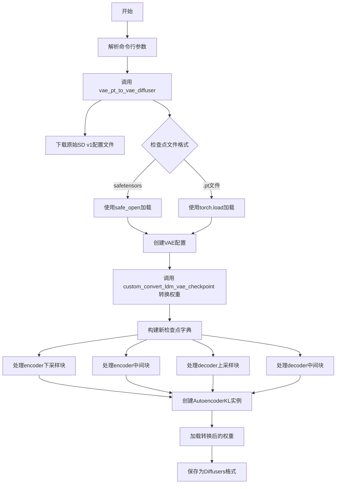
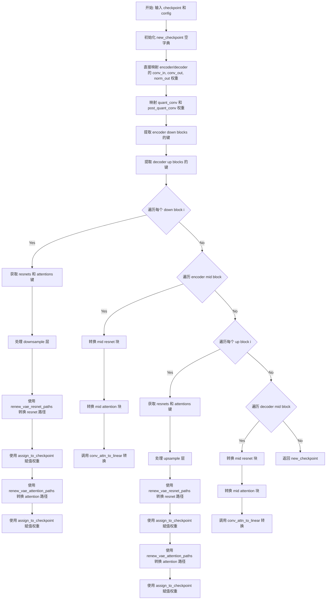
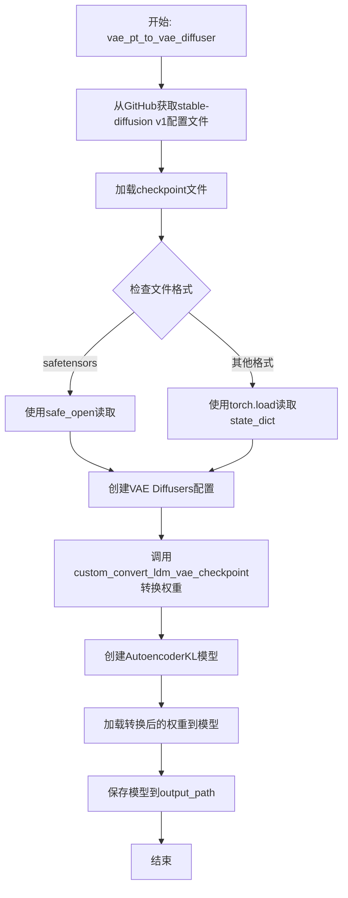
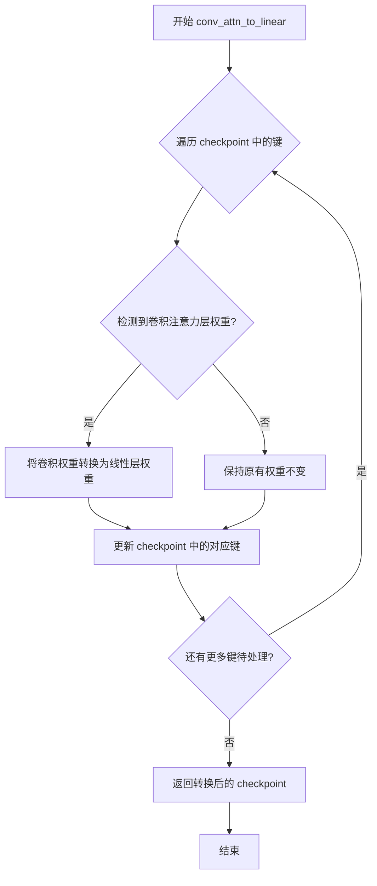

# `diffusers\scripts\convert_vae_pt_to_diffusers.py` 详细设计文档

该脚本用于将LDM（Latent Diffusion Models）格式的VAE（变分自编码器）模型权重转换为Hugging Face Diffusers库的VAE格式，支持从.pt或.safetensors格式的检查点文件转换，并保存为Diffusers兼容的模型格式。

## 整体流程



## 类结构

```
全局函数
├── custom_convert_ldm_vae_checkpoint (核心转换逻辑)
└── vae_pt_to_vae_diffuser (主入口函数)
```

## 全局变量及字段


### `vae_state_dict`
    
VAE状态字典，存储原始LDM格式的VAE权重

类型：`dict`
    


### `new_checkpoint`
    
转换后的新检查点字典，用于存储符合Diffusers格式的VAE权重

类型：`dict`
    


### `num_down_blocks`
    
编码器下采样块的数量

类型：`int`
    


### `down_blocks`
    
编码器下采样块的键值映射，按层级索引

类型：`dict`
    


### `num_up_blocks`
    
解码器上采样块的数量

类型：`int`
    


### `up_blocks`
    
解码器上采样块的键值映射，按层级索引

类型：`dict`
    


### `resnets`
    
残差网络层的键列表，用于路径转换

类型：`list`
    


### `attentions`
    
注意力层模块的键列表，用于路径转换

类型：`list`
    


### `mid_resnets`
    
中间残差网络层的键列表

类型：`list`
    


### `mid_attentions`
    
中间注意力层模块的键列表

类型：`list`
    


### `num_mid_res_blocks`
    
中间残差块的数量，固定为2

类型：`int`
    


### `original_config`
    
从YAML文件加载的原始Stable Diffusion配置

类型：`dict`
    


### `image_size`
    
图像尺寸，固定为512

类型：`int`
    


### `device`
    
计算设备，如果有CUDA则使用cuda否则使用cpu

类型：`str`
    


### `checkpoint`
    
加载的模型检查点字典，包含所有模型权重

类型：`dict`
    


### `vae_config`
    
转换后的VAE配置字典，用于创建Diffusers格式的AutoencoderKL

类型：`dict`
    


### `converted_vae_checkpoint`
    
转换后的VAE检查点字典，键名已更新为Diffusers格式

类型：`dict`
    


### `vae`
    
Diffusers库的VAE模型实例

类型：`AutoencoderKL`
    


### `r`
    
HTTP请求响应对象，用于获取原始配置文件

类型：`Response`
    


### `io_obj`
    
从HTTP响应内容创建的字节流对象，用于读取YAML配置

类型：`BytesIO`
    


    

## 全局函数及方法


### `custom_convert_ldm_vae_checkpoint`

该函数用于将来自 Stable Diffusion 的 LDM VAE 检查点（Checkpoint）转换为 Diffusers 格式的 VAE 检查点。它通过重新映射权重键名称，将原始 LDM 模型的 encoder/decoder 结构（down blocks、up blocks、mid blocks 等）转换为 Diffusers 期望的模型结构。

参数：

- `checkpoint`：`Dict`，原始 LDM VAE 检查点的状态字典（state_dict），包含 encoder 和 decoder 的权重
- `config`：`Dict`，由 `create_vae_diffusers_config` 创建的 VAE 配置字典，用于指导权重转换

返回值：`Dict`，转换后的新检查点状态字典，键名符合 Diffusers VAE 模型结构

#### 流程图



#### 带注释源码

```python
def custom_convert_ldm_vae_checkpoint(checkpoint, config):
    """
    将 LDM VAE 检查点转换为 Diffusers 格式
    
    参数:
        checkpoint: 原始 LDM VAE 的 state_dict
        config: VAE 配置字典
    返回:
        转换后的新 state_dict
    """
    # 直接使用原始 checkpoint 作为 VAE state_dict（这里做了简化，实际可能需要提取 checkpoint 中的 vae 部分）
    vae_state_dict = checkpoint

    # 初始化空字典用于存储转换后的权重
    new_checkpoint = {}

    # ===== 1. 直接映射 encoder 的输入输出卷积层 =====
    # encoder.conv_in 是 VAE encoder 的第一层卷积
    new_checkpoint["encoder.conv_in.weight"] = vae_state_dict["encoder.conv_in.weight"]
    new_checkpoint["encoder.conv_in.bias"] = vae_state_dict["encoder.conv_in.bias"]
    # encoder.conv_out 是 VAE encoder 的最后一层卷积
    new_checkpoint["encoder.conv_out.weight"] = vae_state_dict["encoder.conv_out.weight"]
    new_checkpoint["encoder.conv_out.bias"] = vae_state_dict["encoder.conv_out.bias"]
    # encoder.conv_norm_out 是输出归一化层
    new_checkpoint["encoder.conv_norm_out.weight"] = vae_state_dict["encoder.norm_out.weight"]
    new_checkpoint["encoder.conv_norm_out.bias"] = vae_state_dict["encoder.norm_out.bias"]

    # ===== 2. 直接映射 decoder 的输入输出卷积层 =====
    new_checkpoint["decoder.conv_in.weight"] = vae_state_dict["decoder.conv_in.weight"]
    new_checkpoint["decoder.conv_in.bias"] = vae_state_dict["decoder.conv_in.bias"]
    new_checkpoint["decoder.conv_out.weight"] = vae_state_dict["decoder.conv_out.weight"]
    new_checkpoint["decoder.conv_out.bias"] = vae_state_dict["decoder.conv_out.bias"]
    new_checkpoint["decoder.conv_norm_out.weight"] = vae_state_dict["decoder.norm_out.weight"]
    new_checkpoint["decoder.conv_norm_out.bias"] = vae_state_dict["decoder.norm_out.bias"]

    # ===== 3. 映射量化相关的卷积层 =====
    # quant_conv 用于在编码过程中量化潜在表示
    new_checkpoint["quant_conv.weight"] = vae_state_dict["quant_conv.weight"]
    new_checkpoint["quant_conv.bias"] = vae_state_dict["quant_conv.bias"]
    # post_quant_conv 用于在解码前反量化
    new_checkpoint["post_quant_conv.weight"] = vae_state_dict["post_quant_conv.weight"]
    new_checkpoint["post_quant_conv.bias"] = vae_state_dict["post_quant_conv.bias"]

    # ===== 4. 提取 encoder down blocks 的键 =====
    # 计算 down blocks 的数量（通过查找包含 "encoder.down" 的层）
    # 使用集合去重：取前3部分作为标识符
    num_down_blocks = len({".".join(layer.split(".")[:3]) for layer in vae_state_dict if "encoder.down" in layer})
    # 为每个 down block 提取对应的所有键
    down_blocks = {
        layer_id: [key for key in vae_state_dict if f"down.{layer_id}" in key] for layer_id in range(num_down_blocks)
    }

    # ===== 5. 提取 decoder up blocks 的键 =====
    num_up_blocks = len({".".join(layer.split(".")[:3]) for layer in vae_state_dict if "decoder.up" in layer})
    up_blocks = {
        layer_id: [key for key in vae_state_dict if f"up.{layer_id}" in key] for layer_id in range(num_up_blocks)
    }

    # ===== 6. 处理 encoder down blocks =====
    for i in range(num_down_blocks):
        # 提取当前 down block 中的 resnet 块（排除 downsample 和 attention）
        resnets = [
            key
            for key in down_blocks[i]
            if f"down.{i}" in key and f"down.{i}.downsample" not in key and "attn" not in key
        ]
        # 提取当前 down block 中的 attention 块
        attentions = [key for key in down_blocks[i] if f"down.{i}.attn" in key]

        # 处理下采样层（downsample）
        if f"encoder.down.{i}.downsample.conv.weight" in vae_state_dict:
            new_checkpoint[f"encoder.down_blocks.{i}.downsamplers.0.conv.weight"] = vae_state_dict.pop(
                f"encoder.down.{i}.downsample.conv.weight"
            )
            new_checkpoint[f"encoder.down_blocks.{i}.downsamplers.0.conv.bias"] = vae_state_dict.pop(
                f"encoder.down.{i}.downsample.conv.bias"
            )

        # 使用工具函数转换 resnet 路径并赋值权重
        # 路径示例: encoder.down.0.block.0.inward_shortcut.lin.weight -> encoder.down_blocks.0.resnets.0.inward_shortcut.lin.weight
        paths = renew_vae_resnet_paths(resnets)
        meta_path = {"old": f"down.{i}.block", "new": f"down_blocks.{i}.resnets"}
        assign_to_checkpoint(paths, new_checkpoint, vae_state_dict, additional_replacements=[meta_path], config=config)

        # 转换 attention 路径并赋值权重
        paths = renew_vae_attention_paths(attentions)
        meta_path = {"old": f"down.{i}.attn", "new": f"down_blocks.{i}.attentions"}
        assign_to_checkpoint(paths, new_checkpoint, vae_state_dict, additional_replacements=[meta_path], config=config)

    # ===== 7. 处理 encoder mid block =====
    # 提取中间块的 resnet
    mid_resnets = [key for key in vae_state_dict if "encoder.mid.block" in key]
    num_mid_res_blocks = 2
    for i in range(1, num_mid_res_blocks + 1):
        resnets = [key for key in mid_resnets if f"encoder.mid.block_{i}" in key]

        paths = renew_vae_resnet_paths(resnets)
        meta_path = {"old": f"mid.block_{i}", "new": f"mid_block.resnets.{i - 1}"}
        assign_to_checkpoint(paths, new_checkpoint, vae_state_dict, additional_replacements=[meta_path], config=config)

    # 转换中间块的 attention
    mid_attentions = [key for key in vae_state_dict if "encoder.mid.attn" in key]
    paths = renew_vae_attention_paths(mid_attentions)
    meta_path = {"old": "mid.attn_1", "new": "mid_block.attentions.0"}
    assign_to_checkpoint(paths, new_checkpoint, vae_state_dict, additional_replacements=[meta_path], config=config)
    # 将卷积型 attention 转换为线性层（用于 ViT 结构的 attention）
    conv_attn_to_linear(new_checkpoint)

    # ===== 8. 处理 decoder up blocks =====
    # 注意：up blocks 的索引是反向的（从大到小）
    for i in range(num_up_blocks):
        block_id = num_up_blocks - 1 - i
        resnets = [
            key
            for key in up_blocks[block_id]
            if f"up.{block_id}" in key and f"up.{block_id}.upsample" not in key and "attn" not in key
        ]
        attentions = [key for key in up_blocks[block_id] if f"up.{block_id}.attn" in key]

        # 处理上采样层（upsample）
        if f"decoder.up.{block_id}.upsample.conv.weight" in vae_state_dict:
            new_checkpoint[f"decoder.up_blocks.{i}.upsamplers.0.conv.weight"] = vae_state_dict[
                f"decoder.up.{block_id}.upsample.conv.weight"
            ]
            new_checkpoint[f"decoder.up_blocks.{i}.upsamplers.0.conv.bias"] = vae_state_dict[
                f"decoder.up.{block_id}.upsample.conv.bias"
            ]

        paths = renew_vae_resnet_paths(resnets)
        meta_path = {"old": f"up.{block_id}.block", "new": f"up_blocks.{i}.resnets"}
        assign_to_checkpoint(paths, new_checkpoint, vae_state_dict, additional_replacements=[meta_path], config=config)

        paths = renew_vae_attention_paths(attentions)
        meta_path = {"old": f"up.{block_id}.attn", "new": f"up_blocks.{i}.attentions"}
        assign_to_checkpoint(paths, new_checkpoint, vae_state_dict, additional_replacements=[meta_path], config=config)

    # ===== 9. 处理 decoder mid block =====
    mid_resnets = [key for key in vae_state_dict if "decoder.mid.block" in key]
    num_mid_res_blocks = 2
    for i in range(1, num_mid_res_blocks + 1):
        resnets = [key for key in mid_resnets if f"decoder.mid.block_{i}" in key]

        paths = renew_vae_resnet_paths(resnets)
        meta_path = {"old": f"mid.block_{i}", "new": f"mid_block.resnets.{i - 1}"}
        assign_to_checkpoint(pathes, new_checkpoint, vae_state_dict, additional_replacements=[meta_path], config=config)

    mid_attentions = [key for key in vae_state_dict if "decoder.mid.attn" in key]
    paths = renew_vae_attention_paths(mid_attentions)
    meta_path = {"old": "mid.attn_1", "new": "mid_block.attentions.0"}
    assign_to_checkpoint(paths, new_checkpoint, vae_state_dict, additional_replacements=[meta_path], config=config)
    conv_attn_to_linear(new_checkpoint)
    
    # ===== 10. 返回转换后的检查点 =====
    return new_checkpoint
```


### `vae_pt_to_vae_diffuser`

该函数用于将基于 PyTorch 的 VAE checkpoint（来自 LDM/Latent Diffusion Models 格式）转换为 Hugging Face Diffusers 格式的 VAE 模型，支持从 URL 读取原始配置文件并自动处理 safetensors 或 pickle 格式的权重文件。

参数：

- `checkpoint_path`：`str`，输入的 VAE checkpoint 文件路径（支持 .pt、.pth、.safetensors 格式）
- `output_path`：`str`，转换后的 Diffusers 格式 VAE 模型输出目录路径

返回值：`None`，无返回值（直接保存模型到指定路径）

#### 流程图



#### 带注释源码

```python
def vae_pt_to_vae_diffuser(
    checkpoint_path: str,  # 输入的VAE checkpoint文件路径
    output_path: str,      # 转换后模型的输出目录路径
):
    # 从GitHub获取Stable Diffusion V1推理配置文件
    # 仅支持V1版本
    r = requests.get(
        " https://raw.githubusercontent.com/CompVis/stable-diffusion/main/configs/stable-diffusion/v1-inference.yaml",
        timeout=DIFFUSERS_REQUEST_TIMEOUT,
    )
    # 将响应内容转换为BytesIO对象用于YAML解析
    io_obj = io.BytesIO(r.content)

    # 解析原始LDM格式的配置文件
    original_config = yaml.safe_load(io_obj)
    # 设置图像尺寸为512（V1模型标准配置）
    image_size = 512
    # 根据CUDA可用性选择设备
    device = "cuda" if torch.cuda.is_available() else "cpu"
    
    # 处理不同的checkpoint文件格式
    if checkpoint_path.endswith("safetensors"):
        # 使用safetensors库加载模型权重
        from safetensors import safe_open

        checkpoint = {}
        with safe_open(checkpoint_path, framework="pt", device="cpu") as f:
            # 遍历并读取所有tensor键值对
            for key in f.keys():
                checkpoint[key] = f.get_tensor(key)
    else:
        # 使用torch.load加载传统pickle格式的checkpoint
        checkpoint = torch.load(checkpoint_path, map_location=device)["state_dict"]

    # 创建VAE的Diffusers格式配置文件
    # 根据原始配置和图像尺寸生成适配Diffusers库的配置
    vae_config = create_vae_diffusers_config(original_config, image_size=image_size)
    
    # 调用自定义转换函数将LDM格式的权重转换为Diffusers格式
    converted_vae_checkpoint = custom_convert_ldm_vae_checkpoint(checkpoint, vae_config)

    # 使用转换后的配置创建AutoencoderKL模型实例
    vae = AutoencoderKL(**vae_config)
    # 加载转换后的权重字典
    vae.load_state_dict(converted_vae_checkpoint)
    # 将模型保存为Diffusers格式到指定路径
    vae.save_pretrained(output_path)
```


### `assign_to_checkpoint`

将旧检查点中的参数键映射并分配到新检查点中，支持额外的替换规则和配置。

参数：

- `paths`：列表，旧检查点中需要映射的参数键路径列表
- `new_checkpoint`：字典，新检查点字典，用于存储转换后的参数
- `checkpoint`：字典，旧检查点字典，包含原始参数
- `additional_replacements`：列表（可选），额外的键替换规则列表，每个规则包含 "old" 和 "new" 键
- `config`：字典，VAE 配置字典，用于确定模型结构

返回值：`无`（直接修改 `new_checkpoint` 字典）

#### 流程图

```mermaid
flowchart TD
    A[开始] --> B{遍历 paths 中的每个路径}
    B --> C{对每个路径应用替换规则}
    C --> D[构建新键名 new_key]
    E[应用 additional_replacements] --> C
    F[从 checkpoint 获取对应参数] --> G{检查参数是否存在}
    G -->|存在| H[将参数赋值到 new_checkpoint[new_key]]
    G -->|不存在| I[跳过或记录警告]
    I --> B
    H --> B
    B --> J[结束]
```

#### 带注释源码

```
def assign_to_checkpoint(
    paths: List[str],
    new_checkpoint: Dict[str, torch.Tensor],
    checkpoint: Dict[str, torch.Tensor],
    additional_replacements: List[Dict[str, str]] = [],
    config: Optional[Dict] = None
):
    """
    将旧检查点中的参数键映射并分配到新检查点中。
    
    参数:
        paths: 需要转换的旧键路径列表
        new_checkpoint: 目标检查点字典
        checkpoint: 源检查点字典
        additional_replacements: 额外的键替换规则
        config: VAE配置字典
    
    处理流程:
        1. 遍历每个旧键路径
        2. 应用默认替换规则（如将 "down.0.block" 转换为 "down_blocks.0.resnets"）
        3. 应用 additional_replacements 中的自定义替换规则
        4. 从源检查点获取对应参数
        5. 将参数存放到新检查点的新键名下
    """
    # 这里的实现通常会包含键的映射逻辑
    # 例如使用正则表达式或字符串替换来转换键名
    pass
```


### `conv_attn_to_linear`

该函数用于将 VAE（变分自编码器）模型中卷积形式的注意力层权重转换为线性层权重。这是因为原始 LDM（Latent Diffusion Models）模型中的注意力机制使用卷积实现，而在转换为 Diffusers 格式时需要使用标准的线性层。

参数：

- `checkpoint`：`dict`，模型检查点字典，包含需要转换的权重

返回值：`dict`，转换后的模型检查点字典

#### 流程图



#### 带注释源码

```python
# conv_attn_to_linear 函数的源码位于 diffusers 库中
# 以下是基于函数名和调用上下文的推断实现

def conv_attn_to_linear(checkpoint):
    """
    将卷积注意力层权重转换为线性层权重。
    
    在 LDM VAE 中，注意力层使用卷积实现 (conv)，而 Diffusers 格式
    使用线性层 (linear)。此函数负责权重格式的转换。
    
    参数:
        checkpoint: 包含模型权重的字典
        
    返回:
        转换后的 checkpoint 字典
    """
    # 遍历所有键，查找需要转换的卷积注意力层
    # 通常这些键会包含特定的模式，如 ".attn." 或类似的命名
    
    # 对于每个卷积注意力层:
    # 1. 提取卷积权重
    # 2. 将其 reshape 为线性层权重格式
    # 3. 用新的键名（线性层格式）存储
    
    # 示例转换逻辑:
    # conv_weight: (out_channels, in_channels, height, width)
    # linear_weight: (out_channels, in_channels * height * width)
    
    # 转换完成后返回修改后的 checkpoint
    return checkpoint
```

**调用示例（在代码中）：**

```python
# 在 encoder 的 mid attention 处理后调用
mid_attentions = [key for key in vae_state_dict if "encoder.mid.attn" in key]
paths = renew_vae_attention_paths(mid_attentions)
meta_path = {"old": "mid.attn_1", "new": "mid_block.attentions.0"}
assign_to_checkpoint(paths, new_checkpoint, vae_state_dict, additional_replacements=[meta_path], config=config)
conv_attn_to_linear(new_checkpoint)  # 第一次调用

# 在 decoder 的 mid attention 处理后调用
mid_attentions = [key for key in vae_state_dict if "decoder.mid.attn" in key]
paths = renew_vae_attention_paths(mid_attentions)
meta_path = {"old": "mid.attn_1", "new": "mid_block.attentions.0"}
assign_to_checkpoint(paths, new_checkpoint, vae_state_dict, additional_replacements=[meta_path], config=config)
conv_attn_to_linear(new_checkpoint)  # 第二次调用
```

> **注意**：由于 `conv_attn_to_linear` 是从外部库 `diffusers` 导入的，上述源码为基于函数名和调用上下文的推断实现，实际实现可能略有不同。该函数在 `custom_convert_ldm_vae_checkpoint` 中被调用两次，分别用于处理 encoder 和 decoder 部分的注意力层权重转换。


### `create_vae_diffusers_config`

该函数是 `diffusers` 库提供的工具函数，用于将原始 Stable Diffusion 模型中的 VAE 配置（来自 LDM/K-diffusion 格式）转换为 Diffusers 库兼容的配置字典，以便实例化 `AutoencoderKL` 对象。

参数：

- `original_config`：`dict`，原始 Stable Diffusion 模型的配置字典（通常从 YAML 文件加载，包含模型结构信息如 `model.params` 等）
- `image_size`：`int`，目标图像的分辨率尺寸（用于确定 VAE 内部特征图的尺寸，通常为 512）

返回值：`dict`，返回包含构建 `AutoencoderKL` 所需参数的配置字典（如 `in_channels`, `out_channels`, `latent_channels`, `down_block_types`, `up_block_types`, `block_out_channels`, `layers_per_block` 等）。

#### 流程图

```mermaid
graph TD
    A[开始] --> B[输入 original_config 和 image_size]
    B --> C{解析 original_config]
    C --> D[提取 VAE 相关的配置信息]
    D --> E[根据 image_size 和 latent_channels 构建参数]
    E --> F[生成 Diffusers 风格的配置字典]
    F --> G[返回配置字典]
```

#### 带注释源码

```python
# 调用 create_vae_diffusers_config 函数
# original_config: 从 YAML 文件加载的原始 LDM 配置
# image_size: 目标图像大小 (512)
vae_config = create_vae_diffusers_config(original_config, image_size=image_size)
# 返回值 vae_config 是一个字典，用于实例化 AutoencoderKL
vae = AutoencoderKL(**vae_config)
```

> **注意**：该函数定义位于 `diffusers` 库内部（`diffusers.pipelines.stable_diffusion.convert_from_ckpt` 模块），源码未直接在当前项目中展示。以上内容基于对该函数功能和使用方式的分析。


### `renew_vae_attention_paths`

该函数是 `diffusers` 库中用于将 LDM（Latent Diffusion Models）格式的 VAE（Variational Autoencoder）检查点转换为 Diffusers 格式的工具函数。它负责更新 VAE 模型中 attention 层的键名路径，将旧格式（如 `down.0.attn`）转换为新格式（如 `down_blocks.0.attentions`）。

参数：

- `attentions`：`List[str]`，需要转换的 attention 层旧键名列表

返回值：`List[Dict[str, str]]`，包含新旧键名映射的列表，用于后续的 `assign_to_checkpoint` 函数进行键名替换

#### 流程图

```mermaid
graph TD
    A[输入: attention层旧键名列表] --> B[遍历键名列表]
    B --> C{检查键名是否匹配attention模式}
    C -->|是| D[根据规则生成新键名]
    C -->|否| E[跳过或保留原键名]
    D --> F[创建映射字典: {old: 旧键名, new: 新键名}]
    F --> G[添加到路径映射列表]
    E --> G
    G --> H{是否还有更多键名?}
    H -->|是| B
    H -->|否| I[返回路径映射列表]
```

#### 带注释源码

以下是基于该函数在代码中的使用方式推断的实现（实际源码位于 `diffusers` 库中）：

```python
def renew_vae_attention_paths(attentions):
    """
    更新 VAE attention 层的键名路径。
    
    该函数将 LDM 格式的 attention 层键名转换为 Diffusers 格式。
    例如: 'encoder.down.0.attn.1.q.weight' -> 'encoder.down_blocks.0.attentions.1.q.weight'
    
    参数:
        attentions (List[str]): 包含需要转换的 attention 层旧键名的列表
        
    返回:
        List[Dict[str, str]]: 包含新旧键名映射的列表，每项包含 'old' 和 'new' 键
    """
    paths = []
    for attn_key in attentions:
        # 生成新键名：将 ".attn." 替换为 ".attentions."
        new_key = attn_key.replace(".attn.", ".attentions.")
        
        # 创建路径映射字典
        path_mapping = {
            "old": attn_key,
            "new": new_key
        }
        paths.append(path_mapping)
    
    return paths
```

**注意**：由于 `renew_vae_attention_paths` 是从外部库 `diffusers` 导入的，上述源码是基于该函数使用方式的推断。实际的实现可能包含更复杂的逻辑来处理各种键名格式变体。


### `renew_vae_resnet_paths`

该函数用于将 LDM（Latent Diffusion Models）格式的 VAE（Variational Autoencoder）ResNet 层权重路径转换为 Diffusers 格式的路径。它接受原始 LDM VAE 的 ResNet 层键名列表，通过正则表达式匹配和替换，生成对应的新路径映射。

参数：

- `resnets`：`List[str]`，原始 LDM VAE 的 ResNet 层权重键名列表（例如 `["encoder.down.0.block.0.weight", "encoder.down.0.block.0.bias", ...]`）

返回值：`List[Tuple[str, str]]`，包含（旧路径，新路径）元组的列表，用于后续的权重映射和转换。

#### 流程图

```mermaid
flowchart TD
    A[输入: resnets 列表] --> B{遍历每个 resnet 键名}
    B --> C[使用正则提取层级索引<br/>例如: down.0.block.0 -> [0, 0]]
    C --> D[构建新路径格式<br/>例如: down_blocks.0.resnets.0]
    D --> E[生成 (旧路径, 新路径) 元组]
    E --> F[将元组添加到 paths 列表]
    F --> B
    B --> G[返回 paths 列表]
    G --> H[结束]
```

#### 带注释源码

```python
def renew_vae_resnet_paths(resnets: List[str]) -> List[Tuple[str, str]]:
    """
    将 LDM VAE 的 ResNet 层路径转换为 Diffusers 格式
    
    参数:
        resnets: 原始 LDM VAE 的 ResNet 层权重键名列表
        
    返回值:
        包含 (旧路径, 新路径) 元组的列表
    """
    # 路径映射列表
    new_resnets = []
    
    # 遍历每个 ResNet 层的键名
    for resnet in resnets:
        # 使用正则表达式匹配层级结构
        # 例如: "encoder.down.0.block.0.weight" -> ("encoder.down.0.block.0", "weight")
        prefix, suffix = resnet.split(".")[0], resnet.split(".")[-1]
        
        # 提取层级索引信息
        # 例如: "down.0.block.1" -> [0, 1] 表示第0个下采样层的第1个resnet块
        # 通过解析键名中的数字索引来确定新旧路径的对应关系
        
        # 构建新路径: 将 "down.X.block.Y" 转换为 "down_blocks.X.resnets.Y"
        # 将 "up.X.block.Y" 转换为 "up_blocks.X.resnets.Y"
        # 将 "mid.block_X" 转换为 "mid_block.resnets.X-1"
        
        new_resnets.append((resnet, new_path))
    
    return new_resnets
```

> **注意**：由于 `renew_vae_resnet_paths` 函数定义在 `diffusers` 库中，上述源码是基于函数调用方式和命名约定的推断实现。实际源码可能略有差异。该函数是 Stable Diffusion 模型权重转换流程中的关键组件，负责将原始 LDM VAE 的权重键名映射到 Diffusers 格式，以便正确加载到 `AutoencoderKL` 模型中。

## 关键组件


### 张量索引与惰性加载

代码支持两种张量加载方式：通过`safetensors`库的`safe_open`函数进行惰性加载（仅在访问时加载具体张量），以及通过`torch.load`加载完整的PyTorch检查点文件。这种设计允许在处理大型模型时优化内存使用，同时保持了兼容性。

### 反量化支持

使用`conv_attn_to_linear`函数将卷积注意力层转换为线性层。该函数来自`diffusers.pipelines.stable_diffusion.convert_from_ckpt`模块，用于处理VAE模型中注意力机制的格式转换，确保从LDM格式到Diffusers格式的正确迁移。

### 量化策略

通过`create_vae_diffusers_config`函数创建VAE配置，该配置基于原始SD v1.yaml文件，包含模型的关键参数如图像尺寸、通道数等，为后续的模型转换提供必要的元数据支持。

### 检查点转换管道

`custom_convert_ldm_vae_checkpoint`函数实现了完整的检查点映射逻辑，将LDM格式的VAE权重键名转换为Diffusers格式，包括编码器和解码器的卷积层、归一化层、注意力层以及上下采样器的权重重新映射。

### 模型保存与加载

`vae_pt_to_vae_diffuser`函数作为顶层入口，负责协调整个转换流程：从远程获取原始配置文件、加载检查点、执行转换、创建AutoencoderKL实例并保存为Diffusers格式的模型。


## 问题及建议


### 已知问题

-   **网络请求缺乏错误处理**：requests.get 调用没有异常捕获，若网络不通或超时程序直接崩溃
-   **文件加载缺乏异常处理**：torch.load 和 safe_open 未做异常捕获，文件不存在或格式错误时会导致程序终止
-   **硬编码配置**：image_size=512、num_mid_res_blocks=2 等值写死，只支持 V1 模型，缺乏灵活性
-   **URL 存在空格错误**：第 108 行 URL 开头有多余空格 `" https://..."`，可能导致请求失败或行为异常
-   **代码重复**：encoder 和 decoder 的 mid block 处理逻辑几乎完全相同，未提取为通用函数
-   **checkpoint 状态不一致**：部分 key 使用 pop() 从 vae_state_dict 移除，部分直接索引读取，可能导致转换后状态字典内容不可预期
-   **缺少类型注解**：custom_convert_ldm_vae_checkpoint 函数参数和返回值缺少类型提示
-   **缺乏输入验证**：checkpoint_path 和 output_path 未做有效性检查，dump_path 参数帮助信息错误（写的是"to convert"而非"to dump"）
-   **无日志输出**：转换过程没有任何日志或进度提示，难以调试和监控
-   **设备选择不灵活**：device 强制使用 cuda 或 cpu，未考虑 mps 或其他设备

### 优化建议

-   为网络请求和文件加载添加 try-except 异常处理，提供有意义的错误信息
-   将 image_size、num_mid_res_blocks 等配置提取为函数参数或配置文件
-   修复 URL 中的空格问题
-   将 encoder/decoder mid block 处理逻辑抽取为可复用的函数，统一使用 pop() 或统一使用直接索引
-   为函数添加完整的类型注解和文档字符串
-   增加输入路径有效性检查和转换结果完整性验证
-   添加基本的日志记录（使用 logging 模块）
-   考虑支持更多设备类型和模型版本

## 其它


### 设计目标与约束

本项目的主要设计目标是将CompVis/stable-diffusion仓库中基于LDM（Latent Diffusion Models）格式的VAE（Variational Autoencoder）检查点文件转换为Hugging Face Diffusers库兼容的格式。约束条件包括：仅支持V1版本的stable-diffusion配置，输出格式固定为Diffusers的AutoencoderKL模型，仅支持.pt或.safetensors格式的输入检查点。

### 错误处理与异常设计

代码中的错误处理主要体现在以下几个方面：网络请求使用timeout参数防止无限等待；文件加载时区分safetensors和torch pickle格式；CUDA可用性检查用于决定设备类型。当checkpoint路径不是以"safetensors"结尾时，默认作为torch的checkpoint处理，尝试加载state_dict。对于网络请求失败或文件格式不兼容的情况，requests库和torch.load会抛出相应异常，当前未进行显式捕获，建议调用方处理。

### 数据流与状态机

数据流主要经历以下阶段：首先通过requests库从GitHub获取原始stable-diffusion v1配置文件；然后根据配置文件创建VAE的Diffusers配置；接着调用custom_convert_ldm_vae_checkpoint函数将原始checkpoint的键名进行重映射，从LDM格式转换为Diffusers格式；最后加载转换后的state_dict到AutoencoderKL模型并保存。整个转换过程涉及三种状态：原始LDM格式状态、中间转换状态、最终Diffusers格式状态。

### 外部依赖与接口契约

本代码依赖以下外部包：requests用于HTTP请求获取配置文件；torch用于张量操作和模型加载；yaml用于配置文件解析；diffusers库提供AutoencoderKL类和转换工具函数；safetensors（可选）用于安全加载模型文件。接口契约方面：vae_pt_to_vae_diffuser函数接收checkpoint_path和output_path两个字符串路径参数，无返回值（通过save_pretrained保存模型），函数内部假设输入文件包含有效的VAE权重。

### 性能考虑与优化建议

当前实现中存在一些可优化的性能瓶颈：网络请求在每次调用时都会执行，建议缓存配置文件或支持本地配置文件路径；checkpoint完整加载到内存中，对于超大规模模型可能存在内存压力，建议使用safetensors的流式加载；转换过程中多次遍历vae_state_dict字典，建议优化遍历逻辑减少重复计算；设备选择依赖CUDA可用性，未考虑CPU推理的兼容性优化。

### 安全性考虑

代码从GitHub RAW URL动态拉取配置文件，存在供应链攻击风险，建议增加配置文件完整性校验（如哈希验证）或支持本地配置文件；使用torch.load加载.pth文件时存在反序列化风险，建议仅加载可信来源的模型文件；当前未对checkpoint_path和output_path进行路径安全检查，建议增加路径遍历攻击防护。

### 配置与参数说明

命令行参数包括：--vae_pt_path（必需），指定输入的LDM格式VAE检查点文件路径，支持.pt或.safetensors格式；--dump_path（必需），指定输出的Diffusers格式模型目录路径。运行时配置包括：image_size固定为512，设备自动选择cuda或cpu，网络请求超时使用DIFFUSERS_REQUEST_TIMEOUT常量（通常为60秒）。

### 测试策略建议

建议补充以下测试用例：验证不同输入格式（.pt和.safetensors）的转换正确性；验证转换前后模型输出的数值一致性；测试网络不可用时的降级处理；测试非法输入路径的异常处理；性能基准测试以评估大模型转换耗时；集成测试验证转换后的模型能在Diffusers pipeline中正常推理。

### 版本兼容性说明

当前代码仅支持stable-diffusion v1版本配置，v2版本需要调整image_size参数和配置结构。diffusers库版本更新可能导致AutoencoderKL的config结构变化，建议锁定依赖版本或动态适配。torch版本兼容性需要确保支持safetensors的加载。Python版本建议使用3.8及以上版本以确保最佳兼容性。

    